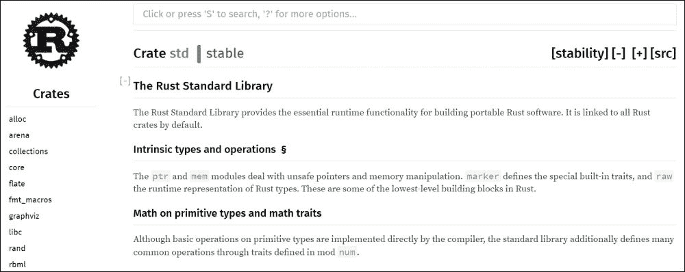
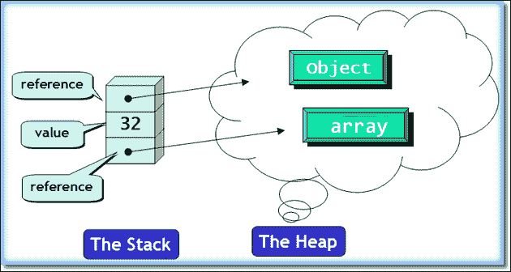
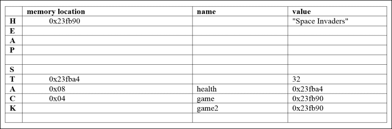

# 第二章：使用变量和类型

在本章中，我们探讨 Rust 程序的基本构建块：变量及其类型。我们讨论原始类型的变量，是否需要声明其类型，以及变量的作用域。不可变性是 Rust 安全策略的基石之一，也将被讨论并举例说明。

我们将涵盖以下主题：

+   注释

+   全局常量

+   值和原始类型

+   将变量绑定到值

+   变量的作用域和阴影

+   类型检查和转换

+   表达式

+   栈和堆

我们的代码示例将集中在构建一个名为“Monster Attack”的基于文本的游戏。

# 注释

理想情况下，一个程序应该通过使用描述性的变量名和易于阅读的代码来自我说明，但总有一些情况下需要关于程序结构或算法的额外注释。Rust 遵循 C 语言约定，并具有以下注释标记约定：

+   **行注释** (`//`): `//`之后行上的所有内容都是注释，不会被编译

+   **块或多行注释** (`/* */`): 从开始`/*`到结束`*/`之间的所有内容都不会被编译

然而，Rust 推荐的风格是即使对于多行，也只使用行注释，如下面的代码所示：

```rs
// see Chapter 2/code/comments.rs
fn main() {
 // Here starts the execution of the Game.
 // We begin with printing a welcome message:
  println!("Welcome to the Game!");
}
```

只使用块注释来注释掉代码。

Rust 还有一个有用的文档注释（`///`），适用于需要为客户和开发者提供官方文档的大型项目。这样的注释必须出现在单独一行上的项目（如函数）之前，以记录该项目。在这些注释中，你可以使用 Markdown 格式化语法；有关更多信息，请访问[`en.wikipedia.org/wiki/Markdown`](https://en.wikipedia.org/wiki/Markdown)。

这里是一个`doc`注释：

```rs
/// Start of the Game
fn main() {
}
```

我们将在后面的代码片段中看到更多关于文档注释的相关用法。`rustdoc`工具可以将这些注释编译成项目的文档。

# 全局常量

通常，一个应用程序需要一些实际上是不变的值；它们在程序执行过程中不会改变。例如：我们游戏的名字“Monster Attack”是一个常量，同样，最大生命值，即数字 100，也是一个常量。我们必须能够在`main()`或程序中的任何其他函数中使用它们，因此它们被放置在代码文件的最顶部。它们存在于程序的全球范围内。这样的常量使用`static`关键字声明，如下所示：

```rs
// see Chapter 2/code/constants1.rs
static MAX_HEALTH: i32 = 100;
static GAME_NAME: &'static str = "Monster Attack";

fn main() {
}
```

常量的名称必须全部大写，可以使用下划线来分隔单词。它们的类型也必须指明；`MAX_HEALTH`是一个 32 位整数（`i32`），而`GAME_NAME`是一个字符串（`str`）。正如我们进一步讨论的那样，变量的类型声明方式与这完全相同，尽管当编译器可以从代码上下文中推断类型时，这通常是可选的。

目前不必太担心 `'&static'` 指示。记住，Rust 是一种底层语言，所以许多事情必须详细指定。`&` 注解是对某个东西的引用（它包含值的内存地址）；在这里，它包含对字符串的引用。然而，如果我们只使用 `&str` 并编译，我们会得到该行的错误。看看下面的片段：

```rs
// warning: incorrect code!
static GAME_NAME: &str = "Monster Attack";
```

这将给出以下错误：

```rs
2:22 error: missing lifetime specifier [E0106]

```

这里，`2:22` 表示我们在第 2 行第 22 个位置有一个错误，因此我们必须在编辑器中设置行号。我们必须将 `'static` 生命周期指定符添加到类型注解中，以便得到 `&'static str`。在 Rust 中，对象的生存期非常重要，因为它说明了对象将在程序的内存中存活多久。Rust 编译器会在对象的生存期结束时添加代码来移除对象，释放它所占用的内存。`'static` 生命周期是最长可能的生存期；这样的对象在整个应用程序中保持存活，因此它对所有代码都是可用的。

即使添加了这个指定符，编译器也会给出“警告：静态项从未使用：`MAX_HEALTH`，默认开启 `#[warn(dead_code)]`”警告以及针对 `GAME_NAME` 的类似警告。

这些警告并不能阻止编译，因此在这个阶段，我们有一个可执行的程序。然而，编译器是对的。这些对象在程序的代码中从未被使用；所以，在一个完整的程序中，你应该要么使用它们，要么将它们丢弃。

### 小贴士

在一个有抱负的 Rust 开发者开始将 Rust 编译器视为他的或她的朋友，而不是一个不断吐出错误和警告的讨厌的机器之前，需要一段时间。只要你在编译器输出的末尾看到这条消息，“错误：由于之前的错误而中止”，就不会生成（新的）可执行文件。但请记住，纠正错误可以消除运行时问题，因此这可以节省你大量本可以浪费在追踪讨厌的虫子上的时间。通常，错误消息会附带有关如何消除错误的帮助性说明。甚至警告也可以指出你代码中的缺陷。Rust 还会在代码中声明但未使用某些内容时警告我们，例如未使用的变量、函数、导入的模块等。它甚至会在我们不应该改变变量值时警告我们，或者当代码没有执行时。编译器的工作如此出色，以至于当你达到所有错误和警告都已消除的阶段时，你的程序很可能运行正确！

除了静态值之外，我们还可以使用简单的常量值，其值永远不会改变。常量总是需要指定类型，例如，`const PI: f32 = 3.14;` 它们的范围比静态值更局部。

编译器会自动在代码的每个地方替换常量的值。

## 使用字符串插值打印

使用变量的一个明显方式是打印它们的值，就像我们在这里所做的那样：

```rs
// see Chapter 2/code/constants2.rs
static MAX_HEALTH: i32 = 100;
static GAME_NAME: &'static str = "Monster Attack";

fn main() {
 const PI: f32 = 3.14;
 println!("The Game you are playing is called {}.", GAME_NAME);
  println!("You start with {} health points.", MAX_HEALTH);
}
```

这将产生以下输出：

```rs
The Game you are playing is called Monster Attack.
You start with 100 health points.

```

常量 PI 存在于标准库中，要使用此值，请将以下语句插入顶部：`use std::f32::consts;` 然后如下使用 PI 值：`println!("{}", consts::PI);`

`println!` 的第一个参数是一个包含 `{}` 占位符的文本格式字符串。逗号后面的常量或变量的值被转换为字符串并替换 `{}`。可以有多个占位符，并且它们可以按顺序编号，以便可以重复使用，如下面的代码所示：

```rs
println!("In the Game {0} you start with {1} % health, yes you read it correctly: {1} points!", GAME_NAME, MAX_HEALTH);
```

输出如下：

```rs
In the Game Monster Attack you start with 100 % health, yes you read it correctly: 100 points!

```

占位符也可以包含一个或多个命名参数，如下所示：

```rs
    println!("You have {points} % health", points=70);
```

这将产生以下输出：

```rs
You have 70 % health

```

在冒号（`:`）之后的大括号（`{}`）内可以指示特殊的格式化方式，如下所示：

```rs
println!("MAX_HEALTH is {:x} in hexadecimal", MAX_HEALTH); // 64
println!("MAX_HEALTH is {:b} in binary", MAX_HEALTH);  // 1100100
println!("pi is {:e} in floating point notation", PI); // 3.14e0
```

根据必须打印的类型，存在以下格式化可能性：

+   `o` 表示八进制

+   `x` 表示小写十六进制

+   `X` 表示大写十六进制

+   `p` 表示指针

+   `b` 表示二进制

+   `e` 表示小数指数表示法

+   `E` 表示大写指数表示法

+   `?` 用于调试目的

`format!` 宏具有相同的参数，并且与 `println!` 以相同的方式工作，但它返回一个字符串而不是打印出来。

前往 [`doc.rust-lang.org/std/fmt/`](http://doc.rust-lang.org/std/fmt/) 了解所有可能性的概述。

# 值和原始类型

已经初始化的常量具有值。值存在于不同的类型中：`70` 是整数，`3.14` 是浮点数，而 `Z` 和 `q` 是 `char` 类型（它们是字符）。字符是占用每个 4 字节内存的 Unicode 值。`Godzilla` 是类型为 `&str`（默认为 Unicode UTF8）的字符串，`true` 和 `false` 是 `bool` 类型；它们是布尔值。整数可以以不同的格式书写：

+   以 `0x` 开头的十六进制格式（例如，`0x46` 表示 `70`）

+   以 `0o` 开头的八进制格式（例如，`0o106` 表示 `70`）

+   以 `0b` 开头的二进制格式（例如，`0b1000110`）

下划线可用于提高可读性，例如 `1_000_000`。有时，编译器会敦促你通过后缀更明确地指示数字的类型。例如，`u` 或 `i` 后的数字是使用的内存位数，即 `8`、`16`、`32` 或 `64`：

+   `10usize` 表示机器字大小的无符号整数 `usize`，可以是 `u8`、`u16`、`u32` 或 `u64` 中的任何一种类型

+   `10isize` 表示机器字大小的有符号整数 `isize`，可以是 `i8`、`i16`、`i32` 和 `i64` 中的任何一种类型

+   在前面的情况下，对于 64 位操作系统，`usize` 实际上是 `u64`，而 `isize` 等同于 `i64`。

+   `3.14f32` 表示 32 位浮点数

+   `3.14f64` 表示 64 位浮点数

如果没有给出后缀，则数字类型 `i32` 和 `f64` 是默认值，但在此情况下，为了区分它们，必须在 `f64` 值的末尾加上 `.0`，如下所示：`let e = 7.0;`。

仅当编译器指示它无法推断变量的类型时，才需要指定特定类型。

Rust 在值上存在的不同运算符及其优先级方面，与其他 C 语言类似（有关更多信息，请参阅[`doc.rust-lang.org/reference.html#binary-operator-expressions`](http://doc.rust-lang.org/reference.html#binary-operator-expressions)）。然而，请注意，Rust 没有自增（`++`）或自减（`--`）运算符。要比较两个值是否相等，请使用`==`，要测试它们是否不同，请使用`!=`。

甚至还有空值`()`，它的大小为零，是所谓的单元类型`()`的唯一值。这用于表示表达式或函数返回无值（没有值）时的返回值，例如仅向控制台打印的函数。`()`在其他语言中不是 null 值的等价物；`()`表示没有值，而 null 是一个值。

## 查阅 Rust 文档

要找到有关 Rust 主题的更详细信息，最快的方法是浏览标准库的文档屏幕[`doc.rust-lang.org/std/`](http://doc.rust-lang.org/std/)。在其左侧，您可以找到所有可用的 crate 列表，您可以浏览以获取更多详细信息。然而，最有用的功能是顶部的搜索框；您可以输入几个字母或一个单词来获取多个有用的参考。请看以下截图：



以下是一个练习：

+   尝试更改常量的值。这当然是不允许的。你会得到什么错误？请看`Chapter2/exercises/change_constant.rs`。

+   在文档中查找`println!`宏。

+   阅读关于`fmt`规范的说明，并编写一个程序，该程序将`3.2f32`值打印为`+003.20`。请参阅`Chapter2/exercises/formatting.rs`。

# 将变量绑定到值

将所有值存储在常量中不是一个选择。这样做不好，因为常量会随着程序的生命周期而存在，因此可以被更改，而我们通常希望更改值。在 Rust 中，我们可以通过使用`let`绑定来将值绑定到变量：

```rs
// see Chapter 2/code/bindings.rs
fn main() {
 let energy = 5; // value 5 is bound to variable energy
}
```

与许多其他语言（如 Python 或 Go）不同，这里需要分号（`;`）来结束语句。否则，编译器会抛出错误：期望的是`.`、`;`或运算符，但找到的是`}`。

我们还希望在程序的其他部分使用绑定时才创建绑定，但您不必担心，因为 Rust 编译器会警告我们：

```rs
values.rs:2:6: 2:7 warning: unused variable: `energy`, #[warn(unused_variables)] on by default

```

### 小贴士

为了原型设计的目的，您可以通过在变量名前加一个下划线`_`来抑制警告，例如`let _ energy = 5;`。通常，`_`用于我们不需要的变量。

注意，在前面的声明中，我们不需要指示类型；Rust 通过`let`绑定推断出`energy`的类型是整数。如果类型不明显，编译器会在代码上下文中搜索，以检查变量从哪里获得值或如何使用。

然而，使用如`let energy = 5u16;`这样的类型提示也是可以的；这样你通过指示`energy`的类型（在这种情况下是一个 2 字节的无符号整数）来帮助编译器。

我们可以通过在表达式中使用它来使用`energy`变量；例如，通过将其赋值给另一个变量或打印它：

```rs
let copy_energy = energy;
println!("Your energy is {}", energy););
```

这里有一些其他的声明：

```rs
let level_title = "Level 1";
let dead = false;
let magic_number = 3.14f32;
let empty = ();  // the value of the unit type ()
```

`magic_number`的值也可以写成`3.14_f32`；下划线`_`将数字与类型分开，以提高可读性。

声明可以替换相同变量的先前声明。例如，`let energy = "Abundant";`这样的语句现在会将`energy`绑定到字符串类型的值`Abundant`。旧的声明将不能再使用，并且其内存将被释放。

## 可变和不可变变量

假设我们通过吞下一个健康包获得提升，我们的能量值上升到 25。然而，如果我们写`energy = 25;`，我们会得到一个错误：`error: re-assignment of immutable variable `energy``。那么这里有什么问题？

好吧，Rust 在这里应用了程序员的智慧；很多错误都来自对变量进行的意外或错误更改，所以不要让代码更改值，除非你明确允许它！

### 注意

在 Rust 中，变量默认是**不可变的**，这与函数式语言非常相似。在纯函数式语言中，甚至不允许可变性。

如果你需要一个值在代码执行期间可以改变的变量，你必须通过`mut`显式地指出。看看下面的代码片段：

```rs
  let mut fuel = 34;
  fuel = 60;
```

仅通过声明变量为`let n;`也是不够的。如果我们这样做，我们会得到`error: unable to infer enough type information about `_`; type annotations required`。编译器需要一个值来推断其类型。

我们可以通过将值赋给`n`来给编译器提供这个信息，例如`n = -2;`，但正如消息所说，我们也可以如下指示其类型：

```rs
  let n: i32;
```

或者，你甚至可以使用以下方法：

```rs
let n: i32 = -2; // n is a binding of type i32 and value -2
```

类型（在这里是`i32`）跟在变量名后面一个冒号（`:`）之后（正如我们之前为全局常量所展示的），可选地后面跟着一个初始化。一般来说，类型是这样表示的`n: T`，其中`n`是变量，`T`是类型，它被读作变量`n`是类型`T`。所以，这与 C/C++、Java 或 C#中的做法相反，在那里人们会写`T n`。

对于原始类型，这可以通过后缀简单地完成，如下所示：

```rs
let x = 42u8;
let magic_number = 3.14f64;
```

尝试使用未初始化的变量会导致`error: use of possibly uninitialized variable`错误（试试看）。局部变量在使用之前必须初始化，以防止未定义的行为。

你可以尝试一个可变的全局常量。你必须做什么才能允许它？为什么会这样？（有关示例代码，请参阅 `mutable_constant.rs`。）

当编译器无法识别你代码中的名称时，你会得到一个 `unresolved name` 错误。这可能是仅仅是一个拼写错误，但它会在编译时而不是运行时被捕获！

# 变量的作用域和阴影

在 `bindings.rs` 中定义的所有变量都具有局部作用域，由函数的 `{ }` 分隔，这里恰好是 `main()` 函数，并且这适用于任何函数。在 `}` 结束后，它们的作用域结束，并且它们的内存分配被释放。

我们甚至可以在函数内部定义一个包含所有代码的代码块，以创建一个更有限的作用域，如下面的代码片段所示：

```rs
// see Chapter 2/code/scope.rs
fn main() {
  let outer = 42;
 { // start of code block
        let inner = 3.14;
        println!("block variable: {}", inner);
        let outer = 99; // shadows the first outer variable
        println!("block variable outer: {}", outer);
 } // end of code block
    println!("outer variable: {}", outer);
  }
```

这将产生以下输出：

```rs
block variable: 3.14
block variable outer: 99
outer variable: 42

```

在代码块（如 `inner`）中定义的变量仅在代码块内部已知。代码块中的变量也可以与封装作用域中的变量（如 `outer`）具有相同的名称，该名称在代码块结束时被替换（阴影）为代码块变量。当你尝试在代码块之后打印 `inner` 时会发生什么？试一试。

那么，为什么你想使用代码块呢？在 *表达式* 部分，我们将看到代码块可以返回一个值，该值可以用 `let` 绑定到一个变量上。代码块也可以为空（`{ }`）。

# 类型检查和转换

Rust 必须知道每个变量的类型，以便在编译时检查它们是否仅以允许的方式使用。这样程序就是类型安全的，并且可以避免一系列错误。

这也意味着由于静态类型，我们无法在变量的生命周期内更改其类型；例如，以下代码片段中的 `score` 变量不能从整数变为字符串：

```rs
// see Chapter 2/code/type_errors.rs
// warning: this code does not work!
fn main() {
  let score: i32 = 100;
  score = "YOU WON!"
}
```

我们得到编译器错误，`error: mismatched types: expected `int`, found `&'static str` (expected int, found &-ptr)`。

然而，我们可以编写以下代码：

```rs
let score = "YOU WON!";
```

Rust 允许我们重新定义变量；每个 `let` 绑定都会创建一个新的变量 `score`，它隐藏了之前的变量，之前的变量将从内存中释放。这实际上非常有用，因为变量默认是不可变的。

使用 `+` 运算符（如以下代码中的玩家）在 Rust 中未定义：

```rs
let player1 = "Rob";
let player2 = "Jane";
let player3 = player1 + player2;
```

然后，我们得到 `error: binary operation `+` cannot be applied to type `&str``。

在 Rust 中，你可以使用 `to_string()` 方法将值转换为 String 类型，如下所示：`let player3 = player1.to_string() + player2;`。

否则，你可以使用 `format!` 宏：

```rs
    let player3 = format!("{}{}", player1, player2);
```

在这两种情况下，`player3` 的值都是 `"RobJane"`。

让我们找出当你将一个变量的值赋给另一个不同类型的变量时会发生什么：

```rs
// see Chapter 2/code/type_conversions.rs
fn main() {
  let points = 10i32;
  let mut saved_points: u32 = 0;
  saved_points = points; // error !
}
```

这同样是不允许的；我们会得到相同的错误（`error: mismatched types: expected `u32`, found `i32` (expected u32, found i32)`）。为了启用最大化的类型检查，Rust 不允许像 C++ 那样自动（或隐式）地将一个类型转换为另一个类型；因此，它避免了大量难以发现的错误。例如，当 `f32` 值转换为 `i32` 值时，小数点后的数字会丢失；这可能导致自动转换时出现错误。

我们可以使用 `as` 关键字进行显式转换（类型转换）：

```rs
 saved_points = points as u32;

```

当点包含负值时，符号在转换后会丢失。同样，当从更宽的值（如浮点数）转换为整数时，小数部分会被截断：

```rs
  let f2 = 3.14;
  saved_points = f2 as u32; // truncation to value 3 occurs here
```

此外，值必须可以转换为新类型，因为字符串不能转换为整数，如下面的例子所示：

```rs
  let mag = "Gandalf";
  saved_points = mag as u32; // error: non-scalar cast:`&str`as`u32`
```

## 别名

有时给现有的类型起一个新名字，使其更具描述性或更短，是有用的。这可以通过 `type` 关键字来完成，如下面的例子中，我们需要一个特定的（但大小有限的）变量用于 `MagicPower`：

```rs
// see Chapter 2/code/alias.rs
type MagicPower = u16;

fn main() {
  let run: MagicPower= 7800;  
}
```

类型名称以大写字母开头，每个作为名称一部分的单词也是如此。当我们把值 `7800` 改为 `78000` 时会发生什么？编译器会通过以下警告来检测这一点，`warning: literal out of range for its type`。

# 表达式

Rust 是一种**表达式导向**的语言，这意味着大多数代码片段实际上都是表达式，也就是说，它们计算一个值并返回这个值（在这个意义上，值也是表达式）。然而，仅凭表达式本身并不能构成有意义的代码；它们必须被用在语句中。

以下 `let` 绑定是声明语句；它们不是表达式：

```rs
// see Chapter 2/code/expressions.rs
let a = 2;    // a binds to 2
let b = 5;    // b binds to 5
let n = a + b;   // n binds to 7
```

然而，`a + b` 是一个表达式，如果我们省略末尾的分号，那么得到的值（这里 `7`）就会被返回。这通常在函数需要返回其值时使用（参见下一章的例子）。以分号结束表达式，如 `a + b;`，会抑制表达式的值，从而丢弃返回值，使其成为一个返回单位值 `()` 的表达式语句。代码通常是一系列语句的序列，每个代码行一个，Rust 必须知道何时一个语句结束；这就是为什么几乎每一行 Rust 代码都以分号结束。

你认为赋值 `m = 42;` 是什么？这不是一个绑定，因为没有 `let`。这应该在之前的代码行上发生。这是一个返回单位值 `()` 的表达式。在 Rust 中不允许复合绑定，如 `let p = q = 3;`，它会返回 `error: unresolved name q` 错误。然而，你可以像这样链式使用 `let` 绑定：

```rs
  let mut n = 0;
  let mut m = 1;
  let t = m; m = n; n  = t;
  println!("{} {} {}", n, m, t); // which prints out 1 0 1
```

这里有一个练习给你。在以下代码片段之后打印出 a、b 和 n 的值，并解释 `a` 的值（例如代码，请参阅 `compound_let.rs`）：

```rs
    let mut a = 5;
    let mut b = 6;
    let n = 7;
    let a = b = n; 
```

代码块也是一个表达式，如果我们省略分号，它将返回其最后一个表达式的值。例如，在以下代码片段中，`n1` 获取值 `7`，但 `n2` 获取不到值（或者更确切地说，是单位值 `()`)，因为第二个代码块的返回值被抑制了：

```rs
let n1 = {
 let a = 2;
 let b = 5;
 a + b   // <-- no semicolon!
};
  println!("n1 is: {}", n1);  // prints: n1 is 7

  let n2 = {
    let a = 2;
    let b = 5;
    a + b;
  };
  println!("n2 is: {:?}", n2);  // prints: n2 is ()
```

在这里，变量 `a` 和 `b` 在代码块中声明，并且它们只存在于代码块的生命周期内，因为它们是局部的。注意，在代码块结束括号后面的分号（`;`）是必需的。要打印单位值 `()`，我们需要 `{`:?`}` 作为格式说明符。

# 栈和堆

由于内存分配在 Rust 中非常重要，我们必须对正在发生的事情有一个清晰的了解。程序内存被分为栈和堆内存部分；要了解更多关于这些概念的信息，请阅读经典网页上的信息 [`stackoverflow.com/questions/79923/what-and-where-are-the-stack-and-heap`](https://stackoverflow.com/questions/79923/what-and-where-are-the-stack-and-heap)。原始值，如数字（如图中的 32）、字符和真/假值存储在栈上，而更复杂且可能增长大小的对象的值存储在堆内存中。堆值通过栈上的变量引用，该变量包含堆上对象的内存地址：



虽然栈的大小有限，但堆的大小可以根据需要增长。

现在，我们将运行以下程序并尝试可视化程序的内存：

```rs
   // see Chapter 2/code/references.rs
  let health = 32;
  let mut game = "Space Invaders";
```

值存储在内存中，因此它们有内存地址。`health` 变量包含一个整数值 `32`，它存储在栈上的位置 `0x23fba4`，而 `game` 变量包含一个字符串，它存储在从位置 `0x23fb90` 开始的堆中。（这些是在我执行程序时的地址，但当你运行程序时它们将是不同的。）

绑定值的变量是指针或值的引用。它们指向它们；`game` 是 Space Invaders 的引用。值的地址由 `&` 操作符给出。因此，`&health` 是存储值 `32` 的地址，而 `&game` 是存储 Space Invaders 值的地址。

我们可以使用格式字符串 `{:p}` 来打印这些地址，如下所示：

```rs
println!("address of health-value: {:p}", &health); 
// prints 0x23fba4
println!("address of game-value: {:p}", &game); // prints 0x23fb90
println!("game-value: {}", game); // prints "Space Invaders"
```

现在，内存中的情况如下（每次执行时的内存地址将不同）：



我们可以创建一个别名，它是另一个指向内存相同位置的引用，如下所示：

```rs
let game2 = &game;
println!("{:p}", game2); // prints 0x23fb90
```

要获取所引用的值而不是 `game2` 引用本身，可以使用星号 `*` 操作符进行解引用，如下所示：

```rs
  println!("{}", *game2); // prints "Space Invaders"
```

`(println! is clever, so println!("{}", game2);` 这一行也会打印与 `println!("game: {}", &game);` 相同的值。

上述代码略有简化，因为 Rust 会分配值到栈上，其大小变化不会像可能的那样大，但这是为了更好地让你了解值引用的含义。

我们已经知道`let`绑定是不可变的，因此值不能被改变：

```rs
health = 33; // error: re-assignment of immutable variable `health`.
```

如果`y`被声明为`let y = &health;`，那么`*y`的值是`32`。引用变量也可以被赋予类型，如`let x: &i64;`，这样的引用可以在代码中传递。在此`let`绑定之后，`x`实际上还没有指向一个值，它不包含内存地址。在 Rust 中，没有创建空指针的方法，就像在其他语言中那样；如果你尝试将 nil、null 或单位值`()`分配给`x`，这将导致错误。仅此一项特性就使 Rust 程序员免于无数错误。此外，尝试在表达式中使用`x`，例如`println!("{:?}", x);`将导致“错误：使用可能未初始化的变量：`x`”错误。

不可变变量的可变引用是被禁止的；否则，不可变变量可以通过其可变引用被改变：

```rs
  let tricks = 10;
  let reftricks = &mut tricks; 
```

这会抛出“错误：不能将不可变局部变量`tricks`作为可变引用借用”的错误。

可变分数变量的引用可以是不可变的或可变的，例如以下示例中的`score2`和`score3`：

```rs
  let mut score = 0;
  let score2 = &score;
  // error: cannot assign to immutable borrowed content *score2
  // *score2 = 5; 

  let mut score = 0;
  let score3 = &mut score;
   *score3 = 5;
```

`score`的值只能通过可变引用，如`score3`来改变。

由于我们将在后面看到的原因，你只能对一个可变变量创建一个可变引用：

```rs
let score4 = &mut score;
```

这会抛出“错误：一次不能多次借用`score`作为可变引用”的错误。

在这里，我们触及了 Rust 内存安全系统的核心，其中借用变量是其关键概念之一。我们将在第六章，*指针和内存安全*中更详细地探讨这一点。

堆比栈大得多，因此，一旦不再需要内存位置，就很重要。Rust 编译器会在变量结束其生命周期（换句话说，超出作用域）时看到，并在编译时插入代码，在代码执行时释放其内存。这种行为是 Rust 独有的，在其他常用语言中不存在。栈值可以被装箱，即通过围绕它们创建`Box`来在堆上分配，就像以下代码中的`x`值一样：

```rs
let x = Box::new(5i32);
```

`Box`是一个引用堆上值的对象。我们还会在第六章的*盒子*部分更详细地探讨这一点，*指针和内存安全*。

# 摘要

在本章中，你学习了如何在 Rust 中使用变量，并熟悉了许多常见的编译器错误信息。我们探讨了类型和变量的默认不可变性，这是 Rust 安全行为的基础。在下一章中，我们将通过使用程序逻辑和函数来编写一些有用的代码。
