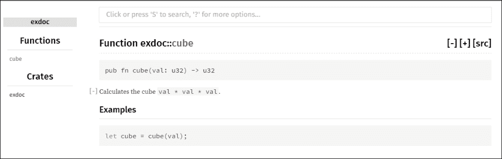
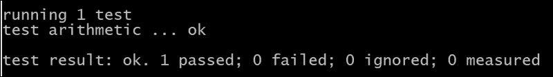
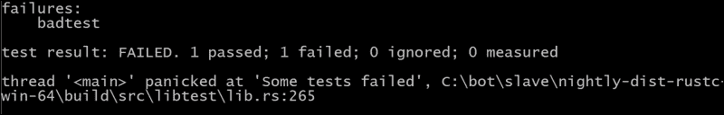

# 第三章。使用函数和控制结构

本章重点介绍我们如何通过函数控制代码的执行流程并模块化我们的代码。我们还将学习如何从控制台获取输入，以及如何记录和测试我们的代码。

我们将涵盖以下主题：

+   根据条件分支

+   循环

+   函数

+   属性

+   测试

# 根据条件分支

根据条件分支使用常见的`if`、`if-else`或`if-else if-else`结构，如本例所示：

```rs
// from Chapter 3/code/ifelse.rs
fn main() {
  let dead = false;
  let health = 48;
 if dead {
    println!("Game over!");
    return;
  }
 if dead {
    println!("Game over!");
    return;
 } else {
    println!("You still have a chance to win!");
  }
 if health >= 50 {
    println!("Continue to fight!");
 } else if health >= 20  {
    println!("Stop the battle and gain strength!");
 } else {
    println!("Hide and try to recover!");
  }
}
```

这将给出以下输出：

```rs
Stop the battle and gain strength!

```

`if`后面的条件必须是布尔值。然而，与 C 不同，条件不能被括号包围。在`if`、`else if`或`else`之后需要用`{ }`（大括号）包围的代码块。第一个例子显示我们可以通过`return`从函数中退出。

`if-else`的另一个特性，作为表达式，是它返回一个值。这个值可以用作`print!`语句中的函数调用参数，或者可以像这样分配给`let`绑定：

```rs
let active =
if health >= 50 {
     true
} else {
      false
};
println!("Am I active? {}", active);
```

输出如下：

```rs
Am I active? false

```

代码块可以包含多行。然而，当你返回一个值时，你需要小心，确保在`if`或`else`块中的最后一个表达式之后省略`;`（分号）。（有关更多信息，请参阅第二章的*表达式*部分，*使用变量和类型*）。此外，所有分支必须始终返回相同类型的值。这减少了在 C++中需要的三元运算符（? :)的需求；你可以简单地像这样使用`if`：

```rs
let adult = true;
let age = if adult { "+18" } else { "-18" };
println!("Age is {}", age);  // Age is +18
```

作为练习，尝试以下操作：

1.  尝试在`+18`和`-18`之后添加一个`;`（分号），如下所示`{"+18";}`，并找出`age`将打印的值。如果你将`age`的类型注释为`&str`会发生什么？

1.  看看你是否可以省略块中的`{ }`（大括号），如果块中只有一个语句的话。

1.  此外，验证以下代码是否正确：

    ```rs
    let result = if health <=0 { "Game over man!" };
    ```

    如果需要，你将如何纠正这个语句？（参考`第三章/练习/iftest.rs`中的代码。）

1.  简化以下函数：

    ```rs
    fn verbose(x: i32) -> &'static str {
      let mut result: &'static str;
      if x < 10 {
        result = "less than 10";
      } else {
        result = "10 or more";
      }
      return result;
    }
    ```

    （参见`第三章\练习\ifreturn.rs`中的代码。）

模式匹配，我们将在下一章中探讨，它也会分支代码，但它基于变量的值来这样做。

# 循环

对于重复的代码片段，Rust 有常见的`while`循环，条件周围没有括号：

```rs
// from Chapter 3/code/loops.rs
fn main() {
  let max_power = 10;
  let mut power = 1;
 while power < max_power {
        print!("{} ", power); // prints without newline
        power += 1;           // increment counter
  }
}
```

这将打印以下输出：

```rs
1 2 3 4 5 6 7 8 9

```

要启动无限循环，使用`loop`，它是`while true`的语法糖：

```rs
loop {
  power += 1;
  if power == 42 {
    // Skip the rest of this iteration
 continue;
  }
  print!("{}  ", power);
  if power == 50 {
    print!("OK, that's enough for today");
 break;  // exit the loop
  }
}
```

在这里，打印了包括`50`在内的所有功率值；然后循环通过`break`语句停止。然而，由于`continue`语句，功率值`42`没有被打印。因此，循环相当于一个无限循环，并且带有条件`break`的循环在其他语言中模拟了`do while`。

当循环嵌套在彼此内部时，break 和 continue 只应用于最近的包围循环。任何`loop`语句（也包括我们接下来将要看到的`while`和`for`）都可以有一个标签（表示为`'label:'`）作为前缀，这样我们就可以跳转到下一个或外部的包围循环，如这个代码片段所示：

```rs
  'outer: loop {
        println!("Entered the outer dungeon - ");
        'inner: loop {
            println!("Entered the inner dungeon - ");
            // break;    // this would break out of the inner loop
            break 'outer; // breaks to the outer loop
        }
      println!("This treasure can sadly never be reached - ");
  }
  println!("Exited the outer dungeon!");
```

代码打印以下输出：

```rs
Entered the outer dungeon – 
Entered the inner dungeon - 
Exited the outer dungeon!

```

C 语言中臭名昭著的`goto`在 Rust 中不存在！

通过`for`语句在范围表达式`for var in a..b`中对一个变量从起始值`a`到结束值`b`（不包括`b`）进行循环，可以完成从起始值`a`到结束值`b`的循环。以下是一个打印从 1 到 10 的数字平方的例子：

```rs
for n in 1..11 { 
      println!("The square of {} is {}", n, n * n);
}
```

通常，`for in`循环遍历一个迭代器，迭代器是一个返回一系列值的对象。范围`a..b`是迭代器的最简单形式。每个后续值都绑定到`n`并在下一个循环迭代中使用。当没有更多值时，`for`循环结束，`n`然后超出作用域。如果我们不需要在循环中使用`n`的值，我们可以用下划线`_`（一个下划线）来替换它：`for _ in 1..11 { }`。C 风格`for`循环中的许多错误，如计数器的偏移量错误，在这里不会发生，因为我们是在迭代器上循环。

变量也可以用在范围中，如下面的代码片段所示，它打印出九个点：

```rs
let mut x = 10;
for _ in 1 .. x { x -= 1; print!("."); }
```

我们将在第五章，*使用高阶函数和参数化泛化代码*中更详细地研究迭代器。

# 函数

每个 Rust 程序的起点是一个名为`main()`的`fn`函数，这个函数可以进一步细分为单独的函数以重用代码或更好地组织代码。Rust 不关心这些函数定义的顺序，但将`main()`放在代码的开头以获得更好的概览是个不错的选择。Rust 已经融合了许多传统函数式语言的特征；我们将在第五章，*使用高阶函数和参数化泛化代码*中看到这方面的例子。

让我们从基本函数的一个例子开始：

```rs
// from Chapter 3/code/functions.rs
fn main() {
  let hero1 = "Pac Man";
  let hero2 = "Riddick";
 greet(hero2);
 greet_both(hero1, hero2);
}

fn greet(name: &str) {
 println!("Hi mighty {}, what brings you here?", name);
}

fn greet_both(name1: &str, name2: &str) {
  greet(name1);
  greet(name2);
}
```

输出如下：

```rs
Hi mighty Riddick, what brings you here?
Hi mighty Pac Man, what brings you here?
Hi mighty Riddick, what brings you here?

```

与变量一样，函数也有`snake_case`命名规则，这些名称必须是唯一的，它们的参数（必须指定类型）由逗号分隔。在这个代码片段中，示例是`name1: &str`和`name2: &str`（看起来像是一个绑定，但没有`let`）。

对参数强制类型是一个优秀的设计决策：这为调用者代码记录了函数的使用，并允许在函数内部进行类型推断。这里的类型是`&str`，因为字符串存储在堆上（参见第二章，*使用变量和类型*中的*栈和堆*部分）。

上述代码中的函数没有返回任何有用的东西（实际上，它们返回了单元值 `()`），但如果我们想让函数真正返回一个值，其类型必须在箭头 `->` 后指定，就像这个例子所示：

```rs
fn increment_power(power: i32) -> i32 {
 println!("My power is going to increase:");
 power + 1
}

fn main() {
 let power = increment_power(1); // function is called
  println!("My power level is now: {}", power);}
}
```

当执行时，会打印以下内容：

```rs
My power is going to increase:
I am now at power level: 2

```

函数的返回值是它的最后一个表达式的值。请注意，为了返回一个值，最后的表达式不能以分号结束。当你以分号结束时会发生什么？试一试。在这种情况下，将返回单元值 `()`，编译器会给出错误，**not all control paths return a value error**。

我们本可以写成 return power + 1; 作为最后一行，但这不是惯用的代码。如果我们想在最后一行代码之前从函数返回一个值，我们必须写 return value;，就像这里所示：

```rs
if power < 100 { return 999; }
```

如果这是函数中的最后一行，你会这样写：

```rs
if power < 100 { 999 }
```

一个函数只能返回一个值，但这并不是一个限制。如果我们有，例如，三个值 `a`、`b` 和 `c` 要返回，可以用它们创建一个元组 `(a, b, c)` 并返回这个元组。我们将在下一章更详细地研究元组。在 Rust 中，你还可以在另一个函数内部编写函数（称为嵌套函数），这与 C 或 Java 不同。然而，这应该只用于需要局部使用的辅助函数。

以下是一个练习题：

以下返回给定数字 x 的绝对值的函数有什么问题？

```rs
fn abs(x: i32) -> i32 {
  if x > 0 {
    x
  } else {
    -x
  }
}
```

你需要纠正并测试它。（参见 `Chapter 3/exercises/absolute.rs` 中的代码。）

## Documenting a function

让我们给你展示一个文档的例子。在 `exdoc.rs` 中，我们这样注释了一个 `cube` 函数：

```rs
fn main() {
  println!("The cube of 4 is {}", cube(4));
}
/// Calculates the cube `val * val * val`.
///
/// # Examples
///
/// ```

/// let cube = cube(val);

/// ```rs
pub fn cube(val: u32) -> u32 {
    val * val * val
}
```

如果现在我们在命令行上调用 `rustdoc exdoc.rs`，将会创建一个 `doc` 文件夹。这个文件夹包含一个 `exdoc` 子文件夹，其中包含 `index.html` 文件，它是提供每个函数文档页面的网站的起点。例如，`fn.cube.html` 显示以下内容：



通过点击 **exdoc** 链接，你可以返回到索引页。对于一个使用 cargo 包管理器创建的项目，运行 `cargo doc` 命令以获取其文档。

文档注释是用 Markdown 编写的。它们可以包含以下特殊部分，前面带有 `#`：示例、恐慌、失败和安全。代码位于 ```rs` ``` ```rs`. For a function to be documented, it must be prefixed with `pub` so that it belongs to the public interface (see Chapter 7, *Organizing Code and Macros*). For more information on this, go to [`doc.rust-lang.org/book/documentation.html`](http://doc.rust-lang.org/book/documentation.html).

# Attributes

You may have already seen examples of warnings within `#[ … ]` signs, such as `#[warn(unused_variables)]`, in compiler output. These are **attributes** that represent **metadata** information about the code and are placed right before an item (such as a function) about which they have something to say. They can, for example, disable certain classes of warnings, turn on certain compiler features, or mark functions as being part of unit-tests or benchmark code.

## Conditional compilation

If you want to make a function that only works on a specific operating system then annotate it with the `#[cfg(target_os = "xyz")]` attribute (where `xyz` can be either `windows`, `macos`, `linux`, `android`, `freebsd`, `dragonfly`, `bitrig`, or `openbsd`). For example, the following code works fine and runs on Windows:

``` 之间

// from Chapter 3/code/attributes_cfg.rs

fn main() {

on_windows();

}

#[cfg(target_os = "windows")]

fn on_windows() {

    println!("This machine has Windows as its OS.")

}

```rs

This produces the output, **This machine has Windows as its OS**. If we try to build this code on a Linux machine, we get the **error: unresolved name `on_windows`** error, as the code does not build on Linux because the attribute prevents it from doing so!

Furthermore, you can even make your own custom conditions; go to [`rustbyexample.com/attribute/cfg/custom.html`](http://rustbyexample.com/attribute/cfg/custom.html) for more information on this.

Attributes are also used when testing and benchmarking code.

# Testing

We can prefix a function with the `#[test]` attribute to indicate that it is part of the unit tests for our application or library. We can then compile with `rustc --test program.rs`. This will replace the `main()` function with a test runner and show the result from the functions marked with `#[test]`. Have a look at the following code snippet:

```

// from Chapter 3/code/attributes_testing.rs

fn main() {

println!("No tests are compiled,compile with rustc --test! ");

}

#[test]

fn arithmetic() {

if 2 + 3 == 5 {

    println!("You can calculate!");

}

}

```rs

Test functions, such as `arithmetic()` in the example, are black boxes; they have no arguments or returns. When this program is run on the command line, it produces the following output:



However, even if we change the test to `if 2 + 3 == 6`, the test passes! Try it out. It turns out that test functions always pass when their execution does not cause a crash (called a panic in Rust terminology), and it fails when it does panic. This is why testing (or debugging) uses the `assert_eq!` macro (or other similar macros):

```

assert_eq!(2, power);

```rs

This statement tests whether `power` has the value 2\. If it does, nothing happens, but if `power` is different from 2, an exception occurs and the program panics with, **thread '<main>' panicked at 'assertion failed**.

In our first function, we will write the `assert_eq!(5, 2 + 3);` test that will pass. We can also write this as `assert!(2 + 3 == 5);` by using the `assert!` macro.

A test fails when the function panics, as is the case with the following example:

```

#[test]

fn badtest() {

assert_eq!(6, 2 + 3);

}

```rs

This produces the following output:



Unit test your functions by comparing the actual function result to the expected result with an `assert_eq!(actual, expected)` macro call. In a real project, the tests will be collected in a separate tests module. (Have a look at Chapter 7, *Organizing Code and Macros*, for more information.)

## Testing with cargo

An executable project, or a crate as it is called in Rust, needs to have a `main()` startup function, but a library crate, to be used in other crates, does not need a `main()` function. Create a new `mylib` library crate with cargo as `cargo new mylib`.

This creates a `src` subfolder with a `lib.rs` source file that contains the following code:

```

#[test]

fn it_works() {

}

```

因此，一个库 crate 被创建出来，它本身没有自己的代码，但它包含一个测试模板，可以用来增强你为库中的函数编写的单元测试。然后你可以使用`cargo test`来运行这些测试，它将产生类似于上一节中产生的输出。`cargo test`命令在可能的情况下会并行运行测试。

# 摘要

在本章中，你学习了如何通过使用`if`条件语句、`while`和`for`循环以及函数来结构化我们的代码，从而制作基本的程序。我们还能够接受程序输入。最后，我们看到了属性赋予 Rust 扩展其可能性的巨大力量，并在条件编译和测试中应用了这一点。

在下一章中，我们将开始使用复合值并探索模式匹配的力量。
