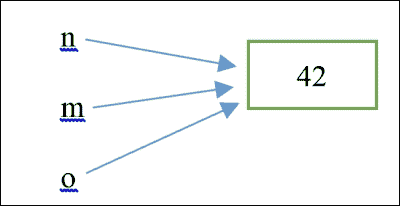

# 第六章。指针和内存安全

这可能是本书最重要的章节。在这里，我们详细描述了 Rust 借用检查器机制如何以独特的方式在编译时检测问题，以防止内存安全错误。这对于 Rust 中的其他一切是基本的，因为该语言专注于这些所有权和借用概念。一些材料已经在前面讨论过，但在这里，我们将加强这个基础。我们将涵盖以下主题：

+   指针和引用

+   所有权和借用

+   框架

+   引用计数

尝试和实验示例是关键，因为可能有许多你还不熟悉的概念。

# 指针和引用

第二章的*堆栈和堆*部分，*使用变量和类型*为我们提供了理解 Rust 内存布局所需的基本信息。让我们回顾一下这些信息，并填补一些空白。

## 堆栈和堆

当程序启动时，默认情况下会授予它一个 2MB 的内存块，称为堆栈。程序将使用其堆栈来存储所有其局部变量和函数参数；例如，一个`i32`变量占用堆栈的 4 个字节。当我们的程序调用一个函数时，会为其分配一个新的堆栈帧。通过这种机制，堆栈知道函数调用的顺序，以便函数能够正确地返回调用代码，并可能返回值。

动态大小的类型，如字符串或数组，不能存储在堆栈上。对于这些值，程序可以在其堆上请求内存空间，因此这比堆栈大得多。

### 小贴士

当可能时，堆栈分配比堆分配更受欢迎，因为访问堆栈要高效得多。

### 生命周期

Rust 代码中的所有变量都有生命周期。假设我们使用`let n = 42u32;`绑定声明一个`n`变量。这样的值从声明的地方开始有效，直到它不再被引用，这被称为变量的生命周期。以下代码片段说明了这一点：

```rs
// see code in Chapter 6/code/lifetimes.rs	
fn main() {
let n = 42u32;
let n2 = n; // a copy of the value from n to n2
life(n);
println!("{}", m);  // error: unresolved name `m`.
println!("{}", o);  // error: unresolved name `o`.
}

fn life(m: u32) -> u32 {
    let o = m;
    o
}
```

`n`的生命周期在`main()`结束时结束；一般来说，生命周期的开始和结束发生在相同的范围内。生命周期和范围是同义词，但我们通常使用“生命周期”一词来指代引用的范围。与其他语言一样，在函数中声明的局部变量或参数在函数执行完毕后不再存在；在 Rust 中，我们说它们的生命周期已经结束。这是前面代码片段中`m`和`o`变量的情况，它们只在`life`函数中是已知的。

同样，嵌套块中声明的变量的生命周期被限制在该块内，就像以下示例中的`phi`一样：

```rs
{
    let phi = 1.618;
}
println!("The value of phi is {}", phi); // is error
```

当`phi`的生命周期结束时尝试使用它会导致错误：`未解析的名称 'phi'`。

代码中可以通过注解来指示值的生命周期，例如`'a`，它读作生命周期，其中`a`只是一个指示符；它也可以写成`'b`、`'n`或`'life`。用单个字母表示生命周期是很常见的。在先前的示例中，由于没有涉及引用，因此不需要显式地指示生命周期。所有标记有相同生命周期的值都具有相同的最大生命周期。我们已经从`'static`这个符号中了解到这一点，正如我们在第二章的*全局常量*部分所看到的，*使用变量和类型*，它是整个程序持续存在的对象的生存周期，因此只有在你需要这么长时间值的时候才使用`'static`。

在以下示例中，我们有一个显式声明其`s`参数生命周期为`'a`的`transform`函数：

```rs
fn transform<'a>(s: &'a str) { /* ... */ }

```

注意函数名称后面的`<'a>`指示。在几乎所有情况下，这种显式指示都是不必要的，因为编译器足够智能，可以推断出生命周期，因此我们可以简单地写成这样：

```rs
fn transform_without_lifetime(s: &str) { /* ... */ }
```

这里有一个例子，即使我们指示了生命周期指定符`'a`，编译器也不允许我们的代码。让我们假设我们定义了一个`Magician`结构体如下：

```rs
struct Magician {
  name: &'static str,
  power: u32
}
```

如果我们尝试构造以下函数，我们将得到一个错误信息：

```rs
fn return_magician<'a>() -> &'a Magician {
  let mag = Magician { name: "Gandalf", power: 4625};
  &mag 
}
```

错误信息是错误：`'mag'的生命周期不足以长`。为什么会这样？`mag`值的生命周期在`return_magician`函数结束时结束，但这个函数仍然试图返回一个指向`Magician`值的引用，而这个值已经不存在了。这种无效的引用被称为*悬垂指针*。这是一个明显会导致错误的情况，不允许发生。

指针的生存期必须始终短于或等于它所指向的值的生存期，从而避免悬垂（或空）引用。

在某些情况下，确定一个对象的生命周期何时结束的决策可能很复杂，但在几乎所有情况下，借用检查器都会通过在中间代码中插入生命周期注解自动为我们完成这项工作；因此，我们不必这样做。这被称为*生命周期省略*。

例如，当与结构体一起工作时，我们可以安全地假设结构体实例及其字段具有相同的生命周期。只有在借用检查器不确定的情况下，我们才需要显式地指示生命周期；然而，这种情况很少发生，通常发生在返回引用时。

一个例子是我们有一个具有引用字段的`struct`。以下代码片段解释了这一点：

```rs
struct MagicNumbers {
  magn1: &u32,
  magn2: &u32
}
```

这将无法编译，并给出以下错误：`缺少生命周期指定符 [E0106]`。

因此，我们必须按照以下方式更改代码：

```rs
struct MagicNumbers<'a> {
  magn1: &'a u32,
  magn2: &'a u32
}
```

这指定了结构和字段都具有`'a`的生命周期。

执行以下练习：

解释为什么以下代码无法编译：

```rs
// see code in Chapter 6/exercises/dangling_pointer.rs:
fn main() {
    let m: &u32 = { 
        let n = &5u32; 
        &*n
    }; 
    let o = *m;
}
```

对于这个代码片段也要回答相同的问题：

```rs
let mut x = &3;
{
  let mut y = 4;
  x = &y; 
}
```

### 复制值和 `Copy` 特性

在我们之前讨论的代码中（见 `Chapter 6/code/lifetimes.rs`），每次通过新的 `let` 绑定或作为函数参数赋值给 `n` 时，`n` 的值都会被复制到一个新的位置：

```rs
let n = 42u32;
// no move, only a copy of the value:
let n2 = n;
life(n);
fn life(m: u32) -> u32 {
    let o = m;
    o
}
```

在程序执行过程中的某个时刻，我们会拥有四个包含复制值 `42` 的内存位置，我们可以这样可视化：


每个值在它对应的变量的生命周期结束时消失（并且其内存位置被释放），这发生在定义它的函数或代码块的末尾。这种 *Copy* 行为（其中值（其位）被简单地复制到栈上的另一个位置）不会出现太多错误。许多内置类型，如 `u32` 和 `i64`，与此类似，这种复制值的行为在 Rust 中定义为 `Copy` 特性，而 `u32` 和 `i64` 实现了该特性。

如果你的类型的所有字段或项目都实现了 `Copy`，你也可以为你的类型实现 `Copy` 特性。例如，包含 `u64` 类型字段的 `MagicNumber` 结构体可以具有相同的行为。有两种方式来表示这一点：

+   一种方法是将 `Copy` 实现显式命名为以下内容：

    ```rs
    struct MagicNumber {
        value: u64
    }
    impl Copy for MagicNumber {}
    ```

+   否则，我们可以用 `Copy` 属性来注释它：

    ```rs
    #[derive(Copy)]
    struct MagicNumber {
        value: u64
    }
    ```

这意味着我们可以通过赋值创建两个不同的 `MagicNumber` 的副本，`mag` 和 `mag2`：

```rs
let mag = MagicNumber {value: 42};
let mag2 = mag;
```

它们是复制的，因为它们有不同的内存地址（显示的值将在每次执行时不同）：

```rs
println!("{:?}", &mag as *const MagicNumber); // address is 0x23fa88
println!("{:?}", &mag2 as *const MagicNumber); // address is 0x23fa80
```

`(*const` 函数是一个所谓的原始指针；有关更多详细信息，请参阅 第九章，*在边界编程*。没有实现 `Copy` 特性的类型被称为不可复制的。

实现这一点的另一种方法是让 `MagicNumber` 实现了 `Clone` 特性：

```rs
#[derive(Clone)]
struct MagicNumber {
    value: u64
}
```

然后，我们可以使用 `clone()` 将 `mag` 复制到另一个名为 `mag3` 的不同对象中，从而有效地创建一个副本如下：

```rs
let mag3 = mag.clone();
println!("{:?}", &mag3 as *const MagicNumber); // address is 0x23fa78
```

`mag3` 是一个新指针，它引用了 `mag` 值的新副本。

### 指针

在 `let n = 42i32;` 绑定中的 `n` 变量存储在栈上。栈或堆上的值可以通过指针访问。指针是一个包含某个值内存地址的变量。要访问它指向的值，需要使用 `*` 解引用指针。这在简单的案例中是自动发生的，例如在 `println!` 或将指针作为方法参数时。例如，在以下代码中，`m` 是一个包含 `n` 地址的指针：

```rs
// see code in Chapter 6/code/references.rs:
let m = &n;
println!("The address of n is {:p}", m);
println!("The value of n is {}", *m);
println!("The value of n is {}", m);
```

这会打印出以下输出，每次程序运行的结果都不同：

```rs
The address of n is 0x23fb34 
The value of n is 42
The value of n is 42
```

那么，为什么我们需要指针呢？当我们处理可以改变大小的动态分配值，例如`String`时，该值的内存地址在编译时是未知的。因此，内存地址需要在运行时计算。因此，为了能够跟踪它，我们需要一个指针，其值将在`String`在内存中的位置改变时发生变化。

编译器会自动处理指针的内存分配和在其生命周期结束时释放内存。你不需要像在 C/C++中那样自己来做这件事，在那里你可能会在错误的时间或多次释放内存。

在 C++等语言中，指针的不正确使用会导致各种问题。

然而，Rust 在编译时强制实施一套称为借用检查器的严格规则，因此我们得到了保护。我们已经在实际操作中看到了它们，但从现在开始，我们将解释其规则背后的逻辑。

指针也可以作为函数的参数传递，并且可以从函数中返回，但编译器对其使用有严格的限制。

当将指针值传递给函数时，始终最好使用引用-解引用`&*`机制，如下例所示：

```rs
  let q = &42;
  println!("{}", square(q)); // 1764
fn square(k: &i32) -> i32 {
    *k * *k
}
```

Rust 有许多种指针，我们将在本章中探讨。所有指针（除了在第九章（part0069.xhtml#aid-21PMQ1 "第九章。边界编程"）中讨论的原始指针外，*边界编程*）都保证为非空（即它们指向内存中的有效位置）并且会自动清理。

### 引用

在我们之前的例子中，具有`&n`值的`m`是最简单的指针形式，它被称为引用（或借用指针）；`m`是栈分配的`n`变量的引用，并且具有`&i32`类型，因为它指向`i32`类型的值。

### 注意

通常，当`n`是`T`类型的值时，则`&n`引用是`&T`类型。

在这里，`n`是不可变的，所以`m`也是不可变的；例如，如果你尝试通过`m`使用`*m = 7;`来改变`n`的值，你会得到一个`cannot assign to immutable borrowed content '*m'`错误。与 C 不同，Rust 不允许你通过指针改变不可变变量。

由于通过引用改变`n`的值没有危险，因此允许对不可变值有多个引用；它们只能用来读取值，例如：

```rs
let o = &n;
println!("The address of n is {:p}", o);
println!("The value of n is {}", *o); 
```

它会按照前面描述的方式打印出来：

```rs
The address of n is 0x23fb34
The value of n is 42
```

我们可以将这种情况在内存中表示如下：



很明显，与这种或更复杂的情况一起工作需要比 `Copy` 行为更严格的规则。例如，只有当没有变量或指针与它关联时，才能释放内存。当值是可变的，是否可以通过其任何指针来更改它？这些更严格的规则，由下一节讨论的所有权和借用系统描述，由编译器强制执行。

可变引用确实存在，并且它们声明为 `let m = &mut n`。然而，`n` 也必须是可变值。当 `n` 是不可变的，编译器会因错误 `cannot borrow immutable local variable 'n' as mutable` 而拒绝 `m` 可变引用绑定。这很有道理，因为即使你知道它们的内存位置，不可变变量也不能更改。

再次强调，为了通过引用更改值，变量及其引用都必须是可变的，如下面的代码片段所示：

```rs
 let mut u = 3.14f64;
 let v = &mut u;
  *v = 3.15;
  println!("The value of u is now {}", *v);
```

这将打印：`u 的值现在是 3.15`。

现在，变量 `u` 的内存位置中的值已更改为 `3.15`。

然而，请注意，我们现在不能再通过使用 `u: u = u * 2.0;` 变量来更改（甚至打印）该值，因为编译器会报错：`cannot assign to 'u' because it is borrowed`（我们将在本章的 *所有权和借用* 部分解释原因）。我们说通过引用变量（通过对其创建引用）会冻结该变量；原始的 `u` 变量被冻结（并且不再可用），直到引用超出作用域。

此外，我们只能有一个可变引用：`let w = &mut u;` 这会导致错误：`cannot borrow 'u' as mutable more than once at a time`。编译器甚至会在之前的代码行上添加以下注释：`let v = &mut u;` 注释：`previous borrow of 'u' occurs here; the mutable borrow prevents subsequent moves, borrows, or modification of 'u' until the borrow ends`。这是合乎逻辑的；编译器（正确地）担心通过一个引用对 `u` 值的更改可能会改变它的内存位置，因为 `u` 可能会改变大小，所以它不再适合其之前的位置，并必须重新定位到另一个地址。这将使所有其他对 `u` 的引用都无效，甚至危险，因为通过它们我们可能会无意中更改另一个变量，该变量已经占据了 `u` 之前的位置！

可变值也可以通过将它的地址作为可变引用传递给函数来更改，如下面的示例所示：

```rs
let mut m = 7;
add_three_to_magic(&mut m);
println!("{}", m);  // prints out 10
```

函数 `add_three_to_magic` 声明如下：

```rs
fn add_three_to_magic(num: &mut i32) {
    *num += 3;  // value is changed in place through +=
}
```

### 注意

总结来说，当 `n` 是 `T` 类型的可变值时，任何时候只能存在一个对该值的可变引用（`&mut T` 类型）。通过这个引用，可以更改值。

### 在匹配中使用 ref

如果你想在 `match` 函数内部获取匹配变量的引用，请使用 `ref` 关键字，如下面的示例所示：

```rs
// see code in Chapter 6/code/ref.rs	
fn main() {
  let n = 42;
  match n {
 ref r => println!("Got a reference to {}", r),
  }
  let mut m = 42;
  match m {
 ref mut mr => {
        println!("Got a mutable reference to {}", mr);
        *mr = 43;
      },
  }
  println!("m has changed to {}!", m);
}
```

它将打印出：

```rs
Got a reference to 42
Got a mutable reference to 42
m has changed to 43!
```

`match`内部的`r`变量具有`&i32`类型。换句话说，`ref`关键字创建了一个用于模式的引用。如果你需要一个可变引用，请使用`ref mut`。

我们还可以使用`ref`通过`let`绑定在解构中获取结构体或元组的字段的引用。例如，在重用`Magician`结构体时，我们可以通过使用`ref`提取`mag`的名字，然后从`match`中返回它：

```rs
let mag = Magician { name: "Gandalf", power: 4625};
let name = {
    let Magician { name: ref ref_to_name, power: _ } = mag;
    *ref_to_name
};
println!("The magician's name is {}", name);
```

打印结果为：`The magician's name is Gandalf`.

引用是最常见的指针类型，并且具有最多的可能性；其他指针类型应该只应用于非常特定的用例。

# 所有权和借用

在前面的章节中，大多数错误信息中提到了“借用”。这究竟是怎么回事？这个借用检查机制背后的逻辑是什么？

每个程序，无论它做什么，无论是从数据库读取数据还是进行计算，都涉及到处理资源。程序中最常见的资源是分配给其变量的内存空间。其他资源可能是文件、网络连接、数据库连接等等。当我们用`let`绑定一个资源时，每个资源都会被赋予一个名称；在 Rust 语言中，我们说资源获得了一个所有者，例如，在以下代码片段中，`klaatu`拥有由`Alien`结构体实例占据的一块内存：

```rs
// see code in Chapter 6/code/ownership1.rs
struct Alien {
  planet: String,
  n_tentacles: u32
}

fn main() {
  let mut klaatu = Alien{ planet: "Venus".to_string(),
  n_tentacles: 15 };
}
```

只有所有者才能更改它所指向的对象，并且一次只能有一个所有者，因为所有者负责释放对象的资源。当一个引用超出作用域时，它不会释放底层内存，因为引用不是值的所有者。这很有道理；如果一个对象可以有多个所有者，它的资源可能会被多次释放，这会导致问题。当所有者的生命周期结束时，编译器会自动释放内存。

所有者可以将对象的拥有权移动到另一个变量，如下所示：

```rs
let kl2 = klaatu;
```

在这里，所有权已从`klaatu`移动到`kl2`，但实际上没有数据被复制。原始所有者`klaatu`不能再使用了：

```rs
println!("{}", klaatu.planet); 
```

它会给出编译器错误：`use of moved value 'klaatu.planet'`。

另一方面，我们可以通过创建一个（在这个例子中是可变的）引用`kl2`到`klaatu`来借用资源，使用`let kl2 = &mut klaatu;`。借用是一个通过`&`传递数据结构地址的临时引用。

现在，`kl2`可以更改对象，例如，当我们的外星人在战斗中失去一个触手时：

```rs
  kl2.n_tentacles = 14;
  println!("{} - {}", kl2.planet, kl2.n_tentacles);
```

这会打印出：`Venus – 14`。

然而，如果我们尝试通过以下代码更改外星人的星球，将会得到一个错误信息：

```rs
  klaatu.planet = "Pluto".to_string();
```

错误信息是`error:` ``cannot assign to `klaatu.planet` because it is borrowed;``它确实被`kl2`借用了。类似于日常生活，当一个对象被借用时，所有者无法访问它，因为它不再在他们手中。为了更改资源，`klaatu`需要拥有它，同时资源没有被同时借用。

Rust 甚至通过添加注释来向我们解释这一点：`borrow of 'klaatu.planet' occurs here ownership.rs:8 let kl2 = &mut klaatu;`。

由于`kl2`借用了资源，Rust 甚至禁止我们使用其旧名称`klaatu`来访问实例：

```rs
  println!("{} - {}", klaatu.planet, klaatu.n_tentacles);
```

然后，编译器会抛出这个错误信息：`error: cannot borrow 'klaatu.planet' as immutable because 'klaatu' is also borrowed as mutable`。

当一个资源被移动或借用时，原始所有者将无法再使用它。这防止了被称为悬垂指针的内存问题，即使用指向无效内存位置的指针。

但这里有一个启示：如果我们通过`kl2`将其借用隔离在其自己的代码块中，如下所示：

```rs
// see code in Chapter 6/code/ownership2.rs
fn main() {
  let mut klaatu = Alien{ planet: "Venus".to_string(), n_tentacles: 15 };
  {
    let kl2 = &mut klaatu;
    kl2).n_tentacles = 14;
    println!("{} - {}", kl2.planet, kl2.n_tentacles); 
// prints: Venus - 14
  }
}
```

前面的问题已经消失了！在代码块之后，我们现在可以例如这样做：

```rs
  println!("{} - {}", klaatu.planet, klaatu.n_tentacles);  klaatu.planet = "Pluto".to_string();
  println!("{} - {}", klaatu.planet, klaatu.n_tentacles); 
```

这会打印：

```rs
Venus – 10
Pluto – 10.
```

为什么会发生这种情况？因为当`kl2`被绑定在代码块中，并且该代码块的`}`闭合后，它的生命周期就结束了。借用结束（借用必须在某时结束）并且`klaatu`重新获得了全部所有权，因此拥有了更改的权利。当编译器检测到原始所有者`klaatu`的生命周期最终结束时，结构体实例所占用的内存会自动释放。

事实上，这是 Rust 中的一个通用规则；每当一个对象超出作用域并且不再有所有者时，它的析构函数会自动被调用，它所拥有的资源会被释放，这样就不会有任何内存（或其他资源）泄漏。换句话说，Rust 遵循**资源获取即初始化**（**RAII**）规则。更多信息，请访问[`en.wikipedia.org/wiki/Resource_Acquisition_Is_Initialization`](http://en.wikipedia.org/wiki/Resource_Acquisition_Is_Initialization)。

正如我们在*引用*部分所实验的，一个资源可以被不可变地借用多次，但在它被不可变地借用期间，原始数据不能被可变地借用。

移动资源（并转移所有权）的另一种方式是将它作为参数传递给一个函数；在下面的练习中尝试一下：

+   检查`kl2`不是可变引用的情况下的情况（`let kl2 = &klaatu;`）。你能通过`kl2`更改实例吗？你能通过`klaatu`更改实例吗？用你所知道的关于所有权和借用的知识解释错误（参考`Chapter 6/exercises/ownership3.rs`）。

+   如果我们在定义`let kl2 = &klaatu;`绑定之前做`let klaatuc = klaatu;`会发生什么？

+   检查你是否可以通过从一个不可变所有者移动到一个可变所有者来更改资源的可变性。

+   对于我们的 `Alien` 结构体，编写一个 `grow_a_tentacle` 方法，该方法通过一个增加触手的数量（参看 `Chapter 6/exercises/grow_a_tentacle.rs`）。

# 盒子

Rust 中的另一种指针类型称为盒子指针，`Box<T>`，它可以定义一个泛型 `T` 类型的值。盒子是一个不可复制的值。这种指针类型用于在堆上分配对象。例如，在这里我们通过以下代码在堆上分配一个 `Alien` 值：

```rs
// see code in Chapter 6/code/boxes1.rs	
let mut a1 = Box::new(Alien{ planet: "Mars".to_string(), n_tentacles: 4 });
println!("{}", a1.n_tentacles); // 4
```

`a1` 变量是这个可能被读取和写入的内存资源的唯一拥有者。

我们可以引用由盒子指针指向的值，如果原始盒子和这个新的引用都是可变的，我们可以通过这个引用来更改对象：

```rs
let a2 = &mut a1;
println!("{}", a2.planet ); // Mars
a2.n_tentacles = 5;
```

在进行这样的借用之后，通常的拥有权规则如前所述仍然适用，因为 `a1` 已经无法访问，甚至无法读取：

```rs
// error: cannot borrow `a1.n_tentacles` as immutable because `a1` is also borrowed as mutable
// println!("{}", a1.n_tentacles); // is error!
// error: cannot assign to `a1.planet` because it is borrowed
a1.planet = "Pluto".to_string();  // is error!
```

我们也可以使用这种机制将简单值放在堆上，如下所示：

```rs
  let n = Box::new(42);
```

总是如此，`n` 默认指向一个不可变值，任何尝试通过以下方式更改此值的尝试：

```rs
      *n = 67; 
```

会导致错误：`无法分配给不可变的 'Box' 内容 '*n'`。

另一个引用也可以指向解引用的 `Box` 值：

```rs
let q = &*n;
println!("{}", q); // 42
```

在以下示例中，我们再次看到由 `n` 指向的盒子值，但现在值的拥有权已经给了可变指针 `m`：

```rs
// see code in Chapter 6/code/boxes2.rs	
let n = Box::new(42);
let mut m = n;
*m = 67;
// println!("{}", n); // error: use of moved value: `n`
println!("{}", m); // 67
```

通过解引用 `m` 并将新值赋给 `m`，这个值被输入到原本由 `n` 指向的内存位置。当然，`n` 不能再使用了；我们得到错误信息：`use of moved value: 'n'`，因为 `n` 已不再是该值的拥有者。

在以下示例中，拥有权已经从 `a1` 移动到 `a2`：

```rs
let mut a1 = Box::new(Alien{ planet: "Mars".to_string(), n_tentacles: 4 });
let a2 = a1;
println!("{}", a2.n_tentacles); // 4
```

这里没有复制任何数据，只是复制了结构值地址。移动后，`a1` 无法再用来访问数据，`a2` 负责释放内存。

如果将 `a2` 作为参数传递给函数，如以下代码片段中的 `use_alien` 函数，`a2` 也会放弃拥有权，然后该拥有权被传递给函数：

```rs
use_alien(a2);
// Following line gives the error: use of moved value: `a2.n_tentacles`
// println!("{}", a2.n_tentacles); 
} // end of main() function

fn use_alien(a: Box<Alien>) {
  println!("An alien from planet {} is freed after the closing brace", a.planet);
}
```

这会打印出：`来自火星的外星人被释放了`。

事实上，当 `use_alien()` 执行完毕后，该值的内存分配被释放。然而，通常，你必须始终让你的函数接受一个简单的引用作为参数（类似于前面解释的 `square` 函数），而不是接受 `Box` 类型的参数。我们可以通过以下方式调用 `use_alien2` 函数来改进我们的示例：

```rs
fn use_alien2(a: &Alien) {
  println!("An alien from planet {} is freed", a.planet);
}
```

并且通过以下方式调用它：`use_alien2(&*a2);`。

有时，你的程序可能需要操作一个递归数据结构，该结构指向自身，如下面的 struct 所示：

```rs
struct Recurs {
    list: Vec<u8>,
    rec_list: Option<Box<Recurs>>
}
```

这代表了一个字节列表的列表。`rec_list`函数要么是一个包含指向另一个列表的`Box`指针的`Some<Box<Recurs>>`函数，要么是一个`None`值，这意味着列表的列表在这里结束。由于这个列表（及其大小）的数量只在运行时才知道，因此这些结构必须始终作为`Box`类型构造。对于其他用例，你必须优先选择引用而不是盒子。

# 引用计数

有时候，你需要同时引用一个不可变值；这也被称为共享所有权。`Box<T>`在这里帮不上忙，因为这个类型按照定义只有一个所有者。为此，Rust 提供了通用的引用计数盒，`Rc<T>`，其中多个引用可以共享相同的资源。`std::rc`模块提供了一种在不同`Rc`指针之间共享相同值所有权的方法；只要至少有一个指针引用它，该值就会保持活跃。

在以下示例中，我们有拥有多个触手的异形。每个`Tentacle`必须表明它属于哪个`Alien`；除此之外，它还有其他属性（例如毒性的程度），因此我们也将其定义为结构体。这个尝试的第一步可能是以下代码，然而它无法编译（来自`Chapter 6/code/refcount_not_good.rs`）：

```rs
struct Alien {
    name: String,
    n_tentacles: u8
}

struct Tentacle {
    poison: u8,
    owner: Alien
}

fn main() {
let dhark = Alien { name: "Dharkalen".to_string(), n_tentacles: 7 };
   // defining dhark's tentacles:
    for i in 1u8..dhark.n_tentacles {
        Tentacle { poison: i * 3, owner: dhark }; // <- error!
    }
}
```

编译器在 for 循环的行给出了以下错误：`error: use of moved value 'dhark' - note: 'dhark' moved here because it has type 'Alien', which is non-copyable`。

当它被定义时，每个`Alien Tentacle`似乎都试图复制一个`Alien`实例作为其所有者，这是没有意义且不被允许的。

正确的版本在`Tentacle`结构体中定义所有者为`Rc<Alien>`类型：

```rs
// see code in Chapter 6/code/refcount.rs
use std::rc::Rc;
#[derive(Debug)]
struct Alien {
    name: String,
    n_tentacles: u8
}
#[derive(Debug)]
struct Tentacle {
    poison: u8,
 owner: Rc<Alien>
}

fn main() {
  let dhark = Alien { name: "Dharkalen".to_string(), no_tentacles: 7 };
 let dhark_master = Rc::new(dhark);
  for i in 1u8..dhark_master.n_tentacles {
 let t = Tentacle { poison: i * 3, owner: dhark_master.clone() };
 println!("{:?}", t);
  }
}
```

这会打印出以下内容：

```rs
Tentacle { poison: 3, owner: Alien { name: "Dharkalen", n_tentacles: 7 } }
Tentacle { poison: 6, owner: Alien { name: "Dharkalen", n_tentacles: 7 } }
…
Tentacle { poison: 18, owner: Alien { name: "Dharkalen", n_tentacles: 7 } }
```

我们使用`Rc::new(dhark)`将`Alien`实例包裹在`Rc<T>`类型中。对这个`Rc`对象应用`clone()`方法为每个`Tentacle`提供对`Alien`对象的独立引用。注意，这里的`clone()`复制的是`Rc`指针，而不是`Alien`结构体。我们还使用`#[derive(Debug)]`注解结构体，这样我们就可以通过`println!("{:?}", t);`打印出它们的实例。

如果我们想在`Rc`类型内部实现可变性，我们必须要么使用实现了`*Copy*`特质的值的`*Cell*`指针，要么使用`*RefCell*`指针。这两个智能指针都位于`std:cell`模块中。

然而，`Rc`指针类型只能用于单个执行线程中。如果你需要在多个线程之间共享所有权，你需要使用`Arc<T>`指针（简称**原子引用计数盒**），它是`Rc`的线程安全版本（参考第八章的*原子引用计数*部分，*并发与并行*）。

# 指针概述

在下表中，我们总结了 Rust 中使用的不同指针。`T` 代表一个泛型类型。我们尚未遇到 `Arc`、`*const` 和 `*mut` 指针，但为了完整性，它们也被包括在内。

| 指针 | 指针名称 | 描述 |
| --- | --- | --- |
| `&T` | 引用 | 这允许一个或多个引用读取 `T`。 |
| `&mut T` | 可变引用 | 这允许对 `T` 进行单个引用的读取和写入。 |
| `Box<T>` | Box | 这是一个具有单个所有者且可以读取和写入 `T` 的堆分配 `T`。 |
| `Rc<T>` | Rc 指针 | 这是一个具有多个读者的堆分配 `T`。 |
| `Arc<T>` | Arc 指针 | 这类似于 `Rc<T>`，但允许线程之间安全地可变共享（参考第八章，*并发与并行*）。 |
| `*const T` | 原始指针 | 这允许对 `T` 进行不安全地读取访问（参考第九章，*边界编程*）。 |
| `*mut T` | 可变原始指针 | 这允许对 `T` 进行不安全地读取和写入访问（参考第九章，*边界编程*）。 |

# 摘要

在本章中，我们学习了 Rust 编译器的智慧，这体现在所有权、移动值和借用原则中。我们看到了 Rust 所倡导的不同指针：引用、boxed 和引用计数器。现在我们已经掌握了这一切是如何协同工作的，我们将以更好的方式理解编译器可能会抛出的错误、警告和信息。

在下一章中，我们将展示代码中更大的代码组织单元，如模块和 crate，以及我们如何编写宏来减少代码的重复性。
