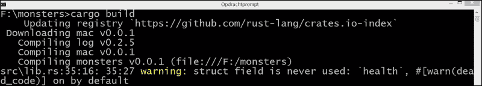
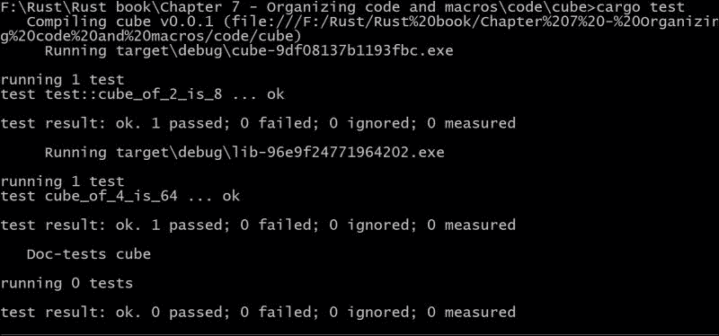

# 第七章。组织和宏

我们从讨论 Rust 中的大规模代码组织结构开始这一章，即模块和 crate。我们将探讨以下主题：

+   构建 crate

+   定义模块

+   项目的可见性

+   导入模块和文件层次结构

+   导入外部 crate

+   导出公共接口

+   将外部 crate 添加到项目中

+   测试模块

我们还将讨论如何构建宏以生成代码并节省时间和精力，特别是在以下主题中：

+   使用宏的原因

+   开发宏

+   使用 crate 中的宏

# 模块和 crate

到目前为止，我们只看了我们的代码适合一个文件的情况。然而，当项目发展时，我们希望将代码拆分到几个文件中，例如，如果我们把描述特定功能的全部数据结构和方法放在同一个文件中，主代码文件将如何调用其他文件中的这些函数？

此外，当我们开始在多个文件中使用不同的函数时，有时我们会希望为两个不同的函数使用相同的名称。我们如何正确区分这些函数？我们如何使某些函数可以在任何地方调用，而其他函数则不行？为此，我们需要其他语言中称为命名空间和访问修饰符的东西；在 Rust 中，这是通过模块系统实现的。

## 构建 crate

在构建 crate 的最高级别，有 crate。Rust 分发版包含许多 crate，例如我们经常使用的标准库中的 `std` crate。其他内置 crate 包括具有处理字符串、向量、列表和键值映射功能的 `collections` crate，以及具有单元测试和微基准测试功能的 `test` crate。

在其他语言中，crate 等同于包或库。它也是编译的单位；`rustc` 一次只编译一个 crate。这意味着什么？当我们的项目包含一个包含 `main()` 函数的代码文件时，那么我们的项目就是一个可执行程序（也称为二进制文件），它从 `main()` 开始执行。例如，如果我们编译 `structs.rs` 为 `rustc structs.rs`，在 Windows 上（以及其他操作系统的等效格式）将生成一个可以独立执行的 `.exe` 文件 `structs.exe`。当你调用 `rustc` 时，这是标准的行为。当使用 Cargo（参考第一章，*从 Rust 开始*），在创建项目时，我们必须使用 `--bin` 标志来指定我们想要一个二进制项目：`cargo new projname --bin`。

然而，通常您的意图是编写一个可以从其他项目调用的项目代码，即所谓的共享库（在 Windows 中是`.dll`文件，在 Linux 中是`.so`文件，在 Mac OS X 中是`.dylib`文件。）在这种情况下，您的代码将只包含处理这些数据结构及其函数。然后，您必须使用带有`lib`选项的`--crate-type`标志显式地通知编译器：`rustc --crate-type=lib structs.rs`。

生成的文件大小远小于原来的文件，称为`libstructs.rlib`；后缀现在是`.rlib`（对于 Rust 库）并在文件名前加上`lib`。如果您希望集合具有另一个名称，例如`mycrate`，则可以使用以下`--crate-name`标志：

`rustc --crate-type=lib --crate-name=mycrate structs.rs`

这将创建一个`libmycrate.rlib`作为输出文件。使用`rustc`标志的替代方法是，将此信息作为属性放在代码文件顶部，如下所示：

```rs
// from Chapter 7/code/structs.rs
#![crate_type = "lib"] 
#![crate_name = "mycrate"]
```

`crate_type`属性可以取`bin`、`lib`、`rlib`、`dylib`或`staticlib`值，具体取决于您是否想要一个可执行的二进制文件或某种类型的库，该库是动态链接或静态链接的。（一般来说，当`attr`属性应用于整个集合时，代码中使用的语法是`#![crate_attr]`。）

在任何应用程序中使用的每个库都是一个独立的集合。在任何情况下，你需要一个可执行（二进制）集合，它使用库集合。

Cargo 的职责是处理集合（有关 Cargo 的更多信息，请参阅第一章的*使用 Cargo*部分，*从 Rust 开始*）；它默认创建一个库项目。您可以从[`crates.io`](https://crates.io)的集合存储库中将其他集合安装到您的项目中；在本章的*将外部集合添加到项目*部分，我们将看到如何做到这一点。

## 定义一个模块

集合是编译后的实体，它们被分发到机器上执行。一个集合的所有代码都包含在一个隐式的根模块中。然后，开发者可以将这些代码分割成称为模块的代码单元，实际上，这些模块在根模块下形成了一个子模块的层次结构。这样，我们代码的组织结构可以得到极大的改善。一个明显的模块候选者是测试代码——我们将在*测试模块*部分使用它。

模块也可以定义在其他模块内部，称为嵌套模块。模块不会单独编译；只有集合会被编译。在编译开始之前，所有模块的代码都会插入到集合的源文件中。

在前面的章节中，我们使用了内置的模块，例如来自`std`集合的`io`、`str`和`vec`。`std`集合包含了许多在真实项目中使用的模块和函数；最常见的类型、特性、函数和宏（如`println!`）都在导入模块中声明。

一个模块通常包含一系列代码项，如特性、结构体、方法、其他函数，甚至嵌套模块。模块的名称定义了它包含的所有对象的命名空间。我们使用`mod`关键字和一个小写名称（例如`game1`）来定义一个模块，如下所示：

```rs
mod game1 {
  // all of the module's code items go in here
}
```

与 Java 类似，每个文件都是一个模块，对于每个代码文件，编译器都会定义一个隐式模块，即使它不包含`mod`关键字。正如我们将在*导入模块和文件层次结构*部分中看到的那样，这样的代码文件可以使用`mod`文件名导入到当前代码文件中。假设`game1`是一个包含`func2`函数的模块的名称。如果你想在模块外部的代码中使用这个函数，你应该将其地址指定为`game1::func2`。然而，这是否可行将取决于`func2`的可见性。

## 项目的可见性

模块中的项目默认情况下只在模块内部可见；它们对模块是私有的。如果你想让一个项目可以从模块外部的代码中调用，你必须通过在项目前加上`pub`（代表公共）来显式地表示这一点。在以下代码中，尝试调用`func1()`是不允许的，编译器会报错：`error: 函数`func1`是私有的：`

```rs
// from Chapter 7/code/modules.rs
mod game1 {
    // all of the module's code items go in here
    fn func1() {
      println!("Am I visible?");
    }
    pub fn func2() {
      println!("You called func2 in game1!");
    }
}

fn main() {
  // game1::func1(); // <- error!
  game1::func2();
}
```

然而，如果你调用`func2()`，它将没有任何问题，因为它被声明为公共的，并且会打印出：`你在 game1 中调用了 func2！`

在嵌套模块中的函数只有在嵌套模块本身被声明为公共的情况下才能被调用，如下代码片段所示：

```rs
mod game1 {
   // other code
    pub mod subgame1 {
      pub fn subfunc1() {
        println!("You called subfunc1 in subgame1!");
      }
    }
}

fn main() {
  // other code
  game1::subgame1::subfunc1();
}
```

它会打印出：`你在 subgame1 中调用了 subfunc1！`

在模块中调用的函数必须用其模块名称作为前缀。这可以将其与具有相同名称的另一个函数区分开来，以避免名称冲突。

当从定义它的模块外部访问结构体时，它只有在声明为`pub`时才可见。此外，它的字段默认是私有的，所以你必须显式声明为`pub`的字段，以便它们可以在模块外部可见。这是传统面向对象语言中的封装属性（也称为信息隐藏）。在以下示例中，`Magician`结构体的`name`和`age`字段属于公共接口，但`power`字段不属于：

```rs
    pub struct Magician {
        pub name: String,
        pub age: i32,
        power: i32
    }
```

因此，这个语句：

```rs
let mag1 = game1::Magician { name: "Gandalf".to_string(), age: 725, power: 98};
```

这会导致编译器错误：`field 'power' of struct 'game1::Magician' is private`

执行以下练习：

这是否意味着我们不能从具有私有字段的`struct`中创建实例？试着想一个绕过这个问题的方法。（作为一个提示，想想类似于构造函数的`new`函数；参考`Chapter 7/code/priv_struct.rs`。）

## 导入模块和文件层次结构

在`use game1::func2;`中使用`use`关键字从`game1`模块导入一个`func2`函数，以便可以简单地使用其名称`func2()`来调用它。你甚至可以用`use game1::func2`给它一个更短的名字，比如`gf2`；这样就可以调用为`gf2()`。

当`game1`模块包含两个（或更多）我们想要导入的函数，如`func2`和`func3`时，可以使用`use game1::{func2, func3};`来完成。

如果你想要导入`game1`模块的所有（公共）函数，你可以使用`*`：`use game1::*;`。

然而，在测试模块之外，使用这样的全局导入并不是最佳实践。主要原因是一个全局导入使得难以看到名称的绑定位置。此外，它们与未来的版本不兼容，因为新的上游导出可能与现有名称冲突。

在模块内部，`self::`和`super::`可以添加到类似于`game1::func2`的路径前面，以区分当前模块本身中的函数和模块外部父作用域中的函数。`use`语句最好写在代码文件的最顶部，这样它们就可以作用于整个代码。

在前面的例子中，模块是在主源文件本身中定义的；在大多数情况下，模块将在另一个源文件中定义。那么，我们如何导入这样的模块呢？在 Rust 中，我们可以通过在代码顶部（但在任何`use`语句之后）声明模块来将整个模块的源文件内容插入到当前文件中，如下所示：`mod modul1;`，这个声明可以可选地前面加上`pub`。这个语句将在当前源文件相同的文件夹中查找`modul1.rs`文件，并在当前代码中的`modul1`模块内导入其代码。如果没有找到`modul1.rs`文件，它将在`modul1`子文件夹中查找`mod.rs`文件，并插入其代码。

这是一个简单的`import_modules.rs`示例，其中包含以下代码：

```rs
// from Chapter 7/code/import_modules.rs
mod modul1;
mod modul2;
fn main() {
  modul1::func1();
  modul2::func1();
}
```

在`modul1`子文件夹中，我们有一个包含以下代码片段的`mod.rs`文件：

```rs
pub fn func1() {
    println!("called func1 from modul1");
}
```

与`import_modules.rs`文件相同的文件夹中的`modul2.rs`文件包含以下代码：

```rs
pub fn func1() {
    println!("called func1 from modul2");
}
```

### 注意

注意，这些模块的源文件不再包含`mod`声明，因为它们已经在`import_modules.rs`中声明过了。

执行`import_modules`会打印出以下输出：`called func1 from modul1 and called func1 from modul2`。

如果你简单地在`main()`中调用`func1()`会发生什么？现在，编译器不知道应该调用哪个`func1`，是从`modul1`还是从`modul2`，结果出现错误信息：`unresolved name 'func1'`。然而，如果我们添加`use modul1::func1`然后调用`func1()`，它将正常工作，因为歧义得到了解决。

## 导入外部 crate

在第五章的*特质*部分中，*使用高阶函数和参数化泛化代码*，我们为`Alien`、`Zombie`和`Predator`角色实现了`Monster`特质的`traits.rs`结构体。代码文件包含一个`main()`函数以使其可执行。我们现在将这个代码（不包括`main()`部分）整合到一个名为 monsters 的库项目中，看看我们如何调用这段代码。

使用 cargo new monsters 创建项目，并在 `monsters/src/lib.rs` 文件中创建一个带有 `template` 代码的文件夹结构：

```rs
#[test]
fn it_works() {
}
```

删除此代码，并用来自 `traits.rs` 的代码替换它，但省略 `main()` 函数。此外，添加一个简单的 `print_from_monsters()` 函数来测试是否可以从库中调用它：

```rs
// from Chapter 7/code/monsters/src/lib.rs:
fn print_from_monsters() {
  println!("Printing from crate monsters!");
}
```

然后，使用 cargo build 编译库，在 `target`/`debug` 文件夹中生成一个 `libmonsters-hash.rlib` 库文件（其中 hash 是类似于 `547968b7c0a4d435` 的随机字符串）。

现在，我们在 `src` 文件夹中创建一个 `main.rs` 文件，以创建一个可执行文件，该文件可以调用我们的 `monsters` 库，并将来自 `traits.rs` 的原始 `main()` 代码复制到其中，并添加对 `print_from_monsters()` 的调用：

```rs
// from Chapter 7/code/monsters/src/main.rs:
fn main() {
  print_from_monsters();
  let zmb1 = Zombie {health: 75, damage: 15};
  println!("Oh no, I hear: {}", zmb1.noise());
  zmb1.attack();
  println!("{:?}", zmb1);
}
```

### 注意

这是一个常见的设计模式——一个包含可执行程序的库项目，可以用来演示或测试库。

`cargo build` 函数现在在没有问题的情况下会编译两个项目。然而，代码将无法编译，编译器会给出错误信息：`未解析的名称 'print_from_monsters'`，显然函数的代码没有找到。

我们必须做的第一件事是让库代码对我们程序可用，这可以通过在开头放置以下语句来实现：

```rs
extern crate monsters; 

```

这个语句将导入包含在 crate monsters 中的所有（公共）项目，并在具有相同名称的模块下导入。然而，这还不够；我们必须还表明 `print_from_monsters` 函数可以在 `monsters` 模块中找到。实际上，monsters crate 创建了一个具有相同名称的隐式模块。因此，我们必须按照以下方式调用我们的函数：

```rs
monsters::print_from_monsters();

```

现在，我们得到错误：`函数 'print_from_monsters' 是私有的` 信息，这告诉我们函数已被找到，但无法访问。这很容易修复。在 *项目的可见性* 部分，我们看到了如何解决这个问题；我们必须在函数头前加上 `pub`，如下所示：

```rs
pub fn print_from_monsters() { … }

```

现在，我们代码的这一部分可以正常工作！打开终端，进入 (`cd`) 到 `target/debug` 文件夹，并启动 monsters 可执行文件。这将输出 `从 crate monsters 打印！`。

你会看到 `extern crate abc`（其中 `abc` 是一个 crate 名称）在代码中经常被使用，但你永远不会看到 `extern crate std;` 为什么会这样？原因是 `std` 在每个其他 crate 中默认导入。出于同样的原因，预置模块的内容在默认情况下导入到每个模块中。

## 导出公共接口

编译器向我们抛出了以下错误：`错误：Zombie 没有命名结构`。显然，`Zombie` 结构体的代码没有找到。由于这个结构体也位于 monsters 模块中，所以修复这个问题的解决方案很简单；在 `Zombie` 前加上 `monsters::`，如下所示：

```rs
let zmb1 = monsters::Zombie {health: 75, damage: 15}; 

```

另一个错误：`struct 'Zombie' 是私有的`，清楚地表明我们必须用 `pub` 标记 `Zombie` 结构体，即 `pub struct Zombie { … }`。

现在，我们将在包含 `zmb1.noise()` 的行上得到一个错误：`error: type 'monsters::Zombie'` 不实现任何作用域内名为 `'noise'` 的方法

伴随的帮助说明向我们解释了我们应该做什么以及为什么应该这样做：``帮助：如果特质在作用域内，则可以调用特质的方法；以下特质已实现但不在作用域内，可能需要添加一个 `use`：```

`帮助：候选 #1：使用 'monsters::Monster'`。因此，让我们将其添加到以下代码中：

```rs
extern crate monsters;
use monsters::Monster;

```

我们必须解决的最后一个错误——`error: trait 'Monster' is private - source trait is private`——发生在 `use` 行。再次非常合乎逻辑；如果我们想使用一个特质，它必须对公众可见：`p` `ub trait Monster { … }`。

现在，如果执行 `cargo build`，如果成功，输出将如下所示：

```rs
Printing from crate monsters!
Oh no, I hear: Aaargh!
The Zombie bites! Your health lowers with 30 damage points.
Zombie { health: 75, damage: 15 }
```

这使得我们想要在模块中使其可见的（或者说，我们想要导出的）内容必须用 `pub` 进行标注；它们构成了我们的模块对外界暴露的接口。

## 将外部 crate 添加到项目中

如何在我们的项目中使用他人编写的库（即，从[`crates.io`](https://crates.io)提供的众多库中选择）？Cargo 使得这一过程变得非常简单。

假设我们想在怪物项目中同时使用 `log` 和 `mac` 库。`log` 函数是由 Rust 项目开发者提供的简单日志框架，它为我们提供了 `info!`、`warn!` 和 `trace!` 等宏来记录信息消息。`mac` 函数是一个包含有用宏的惊人集合，由 Jonathan Reem 维护。

要获取这些库，我们需要编辑我们的 `Cargo.toml` 配置文件，并在尚未存在的情况下添加一个 `[dependencies]` 部分。在其下方，我们指定我们想要使用的库的版本：

```rs
[dependencies]
log = "0.2.5"
mac = "*"
```

`*` 字符表示任何版本都可以，并将安装最新版本。

保存文件，在 `monsters` 文件夹中，执行 `cargo build` 命令。Cargo 将负责本地安装和编译库：



它还将自动更新 `Cargo.lock` 文件以注册已安装的库版本，以便后续的项目构建始终使用相同的版本（这里，`log v0.3.1` 和 `mac v0.0.1`）。如果您稍后想更新到某个库的最新版本，例如 `log` 库，请执行 `cargo update –p log` 或 `cargo update` 以更新所有库。这将下载带有 `*` 版本的最新 crate 版本。如果您想要一个更高版本的 crate，请更改其在 `Cargo.toml` 中的版本号。

通过在代码中导入它们的 crate 来开始使用这些库：

```rs
#[macro_use]
extern crate log;
extern crate mac;

```

`#[macro_use]` 属性允许使用外部 crate 中定义的宏。（有关更多信息，请参阅下一节）。然后，例如，我们可以像下面这样使用 `crate mac` 中的 `info!` 宏：

```rs
info!("Gathering information from monster {:?}", zmb1);
```

## 测试模块

让我们将这种代码组织应用到包含我们的测试的模块中。在一个更大的项目中，测试代码与应用程序代码分离如下：

+   单元测试被收集在`test`模块中

+   集成测试被收集在`tests`目录下的`lib.rs`文件中

让我们通过使用来自第三章的`cube`函数来做一个具体的例子，*使用函数和控制结构*，并使用`cargo new cube`开始其项目。我们必须用以下代码替换`src\lib.rs`中的代码：

```rs
  // from Chapter 7/code/cube/src/lib.rs:
#[cfg(test)]
mod test;
pub fn cube(val: u32) -> u32 {
    // implementation goes here
    val * val * val
}
```

`#[cfg(test)]`确保只有当进行测试时才会编译测试模块。在第二行，我们声明我们的`test`模块，它前面有`test`属性。这个模块的代码放入同一文件夹中的`test.rs`文件中：

```rs
// from Chapter 7/code/cube/src/test.rs:
use super::*;
#[test]
fn cube_of_2_is_8() {
     assert_eq!(cube(2), 8);
}
// other test functions:
// ...
```

我们需要使用`super::*`来导入所有需要测试的函数；这里，这是 cube。

集成测试会放入一个位于测试文件夹中的`lib.rs`文件中：

```rs
// from Chapter 7/code/cube/tests/lib.rs:
extern crate cube;
#[test]
fn cube_of_4_is_64() {
    assert_eq!(cube::cube(4), 64);
}
// other test functions:
// ...
```

在这里，我们需要使用`extern`命令导入`cube`包，并用其模块名`cube`（或者也可以使用`use cube::cube;`）来限定`cube`函数名。

当我们输入`cargo test`命令时，测试代码才会被编译和运行，这将给出以下结果：



我们可以看到，我们的两个测试都通过了。输出结果的末尾还显示，如果存在，文档中的测试也会被执行。

# 宏

宏对你来说并不陌生，因为我们已经使用过它们了。每次我们调用以感叹号（`!`）结尾的表达式时，我们都是在调用一个内置宏；感叹号符号将其与函数区分开来。到目前为止，在我们的代码中，我们已经使用了`println!`、`assert_eq!`、`panic!`和`vec!`宏。

## 我们为什么要使用宏？

宏使得语言或语法扩展变得强大；因此，它们使得元编程成为可能。例如，Rust 有一个`regex!`宏，允许你在程序中定义正则表达式，这些正则表达式在代码编译时被编译。这样，正则表达式得到验证，它们可以在编译时优化，并且没有运行时开销。

宏可以捕获重复或相似的代码模式，并用其他源代码来替换它们：宏将原始代码扩展成新代码。这种扩展发生在编译的早期阶段，在执行任何静态检查之前，因此生成的代码与原始代码一起编译。从这个意义上说，它们与 Lisp 宏比 C 宏更相似。Rust 宏允许你通过提取函数的公共部分来编写**不要重复自己**（**DRY**）的代码。然而，宏比函数处于更高的层次，因为宏允许你在编译时为许多函数生成代码。

Rust 开发者也可以编写自己的宏，用更简单的代码替换重复的代码，从而自动化任务。在光谱的另一端，它甚至可能使编写特定领域的语言成为可能。宏编码遵循一组特定的声明性基于模式的规则。Rust 的宏系统也是卫生的，这意味着宏中使用的变量和宏外部的变量之间不可能发生冲突。每个宏展开都在一个独特的语法上下文中发生，每个变量都带有它在其中引入的语法上下文标签。

宏代码本身比正常的 Rust 代码更难理解，因此编写起来并不容易。然而，你不会每天编写宏；如果宏经过测试，就使用它。宏编写的完整故事深入 Rust 的高级领域，但在接下来的章节中，我们将讨论开发宏的基本技术。

## 开发宏

命名为 `mac1` 的宏的基本结构如下所示：

```rs
macro_rules! mac1 {
  (pattern) => (expansion);
  (pattern) => (expansion);
...
}

```

宏的定义也是通过宏来完成的，即 `macro_rules` 宏！正如你所见，宏类似于一个 match 块，因为它定义了一个或多个用于模式匹配的规则，并且每个规则都以分号结束。每个规则由 `=>` 符号之前的模式组成（也称为匹配器），在编译期间替换为展开部分，而不是在执行代码时替换。

以下 `welcome!` 宏不期望任何模式，通过使用 `println!` 宏扩展为一个打印语句；这很简单，但它展示了宏是如何工作的：

```rs
// from Chapter 7/code/macros.rs
macro_rules! welcome {
    () => (
        println!(""Welcome to the Game!");
    )
}
```

它通过在其名称后添加一个感叹号（`!`）来调用：

```rs
fn main() {
 welcome!() 
}
```

这将打印出：`欢迎来到游戏！`

匹配器可以包含 `$arg:frag` 形式的表达式：

+   当宏被调用时，`$arg` 函数将一个 `arg` 元变量绑定到一个值。在宏内部使用的变量，如 `$arg`，前面带有 `$` 符号，以区分代码中的普通变量。

+   `frag` 函数是一个 *片段指定器*，可以是 `expr`、`item`、`block`、`stmt`、`pat`、`ty`（类型）、`ident`、`path` 或 `tt`。

（你可以在官方文档中找到有关这些片段含义的更多信息，请参阅[`doc.rust-lang.org/1.0.0/book`](http://doc.rust-lang.org/1.0.0/book)。）

在匹配器中出现的任何其他 Rust 文字（标记）都必须完全匹配。例如，以下 `mac1` 宏：

```rs
macro_rules! mac1 {
 ($arg:expr) => (println!("arg is {}", $arg));
}
```

当你调用 `mac1!(42);` 时，它将打印出 `arg is 42`。`mac1` 函数将其参数 `42` 视为一个表达式（`expr`）并将 `arg` 绑定到该值。

执行以下练习：

+   编写一个 `mac2` 宏，使其参数乘以三。测试以下参数：5 和 2 + 3。

+   编写一个 `mac3` 宏，它接受一个标识符名称，并用该名称的绑定替换它，绑定值为 42。（作为一个提示，使用 `$arg:ident` 而不是 `$arg:expr`；`ident` 用于变量和函数名称。）

+   编写一个 `mac4` 宏，当像 `mac4!("Where am I?");` 这样调用时，打印出 `start - Where am I? - end`。（请参阅 `第七章/exercises/macro_ex.rs` 中的示例代码。）

### 重复

如果有多个参数怎么办？我们将模式用 `$(...)*` 包围起来，其中 `*` 表示零个或多个（而不是 `*`，你可以使用 `+`，表示一个或多个）。例如，以下 `printall` 宏对其每个参数调用 `println!`，这些参数可以是任意类型，并且由 `a` 分隔：

```rs
macro_rules! printall {
 ( $( $arg:expr ), * ) => ( {$( print!("{} / ", $arg) ); *} );
}
```

当用 `printall!("hello", 42, 3.14);` 调用时，它将打印出：`hello / 42 / 3.14 /`。

在示例中，每个参数（由逗号分隔）被替换为相应的 `print!` 调用，这些调用由 `/` 分隔。注意，在右侧，我们必须通过将它们括在 `{}` 中来创建结果打印语句的代码块。

### 创建一个新函数

这里是一个在编译时创建新函数的 `create_fn` 宏：

```rs
macro_rules! create_fn {
    ($fname:ident) => (
        fn $fname() {
          println!("Called the function {:?}()", stringify!($fname))
        }
    )
}
```

`stringify!` 宏只是将其参数转换成字符串。现在，我们可以用 `create_fn!(fn1);` 调用这个宏。这个语句不在 `main()` 或另一个函数内部；它在编译期间被转换成函数定义。然后，对 `fn1()` 函数的正常调用将调用它，这里打印 `Called the function "fn1"()`。

在下面的 `massert` 宏中，我们模仿了 `assert!` 宏的行为，当其表达式参数为真时什么也不做，但当其为假时引发恐慌：

```rs
macro_rules! massert {
    ($arg:expr) => (
            if $arg {}
            else { panic!("Assertion failed!"); }
    );
}
```

例如，`massert!(1 == 42);` 将打印出 `thread '<main>' panicked at 'Assertion failed!'`。

在以下语句中，我们测试 `v` 向量是否包含某些元素：

```rs
    let v = [10, 40, 30];
    massert!(v.contains(&30));
    massert!(!v.contains(&50));
```

`unless` 宏模仿了一个 `unless` 语句，其中如果 `arg` 条件不为真，则执行分支。例如：

```rs
  unless!(v.contains(&25), println!("v does not contain 25"));
```

这应该会打印出 `v does not contain 25`，因为条件不成立。

这也是一个单行宏：

```rs
macro_rules! unless {
    ($arg:expr, $branch:expr) => ( if !$arg { $branch }; );
}
```

最后一个例子结合了我们迄今为止看到的技术。在 第三章 的 *属性 - 测试* 部分，*使用函数和控制结构*，我们看到了如何使用 `#[test]` 属性创建测试函数。让我们创建一个 `test_eq` 宏，当它被调用时，会生成一个测试函数：

```rs
   test_eq!(seven_times_six_is_forty_two, 7 * 6, 42);
```

测试函数如下：

```rs
        #[test]
        fn seven_times_six_is_forty_two() {
            assert_eq!(7 * 6, 42);
        }
```

我们还想要一个失败的测试：

```rs
test_eq!(seven_times_six_is_not_forty_three, 7 * 6, 43);
```

`test_eq` 的第一个参数是测试的名称，第二个和第三个参数是要比较相等性的值，所以通常的格式是：`test_eq!(name, left, right);`。

在这里，`name` 是一个标识符；`left` 和 `right` 是表达式。就像 `create_fn` 调用一样，`test_eq!` 调用是在函数外部编写的。

现在，我们可以这样组合我们的宏：

```rs
macro_rules! test_eq {
    ($name:ident, $left:expr, $right:expr) => {
        #[test]
        fn $name() {
            assert_eq!($left, $right);
        }
    }
}
```

你可以通过调用 `rustc --test macros.rs` 来创建测试运行器。

当宏可执行文件运行时，它将打印出：

```rs
running 2 tests
test seven_times_six_is_forty_two ... ok
test seven_times_six_is_not_forty_three ... FAILED
```

宏也可以是递归的，并在展开分支中调用自身。这对于处理树状结构输入很有用，例如在解析 HTML 代码时。

### 使用 crates 中的宏

正如我们在“将外部 crates 添加到项目”部分的结尾所展示的，应该通过在`extern crate abc`前加上`#[macro_use]`属性来加载外部 crate 中的所有宏。如果你只需要`mac1`和`mac2`宏，你可以这样写：

```rs
#[macro_use(mac1, mac2)]
extern crate abc;
```

如果没有该属性，则不会从`abc`加载任何宏。此外，在`abc`模块内部，只有使用`#[macro_export]`属性定义的宏可以在另一个模块中加载。为了区分不同模块中具有相同名称的宏，请在宏中使用`$crate`变量。在从`abc`crate 导入的宏的代码中，特殊的`$crate`宏变量将展开为`::abc`。

# 摘要

在本章中，我们学习了如何将模块结构化到 crates 中，使我们的代码更加灵活和模块化。现在，你也知道了编写宏的基本规则，以使代码更加紧凑且重复性更低。

在下一章中，我们将探讨 Rust 在代码并发和并行执行方面的强大功能，以及 Rust 如何在这一领域保持内存安全。
