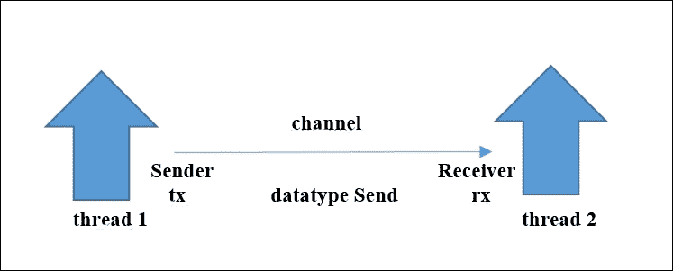

# 第八章。并发与并行

作为一种现代的系统级编程语言，Rust 必须有一个很好的故事来描述如何在多个处理器上同时并发和并行执行代码。确实如此；Rust 提供了一系列的并发和并行工具。它的类型系统足够强大，可以编写具有不同于以往任何东西的性质的并发原语。特别是，它可以编码一系列内存安全的并行抽象，同时保证数据竞争自由，而不使用垃圾回收器。这令人震惊，因为没有任何其他语言能够做到这一点。所有这些功能都不是内置于语言本身中的，而是由库提供的，因此可以始终构建改进或新版本。开发者应该选择适合当前任务的工具，或者他们可以改进或开发新的工具。

在本章中，我们将讨论以下主题：

+   并发和线程

+   共享可变状态

+   通过通道进行通信

+   同步和异步通信

# 并发和线程

当多个计算同时执行并且可能相互交互时，系统是并发的。只有当这些计算在不同的核心或处理器上执行时，它们才能并行（即同时）运行。

一个正在执行的 Rust 程序由一组原生操作系统（OS）线程组成；操作系统也负责它们的调度。Rust 中的计算单元称为`thread`，这是一个在`std::thread`模块中定义的类型。每个线程都有自己的栈和局部状态。

到目前为止，我们的 Rust 程序只有一个线程，即`main`线程，对应于`main()`函数的执行。然而，当需要时，Rust 程序可以创建很多线程来同时工作。每个线程（不仅仅是`main()`）都可以作为父线程并生成任意数量的子线程。

可以在数据上执行以下操作：

+   它可以在线程之间共享（参考*通过原子类型进行共享可变状态*部分）

+   它可以在线程之间传递（参考*通过通道进行通信*部分）

## 创建线程

可以通过创建一个`thread`来创建线程；这会创建一个独立的、分离的子线程，它通常可以比其父线程存活得更久。这在下述代码片段中得到了演示：

```rs
// code from Chapter 8/code/thread_spawn.rs:
use std::thread;
fn main() {
 thread::spawn(move || {
 println!("Hello from the goblin in the spawned thread!");
 });
}
```

`spawn`参数是一个闭包（这里没有参数，所以是`||`），它被安排独立于父线程（这里，这是`main()`）执行。请注意，这是一个移动闭包，它获取上下文中的变量的所有权。我们这里的闭包是一个简单的打印语句，但在实际示例中，这可以被替换为一个重或耗时的操作。

然而，当我们执行这段代码时，通常不会看到任何输出；这是为什么？结果是`main()`（从线程的角度来看）是一个糟糕的父线程，它不会等待其子线程正确结束；当`main()`的结束关闭程序时，它会终止其他仍在运行的线程。如果我们让`main()`在终止前暂停一下，那么派生线程的输出就会变得可见。这可以通过`thread::sleep_ms`方法实现，该方法接受一个无符号 32 位整数（以毫秒为单位）：

```rs
  fn main() {
    thread::spawn(move || { …  });
 thread::sleep_ms(50);
}
```

这现在会打印出：`Hello from the goblin in the spawned thread!`。

通常情况下，这个暂停期是不需要的；子线程可以比父线程存活得更久，即使父线程已经停止，子线程也可以继续执行。

然而，在这种情况下，更好的做法是将`spawn`返回的 join handle 捕获到变量中。在`handle`上调用`join()`方法将阻塞父线程，并使其等待子线程完成执行。它返回一个`Result`实例；`unwrap()`将从`Ok`中获取值并返回子线程的结果（在这种情况下因为是一个打印语句，所以是`()`）或者在`Err`情况下 panic。

```rs
fn main() {
 let handle = thread::spawn(move || {
        println!("Hello from the goblin in the spawned thread!");
 });
// do other work in the meantime
 let output = handle.join().unwrap();
  println!("{:?}", output); // ()
}
```

如果在子线程执行期间没有其他工作要做，我们也可以这样写：

```rs
thread::spawn(move || { 
// work done in child thread 
}).join();

```

在这种情况下，我们正在同步等待子线程完成，所以没有很好的理由去启动一个新的线程。

## 启动一定数量的线程

每个线程都有自己的堆栈和局部状态，默认情况下，除非是不可变数据，否则线程之间不共享任何数据。生成线程是一个非常轻量级的过程，因为启动成千上万的线程只需要几秒钟。以下程序就是这样做的，并打印出从 0 到 9,999 的数字：

```rs
// code from Chapter 8/code/many_threads.rs:	
use std::thread;
static NTHREADS: i32 = 10000;
fn main() {
    for i in 0..NTHREADS {
        let _ = thread::spawn(move || {
            println!("this is thread number {}", i)
        });
    }
}
```

由于数字是在独立的线程中打印的，所以输出中的顺序是不保留的；例如，它可能以以下内容开始：

```rs
this is thread number 1
this is thread number 3
this is thread number 4
this is thread number 2
this is thread number 6
this is thread number 5
this is thread number 0
…
```

常常出现的一个问题是：我需要派生多少个线程？基本规则是，CPU 密集型任务的数量与 CPU 核心的数量相同。这个数字可以通过 Rust 中的`num_cpus` crate 来检索。让我们用`cargo new many_threads --bin`创建一个新的项目：

+   将 crate 依赖添加到`Cargo.toml`中：

    ```rs
    [dependencies]
    num_cpus = "*"
    ```

+   然后，将`main.rs`更改为以下代码：

    ```rs
    extern crate num_cpus;
    fn main() {
      let ncpus = num_cpus::get();
      println!("The number of cpus in this machine is: {}", ncpus);
    }
    ```

+   在`many_threads`文件夹内，执行 cargo build 来安装 crate 并编译代码。使用 cargo run 执行程序会得到以下输出（取决于计算机）：`The number of cpus in this machine is: 8`。

现在，你可以在一个池中启动这个（或任何其他）数量的线程。这个功能是由`threadpool` crate 提供的，我们可以通过在`Cargo.toml`依赖中添加`threadpool = "*"`并执行 cargo build 来获取它。将以下代码添加到文件的开头：

```rs
extern crate threadpool;

use std::thread;
use threadpool::ThreadPool;

```

然后，将以下代码添加到`main()`函数中：

```rs
let pool = ThreadPool::new(ncpus);
for i in 0..ncpus {
 pool.execute(move || {
        println!("this is thread number {}", i)
   });
}
thread::sleep_ms(50);
```

当执行上述代码时，会得到以下输出：

```rs
this is thread number 0
this is thread number 5
this is thread number 7
this is thread number 3
this is thread number 4
this is thread number 1
this is thread number 6
this is thread number 2
```

线程池用于在固定的一组并行工作线程上运行多个作业；它创建指定数量的工作线程，并在任何线程崩溃时补充线程池。

## 崩溃的线程

当其中一个生成的线程进入崩溃状态时会发生什么？由于线程彼此隔离，这不会造成任何问题；崩溃的线程在释放其资源后会崩溃，但父线程不受影响。事实上，父线程可以像以下这样测试 spawn 的`is_err`返回值：

```rs
// code from Chapter 8/code/panic_thread.rs:	
use std::thread;
fn main() {
  let result = thread::spawn(move || {
      panic!("I have fallen into an unrecoverable trap!");
  }).join();
  if result.is_err() {
   println!("This child has panicked");
  }
}
```

前面的代码输出如下：

```rs
thread '<unnamed>' panicked at 'I' have fallen into an unrecoverable trap!'
This child has panicked
```

否则，换句话说，线程是失败隔离的单位。

## 线程安全性

如果允许不同的线程在相同的可变数据上工作，即所谓的共享内存，那么使用线程的传统编程非常难以正确实现。当两个或更多线程同时更改数据时，由于线程调度的不可预测性，可能会发生数据损坏（也称为数据竞态）。一般来说，当其内容不会被不同线程的执行所损坏时，数据（或类型）被认为是线程安全的。其他语言没有提供这样的帮助，但 Rust 编译器简单地禁止出现非线程安全的情况。贯穿 Rust 以防止内存安全错误的相同所有权策略也使你能够编写安全的并发程序。考虑以下程序：

```rs
// code from Chapter 8/code/not_shared.rs:
use std::thread;
fn main() {
    let mut health = 12;
    for i in 2..5 {
        thread::spawn(move || {
            health *= i;
        });
    }
    thread::sleep_ms(2000);
    println!("{}", health); // 12
}
```

我们初始的`健康值`是 12，但有 3 个仙女可以将我们的健康值翻倍、三倍和四倍。我们让她们各自在不同的线程中这样做，线程完成后，我们期望`健康值`达到 288（相当于 12 * 2 * 3 * 4）。然而，在她们神奇的行动之后，我们的`健康值`仍然保持在 12，即使我们等待足够长的时间以确保线程完成。显然，三个线程是在我们的变量副本上工作，而不是在变量本身上。Rust 不允许`健康值`变量在线程间共享，以防止数据损坏。在下一节中，我们将探讨如何使用线程间共享的可变变量。

# 共享可变状态

那么，我们如何让`not_shared.rs`程序给出正确的结果？Rust 提供了工具，即所谓的原子类型，来自`std::sync::atomic`子模块，以安全地处理共享可变状态。为了共享数据，你需要将数据包裹在一些同步原语中，例如`Arc`、`Mutex`、`RwLock`、`AtomicUSize`等等。

基本上，这里使用的是锁定原理，这与操作系统和数据库系统中使用的原理类似——将资源的独占访问权赋予已获得锁的线程（该锁也称为`mutex`，来源于互斥）。一次只能由一个线程获得锁。这样，两个线程就不能同时更改这个资源，因此不会发生数据竞争；当需要时，强制执行锁定原子性。当获得锁的线程完成其工作后，锁被移除，然后另一个线程可以与数据一起工作。在 Rust 中，这是通过`std::sync`模块中的泛型`Mutex<T>`类型来实现的；`sync`来源于 synchronize，这正是我们想要对线程所做的事情。`Mutex`确保一次只有一个线程可以更改我们数据的内部内容。我们必须通过以下方式创建此类型的实例，将我们的数据包装起来：

```rs
// code from Chapter 8/code/thread_safe.rs:	
let data = Mutex::new(health);

```

现在，在`for`循环中，在我们创建新线程后立即，我们对`health`对象施加锁：

```rs
     for i in 2..5 {	
       thread::spawn(move || {
 let mut health = data.lock().unwrap();
            // do other things
       }
     }
```

对`lock()`的调用将返回`Mutex`内部值的引用，并阻止对`lock()`的任何其他调用，直到该引用超出作用域，这将在线程关闭结束时发生。然后，线程完成其工作，锁自动移除。然而，我们仍然得到一个错误：`捕获已移动值：'data'`消息。这意味着数据不能多次移动到另一个线程。

此问题可以通过使用第六章中*引用计数*部分的`Rc`指针来解决，*指针和内存安全*。实际上，这里的情况非常相似；所有线程都需要对同一数据的引用，即我们的健康变量。因此，我们在第六章中应用了相同的技巧，*指针和内存安全*——我们为我们的数据创建一个`Rc`指针，然后为每个需要的引用创建指针的`clone()`。然而，简单的`Rc`指针不是线程安全的；因此，我们需要一个特殊的版本，即线程安全的版本，所谓的原子引用计数指针或`Arc<T>`。原子意味着它在线程之间是安全的，它也是泛型的。因此，我们将健康变量包裹在一个`Arc`指针中，如下所示：

```rs
 let data = Arc::new(Mutex::new(health));

```

此外，在`for`循环中，我们使用`clone`创建一个新的指向`Mutex`的指针：

```rs
  for i in 2..5 {
      let mutex = data.clone();
      thread::spawn(move || { 
         let mut health = mutex.lock().unwrap();
         *health *= i;
      });
  }
```

因此，每个线程现在都使用通过`clone()`获得的指针副本工作。`Arc`实例将跟踪对`health`的引用数量。对`clone()`的调用将增加对健康引用的计数。`mutex`引用在线程关闭结束时超出作用域，这将减少引用计数。当引用计数变为零时，`Arc`将释放相关的健康资源。

调用 `lock()` 给活动线程提供对数据的独占访问。原则上，获取锁可能会失败，因此它返回一个 `Result<T, E>` 对象。在上面的代码中，我们假设一切正常。`unwrap()` 函数是一种快速返回数据引用的方法，但在失败的情况下，它会引发恐慌。

这里涉及了相当多的步骤。因此，我们将再次完整地重复代码，但这次，我们将通过替换 `unwrap()` 提供健壮的错误处理。用前面解释的解释消化每一行：

```rs
// code from Chapter 8/code/thread_safe.rs:
use std::thread;
use std::sync::{Arc, Mutex};
fn main() {
  let mut health = 12;
  println!("health before: {:?}", health);
  let data = Arc::new(Mutex::new(health));
  for i in 2..5 {
        let mutex = data.clone();
        thread::spawn(move || {
            let health = mutex.lock();
            match health {
                // health is multiplied by i:
                Ok(mut health) => *health *= i,
                Err(str) => println!("{}", str)
            }
        }).join().unwrap();
    };
    health = *data.lock().unwrap();
    println!("health after: {:?}", health);
}
```

这会打印出：

```rs
health before: 12
health after: 288
```

( 288 确实等于 12 * 2 * 3 * 4 ). 我们将线程连接起来，以便它们有时间完成工作；数据是一个引用，因此我们需要取消引用它以获取 `health` 值：

```rs
health = *data.lock().unwrap();
```

在前一个部分中概述的机制，使用组合的 `Mutex` 和 `Arc`，当共享数据占用大量内存时是可取的；这是因为有了 `Arc`，数据将不再为每个线程复制。`Arc` 作为共享数据的引用，并且只有这个引用被共享和克隆。

## 同步特性

`Arc<T>` 对象实现了 `Sync` 特性（而 `Rc` 则没有），这向编译器表明它可以安全地在多个线程中并发使用。任何必须同时在多个线程之间共享的数据都必须实现 `Sync` 特性。如果 `&T` 引用在线程之间传递时没有数据竞争的可能性，则 `T` 类型是 `Sync` 的；简而言之，`&T` 是线程安全的。所有简单类型，如整数和浮点数类型，以及所有由简单类型构建的复合类型（如结构体、枚举和元组）都是 `Sync`，任何只包含实现 `Sync` 的东西的类型都是自动 `Sync`。

# 通过通道进行通信

数据也可以通过在它们之间传递消息在线程之间交换。在 Rust 中，这是通过通道实现的，通道就像连接两个线程的单向管道——数据是先入先出处理的。数据在这两个端点之间通过这个通道流动，从 `Sender<T>` 到 `Receiver<T>`；两者都是泛型，并接受要传输的消息的 `T` 类型（显然，对于 `Sender` 和 `Receiver` 通道必须是相同的）。在这个机制中，为接收线程创建要共享的数据的副本，因此你不应该用它来传输非常大的数据：



要创建一个通道，我们需要从 `std::sync` 模块导入 `mpsc` 子模块（`mpsc` 代表 **多生产者，单消费者通信** 原语）然后使用 `channel()` 方法：

```rs
// code from Chapter 8/code/channels.rs:
use std::thread;
use std::sync::mpsc::channel;
use std::sync::mpsc::{Sender, Receiver};
fn main() {
 let (tx, rx): (Sender<i32>, Receiver<i32>) = channel();
}
```

这创建了一个端点元组；`tx`（来自传输的 `t`）是 `Sender`，`rx`（来自接收器的 `r`）是 `Receiver`。我们已经指出，我们将通过通道发送 `i32` 整数，但如果编译器可以从代码的其余部分推断出通道的数据类型，则不需要类型注解。

## 发送和接收数据

那么，哪些数据类型可以通过通道发送？Rust 强制要求要发送到通道的数据必须实现 `Send` 特性，这保证了线程之间安全地转移所有权。没有实现 `Send` 的数据不能离开当前线程。`i32` 是 `Send` 的，因为我们可以复制它，所以让我们在下面的代码片段中这样做：

```rs
fn main() {
  let (tx, rx) = channel();
  thread::spawn(move|| {
 tx.send(10).unwrap();
  });
 let res = rx.recv().unwrap();
  println!("{:?}", res); 
}
```

当然，这会打印 `10`。

在这里，`tx` 被移动到了闭包内部。更好的写法是 `tx.send(10).unwrap()`，如下所示：

```rs
tx.send(10).ok().expect("Unable to send message");

```

这将确保在出现问题时，会发送一条消息。

`send()` 是由子线程执行的；它在通道中排队一个消息（一个数据值；这里，它是 10），并且不会阻塞。`recv()` 是由父线程执行的；它从通道中选取一个消息，如果没有消息可用，它会阻塞当前线程。（如果你需要以非阻塞的方式执行此操作，请使用 `try_recv()`。）如果你不处理接收到的值，这种阻塞可以写成如下：

```rs
let _ = rx.recv();
```

`send()` 和 `recv()` 操作返回一个 `Result`，可以是 `Ok(value)` 类型或 `Err` 错误。这里省略了完整的错误处理，因为在 `Err` 的情况下，通道不再工作，并且线程失败（panic）并停止更好。

在一般场景中，我们可以让子线程执行长时间的计算，然后在父线程中接收结果，如下所示：

```rs
// code from Chapter 8/code/channels2.rs:
use std::thread;
use std::sync::mpsc::channel;
fn main() {
  let (tx, rx) = channel();

    thread::spawn(move|| {
        let result = some_expensive_computation();
        tx.send(result).ok().expect("Unable to send message");
    });
    some_other_expensive_computation();
    let result = rx.recv();
    println!("{:?}", result);  
}
fn some_expensive_computation() -> i32 { 1 }
fn some_other_expensive_computation() { }
```

这里的 `result` 函数具有 `Ok(1)` 的值。

在下面的代码片段中，展示了优雅的代码模式，其中通道是在 `make_chan()` 函数中创建的，该函数返回调用代码的接收端点：

```rs
// code from Chapter 8/code/make_channel.rs:
use std::sync::mpsc::channel;
use std::sync::mpsc::Receiver;
fn make_chan() -> Receiver<i32> {
 let (tx, rx) = channel();
 tx.send(7).unwrap();
 rx
}

fn main() {
    let rx = make_chan();
 if let Some(msg) = rx.recv().ok() {
        println!("received message {}", msg);
    };
}
```

这会打印出：`received message 7`。

执行以下练习：

构建一个 `shared_channel.rs` 程序，允许任意数量的线程共享一个通道来发送值，并有一个接收器收集所有值。作为一个提示，使用 `clone()` 给每个线程提供对发送 `tx` 端点的访问。（参考第八章的示例代码 `shared_channel.rs`。）

## 同步和异步通信

我们之前使用的发送通道是异步的；这意味着它不会阻塞执行代码。Rust 还有一个名为 `sync_channel` 的同步通道类型，其中如果其内部缓冲区已满，`send()` 会阻塞——它等待父线程开始接收数据。在下面的代码中，这种类型的通道被用来通过通道发送 `Msg` 结构体的值：

```rs
// code from Chapter 8/code/sync_channel.rs:
use std::sync::mpsc::sync_channel;
use std::thread;
type TokenType = i32;
struct Msg {
    typ: TokenType,
    val: String,
}

fn main() {
 let (tx, rx) = sync_channel(1); // buffer size 1
    tx.send(Msg {typ: 42, val: "Rust is cool".to_string()}).unwrap();
    println!("message 1 is sent");
    thread::spawn(move|| {
    tx.send(Msg {typ: 43, val: "Rust is still cool".to_string()}).unwrap();
        println!("message 2 is sent");
    });
    println!("Waiting for 3 seconds ...");
    thread::sleep_ms(3000);
    if let Some(msg) = rx.recv().ok() {
      println!("received message of type {} and val {}", msg.typ, msg.val);
    };
    if let Some(msg) = rx.recv().ok() {
      println!("received second message of type {} and val {}", msg.typ, msg.val);
    };
}
```

这会打印：

```rs
message 1 is sent
Waiting for 3 seconds
```

然后，3 秒后，打印：

```rs
received message of type 42 and val Rust is cool
message 2 is sent
received second message of type 43 and val Rust is still cool
```

这清楚地表明，只有在缓冲区被接收第一条消息清空后，才能发送第二条消息。

执行以下练习：

解释当第二个消息也从主线程内部发送而不是在单独的线程中发送时会发生什么。

# 摘要

在本章中，我们探讨了 Rust 的轻量级线程进程——如何创建它们，如何让它们共享数据，以及如何让它们通过通道传递数据。

在接下来的章节中，我们将探讨边界问题——我们将了解 Rust 程序如何接受参数并与之交互。我们还将探讨在 Rust 中，当我们达到如此低级以至于编译器无法保证安全性的情况下，我们需要做什么，以及我们如何与其他语言如 C 进行接口交互。
