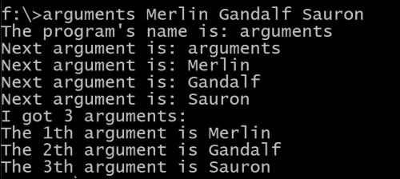

# 第九章。边界编程

在本章中，我们将探讨如何使用命令行参数启动 Rust 程序。然后，我们将探讨我们必须离开安全边界的情况，例如与 C 程序接口，以及 Rust 在这样做时如何最小化潜在的危险。

我们将讨论以下主题：

+   程序参数

+   不安全代码

+   原始指针

+   与 C 接口

+   内联汇编代码

+   从其他语言调用 Rust

# 程序参数

在 Rust 中，从启动时读取命令行参数很容易；只需使用 `std::env::args()` 方法。我们可以将这些参数收集到一个 `String` 向量中，如下所示：

```rs
// code from Chapter 9/code/arguments.rs:
use std::env;

fn main() {
 let args: Vec<String> = env::args().collect();
 println!("The program's name is: {}", args[0]);
 for arg in args.iter() {
 println!("Next argument is: {}", arg)
 }
 println!("I got {:?} arguments: {:?}.", args.len() - 1);
 for n in 1..args.len() {
 println!("The {}th argument is {}", n, args[n]);
 }
}
```

按以下格式调用程序：

+   `arguments arg1 arg2` 在 Windows 上

+   `./arguments arg1 arg2` 在 Linux 和 Mac OS X 上

以下是从实际调用中得到的输出：



程序名称是 `args[0]`；下一个参数是命令行参数。我们可以遍历这些参数或通过索引访问它们。参数的数量由 `args.len() – 1` 给出。

对于更复杂的带有选项和标志的解析，请使用 `getopts` 或 `docopt` crate。要开始，请参阅 [`rustbyexample.com`](http://rustbyexample.com) 上的示例。

现在，`env::vars()` 返回操作系统的环境变量：

```rs
let osvars = env::vars();
for (key, value) in osvars {
       println!("{}: {}", key, value);
}
```

在 Windows 上，首先会打印出以下内容：

```rs
HOMEDRIVE: C:
USERNAME: CVO
LOGONSERVER: \\MicrosoftAccount
…

```

# 不安全代码

有一些情况，即使是 Rust 编译器也无法保证我们的代码以安全的方式运行。这可能在以下场景中发生：

+   当我们必须针对“金属”编程，接近操作系统、处理器和硬件时

+   当我们想要与 C 中可能实现的控制量相同

+   当我们将程序执行的一部分委托给不安全语言，如 C 时

+   当我们想要内联汇编语言时

Rust 允许我们为这些场景编写代码，但我们必须将这些可能危险的代码包裹在一个 `unsafe` 块中：

```rs
  unsafe {
    // possibly dangerous code
  }
```

现在，程序员承担全部责任。`unsafe` 块是对编译器的一个承诺，即不安全性不会从块中泄漏出来。编译器将更宽松地检查标记为 `unsafe` 的代码区域，并允许其他禁止的操作，但所有权系统（有关更多信息，请参阅第六章，*指针和内存安全*）的一些规则仍然有效。

明显的优势是，问题区域现在将非常清晰地隔离；如果出现问题，我们将知道它只能在这些标记的代码区域中发生。拥有 99% 的代码是安全的、1% 是不安全的代码库比拥有 100% 不安全代码的代码库更容易维护，就像在 C 中那样！

在 `unsafe` 块中我们可以做以下事情：

+   与原始指针一起工作，特别是通过解引用它们。有关更多信息，请参阅本章的 *原始指针* 部分。

+   通过 **Foreign Function Interface**（**FFI**）调用另一种语言中的函数。有关更多信息，请参阅本章的 *与 C 接口* 部分。

+   内联汇编代码

+   使用 `std::mem::transmute` 来进行简单的类型位操作；以下是一个使用示例，其中字符串被转换为一个字节数组切片：

    ```rs
    // code from Chapter 9/code/unsafe.rs:
    use std::mem;

    fn main() {
      let v: &[u8] = unsafe { 
        mem::transmute("Gandalf") 
      };
      println!("{:?}", v);
    }
    ```

这将打印以下输出：

```rs
[71, 97, 110, 100, 97, 108, 102]

```

`unsafe` 块也可以调用执行这些危险操作并标记为 `unsafe fn dangerous() { }` 的 `unsafe` 函数。

在 `unsafe` 代码中，使用 `std::mem` 模块（其中包含用于在低级别处理内存的函数）和 `std::ptr` 模块（其中包含用于处理原始指针的函数）很常见。

### 小贴士

我们建议你在 `unsafe` 代码中大量使用 `assert!` 语句来检查运行时是否做了你期望的事情。例如，在解引用未知来源的原始 `ptr` 指针之前，始终调用 `assert!(!ptr.is_null());` 以确保指针指向有效的内存位置。

# 原始指针

在 `unsafe` 代码块中，Rust 允许使用一种称为 *原始指针* 的新类型指针。对于这些指针，没有内置的安全机制，你可以像 C 指针一样自由地使用它们。它们被写成如下形式：

+   `*const T`：这用于不可变值或 `T` 类型的指针

+   `*mut T`：这用作可变指针

它们可以指向无效的内存，内存资源需要手动释放。这意味着原始指针可能在释放它所指向的内存之后意外地被使用。此外，多个并发线程对可变原始指针有非独占访问权。由于我们不确定其内容（至少我们没有编译器保证有效内容），解引用原始指针也可能导致程序失败。

正因如此，解引用原始指针只能在 `unsafe` 块内部进行，如下面的代码片段所示：

```rs
// code from Chapter 9/code/raw_pointers.rs:
let p_raw: *const u32 = &10;
// let n = *p_raw; // compiler error!
unsafe {
 let n = *p_raw;
     println!("{}", n); // prints 10
}
```

如果你尝试在普通代码中这样做，你将得到以下输出：

```rs
error: dereference of unsafe pointer requires unsafe function or block [E0133]

```

我们可以使用 `&` 作为 `*const`，隐式或显式地从引用安全地创建原始指针，如下面的代码片段所示：

```rs
  let gr: f32 = 1.618;
 let p_imm: *const f32 = &gr as *const f32; // explicit cast
  let mut m: f32 = 3.14;
  let p_mut: *mut f32 = &mut m; // implicit cast
```

然而，将原始指针转换为引用，应该通过 `&*`（解引用的地址）操作完成，必须在 `unsafe` 块内部进行：

```rs
unsafe {
 let ref_imm: &f32 = &*p_imm;
 let ref_mut: &mut f32 = &mut *p_mut;
}
```

在定义其他更智能的指针时，原始指针也可能很有用；例如，它们用于实现 `Rc` 和 `Arc` 指针类型。

# 与 C 接口

由于 C 代码中存在大量的功能，有时将处理委托给 C 例程可能很有用，而不是在 Rust 中编写一切。

你可以通过使用 `libc` crate 来调用 C 标准库中的所有函数，这必须通过 Cargo 获取。为此，只需将以下内容添加到你的 Rust 代码中：

```rs
#![feature(libc)]
extern crate libc;
```

要导入 C 函数和类型，你可以这样总结：

```rs
use libc::{c_void, size_t, malloc, free};
```

或者，您可以使用 `*` 通配符，例如 `use libc::*;`，使它们全部可用。

要从 Rust（或另一种语言）中与 C（或另一种语言）一起工作，您将不得不使用 FFI，它在其 `std::ffi` 模块中有其工具。

下面是一个简单的示例，使用 C 的 `puts` 函数打印 Rust 字符串：

```rs
// code from Chapter 9/code/calling_libc.rs:
#![feature(libc)]
extern crate libc;
use libc::puts;
use std::ffi::CString;

fn main() {
  let sentence = "Merlin is the greatest magician!";
 let to_print = CString::new(sentence).unwrap();
 unsafe {
 puts(to_print.as_ptr());
 }
}
```

这将打印出以下句子：

```rs
Merlin is the greatest magician!

```

`CString` 的 `new()` 方法将从 Rust 字符串生成一个与 C 兼容的字符串（以一个 0 字节结尾）。`as_ptr()` 方法返回指向这个 C 字符串的指针。

`#![feature(libc)]` 属性（一个所谓的功能门）是（暂时）必要的，以启用 `libc` 的使用。它不与 beta 通道的 Rust 一起工作，您需要从 nightly 通道获取 Rust 编译器。

### 注意

功能门在 Rust 中很常见，用于启用某些功能的使用，但在稳定 Rust 中不可用；它们仅在当前开发分支（nightly 发布）中可用。

## 使用 C 库

假设我们想要计算复数的正切值。`num` 包提供了复数的基本操作，但在这个时候，`tangents` 函数尚未包含，因此我们将调用 C 库 `libm` 中的 `ctanf` 函数，这是一个用 C 实现的数学函数集合。

以下代码正是如此，并定义了一个复数作为一个简单的 `struct`：

```rs
// code from Chapter 9/code/calling_clibrary.rs:
#[repr(C)]
#[derive(Copy, Clone)]
#[derive(Debug)]
struct Complex {
    re: f32,
    im: f32,
}

#[link(name = "m")]
extern {
 fn ctanf(z: Complex) -> Complex;
}

fn tan(z: Complex) -> Complex {
 unsafe { ctanf(z) }
}

fn main() {
    let z = Complex { re: -1., im: 1\. }; // z is -1 + i
    let z_tan = tan(z);
    println!("the tangens of {:?} is {:?}", z, z_tan);
}
```

这个程序将打印以下输出：

```rs
the tangens of Complex { re: -1, im: 1 } is Complex { re: -0.271753, im: 1.083923 }

```

`#[derive(Debug)]` 属性是必要的，因为我们想在 `{:?}` 格式字符串中显示数字。`#[derive(Copy, Clone)]` 属性是必要的，因为我们想在调用 `ctanf(z)` 将 `z` 移动后使用 `z` 在 `println!` 语句中。`#[repr(C)]` 的功能是让编译器确信我们传递给 C 的类型是外国函数安全的，并且它告诉 `rustc` 创建与 C 相同布局的 `struct`。

我们想要使用的 C 函数的签名必须列在一个 `extern {}` 块中。编译器无法检查这些签名，因此准确指定它们对于在运行时正确绑定非常重要。此块还可以声明 C 导出的全局变量，以便在 Rust 中使用。它们必须标记为 `static` 或 `static mut`，例如，`static mut version: libc::c_int`。

`extern` 块之前必须有一个 `#[link(name = "m")]` 属性，以链接 `libm` 库。这指示 `rustc` 链接到该本地库，以便解析该库的符号。

C 调用本身显然必须在 `unsafe {}` 块内完成。这个块被一个 `tan(z)` 包装函数包围，该函数只使用 Rust 类型。这样这个包装函数就可以作为一个安全的接口暴露出来，通过隐藏 Rust 和 C 类型之间的不安全调用和类型转换，特别是 C 指针。当 C 代码返回资源时，Rust 代码必须包含这些值的析构函数，以确保它们的内存释放。

## 内联汇编代码

在 Rust 中，我们可以嵌入汇编代码。这应该非常罕见，但我们可以想到一些可能有用的情况，例如，当你必须获得极致的性能或非常低级别的控制时。然而，当你这样做时，你的代码的可移植性和可能的不稳定性都会降低。Rust 编译器可能会生成比你自己编写的更好的汇编代码，所以大多数时候这并不值得。

### 小贴士

此功能在 Rust 1.0 的稳定发布渠道中尚未启用。在此期间，要使用此机制（或其他不稳定功能），您必须使用来自 master 分支的 Rust（这是夜间发布）。

该机制通过使用 `asm!` 宏来实现，例如以下示例中，我们通过调用汇编代码来计算减法函数中的 `b`：

```rs
// code from Chapter 9/code/asm.rs:
#![feature(asm)]

fn subtract(a: i32, b: i32) -> i32 {
    let sub: i32;
    unsafe {
 asm!("sub $2, $1; mov $1, $0" 
 : "=r"(sub) 
 : "r"(a), "r"(b)
 );
    }
    sub
}

fn main() {
    println!("{}", subtract(42, 7)) }
}
```

这将结果打印为 `35`。

我们只能使用具有所谓功能门的功能 `asm!`，在这里是 `#![feature(asm)]`。

`asm!` 宏有多个参数，由 `:` 分隔。第一个是汇编模板，包含作为字符串的汇编代码，然后是输出和输入操作数。

您可以使用 `cfg` 属性及其 `target_arch` 值来指示您的汇编代码打算在哪种处理器上执行，例如：

```rs
  #[cfg(any(target_arch = "x86", target_arch = "x86_64"))]
```

编译器将检查您是否为该处理器指定了有效的汇编代码。

关于 `asm!` 的更多详细信息，请参阅本章的 *内联汇编* 部分，链接为 [`doc.rust-lang.org/book/unsafe.html`](http://doc.rust-lang.org/book/unsafe.html)。

# 从其他语言调用 Rust

可以从任何可以调用 C 的语言中调用 Rust 代码。然而，Rust 库应该具有 `dylib` 包类型值。当 `rustfn1` 是要调用的 Rust 函数时，必须如下声明：

```rs
#[no_mangle]
pub extern "C" fn rustfn1() { }
```

在这里，`#[no_mangle]` 用于保持函数名称简单明了，以便更容易链接。C 使用 C 调用约定将函数导出至外部世界。

在文章 [`siciarz.net/24-days-of-rust-calling-rust-from-other-languages/`](https://siciarz.net/24-days-of-rust-calling-rust-from-other-languages/) 中可以找到从 C、Python、Haskell 和 Node.js 调用 Rust 的示例。从 Perl 和 Julia 调用 Rust 的示例可以在 [`paul.woolcock.us/posts/rust-perl-julia-ffi.html`](http://paul.woolcock.us/posts/rust-perl-julia-ffi.html) 找到。

# 摘要

在本章中，我们向您展示了如何处理在启动时从命令行读取的程序参数。然后，我们进入了不安全的地带，原始指针指引了方向。我们介绍了如何使用汇编代码，如何从 Rust 调用 C 函数，以及如何从其他语言调用 Rust 函数。

本章结束了我们对 Rust 的基本巡游。在随后的 附录，*探索更多* 中，我们为您提供了一些线索（无意中！）来继续您的 Rust 之旅。
