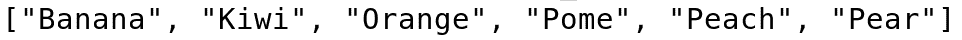

# 第二章：额外的性能提升

一旦你的应用程序避免了常见的性能瓶颈，就是时候转向更复杂的功能提升了。Rust 有许多选项，允许你通过使用不太为人所知的 API 来提高你代码的性能。这将使你的性能与 C/C++ 相当，在某些场景中，它甚至可以提高大多数最快的 C/C++ 脚本的运行速度。

在本章中，我们将探讨以下主题：

+   编译时检查

+   编译时状态机

+   额外的性能提升，例如使用闭包来避免运行时评估

+   不稳定的排序

+   映射哈希

+   标准库集合

# 编译时检查

Rust 有一个惊人的类型系统。它如此强大，以至于它本身就是一个图灵完备的。这意味着你只需使用 Rust 的类型系统就可以编写非常复杂的程序。这可以极大地帮助你的代码，因为类型系统在编译时进行评估，这使得你的运行时速度更快。

从基础知识开始，我们所说的*类型系统*是什么意思？嗯，这意味着所有那些特质、结构、泛型和枚举，你可以在运行时使用它们来使你的代码非常专业化。一个有趣的事实是：如果你创建了一个泛型函数，它使用了两种不同的类型，Rust 将编译两个特定的函数，每个类型一个。

这可能看起来像是代码重复，但事实上，对于给定的类型，拥有一个特定的函数通常比尝试泛化多个函数要快。这也允许创建专门的方法，这些方法将考虑它们使用的数据。让我们用一个例子来看看。假设我们有两个结构，我们希望它们输出一些信息：

```rs
struct StringData {
    data: String,
}

struct NumberData {
    data: i32,
}
```

我们创建了一个特质，我们将为它们实现它，它将返回可以在控制台显示的内容：

```rs
use std::fmt::Display;

trait ShowInfo {
    type Out: Display;
    fn info(&self) -> Self::Out;
}
```

我们为我们的结构实现了它。请注意，我决定在`StringData`结构的情况下返回数据字符串的引用。这简化了逻辑，但增加了一些生命周期和一些额外的引用到变量。这是因为引用必须在`StringData`有效时有效。如果不是，它可能会尝试打印不存在的数据，而 Rust 阻止我们这样做：

```rs
impl<'sd> ShowInfo for &'sd StringData {
    type Out = &'sd str;
    fn info(&self) -> Self::Out {
        self.data.as_str()
    }
}

impl ShowInfo for NumberData {
    type Out = i32;
    fn info(&self) -> Self::Out {
        self.data
    }
}
```

如你所见，其中一个返回一个字符串，另一个返回一个整数，因此创建一个允许它们都工作的函数将非常困难，尤其是在强类型语言中。但是，由于 Rust 为它们创建了两个完全不同的函数，每个函数都使用自己的代码，这可以通过泛型来解决：

```rs
fn print<I: ShowInfo>(data: I) {
    println!("{}", data.info());
}
```

在这种情况下，`println!` 宏将调用 `i32` 和 `&str` 结构的特定方法。然后我们简单地创建一个小的 `main()` 函数来测试一切，你应该能看到它如何完美地打印出这两个结构：

```rs
fn main() {
    let str_data = StringData {
        data: "This is my data".to_owned(),
    };
    let num_data = NumberData { data: 34 };

    print(&str_data);
    print(num_data);
}
```

你可能会想，这与 Java 等语言使用接口的方式相似，在功能上确实如此。但谈到性能，我们这本书的主题，它们非常不同。在这里，生成的机器代码在两次调用之间将会有所不同。一个明显的症状是`print()`方法获得了它接收的值的所有权，因此调用者必须将其传递到 CPU 的寄存器中。尽管这两种结构在本质上都是不同的。一个比另一个大（包含字符串指针、长度和容量），因此调用方式必须不同。

所以，太好了，Rust 不使用与 Java 接口相同的结构。但你为什么要关心这个呢？好吧，有多个原因，但有一个可能会让你了解这是如何完成的。让我们创建一个状态机。

# 顺序状态机

让我们先思考如何在 C/C++环境中实现它。你可能会有一个全局状态，然后是一个`while`循环，每次迭代后都会改变状态。当然，实现状态机有许多方法，但在 C 语言中，所有这些方法都需要元编程或对全局状态的运行时评估。

在 Rust 中，我们有一个图灵完备的类型系统，为什么不尝试用它来创建状态机呢？让我们首先定义一些将具有创建状态机能力的特质。我们首先定义一个`StateMachine`特质，它将具有从一个状态移动到另一个状态的功能：

```rs
pub trait StateMachine {
    type Next: MainLogic;
    fn execute(self) -> Self::Next;
}
```

如你所见，我已经添加了一个新的类型，`MainLogic`。这将是一个代表可以在状态中执行逻辑的结构特质的类型。`StateMachine`特质本身很简单。它只包含一个类型，它将是下一个状态，以及一个`execute()`函数，它消耗自身，这样就没有人可以在不进入下一个状态的情况下执行同一个状态两次（下一个状态又可以是它自己）。它简单地返回一个新的状态机。这里我们有`MainLogic`特质：

```rs
pub trait MainLogic {
    fn main_logic(self);
}
```

这只是一个执行状态逻辑的函数。这个状态机的主体功能，将使其能够从一个状态移动到下一个状态，始终执行正确的逻辑，是在`MainLogic`特质的默认实现中定义的：

```rs
impl<S> MainLogic for S
where
    S: StateMachine,
{
    fn main_logic(self) {
        self.execute().main_logic();
    }
}
```

这将为任何实现`StateMachine`特质的状态实现`MainLogic`特质。它将简单地执行状态，然后调用下一个状态的主逻辑。如果这个新状态也是`StateMachine`，它将被执行，然后执行下一个状态。这种模式在你想顺序执行不同的状态时特别有用。最后一个状态将是实现`MainLogic`但不是`StateMachine`的状态：

```rs
struct FirstState;
struct LastState;

impl StateMachine for FirstState {
    type Next = LastState;

    fn execute(self) -> Self::Next {
        unimplemented!()
    }
}

impl MainLogic for LastState {
    fn main_logic(self) {
        unimplemented!()
    }
}
```

编译器将确保你在编译时正确地从第一个状态转换到第二个状态，并强制你这样做。但更重要的是，这将编译成非常高效的代码，效率与逐个执行顺序调用一样高，但提供了 Rust 所提供的所有安全性。事实上，正如你所见，`FirstState`和`Laststate`都没有属性。这是因为它们没有大小。它们在运行时不会占用内存空间。

这是最简单的状态机。它只会允许你从一个状态前进到下一个状态。如果你想要这样做，这很有帮助，因为它将确保你的流程在编译时得到检查，但它不会执行复杂的模式。如果你在一个先前状态上循环，你将无限循环。这也会在每个状态都有一个定义的下一个状态，并且没有其他可能性从这个状态产生时很有用。

# 复杂的状态机

一个更复杂的状态机，允许你在代码中从一个状态移动到另一个状态，同时仍然使用类型系统来检查正确的使用，是可以实现的。让我们首先定义状态机。我们希望一个机器能够代表机器人在汽车制造设施中的工作方式。假设它的任务是安装两扇车门。它将首先等待下一辆车到来，取下车门，将其放置到位，安装螺栓，对第二扇车门做同样的操作，然后等待下一辆车。

我们将首先定义一些将使用传感器并模拟的函数：

```rs
fn is_the_car_in_place() -> bool {
    unimplemented!()
}
fn is_the_bolt_in_place() -> bool {
    unimplemented!()
}
fn move_arm_to_new_door() {
    unimplemented!();
}
fn move_arm_to_car() {
    unimplemented!()
}
fn turn_bolt() {
    unimplemented!()
}
fn grip_door() {
    unimplemented!()
}
```

当然，真正的软件需要考虑许多因素。它应该检查环境是否安全，移动车门到汽车的方式应该是最优的，等等，但现在的简化已经足够了。我们现在定义一些状态：

```rs
struct WaitingCar;
struct TakingDoor;
struct PlacingDoor;
```

然后，我们定义机器本身：

```rs
struct DoorMachine<S> {
    state: S,
}
```

这个机器将持有内部状态，可以附加一些信息（可以是任何类型的结构）或者可以有一个零大小的结构，因此具有零字节的大小。然后我们将实现我们的第一个转换：

```rs
use std::time::Duration;
use std::thread;

impl From<DoorMachine<WaitingCar>> for DoorMachine<TakingDoor> {
    fn from(st: DoorMachine<WaitingCar>) -> DoorMachine<TakingDoor> {
        while !is_the_car_in_place() {
            thread::sleep(Duration::from_secs(1));
        }
        DoorMachine { state: TakingDoor }
    }
}
```

这将简单地每秒检查一次汽车是否在正确的位置。一旦它在正确的位置，它将返回下一个状态，即`TakingDoor`状态。函数签名确保你无法返回错误的状态，即使你在`from()`函数内部执行非常复杂的逻辑。此外，在编译时，这个`DoorMachine`将具有零字节大小，正如我们所见，因此它不会消耗 RAM，无论我们的状态转换多么复杂。当然，`from()`函数的代码将存储在 RAM 中，但必要的检查都会在编译时完成。

然后，我们将实现下一个转换：

```rs
use std::time::Duration;
use std::thread;

impl From<DoorMachine<TakingDoor>> for DoorMachine<PlacingDoor> {
    fn from(st: DoorMachine<TakingDoor>) -> DoorMachine<PlacingDoor> {
        move_arm_to_new_door();
        grip_door();

        DoorMachine { state: PlacingDoor }
    }
}
```

最后，对于最后一个状态，也可以做类似的事情：

```rs
use std::time::Duration;
use std::thread;

impl From<DoorMachine<PlacingDoor>> for DoorMachine<WaitingCar> {
    fn from(st: DoorMachine<PlacingDoor>) -> DoorMachine<WaitingCar> {
        move_arm_to_car();
        while !is_the_bolt_in_place() {
            turn_bolt();
        }

        DoorMachine { state: WaitingCar }
    }
}
```

机器可以从任何给定的状态开始，从一个状态移动到另一个状态将像编写以下内容一样简单：

```rs
    let beginning_state = DoorMachine { state: WaitingCar };
    let next_state: DoorMachine<TakingDoor> = beginning_state.into();
```

你可能会想，“我为什么不简单地写两个函数并按顺序执行它们？”答案并不直接，但很容易解释。这让你在编译时避免了许多问题。例如，如果每个状态只有一个可能的下一个状态，你可以使用一个通用的`into()`函数，而无需知道当前状态，它将简单地工作。

在一个更复杂的环境中，你可能会发现自己做以下模式：

```rs
    let beginning_state = DoorMachine { state: WaitingCar };
    let next_state: DoorMachine<TakingDoor> = beginning_state.into();

    // Lots of code

    let last_state: DoorMachine<PlacingDoor> = next_state.into();
```

当然，如果你正确地看待它，我们就不再处于第一个状态了！如果机器试图再次改变状态，认为它仍然处于第一个状态，会发生什么？嗯，这正是 Rust 发挥作用的地方。`into()`函数获取绑定所有权，所以这根本无法编译。Rust 会抱怨`beginning_state`不再存在，因为它已经被转换成了`next_state`。

# 真实的类型系统检查示例

在谈论编译时检查和高性能计算时，有一个例子我非常喜欢：Philipp Oppermann 为内核编写了一个只有两个特质的类型安全分页系统。让我们首先理解这个问题，然后尝试解决方案。

当一个程序在计算机上使用内存时，它必须将虚拟内存与物理内存分开。这是因为运行在操作系统中的每个程序都会认为整个地址空间是它们的。这意味着在一个 64 位机器上，每个程序都会认为它有 16 **exbibytes**（**EiB**）的内存，即 2⁶⁴字节。

当然，这并不是世界上任何计算机的情况，所以内核所做的就是将内存从 RAM 移动到 HDD/SSD，并将所需的内存放入 RAM。为了正确工作，内存必须以块的形式进行管理，因为移动单个内存地址是没有意义的。这些被称为页面，对于 x86_64 处理器（大多数笔记本电脑和台式计算机的情况）来说，它们通常大小为 4 KiB。

为了使分页易于管理，创建了一个分页层次结构。每 512 页被添加到一个称为 P1 表的索引中，每 512 个 P1 表被添加到一个 P2 表中。这个过程递归进行，直到所有页面都被分配，这将达到 4 级。这就是它被称为 4 级分页的原因。

这个想法是，内核应该能够向一个表请求其页面之一，如果它是一个 P4 表，它应该能够请求一个 P3，然后是 P2，然后是 P1，最后加载由 P1 引用的页面。这个地址通过一个 64 位寄存器传递，所以所有数据都在那里。问题是，对于每种表类型，可能会很容易出现大量的代码重复，或者我们可能会得到一个适用于所有页面的解决方案，但为了返回下一个表（如果它是 P4-P2 表）或实际页面（如果它是 P1 表），它必须在运行时检查当前页面。

第一种情况确实容易出错，难以维护，而第二种情况不仅继续容易出错，甚至需要在运行时进行检查，使其变慢。Rust 可以做得更好。

解决方案是定义一个所有页面都有的特质，让我们称它为`PageTable`，以及一个只有高阶表有的特质（不能直接返回页面但需要返回另一个页面表的表）。让我们称它为`HighTable`。由于所有`HighTable`类型也都是`PageTable`，一个特质将继承另一个特质：

```rs
pub trait PageTable {}

pub enum P4 {}
pub enum P3 {}
pub enum P2 {}
pub enum P1 {}

impl PageTable for P4 {}
impl PageTable for P3 {}
impl PageTable for P2 {}
impl PageTable for P1 {}
```

这创建了代表页面表级别的四个枚举。使用枚举而不是结构体的原因是空枚举不能实例化，这样可以避免一些错误。然后我们编写`HighTable`特质：

```rs
pub trait HighTable: PageTable {
    type NextTable: PageTable;
}

impl HighTable for P4 {
    type NextTable = P3;
}

impl HighTable for P3 {
    type NextTable = P2;
}

impl HighTable for P2 {
    type NextTable = P1;
}
```

如你所见，我们为每个枚举添加了一个关联类型来表示分页的下一级。但是，当然，在最后一级的情况下，它下面不会有另一个页面表。

这允许你定义与`HighTable`关联的函数，这些函数将无法被 P1 表等访问。它还让你创建一个`Page`类型，该类型将包含`Page`的内容（大致是一个字节数组），它是通用的，适用于任何级别。

Rust 将确保你无法在编译时尝试获取 P1 表的下一个表，而在运行时，这些枚举将消失，因为它们是零大小的。逻辑将是安全的，并且将在编译时进行检查，没有开销。

# 额外的性能技巧

编译时检查并不是唯一可以免费获得性能提升的地方。在第一章，“常见性能陷阱”中，我们看到了人们在 Rust 中编写的常见错误，但我们把最先进的技巧和窍门留给了这一章。

# 使用闭包来避免运行时评估

有时候，编写代码可能看起来很自然，但它的性能并不如预期。很多时候，这是由于 Rust 在运行时进行一些额外的计算。某人可能会编写以下不必要的计算示例：

```rs
    let opt = Some(123);
    let non_opt = opt.unwrap_or(some_complex_function());
```

我故意使这个例子简单，因为真实示例通常需要非常长的代码。尽管如此，其背后的思想是有效的。当你有一个`Option`或`Result`时，你有一些非常有用的函数来允许你获取其内部的值或默认值。有一个特定的函数，即`unwrap_or()`函数，它允许你指定默认值。当然，你可以向该函数传递任何你想要的东西，但如果你需要进行复杂的计算来计算默认值（并且它不是一个常量），代码的性能将会很差。

这是因为在调用`unwrap_or()`函数时，你必须事先计算出你传递的值。如果大部分时间值都存在且不需要计算，这就没有太多意义。更好的选择是使用`unwrap_or_else()`。这个函数接受一个闭包，该闭包只有在`Option`/`Result`为`None`/`Err`时才会执行。在这个具体案例中，由于`some_complex_function()`没有参数，你可以直接将其作为闭包使用：

```rs
    let opt = Some(123);
    let non_opt = opt.unwrap_or_else(some_complex_function);
```

但是，如果函数需要参数，你需要自己构建闭包：

```rs
    let opt = Some(123);
    let non_opt = opt.unwrap_or_else(|| {
        even_more_complex_function(get_argument())
    });
```

这样，你可以使用一个非常复杂的函数，复杂程度由你决定，如果函数内部有`Option`类型的内容，你将避免调用它。同时，你也会降低函数的圈复杂度。

# 不稳定排序

也有一个有趣的地方可以取得一些收益。通常，当你想要对一个向量进行排序时，例如，会使用稳定的排序。这意味着如果两个元素具有相同的排序，原始的顺序将被保留。让我们用一个例子来看看。假设我们有一个水果列表，我们想要按字母顺序对其进行排序，只考虑它们的第一个字母：

```rs
    let mut fruits = vec![
        "Orange", "Pome", "Peach", "Banana", "Kiwi", "Pear"
    ];
    fruits.sort_by(|a, b| a.chars().next().cmp(&b.chars().next()));

    println!("{:?}", fruits);
```

这将打印出以下内容：



并且按照这个顺序。即使按照整个单词排序时，`Peach`和`Pear`应该在`Pome`之前，但由于我们只考虑第一个字符，排序是正确的。最终的顺序取决于开始的顺序。如果我改变了第一个列表，将`Pome`放在`Peach`之后，最终的顺序将是`Pome`在`Peach`之后。这被称为**稳定的排序**。

另一方面，不稳定的排序并不试图保留之前的顺序。因此，`Pome`、`Peach`和`Pear`之间的顺序可以是任意的。这与按第一个字母排序的条件一致，但不会保留原始顺序。

这种不稳定排序实际上比稳定排序更快，如果你不介意尊重初始顺序，你可以在排序操作中节省宝贵的时间，排序操作是最耗时的操作之一。一个简单的例子是按字母顺序对结果列表进行排序。在出现不匹配的情况下，你通常不关心它们在数据库中的排序方式，所以一个在前一个在后或者反过来都没有关系。

要使用不稳定的排序，你需要调用`sort_unstable()`或`sort_unstable_by()`，这取决于你是否想使用每个`PartialOrd`元素的默认比较，或者使用你自己的分类器，如果你需要一个自定义的分类器，或者向量的元素不是`PartialOrd`。考虑以下使用不稳定排序的示例：

```rs
    let mut fruits = vec![
        "Orange", "Pome", "Peach", "Banana", "Kiwi", "Pear"
    ];
    fruits.sort_unstable_by(|a, b| a.chars().next().cmp(&b.chars().next()));

    println!("{:?}", fruits);
```

这种情况下的可能输出如下，这在稳定的排序中是不可能的：


因此，总结一下，如果你真的需要保持输入的顺序，使用稳定的排序；如果不，使用不稳定的排序，因为这将使你的程序运行得更快。

# 映射哈希

Rust 还有一个开发选项，允许你使映射的哈希更快。这来自于这样一个想法：当在`HashMap`中存储信息时，例如，键被哈希或进行快速查找。这很好，因为它允许使用任意长和复杂的键，但在检索值或插入新值时增加了开销，因为必须计算哈希。

Rust 允许你更改`HashMap`的哈希方法，甚至可以创建自己的。当然，通常最好的做法是使用默认的哈希算法，因为它已经过彻底测试，避免了冲突（不同的键具有相同的哈希值并相互覆盖）。Rust 的默认哈希器是一个非常高效的哈希器，但如果你需要性能，并且你正在处理一个非常小的`HashMap`或某种可预测的`HashMap`，使用你自己的函数或甚至 Rust 中包含的更快函数是有意义的。

但要注意——在一个用户可以提供（或操作）键的环境中，使用这些函数是非常危险的。他们可能会生成冲突并修改他们不应访问的键的值。他们甚至可以使用它来创建拒绝服务攻击。

使用不同的哈希方法就像在创建`HashMap`时使用`with_hasher()`函数一样简单：

```rs
use std::collections::HashMap;
use std::collections::hash_map::RandomState;

// <u8, u8> as an example, just to make the type inference happy.
let map: HashMap<u8, u8> = HashMap::with_hasher(RandomState::new());

```

目前，标准库中仅提供`RandomState`；其余的都已弃用。但你可以通过实现`Hasher`特性来创建自己的：

```rs
use std::hash::{BuildHasher, Hasher};

#[derive(Clone)]
struct MyHasher {
    count: u64,
}

impl Hasher for MyHasher {
    fn finish(&self) -> u64 {
        self.count
    }

    fn write(&mut self, bytes: &[u8]) {
        for byte in bytes {
            self.count = self.count.wrapping_add(*byte as u64);
        }
    }
}

impl BuildHasher for MyHasher {
    type Hasher = Self;
    fn build_hasher(&self) -> Self::Hasher {
        self.clone()
    }
}
```

这创建了`MyHasher`结构，其中包含一个可以按你的意愿初始化的计数器。`hash`函数实际上非常简单；它只是将键的所有字节相加，并返回一个包含求和结果的`u64`。在这里生成冲突很容易：你只需要让你的字节求和相同。所以`[45, 23]`将具有与`[23, 45]`相同的哈希值。但它作为一个哈希器的例子。还需要`BuildHasher`特性，它只需要返回一个`Hasher`的实例。我派生了`Clone`特性，并简单地克隆了它。

这很容易使用，就像我们之前看到的那样：

```rs
    use std::collections::HashMap;

    let mut map = HashMap::with_hasher(MyHasher { count: 12345 });
    map.insert("Hello", "World");
```

这可能比默认的哈希器更快，但安全性也会低得多。所以请小心选择你使用的哈希函数。

# 完美哈希函数

如果在编译时已知映射，并且在运行时不会改变，那么有一个非常、非常快的系统可以按数量级提高映射的使用效率。它被称为**完美哈希函数**，这是它们的关键：它们执行最小的计算来确定一个哈希值是否存储在哈希表中。这是因为它将一个，且仅有一个整数映射到每个元素。并且没有冲突。当然，这需要在编译时有一个已知的常量哈希表。

要使用它们，你需要 `phf` 包。使用这个包，你可以在 `build.rs` 文件中定义一个哈希表，该文件与 `Cargo.toml` 文件位于同一级别，并且使用它时，代码中的开销不会比比较操作更大。让我们看看如何配置它。

首先，你需要将 `phf_codegen` 包添加为开发依赖项。为此，你需要在 `Cargo.toml` 中添加一个 `build-dependencies` 部分，其语法与 `dependencies` 部分相同。然后，你需要创建一个 `build.rs` 文件，并在其中需要如下内容：

```rs
extern crate phf_codegen;

use std::path::Path;
use std::env;
use std::fs::File;
use std::io::{BufWriter, Write};

fn main() {
    let out_dir = env::var("OUT_DIR").unwrap();
    let path = Path::new(&out_dir).join("phf.rs");
    let mut file = BufWriter::new(File::create(&path).unwrap());

    let map = [("key1", "\"value1\""), ("key2", "\"value2\"")];

    write!(
        &mut file,
        "static MAP: phf::Map<&'static str, &'static str> =\n"
    ).unwrap();

    let mut phf_map = phf_codegen::Map::new();
    for &(key, value) in &map {
        phf_map.entry(key, value);
    }

    phf_map.build(&mut file).unwrap();
    write!(&mut file, ";\n").unwrap();
}
```

让我们检查这里发生了什么。`build.rs` 脚本在编译开始之前运行（如果存在）。我们有一个键/值元组的数组映射。然后它创建一个代码生成映射，并逐个将条目添加到映射中。这必须在一个循环中完成，因为编译器栈可能会因为深度递归而溢出。

它将写入一个名为 `phf.rs` 的文件，首先添加一个静态变量，然后写入整个映射到文件中，并以新行结束。这意味着一旦开始编译，就会存在一个名为 `phf.rs` 的新文件，我们可以从我们的代码中使用它。如何？你需要直接在代码中包含这个文件：

```rs
extern crate phf;

include!(concat!(env!("OUT_DIR"), "/phf.rs"));

fn main() {
    println!("{}", MAP.get("key1").unwrap());
}
```

这将打印与 `key1` 关联的值，在这种情况下，是 `value1`。

注意，在 `build.rs` 文件中创建映射时，值是直接写入的，所以如果你想放一个字符串，你需要添加引号并转义它们。这使你能够添加枚举变体，或者为值直接编写代码。

一旦你学会了如何使用编译时哈希表，你应该了解标准库允许你使用的不同类型的集合，因为这对你的应用程序的速度和内存占用至关重要。

# 标准库集合

Rust 的标准库在 `std::collections` 模块中有八种不同的集合类型。它们被分为序列、映射、集合和一个不适合任何组的二叉堆。最著名的是 `HashMap` 和 `Vec`，但每个都有其用例，你应该了解它们，以便在每个时刻使用正确的类型。

官方的标准库文档非常好，所以你应该彻底检查它。无论如何，我将会介绍这些类型，以便你能够熟悉它们。让我们从序列开始。

# 序列

在 Rust 以及大多数语言中，最常用的动态序列是向量，在 Rust 中表示为 `Vec`。你可以使用 `push()` 方法向向量的末尾添加元素，并使用 `pop()` 方法获取最后一个元素。你也可以遍历向量，默认情况下它将从前往后遍历，但你也可以反转迭代器从后往前遍历。一般来说，Rust 中的向量可以比作栈，因为它主要是一个后进先出（LIFO）结构。

向量在你想向列表中添加新元素，并且你愿意使用索引在切片中获取元素时非常有用。记住，向量可以作为切片引用，并且可以使用范围进行索引。有趣的是，你可以将向量转换为 boxed slice，这类似于数组，但分配在堆上而不是栈上。你只需要调用`into_boxed_slice()`方法。这在向量增长完成后，你想让它占用更少的 RAM 时很有用。向量有一个容量、一个长度和一个指向元素的指针，而 boxed slice 将只包含指针和长度，从而避免一些额外的内存使用。

另一个有用的序列是`VecDeque`序列。这个结构是一个 FIFO 队列，你可以使用`push_back()`方法将元素追加到队列的末尾，并使用`pop_front()`从前面弹出元素。这可以用作缓冲区，因为它可以在你继续向队列末尾添加元素的同时从前端消耗。当然，为了在跨线程边界使用它作为缓冲区，你需要使用`Mutex`等锁。这些队列的迭代从前面到后面，与向量中的迭代方式相同。它是通过可增长的环形缓冲区实现的。

最后，`LinkedList`是另一种顺序列表，其特点是它不像在内存中有一个元素块，每个元素都链接到它前面的一个和后面的一个，因此不需要索引。迭代很容易，删除列表中的任何元素也很容易，无需留下空隙或重新排序内存，但通常它不是非常节省内存，并且需要更多的 CPU 消耗。

你大多数时候会倾向于使用`Vec`或`VecDeque`。`LinkedLists`通常只有在需要在序列中间进行许多插入和删除操作时才是一个好的选择，因为在这种情况下，`Vecs`和`VecDeques`将不得不重新排序，这需要很多时间。但如果你通常只会从后端更改列表的结构，`Vec`是最好的选择；如果你也会从前端更改它，那么`VecDeque`。记住，在这两种情况下，你可以通过索引轻松读取任何元素，只是从中部删除或添加它们会更耗时。

# 映射

有两种类型的映射：`HashMap`和`BTreeMap`。它们之间的主要区别在于它们在内存中的排序方式。它们有类似的方法来插入和检索元素，但性能会根据操作有很大变化。

`HashMap` 创建一个索引，其中每个键通过哈希值指向相应的元素。这样，你就不需要为每个新的 `insert`/`delete`/`get` 操作检查整个键。你只需对它进行哈希，然后在索引中搜索。如果存在，可以检索、修改或删除；如果不存在，可以插入。插入新元素非常快，只需将其添加到索引中即可。检索也大致相同：如果哈希索引存在，则获取其值；所有操作都在 `O(1)` 时间内完成。不过，你不能将一个 `HashMap` 添加到另一个中，因为它们的哈希算法将不同，或者至少处于不同的状态。

另一方面，`BTreeMap` 不创建索引。它维护一个有序的元素列表，因此当你想要插入或获取一个新元素时，它会进行二分搜索。检查键是否大于列表中间的键。如果是，将列表的后半部分分成两部分，并再次使用后半部分的中间元素尝试；如果不是，对前半部分做同样的操作。

这样，你不必将每个元素与映射中的所有元素进行比较，并且可以快速检索它们。添加新元素的操作成本也类似，所有操作都可以在 `O(log n)` 时间内完成。你还可以将另一个 `BTreeSet` 添加到这个集合中，并且元素将被重新排序，以便搜索尽可能快。

# 集合

`HashMap` 和 `BTreeMap` 都有它们的集合对应物，分别称为 `HashSet` 和 `BTreeSet`。两者都是基于相同的思想实现的：有时你不需要键/值存储，只需要一个元素存储，你可以通过迭代来检索元素列表，或者通过比较来检查元素是否在内部。

它们的实现方式与它们的映射对应物相同，你可以将它们视为它们的映射对应物，但带有空值，其中只有键在执行工作。

# 摘要

在本章中，你学习了如何利用编译时检查的优势。你学习了 Rust 的类型系统如何帮助你创建复杂且安全的操作，而无需运行时开销。你学习了如何创建状态机以及如何使你的代码更不容易出错。

你还了解了一些额外的性能增强，这些增强补充了 第一章 中提到的内容，*常见的性能陷阱*。你学习了不稳定的排序和映射哈希，包括编译时创建的完美哈希函数，以及如何创建没有运行时开销的编译时哈希映射。

最后，你了解了标准库中的集合，它们的分类以及根据情况选择哪种类型的集合。你了解了序列、映射和集合，以及它们如何适应你的代码。

在第三章，*Rust 中的内存管理*，我们将讨论 Rust 中的内存管理。即使，在 Rust 中，你不需要手动分配和释放内存，仍然有许多事情你可以做来优化你的内存占用。
