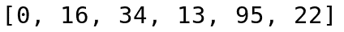
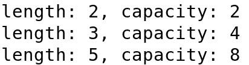
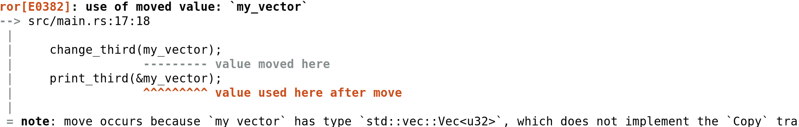
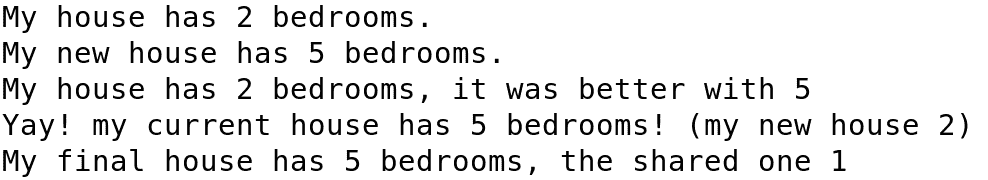

# Rust 中的内存管理

到目前为止，我们一直在谈论 Rust 编译器如何自己处理内存，以及这如何使它内存安全，并给我们一些额外的超级能力，而无需担心创建内存漏洞。尽管如此，使用不可安全作用域，甚至使用安全代码，你所能完成的事情是没有限制的。

我们将检查 Rust 提供的所有有关内存管理的配置和元编程选项，并看看我们如何通过使用安全和不可安全代码来改进我们的代码。

在本章中，我们将探讨以下主题：

+   学习借用检查器的规则

+   绑定生命周期

+   内存表示

+   与 C/C++的 FFI 数据表示

+   共享指针

+   引用计数指针

# 掌握借用检查器

为了确保内存和线程安全，Rust 的借用检查器有三个简单的规则。除了在不可安全的作用域之外，这些规则贯穿整个代码。以下是它们：

+   每个绑定都将有一个所有者

+   一个绑定只能有一个所有者

+   当所有者超出作用域时，绑定将被丢弃

这三条规则看起来很简单，但它们对我们编码方式的影响很大。编译器可以在所有者超出作用域之前就知道，所以它总是会知道何时释放/销毁绑定/变量。这意味着你可以编写代码，而无需考虑在哪里创建变量，在哪里调用析构函数，或者你是否已经调用过析构函数或者你正在重复调用它。

当然，这伴随着一个额外的学习曲线，有时可能很难跟上。第二条规则是大多数人发现难以管理。由于一次只能有一个所有者，共享信息有时变得有些困难。

让我们用一个已知类型，`Vec`类型的例子，来看看这种行为：

```rs
    let mut my_vector = vec![0, 16, 34, 13, 95];
    my_vector.push(22);
    println!("{:?}", my_vector);
```

这将打印以下内容：



在当前作用域的末尾（例如`main()`函数），将通过调用其析构函数来丢弃向量。在这种情况下，它将简单地干净地释放内存然后销毁自己。

# 分配

为了使变量可增长（以便它可以在不同时间占据内存中的不同空间），它需要在堆上分配，而不是在栈上。栈工作得更快，因为程序加载时，它会自动分配给它。但堆较慢，因为每次分配都需要对内核执行系统调用，这意味着你需要进行上下文切换（到内核模式）然后再切换回来（到用户模式）。这会使事情变得太慢。

向量（以及其他标准库结构）有一种有趣的内存分配方式，以便它们尽可能高效地执行。让我们检查它使用此代码分配新内存的算法：

```rs
    let mut my_vector = vec![73, 55];
    println!(
        "length: {}, capacity: {}",
        my_vector.len(),
        my_vector.capacity()
    );

    my_vector.push(25);
    println!(
        "length: {}, capacity: {}",
        my_vector.len(),
        my_vector.capacity()
    );

    my_vector.push(33);
    my_vector.push(24);
    println!(
        "length: {}, capacity: {}",
        my_vector.len(),
        my_vector.capacity()
    );
```

输出应该是这样的：



这意味着，一开始，向量只会分配我们前两个元素所需的空间。但一旦我们添加一个新的元素，它将为两个新元素分配空间，所以当进行第四次 push 时，它就不需要再分配更多内存。当我们最终插入第五个元素时，它为另一个四个元素分配空间，这样它就不需要再分配，直到它达到第九个。

如果你遵循这个进程，下一次它将为 8 个更多元素分配空间，使容量增长到 16。这取决于第一次分配，如果我们从 3 个元素开始向量，数字将是 3、6、12、24...无论如何，我们可以使用两个函数`reserve()`和`reserve_exact()`强制向量预先分配一定数量的元素。前者将为至少给定数量的元素保留空间，而后者将为正好给定数量的元素保留空间。当你知道输入的大小，这样它就不需要一次又一次地分配，这非常有用。它只会分配一次。

# 可变性、借用和拥有

Rust 中还有一些关于可变性的规则，可以防止线程之间的数据竞争。让我们看看它们：

+   所有绑定默认都是不可变的

+   在同一时间可以有无限制的不可变借用

+   在任何给定时间点，一个绑定最多只能有一个可变借用

+   如果存在可变借用，则在该时间点不能存在不可变借用

它们相对容易理解。你可以从你想要的地方读取绑定内容，但如果你想修改一个绑定，你必须确保没有其他读者或写者存在。这当然可以防止数据竞争，但会使你的编码变得有些麻烦。

让我们通过几个例子来看看这个。首先定义这两个函数：

```rs
fn change_third(slice: &mut [u32]) {
    if let Some(item) = slice.get_mut(2) {
        *item += 1
    }
}

fn print_third(slice: &[u32]) {
    if let Some(item) = slice.get(2) {
        println!("Third element: {}", item);
    }
}
```

`change_third()`函数需要一个可变的`u32`切片，如果切片至少有三个元素，它将用于将`1`添加到第三个元素。第二个将打印该元素。然后你可以使用这个`main()`函数来测试它：

```rs
fn main() {
    let mut my_vector = vec![73, 55, 33];
    print_third(&my_vector);
    change_third(&mut my_vector[..]);
    print_third(&my_vector);
}
```

如您所见，由于两个函数都借用了向量（一个可变借用，另一个不可变借用），您可以在`main()`函数中继续使用向量。这意味着向量的所有权在`main()`函数中。

如果我们有一个拥有向量所有权的函数，我们就无法在以后使用它。考虑将`change_third()`函数更改为这个：

```rs
fn change_third(mut slice: Vec<u32>) {
    if let Some(item) = slice.get_mut(2) {
        *item += 1
    }
}
```

在这种情况下，函数接收参数并拥有向量的所有权（在函数声明中没有切片或引用）。当然，我们需要更改对函数的调用：

```rs
    change_third(my_vector);
```

问题在于程序将无法编译。在我们将向量的所有权交给`change_third()`函数之后，`main()`函数中将不再有`my_vector`变量。Rust 编译器显示的错误信息非常明确，它甚至会指出问题所在：



总结来说，如果你在使用变量调用函数之后还需要继续使用该变量，应该通过引用传递，让函数借用你的变量但不拥有它。如果不这样做，而你又希望新函数对变量有绝对的控制权（甚至可以丢弃它），那么就通过值传递。这一点不适用于`Copy`类型，正如我们在第一章中看到的，*常见性能陷阱*，因为在这种情况下，整个对象都会被复制到新函数中。

引用可能有点难以管理。我们有时需要结构体具有引用值，但由于结构体不会拥有变量以丢弃它，它必须确保变量所有者不会在使用期间丢弃它。为此，我们有生命周期。

# 生命周期

在 Rust 中，每个变量、结构体属性和常量都有一个生命周期。其中大多数都可以省略，因为我们通常知道常量具有静态生命周期（它将始终存在），或者大多数变量具有其作用域的生命周期。尽管如此，有时我们还需要指定生命周期。让我们检查以下结构体：

```rs
struct Parent<'p> {
    age: u8,
    child: Option<&'p Child>,
}

struct Child {
    age: u8,
}
```

如您所见，父结构体有一个指向孩子的引用，但我们添加了两个以单引号为前缀的字母。这些都是生命周期指定，这意味着指向孩子的引用至少要和父结构体存在的时间一样长。让我们用一个简单的`main()`函数来看看这种行为：

```rs
fn main() {
    let child = Child { age: 10 };
    let parent = Parent {
        age: 35,
        child: Some(&child),
    };

    println!("Child's age: {} years.", parent.child.unwrap().age);
}
```

这将打印出孩子是`10`岁。孩子会在`main`函数的末尾被丢弃，所以引用在`parent`存在时是有效的。但让我们创建一个小的内部作用域来看看我们是否能欺骗编译器。内部作用域是显式的作用域，你可以通过使用花括号来创建。所有在内部定义的变量将在内部作用域的末尾被丢弃，如果在末尾添加了一个没有分号的表达式，那么这个表达式的值将是作用域的值，并且可以赋给任何变量。

让我们尝试向一个将在内部作用域中被丢弃的`parent`添加一个`child`：

```rs
    let mut parent = Parent {
        age: 35,
        child: None,
    };

    {
        let child = Child { age: 10 };
        parent.child = Some(&child);
    }

    println!("Child's age: {} years.", parent.child.unwrap().age);
```

如果我们尝试编译这段代码，编译器会告诉我们`child`的生命周期不够长。编译器已经理解了我们在结构体中告诉它的，即`child`的生命周期至少要和`Parent`结构体一样长，并且由于在这种情况下，它知道内部作用域中定义的变量将在那里被丢弃，因此它会在编译时提出警告，并阻止你将其添加到`parent`中。

这可以扩展到函数。让我们考虑一个非常简单的函数，该函数返回两个提供的子项中最年长的子项的引用：

```rs
fn oldest_child(child1: &Child, child2: &Child) -> &Child {
    if child1.age > child2.age {
        child1
    } else {
        child2
    }
}
```

这将无法编译，因为它需要一个生命周期参数。这意味着编译器不知道返回的子项是否会像`child1`一样长时间存活，或者像`child2`一样长时间存活。我们也不知道，所以我们将指定所有生命周期必须至少与当前函数一样长，然后其余的就是我们调用者的问题：

```rs
fn oldest_child<'f>(child1: &'f Child, child2: &'f Child) -> &'f Child {
    if child1.age > child2.age {
        child1
    } else {
        child2
    }
}
```

这只是声明了一个新的生命周期（在参数前的第一个括号之前声明），我们称之为`f`，它将是函数的生命周期。然后我们指定所有引用必须至少与函数一样长。

# 内存表示

除了管理引用、所有权、分配和复制之外，我们还可以管理我们之前看到的那些结构的内存布局，我们可以通过使用安全和不可安全代码来实现这一点。让我们首先了解 Rust 如何管理内存。考虑以下结构：

```rs
struct Complex {
    attr1: u8,
    attr2: u16,
    attr3: u8,
}
```

# 对齐

当从内存中访问属性时，它们需要对齐，以便它们在内存中的位置是它们大小的倍数，在这种情况下是 16 位。这样，当我们尝试获取每个属性时，我们只需要将 16 位加到结构的基址上，乘以属性。这使得信息检索更加高效，并且这是由编译器自动完成的。主要问题是，为了使每个属性对齐为 16 位，编译器需要为前三个属性中的每一个填充 8 位。

这意味着结构将被转换为以下形式：

```rs
struct Complex {
    attr1: u8,
    _pad1: u8,
    attr2: u16,
    attr3: u8,
    _pad2: u8,
}
```

但是，在这个具体案例中，`attr1`和`attr3`都有 8 位，所以它们不需要 16 位对齐；它们可以是 8 位对齐并且正常工作。这意味着我们可以将第一个属性移到末尾，这样它就会像有两个 16 位对齐的属性一样，第二个属性将包含两个 8 位对齐的属性：

```rs
struct Complex {
    attr2: u16,
    attr1: u8,
    attr3: u8,
}
```

这不需要额外的填充，因此结构将占用 32 位（而不是之前的 48 位）。这是一个典型的优化，在 C/C++中必须手动完成，这会打乱我们的属性顺序，但在 Rust 中我们可以做得更好。编译器知道这一点，并且会尽可能重新排序字段以获得更好的内存占用，因此你可以按照你想要的顺序放置属性。

但是，如果编译器已经自动完成这个操作，那么在性能优化书中这样做有什么意义呢？嗯，有一种情况你希望避免这种行为。

让我们面对现实，并不是所有的软件都是用 Rust 编写的，在高性能库的情况下，我们通常不得不使用 C 依赖项。幸运的是，Rust 可以无缝地与任何 C 兼容的接口集成，而且不收取任何费用。但是，如果你在 Rust 和 C 代码之间移动结构，你将遇到问题。

正如我们讨论的，Rust 会重新排序字段，这意味着 C 和 Rust 中的结构可能不会以相同的方式定位属性。不过，我们可以通过使用带有`C`值的`repr`属性来告诉 Rust 不要改变字段的顺序：

```rs
#[repr(C)]
struct Complex {
    attr3: u8,
    attr2: u16,
    attr1: u8,
}
```

这将使结构与 C 兼容。我们还可以告诉 Rust 不要对属性添加填充，因此即使对齐可能更好，结构也将是最小尺寸。请注意，这将破坏需要对齐结构的平台上的代码。如果您仍然想使用它，您只需简单地使用表示的`packed`形式：

```rs
#[repr(packed)]
struct Complex {
    attr3: u8,
    attr2: u16,
    attr1: u8,
}
```

# 复杂枚举

如果您了解 C/C++枚举，您知道每个元素代表一个值，并且您可以使用它们来避免记住可能值集中的正确整数。不过，它们不是强类型的，因此您可以混合不同的枚举。并且它们只能存储一个整数。

再次强调，Rust 可以做得更好，我们可以创建复杂的枚举，其中我们不仅可以有强类型（我们不会混合枚举），我们甚至可以在枚举中拥有比整数更多的内容。正如您在下面的`Color`枚举中可以看到的，我们可以有内部数据，甚至属性：

```rs
enum Color {
    Red,
    Blue,
    Green,
    Other { r: u32, g: u32, b: u32 },
}
```

如您所见，在这种情况下，枚举可以具有四种值之一，但在最后一种情况下，它将关联三个数字。这为您提供了几乎无限的可能性，您可以安全地表示任何数据结构。例如，查看`Serde` crate 对这个*任何 JSON 值*的实现，它是生态系统中最常用的 crate 之一：

```rs
pub enum Value {
    Null,
    Bool(bool),
    Number(Number),
    String(String),
    Array(Vec<Value>),
    Object(Map<String, Value>),
}
```

JSON 结构中的值可以是 null，布尔值（并且包含它是`true`还是`false`的信息），数字（这将是一个枚举，以了解它是正数、负数还是浮点数），字符串，包含文本信息，值的数组，或者一个整个 JSON 对象，其键为字符串，值为。

然而，这种方法有两个缺点。对于枚举的不同变体的比较，它们必须被标记。这意味着它们将需要占用一些额外的空间，仅为了在运行时区分它们。

第二个问题是，枚举类型的大小（不考虑标记）将是最大选项的大小。所以如果你有 10 个可以存储在 1 字节的选项，但另一个需要 10 字节，枚举将有 10 字节（加上标记）独立于存储的变体。这是因为它作为一个`union`（在 C/C++语言中）工作，其中所有变体共享相同的表示。

为了减轻这一点，一个选择是将大对象作为引用。我们可以有两种方式来做这件事。第一种方式是通过借用颜色，在这种情况下，编译器将强制我们不在创建颜色的任何函数中返回枚举（记住，引用将在作用域结束时被销毁）：

```rs
enum Color<'c> {
    Red,
    Blue,
    Green,
    Other(&'c Rgb),
}

struct Rgb {
    r: u32,
    g: u32,
    b: u32,
}
```

如果我们想避免这种情况，我们可以简单地通过装箱（是的，这将降低性能）将那个元素存储在堆上。这取决于你是否需要较低的 RAM 消耗或更快的速度。要存储堆上的元素，你需要使用`Box`类型，就像你在这里可以看到的那样：

```rs
enum Color {
    Red,
    Blue,
    Green,
    Other(Box<Rgb>),
}
```

# 联合体

此外，还有一种未标记的联合体类型。如果联合体中的类型不是`Copy`，你需要使用`untagged_unions`特性，并使用夜间编译器编译代码。这可以通过在联合体内使用的结构中派生`Copy`特性来避免，但我们不应该对大型结构这样做，就像我们之前讨论的那样：

```rs
union Plant {
    g: Geranium,
    c: Carnation,
}

#[derive(Copy, Clone)]
struct Geranium {
    height: u32,
}

#[derive(Copy, Clone)]
struct Carnation {
    flowers: u8,
}
```

在这个特定的例子中，`Plant`可以是`Geranium`或`Carnation`。或者更准确地说，它将同时是两者。`Plant`将具有其中最大的结构的大小，并且它不会为描述它是哪个变体的标签添加任何额外的填充。

这意味着当你在联合体中写入一个字段时，你也会改变其他字段。在创建联合体时，你只需要指定一个字段，由于编译器在编译时不知道它是哪个变体，因此你需要使用一个不安全块来读取值，就像你可以在下一段代码中看到的那样，因为读取未设置值最终会导致未定义行为：

```rs
fn main() {
    let mut my_plant = Plant {
        c: Carnation { flowers: 15 },
    };
    my_plant.g = Geranium { height: 300 };
    let height = unsafe { my_plant.g }.height;

    println!("Height: {}", height);
}
```

在这个例子中，我们首先创建一个`Plant`，它是一个`Carnation`，然后我们将其转换为`Geranium`。这种变化不需要不安全块，因为`Plant`将始终具有 32 位，即`Geranium`的大小，因此它可以安全地分配。

当我们检索高度时，尽管如此，我们需要指定我们想要将`Plant`作为`Geranium`来读取，然后获取高度。在这种情况下，它工作得非常好，因为我们已经将`Plant`更改为`Geranium`。如果我们在这个例子中尝试将植物作为`Carnation`获取，它将触发未定义行为。这意味着花朵的数量可能是一个随机数，取决于联合体的布局。尽管如此，这并不是一个安全漏洞，因为我们获取的花朵数量的`u8`将是`Geranium`高度的字节之一，它只是感觉随机（在我的情况下，它显示有 44 朵花）。

但在任何情况下，这对于与 C（FFI）接口特别有用。如果我们使用`#[repr(C)]`属性在联合体中，它将结构与 C 中的结构完全相同，因此我们可以将联合体发送到 C 库，而无需考虑如何模拟 C 联合体。

# 共享指针

Rust 最被批评的问题之一是难以开发具有共享指针的应用程序。正如我们之前看到的，由于 Rust 的内存安全保证，开发这类算法可能确实比较困难，但正如我们现在将看到的，标准库为我们提供了一些我们可以用来安全地允许这种行为的类型。

# 单元模块

标准库有一个有趣的模块，即 `std::cell` 模块，它允许我们使用具有内部可变性的对象。这意味着我们可以有一个不可变对象，并且仍然可以通过获取对底层数据的可变借用来修改它。当然，这不会符合我们之前看到的可变性规则，但 `Cell` 通过在运行时检查借用或对底层数据进行复制来确保这一点。

# Cells

让我们从基本的 `Cell` 结构开始。一个 `Cell` 将包含一个可变值，但它可以在没有可变 `Cell` 的情况下被修改。它主要有三个有趣的方法：`set()`、`swap()` 和 `replace()`。第一个允许我们设置包含的值，用新值替换它。之前的结构将被丢弃（析构函数将运行）。这一点与 `replace()` 方法不同。在 `replace()` 方法中，而不是丢弃之前的值，它将返回该值。另一方面，`swap()` 方法将取另一个 `Cell` 并在两个之间交换值。所有这些都不需要 `Cell` 是可变的。让我们用一个例子来看看：

```rs
use std::cell::Cell;

#[derive(Copy, Clone)]
struct House {
    bedrooms: u8,
}

impl Default for House {
    fn default() -> Self {
        House { bedrooms: 1 }
    }
}

fn main() {
    let my_house = House { bedrooms: 2 };
    let my_dream_house = House { bedrooms: 5 };

    let my_cell = Cell::new(my_house);
    println!("My house has {} bedrooms.", my_cell.get().bedrooms);

    my_cell.set(my_dream_house);
    println!("My new house has {} bedrooms.", my_cell.get().bedrooms);

    let my_new_old_house = my_cell.replace(my_house);
    println!(
        "My house has {} bedrooms, it was better with {}",
        my_cell.get().bedrooms,
        my_new_old_house.bedrooms
    );

    let my_new_cell = Cell::new(my_dream_house);

    my_cell.swap(&my_new_cell);
    println!(
        "Yay! my current house has {} bedrooms! (my new house {})",
        my_cell.get().bedrooms,
        my_new_cell.get().bedrooms
    );

    let my_final_house = my_cell.take();
    println!(
        "My final house has {} bedrooms, the shared one {}",
        my_final_house.bedrooms,
        my_cell.get().bedrooms
    );
}
```

如同示例中所示，要使用 `Cell`，包含的类型必须是 `Copy`。如果包含的类型不是 `Copy`，你需要使用 `RefCell`，我们将在下一节中看到。继续这个 `Cell` 示例，正如代码所示，输出将是以下内容：



因此，我们首先创建两个房子，我们选择其中一个作为当前的房子，并保持对当前的和新的房子进行修改。正如你可能看到的，我也使用了 `take()` 方法，它仅适用于实现了 `Default` 特质的类型。此方法将返回当前值，并用默认值替换它。正如你所见，你实际上并没有修改内部的值，而是用另一个值替换它。你可以检索旧值或者失去它。另外，当使用 `get()` 方法时，你得到当前值的副本，而不是它的引用。这就是为什么你只能使用与 `Cell` 一起实现的 `Copy` 元素。这也意味着 `Cell` 不需要在运行时动态检查借用。

# RefCell

`RefCell` 与 `Cell` 类似，但它接受非 `Copy` 数据。这也意味着在修改底层对象时，在返回它时不能简单地复制它，它需要返回引用。同样，当你想要修改内部的对象时，它将返回一个可变引用。这仅因为它在返回可变借用之前会动态检查运行时是否存在借用，或者反过来，如果存在，线程将崩溃。

与 `Cell` 中的 `get()` 方法不同，`RefCell` 有两个方法来获取底层数据：`borrow()` 和 `borrow_mut()`。第一个将获取只读借用，你可以在作用域内拥有任意多个不可变借用。第二个将返回读写借用，你将只能在作用域内有一个，以遵循可变性规则。如果在同一作用域中先执行了 `borrow()`，然后尝试执行 `borrow_mut()`，或者先执行了 `borrow_mut()`，然后尝试执行 `borrow()`，线程将发生恐慌。

对于这些借用，有两种非恐慌的替代方案：`try_borrow()` 和 `try_borrow_mut()`。这两个函数将尝试借用数据（第一个为只读，第二个为读写），如果存在不兼容的借用，它们将返回一个 `Result::Err`，这样你就可以在不恐慌的情况下处理错误。

`Cell` 和 `RefCell` 都有一个 `get_mut()` 方法，它将获取内部元素的可变引用，但它要求 `Cell` / `RefCell` 是可变的，所以如果你需要 `Cell` / `RefCell` 是不可变的，这就没有太多意义。尽管如此，如果在代码的一部分中你实际上可以有一个可变的 `Cell` / `RefCell`，你应该使用这个方法来更改内容，因为它将在编译时静态地检查所有规则，而不产生运行时开销。

令人惊讶的是，当我们调用 `borrow()` 或 `borrow_mut()` 时，`RefCell` 并不返回对底层数据的普通引用。你可能会期望它们返回 `&T` 和 `&mut T`（其中 `T` 是包装的元素）。相反，它们将分别返回一个 `Ref` 和一个 `RefMut`。这是为了安全地包装引用内部，以便编译器能够正确地计算生命周期，而不需要引用在整个 `RefCell` 生命周期内都存在。尽管如此，它们实现了 `Deref` 到引用，因此得益于 Rust 的 `Deref` 强制转换，你可以将它们用作引用。

# `rc` 模块

`std::rc` 模块包含可以在单线程应用程序中使用的引用计数指针。由于计数器不是原子计数器，因此它们的开销非常小，但这意味着在多线程应用程序中使用它们可能会导致数据竞争。因此，Rust 将在编译时阻止你在线程之间发送它们。在这个模块中有两个结构：`Rc` 和 `Weak`。

`Rc` 是对堆的拥有指针。这意味着它与 `Box` 相同，只不过它允许使用引用计数指针。当 `Rc` 超出作用域时，它将引用计数减 `1`，如果这个计数是 `0`，它将丢弃包含的对象。

由于 `Rc` 是一个共享引用，它不能被修改，但一个常见的模式是在 `Rc` 内部使用 `Cell` 或 `RefCell` 来允许内部可变性。

`Rc`可以被降级为`Weak`指针，这将有一个指向堆的借用引用。当`Rc`释放其内部的值时，它不会检查是否有指向它的`Weak`指针。这意味着`Weak`指针不一定总是有一个有效的引用，因此出于安全考虑，检查`Weak`指针值的唯一方法是将它升级为`Rc`，这可能会失败。如果引用已经被释放，`upgrade()`方法将返回`None`。

让我们通过创建一个示例二叉树结构来检查所有这些：

```rs
use std::cell::RefCell;
use std::rc::{Rc, Weak};

struct Tree<T> {
    root: Node<T>,
}

struct Node<T> {
    parent: Option<Weak<Node<T>>>,
    left: Option<Rc<RefCell<Node<T>>>>,
    right: Option<Rc<RefCell<Node<T>>>>,
    value: T,
}
```

在这种情况下，树将有一个根节点，每个节点可以有最多两个子节点。我们称它们为左节点和右节点，因为它们通常被表示为每边有一个子节点的树。每个节点都有一个指向其子节点之一的指针，并且它拥有子节点。这意味着当一个节点失去所有引用时，它将被释放，连同它的子节点一起。

每个孩子都有一个指向其父节点的指针。这个问题的主要在于，如果孩子节点有一个指向其父节点的`Rc`指针，那么它将永远不会释放。这是一个循环依赖，为了避免这种情况，父节点的指针将是一个`Weak`指针。

# 摘要

在本章中，你学习了借用检查器的工作原理。你现在理解了你的代码必须遵循的规则以进行编译，以及一些小技巧可以使你的代码运行得更快，而无需担心让编译器满意。

你还学习了在 Rust 中结构体和枚举的内存表示，以及如何使你的 Rust 代码与 C/C++兼容。

最后，你了解了 Rust 如何管理复杂结构的共享指针，其中 Rust 的借用检查器可以使你的编码体验变得更加困难。

在第四章，*代码检查和 Clippy*中，我们将学习关于代码检查以及一个出人意料的优秀的代码检查工具**Clippy**。使用这些代码检查，你将能够找到我们在编译时看到的大多数问题。
