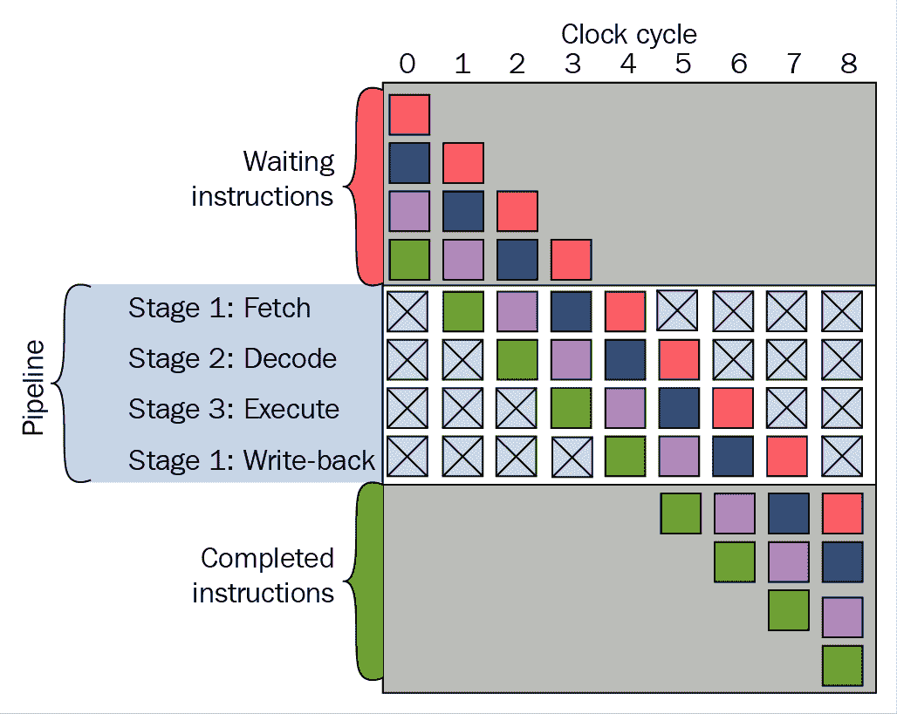
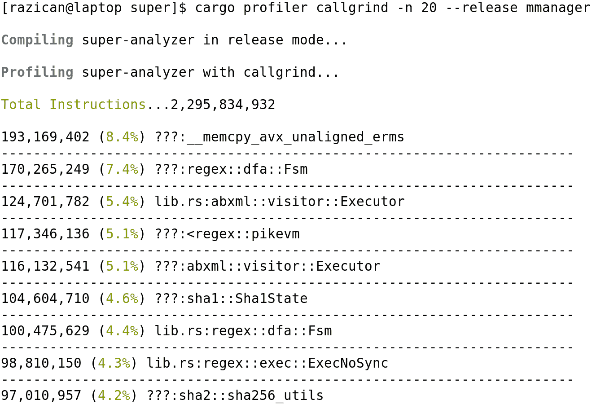
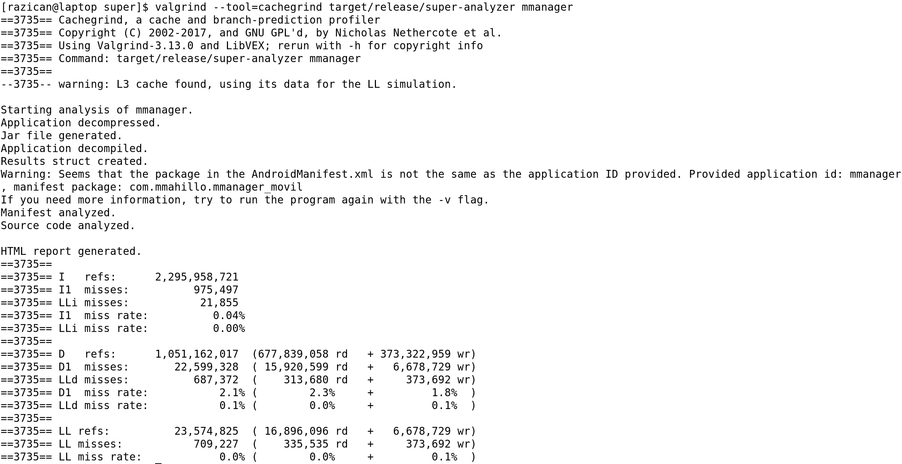
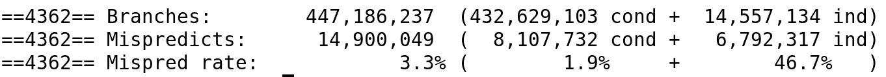
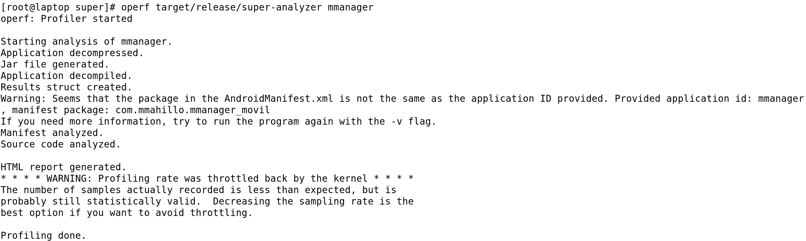
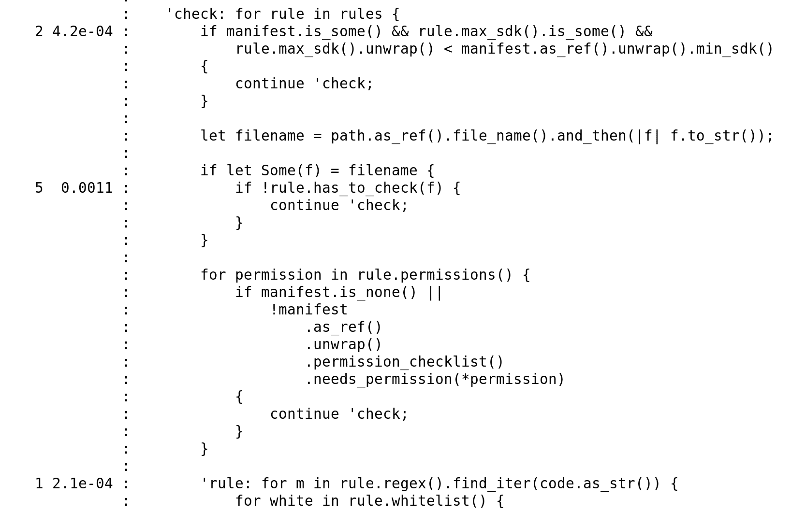

# 第五章：分析你的 Rust 应用程序

理解为什么你的应用程序运行速度比预期慢的一个基本步骤是检查你的应用程序在低层次上正在做什么。在本章中，你将了解低级优化的重要性，并了解一些可以帮助你找到瓶颈的工具。

在本章中，你将了解以下主题：

+   处理器在低层次上的工作原理

+   CPU 缓存

+   分支预测

+   如何修复一些最常见的瓶颈

+   如何使用 Callgrind 找到你最常用的代码

+   如何使用 Cachegrind 查看你的代码在缓存中可能表现不佳的地方

+   学习如何使用 OProfile 了解你的程序在执行时间上花费最多的地方

# 理解硬件

要了解我们的软件正在做什么，我们首先应该了解编译后的代码是如何在我们的系统中运行的。因此，我们将从中央处理单元（**CPU**）的工作原理开始。

# 理解 CPU 的工作原理

CPU 负责运行你应用程序的核心逻辑。即使你的应用程序是一个主要在 GPU 上运行大部分工作负载的图形应用程序，CPU 仍然会管理所有这些过程。有各种各样的 CPU，有些在特定方面比其他 CPU 更快，有些则更高效且功耗更低，牺牲了一些计算能力。无论如何，Rust 可以编译为大多数 CPU，因为它知道它们是如何工作的。

但我们的任务是自己弄清楚它们是如何工作的，因为有时编译器在改进我们的机器代码方面可能不如我们高效。所以，让我们深入到处理的核心，那里是事情发生的地方。

处理器有一组它知道如何执行的指令。我们可以要求它执行该组中的任何类型的指令，但我们有一个限制：在大多数情况下，它只能与所谓的 **寄存器** 一起工作。寄存器是 CPU 内部靠近 **算术逻辑单元**（**ALU**）的一个小位置。它可以包含一个变量，大小与处理器字大小相同；如今，这通常是 64 位，但在某些嵌入式处理器中可能是 32 位、16 位甚至 8 位。

这些寄存器的速度与处理器本身一样快，因此可以在其中修改信息，而无需等待任何事情（好吧，只是实际指令执行）。这很棒；事实上，你可能想知道，如果我们已经有了寄存器，为什么还需要 RAM？

好吧，答案很简单：价格。在 CPU 中拥有更多的寄存器是非常昂贵的。在最佳情况下，你不可能拥有超过几十个寄存器，因为处理器布线会变得非常复杂。考虑到每个指令和寄存器你都会有专用数据线和控制线，这是非常昂贵的。

因此，需要一个外部内存，一个可以自由访问而不需要你按顺序读取所有内存的内存，同时仍然非常快。**随机存取存储器**（**RAM**）就在那里。你的程序将从 RAM 加载，并将使用 RAM 来存储在软件执行过程中需要被操作的数据。当然，RAM 中的软件在可用之前必须从硬盘或固态硬盘加载到 RAM 中。

RAM 的主要问题是即使它比最快的 SSD（固态硬盘）快得多，它仍然不如处理器快。处理器可以在等待 RAM 将一些数据放入处理器的一个寄存器以便操作它们时执行数十条指令。因此，为了避免处理器每次需要从 RAM 中加载或存储数据时都要等待，我们有了缓存。

# 使用缓存加速内存访问

第一级缓存，也称为 L1 缓存，是一个几乎与 ALU（算术逻辑单元）一样靠近的缓存。L1 缓存的速度几乎与寄存器一样快（大约慢三倍），并且它有一个非常有趣的特性。其内部结构可以表示为一个查找表。它将有两列：第一列将包含 RAM 中的内存地址，而第二列将包含该内存地址的内容。当我们需要从 RAM 中加载某物到寄存器时，如果它已经在 L1 缓存中，这将几乎是瞬间的。

不仅如此，这个缓存通常被分为两个非常不同的区域：数据缓存和指令缓存。第一个将包含程序正在使用的变量的信息，而第二个将包含程序将要执行的指令。这样，因为我们知道程序是如何被执行的，我们可以在指令缓存中预加载下一条指令并执行它们，而无需等待 RAM。同样，因为我们知道在程序执行过程中需要哪些变量，我们可以在缓存中预加载它们。

但是，这个缓存也有一些问题。即使它比处理器慢三倍，它仍然太昂贵。此外，在处理器附近没有太多的物理空间，所以其大小通常限制在大约 32 KiB。由于大多数软件需要比这更大的空间，而我们希望它执行得快，无需等待 RAM，我们通常有一个二级缓存，称为 L2 缓存，它也以处理器的时钟速度运行，但由于离 L1 缓存较远，其信号到达的延迟更高。

L2 缓存因此几乎和 L1 缓存一样快，通常有高达 4 MiB 的空间。指令和数据是合并的。但这对于许多软件可能进行的操作来说仍然不够。记住，你需要使用你所有的数据，在图像处理中，那可能就是数百万像素及其值。因此，为此，一些高端处理器在这种情况下有一个 L3 缓存，距离更远，时钟速度更慢，但仍然比 RAM 快得多。有时，这个缓存在写作时可以达到 32 MiB。

但即便如此，我们知道即使在像 Ryzen 处理器这样的处理器中，拥有超过 40 MiB 的组合缓存，我们仍然需要更多的空间。我们当然有 RAM，因为最终，缓存只是我们放在处理器附近以供更快使用 RAM 的副本。对于每一条新的信息，我们都需要将其从 RAM 加载到 L3 缓存，然后是 L2，然后是 L1，最后是寄存器，这使得整个过程变慢。

为了这个，处理器有高度复杂的算法，这些算法是用纯硅编写的，在硬件中，能够预测将要访问的内存位置，并批量预加载这些位置。这意味着如果处理器知道你将访问 RAM 中地址 1,000 到 2,000 的变量，它将请求 RAM 加载整个内存批次到 L3 缓存，当使用它们的时间接近时，L2 缓存将从 L3 复制数据，L1 也从 L2 复制。当你的程序请求该内存位置的值时，它将神奇地已经在 L1 缓存中，并且检索速度极快。

# 缓存未命中

但这效果如何？是否可能达到 100% 的效率？好吧，不。有时，你的软件会做一些处理器没有设计去预测的事情，数据就不会在 L1 缓存中。这意味着处理器会向 L1 缓存请求数据，而这个 L1 缓存会发现它没有，浪费了时间。然后它会询问 L2，L2 会询问 L3，以此类推。如果你很幸运，它会在第二级缓存中，但可能甚至不在 L3 中，因此你的程序需要等待 RAM，在等待了三个缓存之后。

这就是所谓的缓存未命中。这种情况发生得多频繁？根据你的代码和 CPU 的优化程度，它可能在 2% 到 5% 之间。这似乎很低，但一旦发生，整个处理器都会停下来等待，这意味着即使它不会经常发生，它也会对性能产生巨大的影响，使事物变得非常慢。而且正如我们所见，这不仅仅是等待较慢存储的时间损失，还包括在先前存储中的查找时间损失，所以在缓存未命中中，直接询问 RAM（如果值不在任何缓存中）会更快。

# 你该如何解决这个问题？

修复这种情况并不容易。缓存未命中有时发生是因为你只使用了一次大数组，例如在视频缓冲区等场景中。如果你正在流式传输一些数据，可能会发生数据尚未在缓存中，并且使用一次后就不会再使用。这会带来两个问题。首先，当你需要它时，它仍然在 RAM 的某个区域，造成缓存未命中。其次，一旦你将其加载到缓存中，它将占用大部分缓存，忘记你可能需要的其他变量，并造成更多的缓存未命中。这种最后的效果被称为**缓存污染**。

避免这种行为最好的方法是用更小的缓冲区，但这会带来其他问题，比如数据需要持续的缓冲，因此你需要看看对你特定情况来说什么才是最好的。如果不是由缓冲区引起的，可能是因为你创建了太多的变量，但只使用了一次。尝试找出你是否可以重用信息，或者是否可以改变一些循环的执行。但要注意，因为一些循环可能会影响分支预测，正如我们稍后将要看到的。

# 缓存失效

缓存还有一个大问题，称为**缓存失效**。由于通常在新处理器中，你使用多线程应用程序，有时会发生一个线程更改内存中的某些信息，而其他线程需要检查它。正如你可能知道的那样，或者正如你将在第十章多线程中看到的，Rust 在编译时使这一点完全安全。数据竞争不会发生，但这不会防止缓存失效的性能问题。

当 RAM 中的某些信息被另一个 CPU 或线程更改时，就会发生缓存失效。这意味着如果该内存位置被任何 L1 到 L3 缓存缓存，它将需要以某种方式从那里移除，因为它将包含旧值。这通常是通过存储机制完成的。每当内存地址更改时，任何指向该内存地址的缓存都会被失效。这样，下一个尝试从该地址读取数据的指令将创建一个缓存未命中，从而使得缓存刷新并从 RAM 获取数据。

无论如何，这都很低效，因为每次你更改一个共享变量时，该变量将需要在其他使用它的线程中刷新缓存。在 Rust 中，为此，你将使用一个 `Arc`。为了尝试避免这种性能陷阱，你应该尽量在线程之间共享尽可能少的内容，如果必须将消息传递给它们，有时使用 `std::sync::mpsc` 模块中的结构体可能是有意义的，正如我们将在第十章多线程中看到的。

# CPU 流水线

指令集变得越来越复杂，处理器的时钟速度也越来越快，这有时使得大多数 CPU 指令需要多个时钟周期来执行。这通常是因为 CPU 需要首先理解正在执行的指令，理解其操作数，产生获取这些操作数的有效信号，执行操作，然后保存这些操作。并且每个时钟周期不能完成超过一个步骤。

这通常在处理器中通过创建 CPU 流水线来解决。这意味着当一条新指令进来时，在指令被分析和执行的同时，下一条指令来到 CPU 以进行分析。这可能会带来一些复杂性，正如你可能想象的那样。

首先，如果一条指令需要前一条指令的输出，它有时可能需要等待另一条指令的结果。也可能有时正在执行的指令是跳转到内存中的另一个位置，因此需要从 RAM 中获取新的指令，并移除流水线。

总的来说，这项技术实现的是在理想条件下（一旦流水线充满）每个时钟周期执行一条指令。大多数新型处理器都这样做，因为它可以在不提高时钟速度的情况下实现更快的执行，正如我们在这张图中可以看到的：



这种方法的另一个额外好处是，将指令处理分解成更多步骤使得每一步更容易实现。不仅如此，由于每个部分在物理上会更小，光速下的电子能够在更短的时间内同步整个步骤电路，使得时钟可以运行得更快。

然而，无论如何，将每个指令执行分解成更多步骤会增加 CPU 布线的复杂性，因为它必须解决潜在的并发问题。如果一条指令需要前一条指令的输出才能工作，可能会发生四种不同的情况。首先，也是最糟糕的情况，行为可能会变得未定义。这不是我们想要的，解决这个问题会复杂化处理器的布线。

解决这个问题的最重要的布线部分是首先检测它。仅此一项就会使布线更加复杂。一旦 CPU 能够检测到潜在的问题，最简单的修复方法就是简单地等待输出而不推进流水线。这被称为**停顿**，这会损害 CPU 的性能，但它会正常工作。

一些处理器将通过添加一些额外的输入路径来处理这个问题，这些路径将包含之前的结果，以防需要使用它们，但这将大大增加流水线的复杂性。另一个选择是检测一些安全指令，并在需要前一个指令输出的指令之前运行它们。这个最后的选项被称为**乱序执行**，它也会增加 CPU 的复杂性。

因此，总结来说，为了提高 CPU 的速度，除了让时钟运行得更快之外，我们还有创建指令流水线的选项。这将使得每时钟周期运行一条指令（理想情况下）成为可能，有时甚至可以提高时钟速度。然而，这也会增加 CPU 的复杂性，使其成本大大提高。

那么，你可能会问，当前处理器的流水线是什么样的呢？嗯，它们的长度和行为各不相同，但在一些高端英特尔芯片的情况下，流水线的长度可以超过 30 步。这将使它们运行得非常快，但会极大地增加它们的复杂性和价格。

当你开发应用程序时，避免流水线变慢的一种方法是将不需要先前结果的操作先执行，然后使用生成的结果，尽管在实践中这非常困难，一些编译器实际上会为你这样做。

# 分支预测

有一种情况是我们没有看到如何解决，那就是当我们的处理器接收到一个条件跳转指令时，根据处理器标志位的当前状态，下一个要执行的指令将是其中一个。这意味着我们无法预测某些指令并将它们加载到流水线中。或者我们可以吗？

有多种方法可以预测接下来将要运行的代码，而无需计算最后几条指令。最简单的方法，也是老处理器中使用的方法，是静态地决定哪些分支将加载下一个指令，哪些将在跳转地址加载指令。

一些处理器会通过决定某些类型的指令比其他指令更有可能跳转来做到这一点。其他处理器会查看跳转地址。如果地址较低，它们会将目标地址的指令加载到流水线中，如果不低，它们会将下一个地址的指令加载到流水线中。例如，在循环中，返回循环开始的可能性比继续程序流程的可能性要大得多。

在上述两种情况下，决策是在处理器开发时静态做出的，实际的程序执行不会改变流水线加载的工作方式。一个改进的方法，即动态方法，是计算处理器在给定条件跳转时跳转的次数。

处理器第一次到达分支时，它不知道代码是否会跳转，所以它可能会将下一个指令加载到流水线中。如果它跳转，下一个指令将被取消，并将新的指令加载到流水线中。这将使处理器等待流水线阶段数那么多个周期。

在这个旧方法中，我们会将这些指令的跳转计数器设置为`1`，没有跳转的计数器设置为`0`。下次程序到达相同的跳转时，看到计数器，处理器将开始将来自跳转的指令加载到流水线中，而不是加载下一个指令。

一旦完成计算，如果处理器实际上需要跳转，它已经在流水线中有指令了。如果没有，它需要将其加载到下一个指令中。在这两种情况下，相应的计数器都会增加 1。

这意味着，例如，在一个长的`for`循环中，跳转计数器会增加到很高的数字，因为它大多数时候必须跳回到循环的开始，只有在最后一次迭代之后才会继续应用程序的流程。这意味着除了第一次和最后一次迭代之外，将不会有空流水线，分支将被正确预测。

这些计数器实际上要复杂一些，因为它们会在 1 或 2 位饱和，这意味着计数器可以指示上一次分支是否被采取，或者处理器下一次分支被采取的确定性如何。计数器可以是`0`，如果它通常从不采取分支，`1`，如果它可能采取，`2`，如果它多次采取分支，或者`3`，如果它几乎总是采取。这意味着只有部分时间采取的分支将会有更好的预测。一些基准测试表明，准确性可以高达 93.5%。

简单的计数器如何使分支预测变得更加高效，真是令人惊讶，对吧？当然，这有很大的局限性。在代码中，这种分支依赖于某些条件，但可以在其中看到模式的地方（例如，几乎每次调用都返回真的`if`条件），计数器会完全失败，因为它们对模式一无所知。

对于这种行为，会使用复杂的自适应预测表。它将在表中存储最后*n*次`跳转`指令的发生，并查看是否存在模式。如果有，它将把结果分组为模式中元素数量的组，并更好地预测这种行为。在某些情况下，这可以提高准确性到 97%。

有许多不同的分支预测技术，并且根据流水线的大小，使用更复杂的预测器或更简单的预测器更有意义。如果处理器有一个 30 阶段的流水线，未能预测分支将导致下一个指令的 30 个周期延迟。如果它有 2 个阶段，它将只损失 2 个周期。这意味着更复杂和昂贵的流水线也需要更复杂和昂贵的分支预测器。

# 分支预测对我们代码的相关性

这本书不是关于创建处理器的，所以你可能认为所有这些分支预测理论对我们提高 Rust 代码效率的使用案例来说都没有意义。但现实是，这个理论可以让我们开发出更高效的应用程序。

首先，知道新的昂贵处理器将在两次遍历后检测到条件执行中的模式，这会让我们尝试使用这些模式，如果我们知道我们的代码将主要被较新的处理器使用。另一方面，如果我们知道我们的代码将在较便宜或较旧的处理器上运行，我们可能可以通过可能地（在循环中）按顺序编写模式条件的计算结果或通过尝试以其他方式组合条件来优化其执行。

此外，我们还需要考虑编译器优化。Rust 通常会优化循环，如果它知道它将始终执行相同次数的代码，就会复制一些代码 12 次，以避免分支。如果我们在同一个代码生成单元（例如，一个函数）中有许多分支，它也会丢失一些优化预测。

这就是像**循环复杂度**这样的 Clippy 检查开始发挥作用的地方。它们会显示在添加太多分支的功能中。可以通过将这些函数分解成更小的函数来修复这个问题。Rust 编译器将更好地优化给定的函数，如果我们启用了链接时间优化，最终甚至可能是在同一个函数中完成，从而使得处理器无分支。

我们不应该完全依赖硬件分支预测，尤其是如果我们的代码是性能关键的话，我们应该在开发时考虑到处理器也会对其进行优化。如果我们确定我们的代码将在哪个处理器上运行，我们甚至可以决定从开发手册中学习该处理器的分支预测技术，并据此编写我们的代码。

# 性能分析工具

你可能会想知道我们如何在应用程序中检测到这些瓶颈。我们都知道并不是所有的开发者都会考虑到这样的低级细节，即使他们考虑到了，他们也可能忘记在程序需要连续多次运行的关键代码中执行它。我们无法手动检查整个代码库，但幸运的是，有一些性能分析工具会给我们提供关于我们软件的信息。

# Valgrind

让我们先从一个可以帮助你找到软件花费更多时间的工具开始。**Valgrind**是一个帮助找到瓶颈的工具。Valgrind 内的两个主要工具将为我们提供所需的统计数据，以找出我们需要改进代码的地方。它包含在大多数 Linux 发行版中。有 Windows 的替代品，但如果你可以访问一台 Linux 机器（即使是一个虚拟机），Valgrind 在获取结果时真的会带来很大的差异。

使用它的最简单方法是使用 `cargo-profiler`。这个工具在 `crates.io` 上，但它已经不再更新，GitHub 上的版本有一些急需的修复。你可以通过运行以下命令来安装它：

```rs
cargo install --git https://github.com/kernelmachine/cargo-profiler.git
```

安装完成后，你可以通过运行 `cargo profiler callgrind` 或 `cargo profiler cachegrind` 来使用它，具体取决于你想要使用的 Valgrind 工具。不过，`cargo-profiler` 默认不编译带有源注释的代码，所以使用 `cargo rustc` 命令并带上 `-g` 标志来编译，然后在那些二进制文件上直接运行 Valgrind 可能是有意义的：

```rs
cargo rustc --release --bin {binary_name} -- -g
```

# Callgrind

Callgrind 将显示程序中最常用的函数的统计数据。要运行它，你需要运行 `cargo profiler callgrind {args}`，其中 `args` 是你的可执行文件的参数。不过这里有一个有趣的问题。Rust 使用 `jemalloc` 作为默认分配器，但 Valgrind 会尝试使用它自己的分配器来检测调用。有一种方法可以使用 Valgrind 的分配器，但这只能在 nightly Rust 中工作。

你需要将以下行添加到你的 `main.rs` 文件中：

```rs
#![feature(alloc_system)]
extern crate alloc_system;
```

这将强制 Rust 使用系统分配器。你可能需要向文件中添加 `#![allow(unused_extern_crates)]`，这样它就不会提醒你未使用的包。对于 Valgrind 来说，一个有趣的标志是 `-n {num}`。这将限制结果只显示最相关的 `num` 个。在 Callgrind 的情况下，它只会显示最常用的函数。一个可选的 `--release` 标志会告诉 `cargo profiler` 你是否想要在发布模式下而不是在调试模式下进行性能分析。

让我们看看 Callgrind 工具的输出：



让我们分析一下这代表什么。我只选择了最常用的函数，但我们已经可以看到很多信息。最常用的函数是一个内存复制的系统调用。这意味着这个程序在内存中的不同位置之间复制了大量的数据。幸运的是，至少它使用了一个高效的系统调用，但也许我们应该检查我们是否真的需要为这项工作做这么多复制。

第二次最常用的函数是在 `abxml` 模块/包中称为 `Executor` 的东西。你可能会认为 `regex` 引用更常用，因为它排在第二位，但 `Executor` 似乎被分割了，因为似乎有些引用丢失了最初的 `lib.rs`（第三和第五个元素看起来相同）。看起来我们使用那个函数很多，或者至少它占用了我们大部分的 CPU 时间。

我们应该问问自己这是否正常。它是否应该在该函数上花费这么多时间？在这个程序的情况下，SUPER Android Analyzer ([`superanalyzer.rocks/`](http://superanalyzer.rocks/))，它使用这个函数来获取应用程序的资源。大多数时间实际上分析应用程序而不是解压缩它（实际上，我们没有看到占用 80%时间的 Java 依赖项的使用）。但看起来`apk`文件的资源解压缩花费了很长时间。

我们可以检查在该函数或其子函数中是否有可以优化的地方。如果我们能优化该函数的 10%，那么在应用程序中我们会获得很多速度提升。

另一个选择是检查我们的正则表达式使用情况，因为我们可以看到许多指令被用来检查和编译正则表达式。对正则表达式引擎的改进也会有所影响。

我们最终看到 SHA-1 和 SHA-256 算法的执行也花费了很长时间。我们需要它们吗？它们可以被优化吗？也许通过使用在新处理器中经常发现的本地算法实现，我们可以加快执行速度。在主 crate 中创建一个 pull request 可能是有意义的。

如您所见，Callgrind 为我们提供了大量关于程序执行的有价值信息，我们至少可以看到在哪里花费时间尝试优化代码是有意义的。在这个特定案例中，散列算法、正则表达式和资源解压缩占据了大部分时间；我们应该尝试优化这些函数。另一方面，例如，一个较少使用的函数是 XML 发射器。所以即使我们找到了如何将这个函数优化 90%的方法，实际上也不会有多大区别。如果这是一个简单的优化，我们可以做（总比什么都不做好），但如果它需要我们花费很长时间来实现，那么可能没有做的必要。

# Cachegrind

我们在本章中详细讨论了缓存，但有没有办法看到我们的应用程序在这方面的表现呢？实际上是有方法的。它被称为**Cachegrind**，它是 Valgrind 的一部分。它和 Callgrind 一样使用，与`cargo profiler`一起使用。在相同的前置应用程序中，`cargo profiler`未能解析 Cachegrind 的响应，所以我不得不直接运行 Valgrind，如下面的截图所示：



这是我第二次或第三次运行，所以一些信息可能已经被缓存。但仍然，如您所见，一级数据缓存未命中率为 2.1%，考虑到二级缓存大部分时间都有这些数据（它只有 0.1%的时间未命中），这并不算太坏。

指令数据几乎总是从一级缓存中正确获取，除了 0.04%的时间。在二级缓存中几乎没有缺失。Cachegrind 也可以通过一些标志提供更多有价值的信息。

使用`--branch-sim=yes`作为参数，我们可以看到分支预测是如何工作的：



如我们所见，3.3%的分支没有被正确预测。这意味着如果分支能被更好地预测，或者如果某些循环被展开，就像我们之前看到的那样，我们可以进行一些有趣的改进。

仅凭这一点，并不能告诉我们如何改进我们的代码。但使用这个工具会在当前目录下创建一个`cachegrind.out`文件。这个文件可以被另一个工具`cg_anotate`使用，它会显示改进的统计数据。运行它，你将看到基于函数的各种统计数据，你可以看到哪些函数给缓存带来了更多麻烦，然后去那里尝试修复它们。

在 SUPER 的情况下，资源解压缩似乎导致了更多的缓存缺失。尽管如此，这可能是合理的，因为它正在从文件中读取新数据，并且第一次几乎总是从内存中读取这些数据。但也许我们可以检查这些函数，并尝试通过使用缓冲区等方法来改进获取。

# OProfile

OProfile 是另一个可以给我们提供关于程序有趣信息的优秀工具。它也仅适用于 Linux，但你会发现 Windows 也有类似的工具。再次强调，如果你能获得一个 Linux 分区来检查这个，你的结果可能会更接近你接下来要读到的。要安装它，安装你发行版的`oprofile`包。你可能还需要安装通用的 Linux 工具（在 Ubuntu 中为`linux-tools-generic`）。

没有源代码注释，OProfile 帮助不大，所以你应该首先使用以下命令编译带有它们的二进制文件：

```rs
cargo rustc --release --bin super-analyzer -- -g
```

你需要 root 权限来进行性能分析，因为它将直接获取内核计数器。别担心；一旦你分析了应用程序，你就可以停止使用 root。要分析应用程序，只需运行带有二进制文件和要分析参数的`operf`：



这将在当前路径下创建一个`oprofile_data`目录。为了从中获得一些意义，你可以使用`opannotate`命令。这将显示一些统计数据，其中包含一些源代码，以及 CPU 在每个地方花费的时间。在我们的 Android 分析器的情况下，我们可以看到规则处理花费了相当多的时间：



在这种情况下，这可能是合理的。一个旨在用规则分析文件的软件花费大量时间用这些规则分析文件是有道理的。但，尽管如此，这也意味着在那段代码中，我们可能找到一些优化，这可能会带来差异。

使用 OProfile，我们可以找到程序花费时间过多的区域。也许我们会在一个意想不到的领域发现瓶颈。这就是为什么使用这些工具很重要的原因。

# 摘要

在本章中，你了解了处理器是如何真正工作的。你理解了我们在硬件中实施的多个技巧，这样一切运行得比 CPU 总是等待 RAM 时快得多。你还掌握了最常见的性能问题以及一些关于如何修复它们的信息。

最后，你学习了关于 Callgrind、Cachegrind 和 OProfile 工具的内容，这些工具将帮助你找到那些瓶颈，以便你可以轻松地修复它们。它们甚至还会显示在你的源代码中可以找到哪些减速点。

在第六章“基准测试”中，你将学习如何对你的应用程序进行基准测试。将其与其他应用程序或你自己的应用程序的早期版本进行比较特别有趣。你将学会如何发现使你的应用程序变慢的变化。
