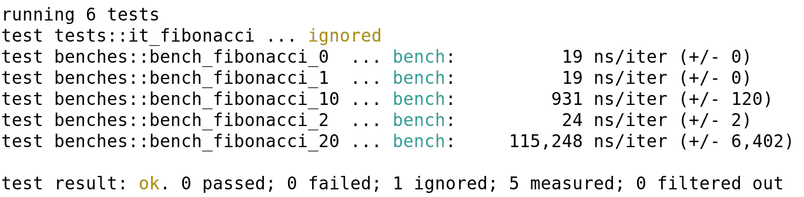
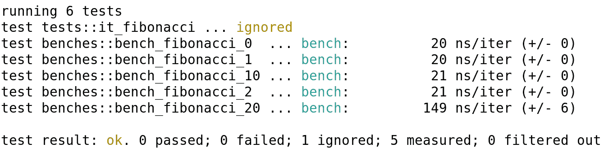
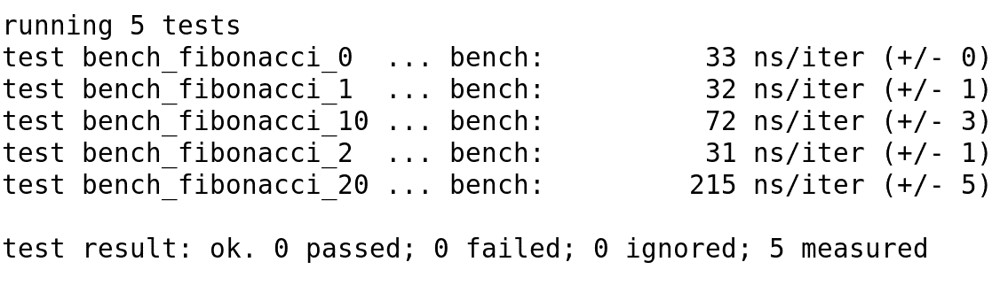
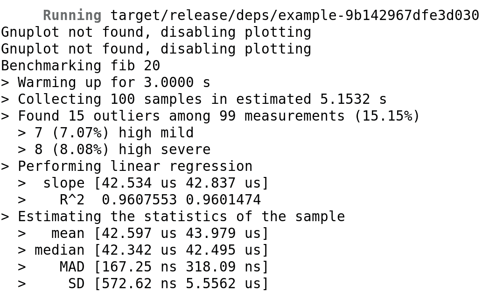
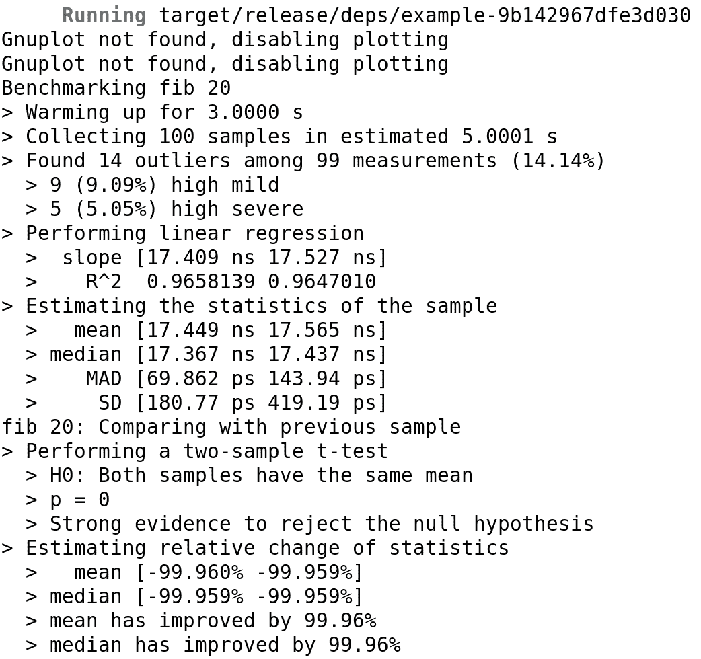

# 基准测试

我们已经学习了如何分析我们的应用程序，以及如何找到和修复主要瓶颈，但在这个过程中还有另一个步骤：检查我们的更改是否提高了性能。

在本章中，你将学习如何基准测试你的应用程序，以便你可以衡量你的改进。这可以满足两个目标：首先，检查你的应用程序的新版本是否比旧版本运行得更快，其次，如果你正在创建一个新应用程序来解决现有应用程序已经解决的问题，比较你的新应用程序与现有应用程序的效率。

在这个背景下，你将在本章中了解以下主题：

+   选择要基准测试的内容

+   夜间 Rust 的基准测试

+   稳定 Rust 中的基准测试

+   基准测试的持续集成

# 选择要基准测试的内容

知道你的程序在每次更改后是否提高了效率是一个好主意，但你可能会想知道如何正确地衡量这种改进或退化。这实际上是基准测试中的一个重要问题，因为如果做得好，它将清楚地显示你的改进或退化，但如果做得不好，你可能会认为你的代码正在改进，而实际上它正在退化。

根据你想要基准测试的程序，你应该对其执行的不同部分感兴趣。例如，一个处理一些信息然后结束的程序（分析器、CSV 转换器、配置解析器...），将受益于全程序基准测试。这意味着你可能需要一些测试输入数据，看看处理它们需要多少时间。应该有多个集合，这样你就可以看到性能如何随着输入数据的变化而变化。

一个具有界面并需要一些用户交互的程序，用这种方式进行基准测试是困难的。最好的办法是选取最相关的代码片段进行基准测试。在前一章中，我们学习了如何在我们的软件中找到最相关的代码片段。通过分析技术，我们可以了解哪些函数和代码片段对我们的应用程序的执行影响最大，因此我们可以决定对这些进行基准测试。

通常，你将希望主要拥有细粒度的基准测试。这样，你将能够检测到影响应用程序整体性能的某个小代码片段的变化。如果你有更广泛的基准测试，你可能会知道应用程序某个部分的整体性能有所下降，但很难确定代码中的哪个部分导致了这种情况。

在任何情况下，正如我们稍后将看到的，为基准测试设置持续集成是一个好主意，如果某个特定的提交降低了性能，则会创建警报。对于所有基准测试都在尽可能相似的环境中运行也很重要。这意味着运行它们的计算机不应从一个运行到下一个运行时发生变化，并且它应该只运行基准测试，以便结果尽可能真实。

另一个问题是我们将在上一章中看到的那样，我们在计算机上第一次运行某些东西时，速度会变慢。缓存需要填充，分支预测需要激活，等等。这就是为什么你应该多次运行基准测试的原因，我们将看到 Rust 将如何为我们做这件事。还有选项可以在某些秒数内预热缓存，然后开始基准测试，还有一些库为我们做这件事。

因此，在接下来的章节中，您应该考虑所有这些因素。创建小型微基准测试，选择您代码中最相关的部分进行基准测试，并在已知的不变环境中运行它们。

此外，请注意，创建基准测试并不意味着您不应该编写单元测试，因为我不止一次看到过这种情况。基准测试只会告诉您代码运行得多快，但您不知道它是否正确执行。单元测试不在此书的范围之内，但在您考虑基准测试之前，您应该彻底测试您的软件。

# 在夜间 Rust 中进行基准测试

如果您在网上搜索有关如何在 Rust 中进行基准测试的信息，您可能会看到一堆关于如何在夜间 Rust 中进行的指南，但关于如何在稳定 Rust 中进行的却不多。这是因为内置的 Rust 基准测试仅在夜间通道中可用。让我们首先解释内置基准测试是如何工作的，这样我们就可以了解如何在稳定 Rust 中实现它。

首先，让我们看看如何为库创建基准测试。想象以下小型库（代码在`lib.rs`中）：

```rs
//! This library gives a function to calculate Fibonacci numbers.

/// Gives the Fibonacci sequence number for the given index.
pub fn fibonacci(n: u32) -> u32 {
    if n == 0 || n == 1 {
        n
    } else {
        fibonacci(n - 1) + fibonacci(n - 2)
    }
}

/// Tests module.
#[cfg(test)]
mod tests {
    use super::*;

    /// Tests that the code gives the correct results.
    #[test]
    fn it_fibonacci() {
        assert_eq!(fibonacci(0), 0);
        assert_eq!(fibonacci(1), 1);
        assert_eq!(fibonacci(2), 1);
        assert_eq!(fibonacci(10), 55);
        assert_eq!(fibonacci(20), 6_765);
    }
}
```

如您所见，我添加了一些单元测试，这样我们就可以确保我们对代码所做的任何修改都将得到测试，并检查结果是否正确。这样，如果我们的基准测试发现某些改进了代码，那么生成的代码将（或多或少）保证能够工作。

我创建的`fibonacci()`函数是最简单的递归函数。它非常容易阅读和理解正在发生的事情。如您在代码中所见，斐波那契序列是一个以`0`和`1`开始的序列，然后每个数字都是前两个数字的和。

正如我们稍后将看到的，递归函数更容易开发，但它们的性能不如迭代函数。在这种情况下，对于每次计算，它都需要计算前两个数字，而对于它们，又需要计算前两个，依此类推。它不会存储任何中间状态。这意味着，从一个计算到下一个计算，最后的数字会丢失。

此外，这会将栈推到极限。对于每次计算，必须执行两个函数并将它们的栈填满，并且在每个函数中，当它们再次调用自己时，它们必须递归地创建新的栈，因此栈的使用呈指数增长。此外，这个计算可以并行进行，因为我们丢弃了之前的计算，所以我们不需要按顺序执行它们。

在任何情况下，让我们检查一下这个性能如何。为此，我们将以下代码添加到`lib.rs`文件中：

```rs
/// Benchmarks module
#[cfg(test)]
mod benches {
    extern crate test;
    use super::*;
    use self::test::Bencher;

    /// Benchmark the 0th sequence number.
    #[bench]
    fn bench_fibonacci_0(b: &mut Bencher) {
        b.iter(|| (0..1).map(fibonacci).collect::<Vec<u32>>())
    }

    /// Benchmark the 1st sequence number.
    #[bench]
    fn bench_fibonacci_1(b: &mut Bencher) {
        b.iter(|| (0..2).map(fibonacci).collect::<Vec<u32>>())
    }

    /// Benchmark the 2nd sequence number.
    #[bench]
    fn bench_fibonacci_2(b: &mut Bencher) {
        b.iter(|| (0..3).map(fibonacci).collect::<Vec<u32>>())
    }

    /// Benchmark the 10th sequence number.
    #[bench]
    fn bench_fibonacci_10(b: &mut Bencher) {
        b.iter(|| (0..11).map(fibonacci).collect::<Vec<u32>>())
    }

    /// Benchmark the 20th sequence number.
    #[bench]
    fn bench_fibonacci_20(b: &mut Bencher) {
        b.iter(|| (0..21).map(fibonacci).collect::<Vec<u32>>())
    }
}
```

你需要在`lib.rs`文件的顶部添加`#![feature(test)]`（在第一个注释之后）。

让我们首先理解为什么我们创建了这些基准测试。我们正在测试程序生成斐波那契序列中索引为`0`、`1`、`2`、`10`和`20`的数字需要多长时间。但是，问题是如果我们直接将这些数字提供给函数，编译器实际上会运行递归函数本身，并且只编译生成的数字（是的，**低级虚拟机**（**LLVM**）会这样做）。所以，所有基准测试都会告诉我们计算需要 0 纳秒，这并不是特别好。

因此，对于每个数字，我们添加一个迭代器，它会生成从`0`到给定数字的所有数字（记住，范围是从右边非包含的），计算所有结果，并生成一个包含它们的向量。这将使 LLVM 无法预先计算所有结果。

然后，正如我们之前讨论的，每个基准测试都应该运行多次，这样我们就可以计算一个中值。Rust 通过给我们`test`包和`Bencher`类型来简化这一点。`Bencher`是一个迭代器，它将多次运行我们传递给它的闭包。

如你所见，map 函数接收一个指向`fibonacci()`函数的指针，该函数将给定的`u32`转换为它的斐波那契序列数字。要运行它，只需运行`cargo bench`即可。结果是：



这很有趣。我选择了这些数字（`0`、`1`、`2`、`10`和`20`）来展示一些内容。对于`0`和`1`这两个数字，结果是直接的，它只会返回给定的数字。从第二个数字开始，它需要进行一些计算。例如，对于数字`2`，它只是将前两个数字相加，所以几乎没有开销。但是对于数字`10`来说，它必须将第 9 个和第 8 个数字相加，而对于每一个，第 8 个和第 7 个，第 7 个和第 6 个分别相加。你可以看到这很快就会变得难以控制。另外，记住我们为每次调用丢弃之前的结果。

所以，正如你在结果中看到的那样，对于每个新的数字，它都会变得非常指数级。考虑到这些结果是在我的笔记本电脑上进行的，你的结果肯定会有所不同，但彼此之间的比例应该保持相似。我们能做得更好吗？当然可以。这通常是最好的学习体验之一，可以看到递归和迭代方法之间的差异。

那么，让我们开发一个迭代的 `fibonacci()` 函数：

```rs
pub fn fibonacci(n: u32) -> u32 {
    if n == 0 || n == 1 {
        n
    } else {
        let mut previous = 1;
        let mut current = 1;
        for _ in 2..n {
            let new_current = previous + current;
            previous = current;
            current = new_current;
        }
        current
    }
}
```

在这段代码中，对于前两个数字，我们简单地返回之前正确的数字。对于其余的，我们从数字 2 的序列状态（0, 1, 1）开始，然后迭代到数字 `n`（记住右边的范围是不包含的）。这意味着对于数字 `2`，我们已经有结果了，对于其余的，它将简单地重复将两个数字相加，直到得到结果。

在这个算法中，我们总是记住前两个数字，这样我们不会从一次调用中丢失信息。我们也没有使用太多的栈（从数字 2 开始，我们只需要三个变量，并且我们不调用任何函数）。所以它需要的分配（如果有的话）会更少，而且应该会快得多。

此外，如果我们给它一个更大的数字，它应该线性扩展，因为它只会计算每个前面的数字一次，而不是多次。那么，它会快多少呢？



哇！结果真的改变了！我们现在看到，至少直到第 10 个数字，处理时间是恒定的，之后它只会略微上升（在计算 10 个更多数字时，乘数将小于 10）。如果你运行 `cargo test`，你仍然会看到测试成功通过。此外，请注意，结果更加可预测，测试之间的偏差也较低。

但是，在这个案例中有些奇怪。就像之前一样，0 和 1 不进行任何计算就运行了，这就是为什么它花费的时间如此之少。我们可能可以理解对于数字 2，它也不会进行任何计算（即使它需要比较以确定是否需要运行循环）。但是，数字 10 会发生什么呢？

在这种情况下，它应该运行了七次迭代来计算最终值，所以它肯定比不运行迭代一次要花更多的时间。嗯，关于 LLVM 编译器（Rust 在幕后使用的编译器）的一个有趣的事情是，它非常擅长优化迭代循环。这意味着，即使它不能为递归循环进行预计算，它可以为迭代循环进行预计算。至少七次。

LLVM 在编译时能计算多少次迭代？嗯，这取决于循环，但我看到它做过超过 10 次。有时，它会展开这些循环，这样如果它知道它将被调用 10 次，它就会连续写 10 次相同的代码，这样编译器就不需要分支了。

这是否违背了基准测试的目的？嗯，部分是，因为我们不再知道数字 10 的差异有多大，但对于这一点，我们有数字 20。尽管如此，它告诉我们一个很好的故事：如果你可以创建一个迭代循环来避免递归函数，就做吧。你不仅会创建一个更快的算法，编译器甚至知道如何优化它。

# 稳定 Rust 中的基准测试

到目前为止，我们已经看到了如何使用夜间发布通道来基准测试我们的代码。这是因为 Rust 需要基准测试的 `test` 夜间功能才能运行。这是 `test` crate 和 `Bencher` 类型所在的地方。如果你仍然想使用稳定编译器进行基准测试之外的所有操作，你可以将所有基准测试放在 `benches` 目录中。稳定编译器将忽略它们进行正常构建，但夜间编译器将能够运行它们。

但是，如果你真的想使用稳定编译器来运行基准测试，你可以使用 `bencher` crate。你可以在 `crates.io` 中找到它，使用它非常类似于使用内置的夜间基准测试，因为这个 crate 只是基准测试库的稳定版本。

要使用它，你首先需要更改 `Cargo.toml` 文件，确保在包元数据和依赖项之后看起来像以下内容：

```rs
[lib]
name = "test_bench"
path = "src/lib.rs"
bench = false

[[bench]]
name = "example"
harness = false

[dev-dependencies]
bencher = "0.1.4"
```

在这里，我们使用一个示例名称创建一个基准测试，并指定不要围绕它创建一个 harness。然后，创建一个名为 `benches/example.rs` 的文件，并包含以下内容：

```rs
//! Benchmarks

#[macro_use]
extern crate bencher;
extern crate test_bench;
use test_bench::*;
use self::bencher::Bencher;

/// Benchmark the 0th sequence number.
fn bench_fibonacci_0(b: &mut Bencher) {
    b.iter(|| (0..1).map(fibonacci).collect::<Vec<u32>>())
}

/// Benchmark the 1st sequence number.
fn bench_fibonacci_1(b: &mut Bencher) {
    b.iter(|| (0..2).map(fibonacci).collect::<Vec<u32>>())
}

/// Benchmark the 2nd sequence number.
fn bench_fibonacci_2(b: &mut Bencher) {
    b.iter(|| (0..3).map(fibonacci).collect::<Vec<u32>>())
}

/// Benchmark the 10th sequence number.
fn bench_fibonacci_10(b: &mut Bencher) {
    b.iter(|| (0..11).map(fibonacci).collect::<Vec<u32>>())
}

/// Benchmark the 20th sequence number.
fn bench_fibonacci_20(b: &mut Bencher) {
    b.iter(|| (0..21).map(fibonacci).collect::<Vec<u32>>())
}

benchmark_group!(
    benches,
    bench_fibonacci_0,
    bench_fibonacci_1,
    bench_fibonacci_2,
    bench_fibonacci_10,
    bench_fibonacci_20
);
benchmark_main!(benches);
```

最后，移除基准测试模块。这将为之前每个函数创建一个基准测试。主要区别在于你需要导入你正在基准测试的 crate，你不需要为每个函数添加 `#[bench]` 属性，并且你使用两个宏来使基准测试运行。`benchmark_group!` 宏将创建一个以宏的第一个参数为名称的基准测试组，并包含给定的函数。`benchmark_main!` 宏将创建一个 `main()` 函数，该函数将运行所有基准测试。

让我们看看结果：



如您所见，这种方法并没有给我们带来美丽的颜色，并且给原生方法添加了一些额外的开销，但结果仍然是等效的。在这种情况下，我们可以看到第 10 个数字实际上不会在编译时计算。这是因为，在稳定 Rust 中，使用外部 crate，编译器无法在编译时计算一切。尽管如此，它还是给我们提供了关于不同选项性能差异的非常好的信息。

# 基准测试的持续集成

一旦我们知道了如何进行基准测试（从现在起我将使用夜间版本），我们就可以设置我们的持续集成环境，以便在性能回归发生时收到警报。实现类似功能有多种方式，但我会使用 Travis-CI 基础设施、一些 Bash 和一个 Rust 库来完成。

# Travis-CI 集成

首先，让我们感谢 Lloyd Chan 和 Sunjay Varma 的杰出工作，他们是第一个提出这种方法的。您可以在 Sunjay 的博客中找到我们将要使用的代码（[`sunjay.ca/2017/04/27/rust-benchmark-comparison-travis`](http://sunjay.ca/2017/04/27/rust-benchmark-comparison-travis)）。尽管如此，检查它、理解它并看看它是如何工作的还是有意义的。

这个想法很简单：在 Travis-CI 构建中，您可以针对多个 Rust 渠道进行构建。当收到针对 nightly 渠道的构建请求时，让我们运行所有基准测试，然后将它们与我们将在 pull request 目标分支上运行的基准测试进行比较。最后，在 Travis-CI 的构建日志中输出比较结果。

让我们先配置我们的 Travis-CI 构建脚本。为此，我们需要在我们的仓库中创建一个类似于以下内容的`.travis.yml`文件：

```rs
language: rust
dist: trusty # Use a little more updated system
os:
  - linux # Build for Linux
  - osx # Build also for MacOS X

# Run builds for all the supported trains
rust:
  - nightly
  - beta
  - stable
  - 1.16.0 # Minimum supported version

# Load travis-cargo
before_script:
  - export PATH=$PATH:~/.cargo/bin

# The main build
script:
  - cargo build
  - cargo package
  - cargo test

after_success:
  # Benchmarks
  - ./travis-after-success.sh
```

让我们看看这段代码做了什么。首先，如果您从未使用过 Travis-CI 进行持续集成，您应该知道`.travis.yml` YAML 文件包含了构建配置。在这种情况下，我们告诉 Travis-CI 我们想要构建一个 Rust 项目（这样它就会自己设置编译器），并且我们告诉它我们想要针对 nightly、beta 和稳定发布渠道进行构建。我通常喜欢添加最小支持的 Rust 版本，主要是为了知道何时会出错，这样我们就可以在我们的文档中宣传最小 Rust 编译器版本。

然后，我们导出`cargo`二进制路径，这样我们就可以通过在构建中安装它们来添加`cargo`二进制文件。这将是基准比较脚本所需要的。然后，我们告诉 Travis-CI 构建库/二进制 crate，我们告诉它打包以检查是否生成了有效的包，最后运行所有单元测试。到目前为止，与正常的 Travis-CI Rust 构建没有太大不同。

一旦我们到达`after-success`部分，我们会调用一个尚未定义的 shell 脚本。这个脚本将包含基准比较的逻辑。

在编写所有代码之前，让我们先了解一个将使事情变得容易得多的库。我指的是`cargo-benchcmp`，一个`cargo`二进制文件。这个可执行文件可以读取 Rust 基准测试的输出并进行比较。要安装它，您只需运行`cargo install cargo-benchcmp`。它还有一些很好的命令行参数，可以帮助我们获得想要的输出。

要将基准测试的结果输出到文件中，只需执行`cargo bench > file`即可。在这种情况下，我们将有两个基准测试，一个是*控制*基准测试，这是我们决定作为参考的基准测试；另一个是*变量*基准测试，这是我们想要比较的基准测试。通常，pull request 的目标分支将作为控制基准测试，而 pull request 分支将作为变量基准测试。

使用可执行文件就像运行 `cargo benchcmp control variable` 一样简单。这将显示一个带有并列比较的出色输出。你可以要求工具稍微过滤一下输出，因为你可能不想看到有数十个具有非常相似值的基准测试，你可能更感兴趣的是大的改进或回归。

要查看改进，请在命令行中添加 `--improvements` 标志，要查看回归，请添加 `--regressions` 标志。你还可以设置一个作为百分比的阈值，低于该阈值的基准测试将不会显示，以避免显示没有变化的基准测试。为此，请使用 `--threshold {th}` 语法，其中 `{th}` 是一个大于 0 的数字，表示应考虑的百分比变化。

现在我们明白了这个，让我们看看 `travis-after-success.sh` 文件中的代码：

```rs
#!/usr/bin/env bash

set -e
set -x

if [ "${TRAVIS_PULL_REQUEST_BRANCH:-$TRAVIS_BRANCH}" != "master" ] && [ "$TRAVIS_RUST_VERSION" == "nightly" ]; then
    REMOTE_URL="$(git config --get remote.origin.url)"

    # Clone the repository fresh...
    cd ${TRAVIS_BUILD_DIR}/..
    git clone ${REMOTE_URL} "${TRAVIS_REPO_SLUG}-bench"
    cd "${TRAVIS_REPO_SLUG}-bench"

    # Bench the pull request base or master
    if [ -n "$TRAVIS_PULL_REQUEST_BRANCH" ]; then
      git checkout -f "$TRAVIS_BRANCH"
    else # this is a push build
      git checkout -f master
    fi
    cargo bench --verbose | tee previous-benchmark
    # Bench the current commit that was pushed
    git checkout -f "${TRAVIS_PULL_REQUEST_BRANCH:-$TRAVIS_BRANCH}"
    cargo bench --verbose | tee current-benchmark

    cargo install --force cargo-benchcmp
    cargo benchcmp previous-benchmark current-benchmark
   fi
```

让我们看看这个脚本在做什么。`set -e` 和 `set -x` 命令将简单地改善命令在 Travis-CI 构建日志中的显示方式。然后，仅对 nightly 版本，它将在新位置克隆仓库。如果是拉取请求，它将克隆基础分支；如果不是，它将克隆 master 分支。然后，它将在两个地方运行基准测试，并使用 `cargo-benchcmp` 进行比较。这将结果显示在构建日志中。

当然，这个脚本可以被修改以适应任何需求，例如，使用默认分支之外的分支，或者过滤比较的输出，就像我们之前看到的。

# Criterion 的基准测试统计信息

如果我们想了解更多关于基准测试比较的信息，没有比 **Criterion** 更好的库了。它将生成你可以用来比较多个提交的基准测试的统计数据，不仅如此，它还允许你显示图表，如果你已经安装了 `gnuplot`。它需要 Rust nightly 版本才能运行。

让我们看看如何使用它。首先，你需要在你的 `Cargo.toml` 文件中添加 Criterion 作为依赖项并创建一个基准测试文件：

```rs
[dev-dependencies]
criterion = "0.1.1"

[[bench]]
name = "example"
harness = false
```

然后，你需要创建一个基准测试。我将使用我们之前看到的斐波那契函数来演示行为。声明基准测试的方式几乎与 Rust 稳定版 `bencher` crate 完全相同。让我们在 `benches/example.rs` 文件中写下以下代码：

```rs
//! Example benchmark.

#[macro_use]
extern crate criterion;
extern crate test_bench;

use criterion::Criterion;
use test_bench::fibonacci;

fn criterion_benchmark(c: &mut Criterion) {
    Criterion::default().bench_function("fib 20", |b| b.iter(|| fibonacci(20)));
}

criterion_group!(benches, criterion_benchmark);
criterion_main!(benches);
```

如果我们现在运行 `cargo bench`，我们将看到与此类似的输出（与递归版本相同）：



如你所见，我们在这里得到了大量的信息。首先，我们看到 Criterion 为处理器预热了三秒钟，以便它可以加载缓存并设置分支预测。然后，它对函数进行 100 次测量，并显示有关样本的有价值信息。

我们可以看到运行一个迭代的耗时（大约 42 微秒），样本的平均值和中位数，异常值（显著不同的样本）的数量，以及一个带有其`R²`函数的斜率。到目前为止，它只提供了关于基准的一些额外信息。如果你检查当前目录，你会看到它创建了一个`.criterion`文件夹，其中存储了之前的基准测试。你甚至可以检查 JSON 数据。

让我们再次运行基准测试，通过将递归函数替换为迭代函数：



哇！数据更多了！标准比较工具将这个新基准与之前的基准进行了比较，并发现有力证据表明这种改进并非仅仅是统计上的异常。基准提高了 99.96%！

如你所见，标准比较工具在统计分析方面比内置的基准测试提供了更好的信息方法。偶尔运行这个工具将向我们展示应用程序性能的变化。

该库允许进行函数比较、图形创建等。它可以针对每个基准进行配置，因此你将能够根据你的需求微调你的结果。我建议你查看项目的官方文档以获取更多信息([`crates.io/crates/criterion`](https://crates.io/crates/criterion))。

要将此包含在你的 Travis-CI 构建中，只需修改之前的 shell 脚本即可。只需调用`cargo bench`而不是`cargo benchcmp`，并确保将`.criterion`文件夹移动到运行基准测试的位置（因为它下载了两个仓库）。

# 摘要

在本章中，你学习了如何基准测试你的 Rust 应用程序。你看到了不同的选项，并找到了最适合你特定需求的方案。你还了解了一些可以帮助你比较基准测试结果的库，甚至如何在持续集成环境中使用它们。

在下一章中，你将通过学习 Rust 的宏系统和标准库中内置的宏来进入元编程的世界。
