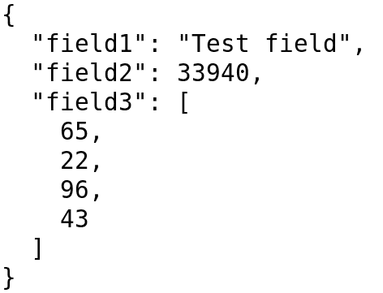
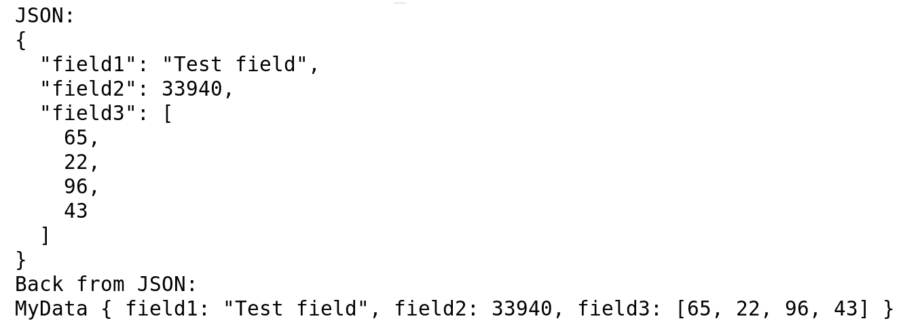
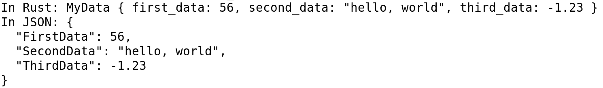
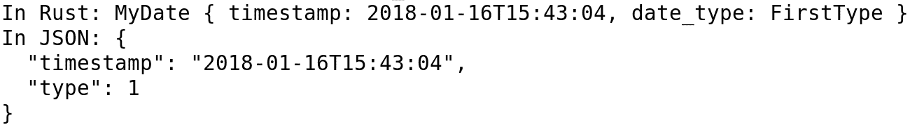
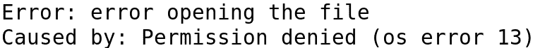
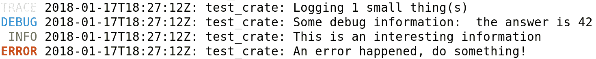
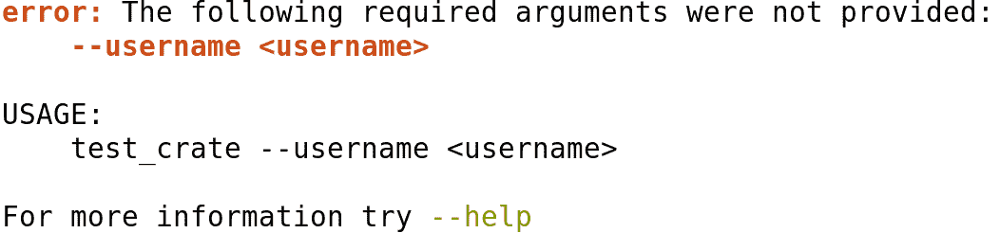
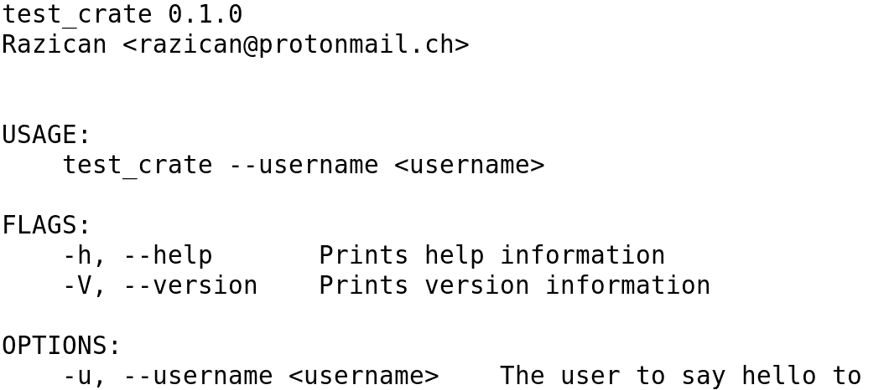
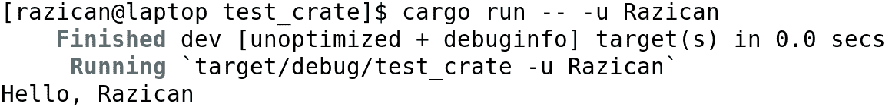
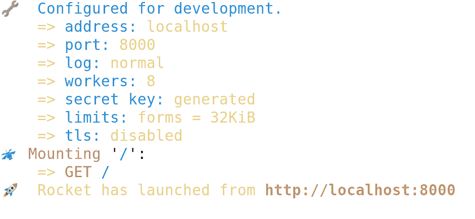

# 第八章：必备的宏 crate

Rust 最有用的特性之一是其 crate 生态系统。在 C/C++等语言中，有时很难找到合适的库来使用，而且实际上使用它可能也很困难。在 Rust 中这几乎是直截了当的，在本章中，我们将看到一些最有趣的 crate，它们为我们提供了强大的元编程原语：

+   **Serde**: 数据序列化和反序列化支持

+   **Nom**: 创建零拷贝的字节级解析器

+   **Lazy static**: 惰性初始化的静态变量

+   **派生构建器**: 为你的结构派生出常见的构建器模式

+   **失败**: 简单的错误处理

+   **Log 和 env_logger**: 为你的软件进行日志记录

+   **CLAP**: 创建命令行界面

+   **Maud**: 编译时模板，具有巨大的性能

+   **Diesel**: MySQL/MariaDB、PostgreSQL 和 SQLite 数据库管理以及 ORM

+   **Rocket**: 仅 Nightly 版本的高性能 Web 框架

# 与外部数据交互

有时，我们无法完全控制我们的软件栈。通常，如果你想创建一个项目，你将需要联系外部数据源，这可能导致许多问题，因为使你的代码与外部 API 或源兼容可能很困难。此外，它可能导致性能损失，我们应该尽可能避免。让我们检查一些高效且易于使用的解决方案。

# 数据序列化和反序列化

当谈到 Rust 中的数据序列化和反序列化时，毫无疑问我们是在谈论 serde ([`crates.io/crates/serde`](https://crates.io/crates/serde))。Serde，从*序列化和反序列化*中，为我们提供了一个独特的工具，能够将我们的数据结构转换为 JSON、TOML、XML 或任何其他可序列化格式。让我们看看它是如何工作的。

我们从一个简单的结构开始：

```rs
struct MyData {
    field1: String,
    field2: u32,
    field3: Vec<u8>,
}
```

然后我们在`Cargo.toml`文件中添加`serde`和`serde_derive`作为依赖项：

```rs
[dependencies]
serde = "1.0.0"
serde_derive = "1.0.0"
```

然后，在我们的`main.rs`文件中，我们只需要使用`extern crate`导入 crate 并为我们的结构派生`Serialize`特质：

```rs
extern crate serde;
#[macro_use]
extern crate serde_derive;

#[derive(Debug, Serialize)]
struct MyData {
    field1: String,
    field2: u32,
    field3: Vec<u8>,
}
```

现在，我们需要为我们的可序列化结构提供一个*前端*。这是因为`serde`本身只给了我们的结构序列化的能力，但没有给出它将要序列化的语言。让我们以 JSON 为例，因为它是一个非常著名的对象表示语言。我们首先在`Cargo.toml`文件中添加依赖项：

```rs
serde_json = "1.0.0"
```

然后，我们在`main.rs`文件中导入它并检查数据序列化：

```rs
extern crate serde_json;

fn main() {
    let example = MyData {
        field1: "Test field".to_owned(),
        field2: 33_940,
        field3: vec![65, 22, 96, 43],
    };

    let json = serde_json::to_string_pretty(&example)
                .expect("could not generate JSON string");
    println!("{}", json);
}
```

如果我们执行`cargo run`，我们将看到这段代码的输出如下：



这是一个格式完美且美观的 JSON 结构。好的，那么我们如何将这个字符串转换回我们的数据结构呢？我们需要派生`Deserialize`：

```rs
#[derive(Debug, Serialize, Deserialize)]
struct MyData {
    field1: String,
    field2: u32,
    field3: Vec<u8>,
}

fn main() {
    let example = MyData {
        field1: "Test field".to_owned(),
        field2: 33_940,
        field3: vec![65, 22, 96, 43],
    };

    let json = serde_json::to_string_pretty(&example)
                .expect("could not generate JSON string");
    println!("JSON:");
    println!("{}", json);

    let example_back: MyData = serde_json::from_str(&json)
                        .expect("could not parse JSON string");
    println!("Back from JSON:");
    println!("{:?}", example_back);
}
```

这将给出以下输出：



这意味着我们可以轻松地在 JSON 和内存结构之间来回转换！但，当然，这仅适用于直接的`<->`对象序列化/反序列化。如果它们中的任何一个有不同的字段或字段名称，则不会工作。或者，它真的不会工作吗？

当然，不是直接这样做，但我们可以请求`serde`在序列化或反序列化我们的结构时修改一些参数。例如，由于在 Rust 中我们应该使用 snake case 来表示结构字段，以及*pascal* case 来表示枚举和结构名称，我们可能会认为无法反序列化具有 pascal case 字段的结构或具有 snake case 变体的枚举。

幸运的是，`serde` crate 提供了一些属性来自定义这种行为。例如，假设我们想在 Rust 中表示以下结构：

```rs
{
    "FirstData": 56,
    "SecondData": "hello, world",
    "ThirdData": -1.23
}
```

我们首先需要创建一个 Rust 结构来保存这些信息，如下所示：

```rs
struct MyData {
    first_data: u32,
    second_data: String,
    third_data: f32,
}
```

然后，我们派生适当的特质。为了重命名字段，我们需要在结构级别使用`#[serde]`属性和`rename_all`指令，如下面的代码片段所示：

```rs
extern crate serde;
#[macro_use]
extern crate serde_derive;
extern crate serde_json;

#[derive(Debug, Serialize, Deserialize)]
#[serde(rename_all = "PascalCase")]
struct MyData {
    first_data: u32,
    second_data: String,
    third_data: f32,
}

fn main() {
    let json = r#"{
        "FirstData": 56,
        "SecondData": "hello, world",
        "ThirdData": -1.23
    }"#;

    let in_rust: MyData = serde_json::from_str(json)
                            .expect("JSON parsing failed");
    println!("In Rust: {:?}", in_rust);

    let back_to_json = serde_json::to_string_pretty(&in_rust)
                        .expect("Rust to JSON failed");
    println!("In JSON: {}", back_to_json);
}
```

当你运行它时，你会看到输出正好符合预期：



你可以选择`"lowercase"`、`"PascalCase"`、`"camelCase"`、`"snake_case"`、`"SCREAMING_SNAKE_CASE"`和`"kebab-case"`。你也可以重命名特定的字段，这在原始结构有保留关键字（如`type`）时特别有用。在这种情况下，你可以在字段上使用`#[serde(rename = "type")]`，并在你的 Rust 结构中使用你想要的名称。

# 序列化和反序列化复杂结构

在某些情况下，你可能需要序列化或反序列化复杂的数据结构。大多数时候，你会有一个为你做这件事的 crate（例如，用于日期和时间的*chrono* crate）。但在某些情况下，这还不够。假设你有一个数据结构，它有一个字段可以取 1 或 2 的值，并且每个值都代表不同的含义。在 Rust 中，你会使用枚举来处理它，但我们可能并不总是能控制外部 API，例如。

让我们看看这个结构：

```rs
{
    "timestamp": "2018-01-16T15:43:04",
    "type": 1,
}
```

假设我们有一些代码，几乎可以编译，它代表了这个结构：

```rs
#[derive(Debug)]
enum DateType {
    FirstType,
    SecondType,
}

#[derive(Debug, Serialize, Deserialize)]
struct MyDate {
    timestamp: NaiveDateTime,
    #[serde(rename = "type")]
    date_type: DateType,
}
```

如你所见，我们需要定义`NaiveDateTime`结构。我们需要在`Cargo.toml`文件中添加以下内容：

```rs
[dependencies.chrono]
version = "0.4.0"
features = ["serde"]
```

然后在`main.rs`文件的顶部添加导入：

```rs
extern crate chrono;
use chrono::NaiveDateTime;
```

剩下的唯一事情就是为`DateType`实现`Serialize`和`Deserialize`。但如果这个枚举不是我们 crate 的一部分，我们无法修改它怎么办？在这种情况下，我们可以通过在我们的 crate 中使用一个函数来指定一种使其工作的方式，将函数名称作为`serde`的`deserialize_with`属性添加到`MyDate`类型中：

```rs
#[derive(Debug, Serialize, Deserialize)]
struct MyDate {
    timestamp: NaiveDateTime,
    #[serde(rename = "type",
            deserialize_with = "deserialize_date_type")]    
    date_type: DateType,
}
```

然后，我们需要实现这个函数。该函数需要有以下的签名：

```rs
use serde::{Deserializer, Serializer};

fn deserialize_date_type<'de, D>(deserializer: D)
    -> Result<DateType, D::Error>
    where D: Deserializer<'de>
{
    unimplemented!()
}

fn serialize_date_type<S>(date_type: &DateType, serializer: S)
    -> Result<S::Ok, S::Error>
    where S: Serializer
{
    unimplemented!()
}
```

然后，使用`Deserializer`和`Serializer`特性就变得非常简单。您可以通过运行`cargo doc`来获取完整的 API 文档，但我们将了解如何针对这个特定情况进行操作。让我们从`Serialize`实现开始，因为它比`Deserialize`实现简单。您只需调用带有适当值的`serialize_u8()`（或任何其他整数）方法，就像您在下面的代码片段中看到的那样：

```rs
fn serialize_date_type<S>(date_type: &DateType, serializer: S)
    -> Result<S::Ok, S::Error>
    where S: Serializer
{
    use serde::Serializer;

    serializer.serialize_u8(match date_type {
        DateType::FirstType => 1,
        DateType::SecondType => 2,
    })
}
```

如您所见，我们只是根据日期类型的变体序列化一个整数。要选择要序列化的整数，我们只需匹配枚举。但是，`Deserializer`特性使用访问者模式，因此我们还需要实现一个小结构，该结构实现了`Visitor`特性。这并不难，但第一次做时可能会有些复杂。让我们来看看：

```rs
fn deserialize_date_type<'de, D>(deserializer: D)
    -> Result<DateType, D::Error>
    where D: Deserializer<'de>
{
    use std::fmt;
    use serde::Deserializer;
    use serde::de::{self, Visitor};

    struct DateTypeVisitor;

    impl<'de> Visitor<'de> for DateTypeVisitor {
        type Value = DateType;

        fn expecting(&self, formatter: &mut fmt::Formatter)
            -> fmt::Result
        {
            formatter.write_str("an integer between 1 and 2")
        }

        fn visit_u64<E>(self, value: u64)
            -> Result<Self::Value, E>
            where E: de::Error
        {
            match value {
                1 => Ok(DateType::FirstType),
                2 => Ok(DateType::SecondType),
                _ => {
                    let error =
                        format!("type out of range: {}", value);
                    Err(E::custom(error))
                }
            }
        }

        // Similar for other methods, if you want:
        //   - visit_i8
        //   - visit_i16
        //   - visit_i32
        //   - visit_i64
        //   - visit_u8
        //   - visit_u16
        //   - visit_u32
    }

    deserializer.deserialize_u64(DateTypeVisitor)
}
```

如您所见，我为`Visitor`实现了`visit_u64()`函数。这是因为`serde_json`似乎在序列化和反序列化整数时使用该函数。如果您想让`Visitor`与其他序列化和反序列化前端（如 XML、TOML 等）兼容，您可以实现其余部分。您可以看到，结构和`Visitor`特性实现是在函数内部定义的，所以我们不会污染函数外部的命名空间。

您可以使用新的`main()`函数来测试它：

```rs
fn main() {
    let json = r#"{
        "timestamp": "2018-01-16T15:43:04",
        "type": 1
    }"#;

    let in_rust: MyDate = serde_json::from_str(json)
                            .expect("JSON parsing failed");
    println!("In Rust: {:?}", in_rust);

```

```rs
    let back_to_json = serde_json::to_string_pretty(&in_rust)
                        .expect("Rust to JSON failed");
    println!("In JSON: {}", back_to_json);
}
```

应该显示以下输出：



当然，如果您需要，可以为您需要的完整结构和枚举实现`Serialize`和`Deserialize`特性，如果`serde`属性不足以满足您的需求。它们的实现与这些函数中看到的大致相同，但您需要检查 API 以获取更复杂的数据序列化和反序列化。您可以在[`serde.rs/`](https://serde.rs/)找到一个很好的指南，解释了这个 crate 的具体选项。

# 解析字节流

有时，您可能想要解析字节流或字节切片以获取有价值的数据。一个例子可能是解析 TCP 字节流以获取 HTTP 数据。多亏了`Rust`和`Nom` crate，我们有一个非常高效的解析生成器，它不会在您的 crate 内部复制数据时添加额外的开销。

使用`Nom` crate，您创建函数来逐字节读取输入数据并返回解析后的数据。本节的目标不是掌握`Nom` crate，而是理解它的强大功能，并指向适当的文档。所以，让我们看看 Zbigniew Siciarz 的 24 天 Rust([`siciarz.net/24-days-rust-nom-part-1/`](https://siciarz.net/24-days-rust-nom-part-1/))中改编的示例，他在其中展示了如何解析 HTTP 协议的第一行的一个简短示例。您可以在他的博客上阅读更复杂的教程。

让我们先定义协议的第一行看起来是什么样子：

```rs
let first_line = b"GET /home/ HTTP/1.1\r\n";
```

正如你所见，`first_line`变量是一个字节数组（在字符串前用`b`表示）。它只包含第一个单词作为方法，在这个例子中是`GET`，但可能是`POST`、`PUT`、`DELETE`或其他任何方法。我们将坚持使用这四种方法以保持简单。然后，我们可以读取客户端试图获取的 URL，最后是 HTTP 协议版本，在这个例子中将是`1.1`。这一行以回车符和换行符结束。

`Nom`使用一个名为`named!()`的宏，其中你定义一个解析函数。宏的名字来源于你为函数命名，然后是它的实现。

如果我们要开始检查第一条 HTTP 行，我们需要解析`request`方法。为了做到这一点，我们必须告诉解析器第一条行可以是任何可能的`request`方法之一。我们可以通过使用带有多个`tag!()`宏的`alt!()`宏来实现这一点，每个宏对应一个协议。让我们将`Nom`添加到我们的`Cargo.toml`文件中，并开始编写方法解析代码：

```rs
#[macro_use]
extern crate nom;

named!(parse_method, 
    alt!(
        tag!("GET") |
        tag!("POST") |
        tag!("PUT") |
        tag!("DELETE")
    )
);

fn main() {
    let first_line = b"GET /home/ HTTP/1.1\r\n";
    println!("{:?}", parse_method(&first_line[..]));
}
```

这将输出以下内容：

```rs
Ok(([32, 47, 104, 111, 109, 101, 47, 32, 72, 84, 84, 80, 47, 49, 46, 49, 13, 10], [71, 69, 84]))
```

这里发生了什么？这似乎只是一串数字，一个接一个。好吧，正如我们之前提到的，`Nom`按字节工作，并且不关心（除非我们告诉它）事物的字符串表示。在这种情况下，它已经正确地找到了`GET`，ASCII 中的字节 71、69 和 84，其余的尚未解析。它返回一个元组，首先是未解析的数据，然后是解析的数据。

我们可以告诉`Nom`我们想要读取实际的`GET`字符串，通过将结果映射到`str::from_utf8`函数。让我们相应地更改解析器：

```rs
named!(parse_method<&[u8], &str>,
    alt!(
        map_res!(tag!("GET"), str::from_utf8) |
        map_res!(tag!("POST"), str::from_utf8) |
        map_res!(tag!("PUT"), str::from_utf8) |
        map_res!(tag!("DELETE"), str::from_utf8)
    )
);
```

正如你所见，除了添加`map_res!()`宏之外，我还必须指定`parse_method`在解析输入后返回`&str`，因为`Nom`默认假设你的解析器将返回字节切片。这将输出以下内容：

```rs
Ok(([32, 47, 104, 111, 109, 101, 47, 32, 72, 84, 84, 80, 47, 49, 46, 49, 13, 10], "GET"))
```

我们甚至可以创建一个枚举并将其直接映射，就像你在这里看到的：

```rs
#[derive(Debug)]
enum Method {
    Get,
    Post,
    Put,
    Delete,
}

impl Method {
    fn from_bytes(b: &[u8]) -> Result<Self, String> {
        match b {
            b"GET" => Ok(Method::Get),
            b"POST" => Ok(Method::Post),
            b"PUT" => Ok(Method::Put),
            b"DELETE" => Ok(Method::Delete),
            _ => {
                let error = format!("invalid method: {}",
                                    str::from_utf8(b)
                                        .unwrap_or("not UTF-8"));
                Err(error)
            }
        }
    }
}

named!(parse_method<&[u8], Method>,
    alt!(
        map_res!(tag!("GET"), Method::from_bytes) |
        map_res!(tag!("POST"), Method::from_bytes) |
        map_res!(tag!("PUT"), Method::from_bytes) |
        map_res!(tag!("DELETE"), Method::from_bytes)
    )
);
```

我们可以将多个解析器组合在一起，在一个解析器中创建变量，这些变量将在下一个解析器中重用。这在某些数据部分包含用于解析其余部分的信息时非常有用。这是 HTTP 内容长度头的情况，它告诉你应该解析多少数据。让我们用它来解析完整的请求：

```rs
use std::str;

#[derive(Debug)]
struct Request {
    method: Method,
    url: String,
    version: String,
}

named!(parse_request<&[u8], Request>, ws!(do_parse!(
    method: parse_method >>
    url: map_res!(take_until!(" "), str::from_utf8) >>
    tag!("HTTP/") >>
    version: map_res!(take_until!("\r"), str::from_utf8) >>
    (Request {
        method,
        url: url.to_owned(),
        version: version.to_owned()
    })
)));

fn main() {
    let first_line = b"GET /home/ HTTP/1.1\r\n";
    println!("{:?}", parse_request(&first_line[..]));
}
```

让我们看看这里发生了什么。我们创建了用于存储行数据的结构，然后通过使用`ws!()`宏（它将自动消费令牌之间的空格）创建了一个解析器。`do_parse!()`宏允许我们创建多个解析器的序列。

我们调用我们刚刚为请求方法创建的`parse_method()`解析器，然后我们只需将其他两个字符串作为变量存储。然后我们只需要用这些变量创建结构。注意，我也在`main()`函数中更改了调用。让我们看看结果：

```rs
Ok(([], Request { method: Get, url: "/home/", version: "1.1" }))
```

如我们所见，没有更多的字节需要解析，`Request` 结构体已经被正确生成。你可以为极其复杂的结构体生成解析器，例如，你可以解析 URL 来获取段，或者版本号来获取主版本号和次版本号，等等。唯一的限制是你的需求。

在这种情况下，当我们调用 `to_owned()` 为两个字符串进行复制时，我们确实需要这样做，如果我们想要生成一个拥有字段。如果你需要更快的处理速度，可以使用显式生命周期来避免大量复制。

# 了解有用的小型 crate

虽然数据处理可能产生一些最易出错的代码，但我们也应该了解一些使我们的生活更加轻松的小型库。以下是一些 crate，其中一些宏可以防止我们编写大量易出错或可能非最优的代码，使我们的最终可执行文件更快、更易于开发。

# 创建懒加载的静态变量

在前面的章节中，我们已经看到在夜间 Rust 中，可以调用一些在编译时评估的平凡常量函数。然而，这可能不足以满足我们的需求，我们甚至可能不想使用夜间 Rust。

在这种情况下，我们可以使用一个很棒的 crate，以及具有相同名称的宏——`lazy_static`。这个宏允许我们创建在首次使用时运行生成代码的静态变量。让我们以 `HashMap` 为例检查它，创建一个 `HashMap` 或向其中添加值不能在编译时完成。正如我们在前面的章节中看到的，这可以通过使用 `phf` crate 来改进。但如果我们想根据某些环境变量向 `HashMap` 添加值怎么办？这就是 `lazy_static!{}` 发挥作用的地方：

```rs
#[macro_use]
extern crate lazy_static;

use std::collections::HashMap;

lazy_static! {
    static ref MY_MAP: HashMap<&'static str, &'static str> = {
        use std::env;

        let mut map = HashMap::new();
        if let Ok(val) = env::var("GEN_MAP") {
            if val == "true" {
                map.insert("firstKey", "firstValue");
                map.insert("secondKey", "secondValue");
            }
        }

        map
    };
}

fn main() {
    for (key, value) in MY_MAP.iter() {
        println!("{}: {}", key, value);
    }
}
```

正如你所见，我们首次使用时在运行时创建了一个 `HashMap`，因此它将不会定义，直到我们调用 `MyMap.iter()`，如果我们再次使用它，它就不需要重新创建。不仅如此，它还依赖于 `GEN_MAP` 环境变量。所以，如果我们用 `cargo run` 运行程序，它不会显示任何内容；但如果我们用 `GEN_MAP=true cargo run` 运行它，它将显示两个键值对。

在底层，这将创建一个新的类型，该类型实现了对 `HashMap` 的 `Deref`。这将首次尝试访问底层类型时调用 `initialize()` 函数，生成实际的 `HashMap`。如果你只想初始化一次将多次使用的东西，这非常高效。

# 避免构建模式的样板代码

这个很简单。如果你了解构建模式，你就会知道它是一个非常有用的模式来创建结构。我们可以通过使用 `derive_builder` crate 来避免编写整个新的构建结构。所以，让我们将它添加到我们的 `Cargo.toml` 文件中，并检查它是如何工作的：

```rs
#[macro_use]
extern crate derive_builder;

use std::path::PathBuf;

#[derive(Default, Debug, Builder)]
#[builder(setter(into), default)]
struct MyData {
    field1: u8,
    field2: PathBuf,
    field3: String,
}

fn main() {
    let data = MyDataBuilder::default()
                .field2("path/to/file.png")
                .field3("Some string")
                .build().unwrap();

    println!("{:?}", data);
}
```

正如你所看到的，我们只是在这个结构中添加了`#[derive(Build)]`，并添加了一些额外的参数，例如允许非初始化字段使用默认值，并允许设置器使用泛型参数（`Into<T>`)。请注意，这要求结构实现`Default`特质。

这使得我们可以使用简单的`&str`变量来初始化结构，例如，然后构建器会完成剩下的工作。正如你所看到的，它会创建一个`{your_structure}Builder`结构，你将使用它来构建主要的结构。确保你在[crates.io](https://crates.io/)的 crate 页面上检查所有让你能够根据需要调整构建器的选项。

# 管理错误

如果你已经在 Rust 中使用过多个库，你可能已经注意到管理错误并不简单。我们有一个很棒的`?`操作符，但如果一个函数有多个错误，使用起来就不那么容易了。我们可以创建自己的错误类型，为每个错误提供变体，并为可能遇到的每个错误实现一个`Into`特质。这是一个繁琐的方法，但直到最近，这是唯一的方法。

幸运的是，我们有一个可以帮我们处理这个问题的 crate。这个 crate 为我们提供了一个`Fail`特质，它已经保证了线程安全，并且已经为所有标准库错误类型提供了默认的转换实现。它还提供了一些宏，帮助我们处理一些样板代码。让我们看看一个例子，看看它是如何工作的：

```rs
extern crate failure;

use std::fs::File;
use std::io::Read;

use failure::{Error, ResultExt};

fn main() {
    match read_file() {
        Err(e) => {
            eprintln!("Error: {}", e);

            for cause in e.causes().skip(1) {
                eprintln!("Caused by: {}", cause);
            }
        },
        Ok(content) => {
            println!("{}…",
                     content.chars()
                            .take(15)
                            .collect::<String>());
        }
    }
}

fn read_file() -> Result<String, Error> {
    let file_name = "Cargo.toml";
    let mut file = File::open(file_name)
                    .context("error opening the file")?;

    let mut content = String::new();
    file.read_to_string(&mut content)
        .context("error reading the file")?;

    Ok(content)
}
```

在这个简单的例子中，我们获取`Cargo.toml`文件的前几个字符。正如你所看到的，我们使用`?`操作符将`std::io::Errors`转换为`failure::Errors`。然后，我们可以遍历错误（如果存在的话）。如果出现问题，这将输出代码。我们为每个潜在的错误添加了一些上下文，以便输出得到正确打印：



你也可以创建自己的错误特质，并使用`failure_derive` crate 来推导`Fail`特质。我建议查看完整的文档，并在所有新的项目中使用它。它带来了许多自己实现或使用前驱`error-chain` crate 所没有的优势。

# 在 Rust 中高效地记录日志

记录是许多应用程序最重要的部分之一，而且很高兴知道 Rust 在这方面为我们提供了保障。默认的 goto crate 应该是`log` crate，它为我们提供了有用的宏来记录。然后，你可以使用你想要的日志记录器后端，例如`env_logger` crate 或`log4rs` crate。

`log` crate 为我们提供了一些宏，主要是`trace!()`、`debug!()`、`info!()`、`warn!()`和`error!()`，按照相关性的升序排列，我们可以使用它们来记录应用程序中发生的事件。它提供了一些样板代码，但基本上就是这样，你现在需要配置这些宏的行为。为此，你有实际的实现。

如果你需要一个易于使用、通用的日志记录器，你应该选择`env_logger`。它占用空间小，可以通过环境变量进行配置。如果你需要为诸如多个输出、控制台和文件以及额外配置等额外配置，你应该选择一个替代方案，例如`log4rs`。让我们检查一个小的`env_logger`示例，看看这种日志记录机制的力量。你需要在你的`Cargo.toml`文件中添加`log`和`env_logger`：

```rs
#[macro_use]
extern crate log;
extern crate env_logger;

fn main() {
    env_logger::init();

    trace!("Logging {} small thing(s)", 1);
    debug!("Some debug information:  {}",
            "the answer is 42");
    info!("This is an interesting information");
    error!("An error happened, do something!");
}
```

如果我们使用`cargo run`运行它，我们将看到以下输出，因为默认情况下会显示错误：


但我们可以用不同的`RUST_LOG`环境变量来运行它，例如`RUST_LOG=trace cargo run`。这将显示以下内容：



如你所见，颜色表示消息的重要性。请注意，使用带有`RUST_LOG`变量的`cargo`运行将显示大量的额外输出，因为 cargo 本身使用`env_logger`。我建议你阅读这个 crate 的完整文档，因为它允许你更改格式化程序、日志记录器以及更多默认行为之外的功能。

# 创建命令行界面

创建命令行界面并不总是容易。在 C/C++中，你需要开始解析参数，然后决定哪些标志被设置，以及它们是否满足所有条件。在 Rust 中，这并不是一个问题，多亏了**命令行参数解析器**（**CLAP**）。CLAP crate 使我们能够仅用一点代码就创建非常复杂的命令行界面。

不仅如此；它还会为我们创建帮助菜单，并且由于它易于添加或删除参数和标志，因此它将是可维护的。它将确保我们接收到的输入是有效的，甚至为最常用的 shell 创建命令行完成脚本。

你可以使用宏生成完整的 CLI，但我个人更喜欢使用简单的 Rust 代码。尽管如此，它有几个`helper`宏来收集一些信息。请记住将`clap`添加到你的`Cargo.toml`文件中，并让我们看看我们如何创建一个简单的命令行界面：

```rs
#[macro_use]
extern crate clap;

use clap::{App, Arg};

fn main() {
    let matches = App::new(crate_name!())
                    .version(crate_version!())
                    .about(crate_description!())
                    .author(crate_authors!())
                    .arg(
                       Arg::with_name("user")
                           .help("The user to say hello to")
                           .value_name("username")
                           .short("u")
                           .long("username")
                           .required(true)
                           .takes_value(true)
                    )
                    .get_matches();

    let user = matches.value_of("user")
            .expect("somehow the user did not give the username");

    println!("Hello, {}", user);
}
```

如你所见，我们定义了一个带有 crate 名称、描述、版本和作者的 CLI，这些将在编译时从`Cargo.toml`文件中获取，这样我们就不需要为每次更改更新它。然后它定义了一个必需的`user`参数，它接受一个值并使用它来打印该值。这里的`expect()`是安全的，因为`clap`确保了提供了参数，因为我们要求它使用`required(true)`。如果我们简单地执行`cargo run`，我们将看到以下错误：



它告诉我们需要 `username` 参数，并指向由 `clap` 自动添加的 `--help` 标志，以及 `-V` 标志，以显示 crate 版本信息。如果我们用 `cargo run -- --help` 运行它，我们将看到 `help` 输出。请注意，任何在 cargo 后面跟双横线的参数都将作为参数传递给可执行文件。让我们检查一下：



如我们所见，它显示了格式良好的帮助文本。如果我们想真正看到传递正确用户名后的结果，我们可以用 `cargo run -- -u {username}` 来执行它：



# 使用 Rust 进行 Web 开发

你可能会认为 Rust 只适用于复杂系统开发，或者它应该用于安全是首要关注的地方。考虑将其用于 Web 开发可能对你来说听起来像是过度杀鸡用牛刀。我们已经有了一些证明有效的面向 Web 的语言，比如 PHP 或 JavaScript，对吧？

这远非事实。许多项目将 Web 作为他们的平台，对于他们来说，有时能够处理大量流量而不需要投资昂贵的服务器，比使用过时的技术更重要，尤其是在新产品中。这就是 Rust 发挥作用的地方。多亏了它的速度和一些真正深思熟虑的面向 Web 的框架，Rust 的表现甚至比传统的 Web 编程语言还要好。

Rust 甚至试图取代应用程序客户端的一些 JavaScript，因为 Rust 可以编译成 WebAssembly，这使得它在处理重客户端 Web 工作负载时非常强大。我们在这本书中不会学习如何为 Web 客户端编译，但我们将了解一些允许你使用 Rust 进行高效 Web 开发的 crate。

# 创建极其高效的模板

我们已经看到，Rust 是一种非常高效的编程语言，正如你在前两章中看到的，元编程允许创建更加高效的代码。Rust 拥有强大的模板语言支持，例如 Handlebars 和 Tera。Rust 的 Handlebars 实现比 JavaScript 实现要快得多，而 Tera 是基于 Jinja2 为 Rust 创建的模板引擎。

在这两种情况下，你定义一个模板文件，然后使用 Rust 来解析它。尽管这对于大多数 Web 开发来说可能是合理的，但在某些情况下，它可能比纯 Rust 替代方案要慢。这就是 Maud crate 发挥作用的地方。我们将看到它是如何工作的，以及它是如何实现比其竞争对手快几个数量级的性能的。

要使用 Maud，你需要 nightly Rust，因为它使用过程宏。正如我们在前面的章节中看到的，如果你使用 `rustup`，你可以简单地运行 `rustup override set nightly`。然后，你需要在 `Cargo.toml` 文件的 `[dependencies]` 部分添加 Maud：

```rs
[dependencies]
maud = "0.17.2
```

Maud 引入了一个 `html!{}` 过程宏，它允许你在 Rust 中编写 HTML。因此，你需要在 `main.rs` 或 `lib.rs` 文件中导入必要的 crate 和宏，正如你将在下面的代码中看到的那样。记得在 crate 的开头添加过程宏功能：

```rs
#![feature(proc_macro)]

extern crate maud;
use maud::html;
```

现在，你将能够在 `main()` 函数中使用 `html!{}` 宏。这个宏将返回一个 `Markup` 对象，然后你可以将其转换为 `String` 或返回给 Rocket 或 Iron 以实现你的网站（在这种情况下，你需要使用相关的 Maud 功能）。让我们看看一个简短的模板实现看起来像什么：

```rs
fn main() {
    use maud::PreEscaped;

    let user_name = "FooBar";
    let markup = html! {
        (PreEscaped("<!DOCTYPE html>"))
        html {
            head {
                title { "Test website" }
                meta charset="UTF-8";
            }
            body {
                header {
                    nav {
                        ul {
                            li { "Home" }
                            li { "Contact Us" }
                        }
                    }
                }
                main {
                    h1 { "Welcome to our test template!" }
                    p { "Hello, " (user_name) "!" }
                }
                footer {
                    p { "Copyright © 2017 - someone" }
                }
            }
        }
    };
    println!("{}", markup.into_string());
}
```

这个模板看起来很复杂，但它只包含了一个新网站应该有的基本信息。我们首先添加 doctype，确保它不会逃逸内容（这就是 `PreEscaped` 的作用），然后我们以两个部分开始 HTML 文档：`head` 和 `body`。在 `head` 中，我们添加必要的标题和 `charset` `meta` 元素，告诉浏览器我们将使用 UTF-8。

然后，`body` 包含了三个常用的部分，尽管当然可以对其进行修改。一个 `header`，一个 `main` 部分，和一个 `footer`。我在每个部分中添加了一些示例信息，并展示了如何在 `main` 部分内的段落中添加动态变量。

这里的有趣语法是，你可以创建带有属性的元素，例如 `meta` 元素，即使没有内容，也可以通过提前使用分号来结束。你可以使用任何 HTML 标签并添加变量。生成的代码将被转义，除非你要求非转义数据，并且它将被压缩，以便在传输时占用最少的空间。

在括号内，你可以调用任何返回实现 `Display` 特性的类型的功能或变量，如果你在它周围添加大括号，甚至可以添加任何 Rust 代码，最后一条语句将返回一个 `Display` 元素。这也适用于属性。

这将在编译时进行处理，因此运行时只需执行最小的工作量，使其非常高效。不仅如此；由于 Rust 的编译时保证，模板将是类型安全的，所以你不会忘记关闭一个标签或属性。可以在 [`maud.lambda.xyz/`](https://maud.lambda.xyz/) 找到关于模板引擎的完整指南。

# 连接到数据库

如果我们想在 Rust 中使用 SQL/关系数据库，除了 Diesel 没有其他 crate 值得考虑。如果你需要访问 Redis 或 MongoDB 等非关系数据库，你也会找到合适的 crate，但由于最常用的数据库是关系数据库，我们在这里将检查 Diesel。

Diesel 通过提供出色的 ORM 和类型安全的查询构建器，使得与 MySQL/MariaDB、PostgreSQL 和 SQLite 一起工作变得非常容易。它在编译时防止所有潜在的 SQL 注入，但仍然非常快速。实际上，它通常比使用预处理语句更快，因为它管理数据库连接的方式。不深入技术细节，我们将检查这个稳定框架是如何工作的。

Diesel 的发展令人印象深刻，它已经在稳定的 Rust 中运行。它甚至有一个稳定的 1.x 版本，所以让我们看看我们如何映射一个简单的表。Diesel 附带一个命令行界面程序，这使得它更容易使用。要安装它，运行 `cargo install diesel_cli`。请注意，默认情况下，这将尝试为 PostgreSQL、MariaDB/MySQL 和 SQLite 安装它。

对于这个简短的教程，您需要安装 SQLite 3 开发文件，但如果您想避免安装所有 MariaDB/MySQL 或 PostgreSQL 文件，您应该运行以下命令：

```rs
cargo install --no-default-features --features sqlite diesel_cli
```

然后，由于我们将使用 SQLite 进行我们的短期测试，请在当前目录中添加一个名为 `.env` 的文件，内容如下：

```rs
DATABASE_URL=test.sqlite
```

我们现在可以运行 `diesel setup` 和 `diesel migration generate initial_schema`。这将创建 `test.sqlite` SQLite 数据库和一个 `migrations` 文件夹，以及第一个空的初始模式迁移。让我们将其添加到初始模式 `up.sql` 文件中：

```rs
CREATE TABLE 'users' (
  'username' TEXT NOT NULL PRIMARY KEY,
  'password' TEXT NOT NULL,
  'email' TEXT UNIQUE
);
```

在其对应的 `down.sql` 文件中，我们需要删除创建的表：

```rs
DROP TABLE `users`;
```

然后，我们可以执行 `diesel migration run` 并检查一切是否顺利。我们可以执行 `diesel migration redo` 来检查回滚和重新创建是否正常工作。我们现在可以开始使用 ORM。我们需要将 diesel、`diesel_infer_schema` 和 `dotenv` 添加到我们的 `Cargo.toml` 中。`dotenv` crate 将读取 `.env` 文件以生成环境变量。如果您想避免使用所有 MariaDB/MySQL 或 PostgreSQL 功能，您需要为 `diesel` 进行配置：

```rs
[dependencies]
dotenv = "0.10.1"

[dependencies.diesel]
version = "1.1.1"
default-features = false
features = ["sqlite"]

[dependencies.diesel_infer_schema]
version = "1.1.0"
default-features = false
features = ["sqlite"]
```

现在让我们创建一个结构，我们将能够用它从数据库中检索数据。我们还需要一些样板代码来使一切正常工作：

```rs
#[macro_use]
extern crate diesel;
#[macro_use]
extern crate diesel_infer_schema;
extern crate dotenv;

use diesel::prelude::*;
use diesel::sqlite::SqliteConnection;
use dotenv::dotenv;
use std::env;

#[derive(Debug, Queryable)]
struct User {
    username: String,
    password: String,
    email: Option<String>,
}

fn establish_connection() -> SqliteConnection {
 dotenv().ok();

 let database_url = env::var("DATABASE_URL")
 .expect("DATABASE_URL must be set");
 SqliteConnection::establish(&database_url)
 .expect(&format!("error connecting to {}", database_url))
}

mod schema {
 infer_schema!("dotenv:DATABASE_URL");
}
```

在这里，`establish_connection()` 函数将调用 `dotenv()`，以便 `.env` 文件中的变量进入环境，然后它使用该 `DATABASE_URL` 变量与 SQLite 数据库建立连接并返回句柄。

模式模块将包含数据库的模式。`infer_schema!()` 宏将获取 `DATABASE_URL` 变量并在编译时连接到数据库以生成模式。确保在编译前运行所有迁移。

我们现在可以开发一个简单的 `main()` 函数，使用基础功能来列出数据库中的所有用户：

```rs
fn main() {
    use schema::users::dsl::*;

    let connection = establish_connection();
    let all_users = users
       .load::<User>(&connection)
       .expect("error loading users");

    println!("{:?}", all_users);
}
```

这将只是将数据库中的所有用户加载到一个列表中。注意函数开始处的 `use` 语句。这从 `users` 表的模式中检索所需信息，以便我们随后可以调用 `users.load()`。

正如你在[diesel.rs](http://diesel.rs/guides/)指南中看到的那样，你还可以生成`Insertable`对象，这些对象可能没有一些具有默认值的字段，并且你可以通过以与编写`SELECT`语句相同的方式过滤结果来执行复杂查询。

# 创建一个完整的网络服务器

Rust 有多种网络框架。其中一些在稳定版 Rust 中工作，例如 Iron 和 Nickel 框架，而另一些则不行，例如 Rocket。我们将讨论后者，因为即使它迫使你使用最新的夜间分支，它也比其他框架强大得多，如果你有选择使用 Rust 夜间版本，那么使用其他任何框架都没有意义。

使用柴油与火箭结合，除了有趣的文字游戏玩笑外，工作起来无缝衔接。你可能经常会将这两个一起使用，但在这个部分，我们将学习如何创建一个没有额外复杂性的小型火箭服务器。有一些模板代码实现为网站添加数据库、缓存、OAuth、模板、响应压缩、JavaScript 压缩和 SASS 压缩，例如 GitHub 上的我的 Rust 网络模板([`github.com/Razican/Rust-web-template`](https://github.com/Razican/Rust-web-template))，如果你需要开始开发一个真实的 Rust 网络应用程序。

Rocket 以夜间不稳定为代价，这会频繁地破坏你的代码，换取简单性和性能。开发 Rocket 应用程序非常容易，结果性能令人惊叹。它甚至比使用一些看似更简单的框架还要快，当然，它比大多数其他语言的框架快得多。那么，开发 Rocket 应用程序的感觉如何？

我们首先通过在`Cargo.toml`文件中添加最新的`rocket`和`rocket_codegen`crate，并通过运行`rustup override set nightly`为当前目录添加夜间覆盖来开始。`rocket`crate 包含运行服务器的所有代码，而`rocket_codegen`crate 实际上是一个编译器插件，它修改语言以适应 Web 开发。我们现在可以编写默认的`Hello, world!`Rocket 示例：

```rs
#![feature(plugin)]
#![plugin(rocket_codegen)]

extern crate rocket;

#[get("/")]
fn index() -> &'static str {
    "Hello, world!"
}

fn main() {
    rocket::ignite().mount("/", routes![index]).launch();
}
```

在这个示例中，我们可以看到我们如何请求 Rust 让我们使用插件，然后导入`rocket_codegen`插件。这将使我们能够在编译时使用`#[get]`或`#[post]`等属性，这些属性将生成模板代码，使我们的代码在开发中保持相对简单。此外，请注意，此代码已与 Rocket 0.3 进行了检查，它可能在未来的版本中失败，因为该库尚不稳定。

在这种情况下，你可以看到`index()`函数将响应任何带有基本 URL 的`GET`请求。这可以被修改为只接受某些 URL，或者从 URL 中获取某个路径。你也可以有具有不同优先级的重叠路由，这样如果请求保护器没有选择一个，下一个将被尝试。

此外，谈到请求守卫，你可以创建在处理请求时可以生成的对象，这些对象只有在正确构建的情况下才会允许请求执行给定的函数。这意味着，例如，你可以创建一个`User`对象，该对象将通过检查请求中的 cookie 并在 Redis 数据库中进行比较来生成，仅允许登录用户执行函数。这可以轻松防止许多逻辑错误。

`main()`函数点燃火箭并将索引路由挂载到`/`。这意味着你可以有多个具有相同路径的路由挂载到不同的路由路径，它们不需要知道 URL 中的整个路径。最后，它将启动 Rocket 服务器，如果你使用`cargo run`运行它，它将显示以下内容：



如果你访问 URL，你会看到`Hello, World!`消息。Rocket 高度可配置。它有一个`rocket_contrib` crate，它提供模板和更多功能，你可以创建响应者以向响应添加 GZip 压缩。当发生错误时，你还可以创建自己的错误响应者。

你还可以通过使用`Rocket.toml`文件和环境变量来配置 Rocket 的行为。正如你可以在最后一个输出中看到的那样，它正在开发模式下运行，这添加了一些调试信息。你可以为预发布和生产模式配置不同的行为，并使它们运行得更快。此外，请确保在生产中用`--release`模式编译代码。

如果你想在 Rocket 中开发 Web 应用程序，请确保检查[`rocket.rs/`](https://rocket.rs/)以获取更多信息。未来的版本也很有希望。Rocket 将实现本机 CSRF 和 XSS 防护，理论上应在编译时防止所有 XSS 和 CSRF 攻击。它还将使对引擎的进一步定制成为可能。

# 摘要

在本章中，你了解了许多将使你编写 Rust 代码的生活更加轻松的 crate。你学习了它们不仅允许你编写更少的代码，而且可以帮助你编写更快的代码。我们还看到了如何轻松地使用来自[`crates.io/`](https://crates.io/)的 crate，这在使用他人编写的代码时赋予我们超级能力。

在下一章中，你将学习如何开发自己的宏，类似于这里看到的，你还将学习如何创建自己的过程宏和插件。
