# 多线程

到目前为止，我们已经看到了如何通过优化我们编码的各个方面来使我们的代码越来越快，但还有一个优化点：让我们的代码并行工作。在本章中，您将通过使用线程来处理您的数据，了解 Rust 中如何实现**无畏并发**。

在本章中，您将学习以下内容：

+   `Send`和`Sync`特质——Rust 是如何实现内存安全的？

+   Rust 中的基本线程——创建和管理线程

+   在线程之间移动数据

+   使多线程更容易更快的工具包

# Rust 中的并发

很长时间以来，在计算机中按顺序执行所有任务都没有意义。当然，有时您需要在其他任务之前执行某些任务，但在大多数实际应用中，您将希望并行运行一些任务。

例如，您可能想响应 HTTP 请求。如果您一个接一个地处理，整体服务器将会很慢。特别是当您每秒收到很多请求，其中一些需要时间来完成时。您可能想在完成当前请求之前开始响应其他请求。

此外，现在几乎在每台计算机或服务器上，甚至在大多数手机上，我们都有多个处理器。这意味着我们不仅可以在主任务空闲时并行处理其他任务，而且我们可以通过使用线程为每个任务真正使用一个处理器。这是我们在开发高性能应用程序时必须利用的优势功能。

并发的主要问题是它很难。我们不习惯于并行思考，作为程序员，我们会犯错误。我们只需要检查一下我们最常用的系统中的某些安全漏洞或错误，这些系统是由最伟大的程序员开发的，就可以看到要正确地做到这一点是多么困难。

有时，我们试图更改一个变量，却忘记了另一个任务可能正在读取它，甚至同时更改它。想象一下 HTTP 示例中的请求计数器。如果我们把负载分开给两个处理器，并且每个处理器都收到一个请求，共享的计数器应该增加两个，对吧？

每个线程都想给计数器加 1。为此，它们在 CPU 中加载当前的计数器，给它加一，然后再将其保存到 RAM 中。这需要一些时间，尤其是从 RAM 中加载，这意味着如果它们同时加载计数器，它们都会在 CPU 中有当前的计数器。

如果两个处理器都给计数器加一并保存它，RAM 中的值只会增加一个请求，而不是两个，因为两个处理器都会将新的`+1`值保存到 RAM 中。这就是我们所说的数据竞争。有一些工具可以避免这种行为，例如原子变量、信号量和互斥锁，但我们有时会忘记使用它们。

Rust 中最知名的功能之一是无畏并发。这意味着只要我们使用安全的 Rust，我们就应该无法创建数据竞争。这解决了我们的问题，但他们是如何做到的呢？

# 理解 `Send` 和 `Sync` 特性

使这一切工作起来的秘密成分是 `Send` 和 `Sync` 特性。它们是编译器所知的特性，因此编译器会检查我们是否想要使用它们来实现类型，并相应地行动。你不能直接为你自己的类型实现 `Send` 或 `Sync`。在结构体或枚举体具有字段的情况下，编译器将通过检查包含的字段是否为 `Sync` 或 `Send` 来知道你的类型是否是 `Send` 或 `Sync`。

让我们了解它们是如何工作的。首先，你应该注意，`Send` 和 `Sync` 特性都不会向给定的类型添加方法。这意味着一旦编译，它们不会占用任何内存或给你的二进制文件添加任何额外的开销。它们只会在编译时进行检查，以确保多线程是安全的。除非你使用一个不安全的块，否则你不能直接为你自己的类型实现 `Send` 或 `Sync`，因此编译器会在适当的地方为你完成这项工作。

# `Send` 特性

实现了 `Send` 特性的结构体可以在线程之间安全地移动。这意味着你可以在线程之间安全地转移 `Send` 类型的所有权。标准库为那些实际上可以跨越线程边界的类型实现了 `Send`，如果您的类型也可以在线程之间移动，编译器会自动为您实现它。如果一个类型仅由 `Send` 类型组成，它也将是一个 `Send` 类型。

标准库中的大多数类型都实现了 `Send` 特性。例如，你可以安全地将 `u32` 的所有权移动到另一个线程。这意味着之前的线程将无法再次使用它，而新的线程将负责在它超出作用域时将其丢弃。

尽管如此，也有一些例外。原始指针不能安全地移动到另一个线程，因为它们没有安全保护。你可以多次复制一个原始指针，可能会发生一个到达一个线程而另一个留在当前线程的情况。如果两个线程同时尝试操作同一内存，将会产生未定义的行为。

另一个例外是引用计数指针或 `Rc` 类型。这种类型可以轻松高效地创建指向给定内存位置的共享指针。由于该类型本身有一些内存保证，确保如果存在可变借用，则不能进行其他借用，并且如果存在一个或多个不可变借用，则不能进行可变借用，因此它是安全的。指针所指向的信息将在最后一个引用超出作用域时同时被丢弃。

这是通过有一个计数器来实现的，每次通过调用 `clone()` 方法创建引用时，计数器增加 `1`，一旦引用被丢弃，计数器减去 `1`。你可能已经意识到了在线程之间共享时可能出现的问题：如果两个线程同时丢弃引用，引用计数可能只会减去 `1`。这意味着当最后一个引用被丢弃时，计数器不会为零，它不会丢弃 `Rc`，从而造成内存泄漏。

由于 Rust 不允许内存泄漏，`Rc` 类型不是 `Send`。有一个等效的共享指针可以在线程之间共享，即原子引用计数的指针或 `Arc`。这种类型确保对引用计数的每次增加或减少都是在原子操作中完成的，因此如果新线程想要增加或减少一个引用，它将需要等待其他线程完成更新那个计数器。这使得它是线程安全的，但由于需要执行的检查，它将比 `Rc` 慢。所以，如果你不需要将引用发送到另一个线程，你应该使用 `Rc`。

# `Sync` 特征

与之相反，`Sync` 特征代表一种可以在线程之间共享的类型。这指的是实际上共享变量而不将其所有权转移到新线程。

与 `Send` 特征一样，原始指针和 `Rc` 不是 `Sync`，但还有一个类型家族实现了既不是 `Send` 也不是 `Sync`。`Cell` 可以安全地在线程之间传递，但不能共享。让我们回顾一下 `Cell` 的工作原理。

可以在 `std::cell` 模块中找到的单元格是一个将包含一些内部数据的容器。这些数据将是另一种类型。单元格用于内部可变性，但那是什么意思呢？内部可变性是更改变量内容而不使其可变的选择。这听起来可能有些反直觉，尤其是在 Rust 中，但这是可能的。

两种安全的单元格类型是 `Cell` 和 `RefCell`。前者通过在 `Cell` 中移动值来实现内部可变性。这意味着你将能够在单元格中插入新值，或者如果它是 `Copy` 类型，则获取当前单元格的值，但如果你使用的是复杂类型，如向量或 `HashMap`，则无法使用其可变方法。这对于像整数这样的小型类型很有用。`Rc` 将使用 `Cell` 来存储引用计数，这样你就可以在非可变的 `Rc` 上调用 `clone()` 方法，同时更新引用计数。让我们看一个例子：

```rs
use std::cell::Cell;

fn main() {
    let my_cell = Cell::new(0);
    println!("Initial cell value: {}", my_cell.get());

    my_cell.set(my_cell.get() + 1);
    println!("Final cell value: {}", my_cell.get());
}
```

注意，`my_cell` 变量是不可变的，但程序仍然可以编译，输出如下：

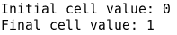

`RefCell` 做类似的事情，但它可以与任何类型的类型一起使用，如果没有其他引用指向它，你可以获取其内部值的可变引用。当然，它内部使用不安全代码，因为 Rust 不允许这样做。为了使其工作，它有一个标志让 `RefCell` 知道它是否当前被借用。如果它被用于读取而借用，可以使用 `borrow()` 方法生成更多只读借用，但不能进行可变借用。如果使用 `borrow_mut()` 方法进行可变借用，你将无法以可变或不可变的方式借用它。

这两种方法将在运行时检查当前的借用状态，而不是在编译时，这是 Rust 规则的标准做法，如果当前状态不正确，它们将引发恐慌。它们有非恐慌的替代方法，名为 `try_borrow()` 和 `try_borrow_mut()`。由于所有检查都是在运行时完成的，它们将比常规的 Rust 规则慢，但允许这种内部可变性。让我们看一个例子：

```rs
use std::cell::RefCell;
use std::collections::HashMap;

fn main() {
    let hm = HashMap::new();
    let my_cell = RefCell::new(hm);
    println!("Initial cell value: {:?}", my_cell.borrow());

    my_cell.borrow_mut().insert("test_key", "test_value");
    println!("Final cell value: {:?}", my_cell.borrow());
}
```

再次提醒，`my_cell` 变量是不可变的，但这段代码仍然可以编译，并且我们可以获得对其的可变借用，这允许我们在哈希表中插入一个新的键/值对。预期的输出如下：

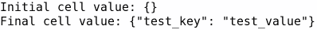

另一方面，由于借用标志不是线程安全的，整个 `RefCell` 结构将不会是 `Sync`。你可以安全地将单元格的完整所有权发送到新线程，但不能有对其的共享引用。如果你想更好地理解 `Rc`、Cells 和 RefCells 的工作原理，我们已经在 第三章 中讨论了它们，*Rust 的内存管理*。

存在着线程安全的替代方案，允许内部可变性，称为 Mutexes。`Mutex` 将守卫存储在一个实际的系统 `Mutex` 中，在访问数据之前同步线程。这使得它成为 `Sync`，但同时也更慢。我们将在本章中看到它们是如何工作的。

# Rust 中的其他并发类型

在 Rust 以及许多其他语言中，还有其他实现并行计算的方法。在本章中，我们将讨论多线程，其中每个线程都可以访问共享内存，并创建自己的堆栈，以便它可以独立工作。理想情况下，你应该有大约与你的 PC/服务器中虚拟 CPU 数量相同的线程同时工作。

这通常是 CPU 核心数量的两倍，多亏了超线程技术，其中一个核心可以通过使用自己的硬件调度器来同时运行两个线程，以决定在给定时间点运行每个线程的哪些部分。

线程的主要问题在于，如果你不设置限制而运行太多线程，可能是因为其中一些线程是空闲的，而你的 CPU 应该能够运行其他线程，你将消耗大量的 RAM。这是因为每个线程都需要创建所有这些栈。一些 Web 服务器为每个请求创建一个线程并不罕见。当负载高时，这会使事情变得非常慢，因为它需要大量的 RAM。

并发性的另一种方法是异步编程。Rust 在这方面有很好的工具，我们将在下一章中看到它们。异步编程带来的最佳改进是允许一个线程在不会阻塞实际线程的情况下运行多个 I/O 请求。

不仅如此，如果线程空闲，它不需要等待一段时间然后再去轮询新的请求。当有新信息时，底层操作系统会唤醒线程。因此，这种方法将使用尽可能少的资源进行 I/O 操作。

但对于那些不需要 I/O 的程序呢？在这种情况下，事情可以比使用线程更并行地执行。如今的大多数处理器都允许向量化。向量化使用一些特殊的 CPU 指令和寄存器，你可以输入多个变量，同时在这些变量上执行相同的操作。这对于高性能计算非常有用，在那里你需要多次将某种算法应用于不同的数据集。采用这种方法，你可以同时执行多个加法、减法、乘法和除法。

用于向量化的特殊指令被称为**SIMD**系列，源自**单指令多数据**。你可以在夜间的 Rust 中直接通过`asm!{}`宏运行汇编，编译器将尝试自动向量化你的代码，尽管这通常不如专业人士手动操作的效果好。2018 年有多项提议稳定 SIMD 内建函数。这样，你将能够使用这些指令，同时从汇编中抽象出来。在`faster`crate（[`crates.io/crates/faster`](https://crates.io/crates/faster)）中正在进行一些努力。

# 理解多线程

现在我们已经了解了 Rust 中不同的并发方法，我们可以从最基本的方法开始：创建线程。如果你之前使用过 Java 或 C++等语言，你可能会熟悉前者的`new Thread()`语法或后者的`std::thread`。在两种情况下，你都需要指定新线程将运行的代码以及线程将拥有的额外信息。在两种情况下，你都可以启动线程并等待它们完成。

# 创建线程

在 Rust 中，与 C++ 方法类似，我们有一个带有 `spawn()` 函数的 `std::thread` 模块。这个函数将接收一个闭包或指向函数的指针并执行它。它将返回一个线程句柄，我们将能够从外部管理它。让我们看看它是如何工作的：

```rs
use std::thread;

fn main() {
    println!("Before the thread!");

    let handle = thread::spawn(|| {
        println!("Inside the thread!");
    });
    println!("After thread spawn!");

    handle.join().expect("the thread panicked");
    println!("After everything!");
}
```

这将输出类似以下内容：


**线程内！** 和 **线程启动后！** 消息可以在理论上以任何顺序排列，尽管在这个简单的例子中很容易看出启动线程将比在屏幕缓冲区中打印花费更多时间。

然而，这个例子展示了如何与线程一起工作的宝贵信息。首先，当打印出 **线程之前！** 消息时，只有一个线程正在执行：主线程，运行 `main()` 函数。

然后，我们使用 `std::thread::spawn()` 函数启动一个新的线程，并向它传递一个简单的闭包。这个闭包将只会在控制台打印 **线程内！** 消息。这发生在 **线程启动后！** 消息打印的同时。实际上，在某些编程语言中，你可能会看到两个消息的字符混合在一起，最终的消息只是一堆难以理解的字符。

Rust 通过仅使用 `Mutex` 访问标准输出文件描述符来避免这种情况。`println!()` 宏会在写入消息时锁定 `stdout`，如果新的消息想要被写入，它将必须等待第一次写入完成。

这既有优点也有缺点。作为一个明显的优点，打印的消息清晰可读，因为线程之一（主线程或第二个线程）总是会先于另一个到达。另一方面，这意味着当第二个线程等待第一个线程在屏幕上完成打印时，它将被阻塞，无法进行任何计算。

你需要确保考虑到这一点，在执行计算时不要从许多线程中频繁打印。实际上，由于 Rust 是一个线程安全的语言，这将在任何共享资源上发生，因此你需要小心避免开销。

你可能会认为这是一个对性能不好的方法，因为它会使事情变慢，但实际上，如果需要保留数据的完整性，这是唯一可能的方法。在其他语言中，你可能需要自己实现解决方案，或者显式地使用现有解决方案来避免内存损坏。

在示例代码的末尾之前，我们可以看到我们调用了线程句柄中的 `join()` 方法。这将使当前线程等待另一个线程完成。你可能注意到我在它之后添加了对 `expect()` 方法的调用。这是因为 `join()` 方法返回一个 `Result`，因为它可能在完成之前崩溃。

# Rust 中的恐慌

让我们首先了解什么是线程恐慌。你可能已经知道，你可以通过在`Option`或`Result`中调用`unwrap()`或`expect()`方法，甚至直接调用`panic!()`来引发恐慌。有几种引发恐慌的方式：`unimplemented!()`宏会引发恐慌，让用户知道该功能尚未实现，`assert!()`宏家族如果条件不满足也会引发恐慌，并且超出范围的切片索引也会引发恐慌，但，什么是恐慌？

当谈论单线程应用程序时，你可能会认为恐慌就像带错误退出程序一样，类似于 C/C++中的`exit()`函数。可能对你来说听起来很新颖的是，恐慌是发生在线程级别上的事情。如果主线程发生恐慌，整个程序会退出，但如果非主线程发生恐慌，你可以从中恢复。

但是，恐慌真的只是简单的程序结束吗？实际上，它远不止于此。在 C/C++中，当你退出程序时，内存只是归还给内核，然后程序就结束了。然而，Rust 由于它的内存安全保证，确保它调用当前栈中的所有析构函数。这意味着所有变量都将优雅地释放。

这就是所谓的**栈回溯**，但这不是唯一的选择。正如我们在第一章中解释的，如何在`Cargo.toml`文件中配置行为，你也可以选择中止恐慌，这将模仿标准 C/C++的行为。

栈回溯恐慌的主要优点当然是，如果你事情搞砸了，你可以执行清理操作。例如，你可以通过在结构体中实现`Drop`特质来关闭文件、记录最后时刻的日志和更新一些数据库。

然而，正如我们在第一章“常见性能陷阱”中已经提到的，主要缺点是每次我们调用`unwrap()`或`expect()`方法时，例如，就会出现一个新的分支。要么事情出错，线程发生恐慌，要么事情按预期进行。如果它们发生恐慌，编译器需要添加整个代码进行栈回溯，这使得可执行文件明显变大。

现在你已经了解了恐慌的工作原理，让我们看看我们如何从中恢复：

```rs
use std::thread;

fn main() {
    println!("Before the thread!");

    let handle = thread::Builder::new()
        .name("bad thread".to_owned())
        .spawn(|| {
            panic!("Panicking inside the thread!");
        })
        .expect("could not create the thread");
    println!("After thread spawn!");

    if handle.join().is_err() {
        println!("Something bad happened :(");
    }
    println!("After everything!");
}
```

正如你所见，我添加了一些更多的样板代码。例如，我为线程添加了一个名称，这是一个好的实践，这样我们就可以知道如果出现问题，每个线程叫什么。我将第二个线程内的控制台打印更改为显式的恐慌，然后检查在连接线程时是否有问题。这里重要的是，你绝不应该在连接线程时仅仅调用`expect()`或`unwrap()`，因为这可能会使你的整个程序失败。

对于这个例子，输出应该类似于以下内容：

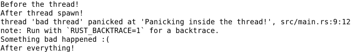

当与引发错误的线程一起工作时，有一个额外的技巧。如果你有一个实现了`Drop`特质的结构体，当引发错误或超出作用域时，将会调用`drop()`方法。

你可以通过调用`std::thread::panicking()`函数来找出当前线程是否正在引发错误。让我们看看它是如何工作的：

```rs
use std::thread;

struct MyStruct {
    name: String,
}

impl Drop for MyStruct {
    fn drop(&mut self) {
        if thread::panicking() {
            println!("The thread is panicking with the {} struct!", self.name);
        } else {
            println!("The {} struct is out of scope :(", self.name);
        }
    }
}

fn main() {
    let my_struct = MyStruct {
        name: "whole program".to_owned(),
    };

    {
        let scoped_struct = MyStruct {
            name: "scoped".to_owned(),
        };
    }

    let handle = thread::Builder::new()
        .name("bad thread".to_owned())
        .spawn(|| {
            let thread_struct = MyStruct {
                name: "thread".to_owned(),
            };
            panic!("Panicking inside the thread!");
        })
        .expect("could not create the thread");
    println!("After thread spawn!");

    if handle.join().is_err() {
        println!("Something bad happened :(");
    }
    println!("After everything!");
}
```

首先，让我们看看这段代码的作用。它添加了一个新的`MyStruct`结构体，其中包含一个名称并实现了`Drop`特质。然后，它使用`whole program`名称创建了这个结构体的一个实例。这个结构体将在`main()`函数的末尾被丢弃。

然后，在一个人工的作用域中，它添加了一个结构体的作用域实例，这个实例将在那个内部作用域的末尾被丢弃。最后，在线程内部，它创建了一个新的结构体，这个结构体应该在线程结束时被丢弃，并且将会被展开。

`MyStruct`结构的`Drop`实现使用了`std::thread::panicking()`函数来检查它是否在引发错误时被丢弃，或者仅仅是因为它超出了作用域。这里是我们这个示例的输出：

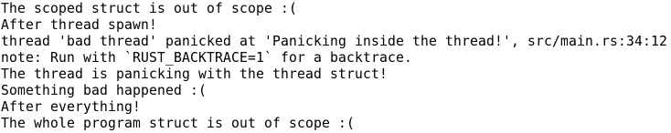

如我们所见，第一条信息是内部作用域绑定的丢弃。然后，新的线程被创建，它引发了错误，线程内部的绑定在展开栈时被丢弃。最后，在`main()`函数的最后一条信息之后，我们最初创建的第一个绑定被丢弃。

# 在线程间移动数据

我们通过`Send`和`Sync`特质看到了第一个特质允许变量在线程间传递，但它是如何工作的？我们能否在次要线程中使用在主线程中创建的变量？让我们试一试：

```rs
use std::thread;

fn main() {
    let my_vec = vec![10, 33, 54];

    let handle = thread::Builder::new()
        .name("my thread".to_owned())
        .spawn(|| {
            println!("This is my vector: {:?}", my_vec);
        })
        .expect("could not create the thread");

    if handle.join().is_err() {
        println!("Something bad happened :(");
    }
}
```

我们所做的是在线程外部创建一个向量，然后从内部使用它。但看起来它不起作用。让我们看看编译器告诉我们什么：

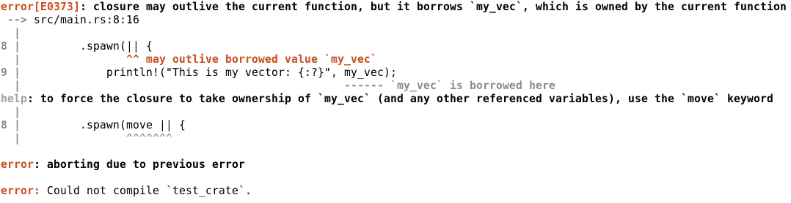

这很有趣。编译器注意到`my_vec`绑定将在`main()`函数的末尾被丢弃，而内部线程可以存活得更久。在我们的例子中并不是这样，因为我们`join()`了两个线程，在`main()`函数结束之前，但在一个场景中，一个线程创建更多的线程然后结束自己，这种情况可能会发生。这将使线程内部的引用无效，而 Rust 不允许这种情况发生。

# 移动关键字

尽管如此，它为我们能做的事情提供了一个很好的解释。我们有两种选择：在线程间共享绑定或将它发送到第二个线程。由于我们不会在主线程中使用它，我们可以在闭包之前添加`move`关键字并将向量发送到新的线程，因为它实现了`Send`特质。让我们看看我们如何让它工作：

```rs
use std::thread;

fn main() {
    let my_vec = vec![10, 33, 54];

    let handle = thread::Builder::new()
        .name("my thread".to_owned())
        .spawn(move || {
            println!("This is my vector: {:?}", my_vec);
        })
        .expect("could not create the thread");

    if handle.join().is_err() {
        println!("Something bad happened :(");
    }
}
```

现在代码可以编译，并在控制台显示了数字列表，太棒了！但是，如果我们想在主线程中也能看到它怎么办？在第二个线程启动后尝试打印向量是不行的，因为变量已经被移动到了新的线程，而且我们已经看到如果我们不移动向量，我们无法在线程中使用它。我们该怎么办？

# 线程间共享数据

我们已经提到过一个可以在线程间共享的特殊引用计数指针：`std::sync::Arc`。与 `Rc` 的主要区别在于，`Arc` 使用原子计数器来计数引用。这意味着内核将确保所有对引用计数的更新都会逐个发生，使其线程安全。让我们用一个例子来看看：

```rs
use std::thread;
use std::sync::Arc;

fn main() {
    let my_vec = vec![10, 33, 54];
    let pointer = Arc::new(my_vec);

    let t_pointer = pointer.clone();
    let handle = thread::Builder::new()
        .name("my thread".to_owned())
        .spawn(move || {
            println!("Vector in second thread: {:?}", t_pointer);
        })
        .expect("could not create the thread");

    println!("Vector in main thread: {:?}", pointer);

    if handle.join().is_err() {
        println!("Something bad happened :(");
    }
}
```

如你所见，向量在第二个线程和主线程中都被使用。你可能想知道指针中的 `clone()` 是什么意思。我们是克隆向量吗？嗯，那将是一个简单的解决方案，对吧？实际情况是，我们只是得到了向量的新引用。这是因为 `Clone` 特性在 `Arc` 中并不是一个普通的克隆。它将返回一个新的 `Arc`，是的，但它也会增加引用计数。由于两个 `Arc` 实例都将有相同的指针指向引用计数器和向量，我们将有效地共享这个向量。

如何简单地调试 `Arc` 内部的向量指针？这是一个有趣的技巧。`Arc<T>` 实现了 `Deref<T>`，这意味着在调用调试时，它将自动解引用到它所指向的向量。有趣的是，有两个特性允许这种自动解引用：`Deref` 和 `DerefMut`。正如你可能猜到的，前者给你一个包含值的不可变借用，而后者给你一个可变借用。

`Arc` 只实现了 `Deref`，而没有实现 `DerefMut`，所以我们无法修改其内部的内容。但是等等，我们不是有可以保持不可变状态的同时进行修改的 cells 吗？嗯，它们确实存在一个问题。我们从 `Arc` 看到的能够在线程间共享的行为，仅仅是因为实现了 `Sync` 特性，而且它只有在内部值实现了 `Sync` 和 `Send` 时才会实现它。Cells 可以在线程间传递，它们实现了 `Send`，但它们没有实现 `Sync`。另一方面，`Vec` 实现了内部值的任何实现，所以在这种情况下，它既是 `Send` 也是 `Sync`。

那么，就这样了吗？我们能在 `Arc` 内部修改任何东西吗？正如你可能猜到的，情况并非如此。如果我们想在线程间共享的是整数或布尔值，我们可以使用任何 `std::sync::atomic` 整数和布尔值，即使其中一些还不稳定。它们实现了 `Sync`，并且它们通过 `load()` 和 `store()` 方法具有内部可变性。你只需要指定操作的内存排序即可。让我们看看它是如何工作的：

```rs
use std::thread;
use std::sync::Arc;
use std::sync::atomic::{AtomicUsize, Ordering};

fn main() {
    let my_val = AtomicUsize::new(0);
    let pointer = Arc::new(my_val);

    let t_pointer = pointer.clone();
    let handle = thread::Builder::new()
        .name("my thread".to_owned())
        .spawn(move || {
            for _ in 0..250_000 {
                let cur_value = t_pointer.load(Ordering::Relaxed);
                let sum = cur_value + 1;
                t_pointer.store(sum, Ordering::Relaxed);
            }
        })
        .expect("could not create the thread");

    for _ in 0..250_000 {
        let cur_value = pointer.load(Ordering::Relaxed);
        let sum = cur_value + 1;
        pointer.store(sum, Ordering::Relaxed);
    }

    if handle.join().is_err() {
        println!("Something bad happened :(");
    }

    let a_int = Arc::try_unwrap(pointer).unwrap();
    println!("Final number: {}", a_int.into_inner());
}
```

如果你多次运行这个程序，你会看到最终数字每次都会不同，而且它们都不会是 500,000（可能会发生，但几乎不可能）。我们有的类似于数据竞争：

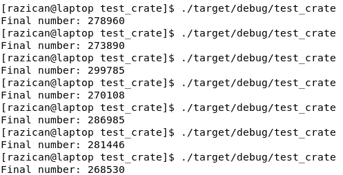

但等等，Rust 不能防止所有数据竞争吗？嗯，这并不完全是一个数据竞争。当我们保存整数时，我们没有检查它是否已更改，所以我们覆盖了那里写下的任何内容。我们没有使用 Rust 给予我们的优势。它将确保变量的状态是一致的，但它不会防止逻辑错误。

问题在于当我们存储它回去时，那个值已经改变了。为了避免这种情况，原子操作有伟大的`fetch_add()`函数及其朋友`fetch_sub()`、`fetch_and()`、`fetch_or()`和`fetch_xor()`。它们将完整操作原子化。它们还有伟大的`compare_and_swap()`和`compare_exchange()`函数，可以用来创建锁。让我们看看这将如何工作：

```rs
use std::thread;
use std::sync::Arc;
use std::sync::atomic::{AtomicUsize, Ordering};

fn main() {
    let my_val = AtomicUsize::new(0);
    let pointer = Arc::new(my_val);

    let t_pointer = pointer.clone();
    let handle = thread::Builder::new()
        .name("my thread".to_owned())
        .spawn(move || {
            for _ in 0..250_000 {
                t_pointer.fetch_add(1, Ordering::Relaxed);
            }
        })
        .expect("could not create the thread");

    for _ in 0..250_000 {
        pointer.fetch_add(1, Ordering::Relaxed);
    }

    if handle.join().is_err() {
        println!("Something bad happened :(");
    }

    let a_int = Arc::try_unwrap(pointer).unwrap();
    println!("Final number: {}", a_int.into_inner());
}
```

正如你现在所看到的，每次运行的结果都是 500,000。如果你想执行更复杂的操作，你需要一个锁。你可以用`AtomicBool`来做，例如，你可以等待它变为`false`，然后将其交换为`true`并执行操作。你需要确保所有线程只在锁被它们设置为`true`时更改值，通过使用某种内存排序。让我们看看一个例子：

```rs
use std::thread;
use std::sync::Arc;
use std::sync::atomic::{AtomicBool, AtomicUsize, Ordering};

fn main() {
    let my_val = AtomicUsize::new(0);
    let pointer = Arc::new(my_val);
    let lock = Arc::new(AtomicBool::new(false));

    let t_pointer = pointer.clone();
    let t_lock = lock.clone();
    let handle = thread::Builder::new()
        .name("my thread".to_owned())
        .spawn(move || {
            for _ in 0..250_000 {
                while t_lock.compare_and_swap(
                        false, true, Ordering::Relaxed) {}
                let cur_value = t_pointer.load(Ordering::Relaxed);
                let sum = cur_value + 1;
                t_pointer.store(sum, Ordering::Relaxed);
                t_lock.store(false, Ordering::Relaxed);
            }
        })
        .expect("could not create the thread");

    for _ in 0..250_000 {
        while lock.compare_and_swap(
            false, true, Ordering::Relaxed) {}
        let cur_value = pointer.load(Ordering::Relaxed);
        let sum = cur_value + 1;
        pointer.store(sum, Ordering::Relaxed);
        lock.store(false, Ordering::Relaxed);
    }

    if handle.join().is_err() {
        println!("Something bad happened :(");
    }

    let a_int = Arc::try_unwrap(pointer).unwrap();
    println!("Final number: {}", a_int.into_inner());
}
```

如果你运行它，你会看到它工作得非常完美。但这只因为在这两个线程中，我们只在锁定和释放锁之间改变值。事实上，这是如此安全，以至于我们可以完全避免使用原子整数，尽管 Rust 在安全代码中不允许我们这样做。

现在我们已经看到了如何在线程间共享的整数进行变异的方法，你可能想知道是否可以对其他类型的绑定做类似的事情。正如你可能猜到的，是可以的。你需要使用`std::sync::Mutex`，在性能方面这会比使用原子操作要昂贵得多，所以请谨慎使用。让我们看看它们是如何工作的：

```rs
use std::thread;
use std::sync::{Arc, Mutex};

fn main() {
    let my_vec = Arc::new(Mutex::new(Vec::new()));

    let t_vec = my_vec.clone();
    let handle = thread::Builder::new()
        .name("my thread".to_owned())
        .spawn(move || {
            for i in 0..50 {
                t_vec.lock().unwrap().push(i);
            }
        })
        .expect("could not create the thread");

    for i in 0..50 {
        my_vec.lock().unwrap().push(i);
    }

    if handle.join().is_err() {
        println!("Something bad happened :(");
    }

    let vec_mutex = Arc::try_unwrap(my_vec).unwrap();
    let f_vec = vec_mutex.into_inner().unwrap();
    println!("Final vector: {:?}", f_vec);
}
```

它将输出类似的内容：

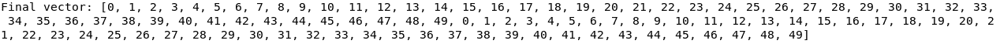

如果你仔细分析输出，你会看到它首先将 0 到 49 的所有数字相加，然后再次执行相同的操作。如果两个线程都在并行运行，所有数字不应该是随机分布的吗？也许先有两个 1，然后是两个 2，以此类推？

在线程间共享信息的主要问题是，当`Mutex`锁定时，它需要来自两个线程的同步。这是完全正常和安全的，但它需要花费很多时间从一个线程切换到另一个线程来写入向量。这就是为什么内核调度器允许在锁定`Mutex`之前让其中一个线程工作一段时间。如果它每次迭代都锁定和解锁`Mutex`，那么完成它将需要很长时间。

这意味着如果你的循环超过 50 次迭代，也许每个循环 1 百万次，你会在一段时间后看到，其中一个线程会停止，以便优先考虑第二个线程。然而，在迭代次数较少的情况下，你会看到它们一个接一个地运行。

当你调用`lock()`时，互斥锁被锁定，当它超出作用域时解锁。在这种情况下，由于没有与之绑定，它将在调用`push(i)`后超出作用域，因此我们可以在它之后添加更多计算，而无需在线程之间进行同步。有时，如果我们的工作涉及多行并且我们需要绑定，创建人工作用域以尽快解锁互斥锁可能甚至是有用的。

当我们使用互斥锁时，必须考虑的一个额外问题是线程崩溃。如果你的线程在互斥锁锁定时崩溃，另一个线程中的`lock()`函数将返回`Result::Err(_)`，所以如果我们每次`lock()`互斥锁时都调用`unwrap()`，我们可能会遇到大麻烦，因为所有线程都会崩溃。这被称为`Mutex`中毒，并且有方法可以避免它。

当互斥锁因为一个线程在锁定时崩溃而中毒时，调用`lock()`方法的错误结果将返回中毒错误。我们可以通过调用`into_inner()`方法从中恢复。让我们看看一个例子，看看这是如何工作的：

```rs
use std::thread;
use std::sync::{Arc, Mutex};
use std::time::Duration;

fn main() {
    let my_vec = Arc::new(Mutex::new(Vec::new()));

    let t_vec = my_vec.clone();
    let handle = thread::Builder::new()
        .name("my thread".to_owned())
        .spawn(move || {
            for i in 0..10 {
                let mut vec = t_vec.lock().unwrap();
                vec.push(i);
                panic!("Panicking the secondary thread");
            }
        })
        .expect("could not create the thread");

    thread::sleep(Duration::from_secs(1));

    for i in 0..10 {
        let mut vec = match my_vec.lock() {
            Ok(g) => g,
            Err(e) => {
                println!("The secondary thread panicked, recovering…");
                e.into_inner()
            }
        };
        vec.push(i);
    }

    if handle.join().is_err() {
        println!("Something bad happened :(");
    }

    let vec_mutex = Arc::try_unwrap(my_vec).unwrap();
    let f_vec = match vec_mutex.into_inner() {
        Ok(g) => g,
        Err(e) => {
            println!("The secondary thread panicked, recovering…");
            e.into_inner()
        }
    };
    println!("Final vector: {:?}", f_vec);
}
```

如你在代码中所见，第二个线程在向向量插入第一个数字后会崩溃。我在主线程中添加了一个短暂的 1 秒休眠，以确保在主线程之前执行副线程。如果你运行它，你会得到类似以下的结果：

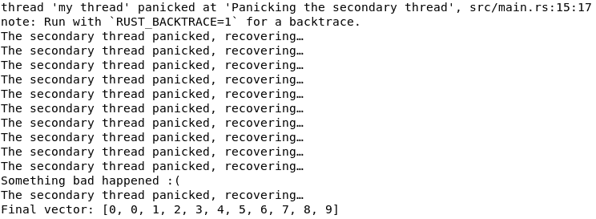

如你所见，一旦`Mutex`被中毒，它将一直保持中毒状态。因此，你应该尽量避免任何可能导致在`Mutex`中获取锁后崩溃的行为。无论如何，你仍然可以使用它，并且如你所见，最终的向量将包含来自两个线程的值；只有来自副线程的`0`，直到崩溃，然后是主线程的其余部分。确保不要在关键应用程序中`unwrap()`互斥锁，因为这将在第一次崩溃后使所有线程崩溃。

# 线程间的通道

在两个或多个线程之间发送信息有另一种方式。它们被称为通道，或者更具体地说，是多生产者、单消费者 FIFO 通信原语。

首先，我们来分析一下这意味着什么。由于它们是多生产者通道，你可以同时从多个线程向接收者发送数据。同样，由于它们是单消费者，只有一个接收者会从通道中所有相关的发送者那里接收数据。最后，FIFO 来源于**先入先出**，这意味着通道中的消息将按照它们的创建时间戳进行排序，你只能在读取接收器中的第一个消息之后才能读取第二个`消息`。

这些通道位于`std::sync::mpsc`模块中，它们对于日志记录或遥测等用途非常有用。一个线程可以管理与通信或日志机制的 I/O 接口，而其他线程可以向这个线程发送它们想要记录或通信的信息。对于用 Rust 编写的对流层气球控制软件，正在研究使用这些通道的方法。

通道由一个`Sender`和一个`Receiver`组成。`Sender`实现了`Clone`，这样就可以克隆发送者，多个线程可以向相关的接收者发送信息。有两种类型的发送者：`Sender`和`SyncSender`。前者会将消息直接发送到接收者而不会检查任何额外的内容，而后者只有在接收者的缓冲区有足够空间时才会发送消息。它将阻塞当前线程，直到消息发送完成。

通道是通过`std::sync::mpsc`模块中的`channel()`和`sync_channel()`函数创建的。它们将分别返回一个包含`Sender`或`SyncSender`（分别作为第一个元素）和一个`Receiver`（作为第二个元素）的元组。由于`Sender`和`Receiver`实现了`Send`，它们可以安全地使用`move`关键字发送到另一个线程。在同步通道的情况下，`sync_channel()`将需要一个`usize`来设置缓冲区大小。如果缓冲区已满，`Sender`将阻塞。另一方面，异步通道就像它们有一个无限缓冲区一样工作，它们总是会接受发送新数据。

每个通道只能发送或接收一种特定的数据类型，所以如果一个通道被配置为发送`u32`，则每条消息只能发送一个`u32`。不过，你也可以配置它发送你自己的类型，例如一个包含你可能想要发送的所有信息的自定义`Frame`类型。让我们看看通道是如何工作的：

```rs
use std::thread;
use std::sync::mpsc::*;
use std::time::Duration;

fn main() {
    let (sender, receiver) = channel();

    let handles: Vec<_> = (1..6)
        .map(|i| {
            let t_sender = sender.clone();
            thread::Builder::new()
                .name(format!("sender-{}", i))
                .spawn(move || {
                    t_sender.send(
                        format!("Hello from sender {}!", i)
                    ).unwrap();
                })
                .expect("could not create the thread")
        })
        .collect();

    while let Ok(message) = receiver.recv_timeout(Duration::from_secs(1)) {
        println!("{}", message);
    }
    for handle in handles {
        handle.join().unwrap();
    }
    println!("Finished");
}
```

如代码所示，使用迭代器创建了五个线程，并将它们的句柄收集到一个向量中。这些线程将有一个包含线程编号的名称，并将`Hello from sender {}!`消息发送给接收者。对于每个线程，发送者都会被克隆，以便克隆可以被移动到线程闭包中。

然后，一个 `while` 循环将检查消息，超时时间为 1 秒。这应该足够了，因为消息会在线程启动后立即发送。如果一秒钟内没有收到消息（或者所有发送者都超出作用域），`while` 循环将停止打印消息，并将线程连接起来。最后，将打印一条完成消息。

如果你运行这个示例，你将看到类似以下输出的内容：

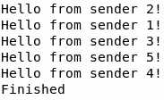

如您所见，线程的执行顺序并不特定。它们会将消息发送给接收者，接收者将按接收顺序读取它们。由于这个示例是异步的，我们不需要等待接收者清空缓冲区以发送新消息，所以它非常轻量级。实际上，我们可以在读取接收者的任何消息之前就连接线程。

# 多线程 crate

到目前为止，我们只使用标准库来操作线程，但多亏了伟大的 *crates.io* 生态系统，我们可以利用更多的方法来提高我们的开发速度以及代码的性能。

# 非阻塞数据结构

我们之前看到的一个问题是，如果我们想在线程之间共享比整数或布尔值更复杂的东西，并且我们想修改它，我们需要使用 `Mutex`。这并不完全正确，因为有一个 crate，Crossbeam，允许我们使用不需要锁定 `Mutex` 的大数据结构。因此，它们要快得多，效率也更高。

通常，当我们想在线程之间共享信息时，我们通常想要合作处理的任务列表。有时，我们想在多个线程中创建信息并将其添加到信息列表中。因此，多个线程通常不会使用完全相同的变量，因为我们已经看到，这需要同步，并且会变慢。

这就是 Crossbeam 展示其全部潜力的地方。Crossbeam 为我们提供了一些多线程队列和栈，我们可以从不同的线程中插入和消费数据。实际上，我们可以让一些线程进行数据的初步处理，而其他线程则执行处理的第二阶段。让我们看看我们如何使用这些功能。首先，将 `crossbeam` 添加到 `Cargo.toml` 文件中 crate 的依赖项。然后，我们从简单的示例开始：

```rs
extern crate crossbeam;

use std::thread;
use std::sync::Arc;

use crossbeam::sync::MsQueue;

fn main() {
    let queue = Arc::new(MsQueue::new());

    let handles: Vec<_> = (1..6)
        .map(|_| {
            let t_queue = queue.clone();
            thread::spawn(move || {
                for _ in 0..1_000_000 {
                    t_queue.push(10);
                }
            })
        })
        .collect();

    for handle in handles {
        handle.join().unwrap();
    }

    let final_queue = Arc::try_unwrap(queue).unwrap();
    let mut sum = 0;
    while let Some(i) = final_queue.try_pop() {
        sum += i;
    }

    println!("Final sum: {}", sum);
}
```

让我们先了解这个示例做了什么。它将在 5 个不同的线程中迭代 1,000,000 次，每次都会将一个 10 推入队列。队列是 FIFO 列表，先入先出。这意味着第一个输入的数字将是第一个 `pop()` 的，最后一个输入的将是最后一个 `pop()` 的。在这种情况下，所有数字都是 10，所以这并不重要。

一旦线程完成队列的填充，我们就遍历它并将所有数字添加进去。一个简单的计算应该让你能够猜出，如果一切顺利，最终的数字应该是 50,000,000。如果你运行它，那将是结果，而且不仅如此。如果你通过执行`cargo run --release`来运行它，它将运行得非常快。在我的电脑上，它大约需要一秒钟来完成。如果你想，尝试使用标准库`Mutex`和向量实现这段代码，你将看到性能差异惊人。

如你所见，我们仍然需要使用`Arc`来控制对队列的多个引用。这是因为队列本身不能被复制和共享，它没有引用计数。

Crossbeam 不仅为我们提供了 FIFO 队列。我们还有 LIFO 栈。LIFO 来源于后进先出，这意味着你最后插入栈中的元素将是第一个被`pop()`的。让我们通过几个线程来看看它们的区别：

```rs
extern crate crossbeam;

use std::thread;
use std::sync::Arc;
use std::time::Duration;

use crossbeam::sync::{MsQueue, TreiberStack};

fn main() {
    let queue = Arc::new(MsQueue::new());
    let stack = Arc::new(TreiberStack::new());

    let in_queue = queue.clone();
    let in_stack = stack.clone();
    let in_handle = thread::spawn(move || {
        for i in 0..5 {
            in_queue.push(i);
            in_stack.push(i);
            println!("Pushed :D");
            thread::sleep(Duration::from_millis(50));
        }
    });

    let mut final_queue = Vec::new();
    let mut final_stack = Vec::new();

    let mut last_q_failed = 0;
    let mut last_s_failed = 0;

    loop {
        // Get the queue
        match queue.try_pop() {
            Some(i) => {
                final_queue.push(i);
                last_q_failed = 0;
                println!("Something in the queue! :)");
            }
            None => {
                println!("Nothing in the queue :(");
                last_q_failed += 1;
            }
        }

        // Get the stack
        match stack.try_pop() {
            Some(i) => {
                final_stack.push(i);
                last_s_failed = 0;
                println!("Something in the stack! :)");
            }
            None => {
                println!("Nothing in the stack :(");
                last_s_failed += 1;
            }
        }

        // Check if we finished
        if last_q_failed > 1 && last_s_failed > 1 {
            break;
        } else if last_q_failed > 0 || last_s_failed > 0 {
            thread::sleep(Duration::from_millis(100));
        }
    }

    in_handle.join().unwrap();

    println!("Queue: {:?}", final_queue);
    println!("Stack: {:?}", final_stack);
}
```

如代码所示，我们有两个共享变量：一个队列和一个栈。次要线程将按相同的顺序将新值推送到它们中，从 0 到 4。然后，主线程将尝试取回它们。它将无限循环并使用`try_pop()`方法。可以使用`pop()`方法，但如果队列或栈为空，它将阻塞线程。一旦所有值都被弹出，这将在任何情况下发生，因为没有新的值被添加，所以`try_pop()`方法将帮助不会阻塞主线程并优雅地结束。

它通过计算尝试弹出新值失败的次数来检查是否所有值都被弹出。每次失败，它将等待 100 毫秒，而推送线程只在推送之间等待 50 毫秒。这意味着如果它尝试弹出新值两次而没有新值，推送线程已经完成。

它将弹出的值添加到两个向量中，然后打印结果。同时，它将打印有关推送和弹出新值的消息。通过查看输出，你会更好地理解这一点：

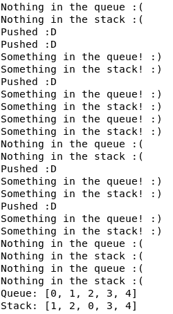

注意，由于线程不需要按任何特定顺序执行，所以你的输出可能会有所不同。

在这个示例输出中，如你所见，它首先尝试从队列和栈中获取一些东西，但那里没有，所以它休眠。然后，第二个线程开始推送东西，实际上是两个数字。之后，队列和栈将变为`[0, 1]`。然后，它从每个中弹出第一个项目。从队列中，它将弹出`0`，从栈中弹出`1`（最后一个），使队列变为`[1]`，栈变为`[0]`。

然后，它将再次进入休眠状态，次要线程将每个变量的值增加 2，使队列变为 `[1, 2]`，堆栈变为 `[0, 2]`。然后，主线程将从每个队列和堆栈中弹出两个元素。从队列中，它将弹出 `1` 和 `2`，而从堆栈中，它将弹出 `2` 然后是 `0`，使它们都为空。

主线程随后进入休眠状态，在接下来的两次尝试中，次要线程将推送一个元素，而主线程将弹出它，两次。

虽然这可能看起来有点复杂，但想法是这些队列和堆栈可以在线程之间高效地使用，而无需使用 `Mutex`，并且它们接受任何 `Send` 类型。这意味着它们非常适合复杂计算，甚至适合多阶段复杂计算。

Crossbeam crate 还提供了一些辅助工具来处理时代和提到的类型的某些变体。对于多线程，Crossbeam 还增加了一个非常有用的功能：作用域线程。

# 作用域线程

在我们所有的例子中，我们都使用了标准库线程。正如我们讨论的那样，这些线程有自己的堆栈，所以如果我们想在主线程中使用的变量，我们需要将它们 *发送* 到线程。这意味着我们需要使用像 `Arc` 这样的东西来共享不可变数据。不仅如此，由于它们有自己的堆栈，它们也会消耗更多的内存，如果使用过多，最终会使系统变慢。

Crossbeam 给我们一些特殊的线程，允许它们之间共享堆栈。它们被称为作用域线程。使用它们相当简单，crate 文档解释得非常完美；你只需要通过调用 `crossbeam::scope()` 创建一个 `Scope`。你需要传递一个接收作用域的闭包。你可以在该范围内调用 `spawn()`，就像在 `std::thread` 中做的那样，但有一个区别，如果你在作用域内创建或将其移动到作用域中，你可以在线程之间共享不可变变量。

这意味着对于我们刚才提到的队列或堆栈，或者对于原子数据，你可以简单地调用它们的方法，而无需使用 `Arc`！这将进一步提高性能。让我们看看它如何通过一个简单的例子来工作：

```rs
extern crate crossbeam;

fn main() {
    let all_nums: Vec<_> = (0..1_000_u64).into_iter().collect();
    let mut results = Vec::new();

    crossbeam::scope(|scope| {
        for num in &all_nums {
            results.push(scope.spawn(move || num * num + num * 5 + 250));
        }
    });

    let final_result: u64 = results.into_iter().map(|res| res.join()).sum();
    println!("Final result: {}", final_result);
}
```

让我们看看这段代码做了什么。它首先将创建一个包含从 0 到 1000 的所有数字的向量。然后，对于每一个数字，在一个 `crossbeam` 范围内，它将为每个数字运行一个作用域线程并执行一个假设的复杂计算。这只是一个例子，因为它将只返回一个简单二阶函数的结果。

然而，有趣的是，`scope.spawn()` 方法允许返回任何类型的结果，这在我们的情况下是非常好的。代码将把每个结果添加到一个向量中。由于它将在并行执行，所以它不会直接添加结果数字，而是添加一个结果保护器，我们可以在范围外检查它。

然后，在所有线程运行并返回结果后，作用域将结束。我们现在可以检查所有结果，它们保证对我们来说是准备好的。对于每一个，我们只需要调用 `join()`，我们就会得到结果。然后，我们将它们加起来以检查它们是否是实际的计算结果。

这个 `join()` 方法也可以在作用域内调用并获取结果，但这意味着如果您在 `for` 循环内这样做，例如，您将阻塞循环直到生成结果，这并不高效。最好的做法是至少先运行所有计算，然后再开始检查结果。如果您想在它们之后进行更多计算，您可能会发现将新的计算在 `crossbeam` 作用域内的另一个循环或迭代器中运行很有用。

但是，`crossbeam` 是如何让您在作用域外自由使用变量的呢？不会出现数据竞争吗？这就是魔法发生的地方。作用域将在退出之前将所有内部线程连接起来，这意味着在所有作用域线程完成之前，主线程将不会执行任何进一步的代码。这意味着我们可以使用主线程的变量，也称为 **父栈**，因为在这种情况下，主线程是作用域的父线程，而没有任何问题。

我们实际上可以使用 `println!()` 宏来检查正在发生的事情。如果我们从之前的例子中记得，在生成一些线程后打印到控制台通常会先于生成的线程运行，这是因为设置它们所需的时间。在这种情况下，由于 `crossbeam` 阻止了它，我们不会看到它。让我们检查以下示例：

```rs
extern crate crossbeam;

fn main() {
    let all_nums: Vec<_> = (0..10).into_iter().collect();

    crossbeam::scope(|scope| {
        for num in all_nums {
            scope.spawn(move || {
                println!("Next number is {}", num);
            });
        }
    });

    println!("Main thread continues :)");
}

```

如果您运行此代码，您将看到以下类似输出：

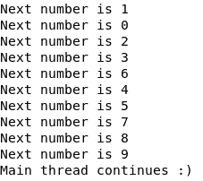

如您所见，作用域线程将以没有任何特定顺序的方式运行。在这种情况下，它将首先运行 `1`，然后是 `0`，然后是 `2`，依此类推。您的输出可能不同。但有趣的是，主线程不会继续执行，直到所有线程都完成。因此，在主线程中读取和修改变量是绝对安全的。

采用这种方法有两个主要性能优势；`Arc` 将需要调用 `malloc()` 来在堆中分配内存，如果这是一个大结构且内存有点满，这将花费时间。有趣的是，这些数据已经在我们的栈中了，所以如果可能的话，我们应该尽量避免在堆中重复它。此外，`Arc` 将有一个引用计数器，正如我们所看到的。它甚至将是一个原子引用计数器，这意味着每次我们克隆引用时，我们都需要原子地增加计数。这需要时间，甚至比增加简单的整数还要多。

大多数时候，我们可能正在等待一些昂贵的计算运行，如果它们完成时能直接给出所有结果那就太好了。我们仍然可以添加一些链式计算，使用作用域线程，这些计算将在第一个计算完成后执行，所以如果可能的话，我们应该比正常线程更频繁地使用作用域线程。

# 线程池

到目前为止，我们已经看到了创建新线程和它们之间共享信息的好几种方法。然而，正如我们在本章开头看到的，我们应该生成的理想线程数应该接近系统虚拟处理器的数量。这意味着我们不应该为每一块工作生成一个线程。尽管如此，控制每个线程执行的工作可能很复杂，因为你必须确保在任何给定时间点所有线程都有工作可做。

正是在这里，线程池派上了用场。`Threadpool` crate 将允许你遍历所有的工作，并且对于你的每一个小块工作，你可以调用类似于 `thread::spawn()` 的操作。有趣的是，每个任务将被分配给一个空闲线程，并且不会为每个任务创建新的线程。线程的数量是可以配置的，你可以使用其他 crate 来获取 CPU 的数量。不仅如此，如果其中一个线程发生恐慌，它将自动向池中添加一个新的线程。

为了看到示例，首先，让我们在我们的 `Cargo.toml` 文件中将 `threadpool` 和 `num_cpus` 添加为依赖项。然后，让我们看看一个示例代码：

```rs
extern crate num_cpus;
extern crate threadpool;

use std::sync::atomic::{AtomicUsize, Ordering};
use std::sync::Arc;

use threadpool::ThreadPool;

fn main() {
    let pool = ThreadPool::with_name("my worker".to_owned(), num_cpus::get());
    println!("Pool threads: {}", pool.max_count());

    let result = Arc::new(AtomicUsize::new(0));

    for i in 0..1_0000_000 {
        let t_result = result.clone();
        pool.execute(move || {
            t_result.fetch_add(i, Ordering::Relaxed);
        });
    }

    pool.join();

    let final_res = Arc::try_unwrap(result).unwrap().into_inner();
    println!("Final result: {}", final_res);
}
```

这段代码将创建一个具有计算机逻辑 CPU 数量的线程池。然后，它将一个从 0 到 1,000,000 的数字添加到一个原子的 `usize`，只是为了测试并行处理。每个加法操作将由一个线程执行。如果每个操作使用一个线程（1,000,000 个线程）将会非常低效。然而，在这种情况下，它将使用适当的线程数量，执行将会非常快。还有一个 crate 提供了线程池一个更有趣的并行处理功能：Rayon。

# 并行迭代器

如果你能在这些代码示例中看到整体情况，你就会意识到大多数并行工作都有一个长循环，将工作分配给不同的线程。这发生在简单的线程上，在作用域线程和线程池中发生得更多。在现实生活中通常也是这样。你可能有一堆数据要处理，你可能会将这个处理分成几块，遍历它们，并将它们交给不同的线程去完成工作。

这种方法的主要问题是，如果你需要使用多个阶段来处理给定数据，你可能会得到很多样板代码，这可能会使维护变得困难。不仅如此，你可能会发现自己有时不使用并行处理，因为必须编写所有这些代码的麻烦。

幸运的是，Rayon 围绕迭代器提供了多个数据并行原语，你可以使用这些原语并行化任何迭代计算。你几乎可以忘记`Iterator`特性，并使用 Rayon 的`ParallelIterator`替代品，它和标准库特性一样容易使用！

Rayon 使用一种称为**工作窃取**的并行迭代技术。对于并行迭代器的每次迭代，新的值或值被添加到待处理工作的队列中。然后，当一个线程完成其工作后，它会检查是否有待处理的工作要做，如果有，它就开始处理。在大多数语言中，这是一个明显的数据竞争来源，但多亏了 Rust，这不再是问题，你的算法可以运行得非常快，并且并行运行。

让我们看看如何使用它来处理本章中我们看到的类似示例。首先，将`rayon`添加到你的`Cargo.toml`文件中，然后让我们从代码开始：

```rs
extern crate rayon;

use rayon::prelude::*;

fn main() {
    let result = (0..1_000_000_u64)
        .into_par_iter()
        .map(|e| e * 2)
        .sum::<u64>();

    println!("Result: {}", result);
}
```

正如你所见，这就像你在顺序迭代器中编写的那样工作，然而，它是在并行运行的。当然，由于编译器的优化，顺序运行此示例会比并行运行快，但当你需要从文件中处理数据，例如，或执行非常复杂的数学计算时，并行化输入可以带来巨大的性能提升。

Rayon 将这些并行迭代特性实现到了所有标准库迭代器和范围中。不仅如此，它还可以与标准库集合一起工作，例如`HashMap`和`Vec`。在大多数情况下，如果你在代码中使用标准库的`iter()`或`into_iter()`方法，你可以在这些调用中简单地使用`par_iter()`或`into_par_iter()`，并且你的代码现在应该是并行并且运行得很好的。

但是，要注意，有时并行化某物并不会自动提高其性能。考虑到如果你需要在线程之间更新一些共享信息，它们将需要以某种方式进行同步，这将导致性能损失。因此，只有在工作负载完全独立并且你可以独立执行而无需依赖其他任何内容时，多线程才是伟大的。

# 摘要

在本章中，我们看到了我们的顺序算法如何通过并行运行来轻松提高性能。这种并行性可以通过多种方式获得，在本章中，我们学习了多线程。我们看到了在 Rust 中多线程是如何真正安全的，以及我们如何利用 crate 生态系统进一步提高我们的性能。

我们了解了一些我们可以为我们的多线程代码开发的性能增强，以及如何使用所有可用的工具来发挥我们的优势。你现在可以使用多个线程在 Rust 中开发高性能并发应用程序。

在下一章中，我们将探讨异步编程。我们将探讨的原始程序使我们能够编写并发程序，即使我们在等待某些计算时，也不会锁定我们的线程，甚至不需要我们生成新的线程！
