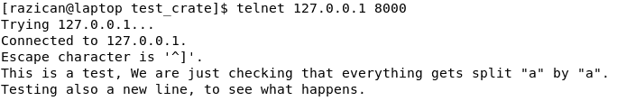
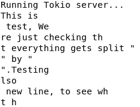
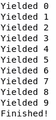
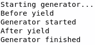

# 异步编程

到目前为止，我们在 Rust 中实现并发的方式只有创建多个线程，无论哪种方式，都是为了分担工作。然而，这些线程有时需要停下来寻找某些东西，比如文件或网络响应。在这些情况下，整个线程将会被阻塞，并需要等待响应。

这意味着，如果我们想为像 HTTP 服务器这样的东西实现低延迟，一种方法是为每个请求创建一个线程，这样每个请求都可以尽可能快地被服务，即使其他请求被阻塞。

正如我们所看到的，创建数百个线程是不可扩展的，因为每个线程都将有自己的内存，即使在阻塞的情况下也会消耗资源。在本章中，你将通过使用异步编程学习一种新的做事方式。

在本章中，你将学习以下内容：

+   使用 `mio` 的异步原语

+   使用 `futures`

+   新的 `async`/`await` 语法和生成器

+   使用 `tokio` 和 `websockets` 进行异步 I/O

# 异步编程简介

如果你想在计算中实现高性能，你需要并发运行任务。无论你是运行需要几天时间才能完成的复杂计算，比如机器学习训练，还是运行需要每秒响应数千个请求的 Web 服务器，你都需要同时做很多事情。

幸运的是，正如我们之前所看到的，我们的处理器和操作系统已经为并发做好了准备，实际上，多线程是实现并发的绝佳方式。主要问题是，正如我们在上一章中看到的，我们不应该在我们的计算机中使用比逻辑 CPU 更多的线程。

我们当然可以，但一些线程将等待其他线程执行，内核将协调每个线程在 CPU 中获得多少时间。这将消耗更多资源，并使整个过程变慢。尽管如此，有时拥有比核心数量更多的线程可能是有用的。也许其中一些每几秒钟才会醒来执行小任务，或者我们知道它们中的大多数会因为某些 I/O 操作而阻塞。

当一个线程阻塞时，执行将停止。直到它被解除阻塞，CPU 不会运行任何进一步的指令。例如，当我们读取文件时，这可能会发生。当然，这取决于我们如何读取文件。

但在后一种情况下，我们不必创建更多的线程，而可以做得更好——使用异步编程。在异步编程时，我们让代码在等待某个结果的同时继续执行。这样就可以避免阻塞线程，让你在完成相同任务的同时使用更少的线程，同时保持并发。你也可以为与 I/O 无关的任务使用异步编程，但如果它们是 CPU 密集型的（瓶颈在 CPU 上），你不会获得速度上的提升，因为 CPU 总是以最佳状态运行。要了解 Rust 中异步 I/O 是如何工作的，让我们首先深入了解 CPU 是如何处理 I/O 的。

# 理解 CPU 中的 I/O

Rust 中的`std::io`模块处理所有输入/输出操作。这些操作可能包括键盘/鼠标输入、读取文件，或者使用 TCP/IP 套接字到命令行工具（`stdio`/`stderr`）。但它是如何内部工作的呢？

我们不会深入理解 Rust 标准库是如何实现的，而是要深入到 CPU 级别来理解它是如何工作的。我们稍后会回到如何通过内核将此功能提供给 Rust。这主要基于 x86_64 平台和 Linux 内核，但其他平台处理这些事情的方式类似。

I/O 架构主要有两种类型：基于通道的 I/O 和内存映射 I/O。基于通道的 I/O 非常小众，在现代 PC 或大多数服务器上并不使用。在 x86/x86_64（大多数现代的 Intel 和 AMD CPU）这样的 CPU 架构中，使用的是内存映射 I/O。但这是什么意思呢？

如你所知，CPU 从 RAM 内存中获取所有工作所需的信息。正如我们在前面的章节中看到的，这些信息最终会被缓存到 CPU 缓存中，直到它们到达 CPU 寄存器才会被使用，但这对现在来说并不那么重要。因此，如果 CPU 想要获取有关键盘上按下的哪个键或你访问的网站正在发送的 TCP 帧的信息，它需要要么有一些额外的硬件通道到这些输入/输出接口，要么这些接口需要在 RAM 中做出一些改变。

第一种选择是基于通道的 I/O。使用基于通道的 I/O 的 CPU 有专门的通道和硬件用于 I/O 操作。这通常会使 CPU 的价格大幅增加。另一方面，在内存映射 I/O 中，使用的是第二种选择——当发生 I/O 操作时，内存会以某种方式被修改。

在这里，我们需要稍微停顿一下，更好地理解这一点。尽管我们可能认为所有的内存都在我们的 RAM 条上，但事实并非如此。内存被分为虚拟内存和物理内存。每个程序都有一个虚拟内存地址，用于每个可寻址的字节，其大小与 CPU 字的大小相同。这意味着 32 位 CPU 将为每个程序提供 2³²个虚拟内存地址，64 位 CPU 将提供 2⁶⁴个地址。这意味着 32 位计算机将有 4 GiB 的 RAM，而 64 位 CPU 将有 16 EiB 的 RAM。**EiBs**是**exbibytes**，或 1,014 **PiB**（**pebibytes**）。每个 PiB 是 1024 **GiB**（**gibibytes**）。记住，gibibytes 是**gigabytes**（**GB**）的两进制版本。所有这些对 CPU 中的每个进程都适用。

这个问题有一些问题。首先，如果我们有两个进程，我们需要双倍的内存，对吧？但是内核只能处理那么多的内存（它本身就是一个进程）。所以我们需要**转换表**（**TLBs**），告诉每个进程它们的内存在哪里。但是尽管我们可能为 32 位 CPU 配备了 4 GiB 的 RAM，我们并没有 16 EiB 的 RAM。不仅如此，32 位 CPU 在我们能够制造出 4 GiB RAM 的 PC 之前就已经存在了。一个进程如何能够访问比我们安装的内存更多的 RAM 呢？

解决方案很简单——我们将这个地址空间称为虚拟内存空间，而真正的 RAM 称为物理内存空间。如果一个进程需要的内存比可用的物理内存多，可能会发生两件事——要么我们的内核可以将一些内存地址从 RAM 移动到磁盘，并为这个进程分配更多的 RAM，要么它将收到一个内存不足的错误。第一种选择被称为页面交换，这在 Unix 系统中非常常见，有时你甚至可以决定为它提供多少磁盘空间。

将信息从 RAM 移动到磁盘会大大减慢速度，因为与 RAM 相比，磁盘本身非常慢（即使是现代的 SSD 也比 RAM 慢得多）。尽管如此，我们在这里发现，确实有一些 I/O 操作将内存信息交换到磁盘，对吧？这是如何发生的？

好吧，我们说过虚拟内存空间是针对每个进程的，我们也说过内核是另一个进程。这意味着内核也有整个内存空间可供使用。这就是内存映射 I/O 出现的地方。CPU 将决定将新的设备映射到某些地址。这意味着内核只需读取其虚拟地址空间中的某些具体位置，就能读取有关 I/O 接口的信息。

在这方面，关于如何读取这些信息有一些变体。主要有两种方式——端口映射 I/O 和直接内存访问或 DMA。端口映射 I/O 当然用于 TCP/IP、串行和其他类型的外围通信。它将分配一些特定的地址给它。这些地址将是一个缓冲区，这意味着当输入到来时，它将逐个写入下一个内存地址。一旦到达末尾，它将重新从开始，因此内核必须足够快，以便在信息被重写之前读取信息。它还可以阻塞端口，停止通信。

在 DMA 的情况下，设备的内存空间将直接映射到虚拟内存中。这使得我们可以像访问当前 PC 的虚拟地址空间的一部分那样访问该内存。所采用的方法取决于任务和我们要与之通信的设备。你现在可能想知道内核是如何为你的程序处理所有这些的。

# 控制内核的 I/O

当一个新的 TCP/IP 连接建立，或者当键盘上按下新的键时，内核必须知道这一点，以便它可以相应地采取行动。有两种方法可以做到这一点——内核可以一次又一次地查看那些端口或内存地址以寻找变化，这会使 CPU 大部分时间都在做无用功，或者内核可以通过 CPU 中断来通知。

如你所想，大多数内核决定选择第二种方案。它们是空闲的，让其他进程使用 CPU，直到某个 I/O 端口或地址发生变化。这使得 CPU 在硬件级别中断，并将控制权交给内核。内核将检查发生了什么，并相应地决定。如果有进程正在等待那个中断，它将唤醒那个进程，并让它知道有一些新信息供它处理。

然而，等待信息的进程可能已经唤醒了。这种情况发生在异步编程中。当进程仍在等待 I/O 事务时，它将继续执行一些计算。在这种情况下，进程将在内核中注册一些回调函数，以便内核知道一旦 I/O 操作准备好后应该调用什么。

这意味着在 I/O 操作执行期间，进程正在做有用的事情，而不是被阻塞并等待内核返回 I/O 操作的结果。这使得你几乎可以始终使用 CPU，而无需暂停执行，从而使你的代码性能更佳。

# 从程序员的角度看异步编程

到目前为止，我们已经从硬件和软件的角度了解了 I/O 的工作原理。我们提到，在等待 I/O 的同时，我们的进程可以继续工作，但我们应该如何实现呢？

内核有一些东西可以帮助我们完成这项工作。在 Linux 的情况下，它有`epoll()`系统调用，它让内核知道我们的代码想要从 I/O 接口接收一些信息，但不需要锁定自己直到信息可用。内核将知道当信息准备好时应该运行哪个回调，同时，我们的程序可以执行大量的计算。

这非常有用，例如，如果我们正在处理一些数据，并且我们知道将来我们需要从文件中获取一些信息。我们可以要求内核在我们继续计算的同时从文件中获取信息，一旦我们需要从文件中获取信息，我们就不需要等待文件读取操作——信息就会在那里。这大大减少了磁盘读取延迟，因为它几乎和从 RAM 中读取一样快，而不是从磁盘读取。

我们可以使用这种方法来处理 TCP/IP 连接、串行连接，以及一般需要 I/O 访问的任何东西。这个`epoll()`系统调用直接来自 Linux C API，但在 Rust 中，我们有很好的封装器，使得所有这些操作都变得容易，而且没有开销。让我们来看看它们。 

# 理解未来

如果我们在代码中使用`std::io::Read`和`std::io::Write`特性，我们将能够轻松地从 I/O 接口读取和写入数据，但每次我们这样做时，执行调用的线程都会阻塞，直到数据接收完成。幸运的是，Rust 的优秀的 crate 生态系统为我们带来了改善这种情况的绝佳机会。

在许多编程语言中，你可以找到“尚未可用数据”的概念。例如，在 JavaScript 中，它们被称为 promises，而在 Rust 中，我们称它们为 futures。Future 表示将来某个时刻将可用的任何数据，但目前可能尚未可用。你可以在任何时间检查 future 是否有值，如果有，就可以获取它。如果没有，你可以在其间执行一些计算，或者阻塞当前线程，直到值到达。

Rust 的 futures 不仅为我们提供了这个特性，而且还提供了大量的有用 API，我们可以使用它们来提高代码的可读性并减少代码量。`futures` crate 通过零成本抽象来实现这一切。这意味着它不会需要额外的分配，代码将尽可能接近你为了实现所有这些功能所能编写的最佳汇编代码。

Futures 不仅适用于 I/O，还可以与任何类型的计算或数据一起使用。在这些示例中，我们将使用 futures crate 的 0.2.x 版本。在撰写本文时，该版本仍在 alpha 开发阶段，但预计很快就会发布。让我们看看 futures 是如何工作的。我们首先需要在`Cargo.toml`文件中将`futures` crate 添加为依赖项，然后我们就可以在我们的项目的`main.rs`文件中开始编写一些代码：

```rs
extern crate futures;

use futures::prelude::*;
use futures::future::{self, FutureResult};
use futures::executor::block_on;

fn main() {
    let final_result = some_complex_computation().map(|res| (res - 10) / 7);

    println!("Doing some other things while our result gets generated");

    match block_on(final_result) {
        Ok(res) => println!("The result is {}", res),
        Err(e) => println!("Error: {}", e),
    }
}

fn some_complex_computation() -> FutureResult<u32, String> {
    use std::thread;
    use std::time::Duration;

    thread::sleep(Duration::from_secs(5));

    future::ok(150)
}
```

在这个例子中，我们有一个模拟的复杂计算，大约需要 5 秒钟。这个计算返回一个`Future`，因此我们可以使用有用的方法在结果生成后修改它。这些方法来自`FutureExt`特性。

然后，`block_on()`函数将等待直到给定的未来不再挂起。您可能会认为这和我们在使用线程时完全一样，但有趣的是，我们这里只使用了一个线程。未来将在主线程有额外时间或我们调用`block_on()`函数时被计算。

当然，对于计算密集型应用程序来说，这并没有太多意义，因为我们无论如何都不得不在主线程中进行计算，但对于 I/O 访问来说，这非常有意义。我们可以将`Future`视为`Result`的异步版本。

如您在[`docs.rs/futures/0.2.0-alpha/futures/trait.FutureExt.html`](https://docs.rs/futures/0.2.0-alpha/futures/trait.FutureExt.html)的`FutureExt`特性文档中所见，我们有许多组合器可以使用。在这种情况下，我们使用了`map()`方法，但也可以使用其他方法，例如`and_then()`、`map_err()`、`or_else()`，甚至是在未来之间的连接。所有这些方法都会依次异步运行。一旦您调用`block_on()`函数，您将得到最终未来的`Result`。

# 未来组合器

既然我们提到了连接，实际上是有可能存在两个相互依赖的未来。也许我们有两个文件的信息，我们为每个文件生成一个读取未来的操作，然后我们想要结合它们的信息。我们不需要阻塞线程来做这件事；我们可以使用`join()`方法，它背后的逻辑将确保一旦我们编写的闭包被调用，两个未来都将接收到最终值。

这在创建并发依赖图时非常有用。如果您有很多小计算想要并行化，您可以为每个部分创建一个闭包或函数，然后使用`join()`和其他方法，例如`and_then()`，来决定哪些计算需要并行运行，同时仍然接收每个步骤所需的所有数据。`join()`方法有五种变体，取决于您下一次计算需要多少个未来。

但简单的未来并不是这个 crate 给我们提供的唯一东西。我们还可以使用`Stream`特性，它的工作方式类似于`Iterator`特性，但异步。这对于逐个到来且不仅仅是单次值输入的情况非常有用。例如，这发生在 TCP、串行或任何使用字节流的连接中。

使用这个特质，尤其是使用`StreamExt`特质，我们几乎有与迭代器相同的 API，我们可以创建一个完整的迭代器，例如，可以逐字节异步地从 TCP 连接中检索 HTTP 数据。这在 Web 服务器中有许多应用，我们已经在社区中看到了迁移到异步 API 的 crate。

这个 crate 还提供了一个`Write`特质的异步版本。通过`Sink`和`SinkExt`特质，你可以向任何输出对象发送数据。这可能是一个文件、一个连接，甚至是一种流计算。`Sink`和`Stream`配合得很好，因为`SinkExt`特质中的`send_all()`方法允许你将整个`Stream`发送到`Sink`。例如，你可以异步地逐字节读取文件，对每个字节或块进行一些计算，然后只需使用这些组合器将这些结果写入另一个文件。

让我们看看一个例子。我们将使用`futures-timer` crate，不幸的是它目前还不适用于 futures 0.2.0。所以，让我们用以下`[dependencies]`部分更新我们的`Cargo.toml`文件：

```rs
[dependencies]
futures = "0.1"
futures-timer = "0.1"
```

然后，让我们在我们的`main.rs`文件中编写以下代码：

```rs
extern crate futures;
extern crate futures_timer;

use std::time::Duration;

use futures::prelude::*;
use futures_timer::Interval;
use futures::future::ok;

fn main() {
    Interval::new(Duration::from_secs(1))
        .take(5)
        .for_each(|_| {
            println!("New interval");
            ok(())
        })
        .wait()
        .unwrap();
}
```

如果你为这个示例执行 cargo run，它将生成五条新的`New interval`文本行，每秒一条。Interval 每次配置的间隔超时时都会返回一个`()`。然后我们只取前五个，并在`for_each`循环中运行闭包。正如你所看到的，`Stream`和`StreamExt`特质几乎与`Iterator`特质以相同的方式工作。

# Rust 中的异步 I/O

当涉及到 I/O 操作时，有一个首选的 crate。它被称为`tokio`，它可以无缝地处理异步输入和输出操作。这个 crate 基于 MIO。MIO，即 Metal IO，是一个基础 crate，它提供了一个非常底层的异步编程接口。它生成一个事件队列，你可以使用循环逐个收集所有事件，异步地。

如我们之前所见，这些事件可以是任何东西，从*接收到的 TCP 消息*到*你请求的文件部分准备好*。MIO 中有创建小型 TCP 服务器的教程，例如，但 MIO 的理念不是直接使用 crate，而是使用一个外观。最知名且最有用的外观是`tokio` crate。这个 crate 本身只提供了一些小的原语，但它打开了通往许多异步接口的大门。例如，你有`tokio-serial`、`tokio-jsonrpc`、`tokio-http2`、`tokio-imap`以及许多许多更多。

不仅如此，你还有像 `tokio-retry` 这样的实用工具，如果发生错误，它会自动重试 I/O 操作。Tokio 非常容易使用，它具有极低的内存占用，并且通过其异步操作，你可以创建出极快的服务。正如你可能已经注意到的，它主要围绕通信展开。这是由于它为这些情况提供了所有这些辅助功能和能力。核心包也具有文件读取功能，因此对于任何 I/O 密集型操作，你应该已经有所覆盖，正如我们将看到的。

我们首先将看到如何使用 Tokio 开发一个小型的 TCP 回显服务器。你可以在 Tokio 网站上找到类似的教程（[`tokio.rs/`](https://tokio.rs/)），并且值得跟随所有的教程。因此，让我们首先将 `tokio` 添加为 `Cargo.toml` 文件中的依赖项。然后，我们将使用 `tokio` 包中的 `TcpListener` 来创建一个小型服务器。这个结构将 TCP 套接字监听器绑定到指定的地址，并且它将为每个传入的连接异步执行一个给定的函数。在这个函数中，我们将异步读取套接字中可能存在的任何数据并将其返回，执行一个 `echo`。让我们看看它是什么样子：

```rs
extern crate tokio;

use tokio::prelude::*;
use tokio::net::TcpListener;
use tokio::io;

fn main() {
    let address = "127.0.0.1:8000".parse().unwrap();
    let listener = TcpListener::bind(&address).unwrap();

    let server = listener
        .incoming()
        .map_err(|e| eprintln!("Error accepting connection: {:?}", e))
        .for_each(|socket| {
            let (reader, writer) = socket.split();
            let copied = io::copy(reader, writer);

            let handler = copied
                .map(|(count, _reader, _writer)| println!("{} bytes 
                  received", count))
                .map_err(|e| eprintln!("Error: {:?}", e));

            tokio::spawn(handler)
        });

    tokio::run(server);
}
```

让我们分析一下代码。监听器使用 `incoming()` 方法创建一个异步的传入连接流。对于每一个，我们检查它是否是一个错误，并相应地打印一条消息，然后，对于正确的连接，我们通过使用 `split()` 方法获取套接字，并获取一个写入器和读取器。然后，Tokio 给我们一个由 `tokio::io::copy()` 函数创建的 `Copy` 未来。这个未来表示异步地从读取器复制到写入器的数据。

我们可以使用 `AsyncRead` 和 `AsyncWrite` 特性自己编写这个未来，但看到 Tokio 已经有了这个示例未来是非常好的。由于我们想要的行为是返回连接发送的任何内容，这将完美地工作。然后，我们添加了一些额外的代码，这些代码将在读取器返回 **End of File** 或 **EOF**（当连接关闭时）后执行。它将打印复制的字节数，并处理可能出现的任何潜在错误。

然后，为了使未来能够执行其任务，需要有一些东西来执行它。这就是 Tokio 执行器的用武之地——我们调用 `tokio::spawn()`，它将在默认执行器中执行未来。我们刚刚创建了一个在连接到来时要做的事情的流，但现在我们需要实际运行代码。为此，Tokio 有 `tokio::run()` 函数，它启动整个 Tokio 运行时进程并开始接受连接。

我们创建的主要未来，即传入连接的流，将在那个点执行并将阻塞主线程。由于服务器始终在等待新的连接，它将无限期地阻塞。尽管如此，这并不意味着未来的执行是同步的。线程将空闲下来而不消耗 CPU，当连接到来时，线程将被唤醒并执行未来。在未来的本身，在发送接收到的数据回传时，如果没有更多数据，它将不会阻塞执行。这使在一个线程中运行多个连接成为可能。在生产环境中，你可能希望在多个线程中拥有类似的行为，这样每个线程就可以处理多个连接。

现在是时候测试它了。你可以通过运行 `cargo run` 来启动服务器，并且可以使用如 Telnet 这样的 TCP 工具来连接它。在 Telnet 的情况下，它会逐行缓冲发送的数据，因此你需要发送一整行才能接收到回显。Tokio 在另一个领域特别有用——解析帧。如果你想创建自己的通信协议，例如，你可能希望将那些 TCP 字节分成帧，然后将它们转换为你的数据类型。

# 创建 Tokio 编解码器

在 Tokio 中，我们有编解码器的概念。编解码器是一种类型，它将字节数组分割成帧。每个帧将包含从字节数据流中解析出的某些信息。在我们的例子中，我们将读取 TCP 连接的输入，并在找到字母 `a` 时将其分割成块。一个生产就绪的编解码器可能更复杂，但这个例子将为我们提供一个足够好的基础来实现自己的编解码器。我们需要实现 `tokio-io` crate 中的两个特性，因此我们需要将其添加到 `Cargo.toml` 文件的 `[dependencies]` 部分并使用 `extern crate tokio_io;` 来导入它。我们还需要对 `bytes` crate 做同样的事情。现在，让我们开始编写代码：

```rs
extern crate bytes;
extern crate tokio;
extern crate tokio_io;

use std::io;

use tokio_io::codec::{Decoder, Encoder};
use bytes::BytesMut;

#[derive(Debug, Default)]
struct ADividerCodec {
    next_index: usize,
}

impl Decoder for ADividerCodec {
    type Item = String;
    type Error = io::Error;

    fn decode(&mut self, buf: &mut BytesMut)
    -> Result<Option<Self::Item>, Self::Error> {
        if let Some(new_offset) = 
          buf[self.next_index..].iter().position(|b| *b == b'a') {
            let new_index = new_offset + self.next_index;
            let res = buf.split_to(new_index + 1);
            let res = &res[..res.len() - 1];
            let res: Vec<_> = res.into_iter()
                .cloned()
                .filter(|b| *b != b'\r' && *b != b'\n')
                .collect();
            let res = String::from_utf8(res).map_err(|_| {
                io::Error::new(
                    io::ErrorKind::InvalidData,
                    "Unable to decode input as UTF8"
                )
            })?;
            self.next_index = 0;
            Ok(Some(res))
        } else {
            self.next_index = buf.len();
            Ok(None)
        }
    }

    fn decode_eof(&mut self, buf: &mut BytesMut)
    -> Result<Option<String>, io::Error> {
        Ok(match self.decode(buf)? {
            Some(frame) => Some(frame),
            None => {
                // No terminating 'a' - return remaining data, if any
                if buf.is_empty() {
                    None
                } else {
                    let res = buf.take();
                    let res: Vec<_> = res.into_iter()
                        .filter(|b| *b != b'\r' && *b != b'\n')
                        .collect();
                    let res = String::from_utf8(res).map_err(|_| {
                        io::Error::new(
                            io::ErrorKind::InvalidData,
                            "Unable to decode input as UTF8"
                        )
                    })?;
                    self.next_index = 0;
                    Some(res)
                }
            }
        })
    }
}
```

这段代码有很多；让我们仔细分析一下。我们创建了一个结构，命名为 `ADividerCodec`，并为它实现了 `Decode` 特性。这段代码有两个方法。第一个也是最重要的方法是 `decode()` 方法。它接收一个包含来自连接的数据的缓冲区，并需要返回一些数据或没有数据。在这种情况下，它将尝试找到小写字母 `a` 的位置。如果找到了，它将返回读取到的所有字节。它还删除了换行符，以便打印更加清晰。

它创建了一个包含这些字节的字符串，所以如果我们发送非 UTF-8 字节，它将失败。一旦我们从缓冲区的开头取出字节，下一个索引应该指向缓冲区中的第一个元素。如果没有`a`在缓冲区中，它将只更新索引到最后读取的元素，并返回`None`，因为没有准备好完整的帧。当连接关闭时，`decode_eof()`方法将执行类似操作。我们使用字符串作为编解码器的输出，但你也可以使用任何结构或枚举来表示你的数据或命令，例如。

我们还需要实现`Encode`特质，这样我们就可以使用 Tokio 的`framed()`方法。这仅仅表示如果我们想再次使用字节，数据将如何编码在一个新的字节数组中。我们只需获取字符串的字节并将一个`a`附加到它。不过，我们会丢失换行信息。让我们看看它是什么样子：

```rs
impl Encoder for ADividerCodec {
    type Item = String;
    type Error = io::Error;

    fn encode(&mut self, chunk: Self::Item, buf: &mut BytesMut)
    -> Result<(), io::Error> {
        use bytes::BufMut;

        buf.reserve(chunk.len() + 1);
        buf.put(chunk);
        buf.put_u8(b'a');
        Ok(())
    }
}
```

为了了解它是如何工作的，让我们实现一个简单的`main()`函数，并使用 Telnet 发送包含`a`字母的文本：

```rs
use tokio::prelude::*;
use tokio::net::TcpListener;

fn main() {
    let address = "127.0.0.1:8000".parse().unwrap();
    let listener = TcpListener::bind(&address).unwrap();

    let server = listener
        .incoming()
        .map_err(|e| eprintln!("Error accepting connection: {:?}", e))
        .for_each(|socket| {
            tokio::spawn(
                socket
                    .framed(ADividerCodec::default())
                    .for_each(|chunk| {
                        println!("{}", chunk);
                        Ok(())
                    })
                    .map_err(|e| eprintln!("Error: {:?}", e)),
            )
        });

    println!("Running Tokio server...");
    tokio::run(server);
}
```

我们可以发送这样的文本，例如：



服务器中的输出将类似于这个：



注意，我没有关闭连接，所以最后一句话的最后部分仍然在缓冲区中。

# Rust 中的 WebSocket

如果你从事 Web 开发，你知道 WebSocket 是加速与客户端通信的最有用的协议之一。使用它们允许你的服务器在客户端请求之前向客户端发送信息，从而避免一个额外的请求。Rust 有一个非常好的 crate，允许实现 WebSocket，名为`websocket`。

我们将分析一个小的、异步的 WebSocket 回声服务器示例，以了解它是如何工作的。我们需要将`websocket`、`futures`和`tokio-core`添加到我们的`Cargo.toml`文件的`[dependencies]`部分。以下示例是从`websocket` crate 中的异步服务器示例检索并改编的。它使用 Tokio 反应器核心，这意味着它需要一个核心对象及其句柄。WebSocket 需要这种行为，因为它不是一个简单的 I/O 操作，这意味着它需要一些包装器，例如连接升级到 WebSocket。让我们看看它是如何工作的：

```rs
extern crate futures;
extern crate tokio_core;
extern crate websocket;

use websocket::message::OwnedMessage;
use websocket::server::InvalidConnection;
use websocket::async::Server;

use tokio_core::reactor::Core;
use futures::{Future, Sink, Stream};

fn main() {
    let mut core = Core::new().unwrap();
    let handle = core.handle();
    let server = Server::bind("127.0.0.1:2794", &handle).unwrap();

    let task = server
        .incoming()
        .map_err(|InvalidConnection { error, .. }| error)
        .for_each(|(upgrade, addr)| {
            println!("Got a connection from: {}", addr);

            if !upgrade.protocols().iter().any(|s| s == "rust-websocket") {
                handle.spawn(
                    upgrade
                        .reject()
                        .map_err(|e| println!("Error: '{:?}'", e))
                        .map(|_| {}),
                );
                return Ok(());
            }

            let fut = upgrade
                .use_protocol("rust-websocket")
                .accept()
                .and_then(|(client, _)| {
                    let (sink, stream) = client.split();

                    stream
                        .take_while(|m| Ok(!m.is_close()))
                        .filter_map(|m| match m {
                            OwnedMessage::Ping(p) => {
                                Some(OwnedMessage::Pong(p))
                            }
                            OwnedMessage::Pong(_) => None,
                            _ => Some(m),
                        })
                        .forward(sink)
                        .and_then(|(_, sink)| {
                            sink.send(OwnedMessage::Close(None))
                        })
                });

            handle.spawn(
                fut.map_err(|e| {
                    println!("Error: {:?}", e)
                }).map(|_| {}));
            Ok(())
        });

    core.run(task).unwrap();
}
```

如你所见，大部分代码与之前示例中使用的代码非常相似。我们首先看到的变化是，对于每个连接，在实际上接受连接之前，它会检查套接字是否可以升级到`rust-websocket`协议。然后，它将连接协议升级到该协议并接受连接。对于每个连接，它将接收客户端句柄和一些头信息。当然，所有这些操作都是异步完成的。

我们丢弃了头部信息，并将客户端分为一个 sink 和一个 stream。在`futures`术语中，sink 是同步写者的异步等价物。它从流中开始读取字节直到关闭，并且对每个字节，它都会回复相同的信息。然后它会调用`forward()`方法，该方法消耗流中的所有消息，然后发送一个连接关闭消息。我们刚刚创建的 future 将使用我们从核心中获取的处理程序来启动。这意味着对于每个连接，这个整个 future 都将被执行。然后 Tokio 核心运行整个服务器任务。

如果你从 crate 的 Git 仓库中获取示例客户端实现（[`github.com/cyderize/rust-websocket/blob/master/examples/async-client.rs`](https://github.com/cyderize/rust-websocket/blob/master/examples/async-client.rs)），你将能够看到服务器如何回应客户端发送的内容。一旦你理解了这段代码，你将能够创建任何你需要的 WebSocket 服务器。

# 理解新的生成器

2018 年，Rust 将迎来一个新特性——异步生成器。生成器是可以在返回函数之前产生元素并在稍后继续执行的功能。这对于我们在本章中看到的循环来说非常棒。有了生成器，我们可以直接用新的`async`/`await`语法替换许多回调。

这仍然是一个不稳定的功能，只能在 nightly 中使用，所以你写的代码在稳定之前可能会变得过时。让我们看看一个简单的生成器示例：

```rs
#![feature(generators, generator_trait)]

use std::ops::{Generator, GeneratorState};

fn main() {
    let mut generator = || {
        for i in 0..10 {
            yield i;
        }
        return "Finished!";
    };

    loop {
        match generator.resume() {
            GeneratorState::Yielded(num) => println!("Yielded {}", num),
            GeneratorState::Complete(text) => {
                println!("{}", text);
                break;
            }
        }
    }
}
```

你需要执行`rustup override add nightly`来运行示例。如果你运行它，你将看到以下输出：



这里有趣的是，生成器函数可以执行任何计算，一旦部分结果被产生，你就可以恢复计算，而不需要缓冲区。你可以通过以下方式来测试这一点——不是从生成器中产生任何东西，而是用它来在控制台打印。让我们看一个例子：

```rs
#![feature(generators, generator_trait)]

use std::ops::Generator;

fn main() {
    let mut generator = || {
        println!("Before yield");
        yield;
        println!("After yield");
    };

    println!("Starting generator...");
    generator.resume();
    println!("Generator started");
    generator.resume();
    println!("Generator finished");
}
```

如果你运行这个示例，你将看到以下输出：



如你所见，当函数执行到`yield`语句时，它会暂停其执行。如果在`yield`语句中有任何数据，调用者将能够检索它。一旦生成器被恢复，函数的其余部分将继续执行，直到遇到`yield`或`return`语句。

当然，这对我们之前看到的`futures`非常有优势。这就是为什么创建了`futures-await`crate。这个 crate 使用生成器使异步`futures`的实现变得容易得多。让我们用这个 crate 重写我们之前创建的 TCP 回显服务器。我们需要将`futures-await`的`0.2.0`版本添加到我们的`Cargo.toml`文件的`[dependencies]`部分，然后开始使用一些 nightly 特性。让我们看看一些示例代码：

```rs
#![feature(proc_macro, conservative_impl_trait, generators)]

extern crate futures_await as futures;

use futures::prelude::*;
use futures::executor::block_on;

#[async]
fn retrieve_data_1() -> Result<i32, i32> {
    Ok(1)
}

#[async]
fn retrieve_data_2() -> Result<i32, i32> {
    Ok(2)
}

#[async_move]
fn add_data() -> Result<i32, i32> {
    Ok(await!(retrieve_data_1())? + await!(retrieve_data_2())?)
}

fn main() {
    println!("Result: {:?}", block_on(add_data()));
}
```

这个例子将包含两个异步函数，例如，它们可以从网络上检索信息。它们由`add_data()`函数调用，该函数将在将它们相加并返回结果之前等待它们返回。如果你运行它，你会看到结果是`Ok(3)`。导入`futures_await` crate 作为`futures`的行是有意义的，因为`futures-await` crate 只是 futures crate 的一个小包装，所有常用的结构、函数和特性都是可用的。

整个生成器和`async`/`await`语法仍在积极开发中，但 Rust 2018 路线图表示它应该在年底前稳定下来。

# 摘要

在这本书的最后一章中，你学习了如何使用异步编程来避免创建过多的线程。现在你可以使用恰好数量的线程，同时在网络应用程序中并行且高效地运行工作负载。为了能够做到这一点，你首先学习了关于 futures crate 的知识，它为我们提供了在 Rust 中进行异步编程时所需的最基本原语。然后，你了解了基于 MIO 的 Tokio 是如何工作的，并创建了你的第一个服务器。

在了解外部 crate 之前，你学习了 WebSockets 并掌握了 Tokio 核心反应器语法。最后，你学习了新的生成器语法以及`futures` crate 是如何适应这种新语法的。确保关注关于这个伟大的编译器特性何时稳定的最新消息。

现在书已经结束，我们可以看到在 Rust 中可以通过多种互补的方式来实现高性能。我们可以首先从改善我们在第一章中看到的顺序代码开始。这些改进来自各种技术，从适当的编译器配置开始，到代码中的小技巧和窍门结束。正如我们所见，一些工具将帮助我们完成这项工作。

然后，我们可以使用元编程来提高代码的可维护性和性能，通过减少软件在运行时必须执行的工作量。我们看到今年有新的元编程方式进入 Rust。

最后，使事物更快的一步是并发运行任务，正如我们在最后两章中看到的。根据我们项目的需求，我们将使用多线程或/和异步编程。

现在，你应该能够提高你的 Rust 应用程序的性能，甚至开始学习高性能编程的更深入概念。我很高兴能引导你通过 Rust 编程语言中的这些主题，希望你喜欢阅读。
