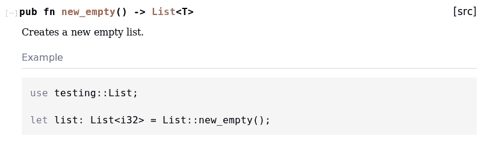

# 第一章：Rust 入门

在过去一年中，Rust 的生态系统有了显著的增长，特别是 2018 版本，它推动了稳定性的重大推进。工具正在发展，重要的库正在成熟到许多大型公司将其用于生产的程度。

Rust 的一个特点是学习曲线陡峭——这主要归因于对内存分配方式的根本性改变。对于其他语言（如 C#）中的经验丰富的程序员来说，对 Rust 中的做法感到不知所措并不罕见。在本章中，我们将尝试克服这一点，降低入门门槛！

在本章中，我们将介绍以下内容：

+   准备一切就绪

+   与命令行 I/O 一起工作

+   创建和使用数据类型

+   控制执行流程

+   使用 crates 和模块拆分你的代码

+   编写测试和基准测试

+   记录你的代码

+   测试你的文档

+   在不同类型之间共享代码

+   Rust 中的序列类型

+   调试 Rust

# 设置你的环境

由于编程语言附带各种工具链、工具、链接器和编译器版本，因此选择最适合的变体并不容易。此外，Rust 适用于所有主要操作系统——这又增加了一个变量。

然而，当使用 `rustup` ([`rustup.rs/`](https://rustup.rs/)) 时，安装 Rust 已经变成了一件 trivial 的事情。在网站上，可以下载一个有用的脚本（或 Windows 上的安装程序），它会负责检索和安装所需的组件。同样的工具还允许你在这些组件之间切换、更新（以及卸载）它们。这是推荐的方式。

选择使用 **Microsoft Visual Studio Compiler**（**MSVC**）与 Rust 一起使用时，需要安装额外的软件，例如 Visual C++ 运行时和编译器工具。

要编写代码，还需要一个编辑器。由于 Visual Studio Code 拥有一些 Rust 功能，因此与 Rust 扩展一起使用是一个很好的选择。它是由微软开发的开源编辑器，在全球和 Rust 社区中广受欢迎。在本食谱中，我们将安装以下组件：

+   Visual Studio Code ([`code.visualstudio.com/`](https://code.visualstudio.com/))

+   `rustup` ([`rustup.rs`](https://rustup.rs))

+   `rustc`（以及编译器工具链的其他部分）

+   `cargo`

+   **RLS**（代表 **Rust Language Server**——这是用于自动完成的）

+   Visual Studio Code 对 Rust 语言的支持

# 准备工作

在运行 macOS、Linux 或 Windows 的计算机上，只需要一个网络浏览器和互联网连接。请注意，Windows 的安装方式与使用脚本的 ***nix 系统（Linux 和 macOS）略有不同。

# 如何操作...

每个部分都需要我们导航到它们各自的网站，下载安装程序，并遵循它们的说明：

1.  打开浏览器并导航到[`rustup.rs`](https://rustup.rs)和[`code.visualstudio.com/`](https://code.visualstudio.com/)。

1.  选择适合您操作系统的安装程序。

1.  下载后，运行安装程序并按照它们的说明进行操作，选择`stable`分支。

1.  一旦成功安装，我们将更深入地探讨每个安装过程。

现在，让我们深入了解安装过程。

# 使用 rustup.rs 管理 Rust 安装

要测试使用`rustup`安装 Rust 工具链是否成功，可以在终端（或在 Windows 上的 PowerShell）中运行`rustc`命令：

```rs
$ rustc --version
rustc 1.33.0 (2aa4c46cf 2019-02-28)
```

注意，当您运行此命令时，您将有一个较新的版本。如果您坚持使用 2018 版代码，这无关紧要。

Rust 需要在您的系统上安装本机链接器。在 Linux 或 Unix 系统（如 macOS）上，Rust 调用`cc`进行链接，而在 Windows 上，首选的链接器是 Microsoft Visual Studio 的链接器，这取决于是否已安装 Microsoft Visual C++构建工具。虽然 Windows 上也可以使用开源工具链，但这种练习留给更高级的用户。

即使是 2018 版，一些有用的功能仍然只在`nightly`版本中可用。要安装`rustc`的 nightly 版本，请执行以下步骤：

1.  在终端或 PowerShell 窗口中运行`rustup install nightly`（如果您不使用 GNU 工具链，则在 Windows 上使用`nightly-msvc`）。

1.  命令完成后，默认工具链（在`cargo`中使用）可以使用`rustup default nightly`进行切换。

# 安装 Visual Studio Code 和扩展

在其原始版本中，Visual Studio Code 为许多语言提供了语法高亮。然而，为了自动完成或/和检查语法，需要一个扩展。Rust 项目提供了这个扩展：

1.  打开 Visual Studio Code。

1.  使用*Ctrl* + *P* (*cmd* + *P*在 macOS 上)打开命令行界面，然后输入`ext install rust-lang.rust`来安装扩展。过程应如下所示：


该扩展使用 RLS 进行静态代码分析并提供自动完成和语法检查。扩展*应该*自动安装 RLS 组件，但有时它将无法完成此操作。一种解决方案是将以下配置添加到 Visual Studio Code 的`settings.json`文件中（使用*Ctrl* *+* *P*/*cmd* *+* *P*来查找它）：

```rs
{
    "rust-client.channel":"stable"
}
```

或者，`rustup`也会通过`rustup component add rls`命令安装 RLS。

# 故障排除

有时，更新工具会导致错误，例如文件丢失或无法覆盖。这可能是由多种原因造成的，但完全重置安装可以帮助解决问题。在 Linux 或 macOS 系统上，以下命令负责删除`rustup`安装的所有内容：

```rs
$ rm -Rf ~/.rustup
```

Windows 的 PowerShell 现在支持许多类似 Linux 的命令：

```rs
PS> rm ~/.rustup
```

这会导致相同的结果。在删除当前安装后，从头开始安装`rustup`——这应该会安装最新版本。

现在，让我们深入了解代码背后的原理。

# 它是如何工作的...

脚本`rustup.sh`是安装 Rust 的好方法，也是今天安装 Rust 和其他组件的主要方式。实际上，在 CI 系统中通常也会使用这个脚本安装编译器和其它工具。

`rustup`是一个由 Rust 项目维护的开源项目，可以在 GitHub 上找到：[`github.com/rust-lang/rustup.rs`](https://github.com/rust-lang/rustup.rs)。

我们已经成功学习了如何设置我们的环境。现在让我们继续到下一个菜谱。

# 使用命令行 I/O

在命令行上与用户通信的传统方式是使用标准流。Rust 包含了一些有用的宏来处理这些简单情况。在这个菜谱中，我们将探索经典`Hello World`程序的基本工作原理。

# 如何做到这一点...

只需五步，我们将探索命令行 I/O 和格式化：

1.  打开一个终端窗口（Windows 上的 PowerShell）并运行`cargo new hello-world`命令，它将在`hello-world`文件夹中创建一个新的 Rust 项目。

1.  一旦创建，使用`cd hello-world`切换到目录，并用 Visual Studio Code 打开`src/main.rs`。`cargo`默认生成的代码如下：

```rs
fn main() {
    println!("Hello, world!");
}
```

1.  让我们扩展它！这些是前面传统`print`语句的变体，展示了格式化选项、参数和写入流等。让我们从一些常见的打印（和导入）开始：

```rs
use std::io::{self, Write};
use std::f64;

fn main() {
    println!("Let's print some lines:");
    println!();
    println!("Hello, world!");
    println!("{}, {}!", "Hello", "world");
    print!("Hello, ");
    println!("world!");
```

然而，我们可以做更多复杂的参数组合：

```rs
    println!("Arguments can be referred to by their position: {0}, 
    {1}! and {1}, {0}! are built from the same arguments", "Hello", 
    "world");

    println!("Furthermore the arguments can be named: \"{greeting}, 
    {object}!\"", greeting = "Hello", object = "World");

    println!("Number formatting: Pi is {0:.3} or {0:.0} for short", 
    f64::consts::PI);

    println!("... and there is more: {0:>0width$}={0:>width$}=
    {0:#x}", 1535, width = 5);

    let _ = write!(&mut io::stdout(), "Underneath, it's all writing 
    to a stream...");
    println!();

    println!("Write something!");
    let mut input = String::new();
    if let Ok(n) = io::stdin().read_line(&mut input) {
        println!("You wrote: {} ({} bytes) ", input, n);
    }
    else {
        eprintln!("There was an error :(");
    }
}
```

这应该提供了几种读取和写入控制台的不同变体。

1.  回到终端并导航到`Cargo.toml`所在的目录。

1.  使用`cargo run`来查看代码片段的输出：

```rs
$ cargo run
   Compiling hello-world v0.1.0 (/tmp/hello-world)
    Finished dev [unoptimized + debuginfo] target(s) in 0.37s
     Running 'target/debug/hello-world'
Let's print some lines:

Hello, world!
Hello, world!
Hello, world!
Arguments can be referred to by their position: Hello, world! and world, Hello! are built from the same arguments
Furthermore the arguments can be named: "Hello, World!"
Number formatting: Pi is 3.142 or 3 for short
... and there is more: 01535= 1535=0x5ff
Underneath, it's all writing to a stream...
Write something!
Hello, world!
You wrote: Hello, world!
 (14 bytes) 
```

输出中的每一行都代表了一种将文本打印到控制台的方法！我们建议尝试不同的变体，看看它是如何改变结果的。顺便说一下，`rustc`会在任何`println!()`或`format!()`调用中检查正确的参数数量。

现在，让我们深入了解代码背后的原理。

# 它是如何工作的...

让我们分析代码以了解执行流程。

`cargo`在本书的第二章，*使用 Cargo 管理项目*中进行了深入描述。

初始片段是在*步骤 1*中执行`cargo new hello-world`时生成的。作为一个二进制类型的项目，需要一个`main`函数，`rustc`将会寻找它。在调用`cargo run`时，`cargo`会协调编译（使用`rustc`）和链接（在 Windows 上是`msvc`，在*nix*上是`cc`），并通过其入口点：`main`函数运行生成的二进制文件（*步骤 5*）。

在我们创建的*步骤 3*中的函数中，我们编写了一系列`print!`/`println!`/`eprintln!`语句，这些是 Rust 宏。这些宏简化了写入命令行应用程序的标准输出或标准错误通道的编写，并包括额外的参数。实际上，如果缺少参数，编译器将不会编译程序。

Rust 的宏直接作用于语言的语法树，提供类型安全和检查参数和参数的能力。因此，它们可以被视为具有一些特殊能力的函数调用——更多关于这一点将在第六章中介绍，*使用宏表达自己*。

各种参数和模板字符串通过格式化器组合，这是一种强大的方法，可以在不需要连接或类似解决方案的情况下将实际变量添加到输出中。这将减少分配的数量，显著提高性能和内存效率。格式化数据类型的方法有很多；要深入了解，请查看 Rust 的优秀文档([`doc.rust-lang.org/std/fmt/`](https://doc.rust-lang.org/std/fmt/))。

最后一步展示了各种组合产生的输出。

我们已经成功学习了如何使用命令行 I/O。现在，让我们继续到下一个菜谱。

# 创建和使用数据类型

Rust 具有所有基本类型：64 位宽度的有符号和无符号整数；64 位浮点类型；字符类型；以及布尔类型。当然，任何程序都需要更复杂的数据结构以保持可读性。

如果您对 Rust 中的单元测试（或一般而言）不熟悉，我们建议您首先阅读本章中的*编写测试和基准*菜谱。

在这个菜谱中，我们将探讨创建和使用数据类型的一些良好基本实践。

# 如何做到这一点...

让我们用 Rust 的单元测试作为一些数据类型实验的游乐场：

1.  使用`cargo new data-types -- lib`创建一个新的项目，并使用编辑器打开`projects`目录。

1.  在您最喜欢的文本编辑器（Visual Studio Code）中打开`src/lib.rs`。

1.  在那里，您将找到一个运行测试的小片段：

```rs
#[cfg(test)]
mod tests {
    #[test]
    fn it_works() {
        assert_eq!(2 + 2, 4);
    }
}
```

1.  让我们替换默认测试，以玩转各种标准数据类型。这个测试使用了几种处理数据类型及其数学函数的方法，以及可变性和溢出：

```rs
    #[test]
    fn basic_math_stuff() {
        assert_eq!(2 + 2, 4);

        assert_eq!(3.14 + 22.86, 26_f32);

        assert_eq!(2_i32.pow(2), 4);
        assert_eq!(4_f32.sqrt(), 2_f32);

        let a: u64 = 32;
        let b: u64 = 64;

        // Risky, this could overflow
        assert_eq!(b - a, 32);
        assert_eq!(a.overflowing_sub(b), (18446744073709551584, 
        true));
        let mut c = 100;
        c += 1;
        assert_eq!(c, 101);
    }
```

1.  在覆盖了基本的数值类型之后，让我们检查一个主要限制：溢出！当发生溢出时，Rust 会恐慌，因此我们将期望使用`#[should_panic]`属性（如果它没有恐慌，测试实际上会失败）：

```rs
    #[test]
    #[should_panic]
    fn attempt_overflows() {
        let a = 10_u32;
        let b = 11_u32;

        // This will panic since the result is going to be an 
        // unsigned type which cannot handle negative numbers
        // Note: _ means ignore the result
        let _ = a - b; 
    }
```

1.  接下来，让我们创建一个自定义类型。Rust 的类型是`struct`，它们在内存中不增加开销。该类型具有一个`new()`（按惯例的构造函数）和一个`sum()`函数，我们将在测试函数中调用这两个函数：

```rs

// Rust allows another macro type: derive. It allows to "auto-implement"
// supported traits. Clone, Debug, Copy are typically handy to derive.
#[derive(Clone, Debug, Copy)]
struct MyCustomStruct {
    a: i32,
    b: u32,
    pub c: f32
}

// A typical Rust struct has an impl block for behavior
impl MyCustomStruct {

    // The new function is static function, and by convention a 
    // constructor
    pub fn new(a: i32, b: u32, c: f32) -> MyCustomStruct {
        MyCustomStruct {
            a: a, b: b, c: c
        }
    }

    // Instance functions feature a "self" reference as the first 
    // parameter
    // This self reference can be mutable or owned, just like other 
    // variables
    pub fn sum(&self) -> f32 {
        self.a as f32 + self.b as f32 + self.c
    }
}
```

1.  为了看到新的`struct`函数的实际应用，让我们添加一个测试来对类型进行一些操作并克隆内存技巧（注意：请注意断言）：

```rs
    use super::MyCustomStruct;

    #[test]
    fn test_custom_struct() {
        assert_eq!(mem::size_of::<MyCustomStruct>(), 
            mem::size_of::<i32>() + mem::size_of::<u32>() + 
            mem::size_of::<f32>());

        let m = MyCustomStruct::new(1, 2, 3_f32);
        assert_eq!(m.a, 1);
        assert_eq!(m.b, 2);
        assert_eq!(m.c, 3_f32);

        assert_eq!(m.sum(), 6_f32);
        let m2 = m.clone();
        assert_eq!(format!("{:?}", m2), "MyCustomStruct { a: 1, b: 
         2, 
        c: 3.0 }");

        let mut m3 = m;        
        m3.a = 100;

        assert_eq!(m2.a, 1);
        assert_eq!(m.a, 1);
        assert_eq!(m3.a, 100);
    }
```

1.  最后，让我们看看所有这些是否都有效。在`data-types`目录中运行`cargo test`，你应该会看到以下输出：

```rs
$ cargo test
Compiling data-types v0.1.0 (Rust-Cookbook/Chapter01/data-types)
warning: method is never used: `new`
  --> src/lib.rs:13:5
   |
13 | pub fn new(a: i32, b: u32, c: f32) -> MyCustomStruct {
   | ^^^^^^^^^^^^^^^^^^^^^^^^^^^^^^^^^^^^^^^^^^^^^^^^^^^^
   |
   = note: #[warn(dead_code)] on by default

warning: method is never used: `sum`
  --> src/lib.rs:19:5
   |
19 | pub fn sum(&self) -> f32 {
   | ^^^^^^^^^^^^^^^^^^^^^^^^

    Finished dev [unoptimized + debuginfo] target(s) in 0.50s
     Running target/debug/deps/data_types-33e3290928407ff5

running 3 tests
test tests::basic_math_stuff ... ok
test tests::attempt_overflows ... ok
test tests::test_custom_struct ... ok

test result: ok. 3 passed; 0 failed; 0 ignored; 0 measured; 0 filtered out

   Doc-tests data-types

running 0 tests

test result: ok. 0 passed; 0 failed; 0 ignored; 0 measured; 0 filtered out

```

现在，让我们幕后了解代码，以便更好地理解它。

# 它是如何工作的...

这个菜谱涉及了几个概念，所以让我们在这里逐一解释。在*步骤 1*到*步骤 3*中，我们设置了一个库来处理单元测试作为我们的实验场，然后创建第一个测试来处理一些内置数据类型，以便在*步骤 4*和*步骤 5*中了解基础知识。由于 Rust 对类型转换特别挑剔，测试对不同类型的输出和输入应用了一些数学函数。

对于经验丰富的程序员来说，这里没有什么新东西，除了有一个`overflow_sub()`类型操作允许溢出操作之外。除此之外，由于（故意的）缺乏隐式转换，Rust 可能有点冗长。在*步骤 5*中，我们故意引发溢出，这会导致运行时恐慌（这是我们想要的测试结果）。

如*步骤 5*所示，Rust 提供`struct`作为复杂类型的基础，它可以附加实现块以及派生（`#[derive(Clone, Copy, Debug)]`）实现（如`Debug`和`Copy`特性）。在*步骤 6*中，我们将探讨使用该类型及其含义：

+   自定义类型没有开销：`struct`的大小正好等于其属性总和

+   一些操作隐式调用特性实现——例如赋值运算符或`Copy`特性（本质上是一种浅拷贝）

+   改变属性值需要整个`struct`函数的可变性

由于默认的分配策略是尽可能使用栈（或者如果没有提到其他东西），因此这种工作方式有几个方面。因此，数据的浅拷贝执行的是实际数据的拷贝，而不是对其的引用，这与堆分配发生的情况不同。在这种情况下，Rust 强制显式调用`clone()`，以便将引用后面的数据也进行拷贝。

我们已经成功地学习了如何创建和使用数据类型。现在，让我们继续下一个菜谱。

# 控制执行流程

在 Rust 中，控制程序的执行流程不仅限于简单的`if`和`while`语句。我们将在这个菜谱中看到如何做到这一点。

# 如何做到这一点...

对于这个菜谱，步骤如下：

1.  使用`cargo new execution-flow -- lib`创建一个新的项目，并在编辑器中打开该项目。

1.  基本条件语句，如`if`语句，在其他任何语言中工作方式相同，所以让我们从这些开始，并替换文件中的默认`mod tests { ... }`语句：

```rs
#[cfg(test)]
mod tests {
    #[test]
    fn conditionals() {
        let i = 20;
        // Rust's if statement does not require parenthesis
        if i < 2 {
            assert!(i < 2);
        } else if i > 2 {
            assert!(i > 2);
        } else {
            assert_eq!(i, 2);
        }
    }
}
```

1.  Rust 中的条件语句可以做更多的事情！这里有一个额外的测试来展示它们能做什么——在最后一个闭括号之前添加它：

```rs
    #[test]
    fn more_conditionals() {
        let my_option = Some(10);

        // If let statements can do simple pattern matching
        if let Some(unpacked) = my_option {
            assert_eq!(unpacked, 10);
        } 

        let mut other_option = Some(2);
        // there is also while let, which does the same thing
        while let Some(unpacked) = other_option {

            // if can also return values in assignments
            other_option = if unpacked > 0 {
                Some(unpacked - 1)
            } else { 
                None
            }
        }
        assert_eq!(other_option, None)
    }
```

1.  条件语句并不是唯一可以用来改变执行流程的语句。当然，还有循环及其变体。让我们也为它们添加另一个测试，从一些基础知识开始：

```rs
    #[test]
    fn loops() {

        let mut i = 42;
        let mut broke = false;

        // a basic loop with control statements
        loop {
            i -= 1;
            if i < 2 {
                broke = true;
                break;
            } else if i > 2 {
                continue;
            }
        }
        assert!(broke);

        // loops and other constructs can be named for better 
        readability ...
        'outer: loop {
            'inner: loop {
                break 'inner; // ... and specifically jumped out of
            }
            break 'outer;
        }
```

1.  接下来，我们将向测试中添加更多代码，以查看循环是常规语句，可以返回值，并且范围可以在 `for` 循环中使用：

```rs
        let mut iterations: u32 = 0;

        let total_squared = loop {
            iterations += 1;

            if iterations >= 10 {
                break iterations.pow(2);
            }
        };
        assert_eq!(total_squared, 100);

        for i in 0..10 { 
            assert!(i >= 0 && i < 10)
        }

        for v in vec![1, 1, 1, 1].iter() {
            assert_eq!(v, &1);
        }
    }

```

1.  准备好这三个测试后，让我们运行 `cargo test` 来看看它们是如何工作的：

```rs
$ cargo test
   Compiling execution-flow v0.1.0 (Rust-Cookbook/Chapter01/execution-flow)
warning: value assigned to `broke` is never read
  --> src/lib.rs:20:17
   |
20 | let mut broke = false;
   | ^^^^^
   |
   = note: #[warn(unused_assignments)] on by default
   = help: maybe it is overwritten before being read?

    Finished dev [unoptimized + debuginfo] target(s) in 0.89s
     Running target/debug/deps/execution_flow-5a5ee2c7dd27585c

running 3 tests
test tests::conditionals ... ok
test tests::loops ... ok
test tests::more_conditionals ... ok

test result: ok. 3 passed; 0 failed; 0 ignored; 0 measured; 0 filtered out
```

现在，让我们幕后看看，以便更好地理解代码。

# 它是如何工作的...

虽然与许多语言的控制语句没有太大差异，但 Rust 的基本结构可以改变你对变量赋值的思考方式。它确实改变了我们的思维模式，使其更加关注数据。这意味着，与其思考“如果这个条件成立，将这个其他值赋给变量”，不如反过来“如果这个条件成立，将这个其他值赋给变量”——或者更简洁地说，“如果这个条件适用，就转换这个变量”——可能会更加流行。

这是 Rust 编程语言中的函数流，它非常适合缩短和聚焦代码中的重要部分。从循环结构中也可以得出类似的结论，因为一切都是作用域，并且有返回值。使用这些功能将使每个程序都更加可读和简短，尤其是如果只是简单的操作。

我们已经成功学习了如何控制执行流程。现在，让我们继续到下一个菜谱。

# 使用 crates 和模块拆分你的代码

Rust 知道两种代码单元：crates 和 modules。一个 crate 是一个外部库，包括它自己的 `Cargo.toml` 配置文件、依赖项、测试和代码。另一方面，modules 将 crate 拆分成逻辑部分，只有当用户导入特定函数时才对用户可见。自从 Rust 2018 版本以来，使用这些结构封装的差异已经最小化。

# 准备工作

这次，我们将创建两个项目：一个提供某种类型的函数，另一个用于使用它。因此，使用 `cargo` 创建这两个项目：`cargo new rust-pilib --lib` 和 `cargo new pi-estimator`。第二个命令创建了一个二进制可执行文件，这样我们就可以运行编译结果，而前者是一个库（crate）。

这个菜谱将创建一个小程序，打印出 π 的估计值（）并将它们四舍五入到两位小数。这并不复杂，任何人都能理解。

给出 crate 的名字很难。主要仓库 ([`crates.io/`](https://crates.io/)) 非常宽容，并且已经看到了名称占用（人们保留名称的目的是为了出售——想想像 *YouTube* 或 *Facebook* 这样的名字，这些名字可以成为这些公司的优秀 API 客户端名称），许多 crate 是 C 库的重新实现或包装。一个好的做法是将存储库或目录命名为 `rust-mycoolCwrapper`，并使用 `mycoolCwrapper` 来命名 crate 本身。这样，只有与你的 crate 相关的问题会进来，而名称在人们的依赖中又很容易猜测！

# 如何做到这一点...

在几个步骤之后，我们将与不同的模块一起工作：

1.  首先，我们将实现 `rust-pilib` crate。作为一个简单的例子，它使用蒙特卡洛方法估计常数 pi。这种方法与向飞镖板投掷飞镖并计算命中次数有些相似。在维基百科上了解更多信息（[`en.wikipedia.org/wiki/Monte_Carlo_method`](https://en.wikipedia.org/wiki/Monte_Carlo_method)）。将以下片段添加到 `tests` 子模块中：

```rs
use rand::prelude::*;

pub fn monte_carlo_pi(iterations: usize) -> f32 {
    let mut inside_circle = 0; 
    for _ in 0..iterations {

        // generate two random coordinates between 0 and 1
        let x: f32 = random::<f32>();
        let y: f32 = random::<f32>();

        // calculate the circular distance from 0, 0
        if x.powi(2) + y.powi(2) <= 1_f32 {
            // if it's within the circle, increase the count
            inside_circle += 1;
        }
    }
    // return the ratio of 4 times the hits to the total     
    iterations
    (4_f32 * inside_circle as f32) / iterations as f32
}
```

1.  此外，蒙特卡洛方法使用随机数生成器。由于 Rust 的标准库中没有提供，因此需要外部 crate！修改 `rust-pilib` 项目的 `Cargo.toml` 以添加依赖项：

```rs
[dependencies]
rand = "⁰.5"
```

1.  作为优秀的工程师，我们也会为我们的新库添加测试。用以下测试替换原始的 `test` 模块，以使用蒙特卡洛方法近似计算 `pi`：

```rs
#[cfg(test)]
mod tests {
    // import the parent crate's functions
    use super::*;

    fn is_reasonably_pi(pi: f32) -> bool {
        pi >= 3_f32 && pi <= 4.5_f32
    }

    #[test]
    fn test_monte_carlo_pi_1() {
        let pi = monte_carlo_pi(1);
        assert!(pi == 0_f32 || pi == 4_f32);
    }

    #[test]
    fn test_monte_carlo_pi_500() {
        let pi = monte_carlo_pi(500);
        assert!(is_reasonably_pi(pi));
    }
```

我们甚至可以超过 500 次迭代：

```rs
    #[test]
    fn test_monte_carlo_pi_1000() {
        let pi = monte_carlo_pi(1000);
        assert!(is_reasonably_pi(pi));
    }

    #[test]
    fn test_monte_carlo_pi_5000() {
        let pi = monte_carlo_pi(5000);
        assert!(is_reasonably_pi(pi));
    }
}

```

1.  接下来，让我们运行测试，以确保我们产品的质量。在 `rust-pilib` 项目的根目录中运行 `cargo test`。输出应该类似于这样：

```rs
$ cargo test
   Compiling libc v0.2.50
   Compiling rand_core v0.4.0
   Compiling rand_core v0.3.1
   Compiling rand v0.5.6
   Compiling rust-pilib v0.1.0 (Rust-Cookbook/Chapter01/rust-pilib)
    Finished dev [unoptimized + debuginfo] target(s) in 3.78s
     Running target/debug/deps/rust_pilib-d47d917c08b39638

running 4 tests
test tests::test_monte_carlo_pi_1 ... ok
test tests::test_monte_carlo_pi_500 ... ok
test tests::test_monte_carlo_pi_1000 ... ok
test tests::test_monte_carlo_pi_5000 ... ok

test result: ok. 4 passed; 0 failed; 0 ignored; 0 measured; 0 filtered out

   Doc-tests rust-pilib

running 0 tests

test result: ok. 0 passed; 0 failed; 0 ignored; 0 measured; 0 filtered out
```

1.  现在我们希望向用户提供 crate 的功能，这就是为什么我们为用户创建了一个第二个项目来执行。在这里，我们声明首先使用其他库作为外部 crate。在 `pi-estimator` 项目中的 `Cargo.toml` 文件中添加以下内容：

```rs
[dependencies]
rust-pilib = { path = '../rust-pilib', version = '*'}
```

1.  然后，让我们看一下 `src/main.rs` 文件。Rust 会在这里查找一个 `main` 函数来运行，并且默认情况下，它简单地输出 `Hello, World!` 到标准输出。让我们用一个函数调用替换它：

```rs
// import from the module above
use printer::pretty_print_pi_approx;

fn main() {
    pretty_print_pi_approx(100_000);
}
```

1.  现在，这个新函数在哪里呢？它有自己的模块：

```rs
// Rust will also accept if you implement it right away
mod printer {
    // import a function from an external crate (no more extern 
    declaration required!)
    use rust_pilib::monte_carlo_pi;

    // internal crates can always be imported using the crate 
    // prefix
    use crate::rounding::round;

    pub fn pretty_print_pi_approx(iterations: usize) {
        let pi = monte_carlo_pi(iterations);
        let places: usize = 2;

        println!("Pi is ~ {} and rounded to {} places {}", pi, 
        places, round(pi, places));
    }
}
```

1.  此模块是内联实现的，这在测试中很常见——但几乎就像它是一个自己的文件一样。查看 `use` 语句，我们仍然缺少一个模块：`rounding`。在 `main.rs` 相同目录下创建一个名为 `rounding.rs` 的文件。将此公共函数及其测试添加到文件中：

```rs

pub fn round(nr: f32, places: usize) -> f32 {
    let multiplier = 10_f32.powi(places as i32);
    (nr * multiplier + 0.5).floor() / multiplier 
}

#[cfg(test)]
mod tests {
    use super::round;

    #[test]
    fn round_positive() {
       assert_eq!(round(3.123456, 2), 3.12);
       assert_eq!(round(3.123456, 4), 3.1235);
       assert_eq!(round(3.999999, 2), 4.0);
       assert_eq!(round(3.0, 2), 3.0);
       assert_eq!(round(9.99999, 2), 10.0); 
       assert_eq!(round(0_f32, 2), 0_f32);
    }

    #[test]
    fn round_negative() {
       assert_eq!(round(-3.123456, 2), -3.12);
       assert_eq!(round(-3.123456, 4), -3.1235);
       assert_eq!(round(-3.999999, 2), -4.0);
       assert_eq!(round(-3.0, 2), -3.0);
       assert_eq!(round(-9.99999, 2), -10.0);
    }
}
```

1.  到目前为止，编译器忽略了该模块，因为它从未被声明。让我们这样做，并在 `main.rs` 的顶部添加两行：

```rs
// declare the module by its file name
mod rounding;
```

1.  最后，我们想看看一切是否正常工作。切换到 `pi-estimator` 项目的根目录，并运行 `cargo run`。输出应该类似于这样（注意，库 crate 和依赖项实际上是用 `pi-estimator` 构建的）：

```rs
$ cargo run
   Compiling libc v0.2.50
   Compiling rand_core v0.4.0
   Compiling rand_core v0.3.1
   Compiling rand v0.5.6
   Compiling rust-pilib v0.1.0 (Rust-Cookbook/Chapter01/rust-pilib)
   Compiling pi-estimator v0.1.0 (Rust-Cookbook/Chapter01/pi-
   estimator)
    Finished dev [unoptimized + debuginfo] target(s) in 4.17s
     Running `target/debug/pi-estimator`
    Pi is ~ 3.13848 and rounded to 2 places 3.14
```

1.  库的包不是唯一需要测试的。运行 `cargo test` 来执行新 `pi-estimator` 项目中的测试：

```rs
$ cargo test
   Compiling pi-estimator v0.1.0 (Rust-Cookbook/Chapter01/pi-
   estimator)
    Finished dev [unoptimized + debuginfo] target(s) in 0.42s
     Running target/debug/deps/pi_estimator-1c0d8d523fadde02

running 2 tests
test rounding::tests::round_negative ... ok
test rounding::tests::round_positive ... ok

test result: ok. 2 passed; 0 failed; 0 ignored; 0 measured; 0 filtered out
```

现在，让我们深入了解代码，以更好地理解它。

# 它是如何工作的...

在这个菜谱中，我们探讨了包和模块之间的关系。Rust 支持将代码封装成单元的几种方式，2018 版本使得这变得更加容易。经验丰富的 Rust 程序员可能会怀念文件顶部的 `extern crate` 声明（s），这在当今只有特殊情况下才是必要的。相反，可以直接在 `use` 语句中使用包的内容。

这样，模块和包之间的界限现在变得模糊。然而，由于模块是项目的一部分，只需要在根模块中声明即可编译，因此创建模块要简单得多。这个声明是通过 `mod` 语句完成的，它还支持在主体中实现——这在测试中经常使用。无论实现的位置如何，使用外部或内部函数都需要一个 `use` 语句，通常以 `crate::` 为前缀，以提示其位置。

除了简单的文件外，模块也可以是一个包含至少一个 `mod.rs` 文件的目录。这样，大型代码库可以相应地嵌套和结构化它们的特性和结构体。

关于函数可见性的说明：Rust 的默认参数是模块可见性。因此，在模块中声明和实现的函数只能在模块内部看到。与这相反，`pub` 修饰符将函数导出给外部用户。这同样适用于附加到结构体的属性和函数。

我们已经成功学习了如何使用包和模块来分割我们的代码。现在，让我们继续下一个菜谱。

# 编写测试和基准测试

当我们开始开发时，测试往往不是首要任务。当时可能有必要这样做的原因有很多，但无法设置测试框架和环境不是其中之一。与许多语言不同，Rust 支持开箱即用的测试。这个菜谱涵盖了如何使用这些工具。

尽管我们在这里主要讨论单元测试，即对函数/`struct`级别的测试，但集成测试的工具仍然是相同的。

# 准备工作

再次强调，这个菜谱最好在自己的项目空间中完成。使用 `cargo new testing --lib` 创建项目。在项目目录内，创建另一个文件夹并命名为 `tests`。

此外，基准测试功能仍然只在 Rust 的 `nightly` 分支上可用。需要安装 Rust 的 `nightly` 版本构建：`rustup install nightly`。

# 如何进行...

按照以下步骤了解如何为您的 Rust 项目创建测试套件：

1.  一旦创建，库项目就已经包含了一个非常简单的测试（可能是为了鼓励你编写更多）。`cfg(test)` 和 `test` 属性告诉 `cargo`（测试运行器）如何处理模块：

```rs
#[cfg(test)]
mod tests {
    #[test]
    fn it_works() {
        assert_eq!(2 + 2, 4);
    }
}
```

1.  在添加更多测试之前，让我们添加一个需要测试的主题。在这种情况下，让我们使用一些有趣的东西：从我们的另一本书（*Hands-On Data Structures and Algorithms with Rust*）中改编的单链表，使其泛型化。它由三部分组成。首先是节点类型：

```rs
#[derive(Clone)]
struct Node<T> where T: Sized + Clone {
    value: T,
    next: Link<T>,
}

impl<T> Node<T> where T: Sized + Clone {
    fn new(value: T) -> Rc<RefCell<Node<T>>> {
        Rc::new(RefCell::new(Node {
            value: value,
            next: None,
        }))
    }
}
```

第二，我们有一个`Link`类型，使编写更简单：

```rs
type Link<T> = Option<Rc<RefCell<Node<T>>>>;
```

最后一种类型是包含添加和删除节点功能的完整列表。首先，我们有类型定义：

```rs
#[derive(Clone)]
pub struct List<T> where T: Sized + Clone {
    head: Link<T>,
    tail: Link<T>,
    pub length: usize,
}
```

在`impl`块中，我们可以指定类型的操作：

```rs
impl<T> List<T> where T: Sized + Clone {
    pub fn new_empty() -> List<T> {
        List { head: None, tail: None, length: 0 }
    }

    pub fn append(&mut self, value: T) {
        let new = Node::new(value);
        match self.tail.take() {
            Some(old) => old.borrow_mut().next = Some(new.clone()), 
            None => self.head = Some(new.clone())
        }; 
        self.length += 1;
        self.tail = Some(new);
    }

    pub fn pop(&mut self) -> Option<T> {
        self.head.take().map(|head| {
            if let Some(next) = head.borrow_mut().next.take() {
                self.head = Some(next);
            } else {
                self.tail.take();
            }
            self.length -= 1;
            Rc::try_unwrap(head)
                .ok()
                .expect("Something is terribly wrong")
                .into_inner()
                .value
        })
    }
}
```

1.  列表准备好测试后，让我们为每个函数添加一些测试，从基准测试开始：

```rs

#[cfg(test)]
mod tests {
    use super::*;
    extern crate test;
    use test::Bencher;

    #[bench]
    fn bench_list_append(b: &mut Bencher) {
        let mut list = List::new_empty();
        b.iter(|| {
            list.append(10);
        });
    }
```

在`test`模块内部添加更多基本列表功能的测试：

```rs
    #[test]
    fn test_list_new_empty() {
        let mut list: List<i32> = List::new_empty();
        assert_eq!(list.length, 0);
        assert_eq!(list.pop(), None);
    } 

    #[test]
    fn test_list_append() {
        let mut list = List::new_empty();
        list.append(1);
        list.append(1);
        list.append(1);
        list.append(1);
        list.append(1);
        assert_eq!(list.length, 5);
    }

    #[test]
    fn test_list_pop() {
        let mut list = List::new_empty();
        list.append(1);
        list.append(1);
        list.append(1);
        list.append(1);
        list.append(1);
        assert_eq!(list.length, 5);
        assert_eq!(list.pop(), Some(1));
        assert_eq!(list.pop(), Some(1));
        assert_eq!(list.pop(), Some(1));
        assert_eq!(list.pop(), Some(1));
        assert_eq!(list.pop(), Some(1));
        assert_eq!(list.length, 0);
        assert_eq!(list.pop(), None);
    }
}
```

1.  也有一个很好的主意，即进行一个端到端测试来测试库。为此，Rust 在项目中提供了一个特殊的文件夹，称为`tests`，可以存放将库视为黑盒的附加测试。创建并打开`tests/list_integration.rs`文件，添加一个测试，将 10,000 个项目插入我们的列表：

```rs
use testing::List;

#[test]
fn test_list_insert_10k_items() {
    let mut list = List::new_empty();
    for _ in 0..10_000 {
        list.append(100);
    }
    assert_eq!(list.length, 10_000);
}
```

1.  太好了，现在每个函数都有一个测试。通过在`testing/`根目录中运行`cargo +nightly test`来尝试它。结果应该看起来像这样：

```rs
$ cargo test
   Compiling testing v0.1.0 (Rust-Cookbook/Chapter01/testing)
    Finished dev [unoptimized + debuginfo] target(s) in 0.93s
     Running target/debug/deps/testing-a0355a7fb781369f

running 4 tests
test tests::test_list_new_empty ... ok
test tests::test_list_pop ... ok
test tests::test_list_append ... ok
test tests::bench_list_append ... ok

test result: ok. 4 passed; 0 failed; 0 ignored; 0 measured; 0 filtered out

     Running target/debug/deps/list_integration-77544dc154f309b3

running 1 test
test test_list_insert_10k_items ... ok

test result: ok. 1 passed; 0 failed; 0 ignored; 0 measured; 0 filtered out

   Doc-tests testing

running 0 tests

test result: ok. 0 passed; 0 failed; 0 ignored; 0 measured; 0 filtered out
```

1.  要运行基准测试，请执行`cargo +nightly bench`：

```rs
cargo +nightly bench
   Compiling testing v0.1.0 (Rust-Cookbook/Chapter01/testing)
    Finished release [optimized] target(s) in 0.81s
     Running target/release/deps/testing-246b46f1969c54dd

running 4 tests
test tests::test_list_append ... ignored
test tests::test_list_new_empty ... ignored
test tests::test_list_pop ... ignored
test tests::bench_list_append ... bench: 78 ns/iter (+/- 238)

test result: ok. 0 passed; 0 failed; 3 ignored; 1 measured; 0 filtered out

```

现在，让我们幕后了解一下代码。

# 它是如何工作的...

测试框架在许多编程语言中是第三方库，尽管经过良好测试的代码应该是默认的！通过提供（微小的）测试框架、测试运行器和甚至一个小型的基准测试框架（截至本文写作时仅在`nightly`上提供），测试 Rust 代码的门槛显著降低。尽管还有一些缺失的功能（例如，模拟），但社区正在通过外部 crate 提供许多这些功能。

在完成*步骤 1*的所有设置后，*步骤 2*创建了一个单链表作为测试对象。单链表是一系列相同节点类型，通过某种指针连接起来的。在这个菜谱中，我们决定使用内部可变性模式，这允许在运行时以可变借用方式修改它所指向的节点。附加的操作（`append()`和`pop()`）就是利用这个模式。然后*步骤 3*创建了我们用来验证代码是否按预期工作的测试。这些测试涵盖了列表的基本功能：创建一个空列表，添加一些项目，然后使用`pop`再次移除它们。

可以使用各种`assert!`宏来失败测试。它们包括等于（`assert_eq!`）、不等于（`assert_ne!`）、布尔条件（`assert!`）和非发布模式编译（仅`debug_assert!`）。有了这些可用，以及如`#[should_panic]`这样的属性，就没有任何情况无法覆盖。此外，这本优秀的 Rust 书还提供了一些有趣的阅读材料：[`doc.rust-lang.org/book/ch11-01-writing-tests.html`](https://doc.rust-lang.org/book/ch11-01-writing-tests.html)。

*第 4 步*在一个单独的文件中添加了一个特殊的集成测试。这限制了程序员像 crate 的用户一样思考，没有访问内部模块和函数，这些模块和函数可以在嵌套的`tests`模块中可用。作为一个简单的测试，我们向列表中插入 10,000 个条目，看看它是否能够处理这个量级。

`+nightly`参数指示`cargo`使用`nightly`工具链执行此命令。

只有在*第 5 步*中，我们才准备好使用`cargo +nightly test`运行基准测试，但测试不是自动基准化的。更不用说，基准测试（`cargo +nightly bench`）使用`--release`标志编译代码，从而添加了可能导致与`cargo +nightly test`不同结果（包括调试时的头疼）的几个优化。

*第 6 步*显示了基准测试工具的输出，每个循环执行的纳秒级精度（以及标准差）。在进行任何类型的性能优化时，都要准备好基准测试来证明它确实有效！

其他 Rust 文档工具添加到测试中的不错功能是`doctests`。这些是编译并执行，同时作为文档渲染的代码片段。我们非常高兴，甚至为它专门制定了一个食谱！所以，让我们继续下一个食谱。

# 记录你的代码

文档是软件工程的重要组成部分。我们不喜欢仅仅编写一些函数，然后凭直觉将它们串联起来，我们更喜欢编写可重用和可读的代码。这其中的一个部分也是编写合理的文档——在理想情况下，它可以渲染成其他格式，如 HTML 或 PDF。像许多默认提供语言支持的编程语言一样，Rust 提供了一个工具和语言支持：`rustdoc`。

# 准备工作

由于我们没有达到软件工程的高标准，我们没有记录上一个食谱中的代码！为了改变这一点，让我们将一个包含要记录的代码的项目（如上一个食谱中的*编写测试和基准测试*）加载到编辑器中。

# 如何做...

只需几个步骤就能将代码注释编译成闪亮的 HTML：

1.  Rust 的文档字符串（明确表示为要渲染的文档的字符串）由`///`表示（而不是常规的`//`）。在这些部分中，可以使用 markdown——HTML 的简写语言——来创建完整的文档。让我们在`List<T>`声明之前添加以下内容：

```rs
/// 
/// A singly-linked list, with nodes allocated on the heap using 
///`Rc`s and `RefCell`s. Here's an image illustrating a linked list:
/// 
/// 
/// 
/// 
/// *Found on https://en.wikipedia.org/wiki/Linked_list*
/// 
/// # Usage
/// 
/// ```

/// let list = List::new_empty();

/// ```rs
/// 
#[derive(Clone)]
pub struct List<T> where T: Sized + Clone {
[...]
```

1.  这使得代码变得更加冗长，但这是否值得？让我们用`cargo doc`来看看，这是一个子命令，它会在代码上运行`rustdoc`并输出项目`target/doc`目录中的 HTML。在浏览器中打开，`target/doc/testing/index.html`页面显示了以下内容（还有更多）：


将`testing`替换为你的项目名称！

1.  太好了，让我们在代码中添加更多文档。甚至有一些特殊的部分，编译器（按照惯例）会识别：

```rs
    ///
    /// Appends a node to the list at the end.
    /// 
    /// 
    /// # Panics
    /// 
    /// This never panics (probably).
    /// 
    /// # Safety
    /// 
    /// No unsafe code was used.
    /// 
    /// # Example
    /// 
    /// ```

    /// use testing::List;

    ///

    /// let mut list = List::new_empty();

    /// list.append(10);

    /// ```rs
    /// 
    pub fn append(&mut self, value: T) {
    [...]
```

1.  `///`注释为随后的表达式添加了文档。这对于模块来说可能是个问题：我们应该在当前模块外部放置文档吗？不。这不仅会让维护者感到困惑，而且也有局限性。让我们使用`//!`从模块内部进行文档说明：

```rs
//!
//! A simple singly-linked list for the Rust-Cookbook by Packt 
//! Publishing. 
//! 
//! Recipes covered in this module:
//! - Documenting your code
//! - Testing your documentation
//! - Writing tests and benchmarks
//! 
```

1.  快速运行一次`cargo doc`就可以揭示它是否工作：


1.  虽然在任何 Rust 项目中拥有类似外观的文档有一些好处，但企业营销通常喜欢有一些像标志或自定义 favicon 这样的东西来脱颖而出。`rustdoc`通过模块级别的属性来支持这一点——它们可以直接添加到模块文档下方（注意：这是我的 Rust 博客的标志，[`blog.x5ff.xyz`](https://blog.x5ff.xyz)）：

```rs
#![doc(html_logo_url = "https://blog.x5ff.xyz/img/main/logo.png")]
```

1.  为了查看它是否工作，让我们再次运行`cargo doc`：


现在，让我们深入了解幕后，以便更好地理解代码。

# 它是如何工作的...

Markdown 是一种非常好的语言，它允许快速创建格式化的文档。然而，功能支持通常很棘手，所以请查看 Rust 的 RFC 以了解支持的格式化（[`github.com/rust-lang/rfcs/blob/master/text/0505-api-comment-conventions.md`](https://github.com/rust-lang/rfcs/blob/master/text/0505-api-comment-conventions.md)），以了解是否可以使用一些更高级的语句。一般来说，编写文档是大多数开发者所厌恶的，这就是为什么让它尽可能简单和容易是至关重要的。`///`模式相当常见，并且在 Rust 中得到了扩展，以便文档可以应用于随后的代码（`///`）或包含它的代码（`//!`）。示例可以在 *步骤 1* 和 *步骤 4* 中看到。

Rust 项目选择的方法允许有几行来解释（`public`）函数，然后`rustdoc`编译器（在 *步骤 2* 中通过`cargo doc`调用）完成其余工作：暴露公共成员、交叉链接、列出所有可用的类型和模块，等等。虽然输出是完全可定制的（*步骤 6*），但默认设置已经非常吸引人（我们认为）。

默认情况下，`cargo doc`为整个项目构建文档——包括依赖项。

特殊部分（*步骤 3*）为文档输出添加了另一个维度：它们允许集成开发环境（IDE）或编辑器对提供的信息有所理解，并突出显示，例如，一个函数可能崩溃的情况。在你新生成的文档中的示例部分甚至可以编译并运行以`doctests`形式存在的代码（参见 *测试你的文档* 菜谱），这样你将在示例变得无效时得到通知。

`rustdoc`的输出也与网络服务器无关，这意味着它可以在支持静态托管的地方使用。事实上，Rust 项目构建并服务于托管在[`crates.io`](https://crates.io)和[`docs.rs`](https://docs.rs)上的每个 crate 的文档。

现在我们已经成功创建了文档，我们应该继续到下一个食谱。

# 测试你的文档

过时的文档和无法按承诺工作的示例是许多技术的遗憾事实。然而，这些示例可以作为（黑盒）回归测试来确保我们在改进代码的过程中没有破坏任何东西，那么它们如何被用作这样的测试呢？Rust 的文档字符串（`///`）可以包含可执行代码片段——它们可以在[`www.rust-lang.org/learn`](https://www.rust-lang.org/learn)的各个地方看到！

# 准备工作

我们将继续改进之前食谱中的链表，但更多地关注文档。然而，添加的代码将在任何项目中工作，所以选择一个你想添加文档的项目，并在你喜欢的编辑器中打开它。

# 如何操作...

本食谱的步骤如下：

1.  找到一个函数或`struct`（或模块）来添加文档字符串，例如，`List<T>`的`new_empty()`函数：

```rs
    ///
    /// Creates a new empty list.
    /// 
    /// 
    pub fn new_empty() -> List<T> { 
        ...
```

1.  使用特殊的（`H1`）部分`# 示例`为编译器提供一个提示，以运行该部分中包含的任何代码片段：

```rs
    ///
    /// Creates a new empty list.
    /// 
    /// 
    /// # Example
```

1.  现在让我们添加一个代码示例。由于`doctests`被认为是黑盒测试，我们导入`struct`（当然，只有它是公开的）并展示我们想要展示的内容：

```rs
    ///
    /// Creates a new empty list.
    /// 
    /// 
    /// # Example
    /// 
    /// ```

    /// use testing::List;

    ///

    /// let mut list: List<i32> = List::new_empty();

    /// ```rs
    /// 
```

1.  准备就绪后，让我们看看测试是否工作：在项目的根目录中运行`cargo +nightly test`。你可以看到我们稍微作弊了一下，还向其他函数添加了测试：

```rs
$ cargo +nightly test
   Compiling testing v0.1.0 (Rust-Cookbook/Chapter01/testing)
    Finished dev [unoptimized + debuginfo] target(s) in 0.86s
     Running target/debug/deps/testing-a0355a7fb781369f

running 6 tests
[...]
   Doc-tests testing

running 4 tests
test src/lib.rs - List (line 44) ... ok
test src/lib.rs - List<T>::new_empty (line 70) ... ok
test src/lib.rs - List<T>::append (line 94) ... ok
test src/lib.rs - List<T>::pop (line 121) ... ok

test result: ok. 4 passed; 0 failed; 0 ignored; 0 measured; 0 filtered out
```

1.  代码显然已经增加了几个在此情况下运行的示例——这总是我们想要的吗？有时，一切都关乎输出，添加所有必要的导入以使测试成功运行是一件痛苦的事情。因此，有选项可以添加到*围栏*区域（```rs` ```围栏内```rs ````），而`ignore`将不会编译也不会运行代码：

```rs
/// 
/// A singly-linked list, with nodes allocated on the heap using `Rc`s and `RefCell`s. Here's an image illustrating a linked list:
/// 
/// 
/// 
/// 
/// *Found on https://en.wikipedia.org/wiki/Linked_list*
/// 
/// # Example
/// 
/// ```ignore

///

/// let list = List::new_empty();

/// ```rs
/// 
#[derive(Clone)]
pub struct List<T> where T: Sized + Clone { 
[...]
```

1.  再次运行`cargo test`，我们可以看到输出中的变化：

```rs
$ cargo test
[...]
   Doc-tests testing

running 4 tests
test src/lib.rs - List (line 46) ... ignored
test src/lib.rs - List<T>::append (line 94) ... ok
test src/lib.rs - List<T>::new_empty (line 70) ... ok
test src/lib.rs - List<T>::pop (line 121) ... ok

test result: ok. 3 passed; 0 failed; 1 ignored; 0 measured; 0 filtered out
```

1.  让我们检查一下 HTML 输出：运行`cargo doc`以生成一个包含所有显示文档所需的`CSS/HTML/JavaScript/...`的`target/doc/`目录。使用你喜欢的浏览器打开`target/doc/testing/index.html`：



注意：将`testing`替换为你的项目名称。

1.  让我们移除片段顶部的丑陋的 `use` 语句。到那时，它增加了显示的行数，但没有添加任何内容——`rustdoc` 也提供了一个简单的方法来做这件事。在问题行前添加 `#`：

```rs
    ///
    /// Creates a new empty list.
    /// 
    /// 
    /// # Example
    /// 
    /// ```

    /// # use testing::List;

    /// let list: List<i32> = List::new_empty();

    /// ```rs
    /// 
    pub fn new_empty() -> List<T> {
        [...] 
```

1.  最后，还有其他方法可以配置 `doctests` 的测试行为。在这种情况下，让我们通过 *拒绝* 警告（同时忽略（允许）未使用的变量）将警告更改为错误：

```rs
#![doc(html_logo_url = "https://blog.x5ff.xyz/img/main/logo.png",
       test(no_crate_inject, attr(allow(unused_variables), 
        deny(warnings))))]
```

1.  再一次，让我们检查输出是否符合我们的预期，并运行 `cargo doc`：


现在，让我们看看我们能否了解更多关于代码是如何工作的。

# 它是如何工作的...

Rust 的文档非常灵活，允许在单个菜谱中不可能涵盖的 `doctests` 变体。然而，这些工具的文档也非常出色，所以，要了解更多细节，请查看 [`doc.rust-lang.org/rustdoc/documentation-tests.html`](https://doc.rust-lang.org/rustdoc/documentation-tests.html)。

在这个菜谱中我们涵盖的内容是一个很好的方法，通过添加将在每次测试运行时编译和运行的示例来在代码中记录 `structs` 和函数。这不仅对读者和回归测试有帮助，而且也要求你思考代码作为一个黑盒是如何工作的。这些测试在文档的 `Example` 部分遇到代码 (```rs` ``` 在一个围栏 ```rs ````) 时执行。在 *步骤 2* 和 *步骤 3* 中，我们创建这些示例，并在 *步骤 4* 和 *步骤 10* 中查看结果。

如果你现在想知道为什么某些文档在代码应该运行时却只显示了代码的一部分，*步骤 8* 展示了解决这个谜题的方法：`#` 可以在执行时隐藏单独的行。然而，有时代码根本不会执行，正如 *步骤 5* 所示。我们可以将一个部分声明为 `ignore`，这样代码就不会执行（输出中没有任何视觉指示）。

此外，这些测试可以像任何其他测试一样失败，通过恐慌（这也可以允许）或通过 `assert!` 宏跳过。总的来说，通过隐藏样板代码或其他非必要代码，读者可以专注于重要的部分，同时测试仍然覆盖了所有内容。

我们已经成功测试了我们的文档——我们可以安心地继续到下一个菜谱。

# 在不同类型之间共享代码

Rust 编程语言的一个不寻常的特性是决定使用特质而不是接口。后者在现代面向对象语言中非常常见，它将类的 API（或类似）统一到调用者，使得在不让调用者知道的情况下切换整个实现成为可能。在 Rust 中，这种分离略有不同：特质更像是抽象类，因为它们不仅提供了 API 方面，还提供了默认实现。`struct` 可以实现各种特质，从而与其他实现相同特质的结构体提供相同的行为。

# 如何做到这一点...

让我们按以下步骤进行：

1.  使用 `cargo` 创建一个新的项目，`cargo new traits --lib`，或者从本书的 GitHub 仓库克隆它（[`github.com/PacktPublishing/Rust-Programming-Cookbook`](https://github.com/PacktPublishing/Rust-Programming-Cookbook)）。使用 Visual Studio Code 和终端打开项目的目录。

1.  实现一个简单的配置管理服务。为此，我们需要一些结构体来工作：

```rs
use std::io::{Read, Write};

///
/// Configuration for our application
/// 
pub struct Config {
    values: Vec<(String, String)>
}

///
/// A service for managing a configuration
/// 
pub struct KeyValueConfigService {}
```

此外，一些构造函数使它们更容易使用：

```rs
// Impls

impl Config {
    pub fn new(values: Vec<(String, String)>) -> Config {
        Config { values: values }
    }
}

impl KeyValueConfigService {
    pub fn new() -> KeyValueConfigService {
        KeyValueConfigService { }
    }
}
```

1.  为了使用与其他潜在实现统一的接口，我们有一些特质来共享接口：

```rs
///
/// Provides a get() function to return values associated with
/// the specified key.
/// 
pub trait ValueGetter {
    fn get(&self, s: &str) -> Option<String>;
}

///
/// Write a config
/// 
pub trait ConfigWriter {
    fn write(&self, config: Config, to: &mut impl Write) -> std::io::Result<()>;
}

///
/// Read a config
/// 
pub trait ConfigReader {
    fn read(&self, from: &mut impl Read) -> std::io::Result<Config>;
}
```

1.  Rust 对每个特质都要求有一个自己的实现块：

```rs
impl ConfigWriter for KeyValueConfigService {
    fn write(&self, config: Config, mut to: &mut impl Write) -> std::io::Result<()> {
        for v in config.values {
            writeln!(&mut to, "{0}={1}", v.0, v.1)?;
        }
        Ok(())
    }
}

impl ConfigReader for KeyValueConfigService {
    fn read(&self, from: &mut impl Read) -> std::io::Result<Config> {
        let mut buffer = String::new();
        from.read_to_string(&mut buffer)?;

        // chain iterators together and collect the results
        let values: Vec<(String, String)> = buffer
            .split_terminator("\n") // split
            .map(|line| line.trim()) // remove whitespace
            .filter(|line| { // filter invalid lines
                let pos = line.find("=")
                    .unwrap_or(0);
                pos > 0 && pos < line.len() - 1
            })
            .map(|line| { // create a tuple from a line 
                let parts = line.split("=")
                                .collect::<Vec<&str>>();
                (parts[0].to_string(), parts[1].to_string())
            })
            .collect(); // transform it into a vector
        Ok(Config::new(values))
    }
}

impl ValueGetter for Config {
    fn get(&self, s: &str) -> Option<String> {
        self.values.iter()
            .find_map(|tuple| if &tuple.0 == s {
                    Some(tuple.1.clone())
                } else {
                    None
            })
    }
}
```

1.  接下来，我们需要一些测试来展示其功能。为了涵盖一些基础知识，让我们添加最佳情况单元测试：

```rs
#[cfg(test)]
mod tests {
    use super::*;
    use std::io::Cursor;

    #[test]
    fn config_get_value() {
        let config = Config::new(vec![("hello".to_string(), 
        "world".to_string())]);
        assert_eq!(config.get("hello"), Some("world".to_string()));
        assert_eq!(config.get("HELLO"), None);
    }

    #[test]
    fn keyvalueconfigservice_write_config() {
        let config = Config::new(vec![("hello".to_string(), 
        "world".to_string())]);

        let service = KeyValueConfigService::new();
        let mut target = vec![];
        assert!(service.write(config, &mut target).is_ok());

        assert_eq!(String::from_utf8(target).unwrap(), 
        "hello=world\n".to_string());
    }

     #[test]
    fn keyvalueconfigservice_read_config() {

        let service = KeyValueConfigService::new();
        let readable = &format!("{}\n{}", "hello=world", 
        "a=b").into_bytes();

        let config = service.read(&mut Cursor::new(readable))
            .expect("Couldn't read from the vector");

        assert_eq!(config.values, vec![
                ("hello".to_string(), "world".to_string()),
                ("a".to_string(), "b".to_string())]);
    }
}
```

1.  最后，我们运行 `cargo test` 并看到一切正常：

```rs
$ cargo test
   Compiling traits v0.1.0 (Rust-Cookbook/Chapter01/traits)
    Finished dev [unoptimized + debuginfo] target(s) in 0.92s
     Running target/debug/deps/traits-e1d367b025654a89

running 3 tests
test tests::config_get_value ... ok
test tests::keyvalueconfigservice_write_config ... ok
test tests::keyvalueconfigservice_read_config ... ok

test result: ok. 3 passed; 0 failed; 0 ignored; 0 measured; 0 filtered out

   Doc-tests traits

running 0 tests

test result: ok. 0 passed; 0 failed; 0 ignored; 0 measured; 0 filtered out

```

现在，让我们深入了解代码以更好地理解它。

# 它是如何工作的...

使用特质而不是接口和其他面向对象结构对整体架构有许多影响。实际上，常见的架构思维可能会导致代码更加复杂和冗长，而且性能可能更差！让我们从《设计模式》（1994 年，四人帮所著）一书中考察流行的面向对象原则：

+   **面向接口而非实现编程**：这个原则在 Rust 中需要一些思考。在 2018 版本中，函数可以接受一个 `impl MyTrait` 参数，而早期版本必须使用 `Box<MyTrait>` 或 `o: T`，后来是 `where T: MyTrait`，所有这些都存在他们自己的问题。这是每个项目的权衡：要么使用具体类型获得更简单的抽象，要么为了更干净的封装而使用更多的泛型和复杂性。

+   **优先使用对象组合而非类继承**：虽然这仅在一定程度上适用（Rust 中没有继承），但对象组合仍然是一个看起来不错的想法。在你的结构体中添加特质类型属性而不是实际类型。然而，除非它是一个 boxed 特质（即，较慢的动态分发），否则编译器无法确切知道应该预留多少空间——一个类型实例的大小可能是其他特质大小的 10 倍。因此，需要一个引用。不幸的是，这引入了显式的生命周期——使得代码变得更加冗长和复杂。

Rust 明显倾向于将行为从数据中分离出来，其中前者进入特质，而后者保留在原始结构体中。在本菜谱中，`KeyValueConfigService`不需要管理任何数据——它的任务是读取和写入`Config`实例。

在**步骤 2**中创建这些结构体之后，我们在**步骤 3**中创建了行为特性。在那里，我们将任务拆分为两个单独的特性，以保持它们的小巧和易于管理。任何东西都可以实现这些特性，从而获得编写或读取配置文件或通过其键检索特定值的能力。

我们还将特质上的函数保持泛型，以便进行简单的单元测试（我们可以使用`Vec<T>`而不是伪造文件）。使用 Rust 的`impl`特质功能，我们只关心传递进来的任何东西是否实现了`std::io::Read`和`std::io::Write`。

**步骤 4**在单个`impl`块中为结构体实现特质。`ConfigReader`策略是简单的：按行分割，在第一个`=`字符处分割这些行，并分别声明左右部分为键和值。然后`ValueGetter`实现遍历键值对以找到请求的键。我们在这里选择了`Vec`与`String`元组，以保持简单，例如，`HashMap`可以显著提高性能。

在**步骤 5**中实现的测试提供了系统工作方式和如何通过它们实现的特质无缝使用类型的概述。`Vec`作为读写流，无需类型转换。为了确保测试实际运行，我们在**步骤 6**中运行`cargo test`。

在本节课关于代码结构之后，让我们继续下一个菜谱。

# Rust 中的序列类型

Rust 支持多种形式的序列。常规数组是严格实现的：它必须在编译时定义（使用字面量）并且只能为单一数据类型，并且不能改变大小。元组可以有不同类型的成员，但也不能改变大小。`Vec<T>`是一个泛型序列类型（无论你定义为什么类型`T`），它提供动态调整大小——但`T`只能为单一类型。总的来说，它们各自都有其用途，在本菜谱中，我们将探索每一个。

# 如何做...

本菜谱的步骤如下：

1.  使用`cargo`创建一个新的项目，`cargo new sequences --lib`，或者从本书的 GitHub 仓库克隆它（[`github.com/PacktPublishing/Rust-Programming-Cookbook`](https://github.com/PacktPublishing/Rust-Programming-Cookbook)）。使用 Visual Studio Code 和终端打开项目的目录。

1.  在测试模块准备就绪后，让我们从数组开始。Rust 中的数组有熟悉的语法，但它们遵循更严格的定义。我们可以尝试 Rust 数组的各种能力：

```rs
    #[test]
    fn exploring_arrays() {
        let mut arr: [usize; 3] = [0; 3];
        assert_eq!(arr, [0, 0, 0]);

        let arr2: [usize; 5] = [1,2,3,4,5];
        assert_eq!(arr2, [1,2,3,4,5]);

        arr[0] = 1;
        assert_eq!(arr, [1, 0, 0]);
        assert_eq!(arr[0], 1);
        assert_eq!(mem::size_of_val(&arr), mem::size_of::<usize>()
         * 3);
    }
```

1.  更新编程语言和数据科学/数学环境的使用者也会熟悉元组，这是一种固定大小的变量类型集合。添加一个测试来处理元组：

```rs
    struct Point(f32, f32);

    #[test]
    fn exploring_tuples() {
        let mut my_tuple: (i32, usize, f32) = (10, 0, -3.42);

        assert_eq!(my_tuple.0, 10);
        assert_eq!(my_tuple.1, 0);
        assert_eq!(my_tuple.2, -3.42);

        my_tuple.0 = 100;
        assert_eq!(my_tuple.0, 100);

        let (_val1, _val2, _val3) = my_tuple;

        let point = Point(1.2, 2.1);
        assert_eq!(point.0, 1.2);
        assert_eq!(point.1, 2.1);
    }
```

1.  作为最后一个集合，向量是所有其他快速可扩展数据类型的基础。创建以下测试，其中包含几个断言，展示了如何使用 `vec!` 宏和向量的内存使用：

```rs
    use std::mem;

    #[test]
    fn exploring_vec() {
        assert_eq!(vec![0; 3], [0, 0, 0]);
        let mut v: Vec<i32> = vec![];

        assert_eq!(mem::size_of::<Vec<i32>>(),
         mem::size_of::<usize>
         () * 3);

        assert_eq!(mem::size_of_val(&*v), 0);

        v.push(10);

        assert_eq!(mem::size_of::<Vec<i32>>(),
         mem::size_of::<i32>() * 6);
```

测试的其余部分展示了如何修改和读取向量：

```rs
        assert_eq!(v[0], 10);

        v.insert(0, 11);
        v.push(12);
        assert_eq!(v, [11, 10, 12]);
        assert!(!v.is_empty());

        assert_eq!(v.swap_remove(0), 11);
        assert_eq!(v, [12, 10]);

        assert_eq!(v.pop(), Some(10));
        assert_eq!(v, [12]);

        assert_eq!(v.remove(0), 12);

        v.shrink_to_fit();
        assert_eq!(mem::size_of_val(&*v), 0);
    }

```

1.  运行 `cargo test` 来查看正在运行的测试：

```rs
$ cargo test
   Compiling sequences v0.1.0 (Rust-Cookbook/Chapter01/sequences)
    Finished dev [unoptimized + debuginfo] target(s) in 1.28s
     Running target/debug/deps/sequences-f931e7184f2b4f3d

running 3 tests
test tests::exploring_arrays ... ok
test tests::exploring_tuples ... ok
test tests::exploring_vec ... ok

test result: ok. 3 passed; 0 failed; 0 ignored; 0 measured; 0 filtered out

   Doc-tests sequences

running 0 tests

test result: ok. 0 passed; 0 failed; 0 ignored; 0 measured; 0 filtered out
```

现在，让我们深入了解代码，以更好地理解它。

# 它是如何工作的...

序列类型是复合类型，它们为更快、更易于访问而分配内存的连续部分。`Vec<T>` 创建了一个简单、堆分配的数组版本，它可以动态地增长（和缩小）(*步骤 4*)。

原始数组 (*步骤 2*) 在栈上分配内存，并且必须在编译时有一个已知的大小，这是使用它的一个重要因素。两者都可以使用切片迭代和查看 ([`doc.rust-lang.org/book/ch04-03-slices.html`](https://doc.rust-lang.org/book/ch04-03-slices.html))。

元组 (*步骤 3*) 是一种不同的生物，因为它们不适合切片，而更像是一组具有语义关系的变量——就像二维空间中的一个点。另一个用例是在不使用额外的结构体或误用集合类型的情况下，将多个变量返回给函数的调用者。

Rust 中的序列之所以特殊，是因为它们产生的开销很低。`Vec<T>` 的大小是指向堆上 `n * size of T` 内存的一个指针，以及分配的内存大小和使用了多少。对于数组，容量是当前的大小（编译器可以在编译期间填充），而元组在三个不同的变量之上几乎是语法糖。这三种类型都提供了方便的函数来更改内容——在 `Vec<T>` 的情况下，还可以更改集合的大小。我们建议仔细查看测试及其注释，以了解更多关于每种类型的信息。

我们已经介绍了 Rust 中序列的基础知识，所以让我们继续到下一个菜谱。

# Rust 的调试

调试在 Rust 中一直是一个棘手的话题，但与 Visual Studio 调试或 IntelliJ IDEA 在 Java 世界中的能力相比，它仍然相形见绌。然而，调试能力现在已经超越了简单的 `println!` 语句。

# 准备工作

在 Visual Studio Code 中，可以通过额外的扩展来调试 Rust。通过在命令窗口中运行 `ext install vadimcn.vscode-lldb` 来安装它 (*Ctrl* + *P*/*cmd* + *P*).

在 Windows 上，由于其不完整的 LLVM 支持，调试受到限制。然而，扩展会提示您自动安装几个东西。此外，安装 **Python 3.6** 并将其添加到 `%PATH%`。在这些依赖项安装后，它在我们这里工作得很好（2019 年 3 月）。

在 [`github.com/vadimcn/vscode-lldb/wiki/Setup`](https://github.com/vadimcn/vscode-lldb/wiki/Setup) 阅读更多内容。

# 如何操作...

执行以下步骤来完成这个菜谱：

1.  创建一个新的二进制项目进行调试：`cargo new debug-me`。使用新扩展打开此项目在 Visual Studio Code 中。

1.  在任何事情发生之前，Visual Studio Code 需要一个启动配置来识别 Rust 的 LLVM 输出。首先，让我们创建这个启动配置；为此，在项目目录中添加一个包含`launch.json`文件的`.vscode`目录。这可以自动生成，所以请确保`launch.json`包含以下内容：

```rs
{
    "version": "0.2.0",
    "configurations": [
        {
            "type": "lldb",
            "request": "launch",
            "name": "Debug executable 'debug-me'",
            "cargo": {
                "args": [
                    "build",
                    "--bin=debug-me",
                    "--package=debug-me"
                ],
                "filter": {
                    "kind": "bin"
                }
            },
            "args": [],
            "cwd": "${workspaceFolder}"
        },
        {
            "type": "lldb",
            "request": "launch",
            "name": "Debug unit tests in executable 'debug-me'",
            "cargo": {
                "args": [
                    "test",
                    "--no-run",
                    "--bin=debug-me",
                    "--package=debug-me"
                ],
                "filter": {
                    "kind": "bin"
                }
            },
            "args": [],
            "cwd": "${workspaceFolder}"
        }
    ]
}
```

1.  现在，让我们打开`src/main.rs`并添加一些代码进行调试：

```rs
struct MyStruct {
    prop: usize,
}

struct Point(f32, f32);

fn main() {
    let a = 42;
    let b = vec![0, 0, 0, 100];
    let c = [1, 2, 3, 4, 5];
    let d = 0x5ff;
    let e = MyStruct { prop: 10 };
    let p = Point(3.14, 3.14);

    println!("Hello, world!");
}
```

1.  在 VS Code 的用户界面中保存并添加断点。点击行号左侧，应该会出现一个红色圆点。这是一个断点：


1.  设置了断点后，我们期望程序在那里暂停，并给我们一些关于当前内存布局的见解，即在那个特定时间点的任何变量的状态。使用*F5*（或调试*|*开始调试）运行调试启动配置。窗口配置应该略有变化，窗口左侧的一个面板显示了局部变量（以及其他内容）：


1.  使用顶部的这个小控制面板，您可以控制执行流程，并观察左侧的堆栈和内存相应地变化。注意数组与（堆分配的）向量的区别！

现在，让我们深入了解代码，以更好地理解它。

# 它是如何工作的...

Rust 是建立在带有各种内置功能的 LLVM 编译器工具包之上的。当 Rust 程序编译时，它只被转换成中间语言，然后 LLVM 编译器创建原生字节码。

这也是为什么在这种情况下调试可以工作——它基于 LLVM 调试符号。虽然它显然缺乏现代 IDE 的便利性，但它是一个巨大的进步，并允许用户检查类型。希望工具的未来发展也能改善这种情况；目前，通用的调试器 GDB ([`www.gnu.org/software/gdb/`](https://www.gnu.org/software/gdb/)) 处理了大多数将调试符号编译到程序中的情况。在 IDE 中连接调试器的配置可以在*步骤 2*中找到，通过在*步骤 4*中设置断点，它可以追踪代码行与输出之间的关系。使用默认设置编译为调试，调试器就可以在这一点上停止。虽然它不是完美的（在用户体验方面），但它的功能是惊人的。

即使是这种与（从用户体验角度）非常基础的调试器的简单连接，也能为开发者带来巨大的好处，并且是从`println!()`语句到检查变量当前值的巨大进步。

我们希望您能在这本书的剩余部分使用调试器的功能。有了这些知识，您现在可以继续到下一章。
