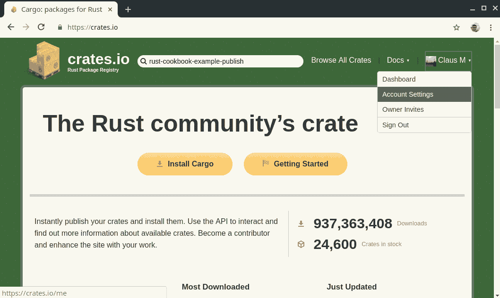
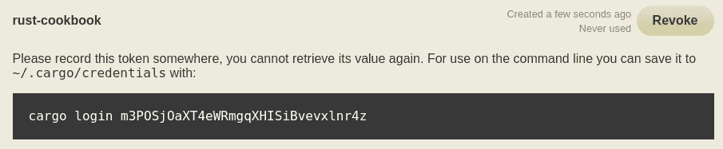
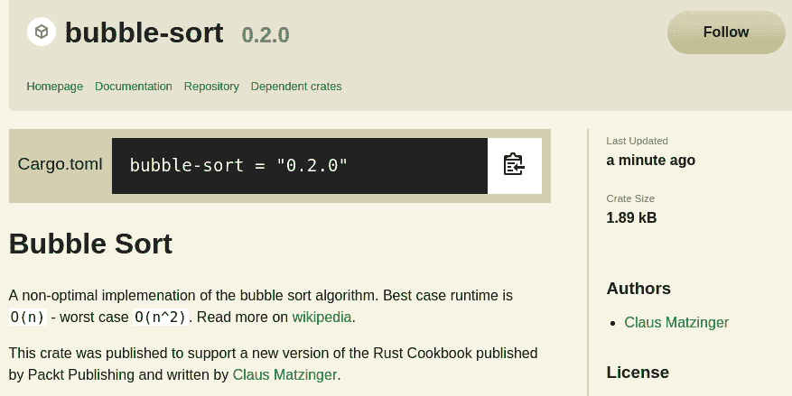
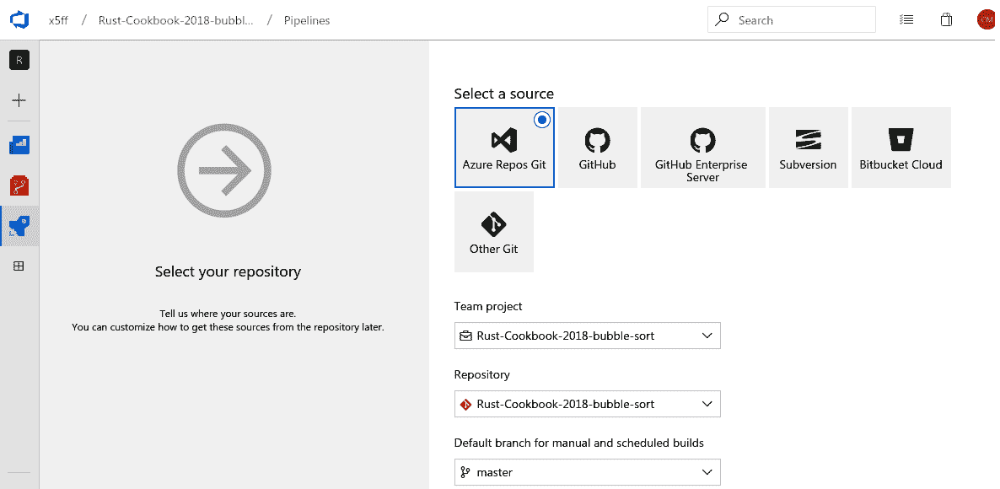
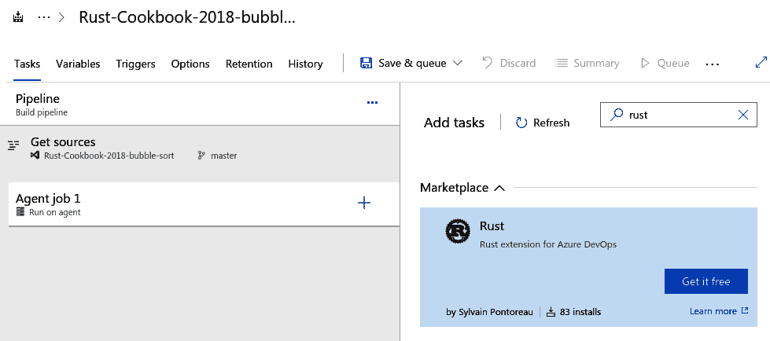
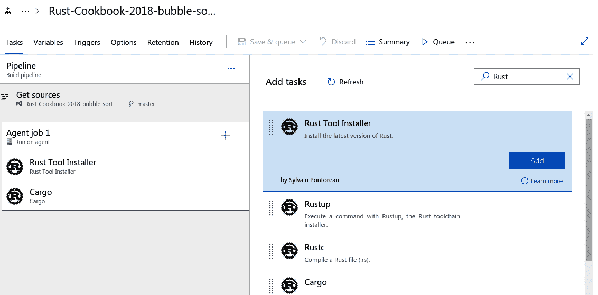
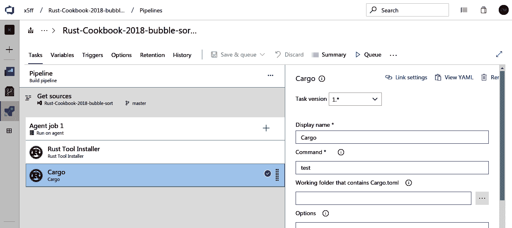
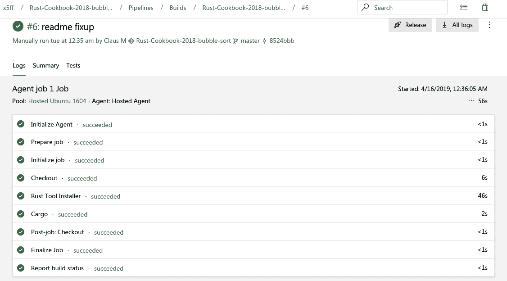

# 第三章：使用 Cargo 管理项目

`cargo` 是 Rust 的独特卖点之一。它通过使创建、开发、打包、维护、测试和部署应用程序代码或工具到生产环境变得相当愉快，从而简化了开发者的生活。`cargo` 被设计成是跨多个阶段（如下所示）工作的任何类型 Rust 项目的单一首选工具：

+   项目创建和管理

+   配置和执行构建

+   依赖安装和维护

+   测试

+   基准测试

+   与其他工具接口

+   打包和发布

尤其是在系统编程领域，像 `cargo` 这样的工具仍然很少见——这就是为什么许多大型用户开发了他们自己的版本。作为一种年轻的语言，Rust 从其他工具的正确方面汲取了灵感：`npm`（用于 Node.js）的通用性和中央仓库、`pip`（用于 Python）的易用性，以及许多其他方面。最终，`cargo` 提供了许多增强 Rust 体验的绝佳方式，并被引用为希望采用该语言的开发者的主要影响因素。

在本章中，我们将介绍一些配方，使开发者能够利用 `cargo` 的所有功能来创建生产级别的 Rust 项目。这些基本的配方作为参考依赖项、调整编译器行为、自定义工具以及许多在日常 Rust 开发中常见的其他事物的构建块。

在本章中，我们将介绍以下配方：

+   使用工作区组织大型项目

+   上传到 `crates.io` ([`crates.io`](https://crates.io))

+   使用依赖项和外部 crate

+   通过子命令扩展 `cargo`

+   使用 `cargo` 测试你的项目

+   与 `cargo` 的持续集成

+   自定义构建

# 使用工作区组织大型项目

创建单个项目很简单：运行 `cargo new my-crate` 即可完成。`cargo` 会轻松创建从文件夹结构到一个小源文件（或单元测试）的所有内容。然而，对于由多个较小的 crate 和一个可执行文件组成的大型项目呢？或者只是一系列相关的库？`cargo` 工具对此的答案是**工作区**。

# 如何做到这一点...

按照以下步骤创建自己的工作区来管理多个项目：

1.  在一个终端窗口（Windows PowerShell 或 macOS/Linux 上的终端），通过运行以下命令切换到将包含工作区的目录：

```rs
$ mkdir -p my-workspace
$ cd my-workspace
```

1.  使用 `cargo new` 命令并跟其名称来创建一个项目：

```rs
$ cargo new a-project
     Created binary (application) `a-project` package
```

1.  由于我们正在讨论多个项目，让我们添加另一个库项目，我们可以使用它：

```rs
$ cargo new a-lib --lib
     Created library `a-lib` package
```

1.  编辑 `a-project/src/main.rs` 以包含以下代码：

```rs
use a_lib::stringify;
use rand::prelude::*;

fn main() {
    println!("{{ \"values\": {}, \"sensor\": {} }}", stringify(&vec![random::<f64>(); 6]), stringify(&"temperature"));
}
```

1.  然后，向 `a-lib/src/lib.rs` 添加一些代码，该代码将使用 `Debug` 特性对传入的变量进行 `stringify`。显然，这也需要一些测试来显示该函数的功能。让我们添加一些测试来比较使用 `stringify` 的数字格式化和序列格式化的输出：

```rs
use std::fmt::Debug;

pub fn stringify<T: Debug>(v: &T) -> String {
    format!("{:#?}", v)
}

#[cfg(test)]
mod tests {
    use rand::prelude::*;
    use super::stringify;

    #[test]
    fn test_numbers() { 
        let a_nr: f64 = random();
        assert_eq!(stringify(&a_nr), format!("{:#?}", a_nr));
        assert_eq!(stringify(&1i32), "1");
        assert_eq!(stringify(&1usize), "1");
        assert_eq!(stringify(&1u32), "1");
        assert_eq!(stringify(&1i64), "1");
    }

    #[test]
    fn test_sequences() {
        assert_eq!(stringify(&vec![0, 1, 2]), "[\n 0,\n 1,\n 
        2,\n]");
        assert_eq!(
            stringify(&(1, 2, 3, 4)),
            "(\n 1,\n 2,\n 3,\n 4,\n)"
        );
    }
}
```

1.  让我们在每个项目的`Cargo.toml`文件中添加一些配置来引用依赖项：

```rs
$ cat a-project/Cargo.toml 
[package]
name = "a-project"
version = "0.1.0"
authors = ["<git user email address>"]
edition = "2018"

[dependencies]
a-lib = { path = "../a-lib" }
rand = "0.5"

$ cat a-lib/Cargo.toml 
[package]
name = "a-lib"
version = "0.1.0"
authors = ["<git user email address>"]
edition = "2018"

[dev-dependencies]
rand = "*"
```

`a-project`现在使用了`a-lib`库，但如果我们同时开发这些项目，来回切换（例如，在更改后测试`a-lib`）将很快变得繁琐。这就是工作区发挥作用的地方。

1.  要同时使用`cargo`处理两个项目，我们必须在`a-lib`和`a-project`的父目录`my-workspace`中创建`Cargo.toml`文件。它只包含两行：

```rs
[workspace]

members = [ "a-lib", "a-project" ]
```

1.  有了这个文件，`cargo`可以同时执行两个项目的命令，从而简化处理。让我们编译`cargo test`并查看哪些测试被执行，以及它们的（测试）结果：

```rs
$ cargo test
   Compiling a-project v0.1.0 (my-workspace/a-project)
    Finished dev [unoptimized + debuginfo] target(s) in 0.30s
     Running target/debug/deps/a_lib-bfd9c3226a734f51

running 2 tests
test tests::test_sequences ... ok
test tests::test_numbers ... ok

test result: ok. 2 passed; 0 failed; 0 ignored; 0 measured; 0 filtered out

     Running target/debug/deps/a_project-914dbee1e8606741

running 0 tests

test result: ok. 0 passed; 0 failed; 0 ignored; 0 measured; 0 filtered out

   Doc-tests a-lib

running 0 tests

test result: ok. 0 passed; 0 failed; 0 ignored; 0 measured; 0 filtered out
```

1.  由于只有一个项目有测试（`a-lib`），它运行了这些测试。让我们编译`cargo run`来查看二进制可执行项目的输出：

```rs
$  cargo run
   Compiling a-project v0.1.0 (my-workspace/a-project)
    Finished dev [unoptimized + debuginfo] target(s) in 0.41s
     Running `target/debug/a-project`
{ "values": [
    0.6798204591148014,
    0.6798204591148014,
    0.6798204591148014,
    0.6798204591148014,
    0.6798204591148014,
    0.6798204591148014,
], "sensor": "temperature" }
```

现在，让我们深入了解幕后，更好地理解代码。

# 它是如何工作的...

在这个配方中，我们创建了一个简单的二进制项目（步骤 2 和步骤 4）以及一个依赖彼此的库项目（步骤 3 和步骤 5）。我们只需在步骤 6 中指定这些依赖项，并在步骤 7 中创建的工作区帮助我们将这些项目联合起来。现在，任何命令都在支持它们的项上运行。

通过构建此项目（使用`cargo run`、`cargo test`或`cargo build`），工具会创建一个包含当前依赖树（称为`Cargo.lock`）的文件。作为工作区，二进制文件的输出目录（`target/`）也位于工作区目录中，而不是单个项目的目录中。让我们检查目录内容，看看它看起来像什么，以及编译输出可以在哪里找到（代码中的重点已被添加）：

```rs
$ ls -alh
total 28K
drwxr-xr-x. 5 cm cm 4.0K Apr 11 17:29 ./
drwx------. 63 cm cm 4.0K Apr 10 12:06 ../
drwxr-xr-x. 4 cm cm 4.0K Apr 10 00:42 a-lib/
drwxr-xr-x. 4 cm cm 4.0K Apr 11 17:28 a-project/
-rw-r--r--. 1 cm cm 187 Apr 11 00:05 Cargo.lock
-rw-r--r--. 1 cm cm 48 Apr 11 00:05 Cargo.toml
drwxr-xr-x. 3 cm cm 4.0K Apr 11 17:29 target/

$ ls -alh target/debug/
total 1.7M
drwxr-xr-x. 8 cm cm 4.0K Apr 11 17:31 ./
drwxr-xr-x. 3 cm cm 4.0K Apr 11 17:31 ../
-rwxr-xr-x. 2 cm cm 1.7M Apr 11 17:31 a-project*
-rw-r--r--. 1 cm cm 90 Apr 11 17:31 a-project.d
drwxr-xr-x. 2 cm cm 4.0K Apr 11 17:31 build/
-rw-r--r--. 1 cm cm 0 Apr 11 17:31 .cargo-lock
drwxr-xr-x. 2 cm cm 4.0K Apr 11 17:31 deps/
drwxr-xr-x. 2 cm cm 4.0K Apr 11 17:31 examples/
drwxr-xr-x. 4 cm cm 4.0K Apr 11 17:31 .fingerprint/
drwxr-xr-x. 4 cm cm 4.0K Apr 11 17:31 incremental/
-rw-r--r--. 1 cm cm 89 Apr 11 17:31 liba_lib.d
-rw-r--r--. 2 cm cm 3.9K Apr 11 17:31 liba_lib.rlib
drwxr-xr-x. 2 cm cm 4.0K Apr 11 17:31 native/
```

工作区的一个方面是其依赖项管理。`cargo`同步工作区内每个项目的`Cargo.lock`文件中的外部项目依赖项。因此，任何外部 crate 都将在可能的情况下在每个项目中具有相同的版本。当我们添加`rand`crate 作为依赖项时，它为两个项目选择了相同的版本（因为`a-lib`中的`*`版本）。以下是生成的`Cargo.lock`文件的部分内容：

```rs
# This file is automatically @generated by Cargo.
# It is not intended for manual editing.
[[package]]
name = "a-lib"
version = "0.1.0"
dependencies = [
 "rand 0.5.6 (registry+https://github.com/rust-lang/crates.io-index)",
]

[[package]]
name = "a-project"
version = "0.1.0"
dependencies = [
 "a-lib 0.1.0",
 "rand 0.5.6 (registry+https://github.com/rust-lang/crates.io-index)",
]
[...]
```

`cargo`工作区是一种通过在更高层次捆绑一些操作来处理大型项目的方法，同时将大多数配置留给单个 crate 和应用程序。配置简单，结果产生可预测的行为，使用户可以围绕它构建构建过程（例如，从工作区的`target/`目录收集所有二进制文件）。

另一个有趣的方面是，`cargo` 在执行命令之前会向上查找最父级的 `Cargo.toml` 文件。因此，看起来像是在目录内运行特定项目的测试实际上是在运行该工作空间的所有测试。因此，现在命令必须更加具体，例如，使用 `cargo test -p a-lib`。

我们已经成功学习了如何使用工作空间组织大型项目。现在，让我们继续下一个菜谱！

# 上传到 crates.io

`crates.io` ([`crates.io`](https://crates.io)) 是 Rust 的公共仓库，用于社区 crate。它将依赖项链接在一起，启用发现，并允许用户搜索包。对于 crate 维护者，它提供使用统计信息和托管 `readme` 文件的地方。`cargo` 使得快速轻松地发布 crate 以及处理更新成为可能。让我们看看如何操作。

# 准备工作

对于这个菜谱，我们将发布一个具有最小功能性的 crate。如果您已经有了可以工作的源代码（即您自己的项目），请随意使用它。如果没有，请使用 `cargo new public-crate --lib` 创建一个新的库项目，并在 VS Code 中打开它：



前往 [`crates.io`](https://crates.io) 并登录您的账户（使用 [`github.com`](https://github.com)）。然后，转到账户设置页面创建一个新的令牌（按照页面上的说明操作）。使用您自己的令牌在命令行上登录：



让我们看看我们需要执行哪些步骤才能上传到 `crates.io` ([`crates.io`](https://crates.io))。

# 如何操作...

在 `cargo` 登录并准备就绪后，按照以下步骤将库发布到仓库：

1.  打开 `src/lib.rs` 并添加一些代码。我们菜谱中的 crate 只会发布臭名昭著的冒泡排序算法！

目前，`crates.io` 只使用名称作为标识符，这意味着您不能再使用 `bubble-sort` 这个名称了。然而，我们不是要求您选择一个新名称，而是要求您不要用不同的名称发布这个 crate 的副本，而是将精力集中在对社区有用的 crate 上。

这里是来自书籍《动手学习 Rust 数据结构和算法》(*Hands-On Data Structures and Algorithms with Rust*) ([`www.packtpub.com/application-development/hands-data-structures-and-algorithms-rust`](https://www.packtpub.com/application-development/hands-data-structures-and-algorithms-rust)) 的一个实现：

```rs
//! This is a non-optimized implementation of the [bubble sort] algorithm for the book Rust Cookbook by Packt. This implementation also clones the input vector. 
//! 
//! # Examples
//!```

`!# use bubble_sort::bubble_sort;`

`!# let v = vec![2, 2, 10, 1, 5, 4, 3];`

`!# assert_eq!(bubble_sort(&v), vec![1, 2, 2, 3, 4, 5, 10]);`

`!#```rs

///
/// See module level documentation. 
/// 
pub fn bubble_sort<T: PartialOrd + Clone>(collection: &[T]) -> Vec<T> {
    let mut result: Vec<T> = collection.into();
    for _ in 0..result.len() {
        let mut swaps = 0;
        for i in 1..result.len() {
            if result[i - 1] > result[i] {
                result.swap(i - 1, i);
                swaps += 1;
            }
        }
        if swaps == 0 {
            break;
        }
    }
    result
}
````

此实现还附带测试：

```rs
#[cfg(test)]
mod tests {
    use super::bubble_sort;
     #[test]
    fn test_bubble_sort() {
        assert_eq!(bubble_sort(&vec![9, 8, 7, 6]), vec![6, 7, 8, 
         9]);
        assert_eq!(bubble_sort(&vec![9_f32, 8_f32, 7_f32, 6_f32]), 
         vec!
        [6_f32, 7_f32, 8_f32, 9_f32]);

        assert_eq!(bubble_sort(&vec!['c','f','a','x']), vec!['a', 
         'c', 'f', 'x']);

        assert_eq!(bubble_sort(&vec![6, 8, 7, 9]), vec![6, 7, 8, 
         9]);
        assert_eq!(bubble_sort(&vec![2, 1, 1, 1, 1]), vec![1, 1, 1, 
         1, 2]);
    }
}
```

1.  此外，`cargo` 允许使用 `Cargo.toml` 中的各种字段来自定义 `crates.io` 上的着陆页。着陆页应告知 crate 的用户关于许可证（没有许可证意味着每个人都必须得到你的许可才能使用代码）、如何找到更多信息，甚至可能是一个示例。除此之外，（相当花哨）徽章提供了关于 crate 构建状态、测试覆盖率等信息。用以下片段替换 `Cargo.toml` 中的内容（并根据需要自定义）：

```rs
[package]
name = "bubble-sort"
description = "A quick and non-optimized, cloning version of the bubble sort algorithm. Created as a showcase for publishing crates in the Rust Cookbook 2018"
version = "0.1.0"
authors = ["Claus Matzinger <claus.matzinger+kb@gmail.com>"]
edition = "2018"
homepage = "https://blog.x5ff.xyz"
repository = "https://github.com/PacktPublishing/Rust-
              Programming-Cookbook"
license = "MIT"
categories = [
    "Algorithms", 
    "Support"
]
keywords = [
    "cookbook",
    "packt",
    "x5ff", 
    "bubble",
    "sort",
]
readme = "README.md"
maintenance = { status = "experimental" }
```

1.  现在所有元数据都已整理好，让我们运行 `cargo package` 来查看该包是否满足正式标准：

```rs
$ cargo package
error: 2 files in the working directory contain changes that were not yet committed into git:

Cargo.toml
README.md

to proceed despite this, pass the `--allow-dirty` flag
```

1.  作为友好的提醒，`cargo` 确保只打包已提交的更改，因此仓库和 `crates.io` 保持同步。提交更改（如果你不知道如何使用 Git，请阅读相关资料：[`git-scm.com`](https://git-scm.com)）并重新运行 `cargo package`：

```rs
$ cargo package
   Packaging bubble-sort v0.1.0 (publish-crate)
   Verifying bubble-sort v0.1.0 (publish-crate)
   Compiling bubble-sort v0.1.0 (publish-
   crate/target/package/bubble-sort-0.1.0)
    Finished dev [unoptimized + debuginfo] target(s) in 0.68s
```

1.  现在，使用授权的 `cargo`，让我们将我们的 crate 公开并运行 `cargo publish`：

```rs
 $ cargo publish
    Updating crates.io index
    Packaging bubble-sort v0.2.0 (Rust-Cookbook/Chapter03/publish-
    crate)
   Verifying bubble-sort v0.2.0 (Rust-Cookbook/Chapter03/publish-
    crate)
   Compiling bubble-sort v0.2.0 (Rust-Cookbook/Chapter03/publish-
   crate/target/package/bubble-sort-0.2.0)
    Finished dev [unoptimized + debuginfo] target(s) in 6.09s
   Uploading bubble-sort v0.2.0 (Rust-Cookbook/Chapter03/publish-
    crate)
```

1.  一旦成功，查看你的页面 [`crates.io/crates/bubble-sort`](https://crates.io/crates/bubble-sort)：



现在，让我们幕后了解代码，以便更好地理解。

# 它是如何工作的...

发布 crate 是让 Rust 社区认可你的好方法，并让你的作品对更广泛的受众开放。为了使社区能够快速适应你的 crate，请确保使用适当的关键词和类别，以及示例和测试来使其清晰易用，这是我们已经在 *步骤 1* 和 *步骤 2* 中做到的。`Cargo.toml` 提供了比之前指定的更多选项，因此请查看文档，[`doc.rust-lang.org/cargo/reference/manifest.html#package-metadata`](https://doc.rust-lang.org/cargo/reference/manifest.html#package-metadata)，以获取更多信息。

该文件中最重要的属性是包名，它唯一地标识了 crate。虽然曾经发生过名称抢注和出售名称的事件，但这通常是不被赞同的，社区也在努力寻找解决方案。

一旦打包（*步骤 3* 和 *步骤 4*），`cargo` 会创建一个 `target/package` 目录，其中包含将被上传到 `crates.io` 的所有内容。在目录中，不仅有源代码，还有一个名为 `project_name-version.crate` 的附加二进制文件。如果你不想上传所有内容——例如，省略视频或大型示例数据——`Cargo.toml` 允许使用排除过滤器。默认情况下，目录中的所有内容都被包含在内，但将大小保持在最小是良好的实践！

保持你的 API 令牌的秘密，并使其不在源控制中。如果你不确定一个令牌是否已被泄露，请撤销它！

在 *步骤 5* 中，我们正在上传新的 crate。然而，`crates.io` 并不接受任何上传；以下是一些你可能会遇到的错误示例（观察错误信息以修复它们）：

```rs
error: api errors (status 200 OK): crate version `0.1.0` is already uploaded
error: api errors (status 200 OK): invalid upload request: invalid length 6, expected at most 5 keywords per crate at line 1 column 667
error: 1 files in the working directory contain changes that were not yet committed into git:
error: api errors (status 200 OK): A verified email address is required to publish crates to crates.io. Visit https://crates.io/me to set and verify your email address.
```

这些实际上是非常好的通知，因为这些障碍帮助程序员避免简单的错误，减少垃圾邮件，从而提高质量。如果你遵循这些条款，你将很容易看到你自己的项目步骤 6 页面的一个版本。

我们已经成功学会了如何上传到[`crates.io`](https://crates.io)。现在，让我们继续下一个菜谱！

# 使用依赖和外部 crate

在软件工程中重用其他库是一个常见的任务，这就是为什么从开始就内置了`cargo`的简单依赖管理。第三方依赖（称为**crate**）存储在一个名为`crates.io`（[`crates.io`](https://crates.io)）的注册表中，这是一个用户可以找到和发现 crate 的公共平台。从 Rust 1.34 开始，也提供了私有注册表。以`Cargo.toml`作为这个过程的核心点，让我们深入了解如何指定这些依赖。

# 如何操作...

让我们看看在这些步骤中依赖管理是如何工作的：

1.  由于我们将在命令行上打印，让我们使用`cargo new external-deps`创建一个新的二进制应用程序，并在 VS Code 中打开它。

1.  打开`Cargo.toml`文件以添加一些依赖：

```rs
[package]
name = "external-deps"
version = "0.1.0"
authors = ["Claus Matzinger <claus.matzinger+kb@gmail.com>"]
edition = "2018"

[dependencies]
regex = { git = "https://github.com/rust-lang/regex" } # bleeding edge libraries

# specifying crate features
serde = { version = "1", features = ["derive"] }
serde_json = "*" # pick whatever version

[dev-dependencies]
criterion = "0.2.11"

[[bench]]
name = "cooking_with_rust"
harness = false
```

1.  添加了这些之后，我们还需要在`src/main.rs`文件中添加一些代码：

```rs
use regex::Regex;
use serde::Serialize;

#[derive(Serialize)]
struct Person {
    pub full_name: String,
    pub call_me: String,
    pub age: usize,
}

fn main() {
    let a_person = Person {
        full_name: "John Smith".to_owned(),
        call_me: "Smithy".to_owned(),
        age: 42,
    };
    let serialized = serde_json::to_string(&a_person).unwrap();
    println!("A serialized Person instance: {}", serialized);

    let re = Regex::new(r"(?x)(?P<year>\d{4})-(?P<month>\d{2})-(?
    P<day>\d{2})").unwrap();
    println!("Some regex parsing:");
    let d = "2019-01-31";
    println!(" Is {} valid? {}", d, re.captures(d).is_some());
    let d = "9999-99-00";
    println!(" Is {} valid? {}", d, re.captures(d).is_some());
    let d = "2019-1-10";
    println!(" Is {} valid? {}", d, re.captures(d).is_some());
}
```

1.  然后，还有`dev-dependency`，我们可以用它来使用稳定的 Rust 编译器创建基准测试。为此，在`src/`同一级别创建一个新的文件夹，并在其中添加一个文件，`cooking_with_rust.rs`。在 VS Code 中打开它，并添加以下代码以运行基准测试：

```rs
#[macro_use]
extern crate criterion;

use criterion::black_box;
use criterion::Criterion;

pub fn bubble_sort<T: PartialOrd + Clone>(collection: &[T]) -> Vec<T> {
    let mut result: Vec<T> = collection.into();
    for _ in 0..result.len() {
        let mut swaps = 0;
        for i in 1..result.len() {
            if result[i - 1] > result[i] {
                result.swap(i - 1, i);
                swaps += 1;
            }
        }
        if swaps == 0 {
            break;
        }
    }
    result
}

fn bench_bubble_sort_1k_asc(c: &mut Criterion) {
    c.bench_function("Bubble sort 1k descending numbers", |b| {
        let items: Vec<i32> = (0..1_000).rev().collect();
        b.iter(|| black_box(bubble_sort(&items)))
    });
}

criterion_group!(benches, bench_bubble_sort_1k_asc);
criterion_main!(benches);
```

1.  现在，让我们使用这些依赖并看看`cargo`是如何集成它们的。让我们首先执行`cargo run`：

```rs
$ cargo run
   Compiling proc-macro2 v0.4.27
   Compiling unicode-xid v0.1.0
   Compiling syn v0.15.30
   Compiling libc v0.2.51
   Compiling memchr v2.2.0
   Compiling ryu v0.2.7
   Compiling serde v1.0.90
   Compiling ucd-util v0.1.3
   Compiling lazy_static v1.3.0
   Compiling regex v1.1.5 (https://github.com/rust-
    lang/regex#9687986d)
   Compiling utf8-ranges v1.0.2
   Compiling itoa v0.4.3
   Compiling regex-syntax v0.6.6 (https://github.com/rust-
    lang/regex#9687986d)
   Compiling thread_local v0.3.6
   Compiling quote v0.6.12
   Compiling aho-corasick v0.7.3
   Compiling serde_derive v1.0.90
   Compiling serde_json v1.0.39
   Compiling external-deps v0.1.0 (Rust-Cookbook
    /Chapter03/external-deps)
    Finished dev [unoptimized + debuginfo] target(s) in 24.56s
     Running `target/debug/external-deps`
A serialized Person instance: {"full_name":"John Smith","call_me":"Smithy","age":42}
Some regex parsing:
  Is 2019-01-31 valid? true
  Is 9999-99-00 valid? true
  Is 2019-1-10 valid? false
```

1.  它下载并编译了各种 crate（下载部分被省略，因为它只做一次）——但你能否发现缺少了什么？是作为`dev-dependency`指定的`criterion` crate，它仅用于开发（`test/bench/..`）操作。让我们运行`cargo bench`来查看 crate 的基准测试结果，包括由`criterion`提供的一些基本趋势（输出已省略）：

```rs
$ cargo bench
   Compiling proc-macro2 v0.4.27
   Compiling unicode-xid v0.1.0
   Compiling arrayvec v0.4.10
   [...]
   Compiling tinytemplate v1.0.1
   Compiling external-deps v0.1.0 (Rust-Cookbook
    /Chapter03/external-deps)
 Compiling criterion v0.2.11
    Finished release [optimized] target(s) in 1m 32s
     Running target/release/deps/external_deps-09d742c8de9a2cc7

running 0 tests

test result: ok. 0 passed; 0 failed; 0 ignored; 0 measured; 0 filtered out

     Running target/release/deps/cooking_with_rust-b879dc4675a42592
Gnuplot not found, disabling plotting
Bubble sort 1k descending numbers 
                        time: [921.90 us 924.39 us 927.17 us]
Found 12 outliers among 100 measurements (12.00%)
  6 (6.00%) high mild
  6 (6.00%) high severe

Gnuplot not found, disabling plotting
```

现在，让我们幕后了解代码的更好。

# 它是如何工作的...

通过在`Cargo.toml`中指定版本和名称，`cargo`可以下载和编译所需的 crate，并根据需要将它们链接到项目中。实际上，`cargo`维护了`crates.io`上的 crate 和原始`git`依赖的缓存（检查`~/.cargo`目录），其中放置了最近使用的 crate。这正是我们在第一步中通过向 crate 添加混合来源的依赖所做的事情。

这些来源之一是一个`git`仓库，但也可以是目录的本地路径。此外，通过传递一个对象（如在*步骤 1*中看到的`regex` crate），我们可以指定 crate 的功能（如在*步骤 1*中显示的`serde`依赖项）或使用名为`dev-dependencies`的整个部分来指定不包含在目标输出中的依赖项。结果是序列化在`Cargo.lock`中的依赖项树。`dev-dependency`准则的使用在*步骤 6*中显示。其余步骤显示了如何使用外部依赖项以及`cargo`下载和编译的各种版本。

`Cargo.toml`中的版本规范是其自己的迷你语言，并且它只会根据某些限制进行升级：

+   一个单独的数字指定主版本（在 Rust 中，`<major>.<minor>.<patch>`模式是强制性的）但其他版本留给`cargo`决定（通常是最新版本）

+   更精确的版本留下了更少的解释空间

+   `*`表示任何可用版本，最新版本优先

版本字符串中可以包含更多字符和符号，但通常这些就足够了。更多示例请查看[`doc.rust-lang.org/cargo/reference/specifying-dependencies.html`](https://doc.rust-lang.org/cargo/reference/specifying-dependencies.html)。`cargo upgrade`命令也会检查规范允许的最新版本，并相应地更新它们。如果你计划构建其他人使用的 crate，建议偶尔运行`cargo upgrade`以查看是否遗漏了任何安全/补丁更新。Rust 项目甚至建议将`Cargo.lock`文件放入源代码控制中，以避免意外破坏 crate。

最好尽量减少所需的 crate 数量，并尽可能保持它们是最新的。你的用户也会希望这样做。

# 相关内容...

Rust 1.34 版本也允许私有仓库。有关更多信息，请参阅以下博客文章：[`blog.rust-lang.org/2019/04/11/Rust-1.34.0.html#alternative-cargo-registries`](https://blog.rust-lang.org/2019/04/11/Rust-1.34.0.html#alternative-cargo-registries)。我们现在已经成功学习了如何使用依赖项和外部 crate。现在，让我们继续下一个菜谱！

# 通过子命令扩展 cargo

这些天，一切都可以扩展。无论是称为插件、扩展、附加组件还是子命令——一切都是为了定制（开发者）体验。`cargo`提供了一个非常简单的方法来实现这一点：通过使用二进制文件名。这允许快速扩展`cargo`基础，包括针对你自己的用例或工作方式特定的功能。在这个菜谱中，我们将构建自己的扩展。

# 准备工作

对于这个菜谱，我们将停留在命令行，并使用一个简单的二进制示例代码，因此请打开终端/PowerShell（我们在 Windows 上使用 PowerShell 功能）以运行这个菜谱中的命令。

# 如何做到这一点...

扩展 `cargo` 意外地简单。要完成此操作，请执行以下步骤：

1.  使用以下命令创建一个新的 Rust 二进制应用程序项目：`cargo new cargo-hello`。

1.  切换到 `cargo-hello` 目录，并使用 `cargo build` 构建它。

1.  将当前项目位于您的 `PATH` 变量中的 `target/debug` 文件夹添加到您的 `PATH` 变量中。在 Linux 和 Mac（使用 bash）上，操作如下：

```rs
export PATH=$PATH:/path/to/cargo-hello/target/debug
```

在 Windows 上，您可以使用 PowerShell 通过以下代码脚本达到相同的目的：

```rs
$env:Path += ";C:/path/to/cargo-hello/target/debug"
```

1.  在同一个窗口中，您现在应该能够在计算机上的任何目录中运行 `cargo-hello`（Windows 上的 `cargo-hello.exe`）。

1.  此外，`cargo` 现在可以将 `hello` 作为子命令运行。尝试在计算机上的任何目录中运行 `cargo hello`。从这里，您将看到以下输出：

```rs
$ cargo hello
Hello, world!
```

现在，让我们深入了解代码，以更好地理解它。

# 它是如何工作的...

`cargo` 会拾取任何以 `cargo-` 开头且在 `PATH` 环境变量中可用的可执行文件。在 *nix 系统中，列出的目录用于发现命令行可执行文件。

为了使 `cargo` 无缝集成这些扩展，它们的名称必须满足一些条件：

+   这些二进制文件必须在当前平台上可执行

+   名称以 `cargo-` 开头

+   包含的文件夹列在 `PATH` 变量中

在 Linux/macOS 上，这些可执行文件也可以是 shell 脚本——这对于提高开发者工作流程非常有用。然而，这些脚本必须看起来像二进制文件，因此没有文件扩展名。然后，而不是运行多个命令，例如 `cargo publish`、`git tag` 和 `git push`，`cargo shipit` 可以显著提高速度和一致性。

此外，任何 `cargo` 子命令都可以接受命令行参数，这些参数是在命令之后传递的，并且默认情况下工作目录是命令运行的目录。有了这些知识，我们希望您现在可以向 `cargo` 功能添加更多内容！

我们已经成功学习了如何通过子命令扩展 cargo。现在，让我们继续下一个菜谱！

# 使用 cargo 测试项目

在之前的菜谱中，我们专注于编写测试，而这个菜谱则是关于*运行*它们。测试是软件工程的重要组成部分，因为它确保我们站在用户的角度，并再次检查我们所创建的内容是否正常工作。虽然许多其他语言需要单独的测试运行器，但 `cargo` 内置了这一功能！

让我们在这个菜谱中探索 `cargo` 如何帮助这个过程。

# 如何做...

要探索 `cargo` 测试功能，请按照以下步骤操作：

1.  使用 `cargo new test-commands --lib` 在命令行中创建一个新的项目，并在 VS Code 中打开生成的文件夹。

1.  接下来，将 `src/lib.rs` 中的内容替换为以下内容：

```rs
#[cfg(test)]
mod tests {

    use std::thread::sleep;
    use std::time::Duration;

    #[test]
    fn it_works() {
        assert_eq!(2 + 2, 4);
    }

    #[test]
    fn wait_10secs() {
        sleep(Duration::from_secs(10));
        println!("Waited for 10 seconds");
        assert_eq!(2 + 2, 4);
    }

    #[test]
    fn wait_5secs() {
        sleep(Duration::from_secs(5));
        println!("Waited for 5 seconds");
        assert_eq!(2 + 2, 4);
    }

        #[test]
    #[ignore]
    fn ignored() {
        assert_eq!(2 + 2, 4);
    }
}
```

1.  正如我们在其他菜谱中所做的那样，我们可以使用 `cargo test` 命令执行所有测试：

```rs
$ cargo test
   Compiling test-commands v0.1.0 (Rust-Cookbook/Chapter03/test-
    commands)
    Finished dev [unoptimized + debuginfo] target(s) in 0.37s
     Running target/debug/deps/test_commands-06e02dadda81dfcd

running 4 tests
test tests::ignored ... ignored
test tests::it_works ... ok
test tests::wait_5secs ... ok
test tests::wait_10secs ... ok

test result: ok. 3 passed; 0 failed; 1 ignored; 0 measured; 0 filtered out

   Doc-tests test-commands

running 0 tests

test result: ok. 0 passed; 0 failed; 0 ignored; 0 measured; 0 filtered out
```

1.  为了快速迭代，`cargo` 允许我们通过使用 `cargo test <test-name>` 来执行特定的测试：

```rs
$ cargo test tests::it_works
    Finished dev [unoptimized + debuginfo] target(s) in 0.05s
     Running target/debug/deps/test_commands-06e02dadda81dfcd

running 1 test
test tests::it_works ... ok

test result: ok. 1 passed; 0 failed; 0 ignored; 0 measured; 3 filtered out
```

1.  运行测试的另一种有用方法是不要捕获它们的输出。默认情况下，测试框架不会从测试内部打印任何内容。有时，有一些测试输出是有用的，所以让我们使用`cargo test -- --nocapture`来查看输出：

```rs
$ cargo test -- --nocapture
    Finished dev [unoptimized + debuginfo] target(s) in 0.01s
     Running target/debug/deps/test_commands-06e02dadda81dfcd

running 4 tests
test tests::ignored ... ignored
test tests::it_works ... ok
Waited for 5 seconds
test tests::wait_5secs ... ok
Waited for 10 seconds
test tests::wait_10secs ... ok

test result: ok. 3 passed; 0 failed; 1 ignored; 0 measured; 0 filtered out

   Doc-tests test-commands

running 0 tests

test result: ok. 0 passed; 0 failed; 0 ignored; 0 measured; 0 filtered out
```

1.  所有测试都是并行运行的，这有时会导致意外结果。为了调整这种行为，我们可以使用`cargo test -- --test-threads <线程数>`来控制线程数。让我们比较使用四个线程和一个线程的差异。我们将使用`time`程序来显示运行时间（如果你没有`time`，这是可选的）。让我们从四个线程开始：

```rs
$ time -f "%e" cargo test -- --test-threads 4
   Compiling test-commands v0.1.0 (/home/cm/workspace/Mine/Rust-
    Cookbook/Chapter03/test-commands)
    Finished dev [unoptimized + debuginfo] target(s) in 0.35s
     Running target/debug/deps/test_commands-06e02dadda81dfcd

running 4 tests
test tests::ignored ... ignored
test tests::it_works ... ok
test tests::wait_5secs ... ok
test tests::wait_10secs ... ok

test result: ok. 3 passed; 0 failed; 1 ignored; 0 measured; 0 filtered out

   Doc-tests test-commands

running 0 tests

test result: ok. 0 passed; 0 failed; 0 ignored; 0 measured; 0 filtered out

10.53
```

与单线程相比，这要快得多：

```rs
$ time -f "%e" cargo test -- --test-threads 1
    Finished dev [unoptimized + debuginfo] target(s) in 0.03s
     Running target/debug/deps/test_commands-06e02dadda81dfcd

running 4 tests
test tests::ignored ... ignored
test tests::it_works ... ok
test tests::wait_10secs ... ok
test tests::wait_5secs ... ok

test result: ok. 3 passed; 0 failed; 1 ignored; 0 measured; 0 filtered out

   Doc-tests test-commands

running 0 tests

test result: ok. 0 passed; 0 failed; 0 ignored; 0 measured; 0 filtered out

15.17
```

1.  最后，我们还可以过滤多个测试，例如所有以`wait`开头的测试：

```rs
$ cargo test wait
    Finished dev [unoptimized + debuginfo] target(s) in 0.03s
     Running target/debug/deps/test_commands-06e02dadda81dfcd

running 2 tests
test tests::wait_5secs ... ok
test tests::wait_10secs ... ok
```

现在，让我们幕后了解代码以更好地理解它。

# 它是如何工作的...

Rust 的内置测试库称为 `libtest`，它是通过 `cargo` 调用的。无论创建的项目类型（二进制应用程序或库）如何，`libtest`都会运行相关的测试并输出结果。在这个菜谱中，我们正在检查运行之前创建的项目中的测试——然而，这些步骤显然适用于任何有测试的项目。

在*步骤 2*中，我们创建了一个包含四个测试的小型库，其中两个测试在等待几秒钟（五秒和十秒）后向命令行打印内容。这使我们能够展示线程化测试运行，并且测试框架默认会捕获输出。

除了在项目中过滤可用的测试列表（我们在*步骤 4*和*步骤 7*中这样做）之外，`libtest`还接受命令行参数来自定义输出、日志、线程以及许多其他事情。通过调用`cargo test -- --help`来了解更多信息。注意双横线（`--`），这告诉`cargo`将任何后续参数传递给`libtest`。

如选项所表明的：除非另有说明，否则所有测试都是并行运行的，我们在*步骤 6*中更改了此选项，并取得了显著的效果（单线程时为 15 秒，多线程时为 10 秒——就像最长的睡眠时间一样）。使用此选项来调试竞态条件或其他运行时行为。

*步骤 5*使用一个选项来显示标准输出，其顺序与我们编写的测试函数不同。这是并发执行的结果，因此结合限制线程数的选项和输出捕获将线性执行测试。我们通过在*步骤 7*中过滤多个测试来结束步骤。

我们已经成功学习了如何使用`cargo`测试我们的项目。现在，让我们继续下一个菜谱！

# 与 cargo 的持续集成

自动化是当今软件工程的一个重要方面。无论是基础设施即代码还是函数即服务，许多事情都期望自动按预期工作。然而，基于某些规则的中心测试和部署基础设施的概念要古老得多（称为 **ALM**—**应用生命周期管理**），并且使用现代工具，它变得极其简单。`cargo` 是为了支持这种无状态基础设施而构建的，它具有合理的默认值和易于定制的用户界面。

在这个菜谱中，我们将以 Microsoft 的 Azure DevOps 平台为例，看看如何构建 Rust 应用程序。

# 准备工作

虽然 Azure DevOps 仓库 ([`azure.microsoft.com/en-us/services/devops/?nav=min`](https://azure.microsoft.com/en-us/services/devops/?nav=min)) 对任何人都是可访问的，但强烈建议创建一个 Microsoft 账户并利用免费层来重现示例。访问 [`azure.microsoft.com/en-us/services/devops/`](https://azure.microsoft.com/en-us/services/devops/) 并按照说明开始操作。

为了有一个现成的项目来工作，我们正在重用本章前面提到的 *Uploading to crates.io* 菜单中的 `bubble-sort` crate，并将其上传到源代码托管服务，如 Azure DevOps 或 GitHub。

# 如何做到这一点...

打开浏览器窗口，导航到[`dev.azure.com`](https://dev.azure.com)，登录，并找到您创建的项目。然后，按照以下步骤操作：

1.  Azure DevOps 是项目管理的一站式解决方案，因此我们将源代码推送到可用的仓库。遵循仓库设置指南来完成此操作。

1.  管道是 Azure DevOps 的持续集成部分。它们编排构建代理（运行构建的机器）并提供一个可视化界面来逐步构建过程。从空作业模板创建一个新的管道：



1.  在每个管道内部，有几个作业——几个在同一代理上运行的步骤，但我们只需要一个。点击预定义代理作业 1 右侧的 + 符号，搜索名为 `rust` 的构建任务：



1.  由于特定的构建任务在市场（归功于 Sylvain Pontoreau: [`github.com/spontoreau/rust-azure-devops`](https://github.com/spontoreau/rust-azure-devops)）上可用，我们必须将其添加到我们的项目中。

1.  在 *购买*（它是免费的）任务蓝图后，我们可以在管道中添加和配置它。有一个运行测试的构建非常有用，但 CI 系统非常灵活，你可以非常富有创意。现在，您的屏幕应该看起来像这样：



1.  使用第一个任务（无需配置），因为它只是使用 `rustup` 安装工具。第二个任务简单地运行 `cargo test`：



1.  作为最后一步，排队构建并检查其进度。如果你遵循了配方，它将导致构建成功，你可以开始使用它来检查拉取请求，在 `crates.io` 上添加徽章，以及更多：



现在，让我们深入了解代码，以便更好地理解它。

# 它是如何工作的...

Azure DevOps 是一个集成的项目管理、问题跟踪、源代码托管、构建和部署解决方案的解决方案。类似的产品还有 GitHub（也由微软拥有）、GitLab ([`about.gitlab.com`](https://about.gitlab.com)) 或 Atlassian 的 Bitbucket ([`bitbucket.org`](https://bitbucket.org))。与 CircleCI ([`circleci.com`](https://circleci.com)) 或 Travis CI ([`travis-ci.org`](https://travis-ci.org/)) 一起，这些平台为团队提供了强大的工具，以确保每次新部署都能可靠地达到他们的目标，而无需大量管理开销。

基本思想很简单：通过使构建在中立平台上工作，大多数明显的错误（缺少依赖项或依赖于环境特定性）可以很容易地避免，同时运行必须在本地上运行的相同测试。除此之外，对于大型项目来说，运行每个测试可能要求很高，而专用基础设施则负责处理这一点。

由于计算机非常挑剔，测试运行的结果也是可见的，并且可以用来禁止某些操作，例如在测试失败的情况下部署到生产环境。从某种意义上说，持续集成系统使开发者对其自己的规则（测试）负责。

`cargo` 支持是通过在无状态系统中成为良好公民来隐式实现的。它不会因为某些条件未满足而失败，而是试图减轻晚期终止，并且一开始只需要很少的配置。它处理依赖关系轻松且良好的能力，加上对子命令的支持，使其成为跨平台构建的绝佳方式。

这里有一些关于除了运行 `cargo test` 之外你可以做的事情的想法：

+   运行基准测试

+   运行集成测试

+   格式化代码

+   仅在测试成功时接受 PR

+   生成文档

+   执行静态代码分析

Azure DevOps 还支持发布管道，这些管道应用于诸如发布到 `crates.io`（或其他软件包仓库）、更新托管文档等任务。有关如何操作的说明，请参阅 Azure DevOps 文档（[`docs.microsoft.com/en-us/azure/devops/?view=azure-devops`](https://docs.microsoft.com/en-us/azure/devops/?view=azure-devops)）。对于更喜欢 YAML ([`yaml.org/`](https://yaml.org/)) 文件来配置 CI 管道的用户，Azure DevOps 也支持这些文件。

感谢 Sylvain Pontoreau 在创建易于使用的任务模板方面的工作([`twitter.com/bla`](https://twitter.com/bla))，我们可以快速设置构建、测试或其他流水线。手动操作对于每个平台来说可能很棘手，对于大多数开发者来说，维护下载和 shell 脚本也是一件麻烦事。如果你在使用他的工作，他也很乐意听到这个消息——例如，在 Twitter([`twitter.com/spontoreau`](https://twitter.com/spontoreau))上。

我们已经成功地学习了如何与`cargo`进行持续集成。现在，让我们继续下一道菜谱！

# 自定义构建

`cargo`是多功能的——这是我们在这个章节的前几道菜谱中已经确立的。然而，我们没有触及配置`cargo`用于编译和运行 Rust 项目的工具。为此，有多种方法，因为它们适用于不同的领域。

在这个菜谱中，我们将通过自定义新项目的构建来探索两种方法。

# 如何做到这一点...

这就是如何自定义构建：

1.  使用`cargo new custom-build`创建一个新的二进制项目，并使用 VS Code 打开项目文件夹。

1.  打开`src/main.rs`并将 hello world 代码替换为以下内容：

```rs
fn main() {
    println!("Overflow! {}", 128u8 + 129u8);
}
```

1.  我们二进制中的代码现在正在创建一个编译器可以轻松捕获的溢出情况。然而，默认的发布构建已经关闭了该功能。运行`cargo run --release`来查看其效果：

```rs
$ cargo run --release
 Finished release [optimized] target(s) in 0.02s
 Running `target/release/custom-build`
Overflow! 1
```

1.  如果我们想要改变编译器在发布模式下在编译时验证溢出错误的事实（即使溢出在硬件驱动程序中可能是有用的），我们必须编辑`Cargo.toml`并自定义`release`配置文件（还有其他配置，例如`dev`和`test`）。当我们到达那里时，我们可以更改一些其他选项以加快构建速度（这对于大型项目来说很重要）：

```rs
# Let's modify the release build
[profile.release]
opt-level = 2
incremental = true # default is false
overflow-checks = true
```

1.  现在我们运行`cargo run --release`，输出已经改变：

```rs
$ cargo run --release
   Compiling custom-build v0.1.0 (Rust-Cookbook/Chapter03/custom-build)
error: attempt to add with overflow
 --> src/main.rs:2:30
  |
2 | println!("Overflow! {}", 128u8 + 129u8);
  | ^^^^^^^^^^^^^
  |
  = note: #[deny(const_err)] on by default

error: aborting due to previous error

error: Could not compile `custom-build`.

To learn more, run the command again with --verbose.
```

1.  这很简单——但还有更多！在项目的根目录下创建一个`.cargo`目录，并在其中添加一个`config`文件。由于文件（和目录）位于项目内部，这就是它的作用域。然而，通过将`.cargo`目录向上移动几个级别，可以使它对更多的项目有效。请注意，用户的家目录代表*全局作用域*，这意味着`cargo`配置适用于用户的所有项目。以下设置将默认构建目标切换为 WASM 输出([`webassembly.org/`](https://webassembly.org/))并将构建工件目录重命名为`out`（默认为`target`）：

```rs
[build]
target = "wasm32-unknown-unknown" # the new default target
target-dir = "out"                # custom build output directory
```

1.  现在，让我们从`src/main.rs`中移除溢出：

```rs
fn main() {
    println!("Overflow! {}", 128 + 129);
}
```

1.  使用`cargo build`和`cargo run`进行编译以查看发生了什么：

```rs
$  cargo build
   Compiling custom-build v0.1.0 (Rust-Cookbook/Chapter03/custom-
    build)
    Finished dev [unoptimized + debuginfo] target(s) in 0.37s
$  cargo run
   Compiling custom-build v0.1.0 (Rust-Cookbook/Chapter03/custom-
    build)
    Finished dev [unoptimized + debuginfo] target(s) in 0.15s
     Running `out/wasm32-unknown-unknown/debug/custom-build.wasm`
     out/wasm32-unknown-unknown/debug/custom-build.wasm:
      out/wasm32-unknown-unknown/debug/custom-build.wasm: cannot 
       execute binary file
```

现在，让我们深入了解代码以更好地理解它。

# 它是如何工作的...

项目有许多方面可以进行配置，其中大多数对于较小的程序和库来说并不需要（除非是为了特殊架构）。这个配方只能展示一些——简单的——可能的例子，但在`cargo`手册中关于配置([`doc.rust-lang.org/cargo/reference/config.html`](https://doc.rust-lang.org/cargo/reference/config.html))和清单([`doc.rust-lang.org/cargo/reference/manifest.html#the-profile-sections`](https://doc.rust-lang.org/cargo/reference/manifest.html#the-profile-sections))有更多内容。

在第一步中，通过更改`cargo`配置中的一个标志来配置`cargo`以忽略溢出错误。虽然一开始这可能看起来是一个愚蠢的步骤，但有时为了允许驱动程序或其他低级电子设备运行，这是必要的。

许多其他选项定制了开发者的体验（例如，为新项目设置名称和电子邮件地址、别名等）或在非标准设置中很有用，例如，在创建设备驱动程序、操作系统或为专用硬件的实时软件时。我们可能在第九章，《系统编程变得简单》中稍后使用其中的一些。

然而，更改`build`部分（如在`cargo build`中）有严重的后果，因为它代表了项目的标准输出格式。将其更改为类似 WASM 的东西可能看起来很随意，但作为默认设置，它可以节省开发者设置开发环境的许多步骤——或者简单地使 CI 构建脚本不那么冗长。

无论如何，`cargo`非常灵活且易于配置，但它针对每个项目单独定制。查看清单和文档，了解它如何使你的项目（以及你的生活）变得更简单。
