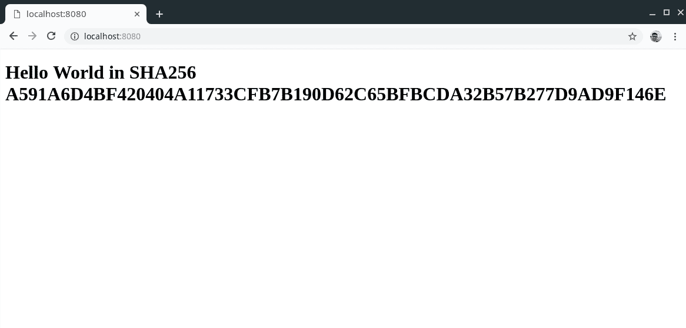

# 第七章：将 Rust 与其他语言集成

在当今的应用程序领域，集成是关键。无论您是缓慢地现代化旧服务还是从头开始使用新语言，现在的程序很少是独立运行的。对于许多公司来说，Rust 仍然是一种异类技术——不幸的是，它通常不被考虑在典型的 SDK 中。这就是为什么 Rust 强调了与其他技术的良好协作，这也是为什么社区可以（并将）通过包装其他（本地）库来提供大量的驱动程序、服务集成等。

作为开发者，我们很少有机会从头开始（绿色项目），因此在本章中，我们将介绍 Rust 语言与其他语言和技术集成的各种方式。我们将重点关注撰写时的最流行和最有用的集成，但这些基础知识也应该为更大的互操作性提供基础，因为许多语言都提供了用于本地二进制的接口（例如 .NET ([`docs.microsoft.com/en-us/cpp/dotnet/calling-native-functions-from-managed-code?view=vs-2019`](https://docs.microsoft.com/en-us/cpp/dotnet/calling-native-functions-from-managed-code?view=vs-2019)）或 Java 的 JNI ([`docs.oracle.com/javase/7/docs/technotes/guides/jni/spec/intro.html#wp9502`](https://docs.oracle.com/javase/7/docs/technotes/guides/jni/spec/intro.html#wp9502)））。有了这些知识，添加 Rust 来增强您的 Web 应用程序应该和创建制造商代码的传感器驱动程序包装一样简单。

我们认为，良好的集成对于语言的成功至关重要。在本章中，我们将介绍以下食谱：

+   包含旧 C 代码

+   使用 FFI 从 Node.js 调用 Rust

+   在浏览器中运行 Rust

+   使用 Rust 和 Python

+   为旧应用生成绑定

# 包含旧 C 代码

由于其多功能性、速度和简单性，C 仍然是最受欢迎的编程语言之一 ([`www.tiobe.com/tiobe-index/`](https://www.tiobe.com/tiobe-index/))。因此，许多应用程序——无论是旧应用还是新应用——都是使用 C 开发的，既有其优点也有其缺点。Rust 与 C 共享一个领域——系统编程，这就是为什么越来越多的公司用 Rust 替换其 C 代码，因为 Rust 作为一种现代编程语言具有安全性和吸引力。然而，变化并不总是以一次性的大爆炸（[`www.linkedin.com/pulse/big-bang-vs-iterative-dilemma-martijn-endenburg/`](https://www.linkedin.com/pulse/big-bang-vs-iterative-dilemma-martijn-endenburg/)）形式发生；通常是一个更加渐进的（迭代）方法，包括替换组件和替换应用程序的部分。

这里，我们使用 C 代码作为类比，因为它流行且广为人知。然而，这些技术适用于任何（本地）编译的技术，例如 Go、C++，甚至是 Fortran。所以，让我们开始吧！

# 准备工作

在这个菜谱中，我们不仅构建 Rust，还构建 C。为此，我们需要一个 C 编译器工具链——`gcc` ([`gcc.gnu.org/`](https://gcc.gnu.org/)) 和 `make`：[`www.gnu.org/software/make/manual/make.html`](https://www.gnu.org/software/make/manual/make.html)，这是一个基于规则的脚本引擎，用于执行构建。

检查工具是否已安装，方法是在终端窗口中打开（注意版本应该相似——至少是主要版本——以避免任何意外差异）：

```rs
$ cc --version
cc (GCC) 9.1.1 20190503 (Red Hat 9.1.1-1)
Copyright (C) 2019 Free Software Foundation, Inc.
This is free software; see the source for copying conditions. There is NO
warranty; not even for MERCHANTABILITY or FITNESS FOR A PARTICULAR PURPOSE.
$ make --version
GNU Make 4.2.1
Built for x86_64-redhat-linux-gnu
Copyright (C) 1988-2016 Free Software Foundation, Inc.
License GPLv3+: GNU GPL version 3 or later <http://gnu.org/licenses/gpl.html>
This is free software: you are free to change and redistribute it.
There is NO WARRANTY, to the extent permitted by law.
```

如果这些命令在你的机器上不可用，请检查如何在你的操作系统上安装它们。在任何**Linux/Unix**环境中（包括 WSL——Windows 子系统对于 Linux：[`docs.microsoft.com/en-us/windows/wsl/install-win10`](https://docs.microsoft.com/en-us/windows/wsl/install-win10)），它们可能需要通过默认的软件仓库安装`gcc`和`make`。在某些发行版中（例如 Ubuntu），如`build_essential`（[`packages.ubuntu.com/xenial/build-essential`](https://packages.ubuntu.com/xenial/build-essential)）这样的捆绑包也提供了这些工具。

在 macOS 上，检查 Homebrew，它提供类似的经验并提供`gcc`以及`make`：[`brew.sh/`](https://brew.sh/)。

Windows 用户可以选择使用 WSL（然后遵循 Linux 说明）或使用 Cygwin ([`www.cygwin.com`](https://www.cygwin.com))来找到`gcc-core`和`make`。我们建议将这些工具（默认为`C:\cygwin64\bin`）添加到 Windows 的`PATH`变量中（[`www.java.com/en/download/help/path.xml`](https://www.java.com/en/download/help/path.xml)），这样常规的（PowerShell）终端就可以访问 Cygwin 的可执行文件。

准备就绪后，使用相同的 shell 创建一个`legacy-c-code`目录，并在其中运行`cargo new rust-digest --lib`，并在旁边创建一个名为`C`的目录：

```rs
$ ls legacy-c-code
C/ rust-digest/
```

在`C`目录内，创建一个`src`文件夹以反映 Rust 项目。在 Visual Studio Code 或你的 Rust 开发环境中打开整个`legacy-c-code`。

# 如何做到这一点...

按照以下步骤操作，以便能够在你的项目中包含旧代码：

1.  让我们先实现 Rust 库。打开`rust-digest/Cargo.toml`来调整配置以输出动态库（`*.so`或`*.dll`）：

```rs
[lib]
name = "digest"
crate-type = ["cdylib"]
```

1.  还需要添加的是依赖项。在这里，我们使用`libc`中的类型和一个名为`ring`的加密库，所以让我们添加这些依赖项：

```rs
[dependencies]
libc = "0.2"
ring = "0.14"
```

1.  接下来，我们可以处理代码本身。让我们打开`rust-digest/src/lib.rs`并替换默认代码为以下片段。这个片段创建了一个从外部世界接受字符串（一个可变字符指针）并返回输入字符串摘要的接口：

```rs
use std::ffi::{CStr, CString};
use std::os::raw::{c_char, c_void};

use ring::digest;

extern "C" {
    fn pre_digest() -> c_void;
}

#[no_mangle]
pub extern "C" fn digest(data: *mut c_char) -> *mut c_char {
    unsafe {
        pre_digest();

        let data = CStr::from_ptr(data);
        let signature = digest::digest(&digest::SHA256, 
        data.to_bytes());

        let hex_digest = signature
            .as_ref()
            .iter()
            .map(|b| format!("{:X}", b))
            .collect::<String>();

        CString::new(hex_digest).unwrap().into_raw()
    }
}
```

1.  现在应该是一个完整的 Rust 库了。让我们在`rust-digest`中运行`cargo build`来检查输出：

```rs
$ cd rust-digest; cargo build
   Compiling libc v0.2.58
   Compiling cc v1.0.37
   Compiling lazy_static v1.3.0
   Compiling untrusted v0.6.2
   Compiling spin v0.5.0
   Compiling ring v0.14.6
   Compiling rust-digest v0.1.0 (Rust-Cookbook/Chapter07/legacy-c-
    code/rust-digest)
    Finished dev [unoptimized + debuginfo] target(s) in 7.53s
```

1.  应该有一个`libdigest.so`库（或在 Windows 上是`digest.dll`）：

```rs
$  ls -al rust-digest/target/debug/
total 3756
drwxr-xr-x. 8 cm cm 4096 Jun 23 20:17 ./
drwxr-xr-x. 4 cm cm 4096 Jun 23 20:17 ../
drwxr-xr-x. 6 cm cm 4096 Jun 23 20:17 build/
-rw-r--r--. 1 cm cm 0 Jun 23 20:17 .cargo-lock
drwxr-xr-x. 2 cm cm 4096 Jun 23 20:17 deps/
drwxr-xr-x. 2 cm cm 4096 Jun 23 20:17 examples/
drwxr-xr-x. 13 cm cm 4096 Jun 23 20:17 .fingerprint/
drwxr-xr-x. 3 cm cm 4096 Jun 23 20:17 incremental/
-rw-r--r--. 1 cm cm 186 Jun 23 20:17 libdigest.d
-rwxr-xr-x. 2 cm cm 3807256 Jun 23 20:17 libdigest.so*
drwxr-xr-x. 2 cm cm 4096 Jun 23 20:17 native/
```

1.  然而，我们也应该进行一次发布构建。在 `rust-digest` 目录下运行 `cargo build --release`：

```rs
$ cargo build --release
   Compiling rust-digest v0.1.0 (Rust-Cookbook/Chapter07/legacy-c-
   code/rust-digest)
   Finished release [optimized] target(s) in 0.42s
```

1.  要实现项目的 `C` 部分，创建并打开 `C/src/main.c` 以添加以下代码：

```rs
#include <stdio.h>

// A function with that name is expected to be linked to the project
extern char* digest(char *str);

// This function is exported under the name pre_digest
extern void pre_digest() {
    printf("pre_digest called\n");
}

int main() {
    char *result = digest("Hello World");
    printf("SHA digest of \"Hello World\": %s", result);
    return 0;
}
```

1.  `make` 是构建 `C` 代码的传统（也是最简单）的工具。`make` 通过运行一个名为 `Makefile` 的文件来遵循它定义的规则。创建并打开 `C/Makefile` 并添加以下内容：

```rs
# Include the Rust library
LIBS := -ldigest -L../rust-digest/target/release

ifeq ($(shell uname),Darwin)
    LDFLAGS := -Wl,-dead_strip $(LIBS)
else
    LDFLAGS := -Wl,--gc-sections $(LIBS)
endif

all: target/main

target:
  @mkdir -p $@

target/main: target/main.o 
  @echo "Linking ... "
  $(CC) -o $@ $^ $(LDFLAGS)

target/main.o: src/main.c | target
  @echo "Compiling ..."
  $(CC) -o $@ -c $<

clean:
  @echo "Removing target/"
  @rm -rf target
```

1.  如果一切就绪，我们应该能够切换到 `C` 目录并运行 `make all`：

```rs
$ make all
Compiling ...
cc -o target/main.o -c src/main.c
Linking ... 
cc -o target/main target/main.o -Wl,--gc-sections -ldigest -L../rust-digest/target/release
```

之后，会有一个 `C/target` 目录，其中包含两个文件：`main.o` 和 `main`（Windows 上的 `main.exe`）。

1.  为了能够运行可执行文件（`.o` 文件只是目标文件；不能运行），我们还需要告诉它我们的动态库所在的位置。为此，通常使用 `LD_LIBRARY_PATH` 环境变量。在 `bash` 中打开并运行以下命令，在 `legacy-c-code` 目录内临时覆盖变量为适当的路径：

```rs
$ cd rust-digest/target/release
$ LD_LIBRARY_PATH=$(pwd)
$ echo $LD_LIBRARY_PATH 
/tmp/Rust-Cookbook/Chapter07/legacy-c-code/rust-digest/target/release
```

1.  现在是时候最终运行 C 程序并检查是否一切正常了。切换到 `C/target` 目录并运行以下命令：

```rs
$ ./main
pre_digest called
SHA digest of "Hello World": A591A6D4BF420404A11733CFB7B190D62C65BFBCDA32B57B277D9AD9F146E 
```

完成这些后，让我们看看背后的情况，了解它是如何完成的。

# 它是如何工作的...

用 Rust 替换旧 C 代码是一个逐步的过程，通常是为了提高开发者的生产力、安全性和潜在的创新。这已经在无数的应用程序中完成（例如，在微软的公共云服务 Azure 中：[`azure.microsoft.com/en-gb/`](https://azure.microsoft.com/en-gb/))，并且需要两种技术无缝协作。

多亏了基于 LLVM 编译器的 Rust 编译器，编译输出的是原生代码（例如，Linux 上的 ELF：[`zh.wikipedia.org/wiki/Executable_and_Linkable_Format`](https://zh.wikipedia.org/wiki/Executable_and_Linkable_Format)），这使得它对 C/C++ 来说特别易于访问。在这个菜谱中，我们将探讨如何使用 Rust 中构建的动态库将这两个输出链接成一个单独的程序。

在 Rust 中创建动态库（`*.so`/`*.dll`）的先决条件出奇地简单：*步骤 1* 展示了 `Cargo.toml` 中对 `rustc` 输出所需格式的必要更改。还有其他格式，所以如果你在寻找特定内容，请查看 nomicon ([`doc.rust-lang.org/cargo/reference/manifest.html#building-dynamic-or-static-libraries`](https://doc.rust-lang.org/cargo/reference/manifest.html#building-dynamic-or-static-libraries)) 和文档 [`doc.rust-lang.org/cargo/reference/manifest.html#building-dynamic-or-static-libraries`](https://doc.rust-lang.org/cargo/reference/manifest.html#building-dynamic-or-static-libraries)。

*步骤 3* 展示了创建传入字符串的 SHA256 ([`www.thesslstore.com/blog/difference-sha-1-sha-2-sha-256-hash-algorithms/`](https://www.thesslstore.com/blog/difference-sha-1-sha-2-sha-256-hash-algorithms/)) 摘要的代码，但只有在它调用了一个简单的回调函数 `pre_digest()` 来展示双向绑定之后。这里有几个需要注意的地方：

+   从链接的库中导入函数是通过使用 `extern "C" {}` 声明来完成的（`"C"` 实际上并不必要）。在声明了这样的结构之后，它可以像任何其他函数一样使用。

+   为了导出与 ELF 格式兼容的函数，需要 `#[no_mangle]` 属性，因为编译器运行一个名称混淆方案，会更改函数名称。由于编译器没有通用的方案，`no_mangle` 确保它保持原样。要了解更多关于名称混淆的信息，请查看这个链接：[`doc.rust-lang.org/book/ch19-01-unsafe-rust.html#using-extern-functions-to-call-external-code`](https://doc.rust-lang.org/book/ch19-01-unsafe-rust.html#using-extern-functions-to-call-external-code)。

+   在 `digest` 函数内部使用 `unsafe` 是出于几个原因。首先，调用外部函数始终是不安全的（`pre_digest()`）。其次，从 `char` 指针到 `CStr` 的转换是不安全的，需要作用域。

**注意：** `ring` ([`github.com/briansmith/ring`](https://github.com/briansmith/ring)) 是几个加密算法的纯 Rust 实现，因此没有 OpenSSL ([`www.openssl.org/`](https://www.openssl.org/)) 或 LibreSSL ([`www.libressl.org`](https://www.libressl.org)) 的要求。由于这两个库都是基于各自的本地库构建的，它们总是给即使是经验丰富的 Rust 开发者带来头疼。然而，作为纯 Rust 实现，`ring` 避免了任何链接/编译问题。

从 *步骤 4* 到 *步骤 6*，我们正在像以前一样构建 Rust 库，但结果是一个 `.so` 或 `.dll` 文件，而不是 `.rlib` 文件。

*步骤 7* 展示了导入和调用动态链接函数所需的 `C` 代码。`C` 使用接口的 `extern` 声明来保持这一点的简单性，这使得你可以直接调用该函数。回调也是通过 `extern` 声明实现的，并且简单地打印出它已被调用。

Rust 的构建系统在到达 *第 8 步* 时真正大放异彩，在这一步中创建了 `Makefile` 的规则。创建规则很简单，但正如许多 C 语言开发者所知，它留下了很多复杂性的空间。然而，在我们的配方中，我们希望让它易于理解。每个规则都包含一个目标（例如，`all`）及其依赖项（例如，`target/main`），以及要运行的 bash 命令体（例如，`@mkdir -p $@`）。

这些依赖项可以是文件（例如 `target/main.o` 或 `target/main`）或其他规则。如果是文件，检查它们最后修改的时间，如果有变化，它们将运行规则及其依赖项。生成的依赖项树会自动解析。尽管这个高度有用、已有 30 年历史的工具可能非常吸引人，但仍有书籍专门讲述它是如何工作的。这当然是一次深入历史和 Linux 传统的探索。在这里查看一个简短的教程：[`www.cs.colby.edu/maxwell/courses/tutorials/maketutor/`](http://www.cs.colby.edu/maxwell/courses/tutorials/maketutor/) [或者直接查看 make 手册 (](http://www.cs.colby.edu/maxwell/courses/tutorials/maketutor/)[`www.gnu.org/software/make/manual/make.html`](https://www.gnu.org/software/make/manual/make.html)[)。](http://www.cs.colby.edu/maxwell/courses/tutorials/maketutor/)

*步骤 9* 将 `C` 代码编译成可执行文件，并将其链接到 `libdigest.so`，这是 `rustc` 创建的。我们还在 `Makefile` 中的 `LDFLAGS` 变量中指定了正确的链接路径。

只有在 *步骤 10* 中，才会明显看出静态库与动态库的不同。后者必须在运行时可用，因为它没有嵌入到可执行文件中，并且依赖于其他机制来查找。其中一种机制是 `LD_LIBRARY_PATH` 环境变量，它指向包含 `libXXXX.so` 文件的目录，以便程序通过名称查找其依赖项。对于这个菜谱，我们正在**替换**原始值，使其指向你的 `rust-digest/target/release` 目录所在位置（`$(pwd)` 输出当前目录）；然而，这仅适用于当前的终端会话，所以每次你关闭并重新打开窗口时，设置都会消失。如果路径设置不正确或目录/文件缺失，执行 `main` 将会得到类似以下的内容：

```rs
$ ./main
./main: error while loading shared libraries: libdigest.so: cannot open shared object file: No such file or directory
```

*步骤 11* 展示了正确的输出，因为已经调用了 `pre_digest` 函数，并且我们能够为 `"Hello World"`（不带引号）创建正确的 SHA256 摘要。

现在我们对将 Rust 集成到 C 类型应用程序中有了更多了解，我们可以继续到下一个菜谱。

# 使用 FFI 从 Node.js 调用 Rust

JavaScript 是一种学习曲线平缓且灵活的语言，这导致了在原始浏览器动画之外的各种领域的令人印象深刻的采用率。Node.js ([`nodejs.org/en/`](https://nodejs.org/en/)) 是基于 Google 的 V8 JavaScript 引擎的运行时，它允许 JavaScript 代码在操作系统（无需浏览器）上直接运行，包括访问各种低级 API，以启用物联网类型的应用程序和 Web 服务，甚至创建和显示虚拟/增强现实环境 ([`github.com/microsoft/HoloJS`](https://github.com/microsoft/HoloJS))。所有这一切都是因为 Node 运行时提供了对宿主操作系统的本地库的访问。让我们看看我们如何创建一个 Rust 库，以便从 JavaScript 中调用它。

# 准备工作

由于我们正在使用 Node.js，请按照官方网站上的说明安装`npm`和 Node.js 运行时：[`nodejs.org/en/download/`](https://nodejs.org/en/download/)。一旦准备就绪，您应该能够从终端（PowerShell 或 bash）运行以下命令：

```rs
$ node --version
v11.15.0
$ npm --version
6.7.0
```

实际版本可能更高。我们使用的 node 依赖项还需要 C/C++工具，以及安装 Python 2。按照 GitHub 上您操作系统的说明：[`github.com/nodejs/node-gyp#installation`](https://github.com/nodejs/node-gyp#installation)。然后，让我们设置一个类似于上一个菜谱的文件夹结构：

1.  创建一个`node-js-rust`文件夹。

1.  创建一个名为`node`的子文件夹，进入它，并运行`npm init`以生成`package.json`——基本上是 Node 的`Cargo.toml`。

1.  在`node`文件夹内，添加一个名为`src`的目录。

1.  在`node`文件夹的同一级别创建一个新的 Rust 项目，命名为`cargo new rust-digest --lib`（或重用上一个菜谱中的项目）。

最后，您应该有一个如下设置的目录结构：

```rs
$ tree node-js-rust/
node-js-rust/
├── node
│   ├── package.json
│   └── src
│       └── index.js
└── rust-digest
    ├── Cargo.toml
    └── src
        └── lib.rs
4 directories, 4 files
```

在 Visual Studio Code 中打开整个目录以进行代码编写。

# 如何做到这一点...

让我们从上一个菜谱中的 SHA256 库重复几个步骤：

1.  首先，让我们处理 Rust 部分。打开`rust-digest/Cargo.toml`以添加`ring`，这是用于哈希部分的依赖项，以及用于交叉编译的`crate-type`配置：

```rs
[lib]
name = "digest"
crate-type = ["cdylib"]

[dependencies]
libc = "0.2"
ring = "0.14"
```

1.  接下来，让我们看看 Rust 代码。就像本章中的其他菜谱一样，我们正在创建一种通过 Rust 快速生成 SHA 摘要的方法，以便在 Node.js 中使用：

```rs
use std::ffi::{CStr, CString};
use std::os::raw::c_char;

use ring::digest;

#[no_mangle]
pub extern "C" fn digest(data: *mut c_char) -> *mut c_char {
    unsafe {

        let data = CStr::from_ptr(data);
        let signature = digest::digest(&digest::SHA256, 
        data.to_bytes());

        let hex_digest = signature
            .as_ref()
            .iter()
            .map(|b| format!("{:X}", b))
            .collect::<String>();

        CString::new(hex_digest).unwrap().into_raw()
    }
}

// No tests :(
```

1.  `cargo build`现在创建了一个本地库。您可以在 Rust 项目目录中的`target/debug`下找到这个库：

```rs
$ cargo build
   Compiling libc v0.2.58
   Compiling cc v1.0.37
   Compiling untrusted v0.6.2
   Compiling spin v0.5.0
   Compiling lazy_static v1.3.0
   Compiling ring v0.14.6
   Compiling rust-digest v0.1.0 (Rust-Cookbook/Chapter07/node-js-
    rust/rust-digest)
    Finished dev [unoptimized + debuginfo] target(s) in 5.88s
$ ls rust-digest/target/debug/
build/ deps/ examples/ incremental/ libdigest.d libdigest.so* native/

```

1.  如果 JavaScript 部分调用了 Rust 二进制文件，需要做出一些声明以便使函数被识别。我们通过打印出对 Rust 库的调用结果来完成代码。将以下内容添加到`node/src/index.js`中：

```rs
const ffi = require('ffi');
const ref = require('ref');

const libPath = '../rust-digest/target/debug/libdigest';

const libDigest = ffi.Library(libPath, {
  'digest': [ "string", ["string"]],
});

const { digest } = libDigest;
console.log('Hello World SHA256', digest("Hello World"));
```

1.  `require`语句已经暗示了依赖关系，所以让我们也将其整合。打开`node/package.json`以添加以下内容：

```rs
{
  [...]
  "dependencies": {
    "ffi": "².3.0"
  }
}
```

1.  一切准备就绪后，我们现在可以从`node`目录中运行`npm install`命令：

```rs
$ npm install

> ref@1.3.5 install Rust-Cookbook/Chapter07/node-js-rust/node/node_modules/ref
> node-gyp rebuild

make: Entering directory 'Rust-Cookbook/Chapter07/node-js-rust/node/node_modules/ref/build'
  CXX(target) Release/obj.target/binding/src/binding.o
In file included from ../src/binding.cc:7:
../../nan/nan.h: In function ‘void Nan::AsyncQueueWorker(Nan::AsyncWorker*)’:
../../nan/nan.h:2298:62: warning: cast between incompatible function types from ‘void (*)(uv_work_t*)’ {aka ‘void (*)(uv_work_s*)’} to ‘uv_after_work_cb’ {aka ‘void (*)(uv_work_s*, int)’} [-Wcast-function-type]
 2298 | , reinterpret_cast<uv_after_work_cb>(AsyncExecuteComplete)
[...]
  COPY Release/ffi_bindings.node
make: Leaving directory 'Rust-Cookbook/Chapter07/node-js-rust/node/node_modules/ffi/build'
npm WARN node@1.0.0 No description
npm WARN node@1.0.0 No repository field.

added 7 packages from 12 contributors and audited 18 packages in 4.596s
found 0 vulnerabilities

```

1.  依赖项安装完成后，`node`应用程序就准备好运行了。运行`node src/index.js`来执行 JavaScript 文件：

```rs
$ node src/index.js
Hello World SHA256 A591A6D4BF420404A11733CFB7B190D62C65BFBCDA32B57B277D9AD9F146E
```

完成工作后，让我们看看为什么以及它是如何结合在一起的。

# 它是如何工作的...

Node.js，作为 JavaScript 的本地运行环境，提供了易于访问的本地库，这些库可以使用 Rust 构建。为了做到这一点，需要`node-ffi`([`github.com/node-ffi/node-ffi`](https://github.com/node-ffi/node-ffi))包来动态查找和加载所需的库。然而，首先，我们从 Rust 代码和项目开始：*步骤* *1* 到 *3* 展示如何构建一个本地动态库，这是我们之前在本章的*包含遗留 C 代码*配方中，在*它是如何工作的...*部分讨论过的。

在*步骤 4* 中，我们创建 JavaScript 代码。得益于 JavaScript 的动态特性，可以使用字符串和对象来定义函数签名，实际的调用看起来就像一个可以从模块中导入的常规函数。FFI 库还消除了数据类型转换，跨技术边界的调用是无缝的。另一个重要的注意事项是，使用`node-ffi`([`github.com/node-ffi/node-ffi`](https://github.com/node-ffi/node-ffi))时，需要实际的模块路径，这使得处理不同的工件变得容易得多（与在 C/C++互操作中使用环境变量相比）。

在*步骤 5* 和 *步骤 6* 中，我们使用著名的`npm`包管理器([`www.npmjs.com/`](https://www.npmjs.com/))添加和安装 Node.js 所需的依赖项，其中`node-ffi`([`github.com/node-ffi/node-ffi`](https://github.com/node-ffi/node-ffi))需要一些编译工具才能正常工作。

最后一步展示了程序是如何执行并创建与本章其他配方中相同的哈希值的。

我们已经学会了如何使用 FFI 从 Node.js 调用 Rust，现在让我们继续到下一个配方。

# 在浏览器中运行 Rust

在浏览器中运行 Rust 可能看起来与使用 Node.js 的 Rust 二进制文件类似。然而，现代浏览器环境要复杂得多。沙箱限制了本地资源的访问（这是好事！），浏览器提供少量脚本语言在网站内运行。虽然最成功的语言是 JavaScript，但它由于技术的脚本性质，在动画方面存在许多缺点。除此之外，还有垃圾回收、存在许多缺陷的类型系统以及缺乏一致的编程范式——所有这些都导致了实时应用程序（如游戏）不可预测和性能不佳。

然而，这些问题正在得到解决。一种名为 WebAssembly 的技术被引入，以便能够分发二进制文件（作为网络汇编语言），这些二进制文件可以在一个专门的执行环境中运行——就像 JavaScript 一样。事实上，JavaScript 能够无缝地与这些二进制文件交互，类似于 Node.js 应用程序中的本地库，这大大加快了速度。得益于 Rust 的 LLVM 基础，它可以编译成 WebAssembly，并且，凭借其内存管理，它对于运行这些实时应用是一个很好的选择。尽管这项技术仍处于起步阶段，但让我们看看它是如何工作的！

# 准备工作

对于这个项目，我们正在设置一个名为`browser-rust`的目录，其中包含一个`web`目录和一个名为`rust-digest`的`cargo`库项目（`cargo new rust-digest --lib`）。对于编译，我们需要一个额外的编译目标`wasm23-unknown-unknown`，可以通过`rustup`安装。在终端中运行以下命令来安装目标：

```rs
$ rustup target add wasm32-unknown-unknown
info: downloading component 'rust-std' for 'wasm32-unknown-unknown'
 10.9 MiB / 10.9 MiB (100 %) 5.3 MiB/s in 2s ETA: 0s
info: installing component 'rust-std' for 'wasm32-unknown-unknown'
```

使用`cargo`安装一个名为`wasm-bindgen-cli`的工具（`cargo install wasm-bindgen-cli`），并在当前控制台窗口中调用`wasm-bindgen`来检查它是否工作。

在`web`目录内，我们创建一个名为`index.html`的文件，该文件将托管并展示我们的 Rust 输出。为了能够渲染索引文件，还需要一个网络服务器。以下是一些选项：

+   Python（3.x）的标准库包含一个`http.server`模块，可以像这样调用：`python3 -m http.server 8080`。

+   JavaScript 和 Node.js 的爱好者可以使用`http-server`（[`www.npmjs.com/package/http-server`](https://www.npmjs.com/package/http-server)），通过`npm`（[`www.npmjs.com/package/http-server`](https://www.npmjs.com/package/http-server)）安装。

+   Ruby 的最新版本也自带了一个网络服务器：`ruby -run -ehttpd . -p8080`。

+   在 Windows 上，您可以使用 IIS Express（[`www.npmjs.com/package/http-server`](https://www.npmjs.com/package/http-server)），也可以通过命令行：`C:\> "C:\Program Files (x86)\IIS Express\iisexpress.exe" /path:C:\Rust-Cookbook\Chapter07\browser-rust\web /port:8080`。

任何提供静态文件的网络服务器都可以，并且它应该能够适当地提供文件。您最终应该得到如下目录结构：

```rs
$ tree browser-rust/
browser-rust/
├── rust-digest
│   ├── Cargo.lock
│   ├── Cargo.toml
│   ├── src
│       └── lib.rs
└── web
    └── index.html

3 directories, 4 files
```

您的项目现在应该已经设置好并准备就绪。让我们看看如何让 Rust 在浏览器中运行。

# 如何做到这一点...

下面是如何仅用几个步骤编写低延迟网络应用的步骤：

1.  让我们从实现 Rust 部分开始。我们再次创建一个哈希库，因此我们首先创建 API 的基本功能。打开`rust-digest/src/lib.rs`，在测试上方插入以下内容：

```rs
use sha2::{Sha256, Digest};
use wasm_bindgen::prelude::*;

fn hex_digest(data: &str) -> String {
    let mut hasher = Sha256::new();
    hasher.input(data.as_bytes());
    let signature = hasher.result();
    signature
        .as_ref()
        .iter()
        .map(|b| format!("{:X}", b))
        .collect::<String>()
}
```

1.  让我们将`hex_digest()`函数绑定到一个公开的 API，我们可以从模块外部调用它。这使得我们可以使用 WASM 类型调用代码，甚至可以自动生成大部分这些绑定。在上述代码下方添加一些内容：

```rs
#[wasm_bindgen]
pub extern "C" fn digest(data: String) -> String {
    hex_digest(&data)
}

#[wasm_bindgen]
pub extern "C" fn digest_attach(data: String, elem_id: String) -> Result<(), JsValue> {
    web_sys::window().map_or(Err("No window found".into()), |win| {
        if let Some(doc) = win.document() {
            doc.get_element_by_id(&elem_id).map_or(Err(format!("No 
            element with id {} found", elem_id).into()), |val|{
                let signature = hex_digest(&data);
                val.set_inner_html(&signature);
                Ok(())
            })
        }
        else {
            Err("No document found".into())
        }
    })
}
// No tests :( 
```

1.  有时候，在模块实例化后有一个回调会很有用，所以让我们也添加一个：

```rs

#[wasm_bindgen(start)]
pub fn start() -> Result<(), JsValue> {
    // This function is getting called when initializing the WASM 
    // module
    Ok(())
}
```

1.  我们使用了两个需要额外依赖的导入：`wasm-bindgen`和`sha2`（作为`ring::digest`的 Web 兼容版本）。此外，我们假装是一个用于外部链接的本地库，因此库的类型和名称应该进行调整。修改`rust-digest/Cargo.toml`以包含这些更改：

```rs
[lib]
name = "digest"
crate-type = ["cdylib"]

[dependencies]
sha2 = "0.8"
wasm-bindgen = "0.2.48"

[dependencies.web-sys]
version = "0.3.25"
features = [
  'Document',
  'Element',
  'HtmlElement',
  'Node',
  'Window',
]
```

1.  现在，让我们编译库并检查输出。运行`cargo build --target wasm32-unknown-unknown`：

```rs
$ cargo build --target wasm32-unknown-unknown
   Compiling proc-macro2 v0.4.30
   [...]
   Compiling js-sys v0.3.24
   Compiling rust-digest v0.1.0 (Rust-Cookbook/Chapter07/browser-
    rust/rust-digest)
    Finished dev [unoptimized + debuginfo] target(s) in 54.49s
$ ls target/wasm32-unknown-unknown/debug/
build/ deps/ digest.d digest.wasm* examples/ incremental/ native/
```

1.  生成的`digest.wasm`文件是我们想在 Web 应用程序中使用 JavaScript 包含的文件。虽然可以直接这样做([`developer.mozilla.org/en-US/docs/WebAssembly/Using_the_JavaScript_API`](https://developer.mozilla.org/en-US/docs/WebAssembly/Using_the_JavaScript_API))，但数据类型转换可能会相当繁琐。这就是为什么有一个 CLI 工具来帮助。在`browser-rust/rust-digest`目录下运行`wasm-bindgen target/wasm32-unknown-unknown/debug/digest.wasm --out-dir ../web/ --web`以生成 Web 浏览器所需的必要 JavaScript 绑定：

```rs
$ wasm-bindgen target/wasm32-unknown-unknown/debug/digest.wasm --out-dir ../web/ --web
$ ls ../web/
digest_bg.d.ts digest_bg.wasm digest.d.ts digest.js index.html
```

1.  这些绑定需要包含在我们的`web/index.html`文件中（目前是空的）：

```rs
<!DOCTYPE html>
<html>
    <head>
        <meta content="text/html;charset=utf-8" http-equiv="Content-
         Type"/>
        <script type="module">
            import init, { digest, digest_attach } from 
             './digest.js';        
            async function run() {
                await init();
                const result = digest("Hello World");
                console.log(`Hello World SHA256 = ${result}`);
                digest_attach("Hello World", "sha_out")
            }
            run();
        </script>
    </head>
    <body>
        <h1>Hello World in SHA256 <span id="sha_out"></span></h1>
    </body>
</html>
```

1.  保存并退出`index.html`文件，然后在网站目录内启动你之前准备好的网络服务器：

```rs
py -m http.server 8080
Serving HTTP on 0.0.0.0 port 8080 (http://0.0.0.0:8080/) ...
```

1.  在浏览器中访问`http://localhost:8080`（确保允许服务器通过防火墙）并检查你的输出是否与以下内容匹配：



完成工作后，让我们看看为什么以及如何将所有这些内容结合起来。

# 它是如何工作的...

现代浏览器提供了一个 JavaScript 引擎和 Web 汇编虚拟机([`webassembly.org/`](https://webassembly.org/))。有了这个功能，Web 应用程序可以运行二进制代码，这些代码在其自己的运行时环境中安全执行，并且可以从外部轻松访问。主要好处包括以下内容：

+   由于二进制编译，应用程序体积更小

+   更快的端到端执行时间（没有编译步骤）

+   没有垃圾回收——WASM 虚拟机是一个栈机器

此外，WASM 可以被转换成基于文本的格式，以便进行视觉检查和手动优化。Rust 是少数几种甚至可以编译成这些格式（文本和二进制）的语言之一，这主要归功于 LLVM 和 Rust 对内存管理的方法。

在*步骤 1*、*步骤 2*和*步骤 3*中，我们创建 Rust 模块来完成这项工作。注意`extern`函数上方的`#[wasm_bindgen]`属性，它允许宏预处理器获取函数的输入和输出类型，并从该接口定义生成绑定。还有一个特殊的`#[wasm_bindgen(start)]`宏位于其中一个函数上方，它指定初始化函数在模块实例化时运行。这两个函数和`digest_attach()`都返回`Result`类型，这允许使用`?`运算符和通用的 rust 错误处理。

`digest_attach()`是特殊的（与`digest()`相比），因为它直接从 WASM 模块访问 DOM([`www.w3.org/TR/WD-DOM/introduction.html`](https://www.w3.org/TR/WD-DOM/introduction.html))，这是由`web_sys`包提供的。所有这些宏和函数都在`wasm_bindgen::prelude::*`语句中导入。

*步骤 4*相应地调整`Cargo.toml`，以确保编译工作顺利进行。注意，这里出现的任何错误（例如，针对不同的目标，例如默认目标）都表明 crate 与 WASM 不兼容。只有在*步骤 5*中，我们才执行针对 wasm32 目标的编译，这将生成 WASM 二进制文件。*步骤 6*使用`wasm-bindgen` CLI 运行绑定生成器，这将生成一些文件以简化集成。在这种情况下，它们是以下文件：

+   `digest_bg.d.ts`: 导出 WASM 函数的 TypeScript([`www.typescriptlang.org/`](https://www.typescriptlang.org/))定义

+   `digest_bg.wasm`: WASM 文件本身

+   `digest.d.ts`: 集成文件的 TypeScript 定义

+   `digest.js`: 加载和将导出的 WASM 函数转换为常规 JavaScript 调用的 JavaScript 实现

工具包括更多选项和示例([`rustwasm.github.io/docs/wasm-bindgen/examples/without-a-bundler.html`](https://rustwasm.github.io/docs/wasm-bindgen/examples/without-a-bundler.html))，用于其他集成，因此，请查看文档以获取详细信息([`rustwasm.github.io/docs/wasm-bindgen/`](https://rustwasm.github.io/docs/wasm-bindgen/))。

并不是每个 crate 都可以编译为`wasm32-unknown-unknown`，特别是如果它们使用硬件访问或操作系统功能的话。一些 crate 实现了兼容层，通常指定为`cargo`功能。

*第 7 步*展示了如何将生成的 WASM 绑定包含到常规 HTML 页面中。在 ES6 语法（[`es6-features.org/#Constants`](http://es6-features.org/#Constants)）（可能对一些人来说不熟悉）之外，Rust 代码被整洁地封装在 JavaScript 函数中，因此不需要额外的转换。对于那些对它是如何工作的感兴趣的人，可以查看 `digest.js` 文件，该文件相当易于阅读，但展示了转换数据所涉及到的复杂性。就是这样——最后一步仅展示了如何提供文件，并且托管实际上是可以工作的。

现在我们已经学会了如何在浏览器中运行 Rust，让我们继续学习下一道食谱！

# 使用 Rust 和 Python

Python 已经成为许多应用的标配语言，从网络到数据科学。然而，Python 本身是一种解释型语言，并且以其相当慢而闻名——这就是为什么它与更快 的 C 代码集成得很好的原因。许多受欢迎的库都是用 C/C++ 和 Cython ([`cython.org/`](https://cython.org/)) 实现的，以实现所需性能（例如，`numpy`、`pandas`、`keras` 和 PyTorch 主要为原生代码）。由于 Rust 也能生成原生二进制文件，让我们看看如何为 Python 编写 Rust 模块。

# 准备工作

我们将再次创建 SHA256 摘要，并使用本章中每个食谱中相同的文件夹结构。创建一个 `python-rust` 目录，并使用 `cargo new rust-digest --lib` 在其中初始化一个新的 Rust 项目。

对于项目的 Python 部分，按照网站上的说明安装 Python（3.6/3.7）。然后，在 `python-rust/python` 内创建以下文件夹结构和文件（目前为空即可）：

```rs
$ tree python
python
├── setup.py
└── src
    └── digest.py

1 directory, 2 files
```

在 VS Code 中打开整个 `python-rust` 文件夹，你就可以开始了。

# 如何操作...

Python 是一种非常适合集成的优秀语言——只需几个步骤就能了解其中的原因：

1.  打开 `rust-digest/src/lib.rs` 以开始编写 Rust 代码。让我们添加所需的 `use` 语句以支持 FFI 和 `ring`，并声明一个要导出的 `digest()` 函数。请注意，此函数与本章中大多数其他食谱中的函数相同：

```rs
use std::ffi::{CStr, CString};
use std::os::raw::c_char;

use ring::digest;

#[no_mangle]
pub extern "C" fn digest(data: *mut c_char) -> *mut c_char {
    unsafe {

        let data = CStr::from_ptr(data);
        let signature = digest::digest(&digest::SHA256, 
         data.to_bytes());

        let hex_digest = signature
            .as_ref()
            .iter()
            .map(|b| format!("{:X}", b))
            .collect::<String>();

        CString::new(hex_digest).unwrap().into_raw()
    }
}

// No tests :( 
```

1.  由于我们使用 `ring` 和第三方依赖项来创建哈希，因此让我们在 `rust-digest/Cargo.toml` 中声明它们（以及库类型）：

```rs
[lib]
name = "digest"
crate-type = ["cdylib"]

[dependencies]
libc = "0.2"
ring = "0.14"
```

1.  现在，让我们构建库以获得 `libdigest.so`（或 `digest.dll` 或 `libdigest.dylib`）。在 `rust-digest` 中运行 `cargo build`：

```rs
$ cargo build
    Updating crates.io index
   Compiling cc v1.0.37
   Compiling libc v0.2.58
   Compiling untrusted v0.6.2
   Compiling spin v0.5.0
   Compiling lazy_static v1.3.0
   Compiling ring v0.14.6
   Compiling rust-digest v0.1.0 (Rust-Cookbook/Chapter07/python-
    rust/rust-digest)
    Finished dev [unoptimized + debuginfo] target(s) in 8.29s
$ ls target/debug/
build/ deps/ examples/ incremental/ libdigest.d libdigest.so* native/
```

1.  为了在 Python 中加载此库，我们需要编写一些代码。打开 `python/src/digest.py` 并添加以下内容：

```rs
from ctypes import cdll, c_char_p
from sys import platform

def build_lib_name(name):
    prefix = "lib"
    ext = "so"

    if platform == 'darwin':
        ext = 'dylib'
    elif platform == 'win32':
        prefix = ""
        ext = 'dll'

    return "{prefix}{name}.{ext}".format(prefix=prefix, name=name, ext=ext)

def main():
    lib = cdll.LoadLibrary(build_lib_name("digest"))
    lib.digest.restype = c_char_p
    print("SHA256 of Hello World =", lib.digest(b"Hello World"))

if __name__ == "__main__":
    main()
```

1.  虽然可以通过调用 `python3 digest.py` 来运行此文件，但这并不是大型项目的样子。Python 的 setuptools ([`setuptools.readthedocs.io/en/latest/`](https://setuptools.readthedocs.io/en/latest/)) 提供了一种更好的结构化方法来创建甚至为当前操作系统安装可运行的脚本。常见的入口点是 `setup.py` 脚本，它声明了元数据以及依赖项和入口点。使用以下内容创建 `python/setup.py`：

```rs
#!/usr/bin/env python
# -*- coding: utf-8 -*-

# Courtesy of https://github.com/kennethreitz/setup.py 

from setuptools import find_packages, setup, Command

# Package meta-data.
NAME = 'digest'
DESCRIPTION = 'A simple Python package that loads and executes a Rust function.'
URL = 'https://blog.x5ff.xyz'
AUTHOR = 'Claus Matzinger'
REQUIRES_PYTHON = '>=3.7.0'
VERSION = '0.1.0'
LICENSE = 'MIT'
```

文件继续将声明的变量输入到 `setup()` 方法中，该方法生成所需的元数据：

```rs
setup(
    # Meta stuff
    name=NAME,
    version=VERSION,
    description=DESCRIPTION,
    long_description=DESCRIPTION,
    long_description_content_type='text/markdown',
    # ---
    package_dir={'':'src'}, # Declare src as root folder
    packages=find_packages(exclude=["tests", "*.tests", "*.tests.*", 
     "tests.*"]), # Auto discover any Python packages
    python_requires=REQUIRES_PYTHON,
    # Scripts that will be generated invoke this method
    entry_points={
        'setuptools.installation': ['eggsecutable=digest:main'],
    },
    include_package_data=True,
    license=LICENSE,
    classifiers=[
        # Trove classifiers
        # Full list: https://pypi.python.org/pypi?
         %3Aaction=list_classifiers
        'License :: OSI Approved :: MIT License',
        'Programming Language :: Python',
        'Programming Language :: Python :: 3',
        'Programming Language :: Python :: 3.7',
        'Programming Language :: Python :: Implementation :: 
         CPython',
        'Programming Language :: Python :: Implementation :: PyPy'
    ],
)
```

1.  *步骤 6*、*步骤 7* 和 *步骤 8* 仅适用于 Linux/macOS（或 WSL）。Windows 用户，请继续进行 *步骤 9*。Python 的独立模块被称为 eggs，因此让我们创建一个并运行 `python3 setup.py bdist_egg`：

```rs
$ python3 setup.py bdist_egg
running bdist_egg
running egg_info
writing src/digest.egg-info/PKG-INFO
writing dependency_links to src/digest.egg-info/dependency_links.txt
writing entry points to src/digest.egg-info/entry_points.txt
writing top-level names to src/digest.egg-info/top_level.txt
reading manifest file 'src/digest.egg-info/SOURCES.txt'
writing manifest file 'src/digest.egg-info/SOURCES.txt'
installing library code to build/bdist.linux-x86_64/egg
running install_lib
warning: install_lib: 'build/lib' does not exist -- no Python modules to install

creating build/bdist.linux-x86_64/egg
creating build/bdist.linux-x86_64/egg/EGG-INFO
copying src/digest.egg-info/PKG-INFO -> build/bdist.linux-x86_64/egg/EGG-INFO
copying src/digest.egg-info/SOURCES.txt -> build/bdist.linux-x86_64/egg/EGG-INFO
copying src/digest.egg-info/dependency_links.txt -> build/bdist.linux-x86_64/egg/EGG-INFO
copying src/digest.egg-info/entry_points.txt -> build/bdist.linux-x86_64/egg/EGG-INFO
copying src/digest.egg-info/top_level.txt -> build/bdist.linux-x86_64/egg/EGG-INFO
zip_safe flag not set; analyzing archive contents...
creating 'dist/digest-0.1.0-py3.7.egg' and adding 'build/bdist.linux-x86_64/egg' to it
removing 'build/bdist.linux-x86_64/egg' (and everything under it)
```

1.  这在 `python/dist` 中创建了一个 `.egg` 文件，它被构建为在调用时运行前面脚本中的 `main()` 函数。在 Mac/Linux 上，您必须运行 `chmod +x python/dist/digest-0.1.0-py3.7.egg` 才能运行它。让我们看看立即运行它会发生什么：

```rs
$ cd python/dist
$  ./digest-0.1.0-py3.7.egg
Traceback (most recent call last):
  File "<string>", line 1, in <module>
  File "Rust-Cookbook/Chapter07/python-rust/python/src/digest.py", line 17, in main
    lib = cdll.LoadLibrary(build_lib_name("digest"))
  File "/usr/lib64/python3.7/ctypes/__init__.py", line 429, in LoadLibrary
    return self._dlltype(name)
  File "/usr/lib64/python3.7/ctypes/__init__.py", line 351, in __init__
    self._handle = _dlopen(self._name, mode)
OSError: libdigest.so: cannot open shared object file: No such file or directory
```

1.  对了，这个库仅是动态链接的！我们必须将我们的二进制文件指向库或将其移动到库可以找到它的位置。在 Mac/Linux 上，可以通过设置 `LD_LIBRARY_PATH` 环境变量到 Rust 构建输出所在的位置来实现。结果是调用编译后的 Rust 代码以获取字符串的 `SHA256` 摘要的 Python 程序：

```rs
$ LD_LIBRARY_PATH=$(pwd)/../../rust-digest/target/debug/ ./digest-0.1.0-py3.7.egg
SHA256 of Hello World = b'A591A6D4BF420404A11733CFB7B190D62C65BFBCDA32B57B277D9AD9F146E'
```

1.  对于 Windows 用户，执行过程要简单一些。首先，使库对 Python 可用，然后直接运行脚本。在 `python` 目录中运行以下命令，以在 Python 中使用 Rust 生成 `SHA256` 摘要：

```rs
$ cp ../rust-digest/target/debug/digest.dll .
$ python.exe src/digest.py
SHA256 of Hello World = b'A591A6D4BF420404A11733CFB7B190D62C65BFBCDA32B57B277D9AD9F146E'
```

让我们看看它是如何以及为什么这样工作的。

# 它是如何工作的...

使用 Rust 来增强 Python 的功能是获得两者最佳结合的好方法：Python 以易于学习和使用而闻名；Rust 快速且安全（并且不容易在运行时失败）。

在 *步骤 1* 到 *步骤 3* 中，我们再次创建了一个动态本地库，该库从提供的字符串参数创建 `SHA256` 哈希。在 `Cargo.toml` 和 `lib.rs` 中的所需更改与创建用于 C/C++ 互操作性的库相同：`#[no_mangle]`。本章前面关于 *包含旧版 C 代码* 的配方详细描述了内部工作原理，因此请务必阅读那里的 *它是如何工作的...* 部分。

`cdylib` 库类型描述了 C 的动态库，其他类型适用于不同的目的。查看 nomicon ([`doc.rust-lang.org/nomicon/ffi.html`](https://doc.rust-lang.org/nomicon/ffi.html)) 和文档 ([`doc.rust-lang.org/cargo/reference/manifest.html#building-dynamic-or-static-libraries`](https://doc.rust-lang.org/cargo/reference/manifest.html#building-dynamic-or-static-libraries)) 以获取更多详细信息。

我们的 Python 代码使用标准库中的`ctypes` ([`docs.python.org/3/library/ctypes.html`](https://docs.python.org/3/library/ctypes.html))部分来加载 Rust 模块。在*步骤 4*中，我们展示了 Python 的动态调用能力可以无缝实例化和集成该类型。然而，数据类型需要相应地解释，这就是为什么返回类型被设置为字符指针，输入为字节类型，以实现与其他章节中其他菜谱相同的结果。由于平台和编程语言使用它们自己的方式将字节编码为字符串（UTF-8、UTF-16 等），我们必须将一个字节字面量（在 C 中转换为`char*`）传递给函数。

在*步骤 5*和*步骤 6*中，我们使用 Python 的 setuptools 创建一个`.egg`文件，这是 Python 模块的发行格式。在这种情况下，我们甚至创建了一个 eggsecutable ([`setuptools.readthedocs.io/en/latest/setuptools.html#eggsecutable-scripts`](https://setuptools.readthedocs.io/en/latest/setuptools.html#eggsecutable-scripts))，这使得通过执行`.egg`文件来运行函数成为可能。如*步骤 7*所示，仅仅运行它是不够的，因为我们还需要让库对执行环境可见。在*步骤 8*中，我们正在做这件事并检查结果（关于`LD_LIBRARY_PATH`的更多内容请参阅本章早期*包含遗留 C 代码*菜谱的*如何做...*部分）。

在*步骤 9*中，我们在 Windows 上运行脚本。Windows 使用不同的机制来加载动态库，因此`LD_LIBRARY_PATH`方法不起作用。此外，Python eggsecutables 仅在 Linux/macOS 上可用，setuptools 提供了即时的部署机制，但不适用于本地开发（无需进一步安装/复杂性）。这就是为什么在 Windows 上，我们直接执行脚本——这也是`if __name__ == "__main__"`的原因。

现在我们已经学会了如何在 Python 中成功运行 Rust，让我们继续下一个菜谱。

# 为遗留应用程序生成绑定

正如我们在第一个菜谱中看到的，Rust 与其他本地语言之间的互操作性需要在一侧或两侧存在特定的结构来正确声明内存布局。使用`rust-bindgen`可以轻松自动化这项任务。让我们看看这如何使与本地代码的集成变得更加容易。

# 准备工作

就像本章的第一个菜谱*包含遗留的 C 代码*一样，这个菜谱有以下先决条件：

+   `gcc` ([`gcc.gnu.org/`](https://gcc.gnu.org/))（包括`ar`和`cc`）

+   `git` ([`git-scm.com/`](https://git-scm.com/))（命令行或 UI 工具均可）

+   `llvm` ([`releases.llvm.org/2.7/docs/UsingLibraries.html`](https://releases.llvm.org/2.7/docs/UsingLibraries.html))（LLVM 编译器项目的库和头文件）

+   `libclang` ([`clang.llvm.org/doxygen/group__CINDEX.html`](https://clang.llvm.org/doxygen/group__CINDEX.html))（CLang 编译器的库和头文件）

这些工具在任何 Linux/Unix 环境中都可用（在 Windows 上，您可以使用 WSL ([`docs.microsoft.com/en-us/windows/wsl/install-win10`](https://docs.microsoft.com/en-us/windows/wsl/install-win10)))，可能需要额外的安装。检查您的发行版的软件包仓库以获取列表中的软件包。

在 macOS 上，检查 Homebrew，这是一个 Mac 的包管理器：[`brew.sh/`](https://brew.sh/)。

Windows 用户最好使用 WSL 并遵循 Linux 指令，或者安装 MinGW ([`www.mingw.org/`](http://www.mingw.org/))，以努力为 Windows 提供 GNU Linux 工具。

通过打开终端窗口并发出以下命令来检查工具是否正确安装：

```rs
$ cc --version
cc (GCC) 9.1.1 20190503 (Red Hat 9.1.1-1)
Copyright (C) 2019 Free Software Foundation, Inc.
This is free software; see the source for copying conditions. There is NO
warranty; not even for MERCHANTABILITY or FITNESS FOR A PARTICULAR PURPOSE.
$  ar --version
GNU ar version 2.31.1-29.fc30
Copyright (C) 2018 Free Software Foundation, Inc.
This program is free software; you may redistribute it under the terms of
the GNU General Public License version 3 or (at your option) any later version.
This program has absolutely no warranty.
$ git --version
git version 2.21.0
```

版本应该相似（至少是主要版本），以避免任何意外的差异。

一旦准备就绪，使用相同的 shell 创建一个 `bindgen` 目录，并在其中运行 `cargo new rust-tinyexpr` 并使用 `git clone https://github.com/codeplea/tinyexpr` 克隆 TinyExpr GitHub 仓库 ([`github.com/codeplea/tinyexpr`](https://github.com/codeplea/tinyexpr))。

# 如何做到这一点...

让我们在几个步骤中创建一些绑定：

1.  打开 `rust-tinyexpr/Cargo.toml` 并添加适当的构建依赖项：

```rs
[build-dependencies]
bindgen = "0.49"
```

1.  创建一个新的 `rust-tinyexpr/build.rs` 文件，并添加以下内容以创建 C 库的定制构建：

```rs
use std::env;
use std::env::var;
use std::path::PathBuf;
const HEADER_FILE_NAME: &'static str = "../tinyexpr/tinyexpr.h";

fn main() {
    let project_dir = var("CARGO_MANIFEST_DIR").unwrap();
    println!("cargo:rustc-link-search={}/../tinyexpr/", 
     project_dir);
    println!("cargo:rustc-link-lib=static=tinyexpr");

    if cfg!(target_env = "msvc") {
        println!("cargo:rustc-link-
         lib=static=legacy_stdio_definitions");
    }

    let bindings = bindgen::Builder::default()
        .header(HEADER_FILE_NAME)
        .generate()
        .expect("Error generating bindings");

    let out_path = PathBuf::from(env::var("OUT_DIR").unwrap());
    bindings
        .write_to_file(out_path.join("bindings.rs"))
        .expect("Error writing bindings");
}
```

1.  现在是实际的 Rust 代码。打开 `rust-tinyexpr/src/main.rs` 并添加一些代码以包含由 `rust-bindgen` 生成的文件（该文件由 `build.rs` 调用）：

```rs
#![allow(non_upper_case_globals)]
#![allow(non_camel_case_types)]
#![allow(non_snake_case)]
use std::ffi::CString;

include!(concat!(env!("OUT_DIR"), "/bindings.rs"));

fn main() {
    let expr = "sqrt(5²+7²+11²+(8-2)²)".to_owned();
    let result = unsafe {
        te_interp(CString::new(expr.clone()).unwrap().into_raw(), 0 as *mut i32)
    };
    println!("{} = {}", expr, result);
}
```

1.  如果我们现在在 `rust-tinyexpr` 内运行 `cargo build`，我们将看到以下结果：

```rs
$  cargo build
   Compiling libc v0.2.58
   Compiling cc v1.0.37
   Compiling autocfg v0.1.4
   Compiling memchr v2.2.0
   Compiling version_check v0.1.5
   Compiling rustc-demangle v0.1.15
   Compiling proc-macro2 v0.4.30
   Compiling bitflags v1.1.0
   Compiling ucd-util v0.1.3
   Compiling byteorder v1.3.2
   Compiling lazy_static v1.3.0
   Compiling regex v1.1.7
   Compiling glob v0.2.11
   Compiling cfg-if v0.1.9
   Compiling quick-error v1.2.2
   Compiling utf8-ranges v1.0.3
   Compiling unicode-xid v0.1.0
   Compiling unicode-width v0.1.5
   Compiling vec_map v0.8.1
   Compiling ansi_term v0.11.0
   Compiling termcolor v1.0.5
   Compiling strsim v0.8.0
   Compiling bindgen v0.49.3
   Compiling peeking_take_while v0.1.2
   Compiling shlex v0.1.1
   Compiling backtrace v0.3.31
   Compiling nom v4.2.3
   Compiling regex-syntax v0.6.7
   Compiling thread_local v0.3.6
   Compiling log v0.4.6
   Compiling humantime v1.2.0
   Compiling textwrap v0.11.0
   Compiling backtrace-sys v0.1.28
   Compiling libloading v0.5.1
   Compiling clang-sys v0.28.0
   Compiling atty v0.2.11
   Compiling aho-corasick v0.7.3
   Compiling fxhash v0.2.1
   Compiling clap v2.33.0
   Compiling quote v0.6.12
   Compiling cexpr v0.3.5
   Compiling failure v0.1.5
   Compiling which v2.0.1
   Compiling env_logger v0.6.1
   Compiling rust-tinyexpr v0.1.0 (Rust-Cookbook/Chapter07/bindgen/rust-tinyexpr)
error: linking with `cc` failed: exit code: 1
[...]
"-Wl,-Bdynamic" "-ldl" "-lrt" "-lpthread" "-lgcc_s" "-lc" "-lm" "-lrt" "-lpthread" "-lutil" "-lutil"
  = note: /usr/bin/ld: cannot find -ltinyexpr
          collect2: error: ld returned 1 exit status

error: aborting due to previous error

error: Could not compile `rust-tinyexpr`.

To learn more, run the command again with --verbose.
```

1.  这是一个链接错误——链接器找不到库！这是因为我们实际上从未创建过它。切换到 `tinyexpr` 目录并运行以下命令在 Linux/macOS 上从源代码创建一个静态库：

```rs
$ cc -c -ansi -Wall -Wshadow -O2 tinyexpr.c -o tinyexpr.o -fPIC
$ ar rcs libtinyexpr.a tinyexpr.o
```

对于 Windows，过程略有不同：

```rs
$ gcc -c -ansi -Wall -Wshadow -O2 tinyexpr.c -o tinyexpr.lib -fPIC
```

1.  回到 `rust-tinyexpr` 目录，我们可以再次运行 `cargo build`：

```rs
$ cargo build
   Compiling rust-tinyexpr v0.1.0 (Rust-Cookbook/Chapter07/bindgen/rust-tinyexpr)
    Finished dev [unoptimized + debuginfo] target(s) in 0.31s
```

1.  作为额外的好处，`bindgen` 还会生成测试，因此我们可以运行 `cargo test` 来确保二进制布局得到验证。然后，让我们使用 Rust 的 TinyExpr C 库解析一个表达式：

```rs
$ cargo test
   Compiling rust-tinyexpr v0.1.0 (Rust-
    Cookbook/Chapter07/bindgen/rust-tinyexpr)
    Finished dev [unoptimized + debuginfo] target(s) in 0.36s
     Running target/debug/deps/rust_tinyexpr-fbf606d893dc44c6

running 3 tests
test bindgen_test_layout_te_expr ... ok
test bindgen_test_layout_te_expr__bindgen_ty_1 ... ok
test bindgen_test_layout_te_variable ... ok

test result: ok. 3 passed; 0 failed; 0 ignored; 0 measured; 0 filtered out
$ cargo run
    Finished dev [unoptimized + debuginfo] target(s) in 0.04s
     Running `target/debug/rust-tinyexpr`
    sqrt(5²+7²+11²+(8-2)²) = 15.198684153570664
```

让我们看看我们是如何得到这个结果的。

# 它是如何工作的...

`bindgen` 是一个惊人的工具，它可以从 C/C++ 头文件中实时生成 Rust 代码。在 *步骤 1* 和 *步骤 2* 中，我们添加了依赖项并使用 `bindgen` API 加载头文件，生成并输出一个名为 `bindings.rs` 的文件到临时的 `build` 目录。`OUT_DIR` 变量仅在 `cargo` 的构建环境中可用，并指向包含多个构建工件目录。

此外，链接器需要知道已创建的库，以便可以将其链接。这是通过以特殊语法将所需参数打印到标准输出中完成的。在这种情况下，我们将库的名称（`link-lib`）和它应该检查的目录（`link-search`）传递给 `rustc` 链接器。`cargo` 可以使用这些输出做更多的事情。有关更多信息，请查看文档 ([`doc.rust-lang.org/cargo/reference/build-scripts.html`](https://doc.rust-lang.org/cargo/reference/build-scripts.html))。

微软的 `msvc` 编译器通过移除标准 `printf` 函数，以更安全的变体取而代之，引入了一个破坏性的变化。为了最小化跨平台编译的复杂性，在 *步骤 4* 中引入了一个简单的编译器切换，以恢复 `printf` 旧版本。

*步骤 3* 通过包含文件创建 Rust 代码来调用链接的函数（同时忽略关于命名的几个警告）。虽然 `bindgen` 去除了接口的生成，但仍然需要使用与 C 兼容的类型来传递参数。这就是为什么在调用函数时我们必须创建指针的原因。

如果我们在这一步之后立即编译 Rust 代码，我们最终会得到一个巨大的错误信息，如 *步骤 4* 所示。为了解决这个问题，我们在 *步骤 5* 中从 C 代码创建静态库，使用一些 `cc`（`gcc` C 编译器）的编译器标志，例如 `-fPIC`（代表 *位置无关代码*），它会在文件中创建一致的位置，因此可以作为库使用。`cc` 调用的输出是一个目标文件，然后使用 `ar` 工具将其存档到静态库中。

如果库正确可用，我们可以使用 `cargo build` 和 `cargo run`——如最后两步所示——来执行代码。

现在我们已经知道了如何将 Rust 与其他语言集成，让我们继续进入下一章，深入探讨另一个主题。
