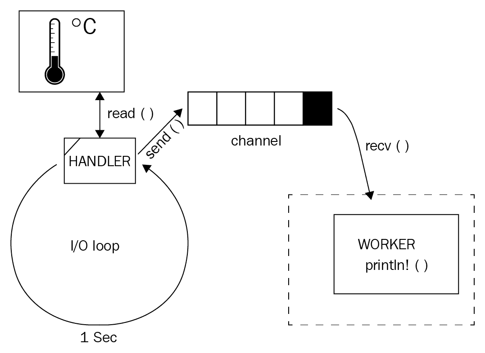

# 系统编程变得简单

Rust 最初被设想为与 C（以及可能 C++）一样的系统编程语言。尽管其吸引力导致了该领域之外的重大增长（有点像 C/C++），但仍有许多特性显著地简化了低级项目的工作。我们怀疑新颖性方面（以及强大的编译器、错误信息和社区）导致了该领域非常有趣的项目——例如操作系统。其中之一是 intermezzOS（[`intermezzos.github.io/`](https://intermezzos.github.io/)），一个用于学习编程（使用 Rust）的操作系统；另一个是 Redox OS（[`www.redox-os.org/`](https://www.redox-os.org/)），一个纯 Rust 的微内核项目。然而，这并没有结束——Rust 嵌入式工作组已经编译了一份资源列表，并在他们的 GitHub 上突出显示了一些项目（[`github.com/rust-embedded/awesome-embedded-rust`](https://github.com/rust-embedded/awesome-embedded-rust)）。

Linux 是嵌入式设备最广泛采用的操作系统，但我们试图展示这些原则，而无需您运行 Linux。为了完全实现，例如，I2C 设备驱动程序，macOS 和 Windows 用户可以使用带有 Hyper-V（[`docs.microsoft.com/en-us/virtualization/hyper-v-on-windows/`](https://docs.microsoft.com/en-us/virtualization/hyper-v-on-windows/)）、VirtualBox（[`www.virtualbox.org/`](https://www.virtualbox.org/））或 Parallels（[https://www.parallels.com/](https://www.parallels.com/））的虚拟机，或者租用云上的机器（[https://azure.microsoft.com/en-us/](https://azure.microsoft.com/en-us/））。除了第一个菜谱外，本章中的菜谱可以在各种操作系统上运行。

这个列表真正令人惊叹，我们的目标是让您能够开始构建嵌入式驱动程序并将它们跨编译到各种 CPU 架构。考虑到这一点，本章涵盖了以下主题：

+   跨平台编译 Rust

+   实现设备驱动程序

+   从这些驱动程序中读取

# 跨平台编译 Rust

意想不到的是，实现低级项目更具挑战性的方面之一是跨编译。多亏了其 LLVM 基础，`rustc`为不同的 CPU 架构提供了大量的工具链。然而，跨编译一个应用程序意味着它的（本地）依赖也必须适用于这个 CPU 架构。这对于小型项目来说是一个挑战，因为它需要在架构之间进行大量的版本管理，并且随着每个新要求的增加而变得越来越复杂。这就是为什么已经出现了几个与这个问题相关的工具。在本菜谱中，我们将探索一些工具并学习如何使用它们。

# 准备工作

这个菜谱非常特定于平台；在撰写本文时，在 Linux 之外的平台交叉编译 Rust 是一项棘手的工作。在 macOS 和 Windows 上，你可以使用带有 Hyper-V ([https://docs.microsoft.com/en-us/virtualization/hyper-v-on-windows/](https://docs.microsoft.com/en-us/virtualization/hyper-v-on-windows/))、VirtualBox ([`www.virtualbox.org/`](https://www.virtualbox.org/)) 或 Parallels ([`www.parallels.com/`](https://www.parallels.com/)) 的虚拟机，或者从你最喜欢的云服务提供商那里租用一台机器（[`azure.microsoft.com/en-us/`](https://azure.microsoft.com/en-us/))。

Windows 10 上的 **Windows 子系统 for Linux**（**WSL**）在撰写本文时不支持 Docker。可能存在绕过此限制的方法，但我们将把所需的调整留给读者。如果你找到一个解决方案，请确保在我们的 GitHub 仓库（[`github.com/PacktPublishing/Rust-Programming-Cookbook`](https://github.com/PacktPublishing/Rust-Programming-Cookbook)）上分享它。

然后，安装 Docker ([`docs.docker.com/install/`](https://docs.docker.com/install/)) 并确保你可以不使用 **`sudo`** ([`docs.docker.com/install/linux/linux-postinstall/`](https://docs.docker.com/install/linux/linux-postinstall/)) 来继续。

# 如何做到这一点...

在 Docker 可用的情况下，按照以下步骤进行交叉编译到多个目标：

1.  使用 `cargo new cross-compile` 创建一个用于二进制可执行文件的项目，并使用 VS Code 打开文件夹。

1.  打开 `src/main.rs` 并将默认内容替换为以下内容：

```rs
#[cfg(target_arch = "x86")]
const ARCH: &str = "x86";

#[cfg(target_arch = "x86_64")]
const ARCH: &str = "x64";

#[cfg(target_arch = "mips")]
const ARCH: &str = "mips";

#[cfg(target_arch = "powerpc")]
const ARCH: &str = "powerpc";

#[cfg(target_arch = "powerpc64")]
const ARCH: &str = "powerpc64";

#[cfg(target_arch = "arm")]
const ARCH: &str = "ARM";

#[cfg(target_arch = "aarch64")]
const ARCH: &str = "ARM64";

fn main() {
    println!("Hello, world!");
    println!("Compiled for {}", ARCH);
}
```

1.  使用 `cargo run` 来查看它是否工作以及你所在的架构：

```rs
$ cargo run
   Compiling cross-compile v0.1.0 (Rust-Cookbook/Chapter09/cross-
   compile)
   Finished dev [unoptimized + debuginfo] target(s) in 0.25s
   Running `target/debug/cross-compile`
   Hello, world!
   Compiled for x64
```

1.  让我们进行一些交叉编译。首先，使用 `cargo install cross` 安装一个名为 cross 的工具：

```rs
$ cargo install cross 
   Updating crates.io index
   Installing cross v0.1.14
   Compiling libc v0.2.60
   Compiling cc v1.0.38
   Compiling cfg-if v0.1.9
   Compiling rustc-demangle v0.1.15
   Compiling semver-parser v0.7.0
   Compiling rustc-serialize v0.3.24
   Compiling cross v0.1.14
   Compiling lazy_static v0.2.11
   Compiling semver v0.9.0
   Compiling semver v0.6.0
   Compiling rustc_version v0.2.3
   Compiling backtrace-sys v0.1.31
   Compiling toml v0.2.1
   Compiling backtrace v0.3.33
   Compiling error-chain v0.7.2
    Finished release [optimized] target(s) in 15.64s
   Replacing ~/.cargo/bin/cross
    Replaced package `cross v0.1.14` with `cross v0.1.14` 
    (executable `cross`)
$ cross --version
cross 0.1.14
cargo 1.36.0 (c4fcfb725 2019-05-15)
```

1.  如 `rust-cross` ([`github.com/rust-embedded/cross`](https://github.com/rust-embedded/cross)) 仓库中所述，启动 Docker 守护进程以运行 `ARMv7` 的交叉构建：

```rs
$ sudo systemctl start docker
$ cross build --target armv7-unknown-linux-gnueabihf -v
+ "rustup" "target" "list"
+ "cargo" "fetch" "--manifest-path" "/home/cm/workspace/Mine/Rust-Cookbook/Chapter09/cross-compile/Cargo.toml"
+ "rustc" "--print" "sysroot"
+ "docker" "run" "--userns" "host" "--rm" "--user" "1000:1000" "-e" "CARGO_HOME=/cargo" "-e" "CARGO_TARGET_DIR=/target" "-e" "USER=cm" "-e" "XARGO_HOME=/xargo" "-v" "/home/cm/.xargo:/xargo" "-v" "/home/cm/.cargo:/cargo" "-v" "/home/cm/workspace/Mine/Rust-Cookbook/Chapter09/cross-compile:/project:ro" "-v" "/home/cm/.rustup/toolchains/stable-x86_64-unknown-linux-gnu:/rust:ro" "-v" "/home/cm/workspace/Mine/Rust-Cookbook/Chapter09/cross-compile/target:/target" "-w" "/project" "-it" "japaric/armv7-unknown-linux-gnueabihf:v0.1.14" "sh" "-c" "PATH=$PATH:/rust/bin \"cargo\" \"build\" \"--target\" \"armv7-unknown-linux-gnueabihf\" \"-v\""
   Compiling cross-compile v0.1.0 (/project)
     Running `rustc --edition=2018 --crate-name cross_compile src/main.rs --color always --crate-type bin --emit=dep-info,link -C debuginfo=2 -C metadata=a41129d8970184cc -C extra-filename=-a41129d8970184cc --out-dir /target/armv7-unknown-linux-gnueabihf/debug/deps --target armv7-unknown-linux-gnueabihf -C linker=arm-linux-gnueabihf-gcc -C incremental=/target/armv7-unknown-linux-gnueabihf/debug/incremental -L dependency=/target/armv7-unknown-linux-gnueabihf/debug/deps -L dependency=/target/debug/deps`
    Finished dev [unoptimized + debuginfo] target(s) in 0.25s
```

1.  如果你有一台 Raspberry Pi 2（或更高版本），你可以在那里运行二进制文件：

```rs
$ scp target/armv7-unknown-linux-gnueabihf/debug/cross-compile alarm@10.0.0.171:~
cross-compile 100% 2410KB 10.5MB/s 00:00
$ ssh alarm@10.0.0.171
Welcome to Arch Linux ARM

     Website: http://archlinuxarm.org
       Forum: http://archlinuxarm.org/forum
         IRC: #archlinux-arm on irc.Freenode.net
Last login: Sun Jul 28 09:07:57 2019 from 10.0.0.46
$ ./cross-compile 
Hello, world!
Compiled for ARM
```

那么，`rust-cross` 是如何编译代码的？为什么使用 Docker？让我们看看它是如何工作的。

# 它是如何工作的...

在这个菜谱中，我们正在创建一个简单的二进制文件（*步骤 1* 和 *步骤 2*），它具有条件编译以匹配目标架构，以便查看它是否工作。*步骤 3* 应该显示你的架构（通常是 `x64` 或 `x86_64`）；我们在 *步骤 4* 中安装交叉编译工具包，尝试在 Raspberry Pi 2 及以上版本上运行（*步骤 5*）。编译二进制文件后，我们将它传输到设备（ARM 二进制文件在 `x86_64` 指令集上无法运行）以执行（*步骤 6*）。

QEMU，一个流行的虚拟化框架，也支持模拟 ARM 指令，因此不需要严格的要求。查看他们的维基百科（[`wiki.qemu.org/Documentation/Platforms/ARM`](https://wiki.qemu.org/Documentation/Platforms/ARM)）以了解更多信息。

如果你感兴趣了解更多关于交叉编译应用程序的细节，请继续阅读。如果不感兴趣，请随意跳到下一个菜谱。

# 还有更多...

交叉编译是一个非常具体的过程，其中以下所有内容都必须匹配：

+   CPU 指令集，即汇编指令

+   用于链接的兼容库（例如，标准库）

+   二进制布局

+   兼容的工具链（编译器、链接器）

多亏了 LLVM 的架构和 GNU 编译器集合，我们不必过多担心 CPU 指令集，因为它大部分默认提供，这也是为什么它在 Windows 上运行有些棘手的原因。正如我们在第七章中看到的许多配方中，*将 Rust 与其他语言集成*，Windows 和 macOS 使用不同的工具链，这使得为其他 CPU 指令集编译变得更加困难。我们的感觉是，如今在虚拟化环境中工作比在本地设置一切要容易得多。

如果你使用 Fedora 或任何其他启用了 SELinux 的分发版，交叉构建可能会因为权限错误而失败。目前，解决方案是禁用 SELinux（`sudo setenforce 0`），但修复正在进行中 ([`github.com/rust-embedded/cross/issues/112`](https://github.com/rust-embedded/cross/issues/112))）。

考虑到目标工具链，`rustup` 允许我们快速安装其他目标（例如，`rustup target add armv7-unknown-linux-gnueabihf`），然而一些其他方面（例如，C 标准库 ([`www.gnu.org/software/libc/`](https://www.gnu.org/software/libc/)))）仍然需要本地安装。随着可用目标数量的增加，管理本地库的数量将变成一项全职工作（在这里我们完全不考虑各种库版本）。

为了控制这些依赖项、版本以及更多内容，`rust-cross` ([`github.com/rust-embedded/cross#usage`](https://github.com/rust-embedded/cross#usage))（以及其他 ([`github.com/dlecan/rust-crosscompiler-arm`](https://github.com/dlecan/rust-crosscompiler-arm)))），使用预先准备了一套基本库的 Docker 容器。通常，这些容器可以定制 ([`github.com/rust-embedded/cross#custom-docker-images`](https://github.com/rust-embedded/cross#custom-docker-images))，以添加任何你为你的用例所需的证书、配置、库等。

拥有这些知识后，我们可以继续下一个配方。

# 创建 I2C 设备驱动程序

在 Linux 中与设备通信发生在不同的层级。驱动程序最基本的一层是内核模块。这些模块除了其他功能外，对操作系统拥有无限制的访问权限，并在必要时通过如块设备等接口为用户提供访问权限。这就是 I2C ([`learn.sparkfun.com/tutorials/i2c/all`](https://learn.sparkfun.com/tutorials/i2c/all)) 驱动程序提供 `as /dev/i2c-1` 总线（例如）的地方，您可以向其写入和从中读取。使用 Rust，我们可以使用这个接口为连接到该总线的传感器设备创建一个驱动程序。让我们看看它是如何工作的。

# 如何做到这一点...

设备驱动程序可以通过几个步骤实现：

1.  创建一个二进制项目：`cargo new i2cdevice-drivers`

1.  在 VS Code 中打开文件夹，并将一些代码添加到 `src/main.rs` 文件中：

```rs
mod sensor;

use sensor::{Bmx42Device, RawI2CDeviceMock, Thermometer};
use std::thread::sleep;
use std::time::Duration;

fn main() {
    let mut device = Bmx42Device::new(RawI2CDeviceMock::
     new("/dev/i2c-1".into(), 0x5f)).unwrap();
    let pause = Duration::from_secs(1);
    loop {
        println!("Current temperature {} °C", 
         device.temp_celsius().unwrap());
        sleep(pause);
    }
}
```

1.  接下来，我们将实现实际的传感器驱动程序。创建一个名为 `src/sensor.rs` 的文件来实现传感器驱动程序的各个方面。让我们先设置一些基本内容：

```rs
use std::io;
use rand::prelude::*;

pub trait Thermometer {
    fn temp_celsius(&mut self) -> Result<f32>;
}

type Result<T> = std::result::Result<T, io::Error>;
```

1.  现在，我们添加一个模拟设备来表示总线系统：

```rs
#[allow(dead_code)]
pub struct RawI2CDeviceMock {
    path: String,
    device_id: u8,
}

impl RawI2CDeviceMock {
    pub fn new(path: String, device_id: u8) -> RawI2CDeviceMock {
        RawI2CDeviceMock {
            path: path,
            device_id: device_id,
        }
    }

    pub fn read(&self, register: u8) -> Result<u8> {
        let register = register as usize;
        if register == Register::Calib0 as usize {
            Ok(1_u8)
        } else { // register is the data register
            Ok(random::<u8>())
        }
    }
}
```

1.  接下来，我们实现用户实际看到的传感器代码：

```rs
enum Register {
    Calib0 = 0x00,
    Data = 0x01,
}

pub struct Bmx42Device {
    raw: RawI2CDeviceMock,
    calibration: u8,
}

impl Bmx42Device {
    pub fn new(device: RawI2CDeviceMock) -> Result<Bmx42Device> {
        let calib = device.read(Register::Calib0 as u8)?;
        Ok(Bmx42Device {
            raw: device,
            calibration: calib
        })
    }
}
```

1.  为了将传感器的行为封装到适当的函数中，让我们实现我们在 `sensor.rs` 顶部创建的 `Thermometer` 特性。将原始数据转换为可用的温度通常在手册或技术规范中说明：

```rs
impl Thermometer for Bmx42Device {
    fn temp_celsius(&mut self) -> Result<f32> {
        let raw_temp = self.raw.read(Register::Data as u8)?;
        Ok(((raw_temp as i8) << (self.calibration as i8)) as f32 / 
        10.0)
    }
}
```

1.  我们还需要调整 `Cargo.toml` 配置以添加随机数生成器包：

```rs
[dependencies]
rand = "0.5"
```

1.  如同往常，我们想看到程序的实际运行情况。使用 `cargo run` 来查看它打印出我们假装的温度（通过按 *Ctrl + C* 停止）：

```rs
$  cargo run
   Compiling libc v0.2.60
   Compiling rand_core v0.4.0
   Compiling rand_core v0.3.1
   Compiling rand v0.5.6
   Compiling i2cdevice-drivers v0.1.0 (Rust-
   Cookbook/Chapter09/i2cdevice-drivers)
    Finished dev [unoptimized + debuginfo] target(s) in 2.95s
     Running `target/debug/i2cdevice-drivers`
Current temperature -9.4 °C
Current temperature 0.8 °C
Current temperature -1.2 °C
Current temperature 4 °C
Current temperature -3 °C
Current temperature 0.4 °C
Current temperature 5.4 °C
Current temperature 11.6 °C
Current temperature -5.8 °C
Current temperature 0.6 °C
^C⏎
```

实现之后，你可能想知道为什么以及它是如何工作的。让我们看看。

# 它是如何工作的...

在这个菜谱中，我们展示了如何实现一个在总线（如 I2C ([`learn.sparkfun.com/tutorials/i2c/all`](https://learn.sparkfun.com/tutorials/i2c/all)））上可用的非常简单的设备驱动程序。由于 I2C 是一个相对复杂的总线（这使得实现驱动程序变得简单），驱动程序实现了一个用于读取和写入操作的协议，并将它们封装在一个良好的 API 中。在这个菜谱中，我们没有实际使用 I2C 总线包来提供 `struct` 设备，因为这会影响操作系统兼容性。

在 *步骤 2* 中，我们创建主循环以非常简单的方式从传感器读取（检查 *高效读取硬件传感器* 菜谱），使用睡眠来控制读取速度。按照典型方式，我们通过创建使用 *nix 路径（`/dev/i2c-1`）和设备的硬件地址（由制造商定义）的块设备抽象来实例化驱动程序。

在 *步骤 3* 中，我们添加了一些构造来使我们的生活更轻松和更有结构：如果传感器上有更多设备或功能，`Thermometer` 特性是打包能力的良好实践。抽象 `Result` 是减少代码冗余的常见策略。

只有在*第 4 步*中，我们为总线创建了一个模拟，提供了对单个字节的读写功能。由于我们实际上并没有从总线读取或写入，这些函数读取随机数并将它们写入无处。为了了解这在现实生活中是如何完成的（例如，一次读取多个字节），请查看真实的`i2cdev` crate ([`github.com/rust-embedded/rust-i2cdev`](https://github.com/rust-embedded/rust-i2cdev))）。到目前为止，我们只让它在工作在 Linux 上，然而。

*第 5 步*创建抽象 API。每次我们从零开始实现驱动程序时，我们都是通过将特定的二进制命令写入预定义的寄存器来与设备通信。这可能是为了改变设备的状态，改变采样率，或者请求特定的测量（如果设备有多个传感器，并在实际设备上触发硬件过程）。在这项写入操作之后，我们可以读取指定的数据寄存器（所有地址和值都可以在设备的规范中找到），将值转换为可用的东西（如°C）。这涉及到像移位位、读取几个校准寄存器以及乘以溢出等事情。这样的过程因传感器而异。对于现实生活中的例子，请查看`bmp085`设备驱动程序([`github.com/celaus/rust-bmp085`](https://github.com/celaus/rust-bmp085))，它展示了在 Rust 中的实际驱动程序实现，并观看以下 URL 上的驱动程序演讲：[`www.youtube.com/watch?v=VMaKQ8_y_6s`](https://www.youtube.com/watch?v=VMaKQ8_y_6s)。

接下来的步骤展示了如何实现并从设备获取实际温度，并从原始设备模拟提供的随机数创建一个可用的数字。这应该是对通常如何使用原始值以将其转换为可用形式的简化。

在最后一步，我们看到它是如何工作的，并验证温度在现实值中通常分布得很好，尽管变化率令人恐惧。

让我们继续前进，看看我们如何能比使用纯循环更有效地读取这些传感器值。

# 高效读取硬件传感器

创建基于 I/O 的应用程序很棘手——它们必须尽可能快地、尽可能频繁地提供对资源的独占访问。这是一个资源调度问题。解决这类问题的基本方法是处理和排队请求，就像读取传感器值一样。

# 如何做到这一点...

您可以使用 I/O 循环在几个步骤中高效地读取事物：

1.  创建一个二进制项目：`cargo new reading-hardware`。

1.  在 VS Code 中打开文件夹，创建一个`src/sensor.rs`文件来添加来自*创建 I2C 设备驱动程序*菜谱的代码：

```rs
use std::io;
use rand::prelude::*;

type Result<T> = std::result::Result<T, io::Error>;

pub trait Thermometer {
    fn temp_celsius(&mut self) -> Result<f32>;
}

enum Register {
    Calib0 = 0x00,
    Data = 0x01,
}
```

1.  通常，原始设备抽象由硬件协议驱动程序提供。在我们的例子中，我们模拟了这样一个类型：

```rs
#[allow(dead_code)]
pub struct RawI2CDeviceMock {
    path: String,
    device_id: u8,
}

impl RawI2CDeviceMock {
    pub fn new(path: String, device_id: u8) -> RawI2CDeviceMock {
        RawI2CDeviceMock {
            path: path,
            device_id: device_id,
        }
    }

    pub fn read(&self, register: u8) -> Result<u8> {
        let register = register as usize;
        if register == Register::Calib0 as usize {
            Ok(1_u8)
        } else { // register is the data register
            Ok(random::<u8>())
        }
    }
}
```

1.  为了适当的封装，创建一个`struct`来包装原始设备是个好主意：

```rs
pub struct Bmx42Device {
    raw: RawI2CDeviceMock,
    calibration: u8,
}

impl Bmx42Device {
    pub fn new(device: RawI2CDeviceMock) -> Result<Bmx42Device> {
        let calib = device.read(Register::Calib0 as u8)?;
        Ok(Bmx42Device {
            raw: device,
            calibration: calib
        })
    }
}
```

1.  以下是对 `Thermometer` 特性的实现：

```rs
impl Thermometer for Bmx42Device {
    fn temp_celsius(&mut self) -> Result<f32> {
        let raw_temp = self.raw.read(Register::Data as u8)?;
        // converts the result into something usable; from the 
        // specification
        Ok(((raw_temp as i8) << (self.calibration as i8)) as f32 / 
         10.0)
    }
}
```

1.  现在打开 `src/main.rs` 并将默认内容替换为更有趣的内容。让我们从导入和辅助函数开始：

```rs
mod sensor;
use tokio::prelude::*;
use tokio::timer::Interval;

use sensor::{Bmx42Device, RawI2CDeviceMock, Thermometer};
use std::time::{Duration, UNIX_EPOCH, SystemTime, Instant};
use std::thread;

use std::sync::mpsc::channel;

fn current_timestamp_ms() -> u64 {
    SystemTime::now().duration_since(UNIX_EPOCH).unwrap().as_secs()
}

#[derive(Debug)]
struct Reading {
    timestamp: u64,
    value: f32
}
```

1.  接下来，我们将添加实际的事件循环和 `main` 函数：

```rs

fn main() {
    let mut device = Bmx42Device::new(RawI2CDeviceMock
     ::new("/dev/i2c-1".into(), 0x5f)).unwrap();

    let (sx, rx) = channel();

    thread::spawn(move || {
        while let Ok(reading) = rx.recv() {

            // or batch and save/send to somewhere
            println!("{:?}", reading);
        }
    });
    let task = Interval::new(Instant::now(), Duration
     ::from_secs(1))
        .take(5)
        .for_each(move |_instant| {
            let sx = sx.clone();
            let temp = device.temp_celsius().unwrap();
            let _ = sx.send(Reading {
                timestamp: current_timestamp_ms(),
                value: temp
            });
            Ok(())
        })
        .map_err(|e| panic!("interval errored; err={:?}", e));

    tokio::run(task);
}
```

1.  为了使这成为可能，我们应该在 `Cargo.toml` 中添加一些依赖项：

```rs
[dependencies]
tokio = "0.1"
tokio-timer = "0.2"
rand = "0.5"
```

1.  为了完成菜谱，我们还希望看到它运行并打印出一些模拟的读数：

```rs
$ cargo run
    Finished dev [unoptimized + debuginfo] target(s) in 0.04s
     Running `target/debug/reading-hardware`
Reading { timestamp: 1564762734, value: -2.6 }
Reading { timestamp: 1564762735, value: 6.6 }
Reading { timestamp: 1564762736, value: -3.8 }
Reading { timestamp: 1564762737, value: 11.2 }
Reading { timestamp: 1564762738, value: 2.4 }
```

太好了！让我们看看这是如何工作的。

# 它是如何工作的...

与我们在 *创建 I2C 设备驱动程序* 菜谱中创建的简单忙等待循环不同，我们现在使用一个 `tokio-rs` 事件流（实际上是一个异步迭代器），我们可以在其上注册一个处理程序。让我们看看这个更有效的结构是如何实现的。

首先，在 *步骤 2* 中，我们重新创建了 *创建 I2C 设备驱动程序* 菜谱中的传感器代码，以便有一个可用的传感器。简而言之，该代码通过随机数生成器模拟了一个连接到 I2C 的温度传感器，以展示总线连接的设备驱动程序是如何工作的。

在 *步骤 3* 中，我们正在准备使用驱动程序读取一个值并将其通过通道发送到工作线程。因此，我们创建了一个 `Reading` 结构体，它保存了在某个时间戳的传感器读数。只有在 *步骤 4* 中，我们才创建 `tokio-rs` 任务运行器和流。这个流是一个表示需要处理的异步事件的迭代器的构造。每个事件对应于每秒一个定时间隔，从现在开始（`Instant::now()`），由于我们不想在这个菜谱中无限期运行，所以我们限制事件的数量为五个（`.take(5)`）——就像我们处理任何其他迭代器一样。`tokio::run()` 接收这个流，并在其事件循环和线程池上开始执行事件，并在有事件要执行时阻塞。

在并发应用程序中，使用类似 `std::thread::sleep` 的做法被认为是一种反模式。为什么？因为它阻止了整个线程在睡眠期间做任何事。实际上，线程暂停，操作系统的 CPU 调度器会进行上下文切换以执行其他任务。只有在指定时间至少过去之后，调度器才会将线程转回活动模式以继续工作。驱动程序有时需要一些等待时间（几毫秒进行测量），这时通常会使用 `sleep`。由于设备只能从单个线程访问，因此在这里使用 `sleep()` 是合适的。

`for_each`闭包实现了每个事件的处理器，并接收一个`Instant`实例作为参数。在闭包内部，我们从传感器读取数据并通过通道([`doc.rust-lang.org/std/sync/mpsc/`](https://doc.rust-lang.org/std/sync/mpsc/))发送到我们之前创建的接收线程——这是我们在第四章中看到的模式，“无畏并发”。虽然我们可以在处理器中立即处理数据，但将其推入队列进行处理使我们能够创建批次并最小化流延迟。这在需要完成处理所需时间未知、非常大（即包括 Web 请求或其他移动部件）或需要大量错误处理（如指数退避([`docs.microsoft.com/en-us/azure/architecture/patterns/retry`](https://docs.microsoft.com/en-us/azure/architecture/patterns/retry)))的情况下尤为重要。这不仅可以将关注点分离并简化维护，还允许我们更精确地执行读取操作。为了可视化这一点，让我们看看*步骤 4*的整体图景：



在*步骤 5*中，我们添加所需的依赖项，而*步骤 6*显示了输出——注意时间戳以确认它确实每秒触发一次，并且流按出现的顺序进行处理。

这标志着我们对设备驱动程序的深入探索的结束；如果这是你第一次涉足这个领域，你现在已经了解了如何解耦读取传感器数据与处理它；设备驱动程序最初是如何构建的；一旦准备就绪，如何将它们部署到目标设备上。在下一章中，我们将回到更高的抽象层次，并专注于更实用的食谱。
