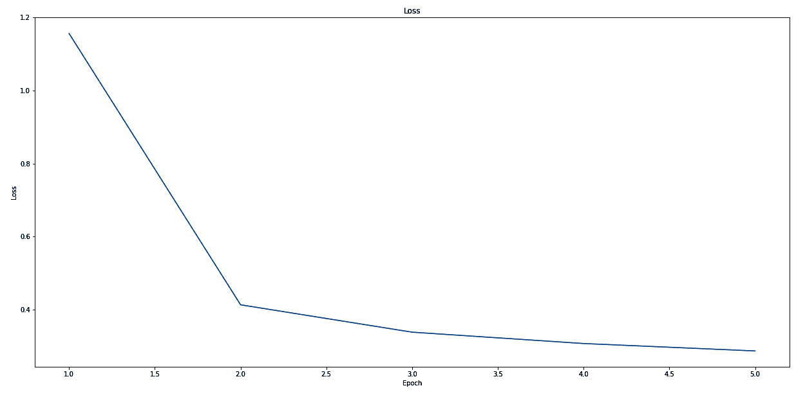

# 第十章：Rust 的实际应用

即使已经学习了 Rust 的九个章节，我们仍然缺少使应用程序易于使用的部分。Rust 生态系统中的许多 crate 在不同的领域提供了重要的功能，并且根据应用程序类型，您可能需要几个额外的 crate。在本章中，我们将查看 Rust 标准库和公共 crate 仓库中的各种部分，以使我们的应用程序开发更快、更简单，并且在一般情况下更高效。尽管本章重点在于命令行应用程序，但我们认为其中许多配方同样适用于其他类型，如 Web 服务器或共享实用库。您可以期待学习如何创建与操作系统良好集成的可使用 Rust 程序，并以用户熟悉和期望的方式运行。此外，我们还为希望使用 Rust 进行工作的机器学习爱好者添加了一个配方。

这是我们将涵盖的完整列表：

+   随机数生成

+   文件 I/O

+   动态 JSON

+   正则表达式

+   文件系统访问

+   命令行参数

+   管道输入和输出

+   网络请求

+   使用最先进的机器学习库

+   记录日志

+   启动子进程

# 生成随机数

随机数生成是一种基本技术，我们每天都在使用——加密、模拟、近似、测试、数据选择等。每个应用都有其随机数生成器的特定要求（[`xkcd.com/221/`](https://xkcd.com/221/)）。虽然加密需要一个尽可能接近真实随机的生成器（[`www.random.org/`](https://www.random.org/)），但模拟、测试和数据选择可能需要从某个分布中抽取可重复的样本。

由于打印限制，我们不得不将原始表情符号替换为字符和数字。查看此书的 GitHub 仓库以获取完整版本。

由于 Rust 标准库中没有随机生成器，对于许多项目来说，`rand`包是最佳选择。让我们看看如何使用它。

# 如何操作...

我们可以在几个步骤中获取随机性：

1.  打开终端，使用`cargo new random-numbers --lib`创建一个新的项目。使用 VS Code 打开项目目录。

1.  首先，我们需要在`Cargo.toml`中将`rand`包添加为依赖项。打开它并添加以下内容：

```rs
[dependencies]
rand = {version = "0.7", features = ["small_rng"]}
rand_distr = "0.2"
rand_pcg = "0.2"
```

1.  由于我们正在探索如何使用`rand`库，我们将向测试模块添加并实现三个测试。让我们首先将`src/lib.rs`中的默认内容替换为一些必需的导入：

```rs
#[cfg(test)]
mod tests {
    use rand::prelude::*;
    use rand::SeedableRng;
    use rand_distr::{Bernoulli, Distribution, Normal, Uniform};
}
```

1.  在导入下面（在`mod tests`作用域内），我们将添加第一个测试来检查**随机数生成器**（**RNGs**）和**伪随机数生成器**（**PRNGs**）的工作原理。为了获得可预测的随机数，我们使每个生成器基于第一个，它使用数组字面量进行初始化：

```rs
    #[test]
    fn test_rngs() {
        let mut rng: StdRng = SeedableRng::from_seed([42;32]);
        assert_eq!(rng.gen::<u8>(), 152);

        let mut small_rng = SmallRng::from_rng(&mut rng).unwrap();
        assert_eq!(small_rng.gen::<u8>(), 174);

        let mut pcg = rand_pcg::Pcg32::from_rng(&mut rng).unwrap();
        assert_eq!(pcg.gen::<u8>(), 135);
    }
```

1.  在了解了常规（P）RNGs 之后，我们可以继续到更复杂的内容。我们是否可以使用这些 RNGs 来操作序列？让我们添加这个测试，它使用伪随机数生成器（PRNGs）来进行洗牌并选择结果：

```rs
    #[test]
    fn test_sequences() {
        let mut rng: StdRng = SeedableRng::from_seed([42;32]);

        let emoji = "ABCDEF".chars();
        let chosen_one = emoji.clone().choose(&mut rng).unwrap();
        assert_eq!(chosen_one, 'B');

        let chosen = emoji.choose_multiple(&mut rng, 3);
        assert_eq!(chosen, ['F', 'B', 'E']);

        let mut three_wise_monkeys = vec!['1', '2', '3'];
        three_wise_monkeys.shuffle(&mut rng);
        three_wise_monkeys.shuffle(&mut rng);
        assert_eq!(three_wise_monkeys, ['1', '3', '2']);

        let mut three_wise_monkeys = vec!['1', '2', '3'];
        let partial = three_wise_monkeys.partial_shuffle(&mut rng, 2); 
        assert_eq!(partial.0, ['3', '2']);
    }
```

1.  如我们在本食谱的介绍中所述，随机数生成器（RNGs）可以遵循一个分布。现在，让我们向测试模块添加另一个测试，使用`rand` crate 来绘制遵循分布的随机数：

```rs
    const SAMPLES: usize = 10_000;

    #[test]
    fn test_distributions() {
        let mut rng: StdRng = SeedableRng::from_seed([42;32]);

        let uniform = Uniform::new_inclusive(1, 100);
        let total_uniform: u32 = uniform.sample_iter(&mut rng)
                                        .take(SAMPLES).sum();
        assert!((50.0 - (total_uniform as f32 / (
                 SAMPLES as f32)).round()).abs() <= 2.0);

        let bernoulli = Bernoulli::new(0.8).unwrap();
        let total_bernoulli: usize = bernoulli
            .sample_iter(&mut rng)
            .take(SAMPLES)
            .filter(|s| *s)
            .count();

        assert_eq!(
            ((total_bernoulli as f32 / SAMPLES as f32) * 10.0)
                .round()
                .trunc(),
            8.0
        );

        let normal = Normal::new(2.0, 0.5).unwrap();
        let total_normal: f32 = normal.sample_iter(&mut rng)
                                      .take(SAMPLES).sum();
        assert_eq!((total_normal / (SAMPLES as f32)).round(), 2.0);
    }
```

1.  最后，我们可以运行测试以查看测试输出是否为正结果：

```rs
$ cargo test
 Compiling random-numbers v0.1.0 (Rust-Cookbook/Chapter10/random-numbers)
 Finished dev [unoptimized + debuginfo] target(s) in 0.56s
     Running target/debug/deps/random_numbers-df3e1bbb371b7353

running 3 tests
test tests::test_sequences ... ok
test tests::test_rngs ... ok
test tests::test_distributions ... ok

test result: ok. 3 passed; 0 failed; 0 ignored; 0 measured; 0 filtered out

   Doc-tests random-numbers

running 0 tests

test result: ok. 0 passed; 0 failed; 0 ignored; 0 measured; 0 filtered out
```

让我们看看幕后是如何操作的。

# 它是如何工作的……

自 2018 年以来，`rand` crate 经历了几个主要版本的修订，并且有几件事情发生了变化。特别是，crate 现在组织方式不同（[`rust-random.github.io/book/guide-gen.html`](https://rust-random.github.io/book/guide-gen.html)），包含几个伴随 crate，这些 crate 包含对较少使用部分的实现。

这就是为什么在*步骤 2*中，我们不仅仅导入一个 crate，尽管它们都共享一个 GitHub 仓库（[`github.com/rust-random/rand`](https://github.com/rust-random/rand)）。这种分割的原因可能是为了与该领域的不同要求兼容。

简而言之，RNGs 代表的是一个基于其前驱动态确定的数字序列。那么第一个数字是什么呢？它被称为**种子**，可以是某个字面量（用于测试的可重复性）或者尽可能接近真正的随机性（当不进行测试时）。

流行的种子包括自 1970 年 1 月 1 日以来的秒数、操作系统的熵、用户输入等等。它越不可预测，就越好。

在*步骤 3*中，我们使用一些立即在*步骤 4*中使用的导入设置剩余的代码。在那里，我们开始使用不同类型的 RNGs（[`rust-random.github.io/book/guide-rngs.html`](https://rust-random.github.io/book/guide-rngs.html)）。第一个是`rand` crate 的`StdRng`，它是对（截至本文写作时）ChaCha PRNG 的抽象，出于效率和加密安全性的考虑而选择。第二个算法是 SmallRng（[`docs.rs/rand/0.7.0/rand/rngs/struct.SmallRng.html`](https://docs.rs/rand/0.7.0/rand/rngs/struct.SmallRng.html)），这是`rand`团队选择的一个 PRNG，具有很高的吞吐量和资源效率。然而，由于它很容易预测，必须仔细选择使用场景。最后一个算法（`Pcg32`）是从可用的 PRNG 列表中挑选的（[`rust-random.github.io/book/guide-rngs.html`](https://rust-random.github.io/book/guide-rngs.html)），它是作为不同 crate 的一部分提供的。

在**步骤**5 中，我们处理序列并从中选择或打乱顺序。函数包括部分打乱（即，随机选择一个子集）和原地全打乱，以及从列表中选择一个或多个元素的随机选择。请注意，这些操作的特性是以一种不依赖于实际使用的随机数生成器的方式实现的。这提供了一个非常灵活且易于使用的 API。

只有在**步骤 6**中，我们才能得到遵循分布的随机数。这些对于进行更多科学工作（如初始化向量、模拟或游戏）可能非常重要。

大多数随机数生成器的默认值是均匀分布，其中每个数字出现的可能性相同。实际上从分布中抽取样本需要一个初始化的随机数生成器，它以种子的形式提供 StdRng。断言语句（经验上）显示它确实是一个均匀分布：在进行了 10,000 次抽取后，数字的平均值几乎正好在范围的中间（+/-2）。

以下分布是伯努利分布（[`mathworld.wolfram.com/BernoulliDistribution.html`](http://mathworld.wolfram.com/BernoulliDistribution.html)）。它可以初始化为成功的概率（例如，0.8）——但通常可以想象为一系列的抛硬币。实际上，这个分布用于生成布尔值（这就是为什么我们可以根据生成的值进行过滤）。

最后，在这个测试中，我们正在创建一个正态分布的生成器（[`mathworld.wolfram.com/NormalDistribution.html`](http://mathworld.wolfram.com/NormalDistribution.html)）。这是一种在中心点（均值）周围以定义的扩散（标准差）分布随机变量的已知形式。值越接近中心，其发生的可能性就越大。在这种情况下，我们使用均值为 2.0 和标准差为 0.5 进行初始化，这意味着在进行了大量抽取之后，我们应该得到我们提供的确切均值和标准差。`assert_eq!`确认了均值。

**步骤 7**展示了测试输出——并且它工作（在撰写本文时）。

如果`rand`包的一些实现细节发生变化（例如，小版本更新），则伴随的存储库中的代码可能会失败。

要了解更多关于`rand`包的信息，请阅读这本书中的更多内容（[`rust-random.github.io/book/`](https://rust-random.github.io/book/)）。然而，如果你对如何实现伪随机数生成器并了解更多相关信息感兴趣，请查看 Packt 出版的《使用 Rust 的数据结构和算法实践》（[`www.packtpub.com/application-development/hands-data-structures-and-algorithms-rust`](https://www.packtpub.com/application-development/hands-data-structures-and-algorithms-rust)），在那里我们将深入了解。然而，由于我们已经成功地学会了使用`rand`包，我们可以继续到下一个菜谱。

# 写入和读取文件

处理文件是日常任务，有时——根据编程语言的不同——可能不合理地困难。Rust 项目团队已经解决了这个问题，并提供了易于使用的 API 来访问文件。让我们直接深入探讨。

# 准备工作

首先，使用 `cargo new file-stuff` 创建一个新的项目。现在，为了处理文件，我们需要一个用于读取和处理的文本文件。Lorem Ipsum（[`www.lipsum.com/`](https://www.lipsum.com/））是一种流行的虚拟文本，可以大规模生成，因此为了继续这个配方，使用这个生成器生成几个（200）段落，并将文本保存为根目录下的 `lorem.txt` 文件。

通过在 VS Code 中打开项目目录来完成你的准备工作。

# 如何操作...

我们只需几个步骤就可以从磁盘读取文件：

1.  由于 Rust 标准库包含了我们需要的所有基础知识，让我们直接进入 `src/main.rs` 并在那里添加导入：

```rs
use std::fs::{self, File};
use std::io::{self, BufRead, BufReader, BufWriter, Read, Seek, Write};
use std::path::Path;

const TEST_FILE_NAME: &str = "lorem.txt";
```

1.  首先，让我们处理从文件中读取。为此，我们创建一个名为 `read()` 的函数，该函数读取并从导入下的准备文件 `lorem.txt` 中提取内容：

```rs
fn read() -> io::Result<()> {
    let path = Path::new(TEST_FILE_NAME);

    let input = File::open(path)?;
    let buffered = BufReader::new(input);

    let words: Vec<usize> = buffered
        .lines()
        .map(|line| line.unwrap().split_ascii_whitespace().count())
        .collect();
    let avg_word_count = words.iter().sum::<usize>() as f32 / 
     words.len() as f32;
    println!(
        "{}: Average words per line: {:.2}",
        path.to_string_lossy(),
        avg_word_count
    );

    let mut input = File::open(path)?;
    let mut input_buffer = String::new();
    input.read_to_string(&mut input_buffer)?;

    // ... or ...

    let lorem = fs::read_to_string(path)?;
    println!(
        "{}: Length in characters : {}",
        path.to_string_lossy(),
        lorem.len()
    );
    // reset file pointer to the beginning
    input.seek(io::SeekFrom::Start(0))?; 
    println!(
        "{}: Length in bytes: {}",
        path.to_string_lossy(),
        input.bytes().count()
    );
    Ok(())
}
```

1.  接下来，我们将处理写入。在这种情况下，我们创建一个虚拟文件并以各种方式向其写入。你可以在 `src/main.rs` 中添加以下内容：

```rs
fn write() -> io::Result<()> {
    let mut path = Path::new(".").to_path_buf();

    path.push("hello.txt");

    let mut file = File::create(path)?;
    println!("Opened {:?}", file.metadata()?);

    file.write_all(b"Hello")?;

    let mut buffered = BufWriter::new(file);
    write!(buffered, " World!")?;
    write!(buffered, "\n{: >width$}", width=0x5ff)?;
    Ok(())
}
```

1.  在最后一步，我们应该在 `main` 函数中将函数组合起来：

```rs
fn main() -> io::Result<()> {
    println!("===== READ =====");
    read()?;
    println!();
    println!("===== WRITE ====");
    write()?;
    Ok(())
}
```

1.  使用 `cargo run`，我们现在可以从磁盘读取和写入以执行各种任务。在这里，我们可以观察一些关于 `lorem.txt` 文件以及我们写入的文件元数据的一般统计信息：

```rs
$ cargo run
   Compiling file-stuff v0.1.0 (Rust-Cookbook/Chapter10/file-stuff)
    Finished dev [unoptimized + debuginfo] target(s) in 0.84s
     Running `target/debug/file-stuff`
===== READ =====
lorem.txt: Average words per line: 42.33
lorem.txt: Length in characters : 57076
lorem.txt: Length in bytes: 57076

===== WRITE ====
Opened Metadata { file_type: FileType(FileType { mode: 33188 }), is_dir: false, is_file: true, permissions: Permissions(FilePermissions { mode: 33188 }), modified: Ok(SystemTime { tv_sec: 1567003873, tv_nsec: 941523976 }), accessed: Ok(SystemTime { tv_sec: 1566569294, tv_nsec: 260780071 }), created: Err(Custom { kind: Other, error: "creation time is not available on this platform currently" }) }
```

让我们看看我们在这里是如何处理文件的。

# 它是如何工作的...

在设置好项目后，我们直接进入 *步骤 1* 并提供与文件 API 一起工作的所需导入。请注意，与文件一起工作以及读取/写入文件位于两个不同的模块中：`std::fs` 用于访问，`std::io` 用于读取和写入。此外，`std::path` 模块提供了以平台无关的方式处理路径的强大且简单的方法。

*步骤 2* 提供了一个函数，展示了从我们在准备中创建的测试文件中读取数据的好几种方式。首先，我们打开文件并将 `BufReader`（[`doc.rust-lang.org/std/io/struct.BufReader.html`](https://doc.rust-lang.org/std/io/struct.BufReader.html)）的引用传递给它，这是一个缓冲读取器。虽然初始引用也允许读取数据，但 `BufReader` 以批量方式读取文件内容并从内存中提供它们。这减少了磁盘访问次数，同时显著提高了性能（与逐字节读取相比）。此外，这还允许使用 `lines()` 函数迭代行。

通过这种方式，我们可以遍历每一行，在空白处分割它，并计算结果迭代器（`.split_ascii_whitespace().count()`）。将这些数字相加，然后除以找到的行数，我们可以确定每行的平均单词数。这展示了在 Rust 中一切都可以归结为迭代器，并且只需几行代码就能创建出强大的功能。

除了读取迭代器，Rust 标准库还支持直接读取到一个大字符串中。对于这个常见任务，`fs::read_to_string()`提供了一个方便的快捷方式。然而，如果你想保留文件指针以供以后使用，`File`结构体也提供了一个`read_to_string()`函数。

由于文件指针被设置为停止读取文件的位置（在这种情况下是末尾），在进一步使用之前，我们必须使用`seek()`函数重置文件指针。例如，如果我们想读取字节而不是字符，API 也提供了一个迭代器来处理这种情况（但还有更好的方法来获取文件大小）。

*步骤 3*深入探讨了写入文件。我们首先创建一个`Path`实例（它不能被更改），因此我们将其转换为可变的`PathBuf`实例并添加一个文件名。通过调用`File::create()`，我们快速创建（覆盖）并获取文件指针。`metadata()`函数提供了关于文件的一些元信息（格式化以提高可读性）：

```rs
Metadata { 
  file_type: FileType(FileType { 
    mode: 33188 
  }), 
  is_dir: false, 
  is_file: true, 
  permissions: Permissions(FilePermissions { 
    mode: 33188 
  }), 
  modified: Ok(SystemTime { 
    tv_sec: 1567003873, 
    tv_nsec: 941523976 
  }), 
  accessed: Ok(SystemTime { 
    tv_sec: 1566569294, 
    tv_nsec: 260780071 
  }), 
  created: Err(Custom { 
    kind: Other, 
    error: "creation time is not available on this platform currently" 
  }) 
}
```

向文件写入与向控制台写入相同（例如，使用`write!()`宏），可以包含任何数据，只要它可以序列化为字节。`b"Hello"`字节字面量与`&str`切片一样有效。类似于缓冲读取，缓冲写入也通过一次只写入大块数据来提高性能。

*步骤 4*和*步骤 5*在`main`函数中将一切联系在一起，并通过运行来查看结果。

在处理文件时，没有什么令人惊讶的：API 预期是直观的，并得益于其在常见迭代器和标准化特质中的集成。我们可以愉快地继续到下一个菜谱。

# 解析无结构格式如 JSON

在我们开始之前，让我们定义当我们说结构化和无结构数据时我们指的是什么。前者，结构化数据，遵循某种模式——比如 SQL 数据库中的表模式。另一方面，无结构数据在它将包含的内容方面是不可预测的。在最极端的例子中，一篇文章的文本体可能是我们可能想到的最无结构的东西——每个句子可能根据其内容遵循不同的规则。

JSON 的可读性略好，但仍然是无结构的。一个对象可以具有各种数据类型的属性，并且两个对象不必相同。在本章中，我们将探讨一些处理 JSON（以及其他格式）的方法，当它不遵循我们可以在结构体中声明的模式时。

# 准备工作

此项目需要 Python 来运行一个小脚本。对于项目的 Python 部分，按照网站上的说明安装 Python（3.6 或 3.7，见[`www.python.org/`](https://www.python.org/)）。`python3` 命令应在终端/PowerShell 中可用。

一旦可用，使用 `cargo new dynamic-data --lib` 创建一个新的项目。使用 VS Code 打开项目目录。

# 如何做到这一点...

解析是一个多步骤的过程（但很容易做）：

1.  首先，让我们将 `serde` 及其子 crate 添加到 `Cargo.toml` 文件中。打开文件并添加以下内容：

```rs
[dependencies]
serde = "1"
serde_json ="1"
toml = "0.5"
serde-pickle = "0.5"
serde_derive = "1"
```

1.  现在，让我们使用这些 crate 并看看它们能做什么。我们通过创建测试来做到这一点，这些测试从各种格式解析相同的数据，从 JSON 开始。在 `src/lib.rs` 中，我们用以下内容替换默认的测试模块：

```rs
#[macro_use]
extern crate serde_json;

#[cfg(test)]
mod tests {
    use serde_json::Value;
    use serde_pickle as pickle;
    use std::fs::File;
    use toml;

    #[test]
    fn test_dynamic_json() {
        let j = r#"{
            "userid": 103609,
            "verified": true,
            "friendly_name": "Jason",
            "access_privileges": [
              "user",
              "admin"
            ]
        }"#;

        let parsed: Value = serde_json::from_str(j).unwrap();
        let expected = json!({
          "userid": 103609,
          "verified": true,
          "friendly_name": "Jason",
          "access_privileges": [
            "user",
            "admin"
          ]
        });
        assert_eq!(parsed, expected);

        assert_eq!(parsed["userid"], 103609);
        assert_eq!(parsed["verified"], true);
        assert_eq!(parsed["friendly_name"], "Jason");
        assert_eq!(parsed["access_privileges"][0], "user");
        assert_eq!(parsed["access_privileges"][1], "admin");
        assert_eq!(parsed["access_privileges"][2], Value::Null);
        assert_eq!(parsed["not-available"], Value::Null);
    }
}
```

1.  TOML 是一种基于文本的格式，与 JSON 和 YAML 竞争配置文件。让我们创建与之前相同的测试，但使用 TOML 而不是 JSON，并将以下代码添加到 `tests` 模块中：

```rs
    #[test]
    fn test_dynamic_toml() {
        let t = r#"
            [[user]]
            userid = 103609
            verified = true
            friendly_name = "Jason"
            access_privileges = [ "user", "admin" ]
        "#;

        let parsed: Value = toml::de::from_str(t).unwrap();

        let expected = json!({
            "user": [
                {
                    "userid": 103609,
                    "verified": true,
                    "friendly_name": "Jason",
                    "access_privileges": [
                        "user",
                        "admin"
                    ]
                }

            ]
        });
        assert_eq!(parsed, expected);

        let first_user = &parsed["user"][0];
        assert_eq!(first_user["userid"], 103609);
        assert_eq!(first_user["verified"], true);
        assert_eq!(first_user["friendly_name"], "Jason");
        assert_eq!(first_user["access_privileges"][0], "user");
        assert_eq!(first_user["access_privileges"][1], "admin");
        assert_eq!(first_user["access_privileges"][2], Value::Null);
        assert_eq!(first_user["not-available"], Value::Null);
    }
```

1.  由于最后两个是基于文本的格式，让我们看看一个二进制格式。Python 的 pickle 格式常用于序列化数据以及机器学习模型。然而，在我们能够使用 Rust 读取它之前，让我们在项目根目录中创建一个名为 `create_pickle.py` 的小 Python 脚本来创建文件：

```rs
import pickle 
import json

def main():
    val = json.loads("""{
            "userid": 103609,
            "verified": true,
            "friendly_name": "Jason",
            "access_privileges": [
              "user",
              "admin"
            ]
        }""") # load the json string as dictionary

    # open "user.pkl" to write binary data (= wb)
    with open("user.pkl", "wb") as out:
        pickle.dump(val, out) # write the dictionary

if __name__ == '__main__':
    main()
```

1.  运行 `python3 create_pickle.py` 在项目的根目录中创建一个 `user.pkl` 文件（脚本应该静默退出）。

1.  将最后一个测试添加到 `src/lib.rs` 中的 `tests` 模块，该测试解析并比较 pickle 文件的内容与预期内容：

```rs
    #[test]
    fn test_dynamic_pickle() {
        let parsed: Value = { 
            let data = File::open("user.pkl")
                       .expect("Did you run create_pickle.py?");
            pickle::from_reader(&data).unwrap()
        };

        let expected = json!({
          "userid": 103609,
          "verified": true,
          "friendly_name": "Jason",
          "access_privileges": [
            "user",
            "admin"
          ]
        });
        assert_eq!(parsed, expected);

        assert_eq!(parsed["userid"], 103609);
        assert_eq!(parsed["verified"], true);
        assert_eq!(parsed["friendly_name"], "Jason");
        assert_eq!(parsed["access_privileges"][0], "user");
        assert_eq!(parsed["access_privileges"][1], "admin");
        assert_eq!(parsed["access_privileges"][2], Value::Null);
        assert_eq!(parsed["not-available"], Value::Null);
    }
```

1.  最后，我们想看到测试运行的结果（成功）。让我们执行 `cargo test` 来查看测试结果以及我们如何能够读取来自各种来源的二进制和文本数据：

```rs
$ cargo test
 Compiling dynamic-json v0.1.0 (Rust-Cookbook/Chapter10/dynamic-data)
warning: unused `#[macro_use]` import
 --> src/lib.rs:1:1
 |
1 | #[macro_use]
 | ^^^^^^^^^^^^
 |
 = note: #[warn(unused_imports)] on by default

 Finished dev [unoptimized + debuginfo] target(s) in 1.40s
 Running target/debug/deps/dynamic_json-cf635db43dafddb0

running 3 tests
test tests::test_dynamic_json ... ok
test tests::test_dynamic_pickle ... ok
test tests::test_dynamic_toml ... ok

test result: ok. 3 passed; 0 failed; 0 ignored; 0 measured; 0 filtered out

 Doc-tests dynamic-json

running 0 tests

test result: ok. 0 passed; 0 failed; 0 ignored; 0 measured; 0 filtered out
```

让我们看看它是如何工作的。

# 它是如何工作的...

静态类型语言如 Rust，一旦确定了类型，编程就会变得非常舒适。然而，在一个不断变化的网络服务 API 的世界里，一个简单的附加属性可能导致解析错误，使得无法继续。因此，`serde`不仅支持完全自动化的解析，还能从其`Value`类型动态提取数据，包括类型解析。

在 *步骤 1* 中，我们添加了各种依赖项，所有这些依赖项都符合 `serde` 接口（位于 `serde` crate 中）——尽管它们来自不同的来源。它们的使用在 *步骤 2* 和之后进行了演示。

我们从创建一个包含`serde_json`要解析的 JSON 字符串的原始字符串开始。一旦创建了`Value`变量，我们就可以使用`json!`宏创建一个等效对象以进行比较。之后，我们调用`Value` API 来检索单个属性并检查它们的类型和内容。`Value`是一个枚举（[`docs.serde.rs/serde_json/value/enum.Value.html`](https://docs.serde.rs/serde_json/value/enum.Value.html)），它实现了一系列自动转换和检索函数，这些函数使得这些无缝的`assert_eq!`语句成为可能。如果属性或列表索引不存在，则返回`Value`的`Null`变体。

*第 3 步* 解析 TOML 格式（[`github.com/toml-lang/toml`](https://github.com/toml-lang/toml)）并将其与 JSON 输出进行比较——多亏了统一的`Value`枚举，它与*第 2 步*非常相似。主要区别在于，TOML 中的用户属性是一个列表，以展示其他列表语法（`[[this-way-to-declare-a-list-item]]`）。

在*步骤 4*和*步骤 5*中，我们准备了一个包含字典对象的 Python pickle 文件——从与*步骤 2*相同的 JSON 对象解析而来。Pickle 是一种二进制格式，这意味着我们告诉 Python 的文件 API 写入原始字节而不是编码文本。相比之下，当我们读取文件时，Rust 默认读取字节，并要求程序员提供解释（codec）如果他们关心的话。`File` API（[`doc.rust-lang.org/std/fs/struct.File.html`](https://doc.rust-lang.org/std/fs/struct.File.html)）自动返回一个（未缓冲的）`Read`对象以获取内容，我们可以直接将其传递到适当的 pickle 函数。代码的其余部分验证从 pickle 文件中读取的内容是否与其他对象相同。

我们在这里展示了读取三种类型，但`serde`支持更多。查看他们的文档以了解更多信息，但现在让我们继续下一个食谱。

# 使用正则表达式提取文本

正则表达式长期以来一直是编程的一部分，在 Rust 的上下文中，它以`ripgrep`（[`github.com/BurntSushi/ripgrep`](https://github.com/BurntSushi/ripgrep)）的形式获得了流行。`ripgrep`是 grep 的一个变体，用于搜索特定正则表达式的文件——它已被作为 VS Code 的主要部分采用，其中它为搜索引擎提供动力。原因很简单：速度（[`github.com/BurntSushi/ripgrep#quick-examples-comparing-tools`](https://github.com/BurntSushi/ripgrep#quick-examples-comparing-tools)）。

Rust 的正则表达式库已被重新实现，这可能是它优于早期实现的原因（以及因为 Rust 运行速度快）。让我们看看我们如何在 Rust 项目中利用正则表达式。

# 如何做到这一点...

让我们遵循几个步骤来探索 Rust 中的正则表达式：

1.  打开终端，使用`cargo new regex --lib`创建一个新的项目。使用 VS Code 打开项目目录。

1.  首先，我们将向`Cargo.toml`中的依赖项添加 regex crate：

```rs
[dependencies]
regex = "1"
```

1.  接下来，让我们打开`src/lib.rs`来创建一些我们可以运行的测试。首先，我们创建一个测试模块，替换任何现有的代码：

```rs
#[cfg(test)]
mod tests {

    use regex::Regex;
    use std::cell::RefCell;
    use std::collections::HashMap;
}
```

1.  正则表达式通常用于解析数据或验证数据是否符合表达式的规则。让我们在测试模块中添加一个测试来执行一些简单的解析：

```rs
    #[test]
    fn simple_parsing() {
        let re = Regex::new(r"(?P<y>\d{4})-(
                           ?P<m>\d{2})-(?P<d>\d{2})").unwrap();

        assert!(re.is_match("1999-12-01"));
        let date = re.captures("2019-02-27").unwrap();

        assert_eq!("2019", &date["y"]);
        assert_eq!("02", &date["m"]);
        assert_eq!("27", &date["d"]);

        let fun_dates: Vec<(i32, i32, i32)> = (1..12)
                  .map(|i| (2000 + i, i, i * 2)).collect();

        let multiple_dates: String = fun_dates
            .iter()
            .map(|d| format!("{}-{:02}-{:02} ", d.0, d.1, d.2))
            .collect();

        for (match_, expected) in re.captures_iter(
             &multiple_dates).zip(fun_dates.iter()) {
            assert_eq!(match_.get(1).unwrap().as_str(), 
                       expected.0.to_string());
            assert_eq!(
                match_.get(2).unwrap().as_str(),
                format!("{:02}", expected.1)
            );
            assert_eq!(
                match_.get(3).unwrap().as_str(),
                format!("{:02}", expected.2)
            );
        }
    }
```

1.  然而，正则表达式可以通过它们的模式匹配做更多的事情。另一个任务可能是替换数据：

```rs
    #[test]
    fn reshuffle_groups() {
        let re = Regex::new(r"(?P<y>\d{4})-(
                 ?P<m>\d{2})-(?P<d>\d{2})").unwrap();

        let fun_dates: Vec<(i32, i32, i32)> = (1..12)
             .map(|i| (2000 + i, i, i * 2)).collect();

        let multiple_dates: String = fun_dates
            .iter()
            .map(|d| format!("{}-{:02}-{:02} ", d.0, d.1, d.2))
            .collect();

        let european_format = re.replace_all(
                              &multiple_dates, "$d.$m.$y");

        assert_eq!(european_format.trim(), "02.01.2001 04.02.2002 
                   06.03.2003 08.04.2004 10.05.2005 
                   12.06.2006 14.07.2007 16.08.2008 
                   18.09.2009 20.10.2010 22.11.2011");
    }
```

1.  作为最后的测试，我们可以通过使用正则表达式分析数据来玩得更有趣，例如，统计电话号码的前缀：

```rs

    #[test]
    fn count_groups() {
        let counter: HashMap<String, i32> = HashMap::new();

        let phone_numbers = "+49 (1234) 45665
        +43(0)1234/45665 43
        +1 314-CALL-ME
        +44 1234 45665
        +49 (1234) 44444
        +44 12344 55538";

        let re = Regex::new(r"(\+[\d]{1,4})").unwrap();

        let prefixes = re
            .captures_iter(&phone_numbers)
            .map(|match_| match_.get(1))
            .filter(|m| m.is_some())
            .fold(RefCell::new(counter), |c, prefix| {
                {
                    let mut counter_dict = c.borrow_mut();
                    let prefix = prefix.unwrap().as_str().to_string();
                    let count = counter_dict.get(&prefix)
                                .unwrap_or(&0) + 1;
                    counter_dict.insert(prefix, count);
                }
                c
            });

        let prefixes = prefixes.into_inner();
        assert_eq!(prefixes.get("+49"), Some(&2));
        assert_eq!(prefixes.get("+1"), Some(&1));
        assert_eq!(prefixes.get("+44"), Some(&2));
        assert_eq!(prefixes.get("+43"), Some(&1));
    }
```

1.  现在，让我们使用`cargo test`运行测试，我们可以看到正则表达式表现良好：

```rs
$ cargo test
 Finished dev [unoptimized + debuginfo] target(s) in 0.02s
 Running target/debug/deps/regex-46c0a096a2a4a140

running 3 tests
test tests::count_groups ... ok
test tests::simple_parsing ... ok
test tests::reshuffle_groups ... ok

test result: ok. 3 passed; 0 failed; 0 ignored; 0 measured; 0 filtered out

 Doc-tests regex

running 0 tests

test result: ok. 0 passed; 0 failed; 0 ignored; 0 measured; 0 filtered out
```

现在我们已经知道了如何使用正则表达式，让我们来看看它们是如何工作的。

# 它是如何工作的...

在步骤 1 和步骤 2 的初始设置之后，我们首先在步骤 3 中创建一个测试模块，以及所需的依赖项。然后，步骤 4 包含第一个测试，展示了 regex crate ([`docs.rs/regex/1.2.1/regex/`](https://docs.rs/regex/1.2.1/regex/))如何处理数据的简单解析。

通过使用原始字符串字面量语法，`r"I am a raw string"`，我们编译一个新的`Regex`实例，并将其与日期字符串进行匹配。包含的字符类是跨操作系统和语言普遍使用的，包括对空白字符以及（字母）数字字符和原始字节的支撑。此外，可以使用`(?flag)`标记直接在表达式中放置标志。

第 4 步中的正则表达式由三个部分组成：`(?P<y>\d{4})-(?P<m>\d{2})-(?P<d>\d{2})`。

第一部分命名为`y`（`?P<name>`声明了一个名称）并寻找恰好四个（`{4}`）数字`\d`，它可以匹配。第二部分和第三部分各寻找两个数字，分别命名为`m`和`d`。这种命名在稍后当我们想要检索匹配时将变得很重要。在这些模式之间，我们看到一个`-`，这意味着最终的模式必须看起来像`yyyy-mm-dd`（或者更精确地说，像`1234-12-12`）才能匹配。

在测试中向下进行，这是我们要做的事情。通过准备一些正面的例子，我们可以验证一个日期（`1999-12-01`），以及通过名称提取各个部分（`2019-02-27`）。如果字符串有多个匹配，我们也可以遍历这些捕获以保持效率。在测试的情况下，我们还检查在遍历时提取的内容是否与预期值匹配。

编译正则表达式需要相当多的时间，尤其是当表达式非常大时。因此，尽可能预先编译并重用，避免在循环中编译！

*步骤 5*创建了一个类似的正则表达式，并复制了*步骤 4*测试中的`fun_dates`变量。然而，我们不仅想要提取内容，还想要替换模式，在这种情况下，将 ISO `-`表示法转换为欧洲风格的`.`表示法。由于我们在正则表达式中命名了组，我们现在也可以在替换字符串中引用这些名称。

在*步骤 6*中，我们返回到匹配，但不是简单地验证，而是提取并处理提取的数据以创建信息。假设任务是要统计电话号码中的国家代码，我们可以应用正则表达式并使用`HashMap`来跟踪每个数字的出现次数。正则表达式匹配以`+`开头，后跟一到四个数字：`(\+[\d]{1,4})`。

使用 Rust 的迭代器功能，我们提取匹配项并过滤掉任何非匹配项，然后将结果折叠到常见的`HashMap`中。`RefCell`帮助我们管理可变性，由于折叠函数必须返回累积的结果，我们必须将可变借用范围缩小以确保内存安全（编译器会告诉你）。一旦我们提取了单元格的内部值，我们就可以看到数字是什么。

这只是触及了正则表达式领域中可能任务的一些常见主题。我们强烈建议阅读文档以了解更多信息！

然而，现在我们已经尝试了一些正则表达式，我们可以继续到下一道菜谱。

# 递归搜索文件系统

ripgrep——正如我们在上一道菜谱（*使用正则表达式提取文本*）中提到的——是一个流行的 grep 引擎，它遍历文件以查找与提供的正则表达式规则匹配的任何内容。为此，不仅需要编译和匹配大量文本中的正则表达式，还需要找到这些文本。为了到达并打开这些文件，我们需要遍历文件系统的目录树。让我们来看看如何在 Rust 中实现这一点。

# 如何做到这一点...

我们可以通过以下步骤来理解递归搜索：

1.  打开一个终端，使用`cargo new filesystem`创建一个新的项目。使用 VS Code 打开项目目录。

1.  编辑`Cargo.toml`以添加一个名为`glob`的 crate 依赖项，用于遍历文件系统：

```rs
[dependencies]
glob = "0.3.0"
```

1.  在`src/main.rs`中，我们可以开始实现遍历文件系统树的函数，但首先，让我们设置导入和一个类型别名以处理 boxed 错误：

```rs
use glob;
use std::error::Error;
use std::io;
use std::path::{Path, PathBuf};

type GenericError = Box<dyn Error + Send + Sync + 'static>;
```

1.  接下来，我们将添加一个仅使用 Rust 标准库的递归`walk`函数。添加以下内容：

```rs
fn walk(dir: &Path, cb: &dyn Fn(&PathBuf), recurse: bool) -> io::Result<()> {
    for entry in dir.read_dir()? {
        let entry = entry?;
        let path = entry.path();
        if recurse && path.is_dir() {
            walk(&path, cb, true)?;
        }
        cb(&path);
    }
    Ok(())
}
```

1.  `glob`也是文件系统通配符样式的一种（例如，`*.txt`或`Cargo*`），在 Windows 和 Linux/Unix 上都能使用。在某些实现中，glob 也可以是递归的，这就是为什么我们可以使用同名 crate 来实现另一个`walk`函数：

```rs
fn walk_glob(pattern: &str, cb: &dyn Fn(&PathBuf)) -> Result<(), GenericError> {
    for entry in glob::glob(pattern)? {
        cb(&entry?);
    }
    Ok(())
}
```

1.  现在缺少的是`main`函数，用于将所有这些内容串联起来并相应地调用函数。添加以下内容：

```rs
fn main() -> Result<(), GenericError> {
    let path = Path::new("./src");
    println!("Listing '{}'", path.display());
    println!("===");
    walk(path, &|d| println!(" {}", d.display()), true)?;
    println!();

    let glob_pattern = "../**/*.rs";
    println!("Listing by glob filter: {}", glob_pattern);
    println!("===");
    walk_glob(glob_pattern, &|d| println!(" {}", d.display()))?;
    println!();

    let glob_pattern = "Cargo.*";
    println!("Listing by glob filter: {}", glob_pattern);
    println!("===");
    walk_glob(glob_pattern, &|d| println!(" {}", d.display()))?;
    Ok(())
}
```

1.  如同往常，我们希望看到它运行——使用`cargo run`递归地列出文件系统中的文件，使用我们在*第 6 步*中定义的过滤器。我们还鼓励你将路径更改为适合你系统的路径：

```rs
$ cargo run
   Compiling filesystem v0.1.0 (Rust-Cookbook/Chapter10/filesystem)
    Finished dev [unoptimized + debuginfo] target(s) in 0.25s
     Running `target/debug/filesystem`
Listing './src'
===
  ./src/main.rs

Listing by glob filter: ../**/*.rs
===
  ../command-line-args/src/main.rs
  ../dynamic-data/src/lib.rs
  ../file-stuff/src/main.rs
  ../filesystem/src/main.rs
  ../logging/src/main.rs
  ../pipes/src/main.rs
  ../random-numbers/src/lib.rs
  ../regex/src/lib.rs
  ../rusty-ml/src/main.rs
  ../sub-processes/src/main.rs
  ../web-requests/src/main.rs

Listing by glob filter: Cargo.*
===
  Cargo.lock
  Cargo.toml
```

让我们深入了解使用过滤器遍历文件系统的内部机制。

# 它是如何工作的...

遍历文件系统树并不是一个特别复杂的工作。然而，就像任何其他树遍历一样，递归地执行它要容易得多，尽管如果目录嵌套太深，总会有遇到栈溢出问题的风险。虽然迭代方法也是可能的，但实现起来要长得多，也更复杂。

在这个菜谱中，我们从*第 1 步*开始设置一切，在*第 2 步*中添加`glob` crate ([`docs.rs/glob/0.3.0/glob/`](https://docs.rs/glob/0.3.0/glob/))作为依赖项，并在*第 3 步*中最终导入所需的模块。在*第 4 步*中，我们编写了第一个`walk`函数，一个递归顺序遍历。这意味着我们在开始在该路径上执行提供的回调之前，尽可能递归地深入到第一个（按某种顺序）目录——因此我们是以节点出现的顺序处理节点的。

Rust 的`DirEntry`结构体非常强大，因为它允许通过属性访问其内容（而不是调用不同的函数）。`io::Result<()>`返回类型还允许使用`?`操作符，并在出现错误时提前结束。

*第 5 步*提供了一个类似的函数，使用`glob`迭代器。由于输入是一个模式（递归和非递归），这个模式会被解析，如果有效，则返回一个匹配的文件和文件夹路径的迭代器。然后我们可以使用这些条目调用回调函数。

在*第 6 步*中，我们使用一系列路径调用函数。第一个路径深入到`src`目录，使用递归方法列出该目录下的所有文件。第二个模式首先进入项目目录的父目录，然后递归地匹配它找到的所有`*.rs`文件（及其子目录）。在本章的例子中，你应该能看到我们编写（以及将要编写）的所有代码文件。

最后，过滤器也可以是简单的东西，匹配最后的`walk_glob()`调用中的两个`Cargo.*`文件。

现在我们知道了如何遍历文件系统，让我们继续到另一个菜谱。

# 自定义命令行参数

使用命令行参数是配置程序以运行特定任务、使用特定输入数据集或简单地输出更多信息的好方法。然而，现在查看 Linux 程序的帮助文本输出，它提供了关于它可以处理的全部标志和参数的令人印象深刻的信息。除此之外，文本以某种标准化的格式打印出来，这也是为什么这通常需要强大的库支持。

Rust 中用于处理命令行参数最受欢迎的 crate 叫做`clap`([`clap.rs/`](https://clap.rs/))，在这个菜谱中，我们正在查看如何利用其优势来创建一个有用的命令行界面。

# 如何做到这一点...

一个使用命令行参数打印目录/文件的简单程序只需要几个步骤：

1.  打开一个终端，使用`cargo new command-line-args`创建一个新的项目。使用 VS Code 打开项目目录。

1.  首先，让我们将`Cargo.toml`适配以下载`clap`并有一个更好的二进制输出名称：

```rs
[package]
name = "list"
version = "1.0.0"
authors = ["Claus Matzinger <claus.matzinger+kb@gmail.com>"]
edition = "2018"

# See more keys and their definitions at https://doc.rust-lang.org/cargo/reference/manifest.html

[dependencies]
clap = {version= "2.33", features = ["suggestions", "color"]}
```

1.  在`src/main.rs`中，我们将从导入开始：

```rs
use clap::{App, Arg, SubCommand};
use std::fs::DirEntry;
use std::path::Path;

use std::io;
```

1.  然后，我们定义一个`walk`函数，该函数递归地遍历文件系统，并在每个条目上执行回调。该函数支持排除某些路径，我们使用其自身类型来实现：

```rs
struct Exclusion(String);

impl Exclusion {
    pub fn is_excluded(&self, path: &Path) -> bool {
        path.file_name()
            .map_or(false, |f| f.to_string_lossy().find(&self.0).is_some())
    }
}
```

有了这个，我们可以定义`walk`函数：

```rs
fn walk(
    dir: &Path,
    exclusion: &Option<Exclusion>,
    cb: &dyn Fn(&DirEntry),
    recurse: bool,
) -> io::Result<()> {
    for entry in dir.read_dir()? {
        let entry = entry?;
        let path = entry.path();
        if !exclusion.as_ref().map_or(false, 
                 |e| e.is_excluded(&path)) {
            if recurse && path.is_dir() {
                walk(&path, exclusion, cb, true)?;
            }
            cb(&entry);
        }
    }
    Ok(())
}
```

1.  接下来，几个辅助函数使我们的打印工作变得更简单：

```rs
fn print_if_file(entry: &DirEntry) {
    let path = entry.path();
    if !path.is_dir() {
        println!("{}", path.to_string_lossy())
    }
}
fn print_if_dir(entry: &DirEntry) {
    let path = entry.path();
    if path.is_dir() {
        println!("{}", path.to_string_lossy())
    }
}
```

1.  在`main`函数中，我们第一次使用`clap` API。在这里，我们正在创建应用程序的参数/子命令结构：

```rs
fn main() -> io::Result<()> {
    let matches = App::new("list")
        .version("1.0")
        .author("Claus M - claus.matzinger+kb@gmail.com")
        .about("")
        .arg(
            Arg::with_name("exclude")
                .short("e")
                .long("exclude")
                .value_name("NAME")
                .help("Exclude directories/files with this name")
                .takes_value(true),
        )
        .arg(
            Arg::with_name("recursive")
                .short("r")
                .long("recursive")
                .help("Recursively descend into subdirectories"),
        )
```

在参数之后，我们以相同的方式添加子命令——遵循构建器模式：

```rs
        .subcommand(
            SubCommand::with_name("files")
                .about("Lists files only")
                .arg(
                    Arg::with_name("PATH")
                        .help("The path to start looking")
                        .required(true)
                        .index(1),
                ),
        )
        .subcommand(
            SubCommand::with_name("dirs")
                .about("Lists directories only")
                .arg(
                    Arg::with_name("PATH")
                        .help("The path to start looking")
                        .required(true)
                        .index(1),
                ),
        )
        .get_matches();
```

一旦我们检索到匹配项，我们必须获取传递给程序的实际值：

```rs
    let recurse = matches.is_present("recursive");
    let exclusions = matches.value_of("exclude")
                     .map(|e| Exclusion(e.into()));
```

然而，使用子命令，我们还可以匹配它们的特定标志和其他参数，这最好使用 Rust 的模式匹配来提取：

```rs
    match matches.subcommand() {
        ("files", Some(subcmd)) => {
            let path = Path::new(subcmd.value_of("PATH").unwrap());
            walk(path, &exclusions, &print_if_file, recurse)?;
        }
        ("dirs", Some(subcmd)) => {
            let path = Path::new(subcmd.value_of("PATH").unwrap());
            walk(path, &exclusions, &print_if_dir, recurse)?;
        }
        _ => {}
    }
    Ok(())
}
```

1.  让我们看看这做了什么。运行`cargo run`来查看初始输出：

```rs
$ cargo run
 Compiling list v1.0.0 (Rust-Cookbook/Chapter10/command-line-args)
 Finished dev [unoptimized + debuginfo] target(s) in 0.68s
 Running `target/debug/list`
```

没有东西！确实，我们没有指定任何必需的命令或参数。让我们运行`cargo run -- help`（因为我们命名了程序为 list，直接调用编译后的可执行文件将是`list help`）来查看显示我们可以尝试的选项的帮助文本：

```rs
$ cargo run -- help
    Finished dev [unoptimized + debuginfo] target(s) in 0.03s
     Running `target/debug/list help`
list 1.0
Claus M - claus.matzinger+kb@gmail.com

USAGE:
    list [FLAGS] [OPTIONS] [SUBCOMMAND]

FLAGS:
    -h, --help Prints help information
    -r, --recursive Recursively descend into subdirectories
    -V, --version Prints version information

OPTIONS:
    -e, --exclude <NAME> Exclude directories/files with this name

SUBCOMMANDS:
    dirs Lists directories only
    files Lists files only
    help Prints this message or the help of the given subcommand(s)
```

我们应该首先查看`dirs`子命令，所以让我们运行`cargo run -- dirs`来查看它是否识别所需的`PATH`参数：

```rs
$ cargo run -- dirs 
 Finished dev [unoptimized + debuginfo] target(s) in 0.02s
 Running `target/debug/list dirs`
error: The following required arguments were not provided:
 <PATH>

USAGE:
 list dirs <PATH>

For more information try --help
```

让我们也尝试一个完全参数化的运行，其中我们列出项目目录下的所有子文件夹，排除所有名为`src`的文件夹（及其子文件夹）：

```rs
$ cargo run -- -e "src" -r dirs "."
    Finished dev [unoptimized + debuginfo] target(s) in 0.03s
     Running `target/debug/list -e src -r dirs .`
./target/debug/native
./target/debug/deps
./target/debug/examples
./target/debug/build/libc-f4756c111c76f0ce/out
./target/debug/build/libc-f4756c111c76f0ce
./target/debug/build/libc-dd900fc422222982
./target/debug/build/bitflags-92aba5107334e3f1
./target/debug/build/bitflags-cc659c8d16362a89/out
./target/debug/build/bitflags-cc659c8d16362a89
./target/debug/build
./target/debug/.fingerprint/textwrap-a949503c1b2651be
./target/debug/.fingerprint/vec_map-bffb157312ad2f55
./target/debug/.fingerprint/bitflags-20c9ba1238fdf359
./target/debug/.fingerprint/strsim-13cb32b0738f6106
./target/debug/.fingerprint/libc-63efda3965f75b56
./target/debug/.fingerprint/clap-062d4c7aff8b8ade
./target/debug/.fingerprint/unicode-width-62c92f6253cf0187
./target/debug/.fingerprint/libc-f4756c111c76f0ce
./target/debug/.fingerprint/libc-dd900fc422222982
./target/debug/.fingerprint/list-701fd8634a8008ef
./target/debug/.fingerprint/ansi_term-bceb12a766693d6c
./target/debug/.fingerprint/bitflags-92aba5107334e3f1
./target/debug/.fingerprint/bitflags-cc659c8d16362a89
./target/debug/.fingerprint/command-line-args-0ef71f7e17d44dc7
./target/debug/.fingerprint/atty-585c8c7510af9f9a
./target/debug/.fingerprint
./target/debug/incremental/command_line_args-1s3xsytlc6x5x/s-ffbsjpqyuz-19aig85-4az1dq8f8e3e
./target/debug/incremental/command_line_args-1s3xsytlc6x5x
./target/debug/incremental/list-oieloyeggsml/s-ffjle2dbdm-1w5ez6c-13wi8atbsq2wt
./target/debug/incremental/list-oieloyeggsml
./target/debug/incremental
./target/debug
./target
```

试试看：几个组合展示了`clap`的强大功能。让我们看看它是如何工作的。

# 它是如何工作的...

`clap`([`clap.rs/`](https://clap.rs/))自豪于是一个简单易用的 crate，用于在 Rust 中处理命令行参数——他们是对的。在最初的两个步骤中，我们设置了应用程序配置和依赖项。我们还重命名了二进制文件，因为`list`比`command-line-args`更直接。

在*步骤 3*中，我们首先导入必要的结构体（[`docs.rs/clap/2.33.0/clap/struct.App.html`](https://docs.rs/clap/2.33.0/clap/struct.App.html)——`App`[，](https://docs.rs/clap/2.33.0/clap/struct.App.html) `Arg`[，](https://docs.rs/clap/2.33.0/clap/struct.App.html) `SubCommand`对于`clap`），然后在*步骤 4*中，我们正在创建一个函数，我们将使用命令行参数来参数化这个函数。该函数本身是一个简单的目录树遍历，能够在每个条目上执行回调，并有一种排除某些路径的方法。

这与我们在本章前面“递归搜索文件系统”菜谱中所做的是类似的。

在*步骤 5*中定义了一些额外的辅助回调，用于仅打印目录和文件。闭包也可以工作，但不会达到相同的可读性。

*步骤 6*是我们与`clap` API 一起工作的地方。这个特定案例仅使用 Rust API；然而，`clap`也支持使用外部文件来配置参数。更多信息请参阅[`docs.rs/clap/2.33.0/clap/index.html`](https://docs.rs/clap/2.33.0/clap/index.html)。无论你如何定义参数，结构都非常相似：`App`结构体有几个元参数，用于告知用户作者、版本以及其他信息，以及它可以拥有的参数。

参数可以是标志（即设置某个值为`true`/`false`）或值（例如输入路径），这就是为什么我们使用`Arg`结构体来分别配置每个参数。典型的命令行标志有一个简写名称，用于较长的名称（例如 Linux/Unix 上的`ls -a`与`ls --all`），以及一个简短的帮助文本来解释用法。最后一个设置是关于标志是否具有比布尔值更复杂的类型，我们将`exclude`标志设置为`true`，而将`recursive`标志保留为`false`。这些名称将稍后用于检索这些值。

现在许多命令行应用程序都具有子命令结构，这有助于更好地组织和提高可读性。子命令可以嵌套，并拥有自己的参数——就像`App`结构体一样。我们在这里定义的参数是位置参数，因此它们不是通过名称来引用，而必须出现在特定的位置。由于参数是必需的，参数解析器会接受任何传入的值。

通过调用`get_matches()`，我们执行解析（这也会在必要时触发帮助文本和早期退出）并检索一个`ArgMatches`实例。该类型管理键值对（参数名称及其获取的值），使用`Option`和`Result`类型，这允许我们使用 Rust 代码来设置默认值。

子命令在某种程度上就像子应用程序。它们带有自己的`ArgMatches`实例，用于访问它们的标志和更直接地操作。

*步骤 6* 展示了运行程序的一些可能调用。我们使用两个短横线，`--`，将任何参数传递给应用程序（而不是 `cargo` 解释它们），通过运行默认的帮助子命令，我们可以看到包含我们提供的所有文本和名称的整洁且标准化的帮助输出。

这些帮助文本也提供了一种情况，即解析失败（例如，当标志拼写错误时）以及每个子命令。然而，*步骤 6* 的最后一部分展示了当它成功时会发生什么，列出了 `target/` 中的所有构建目录（因为我们排除了 `src`）。由于我们不希望您被各种参数组合所困扰，我们鼓励您尝试我们配置的其他参数，并查看不同的结果！

现在我们已经知道了如何处理命令行参数，让我们继续到下一个菜谱。

# 处理管道输入数据

从文件中读取数据是本章另一个菜谱中描述的非常常见的任务（*写入和读取文件*）。然而，这并不总是最佳选择。实际上，许多 Linux/Unix 程序可以使用管道（`|`）链接在一起来处理传入的流。这允许执行多项操作：

+   输入源、静态文本、文件和网络流量的灵活性——无需更改程序

+   运行多个进程，只将最终结果写回磁盘

+   流的惰性评估

+   上游/下游的灵活处理（例如，在写入磁盘之前对输出进行 gzip 压缩）

如果您不熟悉这是如何工作的，管道语法可能看起来很神秘。然而，它实际上源于函数式编程范式（[`www.geeksforgeeks.org/functional-programming-paradigm/`](https://www.geeksforgeeks.org/functional-programming-paradigm/)），其中管道和流处理相当常见——与 Rust 的迭代器非常相似。让我们构建一个 CSV 到基于行的 JSON（每行是一个对象）转换器，看看我们如何与管道一起工作！

# 准备工作

打开终端，使用 `cargo new pipes.` 创建一个新的项目。使用 VS Code 打开项目目录，创建一个名为 `cars.csv` 的简单 CSV 文件，内容如下：

```rs
year,make,model
1997,Ford,E350
1926,Bugatti,Type 35
1971,Volkswagen,Beetle
1992,Gurgel,Supermini
```

我们现在将解析此文件并从中创建一系列 JSON 对象。

# 如何操作...

按照以下步骤实现 `csv` 到 JSON 转换器：

1.  打开 `Cargo.toml` 以添加我们需要的几个依赖项，用于解析 CSV 和创建 JSON：

```rs
[dependencies]
csv = "1.1"
serde_json = "1"
```

1.  现在，让我们添加一些代码。像往常一样，我们将导入 `src/main.rs` 中的几个东西，这样我们就可以在代码中使用它们：

```rs
use csv;
use serde_json as json;
use std::io;
```

1.  下一步是添加一个将输入数据转换为 JSON 的函数。我们可以优雅地使用每个 `csv::StringRecord` 实例实现的 `Iterator` 特性来完成此操作：

```rs
fn to_json(headers: &csv::StringRecord, current_row: csv::StringRecord) -> io::Result<json::Value> {
    let row: json::Map<String, json::Value> = headers
        .into_iter()
        .zip(current_row.into_iter())
        .map(|(key, value)| (key.to_string(), json::Value::String(value.into())))
        .collect();
    Ok(json::Value::Object(row))
}
```

1.  我们如何获取这些 `csv::StringRecords` 实例？通过从控制台读取！作为最后一部分代码，我们用以下代码替换默认的 `main` 函数：

```rs
fn main() -> io::Result<()> {
    let mut rdr = csv::ReaderBuilder::new()
        .trim(csv::Trim::All)
        .has_headers(false)
        .delimiter(b',')
        .from_reader(io::stdin());

    let header_rec = rdr
        .records()
        .take(1)
        .next()
        .expect("The first line does not seem to be a valid CSV")?;

    for result in rdr.records() {
        if let Ok(json_rec) = to_json(&header_rec, result?) {
            println!("{}", json_rec.to_string());
        }
    }
    Ok(())
}
```

1.  最后，使用 PowerShell（在 Windows 上）或您喜欢的终端（Linux/macOS）通过管道输入数据来运行二进制文件：

```rs
$ cat cars.csv | cargo run
   Compiling pipes v0.1.0 (Rust-Cookbook/Chapter10/pipes)
    Finished dev [unoptimized + debuginfo] target(s) in 1.46s
     Running `target/debug/pipes`
{"make":"Ford","model":"E350","year":"1997"}
{"make":"Bugatti","model":"Type 35","year":"1926"}
{"make":"Volkswagen","model":"Beetle","year":"1971"}
{"make":"Gurgel","model":"Supermini","year":"1992"}
```

让我们深入了解我们如何通过多个程序流式传输数据。

# 它是如何工作的...

Linux 操作系统主要是基于文件的；许多重要的内核接口可以在模拟文件或文件夹结构的虚拟文件系统中找到。最好的例子是 `/proc/` 文件系统，它允许用户访问硬件和其他内核/系统的当前信息。同样地，控制台输入和输出也被处理；实际上，它们是保留的文件句柄，编号为 0（标准输入）、1（标准输出）和 2（标准错误）。实际上，这些链接回 `/proc/` 文件系统，其中 `/proc/<process id>/fd/1` 是该特定进程 ID 的标准输出。

有了这个概念，这些文件描述符可以像任何其他文件一样读取——这正是我们在本食谱中所做的。在 *步骤 1* 中设置基本依赖项并在 *步骤 2* 中导入模块之后，我们在 *步骤 3* 中创建一个处理函数。该函数接收 `csv` crate 的两个泛型 `StringRecord`（每个都包含一行数据）——一个用于标题行，另一个用于当前行。迭代器上的 `zip()` 函数允许我们有效地对齐索引，然后我们可以将结果转换为一个 `String` 和 `serde_json::Value::String` 的元组。这允许我们将这些元组收集到 `serde_json::Map` 类型中，该类型随后被转换为 `serde_json::Value::Object`（表示一个 JSON 对象）。

迭代器的 `collect()` 函数依赖于特定类型的 `FromIterator` 特性的实现。`serde_json::Map` 为 `(String, serde_json::Value)` 实现了这一特性。

*第 4 步* 然后调用这个 `to_json()` 函数——但在此之前，它必须构建一个自定义的 `Reader` 对象！默认情况下，`csv::Reader` 期望传入的行符合 `Deserialize` 结构——这在通用工具中是不可能的。因此，我们通过 `ReaderBuilder` 创建一个实例，并指定所需的选项：

+   `trim(csv::Trim::All)`: 这使得清理变得更容易。

+   `has_headers(false)`: 这允许我们首先读取标题；否则，它们将被忽略。

+   `delimiter(b',')`: 这会将分隔符硬编码为逗号。

+   `from_reader(io::stdin())`: 这将连接到标准输入的 `Read` 接口。

在创建时，我们读取第一行并假设它是 CSV 的标题。因此，我们将其单独保存，以便在需要时借用给 `to_json()` 函数。随后，`for` 循环负责处理标准输入的 `Read` 接口的（无限）迭代器（通常直到接收到 `EOF` 信号，在 Linux/UNIX 操作系统上为 *Ctrl* + *D*）。每次迭代都会将结果再次打印到标准输出，以便其他程序可以通过管道读取。

就这样！我们强烈建议在继续下一个菜谱之前，查看 `csv` crate 的存储库，以了解更多它提供的功能（以及 `serde_json` ([`docs.serde.rs/serde_json/`](https://docs.serde.rs/serde_json/)))）。

# 发送网络请求

近年来，网络请求已成为许多应用程序的重要组成部分。几乎所有东西都集成了某种类型的网络服务，即使只是诊断和用法统计。HTTP 的多功能性在更集中的计算世界中已被证明是一大资产。

本菜谱中的库之一（`surf`）是前沿的，依赖于 Rust 在编写此内容时的不稳定（`async`/`await`）功能。根据你阅读此内容的时间，库或 Rust 中的 `async`/`await` 可能已经改变——在这种情况下，请在相应的 GitHub 存储库中打开一个问题，这样我们就可以为其他读者提供一个可工作的示例。

在任何语言中，制作这些网络请求并不总是直截了当的，尤其是在发送和接收数据类型、变量等方面。由于 Rust 并不自带网络请求模块，因此我们可以使用几个库来连接到远程 HTTP 服务。让我们看看如何操作。

# 如何做到这一点...

我们可以仅用几个步骤就进行网络请求：

1.  打开终端，使用 `cargo new web-requests.` 创建一个新的项目。使用 VS Code 打开项目目录。

1.  首先，让我们编辑 `Cargo.toml` 以添加我们稍后将要使用的依赖项：

```rs
[dependencies]
surf = "1.0"
reqwest = "0.9"
serde = "1"
serde_json = "1"
runtime = "0.3.0-alpha.6"
```

1.  让我们从导入这些外部依赖项并在 `src/main.rs` 中设置一些数据结构开始：

```rs
#[macro_use]
extern crate serde_json;

use surf::Exception;
use serde::Serialize;

#[derive(Serialize)]
struct MyGetParams {
    a: u64,
    b: String,
}
```

1.  `surf` ([`github.com/rustasync/surf`](https://github.com/rustasync/surf)) 是一个完全 `async` 开发的最新 crate。让我们创建一个测试函数来看看它的作用。首先，我们创建客户端并发出一个简单的 `GET` 请求：

```rs
async fn test_surf() -> Result<(), Exception> {
    println!("> surf ...");

    let client = surf::Client::new();
    let mut res = client
        .get("https://blog.x5ff.xyz/other/cookbook2018")
        .await?;

    assert_eq!(200, res.status());
    assert_eq!("Rust is awesome\n", res.body_string().await?);
```

然后，我们将升级到更复杂的内容，表单数据，我们也会确认它已经被很好地接收：

```rs
    let form_values = vec![
        ("custname", "Rusty Crabbington"),
        ("comments", "Thank you"),
        ("custemail", "rusty@nope.com"),
        ("custtel", "+1 234 33456"),
        ("delivery", "25th floor below ground, no elevator. sorry"),
    ];

    let res_forms: serde_json::Value = client
        .post("https://httpbin.org/post")
        .body_form(&form_values)?
        .recv_json()
        .await?;

    for (name, value) in form_values.iter() {
        assert_eq!(res_forms["form"][name], *value);
    }
```

接下来，对 JSON 有效负载重复相同的步骤：

```rs
    let json_payload = json!({
        "book": "Rust 2018 Cookbook",
        "blog": "https://blog.x5ff.xyz",
    });

    let res_json: serde_json::Value = client
        .put("https://httpbin.org/anything")
        .body_json(&json_payload)?
        .recv_json()
        .await?;

    assert_eq!(res_json["json"], json_payload);
```

最后，我们在 `GET` 请求中查询参数：

```rs
    let query_params = MyGetParams {
        a: 0x5ff,
        b: "https://blog.x5ff.xyz".into(),
    };
    let res_query: serde_json::Value = client
        .get("https://httpbin.org/get")
        .set_query(&query_params)?
        .recv_json()
        .await?;

    assert_eq!(res_query["args"]["a"], query_params.a.to_string());
    assert_eq!(res_query["args"]["b"], query_params.b);
    println!("> surf successful!");
    Ok(())
}
```

1.  由于 `surf` 非常新，让我们也测试一个更成熟的（并且不是 `async`）crate，`reqwest` ([`github.com/seanmonstar/reqwest/`](https://github.com/seanmonstar/reqwest/))）。就像之前的函数一样，它将通过几种不同的方式来完成不同类型的网络任务，从简单的 `GET` 请求开始：

```rs
fn test_reqwest() -> Result<(), Exception> {
    println!("> reqwest ...");

    let client = reqwest::Client::new();

    let mut res = client
        .get("https://blog.x5ff.xyz/other/cookbook2018")
        .send()?;

    assert_eq!(200, res.status());
    assert_eq!("Rust is awesome\n", res.text()?);
```

下一个请求具有 HTML 表单请求体：

```rs
    let form_values = vec![
        ("custname", "Rusty Crabbington"),
        ("comments", "Thank you"),
        ("custemail", "rusty@nope.com"),
        ("custtel", "+1 234 33456"),
        ("delivery", "25th floor below ground, no elevator. sorry"),
    ];

    let res_forms: serde_json::Value = client
        .post("https://httpbin.org/post")
        .form(&form_values)
        .send()?
        .json()?;

    for (name, value) in form_values.iter() {
        assert_eq!(res_forms["form"][name], *value);
    }
```

这之后是一个 JSON `PUT` 请求：

```rs
    let json_payload = json!({
        "book": "Rust 2018 Cookbook",
        "blog": "https://blog.x5ff.xyz",
    });

    let res_json: serde_json::Value = client
        .put("https://httpbin.org/anything")
        .json(&json_payload)
        .send()?
        .json()?;

    assert_eq!(res_json["json"], json_payload);
```

最终请求包含查询参数，由 `serde` 自动序列化：

```rs
    let query_params = MyGetParams {
        a: 0x5ff,
        b: "https://blog.x5ff.xyz".into(),
    };

    let res_query: serde_json::Value = client
        .get("https://httpbin.org/get")
        .query(&query_params)
        .send()?
        .json()?;

    assert_eq!(res_query["args"]["a"], query_params.a.to_string());
    assert_eq!(res_query["args"]["b"], query_params.b);

    println!("> reqwest successful!");
    Ok(())
}
```

1.  还需要一个主要功能：`main()`。在这里，我们将调用前面的测试：

```rs
#[runtime::main]
async fn main() -> Result<(), Exception> {
    println!("Running some tests");
    test_reqwest()?;
    test_surf().await?;
    Ok(())
}
```

1.  最重要的命令是 `cargo +nightly run`，这样我们就可以看到对两个 crate 都可以发出请求：

```rs
$ cargo +nightly run
 Finished dev [unoptimized + debuginfo] target(s) in 0.10s
 Running `target/debug/web-requests`
Running some tests
> reqwest ...
> reqwest successful!
> surf ...
> surf successful!
```

让我们幕后看看发生了什么。

# 它是如何工作的...

Rust 社区的 Web 框架是其他语言中学习到的经验如何影响更近期技术设计的绝佳例子。本章中讨论的两个 crate 都遵循一个类似的模式，这个模式可以在各种语言（例如 Python 的 requests）的众多库和框架中观察到，它们自身也发展到这一阶段。

这些框架的操作方式通常被称为构建器模式与装饰器模式（两者均在 *设计模式*，Gamma 等人，1994 年中描述）。对于 C# 程序员来说，该模式在 [`airbrake.io/blog/design-patterns/structural-design-patterns-decorator`](https://airbrake.io/blog/design-patterns/structural-design-patterns-decorator) 中有解释。

在这个菜谱中，我们探讨了两个框架：`reqwest` 和 `surf`。在 `Cargo.toml` 中设置依赖项（*步骤 2*）之后，我们导入一些结构体来创建可序列化的数据类型（在 *步骤 3* 中传递给 `serde_urlencoded` ([`github.com/nox/serde_urlencoded`](https://github.com/nox/serde_urlencoded))) 以用于 `GET` 参数。

在 *步骤 4* 中，我们创建了一个涵盖 `surf` 的函数。`surf` 是完全 `async` 的，这意味着为了使用 `await`，我们需要将函数声明为 `async`。然后，我们可以立即创建可重用的 `surf::Client`，它发出一个 `GET` 请求（到 [`blog.x5ff.xyz/other/cookbook2018`](https://blog.x5ff.xyz/other/cookbook2018)）。与这个函数中的所有其他调用一样，我们使用 `await` 等待请求完成，并使用 `?` 操作符在发生错误时失败。

在这个菜谱中，我们使用了极其有用的 [`httpbin.org/`](https://httpbin.org/)。这个网站将许多请求属性反射回发送者，使我们能够看到服务器接收到的 JSON 格式输出（以及其他内容）。

下一个请求是一个带有表单数据的 `POST` 请求，它可以表示为一个元组（键值对）的向量。使用之前的相同客户端（与其它框架不同，它不受特定域的限制），我们可以简单地将向量作为 `POST` 请求的表单体传递。由于我们已经知道端点将返回什么（JSON），我们可以要求框架立即将结果解析为 `serde_json::Value`（参见本章的 *解析非结构化格式，如 JSON* 菜谱）。同样，任何解析错误、超时等问题都由 `?` 操作符处理，此时将返回错误。

返回的 JSON 包含请求中的表单值，确认请求中包含的数据符合预期的编码和格式。同样地，如果我们通过 `PUT` 请求发送 JSON 数据，期望返回的 JSON 应该与我们发送的相同。

在最后一个请求中，我们发送了带有从先前定义的 `struct` 自动构建的查询参数的 HTTP `GET`。在发送请求后，反射的 JSON 包含查询参数中的数据，这是我们发送的数据——如果我们（和库）一切都做得正确的话。

*步骤 5* 对 `reqwest` 重复了相同的概念，只有少数 API 差异（除了功能之外）：

+   与 `futures` 和 `await` 不同，`reqwest` 使用 `send()` 来执行请求。

+   声明接收数据格式（JSON、纯文本等）是在响应实例上完成的（即 `send()` 返回类型上）。

*步骤 6* 显示了每个测试函数都正常工作，没有报告任何恐慌或错误。

这两个库都提供了连接远程网络服务的优秀方法，其中 `surf` 在可移植性方面具有更多功能（例如，各种后端和 WASM 支持），而 `reqwest` 对于不需要 `async` 支持且需要 cookies 和代理的稳定应用来说非常出色。有关更多信息，请阅读它们各自的文档，以匹配您的项目和用例。现在，让我们继续下一个菜谱。

# 运行机器学习模型

机器学习和特别是深度学习自从 2012 年 AlexNet 胜利以来一直是一个热门话题 ([`papers.nips.cc/paper/4824-imagenet-classification-with-deep-convolutional-neural-networks.pdf`](https://papers.nips.cc/paper/4824-imagenet-classification-with-deep-convolutional-neural-networks.pdf))，首选的语言通常是 Python，因为它的语法简单易用且灵活。然而，底层框架（TensorFlow、PyTorch 等）通常是用 C++ 构建的，这不仅是因为性能原因，也因为访问硬件（如 GPU）要容易得多。到目前为止，Rust 并不是实现底层框架的首选语言。即使在深度学习领域之外，Rust 在数据准备、传统机器学习和优化（进展跟踪在此：[`www.arewelearningyet.com/`](http://www.arewelearningyet.com/)) 等多个领域缺乏库支持——那么，为什么要在任何机器学习任务中使用 Rust 呢？

Rust 社区为流行的深度学习框架提供了到 Rust API 的绑定，使用户可以进行一些（有限的）实验，以及使用已知架构的权重进行推理。虽然所有这些都高度实验性，但它代表了正确的方向，并且与它们一起工作非常有趣。

从长远来看，我们看到 Rust——作为一种底层语言——利用其低开销和高性能来促进机器学习模型的**部署**（即模型推理），针对资源有限的物联网设备（例如，[`github.com/snipsco/tract`](https://github.com/snipsco/tract)）。在此之前，我们可以享受让 Rust 的 torch 绑定工作起来的乐趣。一个使用 Rust 以高效方式处理非神经网络示例可以在 [`blog.x5ff.xyz/blog/azure-functions-wasm-rust-ai/`](https://blog.x5ff.xyz/blog/azure-functions-wasm-rust-ai/) 找到。

# 准备工作

这个配方不能涵盖神经网络是如何以及为什么工作的细节，所以我们假设你已经对训练和测试数据集、卷积网络的作用以及损失函数与优化器如何一起实现模型收敛有了一定的了解。如果这句话对你来说没有意义，我们建议在实施此配方之前，参加许多在线课程之一，例如 [`www.fast.ai/`](https://www.fast.ai/) 的 MOOC ([`course.fast.ai/`](http://course.fast.ai/))、Coursera 的机器学习课程 ([`www.coursera.org/learn/machine-learning`](https://www.coursera.org/learn/machine-learning)) 或 Microsoft AI 学院 ([`aischool.microsoft.com/en-us/machine-learning/learning-paths`](https://aischool.microsoft.com/en-us/machine-learning/learning-paths)）。

要获取数据，切换到 `rusty-ml` 目录，并从 [`github.com/zalandoresearch/fashion-mnist`](https://github.com/zalandoresearch/fashion-mnist) 克隆（或下载并解压）Zalando Research 的时尚 MNIST ([`research.zalando.com/welcome/mission/research-projects/fashion-mnist/`](https://research.zalando.com/welcome/mission/research-projects/fashion-mnist/)) 仓库。最终，你应该在 `rusty-ml` 项目目录中拥有三个目录，即 `models`、`fashion-mnist` 和 `src`。

在伴随本书的 GitHub 仓库中，`fashion-mnist` 仓库被作为一个 Git 子模块（[`git-scm.com/book/en/v2/Git-Tools-Submodules`](https://git-scm.com/book/en/v2/Git-Tools-Submodules)）。如果你在你的本地仓库副本中运行 `git submodule update --init`，它将下载 `fashion-mnist` 仓库。

在我们继续之前，我们需要解压位于 `fashion-mnist/data/fashion` 的数据文件。在 Linux/macOS 上，你可以在该目录中运行 `gunzip *.gz` 以提取所有文件；在 Windows 上，使用你喜欢的工具进行相同的操作。

最终结果应该看起来像这样：

```rs
rusty-ml
├── Cargo.toml
├── fashion-mnist
│   ├── ...
│   ├── data
│   │   ├── fashion
│   │   │   ├── t10k-images-idx3-ubyte
│   │   │   ├── t10k-labels-idx1-ubyte
│   │   │   ├── train-images-idx3-ubyte
│   │   │   └── train-labels-idx1-ubyte
│   │   └── mnist
│   │   └── README.md
|   └── ...
├── models
└── src
    └── main.rs
```

原始的 MNIST（[`yann.lecun.com/exdb/mnist/`](http://yann.lecun.com/exdb/mnist/））是一个由小图像（28 x 28 像素，灰度）组成的数据库，展示了手写的数字，目标是将它们分类到 0 到 9 的类别中——即识别数字。20 年后，现代算法以极高的准确率解决了这个任务，因此需要升级——这是德国柏林的时尚公司 Zalando 所承担的任务。`fashion-mnist`数据集是原始数据集的替代品，显示的是小件服装而不是数字。由于这些物品的复杂细节构成了十个类别中的每一个物品，对这些物品的分类要困难得多。任务是正确分类服装物品属于哪个类别（十个类别中的哪一个）。这些类别包括靴子、运动鞋、裤子、T 恤和其他。

在这个菜谱中，我们将使用 Rust 的 PyTorch 绑定`tch-rs`训练一个非常准确（约 90%）的模型来识别这些物品。

# 如何做到这一点...

训练和使用 Rust 中的神经网络只需要几个步骤：

1.  打开`Cargo.toml`以添加`tch-rs`的依赖项：

```rs
[dependencies]
tch = "0.1"
failure ="0.1"
```

1.  在深入研究之前，让我们先在`src/main.rs`中添加一些导入代码：

```rs
use std::io::{Error, ErrorKind};
use std::path::Path;
use std::time::Instant;
use tch::{nn, nn::ModuleT, nn::OptimizerConfig, Device, Tensor};
```

1.  PyTorch（以及因此，`tch-rs`）架构通常单独存储它们的层，因此我们可以在`struct`中单独的属性中存储它们：

```rs
#[derive(Debug)]
struct ConvNet {
    conv1: nn::Conv2D,
    conv2: nn::Conv2D,
    fc1: nn::Linear,
    fc2: nn::Linear,
}

impl ConvNet {
    fn new(vs: &nn::Path, labels: i64) -> ConvNet {
        ConvNet {
            conv1: nn::conv2d(vs, 1, 32, 5, Default::default()),
            conv2: nn::conv2d(vs, 32, 64, 5, Default::default()),
            fc1: nn::linear(vs, 1024, 512, Default::default()),
            fc2: nn::linear(vs, 512, labels, Default::default()),
        }
    }
}
```

1.  为了使这些层作为一个神经网络协同工作，需要一个前向传递。`tch`的`nn`模块提供了两个特性（`Module`和`ModuleT`），我们可以实现它们来完成这个任务。我们决定实现`ModuleT`：

```rs
impl nn::ModuleT for ConvNet {
    fn forward_t(&self, xs: &Tensor, train: bool) -> Tensor {
        xs.view([-1, 1, 28, 28])
            .apply(&self.conv1)
            .relu()
            .max_pool2d_default(2)
            .apply(&self.conv2)
            .relu()
            .max_pool2d_default(2)
            .view([-1, 1024]) // flatten
            .apply(&self.fc1)
            .relu()
            .dropout_(0.5, train)
            .apply(&self.fc2)
    }
}
```

1.  接下来，我们将实现训练循环。其他深度学习框架通常将这些部分隐藏起来，但 PyTorch 允许我们通过从头编写来更好地理解这些步骤。将以下函数添加到`src/main.rs`中，从一些数据加载开始：

```rs
fn train_from_scratch(learning_rate: f64, batch_size: i64, epochs: usize) -> failure::Fallible<()> {
    let data_path = Path::new("fashion-mnist/data/fashion");
    let model_path = Path::new("models/best.ot");

    if !data_path.exists() {
        println!(
            "Data not found at '{}'. Did you run '
             git submodule update --init'?",
            data_path.to_string_lossy()
        );
        return Err(Error::from(ErrorKind::NotFound).into());
    }

    println!("Loading data from '{}'", data_path.to_string_lossy());
    let m = tch::vision::mnist::load_dir(data_path)?;
```

然后，我们实例化两个重要的事情：`VarStore`，在`tch`中保存一切，以及`ConvNet`，这是我们之前声明的：

```rs
    let vs = nn::VarStore::new(Device::cuda_if_available());
    let net = ConvNet::new(&vs.root(), 10);
    let opt = nn::Adam::default().build(&vs, learning_rate)?;

    println!(
        "Starting training, saving model to '{}'",
        model_path.to_string_lossy()
    );
```

一旦我们有了这个，我们就可以使用循环来遍历训练数据（随机）批次，将它们输入到网络中，计算损失，并运行反向传播：

```rs
    let mut min_loss = ::std::f32::INFINITY;
    for epoch in 1..=epochs {
        let start = Instant::now();

        let mut losses = vec![];

        // Batched training, otherwise we would run out of memory
        for (image_batch, label_batch) in m.train_iter(
             batch_size).shuffle().to_device(vs.device())
        {
            let loss = net
                .forward_t(&image_batch, true)
                .cross_entropy_for_logits(&label_batch);
            opt.backward_step(&loss);

            losses.push(f32::from(loss));
        }
        let total_loss = losses.iter().sum::<f32>() / 
                         (losses.len() as f32);
```

在遍历整个训练集之后，我们然后在整个测试集上测试模型。由于这不应该影响模型性能，我们这次跳过了反向传播：

```rs
         // Predict the test set without using batches
        let test_accuracy = net
            .forward_t(&m.test_images, false)
            .accuracy_for_logits(&m.test_labels);
```

最后，我们打印一些统计数据，以便我们知道我们是否在正确的轨道上，但只有在保存当前最佳模型权重（即损失最低的地方）之后：

```rs
        // Checkpoint
        if total_loss <= min_loss {
            vs.save(model_path)?;
            min_loss = total_loss;
        }

        // Output for the user
        println!(
            "{:4} | train loss: {:7.4} | test acc: {:5.2}% 
             | duration: {}s",
            epoch,
            &total_loss,
            100\. * f64::from(&test_accuracy),
            start.elapsed().as_secs()
        );
    }
    println!(
        "Done! The best model was saved to '{}'",
        model_path.to_string_lossy()
    );
    Ok(())
}
```

1.  在训练好模型之后，你通常还想要在其他图像上运行推理（即预测内容）。下一个函数接受最佳模型的权重并将其应用于`ConvNet`架构：

```rs
fn predict_from_best() -> failure::Fallible<()> {
    let data_path = Path::new("fashion-mnist/data/fashion");
    let model_weights_path = Path::new("models/best.ot");

    let m = tch::vision::mnist::load_dir(data_path)?;
    let mut vs = nn::VarStore::new(Device::cuda_if_available());
    let net = ConvNet::new(&vs.root(), 10);

    // restore weights
    println!(
        "Loading model weights from '{}'",
        model_weights_path.to_string_lossy()
    );
    vs.load(model_weights_path)?;
```

使用这个模型，我们可以然后取训练数据的一个随机子集并运行推理：

```rs
    println!("Probabilities and predictions 
              for 10 random images in the test set");
    for (image_batch, label_batch) in m.test_iter(1)
         .shuffle().to_device(vs.device()).take(10) {
        let raw_tensor = net
            .forward_t(&image_batch, false)
            .softmax(-1)
            .view(m.labels);
        let predicted_index: Vec<i64> = 
            raw_tensor.argmax(0, false).into();
        let probabilities: Vec<f64> = raw_tensor.into();

        print!("[ ");
        for p in probabilities {
            print!("{:.4} ", p);
        }
        let label: Vec<i64> = label_batch.into();
        println!("] predicted {}, was {}", 
                  predicted_index[0], label[0]);
    }
    Ok(())
}
```

1.  `main`函数将所有这些整合在一起，在调用推理函数之前训练一个模型：

```rs
 fn main() -> failure::Fallible<()> {
    train_from_scratch(1e-2, 1024, 5)?;
    predict_from_best()?;
    Ok(())
}
```

1.  这很令人兴奋！让我们训练一个模型几个周期，看看损失逐渐减少，测试准确率分数逐渐提高：

```rs
$ cargo run
    Finished dev [unoptimized + debuginfo] target(s) in 0.19s
     Running `target/debug/rusty-ml`
Loading data from 'fashion-mnist/data/fashion'
Starting training, saving model to 'models/best.ot'
   1 | train loss: 1.1559 | test acc: 82.87% | duration: 29s
   2 | train loss: 0.4132 | test acc: 86.70% | duration: 32s
   3 | train loss: 0.3383 | test acc: 88.41% | duration: 32s
   4 | train loss: 0.3072 | test acc: 89.16% | duration: 29s
   5 | train loss: 0.2869 | test acc: 89.36% | duration: 28s
Done! The best model was saved to 'models/best.ot'
Loading model weights from 'models/best.ot'
Probabilities and predictions for 10 random images in the test set
[ 0.0000 1.0000 0.0000 0.0000 0.0000 0.0000 0.0000 0.0000 0.0000 0.0000 ] predicted 1, was 1
[ 0.5659 0.0001 0.0254 0.0013 0.0005 0.0000 0.4062 0.0000 0.0005 0.0000 ] predicted 0, was 0
[ 0.0003 0.0000 0.9699 0.0000 0.0005 0.0000 0.0292 0.0000 0.0000 0.0000 ] predicted 2, was 2
[ 0.0000 1.0000 0.0000 0.0000 0.0000 0.0000 0.0000 0.0000 0.0000 0.0000 ] predicted 1, was 1
[ 0.6974 0.0000 0.0008 0.0001 0.0000 0.0000 0.3017 0.0000 0.0000 0.0000 ] predicted 0, was 0
[ 0.0333 0.0028 0.1053 0.7098 0.0420 0.0002 0.1021 0.0007 0.0038 0.0001 ] predicted 3, was 2
[ 0.0110 0.0146 0.0014 0.9669 0.0006 0.0000 0.0038 0.0003 0.0012 0.0000 ] predicted 3, was 3
[ 0.0003 0.0001 0.0355 0.0014 0.9487 0.0001 0.0136 0.0001 0.0004 0.0000 ] predicted 4, was 4
[ 0.0000 0.0000 0.0000 0.0000 0.0000 0.0000 0.0000 1.0000 0.0000 0.0000 ] predicted 7, was 7
[ 0.0104 0.0091 0.0037 0.8320 0.0915 0.0001 0.0505 0.0002 0.0026 0.0000 ] predicted 3, was 3
```

这是一次非常有趣的机器学习世界之旅。让我们了解更多关于它。

# 它是如何工作的...

在 Rust 中进行深度学习是可行的——然而，它附带了许多条件。如果你已经了解一些 PyTorch，`tch-rs` ([`github.com/LaurentMazare/tch-rs`](https://github.com/LaurentMazare/tch-rs)) 是一个很好的框架，它让你可以立即开始使用。然而，对于任何刚开始接触机器学习的人来说，应该看看 Python（和 PyTorch），以熟悉所需的思维方式。`tch-rs` 使用 Python 版本的 C++ 基础，并对其创建的绑定提供了一个薄薄的包装。这意味着两件事：

+   Python 版本的多数想法应该适用于 `tch-rs`。

+   大量的 C++ 使用可能 *非常* 不安全。

通过使用绑定，由于抽象层和宿主语言中编程范式的改变，封装的代码更有可能因为添加的抽象层而留下一些类型的内存未释放。对于机器学习等应用，其中数十（甚至数百）GB 的内存使用并不罕见，内存泄漏的影响要大得多。然而，看到它已经如此出色地工作是非常令人兴奋的，我们预计这个项目将走得更远。

为了简洁，我们对模型训练过程做了一些简化。建议在进一步操作之前，研究如何正确评估模型并排除过拟合。

在 *步骤 1* 中，我们设置了 `tch` 依赖项以解决 *步骤 2* 中使用的导入。*步骤 3* 是事情变得有趣的地方（模型架构）。深度学习是一系列矩阵乘法，从技术上讲，输入和输出维度必须匹配才能工作。由于 PyTorch ([`pytorch.org/`](https://pytorch.org/)) 以其低级而闻名，我们必须手动设置各个层并匹配它们的维度。在这种情况下，我们使用两层二维卷积和两个密集层在最后来理解卷积发现的内容。当我们使用 `new()` 函数初始化网络时，我们将输入大小、神经元/滤波器数量和输出/层分配给实例化函数（`nn::conv2d` 和 `nn::linear`）。如您所见，层之间的数字匹配，以便能够将它们连接起来，而最后一层正好输出我们寻找的类数量（10）。

张量是数学中向量的泛化版本。它们可以是单个数字（标量）到多维向量向量的多维度向量。更多信息请参阅 [`mathworld.wolfram.com/Tensor.html`](http://mathworld.wolfram.com/Tensor.html)（警告：有很多数学内容）。

在第 4 步中，我们实现了由`nn::ModuleT`特性提供的正向过程。与`nn::Module`的区别在于`train`参数，它表示`forward_t()`函数中的这次运行是否旨在进行训练。该函数中的另一个参数是实际数据，表示为`nn::Tensor`引用。在我们能够使用它之前，我们必须为其分配一个结构，并且由于我们处理的是（灰度）图像，所以选择很简单：它是一个 4 维张量。维度分配如下：

+   第一维度是批次，因此其中包含从 0 到`batchsize`数量的图像。

+   第二维度表示图像中的通道数，对于灰度图像是 1，对于 RGB 图像是 3。

+   在最后两个维度中，我们存储的是实际图像，因此它们是图像的宽度和高度。

因此，当我们对张量实例调用`.view()`函数时，我们正在将这些维度作为解释，其中-1 表示适合的任何值（对于批次大小来说是典型的）。从那时起，我们处理的是 28 x 28 x 1 的图像，我们将这些图像输入到第一个卷积层，并在结果上应用**ReLU**（[`machinelearningmastery.com/rectified-linear-activation-function-for-deep-learning-neural-networks/`](https://machinelearningmastery.com/rectified-linear-activation-function-for-deep-learning-neural-networks/))函数。这后面跟着一个 2 维的最大池化层，之后对第二个卷积层重复此模式。这是常见的，用于控制卷积层的输出大小。在第二次最大池化之后，我们将输出向量展平（1,024 是一个计算值：[`medium.com/@iamvarman/how-to-calculate-the-number-of-parameters-in-the-cnn-5bd55364d7ca`](https://medium.com/@iamvarman/how-to-calculate-the-number-of-parameters-in-the-cnn-5bd55364d7ca))，然后依次应用带有 ReLU 函数的全连接层。最后层的原始输出随后作为张量返回。

在第 5 步的训练循环中，我们首先从磁盘读取数据，使用预定义的数据集函数。我们利用这一点，因为 MNIST 数据在机器学习示例中非常常见。最终，这是一个数据（在这种情况下，图像）的迭代器，附带一些实用的函数。实际上，由于数据已经分为训练集和测试集，所以有多个迭代器。

一旦加载，我们创建一个`nn::VarStore`，这是`tch-rs`概念，用于存储模型权重。这个`VarStore`实例被传递到我们的模型架构结构体`ConvNet`和优化器中，以便它可以进行反向传播（Adam [`arxiv.org/abs/1412.6980`](https://arxiv.org/abs/1412.6980) 是一个随机优化器，截至 2019 年初，被认为是最佳实践）。由于 PyTorch 允许在设备之间移动数据（即 CPU 与 GPU 之间），我们总是必须为权重和数据分配一个设备，以便框架知道写入哪个内存。

`学习率`参数表示优化器跳向最佳解决方案的步长。这个参数几乎总是非常小（例如，`1e-2`），因为选择更大的值可能会超过目标并恶化解决方案，而太小的值可能意味着它永远不会到达那里。更多信息请参阅[`www.jeremyjordan.me/nn-learning-rate/`](https://www.jeremyjordan.me/nn-learning-rate/)。

接下来在训练循环中，我们必须实现实际的循环。这个循环运行几个时期，一般来说，数字越大意味着收敛性越好（例如，过度拟合：[`machinelearningmastery.com/overfitting-and-underfitting-with-machine-learning-algorithms/`](https://machinelearningmastery.com/overfitting-and-underfitting-with-machine-learning-algorithms/)），但在这个配方中我们选择的数字（5）显然太低，是为了让训练快速完成并得到有形的结果。尝试一个更高的数字，看看模型是否有所改进！在每个时期内，我们可以运行通过打乱批次的操作（由数据集实现提供的便利函数），运行正向传递并计算每个批次的损失。损失函数——交叉熵（[`pytorch.org/docs/stable/nn.html#crossentropyloss`](https://pytorch.org/docs/stable/nn.html#crossentropyloss)）——会返回一个数字，告诉我们预测偏离了多少，这对于运行反向传播很重要。在这个例子中，我们选择了一次性处理 1,024 张图像的大批量，这意味着每个时期必须运行循环 59 次。这加快了过程，而对训练质量的影响不大——如果你能将所有内容都放入内存中。

将损失函数视为一个确定模型错误程度的函数。通常，我们会根据问题的类型（回归、二分类或多分类）选择一个预定义的损失函数。对于多分类，交叉熵是默认选项。

当我们遍历批次时，我们也想知道我们的表现如何，这就是为什么我们创建了一个简单的向量来存储每个批次的平均损失。绘制每个时期的损失，我们得到一个典型的形状，损失逐渐趋于零：



由于算法已经看到了训练数据，我们需要一些测试数据来查看它是否真正改进了，或者它只是学会了很好地识别训练数据。这就是为什么测试集不进行反向传播，直接计算准确率的原因。

通常建议将数据分为三个部分（[`machinelearningmastery.com/difference-test-validation-datasets/`](https://machinelearningmastery.com/difference-test-validation-datasets/)）。模型学习的训练集应占大多数，测试集应在每个 epoch 后显示进度和过拟合，最后，还有另一组网络之前从未见过的数据。最后一个目的是确保它在真实世界数据上的表现符合预期，并且不能用于训练中更改任何参数。令人困惑的是，这三个部分的命名有时是训练、验证、测试（分别）以及训练、测试、验证。

在一种称为检查点（checkpointing）的策略中，我们一旦发现模型产生的损失低于之前，就立即将最佳模型保存到磁盘。在训练 200 个 epoch 时，损失函数可能会出现几个峰值，因为模型学习到了错误特征，我们不希望丢失迄今为止的最佳模型。一旦完成一个 epoch 的训练，我们想要打印出一些信息来查看模型是否如预期那样收敛。

在*步骤 6*中，我们重复了一些加载数据的设置过程，但不是训练架构，而是简单地从磁盘加载网络的权重。权重是我们上一步训练的部分，在仅推理的场景中，我们会在其他地方训练并将权重转移到我们分类真实世界数据的地方（或者使用类似 ONNX 的东西加载整个模型：[`onnx.ai/`](https://onnx.ai/)）。

为了说明预测过程，我们再次使用测试集（在实际情况中应避免这样做，因为模型必须像训练数据一样处理未见过的数据）。我们取 10 张随机图像（在 10 个大小为 1 的批次中），运行前向传播，然后使用一个名为 softmax 的函数从原始网络输出中推导出概率。在应用`.view()`以对齐数据到标签后，我们将概率打印到命令行供我们查看。由于这些是概率，取概率最高的索引就是网络的预测。由于我们使用了数据集实现，我们可以相信这些索引与输入标签相匹配。

*步骤 7*按顺序调用函数，我们在*步骤 8*的输出中看到一些训练和预测。正如*步骤 5*的解释所述，我们打印损失（对于这台机器，每行大约需要 30 秒出现）和训练准确率。训练完成后，我们知道最佳模型权重在哪里，并使用这些权重进行推理并打印出概率矩阵。

该矩阵中的每一行都代表每个类别的可能结果，并分配了相应的概率——虽然第一行是 100%确定的，但第二行则更接近（类别 0 为 57%，类别 6 为 40%）。第六个例子被错误地预测了，不幸的是，模型也相当自信（类别 3 为 71%，类别 2 为 11%），这让我们相信需要更多的训练。

我们鼓励您稍微调整一下参数，看看结果如何快速变化（无论是好是坏），或者如果您更有经验，可以构建更好的架构。无论您做什么，`tch-rs`都是使用 Rust 进行深度学习的一种有趣方式，我们希望它能进一步发展，以便我们可以在机器学习的各种任务中使用它。

现在我们对 Rust 中的机器学习有了更多的了解，让我们继续到下一个菜谱中更具体的内容。

# 配置和使用日志记录

虽然将调试和其他信息发送到控制台很流行且简单，但很可能会在一定的复杂性之后变得混乱。这包括缺乏标准化的日期/时间或来源类别或格式不一致，这使得难以通过系统追踪执行路径。此外，最近系统将日志视为信息的一个附加来源：我们每小时服务了多少用户？他们来自哪里？95^(th)百分位响应时间是多少？

由于打印限制，我们不得不将原始表情符号替换为它们的名称。查看这本书的 GitHub 仓库以获取完整版本。

这些问题可以通过使用提供一致和可配置输出的框架进行勤奋的日志记录来回答，这些输出可以轻松解析并发送到日志分析服务。让我们创建一个简单的 Rust 应用程序，以多种方式记录数据。

# 如何做到这一点...

按照以下步骤创建和使用自定义日志记录器：

1.  打开终端，使用`cargo new logging`创建一个新的项目。使用 VS Code 打开项目目录。

1.  作为第一步，我们将`Cargo.toml`适配以包含我们的新依赖项：

```rs
[dependencies]
log = "0.4"
log4rs = "0.8.3"
time = "0.1"
```

1.  然后，在`src/main.rs`中，我们可以导入所需的宏：

```rs
use log::{debug, error, info, trace, warn};
```

1.  在深入研究更复杂的内容之前，让我们添加一个函数，展示我们如何使用刚刚导入的宏：

```rs
fn log_some_stuff() {
    let a = 100;

    trace!("TRACE: Called log_some_stuff()");
    debug!("DEBUG: a = {} ", a);
    info!("INFO: The weather is fine");
    warn!("WARNING, stuff is breaking down");
    warn!(target: "special-target", "WARNING, stuff is breaking down");
    error!("ERROR: stopping ...");
}
```

1.  这些宏之所以有效，是因为它们是由日志框架预先配置的。因此，如果我们正在配置日志，它必须全局进行——例如，在`main`函数中：

```rs
const USE_CUSTOM: bool = false;

fn main() {
    if USE_CUSTOM { 
    log::set_logger(&LOGGER)
        .map(|()| log::set_max_level(log::LevelFilter::Trace))
        .unwrap();
    } else {
        log4rs::init_file("log4rs.yml", Default::default()).unwrap();
    }
    log_some_stuff();
}
```

1.  通过使用`log4rs::init_file()`，我们使用一个可以不重新编译程序即可更改的 YAML 配置。在继续`src/main.rs`之前，我们应该创建一个类似于下面的`log4rs.yml`（YAML 格式对缩进很挑剔）：

```rs
refresh_rate: 30 seconds

appenders:
  stdout:
    kind: console

  outfile:
    kind: file
    path: "outfile.log"
    encoder:
      pattern: "{d} - {m}{n}"

root:
  level: trace
  appenders:
    - stdout

loggers:
  special-target:
    level: info
    appenders:
      - outfile
```

1.  回到`src/main.rs`：我们看到了创建和使用完全自定义日志记录器的功能。为此，我们在`src/main.rs`中创建一个嵌套模块并在这里实现我们的日志记录器：

```rs
mod custom {
    pub use log::Level;
    use log::{Metadata, Record};

    pub struct EmojiLogger {
        pub level: Level,
    }
```

一旦我们定义了导入和基本 `struct`，我们就可以为我们的新 `EmojiLogger` 类型实现 `log::Log` 特性：

```rs
    impl log::Log for EmojiLogger {

        fn flush(&self) {}        

        fn enabled(&self, metadata: &Metadata) -> bool {
            metadata.level() <= self.level
        }

        fn log(&self, record: &Record) {
            if self.enabled(record.metadata()) {
                let level = match record.level() {
                    Level::Warn => "WARNING-SIGN",
                    Level::Info => "INFO-SIGN",
                    Level::Debug => "CATERPILLAR",
                    Level::Trace => "LIGHTBULB",
                    Level::Error => "NUCLEAR",
                };
                let utc = time::now_utc();
                println!("{} | [{}] | {:<5}", 
                         utc.rfc3339(), record.target(), level);
                println!("{:21} {}", "", record.args());
            }
        }
    }
}
```

1.  为了避免任何生命周期冲突，我们希望日志器具有静态生命周期 ([`doc.rust-lang.org/reference/items/static-items.html`](https://doc.rust-lang.org/reference/items/static-items.html))，因此让我们使用 Rust 的 `static` 关键字实例化和声明变量：

```rs
static LOGGER: custom::EmojiLogger = custom::EmojiLogger {
    level: log::Level::Trace,
};
```

1.  让我们执行 `cargo run` 命令，首先将 `USE_CUSTOM` 常量（在 *步骤 5* 中创建）设置为 `false`，这告诉程序读取并使用 `log4rs.yaml` 配置文件，而不是自定义模块：

```rs
$ cargo run
 Finished dev [unoptimized + debuginfo] target(s) in 0.04s
     Running `target/debug/logging`
2019-09-01T12:42:18.056681073+02:00 TRACE logging - TRACE: Called log_some_stuff()
2019-09-01T12:42:18.056764247+02:00 DEBUG logging - DEBUG: a = 100 
2019-09-01T12:42:18.056791639+02:00 INFO logging - INFO: The weather is fine
2019-09-01T12:42:18.056816420+02:00 WARN logging - WARNING, stuff is breaking down
2019-09-01T12:42:18.056881011+02:00 ERROR logging - ERROR: stopping ...
```

此外，我们还配置了它，如果将某些内容记录到 `special-target`，则将其追加到名为 `outfile.log` 的文件中。让我们也看看里面有什么：

```rs
2019-09-01T12:45:25.256922311+02:00 - WARNING, stuff is breaking down
```

1.  既然我们已经使用了 `log4rs` 默认的日志记录器，让我们看看我们自己的日志类做了什么。将 `USE_CUSTOM`（来自 *步骤 5*）设置为 `true` 并使用 `cargo run` 生成以下输出：

```rs
$ cargo run
   Compiling logging v0.1.0 (Rust-Cookbook/Chapter10/logging)
    Finished dev [unoptimized + debuginfo] target(s) in 0.94s
     Running `target/debug/logging`
2019-09-01T10:46:43Z | [logging] | LIGHTBULB 
                      TRACE: Called log_some_stuff()
2019-09-01T10:46:43Z | [logging] | CATERPILLAR 
                      DEBUG: a = 100 
2019-09-01T10:46:43Z | [logging] | INFO-SIGN 
                      INFO: The weather is fine
2019-09-01T10:46:43Z | [logging] | WARNING-SIGN 
                      WARNING, stuff is breaking down
2019-09-01T10:46:43Z | [special-target] | WARNING-SIGN 
                      WARNING, stuff is breaking down
2019-09-01T10:46:43Z | [logging] | NUCLEAR 
                      ERROR: stopping ...
```

既然我们已经看到了它的工作情况，让我们深入探讨为什么会出现这种情况。

# 它是如何工作的...

在这个更复杂的例子中，我们使用 Rust 的日志基础设施，它由两个主要部分组成：

+   提供（接口）到日志宏的 `log` crate ([`github.com/rust-lang-nursery/log`](https://github.com/rust-lang-nursery/log))

+   一个日志实现者，如 `log4rs` ([`github.com/sfackler/log4rs`](https://github.com/sfackler/log4rs))，`env_logger` ([`github.com/sebasmagri/env_logger/`](https://github.com/sebasmagri/env_logger/)) 或类似 ([`docs.rs/log/0.4.8/log/#available-logging-implementations`](https://docs.rs/log/0.4.8/log/#available-logging-implementations)[)](https://github.com/sfackler/log4rs)

在 *步骤 1* 和 *步骤 2* 的初始设置之后，我们只需导入在 *步骤 3* 中由 `log` crate 提供的宏——就这么多。当我们创建一个函数来写入所有可用的日志级别（将级别视为过滤的标签）以及在此行 *步骤 4* 中的附加目标时（如下所示），我们就涵盖了大多数日志记录的使用案例：

```rs
warn!(target: "special-target", "WARNING, stuff is breaking down");
```

*步骤 5* 设置了日志框架，`log4rs`，这是一个模仿 Java 世界事实标准的 crate：`log4j` ([`logging.apache.org/log4j/2.x/`](https://logging.apache.org/log4j/2.x/))。该 crate 在确定日志级别和格式的地方提供了出色的灵活性，并且可以在运行时进行更改。查看 *步骤 6* 配置文件以查看示例。在那里我们定义了 `refresh_rate`（何时重新扫描文件以查找更改）为 30 秒，这使得我们可以在不重新启动应用程序的情况下更改文件。接下来，我们定义了两个追加器，这意味着输出目标。第一个，`stdout`，是一个简单的控制台输出，而 `outfile` 生成 `outfile.log`，我们在 *步骤 10* 中展示了它。其编码属性也暗示了我们可以如何更改格式。

接下来，我们定义了一个`root`日志记录器，它代表默认设置。默认级别为`trace`会导致许多情况下日志记录过多；在`warn`通常就足够了，尤其是在生产环境中。在日志记录器属性中创建了额外的日志记录器，其中每个子（`special-target`）代表我们可以在日志宏中使用的目标（如前所述）。这些目标带有可配置的日志级别（在这种情况下为`info`）并可以使用一系列追加器来写入。这里还有许多其他选项可以使用——只需查看如何设置更复杂场景的文档即可。

在*步骤 7*中，我们回到 Rust 代码并创建我们自己的日志记录器。这个日志记录器直接实现了 log crate 的`Log`特质，并将任何传入的`log::Record`转换为带有表情符号的终端输出，以供我们视觉娱乐。通过实现`enabled()`，我们可以过滤是否调用`log()`，因此我们的决策不仅仅基于简单的日志级别。我们在*步骤 8*中将`EmojiLogger`结构体实例化为一个静态变量（[`doc.rust-lang.org/reference/items/static-items.html`](https://doc.rust-lang.org/reference/items/static-items.html)），每次我们将`USE_CUSTOM`常量（*步骤 5*）设置为`true`时，都会将其传递给`log::set_logger()`函数。*步骤 9*和*步骤 10*展示了这两个结果：

+   `log4rs`默认格式包括模块、日志级别、时间戳和消息，并创建了配置的`outfile.log`文件。

+   我们的定制日志记录器创建了不寻常的格式，并附带一个显示日志级别的表情符号——正如我们想要的。

在 Rust 中，`log` crate 特别有用，因为它允许你将你自己的日志记录器附加到第三方 crate 上。本章中用于发出网络请求的 crate（在*发送网络请求*菜谱中）提供了基础设施（[`docs.rs/surf/1.0.2/surf/middleware/logger/index.html`](https://docs.rs/surf/1.0.2/surf/middleware/logger/index.html)）来做这件事，就像许多其他 crate 一样（例如，在早期章节中的`actix-web`）。这意味着，只需添加一个依赖项和几行代码，你就可以创建一个完全带有日志记录的应用程序。

这就结束了我们对日志记录的偏离，让我们继续到另一个菜谱。

# 启动子进程

管道、容器编排和命令行工具都共享一个共同的任务：它们都必须启动和监控其他程序。这些系统调用在其他技术中以各种方式完成，所以让我们用 Rust 的`Command`接口调用几个标准程序。

# 如何做...

按照以下快速步骤调用外部程序：

1.  打开终端，使用`cargo new sub-processes.`创建一个新的项目。使用 VS Code 打开项目目录。

1.  打开`src/main.rs`。Rust 的标准库内置了一个外部命令接口，但首先，让我们导入它：

```rs
use std::error::Error;
use std::io::Write;
use std::process::{Command, Stdio};
```

1.  一旦导入，我们就可以在`main`函数中做其余的事情。我们首先会在两个不同的目录中使用一些参数调用`ls`：

```rs
fn main() -> Result<(), Box<dyn Error + Send + Sync + 'static>> {
    let mut ls_child = Command::new("ls");
    if !cfg!(target_os = "windows") {
        ls_child.args(&["-alh"]);
    }
    println!("{}", ls_child.status()?);
    ls_child.current_dir("src/");
    println!("{}", ls_child.status()?);
```

在下一步中，我们在子进程中设置环境变量，并通过抓取`env`程序的标准输出，我们可以检查它是否工作：

```rs
    let env_child = Command::new("env")
        .env("CANARY", "0x5ff")
        .stdout(Stdio::piped())
        .spawn()?;

    let env_output = &env_child.wait_with_output()?;
    let canary = String::from_utf8_lossy(&env_output.stdout)
    .split_ascii_whitespace()
    .filter(|line| *line == "CANARY=0x5ff")
    .count();

    // found it!
    assert_eq!(canary, 1);    
```

`rev`是一个程序，它反转通过标准输入传入的任何内容，它在 Windows 和 Linux/Unix 上可用。让我们用一些文本调用它并捕获输出：

```rs
    let mut rev_child = Command::new("rev")
        .stdin(Stdio::piped())
        .stdout(Stdio::piped())
        .spawn()?;

    {
        rev_child
            .stdin
            .as_mut()
            .expect("Could not open stdin")
            .write_all(b"0x5ff")?;
    }

    let output = rev_child.wait_with_output()?;
    assert_eq!(String::from_utf8_lossy(&output.stdout), "ff5x0");

    Ok(())
}

```

1.  使用`cargo run`来查看程序打印`ls`输出（你的输出可能会有点不同）：

```rs
$ cargo run
   Compiling sub-processes v0.1.0 (Rust-Cookbook/Chapter10/sub-processes)
    Finished dev [unoptimized + debuginfo] target(s) in 0.44s
     Running `target/debug/sub-processes`
total 24K
drwxr-xr-x. 4 cm cm 4.0K Aug 26 09:21 .
drwxr-xr-x. 13 cm cm 4.0K Aug 11 23:27 ..
-rw-r--r--. 1 cm cm 145 Aug 26 09:21 Cargo.lock
-rw-r--r--. 1 cm cm 243 Jul 26 10:23 Cargo.toml
drwxr-xr-x. 2 cm cm 4.0K Jul 26 10:23 src
drwxr-xr-x. 3 cm cm 4.0K Aug 26 09:21 target
exit code: 0
total 12K
drwxr-xr-x. 2 cm cm 4.0K Jul 26 10:23 .
drwxr-xr-x. 4 cm cm 4.0K Aug 26 09:21 ..
-rw-r--r--. 1 cm cm 1.1K Aug 31 11:49 main.rs
exit code: 0
```

Windows 用户必须在 PowerShell 中运行此程序，其中`ls`可用。

让我们看看它背后的工作原理。

# 它是如何工作的...

这个配方快速介绍了 Rust `std::process::Command`结构的一些功能。在*步骤 1*和*步骤 2*中设置好一切后，我们在*步骤 3*中创建`main`函数。使用`Result<(), Box<dyn Error + ...>>`作为主函数的返回类型，允许我们使用`?`运算符而不是`unwrap()`、`expect()`或其他构造——无论实际的错误类型如何。

我们首先使用`ls`命令，该命令列出目录内容。除了 Windows 外，程序接受参数以扩展输出：

+   `-l`添加额外的信息，如权限、日期和大小（也称为长列表）。

+   `-a`还包括隐藏文件（a 代表所有）。

+   `-h`使用人类友好的大小（例如，1,000 字节后的 KiB）。

对于`ls`，我们可以将这些标志作为一个大标志传递，`-alh`（顺序无关紧要），而`args()`函数允许我们将其作为字符串切片来完成。实际执行进程子代只有在检查实例的`status()`函数时才会进行，在这里，我们也在打印结果。状态码（在 Linux 上）分别代表特定程序的成功或失败，当它是`zero`或`non-zero`时。

下一个部分捕获程序的标准输出并为它设置一个环境变量。环境变量也可以是一种将数据或设置传输到子程序的好方法（例如，编译器标志用于构建和命令行 API 的键）。`env`（[`linux.die.net/man/1/env`](https://linux.die.net/man/1/env)）是 Linux 上的一个程序（PowerShell 有等效版本），它打印可用的环境变量，因此当我们捕获标准输出时，我们可以尝试找到变量及其值。

下一个部分通过标准输入将数据传递给`rev`程序，同时捕获标准输出。`rev`简单地反转输入数据，因此我们预计输出将是输入的反转。有两个有趣的事情需要注意：

+   获取标准输入句柄的范围是为了避免违反借用规则。

+   从管道中写入和读取是以字节为单位的，这需要解析以将数据转换为/从字符串转换。`String::from_utf8_lossy()`函数执行这个操作，同时忽略无效数据。

之后，`main`函数返回一个正的空结果(`Ok(())`)。

在最后一步，像往常一样，我们运行代码来查看它是否工作，尽管在我们的源文件中只有两个`println!()`语句，并且只有`ls`命令的退出代码，但输出却很多。这是因为默认设置是通过控制台传递子进程的标准输出。因此，我们看到的是 Linux 上`ls -alh`命令的输出，这在你的机器上可能会有所不同。

在成功创建和运行了几个 Rust 命令之后，我们现在可以出去创建自己的应用程序了。我们希望这本书能在这方面帮助你。
