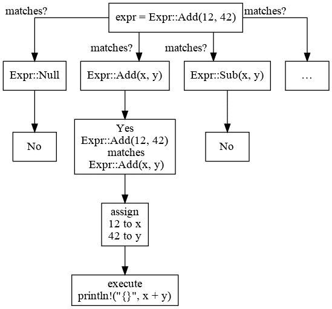

# Rust 基础

本章向您介绍了 Rust 的基础知识，这是一种旨在安全且快速的系统编程语言。Rust 是编写并发软件的好选择，并有助于防止错误。阅读本章后，你将准备好在后续章节中编写酷炫的项目。在了解语言本身之后，你将安装其编译器和包管理器，并立即开始编程。你还将学习以下概念：

+   变量

+   内置数据类型

+   控制流（条件和循环）

+   函数

+   自定义数据类型

+   引用

+   模式匹配

+   特性和泛型

+   数组和切片

+   宏

# 了解 Rust

Rust 是由 Mozilla 开发的一种系统编程语言，其 1.0 版本于 2015 年发布。系统语言意味着你可以控制程序使用的内存——你可以决定是否在栈上或堆上分配内存，以及何时释放内存。但不用担心；在 Rust 中，编译器非常有帮助，可以防止你犯在 C 和 C++ 中容易犯的错误，这些错误会导致段错误。当程序员尝试访问其进程无法访问的内存时，就会发生段错误。内存不安全会导致错误和安全漏洞。

此外，编译器足够智能，知道在哪里插入内存释放指令，这样你就不需要手动释放内存，所有这些都不需要垃圾回收器，这是其最伟大的特性之一。由于 Rust 安全且快速，它是编写操作系统、嵌入式程序、服务器和游戏的理想选择，但你也可以用它来开发桌面应用程序和网站。这个强大功能的绝佳例子是 [Servo 网络引擎](https://servo.org/)，它也是由 Mozilla 开发的。

Rust 是多范式的：它可以以命令式或函数式的方式使用，你甚至可以安全地编写并发应用程序。它是静态类型的，这意味着每个类型必须在编译时已知，但由于它使用类型推断，我们可以省略大多数局部变量的类型。它也是强类型的，这意味着其类型系统可以防止程序员犯某些类型的错误，例如为函数参数使用错误类型。而且 Rust 在编写并发软件方面非常出色，因为它可以防止数据竞争，这是对变量的并发访问，其中一个是在写入；这在其他语言中是未定义的行为。在阅读这本书时，要记住的一件事是 Rust 可以防止你自作自受。例如，Rust 没有如下内容：

+   空指针

+   数据竞争

+   use after free

+   use before initialization

+   goto

+   自动转换布尔值、数字和枚举

此外，Rust 还有助于防止内存泄漏。然而，所有这些都可以通过 `unsafe` 代码实现，这在第三章事件和基本游戏机制中有解释。

不再拖延，让我们安装本书中需要的工具。

# 安装 Rust

在本节中，我们将安装`rustup`，它允许我们安装不同版本的编译器和包管理器。

# Windows

前往[`rustup.rs`](https://rustup.rs)，按照说明下载`rustup-init.exe`，然后运行它。

# Linux/Mac

如果你的发行版没有提供`rustup`的包，你需要在终端中键入以下命令来安装`rustup`：

```rs
$ curl https://sh.rustup.rs -sSf | sh
info: downloading installer

Welcome to Rust!

[...]

Current installation options:

   default host triple: x86_64-unknown-linux-gnu
     default toolchain: stable
  modify PATH variable: yes

1) Proceed with installation (default)
2) Customize installation
3) Cancel installation
```

这将下载`rustup`并询问你是否想要自定义安装。除非你有特殊需求，否则默认设置就足够了。

注意：`$`代表你的 shell 提示符，不应键入；你必须键入它后面的文本。另外，不以`$`开头的文本行代表程序的文本输出。

要继续安装，请输入`1`并按*Enter*键。这将安装`rustc`编译器和`cargo`包管理器，以及其他工具：

```rs
info: syncing channel updates for 'stable-x86_64-unknown-linux-gnu'
info: latest update on 2017-07-20, rust version 1.19.0 (0ade33941 2017-07-17)
info: downloading component 'rustc'

[...]

  stable installed - rustc 1.19.0 (0ade33941 2017-07-17)

Rust is installed now. Great!

To get started you need Cargo's bin directory ($HOME/.cargo/bin) in your PATH
environment variable. Next time you log in this will be done automatically.

To configure your current shell run source $HOME/.cargo/env
```

如安装程序所指出的，你需要执行以下命令以将包含这些工具的目录添加到你的`PATH`中：

```rs
$ source $HOME/.cargo/env
# Which is the same as executing the following:
$ export PATH="$HOME/.cargo/bin:$PATH"
```

（这只需要做一次，因为 rustup 安装程序已经将其添加到你的`~/.profile`文件中。）

现在，测试你是否已经安装了`cargo`和`rustc`，因为你很快就会需要它们：

```rs
$ cargo -V
cargo 0.23.0 (61fa02415 2017-11-22)
$ rustc -V
rustc 1.22.1 (05e2e1c41 2017-11-22)
```

Cargo 是 Rust 的包管理器和构建工具：它允许你编译和运行你的项目，以及管理它们的依赖关系。

在撰写本书时，稳定的 Rust 版本是 1.22.0。

# 测试你的安装

让我们尝试构建一个 Rust 程序。首先，使用`cargo`创建一个新的项目：

```rs
$ cargo new --bin hello_world
     Created binary (application) `hello_world` project
```

`--bin`标志表示我们想要创建一个可执行项目，而不是库（默认情况下没有这个标志）。在 Rust 的世界里，一个**crate**是一个包含库和/或可执行二进制的包。

这将创建一个包含以下文件和目录的`hello_world`目录：

```rs
$ tree hello_world/
hello_world/
├── Cargo.toml
└── src
    └── main.rs

1 directory, 2 files
```

`Cargo.toml`文件是存储你的项目元数据（名称、版本等）以及其依赖关系的地方。你的项目源文件位于`src`目录中。现在是时候运行这个项目了：

```rs
$ cd hello_world/
$ cargo run
   Compiling hello_world v0.1.0 (file:///home/packtpub/projects/hello_world)
    Finished dev [unoptimized + debuginfo] target(s) in 0.39 secs
     Running `target/debug/hello_world`
Hello, world!
```

在`cargo run`之后打印出的前三行是`cargo`打印的，表示它做了什么：编译了项目并运行了它。最后一行`Hello, world!`是我们项目打印的行。正如你所看到的，`cargo`生成一个 Rust 文件，该文件将文本打印到`stdout`（标准输出）。

```rs
$ cat src/main.rs
fn main() {
    println!("Hello, world!");
}
```

如果你只想编译项目而不运行它，请键入以下命令代替：

```rs
$ cargo build
    Finished dev [unoptimized + debuginfo] target(s) in 0.0 secs
```

这次，我们没有看到`Compiling hello_world`，因为`cargo`没有看到项目文件的任何更改，因此不需要再次编译。

# 文档和参考

你可以在这里找到 API 文档：[`doc.rust-lang.org/stable/std/`](https://doc.rust-lang.org/stable/std/)。参考文档可以在这里找到：[`doc.rust-lang.org/stable/reference/`](https://doc.rust-lang.org/stable/reference/)。

# 主函数

让我们再次看看我们的第一个项目源代码：

```rs
fn main() {
    println!("Hello, world!");
}
```

它只包含一个 `main` 函数——这是程序执行开始的地方。这是一个不接受任何参数（因此是空括号）并返回单元（也写作 `()`）的函数。函数体，在花括号之间，包含对 `println!()` 宏的调用——我们可以看到这是一个宏，因为它以 `!` 结尾，而不是函数。这个宏打印括号内的文本，然后换行。我们将在宏部分看到什么是宏。

# 变量

我们现在将之前的程序修改一下，添加一个变量：

```rs
fn main() {
    let name = "world";
    println!("Hello, {}!", name);
}
```

字符串字面量中的 `{}` 部分被 `name` 变量的内容替换。在这里，我们看到类型推断的作用——我们不必指定 `name` 变量的类型，编译器会为我们推断。我们也可以自己写出类型：

```rs
let name: &str = "world";
```

（从现在开始，我将省略 `main` 函数，但此代码应写在函数内部。）

在 Rust 中，变量默认是不可变的。因此，编写以下内容将导致编译时错误：

```rs
let age = 42;
age += 1;
```

编译器会给出一个非常有用的错误信息：

```rs
error[E0384]: cannot assign twice to immutable variable `age`
  --> src/main.rs:16:5
   |
15 |     let age = 42;
   |         --- first assignment to `age`
16 |     age += 1;
   |     ^^^^^^^^ cannot assign twice to immutable variable
```

要使变量可变，我们需要使用 `mut` 关键字：

```rs
let mut age = 42;
age += 1;
```

# 内置数据类型

让我们看看语言提供的基本类型，例如整数、浮点数、布尔值和字符。

# 整数类型

Rust 中提供了以下整数类型：

| 无符号 | 有符号 |
| --- | --- |
| `u8` | `i8` |
| `u16` | `i16` |
| `u32` | `i32` |
| `u64` | `i64` |
| `usize` | `isize` |

`u` 表示无符号，而 `i` 表示有符号，其后的数字表示位数。例如，`u8` 类型的数字可以在 0 到 255（包含）之间。`i16` 类型的数字可以在 -32768 到 32767（包含）之间。大小变体是指针大小的整数类型：`usize` 和 `isize` 在 64 位 CPU 上是 64 位。默认整数类型是 `i32`，这意味着当类型推断无法选择更具体的类型时，将使用此类型。

# 浮点数类型

有两种浮点数类型：`f32` 和 `f64`，后者是默认类型。`f` 后面的数字表示该类型的位数。一个示例值是 `0.31415e1`。

# 布尔类型

`bool` 类型接受两个值：`true` 和 `false`。

# 字符类型

`char` 类型表示一个 Unicode 字符。一个示例 Unicode 标量值是 `'€'`。

# 控制流

我们现在将看看如何在 Rust 中编写条件和循环。条件在特定情况发生时执行代码块非常有用，而循环允许你重复执行代码块多次，直到满足条件。

# 编写条件

与其他语言类似，Rust 使用 `if` 和 `else` 关键字表达条件：

```rs
let number1 = 24;
let number2 = 42;
if number1 > number2 {
    println!("{} > {}", number1, number2);
} else {
    println!("{} <= {}", number1, number2);
}
```

然而，它们不需要在条件表达式中使用括号。此外，此表达式必须是 `bool` 类型：你不能像在其他语言中那样使用数字。

Rust 的条件语句有一个特性，就像许多其他构造一样，即它们是表达式。每个分支的最后表达式是这个分支的值。不过要小心，每个分支的类型必须相同。例如，我们可以获取两个数字中的最小值并将其放入变量中：

```rs
let minimum =
    if number1 < number2 {
        number1
    } else {
        number2
    }; // Don't forget the semi-colon here.
```

# 创建 while 循环

Rust 中有多种循环类型。其中之一是`while`循环。

让我们看看如何使用欧几里得算法计算最大公约数：

```rs
let mut a = 15;
let mut b = 40;
while b != 0 {
    let temp = b;
    b = a % b;
    a = temp;
}
println!("Greatest common divisor of 15 and 40 is: {}", a);
```

此代码执行连续的除法，当余数为`0`时停止。

# 创建函数

当我们看到`main`函数时，我们对函数有一个简要的介绍。让我们看看如何创建具有参数和返回值的函数。

这里是如何编写一个返回两个数字中最大值的函数：

```rs
fn max(a: i32, b: i32) -> i32 {
    if a > b {
        a
    } else {
        b
    }
}
```

参数位于括号内，并且必须显式指定类型，因为类型推断只能推断局部变量的类型。这是好事，因为这充当了文档。此外，这可以防止我们在更改参数的使用方式或更改返回的值时出现错误。函数可以在使用后定义，而不会出现任何问题。返回类型位于`->`之后。当我们返回`()`时，我们可以省略`->`和类型。

函数体中的最后一个表达式是函数返回的值。你不需要使用`return`。只有当你想提前返回时才需要`return`关键字。

# 创建结构体

有时候，我们有多组值，这些值只有在一起才有意义，例如一个点的两个坐标。结构体是一种创建包含多个成员的新类型的方法。

这里是我们创建上述`Point`结构体的方法：

```rs
struct Point {
    x: i32,
    y: i32,
}
```

要创建一个新点并访问其成员，我们使用以下语法：

```rs
let point = Point {
    x: 24,
    y: 42,
};
println!("({}, {})", point.x, point.y);
```

如果我们想打印整个`point`呢？

让我们尝试以下代码：

```rs
println!("{}", point);
```

编译器不接受以下内容：

```rs
error[E0277]: the trait bound `Point: std::fmt::Display` is not satisfied
 --> src/main.rs:7:20
  |
7 |     println!("{}", point);
  |                    ^^^^^ `Point` cannot be formatted with the default formatter; try using `:?` instead if you are using a format string
  |
  = help: the trait `std::fmt::Display` is not implemented for `Point`
  = note: required by `std::fmt::Display::fmt`
```

`{}`语法用于向应用程序的最终用户显示值。尽管如此，没有标准的方式来显示任意结构。我们可以做编译器建议的事情：使用`{:?}`语法。这需要你向结构添加一个属性，所以让我们改变它：

```rs
#[derive(Debug)]
struct Point {
    x: i32,
    y: i32,
}

println!("{:?}", point);
```

`#[derive(Debug)]`属性告诉编译器自动生成代码，以便能够打印出结构的调试表示。我们将在关于特质的章节中看到它是如何工作的。它打印以下内容：

```rs
Point { x: 24, y: 42 }
```

有时候，结构体包含很多嵌套字段，这种表示难以阅读。为了解决这个问题，我们可以使用`{:#?}`语法来美化打印值：

```rs
println!("{:#?}", point);
```

这会产生以下输出：

```rs
Point {
    x: 24,
    y: 42
}
```

文档描述了可以使用哪些其他格式化语法：[`doc.rust-lang.org/stable/std/fmt/`](https://doc.rust-lang.org/stable/std/fmt/)。

# 参考资料

让我们尝试以下代码，这在其他编程语言中是可行的：

```rs
let p1 = Point { x: 1, y: 2 };
let p2 = p1;
println!("{}", p1.x);
```

我们可以看到，Rust 不接受这个。它给出了以下错误：

```rs
error[E0382]: use of moved value: `p1.x`
 --> src/main.rs:4:20
  |
3 |     let p2 = p1;
  |         -- value moved here
4 |     println!("{}", p1.x);
  |                    ^^^^ value used here after move
  |
  = note: move occurs because `p1` has type `Point`, which does not implement the `Copy` trait
```

这意味着在值被移动之后，我们无法再使用它。在 Rust 中，默认情况下值是通过移动而不是复制来传递的，除非在某些情况下，我们将在下一小节中看到。

为了避免移动一个值，我们可以通过在它前面加上`&`来获取它的引用：

```rs
let p1 = Point { x: 1, y: 2 };
let p2 = &p1;
println!("{}", p1.x);
```

此代码可以编译，在这种情况下，`p2`是`p1`的引用，这意味着它指向相同的内存位置。Rust 确保始终可以使用引用，因为引用不是指针，它们不能是`NULL`。

引用也可以用于函数参数的类型。这是一个打印`point`的函数，它不会移动值：

```rs
fn print_point(point: &Point) {
    println!("x: {}, y: {}", point.x, point.y);
}
```

我们可以这样使用它：

```rs
print_point(&p1);
println!("{}", p1.x);
```

在调用`print_point`之后，我们仍然可以使用`point`，因为我们向函数发送了一个引用而不是将`point`移动到函数中。

# 克隆类型

使用引用的另一种方法是克隆值。通过克隆一个值，我们不会移动它。要能够克隆一个`point`，我们可以在它上面添加`derive`：

```rs
#[derive(Clone, Debug)]
struct Point {
    x: i32,
    y: i32,
}
```

我们现在可以调用`clone()`方法来避免移动我们的`p1`点：

```rs
fn print_point(point: Point) {
    println!("x: {}, y: {}", point.x, point.y);
}

let p1 = Point { x: 1, y: 2 };
let p2 = p1.clone();
print_point(p1.clone());
println!("{}", p1.x);
```

# 复制类型

当我们将这些类型的值赋给另一个变量时，有些类型不会被移动。这对于基本类型，如整数来说就是这种情况。例如，以下代码是完全有效的：

```rs
let num1 = 42;
let num2 = num1;
println!("{}", num1);
```

即使我们将它赋值给了`num2`，我们仍然可以使用`num1`。这是因为基本类型实现了一个特殊的标记：`Copy`。复制类型是复制的而不是移动的。

我们可以通过添加`derive`来使我们的自定义类型成为`Copy`类型：

```rs
#[derive(Clone, Copy)]
struct Point {
    x: i32,
    y: i32,
}
```

由于`Copy`需要`Clone`，我们也为我们的`Point`类型实现了后者。我们不能为包含不实现`Copy`的值的类型推导出`Copy`。现在，我们可以使用`Point`而无需担心引用：

```rs
fn print_point(point: Point) {
    println!("x: {}, y: {}", point.x, point.y);
}

let p1 = Point { x: 1, y: 2 };
let p2 = p1;
print_point(p1);
println!("{}", p1.x);
```

# 可变引用

如果我们想要能够对引用进行可变操作，我们需要一个可变引用，因为在 Rust 中默认情况下一切都是不可变的。要获取一个可变引用，只需将`&`替换为`&mut`。让我们编写一个函数，该函数将增加`Point`的`x`字段：

```rs
fn inc_x(point: &mut Point) {
    point.x += 1;
}
```

在这里，我们看到`Point`类型现在是`&mut`，这允许我们在方法中更新点。要使用此方法，我们的`p1`变量需要是`mut`，并且我们还需要为此变量提供一个可变引用：

```rs
let mut p1 = Point { x: 1, y: 2 };
inc_x(&mut p1);
```

# 方法

我们可以在自定义类型上添加方法。让我们编写一个计算`point`到原点距离的方法：

```rs
impl Point {
    fn dist_from_origin(&self) -> f64 {
        let sum_of_squares = self.x.pow(2) + self.y.pow(2);
        (sum_of_squares as f64).sqrt()
    }
}
```

这里有很多新的语法（`impl Point`、`as`和`.method()`），所以让我们解释所有这些。首先，类型的方法定义在`impl Type {}`构造中。此方法接受一个特殊参数：`&self`。此参数是方法被调用的实例，就像其他编程语言中的`this`。在`self`之前的`&`运算符表示实例是通过不可变引用传递的。正如我们所见，在 Rust 中可以在基本类型上调用方法——`self.x.pow(2)`计算`x`字段的平方。我们可以在文档中找到此方法以及许多其他方法，请参阅[`doc.rust-lang.org/stable/std/primitive.i32.html#method.pow`](https://doc.rust-lang.org/stable/std/primitive.i32.html#method.pow) 。在方法的最后一个表达式中，我们在计算平方根之前将`sum_of_squares`整数转换为`f64`，因为`sqrt()`方法仅在浮点数上定义。

让我们创建一个方法来更新结构体的字段：

```rs
impl Point {
    fn translate(&mut self, dx: i32, dy: i32) {
        self.x += dx;
        self.y += dy;
    }
}
```

与之前的方法不同的是，现在`self`是一个可变引用，`&mut`。

# 构造函数

Rust 不提供构造函数，但一个常见的习惯是创建一个`new()`静态方法，也称为关联函数：

```rs
impl Point {
    fn new(x: i32, y: i32) -> Self {
        Self { x: x, y: y }
    }
}
```

与普通方法的不同之处在于它不取`&self`（或其变体）作为参数。

`Self`是`self`值的类型；我们本可以使用`Point`代替`Self`。

当字段名与分配的值相同时，可以省略值，作为缩写：

```rs
fn new(x: i32, y: i32) -> Self {
    Self { x, y }
}
```

当我们通过调用其构造函数（`let point = Point::new();`）创建`Point`的一个实例时，这将在栈上分配值。

我们可以提供多个构造函数：

```rs
impl Point {
    fn origin() -> Self {
        Point { x: 0, y: 0 }
    }
}
```

# 元组

元组和结构体相似，但元组的字段是无名的。元组在括号内声明，元素之间用逗号分隔：

```rs
let tuple = (24, 42);
println!("({}, {})", tuple.0, tuple.1);
```

如您在第二行所见，我们可以使用`.index`访问元组的元素，其中`index`是一个常量，此索引从 0 开始。

元组可以用来从函数中返回多个值。例如，`str::split_at()`方法返回两个字符串：

```rs
let (hello, world) = "helloworld".split_at(5);
println!("{}, {}!", hello, world);
```

在这里，我们将元组的两个元素赋值给`hello`和`world`变量。我们将在*模式匹配*部分看到这是为什么。

# 枚举

当结构体允许我们在同一个变量下获取多个值时，枚举允许我们从不同类型的值中选择一个。

例如，让我们编写一个表示表达式的类型：

```rs
enum Expr {
    Null,
    Add(i32, i32),
    Sub(i32, i32),
    Mul(i32, i32),
    Div { dividend: i32, divisor: i32 },
    Val(i32),
}

let quotient = Expr::Div { dividend: 10, divisor: 2 };
let sum = Expr::Add(40, 2);
```

`Null`变体没有与之关联的值，`Val`有一个关联值，而`Add`有两个。`Div`也有两个关联值，但它们是有名称的，类似于我们定义结构体的方式。

# 模式匹配

那么，我们如何知道一个枚举类型的变量中包含哪个变体，以及如何从中获取值呢？为此，我们需要使用模式匹配。`match` 表达式是进行模式匹配的一种方式。让我们看看如何使用它来计算表达式的结果：

```rs
fn print_expr(expr: Expr) {
    match expr {
        Expr::Null => println!("No value"),
        Expr::Add(x, y) => println!("{}", x + y),
        Expr::Sub(x, y) => println!("{}", x - y),
        Expr::Mul(x, y) => println!("{}", x * y),
        Expr::Div { dividend: x, divisor: 0 } => println!("Divisor 
         is zero"),
        Expr::Div { dividend: x, divisor: y } => println!("{}",  
        x/y),
        Expr::Val(x) => println!("{}", x),
    }
}
```

`match` 表达式是一种检查值是否遵循某种模式并针对不同模式执行不同代码的方式。在这种情况下，我们匹配枚举类型，因此检查每个变体。如果表达式是 `Expr::Add`，则执行 `=>` 右侧的代码：`println!("{}", x + y)`。通过在 `Expr::Add` 旁边括号内的括号中写入变量名，我们指定这个变体的实际值绑定到这些名称上。通过这样做，我们可以在 `=>` 右侧使用这些变量名。

*图* 1.1 展示了模式匹配的工作原理：

*图 1.1*

`match` 也可以用来检查一个数字是否在某个范围内。这个函数将 ASCII 字符（在 Rust 中用 `u8` 表示）转换为大写：

```rs
fn uppercase(c: u8) -> u8 {
    match c {
        b'a'...b'z' => c - 32,
        _ => c,
    }
}
```

这里，`...` 语法表示一个包含范围。而下划线 (`_`) 用于表示字面意义上的所有其他内容，这在 Rust 中非常有用，因为 `match` 需要穷尽所有可能。

您可以使用 `as` 语法将 `u8` 转换为 `char`，如前所述：

```rs
println!("{}", uppercase(b'a') as char);
```

在 `match` 中，也可以通过使用 `|` 运算符来匹配不同的模式：

```rs
fn is_alphanumeric(c: char) -> bool {
    match c {
        'a'...'z' | 'A'...'Z' | '0'...'9' => true,
        _ => false,
    }
}
```

进行模式匹配还有其他语法。其中之一是 `if let` 构造。让我们用 `if let` 重新编写我们的 `uppercase` 函数：

```rs
fn uppercase(c: u8) -> u8 {
    if let b'a'...b'z' = c {
        c - 32
    } else {
        c
    }
}
```

与 `match` 不同，`if let` 不需要穷尽所有可能。它甚至不需要 `else` 分支，用于正常 `if` 表达式的规则也适用于 `if let`。当您只想匹配一个或两个模式时，这个构造可能比 `match` 更合适。

# 不可反驳的模式

另一种模式匹配的形式是**不可反驳模式**。当一个模式只有一种匹配方式并且总是成功时，它就是不可反驳的。例如，获取元组元素的一种方式是使用不可反驳模式：

```rs
let tuple = (24, 42);
let (a, b) = tuple;
println!("{}, {}", a, b);
```

在第二行，我们将元组的第一个元素赋值给 `a`，第二个元素赋值给 `b`。

# 特质

特质是一种指定类型必须实现某些方法以及/或某些类型的方式。它们与 Java 中的接口类似。我们可以在类型上实现一个特质，只要这个特质被导入，我们就可以使用这个特质的这些方法。这就是我们可以在其他包或标准库中定义的类型上添加方法的方式。

让我们编写一个表示位集的特质：

```rs
trait BitSet {
    fn clear(&mut self, index: usize);
    fn is_set(&self, index: usize) -> bool;
    fn set(&mut self, index: usize);
}
```

在这里，我们不需要编写方法的主体，因为它们将在为类型实现这个特质时定义。

现在，让我们为 `u64` 类型实现这个特质：

```rs
impl BitSet for u64 {
    fn clear(&mut self, index: usize) {
        *self &= !(1 << index);
    }

    fn is_set(&self, index: usize) -> bool {
        (*self >> index) & 1 == 1
    }

    fn set(&mut self, index: usize) {
        *self |= 1 << index;
    }
}
```

如您所见，Rust 中的按位非运算符是 `!`，与其他语言的 `~` 相反。使用这段代码，我们可以在 `u64` 上调用这些方法：

```rs
let mut num = 0;
num.set(15);
println!("{}", num.is_set(15));
num.clear(15);
```

记得`#[derive(Debug)]`属性吗？这实际上是在以下类型上实现了`Debug`特质。如果我们默认的实现不适合我们的用例，我们也可以手动使用相同的`impl`语法在我们的类型上实现`Debug`特质。

# 默认方法

特质可以包含默认方法，这对于特质的实现者来说很方便，因为不需要实现的方法更少。让我们在特质中添加一个`toggle()`默认方法：

```rs
trait BitSet {
    fn clear(&mut self, index: usize);
    fn is_set(&self, index: usize) -> bool;
    fn set(&mut self, index: usize);

    fn toggle(&mut self, index: usize) {
        if self.is_set(index) {
            self.clear(index);
        } else {
            self.set(index);
        }
    }
}
```

由于新方法有一个主体，我们不需要更新我们之前的实现。然而，我们可以这样做以提供更高效的实现，例如：

```rs
impl BitSet for u64 {
    // The other methods are the same as before.

    fn toggle(&mut self, index: usize) {
        *self ^= 1 << index;
    }
}
```

# 关联类型

我们还可以在特质中有需要指定的类型。例如，让我们在我们的之前声明的`Point`类型上实现标准库中的`Add`特质，这允许我们在自己的类型上使用`+`运算符：

```rs
use std::ops::Add;

impl Add<Point> for Point {
    type Output = Point;

    fn add(self, point: Point) -> Self::Output {
        Point {
            x: self.x + point.x,
            y: self.y + point.y,
        }
    }
}
```

第一行是导入标准库中的`Add`特质，这样我们就可以在我们的类型上实现它。这里我们指定关联的`Output`类型是`Point`。关联类型对于返回类型最有用。在这里，`add()`方法的`Output`是关联的`Self::Output`类型。

现在，我们可以在`Point`s 上使用`+`运算符：

```rs
let p1 = Point { x: 1, y: 2 };
let p2 = Point { x: 3, y: 4 };
let p3 = p1 + p2;
```

必须使用关联类型（而不是将其设置为`Self`）来指定输出参数，这为我们提供了更多的灵活性。例如，我们可以为`*`运算符实现标量积，它接受两个`Point`并返回一个数字。

你可以在本页面上找到所有可以重载的运算符，链接为[`doc.rust-lang.org/stable/std/ops/index.html`](https://doc.rust-lang.org/stable/std/ops/index.html)。

自从 Rust 1.20 以来，Rust 还支持关联常量，除了关联类型。

# 规则

为了使用特质，必须遵循一些规则。如果它们不被尊重，编译器将抛出错误：

+   为了使用特质的方 法，必须导入该特质

+   特质的实现必须在特质或类型的同一 crate 中

第二条规则是避免在使用多个库时可能发生的冲突。当两个导入的特质为同一类型提供相同的方法时，我们可能会遇到这样的冲突。

# 泛型

泛型是一种使函数或类型能够为多种类型工作以避免代码重复的方法。让我们重写我们的`max`函数以使其泛型化：

```rs
fn max<T: PartialOrd>(a: T, b: T) -> T {
    if a > b {
        a
    } else {
        b
    }
}
```

首先要注意的是，在函数名之后有一个新的部分：这是我们声明泛型类型的地方。我们声明一个泛型`T`类型，在它后面`: PartialOrd`意味着这个`T`类型必须实现`PartialOrd`特质。这被称为特质界限。然后我们使用这个`T`类型作为我们的两个参数和返回类型。然后，我们看到与我们的非泛型函数相同的函数体。我们需要添加特质界限，因为默认情况下，不允许在泛型类型上进行任何操作。`PartialOrd`特质允许我们使用比较运算符。

我们可以使用此函数与任何实现了 `PartialOrd` 的类型：

```rs
println!("{}", max('a', 'z'));
```

这是在使用静态分派而不是动态分派，这意味着编译器将在生成的二进制文件中生成一个针对 `char` 的特定 `max` 函数。动态分派是另一种在运行时解决要调用哪个函数的方法，这效率较低。

# 选项类型

泛型也可以用于类型。标准库中的 `Option` 类型是一个泛型类型，定义为如下：

```rs
enum Option<T> {
    Some(T),
    None,
}
```

这种类型用于编码值不存在的情况。`None` 表示没有值，而 `Some(value)` 用于存在值的情况。

# 数组

数组是一个固定大小的相同类型元素的集合。我们用方括号声明它们：

```rs
let array = [1, 2, 3, 4];
let array: [i16; 4] = [1, 2, 3, 4];
```

第二行显示了如何指定数组的类型。另一种方法是使用文字后缀：

```rs
let array = [1u8, 2, 3, 4];
```

文字后缀是由一个文字（即，一个常量）和一个类型后缀组成的，因此，对于 `1` 常量和 `u8` 类型，我们得到 `1u8`。文字后缀只能用于数字。这声明了一个包含 `4` 个 `u8` 类型元素的数组。数组索引从 `0` 开始，边界检查在运行时进行。边界检查用于防止访问超出范围的内存，例如，尝试访问数组末尾之后的元素。虽然这可能会稍微减慢软件的速度，但在许多情况下可以进行优化。以下代码将触发一个恐慌，因为 `4` 索引超出了数组的末尾：

```rs
println!("{}", array[4]);
```

在运行时，我们看到以下消息：

```rs
thread 'main' panicked at 'index out of bounds: the len is 4 but the index is 4', src/main.rs:5:20
note: Run with `RUST_BACKTRACE=1` for a backtrace.
```

另一种声明数组的方法是：

```rs
let array = [0u8; 100];
```

这声明了一个包含 `100` 个元素且所有元素都是 `0` 的数组。

# 切片

数组是固定大小的，但如果我们想创建一个可以与任何大小的数组一起工作的函数，我们需要使用另一种类型：切片。

切片是连续序列的视图：它可以是对整个数组的视图，也可以是其一部分。切片是胖指针，除了指向数据的指针外，它们还包含一个大小。以下是一个返回切片第一个元素引用的函数：

```rs
fn first<T>(slice: &[T]) -> &T {
    &slice[0]
}
```

这里，我们使用一个未加界泛型类型，因为我们没有在 `T` 类型的值上使用任何操作。`&[T]` 参数类型是 `T` 的切片。返回类型是 `&T`，它是对 `T` 类型值的引用。函数体是 `&slice[0]`，它返回切片的第一个元素的引用。以下是如何使用数组调用此函数的方法：

```rs
println!("{}", first(&array));
```

我们可以只为数组的一部分创建 `slice`，如下面的示例所示：

```rs
println!("{}", first(&array[2..]));
```

`&array[2..]` 创建了一个从 `2` 索引开始直到数组末尾的切片（因此 `..` 后没有索引）。两个索引都是可选的，因此我们也可以写 `&array[..10]` 以获取数组的前 10 个元素，`&array[5..10]` 以获取索引为 5 到 9 的元素（包括），或者 `&array[..]` 以获取所有元素。

# 循环

for 循环是 Rust 中可以使用的一种循环形式。它用于遍历迭代器的元素。迭代器是一个结构，它产生一系列值：它可以无限期地产生相同的值，或者产生集合的元素。我们可以从切片中获取迭代器，所以让我们这样做来计算切片中元素的总和：

```rs
let array = [1, 2, 3, 4];
let mut sum = 0;
for element in &array {
    sum += *element;
}
println!("Sum: {}", sum);
```

这里唯一令人惊讶的部分是 `sum += *element` 中的 `*`。由于我们得到了切片元素的引用，我们需要解引用它们才能访问整数。我们在 `array` 前面使用了 `&` 来避免移动它，实际上，我们可能仍然想在循环之后使用这个变量。

让我们编写一个函数，它返回切片中元素的索引，或者如果它不在切片中则返回 `None`：

```rs
fn index<T: PartialEq>(slice: &[T], target: &T) -> Option<usize> {
    for (index, element) in slice.iter().enumerate() {
        if element == target {
            return Some(index);
        }
    }
    None
}
```

注意：部分等价关系既是对称的也是传递的，但不是自反的。当这三个属性都满足时，使用 `Eq` 特征。

在这里，我们再次使用了一个泛型类型，但这次我们使用了 `PartialEq` 特征约束，以便能够在 `T` 类型的值上使用 `==` 操作符。这个函数返回 `Option<usize>`，这意味着它可以返回没有值（`None`）或索引（`Some(index)`）。在主体第一行中，我们使用 `slice.iter().enumerate()` 来获取索引以及切片的元素。我们使用 `for` 关键字后面的模式匹配来将索引和元素分配给变量。在条件内部，我们使用 `return` 关键字来提前返回一个值。所以如果找到了值，它将返回索引；否则，循环将结束，随后返回 `None` 值。

让我们再写一个函数，它使用 `for` 循环。它返回切片的最小值和最大值，如果切片为空则返回 `None`：

```rs
fn min_max(slice: &[i32]) -> Option<(i32, i32)> {
    if slice.is_empty() {
        return None;
    }
    let mut min = slice[0];
    let mut max = slice[0];
    for &element in slice {
        if element < min {
            min = element;
        }
        if element > max {
            max = element;
        }
    }
    Some((min, max))
}
```

在这里，我们通过使用元组从函数中返回多个值。这次，`&` 在 `in` 的左侧，而之前它在右侧；这是因为这个 `for` 循环通过使用 `&element` 来对引用进行模式匹配。这是我们可以在 Rust 中做到的，因此我们不再需要使用 `*` 来解引用元素。

# 宏

宏规则，也称为示例宏，是一种通过在编译时生成代码来避免代码重复的方法。我们将实现一个简单的宏来为整数类型实现我们的 `BitSet` 特征：

```rs
macro_rules! int_bitset {
    ($ty:ty) => {
        impl BitSet for $ty {
            fn clear(&mut self, index: usize) {
                *self &= !(1 << index);
            }

            fn is_set(&self, index: usize) -> bool {
                (*self >> index) & 1 == 1
            }

            fn set(&mut self, index: usize) {
                *self |= 1 << index;
            }
        }
    };
}
```

`int_bitset` 宏的名称写在 `macro_rules!` 之后。宏可以有多个规则，类似于匹配臂，但它匹配 Rust 语法元素，而不是类型、表达式、代码块等。这里我们只有一个规则，并且它匹配单个类型，因为我们使用了 `:ty`。`:ty` 之前的部分（`$ty`）是匹配的元素的名称。在 `=>` 符号后面的花括号内，我们看到将生成实际代码。它与我们对 `u64` 的 `BitSet` 的先前实现相同，只是它使用元变量 `$ty` 而不是 `u64`。

为了避免大量的样板代码，我们可以使用此宏如下：

```rs
int_bitset!(i32);
int_bitset!(u8);
int_bitset!(u64);
```

# 多个模式规则

让我们编写一个宏，它将简化重载运算符的特质的实现。这个宏将有两个规则：一个用于 `+` 运算符，另一个用于 `-` 运算符。以下是宏的第一个规则：

```rs
macro_rules! op {
    (+ $_self:ident : $self_type:ty, $other:ident $expr:expr) => {
        impl ::std::ops::Add for $self_type {
            type Output = $self_type;

            fn add($_self, $other: $self_type) -> $self_type {
                $expr
            }
        }
    };
    // …
```

在这个模式中，我们使用其他类型的语法元素：`ident`，它是一个标识符，以及 `<span>expr`，它是一个表达式。特质（`::std::ops::Add`）是全称的，这样使用此宏的代码就不需要导入 `Add` 特质。

以下是宏的其余部分：

```rs
    (- $_self:ident : $self_type:ty, $other:ident $expr:expr) => {
        impl ::std::ops::Sub for $self_type {
            type Output = $self_type;

            fn sub($_self, $other: $self_type) -> $self_type {
                $expr
            }
        }
    };
}
```

然后，我们可以使用这个宏与我们的 `Point` 类型一起使用，如下所示：

```rs
op!(+ self:Point, other {
    Point {
        x: self.x + other.x,
        y: self.y + other.y,
    }
});

op!(- self:Point, other {
    Point {
        x: self.x - other.x,
        y: self.y - other.y,
    }
});
```

让我们看看匹配是如何工作的：

对于第一个宏调用，我们以 `+` 开始，因此第一个分支被选中，因为它匹配 `+`，这是该分支的开始。接下来是 `self`，它是一个标识符，因此它匹配 `ident` 模式，并将其分配给 `$_self` 元变量。然后，我们有 `:`，它匹配模式中的冒号。之后，我们有 `Point`，它匹配 `ty` 类型的 `$self_type` 元变量（用于类型匹配）。然后我们有 `,`，它匹配模式中的逗号。接下来是 `other`，它匹配模式中的下一个项目，即 `ident` 类型的 `$other` 元变量。最后，我们有 `{ Point { … } }`，它匹配模式末尾所需的表达式。这就是为什么这些宏被称为示例宏，我们编写调用应该看起来像什么，用户必须匹配示例（或模式）。

作为对读者的练习，尝试以下操作：

+   添加缺失的运算符：`*` 和 `/`

+   在模式中添加指定 `$other` 类型以及返回类型的能力

+   如果在前一点中还没有这样做，请添加更多标记，使其看起来更像一个函数声明：`+(self: Point, other: Point) -> Point { … }`

+   尝试将模式中的运算符移动到 `$self_type` 元变量之后，以查看 `macro_rules` 的局限性

# 重复

在宏模式中，也可以使用重复运算符 `+` 和 `*` 来匹配无限数量的模式。它们的行为与正则表达式中的相同运算符完全一样：

+   `+` 匹配 1 次或更多次。

+   `*` 匹配 0、1 或多次。

让我们编写一个非常有用的宏，一个用于提供创建 `HashMap` 语法糖的宏：

注意：`HashMap` 是 Rust 标准库中的一个数据结构，它将键映射到值。

```rs
macro_rules! hash {
    ($( $key:expr => $value:expr ),*) => {{
        let mut hashmap = ::std::collections::HashMap::new();
        $(hashmap.insert($key, $value);)*
        hashmap
    }};
}
```

如我们所见，我们在这里使用`*`运算符。它前面的逗号指定了分隔符：这个分隔符必须存在于括号中每个模式出现的间隔（这是可以重复的模式）。不要忘记在括号前的开头的`$`；如果没有它，宏将匹配字面量`(`。在括号内，我们看到一个正常的模式，一个表达式，后面跟着`=>`运算符，然后是另一个表达式。这个规则的正文是特别的，因为它使用了两对花括号而不是一对。

首先，让我们看看我们如何使用这个宏，然后我们将在稍后回到这个特殊性：

```rs
let hashmap = hash! {
    "one" => 1,
    "two" => 2
};
```

如果我们只使用一对花括号，就像这样：

```rs
macro_rules! hash {
    ($( $key:expr => $value:expr ),*) => {
        let mut hashmap = ::std::collections::HashMap::new();
        $(hashmap.insert($key, $value);)*
        hashmap
    };
}
```

编译器将尝试生成以下代码，但无法编译：

```rs
let hashmap = let mut hashmap = ::std::collections::HashMap::new();
    hashmap.insert("one", 1);
    hashmap.insert("two", 2);
    hashmap;
```

它无法编译，因为 Rust 希望在`=`的右侧有一个表达式。为了将此代码转换为表达式，我们只需添加花括号：

```rs
let hashmap = {
    let mut hashmap = ::std::collections::HashMap::new();
    hashmap.insert("one", 1);
    hashmap.insert("two", 2);
    hashmap
};
```

因此，需要第二对花括号。

在宏的正文部分还有一行需要解释：

```rs
$(hashmap.insert($key, $value);)*
```

这意味着该语句将被重复，直到有键/值对的配对。注意，`;`在括号内；并且`*`之前没有分隔符，因为每个语句都需要以分号结束。但仍然可以在此处指定分隔符，如下面的示例所示：

```rs
let keys = [$($key),*];
```

这将展开所有的`$key`，用逗号分隔。例如，使用如下调用：

```rs
hash! {
    "one" => 1,
    "two" => 2
}
```

它将产生：

```rs
let keys = ["one", "two"];
```

# 可选量词

在`macro_rules`系统中，没有办法指定一个模式是可选的，就像正则表达式中的`?`量词一样。如果我们想让我们的`hash`宏的用户使用尾随逗号，我们可以通过将逗号移动到括号内来更改规则：`($( $key:expr => $value:expr,)* $(,)* )`。

然而，这将强制用户编写尾随宏。如果我们想允许两种变体，我们可以使用以下技巧，它使用`*`运算符：`($( $key:expr => $value:expr ),* $(,)* )`。

这意味着每个模式之间必须使用逗号分隔，我们可以在最后一个模式之后使用任意数量的逗号，包括一个逗号都不用。

# 概述

这章通过向你展示如何使用变量、函数、控制流结构和类型来介绍 Rust 的基础知识。你还学习了更高级的概念，如引用和所有权来管理内存，以及你看到了如何使用特性、泛型和宏来避免代码重复。

在下一章中，你将通过创建一个视频游戏来练习你刚刚学到的知识。
