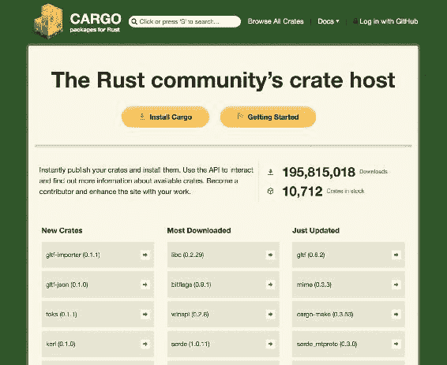
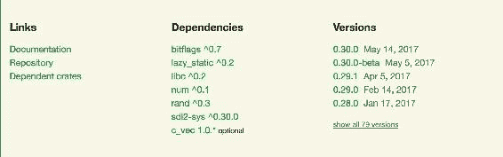
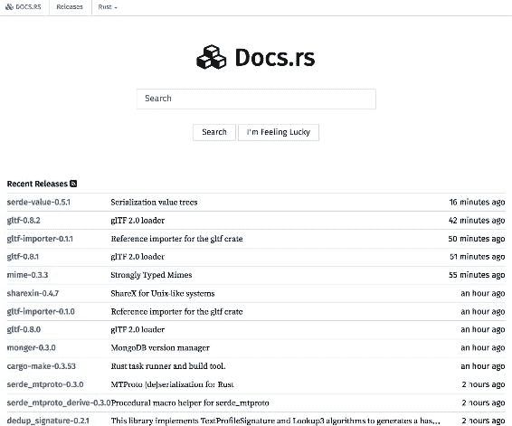
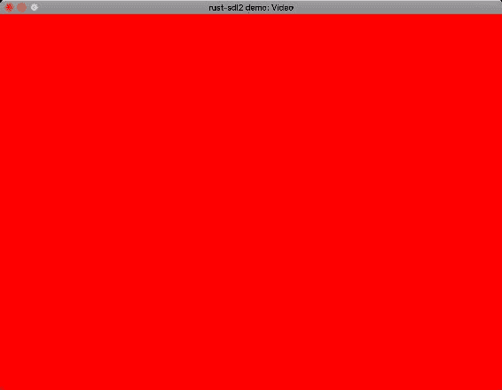
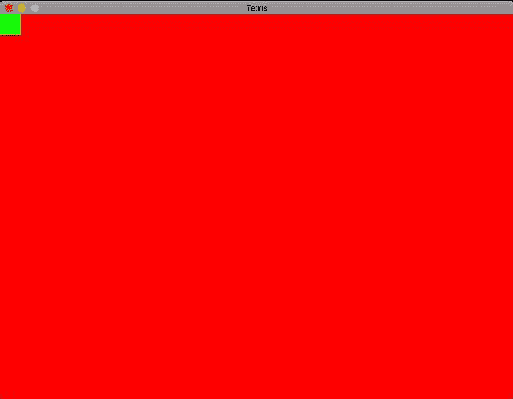
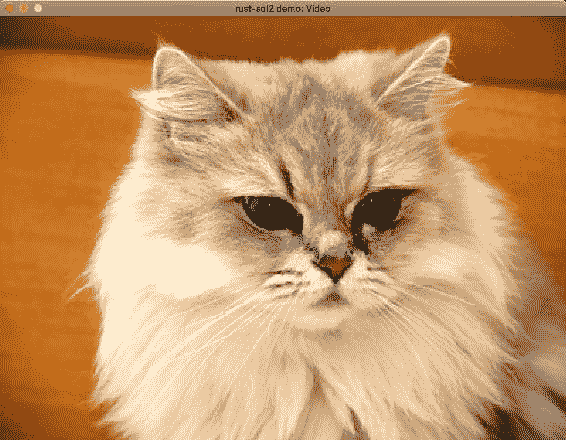

# 从 SDL 开始

在开始编写俄罗斯方块之前，还有一些事情需要讨论，比如库，我们将大量使用（一旦您开始在自己的项目上使用 Rust，您也会大量使用！）。让我们从库开始吧！

# 理解 Rust 库

在 Rust 中，包（包括二进制和库）被称为 crate。您可以在`crates.io`上找到很多。今天，我们将使用 SDL2 crate 来制作我们的俄罗斯方块，但在考虑这一点之前，我们需要安装`SDL2`库，这是由`SDL2` crate 使用的！

# 安装 SDL2

在继续之前，我们需要安装 SDL 库。

# 在 Linux 上安装 SDL2

根据您的包管理工具，运行以下命令在 Linux 上安装 SDL2：

`apt 包管理器`：

```rs
$ sudo apt-get install libsdl2-dev
```

`dnf 包管理器`：

```rs
$ sudo dnf install SDL2-devel
```

`yum 包管理器`：

```rs
$ yum install SDL2-devel
```

完成后，您的 SDL2 安装就绪了！

# 在 Mac 上安装 SDL2

要在 Mac 上安装 SDL2，只需运行以下命令：

```rs
$ brew install sdl2
```

您可以开始了！

# 在 Windows 上安装 SDL2

所有这些安装说明都直接来自 Rust SDL2 crate。

# 带有构建脚本的 Windows

为了使所有这些工作，需要执行几个步骤。请遵循指南！

1.  从[`www.libsdl.org/`](http://www.libsdl.org/)下载`mingw`和`msvc`开发库（`SDL2-devel-2.0.x-mingw.tar.gz`和`SDL2-devel-2.0.x-VC.zip`）。

1.  解压缩到您选择的文件夹。 （之后您可以删除它。）

1.  在与`Cargo.toml`文件相同的文件夹中创建以下文件夹结构：

```rs
        gnu-mingw\dll\32
        gnu-mingw\dll\64
        gnu-mingw\lib\32
        gnu-mingw\lib\64
        msvc\dll\32
        msvc\dll\64
        msvc\lib\32
        msvc\lib\64
```

1.  将源存档中的`lib`和`dll`文件复制到步骤 3 中创建的目录中，如下所示：

```rs
SDL2-devel-2.0.x-mingw.tar.gz\SDL2-2.0.x\i686-w64-mingw32\bin    ->     gnu-mingw\dll\32
SDL2-devel-2.0.x-mingw.tar.gz\SDL2-2.0.x\x86_64-w64-mingw32\bin  ->     gnu-mingw\dll\64
SDL2-devel-2.0.x-mingw.tar.gz\SDL2-2.0.x\i686-w64-mingw32\lib    ->     gnu-mingw\lib\32
SDL2-devel-2.0.x-mingw.tar.gz\SDL2-2.0.x\x86_64-w64-mingw32\lib  ->     gnu-mingw\lib\64
SDL2-devel-2.0.5-VC.zip\SDL2-2.0.x\lib\x86\*.dll                 ->     msvc\dll\32
SDL2-devel-2.0.5-VC.zip\SDL2-2.0.x\lib\x64\*.dll                 ->     msvc\dll\64
SDL2-devel-2.0.5-VC.zip\SDL2-2.0.x\lib\x86\*.lib                 ->     msvc\lib\32
SDL2-devel-2.0.5-VC.zip\SDL2-2.0.x\lib\x64\*.lib                 ->     msvc\lib\64
```

1.  创建一个构建脚本。如果您还没有，请将以下内容放入您的`Cargo.toml`文件中的`[package]`部分：

```rs
        build = "build.rs"
```

1.  在与`Cargo.toml`文件相同的目录下创建一个名为`build.rs`的文件，并将以下内容写入其中：

```rs
      use std::env;
      use std::path::PathBuf;

      fn main() {
        let target = env::var("TARGET").unwrap();
        if target.contains("pc-windows") {
          let manifest_dir = 
            PathBuf::from(env::var("CARGO_MANIFEST_DIR").unwrap());
          let mut lib_dir = manifest_dir.clone();
        let mut dll_dir = manifest_dir.clone();
        if target.contains("msvc") {
            lib_dir.push("msvc");
            dll_dir.push("msvc");
        } else {
            lib_dir.push("gnu-mingw");
            dll_dir.push("gnu-mingw");
        }
        lib_dir.push("lib");
        dll_dir.push("dll");
        if target.contains("x86_64") {
            lib_dir.push("64");
            dll_dir.push("64");
        } else {
            lib_dir.push("32");
            dll_dir.push("32");
        }
        println!("cargo:rustc-link-search=all={}", 
          lib_dir.display());
        for entry in std::fs::read_dir(dll_dir).expect("Can't
          read DLL dir")  {
         let entry_path = entry.expect("Invalid fs entry").path();
         let file_name_result = entry_path.file_name();
         let mut new_file_path = manifest_dir.clone();
         if let Some(file_name) = file_name_result {
           let file_name = file_name.to_str().unwrap();
           if file_name.ends_with(".dll") {
             new_file_path.push(file_name);
           std::fs::copy(&entry_path,
           new_file_path.as_path()).expect("Can't copy 
             from DLL dir");
           }
         }
        }
        }
      }
```

1.  在构建过程中，构建脚本会将所需的 DLL 文件复制到与您的`Cargo.toml`文件相同的目录中。但是，您可能不希望将这些文件提交到任何 Git 仓库中，因此请将以下行添加到您的`.gitignore`文件中：

```rs
 /*.dll
```

1.  当您发布游戏时，请确保将相应的`SDL2.dll`复制到与您的编译`exe`文件相同的目录中；否则，游戏将无法启动。

现在您的项目应该可以在任何 Windows 计算机上构建和运行了！

# Windows（MinGW）

为了使所有这些工作，需要执行几个步骤。请遵循指南！

1.  从[`www.libsdl.org/`](http://www.libsdl.org/)下载`mingw`开发库（`SDL2-devel-2.0.x-mingw.tar.gz`）。

1.  解压缩到您选择的文件夹。 （之后您可以删除它。）

1.  从以下路径复制所有`lib`文件：

```rs
 SDL2-devel-2.0.x-mingw\SDL2-2.0.x\x86_64-w64-mingw32\lib
```

接下来，将其复制到以下路径：

```rs
 C:\Program Files\Rust\lib\rustlib\x86_64-pc-windows-gnu\lib
```

或者，您可以将它复制到您选择的库文件夹中，并确保您有一个如下所示的系统环境变量：

```rs
 LIBRARY_PATH = C:\your\rust\library\folder
```

对于 Rustup 用户，此文件夹位于以下位置：

```rs
 C:\Users\{Your Username}.multirust\toolchains\{current
         toolchain}\lib\rustlib\{current toolchain}\lib
```

在这里，当前的工具链可能是`stable-x86_64-pc-windows-gnu`。

1.  从以下位置复制`SDL2.dll`：

```rs
 SDL2-devel-2.0.x-mingw\SDL2-2.0.x\x86_64-w64-mingw32\bin
```

复制的`SDL2.dll`被粘贴到您的 Cargo 项目中，紧挨着您的`Cargo.toml`文件。

1.  当你发布你的游戏时，确保将 `SDL2.dll` 复制到与你的编译 `exe` 文件相同的目录中；否则，游戏将无法启动。

# Windows (MSVC)

为了使所有这些工作，你需要进行几个步骤。请遵循指南！

1.  从 [`www.libsdl.org/`](http://www.libsdl.org/) 下载 MSVC 开发库 `SDL2-devel-2.0.x-VC.zip`。

1.  将 `SDL2-devel-2.0.x-VC.zip` 解压到你的选择文件夹中。（之后你可以删除它。）

1.  从以下路径复制所有 `lib` 文件：

```rs
 SDL2-devel-2.0.x-VC\SDL2-2.0.x\lib\x64\
```

`lib` 文件将被粘贴在这里：

```rs
 C:\Program Files\Rust\lib\rustlib\x86_64-pc-windows-msvc\lib
```

或者，它们将被粘贴到你的选择库文件夹中。确保你有一个包含以下内容的系统环境变量：

```rs
 LIB = C:\your\rust\library\folder
```

在这里，当前的工具链可能是 `stable-x86_64-pc-windows-msvc`。

1.  从以下代码片段复制 `SDL2.dll`：

```rs
 SDL2-devel-2.0.x-VC\SDL2-2.0.x\lib\x64\
```

复制的 `SDL2.dll` 被粘贴到你的 cargo 项目中，紧挨着你的 `Cargo.toml` 文件。

1.  当你发布你的游戏时，确保将 `SDL2.dll` 复制到与你的编译 `exe` 文件相同的目录中；否则，游戏将无法启动。

# 设置你的 Rust 项目

Rust 的包管理器 `cargo` 允许我们通过一个命令 `cargo new` 非常容易地创建一个新的项目。让我们按照以下步骤运行它：

```rs
 cargo new tetris --bin
```

你应该有一个名为 `tetris` 的新文件夹，其中包含以下内容：

```rs
     tetris/
     |
     |- Cargo.toml
     |- src/
         |
         |- main.rs
```

注意，如果你在运行 `cargo new` 命令时没有使用 `--bin` 标志，那么你将会有一个 `lib.rs` 文件而不是 `main.rs`。

现在将以下内容写入你的 `Cargo.toml` 文件：

```rs
    [package]
    name = "tetris"
    version = "0.0.1"

    [dependencies]
    sdl2 = "0.30.0"
```

在这里，我们声明我们的项目名称是 `tetris`，版本是 `0.0.1`（目前这并不重要），并且它依赖于 `sdl2` crate。

对于版本控制，`Cargo` 遵循 **SemVer**（语义版本控制）。它的工作方式如下：

`[major].[minor].[path]`

所以这里就是每个部分的确切含义：

+   当你进行不兼容的 API 变更时，更新 `[major]` 版本号。

+   当你添加不破坏向后兼容性的新功能时，更新 `[minor]` 版本号。

+   当你进行不破坏向后兼容性的错误修复时，更新 `[patch]` 版本号。

虽然知道这一点不是必须的，但如果你打算将来编写 crate，了解这一点总是很好的。

# Cargo 和 crates.io

在 Rust 的生态系统中有一些非常重要的事情需要注意，那就是 `Cargo` 非常重要，如果不是核心的话。它使事情变得容易得多，并且所有 Rust 项目都在使用它。

`cargo` 不仅是一个构建工具，也是 Rust 的默认包管理器。如果你需要下载依赖项，`Cargo` 会为你做这件事。你可以在 [`crates.io/`](https://crates.io/) 找到所有可用的已发布 crate。考虑以下截图：

*图 2.1*

对于 `sdl2` crate，我们可以在其页面 ([`crates.io/crates/sdl2`](https://crates.io/crates/sdl2)) 上看到一些有趣和有用的信息：

*图 2.2*

在右侧，你可以看到版本历史。检查你是否拥有最新版本以及 crate 是否仍在维护中可能很有用。

在中间，你有 crate 的依赖项。如果缺少某些东西，了解你需要安装什么总是很有趣。

最后，在左侧，有几个可能非常有用的链接（不总是那些链接，这取决于 `Cargo.toml` 文件中放入了什么）：

+   **文档**：这是文档的托管位置（尽管我通常推荐 [docs.rs](https://docs.rs/)，我稍后会谈到）

+   **仓库**：这是这个 crate 的仓库托管位置

+   **依赖的 crate**：这是依赖于这个 crate 的 crate 列表

+   **主页**：如果 crate 有一个网站，你可以访问它的链接

是时候回到 `docs.rs` 上看看了。

# docs.rs 文档

在 `crates.io` 上发布的每个 crate 都会生成其文档并托管在 [`docs.rs/`](https://docs.rs/)。如果 crate 的文档没有在任何地方在线发布，只要它已经发布，你就能在那里找到它。与 `crates.io` 和 `rust-lang.org` 一样，它是 Rust 生态系统中最知名的地方之一，所以请将其添加到书签，不要丢失它！

下面是 [docs.rs](https://docs.rs/) 的截图：

*图 2.3*

# 回到我们的 `Cargo.toml` 文件

要回到我们的 `Cargo.toml` 文件，你也可以直接从它们的仓库中添加 crates；你只需在添加依赖时在 `Cargo.toml` 文件中指定这一点。通常，发布的版本不如对应仓库中的版本先进，但会更稳定。

例如，如果我们想使用 `sdl2` crate 的仓库版本，我们需要在 `Cargo.toml` 文件中写下：

```rs
[dependencies]
sdl2 = { git = "https://github.com/Rust-SDL2/rust-sdl2" }
```

很简单吧？`Cargo` 还可以启动测试或基准测试，安装二进制文件，通过构建文件（默认在 `build.rs`）处理特殊构建，或处理功能（我们稍后会回到这一点）。

简单来说，它是一个完整的工具，解释其大部分功能需要花费很多时间和空间，所以我们现在就只关注基础部分。

你可以在 [`doc.crates.io/index.html`](http://doc.crates.io/index.html) 找到关于 Cargo 非常好的文档/教程。

# Rust 的模块

在继续之前，我们需要谈谈 Rust 中通过其模块如何处理文件层次结构。

首先要知道的是，在 Rust 中，文件和文件夹被当作模块处理。考虑以下情况：

```rs
|- src/
    |
    |- main.rs
    |- another_file.rs
```

如果你想声明一个模块位于 `another_file.rs` 文件中，你需要在你的 `main.rs` 文件中添加：

```rs
    mod another_file;
```

现在，你将能够访问 `another_file.rs` 中包含的所有内容（只要它是公开的）。

另一件需要知道的事情：你只能声明与你的当前模块/文件处于同一级别的模块。以下是一个简短的例子来总结这一点：

```rs
|- src/
    |
    |- main.rs
    |- subfolder/
        |- another_file.rs
```

如果你尝试直接在`main.rs`中声明一个引用`another_file.rs`的模块，就像前面展示的那样，它将会失败，因为`src/`中没有`another_file.rs`。在这种情况下，你需要做三件事：

1.  在`subfolder`文件夹中添加一个`mod.rs`文件。

1.  在`mod.rs`中声明`another_file`。

1.  在`main.rs`中声明`subfolder`。

你肯定想知道，为什么是`mod.rs`？这是 Rust 的标准——当你导入一个模块，即一个文件夹时，编译器会查找其中的`mod.rs`文件。`mod.rs`文件主要用于将模块的内容重新导出。

现在我们写下实现这个功能的代码：

在`mod.rs`内部：

```rs
    pub mod another_file;
```

在`main.rs`内部：

```rs
    mod subfolder;
```

现在，你可以使用`another_file`中的所有内容（只要它是公共的！）！考虑以下示例：

```rs
    use subfolder::another_file::some_function;
```

你肯定已经注意到我们在`mod.rs`中公开声明了`another_file`。这仅仅是因为`main.rs`否则无法访问其内容，因为它不在同一模块级别。然而，子模块可以访问父模块的私有项。

为了总结这个小部分，让我们谈谈第三种类型的模块：模块块（是的，就这么简单）。

就像导入文件或文件夹一样，你可以通过使用相同的关键字来创建模块块：

```rs
    mod a_module {
      pub struct Foo;
   }
```

现在你已经创建了一个名为`a_module`的新模块，其中包含一个公共结构。之前描述的规则以相同的方式应用于这种类型的最后一个模块。

你现在知道如何使用模块来导入文件和文件夹。让我们开始写下我们的游戏！

# 沙罗曼蛇

好的，我们现在准备好开始写下我们的沙罗曼蛇游戏了！

首先，让我们完善我们的`main.rs`文件，以检查一切是否按预期工作：

```rs
    extern crate sdl2;

    use sdl2::pixels::Color;
    use sdl2::event::Event;
    use sdl2::keyboard::Keycode;
    use std::time::Duration;
    use std::thread::sleep;

    pub fn main() {
      let sdl_context = sdl2::init().expect("SDL initialization   
      failed");
      let video_subsystem = sdl_context.video().expect("Couldn't get 
       SDL video subsystem");

      let window = video_subsystem.window("rust-sdl2 demo: Video", 800,
            600)
        .position_centered()
        .opengl()
        .build()
        .expect("Failed to create window");

      let mut canvas = window.into_canvas().build().expect("Failed to
        convert window into canvas");

      canvas.set_draw_color(Color::RGB(255, 0, 0));
      canvas.clear();
      canvas.present();
      let mut event_pump = sdl_context.event_pump().expect("Failed to
        get SDL event pump");

      'running: loop {
         for event in event_pump.poll_iter() {
            match event {
              Event::Quit { .. } |
              Event::KeyDown { keycode: Some(Keycode::Escape), .. } =>  
              {
                break 'running
              },
              _ => {}
            }
         }
         sleep(Duration::new(0, 1_000_000_000u32 / 60));
      }
    }
```

你会注意到以下行：

```rs
    ::std::thread::sleep(Duration::new(0, 1_000_000_000u32 / 60));
```

它允许你避免无谓地使用所有计算机 CPU 时间，并且最多每秒渲染 60 次。

现在在你的终端中运行以下命令：

```rs
$ cargo run
```

如果你看到一个充满红色的窗口（就像以下截图所示），那么一切正常！

*图 2.4*

# 创建窗口

之前的示例创建了一个窗口并在其中绘制。现在让我们看看它是如何做到的！

在继续之前，我们需要导入 SDL2 包，如下所示：

```rs
    extern crate sdl2;
```

这样，我们现在可以访问它包含的所有内容。

现在我们已经导入了`sdl2`，我们需要初始化一个 SDL 上下文：

```rs
    let sdl_context = sdl2::init().expect("SDL initialization failed");
```

一旦完成，我们需要获取视频子系统：

```rs
    let video_subsystem = sdl_context.video().expect("Couldn't get SDL 
      video subsystem");
```

我们现在可以创建窗口了：

```rs
    let window = video_subsystem.window("Tetris", 800, 600)
                            .position_centered()
                            .opengl()
                            .build()
                            .expect("Failed to create window");
```

关于这些方法的一些注意事项：

+   `window`方法的参数是标题、宽度和高度

+   `.position_centered()`将窗口放置在屏幕中间

+   `.opengl()`使 SDL 使用`opengl`进行渲染

+   `.build()`通过应用所有之前接收到的参数来创建窗口

+   如果发生错误，`.expect`会使用给定的消息引发恐慌

如果你尝试运行这段代码示例，它将显示一个窗口并迅速关闭。我们现在需要添加一个事件循环来保持其运行（然后管理用户输入）。

在文件顶部，你需要添加以下内容：

```rs
    use sdl2::event::Event;
    use sdl2::keyboard::Keycode;

    use std::thread::sleep;
    use std::time::Duration;
```

现在，让我们实际编写我们的事件管理器。首先，我们需要获取事件处理器，如下所示：

```rs
    let mut event_pump = sdl_context.event_pump().expect("Failed to
       get SDL event pump");
```

然后，我们创建一个无限循环来遍历事件：

```rs
    'running: loop {
      for event in event_pump.poll_iter() {
        match event {
            Event::Quit { .. } |
            Event::KeyDown { keycode: Some(Keycode::Escape), .. } => {
                break 'running // We "break" the infinite loop.
            },
            _ => {}
        }
      }
    sleep(Duration::new(0, 1_000_000_000u32 / 60));
    }
```

要回到这两行：

```rs
    'running: loop {
      break 'running
```

`loop`是一个关键字，允许在 Rust 中创建无限循环。虽然这是一个有趣的功能，但你也可以给你的循环添加标签（所以`while`和`for`也可以）。在这种情况下，我们给主循环添加了标签`running`。目的是能够直接跳出上层循环，而无需设置变量。

现在，如果我们收到一个`quit`事件（点击窗口的叉号）或者如果你按下*Esc*键，程序将退出。

现在你可以运行这段代码，你将有一个窗口。

# 绘制

我们现在有一个可以工作的窗口；将其绘制进去会很好。首先，在开始主循环之前，我们需要获取窗口的画布：

```rs
    let mut canvas = window.into_canvas()
                       .target_texture()
                       .present_vsync()
                       .build()
                       .expect("Couldn't get window's canvas");
```

对前面代码的一些解释：

+   `into_canvas`将窗口转换成画布，这样我们就可以更容易地操作它

+   `target_texture`激活纹理渲染支持

+   `present_vsync`启用 v 同步（也称为垂直同步）限制

+   `build`通过应用所有之前设置的参数创建画布

然后，我们将创建一个纹理，并将其粘贴到窗口的画布上。首先，让我们获取纹理创建器，但在那之前，在文件顶部添加以下包含：

```rs
    use sdl2::render::{Canvas, Texture, TextureCreator};
```

现在，我们可以获取纹理创建器：

```rs
    let texture_creator: TextureCreator<_> = canvas.texture_creator();
```

好的！现在我们需要创建一个矩形。为了使代码更易于阅读，我们将创建一个常量，它将是纹理的大小（最好将其放在文件头部，紧随导入之后，以提高可读性）：

```rs
    const TEXTURE_SIZE: u32 = 32;
```

让我们创建一个大小为`32x32`的纹理：

```rs
    let mut square_texture: Texture =
        texture_creator.create_texture_target(None, TEXTURE_SIZE,
          TEXTURE_SIZE)
        .expect("Failed to create a texture");
```

好的！现在让我们给它上色。首先，在文件顶部添加以下导入：

```rs
    use sdl2::pixels::Color;
```

我们使用画布来绘制我们的方形纹理：

```rs
    canvas.with_texture_canvas(&mut square_texture, |texture| {
      texture.set_draw_color(Color::RGB(0, 255, 0));
      texture.clear();
    });
```

对前面代码的解释如下：

+   `set_draw_color`设置绘制时使用的颜色。在我们的例子中，它是绿色。

+   `clear`清洗/清除纹理，使其被绿色填充。

现在，我们只需要将这个方形纹理绘制到我们的窗口上。为了使其工作，我们需要在主循环中绘制，但要在事件循环之后。

在我们继续之前，有一点需要注意：在使用`SDL2`绘制时，(0, 0)坐标位于窗口的左上角，而不是左下角。对于所有形状都一样。

在文件顶部添加以下导入：

```rs
    use sdl2::rect::Rect;
```

现在我们来绘制。为了能够更新窗口的渲染，你需要在主循环中（并且在事件循环之后）进行绘制。所以首先，让我们用红色填充我们的窗口：

```rs
    canvas.set_draw_color(Color::RGB(255, 0, 0));
    canvas.clear();
```

接下来，我们将我们的纹理以 32x32 的大小复制到窗口的左上角：

```rs
    canvas.copy(&square_texture,
            None,
            Rect::new(0, 0, TEXTURE_SIZE, TEXTURE_SIZE))
        .expect("Couldn't copy texture into window");
```

最后，我们更新窗口的显示：

```rs
     canvas.present();
```

因此，如果我们看一下完整的代码，我们现在有以下内容：

```rs
    extern crate sdl2;

    use sdl2::event::Event;
    use sdl2::keyboard::Keycode;
    use sdl2::pixels::Color;
    use sdl2::rect::Rect;
    use sdl2::render::{Texture, TextureCreator};

    use std::thread::sleep;
    use std::time::Duration;

    fn main() {
      let sdl_context = sdl2::init().expect("SDL initialization  
       failed");
      let video_subsystem = sdl_context.video().expect("Couldn't get
         SDL video subsystem");

      // Parameters are: title, width, height
      let window = video_subsystem.window("Tetris", 800, 600)
        .position_centered() // to put it in the middle of the screen
        .build() // to create the window
        .expect("Failed to create window");

      let mut canvas = window.into_canvas()
        .target_texture()
        .present_vsync() // To enable v-sync.
        .build()
        .expect("Couldn't get window's canvas");

      let texture_creator: TextureCreator<_> =  
       canvas.texture_creator();
       // To make things easier to read, we'll create a constant 
          which will be the texture's size.
      const TEXTURE_SIZE: u32 = 32;

      // We create a texture with a 32x32 size.
      let mut square_texture: Texture =
        texture_creator.create_texture_target(None, TEXTURE_SIZE,
            TEXTURE_SIZE)
          .expect("Failed to create a texture");

      // We use the canvas to draw into our square texture.
      canvas.with_texture_canvas(&mut square_texture, |texture| {
        // We set the draw color to green.
        texture.set_draw_color(Color::RGB(0, 255, 0));
        // We "clear" our texture so it'll be fulfilled with green.
        texture.clear();
      }).expect("Failed to color a texture");

      // First we get the event handler:
      let mut event_pump = sdl_context.event_pump().expect("Failed 
        to get SDL event pump");

      // Then we create an infinite loop to loop over events:
      'running: loop {
        for event in event_pump.poll_iter() {
          match event {
          // If we receive a 'quit' event or if the user press the
              'ESC' key, we quit.
          Event::Quit { .. } |
          Event::KeyDown { keycode: Some(Keycode::Escape), .. } => {
              break 'running // We "break" the infinite loop.
          },
          _ => {}
        }
      }

      // We set fulfill our window with red.
      canvas.set_draw_color(Color::RGB(255, 0, 0));
      // We draw it.
      canvas.clear();
      // Copy our texture into the window.
      canvas.copy(&square_texture,
        None,
        // We copy it at the top-left of the window with a 32x32 size.
        Rect::new(0, 0, TEXTURE_SIZE, TEXTURE_SIZE))
        .expect("Couldn't copy texture into window");
        // We update window's display.
        canvas.present();

        // We sleep enough to get ~60 fps. If we don't call this, 
           the program will take
        // 100% of a CPU time.
        sleep(Duration::new(0, 1_000_000_000u32 / 60));
      }
    }
```

如果你运行这段代码，你应该有一个红色的窗口，在左上角有一个小绿色的矩形（正如以下截图所示）：

*图 2.5*

现在，关于每秒切换我们小矩形的颜色，首先，我们需要创建另一个矩形。为了使事情更简单，我们将编写一个小的函数来创建纹理。

如往常一样，在文件顶部添加以下导入：

```rs
    use sdl2::video::{Window, WindowContext};
```

为了方便，我们将创建一个小枚举来指示颜色：

```rs
    #[derive(Clone, Copy)]
    enum TextureColor {
      Green,
      Blue,
    }
```

为了让我们的生活更简单，我们将在下一个函数外部处理错误，因此在这里无需直接处理它们：

```rs
    fn create_texture_rect<'a>(canvas: &mut Canvas<Window>,
       texture_creator: &'a TextureCreator<WindowContext>,
       color: TextureColor, size: u32) -> Option<Texture<'a>> {
       // We'll want to handle failures outside of this function.
      if let Ok(mut square_texture) =
         texture_creator.create_texture_target(None, size, size) {
           canvas.with_texture_canvas(&mut square_texture, |texture| {
             match color {
                TextureColor::Green => 
                  texture.set_draw_color(Color::RGB(0, 255, 0)),
                TextureColor::Blue => 
                  texture.set_draw_color(Color::RGB(0, 0, 255)),
             }
             texture.clear();
           }).expect("Failed to color a texture");
            Some(square_texture)
         } else {
             None
           }
       }
```

你会注意到该函数返回一个包裹纹理的 `Option` 类型。`Option` 是一个包含两个变体的枚举：`Some` 和 `None`。

# 玩转选项

简要解释一下它是如何工作的，当 `Option` 类型是 `Some` 时，它仅仅意味着它包含一个值，而 `None` 则不包含。这已经在 第一章 的 *Rust 基础知识* 中解释过了，但这里有一个简短的回顾以防万一你需要它。我们可以将这种机制与 C 语言类似的指针进行比较；当指针为空时，没有数据可以访问。对于 `None` 也是如此。

这里有一个简短的例子：

```rs
    fn divide(nb: u32, divider: u32) -> Option<u32> {
      if divider == 0 {
        None
      } else {
          Some(nb / divider)
        }
    }  
```

因此，在这里，如果分隔符是 `0`，我们无法进行分割，否则会出错。与其设置错误或返回一个复杂的数据类型，我们只需返回一个 `Option`：

```rs
    let x = divide(10, 3);
    let y = divide(10, 0);
```

在这里，`x` 等于 `Some(3)`，而 `y` 等于 `None`。

与 `null` 相比，这种类型最大的优点是，如果我们有 `Some`，你就可以确信数据是有效的。此外，当它是 `None` 时，你无法意外地读取其内容，在 Rust 中这是不可能的（如果你尝试 `unwrap` 它，你的程序将立即崩溃，但至少，你会知道是什么失败了以及为什么——没有神奇的段错误）。

你可以查看其文档[`doc.rust-lang.org/std/option/enum.Option.html`](https://doc.rust-lang.org/std/option/enum.Option.html)。

让我们解释一下这里发生了什么：

1.  如果创建失败，我们创建纹理或返回 `None`。

1.  我们设置颜色，然后用它填充纹理。

1.  我们返回纹理。

如果我们返回 `None`，这仅仅意味着发生了错误。目前，这个函数只处理两种颜色，但如果你想添加更多，那也很容易。

目前它可能看起来有点复杂，但之后它会让我们更容易生活。现在，让我们通过创建一个 32x32 像素的蓝色正方形来调用这个函数：

```rs
    let mut blue_square = create_texture_rect(&mut canvas,
        &texture_creator,
        TextureColor::Blue,
        TEXTURE_SIZE).expect("Failed to create a texture");
```

简单，对吧？

现在我们可以将各个部分组合起来。我会让你尝试处理颜色切换。一个小提示：看看 `SystemTime` 结构体。你可以参考其文档[`doc.rust-lang.org/stable/std/time/struct.SystemTime.html`](https://doc.rust-lang.org/stable/std/time/struct.SystemTime.html)。

# 解决方案

我想你没有遇到任何问题，但无论如何，这里是有问题的代码：

```rs
    extern crate sdl2;

    use sdl2::event::Event;
    use sdl2::keyboard::Keycode;
    use sdl2::pixels::Color;
    use sdl2::rect::Rect;
    use sdl2::render::{Canvas, Texture, TextureCreator};
    use sdl2::video::{Window, WindowContext};

    use std::thread::sleep;
    use std::time::{Duration, SystemTime};

    // To make things easier to read, we'll create a constant which
       will be the texture's size.
    const TEXTURE_SIZE: u32 = 32;

    #[derive(Clone, Copy)]
    enum TextureColor {
      Green,
      Blue,
   }

   fn create_texture_rect<'a>(canvas: &mut Canvas<Window>,
     texture_creator: &'a TextureCreator<WindowContext>,
     color: TextureColor,
     size: u32) -> Option<Texture<'a>> {
      // We'll want to handle failures outside of this function.
    if let Ok(mut square_texture) =
      texture_creator.create_texture_target(None, size, size) {
        canvas.with_texture_canvas(&mut square_texture, |texture| {
          match color {
            // For now, TextureColor only handles two colors.
            TextureColor::Green => texture.set_draw_color(Color::RGB(0,
                255, 0)),
            TextureColor::Blue => texture.set_draw_color(Color::RGB(0,
                0, 255)),
          }
          texture.clear();
        }).expect("Failed to color a texture");
        Some(square_texture)
      } 
      else {
       // An error occured so we return nothing and let the function
           caller handle the error.
       None
      }
    }

    fn main() {
      let sdl_context = sdl2::init().expect("SDL initialization  
       failed");
      let video_subsystem = sdl_context.video().expect("Couldn't get 
          SDL video subsystem");

      // Parameters are: title, width, height
      let window = video_subsystem.window("Tetris", 800, 600)
        .position_centered() // to put it in the middle of the screen
        .build() // to create the window
        .expect("Failed to create window");

      let mut canvas = window.into_canvas()
        .target_texture()
        .present_vsync() // To enable v-sync.
        .build()
        .expect("Couldn't get window's canvas");

      let texture_creator: TextureCreator<_> =  
       canvas.texture_creator();

      // We create a texture with a 32x32 size.
      let green_square = create_texture_rect(&mut canvas,
         &texture_creator,
         TextureColor::Green,
         TEXTURE_SIZE).expect("Failed to create a texture");
      let blue_square = create_texture_rect(&mut canvas,
          &texture_creator,
          TextureColor::Blue,
          TEXTURE_SIZE).expect("Failed to create a texture");

      let timer = SystemTime::now();

      // First we get the event handler:
      let mut event_pump = sdl_context.event_pump().expect("Failed
         to get SDL event pump");

      // Then we create an infinite loop to loop over events:
      'running: loop {
        for event in event_pump.poll_iter() {
          match event {
             // If we receive a 'quit' event or if the user press the
                    'ESC' key, we quit.
             Event::Quit { .. } |
             Event::KeyDown { keycode: Some(Keycode::Escape), .. } => {
                break 'running // We "break" the infinite loop.
             },
             _ => {}
          }
        }

        // We fill our window with red.
        canvas.set_draw_color(Color::RGB(255, 0, 0));
        // We draw it.
        canvas.clear();

        // The rectangle switch happens here:
        let display_green = match timer.elapsed() {
            Ok(elapsed) => elapsed.as_secs() % 2 == 0,
            Err(_) => {
                // In case of error, we do nothing...
                true
            }
        };
        let square_texture = if display_green {
            &green_square
        } else {
            &blue_square
        };
        // Copy our texture into the window.
        canvas.copy(square_texture,
           None,
            // We copy it at the top-left of the window with a 32x32  
               size.
            Rect::new(0, 0, TEXTURE_SIZE, TEXTURE_SIZE))
            .expect("Couldn't copy texture into window");
           // We update window's display.
           canvas.present();

        // We sleep enough to get ~60 fps. If we don't call this, 
            the program will take
        // 100% of a CPU time.
        sleep(Duration::new(0, 1_000_000_000u32 / 60));
      }
    }
```

现在，你可以看到左上角的小矩形每秒切换颜色。

# 加载图像

到目前为止，我们只创建了简单的纹理，但如果我们加载图像会怎样呢？

在尝试进行此操作之前，检查你是否已经安装了`SDL2_image`库（它默认不包括在 SDL2 库中！）如果没有，你可以通过接下来的部分进行安装。

# 在 Mac 上安装 SDL2_image

只需运行以下命令：

```rs
$ brew install SDL2_image
```

现在你就可以开始了！

# 在 Linux 上安装 SDL2_image

根据你的包管理工具，在 Linux 上运行以下命令来安装`SDL2_image`：

对于`apt 包管理器`，使用以下命令：

```rs
 $ sudo apt-get install libsdl2-image-2.0-0-dev
```

对于`dnf 包管理器`，使用以下命令：

```rs
 $ sudo dnf install SDL2_image-devel
```

对于`yum 包管理器`，使用以下命令：

```rs
 $ yum install SDL2_image-devel
```

现在你就可以开始了！

# 在 Windows 上安装 SDL2_image

对于 Windows 平台，最简单的方法是访问[`www.libsdl.org/projects/SDL_image/`](https://www.libsdl.org/projects/SDL_image/)并下载它。

# 玩转功能

默认情况下，你不能使用`image`模块与`sdl2`一起，我们需要激活它。为此，我们需要更新我们的`Cargo.toml`文件，添加一个新的部分，如下所示：

```rs
    [features]
    default = ["sdl2/image"]
```

`default`表示默认情况下，以下功能（`"sdl2/image"`）将被启用。现在，让我们解释一下`"sdl2/image"`的含义；`sdl2`指的是我们想要启用功能的 crate，而`image`是我们想要启用的功能。

当然，如果你想在一个当前项目中启用一个功能，你不需要`sdl2/`部分。考虑以下示例：

```rs
    [features]
    network = []
    default = ["network"]
```

如我肯定你已经理解的那样，链式激活功能甚至一次激活多个功能是完全可能的！如果你想根据版本号启用功能，例如：

```rs
    [features]
    network_v1 = []
    network_v2 = ["network_v1"]
    network_v3 = ["network_v2"]
    v1 = ["network_v1"]
    v2 = ["v1", "network_v2"]
    v3 = ["v2", "network_v3"]
```

所以如果你启用`v3`功能，所有其他功能也将被激活！当你需要同时处理多个版本时，这可能非常有用。

现在让我们回到我们的图像。

# 玩转图像

就像纹理一样，我们需要初始化图像上下文。现在我们已经激活了`image`功能，我们可以调用链接的函数并导入它们。让我们添加一些新的导入：

```rs
    use sdl2::image::{LoadTexture, INIT_PNG, INIT_JPG};
```

然后我们创建图像上下文：

```rs
    sdl2::image::init(INIT_PNG | INIT_JPG).expect("Couldn't initialize
         image context");
```

现在上下文已经初始化，让我们实际加载图像：

```rs
    let image_texture =  
     texture_creator.load_texture("assets/my_image.png")
         .expect("Couldn't load image");
```

对前面代码的一些解释：

`load_texture`函数接受一个文件路径作为参数。对路径要非常小心，尤其是当它们是相对路径时！

之后，它就像我们处理其他纹理一样。让我们把我们的图像放入窗口的背景中：

```rs
    canvas.copy(&Image_texture, None, None).expect("Render failed");
```

总结一下，现在你的项目文件夹应该看起来像这样：

```rs
|- your_project/
    |
    |- Cargo.toml
    |- src/
    |   |
    |   |- main.rs
    |- assets/
        |
        |- my_image.png
```

就这样！

这里是完整的代码，以防你错过了某个步骤：

```rs
    extern crate sdl2;
    use sdl2::pixels::Color;
    use sdl2::event::Event;
    use sdl2::keyboard::Keycode;
    use sdl2::render::TextureCreator;
    use sdl2::image::{LoadTexture, INIT_PNG, INIT_JPG};
    use std::time::Duration;

    pub fn main() {
      let sdl_context = sdl2::init().expect("SDL initialization 
       failed");
      let video_subsystem = sdl_context.video().expect("Couldn't 
         get SDL video subsystem");

      sdl2::image::init(INIT_PNG | INIT_JPG).expect("Couldn't  
      initialize
        image context");

      let window = video_subsystem.window("rust-sdl2 image demo", 800,  
        600)
        .position_centered()
        .opengl()
        .build()
        .expect("Failed to create window");

      let mut canvas = window.into_canvas().build().expect("Failed to 
        convert window into canvas");

      let texture_creator: TextureCreator<_> = 
       canvas.texture_creator();
      let image_texture = 
        texture_creator.load_texture("assets/my_image.png")
         .expect("Couldn't load image");

      let mut event_pump = sdl_context.event_pump().expect("Failed to
         get SDL event pump");

     'running: loop {
        for event in event_pump.poll_iter() {
            match event {
                Event::Quit { .. } |
                Event::KeyDown { keycode: Some(Keycode::Escape), .. } 
             => {
                    break 'running
                },
                _ => {}
            }
        }
        canvas.set_draw_color(Color::RGB(0, 0, 0));
        canvas.clear();
        canvas.copy(&image_texture, None, None).expect("Render 
         failed");
        canvas.present();
        ::std::thread::sleep(Duration::new(0, 1_000_000_000u32 / 60));
     }
   }
```

在我的情况下，它给出了以下输出：

*图 2.6*

现在我们知道了如何制作 Windows 和玩转事件以及纹理，让我们看看如何从文件中保存和加载高分！

# 处理文件

让我们从基础开始。首先，让我们打开并写入一个文件：

```rs
    use std::fs::File;
    use std::io::{self, Write};

    fn write_into_file(content: &str, file_name: &str) -> io::Result<()> {
      let mut f = File::create(file_name)?;
      f.write_all(content.as_bytes())
    }
```

现在我们来解释这段代码：

```rs
    use std::fs::File;
```

没有什么花哨的，我们只是导入`File`类型：

```rs
   use std::io::{self, Write};
```

这组导入更有趣：我们导入`io`模块（`self`）和`Write`特质。对于第二个，如果我们没有导入它，我们就无法使用`write_all`方法（因为你需要导入一个特质来使用它的方法）：

```rs
   fn write_into_file(content: &str, file_name: &str) -> io::Result<()> {
```

我们声明了一个名为`write_into_file`的函数，它接受一个文件名和要写入文件的内容作为参数。（注意，文件将被此内容覆盖！）它返回一个`io::Result`类型。它是对正常`Result`类型的别名（其文档在[`doc.rust-lang.org/stable/std/result/enum.Result.html`](https://doc.rust-lang.org/stable/std/result/enum.Result.html)）声明如下：

```rs
    type Result<T> = Result<T, Error>;
```

唯一的不同之处在于，在出错的情况下，错误类型已经定义。

我建议你查看其文档，以防你想进一步了解，在[`doc.rust-lang.org/stable/std/io/type.Result.html`](https://doc.rust-lang.org/stable/std/io/type.Result.html)。

所以如果我们的函数在没有错误的情况下工作，它将返回`Ok(())`；这是包含空元组的`Ok`变体，被认为是 Rust 中`void`类型的等价物。在出错的情况下，它将包含一个`io::Error`，处理它（或不处理）将取决于你。我们稍后会回到错误处理。

现在我们来看下一行：

```rs
    let mut f = File::create(file_name)?;
```

这里，我们调用`File`类型的静态方法`create`。如果文件存在，它将被截断；如果不存在，它将被创建。关于这个方法的更多信息可以在[`doc.rust-lang.org/stable/std/fs/struct.File.html#method.create`](https://doc.rust-lang.org/stable/std/fs/struct.File.html#method.create)找到。

现在我们来看这个奇怪的`?`符号。它是`try!`宏的语法糖。`try!`宏非常容易理解，其代码可以总结如下：

```rs
    match result {
      Ok(value) => value,
     Err(error) => return Err(error),
    }
```

所以这很简单，但反复重写很烦人，所以 Rust 团队决定首先引入`try!`宏，然后在经过长时间的共识后，决定在它上面添加`?`语法糖（它也适用于`Option`类型）。然而，这两个代码片段仍然有效，所以你可以做得很好：

```rs
    use std::fs::File;
    use std::io::{self, Write};

    fn write_into_file(content: &str, file_name: &str) -> 
    io::Result<()> {
      let mut f = try!(File::create(file_name));
      f.write_all(content.as_bytes())
    }
```

它完全一样。或者，你也可以写完整的版本：

```rs
    use std::fs::File;
    use std::io::{self, Write};

   fn write_into_file(content: &str, file_name: &str) -> io::Result<()>   
   {
     let mut f = match File::create(file_name) {
        Ok(value) => value,
        Err(error) => return Err(error),
     };
     f.write_all(content.as_bytes())
   }
```

这取决于你，但现在你知道你有哪些选项了！

现在我们来检查最后一行：

```rs
    f.write_all(content.as_bytes())
```

这里没有什么特别的地方；我们将所有数据写入文件。我们只需要将我们的`&str`转换为`u8`切片（所以是`&[u8]`）（在这种情况下，这并不是真正的转换，更像是获取内部数据）。

现在我们有了写文件的函数，能够从文件中读取也很好：

```rs
    use std::fs::File;
    use std::io::{self, Read};

    fn read_from_file(file_name: &str) -> io::Result<String> {
      let mut f = File::open(file_name)?;
      let mut content = String::new();
      f.read_to_string(&mut content)?;
      Ok(content)
    }
```

现在我们快速了解一下这个函数的功能：

```rs
    fn read_from_file(file_name: &str) -> io::Result<String> {
```

这次，它只接受一个文件名作为参数，如果读取成功，则返回一个`String`：

```rs
    let mut f = File::open(file_name)?;
    let mut content = String::new();
    f.read_to_string(&mut content)?;
```

就像之前一样，我们打开文件。然后我们创建一个可变的`String`，其中将存储文件内容，最后我们使用`read_to_string`方法一次性读取所有文件内容（`String`根据需要重新分配）。如果字符串不是正确的 UTF-8，这个方法将失败。

最后，如果一切顺利，我们返回我们的内容：

```rs
    Ok(content)
```

那么，现在让我们看看我们如何在未来的俄罗斯方块中使用它。

# 保存/加载高分

为了保持简单，我们将有一个非常简单的文件格式：

+   在第一行，我们存储最佳分数

+   在第二行，我们存储最高行数

让我们先从编写`save`函数开始：

```rs
    fn slice_to_string(slice: &[u32]) -> String {
      slice.iter().map(|highscore| highscore.to_string()).
        collect::<Vec<String>>().join(" ")
    }

    fn save_highscores_and_lines(highscores: &[u32], 
       number_of_lines: &[u32]) -> bool {
      let s_highscores = slice_to_string(highscores);
      let s_number_of_lines = slice_to_string(number_of_lines);
      write_into_file(format!("{}\n{}\n", s_highscores, 
         s_number_of_lines)).is_ok()
    }
```

这其实是一个小谎言：实际上有两个函数。第一个函数只是在这里使代码更小、更容易阅读，尽管我们需要解释它所做的工作，因为我们即将讨论 Rust 的一个大特性——**迭代器**！

# 迭代器

Rust 文档将迭代器描述为*可组合的外部迭代器*。

它们在 Rust 代码中用于集合类型（`slice`、`Vec`、`HashMap`等）非常普遍，因此学习掌握它们非常重要。这段代码将为我们提供一个很好的入门。现在让我们看看代码：

```rs
    slice.iter().map(|highscore| highscore.to_string()).
      collect::<Vec<String>>().join(" ")
```

目前这个代码很难读和理解，所以让我们按照以下方式重写它：

```rs
    slice.iter()
       .map(|highscore| highscore.to_string())
       .collect::<Vec<String>>()
       .join(" ")
```

更好（或者至少更易读！）现在让我们一步一步地来做，如下所示：

```rs
     slice.iter()
```

在这里，我们从切片创建一个迭代器。关于 Rust 中的迭代器有一个非常重要和基本的事情需要注意；它们是惰性的。创建迭代器并不需要比类型大小更多的开销（通常是一个包含指针和索引的结构）。直到调用`next()`方法之前，什么都不会发生。

现在我们有一个迭代器，太棒了！让我们检查下一步：

```rs
    .map(|highscore| highscore.to_string())
```

我们调用迭代器的`map`方法。它所做的是简单的：将当前类型转换为另一种类型。所以在这里，我们将`u32`转换为`String`。

非常重要的是要注意：在这个阶段，迭代器还没有做任何事情。请记住，直到调用`next()`方法之前，什么都不会发生！

```rs
    .collect::<Vec<String>>()
```

现在我们调用`collect()`方法。只要迭代器没有获取到所有元素并将它们存储到`Vec`中，它就会调用迭代器的`next()`方法。这就是`map()`方法将在迭代器的每个元素上被调用的地方。

最后，最后一步：

```rs
    .join(" ")
```

这个方法（正如其名称所示）将`Vec`的所有元素连接成一个由给定`&str`（在我们的例子中是`" "`）分隔的`String`。

最后，如果我们给`slice_to_string`函数传递`&[1, 14, 5]`，它将返回一个包含`"1 14 5"`的`String`。非常方便，对吧？

如果你想对迭代器有更深入的了解，可以查看博客文章 [`blog.guillaume-gomez.fr/articles/2017-03-09+Little+tour+of+multiple+iterators+implementation+in+Rust`](https://blog.guillaume-gomez.fr/articles/2017-03-09+Little+tour+of+multiple+iterators+implementation+in+Rust)，或者直接查看迭代器官方文档 [`doc.rust-lang.org/stable/std/iter/index.html`](https://doc.rust-lang.org/stable/std/iter/index.html)。

现在是时候回到我们的保存函数了：

```rs
    fn save_highscores_and_lines(highscores: &[u32], 
        number_of_lines: &[u32]) -> bool {
      let s_highscores = slice_to_string(highscores);
      let s_number_of_lines = slice_to_string(number_of_lines);
      write_into_file(format!("{}\n{}\n", s_highscores, 
         s_number_of_lines), "scores.txt").is_ok()
    }
```

一旦我们将我们的切片转换为 `String`，我们就将它们写入 `scores.txt` 文件。`is_ok()` 方法调用只是通知 `save_highscores_and_lines()` 函数是否已按预期保存一切。

现在我们能够保存分数，当俄罗斯方块游戏开始时能够获取它们会很好！

# 从文件中读取格式化数据

如你此刻肯定已经猜到的，我们还会再次使用迭代器。这就是加载函数的样子：

```rs
fn line_to_slice(line: &str) -> Vec<u32> {
    line.split(" ").filter_map(|nb| nb.parse::<u32>().ok()).collect()
}

fn load_highscores_and_lines() -> Option<(Vec<u32>, Vec<u32>)> {
    if let Ok(content) = read_from_file("scores.txt") {
        let mut lines = content.splitn(2, "\n").map(|line| 
           line_to_slice(line)).collect::<Vec<_>>();
        if lines.len() == 2 {
            let (number_lines, highscores) = (lines.pop().unwrap(), 
             lines.pop().unwrap());
            Some((highscores, number_lines))
        } else {
         None
        }
    } else {
        None
    }
}
```

同样，一开始并不容易理解。所以让我们来解释一下所有这些！

```rs
fn line_to_slice(line: &str) -> Vec<u32> {
```

我们的 `line_to_slice()` 函数是 `slice_to_string()` 的反操作；它将 `&str` 转换为 `u32` 的切片（或 `&[u32]`）。现在让我们看看迭代器：

```rs
    line.split(" ").filter_map(|nb| nb.parse::<u32>().ok()).collect()
```

就像上次一样，让我们分解一下调用：

```rs
    line.split(" ")
      .filter_map(|nb| nb.parse::<u32>().ok())
      .collect()
```

稍微好一点！现在让我们来解释一下：

```rs
     line.split(" ")
```

我们创建一个迭代器，它将包含所有空格之间的字符串。所以 `a b` 将包含 `a` 和 `b`：

```rs
    .filter_map(|nb| nb.parse::<u32>().ok())
```

这种方法特别有趣，因为它融合了两种其他方法：`filter()` 和 `map()`。我们已经知道了 `map()`，那么 `filter()` 呢？如果条件没有得到验证（也就是说，如果闭包返回的值是 `false`），迭代器不会将值传递给下一个方法调用。在这个点上，`filter_map()` 的工作方式相同：如果闭包返回 `None`，则值不会传递给下一个方法调用。

现在，让我们专注于这部分：

```rs
    nb.parse::<u32>().ok()
```

在这里，我们尝试将 `&str` 转换为 `u32`。`parse()` 方法返回一个 `Result`，但 `filter_map()` 期望一个 `Option`，因此我们需要进行转换。这就是 `ok()` 方法的作用！如果你的 `Result` 是 `Ok(value)`，那么它将转换为 `Some(value)`。然而，如果它是 `Err(err)`，它将转换为 `None`（但你会丢失错误值）。

总结一下，这一行尝试将 `&str` 转换为数字，如果转换失败则忽略它，所以它不会被添加到我们的最终 `Vec` 中。代码如此之小，我们却能做这么多的事情真是令人惊讶！

最后：

```rs
    .collect()
```

我们将所有成功的转换收集到一个 `Vec` 中并返回它。

这个函数就到这里，现在让我们看看另一个：

```rs
    fn load_highscores_and_lines() -> Option<(Vec<u32>, Vec<u32>)> {
```

在这里，如果一切顺利（如果文件存在并且有两行），我们将返回一个 `Option`，其中第一个位置包含最高分数，第二个位置包含最高行数：

```rs
    if let Ok(content) = read_from_file("scores.txt") {
```

因此，如果文件存在并且我们可以获取其内容，我们将解析数据：

```rs
    let mut lines = content.splitn(2, "\n").map(|line| 
       line_to_slice(line)).collect::<Vec<_>>();
```

另一个迭代器！像往常一样，让我们稍微重写一下：

```rs
    let mut lines = content.splitn(2, "\n")
         .map(|line| line_to_slice(line))
         .collect::<Vec<_>>();
```

我想你已经开始了解它们是如何工作的了，但以防你不知道，这里是如何做的：

```rs
    content.splitn(2, "\n")
```

我们创建一个最多包含两个条目的迭代器（因为第一个参数是`2`），分割行：

```rs
    .map(|line| line_to_slice(line))
```

我们通过使用前面代码中描述的函数将每一行转换成`Vec<u32>`：

```rs
    .collect::<Vec<_>>();
```

最后，我们将这些`Vec`收集到一个`Vec<Vec<u32>>`中，它应该只包含两个条目。

现在我们来看下一行：

```rs
    if lines.len() == 2 {
```

如前所述，如果我们`Vec`中没有两个条目，这意味着文件有问题：

```rs
    let (number_lines, highscores) = (lines.pop().unwrap(), 
        lines.pop().unwrap());
```

如果我们的`Vec`有两个条目，我们可以获取相应的值。由于`pop`方法移除了`Vec`的最后一个条目，所以我们以相反的顺序获取它们（即使我们首先返回高分然后是最高行数）：

```rs
    Some((highscores, number_lines))
```

然后其余的只是错误处理。正如我们之前所说的，如果发生任何错误，我们返回`None`。在这种情况下，处理错误并不是很重要，因为这只是高分。如果我们有`sdl`库的错误，什么都不会按预期工作，所以我们需要处理它们以避免恐慌。

现在是真正开始游戏的时候了！

# 概述

在本章中，我们看到了很多重要的事情，比如如何使用`Cargo`（通过`Cargo.toml`文件），如何通过`Cargo`将新的 crate 导入到项目中，以及 Rust 模块处理的基础。我们甚至涵盖了如何使用迭代器、读取和写入文件，`SDL2`的基础，比如如何创建窗口并用颜色填充它，以及加载/创建新的纹理和图像（多亏了`SDL2-image`库！）。

在第三章，“事件和基本游戏机制”中，我们将开始实现俄罗斯方块游戏，所以请确保在开始下一章之前掌握本章中解释的所有内容！
