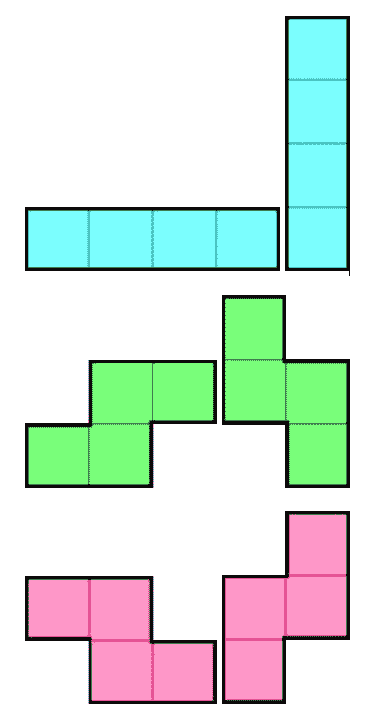
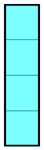

# 事件和基本游戏机制

在上一章中，我们看到了如何通过 `Cargo` 和 `SDL2` 库的基础知识将依赖项添加到项目中。

现在我们有了编写俄罗斯方块游戏所需的 Rust 基础知识。现在是时候看看我们如何实际编写俄罗斯方块了。

在本章中，我们将涵盖以下主题：

+   Tetrimino

+   创建 tetriminos

+   生成 tetrimino

+   Tetris 结构体

+   与游戏地图交互

+   SDL 事件

+   得分、等级、送出的行数

# 编写俄罗斯方块

首先，让我们回顾一下俄罗斯方块的规则（以防万一）：

+   有一个高度为 16 块、宽度为 10 块的网格。

+   你有七种不同的 `tetrimino`（俄罗斯方块部件），它们都是由四个块组成的。

+   每当上一个 `tetrimino` 无法再下降时（因为下面的块已经被占据，或者因为你已经到达了游戏的地板），游戏中的网格顶部就会出现一个新的 `tetrimino`。

+   当一个新的 `tetrimino` 无法再出现时（因为网格顶部已经有了一个 `tetrimino`），游戏结束。

+   每当一行 *满*（所有块都被 `tetrimino` 部分占据）时，它就会消失，并且上面的所有行都会下降一行。

既然我们都同意了游戏规则，让我们看看如何实际编写这些机制。

首先，我们需要实际创建那些 `tetrimino`s。

# Tetrimino

如前所述，每个 `tetrimino` 有四个块。另一个需要注意的事情是它们可以旋转。所以例如，你有一个这样的 `tetrimino`：

*图 3.1*

它还可以在以下三个位置旋转：

*图 3.2*

理论上，每个 `tetrimino` 都应该有四个状态，但现实中并非所有 `tetrimino` 都是这样。例如，这个 `tetrimino` 没有任何变换：

*图 3.3*

这三个只有两种状态：

*图 3.4*

我们有两种处理这些旋转的方法：使用矩阵旋转或存储不同的状态。为了使代码易于阅读和更新，我选择了第二种方法，但请不要犹豫，尝试自己使用矩阵，这可能会帮助你学到很多新东西！

因此，首先，让我们为 `tetrimino`s 编写一个 `struct`：

```rs
struct Tetrimino {
    states: Vec<Vec<Vec<u8>>>,
    x: isize,
    y: usize,
    current_state: u8,
}
```

除了这一行之外，一切看起来都很正常：

```rs
states: Vec<Vec<Vec<u8>>>,
```

真的很丑，对吧？让我们通过使用类型别名来让它看起来更好一些！

那么，我们的 `states` 字段代表什么呢？简单来说，是一个状态列表。每个状态代表一个部件的变换。我想这有点难以理解。让我们写一个例子：

```rs
vec![vec![1, 1, 0, 0],
     vec![1, 1, 0, 0],
     vec![0, 0, 0, 0],
     vec![0, 0, 0, 0]]
```

在这里，`0` 表示该块为空，否则，它是一个 `tetrimino` 块。所以从阅读这段代码来看，我猜你可以猜出我们正在表示正方形：

*图 3.5*

如果你有所疑问，我们这里有四行，每行有四个块，因为 *最大* 的 `tetrimino` 的高度（或宽度，取决于变换）为四：

*图 3.6*

这不是强制性的（我们可以让它适合每个 `tetrimino` 的形状），但它使我们的工作更简单，所以为什么不这样做呢？

回到我们的类型别名：一个方块基本上是一个数字向量或数字向量。每次写下来都很长，所以让我们给它取一个别名如下：

```rs
type Piece = Vec<Vec<u8>>;
```

现在，我们可以将 `states` 字段声明重写如下：

```rs
states: Vec<Piece>,
```

更好且更明确，对吧？但是既然我们也会使用这些状态，为什么不也给它们取别名呢？

```rs
type States = Vec<Piece>;
```

现在我们的 `states` 字段声明变成了：

```rs
states: States,
```

让我们解释一下其他字段（以防万一）：

```rs
struct Tetrimino {
    states: States,
    x: isize,
    y: usize,
    current_state: u8,
}

```

对这个结构体的一点点解释：

+   `states`（如果你还没有理解）是 `tetrimino` 可能的状态列表

+   `x` 是 `tetrimino` 的 *x* 位置

+   `y` 是 `tetrimino` 的 *y* 位置

+   `current_state` 是 `tetrimino` 当前所在的状态

好的，到目前为止一切顺利。现在我们如何泛型地处理这个类型的创建呢？我们不想为每个 `tetrimino` 重新编写这个。这就是 `traits` 发挥作用的地方！

# 创建 `tetrimino`

我们编写了将在我们的游戏中使用的类型，但我们还没有编写它的初始化/创建。这就是 Rust `trait` 将会派上用场的地方。

让我们先写一个生成器 `trait`，它将在所有的 `tetrimino` 上实现：

```rs
trait TetriminoGenerator {
    fn new() -> Tetrimino;
}
```

就这样。这个 `trait` 只提供了一个创建新的 `Tetrimino` 实例的函数。它可能不太喜欢这样，但多亏了这个 `trait`，我们将能够轻松地创建所有的 `tetrimino`。

是时候写我们的第一个 `tetrimino` 了：

```rs
struct TetriminoI;
```

没有必要寻找更多的代码，这就是 `tetrimino` 真正的样子。它是一个空的结构体。有趣的部分就在后面：

```rs
impl TetriminoGenerator for TetriminoI {
    fn new() -> Tetrimino {
        Tetrimino {
            states: vec![vec![vec![1, 1, 1, 1],
                              vec![0, 0, 0, 0],
                              vec![0, 0, 0, 0],
                              vec![0, 0, 0, 0]],
                         vec![vec![0, 1, 0, 0],
                              vec![0, 1, 0, 0],
                              vec![0, 1, 0, 0],
                              vec![0, 1, 0, 0]]],
            x: 4,
            y: 0,
            current_state: 0,
        }
    }
}
```

这是：

*图 3.7*

在这里，一个数字代表一种颜色，`0` 表示没有颜色（因为没有方块）。

就这样。现在你只需调用以下命令就可以创建这个 `tetrimino`：

```rs
let tetrimino = TetriminoI::new();
```

它将返回 `Tetrimino` 结构体的一个实例，这就是你将在游戏中使用的实例。其他 `tetrimino` 结构体（如这里的 `TetriminoI`）只是用来泛型地创建带有相关信息的 `Tetrimino` 结构体。

现在，我们需要创建所有其他的 `tetrimino`，让我们来做这件事：

```rs
struct TetriminoJ;

impl TetriminoGenerator for TetriminoJ {
    fn new() -> Tetrimino {
        Tetrimino {
            states: vec![vec![vec![2, 2, 2, 0],
                              vec![2, 0, 0, 0],
                              vec![0, 0, 0, 0],
                              vec![0, 0, 0, 0]],
                         vec![vec![2, 2, 0, 0],
                              vec![0, 2, 0, 0],
                              vec![0, 2, 0, 0],
                              vec![0, 0, 0, 0]],
                         vec![vec![0, 0, 2, 0],
                              vec![2, 2, 2, 0],
                              vec![0, 0, 0, 0],
                              vec![0, 0, 0, 0]],
                         vec![vec![2, 0, 0, 0],
                              vec![2, 0, 0, 0],
                              vec![2, 2, 0, 0],
                              vec![0, 0, 0, 0]]],
            x: 4,
            y: 0,
            current_state: 0,
        }
    }
}
```

如果你想知道为什么方块有 `2` 这个值，那只是为了在显示时能够区分它们（如果所有的 `tetrimino` 都有相同的颜色，看起来会很丑...）。它没有其他含义。

这个 `tetrimino` 看起来是这样的：

*图 3.8*

让我们继续下一个：

```rs
struct TetriminoL;

impl TetriminoGenerator for TetriminoL {
    fn new() -> Tetrimino {
        Tetrimino {
            states: vec![vec![vec![3, 3, 3, 0],
                              vec![0, 0, 3, 0],
                              vec![0, 0, 0, 0],
                              vec![0, 0, 0, 0]],
                         vec![vec![0, 3, 0, 0],
                              vec![0, 3, 0, 0],
                              vec![3, 3, 0, 0],
                              vec![0, 0, 0, 0]],
                         vec![vec![3, 0, 0, 0],
                              vec![3, 3, 3, 0],
                              vec![0, 0, 0, 0],
                              vec![0, 0, 0, 0]],
                         vec![vec![3, 3, 0, 0],
                              vec![3, 0, 0, 0],
                              vec![3, 0, 0, 0],
                              vec![0, 0, 0, 0]]],
            x: 4,
            y: 0,
            current_state: 0,
        }
    }
}
```

这个 `tetrimino` 看起来是这样的：

*图 3.9*

另一个 `tetrimino`：

```rs
struct TetriminoO;

impl TetriminoGenerator for TetriminoO {
    fn new() -> Tetrimino {
        Tetrimino {
            states: vec![vec![vec![4, 4, 0, 0],
                              vec![4, 4, 0, 0],
                              vec![0, 0, 0, 0],
                              vec![0, 0, 0, 0]]],
            x: 5,
            y: 0,
            current_state: 0,
        }
    }
}
```

这个 `tetrimino` 看起来是这样的：

*图 3.10*

另一个 `tetrimino`（难道它永远不会结束吗？！）：

```rs
struct TetriminoS;

impl TetriminoGenerator for TetriminoS {
    fn new() -> Tetrimino {
        Tetrimino {
            states: vec![vec![vec![0, 5, 5, 0],
                              vec![5, 5, 0, 0],
                              vec![0, 0, 0, 0],
                              vec![0, 0, 0, 0]],
                         vec![vec![0, 5, 0, 0],
                              vec![0, 5, 5, 0],
                              vec![0, 0, 5, 0],
                              vec![0, 0, 0, 0]]],
            x: 4,
            y: 0,
            current_state: 0,
        }
    }
}
```

这个 `tetrimino` 看起来是这样的：

*图 3.11*

猜猜看？另一个 `tetrimino`：

```rs
struct TetriminoZ;

impl TetriminoGenerator for TetriminoZ {
    fn new() -> Tetrimino {
        Tetrimino {
            states: vec![vec![vec![6, 6, 0, 0],
                              vec![0, 6, 6, 0],
                              vec![0, 0, 0, 0],
                              vec![0, 0, 0, 0]],
                         vec![vec![0, 0, 6, 0],
                              vec![0, 6, 6, 0],
                              vec![0, 6, 0, 0],
                              vec![0, 0, 0, 0]]],
            x: 4,
            y: 0,
            current_state: 0,
        }
    }
}
```

这个 `tetrimino` 看起来是这样的：

*图 3.12*

最后一个（终于！）：

```rs
struct TetriminoT;

impl TetriminoGenerator for TetriminoT {
    fn new() -> Tetrimino {
        Tetrimino {
            states: vec![vec![vec![7, 7, 7, 0],
                              vec![0, 7, 0, 0],
                              vec![0, 0, 0, 0],
                              vec![0, 0, 0, 0]],
                         vec![vec![0, 7, 0, 0],
                              vec![7, 7, 0, 0],
                              vec![0, 7, 0, 0],
                              vec![0, 0, 0, 0]],
                         vec![vec![0, 7, 0, 0],
                              vec![7, 7, 7, 0],
                              vec![0, 0, 0, 0],
                              vec![0, 0, 0, 0]],
                         vec![vec![0, 7, 0, 0],
                              vec![0, 7, 7, 0],
                              vec![0, 7, 0, 0],
                              vec![0, 0, 0, 0]]],
            x: 4,
            y: 0,
            current_state: 0,
        }
    }
}
```

最后，这个 `tetrimino` 看起来是这样的：

*图 3.13*

呼...这相当多的代码！虽然简单，但仍然很多！

现在是时候看看我们如何随机生成一个新的 `tetrimino` 了。

# 生成 `tetrimino`

为了做到这一点，我们需要导入另一个`crate`——`rand`。这个`crate`用于生成随机数，这正是我们在这里需要的。

首先，将以下行添加到你的`Cargo.toml`文件中（在`[dependencies]`部分）：

```rs
rand = "0.3"
```

接下来，将以下行添加到你的`main.rs`文件中：

```rs
extern crate rand;
```

我们已经完成了！现在我们可以编写`tetrimino`的生成函数：

```rs
fn create_new_tetrimino() -> Tetrimino {
    let rand_nb = rand::random::<u8>() % 7;
    match rand_nb {
        0 => TetriminoI::new(),
        1 => TetriminoJ::new(),
        2 => TetriminoL::new(),
        3 => TetriminoO::new(),
        4 => TetriminoS::new(),
        5 => TetriminoZ::new(),
        6 => TetriminoT::new(),
        _ => unreachable!(),
    }
}
```

确实很简单，对吧？尽管如此，请注意，这有点太随机了。如果我们连续生成两次以上的相同`tetrimino`（这已经很多了），那就会有问题，所以让我们通过添加一个`static`变量来稍微改进这个函数：

```rs
fn create_new_tetrimino() -> Tetrimino {
    static mut PREV: u8 = 7;
    let mut rand_nb = rand::random::<u8>() % 7;
    if unsafe { PREV } == rand_nb {
        rand_nb = rand::random::<u8>() % 7;
    }
    unsafe { PREV = rand_nb; }
    match rand_nb {
        0 => TetriminoI::new(),
        1 => TetriminoJ::new(),
        2 => TetriminoL::new(),
        3 => TetriminoO::new(),
        4 => TetriminoS::new(),
        5 => TetriminoZ::new(),
        6 => TetriminoT::new(),
        _ => unreachable!(),
    }
}
```

这里有一些解释可能是有帮助的。首先，什么是`static`变量？它是一个在创建它的作用域离开后仍然保持其值的变量。一个例子：

```rs
fn foo() -> u32 {
    static mut VALUE: u32 = 12;
    unsafe {
        VALUE += 1;
        VALUE
    }
}

for _ in 0..5 {
    println!("{}", foo());
}
```

如果你执行这段代码，它会打印出：

```rs
13
14
15
16
17
```

这里是`static`变量的其他属性：

+   它不能有析构函数（虽然可以通过使用`lazy_static` crate 来避免这种限制，但在这里我们不会讨论它），所以只能使用不实现`Drop` trait 的`simple`类型作为`static`。

+   改变`static`变量的值是不安全的（这就是为什么有`unsafe`块），因为`static`在程序的所有线程之间是共享的，并且可以同时被修改和读取

+   读取可变`static`的值是不安全的（原因如前所述）

我们现在有一个可以生成`tetrimino`的函数。我们现在需要添加以下功能：

+   旋转

+   改变位置

让我们从旋转部分开始！

# 旋转 tetrimino

由于我们创建的`Tetrimino`类型，这样做相当简单：

```rs
impl Tetrimino {
    fn rotate(&mut self) {
        self.current_state += 1;
        if self.current_state as usize >= self.states.len() {
            self.current_state = 0;
        }
    }
}
```

我们已经完成了。然而，我们没有进行检查：如果已经有其他`tetrimino`使用了某个块会发生什么？我们只是简单地覆盖它。这种事情是不能接受的！

为了执行这个检查，我们需要游戏地图。它只是一个向量行，一行是一个`u8`的向量。或者，更简单地说：

```rs
Vec<Vec<u8>>
```

考虑到它并不难读，我们就保持这种方式。现在让我们编写这个方法：

```rs
fn test_position(&self, game_map: &[Vec<u8>],
                 tmp_state: usize, x: isize, y: usize) -> bool {
    for decal_y in 0..4 {
      for decal_x in 0..4 {
        let x = x + decal_x;
        if self.states[tmp_state][decal_y][decal_x as usize] != 0 
            &&
                (y + decal_y >= game_map.len() ||
                 x < 0 ||
                 x as usize >= game_map[y + decal_y].len() ||
                 game_map[y + decal_y][x as usize] != 0) {
                return false;
            }
        }
    }
    return true;
}
```

在解释这个函数之前，似乎有必要解释一下为什么游戏地图变成了`&[Vec<u8>]`。当你将一个非可变引用传递给一个向量（`Vec<T>`）时，它就会被解引用为一个`&[T]`切片，这是一个对向量内容的常量视图。

我们已经完成了（这个方法）！现在轮到解释了：我们遍历我们的`tetrimino`的每一个块，检查这个块在游戏地图中是否空闲（通过检查它是否等于`0`），并且如果没有超出游戏地图的范围。

现在我们有了`test_position`方法，我们可以更新`rotate`方法：

```rs
fn rotate(&mut self, game_map: &[Vec<u8>]) {
    let mut tmp_state = self.current_state + 1;
    if tmp_state as usize >= self.states.len() {
        tmp_state = 0;
    }
    let x_pos = [0, -1, 1, -2, 2, -3];
    for x in x_pos.iter() {
        if self.test_position(game_map, tmp_state as usize,
                              self.x + x, self.y) == true {
            self.current_state = tmp_state;
            self.x += *x;
            break
        }
    }
}
```

确实更长一些。由于我们无法确定这个部件会被放置在我们想要的位置，我们需要创建临时变量并检查可能性。让我们来看看代码：

```rs
let mut tmp_state = self.current_state + 1;
if tmp_state as usize >= self.states.len() {
    tmp_state = 0;
}
```

这正是我们的`rotate`方法之前所做的事情，但现在，我们在进一步之前使用临时变量：

```rs
let x_pos = [0, -1, 1, -2, 2, -3];
```

这一行单独来看并没有什么意义，但它将非常有用：如果我们不能把碎片放在我们想要的地方，我们尝试在`x`轴上移动它，看看它是否在其他地方可以工作。这使你能够拥有一个更加灵活、更易于游玩的 Tetris：

```rs
for x in x_pos.iter() {
    if self.test_position(game_map, tmp_state as usize,
                          self.x + x, self.y) == true {
        self.current_state = tmp_state;
        self.x += *x;
        break
    }
}
```

根据之前给出的解释，这个循环应该很容易理解。对于每个`x`位移，我们检查碎片是否可以放置在那里。如果它起作用，我们就改变`tetrimino`的值，否则我们继续。

如果没有`x`位移起作用，我们只是让函数什么也不做。

现在我们能够旋转和测试`tetrimino`的位置，实际上移动`tetrimino`也会很好（例如，当计时器归零且`tetrimino`需要下降时）。与`rotate`方法的主要区别将是，如果`tetrimino`不能移动，我们将返回一个布尔值，以便调用者知道这一点。

所以这个方法看起来是这样的：

```rs
fn change_position(&mut self, game_map: &[Vec<u8>], new_x: isize, new_y: usize) -> bool {
    if self.test_position(game_map, self.current_state as usize,  
    new_x, new_y) == true {
        self.x = new_x as isize;
        self.y = new_y;
        true
    } else {
        false
    }
}
```

你肯定已经注意到的另一个区别是我们不检查多个可能的位置，只检查接收到的那个。原因是简单的；与旋转不同，当`tetrimino`收到移动指令时，我们不能移动`tetrimino`。想象一下要求`tetrimino`向右移动，但它没有移动，或者更糟，它向左移动！我们不能允许这样的事情发生，所以我们不做这件事。

现在关于方法的代码：它非常简单。如果我们能把`tetrimino`放在某个位置，我们就更新`tetrimino`的位置并返回 true，否则，我们除了返回 false 之外什么都不做。

大部分工作都在`test_position`方法中完成，这使得我们的方法真正小巧。

现在我们有了这三个方法，我们几乎拥有了所有需要的东西。但为了将来的更多简洁性，让我们再添加一个：

```rs
fn test_current_position(&self, game_map: &[Vec<u8>]) -> bool {
    self.test_position(game_map, self.current_state as usize,  
    self.x, self.y)
}
```

当我们生成一个新的`tetrimino`时，我们会使用它：如果`tetrimino`不能放在它出现的位置，因为另一个`tetrimino`已经在那里，这意味着游戏结束了。

我们现在可以说，我们的`Tetrimino`类型已经完全实现。恭喜！现在是时候开始游戏类型了！

# Tetris 结构

这个类型将包含所有游戏信息：

+   游戏地图

+   当前等级

+   分数

+   行数

+   当前的`tetrimino`

+   一些潜在的其他信息（例如幽灵或下一个`tetrimino`的预览！）

让我们写下这个类型：

```rs
struct Tetris {
    game_map: Vec<Vec<u8>>,
    current_level: u32,
    score: u32,
    nb_lines: u32,
    current_piece: Option<Tetrimino>,
}
```

再次强调，很简单。我认为不需要任何额外的信息，所以我们继续！

让我们从为这个新类型编写`new`方法开始：

```rs
impl Tetris {
    fn new() -> Tetris {
        let mut game_map = Vec::new();
        for _ in 0..16 {
            game_map.push(vec![0, 0, 0, 0, 0, 0, 0, 0, 0, 0]);
        }
        Tetris {
            game_map: game_map,
            current_level: 1,
            score: 0,
            nb_lines: 0,
            current_piece: None,
        }
    }
}
```

除了可能是一个循环之外，没有真正复杂的东西。让我们看看它是如何工作的：

```rs
let mut game_map = Vec::new();
for _ in 0..16 {
    game_map.push(vec![0, 0, 0, 0, 0, 0, 0, 0, 0, 0]);
}
```

我们知道`tetris`地图的宽度是 10 个方块，高度是 16 个方块。这个循环通过遍历行数来创建我们的游戏地图，生成一个 10 个方块的空向量，这将是一行。

除了这个之外，其他一切都是非常直接的：

+   你从等级 1 开始

+   你的得分为 0

+   没有发送任何行

+   当前没有 `tetrimino`

让我们先随机生成一个新的 `tetrimino`。为此，你需要 `rand` crate。将以下内容添加到你的 `Cargo.toml` 文件中：

```rs
rand = "0.3"
```

然后在你的 `main` 文件顶部添加以下内容：

```rs
extern crate rand;
```

然后我们可以编写这个方法：

```rs
fn create_new_tetrimino(&self) -> Tetrimino {
    static mut PREV: u8 = 7;
    let mut rand_nb = rand::random::<u8>() % 7;
    if unsafe { PREV } == rand_nb {
        rand_nb = rand::random::<u8>() % 7;
    }
    unsafe { PREV = rand_nb; }
    match rand_nb {
        0 => TetriminoI::new(),
        1 => TetriminoJ::new(),
        2 => TetriminoL::new(),
        3 => TetriminoO::new(),
        4 => TetriminoS::new(),
        5 => TetriminoZ::new(),
        6 => TetriminoT::new(),
        _ => unreachable!(),
    }
}
```

说明：

```rs
static mut PREV: u8 = 7;
```

`static` 关键字在 `Rust` 中与在 `C` 和 `C++` 中的变量相同：变量的值将在函数调用之间保持。所以例如，如果你编写以下函数：

```rs
fn incr() -> u32 {
    static mut NB: u32 = 0;
    unsafe {
        NB += 1;
        NB
    }
}
```

然后你按照以下方式调用它：

```rs
for _ in 0..5 {
    println!("{}", incr());
}
```

你将得到以下输出：

```rs
1
2
3
4
5
```

因此，现在，为什么我们有这些 `unsafe` 块？原因很简单：如果在不同的线程中访问和修改静态变量，你无法确保不会出现数据竞争、并发错误，甚至内存错误。

在这种情况下，因为我们没有线程，所以没问题。然而，请记住，你应该始终尽量避免使用 `unsafe`，并且只有在没有其他选择的情况下才使用它。

然而，如果我们的静态变量不是可变的，那么我们就不需要 `unsafe` 块就能访问它的值。原因再次很简单：即使多个线程同时尝试访问它的值，由于这个值不能改变，所以不可能有数据竞争，因此它是安全的。

让我们继续解释我们函数的代码：

```rs
let mut rand_nb = rand::random::<u8>() % 7;
```

这行代码生成一个随机的 `u8` 并将其值限制在 0（包含）和 6（包含）之间，因为我们有七个不同的 `tetrimino`：

```rs
if unsafe { PREV } == rand_nb {
    rand_nb = rand::random::<u8>() % 7;
}
```

如果生成的 `tetrimino` 与上一个相同，我们将生成另一个。这可以防止你一次性出现太多的相同 `tetrimino`。这并不是最好的方法，为每个 `tetrimino` 进行特定的平衡会更好，但这个解决方案足够可行（而且更容易编写！）：

```rs
unsafe { PREV = rand_nb; }
```

我们现在将生成的 `tetrimino` *ID* 设置到我们的 `static` 变量中：

```rs
match rand_nb {
    0 => TetriminoI::new(),
    1 => TetriminoJ::new(),
    2 => TetriminoL::new(),
    3 => TetriminoO::new(),
    4 => TetriminoS::new(),
    5 => TetriminoZ::new(),
    6 => TetriminoT::new(),
    _ => unreachable!(),
}
```

对于这种模式匹配没有太多可说的。每个 *ID* 都匹配一个 `tetrimino`，然后我们调用相应的构造函数。这个构造过程中唯一真正有趣的地方是以下这一行：

```rs
_ => unreachable!(),
```

这个宏非常有用。它允许我们在匹配的值上添加一层安全性。如果代码进入这个模式匹配，它将立即崩溃（因为，正如宏的名字所暗示的，这种情况不应该发生）。

# 与游戏地图交互

好的，我们现在可以移动所有的 `tetrimino` 并生成它们。还有两个机制尚未实现：检查行以查看是否可以发送（即，移除因为完成）以及使 `tetrimino` *永久*（即，不能再移动）。

让我们从检查这一行开始：

```rs
fn check_lines(&mut self) {
    let mut y = 0;

    while y < self.game_map.len() {
        let mut complete = true;

        for x in &self.game_map[y] {
            if *x == 0 {
                complete = false;
                break
            }
        }
        if complete == true {
            self.game_map.remove(y);
            y -= 1;
            // increase the number of self.lines
        }
        y += 1;
    }
    while self.game_map.len() < 16 {
        self.game_map.insert(0, vec![0, 0, 0, 0, 0, 0, 0, 0, 0, 0]);
    }
}
```

目前，我没有添加得分、发送行数的计数以及等级处理，但这里将是以后完成这些的地方。

现在是解释这个方法的时候了。它的目的是在行填满时（即，当每个方块都被 `tetrimino` 方块占据时）删除行。所以我们只是逐行遍历游戏地图并对每一行进行检查。

代码本身并没有使用很多 Rust 特定的语法，但你可能会想知道为什么我们这样做。我指的是这个循环：

```rs
while y < self.game_map.len() {
```

当我们本可以使用：

```rs
for line in self.game_map {
```

这实际上是一个好问题，答案很简单，但如果你习惯了 Rust 的所有权工作方式，可能难以理解。

所有的问题实际上都来自这一行：

```rs
self.game_map.remove(y);
```

在这里，我们为了删除一行而可变地借用了 `self.game_map`。然而，`self.game_map` 已经被 `for` 循环非可变地借用了！快速回顾一下借用规则是如何工作的：

+   你可以无数次非可变地借用一个变量

+   你只能在没有其他借用（无论是可变还是不可变）的情况下可变地借用一个变量

因此，在我们的例子中，`for` 循环会违反第二条规则，因为我们试图获取对 `self.game_map` 的可变访问时会有一个非可变的借用。

在这种情况下，我们有两个解决方案：

+   手动遍历游戏地图（使用索引变量）

+   将要删除的行存储到第二个向量中，然后在我们退出循环后删除它们

在这个情况下，这两种解决方案在某种程度上是等价的，所以我只是选择了第一个。

第一轮循环完成后，我们已经用空行填充了游戏地图，以替换我们删除的行：

```rs
while self.game_map.len() < 16 {
    self.game_map.insert(0, vec![0, 0, 0, 0, 0, 0, 0, 0, 0, 0]);
}
```

我们已经完成了这个方法！让我们写另一个。

所以现在是我们编写 `make_permanent` 方法的时候了。就像之前的那个一样，它不会是一个完整的版本，但将来，这就是我们更新分数的地方（我们在 `tetrimino` 被永久化时更新分数）。

所以让我们来写它：

```rs
fn make_permanent(&mut self) {
    if let Some(ref mut piece) = self.current_piece {
        let mut shift_y = 0;

        while shift_y < piece.states[piece.current_state as  
         usize].len() &&
              piece.y + shift_y < self.game_map.len() {
            let mut shift_x = 0;

            while shift_x < piece.states[piece.current_state as  
             usize][shift_y].len() &&
                  (piece.x + shift_x as isize) < 
                   self.game_map[piece.y +  
                   shift_y].len() as isize {
                if piece.states[piece.current_state as usize] 
                [shift_y][shift_x] != 0 {
                    let x = piece.x + shift_x as isize;
                    self.game_map[piece.y + shift_y][x as usize] =
                        piece.states[piece.current_state as usize] 
                         [shift_y][shift_x];
                }
                shift_x += 1;
            }
            shift_y += 1;
        }
    }
    self.check_lines();
    self.current_piece = None;
}
```

这段代码看起来并不鼓舞人心... 准备好，解释即将到来：

```rs
if let Some(ref mut piece) = self.current_piece {
```

这是一个简单的模式匹配。如果 `self.current_piece` 是 `Some`，那么我们就进入条件，并将 `Some` 中包含的值绑定到 `piece` 变量：

```rs
while shift_y < piece.states[piece.current_state as usize].len() &&
      piece.y + shift_y < self.game_map.len() {
```

这个循环及其条件允许我们通过检查当前旋转（即 `self.current_state`）是否超出游戏地图限制来避免缓冲区溢出错误。

内部循环（遍历行的块）也是一样：

```rs
while shift_x < piece.states[piece.current_state as usize][shift_y].len() &&
      (piece.x + shift_x as isize) < self.game_map[piece.y + shift_y].len() as isize {
```

正是这个循环，我们将当前 `tetrimino` 的块写入游戏地图：

```rs
if piece.states[piece.current_state as usize][shift_y][shift_x] != 0 {
    let x = piece.x + shift_x as isize;
    self.game_map[piece.y + shift_y][x as usize] =
        piece.states[piece.current_state as usize][shift_y][shift_x];
}
```

如果当前 `tetrimino` 的当前块不为空，我们就将其放入游戏地图（就这么简单）。

完成后，这就是我们调用 `check_lines` 方法的位置。但现在你肯定会想知道为什么我们不在 `if let` 条件中直接调用它。嗯，原因和我们在 `check_lines` 方法中不使用 `for` 循环的原因一样，`self` 已经被下一行可变地借用了：

```rs
if let Some(ref mut piece) = self.current_piece {
```

对的：如果一个类型的元素被借用，那么它的父元素也会被可变借用！

使用这两种方法，我们的 `Tetris` 类型现在已经完全实现（除了稍后需要的小修改）。现在是时候添加 `SDL` 事件处理了！

# SDL 事件

没有多少不同的事件需要处理：

+   *左* 和 *右* 方向键用来将 `tetrimino` 移动到左边或右边

+   *向上箭头* 键使 `tetrimino` 旋转

+   *向下箭头* 键使 `tetrimino` 下降一个方块

+   *空格键* 使 `tetrimino` 瞬间下降到最底部

+   *Escape* 键退出游戏

仍然可以在稍后添加一些（例如，使用 *回车* 键暂停游戏等），但现在，让我们专注于这些。为此，回到游戏的 `main` 函数中的主循环内部，并用以下函数替换当前的事件处理：

```rs
fn handle_events(tetris: &mut Tetris, quit: &mut bool, timer: &mut SystemTime,
                 event_pump: &mut sdl2::EventPump) -> bool {
    let mut make_permanent = false;
    if let Some(ref mut piece) = tetris.current_piece {
        let mut tmp_x = piece.x;
        let mut tmp_y = piece.y;

        for event in event_pump.poll_iter() {
          match event {
          Event::Quit { .. } |
          Event::KeyDown { keycode: Some(Keycode::Escape), .. } => 
                {
                    *quit = true;
                    break
                }
           Event::KeyDown { keycode: Some(Keycode::Down), .. } =>
                {
                    *timer = SystemTime::now();
                    tmp_y += 1;
                }
           Event::KeyDown { keycode: Some(Keycode::Right), .. } => 
                {
                    tmp_x += 1;
                }
            Event::KeyDown { keycode: Some(Keycode::Left), .. } => 
                {
                    tmp_x -= 1;
                }
            Event::KeyDown { keycode: Some(Keycode::Up), .. } => 
                {
                    piece.rotate(&tetris.game_map);
                }
           Event::KeyDown { keycode: Some(Keycode::Space), .. } => 
               {
                  let x = piece.x;
                  let mut y = piece.y;
           while piece.change_position(&tetris.game_map, x, y + 1) 
           == true {
                        y += 1;
                   }
                    make_permanent = true;
                }
                _ => {}
            }
        }
        if !make_permanent {
         if piece.change_position(&tetris.game_map, tmp_x, tmp_y)
           == 
            false &&
               tmp_y != piece.y {
                make_permanent = true;
            }
        }
    }
    if make_permanent {
        tetris.make_permanent();
        *timer = SystemTime::now();
    }
    make_permanent
}
```

这是一个相当大的函数：

```rs
let mut make_permanent = false;
```

这个变量将告诉我们当前的 `tetrimino` 是否仍在下落。如果不是，那么它变为 `true`，`tetrimino` 被放入游戏地图，并生成一个新的 `tetrimino`。幸运的是，我们已经编写了所有执行这些操作所需的功能：

```rs
if let Some(ref mut piece) = tetris.current_piece {
```

这是一种简单的模式绑定。如果我们的游戏没有当前碎片（由于某种原因），那么我们不做任何事情，直接离开：

```rs
let mut tmp_x = piece.x;
let mut tmp_y = piece.y;
```

如果在 `x` 或 `y` 轴上有移动，我们将将其写入这些变量，然后测试 `tetrimino` 是否可以真正移动到那里：

```rs
for event in event_pump.poll_iter() {
```

由于自上次我们进入这个函数以来可能发生了多个事件，我们需要遍历它们所有。

现在我们正到达有趣的部分：

```rs
match event {
    Event::Quit { .. } |
    Event::KeyDown { keycode: Some(Keycode::Escape), .. } => {
        *quit = true;
        break
    }
    Event::KeyDown { keycode: Some(Keycode::Down), .. } => {
        *timer = SystemTime::now();
        tmp_y += 1;
    }
    Event::KeyDown { keycode: Some(Keycode::Right), .. } => {
        tmp_x += 1;
    }
    Event::KeyDown { keycode: Some(Keycode::Left), .. } => {
        tmp_x -= 1;
    }
    Event::KeyDown { keycode: Some(Keycode::Up), .. } => {
        piece.rotate(&tetris.game_map);
    }
    Event::KeyDown { keycode: Some(Keycode::Space), .. } => {
      let x = piece.x;
      let mut y = piece.y;
      while piece.change_position(&tetris.game_map, x, y + 1) ==  
      true {
            y += 1;
        }
        make_permanent = true;
    }
    _ => {}
}
```

我们几乎可以将这段小代码视为我们应用程序的核心，没有它，无法与程序进行交互。如果你想添加更多交互，这就是你应该添加它们的地方：

```rs
Event::Quit { .. } |
Event::KeyDown { keycode: Some(Keycode::Escape), .. } => {
    *quit = true;
    break
}
```

如果我们从 `sdl` 接收到一个 *退出* 事件，或者我们接收到一个 `Escape`、`KeyDown` 事件，我们将 `quit` 变量设置为 `true`。它将在函数外部使用，以便退出主循环——从而退出程序本身。然后我们 *break;* 没有必要再继续，因为我们知道我们要离开游戏：

```rs
Event::KeyDown { keycode: Some(Keycode::Down), .. } => {
    *timer = SystemTime::now();
    tmp_y += 1;
}
```

如果按下 *向下箭头*，我们需要使 `tetrimino` 下降一个方块，并将 `timer` 值设置为当前时间。`timer` 用于知道 `tetrimino` 块下落的速度。时间越短，下落速度越快。

目前，这个函数中没有使用它，所以我们将看看如何在函数外部处理它：

```rs
Event::KeyDown { keycode: Some(Keycode::Right), .. } => {
    tmp_x += 1;
}
Event::KeyDown { keycode: Some(Keycode::Left), .. } => {
    tmp_x -= 1;
}
```

在这里，我们处理 *右箭头* 和 *左箭头* 键。这就像 *向下箭头* 键一样，只是我们不需要更改 `timer` 变量：

```rs
Event::KeyDown { keycode: Some(Keycode::Up), .. } => {
    piece.rotate(&tetris.game_map);
}
```

如果我们接收到一个 *向上箭头* 键按下的事件，我们将旋转 `tetrimino`：

```rs
Event::KeyDown { keycode: Some(Keycode::Space), .. } => {
   let x = piece.x;
   let mut y = piece.y;
  while piece.change_position(&tetris.game_map, x, y + 1) == true {
        y += 1;
    }
    make_permanent = true;
}
```

最后是我们的最后一个事件：按下 *空格键* 的事件。在这里，我们将 `tetrimino` 向下移动尽可能远，并将 `make_permanent` 变量设置为 `true`。

使用这个，我们的事件就到这里了。然而，正如我们之前所说的，如果你想添加更多的事件，这就是你应该放置它们的地方。

是时候将这些放入我们的主循环中：

```rs
fn print_game_information(tetris: &Tetris) {
    println!("Game over...");
    println!("Score:           {}", tetris.score);
    // println!("Number of lines: {}", tetris.nb_lines);
    println!("Current level:   {}", tetris.current_level);
    // Check highscores here and update if needed
}

let mut tetris = Tetris::new();
let mut timer = SystemTime::now();

loop {
    if match timer.elapsed() {
        Ok(elapsed) => elapsed.as_secs() >= 1,
        Err(_) => false,
    } {
        let mut make_permanent = false;
        if let Some(ref mut piece) = tetris.current_piece {
            let x = piece.x;
            let y = piece.y + 1;
            make_permanent =  
             !piece.change_position(&tetris.game_map,  
             x, y);
        }
        if make_permanent {
            tetris.make_permanent();
        }
        timer = SystemTime::now();
    }

    // We need to draw the tetris "grid" in here.

    if tetris.current_piece.is_none() {
        let current_piece = tetris.create_new_tetrimino();
        if !current_piece.test_current_position(&tetris.game_map) {
            print_game_information(&tetris);
            break
        }
        tetris.current_piece = Some(current_piece);
    }
    let mut quit = false;
    if !handle_events(&mut tetris, &mut quit, &mut timer, &mut 
     event_pump) {
        if let Some(ref mut piece) = tetris.current_piece {
            // We need to draw our current tetrimino in here.
        }
    }
    if quit {
        print_game_information(&tetris);
        break
    }

    // We need to draw the game map in here.

    sleep(Duration::new(0, 1_000_000_000u32 / 60));
}
```

这看起来并不长，对吧？只是几个应该绘制我们的 `Tetris` 的注释，但除此之外，一切都在其中，这意味着我们的 `Tetris` 现在已经完全可用（即使它还没有显示）。

让我们解释一下那里发生了什么：

```rs
let mut tetris = Tetris::new();
let mut timer = SystemTime::now();
```

在这里，我们初始化了我们的`Tetris`对象和`timer`。计时器将用来告诉我们`tetrimino`应该下降一个方块的时间：

```rs
if match timer.elapsed() {
    Ok(elapsed) => elapsed.as_secs() >= 1,
    Err(_) => false,
} {
    let mut make_permanent = false;
    if let Some(ref mut piece) = tetris.current_piece {
        let x = piece.x;
        let y = piece.y + 1;
        make_permanent = !piece.change_position(&tetris.game_map,
         x, y);
    }
    if make_permanent {
        tetris.make_permanent();
    }
    timer = SystemTime::now();
}
```

此代码检查自上次`tetrimino`下降一个方块以来是否已过去一秒或更长时间。如果我们想处理级别，我们需要替换以下行：

```rs
Ok(elapsed) => elapsed.as_secs() >= 1,
```

其替代品需要更通用的东西，我们将添加一个数组来存储不同级别的下降速度。

所以回到代码，如果已经过去了一秒或更长时间，我们就尝试让`tetrimino`下降一个方块。如果它不能下降，那么我们就将其放入游戏地图并重新初始化`timer`变量。

再次，你可能想知道为什么我们不得不创建`make_permanent`变量而不是直接检查以下内容的输出：

```rs
!piece.change_position(&tetris.game_map, x, y)
```

它有一个`if`条件，对吗？好吧，就像之前几次一样，这是因为借用检查器。我们在这里借用`tetris`：

```rs
if let Some(ref mut piece) = tetris.current_piece {
```

所以只要我们处于这种状态，我们就不能可变地使用`tetris`，这就是为什么我们将条件的结果存储在`make_permanent`中，这样我们就可以在之后使用`make_permanent`方法：

```rs
if tetris.current_piece.is_none() {
    let current_piece = tetris.create_new_tetrimino();
    if !current_piece.test_current_position(&tetris.game_map) {
        print_game_information(&tetris);
        return
    }
    tetris.current_piece = Some(current_piece);
}
```

如果没有当前的`tetrimino`，我们需要生成一个新的，我们通过调用`create_new_tetrimino`方法来实现。然后我们通过调用`test_current_position`方法检查它是否可以放在顶部行上。如果不能，那么这意味着游戏结束了，我们退出。否则，我们将新生成的`tetrimino`存储在`tetris.current_piece`中，然后继续。

这里缺少两件事：

+   由于我们不处理发送的行数、得分或级别的增加，因此不需要打印它们

+   我们还没有添加高分加载/覆盖

当然，我们稍后会添加所有这些：

```rs
let mut quit = false;
if !handle_events(&mut tetris, &mut quit, &mut timer, &mut event_pump) {
    if let Some(ref mut piece) = tetris.current_piece {
        // We need to draw our current tetrimino in here.
    }
}
if quit {
    print_game_information(&tetris);
    break
}
```

此代码调用`handle_events`函数并根据其输出执行操作。它返回当前`tetrimino`是否已放入游戏地图。如果是这样，则不需要绘制它。

我们现在需要完成以下剩余的事情：

+   添加得分、级别和发送的行数

+   如果需要，加载/覆盖高分

+   实际上绘制`Tetris`

看起来我们离结束已经很近了！让我们先添加得分、发送的行数和级别！

# 得分、级别、发送的行数

最大的需求更改将是级别处理。你需要创建一个数组，包含不同的时间来增加`tetrimino`的下降速度，并检查级别是否需要更改（基于行数）。

在以下情况下将更新得分：

+   当`tetrimino`被永久固定时

+   当发送一行时

+   当玩家完成`Tetris`（游戏地图中不再有方块）

让我们从最简单的更改开始——得分。

首先，让我们将以下方法添加到我们的`Tetris`类型中：

```rs
fn update_score(&mut self, to_add: u32) {
    self.score += to_add;
}
```

我们可以假设这里不需要额外的解释。

接下来，让我们更新几个方法：

```rs
fn check_lines(&mut self) {
    let mut y = 0;
    let mut score_add = 0;

    while y < self.game_map.len() {
        let mut complete = true;

        for x in &self.game_map[y] {
            if *x == 0 {
                complete = false;
                break
            }
        }
        if complete == true {
            score_add += self.current_level;
            self.game_map.remove(y);
            y -= 1;
        }
        y += 1;
    }
    if self.game_map.len() == 0 {
        // A "tetris"!
        score_add += 1000;
    }
    self.update_score(score_add);
    while self.game_map.len() < 16 {
        // we'll add this method just after!
        self.increase_line();
        self.game_map.insert(0, vec![0, 0, 0, 0, 0, 0, 0, 0, 0,
         0]);
    }
}
```

如往常一样，我们创建一个临时变量（这里，`score_add`），一旦`self`的借用结束，我们就调用`update_score`方法。还有`increase_line`方法的用法。我们还没有定义它；它将在之后出现。

第二个方法是`make_permanent`：

```rs
fn make_permanent(&mut self) {
    let mut to_add = 0;
    if let Some(ref mut piece) = self.current_piece {
        let mut shift_y = 0;

        while shift_y < piece.states[piece.current_state as 
         usize].len() &&
              piece.y + shift_y < self.game_map.len() {
            let mut shift_x = 0;

            while shift_x < piece.states[piece.current_state as usize] 
             [shift_y].len() &&
                  (piece.x + shift_x as isize) < self.game_map[piece.y  
                   + shift_y].len() as isize {
                if piece.states[piece.current_state as usize][shift_y] 
                 [shift_x] != 0 {
                    let x = piece.x + shift_x as isize;
                    self.game_map[piece.y + shift_y][x as usize] =
                        piece.states[piece.current_state as usize]    
                         [shift_y][shift_x];
                }
                shift_x += 1;
            }
            shift_y += 1;
        }
        to_add += self.current_level;
    }
    self.update_score(to_add);
    self.check_lines();
    self.current_piece = None;
}
```

在`self.check_lines`调用之前包含这个。

通过更新这两个方法，我们现在已经完全实现了得分处理。

# 发送等级和行数

下两个是紧密相连的（等级直接取决于发送的行数），我们将同时实现它们。

在做任何其他事情之前，让我们定义以下两个`const`：

```rs
const LEVEL_TIMES: [u32; 10] = [1000, 850, 700, 600, 500, 400, 300, 250, 221, 190];
const LEVEL_LINES: [u32; 10] = [20,   40,  60,  80,  100, 120, 140, 160, 180, 200];
```

第一个对应于当前`tetrimino`下降一个方块之前的时间。每个情况对应不同的等级。

第二个对应于玩家达到下一等级之前需要消除的行数。

接下来，让我们在我们的`Tetris`类型中添加以下方法：

```rs
fn increase_line(&mut self) {
    self.nb_lines += 1;
    if self.nb_lines > LEVEL_LINES[self.current_level as usize - 1] {
        self.current_level += 1;
    }
}
```

没有什么复杂的。只是在读取`LEVEL_LINES`常量时要小心，因为我们的`current_level`变量从`1`开始，而不是`0`。

接下来，我们需要更新我们确定时间是否到的方法。为了做到这一点，让我们再写一个函数：

```rs
fn is_time_over() {
    match timer.elapsed() {
        Ok(elapsed) => {
            let millis = elapsed.as_secs() as u32 * 1000 + 
             elapsed.subsec_nanos() / 1_000_000;
            millis > LEVEL_TIMES[tetris.current_level as usize - 1]
        }
        Err(_) => false,
    }
}
```

一个小但棘手的问题。问题是`timer.elapsed`返回的类型（`Duration`）不提供获取毫秒数的方法，所以我们需要自己获取它。

首先，我们获取经过的秒数，然后乘以 1,000（因为 1 秒=1,000 毫秒）。最后，我们获取当前秒内的纳秒数，然后除以 1,000,000（因为 1 毫秒=1 百万纳秒）。

现在我们可以比较结果，看看`tetrimino`是否应该下降，并返回结果：

```rs
if is_time_over(&tetris, &timer) {
    let mut make_permanent = false;
    if let Some(ref mut piece) = tetris.current_piece {
        let x = piece.x;
        let y = piece.y + 1;
        make_permanent = !piece.change_position(&tetris.game_map,
         x, y);
    }
    if make_permanent {
        tetris.make_permanent();
    }
    timer = SystemTime::now();
}
```

通过这个，我们已经完成了这一部分。现在让我们来做最后一个：高分加载/覆盖！

# 高分加载/覆盖

我们已经在上一章中看到了如何执行 I/O 操作，所以这将非常快：

```rs
const NB_HIGHSCORES: usize = 5;

fn update_vec(v: &mut Vec<u32>, value: u32) -> bool {
    if v.len() < NB_HIGHSCORES {
        v.push(value);
        v.sort();
        true
    } else {
        for entry in v.iter_mut() {
            if value > *entry {
                *entry = value;
                return true;
            }
        }
        false
    }
}

fn print_game_information(tetris: &Tetris) {
    let mut new_highest_highscore = true;
    let mut new_highest_lines_sent = true;
    if let Some((mut highscores, mut lines_sent)) = 
     load_highscores_and_lines() {
        new_highest_highscore = update_vec(&mut highscores,  
         tetris.score);
        new_highest_lines_sent = update_vec(&mut lines_sent,  
         tetris.nb_lines);
        if new_highest_highscore || new_highest_lines_sent {
            save_highscores_and_lines(&highscores, &lines_sent);
        }
    } else {
        save_highscores_and_lines(&[tetris.score], &
         [tetris.nb_lines]);
    }
    println!("Game over...");
    println!("Score:           {}{}",
             tetris.score,
             if new_highest_highscore { " [NEW HIGHSCORE]"} else {   
              "" });
    println!("Number of lines: {}{}",
             tetris.nb_lines,
             if new_highest_lines_sent { " [NEW HIGHSCORE]"} else {  
              "" });
    println!("Current level:   {}", tetris.current_level);
}
```

这段代码没有太多要解释的。目前，我们限制了每个高分记录的数量为`5`。只需按需更新即可。

通过这段代码，所有机制都已实现。剩下的只是实际绘制游戏！

这是本章的完整代码：

```rs
extern crate rand;
extern crate sdl2;

use sdl2::event::Event;
use sdl2::keyboard::Keycode;
use sdl2::pixels::Color;
use sdl2::rect::Rect;
use sdl2::render::{Canvas, Texture, TextureCreator};
use sdl2::video::{Window, WindowContext};

use std::fs::File;
use std::io::{self, Read, Write};
use std::thread::sleep;
use std::time::{Duration, SystemTime};

const TETRIS_HEIGHT: usize = 40;
const HIGHSCORE_FILE: &'static str = "scores.txt";
const LEVEL_TIMES: [u32; 10] = [1000, 850, 700, 600, 500, 400, 300, 250, 221, 190];
const LEVEL_LINES: [u32; 10] = [20,   40,  60,  80,  100, 120, 140, 160, 180, 200];
const NB_HIGHSCORES: usize = 5;

type Piece = Vec<Vec<u8>>;
type States = Vec<Piece>;

trait TetriminoGenerator {
    fn new() -> Tetrimino;
}

struct TetriminoI;

impl TetriminoGenerator for TetriminoI {
    fn new() -> Tetrimino {
        Tetrimino {
            states: vec![vec![vec![1, 1, 1, 1],
                              vec![0, 0, 0, 0],
                              vec![0, 0, 0, 0],
                              vec![0, 0, 0, 0]],
                         vec![vec![0, 1, 0, 0],
                              vec![0, 1, 0, 0],
                              vec![0, 1, 0, 0],
                              vec![0, 1, 0, 0]]],
            x: 4,
            y: 0,
            current_state: 0,
        }
    }
}

struct TetriminoJ;

impl TetriminoGenerator for TetriminoJ {
    fn new() -> Tetrimino {
        Tetrimino {
            states: vec![vec![vec![2, 2, 2, 0],
                              vec![2, 0, 0, 0],
                              vec![0, 0, 0, 0],
                              vec![0, 0, 0, 0]],
                         vec![vec![2, 2, 0, 0],
                              vec![0, 2, 0, 0],
                              vec![0, 2, 0, 0],
                              vec![0, 0, 0, 0]],
                         vec![vec![0, 0, 2, 0],
                              vec![2, 2, 2, 0],
                              vec![0, 0, 0, 0],
                              vec![0, 0, 0, 0]],
                         vec![vec![2, 0, 0, 0],
                              vec![2, 0, 0, 0],
                              vec![2, 2, 0, 0],
                              vec![0, 0, 0, 0]]],
            x: 4,
            y: 0,
            current_state: 0,
        }
    }
}

struct TetriminoL;

impl TetriminoGenerator for TetriminoL {
    fn new() -> Tetrimino {
        Tetrimino {
            states: vec![vec![vec![3, 3, 3, 0],
                              vec![0, 0, 3, 0],
                              vec![0, 0, 0, 0],
                              vec![0, 0, 0, 0]],
                         vec![vec![0, 3, 0, 0],
                              vec![0, 3, 0, 0],
                              vec![3, 3, 0, 0],
                              vec![0, 0, 0, 0]],
                         vec![vec![3, 0, 0, 0],
                              vec![3, 3, 3, 0],
                              vec![0, 0, 0, 0],
                              vec![0, 0, 0, 0]],
                         vec![vec![3, 3, 0, 0],
                              vec![3, 0, 0, 0],
                              vec![3, 0, 0, 0],
                              vec![0, 0, 0, 0]]],
            x: 4,
            y: 0,
            current_state: 0,
        }
    }
}

struct TetriminoO;

impl TetriminoGenerator for TetriminoO {
    fn new() -> Tetrimino {
        Tetrimino {
            states: vec![vec![vec![4, 4, 0, 0],
                              vec![4, 4, 0, 0],
                              vec![0, 0, 0, 0],
                              vec![0, 0, 0, 0]]],
            x: 5,
            y: 0,
            current_state: 0,
        }
    }
}

struct TetriminoS;

impl TetriminoGenerator for TetriminoS {
    fn new() -> Tetrimino {
        Tetrimino {
            states: vec![vec![vec![0, 5, 5, 0],
                              vec![5, 5, 0, 0],
                              vec![0, 0, 0, 0],
                              vec![0, 0, 0, 0]],
                         vec![vec![0, 5, 0, 0],
                              vec![0, 5, 5, 0],
                              vec![0, 0, 5, 0],
                              vec![0, 0, 0, 0]]],
            x: 4,
            y: 0,
            current_state: 0,
        }
    }
}

struct TetriminoZ;

impl TetriminoGenerator for TetriminoZ {
    fn new() -> Tetrimino {
        Tetrimino {
            states: vec![vec![vec![6, 6, 0, 0],
                              vec![0, 6, 6, 0],
                              vec![0, 0, 0, 0],
                              vec![0, 0, 0, 0]],
                         vec![vec![0, 0, 6, 0],
                              vec![0, 6, 6, 0],
                              vec![0, 6, 0, 0],
                              vec![0, 0, 0, 0]]],
            x: 4,
            y: 0,
            current_state: 0,
        }
    }
}

struct TetriminoT;

impl TetriminoGenerator for TetriminoT {
    fn new() -> Tetrimino {
        Tetrimino {
            states: vec![vec![vec![7, 7, 7, 0],
                              vec![0, 7, 0, 0],
                              vec![0, 0, 0, 0],
                              vec![0, 0, 0, 0]],
                         vec![vec![0, 7, 0, 0],
                              vec![7, 7, 0, 0],
                              vec![0, 7, 0, 0],
                              vec![0, 0, 0, 0]],
                         vec![vec![0, 7, 0, 0],
                              vec![7, 7, 7, 0],
                              vec![0, 0, 0, 0],
                              vec![0, 0, 0, 0]],
                         vec![vec![0, 7, 0, 0],
                              vec![0, 7, 7, 0],
                              vec![0, 7, 0, 0],
                              vec![0, 0, 0, 0]]],
            x: 4,
            y: 0,
            current_state: 0,
        }
    }
}

struct Tetrimino {
    states: States,
    x: isize,
    y: usize,
    current_state: u8,
}

impl Tetrimino {
    fn rotate(&mut self, game_map: &[Vec<u8>]) {
        let mut tmp_state = self.current_state + 1;
        if tmp_state as usize >= self.states.len() {
            tmp_state = 0;
        }
        let x_pos = [0, -1, 1, -2, 2, -3];
        for x in x_pos.iter() {
            if self.test_position(game_map, tmp_state as usize,
                                  self.x + x, self.y) == true {
                self.current_state = tmp_state;
                self.x += *x;
                break
            }
        }
    }

    fn test_position(&self, game_map: &[Vec<u8>],
                     tmp_state: usize, x: isize, y: usize) -> bool {
        for shift_y in 0..4 {
            for shift_x in 0..4 {
                let x = x + shift_x;
                if self.states[tmp_state][shift_y][shift_x as usize] != 0 &&
                    (y + shift_y >= game_map.len() ||
                     x < 0 ||
                     x as usize >= game_map[y + shift_y].len() ||
                     game_map[y + shift_y][x as usize] != 0) {
                    return false;
                }
            }
        }
        return true;
    }

    fn test_current_position(&self, game_map: &[Vec<u8>]) -> bool {
        self.test_position(game_map, self.current_state as usize, self.x, self.y)
    }

    fn change_position(&mut self, game_map: &[Vec<u8>], new_x: isize, new_y: usize) -> bool {
        if self.test_position(game_map, self.current_state as usize, new_x, new_y) == true {
            self.x = new_x as isize;
            self.y = new_y;
            true
        } else {
            false
        }
    }
}

struct Tetris {
    game_map: Vec<Vec<u8>>,
    current_level: u32,
    score: u32,
    nb_lines: u32,
    current_piece: Option<Tetrimino>,
}

impl Tetris {
    fn new() -> Tetris {
        let mut game_map = Vec::new();
        for _ in 0..16 {
            game_map.push(vec![0, 0, 0, 0, 0, 0, 0, 0, 0, 0]);
        }
        Tetris {
            game_map: game_map,
            current_level: 1,
            score: 0,
            nb_lines: 0,
            current_piece: None,
        }
    }

    fn update_score(&mut self, to_add: u32) {
        self.score += to_add;
    }

    fn increase_level(&mut self) {
        self.current_level += 1;
    }

    fn increase_line(&mut self) {
        self.nb_lines += 1;
        if self.nb_lines > LEVEL_LINES[self.current_level as usize - 1] {
            self.increase_level();
        }
    }

    fn check_lines(&mut self) {
        let mut y = 0;
        let mut score_add = 0;

        while y < self.game_map.len() {
            let mut complete = true;

            for x in &self.game_map[y] {
                if *x == 0 {
                    complete = false;
                    break
                }
            }
            if complete == true {
                score_add += self.current_level;
                self.game_map.remove(y);
                y -= 1;
            }
            y += 1;
        }
        if self.game_map.len() == 0 {
            // A "tetris"!
            score_add += 1000;
        }
        self.update_score(score_add);
        while self.game_map.len() < 16 {
            self.increase_line();
            self.game_map.insert(0, vec![0, 0, 0, 0, 0, 0, 0, 0, 0, 0]);
        }
    }

    fn create_new_tetrimino(&self) -> Tetrimino {
        static mut PREV: u8 = 7;
        let mut rand_nb = rand::random::<u8>() % 7;
        if unsafe { PREV } == rand_nb {
            rand_nb = rand::random::<u8>() % 7;
        }
        unsafe { PREV = rand_nb; }
        match rand_nb {
            0 => TetriminoI::new(),
            1 => TetriminoJ::new(),
            2 => TetriminoL::new(),
            3 => TetriminoO::new(),
            4 => TetriminoS::new(),
            5 => TetriminoZ::new(),
            6 => TetriminoT::new(),
            _ => unreachable!(),
        }
    }

    fn make_permanent(&mut self) {
        let mut to_add = 0;
        if let Some(ref mut piece) = self.current_piece {
            let mut shift_y = 0;

            while shift_y < piece.states[piece.current_state as usize].len() &&
                  piece.y + shift_y < self.game_map.len() {
                let mut shift_x = 0;

                while shift_x < piece.states[piece.current_state as usize] 
                  [shift_y].len() &&
                      (piece.x + shift_x as isize) < self.game_map[piece.y + 
                       shift_y].len() as isize {
                    if piece.states[piece.current_state as usize][shift_y][shift_x]  
                    != 0 {
                        let x = piece.x + shift_x as isize;
                        self.game_map[piece.y + shift_y][x as usize] =
                            piece.states[piece.current_state as usize][shift_y]
                            [shift_x];
                    }
                    shift_x += 1;
                }
                shift_y += 1;
            }
            to_add += self.current_level;
        }
        self.update_score(to_add);
        self.check_lines();
        self.current_piece = None;
    }
}

fn handle_events(tetris: &mut Tetris, quit: &mut bool, timer: &mut SystemTime,
                 event_pump: &mut sdl2::EventPump) -> bool {
    let mut make_permanent = false;
    if let Some(ref mut piece) = tetris.current_piece {
        let mut tmp_x = piece.x;
        let mut tmp_y = piece.y;

        for event in event_pump.poll_iter() {
            match event {
                Event::Quit { .. } |
                Event::KeyDown { keycode: Some(Keycode::Escape), .. } => {
                    *quit = true;
                    break
                }
                Event::KeyDown { keycode: Some(Keycode::Down), .. } => {
                    *timer = SystemTime::now();
                    tmp_y += 1;
                }
                Event::KeyDown { keycode: Some(Keycode::Right), .. } => {
                    tmp_x += 1;
                }
                Event::KeyDown { keycode: Some(Keycode::Left), .. } => {
                    tmp_x -= 1;
                }
                Event::KeyDown { keycode: Some(Keycode::Up), .. } => {
                    piece.rotate(&tetris.game_map);
                }
                Event::KeyDown { keycode: Some(Keycode::Space), .. } => {
                    let x = piece.x;
                    let mut y = piece.y;
                    while piece.change_position(&tetris.game_map, x, y + 1) == true 
                    {
                        y += 1;
                    }
                    make_permanent = true;
                }
                _ => {}
            }
        }
        if !make_permanent {
            if piece.change_position(&tetris.game_map, tmp_x, tmp_y) == false &&
               tmp_y != piece.y {
                make_permanent = true;
            }
        }
    }
    if make_permanent {
        tetris.make_permanent();
        *timer = SystemTime::now();
    }
    make_permanent
}

fn write_into_file(content: &str, file_name: &str) -> io::Result<()> {
    let mut f = File::create(file_name)?;
    f.write_all(content.as_bytes())
}

fn read_from_file(file_name: &str) -> io::Result<String> {
    let mut f = File::open(file_name)?;
    let mut content = String::new();
    f.read_to_string(&mut content)?;
    Ok(content)
}

fn slice_to_string(slice: &[u32]) -> String {
    slice.iter().map(|highscore| highscore.to_string()).collect::<Vec<String>>().join(" ")
}

fn save_highscores_and_lines(highscores: &[u32], number_of_lines: &[u32]) -> bool {
    let s_highscores = slice_to_string(highscores);
    let s_number_of_lines = slice_to_string(number_of_lines);
    write_into_file(&format!("{}\n{}\n", s_highscores, s_number_of_lines), HIGHSCORE_FILE).is_ok()
}

fn line_to_slice(line: &str) -> Vec<u32> {
    line.split(" ").filter_map(|nb| nb.parse::<u32>().ok()).collect()
}

fn load_highscores_and_lines() -> Option<(Vec<u32>, Vec<u32>)> {
    if let Ok(content) = read_from_file(HIGHSCORE_FILE) {
        let mut lines = content.splitn(2, "\n").map(|line| line_to_slice(line)).collect::<Vec<_>>();
        if lines.len() == 2 {
            let (lines_sent, highscores) = (lines.pop().unwrap(), lines.pop().unwrap());
            Some((highscores, lines_sent))
        } else {
            None
        }
    } else {
        None
    }
}

fn update_vec(v: &mut Vec<u32>, value: u32) -> bool {
    if v.len() < NB_HIGHSCORES {
        v.push(value);
        true
    } else {
        for entry in v.iter_mut() {
            if value > *entry {
                *entry = value;
                return true;
            }
        }
        false
    }
}

fn print_game_information(tetris: &Tetris) {
    let mut new_highest_highscore = true;
    let mut new_highest_lines_sent = true;
    if let Some((mut highscores, mut lines_sent)) = load_highscores_and_lines() {
        new_highest_highscore = update_vec(&mut highscores, tetris.score);
        new_highest_lines_sent = update_vec(&mut lines_sent, tetris.nb_lines);
        if new_highest_highscore || new_highest_lines_sent {
            save_highscores_and_lines(&highscores, &lines_sent);
        }
    } else {
        save_highscores_and_lines(&[tetris.score], &[tetris.nb_lines]);
    }
    println!("Game over...");
    println!("Score:           {}{}",
             tetris.score,
             if new_highest_highscore { " [NEW HIGHSCORE]"} else { "" });
    println!("Number of lines: {}{}",
             tetris.nb_lines,
             if new_highest_lines_sent { " [NEW HIGHSCORE]"} else { "" });
    println!("Current level:   {}", tetris.current_level);
}

fn is_time_over(tetris: &Tetris, timer: &SystemTime) -> bool {
    match timer.elapsed() {
        Ok(elapsed) => {
            let millis = elapsed.as_secs() as u32 * 1000 + elapsed.subsec_nanos() /  
             1_000_000;
            millis > LEVEL_TIMES[tetris.current_level as usize - 1]
        }
        Err(_) => false,
    }
}

fn main() {
    let sdl_context = sdl2::init().expect("SDL initialization failed");
    let mut tetris = Tetris::new();
    let mut timer = SystemTime::now();

    let mut event_pump = sdl_context.event_pump().expect("Failed to get SDL event 
     pump");

    let grid_x = (width - TETRIS_HEIGHT as u32 * 10) as i32 / 2;
    let grid_y = (height - TETRIS_HEIGHT as u32 * 16) as i32 / 2;

    loop {
        if is_time_over(&tetris, &timer) {
            let mut make_permanent = false;
            if let Some(ref mut piece) = tetris.current_piece {
                let x = piece.x;
                let y = piece.y + 1;
                make_permanent = !piece.change_position(&tetris.game_map, x, y);
            }
            if make_permanent {
                tetris.make_permanent();
            }
            timer = SystemTime::now();
        }

        // We need to draw the tetris "grid" in here.

        if tetris.current_piece.is_none() {
            let current_piece = tetris.create_new_tetrimino();
            if !current_piece.test_current_position(&tetris.game_map) {
                print_game_information(&tetris);
                break
            }
            tetris.current_piece = Some(current_piece);
        }
        let mut quit = false;
        if !handle_events(&mut tetris, &mut quit, &mut timer, &mut event_pump) {
            if let Some(ref mut piece) = tetris.current_piece {
                // We need to draw our current tetrimino in here.
            }
        }
        if quit {
            print_game_information(&tetris);
            break
        }

        // We need to draw the game map in here.

        sleep(Duration::new(0, 1_000_000_000u32 / 60));
    }
}

```

# 概述

呼！这一章真的很长！但现在，所有的游戏机制都已经到位，所以添加最后剩下的部分（比如绘图）将变得轻而易举。

再次提醒，在开始阅读下一章之前，一定要理解这一章。
