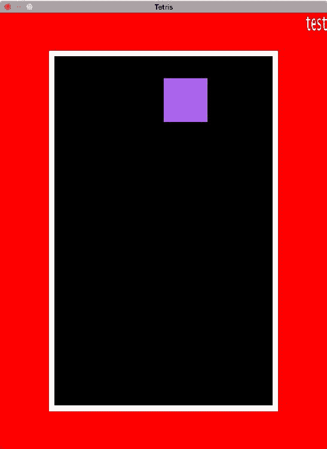

# 第四章：添加所有游戏机制

在前面的章节中，第一章，*Rust 基础*，第二章，*从 SDL 开始*，和 第三章，*事件和基本游戏机制*，我们编写了所有需要的机制。唯一缺少的部分是 UI 渲染和字体管理。简而言之，是容易的部分。所以在本章中，我们将添加游戏的绘制和一些字体处理。

让我们开始吧！

# 开始游戏机制

让我们先从 UI 渲染开始，然后添加字体管理，以便实时显示游戏信息。

# 渲染 UI

在当前的代码库中，为了能够拥有一个完全工作的俄罗斯方块，需要做的改动非常少。

# 渲染初始化

目前，`main` 函数非常小。首先，让我们在函数顶部添加以下几行：

```rs
    let sdl_context = sdl2::init().expect("SDL initialization 
      failed");
    let video_subsystem = sdl_context.video().expect("Couldn't get
       SDL video subsystem");
    let width = 600;
    let height = 800;
```

没有必要解释，我们已经在前面的章节中解释了一切，所以让我们继续。

在以下几行之后：

```rs
    let sdl_context = sdl2::init().expect("SDL initialization
      failed");
    let mut tetris = Tetris::new();
    let mut timer = SystemTime::now();

    let mut event_pump = sdl_context.event_pump().expect("Failed to
      get SDL event pump");

    let grid_x = (width - TETRIS_HEIGHT as u32 * 10) as i32 / 2;
    let grid_y = (height - TETRIS_HEIGHT as u32 * 16) as i32 / 2;
```

让我们添加以下几行：

```rs
    let window = video_subsystem.window("Tetris", width, height)
        .position_centered() // to put it in the middle of the screen
        .build() // to create the window
        .expect("Failed to create window");

    let mut canvas = window.into_canvas()
        .target_texture()
        .present_vsync() // To enable v-sync.
        .build()
        .expect("Couldn't get window's canvas");

    let texture_creator: TextureCreator<_> = canvas.texture_creator();

    let grid = create_texture_rect(&mut canvas,
        &texture_creator,
        0, 0, 0,
        TETRIS_HEIGHT as u32 * 10,
        TETRIS_HEIGHT as u32 * 16).expect("Failed to create
           a texture");

    let border = create_texture_rect(&mut canvas,
        &texture_creator,
        255, 255, 255,
        TETRIS_HEIGHT as u32 * 10 + 20,
        TETRIS_HEIGHT as u32 * 16 + 20).expect("Failed to create 
          a texture");

    macro_rules! texture {
      ($r:expr, $g:expr, $b:expr) => (
        create_texture_rect(&mut canvas,
          &texture_creator,
          $r, $g, $b,
          TETRIS_HEIGHT as u32,
          TETRIS_HEIGHT as u32).unwrap()
      )
    }

    let textures = [texture!(255, 69, 69), texture!(255, 220, 69), 
        texture!(237, 150, 37),texture!(171, 99, 237), texture!(77, 149, 
        239), texture!(39, 218, 225), texture!(45, 216, 47)];
```

中间甚至有一个宏，所以，确实需要一些解释！

```rs
    let window = video_subsystem.window("Tetris", width, height)
       .position_centered()
       .build()
       .expect("Failed to create window");

    let mut canvas = window.into_canvas()
       .target_texture()
       .present_vsync()
       .build()
       .expect("Couldn't get window's canvas");

    let texture_creator: TextureCreator<_> = canvas.texture_creator();
```

我们已经看到了所有这些，所以我们将快速浏览每个：

1.  我们创建窗口。

1.  我们初始化我们将要绘制的区域。

1.  我们初始化纹理引擎。

接下来的两个调用更有趣，是实际 UI 渲染的开始：

```rs
    let grid = create_texture_rect(&mut canvas,
       &texture_creator,
       0, 0, 0,
       TETRIS_HEIGHT as u32 * 10,
       TETRIS_HEIGHT as u32 * 16).expect("Failed to create a texture");

    let border = create_texture_rect(&mut canvas,
       &texture_creator,
       255, 255, 255,
       TETRIS_HEIGHT as u32 * 10 + 20,
       TETRIS_HEIGHT as u32 * 16 + 20).expect("Failed to create a texture");
```

它们都调用在第二章从 SDL 开始中定义的函数。`grid` 是我们将要绘制俄罗斯方块和边框以表示游戏区域边界的地方。第一个是黑色，而另一个是白色。以下是他们将看起来像的截图：

*图 4.1*

所以现在让我们写下代码以便更容易地加载：

```rs
    macro_rules! texture {
      ($r:expr, $g:expr, $b:expr) => (
        create_texture_rect(&mut canvas,
           &texture_creator,
           $r, $g, $b,
           TETRIS_HEIGHT as u32,
           TETRIS_HEIGHT as u32).unwrap()
      )
    }
```

我们已经在第一章，*Rust 基础*中介绍了宏，所以我们将假设你很容易理解这个宏的作用。（它使用 `$r`，`$g` 和 `$b` 作为我们想要纹理的颜色来调用 `create_texture_rect` 函数。）

```rs
    let textures = [texture!(255, 69, 69), texture!(255, 220, 69), 
         texture!(237, 150, 37), texture!(171, 99, 237), texture!(77, 149,
          239), texture!(39, 218, 225), texture!(45, 216, 47)];
```

在这里，我们为我们的俄罗斯方块块创建纹理。所以七种类型的俄罗斯方块块有七个纹理。

我们初始化了所有需要的渲染。所以现在，让我们开始渲染！

# 渲染

仍然在 `main` 函数中，但这次我们要进入主循环（没有文字游戏！）。就在 `is_time_over` 条件之后，让我们添加：

```rs
    canvas.set_draw_color(Color::RGB(255, 0, 0));
    canvas.clear();
    canvas.copy(&border,
        None,
        Rect::new((width - TETRIS_HEIGHT as u32 * 10) as i32 / 2 - 10,
        (height - TETRIS_HEIGHT as u32 * 16) as i32 / 2 - 10,
        TETRIS_HEIGHT as u32 * 10 + 20, TETRIS_HEIGHT as u32 * 16 + 20))
        .expect("Couldn't copy texture into window");
         canvas.copy(&grid,
         None,
         Rect::new((width - TETRIS_HEIGHT as u32 * 10) as i32 / 2,
         (height - TETRIS_HEIGHT as u32 * 16) as i32 / 2,
         TETRIS_HEIGHT as u32 * 10, TETRIS_HEIGHT as u32 * 16))
         .expect("Couldn't copy texture into window");
```

如果我们想要根据玩家的实际等级更改背景，我们只需更改第一行即可。没问题。

关于以下公式：

```rs
    Rect::new((width - TETRIS_HEIGHT as u32 * 10) as i32 / 2 - 10,
       (height - TETRIS_HEIGHT as u32 * 16) as i32 / 2 - 10,
       TETRIS_HEIGHT as u32 * 10 + 20, TETRIS_HEIGHT as u32 * 16 + 20)
```

我想这里可能需要一个小解释。正如你肯定记得，`Rect::new` 接受以下四个参数：

+   *x* 位置

+   *y* 位置

+   宽度

+   高度

对于前两个，我们将游戏地图居中。例如，对于 *x* 位置，我们需要首先计算它将占用多少宽度（因此是 `10` 个俄罗斯方块）：

```rs
    TETRIS_HEIGHT as u32 * 10
```

然后我们从总宽度中减去这个值：

```rs
    width - TETRIS_HEIGHT as u32 * 10
```

剩下的就是不是游戏地图的部分。所以如果我们用它作为 *x* 位置，游戏地图将完全位于左侧。看起来不太美观。幸运的是，居中相当容易，我们只需要将这个结果除以 2，如下所示：

```rs
    (width - TETRIS_HEIGHT as u32 * 10) as i32 / 2
```

好的，现在，关于减去 10 的原因；这是因为边框。它的宽度是 `10`，所以我们也需要减去它以实现真正的居中：

```rs
    (width - TETRIS_HEIGHT as u32 * 10) as i32 / 2 - 10
```

并不是很复杂，但第一次阅读时可能难以理解。高度也是如此，所以我们不会重复相同的解释。现在是时候讨论宽度和高度的计算了！我认为你已经从之前的解释中得到了它，但以防万一：

```rs
    TETRIS_HEIGHT as u32 * 10
```

一个 `Tetris` 有十块宽度。因此，我们的游戏地图也必须有相同的宽度。

```rs
    TETRIS_HEIGHT as u32 * 10 + 20
```

我们现在还添加了总边框的宽度（因为每边都有一个边框，而边框的宽度为 10 像素，`10 * 2 = 20`）。

高度也是如此。

一旦你了解了这些公式的原理，你也会了解其他所有公式的原理。

由于我们已经绘制了游戏环境，现在是时候绘制俄罗斯方块了。首先，让我们绘制当前的方块！为了做到这一点，我们需要更新 `handle_events` 条件内的 `for` 循环：

```rs
    if !handle_events(&mut tetris, &mut quit, &mut timer, &mut
      event_pump) {
      if let Some(ref mut piece) = tetris.current_piece {
        for (line_nb, line) in piece.states[piece.current_state
           as usize].iter().enumerate() {
          for (case_nb, case) in line.iter().enumerate() {
            if *case == 0 {
              continue
            }
            // The new part is here:
              canvas.copy(&textures[*case as usize - 1],
                None,
                Rect::new(grid_x + (piece.x + case_nb as isize) as 
                  i32 * TETRIS_HEIGHT as i32, grid_y + (piece.y + 
                  line_nb) as i32 * TETRIS_HEIGHT as i32, TETRIS_HEIGHT
                  as u32, TETRIS_HEIGHT as u32))
                  .expect("Couldn't copy texture into window");
          }
        }
      }
    }
```

对于当前俄罗斯方块中的每一块，我们粘贴一个与其 ID 对应的纹理。从前面公式的解释中，我们可以假设没有必要回到那些 *新* 的公式上。

这样，只剩下最后一部分了；绘制所有其他俄罗斯方块块：

```rs
    for (line_nb, line) in tetris.game_map.iter().enumerate() {
      for (case_nb, case) in line.iter().enumerate() {
        if *case == 0 {
            continue
        }
        canvas.copy(&textures[*case as usize - 1],
          None, Rect::new(grid_x + case_nb as i32 * TETRIS_HEIGHT
          as i32, grid_y + line_nb as i32 * TETRIS_HEIGHT as i32,
          TETRIS_HEIGHT as u32, TETRIS_HEIGHT as u32))
          .expect("Couldn't copy texture into window");
      }
    }
    canvas.present();
```

在这个代码中，我们遍历游戏地图每一行的每一块，并粘贴相应的纹理，如果游戏地图的 *占用*。

完成后，我们通过以下方式将所有更改应用到显示上：

```rs
    canvas.present();
```

这样，我们的 `Tetris` 现在就完成了！你现在可以通过运行命令来玩游戏：

```rs
cargo run --release
```

`--release` 是用于以非调试模式启动程序。

`main` 函数的完整代码现在如下所示：

```rs
    fn main() {
      let sdl_context = sdl2::init().expect("SDL initialization failed");
      let video_subsystem = sdl_context.video().expect("Couldn't get 
          SDL video subsystem");
      let width = 600;
      let height = 800;
      let mut timer = SystemTime::now();
      let mut event_pump = sdl_context.event_pump().expect("Failed to get
          SDL event pump");

      let grid_x = (width - TETRIS_HEIGHT as u32 * 10) as i32 / 2;
      let grid_y = (height - TETRIS_HEIGHT as u32 * 16) as i32 / 2;
      let mut tetris = Tetris::new();

      let window = video_subsystem.window("Tetris", width, height)
                                .position_centered()
                                .build()
                                .expect("Failed to create window");

      let mut canvas = window.into_canvas()
                           .target_texture()
                           .present_vsync()
                           .build()
                           .expect("Couldn't get window's canvas");

      let texture_creator: TextureCreator<_> = canvas.texture_creator();

      let grid = create_texture_rect(&mut canvas,
               &texture_creator,
               0, 0, 0,
               TETRIS_HEIGHT as u32 * 10,
               TETRIS_HEIGHT as u32 * 16).expect("Failed to create
                 a texture");

      let border = create_texture_rect(&mut canvas,
               &texture_creator,
               255, 255, 255,
               TETRIS_HEIGHT as u32 * 10 + 20,
               TETRIS_HEIGHT as u32 * 16 + 20).expect("Failed to create
                 a texture");

      macro_rules! texture {
        ($r:expr, $g:expr, $b:expr) => (
            create_texture_rect(&mut canvas,
                                &texture_creator,
                                $r, $g, $b,
                                TETRIS_HEIGHT as u32,
                                TETRIS_HEIGHT as u32).unwrap()
        )
      }

      let textures = [texture!(255, 69, 69), texture!(255, 220, 69),
         texture!(237, 150, 37), texture!(171, 99, 237), 
         texture!(77, 149, 239), texture!(39, 218, 225),
         texture!(45, 216, 47)];

      loop {
        if is_time_over(&tetris, &timer) {
          let mut make_permanent = false;
          if let Some(ref mut piece) = tetris.current_piece {
            let x = piece.x;
            let y = piece.y + 1;
            make_permanent = !piece.change_position(&tetris.game_map,
               x, y);
          }
          if make_permanent {
            tetris.make_permanent();
          }
          timer = SystemTime::now();
        }

        canvas.set_draw_color(Color::RGB(255, 0, 0));
        canvas.clear();

        canvas.copy(&border,
           None,
           Rect::new((width - TETRIS_HEIGHT as u32 * 10) as i32 / 2 - 10,
           (height - TETRIS_HEIGHT as u32 * 16) as i32 / 2 - 10,
           TETRIS_HEIGHT as u32 * 10 + 20, TETRIS_HEIGHT as u32 * 16 + 20))
           .expect("Couldn't copy texture into window");
        canvas.copy(&grid,
           None,
           Rect::new((width - TETRIS_HEIGHT as u32 * 10) as i32 / 2,
           (height - TETRIS_HEIGHT as u32 * 16) as i32 / 2,
           TETRIS_HEIGHT as u32 * 10, TETRIS_HEIGHT as u32 * 16))
           .expect("Couldn't copy texture into window");

        if tetris.current_piece.is_none() {
            let current_piece = tetris.create_new_tetrimino();
            if !current_piece.test_current_position(&tetris.game_map) {
                print_game_information(&tetris);
                break
            }
            tetris.current_piece = Some(current_piece);
        }
        let mut quit = false;
        if !handle_events(&mut tetris, &mut quit, &mut timer,
           &mut event_pump) {
         if let Some(ref mut piece) = tetris.current_piece {
           for (line_nb, line) in piece.states[piece.current_state 
               as usize].iter().enumerate() {
             for (case_nb, case) in line.iter().enumerate() {
               if *case == 0 {
                 continue
               }
               canvas.copy(&textures[*case as usize - 1],
                  None,
                  Rect::new(grid_x + (piece.x + case_nb as isize) 
                    as i32 * TETRIS_HEIGHT as i32,
                  grid_y + (piece.y + line_nb) as i32 * TETRIS_HEIGHT 
                    as i32,
                    TETRIS_HEIGHT as u32, TETRIS_HEIGHT as u32))
                  .expect("Couldn't copy texture into window");
             }
           }
         }
        }
        if quit {
          print_game_information(&tetris);
            break
        }

        for (line_nb, line) in tetris.game_map.iter().enumerate() {
          for (case_nb, case) in line.iter().enumerate() {
             if *case == 0 {
                continue
             }
             canvas.copy(&textures[*case as usize - 1],
                None,
                Rect::new(grid_x + case_nb as i32 * TETRIS_HEIGHT as i32,
                grid_y + line_nb as i32 * TETRIS_HEIGHT as i32,
                TETRIS_HEIGHT as u32, TETRIS_HEIGHT as u32))
                .expect("Couldn't copy texture into window");
          }
        }
        canvas.present();

        sleep(Duration::new(0, 1_000_000_000u32 / 60));
      }
    }
```

下面是这个代码当前输出的一个示例：

*图 4.2*

现在它正在工作，但关于显示游戏信息，比如当前分数、等级或发送的行数，怎么办？

# 玩转字体

为了显示这些信息，我们需要使用字体。然而，不需要额外的外部依赖，但我们需要使用一个功能，因此我们需要更新我们的 `Cargo.toml`：

```rs
    [features]
    default = ["sdl2/ttf"]
```

默认情况下，`sdl2` 包不提供 `ttf` 模块，你需要通过在编译过程中添加 `ttf` 功能来启用它。这就是我们通过告诉 `cargo`：“默认情况下，我想启用 `sdl2` 包的 `ttf` 功能”。你可以尝试添加和不添加这个新上下文初始化后的差异。

```rs
    let ttf_context = sdl2::ttf::init().expect("SDL TTF initialization
        failed");
```

如果你遇到缺少库的编译错误，这意味着你没有安装相应的库。要解决这个问题，你需要通过你喜欢的包管理器安装它。

# 在 OS X 上安装

运行以下命令：

```rs
brew install sdl2_ttf
```

# 在 Linux 上安装

运行以下命令（当然，取决于你的包管理器）：

```rs
sudo apt-get install libsdl2-ttf-dev
```

# 其他系统/包管理器

你可以在[`www.libsdl.org/projects/SDL_ttf/`](https://www.libsdl.org/projects/SDL_ttf/)下载库。

按照说明在你的系统上安装它，然后只需运行项目。如果没有错误出现，那么这意味着你已经正确安装了它。

是时候开始真正的事情了！

# 加载字体

在继续之前，我们实际上需要一个字体。我选择了 **Lucida console**，但选择你喜欢的字体，这并不重要。下载后，将其也放入 `assets` 文件夹中。现在，是时候实际加载字体了：

```rs
     let font = ttf_context.load_font("assets/lucida.ttf", 128).expect("
       Couldn't load the font");
```

注意，如果你想给你的字体应用样式（例如粗体、斜体、删除线或下划线），那么你需要应用的对象就是它。以下是一个例子：

```rs
    font.set_style(sdl2::ttf::STYLE_BOLD);
```

现在，为了实际显示文本，我们还需要完成两个步骤：

1.  渲染文本。

1.  从它创建一个纹理。

让我们编写一个函数来完成这个任务：

```rs
    fn create_texture_from_text<'a>(texture_creator: &'a 
       TextureCreator<WindowContext>,
       font: &sdl2::ttf::Font,
       text: &str,
       r: u8, g: u8, b: u8,
       ) -> Option<Texture<'a>> {
         if let Ok(surface) = font.render(text)
           .blended(Color::RGB(r, g, b)) {
          texture_creator.create_texture_from_surface(&surface).ok()
         } else {
               None
           }
       }
```

看起来很像 `create_texture_rect`，对吧？

为什么不测试一下呢？让我们调用这个函数并将纹理粘贴到屏幕上看看：

```rs
     let rendered_text = create_texture_from_text(&texture_creator,
        &font, "test", 255, 255, 255).expect("Cannot render text");
     canvas.copy(&rendered_text, None, Some(Rect::new(width as i32 - 
        40, 0, 40, 30)))
    .expect("Couldn't copy text");
```

它看起来是这样的：

*图 4.3*

对于纹理矩形，我使用以下规则：一个字符是一个 10 x 30 像素的块。所以在这个例子中，因为 `test` 有 4 个字母，我们需要一个 40 x 30 像素的块。让我们写一个函数来简化这个过程：

```rs
     fn get_rect_from_text(text: &str, x: i32, y: i32) -> Option<Rect> {
        Some(Rect::new(x, y, text.len() as u32 * 20, 30))
     }
```

好的，所以现在是我们渲染游戏信息并编写一个新函数来执行此操作的时候了：

```rs
    fn display_game_information<'a>(tetris: &Tetris,
       canvas: &mut Canvas<Window>,
       texture_creator: &'a TextureCreator<WindowContext>,
       font: &sdl2::ttf::Font,
       start_x_point: i32) {
     let score_text = format!("Score: {}", tetris.score);
     let lines_sent_text = format!("Lines sent: {}", tetris.nb_lines);
     let level_text = format!("Level: {}", tetris.current_level);

     let score = create_texture_from_text(&texture_creator, &font,
        &score_text, 255, 255, 255)
        .expect("Cannot render text");
     let lines_sent = create_texture_from_text(&texture_creator, &font,
        &lines_sent_text, 255, 255, 255)
        .expect("Cannot render text");
     let level = create_texture_from_text(&texture_creator, &font,
        &level_text, 255, 255, 255)
        .expect("Cannot render text");

     canvas.copy(&score, None, get_rect_from_text(&score_text, 
       start_x_point, 90))
          .expect("Couldn't copy text");
    canvas.copy(&lines_sent, None, get_rect_from_text(&score_text,
       start_x_point, 125))
          .expect("Couldn't copy text");
    canvas.copy(&level, None, get_rect_from_text(&score_text, 
       start_x_point, 160))
          .expect("Couldn't copy text");
    }
```

然后我们将其称为如下：

```rs
    display_game_information(&tetris, &mut canvas, &texture_creator, &font,
       width as i32 - grid_x - 10);
```

现在看起来是这样的：

*图 4.4*

太棒了，我们现在有了实时游戏信息！不是吗？什么？它看起来很丑，还与游戏重叠？让我们移动游戏！我们不会将其居中，而是给它一个固定的 `x` 位置（这将使我们的公式变得非常简单）。

首先，让我们更新我们的 `grid_x` 变量：

```rs
    let grid_x = 20;
```

然后，让我们更新 `canvas.copy` 调用：

```rs
     canvas.copy(&border,
            None,
            Rect::new(10,
                      (height - TETRIS_HEIGHT as u32 * 16) as i32 / 2 - 10,
                      TETRIS_HEIGHT as u32 * 10 + 20, TETRIS_HEIGHT as u32 * 16 + 20))
      .expect("Couldn't copy texture into window");
     canvas.copy(&grid,
       None,
       Rect::new(20,
       (height - TETRIS_HEIGHT as u32 * 16) as i32 / 2,
        TETRIS_HEIGHT as u32 * 10, TETRIS_HEIGHT as u32 * 16))
      .expect("Couldn't copy texture into window");
```

就这样。你现在有一个不错的俄罗斯方块可以玩：

**图 4.5**

我们可以通过添加文本周围的边框来稍微改进显示效果，或者甚至显示下一个部件的预览，或者甚至添加一个 *幽灵*，但我认为从这个点开始，你可以轻松地添加它们。

就这样，这个俄罗斯方块就完成了，玩得开心，享受与 `sdl2` 的互动！

# 摘要

现在，我们有一个完全工作的俄罗斯方块。在过去的三个章节中，我们看到了如何使用 `sdl2` crate，如何向 Rust 项目添加依赖项，如何处理 I/O（使用文件），以及模块是如何工作的。

即使我们现在停止这个俄罗斯方块项目，你仍然可以继续这个项目（而且提高自己在 `sdl2` 方面的技能也是一个好主意！）一些你可以添加的缺失功能的想法：

+   根据当前级别更改背景

+   在游戏结束后询问玩家是否想要开始新游戏

+   添加下一个四元形的预览

+   添加一个幽灵（以查看四元形将落在何处）

+   以及更多。在添加新功能的同时，尽情享受乐趣吧！

正如你所见，有很多事情是可能的。尽情享受吧！
