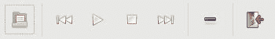
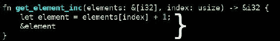
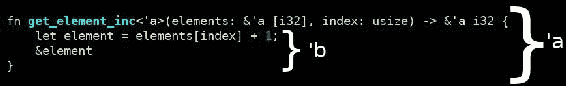
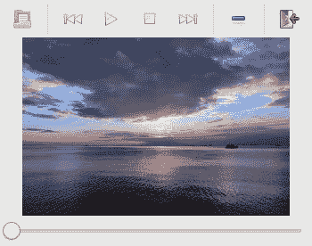
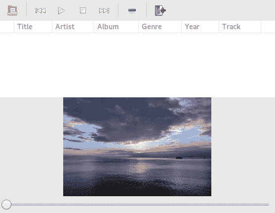
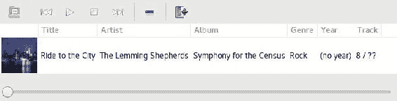
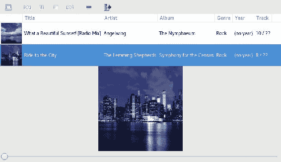

# 第五章：创建音乐播放器

在前面的章节中，你创建了一个很棒的游戏，现在让我们继续到另一个令人兴奋的主题——桌面应用程序。我们将使用 GTK+ 库的 Rust 绑定来编写一个 MP3 音乐播放器。在下一章中，我们将有机会学习线程来编写音乐播放器本身。但是，在这一章中，我们将专注于图形界面，如何管理界面的布局，以及如何管理用户事件。

在这一章中，我们将涵盖以下主题：

+   Windows

+   小部件

+   事件

+   闭包

+   事件循环

+   容器

# 安装先决条件

由于 GTK+ 是一个 C 库，我们首先需要安装它。Rust 绑定使用 GTK+ 版本 3，所以请确保你没有安装旧版本 2。

# 在 Linux 上安装 GTK+

在 Linux 上，GTK+ 可以通过你的发行版的包管理器安装。

在 Ubuntu（或其他 Debian 衍生版）上：

```rs
sudo apt-get install libgtk-3-dev
```

# 在 Mac 上安装 GTK+

在 OSX 上，你只需要运行以下命令：

```rs
brew install gtk+3 gnome-icon-theme
```

# 在 Windows 上安装 GTK+

在 Windows 上，你首先需要下载并安装 MSYS2，它为 Windows 提供了一个类 Unix 环境。安装完成后，在 MSYS2 终端中运行以下命令：

```rs
pacman -S mingw-w64-x86_64-gtk3
```

# 创建你的第一个窗口

现在，我们已经准备好从 Rust 开始使用 GTK+。让我们为我们的音乐播放器创建一个新的项目：

```rs
cargo new rusic --bin
```

在你的 `Cargo.toml` 文件中添加对 `gio` 和 `gtk` 依赖项：

```rs
gio = "⁰.3.0"
gtk = "⁰.3.0"
```

将 `src/main.rs` 文件的内容替换为以下内容：

```rs
extern crate gio;
extern crate gtk;

use std::env;

use gio::{ApplicationExt, ApplicationExtManual, ApplicationFlags};
use gtk::{
    Application,
    ApplicationWindow,
    WidgetExt,
    GtkWindowExt,
};

fn main() {
    let application = Application::new("com.github.rust-by-
     example", ApplicationFlags::empty())
        .expect("Application initialization failed");
    application.connect_startup(|application| {
        let window = ApplicationWindow::new(&application);
        window.set_title("Rusic");
        window.show();
    });
    application.connect_activate(|_| {});
    application.run(&env::args().collect::<Vec<_>>());
}
```

然后，使用 `cargo run` 运行应用程序。你应该看到一个小的空窗口：

**图 5.1**

如果你看到了这个窗口，这意味着你已经正确安装了 GTK+。

让我们分块解释这段代码：

```rs
extern crate gio;
extern crate gtk;
```

如同往常一样，当使用外部 crate 时，我们需要声明它。

然后，我们导入从标准库、`gio` 和 `gtk` 中我们将使用的类型和模块：

```rs
use std::env;

use gio::{ApplicationExt, ApplicationExtManual, ApplicationFlags};
use gtk::{
    Application,
    ApplicationWindow,
    WidgetExt,
    GtkWindowExt,
};
```

之后，我们开始 `main` 函数：

```rs
fn main() {
    let application = Application::new("com.github.rust-by-
     example", 
     ApplicationFlags::empty())
        .expect("Application initialization failed");
```

这个函数的第一行创建了一个新的 `gio` 应用程序。我们提供了一个应用程序 ID，可以用来确保应用程序只运行一次。`Application` 使得管理应用程序及其窗口变得更加容易。

接下来，我们创建窗口，设置其标题，并将其显示到屏幕上：

```rs
    application.connect_startup(|application| {
        let window = ApplicationWindow::new(&application);
        window.set_title("Rusic");
        window.show();
    });
    application.connect_activate(|_| {});
```

在创建新窗口后，我们设置其标题并显示它。

在这里，我们实际上正在处理一个事件；`startup` 是当应用程序注册时发出的一个信号，所以，当它准备好使用时。正如你在 GTK+ 文档中可以看到的（[`developer.gnome.org/gio/stable/GApplication.html#GApplication-startup`](https://developer.gnome.org/gio/stable/GApplication.html#GApplication-startup)），信号由字符串表示。这个信号实际上叫做 `startup`，但我们用来连接这个信号的 Rust 方法是 `connect_startup`。因此，我们需要在信号名称前添加 `connect_` 并将破折号改为下划线。

# 闭包

这个方法的参数有些特殊：

```rs
|application| {
    let window = ApplicationWindow::new(&application);
    window.set_title("Rusic");
    window.show();
}
```

这就是我们所说的闭包。闭包是一种简洁地声明没有名称且可以捕获环境的函数的方法。捕获环境意味着它可以访问闭包外部的变量，这是普通函数无法做到的。连接信号的函数将运行作为参数传递的函数（在这种情况下，一个闭包）。在这里，创建窗口。

我们本可以决定创建一个普通函数，如下面的代码所示：

```rs
fn startup_handler(application: &Application) {
    let window = ApplicationWindow::new(&application);
    window.set_title("Rusic");
    window.show();
}

// In the main function:

    application.connect_startup(startup_handler);
```

但这比使用闭包不太方便。除了你可能需要导入其他 crate 和类型之外，你还需要指定参数的类型和返回类型。实际上，闭包有类型推断，但函数没有。此外，函数必须在其他地方声明，因此它可能没有使用闭包那么易于阅读。

`main`函数的其余部分是：

```rs
    application.run(&env::args().collect::<Vec<_>>());
}
```

这启动了`gtk`事件循环。这是一个无限循环，它处理用户事件，如按钮点击或请求关闭窗口。它还管理其他事情，如超时和异步、类似 IO 的网络请求。

一些事件处理器要求你返回一个值，例如对于`delete_event`信号，我们需要返回`Inhibit(false)`。

# 阻止事件默认行为

`Inhibit`类型只是`bool`类型的包装。它用于指示我们是否应该停止将事件传播到默认处理器。为了了解这意味着什么，让我们为窗口添加一个事件处理器：

```rs
window.connect_delete_event(|_, _| {
    Inhibit(true)
});
```

如果你运行它，你会注意到我们不能再关闭窗口了。这是因为我们返回了`Inhibit(true)`来表示我们想要阻止`delete_event`信号的默认行为，即关闭窗口。

现在我们尝试对之前的代码进行轻微的变体：

```rs
window.connect_delete_event(|_, _| {
    Inhibit(false)
});
```

在这种情况下，我们不阻止默认处理器运行，因此窗口将被关闭。

# 创建工具栏

我们将通过添加一个带有所需按钮的工具栏来开始我们的音乐播放器：

+   打开文件

+   播放

+   暂停

+   停止

+   上一首/下一首歌曲

+   从播放列表中移除歌曲

这将是我们的第一个非空窗口的好开始。

首先，我们需要一些额外的导入语句：

```rs
use gtk::{
    ContainerExt,
    SeparatorToolItem,
    Toolbar,
    ToolButton,
};
```

然后，我们将声明一个常量，因为我们将在其他地方使用这个值：

```rs
const PLAY_STOCK: &str = "gtk-media-play";
```

我们很快就会解释这是怎么回事。

现在，我们将创建一个工具栏并将其添加到窗口中：

```rs
fn main() {
    // Same code to initialize gtk, create the window.
    application.connect_startup(|application| {
        // …

        let toolbar = Toolbar::new();
        window.add(&toolbar);
```

注意：不要调用`window.show()`，因为我们将在之后使用另一种方法。

这段代码相当直接。唯一需要注意的是，`gtk-rs` API 在大多数情况下需要值的引用；在这种情况下，我们将工具栏的引用作为参数发送到`add()`方法。

你会看到这个`add()`方法几乎被到处调用。它允许你将小部件添加到另一个小部件中。小部件是用户界面（视觉或非视觉）的组件。它可以是一个按钮、一个菜单、一个分隔符，但它也可以是一个不可见组件，例如一个盒子，允许你水平放置小部件。我们将在本章后面讨论像`gtk::Box`这样的容器以及如何布局我们的小部件。

让我们在工具栏中添加一个按钮：

```rs
    let open_button = ToolButton::new_from_stock("gtk-open");
    toolbar.add(&open_button);
```

这创建了一个工具栏按钮并将其添加到工具栏中。

# 库存项

我们没有使用常规的`new()`构造函数，而是决定在这里使用`new_from_stock()`。这个函数需要一个字符串作为参数。这个字符串是表示内置菜单或工具栏项的标识符，例如`Open`或`Save`。这些项有一个图标和一个标签，该标签根据用户的区域设置进行翻译。通过使用库存项，您可以快速创建一个看起来与其他使用 GTK+构建的应用程序相同的应用程序。

让我们展示包含工具栏的此窗口：

```rs
        window.show_all();
    });
```

这直接位于启动事件处理器的末尾。在这里，我们使用`show_all()`而不是仅使用`show()`，因为我们有更多的小部件需要显示。我们本可以调用每个单独的小部件上的`show()`，但这可能会变得繁琐；这就是为什么有`show_all()`的原因。

如果你运行这个应用程序，你会看到一个带有打开按钮的以下窗口：

*图 5.2*

让我们添加我们需要的打开按钮：

```rs
    toolbar.add(&SeparatorToolItem::new());

    let previous_button = ToolButton::new_from_stock("gtk-media-previous");
    toolbar.add(&previous_button);

    let play_button = ToolButton::new_from_stock(PLAY_STOCK);
    toolbar.add(&play_button);

    let stop_button = ToolButton::new_from_stock("gtk-media-stop");
    toolbar.add(&stop_button);

    let next_button = ToolButton::new_from_stock("gtk-media-next");
    toolbar.add(&next_button);

    toolbar.add(&SeparatorToolItem::new());

    let remove_button = ToolButton::new_from_stock("gtk-remove");
    toolbar.add(&remove_button);

    toolbar.add(&SeparatorToolItem::new());

    let quit_button = ToolButton::new_from_stock("gtk-quit");
    toolbar.add(&quit_button);
```

这段代码应该放在调用`window.show_all()`之前。`SeparatorToolItem`，它被添加了几次，以逻辑上分隔按钮，使得类似操作的按钮可以分组在一起。

现在我们有一个开始看起来像音乐播放器的应用程序，如下所示：

*图 5.3*

# 改善应用程序的组织结构

`main`函数开始变得更大，所以我们将稍微重构我们的代码，以便在接下来的章节中更容易更新。

首先，我们将创建一个名为`toolbar`的新模块。作为一个提醒，以下是这样做的方法：

1.  创建一个新文件：`src/toolbar.rs`。

1.  在`main.rs`文件的顶部添加一个语句，`mod toolbar;`。

这个新的`toolbar`模块将从导入语句和`const`声明开始：

```rs
use gtk::{
    ContainerExt,
    SeparatorToolItem,
    Toolbar,
    ToolButton,
};

const PLAY_STOCK: &str = "gtk-media-play";
```

然后，我们将创建一个新的结构，它包含组成工具栏的所有小部件：

```rs
pub struct MusicToolbar {
    open_button: ToolButton,
    next_button: ToolButton,
    play_button: ToolButton,
    previous_button: ToolButton,
    quit_button: ToolButton,
    remove_button: ToolButton,
    stop_button: ToolButton,
    toolbar: Toolbar,
}
```

我们在这里使用`pub`关键字，因为我们希望能够从其他模块中使用这个类型。

然后，我们将为这个`struct`创建一个构造函数，它将创建所有按钮，就像我们之前做的那样：

```rs
impl MusicToolbar {
    pub fn new() -> Self {
        let toolbar = Toolbar::new();

        let open_button = ToolButton::new_from_stock("gtk-open");
        toolbar.add(&open_button);

        // ...

        let quit_button = ToolButton::new_from_stock("gtk-quit");
        toolbar.add(&quit_button);

        MusicToolbar {
            open_button,
            next_button,
            play_button,
            previous_button,
            quit_button,
            remove_button,
            stop_button,
            toolbar
        }
    }
}
```

与之前的代码相比，唯一的区别是我们现在返回一个`struct MusicToolbar`。我们还会在这个`impl`中添加一个方法，以便从外部访问`gtk::Toolbar`小部件：

```rs
    pub fn toolbar(&self) -> &Toolbar {
        &self.toolbar
    }
```

现在关于这个`工具栏`模块的内容就到这里。让我们回到`主`模块。首先，我们需要导入我们新的`MusicToolbar`类型：

```rs
use toolbar::MusicToolbar;
```

接下来，我们将创建一个类似于我们为工具栏创建的结构：

```rs
struct App {
    toolbar: MusicToolbar,
    window: ApplicationWindow,
}
```

我们还将为它创建一个构造函数：

```rs
impl App {
    fn new(application: Application) -> Self {
        let window = ApplicationWindow::new(&application);
        window.set_title("Rusic");

        let toolbar = MusicToolbar::new();
        window.add(toolbar.toolbar());

        window.show_all();

        let app = App {
            toolbar,
            window,
        };

        app.connect_events();

        app
    }
}
```

这里，我们像之前一样创建了窗口，然后创建了我们的 `MusicToolbar` 结构。我们通过将 `toolbar()` 方法（它返回 `gtk` 小部件）的结果传递给 `add()` 方法来添加包装的工具栏小部件。

之后，我们使用了一个小技巧，使我们能够在尚未创建的 `struct` 上调用方法；我们首先将 `struct` 赋值给一个变量，然后调用方法并返回该变量。这个方法定义在同一个 `impl` 块中：

```rs
    fn connect_events(&self) {
    }
```

我们将在下一章中填充这个方法。

# 添加工具按钮事件

我们将继续添加一些按钮的事件处理器。

首先，我们需要新的 `use` 语句：

```rs
use gtk::{
    ToolButtonExt,
    WidgetExt,
};

use App;
```

我们导入 `ToolButtonExt`，它提供了从 `main` 模块调用 `ToolButton` 和 `App` 的方法，因为我们将为这个类型添加一个新方法：

```rs
impl App {
    pub fn connect_toolbar_events(&self) {
        let window = self.window.clone();
        self.toolbar.quit_button.connect_clicked(move |_| {
            window.destroy();
        });
    }
}
```

在 Rust 中，在创建类型不同的模块中声明方法是完全有效的。在这里，我们说点击退出按钮将销毁窗口，这将有效地退出应用程序。

让我们添加另一个事件，该事件将切换播放按钮图像和暂停图像：

```rs
    let play_button = self.toolbar.play_button.clone();
    self.toolbar.play_button.connect_clicked(move |_| {
        if play_button.get_stock_id() == Some(PLAY_STOCK.to_string()) {
            play_button.set_stock_id(PAUSE_STOCK);
        } else {
            play_button.set_stock_id(PLAY_STOCK);
       }
    });
```

这段代码需要在 `PLAY_STOCK` 旁边添加一个新的常量：

```rs
const PAUSE_STOCK: &str = "gtk-media-pause";
```

在查看这段代码的奇特之处之前，我们先看看闭包的主体。在这里，我们使用一个条件来检查按钮是否显示播放图像——如果是，我们切换到暂停库存项。否则，我们切换回播放图标。

但为什么我们需要克隆按钮并在闭包之前使用这个 `move` 关键字呢？让我们尝试正常的方式，即在大多数编程语言中你会怎么做：

```rs
self.toolbar.play_button.connect_clicked(|_| {
    if self.toolbar.play_button.get_stock_id() == Some(PLAY_STOCK.to_string()) {
        self.toolbar.play_button.set_stock_id(PAUSE_STOCK);
    } else {
        self.toolbar.play_button.set_stock_id(PLAY_STOCK);
    }
});
```

如果我们这样做，我们会得到以下编译错误：

```rs
error[E0477]: the type `[closure@src/toolbar.rs:79:50: 85:10 self:&&App]` does not fulfill the required lifetime
  --> src/toolbar.rs:79:34
   |
79 |         self.toolbar.play_button.connect_clicked(|_| {
   |                                  ^^^^^^^^^^^^^^^
   |
   = note: type must satisfy the static lifetime

error[E0495]: cannot infer an appropriate lifetime for capture of `self` by closure due to conflicting requirements
  --> src/toolbar.rs:79:50
   |
79 |           self.toolbar.play_button.connect_clicked(|_| {
   |  __________________________________________________^
80 | |             if self.toolbar.play_button.get_stock_id() == Some(PLAY_STOCK.to_string()) {
81 | |                 self.toolbar.play_button.set_stock_id(PAUSE_STOCK);
82 | |             } else {
83 | |                 self.toolbar.play_button.set_stock_id(PLAY_STOCK);
84 | |             }
85 | |         });
   | |_________^
```

它甚至进一步解释了为什么无法推断生命周期。

让我们看看 `connect_clicked()` 方法的签名，以了解发生了什么：

```rs
fn connect_clicked<F: Fn(&Self) + 'static>(&self, f: F) -> u64
```

`Fn(&Self)` 部分表示这个函数需要类似函数的东西，它接受一个参数，该参数是 `Self`（在这种情况下是 `ToolButton`）的引用。`'static' 部分是一个生命周期注解。

# 生命周期

生命周期是 Rust 编译器用来确保内存安全的一个特性。生命周期指定了一个对象必须存在的最小持续时间，以便安全地使用。让我们尝试在某些编程语言中允许做某事，但实际上这样做是错误的：

```rs
fn get_element_inc(elements: &[i32], index: usize) -> &i32 {
    let element = elements[index] + 1;
    &element
}
```

这里，我们尝试从一个栈分配的值返回一个引用。问题是这个值在函数返回时将被回收，调用者将尝试访问这个已回收的值。在其他编程语言中，这段代码可以编译并产生（希望是）运行时的段错误。但 Rust 是一种安全的编程语言，拒绝编译这样的代码：

```rs
error[E0597]: `element` does not live long enough
 --> src/main.rs:3:6
  |
3 |     &element
  |      ^^^^^^^ does not live long enough
4 | }
  | - borrowed value only lives until here
```

编译器注意到`element`值将在函数结束时被销毁；这就是最后一行句子所表达的意思。这是正确的，因为`element`的生命周期从其声明开始，直到其声明的范围结束；在这里，范围是函数。以下是`element`生命周期的示意图：

*图 5.4*

但编译器是如何知道返回值所需的生命周期的呢？为了回答这个问题，让我们添加编译器添加的生命周期注释：

```rs
fn get_element_inc<'a>(elements: &'a [i32], index: usize) -> &'a i32 {
    let element = elements[index] + 1;
    &element
}
```

正如你所见，生命周期的语法与用于标签的语法相同——`'label'`。当我们想要指定生命周期时，我们需要在尖括号内声明生命周期名称，这与声明泛型类型的方式类似。在这种情况下，我们指定了返回值的生命周期必须与参数`elements`的生命周期相同。

让我们再次用生命周期来注释代码：

*图 5.5*

在这里，我们可以清楚地看到返回值的生命周期小于所需的生命周期；这就是为什么编译器拒绝了我们的代码。

在这种情况下，有两种方法可以修复这段代码（而不改变签名）。获得满足生命周期`'a'`的值的一种方法是通过引用相同生命周期的值；参数`elements`也有生命周期`'a'`，因此我们可以编写以下代码：

```rs
fn get_element<'a>(elements: &'a [i32], index: usize) -> &'a i32 {
    &elements[index]
}
```

另一种方法是返回一个生命周期为`'static'`的值的引用。这个特殊的生命周期等于程序的持续时间，也就是说，值必须持续到程序结束。获得这种生命周期的 一种方法是用字面量：

```rs
fn get_element<'a>(elements: &'a [i32], index: usize) -> &'a i32 {
    &42
}
```

`'static'`生命周期满足`'a'`约束，因为`'static'`的生命周期比后者长。

在这两个例子中，生命周期注释不是必需的。由于一个叫做生命周期省略的特性，我们一开始就不需要指定生命周期；编译器可以通过遵循这些简单的规则在大多数情况下推断出所需的生命周期：

+   每个参数被分配不同的生命周期

+   如果只有一个参数需要生命周期，那么这个生命周期会被分配给返回值中的每一个生命周期（就像我们的`get_element`函数一样）

+   如果有多个参数需要生命周期，但其中一个是用于`&self`的，则`self`的生命周期会被分配给返回值中的每一个生命周期

让我们回到方法签名：

```rs
fn connect_clicked<F: Fn(&Self) + 'static>(&self, f: F) -> u64
```

在这里，我们注意到参数`f`具有`'static'`生命周期。我们现在知道这意味着这个参数必须持续到程序结束。这就是为什么我们不能使用*普通*版本的闭包：因为`self`的生命周期不是`'static'`，这意味着`app`将在`main`函数结束时被销毁。为了使这可行，我们克隆了`play_button`变量：

```rs
let play_button = self.toolbar.play_button.clone();
```

现在我们可以在这个闭包中使用这个新变量。

注意：请注意，克隆 GTK+小部件是非常便宜的；只需克隆一个指针。

然而，尝试执行以下操作仍然会导致编译错误：

```rs
let play_button = self.toolbar.play_button.clone();
self.toolbar.play_button.connect_clicked(|_| {
    if play_button.get_stock_id() == Some(PLAY_STOCK.to_string()) {
        play_button.set_stock_id(PAUSE_STOCK);
    } else {
        play_button.set_stock_id(PLAY_STOCK);
    }
});
```

这里是错误信息：

```rs
error[E0373]: closure may outlive the current function, but it borrows `play_button`, which is owned by the current function
  --> src/toolbar.rs:80:50
   |
80 |         self.toolbar.play_button.connect_clicked(|_| {
   |                                                  ^^^ may outlive borrowed value `play_button`
81 |             if play_button.get_stock_id() == Some(PLAY_STOCK.to_string()) {
   |                ----------- `play_button` is borrowed here
   |
help: to force the closure to take ownership of `play_button` (and any other referenced variables), use the `move` keyword
   |
80 |         self.toolbar.play_button.connect_clicked(move |_| {
   |                                                  ^^^^^^^^
```

这段代码的问题在于闭包可以在函数返回之后被调用，但是变量 `button` 在 `connect_toolbar_events()` 方法中被声明，并在返回时被释放。再次强调，Rust 通过检查我们是否正确使用引用来防止我们出现段错误。编译器谈论所有权的概念；让我们看看这是什么。

# 所有权的概念

在 Rust 中，没有垃圾回收器来处理不再需要的内存的释放。此外，程序员也不需要指定内存应该在哪里释放。但是，这怎么可能工作呢？编译器能够通过所有权的概念来确定何时释放内存；只有一个变量可以拥有一个值。通过这个简单的规则，何时释放值的处理变得简单：当所有者超出作用域时，值就会被释放。

让我们看看一个例子，看看释放与作用域的关系：

```rs
let mut vec = vec!["string".to_string()];
if !vec.is_empty() {
    let element = vec.remove(0);
    // element is deallocated at the end of this scope.
}
```

在这里，我们在新的作用域中从向量中移除一个元素——条件块的块。变量 `element` 将拥有从向量中移除的值（我们也可以说值从向量移动到变量 `element`）。由于它拥有这个值，变量在超出作用域时不需要负责释放它。因此，在条件之后，值 `"string"` 将被释放并且不能再被访问。

让我们回到我们的代码：

```rs
self.toolbar.play_button.connect_clicked(move |_| {
    if play_button.get_stock_id() == Some(PLAY_STOCK.to_string()) {
        play_button.set_stock_id(PAUSE_STOCK);
    } else {
        play_button.set_stock_id(PLAY_STOCK);
    }
});
```

我们在闭包中添加了关键字 `move` 来表示值必须被移动到闭包中。（如果你记得错误信息，这就是编译器告诉我们要做的事情。）通过这样做，我们满足了借用检查器的条件，因为值不再被借用。这之前导致生命周期错误，但现在已经被移动到闭包中，因此它将像闭包本身一样长时间存在。

不要忘记在 `App::new()` 方法中调用此方法，在调用 `connect_events()` 之后：

```rs
app.connect_events();
app.connect_toolbar_events();
```

# 容器

现在，我们将向我们的窗口添加其他小部件：一个显示当前播放歌曲封面的图像和一个光标来查看音乐的进度。然而，不可能向窗口添加多个小部件。要做到这一点，我们需要使用容器。

容器是一种管理多个小部件如何显示的方式。

# 容器的类型

这里有一些简单的非视觉容器：

+   `gtk::Box`：水平或垂直地处理小部件

+   `gtk::Grid`：像表格一样按行和列处理小部件

+   `gtk::Fixed`：在像素级别的特定位置显示小部件

+   `gtk::Stack`：一次只显示一个小部件

所有这些小部件，除了 `gtk::Fixed` ，在窗口大小调整时都会自动重新排列小部件。这就是为什么你应该避免使用这个的原因。

这里有一些更复杂的容器：

+   `gtk::Notebook`：一次只显示一个小部件，但用户可以通过点击标签来选择显示哪个

+   `gtk::Paned`：显示两个小部件，由用户可以拖动的手柄分隔，以调整小部件之间的分隔

# 盒子容器

我们将使用`gtk::Box`来排列我们的小部件。首先，删除我们之前添加的`Window::add()`调用：

```rs
window.add(toolbar.toolbar());
```

我们删除这个调用，因为我们将向盒子中添加工具栏，并将盒子添加到窗口中。让我们这样做，但在我们这样做之前，我们将添加一些新的导入：

```rs
use gtk::{
    Adjustment,
    Image,
    ImageExt,
    Scale,
    ScaleExt,
};
use gtk::Orientation::{Horizontal, Vertical};
```

然后，创建盒子：

```rs
let vbox = gtk::Box::new(Vertical, 0);
window.add(&vbox);
```

（此代码将放入`App::new()`方法中。）

在这里，我们完全限定了`gtk::Box`，因为`Box`是标准库中的一个类型，它会被自动导入。我们指定了盒子的方向是垂直的，并且容器的小部件之间没有间隔（`0`）。

现在我们准备好向这个盒子添加小部件：

```rs
let toolbar = MusicToolbar::new();
vbox.add(toolbar.toolbar());

let cover = Image::new();
cover.set_from_file("cover.jpg");
vbox.add(&cover);
```

我们首先添加我们的工具栏，然后添加一个图片并从静态文件中加载封面，因为我们还没有编写从 MP3 文件中提取封面的代码。

让我们再添加一个光标小部件：

```rs
let adjustment = Adjustment::new(0.0, 0.0, 10.0, 0.0, 0.0, 0.0);
let scale = Scale::new(Horizontal, &adjustment);
scale.set_draw_value(false);
vbox.add(&scale);
```

光标小部件命名为`Scale`。这个小部件需要一个`Adjustment`，它是一个表示光标可以取哪些值的对象，并且包含当前值和增量值。同样，由于我们不知道如何从 MP3 文件中获取歌曲的持续时间，我们为`Adjustment`硬编码了值。我们还通过调用`set_draw_value(false)`禁用了显示光标实际值的特性。

如果你运行应用程序，你会看到以下内容：

*图 5.6*

（我们几乎可以听到音乐，当我们看着它的时候。）

为了结束本节，我们将在`App`结构中添加几个字段，使其变为：

```rs
struct App {
    adjustment: Adjustment,
    cover: Image,
    toolbar: MusicToolbar,
    window: ApplicationWindow,
}
```

`App`构造函数的末尾更新为：

```rs
impl App {
    fn new(application: Application) -> Self {
        // ...

        window.show_all();

        let app = App {
            adjustment,
            cover,
            toolbar,
            window,
        };

        app.connect_events();
        app.connect_toolbar_events();

        app
    }
}
```

# 添加播放列表

我们现在准备好将播放列表小部件添加到我们的音乐播放器中。

我们将使用新的 crate，所以请在`main.rs`文件中添加以下内容：

```rs
extern crate gdk_pixbuf;
extern crate id3;
```

将使用`gdk_pixbuf` crate 来显示和操作封面，以及`id3` crate 来从 MP3 文件中获取元数据。

此外，将以下内容添加到`Cargo.toml`：

```rs
gdk-pixbuf = "⁰.3.0"
id3 = "⁰.2.0"
```

然后，我们将创建一个新的模块来包含这个新小部件：

```rs
mod playlist;
```

我们将从这个模块开始，添加一些`use`语句：

```rs
use std::path::Path;

use gdk_pixbuf::{InterpType, Pixbuf, PixbufLoader};
use gtk::{
    CellLayoutExt,
    CellRendererPixbuf,
    CellRendererText,
    ListStore,
    ListStoreExt,
    ListStoreExtManual,
    StaticType,
    ToValue,
    TreeIter,
    TreeModelExt,
    TreeSelectionExt,
    TreeView,
    TreeViewColumn,
    TreeViewColumnExt,
    TreeViewExt,
    Type,
    WidgetExt,
};
use id3::Tag;
```

接下来，我们将添加一些常量：

```rs
const THUMBNAIL_COLUMN: u32 = 0;
const TITLE_COLUMN: u32 = 1;
const ARTIST_COLUMN: u32 = 2;
const ALBUM_COLUMN: u32 = 3;
const GENRE_COLUMN: u32 = 4;
const YEAR_COLUMN: u32 = 5;
const TRACK_COLUMN: u32 = 6;
const PATH_COLUMN: u32 = 7;
const PIXBUF_COLUMN: u32 = 8;

const IMAGE_SIZE: i32 = 256;
const THUMBNAIL_SIZE: i32 = 64;
```

`*_COLUMN` 常量代表我们将在播放列表中显示的列。最后一个，`PIXBUF_COLUMN`，有点特别：它将是一个隐藏的列，用于存储更大尺寸的封面，这样我们就可以在我们之前创建的`cover`小部件中显示这张图片。

接下来，我们将创建一个新的结构来存放小部件及其模型：

```rs
pub struct Playlist {
    model: ListStore,
    treeview: TreeView,
}
```

# MVC 模式

对于列表和树小部件，GTK+遵循 MVC 模式。MVC 代表模型-视图-控制器。

现在我们可以为我们的播放列表添加一个构造函数：

```rs
impl Playlist {
    pub fn new() -> Self {
        let model = ListStore::new(&[
            Pixbuf::static_type(),
            Type::String,
            Type::String,
            Type::String,
            Type::String,
            Type::String,
            Type::String,
            Type::String,
            Pixbuf::static_type(),
        ]);
        let treeview = TreeView::new_with_model(&model);
        treeview.set_hexpand(true);
        treeview.set_vexpand(true);

        Self::create_columns(&treeview);

        Playlist {
            model,
            treeview,
        }
    }
}
```

`gtk::ListStore`类型是一个将数据表示为列表的模型。它的构造函数需要列的类型；在这种情况下，大多数类型都是字符串，用于 MP3 文件的元数据，例如歌曲标题和作者姓名。第一个`Pixbuf`用于缩略图图像，最后一个用于仅显示当前播放音乐的较大图像。

接下来，我们创建一个`TreeView`，它实际上是一个列表的视图，因为我们用我们的列表模型初始化它。然后我们修改 widget，使其在垂直和水平方向上扩展，这意味着 widget 将尽可能使用空间。最后，在返回`struct Playlist`之前，我们调用`create_columns()`方法，该方法将创建在此视图中显示的列。让我们看看这个新方法：

```rs
    fn create_columns(treeview: &TreeView) {
        Self::add_pixbuf_column(treeview, THUMBNAIL_COLUMN as i32, 
         Visible);
        Self::add_text_column(treeview, "Title", TITLE_COLUMN as i32);
        Self::add_text_column(treeview, "Artist", ARTIST_COLUMN as i32);
        Self::add_text_column(treeview, "Album", ALBUM_COLUMN as i32);
        Self::add_text_column(treeview, "Genre", GENRE_COLUMN as i32);
        Self::add_text_column(treeview, "Year", YEAR_COLUMN as i32);
        Self::add_text_column(treeview, "Track", TRACK_COLUMN as i32);
        Self::add_pixbuf_column(treeview, PIXBUF_COLUMN as i32, Invisible);
    }
```

在这里，我们调用两个方法来创建不同类型的列——我们指定每个列的表头标签和列号。至于`add_pixbuf_column()`方法的最后一个参数，它表示列是否可见。这个参数是一个自定义类型，所以让我们声明它：

```rs
use self::Visibility::*;

#[derive(PartialEq)]
enum Visibility {
    Invisible,
    Visible,
}
```

我们还添加了一个`use`语句，以便能够直接使用`Visible`而不是必须完全限定它（`Visibility::Visible`）。

让我们编写`add_text_column()`方法：

```rs
    fn add_text_column(treeview: &TreeView, title: &str, column: i32) {
        let view_column = TreeViewColumn::new();
        view_column.set_title(title);
        let cell = CellRendererText::new();
        view_column.set_expand(true);
        view_column.pack_start(&cell, true);
        view_column.add_attribute(&cell, "text", column);
        treeview.append_column(&view_column);
    }
```

我们首先创建列本身，并通过调用`set_title()`设置表头标签。然后，我们创建一个`CellRenderer`，它指示模型数据在视图中的渲染方式；在这里，我们只想显示一些文本，所以我们选择了`CellRendererText`，将其设置为尽可能占用空间，并将渲染器添加到列中。接下来是一行非常重要的代码：

```rs
view_column.add_attribute(&cell, "text", column);
```

这行代码指定视图将从模型在指定列的数据中设置`text`属性。

最后，我们将列添加到视图中。

现在，我们将为`pixbuf`编写一个类似的功能：

```rs
    fn add_pixbuf_column(treeview: &TreeView, column: i32, visibility:
    Visibility) {
        let view_column = TreeViewColumn::new();
        if visibility == Visible {
            let cell = CellRendererPixbuf::new();
            view_column.pack_start(&cell, true);
            view_column.add_attribute(&cell, "pixbuf", column);
        }
        treeview.append_column(&view_column);
    }
```

在这里，我们创建了一种新的渲染器类型（`CellRendererPixbuf`），它将显示图像而不是文本。这次，我们设置了`pixbuf`属性，因为我们想显示一个图像。只有当列可见时，才会创建渲染器。

现在，剩下的只是编写一个函数来获取实际的 widget，以便能够在`main`模块中添加 widget：

```rs
    pub fn view(&self) -> &TreeView {
        &self.treeview
    }
```

让我们回到`App::new()`方法，并创建播放列表：

```rs
let playlist = Playlist::new();
vbox.add(playlist.view());
```

（在创建`Image`之前添加此代码。）

我们还会在结构中添加一个`playlist`属性：

```rs
struct App {
    adjustment: Adjustment,
    cover: Image,
    playlist: Playlist,
    toolbar: MusicToolbar,
    window: Window,
}
```

此外，别忘了编辑结构的创建以包括以下新字段：

```rs
let app = App {
    adjustment,
    cover,
    playlist,
    toolbar,
    window,
};
```

现在，我们准备再次启动我们的应用程序，以查看一个空白的播放列表：

**图 5.7**

# 打开 MP3 文件

让我们通过添加打开 MP3 文件并显示其元数据在刚刚创建的播放列表小部件中的功能来完成这一章。

首先，我们将删除这一行：

```rs
cover.set_from_file("cover.jpg");
```

这是因为图像将从我们播放的 MP3 文件的数据中设置。

我们将使用一个新的 crate，所以请在你的`Cargo.toml`的`[dependencies]`部分添加这一行：

```rs
gtk-sys = "⁰.5.0"
```

此外，还需要在您的`main.rs`中添加以下行：

```rs
extern crate gtk_sys;
```

`gtk-rs`生态系统中的`*-sys`crate 是低级 crate，它们直接绑定到 GTK+ C 库。由于它们非常低级且需要使用 unsafe 代码，因此创建了包装器；这些是没有`-sys`后缀的 crate，例如`gtk`和`gdk`。

# 引用计数指针

在我们继续之前，我们还将更改一些代码。由于我们希望将我们的`Playlist`小部件与代码的不同部分共享，包括一些事件处理程序，我们需要一种方法来共享一个持续时间足够长的引用（记住我们遇到的寿命问题）。这样做的一个简单方法是使用引用计数指针类型——`Rc`。因此，在我们的`App`结构中，让我们将`playlist`字段更改为使用`Rc`：

```rs
struct App {
    adjustment: Adjustment,
    cover: Image,
    playlist: Rc<Playlist>,
    toolbar: MusicToolbar,
    window: Window,
}
```

这需要在`main`模块的顶部添加一个新的导入：

```rs
use std::rc::Rc;
```

此外，还需要更新播放列表的创建：

```rs
let playlist = Rc::new(Playlist::new());
```

现在，我们将`Playlist`包装在一个`Rc`中。只要我们调用不可变方法，即那些接受`&self`但不接受`&mut self`的方法，我们仍然可以使用播放列表，就像以前一样。所以，下一行仍然有效：

```rs
vbox.add(playlist.view());
```

在我们创建将 MP3 文件添加到播放列表的方法之前，我们需要另一个方法来从 MP3 元数据中设置模型中的`pixbuf`值。在`impl Playlist`中添加以下方法：

```rs
const INTERP_HYPER: InterpType = 3;

    fn set_pixbuf(&self, row: &TreeIter, tag: &Tag) {
        if let Some(picture) = tag.pictures().next() {
            let pixbuf_loader = PixbufLoader::new();
            pixbuf_loader.set_size(IMAGE_SIZE, IMAGE_SIZE);
            pixbuf_loader.loader_write(&picture.data).unwrap();
            if let Some(pixbuf) = pixbuf_loader.get_pixbuf() {
                let thumbnail = pixbuf.scale_simple(THUMBNAIL_SIZE, 
                THUMBNAIL_SIZE, INTERP_HYPER).unwrap();
                self.model.set_value(row, THUMBNAIL_COLUMN,
                 &thumbnail.to_value());
                self.model.set_value(row, PIXBUF_COLUMN, 
                 &pixbuf.to_value());
            }
            pixbuf_loader.close().unwrap();
        }
    }
```

类型`Tag`表示 MP3 文件的元数据。我们获取文件中包含的第一张图片并将其加载。如果加载成功，我们将它调整大小以获取缩略图，然后设置模型中的值。

# ID3—MP3 元数据

现在我们已经准备好从 MP3 文件中获取所有相关元数据并将其添加到播放列表中。让我们通过获取元数据来开始`Playlist::add()`方法：

```rs
    pub fn add(&self, path: &Path) {
        let filename =  
         path.file_stem().unwrap_or_default().to_str().unwrap_or_default();

        let row = self.model.append();

        if let Ok(tag) = Tag::read_from_path(path) {
            let title = tag.title().unwrap_or(filename);
            let artist = tag.artist().unwrap_or("(no artist)");
            let album = tag.album().unwrap_or("(no album)");
            let genre = tag.genre().unwrap_or("(no genre)");
            let year = tag.year().map(|year| 
            year.to_string()).unwrap_or("(no  
            year)".to_string());
            let track = tag.track().map(|track| 
            track.to_string()).unwrap_or("??".to_string());
            let total_tracks = tag.total_tracks().map(|total_tracks|  
            total_tracks.to_string()).unwrap_or("??".to_string());
            let track_value = format!("{} / {}", track, total_tracks);
```

我们首先获取没有扩展名的文件名并将其转换为字符串；如果没有歌曲标题在文件中，我们将显示这个。然后，我们从文件中读取元数据，并在调用`unwrap_or()`的情况下分配一个默认值，例如`"(no artist)"`，如果值缺失。`unwrap_or()`从`Option`获取值，如果值是`None`，则返回参数。

现在让我们看看方法的其余部分：

```rs
            self.set_pixbuf(&row, &tag);

            self.model.set_value(&row, TITLE_COLUMN, &title.to_value());
            self.model.set_value(&row, ARTIST_COLUMN, &artist.to_value());
            self.model.set_value(&row, ALBUM_COLUMN, &album.to_value());
            self.model.set_value(&row, GENRE_COLUMN, &genre.to_value());
            self.model.set_value(&row, YEAR_COLUMN, &year.to_value());
            self.model.set_value(&row, TRACK_COLUMN, 
             &track_value.to_value());
        }
        else {
            self.model.set_value(&row, TITLE_COLUMN, &filename.to_value());
        }

        let path = path.to_str().unwrap_or_default();
        self.model.set_value(&row, PATH_COLUMN, &path.to_value());
    }
```

在这里，我们在模型中创建一个新的行，并调用我们刚才创建的`set_pixbuf()`。之后，我们在新行中设置值。一个特殊的值是路径，这在稍后我们想要从播放列表中播放所选歌曲时将很有用；我们只需要获取路径然后播放它。

# 使用文件对话框打开文件

在我们可以处理打开按钮的点击事件之前，我们还需要另一个函数。我们需要一个函数来显示文件对话框，允许用户选择文件：

```rs
use std::path::PathBuf;

use gtk::{FileChooserAction, FileChooserDialog, FileFilter};

fn show_open_dialog(parent: &ApplicationWindow) -> Option<PathBuf> {
    let mut file = None;
    let dialog = FileChooserDialog::new(Some("Select an MP3 audio
     file"), 
    Some(parent), FileChooserAction::Open);
    let filter = FileFilter::new();
    filter.add_mime_type("audio/mp3");
    filter.set_name("MP3 audio file");
    dialog.add_filter(&filter);
    dialog.add_button("Cancel", RESPONSE_CANCEL);
    dialog.add_button("Accept", RESPONSE_ACCEPT);
    let result = dialog.run();
    if result == RESPONSE_ACCEPT {
        file = dialog.get_filename();
    }
    dialog.destroy();
    file
}
```

此函数首先创建一个类型为 `open` 的新文件对话框。之后，它向此对话框添加一个过滤器，以便只显示 MP3 文件。然后，我们使用我们稍后定义的一些常量添加两个按钮。目前，我们可以通过调用 `run()` 来显示对话框；此函数会阻塞，直到对话框关闭，并返回被点击的按钮。之后，我们检查是否点击了接受按钮以保存用户选择的文件名，并返回该文件名。

这是之前函数所需的常量：

```rs
use gtk_sys::{GTK_RESPONSE_ACCEPT, GTK_RESPONSE_CANCEL};

const RESPONSE_ACCEPT: i32 = GTK_RESPONSE_ACCEPT as i32;
const RESPONSE_CANCEL: i32 = GTK_RESPONSE_CANCEL as i32;
```

我们现在已准备好处理打开按钮的点击事件。在方法 `App::connect_toolbar_events()` 中添加以下内容：

```rs
        let parent = self.window.clone();
        let playlist = self.playlist.clone();
        self.toolbar.open_button.connect_clicked(move |_| {
            let file = show_open_dialog(&parent);
            if let Some(file) = file {
                playlist.add(&file);
            }
        });
```

在事件处理程序中，我们调用我们刚刚定义的函数，如果选择了文件，我们调用播放列表的 `add()` 方法。

您现在可以尝试应用程序并打开一个 MP3 文件。您将看到以下内容：

*图 5.8*

在结束本章之前，让我们添加两个更多功能。第一个是从播放列表中删除一首歌曲。

# 删除歌曲

我们需要向 `Playlist` 结构中添加一个方法来删除所选项：

```rs
    pub fn remove_selection(&self) {
        let selection = self.treeview.get_selection();
        if let Some((_, iter)) = selection.get_selected() {
            self.model.remove(&iter);
        }
    }
```

这首先从获取选择项开始，如果有，我们从模型中移除它。现在我们可以在 `App::connect_toolbar_events()` 方法中为删除按钮添加事件处理程序：

```rs
     let playlist = self.playlist.clone();
     self.toolbar.remove_button.connect_clicked(move |_| {
       playlist.remove_selection();
     });
```

这段代码没有新内容；我们只是在按钮点击时简单地克隆引用计数的播放列表并调用其上的一个方法。

# 播放歌曲时显示封面

另一个要添加的功能是在点击播放按钮时显示更大的封面。我们将首先添加一个从播放列表中的选择项获取图像的函数：

```rs
    pub fn pixbuf(&self) -> Option<Pixbuf> {
        let selection = self.treeview.get_selection();
        if let Some((_, iter)) = selection.get_selected() {
            let value = self.model.get_value(&iter, PIXBUF_COLUMN as i32);
            return value.get::<Pixbuf>();
        }
        None
    }
```

要添加到 `Playlist` 结构中的此方法首先获取选择项；如果有，它从模型中获取 `pixbuf` 并返回它。否则，它返回 `None`。

我们现在可以编写一个函数，该函数将从播放列表中获取封面并显示图像：

```rs
use gtk::Image;

use playlist::Playlist;

fn set_cover(cover: &Image, playlist: &Playlist) {
    cover.set_from_pixbuf(playlist.pixbuf().as_ref());
    cover.show();
}
```

在 `toolbar` 模块中添加此函数。最后，我们可以从播放按钮的点击事件处理程序中调用此函数：

```rs
        let playlist = self.playlist.clone();
        let cover = self.cover.clone();
        self.toolbar.play_button.connect_clicked(move |_| {
            if play_button.get_stock_id() == Some(PLAY_STOCK.to_string()) {
                play_button.set_stock_id(PAUSE_STOCK);
                set_cover(&cover, &playlist);
            } else {
                play_button.set_stock_id(PLAY_STOCK);
            }
        });
```

添加歌曲并点击播放后的结果：

*图 5.9*

# 摘要

本章首先向您展示了如何在您的机器上安装 GTK+。然后您学习了如何使用 `gtk-rs` 创建窗口，管理用户事件如鼠标点击，向窗口添加不同类型的控件，使用容器排列控件，以及使用库存项显示漂亮的图标。您还了解了如何使用遵循 MVC 模式的复杂 GTK+控件。

您在 Rust 的闭包、生命周期和所有权等领域也获得了更多的知识，这些是该语言的关键概念。

最后，您学习了如何通过获取 ID3 标签来提取 MP3 文件的元数据。

在下一章中，我们将改进音乐播放器，使其能够真正播放一首歌曲。
