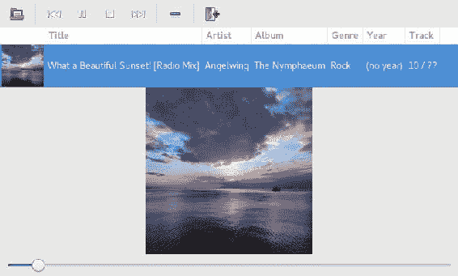
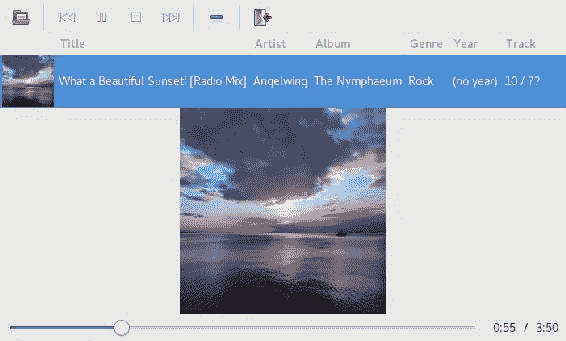
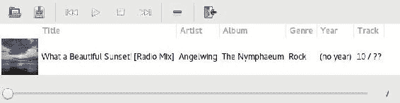
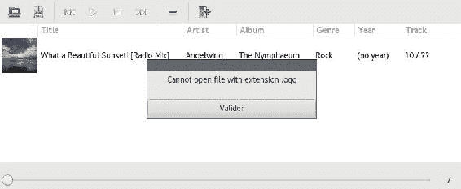

# 第六章：实现音乐播放器引擎

在上一章中，我们实现了音乐播放器的用户界面，但它无法播放任何音乐。我们将在这个章节中解决这个挑战。我们将创建音乐播放器的引擎，使其能够播放 MP3 文件。为此，我们需要使用线程，以确保播放歌曲不会冻结界面，这将是一个学习 Rust 并发的好机会。

在本章中，我们将涵盖以下主题：

+   MP3 解码器

+   线程

+   互斥锁和互斥锁保护

+   Send/Sync 特质

+   RAII

+   线程安全性

+   内部可变性

# 安装依赖项

对于本章，我们需要两个库：`pulseaudio`和`libmad`。

前者将用于播放音乐，而后者用于解码 MP3 文件。

# 在 Linux 上安装依赖项

在 Linux 上，这些依赖项可以通过您发行版的包管理器安装。

在 Ubuntu（或其他 Debian 衍生版）上：

```rs
sudo apt-get install libmad0-dev libpulse-dev
```

# 在 Mac 上安装依赖项

在 OSX 上，可以通过系统包管理器安装所需的依赖项，如下所示：

```rs
brew install libmad pulseaudio
```

# 在 Windows 上安装依赖项

在 Windows 上，在 MSYS2 壳中运行以下命令：

```rs
pacman -S mingw-w64-libmad
```

思考，点击此页面的链接下载 zip 文件：[`www.freedesktop.org/wiki/Software/PulseAudio/Ports/Windows/Support/`](https://www.freedesktop.org/wiki/Software/PulseAudio/Ports/Windows/Support/)（当本书编写时，当前版本的链接为[`bosmans.ch/pulseaudio/pulseaudio-1.1.zip`](http://bosmans.ch/pulseaudio/pulseaudio-1.1.zip)）。然后，按照第二章中“从 SDL 开始”的相同说明，使用 Rust 库。

# 解码 MP3 文件

我们将从这个章节开始学习如何使用`simplemad`crate（`libmad`的绑定）将 MP3 文件解码为操作系统可播放的格式，这将帮助我们理解如何解码 MP3 文件。

# 添加依赖项

让我们在`Cargo.toml`中添加以下内容：

```rs
crossbeam = "⁰.3.0"
pulse-simple = "¹.0.0"
simplemad = "⁰.8.1"
```

我们还添加了`pulse-simple`和`crossbeam`crate，因为我们在以后需要它们。前者将用于使用`pulseaudio`播放歌曲，后者将用于实现音乐播放器引擎的事件循环。

我们还需要在`main.rs`中添加以下语句：

```rs
extern crate crossbeam;
extern crate pulse_simple;
extern crate simplemad;

mod mp3;
```

除了`extern crate`语句外，我们还有一个`mod`语句，因为我们将为 MP3 解码器创建一个新的模块。

# 实现 MP3 解码器

现在我们已经准备好创建这个新模块了。创建一个名为`mp3.rs`的新文件，内容如下：

```rs
use std::io::{Read, Seek, SeekFrom};
use std::time::Duration;

use simplemad;
```

我们像往常一样从这个模块开始，添加一些导入语句。其中重要的是`simplemad`，它将被用来解码 MP3 文件的帧：

```rs
pub struct Mp3Decoder<R> where R: Read {
    reader: simplemad::Decoder<R>,
    current_frame: simplemad::Frame,
    current_frame_channel: usize,
    current_frame_sample_pos: usize,
    current_time: u64,
}
```

在第一章，“Rust 基础”中，我们了解到我们可以在函数的泛型参数中添加特质界限。我们也可以将它们添加到类型的泛型参数中。这里我们看到使用`where`子句的替代语法。前面的结构声明与以下相同：

```rs
pub struct Mp3Decoder<R: Read> {
    // …
}
```

`where`子句在有很多泛型参数时很有用。

这个结构包含有关当前帧和时间以及解码器本身的信息，解码器来自`simplemad`crate。这个`Decoder`还需要一个实现`Read`特质的泛型参数，所以我们只需使用自己的`R`参数，因为我们指定它必须实现这个特质。

在我们继续到这个类型的构造函数之前，我们将实现几个`utility`函数。让我们从一个将`Duration`转换为毫秒数的函数开始（这个函数将放在`main.rs`文件中，因为我们将在另一个模块中使用它）：

```rs
fn to_millis(duration: Duration) -> u64 {
    duration.as_secs() * 1000 + duration.subsec_nanos() as u64 / 1_000_000
}
```

在这里，我们简单地乘以秒数乘以`1,000`，并将纳秒数除以`1,000,000`。这个函数需要您添加对`Duration`的导入语句：

```rs
use std::time::Duration;
```

接下来，我们将编写一个函数来检查数据流是否为 MP3 文件：

```rs
fn is_mp3<R>(mut data: R) -> bool where R: Read + Seek {
    let stream_pos = data.seek(SeekFrom::Current(0)).unwrap();
    let is_mp3 = simplemad::Decoder::decode(data.by_ref()).is_ok();
    data.seek(SeekFrom::Start(stream_pos)).unwrap();
    is_mp3
}
```

为了做到这一点，我们尝试解码流，如果结果是`Ok`，则数据是 MP3 文件。然后我们回到文件的开头，在返回是否是 MP3 文件之前。

下一个我们需要的功能是解码 MP3 文件的下一个帧：

```rs
fn next_frame<R: Read>(decoder: &mut simplemad::Decoder<R>) -> simplemad::Frame {
    decoder.filter_map(|f| f.ok()).next()
        .unwrap_or_else(|| {
            simplemad::Frame {
                bit_rate: 0,
                layer: Default::default(),
                mode: Default::default(),
                sample_rate: 44100,
                samples: vec![Vec::new()],
                position: Duration::from_secs(0),
                duration: Duration::from_secs(0),
            }
        })
}
```

在这里，我们简单地从解码器获取下一个帧，并通过调用`and_then(Result::ok)`将`Option<Result<Frame>>`扁平化为`Option<Frame>`。如果没有帧，我们返回一个默认帧。

现在，让我们实现我们的 MP3 解码器的构造函数：

```rs
impl<R> Mp3Decoder<R> where R: Read + Seek {
    pub fn new(mut data: R) -> Result<Mp3Decoder<R>, R> {
        if !is_mp3(data.by_ref()) {
            return Err(data);
        }

        let mut reader = simplemad::Decoder::decode(data).unwrap();

        let current_frame = next_frame(&mut reader);
        let current_time = to_millis(current_frame.duration);

        Ok(Mp3Decoder {
            reader,
            current_frame,
            current_frame_channel: 0,
            current_frame_sample_pos: 0,
            current_time,
        })
    }
}
```

您需要在文件顶部添加一个导入语句，以便能够使用`to_millis`函数，该函数位于`main`模块中：

```rs
use to_millis;
```

由于`use`语句相对于 crate 的根目录，我们只需写出函数名，因为这个函数在 crate 的根目录。

构造函数首先检查流是否包含 MP3 数据，如果不是，我们返回一个错误。否则，我们从`simplemad`crate 创建一个`Decoder`。然后，我们读取第一个帧并获取其毫秒时间。

接下来，我们编写两个方法来获取 MP3 文件当前的时间和速率：

```rs
    pub fn current_time(&self) -> u64 {
        self.current_time
    }

    pub fn samples_rate(&self) -> u32 {
        self.current_frame.sample_rate
    }
```

这些方法需要添加到`impl Mp3Decoder`块中。要添加到这个结构中的最后一个方法是计算歌曲的持续时间：

```rs
    pub fn compute_duration(mut data: R) -> Option<Duration> {
        if !is_mp3(data.by_ref()) {
            return None;
        }

        let decoder = simplemad::Decoder::decode_headers(data).unwrap();
        Some(decoder.filter_map(|frame| {
            match frame {
                Ok(frame) => Some(frame.duration),
                Err(_) => None,
            }
        })
            .sum())
    }
```

在这里，我们创建一个关联函数：它首先检查是否是 MP3 数据。在这里，我们不是使用`Decoder::decode()`，而是使用`Decoder::decode_headers()`，因为我们只需要帧持续时间，只解码头部更快。`decoder`是一个迭代器，我们在它上面调用`filter_map()`。正如你在第二章中看到的，*从 SDL 开始*，`filter_map()`会转换和过滤迭代器的元素。通过返回`Some(new_value)`来转换值，而通过返回`None`来过滤掉值。之后，我们在结果迭代器上调用`sum()`以获取所有持续时间的总和。

# 获取帧样本

我们 MP3 解码器所需的功能仅剩下能够遍历样本。我们首先编写一个获取下一个样本的函数：

```rs
fn next_sample<R: Read>(decoder: &mut Mp3Decoder<R>) -> Option<i16> {
    if decoder.current_frame.samples[0].len() == 0 {
        return None;
    }

    // getting the sample and converting it from fixed step to i16
    let sample = decoder.current_frame.samples[decoder.current_frame_channel] 
    [decoder.current_frame_sample_pos];
    let sample = sample.to_i32() + (1 << (28 - 16));
    let sample = if sample >= 0x10000000 { 0x10000000 - 1 } else if sample <=  
    -0x10000000 { -0x10000000 } else { sample };
    let sample = sample >> (28 + 1 - 16);
    let sample = sample as i16;

    decoder.current_frame_channel += 1;

    if decoder.current_frame_channel < decoder.current_frame.samples.len() {
        return Some(sample);
    }

    decoder.current_frame_channel = 0;
    decoder.current_frame_sample_pos += 1;

    if decoder.current_frame_sample_pos < decoder.current_frame.samples[0].len() {
        return Some(sample);
    }

    decoder.current_frame = next_frame(&mut decoder.reader);
    decoder.current_frame_channel = 0;
    decoder.current_frame_sample_pos = 0;
    decoder.current_time += to_millis(decoder.current_frame.duration);

    return Some(sample);
}
```

这个函数正在进行一些位移动以获取样本，然后获取下一个帧。我们现在准备好实现一个将使用此函数的迭代器：

```rs
impl<R> Iterator for Mp3Decoder<R> where R: Read {
    type Item = i16;

    fn next(&mut self) -> Option<i16> {
        next_sample(self)
    }

    fn size_hint(&self) -> (usize, Option<usize>) {
        (self.current_frame.samples[0].len(), None)
    }
}
```

如你所见，我们可以通过实现`Iterator`特质来创建自己的迭代器。唯一需要实现的方法是`next()`。通过实现这个简单的方法，我们获得了一大批功能，因为这个特质有很多默认方法。`type Item`也是必需的。我们实现了`size_hint()`方法，尽管它是可选的。

# 播放音乐

MP3 解码器完成之后，我们现在可以播放音乐了。我们将创建一个新的模块，命名为 player，并将其添加到`main.rs`的顶部：

```rs
mod player;
```

我们将从这个模块开始，创建一个包含以下导入语句的`player.rs`新文件：

```rs
use std::fs::File;
use std::io::BufReader;
use std::path::{Path, PathBuf};
use std::sync::{Arc, Condvar, Mutex};
use std::thread;

use crossbeam::sync::SegQueue;
use pulse_simple::Playback;

use mp3::Mp3Decoder;
use self::Action::*;
```

我们还将创建一些常量：

```rs
const BUFFER_SIZE: usize = 1000;
const DEFAULT_RATE: u32 = 44100;
```

缓冲区大小是我们将解码和播放的样本数量，以避免在播放歌曲时出现减速，同时也避免通过同时读取和解码数据来使用 100%的 CPU。当我们在 MP3 文件中找不到时，将使用默认速率。

# 事件循环

为了简化播放引擎的开发，我们将使用事件循环的概念。一些操作将通过这个事件循环发送到播放音乐的线程。例如，我们将能够发出一个`Load("file.mp3")`事件，线程将解码这个 MP3 文件，并开始播放。另一个事件示例是`Stop`，它将停止播放并卸载数据。

让我们创建一个枚举来表示可能的操作：

```rs
enum Action {
    Load(PathBuf),
    Stop,
}
```

我们现在准备好创建事件循环的结构：

```rs
#[derive(Clone)]
struct EventLoop {
    queue: Arc<SegQueue<Action>>,
    playing: Arc<Mutex<bool>>,
}
```

这个结构中有许多未知的内容，让我们来分解它。

# 原子引用计数

首先，我们使用`Arc`类型。它与我们之前章节中使用的`Rc`类型类似，因为它是一个提供引用计数的类型。这两个类型之间的区别在于`Arc`使用原子操作来增加其计数器。由于是原子的，它可以在多个线程中安全使用，而`Rc`则不能在多个线程中安全使用（编译器会阻止我们这样做）。标准库提供这两种类型，以便你可以选择你愿意付出的代价。如果你不需要与多个线程共享引用计数值，请选择`Rc`，因为它比`Arc`更高效。如果你尝试将`Rc`发送到另一个线程，编译器将触发一个错误：

```rs
error[E0277]: the trait bound `std::rc::Rc<i32>: std::marker::Send` is not satisfied in `[closure@src/main.rs:6:19: 8:6 rc:std::rc::Rc<i32>]`
 --> src/main.rs:6:5
  |
6 |     thread::spawn(move || {
  |     ^^^^^^^^^^^^^ `std::rc::Rc<i32>` cannot be sent between threads safely
  |
  = help: within `[closure@src/main.rs:6:19: 8:6 rc:std::rc::Rc<i32>]`, the trait `std::marker::Send` is not implemented for `std::rc::Rc<i32>`
  = note: required because it appears within the type `[closure@src/main.rs:6:19: 8:6 rc:std::rc::Rc<i32>]`
  = note: required by `std::thread::spawn`
```

在这种情况下，你需要切换到`Arc`。当我们看到`Send`特质是什么时，这个错误将更有意义。

# 互斥

在`play`区域，`Arc`中包含一个`Mutex`。互斥锁提供互斥性，意味着它允许我们锁定其内部值（在这种情况下，一个`bool`），防止其他线程同时操作相同的值。它通过防止对值的并发读写来防止数据竞争，这是未定义行为的原因。

# 发送特质

但编译器是如何防止我们发生数据竞争的呢？这要归功于`Send`和`Sync`标记特质。实现了`Send`特质的数据类型可以安全地发送到另一个线程。正如你可能猜到的，`Rc`没有实现`Send`。由于它没有使用原子操作来增加其计数器，如果两个线程同时增加它，那将是一个数据竞争。

# 同步特质

让我们讨论第二个标记特质：`Sync`。实现了`Sync`特质的数据类型可以安全地与多个线程共享。一个`Sync`类型的例子是`Mutex`。它是安全的，因为从`Mutex`获取值的唯一方式是锁定它，这是互斥的（另一个线程不能同时访问相同的值）。

# 无锁数据结构

剩下要解释的唯一类型是来自`crossbeam`包的`SegQueue`。这个类型是一个无锁队列，意味着它可以由多个线程并发使用而不需要锁。无锁数据结构的实现超出了本书的范围，但可以说它使用原子操作在幕后，这样我们就不需要使用`Mutex`来在可变线程中同时修改这个值。我们仍然需要用`Arc`包装这个队列，以便能够与多个线程共享。

我们使用无锁数据结构，因为我们将在队列中不断检查是否有新元素，同时可能从另一个线程向这个队列添加新元素。如果我们使用`Mutex<VecDeque<Action>>`，它将效率更低，因为在对`Mutex`调用`lock()`时，如果锁被另一个线程持有，它将等待。

让我们回到我们的事件循环。让我们为`EventLoop`添加一个构造函数：

```rs
impl EventLoop {
    fn new() -> Self {
        EventLoop {
            queue: Arc::new(SegQueue::new()),
            playing: Arc::new(Mutex::new(false)),
        }
    }
}
```

此构造函数简单地创建队列和布尔值，并将其包裹在`Mutex`中。

在使用它之前，我们将创建一个`State`结构，该结构将包含 GUI 线程和音乐播放器线程之间共享的各种数据，将此代码放在`main`模块中：

```rs
struct State {
    stopped: bool,
}
```

还需要在`App`结构中添加一个`state`字段：

```rs
struct App {
    adjustment: Adjustment,
    cover: Image,
    playlist: Rc<Playlist>,
    state: Arc<Mutex<State>>,
    toolbar: MusicToolbar,
    window: Window,
}
```

这需要一个新的导入语句：

```rs
use std::sync::{Arc, Mutex};
```

由于这个值将被另一个线程共享，我们需要将其包裹在`Arc<Mutex>`中。然后在构造函数中，创建这个值并将其分配给这个新字段，同时将其发送到`Playlist`构造函数：

```rs
impl App {
    fn new() -> Self {
        // …

        let state = Arc::new(Mutex::new(State {
            stopped: true,
        }));

        let playlist = Rc::new(Playlist::new(state.clone()));

        // …

        let app = App {
            adjustment,
            cover,
            playlist,
            state,
            toolbar,
            window,
        };

        // …
    }
}
```

让我们更新`Playlist`构造函数：

```rs
impl Playlist {
    pub(crate) fn new(state: Arc<Mutex<State>>) -> Self {
        let model = ListStore::new(&[
            Pixbuf::static_type(),
            Type::String,
            Type::String,
            Type::String,
            Type::String,
            Type::String,
            Type::String,
            Type::String,
            Pixbuf::static_type(),
        ]);
        let treeview = TreeView::new_with_model(&model);
        treeview.set_hexpand(true);
        treeview.set_vexpand(true);

        Self::create_columns(&treeview);

        Playlist {
            model,
            player: Player::new(state.clone()),
            treeview,
        }
    }
}
```

结构需要一个新的字段，所以让我们添加它：

```rs
pub struct Playlist {
    model: ListStore,
    player: Player,
    treeview: TreeView,
}
```

这也需要新的导入语句：

```rs
use std::sync::{Arc, Mutex};

use State;
use player::Player;
```

我们使用`pub(crate)`语法来抑制错误。由于我们在公共方法中使用私有类型（`State`），编译器会抛出一个错误。这个语法意味着该函数对 crate 的其他模块是公共的，但其他 crate 无法访问它。在这里，我们只向`Player`构造函数发送`state`，我们将立即实现它。

# 播放音乐

我们将创建一个新的`Player`结构来包裹事件循环。播放器将从主线程中可用，以控制音乐。以下是该结构的本身：

```rs
pub struct Player {
    app_state: Arc<Mutex<super::State>>,
    event_loop: EventLoop,
}
```

这里是其构造函数的开始：

```rs
impl Player {
    pub(crate) fn new(app_state: Arc<Mutex<super::State>>) -> Self {
        let event_loop = EventLoop::new();

        {
            let app_state = app_state.clone();
            let event_loop = event_loop.clone();
            thread::spawn(move || {
                // …
            });
        }

        Player {
            app_state,
            event_loop,
        }
    }
}
```

我们首先创建一个新的事件循环。然后，我们启动一个新的线程。我们使用一个新的作用域来避免必须重命名将被发送到线程的变量，因为这些变量在构造函数末尾的结构初始化中使用。再次，我们需要使用`move`闭包，因为我们正在向线程发送事件循环和应用程序状态的副本。

让我们看看线程闭包的第一部分：

```rs
thread::spawn(move || {
    let mut buffer = [[0; 2]; BUFFER_SIZE];
    let mut playback = Playback::new("MP3", "MP3 Playback", None,
    DEFAULT_RATE);
    let mut source = None;
    loop {
        if let Some(action) = event_loop.queue.try_pop() {
            match action {
                Load(path) => {
                    let file = File::open(path).unwrap();
                    source = Some(Mp3Decoder::new(BufReader::new(file)).unwrap());
                    let rate = source.as_ref().map(|source| 
                     source.samples_rate()).unwrap_or(DEFAULT_RATE);
                    playback = Playback::new("MP3", "MP3 Playback", 
                     None, rate);
                    app_state.lock().unwrap().stopped = false;
                },
                Stop => {},
            }
        }
        // …
    }
});
```

我们首先创建一个缓冲区来包含要播放的样本。然后我们将创建一个`Playback`，这是一个对象，它将允许我们在硬件上播放音乐。我们还将创建一个`source`变量，它将包含一个`Mp3Decoder`。然后我们启动一个无限循环并尝试获取队列中的第一个元素：如果队列中有元素，则返回`Some(action)`。这就是为什么我们使用了`if let`来对方法调用的结果进行模式匹配。然后我们对动作进行匹配以查看它是哪种动作：如果是`Load`动作，我们使用指定的路径打开文件，并使用该文件的缓冲读取器创建一个`Mp3Decoder`。然后我们尝试获取歌曲的采样率并使用这个率创建一个新的`Playback`。我们稍后会处理`Stop`动作。

最后，我们看到我们第一次使用`Mutex`：

```rs
app_state.lock().unwrap().stopped = false;
```

让我们以另一种方式重写它来看看发生了什么：

```rs
let mut guard = app_state.lock().unwrap();
guard.stopped = false;
```

我们首先调用`lock()`，它返回一个`Result<MutexGuard<T>, PoisonError<MutexGuard<T>>>`。

# Mutex guard

锁定器（mutex guard）是一个作用域锁：这意味着当超出作用域时，互斥锁将被自动解锁。这是一种确保用户会使用`Mutex`并且不会忘记解锁它的好方法。

# RAII

但它背后是如何工作的呢？Rust 使用**资源获取即初始化**（**RAII**）的惯用用法。使用这个惯用用法，资源在构造函数中分配，并在析构函数中释放。在 Rust 中，析构函数是通过`Drop`特质实现的。所以，回到互斥锁守卫，当`MutexGuard`的析构函数被调用时，互斥锁会被解锁，所以，就像之前的例子一样，当`guard`变量超出作用域时。

让我们回到我们的无限循环：

```rs
loop {
    if let Some(action) = event_loop.queue.try_pop() {
        // …
    } else if *event_loop.playing.lock().unwrap() {
        let mut written = false;
        if let Some(ref mut source) = source {
            let size = iter_to_buffer(source, &mut buffer);
            if size > 0 {
                playback.write(&buffer[..size]);
                written = true;
            }
        }

        if !written {
            app_state.lock().unwrap().stopped = true;
            *event_loop.playing.lock().unwrap() = false;
            source = None;
        }
    }
}
```

在这里，我们检查播放值是否为真（再次使用`lock().unwrap()`技巧）。我们必须使用`*`来访问`MutexGuard`的值，因为它实现了`Deref`。这意味着我们没有直接访问底层值。但由于它实现了`Deref`特质，我们可以通过解引用守卫（使用`*`）来访问它。我们之前不需要这个技巧，因为我们访问了一个字段，Rust 会自动解引用字段。

我们随后创建一个`written`变量，如果播放器能够播放一个样本，它将是`true`。如果它无法播放一个，这意味着歌曲已经结束。在这种情况下，我们将`stopped`值设置为`true`，将`playing`设置为`false`。

要播放样本，我们调用`iter_to_buffer`，它将从解码器（它是一个`Iterator`）中获取值并将它们写入缓冲区。之后，它将缓冲区写入`playback`以在您的声卡上播放样本。

让我们看看这个`iter_to_buffer`函数：

```rs
fn iter_to_buffer<I: Iterator<Item=i16>>(iter: &mut I, buffer: &mut [[i16; 2]; BUFFER_SIZE]) -> usize {
    let mut iter = iter.take(BUFFER_SIZE);
    let mut index = 0;
    while let Some(sample1) = iter.next() {
        if let Some(sample2) = iter.next() {
            buffer[index][0] = sample1;
            buffer[index][1] = sample2;
        }
        index += 1;
    }
    index
}
```

我们首先从迭代器中取出`BUFFER_SIZE`个元素，并将它们两次（对于两个通道）添加到缓冲区中。然后我们返回写入缓冲区的元素数量。

# 使用音乐播放器

我们现在准备好使用我们的音乐引擎了。让我们给`Playlist`添加几个新方法。

让我们从获取选择项路径的方法开始：

```rs
    fn selected_path(&self) -> Option<String> {
        let selection = self.treeview.get_selection();
        if let Some((_, iter)) = selection.get_selected() {
            let value = self.model.get_value(&iter, PATH_COLUMN as i32);
            return value.get::<String>();
        }
        None
    }
```

我们首先获取选择项，然后获取选择项的迭代器。从迭代器中，我们可以获取指定列的值以获取路径。我们现在可以添加一个方法来加载所选歌曲：

```rs
    pub fn play(&self) -> bool {
        if let Some(path) = self.selected_path() {
            self.player.load(&path);
            true
        } else {
            false
        }
    }
```

如果有选定的歌曲，我们将它加载到音乐引擎中。如果歌曲被加载，我们返回`true`。

我们现在将在播放按钮的事件处理程序中使用这个方法：

```rs
impl App {
    pub fn connect_toolbar_events(&self) {
        // …

        let playlist = self.playlist.clone();
        let play_image = self.toolbar.play_image.clone();
        let cover = self.cover.clone();
        let state = self.state.clone();
        self.toolbar.play_button.connect_clicked(move |_| {
            if state.lock().unwrap().stopped {
                if playlist.play() {
                    set_image_icon(&play_image, PAUSE_ICON);
                    set_cover(&cover, &playlist);
                }
            } else {
                set_image_icon(&play_image, PLAY_ICON);
            }
        });

        // …
    }
}
```

我们创建`playlist`变量的一个副本，因为它被移动到了闭包中。在后者中，我们随后调用了我们刚才创建的`play()`方法。我们只更改按钮的图像，并在歌曲开始播放时显示封面。

你现在可以尝试音乐播放器了：打开一个 MP3 文件，点击播放，你应该能听到歌曲。让我们继续开发软件，因为还有很多功能缺失。

# 暂停和恢复歌曲

我们将首先添加一个字段来指示播放器是否处于暂停状态。此字段将由 `play` 或 `resume` 等方法更改。然而，请记住，我们的 `Playlist` 被包装在一个 `Rc` 中，这样我们就可以在不同的地方使用它，即在事件处理程序中。还要记住，Rust 禁止在存在对值的可变引用时进行修改。我们如何使用引用计数指针来更新此字段？一种方法是通过内部可变性。

# 内部可变性

内部可变性是一个概念，它允许具有不可变引用的类型具有可变内部值。这样做安全吗？是的，绝对安全，因为我们需要遵守某些约束。实现内部可变性的方法之一是包装我们的 `Cell` 类型。此类型的约束是，如果我们想从不可变引用获取 `Cell` 的值，则包装的类型必须实现 `Copy` 特性。我们将在本章后面看到其他常用的内部可变性类型。现在，让我们将我们的字段添加到 `Player` 类型中：

```rs
use std::cell::Cell;

pub struct Player {
    app_state: Arc<Mutex<super::State>>,
    event_loop: EventLoop,
    paused: Cell<bool>,
}
```

让我们更新结构的构造：

```rs
impl Player {
    pub(crate) fn new(app_state: Arc<Mutex<super::State>>) -> Self {
        // …

        Player {
            app_state,
            event_loop,
            paused: Cell::new(false),
        }
    }
}
```

我们现在可以添加一个方法来检查音乐是否已暂停：

```rs
    pub fn is_paused(&self) -> bool {
        self.paused.get()
    }
```

这里，我们需要调用 `Cell::get()` 来获取内部值的副本。现在我们可以添加播放和恢复歌曲的方法：

```rs
    pub fn pause(&self) {
        self.paused.set(true);
        self.app_state.lock().unwrap().stopped = true;
        self.set_playing(false);
    }

    pub fn resume(&self) {
        self.paused.set(false);
        self.app_state.lock().unwrap().stopped = false;
        self.set_playing(true);
    }
```

在这里，我们看到我们需要调用 `Cell::set()` 来更新 `Cell` 的值。尽管我们只有一个不可变引用，但我们仍然可以这样做，而且这样做是完全安全的。然后，我们更新应用程序状态的 `stopped` 字段，因为播放按钮的点击处理程序将使用它来决定我们是否想要播放或继续音乐。我们还调用 `set_playing()` 来向播放器线程指示它是否需要继续播放歌曲。此方法定义如下：

```rs
    fn set_playing(&self, playing: bool) {
        *self.event_loop.playing.lock().unwrap() = playing;
        let (ref lock, ref condition_variable) = *self.event_loop.condition_variable;
        let mut started = lock.lock().unwrap();
        *started = playing;
        if playing {
            condition_variable.notify_one();
        }
    }
```

它设置 `playing` 变量，然后通知播放器线程如果 `playing` 是 `true`，则唤醒它。

现在我们将向我们的 `Playlist` 类型添加一个 `pause()` 方法，当用户点击暂停时，将调用我们刚刚创建的 `pause()` 方法：

```rs
    pub fn pause(&self) {
        self.player.pause();
    }
```

要使用它，我们将更新播放按钮的点击处理程序：

```rs
self.toolbar.play_button.connect_clicked(move |_| {
    if state.lock().unwrap().stopped {
        if playlist.play() {
            set_image_icon(&play_image, PAUSE_ICON);
            set_cover(&cover, &playlist);
        }
    } else {
        playlist.pause();
        set_image_icon(&play_image, PLAY_ICON);
    }
});
```

我们在 `else` 块中添加了暂停的调用。

我们现在想更新 `play()` 方法。现在我们可以暂停歌曲了，因此对于此方法需要考虑两种新情况：

+   如果歌曲正在播放，我们希望暂停它。

+   如果歌曲已暂停，我们希望根据是否选择了相同的歌曲来恢复歌曲，或者如果选择了另一首歌曲，则开始播放新歌曲。

正因如此，我们需要在 `Playlist` 结构中添加一个新的字段：

```rs
pub struct Playlist {
    current_song: RefCell<Option<String>>,
    model: ListStore,
    player: Player,
    treeview: TreeView,
}
```

我们添加了一个字段，它将包含当前播放歌曲的路径。在这里，我们将`Option<String>`包装在`RefCell`中，这是另一种实现内部可变性的方法。我们不能使用`Cell`，因为`String`类型没有实现`Copy`特质。那么，`Cell`和`RefCell`之间的区别是什么？`RefCell`类型将在运行时检查借用规则：如果同时发生两个借用，它将引发 panic。在使用`RefCell`时，我们必须要小心：如果可能的话，最好有编译时借用检查。但是，当使用`gtk-rs`时，我们有时需要与事件处理器共享可变状态，而最好的方法就是使用`RefCell`。

在下一章中，我们将学习如何使用一个抽象状态管理的库，这样你就不需要使用`RefCell`，并且在运行时不会遇到任何`panic`。这需要一个新的导入语句：

```rs
use std::cell::RefCell;
```

我们需要更新构造函数来初始化这个值：

```rs
impl Playlist {
    pub(crate) fn new(state: Arc<Mutex<State>>) -> Self {
        // …

        Playlist {
            current_song: RefCell::new(None),
            model,
            player: Player::new(state.clone()),
            treeview,
        }
    }
}
```

在我们更新`play()`方法之前，我们还需要在`Playlist`中添加一个方法：

```rs
    pub fn path(&self) -> Option<String> {
        self.current_song.borrow().clone()
    }
```

此方法返回当前歌曲路径的副本。由于字段是`RefCell`，我们需要调用`borrow()`来访问内部值。此方法返回相当于不可变引用的值。我们很快就会看到如何获得可变引用。与`Mutex`一样，借用是词法的，借用将在函数结束时结束。我们现在准备好更新`play()`方法：

```rs
    pub fn play(&self) -> bool {
        if let Some(path) = self.selected_path() {
            if self.player.is_paused() && Some(&path) == 
             self.path().as_ref() {
                self.player.resume();
            } else {
                self.player.load(&path);
                *self.current_song.borrow_mut() = Some(path.into());
            }
            true
        } else {
            false
        }
    }
```

如果歌曲被暂停并且选定的路径与当前播放的歌曲路径相同，我们调用`resume()`。如果这个条件是`false`，我们加载指定的路径并将这个路径保存在我们的字段中。为此，我们调用`borrow_mut()`来获取一个可变引用。再一次，我们需要在表达式前加上`*`，这样`DerefMut::deref_mut()`就会被调用。运行项目，你会看到你可以暂停和恢复歌曲。

现在我们添加一个停止歌曲的方法。我们像往常一样，首先向`Player`添加一个方法：

```rs
    pub fn stop(&self) {
        self.paused.set(false);
        self.app_state.lock().unwrap().stopped = true;
        self.emit(Stop);
        self.set_playing(false);
    }
```

我们首先将`paused`字段设置为`false`，这样播放列表就不会在下次点击播放按钮时尝试恢复歌曲。然后我们将`stopped`字段设置为`true`，这将导致下一次点击此按钮播放歌曲而不是尝试暂停它。然后我们向事件循环发出`Stop`动作，并指示引擎线程不再播放音乐。

`emit`方法非常简单：

```rs
fn emit(&self, action: Action) {
    self.event_loop.queue.push(action);
}
```

它只是将`action`推送到事件循环的队列中。

现在我们来处理这个`Stop`事件：

```rs
Stop => {
    source = None;
},
```

我们只将源重置为`None`，因为我们不再需要它了。

然后，我们准备好向`Playlist`添加一个`stop()`方法：

```rs
    pub fn stop(&self) {
        *self.current_song.borrow_mut() = None;
        self.player.stop();
    }
```

我们首先将`current_song`字段重置为`None`，这样下一次调用`play()`就不会尝试恢复歌曲。然后我们调用我们之前创建的`stop()`方法。

现在我们准备好通过创建一个新的用于停止按钮的事件处理器来使用这个新方法，将此代码添加到`connect_toolbar_events()`方法中：

```rs
    let playlist = self.playlist.clone();
    let play_image = self.toolbar.play_image.clone();
    let cover = self.cover.clone();
    self.toolbar.stop_button.connect_clicked(move |_| {
        playlist.stop();
        cover.hide();
        set_image_icon(&play_image, PLAY_ICON);
    });
```

因此，当我们点击停止时，我们调用`Playlist::stop()`方法来停止播放音乐。我们还隐藏封面并将播放按钮设置回显示播放图标。你现在可以在音乐播放器中再次尝试，以查看这个新功能的效果。

现在，让我们为剩下的两个按钮添加动作：上一个和下一个。

我们首先需要在`Playlist`中创建一个新的方法：

```rs
    pub fn next(&self) -> bool {
        let selection = self.treeview.get_selection();
        let next_iter =
            if let Some((_, iter)) = selection.get_selected() {
                if !self.model.iter_next(&iter) {
                    return false;
                }
                Some(iter)
            }
            else {
                self.model.get_iter_first()
            };
        if let Some(ref iter) = next_iter {
            selection.select_iter(iter);
            self.play();
        }
        next_iter.is_some()
    }
```

我们首先获取选择项。然后检查是否有项目被选中：在这种情况下，我们尝试获取选择项之后的项。如果没有选中任何项，我们就获取列表中的第一个项。然后，如果我们能够获取到一个项，我们就选中它并开始播放歌曲。我们返回是否更改了选择项。

`previous()`方法类似：

```rs
    pub fn previous(&self) -> bool {
        let selection = self.treeview.get_selection();
        let previous_iter =
            if let Some((_, iter)) = selection.get_selected() {
                if !self.model.iter_previous(&iter) {
                    return false;
                }
                Some(iter)
            }
            else {
                self.model.iter_nth_child(None, max(0, 
                 self.model.iter_n_children(None) 
                - 1))
            };
        if let Some(ref iter) = previous_iter {
            selection.select_iter(iter);
            self.play();
        }
        previous_iter.is_some()
    }
```

然而，没有`get_iter_last()`方法，所以我们使用`iter_nth_child()`来获取最后一个元素。

这需要添加一个新的导入语句在文件顶部：

```rs
use std::cmp::max;
```

使用这些新方法，我们准备好处理按钮的点击事件。让我们从下一个按钮开始：

```rs
let playlist = self.playlist.clone();
let play_image = self.toolbar.play_image.clone();
let cover = self.cover.clone();
self.toolbar.next_button.connect_clicked(move |_| {
    if playlist.next() {
        set_image_icon(&play_image, PAUSE_ICON);
        set_cover(&cover, &playlist);
    }
});
```

我们简单地调用我们刚刚创建的`next()`方法，如果选定了新歌曲，我们更新播放按钮的图标并显示新的封面。上一个按钮的处理程序完全相同，只是我们调用`previous()`而不是`next()`：

```rs
let playlist = self.playlist.clone();
let play_image = self.toolbar.play_image.clone();
let cover = self.cover.clone();
self.toolbar.previous_button.connect_clicked(move |_| {
    if playlist.previous() {
        set_image_icon(&play_image, PAUSE_ICON);
        set_cover(&cover, &playlist);
    }
});
```

# 显示歌曲的进度

当歌曲播放时，看到光标移动会很好。让我们立即解决这个问题。

我们将在我们的`Player`中添加一个方法来获取歌曲的持续时间：

```rs
use std::time::Duration;

    pub fn compute_duration<P: AsRef<Path>>(path: P) -> 
     Option<Duration> {
        let file = File::open(path).unwrap();
        Mp3Decoder::compute_duration(BufReader::new(file))
    }
```

我们简单地调用我们之前创建的`compute_duration()`方法。接下来，我们将修改`Playlist`以调用这个函数。但在我们这样做之前，我们将修改`main`模块中的`State`类型以包含额外的信息：

```rs
use std::collections::HashMap;

struct State {
    current_time: u64,
    durations: HashMap<String, u64>,
    stopped: bool,
}
```

我们添加了一个`current_time`字段，它将包含自歌曲开始播放以来经过的时间。我们还把歌曲的持续时间存储在一个`HashMap`中，这样我们只为每个路径计算一次。现在我们需要更新`App`构造函数中`State`的初始化：

```rs
let current_time = 0;
let durations = HashMap::new();
let state = Arc::new(Mutex::new(State {
    current_time,
    durations,
    stopped: true,
}));
```

让我们回到`Playlist`。现在它将包含其结构中的`State`：

```rs
pub struct Playlist {
    current_song: RefCell<Option<String>>,
    model: ListStore,
    player: Player,
    state: Arc<Mutex<State>>,
    treeview: TreeView,
}
```

这应该在它的构造函数中反映出来：

```rs
Playlist {
    current_song: RefCell::new(None),
    model,
    player: Player::new(state.clone()),
    state,
    treeview,
}
```

在这里，我们添加了`state`字段。我们现在将添加一个方法，它将在另一个线程中计算持续时间：

```rs
use std::thread;
use to_millis;

    fn compute_duration(&self, path: &Path) {
        let state = self.state.clone();
        let path = path.to_string_lossy().to_string();
        thread::spawn(move || {
            if let Some(duration) = Player::compute_duration(&path)
            {
                let mut state = state.lock().unwrap();
                state.durations.insert(path, to_millis(duration));
            }
        });
    }
```

在线程的闭包中，我们计算持续时间，当它完成时，我们锁定状态以在`HashMap`中插入持续时间。我们因为在计算可能需要时间，我们不希望在这个计算期间阻塞用户界面，所以我们现在在`Playlist::add()`中调用这个方法：

```rs
    pub fn add(&self, path: &Path) {
        self.compute_duration(path);

        // …
    }
```

我们将更新`Adjustment`，使其初始值是`0.0`：

```rs
let adjustment = Adjustment::new(0.0, 0.0, 0.0, 0.0, 0.0, 0.0);
```

这是为了避免在持续时间尚未计算时看到光标移动得太快。

最后，我们在`App::connect_events()`方法中添加更新 UI 的代码：

```rs
use gtk::{AdjustmentExt, Continue};
use toolbar::{set_image_icon, PAUSE_ICON, PLAY_ICON};

    fn connect_events(&self) {
        let playlist = self.playlist.clone();
        let adjustment = self.adjustment.clone();
        let state = self.state.clone();
        let play_image = self.toolbar.play_image.clone();
        gtk::timeout_add(100, move || {
            let state = state.lock().unwrap();
            if let Some(path) = playlist.path() {
                if let Some(&duration) = state.durations.get(&path) 
                {
                    adjustment.set_upper(duration as f64);
                }
            }
            if state.stopped {
                set_image_icon(&play_image, PLAY_ICON);
            } else {
                set_image_icon(&play_image, PAUSE_ICON);
            }
            adjustment.set_value(state.current_time as f64);
            Continue(true)
        });
    }
```

当`gtk::timeout_add()`方法的闭包返回`Continue(false)`时，该方法将每 100 毫秒运行一次。这个闭包首先检查持续时间是否在`HashMap`中，并将光标的上限值设置为这个持续时间。如果值不在`HashMap`中，这意味着它还没有被计算。之后，我们检查`stopped`字段是否为真，这意味着歌曲已经结束，引擎线程不再播放它。在这种情况下，我们想显示播放图标。如果歌曲仍在播放，我们显示暂停图标。最后，我们将光标当前值从`current_time`字段设置。

光标现在将随着歌曲的播放自动移动。以下是现在播放器的外观：



*图 6.1*

# 提高 CPU 使用率

你可能注意到的一个问题是，当没有歌曲播放时，软件将使用 100%的 CPU。这是因为音乐引擎线程中的无限循环。当歌曲暂停或没有歌曲可播放时，它将什么也不做，只是循环。现在让我们解决这个问题。

# 条件变量

我们想要做的是当线程没有事情可做时让它休眠。我们还想能够从主线程唤醒线程。这正是条件变量的作用。所以，让我们在我们的引擎中添加一个。我们将首先在`EventLoop`中添加一个`condition_variable`字段：

```rs
struct EventLoop {
    condition_variable: Arc<(Mutex<bool>, Condvar)>,
    queue: Arc<SegQueue<Action>>,
    playing: Arc<Mutex<bool>>,
}
```

条件变量通常与布尔值（包装在`Mutex`中）一起使用。我们需要重写`EventLoop`的构造函数来初始化这个新字段：

```rs
impl EventLoop {
    fn new() -> Self {
        EventLoop {
            condition_variable: Arc::new((Mutex::new(false), Condvar::new())),
            queue: Arc::new(SegQueue::new()),
            playing: Arc::new(Mutex::new(false)),
        }
    }
}
```

接下来，我们需要在线程没有事情可做时阻塞它。以下是`Player::new()`中线程新代码的开始：

```rs
{
    let app_state = app_state.clone();
    let event_loop = event_loop.clone();
    let condition_variable = event_loop.condition_variable.clone();
    thread::spawn(move || {
        let block = || {
            let (ref lock, ref condition_variable) = 
             *condition_variable;
            let mut started = lock.lock().unwrap();
            *started = false;
            while !*started {
                started =
                 condition_variable.wait(started).unwrap();
            }
        };
```

我们创建条件变量的一个副本，并将这个副本移动到线程中。然后在闭包的开始处，我们锁定与条件变量相关联的布尔值并将其设置为`false`。之后，我们循环：当这个值是`false`时，我们阻塞当前线程。我们创建了一个闭包而不是一个普通函数，因为普通函数不能捕获值。以下代码与之前相同：

```rs
        let mut buffer = [[0; 2]; BUFFER_SIZE];
        let mut playback = Playback::new("MP3", "MP3 Playback", None, 
         DEFAULT_RATE);
        let mut source = None;
        loop {
            if let Some(action) = event_loop.queue.try_pop() {
                match action {
                    Load(path) => {
                        let file = File::open(path).unwrap();
                        source = 
                         Some(Mp3Decoder::new(BufReader::new(file)).unwrap());
                        let rate = source.as_ref().map(|source| 
                         source.samples_rate()).unwrap_or(DEFAULT_RATE);
                        playback = Playback::new("MP3", "MP3 Playback", 
                         None, rate);
                        app_state.lock().unwrap().stopped = false;
                    },
                    Stop => {
                        source = None;
                    },
                }
            } else if *event_loop.playing.lock().unwrap() {
                let mut written = false;
                if let Some(ref mut source) = source {
                    let size = iter_to_buffer(source, &mut buffer);
                    if size > 0 {
                        app_state.lock().unwrap().current_time = 
                         source.current_time();
                        playback.write(&buffer[..size]);
                        written = true;
                    }
                }
```

但闭包的其余部分略有不同：

```rs
                if !written {
                    app_state.lock().unwrap().stopped = true;
                    *event_loop.playing.lock().unwrap() = false;
                    source = None;
                    block();
                }
            } else {
                block();
            }
        }
    });
}
```

如果播放器无法播放歌曲（即歌曲已经结束），我们调用闭包来阻塞线程。如果播放器暂停，我们也会阻塞线程。有了条件变量，软件就不再使用 100%的 CPU。

# 显示歌曲的当前时间

目前，我们只显示歌曲的进度。用户无法知道歌曲的持续时间以及歌曲已经播放了多少秒。让我们通过添加显示当前时间和持续时间的标签来解决这个问题。

我们需要在`main`模块中添加两个新的导入语句：

```rs
use gtk::{Label, LabelExt};
```

我们还会在我们的`App`结构中添加两个`label`：

```rs
struct App {
    adjustment: Adjustment,
    cover: Image,
    current_time_label: Label,
    duration_label: Label,
    playlist: Rc<Playlist>,
    state: Arc<Mutex<State>>,
    toolbar: MusicToolbar,
    window: Window,
}
```

一个用于当前时间的`label`，另一个用于持续时间。由于我们想在光标右侧显示不同的`label`，我们将创建一个水平框，这段代码应该在`App::new()`中添加：

```rs
let hbox = gtk::Box::new(Horizontal, 10);
vbox.add(&hbox);

let adjustment = Adjustment::new(0.0, 0.0, 10.0, 0.0, 0.0, 0.0);
let scale = Scale::new(Horizontal, &adjustment);
scale.set_draw_value(false);
scale.set_hexpand(true);
hbox.add(&scale);
```

`Scale`小部件现在被添加到`hbox`而不是`vbox`中。我们调用`set_hexpand()`以便小部件尽可能多地占用水平空间。

我们现在准备好创建我们的`label`：

```rs
let current_time_label = Label::new(None);
hbox.add(&current_time_label);

let slash_label = Label::new("/");
hbox.add(&slash_label);

let duration_label = Label::new(None);
duration_label.set_margin_right(10);
hbox.add(&duration_label);
```

我们创建了三个`label`；第三个是一个分隔符。我们给最后一个`label`设置一个右外边距，以便它不会太靠近窗口的边缘。此外，在`App`构造函数中，我们需要更新结构的初始化：

```rs
let app = App {
    adjustment,
    cover,
    current_time_label,
    duration_label,
    playlist,
    state,
    toolbar,
    window,
};
```

我们添加了两个`label`。

我们将创建一个函数将毫秒数转换为`minute:second`格式的`String`：

```rs
fn millis_to_minutes(millis: u64) -> String {
    let mut seconds = millis / 1_000;
    let minutes = seconds / 60;
    seconds %= 60;
    format!("{}:{:02}", minutes, seconds)
}
```

在这个函数中，我们首先通过除以一千将毫秒数转换为秒。然后我们通过除以`60`得到分钟数。之后，我们使用模运算符计算不包括在分钟中的秒数。最后，我们将分钟和秒格式化为`String`。如您所见，我们使用了特殊的`{:02}`格式化器。`2`表示我们希望以两个字符打印数字，即使数字小于 0。冒号后面的`0`表示我们希望用`0`而不是空格来填充。

使用这个新函数，我们可以重写计时器以更新（在`App::connect_events()`方法中）`label`：

```rs
let current_time_label = self.current_time_label.clone();
let duration_label = self.duration_label.clone();
let playlist = self.playlist.clone();
let adjustment = self.adjustment.clone();
let state = self.state.clone();
let play_image = self.toolbar.play_image.clone();
gtk::timeout_add(100, move || {
    let state = state.lock().unwrap();
    if let Some(path) = playlist.path() {
        if let Some(&duration) = state.durations.get(&path) {
            adjustment.set_upper(duration as f64);
            duration_label.set_text(&millis_to_minutes(duration));
        }
    }
    if state.stopped {
        set_image_icon(&play_image, PLAY_ICON);
    } else {
        set_image_icon(&play_image, PAUSE_ICON);
        current_time_label.set_text(&millis_to_minutes(state.current_time));
    }
    adjustment.set_value(state.current_time as f64);
    Continue(true)
});
```

这里是前一个版本的更改。当我们获取持续时间时，我们更新持续时间`label`。当歌曲没有停止（即正在播放时），我们更新当前时间`label`。

我们需要更改停止按钮处理程序，以便重置这些`label`的文本。

最后，我们可以更新处理程序：

```rs
let current_time_label = self.current_time_label.clone();
let duration_label = self.duration_label.clone();
let playlist = self.playlist.clone();
let play_image = self.toolbar.play_image.clone();
let cover = self.cover.clone();
self.toolbar.stop_button.connect_clicked(move |_| {
    current_time_label.set_text("");
    duration_label.set_text("");
    playlist.stop();
    cover.hide();
    set_image_icon(&play_image, PLAY_ICON);
});
```

我们克隆小部件以将它们移动到闭包中，并将`label`的文本设置为空字符串。

当运行应用程序时，你应该看到以下结果：

*图 6.2*

# 加载和保存播放列表

我们在我们的音乐播放器中可以创建播放列表，但我们不能将播放列表保存到文件中以便稍后加载。让我们将此功能添加到我们的项目中。

我们将以`m3u`文件格式保存播放列表，并为了处理此格式，我们将使用`m3u`crate。所以让我们将其添加到我们的`Cargo.toml`文件中：

```rs
m3u = "¹.0.0"
```

将此行添加到`main`模块中：

```rs
extern crate m3u;
```

# 保存播放列表

我们首先添加一个按钮来保存播放列表。首先，我们在`MusicToolbar`结构中添加一个字段用于按钮：

```rs
pub struct MusicToolbar {
    open_button: ToolButton,
    next_button: ToolButton,
    play_button: ToolButton,
    pub play_image: Image,
    previous_button: ToolButton,
    quit_button: ToolButton,
    remove_button: ToolButton,
    save_button: ToolButton,
    stop_button: ToolButton,
    toolbar: Toolbar,
}
```

在构造函数中，我们将创建此按钮：

```rs
impl MusicToolbar {
    pub fn new() -> Self {
        let toolbar = Toolbar::new();

        let (open_button, _) = new_tool_button("document-open");
        toolbar.add(&open_button);

        let (save_button, _) = new_tool_button("document-save");
        toolbar.add(&save_button);

        toolbar.add(&SeparatorToolItem::new());

        // …

        let toolbar = MusicToolbar {
            open_button,
            next_button,
            play_button,
            play_image,
            previous_button,
            quit_button,
            remove_button,
            save_button,
            stop_button,
            toolbar
        };

        toolbar
    }
}
```

接下来，我们在`Playlist`结构中添加一个`save`方法：

```rs
use std::fs::File;

use m3u;

    pub fn save(&self, path: &Path) {
        let mut file = File::create(path).unwrap();
        let mut writer = m3u::Writer::new(&mut file);

        let mut write_iter = |iter: &TreeIter| {
            let value = self.model.get_value(&iter, PATH_COLUMN as
              i32);
            let path = value.get::<String>().unwrap();
            writer.write_entry(&m3u::path_entry(path)).unwrap();
        };

        if let Some(iter) = self.model.get_iter_first() {
            write_iter(&iter);
            while self.model.iter_next(&iter) {
                write_iter(&iter);
            }
        }
    }
```

在这里，我们首先使用我们创建的`File`创建一个`m3u::Writer`。这个写入器将被用来将条目写入文件。我们创建一个闭包，它从我们的`TreeView`的迭代器中获取路径并将此路径写入文件。我们选择创建闭包以避免重复代码，因为我们需要使用此代码两次。之后，我们获取第一个迭代器并写入其内容，然后循环直到视图中没有更多行。

我们现在准备好调用这段代码。首先，我们在模块工具栏中创建一个函数来显示保存文件对话框。它与我们在上一章中编写的`show_open_dialog()`函数类似：

```rs
fn show_save_dialog(parent: &ApplicationWindow) -> Option<PathBuf> {
    let mut file = None;
    let dialog = FileChooserDialog::new(Some("Choose a destination 
     M3U playlist  
    file"), Some(parent), FileChooserAct    ion::Save);
    let filter = FileFilter::new();
    filter.add_mime_type("audio/x-mpegurl");
    filter.set_name("M3U playlist file");
    dialog.set_do_overwrite_confirmation(true);
    dialog.add_filter(&filter);
    dialog.add_button("Cancel", RESPONSE_CANCEL);
    dialog.add_button("Save", RESPONSE_ACCEPT);
    let result = dialog.run();
    if result == RESPONSE_ACCEPT {
        file = dialog.get_filename();
    }
    dialog.destroy();
    file
}
```

在这里，我们使用`FileChooserAction::Save`类型而不是`FileChooserAction::Open`。我们使用不同的过滤器以及 MIME 类型。我们还调用了`set_do_overwrite_confirmation()`，这是非常重要的。如果用户请求覆盖文件，它将要求确认。函数的其余部分与打开文件的函数完全相同，只是按钮的`label`现在改为`Save`。

我们现在可以在保存按钮的事件处理程序中使用这个函数：

```rs
let parent = self.window.clone();
let playlist = self.playlist.clone();
self.toolbar.save_button.connect_clicked(move |_| {
    let file = show_save_dialog(&parent);
    if let Some(file) = file {
        playlist.save(&file);
    }
});
```

我们简单地调用`show_save_dialog()`函数，并将结果文件传递给`Playlist::save()`方法。你现在可以尝试在应用程序中保存播放列表：

*图 6.3*

# 加载播放列表

我们可以保存播放列表，但仍然无法加载它们。让我们首先在`Playlist`中添加一个`load()`方法：

```rs
    pub fn load(&self, path: &Path) {
        let mut reader = m3u::Reader::open(path).unwrap();
        for entry in reader.entries() {
            if let Ok(m3u::Entry::Path(path)) = entry {
                self.add(&path);
            }
        }
    }
```

在这里，我们使用指定的路径创建一个`m3u::Reader`。我们遍历条目，如果我们能够检索到`m3u::Entry::Path`，我们就将其添加到播放列表小部件中。

我们现在将修改打开对话框，允许选择`M3U`文件：

```rs
fn show_open_dialog(parent: &ApplicationWindow) -> Option<PathBuf> {
    let mut file = None;
    let dialog = FileChooserDialog::new(Some("Select an MP3 audio file"), 
    Some(parent), FileChooserAction::Open);

    let mp3_filter = FileFilter::new();
    mp3_filter.add_mime_type("audio/mp3");
    mp3_filter.set_name("MP3 audio file");
    dialog.add_filter(&mp3_filter);

    let m3u_filter = FileFilter::new();
    m3u_filter.add_mime_type("audio/x-mpegurl");
    m3u_filter.set_name("M3U playlist file");
    dialog.add_filter(&m3u_filter);

    dialog.add_button("Cancel", RESPONSE_CANCEL);
    dialog.add_button("Accept", RESPONSE_ACCEPT);
    let result = dialog.run();
    if result == RESPONSE_ACCEPT {
        file = dialog.get_filename();
    }
    dialog.destroy();
    file
}
```

我们现在将更改打开按钮的事件处理程序，根据文件类型选择要执行的操作：

```rs
impl App {
    pub fn connect_toolbar_events(&self) {
        let parent = self.window.clone();
        let playlist = self.playlist.clone();
        self.toolbar.open_button.connect_clicked(move |_| {
            let file = show_open_dialog(&parent);
            if let Some(file) = file {
                if let Some(ext) = file.extension() {
                    match ext.to_str().unwrap() {
                        "mp3" => playlist.add(&file),
                        "m3u" => playlist.load(&file),
                        extension => {
                            let dialog = 
                             MessageDialog::new(Some(&parent),  
                             DialogFlags::empty(), MessageType::Error,
                                ButtonsType::Ok, &format!("Cannot open 
                                 file with 
                                 extension .{}", extension));
                            dialog.run();
                            dialog.destroy();
                        },
                    }
                }
            }
        });

        // …
    }
}
```

这需要添加几个新的导入语句：

```rs
use gtk::{
    ButtonsType,
    DialogFlags,
    MessageDialog,
    MessageType,
};
```

这个新的事件处理程序现在会检查文件扩展名，如果是`mp3`，它将调用我们之前所做的那样调用`Playlist::add()`方法。如果是`m3u`，我们调用我们新的`Playlist::load()`方法。否则，我们向用户显示一个错误消息：

*图 6.4*

现在，你可以尝试在我们的音乐播放器中加载播放列表，别忘了更改过滤器以便在对话框中看到 M3U 文件。

# 使用 gstreamer 进行播放

实现音乐播放引擎是一个学习线程的好练习。然而，对于真正的程序，你可以简单地使用`gstreamer`进行音乐播放。所以，让我们看看如何在我们的音乐播放器中使用这个库。

在你的`Cargo.toml`中移除以下依赖项：

```rs
crossbeam = "⁰.3.0"
pulse-simple = "¹.0.0"
simplemad = "⁰.8.1"
```

并移除相应的`extern crate`语句。我们还可以移除`mp3`和`player`模块，因为我们将会使用`gstreamer`。现在，我们可以添加我们的`gstreamer`依赖项：

```rs
gstreamer = "⁰.9.1"
gstreamer-player = "⁰.9.0"
```

并添加相应的`extern crate`语句：

```rs
extern crate gstreamer as gst;
extern crate gstreamer_player as gst_player;
```

在`main`函数的开始处，我们需要初始化`gstreamer`：

```rs
gst::init().expect("gstreamer initialization failed");
```

我们不再需要我们的`State`结构，因此我们移除了它以及`App`结构中的`state`字段。现在，我们可以更新我们的`playlist`模块。首先，让我们添加一些`use`语句：

```rs
use gst::{ClockTime, ElementExt};
use gst_player;
use gtk::Cast;
```

我们移除了`state`字段，并在`Playlist`结构中更新了`player`字段：

```rs
pub struct Playlist {
    current_song: RefCell<Option<String>>,
    model: ListStore,
    player: gst_player::Player,
    treeview: TreeView,
}
```

`Playlist`构造函数不再需要`state`：

```rs
impl Playlist {
    pub(crate) fn new() -> Self {
        let model = ListStore::new(&[
            Pixbuf::static_type(),
            Type::String,
            Type::String,
            Type::String,
            Type::String,
            Type::String,
            Type::String,
            Type::String,
            Pixbuf::static_type(),
        ]);
        let treeview = TreeView::new_with_model(&model);
        treeview.set_hexpand(true);
        treeview.set_vexpand(true);

        Self::create_columns(&treeview);

        let dispatcher = gst_player::PlayerGMainContextSignalDispatcher::new(None);
        let player = gst_player::Player::new(None,
        Some(&dispatcher.upcast:: 
        <gst_player::PlayerSignalDispatcher>
        ()));

        Playlist {
            current_song: RefCell::new(None),
            model,
            player,
            treeview,
        }
    }
}
```

在这里，我们从`gstreamer`包中创建`Player`。我们需要移除`compute_duration()`方法和所有其使用，因为我们将会使用`gstreamer`来获取歌曲的时长：

```rs
    pub fn get_duration(&self) -> ClockTime {
        self.player.get_duration()
    }

    pub fn get_current_time(&self) -> ClockTime {
        self.player.get_position()
    }

    pub fn is_playing(&self) -> bool {
        self.player.get_pipeline()
            .map(|element| element.get_state(gst::CLOCK_TIME_NONE).1 == 
             gst::State::Playing)
            .unwrap_or(false)
    }
```

在这里，我们创建了一些将有助于显示时间和歌曲播放状态的方法。最后，我们可以更新`play()`方法以使用`gstreamer`：

```rs
    pub fn play(&self) -> bool {
        if self.selected_path() == self.player.get_uri() {
            self.player.play();
            return false;
        }
        if let Some(path) = self.selected_path() {
            let uri = format!("file://{}", path);
            self.player.set_uri(&uri);
            self.player.play();
            true
        } else {
            false
        }
    }
```

让我们回到`main`模块来更新播放列表的创建：

```rs
let playlist = Rc::new(Playlist::new());
```

还有一件事需要更新，那就是显示当前时间的代码：

```rs
gtk::timeout_add(100, move || {
    let duration = playlist.get_duration();
    adjustment.set_upper(duration.nanoseconds().unwrap_or(0) as
    f64);
    duration_label.set_text(&format!("{:.0}", duration));

    let current_time = playlist.get_current_time();
    if !playlist.is_playing() {
        set_image_icon(&play_image, PLAY_ICON);
    } else {
        set_image_icon(&play_image, PAUSE_ICON);
        current_time_label.set_text(&format!("{:.0}", 
         current_time));
    }
    adjustment.set_value(current_time.nanoseconds().unwrap_or(0) as f64);
    Continue(true)
});
```

我们现在使用我们之前创建的一些方法和来自`gstreamer`的一些方法。

最后，我们更新`toolbar`模块。首先，是`play_button`事件处理器：

```rs
self.toolbar.play_button.connect_clicked(move |_| {
    if !playlist.is_playing() {
        if playlist.play() {
            set_image_icon(&play_image, PAUSE_ICON);
            set_cover(&cover, &playlist);
        }
    } else {
        playlist.pause();
        set_image_icon(&play_image, PLAY_ICON);
    }
});
```

我们现在使用`is_playing()`方法代替`state`。同时，我们也从`show_open_dialog()`函数中移除`FileFilter`，因为`gstreamer`支持的格式不仅仅是`MP3`。为了能够打开这些格式，我们需要更新`open_button`事件处理器：

```rs
self.toolbar.open_button.connect_clicked(move |_| {
    let file = show_open_dialog(&parent);
    if let Some(file) = file {
        if let Some(ext) = file.extension() {
            match ext.to_str().unwrap() {
                "mp3" | "ogg" => playlist.add(&file),
                "m3u" => playlist.load(&file),
                extension => {
                    let dialog = MessageDialog::new(Some(&parent), 
                     DialogFlags::empty(), MessageType::Error,
                      ButtonsType::Ok, &format!("Cannot open file 
                       with extension . {}", extension));
                    dialog.run();
                    dialog.destroy();
                },
            }
        }
    }
});
```

在这里，我们只添加了`ogg`格式，但你也可以添加其他格式。

# 摘要

本章一开始就向您展示了如何使用`simplemad`crate 解码 MP3 数据。然后，您学习了如何编写音乐引擎，这展示了如何使用线程和不同的线程对象，如`Mutex`、无锁数据结构和条件变量。您还学习了 Rust 如何确保线程安全。您还看到了当您有一个不可变的引用和内部可变性时，如何可变地修改值的字段。在整个章节中，我们添加了音乐播放器缺失的功能，如播放、暂停、上一曲和下一曲。

在下一章中，我们将通过使用`relm`crate 重写音乐播放器来提高其模块化程度。
