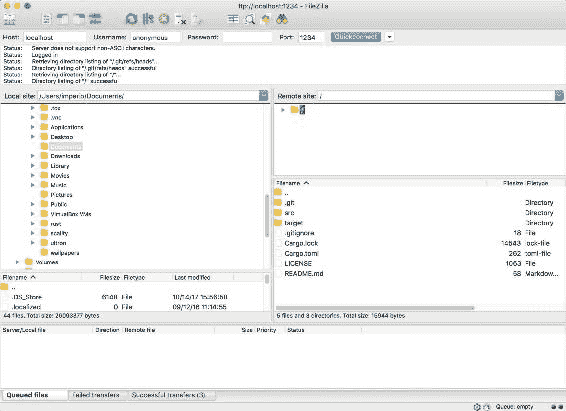

# 第八章：理解 FTP

本章全部关于 Rust 中的异步编程。为了向您展示它是如何工作的，我们将编写一个 FTP 服务器。然而，为了尽可能让您容易理解，我们将把主题分解为以下几个部分：

+   展示 FTP 协议

+   实现 FTP 服务器

+   在 Rust 中展示异步编程

+   异步实现 FTP 服务器

这些步骤都非常重要，以便让您在 Rust 异步编程中感到自信。

现在，让我们先简单谈谈 FTP 协议！

# 文件传输协议

**文件传输协议**（FTP）于 1971 年创建。其最终 RFC 为 959。如果你对此感兴趣，可以在 [`tools.ietf.org/html/rfc959`](https://tools.ietf.org/html/rfc959) 上了解更多信息。

作为一种旧协议，一些命令没有明确的规范，因此已经编写了一些替代规范（或多或少是官方的），以填补这些空白。在编写服务器时，我们会回到它们。

另一个需要注意的重要点是，FTP 使用 TCP 连接。

现在我们已经快速介绍了 FTP，让我们看看它是如何工作的。

# FTP 简介

客户端连接到服务器并向服务器发送命令。每个命令都会收到来自服务器的成功或失败回答。

例如，客户端会向服务器发送 `PWD` 命令：

```rs
=> PWD\r\n
<= 257 "/"\r\n
```

在这里，服务器回答了 `257`（字面上意味着 *路径名已创建*），然后给出了客户端当前所在的当前工作目录（在这种情况下是 `"/"`）。

如您所见，每个命令都以 `""` 结尾。这是 FTP 的另一个标准——每个命令都必须以 `""` 结尾。如果您不知道，`""` 代表回车符，`""` 代表换行符。

另一件事需要注意——服务器的回答 *总是* 在 `""` 前包含一个字符串。考虑以下示例：

```rs
=> NOOP\r\n
<= 250 Doing nothing\r\n
```

如果客户端的命令不需要精确的输出（除了返回代码），那就完全取决于服务器。通常只是一个简短的句子，提供更多关于服务器所做（或失败）的信息。在另一个服务器上，`NOOP` 命令可能会给出以下内容：

```rs
=> NOOP\r\n
<= 250 42 is life\r\n
```

最后，FTP 使用两个通道：

+   第一个通道用于发送小命令，例如更新状态

+   第二个通道用于发送大量数据，例如文件传输或列出目录

关于第二个通道的一个有趣之处在于，它取决于客户端决定是服务器连接到客户端还是反过来。但在几乎所有情况下，客户端都会要求服务器再次连接到它，服务器选择一个端口，然后就可以开始了。

现在我们可以说，我们已经完成了对 FTP 的快速介绍。如果到现在为止仍然不太清楚，无需担心：随着我们逐步实现服务器，它将变得更加明显。

因此，让我们从同步服务器实现开始。

# 实现简单的命令块

让我们先从创建一个非常简单的服务器开始，这个服务器向新客户端发送 `"hello"` 然后关闭连接：

```rs
use std::net::TcpListener;
use std::io::Write;

fn main() {
    let listener = TcpListener::bind("0.0.0.0:1234").expect("Couldn't bind this 
    address...");

    println!("Waiting for clients to connect...");
    for stream in listener.incoming() {
        Ok(stream) => {
            println!("New client!);
            if let Err(_) = stream.write(b"hello") {
                println!("Failed to send hello... :'(");
            }
        }
        _ => {
            println!("A client tried to connect...")
        }
    }
}
```

很简单，对吧？像往常一样，让我们解释一下代码的功能：

```rs
let listener = TcpListener::bind("0.0.0.0:1234").expect("Couldn't bind this address...");
```

对于那些不太了解网络的人来说，前面的代码行对于任何服务器来说都是最重要的。

它试图只为你的服务器“预订”端口。如果其他软件正在使用它，那么 `bind` 调用将失败。给定的字符串表示我们想要“预订”的地址和端口。参数的作用如下：`[IP]:[PORT]`。在这里，我们输入了 `0.0.0.0:1234`，这意味着我们想要在地址 `0.0.0.0` 上使用端口 `1234`。

允许服务器选择要使用的 IP 地址听起来可能很奇怪，但实际上并非如此。你只能在这两个选项之间选择：`localhost`（别名 `127.0.0.1`）和 `0.0.0.0`。这两个地址之间的唯一区别是，`0.0.0.0` 允许其他计算机连接到你的计算机（如果端口可以通过你的互联网接入提供商提供的盒子从外部访问），而 `127.0.0.1` 只能从启动它的计算机访问。但是，关于网络的解释就到这里吧——这不是这本书的重点，所以让我们继续前进！

需要解释的另外一段代码如下：

```rs
for stream in listener.incoming() {
```

`incoming` 方法调用允许我们通过返回一个迭代器无限迭代新接收到的连接。然后，`for` 循环只是调用迭代器的 `next` 方法。

这个简短代码示例就到这里。现在，是时候改进所有这些了！

很好，我们想要分别处理每个客户端，而不是在收到新连接后立即关闭连接，不是吗？所以，我们只需更新一下之前的代码即可：

```rs
use std::net::{TcpListener, TcpStream};
use std::thread;

fn handle_client(mut stream: TcpStream) {
    println!("new client connected!");
    // put client code handling here
}

fn main() {
    let listener = TcpListener::bind("0.0.0.0:1234").expect("Couldn't bind this 
    address...");

    println!("Waiting for clients to connect...");
    for stream in listener.incoming() {
        Ok(stream) => {
            thread::spawn(move || {
                handle_client(stream);
            });
        }
        _ => {
            println!("A client tried to connect...")
        }
    }
}
```

每当新客户端连接到服务器时，我们会创建一个新的线程并将客户端的套接字发送给它。这样，我们现在可以单独处理每个客户端。

现在我们能够连接新客户端了，是时候真正开始实现服务器中的 FTP 部分。

# 从基础知识开始

当然，由于我们需要在套接字上进行读写操作，如果在每个函数中都要重复这样做，那就不会很高效。因此，我们将首先实现执行这些操作的函数。目前，我们不会优雅地处理错误（是的，`unwrap` 是邪恶的）。

让我们从 `write` 函数开始：

```rs
use use std::net::TcpStream;
use std::io::Write;

fn send_cmd(stream: &mut TcpStream, code: ResultCode, message: &str) {
    let msg = if message.is_empty() { CommandNotImplemented = 502,
        format!("{}\r\n", code as u32)
    } else {
        format!("{} {}\r\n", code as u32, message)
    };
    println!("<==== {}", msg);
    write!(stream, "{}", msg).unwrap()
}
```

好吧，这里没有什么花哨的，也没有什么难以理解的。然而，看看这个：

+   在 FTP 中，每条消息都以 `""` 结尾

+   如果你想添加参数或信息，每条消息后面都必须跟一个空格。

当客户端发送命令给我们时，这也以完全相同的方式工作。

什么？我忘记提供 `ResultCode` 类型了吗？确实如此。这里就是：

```rs
#[derive(Debug, Clone, Copy)]
#[repr(u32)]
#[allow(dead_code)]
enum ResultCode {
    RestartMarkerReply = 110,
    ServiceReadInXXXMinutes = 120,
    DataConnectionAlreadyOpen = 125,
    FileStatusOk = 150,
    Ok = 200,
    CommandNotImplementedSuperfluousAtThisSite = 202,
    SystemStatus = 211,
    DirectoryStatus = 212,
    FileStatus = 213,
    HelpMessage = 214,
    SystemType = 215,
    ServiceReadyForNewUser = 220,
    ServiceClosingControlConnection = 221,
    DataConnectionOpen = 225,
    ClosingDataConnection = 226,
    EnteringPassiveMode = 227,
    UserLoggedIn = 230,
    RequestedFileActionOkay = 250,
    PATHNAMECreated = 257,
    UserNameOkayNeedPassword = 331,
    NeedAccountForLogin = 332,
    RequestedFileActionPendingFurtherInformation = 350,
    ServiceNotAvailable = 421,
    CantOpenDataConnection = 425,
    ConnectionClosed = 426,
    FileBusy = 450,
    LocalErrorInProcessing = 451,
    InsufficientStorageSpace = 452,
    UnknownCommand = 500,
    InvalidParameterOrArgument = 501,
    CommandNotImplemented = 502,
    BadSequenceOfCommands = 503,
    CommandNotImplementedForThatParameter = 504,
    NotLoggedIn = 530,
    NeedAccountForStoringFiles = 532,
    FileNotFound = 550,
    PageTypeUnknown = 551,
    ExceededStorageAllocation = 552,
    FileNameNotAllowed = 553,
}
```

嗯，不是非常美观... 这正是所有 FTP 代码类型（错误、信息、警告等）的确切表示。在这里我们无法做得更好；我们必须重写所有代码，以便在接收到它时能够理解，并且能够给出与客户端命令相对应的正确代码。

现在，我想，你可以猜到接下来会发生什么。当然，是 `enum Command`！这次，我们在前进到命令实现的过程中来完成它：

```rs
use std::io;
use std::str;

#[derive(Clone, Copy, Debug)]
enum Command {
    Auth,
    Unknown(String),
}

impl AsRef<str> for Command {
    fn as_ref(&self) -> &str {
        match *self {
            Command::Auth => "AUTH",
            Command::Unknown(_) => "UNKN",
        }
    }
}

impl Command {
    pub fn new(input: Vec<u8>) -> io::Result<Self> {
        let mut iter = input.split(|&byte| byte == b' ');
        let mut command = iter.next().expect("command in 
         input").to_vec();
        to_uppercase(&mut command);
        let data = iter.next();
        let command =
            match command.as_slice() {
             b"AUTH" => Command::Auth,
             s => Command::Unknown(str::from_utf8(s).unwrap_or("").to_owned()),
            };
        Ok(command)
    }
}
```

好的，让我们通过这段代码：

```rs
enum Command {
    Auth,
    Unknown(String),
}
```

每次我们添加一个新的命令处理，我们都需要在这个 `enum` 中添加一个新的变体。如果命令不存在（或者我们还没有实现它），将返回带有命令名称的 `Unknown`。如果命令接受参数，它将被添加，就像我们为 `Unknown` 所见的那样。以 `Cwd` 为例：

```rs
enum Command {
    Auth,
    Cwd(PathBuf),
    Unknown(String),
}
```

如你所见，`Cwd` 包含一个 `PathBuf`。`Cwd` 代表 **更改工作目录**，并接受客户端想要进入的目录路径。

当然，你需要通过在 `match` 块中添加以下行来更新 `as_ref`：

```rs
Command::Cwd(_) => "CWD",
```

你还需要通过在 `match` 块中添加以下行来更新 `new` 方法的实现：

```rs
b"CWD" => Command::Cwd(data.map(|bytes| Path::new(str::from_utf8(bytes).unwrap()).to_path_buf()).unwrap()),
```

现在我们来解释 `AsRef` 特性的实现。当你想编写一个泛型函数时，这非常方便。看看下面的例子：

```rs
fn foo<S: AsRef<str>>(f: S) {
    println!("{}", f.as_ref());
}
```

多亏了这个特性，只要类型实现了它，我们就可以调用 `as_ref`。在我们的情况下，当向客户端发送消息时，这非常有用，因为我们只需取一个实现了 `AsRef` 的类型。

现在让我们来谈谈 `Command` 类型的 `new` 方法：

```rs
pub fn new(input: Vec<u8>) -> io::Result<Self> {
    let mut iter = input.split(|&byte| byte == b' ');
    let mut command = iter.next().expect("command in input").to_vec();
    to_uppercase(&mut command);
    let data = iter.next();
    let command =
        match command.as_slice() {
         b"AUTH" => Command::Auth,
         s => Command::Unknown(str::from_utf8(s).unwrap_or("").to_owned()),
        };
    Ok(command)
}
```

这里的目的是将客户端接收到的消息进行转换。我们需要做两件事：

+   获取命令

+   获取命令的参数（如果有）

首先，我们创建一个迭代器来分割我们的向量，这样我们就可以将命令与参数分开：

```rs
let mut iter = input.split(|&byte| byte == b' ');
```

然后，我们获取命令：

```rs
let mut command = iter.next().expect("command in input").to_vec();
```

在这个阶段，`command` 是一个 `Vec<u8>`。为了使匹配更简单（因为 FTP 的 RFC 中没有提到命令应该大写，也没有提到 `auth` 与 `AUTH` 或 `AuTh` 相同），我们调用 `uppercase` 函数，其代码如下：

```rs
fn to_uppercase(data: &mut [u8]) {
    for byte in data {
        if *byte >= 'a' as u8 && *byte <= 'z' as u8 {
            *byte -= 32;
        }
    }
}
```

接下来，我们通过在迭代器 `iter` 上调用 `next` 来获取参数：

```rs
let data = iter.next();
```

如果没有参数，没问题！我们只需获取 `None`。

最后，我们匹配命令：

```rs
match command.as_slice() {
    b"AUTH" => Command::Auth,
    s => Command::Unknown(str::from_utf8(s).unwrap_or("").to_owned()),
}
```

要做到这一点，我们将我们的 `Vec<u8>` 转换为 `&[u8]`（一个 `u8` 的切片）。为了将 `&str`（如 `AUTH`）也转换为 `&[u8]`，我们使用 `b` 操作符（这更像是告诉编译器，“嘿！别担心，就把它说成是一个切片，而不是 `&str`！”）以允许匹配。

好的！我们现在可以编写从客户端实际读取数据的函数了：

```rs
fn read_all_message(stream: &mut TcpStream) -> Vec<u8> {
    let buf = &mut [0; 1];
    let mut out = Vec::with_capacity(100);

    loop {
        match stream.read(buf) {
            Ok(received) if received > 0 => {
                if out.is_empty() && buf[0] == b' ' {
                    continue
                }
                out.push(buf[0]);
            }
            _ => return Vec::new(),
        }
        let len = out.len();
        if len > 1 && out[len - 2] == b'\r' && out[len - 1] == 
         b'\n' {
            out.pop();
            out.pop();
            return out;
        }
    }
}
```

在这里，我们一次读取一个字节（这不是一个非常有效的方法；我们稍后会回到这个函数上）并在我们得到 `""` 时返回。我们通过删除任何可能出现在命令之前的空白字符增加了一点点 *安全性*（只要我们的向量中没有数据，我们就不会添加任何空白字符）。

如果有任何错误，我们返回一个空向量并停止读取客户端输入。

就像我之前说的那样，逐字节读取并不高效，但更容易展示它是如何工作的。所以，现在，让我们坚持这个。一旦异步编程开始，这将被完全不同地完成。

现在，既然我们可以读取和写入 FTP 输入，是时候真正开始实现命令了！

让我们先创建一个新的结构：

```rs
#[allow(dead_code)]
struct Client {
    cwd: PathBuf,
    stream: TcpStream,
    name: Option<String>,
}
```

下面是对前面代码的一些简要说明：

+   `cwd` 代表当前工作目录

+   `stream` 是客户端的套接字

+   `name` 是从用户认证中获得的用户名（实际上这并不重要，因为我们不会在第一步处理认证）

现在是时候更新 `handle_client` 函数了：

```rs
fn handle_client(mut stream: TcpStream) {
    println!("new client connected!");
    send_cmd(&mut stream, ResultCode::ServiceReadyForNewUser, "Welcome to this FTP 
    server!");
    let client = Client::new(stream);
    loop {
        let data = read_all_message(&mut client.stream);
        if data.is_empty() {
            println!("client disconnected...");
            break;
        }
        client.handle_cmd(command::new(data));
    }
}
```

当一个新客户端连接到服务器时，我们向他们发送一条消息，告知服务器已准备好。然后我们创建一个新的 `Client` 实例，监听客户端套接字，并处理其命令。简单，对吧？

这段代码还缺少两个东西：

+   `Client::new` 方法

+   `Client::handle_cmd` 方法

让我们从第一个开始：

```rs
impl Client {
    fn new(stream: TcpStream) -> Client {
        Client {
            cwd: PathBuf::from("/"),
            stream: stream,
            name: None,
        }
    }
}
```

这里没有什么特别的地方；当前路径是 `"/"`（它对应于服务器的根目录，而不是文件系统的根目录！）我们设置了客户端的流，而名称尚未定义。

现在让我们看看 `Client::handle_cmd` 方法（不用说，这将是这个 FTP 服务器的核心）：

```rs
fn handle_cmd(&mut self, cmd: Command) {
    println!("====> {:?}", cmd);
    match cmd {
        Command::Auth => send_cmd(&mut self.stream, 
        ResultCode::CommandNotImplemented,
                                  "Not implemented"),
        Command::Unknown(s) => send_cmd(&mut self.stream, 
         ResultCode::UnknownCommand,
                                        "Not implemented"),
    }
}
```

就这样！好吧，这还不是真正的 *it*。我们还有很多要添加。但我的观点是，我们现在只需要在这里添加其他命令，让一切都能正常工作。

# 命令实现

在之前的代码中，我们只处理了一个命令；任何其他命令都会从服务器收到一个 `unknown command` 的回答。此外，我们的 `Auth` 实现表示它尚未实现。所以，总结一下，我们处理了一个回答它尚未实现的命令。疯狂，对吧？对于 `Auth` 命令，我们稍后会看看。

现在，让我们真正实现一些命令。让我们从一个简单的命令开始：`Syst`。这个命令本应返回这个 FTP 服务器正在运行的系统。出于某种原因，我们不会回答这个问题，我们只会发送一个没有用处的回答。

# 实现 SYST 命令

首先，让我们在 `Command` 枚举中添加一个新的条目（我不会每次都这样做，但步骤将是相同的）：

```rs
enum Command {
    Auth,
    Syst,
    Unknown(String),
}
```

然后，让我们更新 `as_ref` 实现：

```rs
impl AsRef<str> for Command {
    fn as_ref(&self) -> &str {
        match *self {
            Command::Auth => "AUTH",
            Command::Syst => "SYST",
            Command::Unknown(_) => "UNKN",
        }
    }
}
```

最后，让我们更新 `Command::new` 方法：

```rs
impl Command {
    pub fn new(input: Vec<u8>) -> io::Result<Self> {
        let mut iter = input.split(|&byte| byte == b' ');
        let mut command = iter.next().expect("command in 
         input").to_vec();
        to_uppercase(&mut command);
        let data = iter.next();
        let command =
            match command.as_slice() {
                b"AUTH" => Command::Auth,
                b"SYST" => Command::Syst,
                s => 
                Command::Unknown(str::from_utf8(s).unwrap_or("").to_owned()),
            };
        Ok(command)
    }
}
```

就这样！就像我之前说的那样，每次添加新命令时，只要记住这三个步骤，一切应该都会顺利。

现在，让我们实现这个命令：

```rs
fn handle_cmd(&mut self, cmd: Command) {
    println!("====> {:?}", cmd);
    match cmd {
        Command::Auth => send_cmd(&mut self.stream, 
        ResultCode::CommandNotImplemented,
                                  "Not implemented"),
        Command::Syst => send_cmd(&mut self.stream, ResultCode::Ok, "I won't tell"),
        Command::Unknown(s) => send_cmd(&mut self.stream, 
        ResultCode::UnknownCommand,
                                        "Not implemented"),
    }
}
```

就这样！我们实现了一个新的命令（它并不做什么，但这不是重点）！

# 实现 USER 命令

由于我们在`Client`结构中有`name`，那么让它有点用会很好，对吧？所以，正如标题所说，让我们实现`USER`命令。因为这个命令接受一个参数，所以我将再次通过命令实现步骤，这样你就有了一个接受参数的命令的例子。

首先，让我们更新`enum Command`：

```rs
enum Command {
    Auth,
    Syst,
    User(String),
    Unknown(String),
}
```

然后，我们更新`as_ref`实现：

```rs
impl AsRef<str> for Command {
    fn as_ref(&self) -> &str {
        match *self {
            Command::Auth => "AUTH",
            Command::Syst => "SYST",
            Command::User => "USER",
            Command::Unknown(_) => "UNKN",
        }
    }
}
```

最后，我们更新`Command::new`方法：

```rs
impl Command {
    pub fn new(input: Vec<u8>) -> io::Result<Self> {
        let mut iter = input.split(|&byte| byte == b' ');
        let mut command = iter.next().expect("command in input").to_vec();
        to_uppercase(&mut command);
        let data = iter.next();
        let command =
            match command.as_slice() {
                b"AUTH" => Command::Auth,
                b"SYST" => Command::Syst,
                b"USER" => Command::User(data.map(|bytes| 
                String::from_utf8(bytes.to_vec()).expect("cannot
                 convert bytes to String")).unwrap_or_default()),
                s => Command::Unknown(str::from_utf8(s).unwrap_or("").to_owned()),
            };
        Ok(command)
    }
}
```

呼呼，一切都完成了！现在我们只需要实现这个函数（我保证它很简单）：

```rs
fn handle_cmd(&mut self, cmd: Command) {
    println!("====> {:?}", cmd);
    match cmd {
        Command::Auth => send_cmd(&mut self.stream, 
         ResultCode::CommandNotImplemented,
                                  "Not implemented"),
        Command::Syst => send_cmd(&mut self.stream, ResultCode::Ok, 
        "I won't tell"),
        Command::User(username) => {
            if username.is_empty() {
                send_cmd(&mut self.stream, ResultCode::InvalidParameterOrArgument,
                         "Invalid username")
            } else {
                self.name = username.to_owned();
                send_cmd(&mut self.stream, ResultCode::UserLoggedIn,
                         &format!("Welcome {}!", username)),
            }
        }
        Command::Unknown(s) => send_cmd(&mut self.stream,  
        ResultCode::UnknownCommand,
                                        "Not implemented"),
    }
}
```

这里有一个简单的解释，以防你需要；如果我们收到一个空的用户名（或者完全没有用户名），我们将其视为无效参数并返回`InvalidParameterOrArgument`。否则，一切正常，我们返回`UserLoggedIn`。

如果你想知道为什么我们没有返回`ResultCode::Ok`，那是因为 RFC 是这样规定的。再次强调，每个命令、它做什么以及它应该返回什么都在那里描述。如果你感到困惑，不要犹豫，再读一遍！

# 实现 NOOP 命令

这个主题相当简单。`NOOP`代表无操作。它不接受任何参数也不做任何事情。因为我是个好人，所以这里提供了`Client::handle_cmd`方法中`NOOP`命令的代码：

```rs
Command::NoOp => send_cmd(&mut self.stream, ResultCode::Ok, "Doing nothing..."),
```

是的，我知道，你被这样的代码惊呆了。但别担心，当你长大的时候，你也能写出这样好的代码！

现在是时候实现下一个命令了！

# 实现 PWD 命令

这个命令也很简单。`PWD`代表打印工作目录。再一次，它不是来自你的系统，而是来自你的服务器（所以，`"/"`对应于你启动服务器时的文件夹）。

这个命令不接受任何参数，所以没有必要再次展示所有内容。让我们只关注命令处理：

```rs
Command::Pwd => {
    let msg = format!("{}", self.cwd.to_str().unwrap_or(""));
    if !msg.is_empty() {
        let message = format!("\"/{}\" ", msg);
        send_cmd(&mut self.stream, ResultCode::PATHNAMECreated,
         &format!("\"/{}\" ", 
         msg))
    } else {
        send_cmd(&mut self.stream, ResultCode::FileNotFound, "No 
         such file or directory")
    }
}
```

没有什么复杂的；我们尝试显示路径，如果失败，我们返回一个错误。唯一奇怪的是，如果一切顺利，我们必须返回`PATHNAMECreated`。这个 RFC 真的很奇怪...

对不起，这是最后一个*简单*的命令。现在我们将更深入地探讨 FTP 及其奇怪的 RFC。接下来的命令是对接下来要发生的事情的一个很好的介绍。（我希望我没有吓到你！）

# 实现 TYPE 命令

目前，我们将实现一个不做什么的`TYPE`命令。我们将在接下来的章节中回到它。然而，一些解释可能会很有用，我想。

`TYPE`代表表示类型。当你通过数据连接（与命令连接不同，我们直到现在只使用命令连接）传输数据时，你可以以不同的方式传输数据。

默认情况下，传输类型是 ASCII（主要区别在于所有的`""`都必须转换为`""`）。我们将使用图像类型（其中你发送数据就像你拥有它一样）来简化我们的工作。

再次，我们将在后面的章节中回到这个实现。

现在，让我们只添加一个不接受任何参数的`Type`命令：

```rs
Command::Type => send_cmd(&mut self.stream, ResultCode::Ok, "Transfer type changed successfully"),
```

好吧，我们有点撒谎，但我们现在不得不处理它。

我们几乎完成了基础知识，但在你能够尝试使用 FTP 客户端访问服务器之前，还有一个命令需要实现。

# 实现 LIST 命令

`LIST` 命令返回当前文件夹或给定参数路径下的当前文件和文件夹列表。这本身就已经非常困难，因为你需要检查用户是否有权访问*最终*路径（例如，如果你在`"/"`时收到`foo/../../`，那么会有问题）。但这还不是全部！当你传输文件和文件夹列表时，没有官方的方式来格式化它！有趣，对吧？幸运的是，大多数 FTP 客户端都会遵循某种非官方的 RFC 来处理这种情况，我们将使用它。

除了所有这些之外，这个命令是我们将实现的第一条使用数据连接的命令。这需要你添加另一个命令：`PASV`。

# 实现 PASV 命令

为了使这个命令能够工作，我们需要在我们的`Client`结构体中添加一些新的字段：

```rs
struct Client {
    cwd: PathBuf,
    stream: TcpStream,
    name: Option<String>,
    data_writer: Option<TcpStream>,
}
```

我们现在需要更新`Client::new`方法：

```rs
fn new(stream: TcpStream) -> Client {
    Client {
        cwd: PathBuf::from("/"),
        stream: stream,
        name: None,
        data_writer: None,
    }
}
```

`PASV`命令不接受任何参数，所以我会让你把它添加到结构和所有内容中。让我们关注有趣的部分：

```rs
// Adding some new imports:
use std::net::{IpAddr, Ipv4Addr, SocketAddr};

Command::Pasv => {
    if self.data_writer.is_some() {
        send_cmd(&mut self.stream, ResultCode::DataConnectionAlreadyOpen, "Already 
        listening...")
    } else {
        let port = 43210;
        send_cmd(&mut self.stream, ResultCode::EnteringPassiveMode,
           &format!("127,0,0,1,{},{}", port >> 8, port & 0xFF));
        let addr = SocketAddr::new(IpAddr::V4(Ipv4Addr::new(127, 0,
         0, 1)), port);
        let listener = TcpListener::bind(&addr).unwrap();
        match listener.incoming().next() {
            Some(Ok(client)) => {
                self.data_writer = Some(client);
            }
            _ => {
                send_cmd(&mut self.stream, ResultCode::ServiceNotAvailable, "issues  
                happen...");
            }
        }
    }
}
```

呼……让我们解释一下这一切：

```rs
if self.data_writer.is_some() {
    send_cmd(&mut self.stream, ResultCode::DataConnectionAlreadyOpen, "Already listening...")
}
```

如果我们与这个客户端已经有了数据连接，就没有必要打开一个新的，所以我们不做任何事情：

```rs
let port: u16 = 43210;
send_cmd(&mut self.stream, ResultCode::EnteringPassiveMode,
         &format!("127,0,0,1,{},{}", port >> 8, port & 0xFF));
```

这部分有点棘手。首先，我们选择一个端口（最好的方式是先检查端口是否可用；我们将在后面的章节中这样做）。然后，我们必须告诉客户端*它应该连接到哪*。

这里事情变得有点复杂。我们必须按照以下方式传输地址：

```rs
ip1,ip2,ip3,ip4,port1,port2
```

每个`ip`部分都必须是 8 位长（所以是 1 字节长），而每个`port`部分都必须是 16 位长（所以是 2 字节）。第一部分很简单；我们只需要打印 localhost。然而，第二部分需要你执行一些二进制操作。

只获取第一个字节很简单；我们只需要将 8 位向右移动。总结一下，看看这个：

```rs
1010 1010 1111 1111
```

这是我们的`u16`。我们现在将 8 位向右移动：

```rs
0000 0000 1010 1010
```

哇！

对于第二部分，我们可以将 8 位向左移动然后向右移动 8 位，或者我们可以直接使用`and`二进制运算符。这里有一个小方案来解释这一点：

```rs
1 & 1 == 1
1 & 0 == 0
```

现在，让我们使用一个漂亮的二进制到十六进制的转换器来检查结果：

```rs
0000 0000 1111 1111 == 0xFF
```

现在我们执行这个操作，会得到以下结果：

```rs
1111 1111 1010 1010 & 0xFF
=>
0000 0000 1010 1010
```

现在，我们只有最后 8 位。太好了！命令处理的最后一部分非常简单：

```rs
let addr = SocketAddr::new(IpAddr::V4(Ipv4Addr::new(127, 0, 0, 1)), port);
let listener = TcpListener::bind(&addr).unwrap();
match listener.incoming().next() {
    Some(Ok(client)) => {
        self.data_writer = Some(client);
    }
    _ => {
        send_cmd(&mut self.stream, ResultCode::ServiceNotAvailable, "issues 
        happen...");
    }
}
```

我们绑定地址和端口，等待客户端连接，然后将它分配给我们的数据写入器。这里没有问题。

# 回到`LIST`命令

现在我们能够处理数据连接了，让我们来实现`LIST`命令！目前，我们先不添加参数来实现它（就像之前一样，我们将在后面的章节中看到如何处理`LIST`参数）。像往常一样，我会让你在需要的地方添加所有内容，我们只关注命令处理：

```rs
Command::List => {
    if let Some(ref mut data_writer) = self.data_writer {
        let mut tmp = PathBuf::from(".");
        send_cmd(&mut self.stream, ResultCode::DataConnectionAlreadyOpen,
                 "Starting to list directory...");
        let mut out = String::new();
        for entry in read_dir(tmp).unwrap() {
            for entry in dir {
                if let Ok(entry) = entry {
                    add_file_info(entry.path(), &mut out);
                }
            }
            send_data(data_writer, &out)
        }
    } else {
        send_cmd(&mut self.stream, ResultCode::ConnectionClosed, 
         "No opened data connection");
    }
    if self.data_writer.is_some() {
        self.data_writer = None;
        send_cmd(&mut self.stream, ResultCode::ClosingDataConnection, "Transfer 
        done");
    }
}
```

这里也没有什么复杂的。一旦传输完成，我们就关闭客户端套接字并继续。需要添加的是`send_data`和`add_file_info`函数。让我们从第一个开始：

```rs
fn send_data(stream: &mut TcpStream, s: &str) {
    write!(stream, "{}", s).unwrap();
}
```

很简单，没有错误处理，所以它只占一行。现在让我们看看`add_file_info`函数：

```rs
fn add_file_info(path: PathBuf, out: &mut String) {
    let extra = if path.is_dir() { "/" } else { "" };
    let is_dir = if path.is_dir() { "d" } else { "-" };

    let meta = match ::std::fs::metadata(&path) {
        Ok(meta) => meta,
        _ => return,
    };
    let (time, file_size) = get_file_info(&meta);
    let path = match path.to_str() {
        Some(path) => match path.split("/").last() {
            Some(path) => path,
            _ => return,
        },
        _ => return,
    };
    let rights = if meta.permissions().readonly() {
        "r--r--r--"
    } else {
        "rw-rw-rw-"
    };
    let file_str = format!("{is_dir}{rights} {links} {owner} {group} {size} {month} 
    {day} {hour}:{min} {path}{extra}\r\n",
                           is_dir=is_dir,
                           rights=rights,
                           links=1, // number of links
                           owner="anonymous", // owner name
                           group="anonymous", // group name
                           size=file_size,
                           month=MONTHS[time.tm_mon as usize],
                           day=time.tm_mday,
                           hour=time.tm_hour,
                           min=time.tm_min,
                           path=path,
                           extra=extra);
    out.push_str(&file_str);
    println!("==> {:?}", &file_str);
}
```

要使这段代码工作，你还需要以下内容：

```rs
#[macro_use]
extern crate cfg_if;

cfg_if! {
    if #[cfg(windows)] {
        fn get_file_info(meta: &Metadata) -> (time::Tm, u64) {
            use std::os::windows::prelude::*;
            (time::at(time::Timespec::new(meta.last_write_time())), 
             meta.file_size())
        }
    } else {
        fn get_file_info(meta: &Metadata) -> (time::Tm, u64) {
            use std::os::unix::prelude::*;
            (time::at(time::Timespec::new(meta.mtime(), 0)),
             meta.size())
        }
    }
}
```

不要忘记在你的`Cargo.toml`中添加`cfg_if`：

```rs
cfg-if = "0.1.2"
```

`cfg-if`非常擅长以更易于阅读的方式帮助你进行条件编译。现在要注意关于`get_file_info`函数的一个点——这是在所有系统上都不能以相同方式执行的一件稀少的事情。

这里，Windows 有自己的版本，Unix 有另一个。然而，这两个函数接受相同的参数（导入），一个函数调用就改变了。现在让我们回到`add_file_info`函数：

我想你已经认出了`ls`命令的输出，对吧？显然，非官方的 RFC 是这样工作的：

```rs
dr--r--r-- 1 me me 1024 Jan 7 12:42 foo/
-rw-rw-rw- 1 me me 4 Mar 3 23:42 some_file
```

首先，如果是目录则用`d`表示，如果不是则用`-`表示。然后是权限（就像在 Unix 平台上一样）：

```rs
[rwx][rwx][rwx]
```

第一个`rwx`是关于所有者的，第二个是关于组的，最后一个是关于所有人的。在这里，`r`代表读取权限，`w`代表写入权限，`x`代表执行权限。

其余的部分似乎已经很明确了，所以没有必要解释它。

# 实现`CWD`命令

`CWD`命令允许用户更改其当前文件夹位置。然而，这并不容易做到。

在进入这个命令的实现之前，我们需要讨论一个潜在的安全问题：路径。

想象一下用户在`"/"`位置（这相当于，比如说，`/home/someone/somewhere`）并请求`foo/../../`。如果我们只是接受路径并将用户移动到这个位置，它将结束在`/home/someone`。这意味着用户可以无障碍地访问你的电脑的所有内容。你现在看到问题了吗？

幸运的是，`Rust`在`Path`上有一个很好的方法，允许我们修复这个巨大的安全问题。我说的就是`Path::canonicalize`（它是`fs::canonicalize`函数的别名）。

那么，这个函数做什么呢？让我们举一个例子：

```rs
let path = Path::new("/foo/test/../bar.rs");
assert_eq!(path.canonicalize().unwrap(), PathBuf::from("/foo/bar.rs"));
```

如你所见，它解释了路径，规范化了一切（`..`移除了文件夹组件），并且还解析了符号链接。相当神奇，对吧？

当然，所有美好的事物都有其缺点，`canonicalize`也不例外：它只能作用于*真实*路径。如果路径的一部分不存在，函数将直接失败。当你了解这一点时，处理起来很简单，但一开始可能会感到惊讶。

那么，我们如何解决这个问题呢？嗯，我们需要处理一个真实路径。所以首先，我们需要将用户的服务器路径追加到真实服务器路径（它在计算机上的那个路径）。一旦完成，我们只需追加用户请求的路径并调用`canonicalize`。

这并不复杂，但一开始操作起来有点烦人。不过，别担心，代码马上就来！

如果你想知道为什么我们不直接使用`chroot`函数（这将解决所有问题），请记住，这个 FTP 服务器应该在每个平台上都能工作。

所以首先，让我们向`enum Command`添加一个新的命令条目：

```rs
Cwd(PathBuf),
```

好的，现在让我们将其添加到`Command::new`方法的匹配中：

```rs
b"CWD" => Command::Cwd(data.map(|bytes| Path::new(str::from_utf8(bytes).unwrap()).to_path_buf()).unwrap()),
```

完美！我将让你也把它添加到`AsRef`实现中。现在是我们进入*真正*实现的时候了：

```rs
Command::Cwd(directory) => self.cwd(directory),
```

一次，为了使我们的工作更简单，我们将在我们的`Client`中创建一个新的方法，这样`CWD`命令的所有代码就不会填充`enum`：

```rs
fn complete_path(&self, path: PathBuf, server_root: &PathBuf) -> Result<PathBuf, io::Error> {
    let directory = server_root.join(if path.has_root() {
        path.iter().skip(1).collect()
    } else {
        path
    });
    let dir = directory.canonicalize();
    if let Ok(ref dir) = dir {
        if !dir.starts_with(&server_root) {
            return Err(io::ErrorKind::PermissionDenied.into());
        }
    }
    dir
}

fn cwd(mut self, directory: PathBuf) {
    let server_root = env::current_dir().unwrap();
    let path = self.cwd.join(&directory);
    if let Ok(dir) = self.complete_path(path, &server_root) {
        if let Ok(prefix) = dir.strip_prefix(&server_root)
                               .map(|p| p.to_path_buf()) {
            self.cwd = prefix.to_path_buf();
            send_cmd(&mut self.stream, ResultCode::Ok,
                     &format!("Directory changed to \"{}\"", directory.display()));
            return
        }
    }
    send_cmd(&mut self.stream, ResultCode::FileNotFound, "No such file or directory");
}
```

好吧，代码有点多。现在让我们看看执行流程：

```rs
let server_root = env::current_dir().unwrap();
```

目前，你无法设置服务器运行在哪个文件夹；这将在以后更改：

```rs
let path = self.cwd.join(&directory);
```

首先，我们将请求的目录与用户的当前目录连接起来：

```rs
if let Ok(dir) = self.complete_path(path, &server_root) {
```

这里开始变得有趣。整个规范化过程都在这里。

现在让我们将用户路径追加到（真实）服务器路径上：

```rs
let directory = server_root.join(if path.has_root() {
    path.iter().skip(1).collect()
} else {
    path
});
```

所以，如果路径是绝对路径（在 Unix 中以`"/"`开头或在 Windows 中以如`c:`这样的前缀开头），我们需要移除路径的第一个组件，否则我们只需追加它。

我们现在有一个完整且可能存在的路径。让我们将其规范化：

```rs
let dir = directory.canonicalize();
```

现在我们还有一件事要检查——如果路径不以服务器根目录开头，那么这意味着用户试图欺骗我们，试图访问不可访问的文件夹。下面是我们的做法：

```rs
if let Ok(ref dir) = dir {
    if !dir.starts_with(&server_root) {
        return Err(io::ErrorKind::PermissionDenied.into());
    }
}
```

如果`canonicalize`返回了错误，没有必要检查它是否已经是一个错误（因为它已经是一个错误了）。如果它成功了但不是以`server_root`开头，那么我们返回一个错误。

这个函数就到这里。现在，我们将结果返回给调用者，并可以回到`cwd`方法：

```rs
if let Ok(dir) = self.complete_path(path, &server_root) {
    if let Ok(prefix) = dir.strip_prefix(&server_root)
                           .map(|p| p.to_path_buf()) {
        // ...
    }
}
```

一旦我们获得了完整的目录路径并确认它是正确的，我们需要移除`server_root`前缀以从我们的服务器根目录获取路径：

```rs
self.cwd = prefix.to_path_buf();
send_cmd(&mut self.stream, ResultCode::Ok,
         &format!("Directory changed to \"{}\"", directory.display()));
return
```

最后，一旦完成这些，我们只需将路径设置给用户，并发送一条消息表示命令成功（并返回以避免发送失败的消息！）。

如果有任何问题发生，我们发送以下内容：

```rs
send_cmd(&mut self.stream, ResultCode::FileNotFound, "No such file or directory");
```

这个命令就到这里了！你现在知道如何通过检查客户端提供的接收路径来避免安全问题。

# 实现 CDUP 命令

`CDUP`用于进入父目录。与`CWD`命令实现相比，这将是一件轻而易举的事情！`CDUP`命令不需要参数，所以我会让你将它添加到`enums`中。现在，让我们专注于命令实现：

```rs
Command::CdUp => {
    if let Some(path) = self.cwd.parent().map(Path::to_path_buf) {
        self.cwd = path;
    }
    send_cmd(&mut self.stream, ResultCode::Ok, "Done");
}
```

就这样。没有必要检查父文件夹是否存在，因为它确实需要。如果我们已经在根目录，那么就没有必要做任何事情。这不是很棒吗？

# LIST 命令的完整实现

现在我们已经知道如何优雅地处理路径，不完整实现`LIST`命令真是太遗憾了，对吧？

为了完成它，你需要更新`Command::List`变体，以便它能够接受`PathBuf`作为参数。

所以，我们现在有以下代码：

```rs
Command::List => {
    if let Some(ref mut data_writer) = self.data_writer {
        let mut tmp = PathBuf::from(".");
        send_cmd(&mut self.stream, ResultCode::DataConnectionAlreadyOpen,
                 "Starting to list directory...");
        let mut out = String::new();
        for entry in read_dir(tmp).unwrap() {
            for entry in dir {
                if let Ok(entry) = entry {
                    add_file_info(entry.path(), &mut out);
                }
            }
            send_data(data_writer, &out)
        }
    } else {
        send_cmd(&mut self.stream, ResultCode::ConnectionClosed, "No opened data  
         connection");
    }
    if self.data_writer.is_some() {
        self.data_writer = None;
        send_cmd(&mut self.stream, ResultCode::ClosingDataConnection, "Transfer 
         done");
    }
}
```

让我们按照以下方式更新它：

```rs
Command::List(path) => {
    if let Some(ref mut data_writer) = self.data_writer {
        let server_root = env::current_dir().unwrap();
        let path = self.cwd.join(path.unwrap_or_default());
        let directory = PathBuf::from(&path);
        if let Ok(path) = self.complete_path(directory, 
         &server_root) {
            send_cmd(&mut self.stream, 
             ResultCode::DataConnectionAlreadyOpen,
             "Starting to list directory...");
            let mut out = String::new();
            for entry in read_dir(path).unwrap() {
                for entry in dir {
                    if let Ok(entry) = entry {
                        add_file_info(entry.path(), &mut out);
                    }
                }
                send_data(data_writer, &out)
            }
        } else {
            send_cmd(&mut self.stream, ResultCode::InvalidParameterOrArgument,
                     "No such file or directory...");
        }
    } else {
        send_cmd(&mut self.stream, ResultCode::ConnectionClosed, 
        "No opened data connection");
    }
    if self.data_writer.is_some() {
        self.data_writer = None;
        send_cmd(&mut self.stream,
         ResultCode::ClosingDataConnection, "Transfer done");
    }
}
```

简单来说，我们只是添加了以下这一行：

```rs
let path = self.cwd.join(path.unwrap_or_default());
let directory = PathBuf::from(&path);
if let Ok(path) = self.complete_path(directory, &server_root) {
    // ...
} else {
    send_cmd(&mut self.stream, ResultCode::InvalidParameterOrArgument,
             "No such file or directory...");
}
```

多亏了`Client::complete_path`方法，路径操作变得相当简单。那么，如果给定的路径是一个文件会发生什么呢？我们没有检查这种情况，但我们应该检查！让我们替换以下这些行：

```rs
for entry in read_dir(path).unwrap() {
    for entry in dir {
        if let Ok(entry) = entry {
            add_file_info(entry.path(), &mut out);
        }
    }
    send_data(data_writer, &out)
}
```

使用：

```rs
if path.is_dir() {
    for entry in read_dir(path).unwrap() {
        for entry in dir {
            if let Ok(entry) = entry {
                add_file_info(entry.path(), &mut out);
            }
        }
        send_data(data_writer, &out)
    }
} else {
    add_file_info(path, &mut out);
}
```

就这样！幸运的是，我们第一次就做对了，所以*它就是那么简单有效*。

# 实现 MKD 命令

`MKD`代表创建目录（是的，确实就像 Unix 命令一样，但更短）。就像`LIST`和`CWD`一样，它需要一个`PathBuf`作为参数。我会让你像往常一样处理其他添加，并专注于命令实现：

```rs
Command::Mkd(path) => self.mkd(path),
```

就像上次一样，我们将创建一个新的方法：

```rs
use std::fs::create_dir;

fn mkd(&self, path: PathBuf) {
    let server_root = env::current_dir().unwrap();
    let path = self.cwd.join(&path);
    if let Some(parent) = path.parent().map(|p| p.to_path_buf()) {
        if let Ok(mut dir) = self.complete_path(parent,
         &server_root) {
            if dir.is_dir() {
                if let Some(filename) = path.file_name().map(|p| 
                 p.to_os_string()) {
                    dir.push(filename);
                    if create_dir(dir).is_ok() {
                        send_cmd(&mut self.stream,
                         ResultCode::PATHNAMECreated,
                          "Folder successfully created!");
                        return
                    }
                }
            }
        }
    }
    send_cmd(&mut self.stream, ResultCode::FileNotFound,
             "Couldn't create folder");
}
```

再次，在真正尝试创建目录之前，还有一些事情要做。

首先，我们需要检查给定路径的所有元素是否都是文件夹（实际上，只有最后一个元素是，否则`Client::complete_path`方法将失败）。

然后，我们需要再次，通过调用`Client::complete_path`方法来规范化这个路径。最后，我们将文件名推送到接收到的路径。

这里的主要区别是我们没有从`Client::complete_path`返回的路径中去除`server_root`路径。

一旦完成所有这些，我们就可以尝试使用`create_dir`函数来创建文件夹。如果一切顺利，我们就返回`ResultCode::PATHNAMECreated`（而且这一次它确实有道理！）。

如果在任何级别发生错误，我们只需发送路径不正确的信息。

这个命令就到这里了！

# 实现 RMD 命令

现在我们能够创建文件夹了，能够删除它们会更好，对吧？这就是`RMD`（代表*删除目录*）应该做的！

就像`MKD`（和其他命令）一样，`RMD`需要一个`PathBuf`作为参数。再一次，像往常一样，我会让你处理`Command`部分，这样我们就可以专注于命令实现：

```rs
Command::Rmd(path) => self.rmd(path),
```

是的，这又是一个新方法。我想这已经变成了一种习惯？

```rs
use std::fs::remove_dir_all;

fn rmd(&self, path: PathBuf) {
    let server_root = env::current_dir().unwrap();
    if let Ok(path) = self.complete_path(path, &server_root) {
        if remove_dir_all(path).is_ok() {
            send_cmd(&mut self.stream, 
                     ResultCode::RequestedFileActionOkay,
                     "Folder successfully removed!");
            return
        }
    }
    send_cmd(&mut self.stream, ResultCode::FileNotFound, 
      "Couldn't remove folder!");
}
```

就这样！这比`MKD`还要简单，因为我们不需要检查最后一个可能的父文件夹是否是文件夹。一旦我们确认路径是授权的，我们就可以直接删除它。

使用所有这些命令，我认为我们可以这样说，我们有一个非常好的基础来构建一个完整的 FTP 服务器。

# 测试它

现在，您有一个（非常）基本的 FTP 服务器实现。您可以连接到服务器并列出当前文件夹中的文件和文件夹。

使用 `cargo run` 启动它并尝试一下！我建议您使用 `FileZilla`。这是一个优秀的 FTP 客户端。在端口 `1234` 上连接到 `localhost`，并使用 `anonymous` 用户名（或无），你应该已经可以有点乐趣了：

*图 8.1*

文件传输和附加命令的信息将在后续章节中介绍。

# 摘要

在本章中，我们探讨了 FTP 的基础知识。我们现在有一个简单的（同步）服务器实现，你应该对这一切是如何工作的有一个很好的了解。我们还探讨了一个潜在的安全问题以及如何修复它。

以下章节将向您介绍 Rust 中的异步编程。多亏了本章，FTP RFC 方面的学习将会更快，这样我们就可以专注于异步部分。
