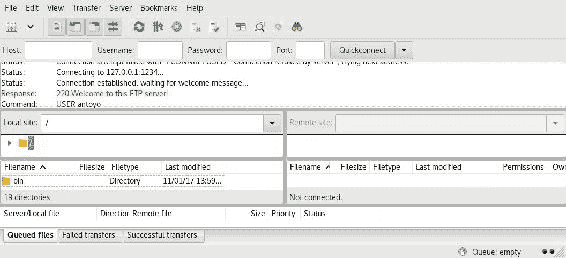
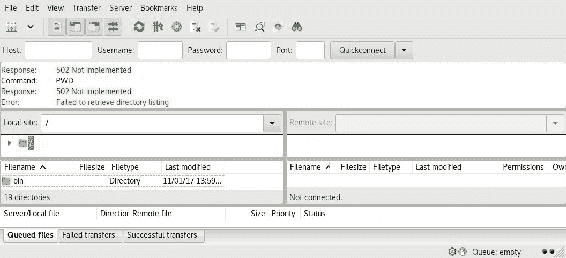
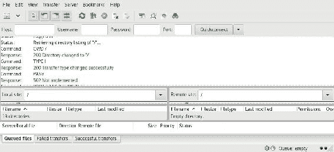

# 实现异步 FTP 服务器

在上一章中，我们编写了一个同步 FTP 服务器。现在，我们将使用`tokio`，Rust 的异步 IO（输入/输出）库，编写一个异步版本。我们将涵盖以下主题：

+   异步服务器

+   未来

+   流

+   Tokio

+   Async/await

+   错误处理

# 异步 IO 的优点

异步 IO 允许我们在不等待其结果的情况下发送请求，我们将在稍后以某种方式收到响应时得到通知。这使得我们的程序更加并发，并且可以更好地扩展。

在上一章中，我们使用了线程来避免在等待响应时阻塞其他客户端。虽然使用线程有成本，除了线程需要更多内存的事实之外，它们还因为代码从一条线程切换到另一条线程时需要上下文切换而带来性能成本。

# 异步 IO 的缺点

然而，使用异步 IO 并非没有缺点。使用异步 IO 比使用同步 IO 更难。在使用异步 IO 的情况下，我们还需要一种方式来知道何时一个事件已经终止。因此，我们需要学习一种新的方式来管理 IO 事件，这将需要更多的时间来实现我们在上一章中编写的相同软件。

# 创建新项目

让我们像往常一样先创建一个新的二进制项目：

```rs
cargo new --bin ftp-server
```

我们将在`Cargo.toml`文件中添加以下依赖项：

```rs
[dependencies]
bytes = "⁰.4.5"
tokio-core = "⁰.1.10"
tokio-io = "⁰.1.3"

[dependencies.futures-await]
git = "https://github.com/alexcrichton/futures-await"
```

如您所见，我们通过 Git URL 指定了一个依赖项。这个依赖项使用仅限 nightly 的功能，所以请确保您正在使用 nightly 编译器，通过运行此命令来确保：

```rs
rustup default nightly
```

让我们从添加所需的`extern crate`语句开始我们的`main`模块：

```rs
#![feature(proc_macro, conservative_impl_trait, generators)]

extern crate bytes;
extern crate futures_await as futures;
extern crate tokio_core;
extern crate tokio_io;
```

如您所见，我们使用了一些 nightly 功能。这些功能是`futures-await`crate 所需要的。我们还决定以另一个名称导入这个 crate，即`futures`，因为它导出了与`futures`crate 本身相同的类型和函数。

我们将从上一章复制一些代码并将它们放入新的模块中，以获得更好的组织。以下是新模块：

```rs
mod cmd;
mod ftp;
```

在一个名为`src/cmd.rs`的新文件中，放置以下代码：

```rs
use std::path::{Path, PathBuf};
use std::str::{self, FromStr};

use error::{Error, Result};

#[derive(Clone, Debug)]
pub enum Command {
    Auth,
    Cwd(PathBuf),
    List(Option<PathBuf>),
    Mkd(PathBuf),
    NoOp,
    Port(u16),
    Pasv,
    Pwd,
    Quit,
    Retr(PathBuf),
    Rmd(PathBuf),
    Stor(PathBuf),
    Syst,
    Type(TransferType),
    CdUp,
    Unknown(String),
    User(String),
}
```

我们首先有一个表示不同命令及其参数的枚举：

```rs
impl AsRef<str> for Command {
    fn as_ref(&self) -> &str {
        match *self {
            Command::Auth => "AUTH",
            Command::Cwd(_) => "CWD",
            Command::List(_) => "LIST",
            Command::Pasv => "PASV",
            Command::Port(_) => "PORT",
            Command::Pwd => "PWD",
            Command::Quit => "QUIT",
            Command::Retr(_) => "RETR",
            Command::Stor(_) => "STOR",
            Command::Syst => "SYST",
            Command::Type(_) => "TYPE",
            Command::User(_) => "USER",
            Command::CdUp => "CDUP",
            Command::Mkd(_) => "MKD",
            Command::Rmd(_) => "RMD",
            Command::NoOp => "NOOP",
            Command::Unknown(_) => "UNKN", // doesn't exist
        }
    }
}
```

在这里，我们创建了一个获取命令字符串表示的方法：

```rs
impl Command {
    pub fn new(input: Vec<u8>) -> Result<Self> {
        let mut iter = input.split(|&byte| byte == b' ');
        let mut command = iter.next().ok_or_else(
         || Error::Msg("empty command".to_string()))?.to_vec();
        to_uppercase(&mut command);
        let data = iter.next().ok_or_else(|| Error::Msg("no command  
         parameter".to_string()));
        let command =
            match command.as_slice() {
                b"AUTH" => Command::Auth,
                b"CWD" => Command::Cwd(data.and_then(|bytes|  
                Ok(Path::new(str::from_utf8(bytes)?).to_path_buf()))?),
                b"LIST" => Command::List(data.and_then(|bytes|  
                 Ok(Path::new(str::from_utf8(bytes)?).to_path_buf())).ok()),
                b"PASV" => Command::Pasv,
                b"PORT" => {
                    let addr = data?.split(|&byte| byte == b',')
                        .filter_map(|bytes| 
                         str::from_utf8(bytes).ok()
                         .and_then(|string| u8::from_str(string).ok()))
                        .collect::<Vec<u8>>();
                    if addr.len() != 6 {
                        return Err("Invalid address/port".into());
                    }

                    let port = (addr[4] as u16) << 8 | (addr[5] as 
                     u16);
                    if port <= 1024 {
                        return Err("Port can't be less than
                      10025".into());
                    }
                    Command::Port(port)
                },
                b"PWD" => Command::Pwd,
                b"QUIT" => Command::Quit,
                b"RETR" => Command::Retr(data.and_then(|bytes|  
                Ok(Path::new(str::from_utf8(bytes)?).to_path_buf()))?),
                b"STOR" => Command::Stor(data.and_then(|bytes|   
                Ok(Path::new(str::from_utf8(bytes)?).to_path_buf()))?),
                b"SYST" => Command::Syst,
                b"TYPE" => {
                    match TransferType::from(data?[0]) {
                        TransferType::Unknown => return 
                         Err("command not implemented 
                        for that parameter".into()),
                        typ => {
                            Command::Type(typ)
                        },
                    }
                },
                b"CDUP" => Command::CdUp,
                b"MKD" => Command::Mkd(data.and_then(|bytes|  
                Ok(Path::new(str::from_utf8(bytes)?).to_path_buf()))?),
                b"RMD" => Command::Rmd(data.and_then(|bytes|  
                Ok(Path::new(str::from_utf8(bytes)?).to_path_buf()))?),
                b"USER" => Command::User(data.and_then(|bytes|  
                String::from_utf8(bytes.to_vec()).map_err(Into::into))?),
                b"NOOP" => Command::NoOp,
                s => 
                 Command::Unknown(str::from_utf8(s).unwrap_or("").to_owned()),
            };
        Ok(command)
    }
}
```

这个构造函数将字节字符串解析为`Command`。这需要一个将字节字符串转换为 uppercase 的函数：

```rs
fn to_uppercase(data: &mut [u8]) {
    for byte in data {
        if *byte >= 'a' as u8 && *byte <= 'z' as u8 {
            *byte -= 32;
        }
    }
}
```

我们只需将所有小写字母减去 32 来将它们转换为 uppercase：

```rs
#[derive(Clone, Copy, Debug)]
pub enum TransferType {
    Ascii,
    Image,
    Unknown,
}

impl From<u8> for TransferType {
    fn from(c: u8) -> TransferType {
        match c {
            b'A' => TransferType::Ascii,
            b'I' => TransferType::Image,
            _ => TransferType::Unknown,
        }
    }
}
```

在这里，我们有一个表示传输类型的枚举和一个将字节字符解析为该类型的函数。在另一个文件`src/ftp.rs`中，让我们写下以下内容：

```rs
pub struct Answer {
    pub code: ResultCode,
    pub message: String,
}

impl Answer {
    pub fn new(code: ResultCode, message: &str) -> Self {
        Answer {
            code,
            message: message.to_string(),
        }
    }
}

#[derive(Debug, Clone, Copy)]
#[repr(u32)]
#[allow(dead_code)]
pub enum ResultCode {
    RestartMarkerReply = 110,
    ServiceReadInXXXMinutes = 120,
    DataConnectionAlreadyOpen = 125,
    FileStatusOk = 150,
    Ok = 200,
    CommandNotImplementedSuperfluousAtThisSite = 202,
    SystemStatus = 211,
    DirectoryStatus = 212,
    FileStatus = 213,
    HelpMessage = 214,
    SystemType = 215,
    ServiceReadyForNewUser = 220,
    ServiceClosingControlConnection = 221,
    DataConnectionOpen = 225,
    ClosingDataConnection = 226,
    EnteringPassiveMode = 227,
    UserLoggedIn = 230,
    RequestedFileActionOkay = 250,
    PATHNAMECreated = 257,
    UserNameOkayNeedPassword = 331,
    NeedAccountForLogin = 332,
    RequestedFileActionPendingFurtherInformation = 350,
    ServiceNotAvailable = 421,
    CantOpenDataConnection = 425,
    ConnectionClosed = 426,
    FileBusy = 450,
    LocalErrorInProcessing = 451,
    InsufficientStorageSpace = 452,
    UnknownCommand = 500,
    InvalidParameterOrArgument = 501,
    CommandNotImplemented = 502,
    BadSequenceOfCommands = 503,
    CommandNotImplementedForThatParameter = 504,
    NotLoggedIn = 530,
    NeedAccountForStoringFiles = 532,
    FileNotFound = 550,
    PageTypeUnknown = 551,
    ExceededStorageAllocation = 552,
    FileNameNotAllowed = 553,
}
```

现在我们已经准备好开始着手处理 FTP 服务器本身了。

# 使用 Tokio

Tokio 基于较低级别的 crate mio，而 mio 本身直接基于系统调用，如`epoll`（Linux）、`kqueue`（FreeBSD）和 IOCP（Windows）。这个 crate 还基于`futures` crate，它提供了关于稍后可用的值（或多个值）进行推理的抽象。正如我告诉你的，在使用异步 I/O 时，调用不会阻塞，因此我们需要一种方式来知道读取的结果何时可用。这就是`Future`和`Stream`两个来自`futures` crate 的抽象发挥作用的地方。

# Tokio 事件循环

Tokio 还提供了一个事件循环，我们可以在其上执行一些代码（使用`futures`），当某些 I/O 事件发生时，例如当套接字读取的结果准备好时，这些代码将被执行。为此，事件循环将在表示套接字的具体文件描述符上注册事件。它使用上述系统调用注册这些事件，然后等待任何已注册的事件发生。文件描述符和系统调用是低级内容，我们不需要了解它们来使用`tokio`，但了解它在低级别上是如何工作的是很重要的。例如，`epoll`不支持常规文件，所以如果你尝试在常规文件上等待事件发生，即使我们使用异步 I/O，它也可能阻塞。

# 使用 future

一个`future`代表一个稍后可用的值，或者一个错误，类似于`Result`类型。一个`stream`代表多个值（或错误），这些值将在`future`中的不同时间可用，类似于`Iterator<Result<T>>`。这个 crate 提供了许多组合器，例如`and_then()`、`map()`等，类似于在`Result`类型上可用的组合器。但是，我们不会使用它们，更喜欢稍后我们将看到的`async`/`await`语法。

# 处理错误

在我们开始编写 FTP 服务器代码之前，让我们谈谈我们将如何处理错误。

# 解包

在之前的项目中，我们大量使用了`unwrap()`或`expect()`方法。这些方法对于快速原型设计很有用，但当我们想要编写高质量的软件时，我们应该在大多数情况下避免使用它们。由于我们正在编写一个 FTP 服务器，这是一个必须长时间运行的软件，我们不希望它因为调用`unwrap()`而崩溃，并且客户端发送了一个错误的命令。因此，我们将进行适当的错误处理。

# 自定义错误类型

由于我们可以得到不同类型的错误，并且我们希望跟踪所有这些错误，我们将创建一个自定义错误类型。让我们创建一个新的模块，我们将在这个模块中放置这个新类型：

```rs
mod error;
```

将其添加到`src/error.rs`文件中：

```rs
use std::io;
use std::str::Utf8Error;
use std::string::FromUtf8Error;

pub enum Error {
    FromUtf8(FromUtf8Error),
    Io(io::Error),
    Msg(String),
    Utf8(Utf8Error),
}
```

在这里，我们有一个枚举，表示我们 FTP 服务器可能发生的不同错误，需要实现。由于 FTP 是基于字符串的协议，所以存在 UTF-8 错误；由于我们通过网络进行通信，所以存在 I/O 错误，因为通信问题可能会发生。我们为来自标准库的错误类型创建了变体，这将在我们想要组合不同类型的错误时很有帮助。我们还创建了一个 `Msg` 变体来表示我们自己的错误，我们用 `String` 来表示它们，因为我们只想在终端中显示它们（例如，我们也可以将它们记录到 `syslog` 中）。

这是 Rust 中表示错误类型的标准方式。如果你的 crate 是一个库，创建此类类型是一种良好的实践，这样 crate 的用户可以确切地知道错误发生的原因。

# 显示错误

由于我们想要将错误打印到终端，我们将为我们的 `Error` 类型实现 `Display` 特性：

```rs
use std::fmt::{self, Display, Formatter};

use self::Error::*;

impl Display for Error {
    fn fmt(&self, formatter: &mut Formatter) -> fmt::Result {
        match *self {
            FromUtf8(ref error) => error.fmt(formatter),
            Io(ref error) => error.fmt(formatter),
            Utf8(ref error) => error.fmt(formatter),
            Msg(ref msg) => write!(formatter, "{}", msg),
        }
    }
}
```

对于我们包装来自其他类型的错误的三种情况，我们只需调用这些错误的相应 `fmt()` 方法。如果是 `Msg`，我们使用 `write!` 宏来写入字符串。这个宏与 `print!` 类似，但需要一个参数来指定格式化数据写入的位置。

在我们的情况下，这并不很有帮助，但建议也实现自定义错误类型的 `Error` 特性：

```rs
use std::error;

impl error::Error for Error {
    fn description(&self) -> &str {
        match *self {
            FromUtf8(ref error) => error.description(),
            Io(ref error) => error.description(),
            Utf8(ref error) => error.description(),
            Msg(ref msg) => msg,
        }
    }

    fn cause(&self) -> Option<&error::Error> {
        let cause: &error::Error =
            match *self {
                FromUtf8(ref error) => error,
                Io(ref error) => error,
                Utf8(ref error) => error,
                Msg(_) => return None,
            };
        Some(cause)
    }
}
```

这个特质的唯一必需方法是 `description()`，它返回错误的简短描述。同样，在三种情况下，我们只是从包装类型本身调用 `description()` 方法。对于我们的 `Msg` 变体，我们返回包装的消息。

可能我们从这个方法中返回的字符串不存在。如果是这种情况，我们只需返回 `&'static str`，如下所示：

```rs
Io(_) => "IO error",
```

`cause()` 方法是可选的，用于返回错误的起因。在这里，当变体中有内部错误时，我们返回内部错误；对于我们的 `Msg` 变体，则返回 `None`。

`Error` 特性要求 `Self` 类型实现 `Display` 和 `Debug`。我们之前实现了 `Display`，但还没有实现 `Debug`。让我们通过在类型声明前添加一个属性来修复这个问题：

```rs
#[derive(Debug)]
pub enum Error {
    FromUtf8(FromUtf8Error),
    Io(io::Error),
    Msg(String),
    Utf8(Utf8Error),
}
```

提供一个名为 `Result` 的类型别名，该别名专门针对我们的错误类型，这是一种良好的实践。让我们来写一个：

```rs
use std::result;

pub type Result<T> = result::Result<T, Error>;
```

通过这样做，我们隐藏了标准库中的原始 `Result` 类型。这就是为什么我们要指定这个类型的限定版本。否则，编译器会假设它是一个递归类型，但在这里并不是这样。当我们需要在其他模块中导入此类型时，我们必须小心，因为它隐藏了 `Result` 类型。如果我们想使用原始的 `Result` 类型，我们必须使用同样的技巧；限定它。

# 组合错误类型

为了在 Rust 中使用所有关于错误类型的良好实践，我们需要做的是使它们易于组合，因为，目前，如果我们有另一个错误类型，例如 `io::Error`，每次我们遇到另一个类型时，我们都需要使用以下代码：

```rs
let val =
    match result {
        Ok(val) => val,
        Err(error) => return Err(Error::Io(error)),
    };
```

这很快就会变得繁琐。为了改进这一点，我们将为不同的错误类型实现 `From` 特性：

```rs
impl From<io::Error> for Error {
    fn from(error: io::Error) -> Self {
        Io(error)
    }
}

impl<'a> From<&'a str> for Error {
    fn from(message: &'a str) -> Self {
        Msg(message.to_string())
    }
}

impl From<Utf8Error> for Error {
    fn from(error: Utf8Error) -> Self {
        Utf8(error)
    }
}

impl From<FromUtf8Error> for Error {
    fn from(error: FromUtf8Error) -> Self {
        FromUtf8(error)
    }
}
```

这些实现很容易理解：如果我们有一个 `io::Error`，我们只需将其包装在相应的变体中。我们还添加了从 `&str` 类型到方便的转换。

这将允许我们使用以下内容，这并不真正更好，但古老的 `?` 操作符将帮助我们减少样板代码：

```rs
let val =
    match result {
        Ok(val) => val,
        Err(error) => return Err(error.into()),
    };
```

# 重新审视 ? 操作符

此操作符不仅会在有错误时返回错误，还会将其转换为所需类型。它通过调用 `Into::into()` 来转换，其中 `Into` 是一个特性。但为什么我们实现了 `From` 特性，而不是 `Into`？因为有一个基于 `From` 的 `Into` 的泛型实现：

```rs
impl<T, U> Into<U> for T
where U: From<T>,
```

由于这个实现，我们很少需要自己实现 `Into` 特性。我们只需要实现 `From` 特性。

这意味着我们可以将之前的代码重写如下：

```rs
let val = result?;
```

它的行为将完全与之前相同。

# 启动 Tokio 事件循环

在 `tokio` 中，我们需要用来管理事件循环的对象是 `Core`。以下是使用 `tokio`（在 `main` 模块中）启动事件循环的方法：

```rs
use tokio_core::reactor::Core;

fn main() {
    let mut core = Core::new().expect("Cannot create tokio Core");
    if let Err(error) = core.run(server()) {
        println!("Error running the server: {}", error);
    }
}
```

我们首先创建一个新的 `Core` 对象，然后调用 `run()` 方法来启动事件循环。后者方法将在提供的 future 结束时返回。在这里，我们调用 `server()` 来获取 future，所以让我们编写这个函数：

```rs
use std::io;

use futures::prelude::async;

#[async]
fn server() -> io::Result<()> {
    Ok(())
}
```

如您所见，我们使用了 `#[async]` 属性。由于属性在 Rust 中目前是不稳定的，我们必须指定我们正在使用 `proc_macro` 功能。我们还从 `futures_await` 包（在名称 `futures` 下导入）中导入 `async` 属性。所以不要忘记在顶部添加 `#![feature]` 属性和 `extern crate` 语句。

此属性允许我们编写一个返回 `Result` 的普通函数，并将此函数转换为实际上返回 `Future` 的函数。此函数不做任何事情并返回 `Ok(())`，因此当你运行程序时，它将立即结束。

我们还可以使用由 `futures-await` 包提供的另一种语法：

```rs
use futures::prelude::async_block;

fn main() {
    let mut core = Core::new().expect("Cannot create tokio Core");
    let server = async_block! {
        Ok(())
    };
    let result: Result<_, io::Error> = core.run(server);
    if let Err(error) = result {
        println!("Error running the server: {}", error);
    }
}
```

在我们的 FTP 服务器中，我们不会使用这种语法，但了解它是有价值的。通过使用 `async_block`，我们不需要创建一个新的函数。

# 启动服务器

我们刚才编写的程序实际上什么也没做，所以让我们更新它，至少让它启动一个服务器，使用 `tokio`。让我们为我们的 `server()` 函数编写一个实际的主体：

```rs
use std::net::{IpAddr, Ipv4Addr, SocketAddr};

use tokio_core::reactor::Handle;
use tokio_core::net::TcpListener;

#[async]
fn server(handle: Handle) -> io::Result<()> {
    let port = 1234;
    let addr = SocketAddr::new(IpAddr::V4(Ipv4Addr::new(127, 0, 0, 1)), port);
    let listener = TcpListener::bind(&addr, &handle)?;

    println!("Waiting clients on port {}...", port);
    #[async]
    for (stream, addr) in listener.incoming() {
        let address = format!("[address : {}]", addr);
        println!("New client: {}", address);
        handle.spawn(handle_client(stream));
        println!("Waiting another client...");
    }
    Ok(())
}
```

函数现在接受一个`Handle`，这将有助于指定服务器必须在哪个事件循环上运行。我们通过创建`SocketAddr`来指定我们想要在哪个端口上启动服务器。然后，我们以类似于从标准库创建同步`TcpListener`的方式创建一个`TcpListener`。这里的区别是，我们还发送`handle`作为参数来指定我们想要服务器在哪个事件循环上运行。之后，我们再次使用`#[async]`属性，但这次是在一个`for`循环上。

异步`for`循环用于遍历`Stream`，如果存在错误则返回错误。这些异步循环只能在`#[async]`函数中使用。在循环中，我们生成`handle_client()`返回的未来。生成一个未来意味着它将被事件循环执行和处理。与`Core::run()`的区别是，未来必须返回`()`，错误也应该也是`()`。

现在这个函数接受一个参数，我们需要更新`main`函数：

```rs
fn main() {
    let mut core = Core::new().expect("Cannot create tokio Core");
    let handle = core.handle();
    if let Err(error) = core.run(server(handle)) {
        println!("Error running the server: {}", error);
    }
}
```

# 处理客户端

现在我们来看看我们刚才提到的`handle_client()`函数：

```rs
use std::result;

use futures::prelude::await;

#[async]
use tokio_core::net::TcpStream;

fn handle_client(stream: TcpStream) -> result::Result<(), ()> {
    await!(client(stream))
        .map_err(|error| println!("Error handling client: {}", error))
}
```

这是一个简单的`client`未来的包装器。在这里，我们使用了一个新的宏`await!`，它允许我们以异步的方式编写异步代码。当`await!()`内部的未来结果未准备好时，事件循环将执行其他操作，当它准备好时，它将继续执行`await!()`之后的代码。在这种情况下，我们打印出`client`未来返回的错误。这就是为什么我们需要一个包装器的原因。

现在，让我们编写这个`client`未来：

```rs
use futures::{Sink, Stream};
use futures::stream::SplitSink;
use tokio_io::AsyncRead;
use tokio_io::codec::Framed;

use codec::FtpCodec;
use error::Result;
use ftp::{Answer, ResultCode};

#[async]
fn client(stream: TcpStream) -> Result<()> {
    let (writer, reader) = stream.framed(FtpCodec).split();
    let writer = await!(writer.send(Answer::new(ResultCode::ServiceReadyForNewUser, 
    "Welcome to this FTP server!")))?;
    let mut client = Client::new(writer);
    #[async]
    for cmd in reader {
        client = await!(client.handle_cmd(cmd))?;
    }
    println!("Client closed");
    Ok(())
}
```

在这里，我们指定`stream`将由`FtpCodec`处理，这意味着我们将能够对结构化数据进行编码和解码，而不是直接处理字节。我们将很快编写这个`FtpCodec`。然后，我们将流分割成`reader`和`writer`。在 Rust 中，这个`split()`方法非常有用，因为它是关于所有权的：我们不能有两个所有者，一个将写入套接字，另一个将读取它。为了解决这个问题，我们分割了流，现在我们可以有一个`reader`的所有者，另一个`writer`的所有者。

然后，我们使用`writer`发送欢迎消息。同样，我们使用`await!`宏来指定在消息发送后，代码将会被执行（但不会阻塞整个程序，多亏了异步 I/O）。接下来，我们创建一个`Client`对象，它将负责管理客户端，通过在接收到命令时执行适当的操作并发送正确的响应。

之后，我们再次使用`#[async] for`循环来遍历一个流；在这里，我们遍历由该特定客户端接收到的数据流。在`for`循环中，我们调用即将编写的`handle_cmd()`方法。这个方法，正如其名称所示，将处理从该 FTP 客户端接收到的命令，相应地执行操作，并发送响应。在这里，我们使用`await!()?`并在末尾加上问号。`futures-await` crate 允许我们这样做；这意味着如果未来返回了错误，这个错误将传播到`client`未来，这与在返回`Result`的函数中使用的正常`?`运算符的语义相同。我们将在编写`handle_cmd()`方法时看到为什么我们将结果重新分配给`client`。

# 处理命令

要处理 FTP 服务器接收到的命令，我们将有一个`Client`结构体：

```rs
type Writer = SplitSink<Framed<TcpStream, FtpCodec>>;

struct Client {
    writer: Writer,
}
```

客户端包含一个`Writer`对象，该对象将用于向客户端发送消息。`Writer`类型代表一个已分割的`Sink`，并在`TcpStream`上使用`FtpCodec`。`Sink`是`Stream`的相反面：它不表示接收到的值的序列，而是表示发送的值的序列。

我们在`Client`上使用了两个方法，所以让我们编写它们：

```rs
use cmd::Command;

impl Client {
    fn new(writer: Writer) -> Client {
        Client {
            writer,
        }
    }

    #[async]
    fn handle_cmd(mut self, cmd: Command) -> Result<Self> {
        Ok(self)
    }
}
```

构造函数非常简单，它使用提供的参数创建`struct`。`handle_cmd()`接收由该特定客户端发送到 FTP 服务器的命令，并将处理它们；我们将在本章和下一章中逐步编写处理它们的代码。目前，它只返回`self`。请注意，此方法通过移动而不是通过引用接收`self`。这是由于`futures-await` crate 当前的一个限制：目前，异步函数不能接收引用。这个问题可能会在以后得到解决，这将使代码更加完善。这就是为什么我们在`client`函数中将它重新分配给`client`变量的原因：

```rs
client = await!(client.handle_cmd(cmd))?;
```

# FTP 编解码器

在我们可以尝试我们的 FTP 服务器之前，唯一剩下要编写的代码是`codec`。因此，让我们为`codec`创建一个新的模块：

```rs
mod codec;
```

在`src/codec.rs`文件中，我们将创建我们的 FTP `codec`：

```rs
pub struct FtpCodec;
```

要创建一个`codec`，我们必须实现`Decoder`和`Encoder`这两个特质。这些特质来自`tokio-io` crate：

```rs
use tokio_io::codec::{Decoder, Encoder};
```

# 解码 FTP 命令

让我们先编写解码器：

```rs
use std::io;

use bytes::BytesMut;

use cmd::Command;
use error::Error;

impl Decoder for FtpCodec {
    type Item = Command;
    type Error = io::Error;

    fn decode(&mut self, buf: &mut BytesMut) ->
     io::Result<Option<Command>> {
        if let Some(index) = find_crlf(buf) {
            let line = buf.split_to(index);
            buf.split_to(2); // Remove \r\n.
            Command::new(line.to_vec())
                .map(|command| Some(command))
                .map_err(Error::to_io_error)
        } else {
            Ok(None)
        }
    }
}
```

`Decoder`特质有两个关联类型，`Item`和`Error`。前者是在我们能够解码一系列字节时产生的类型。后者是错误类型。我们首先检查是否存在字节`CR`和`LF`。如果我们找不到它们，我们返回`Ok(None)`以指示我们需要更多的字节来解析命令。如果我们找到了它们，我们就获取命令的行，排除这些字节。然后，我们跳过这些字节，这样下一次解析就不会看到它们。最后，我们使用`Command::new()`解析这一行。

我们在这里使用了两个必须实现的新函数。第一个是添加到`error`模块的`Error::to_io_error()`方法：

```rs
impl Error {
    pub fn to_io_error(self) -> io::Error {
        match self {
            Io(error) => error,
            FromUtf8(_) | Msg(_) | Utf8(_) => 
             io::ErrorKind::Other.into(),
        }
    }
}
```

如果我们遇到 `Io` 错误，我们返回它。否则，我们返回 `Other` 类型的 I/O 错误。

`decode()` 方法也使用了以下函数：

```rs
fn find_crlf(buf: &mut BytesMut) -> Option<usize> {
    buf.windows(2)
        .position(|bytes| bytes == b"\r\n")
}
```

如果存在字节字符串 `"\r\n"`，则返回其位置。请记住，这个字符串是 FTP 协议中的分隔符。

# 编码 FTP 命令

我们仍然需要编写一个 `Encoder`，以便有一个可以发送命令到 FTP 客户端的 `codec`：

```rs
use ftp::Answer;

impl Encoder for FtpCodec {
    type Item = Answer;
    type Error = io::Error;

    fn encode(&mut self, answer: Answer, buf: &mut BytesMut) -> io::Result<()> {
        let answer =
            if answer.message.is_empty() {
                format!("{}\r\n", answer.code as u32)
            } else {
                format!("{} {}\r\n", answer.code as u32, 
                 answer.message)
            };
        buf.extend(answer.as_bytes());
        Ok(())
    }
}
```

在这里，如果我们有一个非空的消息，我们将其推送到缓冲区，前面是 FTP 代码号。如果没有消息，我们只推送这个代码号到缓冲区。

现在，我们可以尝试在 FileZilla 中运行 FTP 服务器以查看以下结果：

*图 9.1*

# 处理命令

我们的 `handle_cmd()` 方法目前什么也不做，所以让我们更新它。首先，我们需要一个方法向客户端发送响应：

```rs
impl Client {
    #[async]
    fn send(mut self, answer: Answer) -> Result<Self> {
        self.writer = await!(self.writer.send(answer))?;
        Ok(self)
    }
}
```

这只是调用了 `writer` 的 `send()` 方法。由于它消耗了它，我们将结果重新分配给属性。

现在，我们将处理 `USER` FTP 命令：

```rs
#[async]
fn handle_cmd(mut self, cmd: Command) -> Result<Self> {
    println!("Received command: {:?}", cmd);
    match cmd {
        Command::User(content) => {
            if content.is_empty() {
                self = await! 
          (self.send(Answer::new(ResultCode::InvalidParameterOrArgument, "Invalid  
           username")))?;
            } else {
                self = await!(self.send(Answer::new(ResultCode::UserLoggedIn,  
                &format!("Welcome {}!", content))))?;
            }
        }
        Command::Unknown(s) =>
            self = await!(self.send(Answer::new(ResultCode::UnknownCommand,
            &format!("\"{}\": Not implemented", s))))? ,
        _ => self = await!(self.send(Answer::new(ResultCode::CommandNotImplemented,  
       "Not implemented")))?,
    }
    Ok(self)
}
```

在这里，我们通过模式匹配来了解客户端发送了哪个命令。如果不是 `User`，我们发送一个响应来说明该命令尚未实现。如果是 `User`，我们检查内容，如果内容良好，我们发送欢迎信息。这与我们在上一章中做的非常相似。

如果我们再次运行服务器，我们会看到以下内容：

>>*图 9.2*

# 管理当前工作目录

在我们能够在 FTP 客户端中看到文件之前，还有一些命令缺失。现在让我们添加打印当前目录和更改目录的命令。

# 打印当前目录

首先，我们需要为我们的 `Client` 结构添加一个新的属性来指定当前目录：

```rs
use std::path::PathBuf;

struct Client {
    cwd: PathBuf,
    writer: Writer,
}
```

`cwd` 属性代表当前工作目录。我们还需要相应地更新 `Client` 构造函数：

```rs
impl Client {
    fn new(writer: Writer) -> Client {
        Client {
            cwd: PathBuf::from("/"),
            writer,
        }
    }
}
```

现在，我们可以添加 `PWD` 命令的处理程序：

```rs
#[async]
fn handle_cmd(mut self, cmd: Command) -> Result<Self> {
    println!("Received command: {:?}", cmd);
    match cmd {
        Command::Pwd => {
            let msg = format!("{}", self.cwd.to_str().unwrap_or(""));
            if !msg.is_empty() {
                let message = format!("\"/{}\" ", msg);
                self = await!(self.send(Answer::new(ResultCode::PATHNAMECreated,  
                &message)))?;
            } else {
                self = await!(self.send(Answer::new(ResultCode::FileNotFound, "No  
                such file or directory")))?;
            }
        }
        // …
    }
}
```

因此，再次强调，我们有一个与上一章类似的代码。

# 更改当前目录

让我们在 `handle_cmd()` 方法中的 `match` 表达式中添加另一个情况：

```rs
#[async]
fn handle_cmd(mut self, cmd: Command) -> Result<Self> {
    match cmd {
        Command::Cwd(directory) => self = await!(self.cwd(directory))?,
        // …
    }
}
```

它只是调用了以下方法：

```rs
#[async]
fn cwd(mut self, directory: PathBuf) -> Result<Self> {
    let path = self.cwd.join(&directory);
    let (new_self, res) = self.complete_path(path);
    self = new_self;
    if let Ok(dir) = res {
        let (new_self, res) = self.strip_prefix(dir);
        self = new_self;
        if let Ok(prefix) = res {
            self.cwd = prefix.to_path_buf();
            self = await!(self.send(Answer::new(ResultCode::Ok,
                                                &format!("Directory changed to \" 
             {}\"", directory.display()))))?;
            return Ok(self)
        }
    }
    self = await!(self.send(Answer::new(ResultCode::FileNotFound,
                                        "No such file or directory")))?;
    Ok(self)
}
```

此代码使用了以下两个方法，它们与上一章中的类似：

```rs
use std::path::StripPrefixError;

fn complete_path(self, path: PathBuf) -> (Self, result::Result<PathBuf, io::Error>) {
    let directory = self.server_root.join(if path.has_root() {
        path.iter().skip(1).collect()
    } else {
        path
    });
    let dir = directory.canonicalize();
    if let Ok(ref dir) = dir {
        if !dir.starts_with(&self.server_root) {
            return (self, 
             Err(io::ErrorKind::PermissionDenied.into()));
        }
    }
    (self, dir)
}

fn strip_prefix(self, dir: PathBuf) -> (Self, result::Result<PathBuf, StripPrefixError>) {
    let res = dir.strip_prefix(&self.server_root).map(|p| p.to_path_buf());
    (self, res)
}
```

由于它使用了一个新的属性，让我们将其添加到 `Client` 结构中：

```rs
struct Client {
    cwd: PathBuf,
    server_root: PathBuf,
    writer: Writer,
}
```

我们还添加了其构造函数：

```rs
impl Client {
    fn new(writer: Writer, server_root: PathBuf) -> Client {
        Client {
            cwd: PathBuf::from("/"),
            server_root,
            writer,
        }
    }
}
```

我们还需要在几个地方传递这个值，首先是在 `client` 函数及其包装器中：

```rs
#[async]
fn client(stream: TcpStream, server_root: PathBuf) -> Result<()> {
    // …
    let mut client = Client::new(writer, server_root);
    // …
}

#[async]
fn handle_client(stream: TcpStream, server_root: PathBuf) -> result::Result<(), ()> {
    await!(client(stream, server_root))
        .map_err(|error| println!("Error handling client: {}", 
         error))
}
```

然后，我们需要更新 `server` 函数：

```rs
#[async]
fn server(handle: Handle, server_root: PathBuf) -> io::Result<()> {
    // …
    #[async]
    for (stream, addr) in listener.incoming() {
        let address = format!("[address : {}]", addr);
        println!("New client: {}", address);
        handle.spawn(handle_client(stream, server_root.clone()));
        println!("Waiting another client...");
    }
    Ok(())
}
```

将服务器根目录发送到 `handle_client` 函数调用。

最后，我们将更新主函数以将其发送到 `server` 函数：

```rs
use std::env;

fn main() {
    let mut core = Core::new().expect("Cannot create tokio Core");
    let handle = core.handle();

    match env::current_dir() {
        Ok(server_root) => {
            if let Err(error) = core.run(server(handle, 
             server_root)) {
                println!("Error running the server: {}", error);
            }
        }
        Err(e) => println!("Couldn't start server: {:?}", e),
    }
}
```

在这里，我们将当前目录作为服务器根目录发送。

# 设置传输类型

在我们再次测试服务器之前，让我们添加一个新的命令：

```rs
use cmd::TransferType;

#[async]
fn handle_cmd(mut self, cmd: Command) -> Result<Self> {
    match cmd {
        // …
        Command::Type(typ) => {
            self.transfer_type = typ;
            self = await!(self.send(Answer::new(ResultCode::Ok, "Transfer type 
            changed successfully")))?;
        }
        // …
    }
}
```

这需要为我们的 `Client` 结构添加一个新的属性：

```rs
struct Client {
    cwd: PathBuf,
    server_root: PathBuf,
    transfer_type: TransferType,
    writer: Writer,
}
```

我们还需要更新构造函数：

```rs
impl Client {
    fn new(writer: Writer, server_root: PathBuf) -> Client {
        Client {
            cwd: PathBuf::from("/"),
            server_root,
            transfer_type: TransferType::Ascii,
            writer,
        }
    }
}
```

如果我们运行这个新的服务器并通过 FileZilla 连接到它，我们会看到以下内容：

 *图 9.3*

# 进入被动模式

现在我们来编写处理 `PASV` 命令的代码。在 `handle_cmd()` 中添加以下情况：

```rs
#[async]
fn handle_cmd(mut self, cmd: Command) -> Result<Self> {
    match cmd {
        // …
        Command::Pasv => self = await!(self.pasv())?,
        // …
    }
}
```

对于以下内容，我们需要在 `Client` 结构中添加四个新字段：

```rs
use futures::stream::SplitStream;

use codec::BytesCodec;

type DataReader = SplitStream<Framed<TcpStream, BytesCodec>>;
type DataWriter = SplitSink<Framed<TcpStream, BytesCodec>>;

struct Client {
    data_port: Option<u16>,
    data_reader: Option<DataReader>,
    data_writer: Option<DataWriter>,
    handle: Handle,
    // …
}
```

所有这些都被初始化为 `None`：

```rs
impl Client {
    fn new(handle: Handle, writer: Writer, server_root: PathBuf) -> Client {
        Client {
            data_port: None,
            data_reader: None,
            data_writer: None,
            handle,
            // …
        }
    }
}
```

这需要更改几个其他函数以将 `Handle` 发送到 `Client` 构造函数。首先，`client` 函数现在需要一个新的 `handle` 参数：

```rs
#[async]
fn client(stream: TcpStream, handle: Handle, server_root: PathBuf) -> Result<()> {
    let (writer, reader) = stream.framed(FtpCodec).split();
    let writer = await!(writer.send(Answer::new(ResultCode::ServiceReadyForNewUser,  
    "Welcome to this FTP server!")))?;
    let mut client = Client::new(handle, writer, server_root);
    // …
}
```

`handle_client()` 方法也需要一个新的参数：

```rs
#[async]
fn handle_client(stream: TcpStream, handle: Handle, server_root: PathBuf) -> result::Result<(), ()> {
    await!(client(stream, handle, server_root))
        .map_err(|error| println!("Error handling client: {}", error))
}
```

在 `server()` 函数中，你需要将 `handler` 发送到 `handle_client()` 函数：

```rs
#[async]
fn server(handle: Handle, server_root: PathBuf) -> io::Result<()> {
    // …
    #[async]
    for (stream, addr) in listener.incoming() {
        // …
        handle.spawn(handle_client(stream, handle.clone(), server_root.clone()));
    }
}
```

这里是执行 `PASV` 命令实际功能的方法的开始：

```rs
#[async]
fn pasv(mut self) -> Result<Self> {
    let port =
        if let Some(port) = self.data_port {
            port
        } else {
            0
        };
    if self.data_writer.is_some() {
        self = await!(self.send(Answer::new(ResultCode::DataConnectionAlreadyOpen,  
       "Already listening...")))?;
        return Ok(self);
    }

    // …
```

如果之前有命令设置了端口，我们使用它，否则我们使用零以请求系统选择一个。如您从上一章所知，FTP 有两个通道——命令通道和数据通道。因此，这里我们检查数据通道是否已经打开。如果是这种情况，我们发送适当的响应并通过返回结束函数。以下是方法的其余部分：

```rs
    // …

    let addr = SocketAddr::new(IpAddr::V4(Ipv4Addr::new(127, 0, 0, 1)), port);
    let listener = TcpListener::bind(&addr, &self.handle)?;
    let port = listener.local_addr()?.port();

    self = await!(self.send(Answer::new(ResultCode::EnteringPassiveMode,
                          &format!("127,0,0,1,{},{}", port >> 8, port & 0xFF))))?;

    println!("Waiting clients on port {}...", port);
    #[async]
    for (stream, _rest) in listener.incoming() {
        let (writer, reader) = stream.framed(BytesCodec).split();
        self.data_writer = Some(writer);
        self.data_reader = Some(reader);
        break;
    }
    Ok(self)
}
```

我们首先启动数据通道的监听器。看以下行：

```rs
let port = listener.local_addr()?.port();
```

这用于获取系统选择的端口，如果我们指定了端口 `0` 以让操作系统选择一个端口。然后，我们使用一个 `async for` 循环，在第一次迭代后立即中断，因为我们只有一个客户端将连接到这个新通道。在循环中，我们再次使用相同的拆分技巧；在说我们的流使用 `BytesCodec` 之后，我们在 `writer` 和 `reader` 之间拆分流。我们很快就会描述这个新的 `codec`。然后我们保存数据 `writer` 和 `reader`。

# 字节编解码器

我们首先为 `codec` 创建一个空的结构：

```rs
pub struct BytesCodec;
```

# 解码数据字节

然后我们像为 `FtpCodec` 实现的那样实现 `Decoder` 特性：

```rs
impl Decoder for BytesCodec {
    type Item = Vec<u8>;
    type Error = io::Error;

    fn decode(&mut self, buf: &mut BytesMut) -> io::Result<Option<Vec<u8>>> {
        if buf.len() == 0 {
            return Ok(None);
        }
        let data = buf.to_vec();
        buf.clear();
        Ok(Some(data))
    }
}
```

由于传输的文件数据可以是二进制，我们不能使用类型为 `String` 的 `Item`。我们改用 `Vec<u8>`，它可以包含每一个可能的字节。如果缓冲区为空，我们返回 `Ok(None)` 以指示 `tokio` 我们需要更多数据。否则，我们将它转换为向量，清空缓冲区并返回该向量。

# 编码数据字节

现在我们来看看如何编码数据；这甚至更简单：

```rs
impl Encoder for BytesCodec {
    type Item = Vec<u8>;
    type Error = io::Error;

    fn encode(&mut self, data: Vec<u8>, buf: &mut BytesMut) -> io::Result<()> {
        buf.extend(data);
        Ok(())
    }
}
```

我们只需将数据扩展到缓冲区。

# 退出

现在我们来实现 `QUIT` 命令。像往常一样，我们需要在 `handle_cmd()` 方法中添加一个情况：

```rs
#[async]
fn handle_cmd(mut self, cmd: Command) -> Result<Self> {
    match cmd {
        Command::Quit => self = await!(self.quit())?,
        // …
    }
}
```

这是 `quit()` 方法的代码：

```rs
#[async]
fn quit(mut self) -> Result<Self> {
    if self.data_writer.is_some() {
        unimplemented!();
    } else {
        self = await!(self.send(Answer::new(ResultCode::ServiceClosingControlConnection, "Closing connection...")))?;
        self.writer.close()?;
    }
    Ok(self)
}
```

因此，我们向客户端发送响应并 `close()` `writer`。

为了完成这一章，让我们实现创建和删除目录的命令。

# 创建目录

我们将开始处理创建新目录的命令。因此，我们在 `handle_cmd()` 中添加一个情况：

```rs
#[async]
fn handle_cmd(mut self, cmd: Command) -> Result<Self> {
    match cmd {
        Command::Mkd(path) => self = await!(self.mkd(path))?,
        // …
    }
}
```

处理此命令的函数是：

```rs
use std::fs::create_dir;

#[async]
fn mkd(mut self, path: PathBuf) -> Result<Self> {
    let path = self.cwd.join(&path);
    let parent = get_parent(path.clone());
    if let Some(parent) = parent {
        let parent = parent.to_path_buf();
        let (new_self, res) = self.complete_path(parent);
        self = new_self;
        if let Ok(mut dir) = res {
```

我们首先检查父目录是否有效并且位于服务器根目录下：

```rs
            if dir.is_dir() {
                let filename = get_filename(path);
                if let Some(filename) = filename {
                    dir.push(filename);
                    if create_dir(dir).is_ok() {
                        self = await! 
               (self.send(Answer::new(ResultCode::PATHNAMECreated,
               "Folder successfully created!")))?;
                        return Ok(self);
                    }
                }
            }
        }
    }
    self = await!(self.send(Answer::new(ResultCode::FileNotFound,
                                        "Couldn't create folder")))?;
    Ok(self)
}
```

如果是，我们创建目录。否则，我们发送错误。

这需要两个新函数：

```rs
use std::ffi::OsString;

fn get_parent(path: PathBuf) -> Option<PathBuf> {
    path.parent().map(|p| p.to_path_buf())
}

fn get_filename(path: PathBuf) -> Option<OsString> {
    path.file_name().map(|p| p.to_os_string())
}
```

这些是标准库方法的简单包装，执行类型转换。

# 删除目录

最后，让我们看看删除目录的代码：

```rs
#[async]
fn handle_cmd(mut self, cmd: Command) -> Result<Self> {
    match cmd {
        Command::Rmd(path) => self = await!(self.rmd(path))?,
        // …
    }
}
```

与之前的命令类似，我们添加了一个新的情况，调用处理它的方法：

```rs
use std::fs::remove_dir_all;

#[async]
fn rmd(mut self, directory: PathBuf) -> Result<Self> {
    let path = self.cwd.join(&directory);
    let (new_self, res) = self.complete_path(path);
    self = new_self;
    if let Ok(dir) = res {
        if remove_dir_all(dir).is_ok() {
            self = await!(self.send(Answer::new(ResultCode::RequestedFileActionOkay,
                                                "Folder successfully removed")))?;
            return Ok(self);
        }
    }
    self = await!(self.send(Answer::new(ResultCode::FileNotFound,
                                        "Couldn't remove folder")))?;
    Ok(self)
}
```

在这里，我们再次检查目录是否有效且位于服务器根目录下，如果是这种情况，则删除它。否则，我们发送一个错误消息。

# 摘要

在本章中，我们为我们的异步 FTP 服务器实现了很多命令，并学习了使用`tokio`。我们还更详细地了解了异步 I/O 是什么，以及它的优缺点。我们使用新的`async`/`await`语法简化了使用`tokio`的代码。我们学习了什么是 futures 和 streams，以及它们如何与`tokio`交互。我们还看到了如何进行适当的错误处理，以及如何简洁地处理。在下一章，我们将完成 FTP 服务器的实现，并了解如何对其进行测试。
