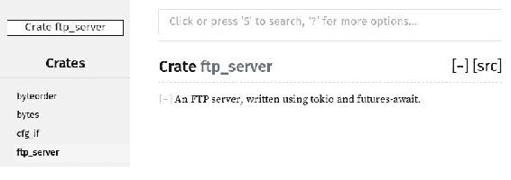
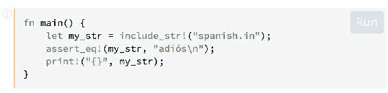
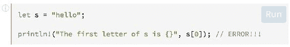
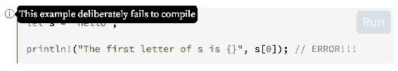

# 第十章：实现异步文件传输

在上一章中，我们开始编写使用`tokio`的异步 FTP 服务器。现在，我们将开始使用 FTP 协议中使用的第二个通道：数据通道。我们将涵盖以下主题：

+   单元测试

+   集成测试

+   回溯

+   文档

+   文档测试

+   模糊测试

# 列出文件

我们将从这个章节开始实现列出文件的命令。这将使我们能够在 FTP 客户端中真正看到文件，并且我们可以通过在目录中导航来测试上一章的一些命令。所以，让我们在`Client::handle_cmd()`方法中添加一个用例：

```rs
#[async]
fn handle_cmd(mut self, cmd: Command) -> Result<Self> {
    match cmd {
        Command::List(path) => self = await!(self.list(path))?,
        // …
    }
}
```

这只是调用`list()`方法，它开始如下：

```rs
use std::fs::read_dir;

#[async]
fn list(mut self, path: Option<PathBuf>) -> Result<Self> {
    if self.data_writer.is_some() {
        let path = self.cwd.join(path.unwrap_or_default());
        let directory = PathBuf::from(&path);
        let (new_self, res) = self.complete_path(directory);
        self = new_self;
        if let Ok(path) = res {
            self = await!
            (self.send(Answer::new(ResultCode::DataConnectionAlreadyOpen,
                                                "Starting to list directory...")))?;
```

我们首先检查数据通道是否打开，如果是这样，我们检查提供的可选路径是否有效。如果是，我们发送一个响应，指示客户端我们将发送数据。方法的后半部分如下：

```rs
            let mut out = vec![];
            if path.is_dir() {
                if let Ok(dir) = read_dir(path) {
                    for entry in dir {
                        if let Ok(entry) = entry {
                            add_file_info(entry.path(), &mut out);
                        }
                    }
                } else {
                    self = await!
                    (self.send(Answer::new(ResultCode::InvalidParameterOrArgument,
                                                        "No such file or 
                                                         directory")))?;
                    return Ok(self);
                }
            } else {
                add_file_info(path, &mut out);
            }
```

我们首先创建一个变量`out`，它将包含要发送给客户端的数据。如果指定的路径是目录，我们使用标准库中的`read_dir()`函数。然后，我们遍历目录中的所有文件以收集每个文件的信息。如果我们无法打开目录，我们将向客户端发送错误。如果路径不是目录，例如，如果它是一个文件，我们只为这个单个文件获取信息。以下是该方法的结尾：

```rs
            self = await!(self.send_data(out))?;
            println!("-> and done!");
        } else {
            self = await!
         (self.send(Answer::new(ResultCode::InvalidParameterOrArgument,
                                                "No such file or directory")))?;
        }
    } else {
        self = await!(self.send(Answer::new(ResultCode::ConnectionClosed, "No opened 
         data connection")))?;
    }
    if self.data_writer.is_some() {
        self.close_data_connection();
        self = await!(self.send(Answer::new(ResultCode::ClosingDataConnection, 
                      "Transfer done")))?;
    }
    Ok(self)
}
```

然后，我们使用稍后将要看到的`send_data()`方法在正确的通道发送数据。如果出现其他错误，我们向客户端发送适当的响应。如果我们成功发送了数据，我们将关闭连接并向客户端指示这一动作。这段代码使用了几个新方法，所以让我们来实现它们。

首先，这是在数据通道中发送数据的步骤：

```rs
#[async]
fn send_data(mut self, data: Vec<u8>) -> Result<Self> {
    if let Some(writer) = self.data_writer {
        self.data_writer = Some(await!(writer.send(data))?);
    }
    Ok(self)
}
```

它与`send()`方法非常相似，但这个方法只有在数据套接字打开时才会发送数据。另一个需要的方法是关闭连接的方法：

```rs
fn close_data_connection(&mut self) {
    self.data_reader = None;
    self.data_writer = None;
}
```

我们需要实现一个方法来收集有关文件的信息。以下是它的开始：

```rs
const MONTHS: [&'static str; 12] = ["Jan", "Feb", "Mar", "Apr", "May", "Jun",
                                    "Jul", "Aug", "Sep", "Oct", "Nov", "Dec"];

fn add_file_info(path: PathBuf, out: &mut Vec<u8>) {
    let extra = if path.is_dir() { "/" } else { "" };
    let is_dir = if path.is_dir() { "d" } else { "-" };

    let meta = match ::std::fs::metadata(&path) {
        Ok(meta) => meta,
        _ => return,
    };
    let (time, file_size) = get_file_info(&meta);
    let path = match path.to_str() {
        Some(path) => match path.split("/").last() {
            Some(path) => path,
            _ => return,
        },
        _ => return,
    };
    let rights = if meta.permissions().readonly() {
        "r--r--r--"
    } else {
        "rw-rw-rw-"
    };
```

参数`out`是一个可变引用，因为我们将在此变量中追加信息。然后，我们收集文件的不同所需信息和权限。以下是函数的其余部分：

```rs
    let file_str = format!("{is_dir}{rights} {links} {owner} {group} {size} {month}  
    {day} {hour}:{min} {path}{extra}\r\n",
                           is_dir=is_dir,
                           rights=rights,
                           links=1, // number of links
                           owner="anonymous", // owner name
                           group="anonymous", // group name
                           size=file_size,
                           month=MONTHS[time.tm_mon as usize],
                           day=time.tm_mday,
                           hour=time.tm_hour,
                           min=time.tm_min,
                           path=path,
                           extra=extra);
    out.extend(file_str.as_bytes());
    println!("==> {:?}", &file_str);
}
```

它格式化信息并将其追加到变量`out`中。

这个函数使用了另一个函数：

```rs
extern crate time;

use std::fs::Metadata;

#[cfg(windows)]
fn get_file_info(meta: &Metadata) -> (time::Tm, u64) {
    use std::os::windows::prelude::*;
    (time::at(time::Timespec::new(meta.last_write_time())), meta.file_size())
}

#[cfg(not(windows))]
fn get_file_info(meta: &Metadata) -> (time::Tm, u64) {
    use std::os::unix::prelude::*;
    (time::at(time::Timespec::new(meta.mtime(), 0)), meta.size())
}
```

这里，我们有`get_file_info()`函数的两个版本：一个用于 Windows，另一个用于所有非 Windows 操作系统。由于我们使用了一个新的 crate，我们需要在`Cargo.toml`中添加这一行：

```rs
time = "0.1.38"
```

我们现在可以在 FTP 客户端中测试文件是否确实被列出（在右侧）：

**图 10.1**

例如，如果我们双击目录，比如 src，FTP 客户端将更新其内容：

*图 10.2*

# 下载文件

FTP 服务器的一个非常有用的功能是能够下载文件。因此，现在是添加执行此操作命令的时候了。

首先，我们在`handle_cmd()`方法中添加一个情况：

```rs
#[async]
fn handle_cmd(mut self, cmd: Command) -> Result<Self> {
    match cmd {
        Command::Retr(file) => self = await!(self.retr(file))?,
        // …
    }
}
```

这是`retr()`函数的开始：

```rs
use std::fs::File;
use std::io::Read;

use error::Error;

#[async]
fn retr(mut self, path: PathBuf) -> Result<Self> {
    if self.data_writer.is_some() {
        let path = self.cwd.join(path);
        let (new_self, res) = self.complete_path(path.clone());
        self = new_self;
        if let Ok(path) = res {
            if path.is_file() {
                self = await!(self.send(Answer::new(ResultCode::DataConnectionAlreadyOpen, "Starting to send file...")))?;
                let mut file = File::open(path)?;
                let mut out = vec![];
                file.read_to_end(&mut out)?;
                self = await!(self.send_data(out))?;
                println!("-> file transfer done!");
```

再次检查数据通道是否已打开，并检查路径。如果是文件，我们打开它，读取其内容，并发送给客户端。否则，我们发送适当的错误：

```rs
            } else {
                self = await!(self.send(Answer::new(ResultCode::LocalErrorInProcessing,
                              &format!("\"{}\" doesn't exist",
                              path.to_str().ok_or_else(|| Error::Msg("No 
                              path".to_string()))?))))?;
            }
        } else {
            self = await!(self.send(Answer::new(ResultCode::LocalErrorInProcessing,
                          &format!("\"{}\" doesn't exist",
                          path.to_str().ok_or_else(|| Error::Msg("No  
                          path".to_string()))?))))?;
        }
    } else {
        self = await!
```

```rs
(self.send(Answer::new(ResultCode::ConnectionClosed, "No opened  
         data connection")))?;
    }
```

这里，我们使用这个模式：

```rs
.ok_or_else(|| Error::Msg("No path".to_string()))?
```

这将`Option`转换为`Result`，并在有错误时返回错误。

最后，如果我们成功发送了文件，我们将关闭数据套接字：

```rs
    if self.data_writer.is_some() {
        self.close_data_connection();
        self = await!(self.send(Answer::new(ResultCode::ClosingDataConnection, 
         "Transfer done")))?;
    }
    Ok(self)
}
```

让我们在 FileZilla 中下载一个文件来检查它是否工作：

**图 10.3**

# 上传文件

现在，让我们执行相反的命令：`STOR`在服务器上上传文件。

和往常一样，我们将在`handle_cmd()`方法中添加一个情况：

```rs
#[async]
fn handle_cmd(mut self, cmd: Command) -> Result<Self> {
    match cmd {
        Command::Stor(file) => self = await!(self.stor(file))?,
        // …
    }
}
```

这是相应方法的开始：

```rs
use std::io::Write;

#[async]
fn stor(mut self, path: PathBuf) -> Result<Self> {
    if self.data_reader.is_some() {
        if invalid_path(&path) {
            let error: io::Error = io::ErrorKind::PermissionDenied.into();
            return Err(error.into());
        }
        let path = self.cwd.join(path);
        self = await!(self.send(Answer::new(ResultCode::DataConnectionAlreadyOpen, 
         "Starting to send file...")))?;
```

再次检查数据通道是否已打开。然后，我们使用一个新的函数来检查路径是否有效，这意味着它不包含`..`。在其他情况下，我们使用了另一个方法`canonicalize()`，并检查路径是否位于服务器根目录下，但在这里我们无法这样做，因为没有文件可以上传。这是方法的结尾：

```rs
        let (data, new_self) = await!(self.receive_data())?;
        self = new_self;
        let mut file = File::create(path)?;
        file.write_all(&data)?;
        println!("-> file transfer done!");
        self.close_data_connection();
        self = await!(self.send(Answer::new(ResultCode::ClosingDataConnection, 
        "Transfer done")))?;
    } else {
        self = await!(self.send(Answer::new(ResultCode::ConnectionClosed, 
         "No opened data connection")))?;
    }
    Ok(self)
}
```

这里，我们调用`receive_data()`，这是一个`Future`，它将解析为从客户端接收到的数据。然后，我们将这些内容写入一个新文件。最后，我们关闭连接并发送响应以指示传输完成。

这是从数据套接字读取数据的方法：

```rs
#[async]
fn receive_data(mut self) -> Result<(Vec<u8>, Self)> {
    let mut file_data = vec![];
    if self.data_reader.is_none() {
        return Ok((vec![], self));
    }
    let reader = self.data_reader.take().ok_or_else(|| Error::Msg("No data 
     reader".to_string()))?;
    #[async]
    for data in reader {
        file_data.extend(&data);
    }
    Ok((file_data, self))
}
```

这里，我们获取`data_reader`属性，这意味着在此语句之后它将是`None`。然后我们使用`async for`循环迭代读取器流。在每次迭代中，我们将数据添加到最终返回的向量中。

这是检查路径是否有效的方法：

```rs
use std::path::Component;

fn invalid_path(path: &Path) -> bool {
    for component in path.components() {
        if let Component::ParentDir = component {
            return true;
        }
    }
    false
}
```

让我们检查上传是否真的工作：

*图 10.4*

# 进一步！

添加一些配置会很好，不是吗？添加用户认证也会很好。让我们从配置开始！

# 配置

首先，让我们在`src/`中创建一个名为`config.rs`的新文件。为了使事情更简单，我们将使用 TOML 格式来处理我们的配置文件。幸运的是，有一个 Rust 中处理 TOML 文件的 crate，名为`toml`。除了这个之外，我们还将使用`serde`来处理序列化和反序列化（非常有用！）。

好的，让我们首先将依赖项添加到我们的`Cargo.toml`文件中：

```rs
toml = "0.4"
serde = "1.0"
serde_derive = "1.0"
```

好的，现在让我们编写我们的`Config`结构体：

```rs
pub struct Config {
    // fields...
}
```

那我们应该放些什么呢？服务器启动时应监听的端口和地址，也许？

```rs
pub struct Config {
    pub server_port: Option<u16>,
    pub server_addr: Option<String>,
}
```

完成了。我们也讨论了处理认证。为什么不添加它呢？我们需要一个新的`struct`来处理用户。让我们称它为`User`（原创性真好！）：

```rs
pub struct User {
    pub name: String,
    pub password: String,
}
```

现在让我们将用户添加到`Config`结构体中：

```rs
pub struct Config {
    pub server_port: Option<u16>,
    pub server_addr: Option<String>,
    pub users: Vec<User>,
    pub admin: Option<User>,
}
```

为了使这两个`struct`与`serde`一起工作，我们必须添加以下标签：

```rs
#[derive(Deserialize, Serialize)]
```

由于我们需要克隆`Config`，我们将添加`Debug`到标签中，这给了我们：

```rs
#[derive(Clone, Deserialize, Serialize)]
pub struct Config {
    pub server_port: Option<u16>,
    pub server_addr: Option<String>,
    pub admin: Option<User>,
    pub users: Vec<User>,
}

#[derive(Clone, Deserialize, Serialize)]
pub struct User {
    pub name: String,
    pub password: String,
}
```

好的，我们现在准备好实现读取：

```rs
use std::fs::File;
use std::path::Path;
use std::io::{Read, Write};

use toml;

fn get_content<P: AsRef<Path>>(file_path: &P) -> Option<String> {
    let mut file = File::open(file_path).ok()?;
    let mut content = String::new();
    file.read_to_string(&mut content).ok()?;
    Some(content)
}

impl Config {
    pub fn new<P: AsRef<Path>>(file_path: P) -> Option<Config> {
        if let Some(content) = get_content(&file_path) {
            toml::from_str(&content).ok()
        } else {
            println!("No config file found so creating a new one in 
                     {}",file_path.as_ref().display());
            // In case we didn't find the config file, 
                we just build a new one.
            let config = Config {
                server_port: Some(DEFAULT_PORT),
                server_addr: Some("127.0.0.1".to_owned()),
                admin: None,
                users: vec![User {
                    name: "anonymous".to_owned(),
                    password: "".to_owned(),
                }],
            };
            let content = toml::to_string(&config).expect("serialization failed");
            let mut file = File::create(file_path.as_ref()).expect("couldn't create 
             file...");
            writeln!(file, "{}", content).expect("couldn't fulfill config file...");
            Some(config)
        }
    }
}
```

让我们通过`Config::new`方法的代码来了解：

```rs
if let Some(content) = get_content(&file_path) {
    toml::from_str(&content).ok()
}
```

多亏了 `serde`，我们可以直接从 `&str` 加载配置文件，并返回完全设置的 `Config` 结构体。太棒了，对吧？

关于信息，`get_content` 函数只是一个 `utility` 函数，允许返回文件的内容，如果该文件存在的话。

此外，别忘了添加 `DEFAULT_PORT` 常量：

```rs
pub const DEFAULT_PORT: u16 = 1234;
```

如果文件不存在，我们可以使用一些默认值创建一个新的文件：

```rs
else {
    println!("No config file found so creating a new one in {}",
             file_path.as_ref().display());
    // In case we didn't find the config file, we just build a new one.
    let config = Config {
        server_port: Some(DEFAULT_PORT),
        server_addr: Some("127.0.0.1".to_owned()),
        admin: None,
        users: vec![User {
            name: "anonymous".to_owned(),
            password: "".to_owned(),
        }],
    };
    let content = toml::to_string(&config).expect("serialization failed");
    let mut file = File::create(file_path.as_ref()).expect("couldn't create 
    file...");
    writeln!(file, "{}", content).expect("couldn't fulfill config file...");
    Some(config)
}
```

现在你可能会想知道，我们如何能够使用这段代码从我们的 `Config` 结构体生成 TOML？再次使用 `serde` 的魔法！

有了这个，我们的 `config` 文件现在就完整了。让我们回到 `main.rs`。首先，我们需要定义一个新的常量：

```rs
const CONFIG_FILE: &'static str = "config.toml";
```

然后，我们需要更新相当多的方法/函数。让我们从 `main` 函数开始。在开始处添加此行：

```rs
let config = Config::new(CONFIG_FILE).expect("Error while loading config...");
```

现在将 `config` 变量传递给 `server` 函数：

```rs
if let Err(error) = core.run(server(handle, server_root, config)) {
```

接下来，让我们更新 `server` 函数：

```rs
#[async]
fn server(handle: Handle, server_root: PathBuf, config: Config) -> io::Result<()> {
    let port = config.server_port.unwrap_or(DEFAULT_PORT);
    let addr = SocketAddr::new(IpAddr::V4(config.server_addr.as_ref()
                                                .unwrap_or(&"127.0.0.1".to_owned())
                                                .parse()
                                                .expect("Invalid IpV4 address...")),
                                                 port);
    let listener = TcpListener::bind(&addr, &handle)?;

    println!("Waiting clients on port {}...", port);
    #[async]
    for (stream, addr) in listener.incoming() {
        let address = format!("[address : {}]", addr);
        println!("New client: {}", address);
        handle.spawn(handle_client(stream, handle.clone(), server_root.clone()));
        handle.spawn(handle_client(stream, handle.clone(), server_root.clone(),  
        config.clone()));
        println!("Waiting another client...");
    }
    Ok(())
}
```

现在，服务器使用 `Config` 结构体的值启动。然而，我们仍然需要每个客户端的用户列表来处理身份验证。为此，我们需要给每个 `Client` 一个 `Config` 实例。在这里，为了使事情更简单，我们只需 `clone`。

现在是时候更新 `handle_client` 函数了：

```rs
#[async]
fn handle_client(stream: TcpStream, handle: Handle, server_root: PathBuf,
                 config: Config) -> result::Result<(), ()> {
    await!(client(stream, handle, server_root, config))
        .map_err(|error| println!("Error handling client: {}", error))
}
```

现在让我们更新 `client` 函数：

```rs
#[async]
fn client(stream: TcpStream, handle: Handle, server_root: PathBuf, config: Config) -> Result<()> {
    let (writer, reader) = stream.framed(FtpCodec).split();
    let writer = await!(writer.send(Answer::new(ResultCode::ServiceReadyForNewUser,
                                    "Welcome to this FTP server!")))?;
    let mut client = Client::new(handle, writer, server_root, config);
    #[async]
    for cmd in reader {
        client = await!(client.handle_cmd(cmd))?;
    }
    println!("Client closed");
    Ok(())
}
```

最后一步是更新 `Client` 结构体：

```rs
struct Client {
    cwd: PathBuf,
    data_port: Option<u16>,
    data_reader: Option<DataReader>,
    data_writer: Option<DataWriter>,
    handle: Handle,
    name: Option<String>,
    server_root: PathBuf,
    transfer_type: TransferType,
    writer: Writer,
    is_admin: bool,
    config: Config,
    waiting_password: bool,
}
```

新增的 `config` 字段看起来很合理，然而 `is_admin` 和 `waiting_password` 呢？第一个将用于能够列出/下载/覆盖 `config.toml` 文件，而第二个将在使用 `USER` 命令且服务器现在期待用户密码时使用。

让我们在 `Client` 结构体中添加另一个方法：

```rs
fn is_logged(&self) -> bool {
    self.name.is_some() && !self.waiting_password
}
```

不要忘记更新 `Config::new` 方法：

```rs
fn new(handle: Handle, writer: Writer, server_root: PathBuf, config: Config) -> Client {
    Client {
        cwd: PathBuf::from("/"),
        data_port: None,
        data_reader: None,
        data_writer: None,
        handle,
        name: None,
        server_root,
        transfer_type: TransferType::Ascii,
        writer,
        is_admin: false,
        config,
        waiting_password: false,
    }
}
```

好的，现在有一个巨大的更新！但是首先，别忘了添加 `Pass` 命令：

```rs
pub enum Command {
    // variants...
    Pass(String),
    // variants...
}
```

现在是 `Command::new` 匹配：

```rs
b"PASS" => Command::Pass(data.and_then(|bytes| String::from_utf8(bytes.to_vec()).map_err(Into::into))?),
```

不要忘记更新 `AsRef` 的实现！

好的，我们已经准备好最后（而且非常庞大）的一步。让我们转到 `Client::handle_cmd` 方法：

```rs
use config::{DEFAULT_PORT, Config};
use std::path::Path;

fn prefix_slash(path: &mut PathBuf) {
    if !path.is_absolute() {
        *path = Path::new("/").join(&path);
    }
}

#[async]
fn handle_cmd(mut self, cmd: Command) -> Result<Self> {
    println!("Received command: {:?}", cmd);
    if self.is_logged() {
        match cmd {
            Command::Cwd(directory) => return Ok(await!(self.cwd(directory))?),
            Command::List(path) => return Ok(await!(self.list(path))?),
            Command::Pasv => return Ok(await!(self.pasv())?),
            Command::Port(port) => {
                self.data_port = Some(port);
                return Ok(await!(self.send(Answer::new(ResultCode::Ok,
                          &format!("Data port is now {}", 
                           port))))?);
            }
            Command::Pwd => {
                let msg = format!("{}", self.cwd.to_str().unwrap_or("")); // small   
                 trick
                if !msg.is_empty() {
                    let message = format!("\"{}\" ", msg);

                    return Ok(await!
                    (self.send(Answer::new(ResultCode::PATHNAMECreated,
                      &message)))?);
                } else {
                    return Ok(await!(self.send(Answer::new(ResultCode::FileNotFound,
                              "No such file or directory")))?);
                }
            }
            Command::Retr(file) => return Ok(await!(self.retr(file))?),
            Command::Stor(file) => return Ok(await!(self.stor(file))?),
            Command::CdUp => {
                if let Some(path) = self.cwd.parent().map(Path::to_path_buf) {
                    self.cwd = path;
                    prefix_slash(&mut self.cwd);
                }
                return Ok(await!(self.send(Answer::new(ResultCode::Ok, "Done")))?);
            }
            Command::Mkd(path) => return Ok(await!(self.mkd(path))?),
            Command::Rmd(path) => return Ok(await!(self.rmd(path))?),
            _ => (),
        }
    } else if self.name.is_some() && self.waiting_password {
        if let Command::Pass(content) = cmd {
            let mut ok = false;
            if self.is_admin {
                ok = content == self.config.admin.as_ref().unwrap().password;
            } else {
                for user in &self.config.users {
                    if Some(&user.name) == self.name.as_ref() {
                        if user.password == content {
                            ok = true;
                            break;
                        }
                    }
                }
            }
            if ok {
                self.waiting_password = false;
                let name = self.name.clone().unwrap_or(String::new());
                self = await!(
                    self.send(Answer::new(ResultCode::UserLoggedIn,
                                          &format!("Welcome {}", name))))?;
            } else {
                self = await!(self.send(Answer::new(ResultCode::NotLoggedIn,
                               "Invalid password")))?;
            }
            return Ok(self);
        }
    }
    match cmd {
        Command::Auth =>
            self = await!(self.send(Answer::new(ResultCode::CommandNotImplemented,
                          "Not implemented")))?,
        Command::Quit => self = await!(self.quit())?,
        Command::Syst => {
            self = await!(self.send(Answer::new(ResultCode::Ok, "I won't tell!")))?;
        }
        Command::Type(typ) => {
            self.transfer_type = typ;
            self = await!(self.send(Answer::new(ResultCode::Ok,
                           "Transfer type changed successfully")))?;
        }
        Command::User(content) => {
            if content.is_empty() {
                self = await!
               (self.send(Answer::new(ResultCode::InvalidParameterOrArgument,
                                       "Invalid username")))?;
            } else {
                let mut name = None;
                let mut pass_required = true;

                self.is_admin = false;
                if let Some(ref admin) = self.config.admin {
                    if admin.name == content {
                        name = Some(content.clone());
                        pass_required = admin.password.is_empty() == false;
                        self.is_admin = true;
                    }
                }
                // In case the user isn't the admin.
                if name.is_none() {
                    for user in &self.config.users {
                        if user.name == content {
                            name = Some(content.clone());
                            pass_required = user.password.is_empty() == false;
                            break;
                        }
                    }
                }
                // In case this is an unknown user.
                if name.is_none() {
                    self = await!(self.send(Answer::new(ResultCode::NotLoggedIn,
                                     "Unknown user...")))?;
                } else {
                    self.name = name.clone();
                    if pass_required {
                        self.waiting_password = true;
                        self = await!(

                       self.send(Answer::new(ResultCode::UserNameOkayNeedPassword,
                                      &format!("Login OK, password needed for {}",
                                               name.unwrap()))))?;
                    } else {
                        self.waiting_password = false;
                        self = await! 
                         (self.send(Answer::new(ResultCode::UserLoggedIn,
                              &format!("Welcome {}!", content))))?;
                    }
                }
            }
        }
        Command::NoOp => self = await!(self.send(Answer::new(ResultCode::Ok,
                                                             "Doing nothing")))?,
        Command::Unknown(s) =>
            self = await!(self.send(Answer::new(ResultCode::UnknownCommand,
                           &format!("\"{}\": Not implemented", s))))?,
        _ => {
            // It means that the user tried to send a command while they weren't  
             logged yet.
            self = await!(self.send(Answer::new(ResultCode::NotLoggedIn,
                           "Please log first")))?;
        }
    }
    Ok(self)
}
```

我已经告诉你它有多么巨大了！这里的主要点是流程重构。以下命令仅在您登录时才有效：

+   `Cwd`

+   `List`

+   `Pasv`

+   `Port`

+   `Pwd`

+   `Retr`

+   `Stor`

+   `CdUp`

+   `Mkd`

+   `Rmd`

此命令仅在您尚未登录且服务器正在等待密码时才有效：

+   `Pass`

其余的命令在任何情况下都有效。我们在这里几乎完成了。记得我提到过的安全性吗？你不希望任何人都能访问包含所有用户列表的配置文件，我想。

# 保护 config.toml 访问

这次，没有太多的事情要做！我们只需要在用户想要列出、下载或覆盖文件时添加一个检查。这意味着以下三个命令必须更新：

+   `List`

+   `Retr`

+   `Stor`

让我们从 `List` 开始更新。在第一个 `add_file_info` 函数调用之前，只需将 `add_file_info` 函数调用包裹在这个块中：

```rs
if self.is_admin || entry.path() != self.server_root.join(CONFIG_FILE) {
```

在第二个之前，添加以下内容：

```rs
if self.is_admin || path != self.server_root.join(CONFIG_FILE)
```

现在让我们更新`retr`函数。考虑以下条件：

```rs
if path.is_file() {
```

用以下内容替换它：

```rs
if path.is_file() && (self.is_admin || path != self.server_root.join(CONFIG_FILE)) {
```

最后，让我们更新`stor`函数。考虑以下条件：

```rs
if invalid_path(&path) {
```

用以下内容替换它：

```rs
if invalid_path(&path) || (!self.is_admin && path == self.server_root.join(CONFIG_FILE)) {
```

现在我们完成了！您现在有一个可配置的服务器，您可以轻松地根据您的需求进行扩展。

# 单元测试

一个好的软件需要测试来确保它在大多数情况下都能正常工作。因此，我们将通过开始为 FTP 的`codec`编写单元测试来为我们的 FTP 服务器添加测试。

单元测试仅验证程序的一个单元，这可能是一个函数。它们与稍后我们将看到的集成测试不同，集成测试测试整个软件。

让我们进入`codec`模块并为其添加一个新的内部模块：

```rs
#[cfg(test)]
mod tests {
}
```

我们再次使用`#[cfg]`属性；这次，只有在运行测试时才会编译以下模块。这是为了避免在最终二进制文件中添加无用的代码。

在这个新模块中，我们将添加一些我们稍后编写测试时需要的导入语句：

```rs
#[cfg(test)]
mod tests {
    use std::path::PathBuf;

    use ftp::ResultCode;
    use super::{Answer, BytesMut, Command, Decoder, Encoder, FtpCodec};
}
```

如您所见，我们使用`super`来访问父模块（`codec`）中的某些类型：这在单元测试中非常常见，因为我们通常测试同一文件中的代码。

现在让我们添加一个`test`函数：

```rs
#[cfg(test)]
mod tests {
    // …

    #[test]
    fn test_encoder() {
    }
}
```

在`test_encoder()`函数中，我们将编写测试`FtpCodec`、`Encoder`实现的代码，以验证它是否按预期工作。

我们首先检查带有消息的`Answer`是否产生正确的输出：

```rs
#[cfg(test)]
mod tests {
    // …

    #[test]
    fn test_encoder() {
        let mut codec = FtpCodec;
        let message = "bad sequence of commands";
        let answer = Answer::new(ResultCode::BadSequenceOfCommands, message);
        let mut buf = BytesMut::new();
        let result = codec.encode(answer, &mut buf);
        assert!(result.is_ok());
        assert_eq!(buf, format!("503 {}\r\n", message));
    }
}
```

在这里，我们首先创建调用`Encode::encode`所需的对象，例如，一个`codec`和一个缓冲区。然后，我们调用`codec.encode()`，因为我们实际上想测试的是这个方法。之后，我们检查结果是否为`Ok`，并检查缓冲区是否相应地被填充。为此，我们使用一些宏：

+   `assert!`：这检查值是否为`true`。如果是`false`，它将引发恐慌并使测试失败。

+   `assert_eq!`：这检查两个值是否相等。

这是一个相当简单且有效的测试，但它并不测试函数的每一条路径。因此，让我们在这个函数中添加更多行来测试其他可能的路径：

```rs
#[cfg(test)]
mod tests {
    // …

    #[test]
    fn test_encoder() {
        // …
        let answer = Answer::new(ResultCode::CantOpenDataConnection, "");
        let mut buf = BytesMut::new();
        let result = codec.encode(answer, &mut buf);
        assert!(result.is_ok(), "Result is ok");
        assert_eq!(buf, format!("425\r\n"), "Buffer contains 425");
    }
}
```

在这里，我们使用空消息进行测试。其余部分基本上相同：我们创建必要的对象并使用 assert 宏。但这次，我们向 assert 宏添加了一个新参数；这是一个可选的消息，当测试失败时显示。

如果我们使用`cargo test`运行测试，我们会得到以下结果：

```rs
 Compiling ftp-server v0.0.1 (file:///path/to/FTP-server-rs)
    Finished dev [unoptimized + debuginfo] target(s) in 1.29 secs
     Running target/debug/deps/ftp_server-452667ddc2d724e8

running 1 test
test codec::tests::test_encoder ... ok

test result: ok. 1 passed; 0 failed; 0 ignored; 0 measured; 0 filtered out
```

这显示了运行的测试以及它通过了。

让我们编写一个失败的`test`函数：

```rs
    #[test]
    fn test_dummy() {
        assert!(false, "Always fail");
    }
```

当我们运行`cargo test`时，我们看到以下内容：

```rs
 Finished dev [unoptimized + debuginfo] target(s) in 1.30 secs
     Running target/debug/deps/ftp_server-452667ddc2d724e8

running 2 tests
test codec::tests::test_encoder ... ok
test codec::tests::test_dummy ... FAILED

failures:

---- codec::tests::test_dummy stdout ----
    thread 'codec::tests::test_dummy' panicked at 'Always fail', src/codec.rs:102:8
note: Run with `RUST_BACKTRACE=1` for a backtrace.

failures:
    codec::tests::test_dummy
```

```rs
test result: FAILED. 1 passed; 1 failed; 0 ignored; 0 measured; 0 filtered out

error: test failed, to rerun pass '--bin ftp-server'
```

我们可以看到我们指定的消息（`Always fail`）被显示出来。我们还看到有`1`个测试失败了。

# 回溯

如输出中所述，我们可以设置环境变量`RUST_BACKTRACE`为`1`以获取更多有关测试失败位置的信息。让我们这样做：

```rs
export RUST_BACKTRACE=1
```

```rs
 Finished dev [unoptimized + debuginfo] target(s) in 0.0 secs
     Running target/debug/deps/ftp_server-452667ddc2d724e8

running 2 tests
test codec::tests::test_encoder ... ok
test codec::tests::test_dummy ... FAILED

failures:

---- codec::tests::test_dummy stdout ----
    thread 'codec::tests::test_dummy' panicked at 'Always fail', src/codec.rs:102:8
note: Some details are omitted, run with `RUST_BACKTRACE=full` for a verbose backtrace.
stack backtrace:
   0: std::sys::imp::backtrace::tracing::imp::unwind_backtrace
             at /checkout/src/libstd/sys/unix/backtrace/tracing/gcc_s.rs:49
   1: std::sys_common::backtrace::_print
             at /checkout/src/libstd/sys_common/backtrace.rs:68
   2: std::panicking::default_hook::{{closure}}
             at /checkout/src/libstd/sys_common/backtrace.rs:57
             at /checkout/src/libstd/panicking.rs:381
   3: std::panicking::default_hook
             at /checkout/src/libstd/panicking.rs:391
   4: std::panicking::rust_panic_with_hook
             at /checkout/src/libstd/panicking.rs:577
   5: std::panicking::begin_panic
             at /checkout/src/libstd/panicking.rs:538
   6: ftp_server::codec::tests::test_dummy
             at src/codec.rs:102
   7: <F as test::FnBox<T>>::call_box
             at /checkout/src/libtest/lib.rs:1491
             at /checkout/src/libcore/ops/function.rs:223
             at /checkout/src/libtest/lib.rs:142
   8: __rust_maybe_catch_panic
             at /checkout/src/libpanic_unwind/lib.rs:99

failures:
    codec::tests::test_dummy  test result: FAILED. 1 passed; 1 failed; 0 ignored; 0 measured; 0 filtered out

error: test failed, to rerun pass '--bin ftp-server'
```

这里的重要部分如下：

```rs
6: ftp_server::codec::tests::test_dummy
             at src/codec.rs:102
```

这显示了代码恐慌的文件、函数和行。

这个变量即使在测试代码之外也很有用：当调试引发恐慌的代码时，我们也可以使用这个变量。

# 测试失败

有时，我们想要测试一个函数是否会引发恐慌。为此，我们可以在 `test` 函数的顶部简单地添加 `#[should_panic]` 属性：

```rs
    #[should_panic]
    #[test]
    fn test_dummy() {
        assert!(false, "Always fail");
    }
```

这样做时，`test` 现在通过了：

```rs
 Finished dev [unoptimized + debuginfo] target(s) in 1.30 secs
     Running target/debug/deps/ftp_server-452667ddc2d724e8

running 2 tests
test codec::tests::test_dummy ... ok
test codec::tests::test_encoder ... ok

test result: ok. 2 passed; 0 failed; 0 ignored; 0 measured; 0 filtered out
```

# 忽略测试

有时，我们有需要花费很多时间或我们想要避免始终运行特定测试的测试。为了避免默认运行测试，我们可以在函数上方添加 `#[ignore]` 属性：

```rs
    #[ignore]
    #[test]
    fn test_dummy() {
        assert!(false, "Always fail");
    }
```

当我们运行 `test` 时，我们会看到 `test` 函数没有运行：

```rs
 Finished dev [unoptimized + debuginfo] target(s) in 0.0 secs
     Running target/debug/deps/ftp_server-452667ddc2d724e8

running 2 tests
test codec::tests::test_dummy ... ignored
test codec::tests::test_encoder ... ok

test result: ok. 1 passed; 0 failed; 1 ignored; 0 measured; 0 filtered out
```

如您所见，`test_dummy()` 测试函数被忽略了。要运行它，我们需要向运行测试的程序（而不是 `cargo` 本身）指定一个命令行参数：

```rs
cargo test -- --ignored
```

**注意：** 我们在 `--ignored` 前指定了 `--`，以便将后者发送给运行测试的程序（这并不是 `cargo`）。

使用该参数，我们看到测试确实运行了：

```rs
 Finished dev [unoptimized + debuginfo] target(s) in 0.0 secs
     Running target/debug/deps/ftp_server-452667ddc2d724e8

running 1 test
test codec::tests::test_dummy ... FAILED

failures:

---- codec::tests::test_dummy stdout ----
    thread 'codec::tests::test_dummy' panicked at 'Always fail', src/codec.rs:102:8
note: Run with `RUST_BACKTRACE=1` for a backtrace.

failures:
    codec::tests::test_dummy

test result: FAILED. 0 passed; 1 failed; 0 ignored; 0 measured; 1 filtered out

error: test failed, to rerun pass '--bin ftp-server'
```

为了结束这一节，让我们为解码器编写一个单元测试：

```rs
#[cfg(test)]
mod tests {
    // …

    #[test]
    fn test_decoder() {
        let mut codec = FtpCodec;
        let mut buf = BytesMut::new();
        buf.extend(b"PWD");
        let result = codec.decode(&mut buf);
        assert!(result.is_ok());
        let command = result.unwrap();
        assert!(command.is_none());
```

这里，我们测试在需要更多输入的情况下返回 `None`：

```rs
        buf.extend(b"\r\n");
        let result = codec.decode(&mut buf);
        assert!(result.is_ok());
        let command = result.unwrap();
        assert_eq!(command, Some(Command::Pwd));
```

在这里，我们添加缺失的输出以检查命令是否正确解析：

```rs
        let mut buf = BytesMut::new();
        buf.extend(b"LIST /tmp\r\n");
        let result = codec.decode(&mut buf);
        assert!(result.is_ok());
        let command = result.unwrap();
        assert_eq!(command, Some(Command::List(Some(PathBuf::from("/tmp")))));
    }
}
```

最后，我们测试解析带有参数的命令是否有效。如果我们再次运行 `cargo test`，我们得到以下输出：

```rs
 Finished dev [unoptimized + debuginfo] target(s) in 1.70 secs
     Running target/debug/deps/ftp_server-452667ddc2d724e8

running 2 tests
test codec::tests::test_encoder ... ok
test codec::tests::test_decoder ... ok

test result: ok. 2 passed; 0 failed; 0 ignored; 0 measured; 0 filtered out
```

# 集成测试

在上一节中，我们检查了我们的代码的一部分是否工作：现在，我们将通过编写集成测试来检查程序作为一个整体是否工作。这些测试位于 `tests/` 目录中，所以我们首先创建它：

```rs
mkdir tests
```

在这个目录中，我们可以创建一个新的文件，`tests/server.rs`，我们将放入以下内容：

```rs
extern crate ftp;

use std::process::Command;
use std::thread;
use std::time::Duration;

use ftp::FtpStream;
```

我们导入 `ftp` 包，这是一个 FTP 客户端；它将有助于测试我们的 FTP 服务器。我们还需要在 `Cargo.toml` 中添加它：

```rs
[dev-dependencies]
ftp = "².2.1"
```

这里我们看到一个新的部分，`dev-dependencies`：它包含在主包本身之外需要的依赖项，例如在集成测试中。通过在这里放置依赖项而不是 `[dependencies]` 中，它将不会在主包中可用，这正是我们想要的。

让我们回到文件 `tests/server.rs` 并添加一个 `test` 函数：

```rs
#[test]
fn test_pwd() {
    let child =
        Command::new("./target/debug/ftp-server")
            .spawn().unwrap();
    let mut controller = ProcessController::new(child);

    thread::sleep(Duration::from_millis(100));
    assert!(controller.is_running(), "Server was aborted");

    let mut ftp = FtpStream::connect("127.0.0.1:1234").unwrap();

    ftp.quit().unwrap();
}
```

这里，我们不需要将代码放入内嵌的 `tests` 模块，因为集成测试是单独编译的。由于我们的包是一个二进制文件，我们需要使用 `Command` 对象来运行它。我们将子进程交给稍后创建的 `ProcessController`。

注意：如果我们的包是一个库，我们会为它添加一个 `extern crate`，然后我们可以直接调用它的函数。

然后，我们调用 `thread::sleep()` 给我们的服务器一些启动时间。之后，我们使用 `ftp` 包连接到我们的服务器，然后退出。

# 拆卸

在 Rust 测试框架中，没有像许多其他语言的测试框架那样的`setup()`和`teardown()`函数。在这里，我们需要在测试完成后运行一些代码：我们需要关闭我们的 FTP 服务器。所以，我们需要某种`teardown`函数。我们不能简单地在函数末尾说`child.kill()`，因为如果测试在那时崩溃，FTP 服务器将在测试结束后继续运行。为了确保清理代码始终被调用，无论函数如何结束，我们不得不使用我们在第六章*，实现音乐播放器的引擎*中发现的`RAII`模式。

让我们编写一个简单的`teardown`结构：

```rs
struct ProcessController {
    child: Child,
}
```

该结构包含将在析构函数中杀死的子进程。所以，如果测试崩溃，这个析构函数将被调用。如果函数正常结束，它也会被调用。

我们还将创建一个构造函数和`utility`方法，这些方法我们在`test`函数中使用：

```rs
impl ProcessController {
    fn new(child: Child) -> Self {
        ProcessController {
            child,
        }
    }

    fn is_running(&mut self) -> bool {
        let status = self.child.try_wait().unwrap();
        status.is_none()
    }
}
```

`is_running()`函数用于确保我们启动的 FTP 服务器实际上正在运行；如果应用程序的另一个实例已经运行，我们的实例将不会运行。这就是为什么我们在测试函数中使用了断言。

最后，我们需要创建一个析构函数：

```rs
impl Drop for ProcessController {
    fn drop(&mut self) {
        let _ = self.child.kill();
    }
}
```

我们现在准备好编写`test`函数：

```rs
#[test]
fn test_pwd() {
    // …

    let mut ftp = FtpStream::connect("127.0.0.1:1234").unwrap();

    let pwd = ftp.pwd().unwrap();
    assert_eq!("/", pwd);

    ftp.login("ferris", "").unwrap();

    ftp.cwd("src").unwrap();
    let pwd = ftp.pwd().unwrap();
    assert_eq!("/src", pwd);

    let _ = ftp.cdup();
    let pwd = ftp.pwd().unwrap();
    assert_eq!("/", pwd);

    ftp.quit().unwrap();
}
```

在这个函数中，我们发出一些 FTP 命令，并通过调用`assert_eq!()`宏来确保服务器状态正确。当我们运行`cargo test`时，我们看到以下输出：

```rs
 Finished dev [unoptimized + debuginfo] target(s) in 0.0 secs
     Running target/debug/deps/ftp_server-47386d9089111729

running 2 tests
test codec::tests::test_decoder ... ok
test codec::tests::test_encoder ... ok

test result: ok. 2 passed; 0 failed; 0 ignored; 0 measured; 0 filtered out

     Running target/debug/deps/server-1b5cda64792f5f82

running 1 test
Waiting clients on port 1234...
New client: [address : 127.0.0.1:43280]
Waiting another client...
Received command: Pwd
Received command: User("ferris")
Received command: Cwd("src")
Received command: Pwd
Received command: CdUp
Received command: Pwd
Received command: Quit
test test_pwd ... ok

test result: ok. 1 passed; 0 failed; 0 ignored; 0 measured; 0 filtered out
```

为我们的集成测试添加了一个新部分。

# 打印输出到 stdout

让我们看看当我们向测试中添加对`println!()`的调用会发生什么（例如，用于调试目的）：

```rs
#[test]
fn test_pwd() {
    println!("Running FTP server");

    // …
}
```

它不会被打印到终端。为了看到它，我们需要向测试运行器传递另一个参数。让我们这样运行`cargo test`来查看输出到`stdout`：

```rs
cargo run -- --nocapture
```

这次，我们看到以下输出：

```rs
…

     Running target/debug/deps/server-1b5cda64792f5f82

running 1 test
Running FTP server
Waiting clients on port 1234...
New client: [address : 127.0.0.1:43304]
Waiting another client...
Received command: Pwd
Received command: User("ferris")
Received command: Cwd("src")
Received command: Pwd
Received command: CdUp
Received command: Pwd
Received command: Quit
test test_pwd ... ok

test result: ok. 1 passed; 0 failed; 0 ignored; 0 measured; 0 filtered out
```

# 文档

软件的一个重要方面是文档。描述如何使用项目，给出一些示例并详细说明完整的公共 API 很有用：让我们看看我们如何在 Rust 中文档化一个 crate。

# 文档化 crate

文档是用注释编写的，但这些文档注释以特殊符号开头。我们使用`///`来注释注释后的项，使用`//!`来注释此项内部的项。让我们先看看后者的一个例子。

在我们的 crate 根目录的顶部（具体来说，在`main.rs`文件中），我们将添加以下注释：

```rs
//! An FTP server, written using tokio and futures-await.
```

这里，我们使用`//!`形式，因为我们不能在 crate 之前写注释；我们只能从 crate 内部写注释。

# 模块文档化

模块文档化非常相似：我们在模块文件的顶部添加一个`//!`形式的注释。让我们在`codec.rs`中添加以下文档注释：

```rs
//! FTP codecs to encode and decode FTP commands and raw bytes.
```

# 标题

文档注释是用 Markdown 编写的，所以让我们看看一些 Markdown 格式化语法。我们可以通过在一行开头使用 `#` 来写标题。`#` 的数量越多，标题越小。

例如：

```rs
/// Some introduction text.
///
/// # Big Title
///
/// ## Less big title
///
/// ### Even less big title.
///
/// #### Small title
///
/// ...
```

我想你到这里应该明白了！

这里是一些常见的标题：

+   示例

+   Panics

+   失败

# 代码块

我们在文档注释中编写的代码必须在 ```rs` ``` ```rs`. Usually, the code blocks are written under an `Examples` header. Let's see an example using all of these syntactic elements for a function that convert bytes to uppercase:

``` 两对之间插入。

/// 将字节序列转换为大写。

///

/// # 示例

///

/// ```rs
/// let mut data = b"test";
/// to_uppercase(&mut data);
/// ```

fn to_uppercase(data: &mut [u8]) {

    for byte in data {

        if *byte >= 'a' as u8 && *byte <= 'z' as u8 {

            *byte -= 32;

        }

    }

}

```rs

Here, we start with a short description of the function. Then, we show a code example.

It's recommended to add comments in the code if needed, to help users understand it more easily, so don't hesitate to add some!

# Documenting an enumeration (or any type with public fields)

When we want to document an enumeration, we want not only to document the type, but also each variant. To do so, we can simply add a doc-comment before each variant. The same applies for a structure, for its fields.

Let's see an example for the `Command` type:

```

/// 由解析器解析的 FTP 命令。

#[derive(Clone, Debug, PartialEq)]

pub enum Command {

    Auth,

    /// 将工作目录更改为作为参数指定的目录。

    Cwd(PathBuf),

    /// 获取文件列表。

    List(Option<PathBuf>),

    /// 创建一个新目录。

    Mkd(PathBuf),

    /// 无操作。

    NoOp,

    /// 指定用于数据通道的端口号。

    Port(u16),

    /// 进入被动模式。

    Pasv,

    /// 打印当前目录。

    Pwd,

    /// 终止连接。

    Quit,

    /// 获取文件。

    Retr(PathBuf),

    /// 删除一个目录。

    Rmd(PathBuf),

    /// 在服务器上存储一个文件。

    存储路径(PathBuf),

    Syst,

    /// 指定传输类型。

    Type(TransferType),

    /// 进入父目录。

    CdUp,

    未知(String),

    用户(String),

}

```rs

We see that the `enum` itself has a doc-comment and most of the variants also have documentation.

# Generating the documentation

We can easily generate the documentation by running the following command:

```

cargo doc

```rs

This will generate the documentation in the directory `target/doc/ftp_server`. Here is how it looks:

*Figure 10.5*

# Warning about public items without documentation

When writing a library, it is very easy to forget to write the documentation about every item. But, we can use the help of the tools at our disposal. By adding the `#[warn(missing_docs)]` attribute in our crate's root, the compiler will warn us when public items do not have a doc-comment. In such a case, it will print something like this:

```

警告：缺少对包的文档

--> src/main.rs:9:1

    |

9   | / #![feature(proc_macro, conservative_impl_trait, generators)]

10  | | #![warn(missing_docs)]

11  | |

12  | | extern crate bytes;

...   |

528 | |     }

529 | | }

    | |_^

    |

注意：这里定义了 lint 级别

--> src/main.rs:10:9

    |

10  | #![warn(missing_docs)]

    |         ^^^^^^^^^^^^

```rs

# Hiding items from the documentation

Sometimes, we intentionally do not want to have a public item show up in the documentation. In this case, we can use the `#[doc(hidden)]` attribute:

```

#[doc(hidden)]

#[derive(Clone, Copy, Debug, PartialEq)]

pub enum TransferType {

    Ascii,

    图片

    未知,

}

```rs

For instance, this can be useful for something that is used by a macro of the crate but is not intended to be used directly by the user.

# Documentation tests

Writing documentation is a great thing. Showing code in your documentation is even better. However, how can you be sure that the code you're showing is still up to date? That it won't break when users copy/paste it to test it out? Here comes another wonderful feature from Rust: `doc tests`.

# Tags

First, any code blocks in documentation comments will be tested by default if they don't have `ignore` or any non-recognized tag. So, for example:

```

/// ```rsignore
/// let x = 12;
/// x += 1;
/// ```

```rs

This block code won't be tested (luckily, because it wouldn't compile!). A few other examples:

```

/// # 一些文本

///

/// ```rstext
/// this is just some text
/// but it's rendered inside a code block
/// nice, right?
/// ```

///

/// # 为什么不是 C？

///

/// ```rsc-language
/// int strlen(const char *s) {
///     char *c = s;
///
///     for (; *c; ++c);
///     return c - s;
/// }
/// ```

///

/// # 或者一种未知语言？

///

/// ```rswhatever
/// 010010000110100100100001
/// ```

```rs

A few other instructions might come in handy for you. Let's start with `ignore`!

# ignore

Just like this flag name states, `ignore` makes the block code ignored. As simple as that. It'll still get the Rust syntax color once rendered in the documentation. For example:

```

/// ```rsignore
/// let x = 0;
/// ```

```rs

However, once rendered, it'll have a graphical notification about the fact that this block code isn't tested:

*Figure 10.6*

And when you hover over the  sign:

*Figure 10.7*

Now let's continue with `compile_fail`!

# compile_fail

The `compile_fail` flag ensures that the given code blocks don't compile. As simple as that. It's mostly used when you're showing bad code and demonstrating why it is bad. For example:

```

/// ```rscompile_fail
/// let x = 0;
/// x += 2; // Damn! `x` isn't mutable so you cannot update it...
/// ```

```rs

Then you just write a small explanation about what went wrong and show a working example. It's very common in tutorials, to help users understand why it's wrong and how to fix it.

In addition to this, please note that there will be a graphical indication that this block is supposed to fail at compilation:

*Figure 10.8*

And when you hover over the  sign:

*Figure 10.9*

Let's continue with `no_run`!

# no_run

The `no_run` flag tells `rustdoc` to only check if the code block compiles (and therefore, not to run it). It's mostly used in cases involving external resources (such as files). For example:

```

/// ```rsno_run
/// use std::fs::File;
///
/// let mut f = File::open("some-file.txt").expect("file not found...");
/// ```

```rs

If you run this test, it's very likely (but not certain, since there is a possibility that some funny user decided to suddenly add a `some-file.txt` file) to fail at execution. However, the code is perfectly fine so it'd be a shame to just `ignore` it, right?

Now, let's see what to do if you *want* the test to fail:

# should_panic

The `should_panic` flag ensures that your block code panics at execution. If it doesn't, then the test fails. Let's take the previous code block:

```

/// ```rsshould_panic
/// use std::fs::File;
///
/// let mut f = File::open("some-file.txt").expect("file not found...");
/// ```

```rs

Once again, the test should succeed (unless, again, you have a funny user who added the file). Quite useful if you want to show some *bad* behavior.

# Combining flags?

It's actually possible to combine flags, although it's not really useful. For example:

```

/// ```rsrust,ignore
/// let x = 0;
/// ```

```rs

You could just have written this as follows:

```

/// ```rsignore
/// let x = 0;
/// ```

```rs

For now, it's not really useful, but who knows what will happen in the future? At least now you know!

# About the doc blocks themselves

I suppose you noticed that we never added a function or anything. So how does it actually work?

Well first, it checks if the `main` function is defined. If not, it'll wrap the code into one. Observe the following code:

```

/// ```rs
/// let x = 0;
/// ```

```rs

When you write the preceding code, it gets transformed into this:

```

/// ```rs
/// fn main() {
///     let x = 0;
/// }
/// ```

```rs

Also, you can use all the public items defined in your crate in your code blocks. No need to import the crate with an `extern crate` (however, you still have to import the item!).

One last (very) important point remains to be talked about: hiding code blocks lines.

# Hiding code blocks lines

If you want to use `?`, you'll have to do it inside a function returning an `Option` or a `Result`. But still, inside a function. However, you don't necessarily want to show those lines to the user in order to focus on what you're trying to explain.

To put it simply, you just need to add a `#` at the beginning of the line. As simple as that. As always, let's show it with a small example:

```

/// ```rs
/// # fn foo() -> std::io::Result<()> {
/// let mut file = File::open("some-file.txt")?;
/// write!(file, "Hello world!")?;
/// # Ok(())
/// # }
/// ```

```rs

The user will only see the following:

```

let mut file = File::open("some-file.txt")?;

write!(file, "Hello world!")?;

```rs

However, if they click on the Run button, they'll see the following:

```

fn main() {

use std::fs::File;

use std::io::prelude::*;

fn foo() -> std::io::Result<()> {

let mut file = File::open("some-file.txt")?;

write!(file, "Hello world!")?;

Ok(())

}

}

```rs

(Don't forget that the `main` function is added as well!).

That's it for the doc tests. With all this knowledge, you should be able to write a nice API documentation which will always be up to date and tested (hopefully)!

# Fuzzing tests

There is another type of test that is very useful but is not integrated into the Rust standard library: fuzzing tests.

A fuzzing test will test a function's automatically generated input with the sole purpose of crashing this function or making it behave incorrectly. Fuzzing tests can be used to complement tests that are written manually because they can generate way more input than we can possibly write by hand. We will use `cargo-fuzz` to test our command parser.

First, we need to install it:

```

cargo install cargo-fuzz

```rs

Next, we will use the new `cargo fuzz` command to create a new fuzz test crate in our FTP server crate:

```

cargo fuzz init

```rs

This generated a few files. The most important of them and the one we will modify, is `fuzz/fuzz_targets/fuzz_target_1.rs`. Let's replace its content with the following:

```

#![no_main]

#[macro_use] extern crate libfuzzer_sys;

模块错误 {

    include!("../../src/error.rs");

}

include!("../../src/cmd.rs");

fuzz_target!(|data: &[u8]| {

    let _ = Command::new(data.to_vec());

});

```rs

Since our crate is a binary instead of a library, we cannot directly import functions from it. So, we use this little trick to get access to the functions we want:

```

模块错误 {

    include!("../../src/error.rs");

}

include!("../../src/cmd.rs");

```rs

The `mod error` is needed because our `cmd` module depends on it. With that sorted, we include the `cmd` module with a macro. This macro will expand to the content of the file, similarly to the `#include` preprocessor directive in `C`. Finally, we have our `test` function:

```

fuzz_target!(|data: &[u8]| {

    let _ = Command::new(data.to_vec());

});

```rs

Here, we just create a new command from the random input we receive. We ignore the result since there's no way we can possibly check if it is right, except by listing all possibilities (which would make a great unit test). So, if there's a bug in our command parser that causes a panic, the fuzzer could find it.

To run the fuzzer, issue the following command:

```

cargo fuzz run fuzz_target_1

```rs

Here's the output:

```

Fresh arbitrary v0.1.0

    Fresh cc v1.0.3

    Fresh libfuzzer-sys v0.1.0 (https://github.com/rust-fuzz/libfuzzer-sys.git#737524f7)

编译 ftp-server-fuzz v0.0.1 (file:///path/to/FTP-server-rs/fuzz)

    Running `rustc --crate-name fuzz_target_1 fuzz/fuzz_targets/fuzz_target_1.rs --crate-type bin --emit=dep-info,link -C debuginfo=2 -C metadata=7eb012a2948092cc -C extra-filename=-7eb012a2948092cc --out-dir /path/to/FTP-server-rs/fuzz/target/x86_64-unknown-linux-gnu/debug/deps --target x86_64-unknown-linux-gnu -L dependency=/path/to/FTP-server-rs/fuzz/target/x86_64-unknown-linux-gnu/debug/deps -L dependency=/path/to/FTP-server-rs/fuzz/target/debug/deps --extern libfuzzer_sys=/path/to/FTP-server-rs/fuzz/target/x86_64-unknown-linux-gnu/debug/deps/liblibfuzzer_sys-44f07aaa9fd00b00.rlib --cfg fuzzing -Cpasses=sancov -Cllvm-args=-sanitizer-coverage-level=3 -Zsanitizer=address -Cpanic=abort -L native=/path/to/FTP-server-rs/fuzz/target/x86_64-unknown-linux-gnu/debug/build/libfuzzer-sys-b260d147c5e0139d/out`

    Finished dev [unoptimized + debuginfo] target(s) in 1.57 secs

    Fresh arbitrary v0.1.0

    Fresh cc v1.0.3

    Fresh libfuzzer-sys v0.1.0 (https://github.com/rust-fuzz/libfuzzer-sys.git#737524f7)

    Fresh ftp-server-fuzz v0.0.1 (file:///path/to/FTP-server-rs/fuzz)

    Finished dev [unoptimized + debuginfo] target(s) in 0.0 secs

    Running `fuzz/target/x86_64-unknown-linux-gnu/debug/fuzz_target_1 -artifact_prefix=/path/to/FTP-server-rs/fuzz/artifacts/fuzz_target_1/ /path/to/FTP-server-rs/fuzz/corpus/fuzz_target_1/`

INFO: Seed: 1369551667

INFO: Loaded 0 modules (0 guards):

Loading corpus dir: /path/to/FTP-server-rs/fuzz/corpus/fuzz_target_1

INFO: -max_len is not provided, using 64

INFO: A corpus is not provided, starting from an empty corpus

#0  READ units: 1

#1  INITED cov: 389 corp: 1/1b exec/s: 0 rss: 23Mb

#4  NEW    cov: 393 corp: 2/4b exec/s: 0 rss: 23Mb L: 3 MS: 3 ShuffleBytes-InsertByte-InsertByte-

#5  NEW    cov: 412 corp: 3/62b exec/s: 0 rss: 23Mb L: 58 MS: 4 ShuffleBytes-InsertByte-InsertByte-InsertRepeatedBytes-

#7  NEW    cov: 415 corp: 4/121b exec/s: 0 rss: 23Mb L: 59 MS: 1 InsertByte-

#21 NEW    cov: 416 corp: 5/181b exec/s: 0 rss: 23Mb L: 60 MS: 5 ChangeBit-InsertByte-ChangeBinInt-ChangeByte-InsertByte-

#707    NEW    cov: 446 corp: 6/241b exec/s: 0 rss: 23Mb L: 60 MS: 1 ChangeBit-

#710    NEW    cov: 447 corp: 7/295b exec/s: 0 rss: 23Mb L: 54 MS: 4 ChangeBit-InsertByte-EraseBytes-InsertByte-

#767    NEW    cov: 448 corp: 8/357b exec/s: 0 rss: 23Mb L: 62 MS: 1 CMP- DE: "\x01\x00"-

#780    NEW    cov: 449 corp: 9/421b exec/s: 0 rss: 23Mb L: 64 MS: 4 CopyPart-InsertByte-ChangeByte-CrossOver-

#852    NEW    cov: 450 corp: 10/439b exec/s: 0 rss: 23Mb L: 18 MS: 1 CrossOver-

#1072   NEW    cov: 452 corp: 11/483b exec/s: 0 rss: 23Mb L: 44 MS: 1 InsertRepeatedBytes-

#85826  NEW    cov: 454 corp: 12/487b exec/s: 85826 rss: 41Mb L: 4 MS: 5 ChangeBit-InsertByte-InsertByte-EraseBytes-CMP- DE: "NOOP"-

#92732  NEW    cov: 456 corp: 13/491b exec/s: 92732 rss: 43Mb L: 4 MS: 1 CMP- DE: "PASV"-

#101858 NEW    cov: 477 corp: 14/495b exec/s: 50929 rss: 46Mb L: 4 MS: 2 ChangeByte-CMP- DE: "STOR"-

#105338 NEW    cov: 497 corp: 15/499b exec/s: 52669 rss: 47Mb L: 4 MS: 2 ShuffleBytes-CMP- DE: "LIST"-

#108617 NEW    cov: 499 corp: 16/503b exec/s: 54308 rss: 48Mb L: 4 MS: 1 CMP- DE: "AUTH"-

#108867 NEW    cov: 501 corp: 17/507b exec/s: 54433 rss: 48Mb L: 4 MS: 1 CMP- DE: "QUIT"-

#115442 NEW    cov: 503 corp: 18/511b exec/s: 57721 rss: 50Mb L: 4 MS: 1 CMP- DE: "SYST"-

#115533 NEW    cov: 505 corp: 19/515b exec/s: 57766 rss: 50Mb L: 4 MS: 2 ChangeBinInt-CMP- DE: "CDUP"-

#123001 NEW    cov: 513 corp: 20/518b exec/s: 61500 rss: 52Mb L: 3 MS: 5 PersAutoDict-EraseBytes-ChangeByte-ChangeBinInt-CMP- DE: "\x01\x00"-"RMD"-

#127270 NEW    cov: 515 corp: 21/521b exec/s: 63635 rss: 54Mb L: 3 MS: 4 EraseBytes-ChangeByte-InsertByte-CMP- DE: "PWD"-

#131072 pulse  cov: 515 corp: 21/521b exec/s: 65536 rss: 55Mb

#148469 NEW    cov: 527 corp: 22/525b exec/s: 49489 rss: 59Mb L: 4 MS: 3 ChangeBit-ChangeBit-CMP- DE: "USER"-

#151237 NEW    cov: 528 corp: 23/529b exec/s: 50412 rss: 60Mb L: 4 MS: 1 CMP- DE: "TYPE"-

#169842 NEW    cov: 536 corp: 24/532b exec/s: 56614 rss: 65Mb L: 3 MS: 1 ChangeByte-

#262144 pulse  cov: 536 corp: 24/532b exec/s: 52428 rss: 90Mb

#274258 NEW    cov: 544 corp: 25/535b exec/s: 54851 rss: 94Mb L: 3 MS: 2 ChangeBit-CMP- DE: "MKD"-

#355992 NEW    cov: 566 corp: 26/539b exec/s: 50856 rss: 116Mb L: 4 MS: 1 InsertByte-

#356837 NEW    cov: 575 corp: 27/558b exec/s: 50976 rss: 116Mb L: 19 MS: 1 InsertRepeatedBytes-

#361667 NEW    cov: 586 corp: 28/562b exec/s: 51666 rss: 117Mb L: 4 MS: 1 PersAutoDict- DE: "MKD"-

线程 '<unnamed>' 在 fuzz/fuzz_targets/../../src/cmd.rs:85:46 处崩溃，错误信息：'index out of bounds: the len is 0 but the index is 0'

注意：使用`RUST_BACKTRACE=1`运行以获取回溯信息。

==10969== ERROR: libFuzzer: 致命信号

    #0 0x55e90764cf73  (/path/to/FTP-server-rs/fuzz/target/x86_64-unknown-linux-gnu/debug/fuzz_target_1+0x110f73)

    #1 0x55e9076aa701  (/path/to/FTP-server-rs/fuzz/target/x86_64-unknown-linux-gnu/debug/fuzz_target_1+0x16e701)

    #2 0x55e9076aa64b  (/path/to/FTP-server-rs/fuzz/target/x86_64-unknown-linux-gnu/debug/fuzz_target_1+0x16e64b)

    #3 0x55e907683059  (/path/to/FTP-server-rs/fuzz/target/x86_64-unknown-linux-gnu/debug/fuzz_target_1+0x147059)

    #4 0x7f4bda433d9f  (/usr/lib/libpthread.so.0+0x11d9f)

    #5 0x7f4bd9e8789f  (/usr/lib/libc.so.6+0x3489f)

    #6 0x7f4bd9e88f08  (/usr/lib/libc.so.6+0x35f08)

    #7 0x55e9076c2b18  (/path/to/FTP-server-rs/fuzz/target/x86_64-unknown-linux-gnu/debug/fuzz_target_1+0x186b18)

NOTE: libFuzzer 具有基本的信号处理器。

    将 libFuzzer 与 AddressSanitizer 或类似工具结合使用，以获得更好的崩溃报告。

SUMMARY: libFuzzer: 致命信号

MS: 2 CopyPart-InsertByte-; base unit: 6e9816a8e9d0388eecdb52866188c04e75e4b1b3

0x54,0x59,0x50,0x45,0x20,

TYPE

artifact_prefix='/path/to/FTP-server-rs/fuzz/artifacts/fuzz_target_1/'; 测试单元写入到/path/to/FTP-server-rs/fuzz/artifacts/fuzz_target_1/crash-601e8dbb61bd6c7d63cff0bd3f749f7cb53922bc

Base64: VFlQRSA=

==10969==LeakSanitizer has encountered a fatal error.

==10969==HINT：对于调试，尝试设置环境变量 LSAN_OPTIONS=verbosity=1:log_threads=1

==10969==HINT：LeakSanitizer 在 ptrace（strace、gdb 等）下不工作

MS：2 CopyPart-InsertByte-; 基础单元：6e9816a8e9d0388eecdb52866188c04e75e4b1b3

0x54,0x59,0x50,0x45,0x20,

TYPE

artifact_prefix='/path/to/FTP-server-rs/fuzz/artifacts/fuzz_target_1/'; 测试单元写入到 /path/to/FTP-server-rs/fuzz/artifacts/fuzz_target_1/crash-601e8dbb61bd6c7d63cff0bd3f749f7cb53922bc

Base64：VFlQRSA=

```rs

There's actually a bug in our parser! We can see where, thanks to this line:

```

线程 '<unnamed>' 在 fuzz/fuzz_targets/../../src/cmd.rs:85:46 处恐慌：索引越界：长度为 0 但索引为 0

```rs

The corresponding line in the source code is:

```

match TransferType::from(data?[0]) {

```rs

And indeed, if the data is empty, this will panic. Let's fix that:

```

impl Command {

    pub fn new(input: Vec<u8>) -> Result<Self> {

        // …

        let command =

            match command.as_slice() {

                // …

                b"TYPE" => {

                    let error = Err("command not implemented for that

                    parameter".into());

                    let data = data?;

                    if data.is_empty() {

                        return error;

                    }

                    match TransferType::from(data[0]) {

                        TransferType::Unknown => return error,

                        typ => {

                            Command::Type(typ)

                        },

                    }

                },

                // …

            };

        Ok(command)

    }

}

```rs

The fix is simple: we check if the data is empty, in which case we return an error.

Let's try the fuzzer to see if it can find another bug. Here's the output:

```

INFO：种子：81554194

INFO：加载了 0 个模块（0 个守卫）：

加载语料库目录：/home/bouanto/Ordinateur/Programmation/Rust/Projets/FTP-server-rs/fuzz/corpus/fuzz_target_1

INFO：未提供-max_len，使用 64

#0  READ units：27

#27 INITED cov：595 corp：23/330b exec/s：0 rss：28Mb

#21494  NEW    cov：602 corp：24/349b exec/s：0 rss：28Mb L：19 MS：2 ShuffleBytes-CMP- DE：“STOR”-

#21504  NEW    cov：606 corp：25/354b exec/s：0 rss：28Mb L：5 MS：2 InsertByte-PersAutoDict- DE：“STOR”-

#24893  NEW    cov：616 corp：26/359b exec/s：0 rss：29Mb L：5 MS：1 CMP- DE：“TYPE”-

#25619  NEW    cov：620 corp：27/365b exec/s：0 rss：29Mb L：6 MS：2 PersAutoDict-InsertByte- DE：“TYPE”-

#25620  NEW    cov：621 corp：28/379b exec/s：0 rss：29Mb L：14 MS：3 PersAutoDict-InsertByte-CMP- DE：“TYPE”-"\x00\x00\x00\x00\x00\x00\x00\x00"-

#32193  NEW    cov：628 corp：29/398b exec/s：0 rss：31Mb L：19 MS：1 CMP- DE：“CWD”-

#34108  NEW    cov：662 corp：30/417b exec/s：0 rss：31Mb L：19 MS：1 CMP- DE：“USER”-

#35745  NEW    cov：666 corp：31/421b exec/s：0 rss：31Mb L：4 MS：3 ShuffleBytes-EraseBytes-PersAutoDict- DE：“CWD”-

#36518  NEW    cov：673 corp：32/426b exec/s：0 rss：32Mb L：5 MS：1 PersAutoDict- DE：“USER”-

#36634  NEW    cov：685 corp：33/433b exec/s：0 rss：32Mb L：7 MS：2 CMP-CMP- DE："\xff\xff"-"RETR"-

#37172  NEW    cov：688 corp：34/437b exec/s：0 rss：32Mb L：4 MS：5 EraseBytes-ChangeBinInt-InsertByte-ChangeBit-CMP- DE：“RETR”-

#39248  NEW    cov：692 corp：35/442b exec/s：0 rss：32Mb L：5 MS：1 PersAutoDict- DE：“RETR”-

#65735  NEW    cov：699 corp：36/492b exec/s：65735 rss：39Mb L：50 MS：3 InsertRepeatedBytes-ChangeBit-CMP- DE：“LIST”-

#69797  NEW    cov：703 corp：37/497b exec/s：69797 rss：40Mb L：5 MS：5 ChangeByte-CopyPart-CopyPart-EraseBytes-PersAutoDict- DE：“LIST”-

#131072 pulse  cov：703 corp：37/497b exec/s：65536 rss：55Mb

#217284 NEW    cov: 707 corp: 38/511b exec/s: 54321 rss: 75Mb L: 14 MS: 2 CMP-ShuffleBytes- DE: "LIST"-

#219879 NEW    cov: 708 corp: 39/525b exec/s: 54969 rss: 76Mb L: 14 MS: 2 ChangeByte-ChangeBit-

#262144 脉冲  cov: 708 corp: 39/525b exec/s: 52428 rss: 86Mb

#524288 脉冲  cov: 708 corp: 39/525b exec/s: 52428 rss: 148Mb

#1048576    pulse  cov: 708 corp: 39/525b exec/s: 52428 rss: 273Mb

#2097152    pulse  cov: 708 corp: 39/525b exec/s: 51150 rss: 522Mb

#4194304    pulse  cov: 708 corp: 39/525b exec/s: 50533 rss: 569Mb

#8388608    pulse  cov: 708 corp: 39/525b exec/s: 50533 rss: 569Mb

#12628080   NEW    cov: 835 corp: 40/530b exec/s: 50311 rss: 570Mb L: 5 MS: 3 ChangeBit-ChangeBinInt-ShuffleBytes-

#12628883   NEW    cov: 859 corp: 41/540b exec/s: 50314 rss: 570Mb L: 10 MS: 1 CopyPart-

#12628893   NEW    cov: 867 corp: 42/604b exec/s: 50314 rss: 570Mb L: 64 MS: 1 CrossOver-

#12643279   NEW    cov: 868 corp: 43/608b exec/s: 50371 rss: 570Mb L: 4 MS: 2 EraseBytes-EraseBytes-

#12670956   NEW    cov: 871 corp: 44/652b exec/s: 50281 rss: 570Mb L: 44 MS: 4 EraseBytes-InsertByte-ChangeBinInt-ChangeBinInt-

#12671130   NEW    cov: 872 corp: 45/697b exec/s: 50282 rss: 570Mb L: 45 MS: 3 ChangeBit-CMP-InsertByte- DE: "\xff\xff\xff\xff"-

#12671140   NEW    cov: 873 corp: 46/750b exec/s: 50282 rss: 570Mb L: 53 MS: 3 ChangeBinInt-CMP-CopyPart- DE: "\x00\x00\x00\x00\x00\x00\x00\x00"-

#12671906   NEW    cov: 874 corp: 47/803b exec/s: 50285 rss: 570Mb L: 53 MS: 4 ChangeBit-ChangeByte-PersAutoDict-ShuffleBytes- DE: "CWD"-

#12687428   NEW    cov: 875 corp: 48/856b exec/s: 50346 rss: 574Mb L: 53 MS: 1 ShuffleBytes-

#12699014   NEW    cov: 945 corp: 49/862b exec/s: 50392 rss: 574Mb L: 6 MS: 2 InsertByte-ChangeBit-

#13319888   NEW    cov: 946 corp: 50/869b exec/s: 50074 rss: 579Mb L: 7 MS: 1 InsertByte-

#13424473   NEW    cov: 1015 corp: 51/878b exec/s: 50091 rss: 580Mb L: 9 MS: 1 CopyPart-

#13432333   NEW    cov: 1018 corp: 52/888b exec/s: 50120 rss: 580Mb L: 10 MS: 1 CopyPart-

#13651748   NEW    cov: 1019 corp: 53/901b exec/s: 50006 rss: 582Mb L: 13 MS: 1 CopyPart-

#13652268   NEW    cov: 1020 corp: 54/920b exec/s: 50008 rss: 582Mb L: 19 MS: 1 CopyPart-

#13652535   NEW    cov: 1025 corp: 55/978b exec/s: 50009 rss: 582Mb L: 58 MS: 3 InsertRepeatedBytes-ChangeBit-InsertByte-

#13662779   NEW    cov: 1028 corp: 56/997b exec/s: 50046 rss: 582Mb L: 19 MS: 2 ChangeBit-ShuffleBytes-

#16777216   pulse  cov: 1028 corp: 56/997b exec/s: 48913 rss: 589Mb

#33554432   pulse  cov: 1028 corp: 56/997b exec/s: 46154 rss: 589Mb

#67108864   pulse  cov: 1028 corp: 56/997b exec/s: 45343 rss: 589Mb

#134217728  pulse  cov: 1028 corp: 56/997b exec/s: 44325 rss: 589Mb

#268435456  pulse  cov: 1028 corp: 56/997b exec/s: 43819 rss: 589Mb

^C==16792== libFuzzer: 运行中断；退出

```

因此，我们运行了很长时间的 fuzzer，但没有发现 panic，所以我们用*Ctrl* + *C*结束它。我们无法确定是否还有 bug 遗留，但所有这些测试使我们更加自信。

# 摘要

在本章中，我们完成了我们的 FTP 服务器。然后，我们学习了如何进行不同类型的测试。我们看到了如何通过编写单元测试来测试单个函数或类型。我们学习了如何通过编写集成测试来整体测试一个程序。我们还学习了关于文档和模糊测试的内容，以确保我们的示例是最新的，并找到我们应用程序中的更多错误。

在下一章和最终章节中，我们将学习 Rust 的良好实践和常见惯用法。
