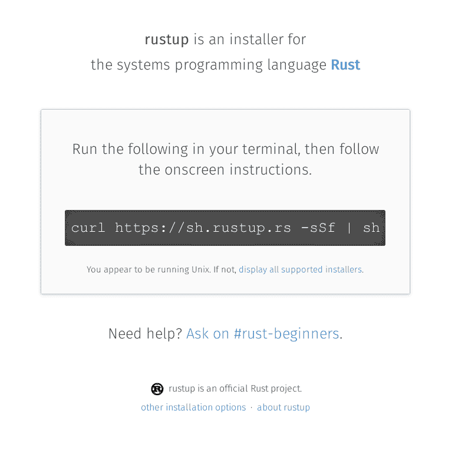
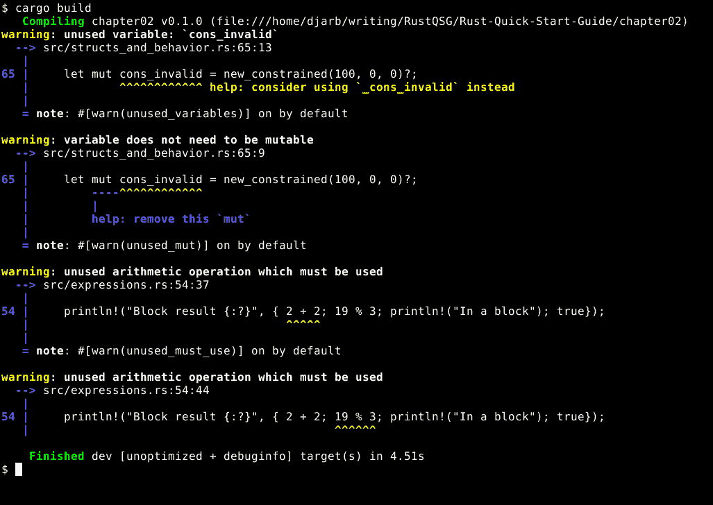

# 第一章：准备工作

在本指南中，我们将学习与 Rust 一起工作的基础知识，这是一种在过去的几年中逐渐成名的系统级编程语言。Rust 是一种严格的语言，旨在使最常见的错误成为不可能，使不太常见的错误变得明显。

作为一种系统级语言，Rust 受没有安全网的低级程序需求的指导，因为它们*正是*高级程序的安全网。操作系统内核、网络浏览器和其他关键基础设施都是系统级应用。

这并不是说 Rust 只能用于编写关键基础设施，当然不是。Rust 代码的效率和可靠性可以惠及任何程序。只是高级代码的优先级可能不同。

在本章中，我们将介绍以下主题：

+   `rustup`工具

+   `cargo`工具

+   如何开始一个新的 Rust 项目

+   如何编译 Rust 项目

+   如何定位第三方库

+   如何管理依赖项

+   如何保持 Rust 安装更新

+   如何在稳定版和 beta 版 Rust 之间切换

# 安装 Rust

在任何支持的平台上安装 Rust 都非常简单。我们只需导航到[`rustup.rs/`](https://rustup.rs/)。该页面将为我们提供一个步骤的安装命令行 Rust 编译器的程序。根据平台的不同，程序略有差异，但从不困难。这里我们看到的是 Linux 的`rustup.rs`页面：



安装程序不仅安装了 Rust 编译器，还安装了一个名为`rustup`的工具，我们可以在任何时候使用它来升级我们的编译器到最新版本。为此，我们只需打开一个命令行（或终端）窗口，并输入：`rustup update`。

升级编译器需要简单，因为 Rust 项目使用六周的快速发布计划，这意味着每六周就会有一个新的编译器版本，就像时钟一样。每个版本都包含自上次发布以来被认为稳定的所有新功能，以及之前版本的功能。

不要担心，新功能的快速发布并不意味着这些功能在发布前的六周内匆忙拼凑而成。它们在发布前通常已经经过多年的开发和测试。发布计划只是确保一旦一个功能被认为真正稳定，它就能很快进入我们的手中。

如果我们不愿意等待一个功能经过审查和稳定，无论出于什么原因，我们也可以使用`rustup`下载、安装和更新编译器的*beta*或*nightly*版本。

要下载和安装 beta 编译器，我们只需输入这个：`rustup toolchain install beta`。

从那时起，当我们使用`rustup`更新我们的编译器时，它会确保我们拥有稳定和测试版编译器的最新版本。然后我们可以使用`rustup default beta`来激活测试版编译器。

请注意，测试版编译器与下一个稳定编译器的下一个版本不是同一回事。测试版是功能在毕业到稳定之前存在的地方，功能可以在测试版中保持多年。

每晚版本最多落后于开发代码仓库 24 小时，这意味着它可能以任何方式出现错误。除非你实际上正在参与 Rust 本身的发展，否则它并不特别有用。然而，如果你想要尝试它，`rustup`也可以安装和更新它。你也可能发现自己依赖于一个依赖于仅在每晚构建中存在的特性的库，在这种情况下，你需要告诉`rustup`你也需要每晚构建。

`rustup`将安装的一个工具是名为`cargo`的工具，我们将在本章中看到很多，并在本书的其余部分幕后使用它。`cargo`工具是整个 Rust 编译系统的前端：它用于创建包含程序或库初始样板代码的新 Rust 项目目录，用于安装和管理依赖项，以及编译 Rust 程序等。

# 开始新项目

好吧，所以我们已经安装了编译器。太好了！但我们如何使用它呢？

第一步是打开一个命令行窗口，并导航到我们想要存储新项目的目录。然后我们可以使用`cargo new foo`来创建一个新程序的骨架。

当我们这样做时，`cargo`将在`foo`目录中创建一个新的目录，并在其中设置骨架程序。

默认情况下，`cargo`会创建一个可执行程序的骨架，但我们可以告诉它为我们设置一个新的库。这只需要一个额外的命令行参数（`bar`是新创建的目录的名称，就像`foo`一样）：`cargo new --lib bar`。

当我们查看新创建的`foo`目录时，我们看到一个名为`Cargo.toml`的文件和一个名为`src`的子目录。可能还会有一个 Git 版本控制仓库，我们现在可以忽略它。

# 项目元数据

`Cargo.toml`文件是存储程序元数据的地方。这包括程序名称、版本号和作者，但更重要的是，它还有一个依赖部分。编辑`[dependencies]`部分的内容是告诉 Rust 在编译我们的代码时应该链接到外部库，以及使用哪些库和版本，以及它们在哪里。外部库是一系列源代码的集合，被打包起来以便作为其他程序组件使用。通过找到并链接好的库，我们可以节省编写整个程序的时间和精力。相反，我们只需编写别人还没有做过的部分。

顺便说一句，`.toml`文件是用**Tom's Obvious, Minimal Language**（**TOML**）编写的，它是旧`.ini`格式的更定义明确和功能更完整的版本，虽然微软推广了它但从未标准化。TOML 变得越来越受欢迎，并且在各种语言和应用中被支持和使用。你可以在[`github.com/toml-lang/toml`](https://github.com/toml-lang/toml)找到语言规范。

# 来自 crates.io 的库的依赖

如果我们程序依赖的库在[`crates.io/`](https://crates.io/)上发布，我们只需将其链接代码添加到依赖部分即可。假设我们想在程序中使用**serde**（一个将 Rust 数据转换为 JSON 等格式并反向转换的工具）。首先，我们使用以下命令找到它的链接代码：`cargo search serde`。

我最初是通过浏览`crates.io`了解到**serde**的，这是一个我鼓励你也尝试的探索过程。

这将打印出一个类似以下内容的匹配列表：

```rs

     serde = "1.0.70"                          # A generic serialization/deserialization framework
     serde_json = "1.0.24"                 # A JSON serialization file format
     serde_derive_internals = "0.23.1"     # AST representation used by Serde derive macros. Unstable.
     serde_any = "0.5.0"                   # Dynamic serialization and deserialization with the format chosen at runtime
     serde_yaml = "0.7.5"                 # YAML support for Serde
     serde_bytes = "0.10.4"              # Optimized handling of `&[u8]` and `Vec<u8>` for Serde
     serde_traitobject = "0.1.0"       # Serializable trait objects.  This library enables the serialization of trait objects such…
     cargo-ssearch = "0.1.2"             # cargo-ssearch: cargo search on steroids
     serde_codegen_internals = "0.14.2"    # AST representation used by Serde codegen. Unstable.
     serde_millis = "0.1.1"                #     A serde wrapper that stores integer millisecond value for timestamps     and duration…
     ... and 458 crates more (use --limit N to see more)
```

第一个是核心`serde`库，链接代码是`#`符号之前的部分。我们只需将其复制粘贴到`Cargo.toml`文件的依赖部分，Rust 就会知道在编译我们的`foo`程序时应该编译和链接`serde`。因此，`Cargo.toml`的依赖部分将看起来像这样：

```rs
 [dependencies]
 serde = "1.0.70"
```

# 来自 Git 仓库的依赖

依赖于存储在 Git 版本控制系统中的库，无论是本地还是远程，也很容易。链接代码略有不同，但看起来像这样：

```rs
    [dependencies]
    thing = { git = "https://github.com/example/thing" }
```

我们告诉 Rust 如何找到仓库，它知道如何检出、编译并将它链接到我们的程序。仓库位置不一定是 URL；它可以是被`git`命令识别的任何仓库位置。

# 本地库的依赖

当然，我们也可以链接到存储在我们自己系统上的其他库。为此，我们只需在我们的`Cargo.toml`文件中添加一个类似这样的条目：

```rs

     [dependencies]
     example = { path = "/path/to/example" }
```

路径可以是绝对路径或相对路径。如果是相对路径，它将被解释为相对于包含我们的`Cargo.toml`文件的目录。

# 自动生成的源文件

当创建可执行程序时，`cargo`会在创建时将一个名为`main.rs`的文件添加到我们的项目中。对于一个新创建的库，它则添加`lib.rs`。在两种情况下，该文件都是整个项目的入口点。

让我们看看模板`main.rs`文件：

```rs
     fn main() {
         println!("Hello, world!");
     }
```

简单到令人难以置信，对吧？Cargo 的默认程序是经典`hello world`程序的 Rust 版本，无数新程序员在几乎每一种可想象的编程语言中都已重新实现了它。

如果我们查看一个新库的`lib.rs`文件，事情会变得更有趣：

```rs
     #[cfg(test)]
     mod tests {
         #[test]
         fn it_works() {
             assert_eq!(2 + 2, 4);
         }
     }
```

与所有可执行程序都需要一个主函数以有一个启动点不同，库的模板包括一个自动化测试框架以及一个确认`2 + 2 = 4`的单个测试。

# 编译我们的项目

编译 Rust 程序的基本命令很简单：`cargo build`。

我们需要位于包含`Cargo.toml`的目录中（或该目录的任何子目录），这样才能做到这一点，因为这是`cargo`程序知道要编译哪个项目的方式。然而，我们不需要提供任何其他信息，因为它所需的所有信息都在元数据文件中。

这里，我们看到构建`chapter02`源代码的结果：



这些警告是可以预见的，并不会阻止编译成功。如果我们仔细查看这些警告，我们可以看到 Rust 的警告比许多编程语言都要有帮助，它给我们提供了改进效率等提示，而不是仅仅谈论语言语法。

当我们构建程序时，会创建一个`Cargo.lock`文件和`target`目录。

`Cargo.lock`记录了构建项目时使用的依赖项的确切版本，这使得从不同编译的同一程序中产生可重复的结果变得容易得多。在很大程度上，可以忽略这个文件，因为`cargo`通常会处理与之相关的任何需要做的事情。

Rust 社区建议，如果你的项目是一个程序，应该将`Cargo.lock`文件添加到你的版本控制系统（例如 Git）中，但如果你的项目是一个库，则不应这样做。这是因为程序`Cargo.lock`文件存储了导致完整程序成功编译的所有版本，而库只包含部分画面，因此当分发给他人时，可能会比有帮助造成更多的困惑。

`target`目录包含所有由编译过程产生的构建工件和中间文件，以及最终的程序文件。存储中间文件允许未来的编译只处理需要处理的文件，从而加快编译过程。

我们的项目本身位于`target/debug/foo`文件中（或在 Windows 上的`target\debug\foo.exe`），如果我们想手动导航到它并运行它，可以这样做。然而，`cargo`提供了一个快捷方式：`cargo run`。

我们可以从项目的任何子目录中使用该命令，并且它会为我们找到并运行我们的程序。

此外，`cargo run`隐含着`cargo build`，这意味着如果我们自上次运行程序以来更改了源代码，`cargo run`将在运行程序之前重新编译程序。这意味着我们可以在修改代码和用`cargo run`执行它以查看其效果之间交替进行。

# 调试和发布构建

你可能已经注意到程序位于一个名为`target/debug`的目录中。这是怎么回事？默认情况下，`cargo`以调试模式构建我们的程序，这是程序员通常想要的。

这意味着生成的程序被配置为与`rust-gdb`调试程序一起工作，这样我们就可以检查其内部发生的情况，并在崩溃转储等情况下提供有用的信息，同时跳过编译器的优化阶段。优化被跳过，因为这些优化以某种方式重新排列事物，使得调试信息几乎无法理解。

然而，有时一个程序可能没有更多的错误（我们知道的情况）并且我们准备将其分发给其他人。为了构建程序的最终、优化版本，我们使用`cargo build --release`。

这将构建程序的发布版本，并将其留在`target/release/foo`中。我们可以从那里复制它，并打包它以进行分发。

# 动态库、软件分发和 Rust

在很大程度上，Rust 避免使用动态库。相反，Rust 程序的依赖项都直接链接到可执行文件中，并且只有选择性的操作系统库是动态链接的。这使得 Rust 程序比预期的要大一些，但在千兆字节的时代，几兆字节并不成问题。作为交换，Rust 程序非常便携，并且不受动态链接库版本问题的影响。

这意味着，如果一个 Rust 程序能正常工作，它几乎可以在编译时使用的任何运行大致相同操作系统和架构的计算机上运行，没有任何麻烦。你可以将 Rust 程序的发布版本压缩，然后有信心地将其通过电子邮件发送给其他人，他们不会有任何问题运行它。

这并没有完全消除外部依赖。例如，如果你的程序是一个客户端，它连接的服务器需要可用。然而，它确实大大简化了整个打包和分发过程。

# 使用 crates.io

我们之前看到了`cargo search`，它允许我们从命令行快速轻松地找到第三方库，以便我们可以将它们链接到我们的程序中。这非常有用，但有时我们需要的不仅仅是它提供的信息。当我们确切知道我们想要哪个库，并且只需要快速参考链接代码时，它最有用。

当我们**不知道**自己确切想要什么时，通常最好使用网页浏览器浏览[`crates.io/`](https://crates.io/)并寻找选项。

当我们在网页浏览器中找到一个有趣或有用的库时，我们会得到以下信息：

+   链接代码

+   简介信息

+   文档

+   人气统计

+   版本历史

+   许可信息

+   库的网站链接

+   源代码链接

这更丰富的信息有助于确定哪个库或哪些库最适合我们的项目。选择最适合工作的库最终可以节省大量时间，因此`crates.io`的网页界面非常出色。

`crates.io`的前页展示了新的和受欢迎的库，以多种方式划分，这些可以是有趣和有用的探索对象。然而，主要价值在于搜索框。使用搜索框，我们通常可以找到任何可能需要的库的几个候选者。

# 摘要

因此，现在我们知道了如何安装 Rust 编译器，设置 Rust 项目，查找和链接有用的第三方库，并将源代码编译成可用的程序。我们还简要了解了`cargo`在为我们设置新程序或库项目时生成的样板代码。我们学习了调试构建和发布构建之间的区别，并快速浏览了将 Rust 程序分发给用户所涉及的内容。

在第二章“Rust 语言基础”中，我们将开始研究 Rust 编程语言本身，而不是围绕它的支持设施。我们将了解语言的结构和一些最重要的命令。
