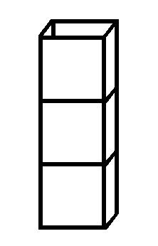
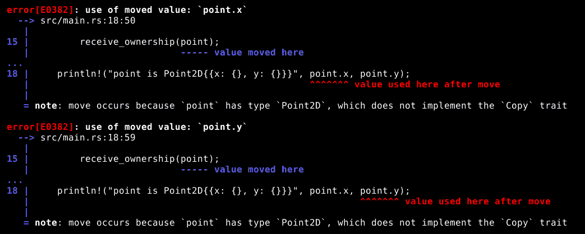
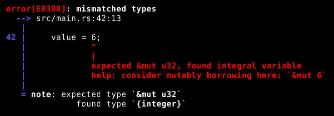
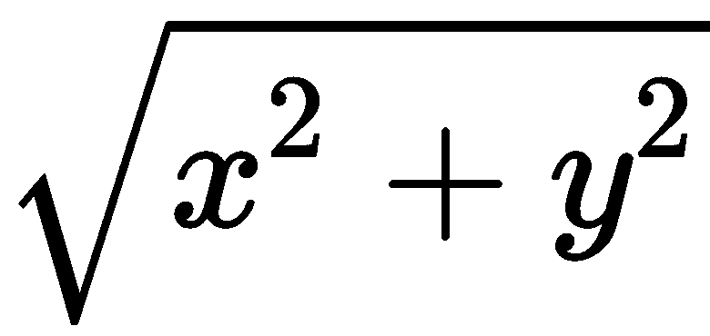

# 大概念——所有权和借用

所有权和借用是使 Rust 与其他编程语言区分开来的特性。你可能会找到最接近的等效物是 C++中常见的**资源获取即初始化**（**RAII**）设计模式，但那是一个设计模式，不是一个语言特性，并且并不完全类似。

在本章中，我们将讨论以下内容：

+   值的所有权和变量的作用域

+   作用域之间所有权转移的方式

+   借用和借出数据值，以及这与所有权如何交互

+   借用值的生命周期

+   函数的`self`参数，以及借用或不借用它的含义

# 作用域和所有权

在 Rust 中，每个数据值都有一个单一的所有作用域——不多也不少。那么，什么是作用域呢？简单的答案是，作用域是块表达式存储其变量的地方。作用域在源代码中不是直接表示的，但作用域从块表达式开始时开始，以`{`符号为标志，并在块表达式结束时结束，以`}`（或当在块达到其结束之前运行`return`语句时）。作用域是存储块变量的内存块。

*每个*数据值都有一个所有作用域，包括像`2 + 2`这样的隐式临时值，当我们要求 Rust 计算`(2 + 2) * 3`时。

当 Rust 完成一个作用域后，该作用域拥有的所有数据值都会被丢弃，用于存储它们的内存也会被释放出来供其他用途使用。这包括在**堆**上分配的内存，我们将在第六章中学习如何使用它，*堆内存和智能指针*。

从值创建到其拥有作用域完成之间的时间称为值的**生命周期**。

# 栈

与大多数编程语言一样，Rust 使用**栈**来处理作用域的内存管理。栈是一种简单的数据结构，也被称为**后进先出队列**或**LIFO**。栈支持两种操作：**push**，用于存储新值，和`pop`*，*用于移除并返回最近存储的值。

我们可以将栈想象成一堆盒子。如果我们想取出顶部盒子中存储的东西，我们只需将其取下并查看里面的内容。然而，如果我们想取出下面某个盒子中存储的东西，我们首先必须移除上面的盒子。以下是我所描述内容的示意图，其中下面的盒子被上面的盒子阻挡，无法访问：



当 Rust 块表达式开始时，它会记录栈的高度，当块结束时，它会从栈中移除东西，直到栈的高度与开始时相同。在中间，当块需要存储新值时，它会将那个值推入栈中。

当一个值从栈中移除时，Rust 编译器还会确保在丢弃值之前进行任何必要的清理，包括如果定义了自定义清理函数，则调用该值的自定义清理函数。

大多数编程语言都会这样做，但并非全部。在 Rust 中，即使数据值使用堆内存，它也会在栈上表示并由所有权规则控制。通过遵循这个简单的程序，Rust 可以高效地处理程序的记录保存和内存管理，而且不需要垃圾回收。

垃圾回收是许多编程语言中用来减轻程序员内存管理负担的一种机制。它甚至比 Rust 的方法更容易使用，但它确实需要时间来运行垃圾回收机制，这可能会影响程序性能。Rust 的方法在编译时几乎完全是确定性的：Rust 编译器知道何时分配和释放内存，而无需在程序运行时进行推断。

# 转移所有权

将值的所有权转移到不同作用域是可能的（并且很常见）。例如，我们可以这样做：

```rs
{
    let main_1 = Point2D {x: 10.0, y: 10.0};
    receive_ownership(main_1);
    receive_ownership(main_1); // This will cause a compiler error!
}
```

正在发生的是，`main_1` 变量在当前作用域（值被推入栈）的所有权下创建和初始化，但当值作为函数参数使用时，所有权就转移到了构成 `receive_ownership` 函数体代码块的作用域。编译器知道当前作用域不再负责清理存储在 `main_1` 中的值，因为这项工作现在属于不同的作用域。

表示栈上值的字节被复制到栈上的新位置，在接收所有权的范围内。然而，大多数数据值将它们的一些信息存储在栈外，因此，在旧作用域中留下的字节被认为不再有意义或安全使用。

如果我们尝试在将 `main_1` 移动到不同作用域之后使用其存储的值，就像我们在对 `receive_ownership` 的第二次调用中所做的那样，编译器将报告错误。不仅仅是将值用作函数参数会导致错误，任何对已移动值的任何使用都是错误。它不再存在以供使用。

所有权也可以向相反的方向转移。这个函数接收其参数的所有权，但随后将参数（以及所有权）返回到调用它的代码块：

```rs
pub fn receive_ownership(point: Point2D) -> Point2D {
    println!("Point2D{{x: {}, y: {}}} is now owned by a new scope", point.x, point.y);
    return point;
}
```

这并不意味着原始变量（`main_1`）再次变得可使用，但如果我们将函数的返回值赋给一个变量，我们就可以通过这个新变量继续使用这个值。

所有权也可以通过将值赋给不同的变量“横向”转移。我们做类似这样的事情：

```rs
let mut main_4 = main_2;
```

在这里，存储在`main_2`中的值被移动到`main_4`。在这个基本示例中，这并不特别有趣；我们只是得到了一个新变量，它包含旧变量曾经包含的值，而且它们都在同一个作用域内。当我们像将值赋给结构体成员那样做事情时，这会更有趣，尤其是当结构体具有不同的生命周期时。

Rust 的编译器对所有权非常小心，当它检测到所有权没有得到适当尊重的情况，或者甚至可能没有得到适当尊重的情况时，它会报告错误。以下函数将无法编译，因为它仅在`switch`参数为`false`时有效：

```rs
pub fn uncertain_ownership(switch: bool) {
    let point = Point2D {x: 3.0, y: 3.0};

    if switch {
        receive_ownership(point);
    }

    println!("point is Point2D{{x: {}, y: {}}}", point.x, point.y);
}
```

当我们尝试编译`uncertain_ownership`函数时，编译器会输出如下信息：



对于编译器而言，如果我们能够在使用它之前移动该值，我们就无法使用它。

# 复制

在本章“转移所有权”部分的末尾讨论的编译器错误中，我们看到编译器指出数据值被移动，因为它没有实现`Copy`特质，这很有趣。这意味着什么呢？

对于某些数据类型，尤其是像整数和浮点数这样的原始类型，复制表示它们的栈上的字节就足以实际上制作一个完整的工作副本。换句话说，它们的表示不引用内存中存储的其他任何内容，也不依赖于所有权来保持一切正确。

标准库中有许多数据类型在内存使用方面可以具有`Copy`特质，但利用所有权来保持其他事物的安全性和正确性。例如，表示对文件或网络套接字等外部资源访问的数据类型，以及与并发有关的数据类型。所有权已经证明比最初预期的更强大的工具。

完全不依赖所有权的那些数据类型被称为具有`Copy`特质。我们将在第八章，“重要标准特质”中看到如何声明我们的数据类型具有`Copy`特质。

当一个值的数据类型具有`Copy`特质时，Rust 在转移值时不会移动该值。接收者仍然接收该值，但旧值仍然有效。而不是移动，值已经被复制。这个函数的结构几乎与`uncertain_ownership`函数完全相同，后者拒绝编译：

```rs
pub fn copied_ownership(switch: bool) {
    let local = 4.0;

    if switch {
        receive_ownership(Point2D {x: local, y: 4.0});
    }

    println!("x is {}", x);
}
```

这里重要的区别是`local`包含一个浮点值，而浮点数据类型具有 Copy trait，这意味着尽管`local`的值被放置在`Point2D`结构体内部，并且该结构体随后被移动到`receive_ownership`函数的作用域中，`local`在当前作用域中仍然有效。这是因为`local`的值并没有被移动到`Point2D`中。它是被复制的。

我们使用结构初始化器来分配`local`的值，而不是使用`=`符号，这并不会造成任何区别。无论是哪种方式，它都是一个赋值操作，并且无论是哪种方式，数据类型的 Copy trait 都会决定赋值是复制还是移动。

# 借贷

我们还可以通过**借贷**的方式将信息发送到不同的作用域。当我们移动一个数据值时，接收的作用域成为该值的新所有者。当我们复制一个数据值时，接收的作用域拥有它接收的副本，而发送的作用域保留对原始值的所有权。当我们借贷一个数据值时，事情可能会变得更加复杂，因为原始作用域保留了所有权，但接收的作用域仍然可以访问数据。

原始作用域仍然拥有数据，这意味着当该作用域结束时，数据将会消失。如果在那时作用域中包含的一些数据仍然借给了不同的作用域，程序可能会崩溃，由于 Rust 编译器讨厌潜在的崩溃，它不允许我们陷入那种情况。相反，它要求在拥有作用域的时间结束之前，必须返回任何借用的信息。

当一个数据值被借用时，该值既没有被复制也没有被移动。表示该值在栈上的字节仍然保持在原来的位置。相反，借用人接收这些字节在栈上的内存地址，这使得它可以违反栈的概念性想法，通过访问存储在顶部以下的信息，可能在完全不同的作用域中。你可以看到为什么编译器想要对此小心谨慎！

当前借用的数据值不能被所有者更改，即使数据值存储在一个可变变量中。这是防止借贷引起问题的部分：数据值最多只能在一个地方更改一次，并且当它*可以*更改时，它永远不会在其他地方被使用。

# 不可变借贷

在借贷时，默认情况下是进行不可变借贷，这意味着借用的数据可以读取，但不能更改。我们可以同时向多个借用人进行不可变借贷，这是安全的，因为它们中没有人可以更改借用的数据，因此它们不能通过意外更改数据值来相互干扰。

要创建一个不可变借用，我们需要在产生数据值的表达式前加上`&`，如下所示：

```rs
borrow_ownership(&main_3);
```

在这里，我们调用一个名为`borrow_ownership`的函数，并向它传递从`main_3`变量借用的数据值。

# 可变借贷

有时，我们希望借出一个数据值并允许接收者修改它，以便在借用结束后，拥有作用域中的数据值已发生变化。当我们需要这样做时，我们以**可变**的方式借出数据。

我们只能在借出的数据值存储在可变变量中时才能以可变方式借出，这意味着我们在声明变量时使用了`mut`关键字，如下所示：

```rs
let mut main_4 = main_2;
```

由于我们有一个可变变量可以借出，我们可以通过使用`mut`关键字**再次**，在不同的上下文中创建该变量值的可变借用：

```rs
borrow_ownership_mutably(&mut main_4);
```

如果有一个数据值的可变借用，则无法为其创建另一个借用（无论是哪种类型），如果存在任何不可变借用，则创建可变借用是不可能的。这条规则意味着如果一个数据值是可变借用的，那么它不会在其他任何地方被借用。结合我们之前讨论的规则，该规则防止借用数据被其实际所有者更改，这意味着只要存在一个活动的可变借用，那么这个借用就是修改借用数据值的唯一方式。

然而，一旦借用结束，所有者就会重新获得对（可能已修改的）数据值的控制权。

# 访问借用数据

要接收借用数据，我们需要正确指定数据类型作为借用。这是通过在接收端使用`&`或`&mut`与数据类型一起完成的，就像我们在发送端使用数据值一样。

虽然*Rust*中常用术语*借用*，但技术术语是**引用**。因此，我们通常会说我正在借用数据，使用借用数据，或者一个数据值作为借用被访问，但我们也可以说我们在引用数据，使用引用数据，或者一个数据值通过引用被访问。

在这里，我们有两个函数的定义，与我们在之前的示例中使用的相同两个函数。看看每个函数中为`point`参数指定的数据类型：

```rs
pub fn borrow_ownership(point: &Point2D) {
    println!("Point2D{{x: {}, y: {}}} is now borrowed by a new scope", point.x, point.y);
}

pub fn borrow_ownership_mutably(point: &mut Point2D) {
    println!("Point2D{{x: {}, y: {}}} is now borrowed by a new scope", point.x, point.y);
    point.x = 13.5;
    println!("Borrowed value changed to Point2D{{x: {}, y: {}}}", point.x, point.y);
}
```

作为借用或可变借用是参数数据类型的一部分。这意味着编译器知道传递给参数的值必须是一个借用，并且会拒绝编译尝试将非借用值传递给函数的代码。

大多数时候，使用借用值和使用非借用值相同，正如我们可以在这些函数中看到的那样。它们与`point`交互，就像它是一个局部拥有的变量一样。

然而，那是因为编译器很聪明。事实是，借用是一个数据值的内存地址，而不是数据值本身（这是存储在内存**中**的字节）。大多数时候，编译器可以弄清楚它需要采取额外的步骤，查找局部变量中的地址，然后在那个地址的内存中查找数据，而不是只在局部变量中查找数据。

这个过程被称为**解引用**。*由于某种原因，没有人说**还借**。

有时候编译器无法确定我们想要解引用并自动处理它。在这些情况下，我们可以使用`*`符号手动解引用一个借用值。

这种情况最常见的地方是在对借用值进行赋值时。如果借用值是一个结构体或者具有内部数据的某种东西，我们可以毫无问题地对内部数据进行赋值，但当我们想要对一个借用变量赋予一个全新的值时，我们需要使用解引用。

这段代码试图像它不是一个借用一样对值进行赋值：

```rs
pub fn set_to_six(value: &mut u32) {
    value = 6;
}
```

我们看到`value`是一个 32 位无符号整数的可变借用。当我们尝试直接对该变量进行赋值时，编译器会告诉我们这一点：



这里发生的情况是，编译器无法区分**我想将这个值赋给内存中引用位置存储的内容**和**我想让这个引用变量指向不同的内存位置**。它需要假设其中之一，并让我们告诉它如果我们想要另一个，它选择的假设是第二个。

将这个变量**赋予一个新值**作为默认值是有意义的，因为在任何其他情况下，`=`都代表这个意思。处理借用数据是一个特殊情况，而不是默认情况。

编译器在这里给出的建议也是基于这样的假设：我们想要的是`value`指向一个新的内存地址，这意味着如果我们盲目地遵循它，编译器错误会消失，但程序不会做我们想要的事情。它不会在借用变量中存储数字 6，而是会将`value`变量设置为包含一个新的借用。

我们真正想要做的是这样：

```rs
pub fn set_to_six(value: &mut u32) {
    *value = 6;
}
```

这告诉编译器，我们不是要**对`value`进行赋值**，而是要通过`value`对最初借用的变量进行赋值。

`*`符号可以用来读取和写入借用值，即使不是严格必需的，如果我们想明确表示也可以使用。

尽管解引用和乘法使用的是相同的符号，但编译器永远不会将它们混淆。乘法在借用上不是一个有效的操作，而解引用在数字上也不是一个有效的操作。此外，乘法总是需要在`*`的两侧都有数据值，而解引用只需要在一边有数据值。在这两块信息之间，编译器有足够的信息知道我们要求的是哪种操作。

# 借用数据的生命周期

借用不能比它们借用的数据值存在的时间更长。Rust 编译器必须确保程序中没有任何部分允许这种情况发生，这意味着它必须跟踪每个借用的**生命周期**。在我们迄今为止看到的例子中，这很简单，因为每个借用都是在调用函数时创建的，并在函数返回时结束，而借用的值则一直存活到包含函数调用的代码块表达式结束。

借用的生命周期显然比变量的生命周期短，开始得晚，结束得早。

然而，创建需要我们向编译器提供有关借用存在时间或借用值有效时间提示的情况并不困难。我们之前已经见过一次，当时我们在`Result`中将`&'static str`用作错误类型。正如我们所知，这是一个对`str`的不可变引用，但还有那个`'static`部分需要理解。

当我们在`&`符号后面写上`'static`或`'a`时，我们是在告诉 Rust 那个引用的生命周期有一个名字，它通过所有生命周期名称都以`'`符号开头来识别。如果我们说一个借用的生命周期被命名为`'a`，那么我们可以在其他地方使用那个名字来描述该生命周期与其他借用生命周期的关系。

静态生命周期是特殊的，因为它用于始终可用的数据值，只要程序在运行，例如我们在之前的示例中用作错误信息的字符串常量。

当我们定义函数时，给生命周期命名最有用，因为我们不知道将要填充到函数参数变量中的数据值是什么。如果其中一些参数是借用，我们需要能够告诉 Rust 我们对这些借用生命周期的期望，以便它可以确保调用我们的函数的代码是正确进行的。

这里有一个 Rust 无法安全编译的函数，因为它需要比我们告诉它的更多关于生命周期的信息（尚未告知）：

```rs
pub fn smaller_x(value1: &Point2D, value2: &Point2D) -> &f64 {
    if value1.x < value2.x {
        &value1.x
    }
    else {
        &value2.x
    }
}
```

这里的问题是，在这个函数中我们接收了两个借用参数，每个参数可能具有不同的生命周期，并且返回另一个借用值。不幸的是，Rust 编译器不知道返回值将借用哪个参数或其生命周期是什么，因此它无法正确检查调用我们的`smaller_x`函数时该值的用法。由于它无法确定一切是否正确，编译器简单地拒绝尝试。

我们可以通过添加生命周期注解来修复这个问题：

```rs
pub fn smaller_x<'a>(value1: &'a Point2D, value2: &'a Point2D) -> &'a f64 {
    if value1.x < value2.x {
        &value1.x
    }
    else {
        &value2.x
    }
}
```

我们在这里使用名称`'a`来表示所有三个借用值的生命周期，并且还在`<`和`>`之间、函数名称和参数列表之间放置了`'a`。`<`和`>`标记了函数的**泛型参数**列表的开始和结束，我们将在第七章中更详细地讨论，*泛型类型*。现在，重要的是我们要告诉 Rust 存在一个生命周期，它等于或短于`value1`和`value2`的实际生命周期，称为`'a`，并且返回值可以在那个`'a`生命周期内安全使用。

指定一个生命周期名称**永远不会**改变借用实际的周期。如果`value1`和`value2`有不同的生命周期，在这里为它们指定`'a`不会使其中一个持续更长，也不会缩短另一个的范围。当应用于参数时，生命周期名称告诉 Rust 该命名生命周期必须与该参数**兼容**，这意味着该命名生命周期必须完全包含在参数的实际生命周期内。然后，当我们为返回值的生命周期使用相同的名称时，我们告诉 Rust 返回值将只保证在相同的限制内有效——在这种情况下，当**两个**参数仍然有效时。

Rust 使用这个保证来检查调用代码。如果我们尝试这样做，Rust 编译器会拒绝，因为我们试图以可能不正确的方式使用返回值，而 Rust 不处理可能的情况：

```rs
let main_4 = Point2D {x: 25.0, y: 25.0};
let smaller;
{
    let main_5 = Point2D {x: 50.0, y: 50.0};
    smaller = smaller_x(&main_4, &main_5);
}
println!("The smaller x is {}", smaller);
```

这是一个在`{`和`}`之间的块表达式，就像我们在第二章中看到的，*Rust 语言基础*，这意味着它有自己的作用域，它拥有`main_5`变量。这意味着当我们创建`main_5`的借用时，它的生命周期比`main_4`变量的借用短。Rust 查看`smaller_x`函数的定义，看到返回值只在`main_4`和`main_5`的生命周期内保证有效，因此尝试在块表达式结束后使用它会产生编译器错误。

这即使实际上`main_4`包含了`smaller_x`，也是一个编译器错误，因此返回值是当我们到达打印命令时仍然有效的值的借用。Rust 在检查生命周期时不会分析函数的逻辑，它只是查看我们告诉它的关于参数和返回的信息。

这是一件好事。在这种情况下，检查用于参数的值，认识到它们是始终产生相同行为的常量值，并逻辑推理出返回的借用的生命周期等于第一个参数的生命周期是可能的。然而，通常情况下，这种推理是不可能的（如果第一个参数是用户输入的怎么办？），尝试这样做只会造成问题。想象一下改变一个变量值的来源，突然在程序的其他某个不应该关心的部分出现编译错误！将这些事情作为函数接口的实体部分会更好。

# 所有权和 `self` 参数

如我们之前所见，当我们为类型实现行为时，我们定义的函数以 `self`、`&self` 或 `&mut self` 作为第一个参数。我们现在已经足够了解，这意味着 `self` 要么被移动（或复制）到函数的作用域中，要么被借用，或者可变借用。我们选择使用哪一种可能会有一些相当重要的后果。

`self` 的数据类型是隐式的：它必须是我们在其上实现函数的数据类型，因此，我们无法在参数列表中将数据类型指定为 `self`。由于没有数据类型可以前缀 `&` 或 `&mut`，我们可以在 `self` 前写它们。

在所有三种情况下，`self` 指的是 *通过该函数被调用的数据值*。如果我们有一个名为 `x` 的 `u32` 变量，并告诉 Rust 执行 `x.pow(3)`，为 `u32` 实现的 `pow` 函数将接收 *两个* 参数：`x` 的值作为 `self`，以及 `3` 作为第二个参数。

移动、借用和可变借用 `self` 值的规则与应用于任何其他值的规则相同。如果我们当前有任何值的借用，我们无法将其可变借用到 `self` 中，也不能移动它（因为这会使得现有的借用无效）。如果我们当前有值的可变借用，我们无法借用它或将其移动到 `self` 中，因为可变借用不允许其他人借用或更改值。同样，将借用放入函数的 `self` 影响我们在其他地方访问数据的方式，因为这是一个借用，并且有关借用共存的规则。

# 移动 `self`

如果 `self` 值被移动到函数中，它就像移动任何其他值一样；我们不能再在它原来的地方使用它了。这里有一个函数：

```rs
impl Point2D {
    pub fn transpose(self) -> Point2D {
        return Point2D {x: self.y, y: self.x};
    }
}
```

这可以被认为是 *消耗* `self` 值。当它被调用时，值被移动到函数的作用域中，而原来包含该值的旧变量就不再可用了。这个特定的函数返回一个新的不同的 `Point2D` 值，所以一旦这个函数运行完毕，`self` 的值就完全消失了。

有一些原因可能正是我们想要的这种行为。在前面的例子中，函数将`self`值转换成新的东西，这体现在它消耗了旧值。

函数消耗`self`的一个非常常见的用途是**构建器模式**。这是 Rust 中的一个设计模式，我们通过填充一个构建器结构中的值来逐步构建复杂的数据结构，然后调用在构建器结构上实现的构建函数来构建最终的数据值。大多数时候，构建函数会消耗其`self`，因为每个构建器值应该只用来构建一个最终值。

构建器模式本质上是一种使用 Rust 语法来实现某些其他语言中通过关键字参数和默认值实现相同功能的方法。

任何时候`self`的值会因为函数的操作而被无效化，无论是字面意义上的还是概念上的，将`self`移动到函数的作用域内都是有意义的。

# 借用`self`

如果将`self`值不可变借用到一个函数中，那么该函数只能对该值进行只读访问。这在许多情况下很有用，因为它允许我们调用该函数而不需要为它复制`self`值，也不需要编译器确保写入访问规则得到维护。

这里是一个示例函数，它不可变地借用了`self`：

```rs
impl Point2D {
    // ...
    pub fn magnitude(&self) -> f64 {
        return (self.x.powi(2) + self.y.powi(2)).sqrt();
    }
}
```

此函数返回，换句话说，是存储在`self`中的点与坐标系原点之间的距离。

`magnitude`函数不需要改变`self`，因此没有必要使用可变借用并处理由此产生的限制。它可以用移动的`self`工作，但两次在同一个值上调用`magnitude`函数并没有什么问题，所以这也不是我们想要的。

使用不可变借用`self`通常是正确的选择。我们需要一个使用`self`或`&mut self`的理由，如果没有这样的理由，我们就使用`&self`。

# 可变借用`self`

有时候，一个函数需要改变它的`self`。对于这些情况，我们可以通过`&mut self`接收`self`作为可变借用。就像我们创建任何其他可变借用一样，我们只能调用这样的函数，如果我们有一个存储在可变变量中的`self`值，并且该值目前没有被其他地方借用。换句话说，我们只能在 ourselves 有写入访问权时调用具有写入访问权的函数。

这里，我们有一个示例函数，它可变地借用了`self`：

```rs
impl Point2D {
    // ...
    pub fn unit(&mut self) {
        let mag = self.magnitude();
        self.x = self.x / mag;
        self.y = self.y / mag;
    }
}
```

我们在这里看到了几个方面。首先，我们能够在`self`上调用只读的`magnitude`函数，尽管该函数接受一个不可变的`self`借用，而我们得到了一个可变的`self`借用。反之则不成立：如果我们试图在`magnitude`函数内部调用`unit`函数，编译器会拒绝允许这样做。

第二，由于我们有对`self`的写入访问权限，我们可以更改其中存储的数据。这就是写入访问的含义。

第三，我们为这个函数没有指定返回类型。技术上，它默认返回`()`，但这只是另一种说法，表示它没有返回任何有意义的内容。对于需要改变`self`的函数，不返回值或返回一个带有`()`作为成功值的`Result`是常见的做法，如果函数需要报告错误的能力。这是因为函数的真正结果是更新后的`self`值。

# 摘要

所有权是 Rust 与其他编程语言最显著的区别。一开始这个想法似乎很显然，然后出人意料地复杂，最后变得强大且有用。所有权为 Rust 提供了几乎免费的自动内存管理，以及诸如安全且易于多线程和并发等特性，以及通常能够在编译器中比其他语言发现更多错误的能力。

借用利用所有权来创建其他语言中最大的问题点之一的安全版本：通过内存地址访问数据。与内存地址相关的错误是程序遇到的最常见问题之一，在 Rust 中，这些错误会被编译器捕获，并附带有关如何解决它们的 helpful hints。

在本章中，我们还探讨了如何根据数据类型是否移动、借用或可变借用其`self`值来实现消耗性、只读或读写函数，并讨论了编译器在各种情况下可能报告的各种错误。

在下一章，我们将学习如何使用数据类型上的模式匹配来做出决策。
