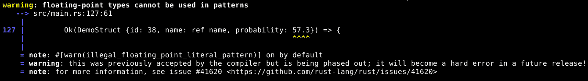
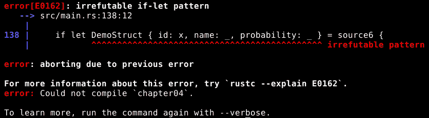

# 通过模式匹配进行决策

我们已经看到了 Rust 的`if`表达式，但那些是基于数据值进行决策的。Rust 是一种非常注重类型的语言，因此能够基于数据类型进行决策也非常重要。Rust 的`match`和`if let`表达式允许我们这样做，比较复杂的数据类型，并允许我们从匹配的模式中提取数据值以进行进一步处理。

在本章中，我们将做以下事情：

+   学习如何在`let`语句的上下文中使用模式匹配进行变量赋值

+   将我们关于模式匹配的知识应用到使用`if let`表达式进行决策中

+   使用`match`表达式来选择众多可能模式中的确切一个

+   在模式匹配中使用无关紧要的值

+   看看借用如何与模式匹配交互

+   学习如何匹配复杂、嵌套的数据结构

# 使用模式匹配进行变量赋值

我们已经多次看到如何在 Rust 中分配变量：我们做类似`let x = y;`的事情，这告诉 Rust 创建一个名为`x`的新变量，并将存储在`y`中的值移动或复制到它里面，具体取决于数据类型。

然而，这实际上只是 Rust 真正所做事情的一个简化案例，即匹配一个模式到一个值，并从匹配的模式中提取数据值以存储在目标变量中，如下例所示：

```rs
pub struct DemoStruct {
 pub id: u64,
 pub name: String,
 pub probability: f64,
}
// ...
let source1 = DemoStruct { id: 31, name: String::from("Example Thing"), probability: 0.42 };

let DemoStruct{ id: x, name: y, probability: z } = source1;
```

好吧，刚才发生了什么？首先，我们有一个结构定义。我们之前见过这些，这里唯一的新东西就是我们正在使用`String`数据类型。

`String`与`str`有一个有趣的关系。当我们使用`str`时，我们几乎总是实际上使用一个借用，比如`&str`或`&'static str`，而不是普通的`str`。这是因为普通的`str`在栈中没有固定的大小，这使得我们想要做的许多事情都无法编译。因此，我们使用`&str`，它确实有一个固定的大小。但是，使用引用作为数据结构中的包含值也打开了基于生命周期的所有 sorts 的限制，所以我们并不真的想在这里使用`pub name: &str`。幸运的是，我们可以使用`String`代替。当需要时，`String`可以伪装成`&str`，但它实际上不是一个借用，所以所有权是直接的。然而，使用`String`稍微低效一些，所以一般规则是当`String`解决问题时使用它，其余时间使用`&str`。

然后，我们使用`DemoStruct`类型创建一个新的数据值，包含其三个包含值。我们也见过这种情况。

在示例的最后一行我们究竟在做什么？`DemoStruct{ id: x, name: y, probability: z }`是一个模式。我们正在告诉 Rust 我们期望分配的值是一个`DemoStruct`，并且它的包含值应该依次与`x`、`y`和`z`子模式匹配。

当我们使用变量名作为模式时，它会匹配任何值，并将该值分配给该名称，这正是这里发生的事情。这也是简单的 `let x = 5` 发生的事情。因此，`x`、`y` 和 `z` 最终成为包含之前存储在 `source.id`、`source.name` 和 `source.probability` 中的值的新的变量。

虽然我们不需要为子模式使用变量名。例如，我们可以尝试这样做：

```rs
DemoStruct{ id: 31, name: y, probability: z } = source1;
```

然而，如果我们这样做，编译器将报告一个错误。错误不是因为 `31` 是一个无效的模式。这是一个非常好的模式，并且恰好匹配我们实际上会找到的值。不过，编译器会拒绝编译它，因为它没有匹配源值的所有可能性，而 Rust 不允许可能因为变量值改变而失败的 `let` 语句。想象一下这可能会造成多大的麻烦！

Rust 编译器将模式匹配时能够处理所有可能性称为 **覆盖**。

对于可能匹配或不匹配输入值的模式，我们可以使用 `if let` 表达式。

# 使用 `if let` 表达式来测试模式是否匹配

使用模式匹配将值解包到多个变量中可能很有用，但使用模式匹配来做决策才是这个功能真正发光的地方，如下面的例子所示：

```rs
let source2 = DemoStruct { id: 35, name: String::from("Another Thing"), probability: 0.42 };
let source3 = DemoStruct { id: 63, name: String::from("Super Thing"), probability: 0.99 };

if let DemoStruct { id: 63, name: y, probability: z } = source2 {
    println!("When id is 63, name is {} and probability is {}", y, z);
}

if let DemoStruct { id: 63, name: y, probability: z } = source3 {
    println!("When id is 63, name is {} and probability is {}", y, z);
}
```

在这里，我们定义了包含 `DemoStruct` 值的两个更多变量，然后使用模式匹配将它们拆分开来，并将它们的值分配给单独的变量。不过，这次我们在 `if let` 表达式中而不是在 `let` 表达式中这样做。这有很大的不同，因为现在模式不需要覆盖所有可能的输入值域。如果模式匹配成功，`if let` 表达式就会运行其块中的代码。如果模式不匹配，那么 `if let` 表达式就不会运行代码。它是条件性的。

由于模式不需要覆盖整个域，这意味着我们可以使用 `63` 作为模式来匹配 `id` 值，这没有什么问题。同样的原则适用于更复杂的模式或任何只匹配可能由其匹配的数据类型表示的值的子集的模式。

我们可以将 `if let` 与正常的 `if` 和 `else` 表达式结合，以创建更复杂的决策结构，有几种方法可以实现。

首先，我们可以在 `if`、`else if` 或 `else` 表达式的块中放置一个 `if let` 表达式，反之亦然。这是自然而然的，因为那些块表达式没有什么不寻常的地方——并没有因为它们在条件表达式中而被放置特殊的限制。

其次，我们可以将 `if let` 或 `else if let` 与 `if`、`else if` 和 `else` 结合到同一个选项链中。这看起来是这样的：

```rs
    if false {
 println!("This never happens");
 }
 else if let DemoStruct{ id: 35, name: y, probability: z } = source4 {
 println!("When id is 35, name is {} and probability is {}", y, z);
 }
 else if let DemoStruct{ id: 36, name: y, probability: z } = source4 {
 println!("When id is 36, name is {} and probability is {}", y, z);
 }
 else {
 println!("None of the conditions matched");
 }
```

链必须以`if`或`if let`表达式（ whichever one we need）开始，然后可以有任意数量的`else if`或`else if let`，最后是一个我们需要的`else if`表达式。

尽管如此，我们仍然只是使用模式匹配从我们的结构中提取数据值。当模式与其他数据类型匹配时，我们可以做更多的事情。一个重要的是我们之前讨论过的`Result`数据类型。记住，`Result`可以是`Ok`或`Err`，无论哪种方式，它都包含一个值，要么是结果值，要么是某种错误值。我们之前看到如何使用`?`或各种函数来处理`Result`，但我们也可以使用模式匹配来处理它，这通常是我们选择的方式。

因此，这里有一个函数为我们构建`DemoStruct`值，但它只在我们请求的`id`值是偶数（除以二的余数为零）时才这样做。这个函数给我们一个包含创建的`DemoStruct`值或错误信息的`Result`：

```rs
pub fn might_fail(id: u64) -> Result<DemoStruct, &'static str> {
    if id % 2 == 0 {
     Ok(DemoStruct { id: id, name: String::from("An Even Thing"), probability: 0.2})
 }
 else {
 Err("Only even numbers are allowed")
 }
}
```

如果我们调用该函数，我们可以使用模式匹配来确定它是否成功或失败：

```rs
    if let Ok(x) = might_fail(37) {
        println!("Odd succeeded, name is {}", x.name);
    }

    if let Ok(x) = might_fail(38) {
        println!("Even succeeded, name is {}", x.name);
    }
```

在这里，我们两次调用`might_fail`，一次使用奇数作为参数值，一次使用偶数。两次都使用模式匹配来检查结果是否为`Ok`，如果是，就将包含的值赋给一个名为`x`的变量。

`Ok`不是一个数据结构，`Err`也不是。我们将在下一章中了解更多关于它们的信息。现在重要的是，模式匹配给我们提供了一个简单的方法来检查`Result`是否表示成功或失败，并且可以轻松地处理一个或两个情况。

# 使用`match`选择多个模式之一

你可能已经注意到，在我们的前一个例子中，我们没有处理函数返回错误值的情况。部分原因是使用`if let`处理这种情况有点尴尬。我们可以这样做：

```rs
if let Ok(x) = might_fail(39) {
    println!("Odd succeeded, name is {}", x.name);
}
else if let Err(x) = might_fail(39) {
    println!("Odd failed, message is '{}'", x);
}
```

但这样会不必要地运行函数两次，所以这是低效的。我们可以通过这样做来修复它：

```rs
let result = might_fail(39);
if let Ok(x) = result {
    println!("Odd succeeded, name is {}", x.name);
}
else if let Err(x) = result {
    println!("Odd failed, message is '{}'", x);
}
```

这样更好，但变量是用来存储信息的，一旦我们检查了函数的成功或失败，就不再需要`result`值了，所以没有必要继续存储它。

我们可以使用`match`表达式来处理这种情况，以获得最佳结果：

```rs
match might_fail(39) {
    Ok(x) => { println!("Odd succeeded, name is {}", x.name) }
    Err(x) => { println!("Odd failed, message is '{}'", x) }
}
```

`match`表达式会将单个值（在这种情况下，调用`might_fail(39)`的结果）与多个模式进行匹配，直到找到一个成功匹配该值的模式，然后运行与该特定模式关联的代码块。模式是从上到下进行匹配的，因此通常我们将最具体的模式放在前面，最通用的模式放在后面。

`match`表达式中的单个模式不需要涵盖所有可能的价值，但所有模式加在一起需要涵盖。

`Ok`、`Err`以及假设的`Dunno`（例如），那么我们之前的匹配表达式将无法编译，因为我们没有告诉它在`Dunno`的情况下应该做什么。

这与一系列的`if let`和`el`不同

`se if let`，可以自由忽略他们想要的任何可能性。如果我们使用`match`，编译器会告诉我们是否遗漏了可能性，所以当我们打算处理所有选项时，我们应该始终使用`match`。另一方面，`if let`用于挑选一个或几个特殊情况。

# 在模式中使用“无关紧要”

有时候，变量的名称在模式中匹配任何值的技巧可能很有用，但我们实际上并不需要存储在变量中的信息。例如，在匹配`Result`时，我们可能不在乎错误值，只在乎确实发生了错误。在这种情况下，我们可以使用`_`符号来表示“我不在乎这个值是什么”：

```rs
match might_fail(39) {
    Ok(x) => { println!("Odd succeeded, name is {}", x.name) }
    Err(_) => { println!("Odd failed! Woe is me.") }
}
```

这就是为什么`_`本身不能用作变量名的原因：它有自己的特殊含义。我们可以将`_`与任何数据类型的任何数据值匹配，甚至在同一个表达式中多次匹配，匹配的值将被简单地忽略。

将值匹配到`_`上甚至不会移动或复制该值。当我们告诉编译器我们不在乎一个值时，它会相信我们。然而，在完整变量和“无关紧要”之间有一个中间级别。如果我们从一个以`_`开头的变量名开始，但在之后继续使用有效的变量名，那么这个命名变量不是一个“无关紧要”的变量，但它确实可以免于一些编译器的警告。

例如，通常情况下，如果我们将一个值放入变量中但随后没有对其进行任何操作，编译器会警告我们。将`_`放在变量名开头意味着编译器不会对此提出异议。当`_`单独使用时意味着“我不在乎这个值”，而以`_`开头的变量名意味着“即使我不使用这个值也行”。

这种用法的一个常见场景是我们为未来设计。我们可能预计一个函数参数或结构成员将在未来变得有用，所以我们现在就把它放进去，但还没有使用它。如果我们用`_`作为名称的前缀，编译器就不会为此而对我们大喊大叫。然后，当真正需要使用它的时候，我们移除`_`，这样我们就可以从编译器的所有检查中受益。

在前面的例子中，我们使用`_`来匹配错误值，这意味着我们不在乎错误值实际上是什么，只要它是错误即可。然而，`_`可以匹配任何东西，这意味着我们也可以这样做：

```rs
    match might_fail(39) {
        Ok(x) => { println!("Odd succeeded, name is {}", x.name) }
        _ => { println!("If none of the above patterns match, _ certainly will") }
    }
```

在这里，我们`match`中的最后一个模式是一个`_`，它匹配任何东西，但根本不捕获任何数据。这非常类似于在`if`链的末尾放置`else`。任何包含`_`模式的匹配表达式也会自动覆盖所有可能值的整个空间，这意味着只要存在一个合理的回退操作来处理没有更精确的模式匹配的情况，Rust 就不会向我们抱怨我们没有覆盖所有可能性。

顺便说一下，如果我们不在`match`表达式的底部而是其他任何地方放置一个普通`_`模式，Rust 会警告我们。这是好事，因为其下的任何模式永远不会有机会匹配。

# 模式匹配中的移动和借用

当我们匹配包含变量的模式时，匹配的数据值会被移动到变量中（除非它们的类型具有`Copy`特性）。例如，这会导致编译器报告错误，尽管乍一看这似乎是合理的，尤其是对于习惯于其他编程语言的人来说：

```rs
let source5 = DemoStruct { id: 40, name: String::from("A Surprising Thing"), probability: 0.93 };

if let DemoStruct {id: 41, name: x, probability: _} = source5 {
    println!("Extracted name: {}", x);
}

println!("source5.name is {}", source5.name);
```

问题在于，在`if let`之后，`source5.name`不再（或者至少可能不再）包含一个值，因为那个值已经被移动到`x`变量中。编译器不能确定最终的`println!`命令始终有效，这是一个问题，因为无论`if let`块是否运行，都会发生。

我们能否在`if let`中借用值，而不是移动它？这样，未来对该值的任何使用仍然有效。答案是肯定的，但我们需要解决一个问题。我们可以尝试这样做：

```rs
let source5 = DemoStruct { id: 40, name: String::from("A Surprising Thing"), probability: 0.93 };

if let DemoStruct {id: 41, name: &x, probability: _} = source5 {
    println!("Extracted name: {}", x);
}

println!("source5.name is {}", source5.name);
```

但我们发现编译器抱怨它期望在模式中是`String`，而找到的是一个引用。这是因为以这种方式在模式中使用`&`并不意味着我们想要借用值；这意味着我们期望该值在源数据中已经是一个借用。

为了告诉 Rust 我们想要借用一个由模式中的变量匹配的值，我们需要使用一个新的关键字：`ref`。它看起来是这样的：

```rs
let source5 = DemoStruct { id: 40, name: String::from("A Surprising Thing"), probability: 0.93 };

if let DemoStruct {id: 41, name: ref x, probability: _} = source5 {
    println!("Extracted name: {}", x);
}

println!("source5.name is {}", source5.name);
```

最后，编译器很高兴，我们也很高兴。`source5.name`中的值不是一个借用，但当我们将`source5`与我们的模式匹配时，我们将其借入`x`变量，这意味着它*不是*从`source5`中移出，并且最终的`println!`将始终有效。

`ref`关键字和`&`符号密切相关。这两行代码完全做同样的事情：

```rs
let ref borrowed1 = source5;
let borrowed2 = &source5;
```

它们的区别在于语法：我们将`ref`关键字应用于借用*将要存储*的变量，而我们将`&`符号应用于值*已经存储*的变量。我们根据我们正在编写的借用的哪一端来选择使用哪一个，我们不需要两者都使用。

事实上，同时使用这两种模式会创建原始值的借用借用，这通常不是我们想要的。Rust 编译器可以自动解引用任意层次的借用，以找到函数参数所需的价值，因此像这样的事情可以正常工作而不会引起任何错误：

```rs
pub fn borrow_demostruct(x: &DemoStruct) {
    println!("Borrowed {}", x.name);
}
let ref borrowed_borrow = &source5;
borrow_demostruct(borrowed_borrow);
```

编译器看到`borrow_demostruct`函数需要`DemoStruct`的借用，而我们试图传递给它的值是`DemoStruct`的借用借用，因此它对该值进行了一次解引用，并将其传递给函数参数。一切正常。

*“借用借用”是什么意思？好吧，首先，我们有一个`DemoStruct`值。然后，我们借用了它，得到了一个`&DemoStruct`值。然后，我们又借用了*那个*值，得到了一个`&&DemoStruct`值。

然而，计算机必须付出比必要的更多努力才能达到相同的结果。多层借用只有在解决问题时才应该使用，因为在不必要的时候使用它们只是浪费。

此外，`&&DemoStruct`实际上并不与`&DemoStruct`是相同的数据类型，尽管 Rust 编译器可以在将其用作函数参数时将其视为后者。有时这很重要。

# 匹配元组和更复杂的模式

匹配简单模式非常有用，但我们还能做更多。模式可以更复杂，由多层嵌套数据结构和其他数据类型的表示组成。模式可以在深入结构的同时将变量名分配给变量，以确保包含的信息符合我们的要求。或者模式可以被简化，只检查数据结构的一小部分，忽略其余部分。

# 嵌套模式

我们可以使用模式匹配从复杂的数据结构中提取值。只要模式匹配数据值，模式和价值有多复杂就无关紧要。如果我们想匹配元组元组并从内部元组中提取一个特定的值，我们可以这样做：

```rs
let (_, (_, x, _, _), _) = ((5, 6, 7), (8, 9, 10, 11), (12, 13, 14, 15));
println!("x is {}", x);
```

这个图案匹配任何有三个元素的元组，其中第二个元素是一个包含四个元素的嵌套元组，并将嵌套元组的第二个元素存储在`x`变量中，然后打印出`x`的值。

我们可以更加具体，将一些`_`替换为更详细的子模式以匹配。这将给我们一个更加关注外部元组的第一个和/或最后一个元素，或者内部元组的其他元素的图案。

我们可以使用同样的技术来深入其他数据类型，这不仅仅限于元组。例如，之前我们使用模式匹配来检查一个函数是否成功或失败地正确运行：

```rs
match might_fail(39) {
    Ok(x) => { println!("Odd succeeded, name is {}", x.name) }
    Err(_) => { println!("Odd failed! Woe is me.") }
}
```

在那段代码中，我们只是将成功值匹配到`x`变量，但如果我们想根据成功值的细节以不同的方式处理事情怎么办？我们可以通过使包含的值匹配一个更详细的子模式来实现这一点：

```rs
match might_fail(38) {
    Ok(DemoStruct {id: 38, name: ref name, probability: _}) => {
        println!("Even succeeded with the proper id: name is {}", name)
    }
    Ok(DemoStruct {id: ref id, name: ref name, probability: _}) => {
        println!("Even succeeded with the wrong id: id is {}, name is {}", id, name)
    }
    Err(_) => { println!("Even failed! Woe is me.") }
}
```

在这里，我们有一个模式，当函数返回成功并且成功值是一个具有正确 ID 的`DemoStruct`时匹配，第二个模式匹配当函数返回成功并且成功值是一个无论 ID 是什么的`DemoStruct`时，第三个模式匹配函数可能返回的任何错误。

第一个模式匹配预期的情况。如果它不匹配，第二个模式匹配，允许我们处理技术上报告为成功但意外的结果。如果这两个模式都不匹配，第三个模式处理显式错误。

如果我们编译这个示例，它将正常工作，但编译器会警告我们第一个模式中的`name:`和第二个模式中的`id:`和`name:`是冗余的。这是因为当我们初始化 Rust 中的数据结构或数据结构模式时，如果目标名称与源名称相同，我们可以省略目标名称。换句话说，第二个模式可以写成`Ok(DemoStruct {ref id, ref name, probability: _})`，Rust 仍然会理解它，因为`id`和`name`是结构包含的变量的名称之一。冗余警告只是告诉我们我们写多了。

# 存储匹配的值并将其与模式进行比较

通常情况下，我们要么使用变量名来匹配数据值的一部分，要么使用结构模式来检查它是否是正确的“形状”，并在该结构模式内部使用变量名来匹配和提取我们感兴趣的该结构的一部分。

然而，我们可以通过使用`@`符号同时进行这两项操作：

```rs
if let (1, x @ (_, _), _) = (1, (2, 3), (4, 5, 6)) {
    println!("matched x to {:?}", x);
}
```

因此，这里我们有一个匹配 3 元组且第一个元素为`1`，第二个元素为 2 元组，第三个元素为任何内容的模式，并将第二个元素（它已确认是一个 2 元组）存储在名为`x`的变量中。要存储的变量名在`@`之前，要检查匹配的模式在`@`之后。

# 忽略数据结构的大部分内容

一些数据结构包含大量数据值，如果需要在每个我们想要匹配的模式中逐一列出它们，将会非常不方便。幸运的是，Rust 有一个简写语法，意味着“其他所有内容都是无关紧要的”。

为了做到这一点，我们可以在模式的末尾包含`..`，如下所示：

```rs
if let DemoStruct {id: 40, ..} = source5 {
    println!("id is 40, don't care about the rest");
}
```

这与列出结构中包含的所有变量具有相同的效果，*除了*我们在模式中明确描述的那些，并将每个与`_`匹配。 

# 注意事项

在模式匹配中，我们可能会尝试一些看似合理的事情，但它们可能不会像我们预期的那样工作。我们将查看这些情况，弄清楚它们实际上在做什么以及为什么 Rust 会那样工作。

# 并非所有值都可以与字面量模式匹配

在我们之前的所有例子中，当我们在一个模式中匹配 `DemoStruct` 时，我们将 `probability` 匹配到一个变量或 `_`。这是因为 `probability` 是一个浮点数，这意味着两个在功能上相同的值可能不会完全相等。

如果我们尝试在模式中使用浮点数字面量（在 Rust 1.29 中），我们会看到一个像这样的警告：



这只是一个警告，但正如警告所说，随着 Rust 的发展，它将成为一个错误。无论如何，我们都应该将其视为错误，因为即使它（目前）可以编译，模式可能也无法正常工作。

在这个例子中，原因是因为浮点数是近似的。它们必须适应有限数量的位，所以有时必须进行舍入。这可能导致在纯粹数学意义上应该相同的数字因为它们在最低有效位上的表示不同而不同。最低有效位通常造成的差异非常小，以至于舍入误差并不重要，但它们可能会破坏相等比较。

结果是，如果我们试图在一个不安全的模式中使用字面量，Rust 将会警告我们或给出错误。像往常一样，Rust 不愿意让潜在的问题不被注意。

如果我们需要做类似的事情，我们可以使用匹配守卫来绕过限制。我们即将学习它们，所以请继续阅读！

# 模式将值分配给变量名

当我们在模式中使用变量名时，它会匹配任何值，并且匹配的值会被存储在变量中。这意味着如果我们尝试这样做：

```rs
let x = 5;
let source6 = DemoStruct {id: 7, name: String::from("oops"), probability: 0.26};
if let DemoStruct { id: x, name: _, probability: _ } = source6 {
    println!("The pattern matched, x is {}", x);
}
```

我们没有得到一个将 `source6.id` 的值与 `x` 的值（在这个例子中是五个）进行比较的模式，我们没有得到我们期望的结果。

相反，我们会得到一个错误，说模式是不可反驳的：



不可反驳意味着模式永远不会失败匹配，这在 `if let` 表达式中是一个问题。

如果我们尝试一个类似的模式，它是可反驳的，但仍然使用 `x` 变量，程序可以编译，但模式匹配时我们并不希望它匹配：

```rs
let x = 5;
let source6 = DemoStruct {id: 7, name: String::from("oops"), probability: 0.26};
if let DemoStruct { id: 7, name: x, probability: _ } = source6 {
    println!("The pattern matched, x is {}", x);
}
```

这两种情况都源于我们之前提到的一条规则：在模式中使用的变量名匹配任何值，并将匹配的值存储为具有给定名称的新变量。如果我们仔细想想，这意味着如果已经存在具有该名称的变量，其当前值并不重要。

虽然这并不意味着我们完全无望，但我们可以使用 `match` 语法的扩展来涉及现有变量在决策中：

```rs
let x = 5;
let source7 = DemoStruct {id: 7, name: String::from("oops"), probability: 0.26};
match source7 {
    DemoStruct { id: y, name: _, probability: _ } if y == x => {
        println!("The pattern with match guard matched, y is {}", y);
    }
    _ => {
        println!("The pattern with match guard did not match")
    }
}
```

我们在这里所做的是将**匹配守卫**应用于模式。我们通过在模式之后但在`=>`之前放置`if`关键字，并随后跟上一个布尔表达式来实现这一点。这让我们能够向匹配分支添加非模式匹配标准。在这种情况下，我们说如果模式匹配并且 ID（存储在`y`中）与存储在`x`中的值匹配，我们应该运行那块代码。

有关于为`if let`创建类似功能的讨论，但大多数人只是使用嵌套的`if`表达式或`match`。

当我们使用匹配守卫时，我们需要特别注意我们的模式不要遮蔽我们想要在守卫中使用的任何变量名。这就是为什么在这个例子中，我们将`DemoStruct`的`id`与一个名为`y`的变量匹配，而不是`x`。我们需要保留`x`，以便我们的匹配守卫可以使用它。

# 概述

在本章中，我们看到了如何使用模式修补来增强我们做决策和分配变量的能力。特别是，我们学习了以下内容：

+   如何通过将整个值与一个模式匹配，该模式匹配我们感兴趣的特定部分到一个变量名，将数据值的一部分分配给一个变量

+   如何使用`if let`和`else if let`来决定一个`if`链的特定分支是否应该运行

+   如何使用`match`来检查单个值与多个模式

+   如何在模式中使用`_`作为*无关紧要*的元素

+   匹配借用值和借用匹配值的模式之间的区别

+   如何匹配复杂、嵌套的数据结构中的模式

+   当我们使用模式匹配时可能出现的惊喜，以及如何处理它们

在下一章中，当我们查看枚举、特性和特对象时，我们将看到更多的模式匹配。
