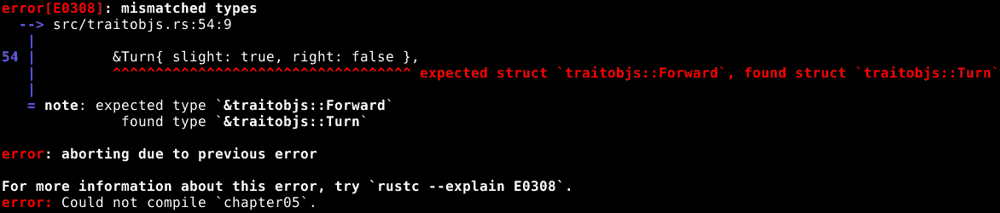
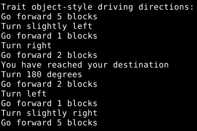
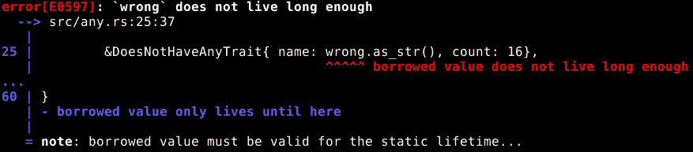
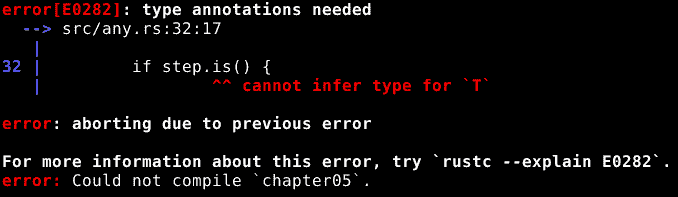
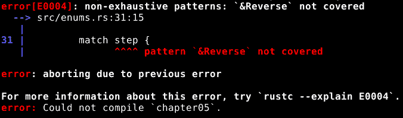

# 一种数据类型表示多种数据类型

有时，一个数据值可能需要是多种不同数据类型之一。Rust 有三种方法来处理这种情况，同时不破坏严格的类型安全：枚举、特质对象和 `Any`。每种方法都有其优点和缺点，所以我们将逐一检查它们，并讨论何时适用。

在本章中，我们将学习以下内容：

+   枚举是什么

+   如何创建枚举类型

+   如何创建枚举值

+   如何使用枚举值中存储的信息

+   特质和特质对象是什么

+   如何创建一个特质

+   如何创建一个特质对象

+   如何使用特质对象

+   `Any` 是什么

+   如何使用 `Any`

+   枚举有什么好处，特质对象有什么好处，`Any` 有什么好处

# 枚举

与结构体类似，枚举允许我们建立一个新的数据类型。尽管内容与结构体不同。当我们说一个变量的数据类型是枚举时，我们是在告诉 Rust，其包含的值必须是我们为该枚举描述的特定选择之一，不能是其他任何东西。

# 基本枚举

在 Rust 中，枚举是一种表示一组固定值之一的 数据类型。例如，我们可以定义一个表示彩虹中常见的七种颜色的枚举，如下所示：

```rs
pub enum Color {
    Red,
    Orange,
    Yellow,
    Green,
    Blue,
    Indigo,
    Violet,
}
```

一旦我们定义了这个枚举，我们就可以使用 `Color` 作为数据类型，以及 `Color::Red` 等类似的数据值：

```rs
let color: Color = Color::Green;
```

枚举是通过 `enum` 关键字创建的。注意，就像结构体一样，如果我们想让枚举在当前模块外部直接可访问，它需要 `pub` 关键字。在 `{` 和 `}` 之间，我们有数据类型的可能值列表，按名称列出，并用逗号分隔。

Rust 对大小写有些意见，所以如果枚举值以小写字母开头，它会警告我们，尽管这实际上不是一个错误。

# 参数化枚举

好吧，那么枚举与在一个变量中表示不同类型的数据有什么关系呢？嗯，枚举值还有一个可以改变一切的特性：参数。

假设我们想要创建一系列驾驶方向的表示，例如 *向右转*，*向前行驶三个街区*，或 *停车*。这个例子足够简单，我们可能可以用简单的枚举就能应付，但即使这样，使用参数也会更容易：

```rs
pub enum Drive {
    Forward(u8),
    Turn{slight: bool, right: bool},
    Stop,
}
```

我们这里有一个具有参数化值的枚举。`Forward` 值有一个 `u8` 参数（无符号 8 位整数），而 `Turn` 值有两个带有名称的 `bool` 参数。`Stop` 不需要任何参数。

实际上，`Forward`值携带一个 1 元组，而`Turn`值携带一个具有两个成员的结构。这就是为什么在`Forward`参数周围使用括号，而在`Turn`参数周围使用花括号的原因。我们是否希望参数是类似元组或类似结构的是我们的决定。无论如何，我们可以根据需要添加或删除参数。

现在，我们可以创建一个`Drive`类型的变量，它可能包含一个`Forward`、`Turn`或`Stop`参数。如果是一个`Forward`参数，这意味着该变量还包含一个`u8`数字，告诉我们需要驾驶多远。如果是一个`Turn`参数，这意味着该变量还包含一对布尔值，告诉我们是否向右或向左转弯，以及转弯是否轻微。换句话说，该变量可能包含几种不同类型的信息之一。

如果你熟悉 C++或类似的语言，请注意，Rust 枚举与 C++枚举不太一样。带有参数值的 Rust 枚举更像是一个 C++联合体，但它进行了类型检查并且是安全的。

更好的是，我们可以创建一个包含驾驶指令的数组，以表示一次完整的旅程：

```rs
let directions = [
    Drive::Forward(3),
    Drive::Turn{slight: false, right: true},
    Drive::Forward(1),
    Drive::Stop,
];
```

这个`Drive`值数组表示向前驾驶三个街区，向右转，再向前驾驶一个街区，然后停止。

# 检查值类型和提取参数值

当程序运行时，它可以根据它正在查看的具体枚举类型采取不同的行动，并且它可以访问存储为参数的数据值。我们已经看到了完成这项工作的最佳工具，即`match`：

```rs
    for step in directions.iter() {
        match step {
            Drive::Forward(blocks) => {
                println!("Drive forward {} blocks", blocks);
            },
            Drive::Turn{slight, right} => {
                println!("Turn {}{}",
                         if *slight {
                             "slightly "
                         }
                         else {
                             ""
                         },
                         if *right {
                             "right"
                         }
                         else {
                             "left"
                         }
                );
            },
            Drive::Stop => {
                println!("You have reached your destination");
            }
        };
    };
```

这里，我们有一个`for`循环，它逐个处理方向数组中的每个项目，从第一个开始。一步一步地，以下是正在发生的事情：

1.  我们要求`directions`提供一个迭代器，它很乐意这样做。迭代器将逐个提供数组中每个值的借用。

1.  `for`循环从迭代器请求一个值，并将返回的借用分配给名为`step`的变量。

1.  匹配表达式使用`step`变量来提供它将与之匹配的值。因为这个变量每次循环都会改变，所以匹配表达式每次都会与不同的值进行比较：

    +   如果`step`变量包含`Drive::Forward`的借用，其参数将被分配给名为`blocks`的变量。因为`step`是一个借用，所以`blocks`中的值也是一个借用，但在这个例子中这并没有造成重大差异。我们将其传递给`println!`，它调用一个函数将其转换为文本字符串，然后自动解引用。

    +   如果`step`变量包含（对`Drive::Turn`的借用），则其参数的借用被分配给`slight`和`right`名称，并且我们可以使用之前看到的简写符号，因为`slight`和`right`是源和目标中变量的名称。然后是一个打印命令，但我们使用`if`表达式来决定打印什么。注意，我们明确地解引用了`slight`和`right`值；它们是借用，并且与调用函数不同，`if`表达式不会自动为我们解引用，所以我们需要自己来做。

    +   如果`step`变量包含（对`Drive::Stop`的借用），则没有要处理的参数，我们只需打印一条消息。

1.  如果迭代器中还有任何值，则回到步骤 2。

非常酷。我们这里有一些做些实际事情的代码。那时真正的乐趣才真正开始！

# 结果是一个枚举，通过前缀访问

你可能已经注意到了，但带有`Ok`和`Err`值的`Result`类型看起来非常像枚举。这是因为它确实是一个枚举，这就是它能够根据它表示错误还是成功来包含不同数据类型的原因。它是一个具有泛型类型参数的枚举，所以在我们了解那些之前，我们无法实现完全相同的功能，但在其基础上，它仍然只是一个枚举。

当我们编写可能失败或处理此类函数的结果的函数时，我们可以使用`Ok`和`Err`而不是`Result::Ok`和`Result::Err`，因为这些值直接添加到 Rust *前缀*中，方便我们使用。实际上，我们可以使用`Result`类型而不必说明它来自哪里，原因相同。

前缀是一个包含非常基本和有用的数据类型、值和特性的集合，它自动在每个 Rust 模块中可用。它包含诸如`String`、`Vec`（一个*向量*，它与数组的关系类似于`String`与`str`的关系），以及`Box`（我们将在下一章中讨论）等东西。

# 特性和特性对象

特性对象是 Rust 存储可能为几种可能类型之一的数据值到单个变量中的另一种机制，但在我们讨论特性对象之前，我们需要讨论特性。

# 特性

特性是为数据类型可能提供的一块特定功能命名和正式定义。之前，我们讨论了数据类型可能具有`Copy`特性，以及当它们具有该特性时，编译器会复制它们而不是移动它们。这就是一般想法：当特性为数据类型实现时，该数据类型就获得了以某种特定方式与程序的其他部分交互的能力。

一些内置的特性，如`Copy`，实际上会影响编译器与类型的交互方式，但在这里我们更感兴趣的是创建我们自己的特性。我们将在后面的章节中讨论这些内置特性。

这一切都很抽象，所以让我们通过查看我们之前用枚举解决的同一个“驾驶方向”问题来更加具体化。我们仍然希望能够有一个驾驶指令数组，并按顺序打印它们，所以让我们创建一个代表打印驾驶指令能力的特性：

```rs
pub trait PrintableDirection {
    fn forward(&self);
    fn reverse(&self);
}
```

`trait`关键字引入了一个特性，不出所料。在其中，我们有组成这个特性*接口*的函数签名。换句话说，如果一个数据类型将要拥有`PrintableDirection`特性，它需要提供针对该类型和特性的特定函数的实现。

只要每个函数是不同特性的一个部分，一个数据类型就可以有多个具有相同名称的实现函数。特性不需要担心与其他特性或基本数据类型发生名称冲突。

我们通过指定具有`PrintableDirection`特性的数据值知道如何以*前往*和*返回*的方向打印自身，或者至少这是我们希望`forward`和`reverse`函数的含义。

特性可以通过只提供签名来指定函数，就像之前一样，或者它们也可以通过简单地填写一个完整的函数定义来提供函数的默认实现。当特性为特定数据类型实现时，具有默认实现的函数不必实现，尽管如果需要，它们可以。

注意，特性内部函数的签名没有`pub`关键字。特性本身是公开的或不是，作为一个整体。在这种情况下（以及大多数情况下），特性是公开的，因此它所要求的函数自动是公开的。

# 实现我们的 PrintableDirection 特性

特性不是独立存在的；它们是数据类型拥有的东西。因此，我们首先需要做的是创建数据类型来表示各种驾驶方向：

```rs
pub struct Forward {
    pub blocks: u8,
}

pub struct Turn {
    pub slight: bool,
    pub right: bool,
}

pub struct Stop {}
```

我们在这里只是使用基本结构，但特性可以为*任何*数据类型实现。

这些结构包含的信息与我们之前在枚举参数中包含的信息相同。`Stop`结构很有趣，因为它为空。它不存储任何信息。它的唯一目的是作为一个数据类型。

现在，我们有一个特性和数据类型，但到目前为止，它们之间没有任何关系。让我们为这些类型中的每一个实现我们的特性：

```rs
impl PrintableDirection for Forward {
    fn forward(&self) {
        println!("Go forward {} blocks", self.blocks);
    }

    fn reverse(&self) {
        println!("Go forward {} blocks", self.blocks);
    }
}

impl PrintableDirection for Turn {
    fn forward(&self) {
        println!("Turn {}{}",
                 if self.slight {"slightly "} else {""},
                 if self.right {"right"} else {"left"});
    }

    fn reverse(&self) {
        println!("Turn {}{}",
                 if self.slight {"slightly "} else {""},
                 if self.right {"left"} else {"right"});
    }
}

impl PrintableDirection for Stop {
    fn forward(&self) {
        println!("You have reached your destination");
    }

    fn reverse(&self) {
        println!("Turn 180 degrees");
    }
}
```

这些实现块看起来与我们之前看到的类似，但这次它们不仅仅是说`impl`和类型名，而是要为类型名实现特性。然后，在内部，我们放置适用于该数据类型的特性函数的具体版本。

现在，`Forward`、`Turn` 和 `Stop` 数据类型各自都具有 `PrintableDirection` 特质，这意味着它们都知道如何将其包含的信息作为驾驶指令显示出来。

# 特质对象

`Forward`、`Turn` 和 `Stop` 仍然是三种不同的数据类型。没有表示 `Forward`、`Turn`、`Stop` 的数据类型，尽管我们可以使用枚举来创建一个，但还有另一种方法。有一个数据类型可以表示任何具有 `PrintableDirection` 特质的 `any` 数据类型的借用。它被写成 `&dyn PrintableDirection`，被称为特质对象引用。

我们**不能**只写像 `let x: dyn PrintableDirection` 这样的东西，并创建一个可以存储具有 `PrintableDirection` 特质的任何内容的变量。它需要是一个借用，或者某种存储包含在栈外数据的数据，例如我们将在下一章中看到的 `Box` 类型。

`dyn` 关键字代表动态分派，它意味着在大多数情况下看起来和表现像借用，实际上要复杂一些。借用本身存储的内存地址实际上是隐藏数据结构的地址。

那个隐藏的数据结构包含了实际借用地址以及实现借用数据值特质的函数的内存地址。当我们将一个数据值赋给特质对象时，Rust 会初始化那个隐藏的数据结构，当我们调用特质函数中的一个时，Rust 会查找在同一个隐藏数据结构中实际要调用的函数。

这意味着通过特质对象调用函数将始终需要计算机执行一些额外的步骤，与在具有具体类型的数据值上调用函数相比。另一方面，如果我们仔细思考，任何可能允许我们处理任意数据类型的机制都必须分配时间和内存来跟踪它正在处理的数据类型以及数据值存储的位置。如果我们从头开始尝试创建相同的功能，我们最终会做同样的事情。

# 使用我们的 `PrintableDirection` 特质

因此，这次我们不是创建枚举值的数组，而是创建一个特质对象引用的数组：

```rs
    let mut directions = [
        &Forward{ blocks: 5 },
        &Turn{ slight: true, right: false },
        &Forward{ blocks: 1 },
        &Turn{ slight: false, right: true },
        &Forward{ blocks: 2 },
        &Stop{},
    ];
```

不幸的是，如果我们尝试编译它，我们会得到一个错误，如下所示：



这次，Rust 不能仅通过查看我们分配给它的值来确定数组的数据类型，因为那个值看起来像是一个包含多个数据类型的数组，而这在我们甚至不能在 Rust 中做到。编译器不会去寻找它们都实现的特质，任意选择一个，并决定数组实际上是一个特质对象数组。这会比有帮助的情况更常见，所以我们必须告诉 Rust `directions` 变量应该有什么数据类型。

我们实际上告诉它`directions`是`[&dyn PrintableDirection; 6]`。这意味着它是一个`PrintableDirection`特质对象引用的数组，并且有空间容纳六个。现在，编译器知道如何正确解释我们的数组表达式：

```rs
    let mut directions: [&dyn PrintableDirection; 6] = [
        &Forward{ blocks: 5 },
        &Turn{ slight: true, right: false },
        &Forward{ blocks: 1 },
        &Turn{ slight: false, right: true },
        &Forward{ blocks: 2 },
        &Stop{},
    ];
```

现在，我们准备好实际打印出驾驶方向：

```rs
for step in directions.iter() {
    step.forward();
};
```

为了好玩，我们还会打印出回家的方向：

```rs
directions.reverse();

for step in directions.iter() {
    step.reverse();
};
```

这里有两个函数调用来反转，但*它们并不是调用同一个函数*。`directions.reverse()`调用调用的是在数组上实现的反转函数，它反转数组中存储的项目顺序。同时，`step.reverse()`调用调用的是反转函数，这是所有具有`PrintableDirection`特质的类型必须实现的，适用于步骤值的特定具体类型。这些函数碰巧有相同的名字，但它们根本不是同一回事。

当我们编译并运行所有特质对象代码时，我们得到如下输出：



哈哈，它工作了！

# 特质对象只提供对特质接口的访问

当我们使用特质对象时，我们*唯一*可以访问的原始对象的部分是特质定义的部分。这意味着我们可以调用`forward`和`reverse`函数，但我们无法直接访问`Forward`类型的`blocks`成员或`Turn`类型的`slight`成员等。特质对象只给我们提供它所代表的任何数据类型中保证存在的那些东西：特质的自身接口。

当我们思考时，这很有道理。如果我们要访问`slight`，但查看的值实际上是`Forward`类型，计算机应该做什么呢？一些语言会让我们尝试，如果我们在错误的时间这样做，程序就会崩溃，而其他语言会在程序运行时花费时间检查这些事情，并在发生错误时捕获它们，但都不是 Rust 的方式。在 Rust 中，如果编译器不能确定某件事是正确的，通常是一个错误。

这意味着特质的接口需要是完整的，从意义上说，你可以用具有特质的任何数据值合理做的事情都应该包含在接口中。这通常不是负担。毕竟，我们为什么要以任何其他方式呢？

我们一直在使用**接口**这个词。一些语言，如 Java，有一个实际上*称为*接口的功能，是的，Rust 特质与 Java 接口相似，尽管并不相同。

# Any

`Any`是一个 Rust 中大多数数据类型自动实现的特质，这意味着我们可以在`Any`类型的特质对象中存储几乎所有东西。然而，正如我们之前提到的，我们只能根据特质的接口来访问特质对象中存储的值，所以`Any`接口让我们做什么呢？

# Any 可以存储几乎所有东西

Rust 编译器会自动为任何数据类型实现`Any`，*除非*该数据类型包含非静态引用。所以，我们在特质对象部分使用的`Forward`、`Turn`和`Stop`结构已经自动实现了`Any`，但像这样的事情就不会：

```rs
pub struct DoesNotHaveAnyTrait<'a> {
    pub name: &'a str,
    pub count: i32,
}
```

更准确地说，当`'a`等于`'static`时，`DoesNotHaveAnyTrait`才只有`Any`特质，如果我们使用一个简单的字符串表达式，如`this is a static string`来初始化它，它就是`'static`，但如果我们使用其他机制来检索或构造一个`&str`值，则不是。

如果我们尝试做不可能的事情，编译器可能会给出关于生命周期而不是关于`Any`特质的错误，如下面的例子所示：



你看到注释了吗？导致错误的代码尝试创建一个`&dyn Any`，这告诉编译器`'a`生命周期需要与`'static`兼容，这告诉它`wrong.as_str()`的生命周期太短，因此它报告了一个错误。

通常，这并不是什么大问题，因为我们有其他几个原因避免在我们的数据类型中使用非静态引用，我们可以使用`String`、`Vec`、`Box`等来实现相同的结果。这只是我们需要记住的事情。

# 但要访问它，我们首先必须了解真实的数据类型

回到我们的例子，我们将创建我们的驾驶方向数组，并且我们会添加一些不是驾驶方向的东西，只是为了证明我们可以做到。

在这里，我们有一个包含驾驶方向和另一件事的`Any`特质引用数组：

```rs
use std::any::Any;

//...

pub struct DoesHaveAnyTrait {
 pub name: String,
 pub count: i32,
}

//...

let okay = String::from("okay");

let directions: [&dyn Any; 7] = [
    &Forward{ blocks: 5 },
    &Turn{ slight: true, right: false },
    &Forward{ blocks: 1 },
    &Turn{ slight: false, right: true },
    &Forward{ blocks: 2 },
    &Stop{},
    &DoesHaveAnyTrait{ name: okay, count: 16},
];
```

到目前为止，它看起来与我们的特质对象示例非常相似，这是有道理的，因为`Any`也是一个特质，而且这仍然是一个特质对象引用的数组。这里巨大的不同之处在于，我们向数组中添加了一个额外的项目，而且它与驾驶方向完全没有关系。

特质对象引用只给我们提供了访问特质函数的权限。现在我们有了`Any`特质对象引用的数组，`Any`提供了哪些函数让我们能够做些有用的事情？`Any`提供了两个重要的函数：有一个函数可以检查包含的值是否具有特定的数据类型，还有一个函数族允许我们提取包含的值。

作为第一个例子，我们将查看允许我们检查数据类型的函数：

```rs
    for step in directions.iter() {
        if step.is::<Forward>() {
            println!("Go forward");
        }
        else if step.is::<Turn>() {
            println!("Turn here");
        }
        else if step.is::<Stop>() {
            println!("Stop now");
        }
    }
```

这里有一些新的语法。当我们说`step.is::<Forward>()`时，我们是在说我们想要调用在（自动创建的）`impl Any for Forward`实现中定义的`is`函数。编译器知道我们在谈论`Any`，因为`step`是一个`&dyn Any`，但它不知道我们想要的是`Forward`版本而不是无数其他特定类型的`Any`实现之一，所以我们需要告诉它。

这种语法有点令人困惑，因为它与我们通常在`use`语句中写的顺序相反，但除此之外看起来很相似。不过读起来倒是挺顺的：*如果步骤是向前*几乎可以作为一个句子。

然而，这个版本有点令人不满意，因为打印输出完全基于数据类型，而没有考虑到数据值中存储的信息。我们可以用一个未参数化的枚举做得一样好。幸运的是，我们还可以使用`Any`的 downcast 函数来获取对引用值的访问：

```rs
    for step in directions.iter() {
        if let Some(x) = step.downcast_ref::<Forward>() {
            x.forward();
        }
        else if let Some(x) = step.downcast_ref::<Turn>() {
            x.forward();
        }
        else if let Some(x) = step.downcast_ref::<Stop>() {
            x.forward();
        }
    }
```

再次强调，我们正在告诉 Rust 我们想要调用来自特定类型实现的`Any`函数版本。在第一个`if let`分支中，我们要求`Any`给我们一个`Forward`数据值的引用。如果该值实际上*是*一个`Forward`数据值，该函数将返回一个名为`Some`的枚举值，其中引用作为其参数。如果该值*不是*一个`Forward`数据值，该函数将返回一个名为`None`的枚举值，它自然不匹配`if let`模式。

`Some`和`None`是`Option`枚举的可能值，这是预定义中包含的另一件事。它被广泛用于表示可能存在或不存在的数据值，尤其是在它们不是必须存在的情况下。在其他语言中，通常有一个特殊值，如`NULL`、`null`、`None`或`nil`，它可以分配给任何东西。Rust 的`None`只能分配给`Option`，这有助于编译器确保一切正确。

这个例子中的`x`变量实际上是`Forward`、`Turn`或`Stop`数据值的实际引用，因此如果我们进入其中一个`if`分支的代码块，我们就能够访问该数据类型可以执行的所有操作，而不仅仅是特定特质定义的功能。实际上，我们正在调用为这些类型在`PrintableDirection`特质中实现的`forward`函数，这是一个很好的证明我们拥有完全访问权限的例子。

注意，在使用`is`和`downcast_ref`时，如果不指定我们感兴趣的特定数据类型，就无法使用它们。如果我们尝试在不指定确切使用哪种数据类型的情况下使用这些函数，我们会得到一个类似这样的错误：



这意味着虽然`Any`可以存储几乎任何东西，但除非我们明确处理存储值的正确数据类型，否则我们无法访问存储的信息。在我们的例子中，我们没有 if 分支来处理`DoesHaveAnyTrait`值，所以数组中的最后一个值最终被忽略。

除了`downcast_ref`之外，`Any`特质还提供了`downcast_mut`，它给我们一个可变引用。在某些情况下，还可用`downcast`函数，它将值移动到我们的当前作用域而不是借用它。

# 这些技术的比较

Rust 社区倾向于使用枚举来解决单变量多类型问题。在运行时成本方面，简单的枚举是最有效率的，效率对 Rust 程序员来说很重要。

然而，使用枚举有一个缺点，那就是决定如何处理特定枚举值及其相关数据的`match`表达式（或类似）可能会分散在程序的源代码中。如果我们发现需要添加或删除枚举值，或者更改枚举值的参数，我们必须找到并更改所有这些匹配表达式。

如果我们决定在`Drive`枚举中添加一个`Reverse`值，匹配表达式就必须进行更改：



编译器会指出需要更新的每个`match`表达式，但它不会捕获需要类似更改的`if let`表达式的地方（因为`if let`只能处理一些可能性），因此这可能会成为一个重大问题。

相反，特质对象通过使不同数据类型的行为实际上成为数据类型的一部分，使我们能够将所有相关代码放在一起。它们还允许我们编写可以与尚未创建的数据类型一起工作的代码，但它们效率较低，因为计算机需要在程序运行时维护和使用隐藏的特质对象结构。

我们可能会认为通过创建一个枚举并在其上实现包含匹配表达式和针对枚举的每个值进行不同处理的函数，我们可以得到两者的最佳结合，并且在某种程度上，我们可以做到。然而，如果这些函数通过选择另一个枚举值特定的函数并调用*那个*来工作，我们只是再次重新创建了特质对象，但效率更低。

如果我们尝试以下方法来避免特质对象，我们最好还是使用特质对象：

```rs
pub enum LikeATraitObject {
    Integer(i32),
    Float(f32),
    Bool(bool),
}

fn handle_integer(x: i32) {
    println!("Integer {}", x);
}

fn handle_float(x: f32) {
    println!("Float {}", x);
}

fn handle_bool(x: bool) {
    println!("Bool {}", x);
}

impl LikeATraitObject {
    pub fn handle(&self) {
        match self {
            LikeATraitObject::Integer(x) => { handle_integer(*x); }
            LikeATraitObject::Float(x) => { handle_float(*x); }
            LikeATraitObject::Bool(x) => { handle_bool(*x); }
        }
    }
}
```

这并不是说这样的结构没有用，因为它们是有用的。然而，如果这样做*唯一*的原因是避免使用特质对象引用，那是一个错误。

可能看起来`Any`实际上是最佳选择，因为它可以存储如此广泛的值*并且*给我们提供了对存储值数据的完全访问，但通常其他选项中的一个是更好的。使用`Any`意味着我们需要在代码的各个地方检查所有可能性，就像使用枚举一样，而且与枚举不同，编译器在寻找需要更改的地方时不能提供任何帮助，因为，就像特质对象引用一样，没有定义的可能性的列表。在许多方面，`Any`是两者的最差结合。

虽然有些问题`Any`是正确的选择，尽管如此。如果我们真的需要处理一组无关的数据类型，我们需要`Any`。

# 摘要

好的，所以我们有三种不同的方法来处理相同的问题，每种方法都有其不同的优势和劣势：

+   我们了解到枚举是最有效率的，尤其是在简单情况下

+   我们了解到特性对象引用可以产生最简单的代码，但代价是额外的开销

+   我们了解到`Any`特性为我们提供了一种几乎可以引用任何事物的途径，但我们必须明确提取所需的信息类型

在下一章中，我们将学习如何将数据存储在栈外，以及为什么我们想要这样做
