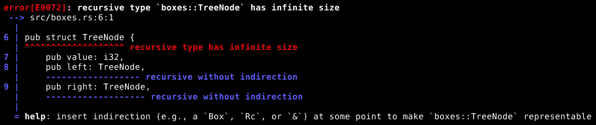
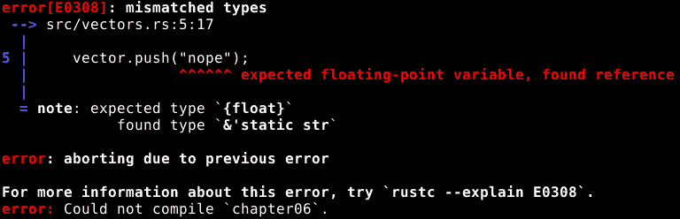
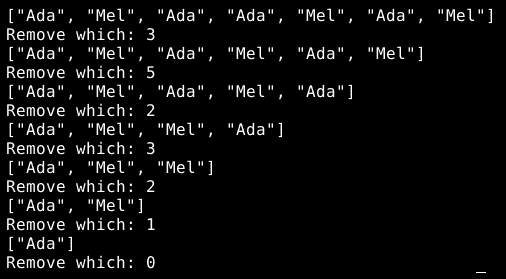
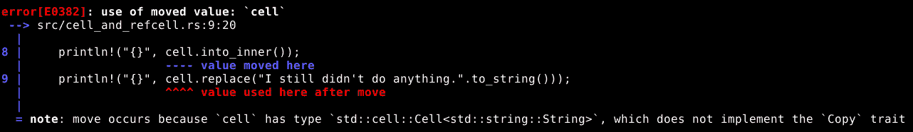

# 堆内存和智能指针

我们已经讨论了栈，以及它是 Rust 存储数据和跟踪需要保留和需要清理的内容的地方。这是一个强大而实用的机制，但并不适合所有情况。

假设我们有一个包含图像的变量。它占用几个兆字节的内存，我们需要在不同时间将它的所有权在程序的不同部分之间转移。如果我们只是将它放在栈上，并允许 Rust 根据需要将其移动到新的作用域，一切都会正常工作，但每次将值移动到新的所有者时，都需要复制这些兆字节的数据，这会减慢速度。

这不是存储信息在栈上不理想的情况的唯一场景，但它是一个很好的说明。

另一方面，我们最不想做的事情就是破坏栈和基于作用域的所有权模型，这是 Rust 获得其强大功能的原因。

幸运的是，有一种方法可以在栈外存储数据，同时让它表现得好像它是作用域的一部分：智能指针。

Rust 标准库包括几种不同类型的智能指针，旨在满足不同的需求。智能指针的值本身存储在栈上，就像其他数据值一样，但它们包括在创建时分配一块*堆*内存的必要工具，并在其生命周期结束时将其释放回系统。存储在该堆内存中的数据值可以通过智能指针访问，就像它存储在智能指针内部一样。

**堆**是栈的对立面。栈有一个特定的结构，有助于 Rust 跟踪在任何给定时间哪些操作是安全的，哪些是不安全的，而堆可以被视为无组织内存。一般来说，程序可以在任何时间请求为使用保留一段堆内存，并且可以在任何时间将其释放回系统。现在想象一下，当分配的堆内存部分分配得太晚，或者释放得太早，或者应该在释放时没有释放会发生什么。内存分配和释放的错误是程序崩溃的主要原因之一。

多亏了智能指针，存储在堆内存中的值的生命周期与遵循 Rust 正常规则的值的生命周期相匹配，但有一个大优点，即当智能指针移动到新的作用域时，不需要复制堆内存的部分。我们的多兆字节图像可以在作用域之间移动，只需移动几个字节，因为图像本身不需要移动，只需要控制它的智能指针。

# Box

标准智能指针中最直接的是`Box`。`Box`做了我们之前讨论的事情：它在堆上存储一个数据值，同时确保它仍然遵循生命周期规则，就像它是`Box`值本身的一部分一样。

这里有一个例子。首先，我们将为要在堆上存储的数据创建一个数据类型：

```rs
pub struct Person {
    pub name: String,
    pub validated: bool,
}
```

现在，创建和使用`Box`本身是很容易的：

```rs
let jack = Box::new(Person { name: "Jack".to_string(), validated: true });
let x = &jack.name;
println!("The person in the box is {}", x);
```

第一行创建了一个`Box`。我们必须给它一个要存储的数据值，因为 Rust 不允许空`Box`，所以我们要初始化一个`Person`对象并将其传递给函数，该函数创建一个新的`Box`作为其内部值。

为什么 Rust 不允许空`Box`，或者任何其他类型的智能指针？因为如果允许，那么每次访问该智能指针的内容时，它都必须担心该智能指针是否指向已初始化的内存。要求只要智能指针存在，它管理的内存必须包含有效的数据值，这简化了许多事情，并使得一种常见的错误变得不可能。

一旦初始化了`Box`，我们就可以将其主要视为对包含数据的正常借用。我们可以通过解引用来将数据移回栈上：

```rs
let x = *jack;
```

这将`Person`值从名为`jack`的`Box`内部移动到`x`变量中，使得`jack`变得不可用。

我们也可以通过`Box`访问包含的数据值的数据和函数，就像它是包含数据的借用一样：

```rs
let x = &jack.name;
println!("The person in the box is {}", x);
```

在这里，我们要求借用`jack.name`到`x`，然后打印出那个名字。我们也可以通过以下方式得到相同的结果：

```rs
println!("The person in the box is {}", jack.name);
```

但这实际上是以非常不同的方式工作的。第一个例子是借用名称，然后打印出借用的`String`值。第二个实际上调用了一个名为`jack.name.fmt`的函数，它的`self`参数是一个不可变借用。这是因为 Rust 在解引用和函数调用方面非常智能。

`fmt`在哪里被调用的？答案是`println!`是一个宏，这意味着它实际上不是一个函数，而是像将一些代码直接粘贴到程序中一样。粘贴的代码调用`fmt`，所以这就像我们亲自调用了`fmt`一样。在 Rust 中，我们可以通过宏的名称总是以`!`结尾来识别它们，而函数名称则不会。

# `Box`和可变大小

我们之前遇到过 Rust 需要确切知道特定数据值可以占用多少字节的必要性。大多数时候，Rust 可以解决这个问题，大多数时候这并不是问题，但有一些情况下，为数据值定义固定大小是不可能的。

一个基本的例子是数据结构，例如以下结构，其中实例包含它自己的其他实例：

```rs
pub struct TreeNode {
    pub value: i32,
    pub left: TreeNode,
    pub right: TreeNode,
}
```

乍一看这似乎是合理的，但 Rust 正确地指出，计算出的尺寸是无限的（因为`TreeNode`的大小是两个`TreeNode`的大小加上`32`位）：



正如编译器建议的那样，我们可以用一个`Box`来修复这个问题：

```rs
pub struct TreeNode {
    pub value: i32,
    pub left: Box<TreeNode>,
    pub right: Box<TreeNode>,
}
```

现在，`TreeNode`的大小是两个`Box`的大小加上 32 位，这是完全合理的。

# `Box`和`Any`

当一个变量的类型是 `Box<dyn Any>` 时，它表现得就像一个 `&dyn Any`，但增加了一个新特性。一个普通的 `&dyn Any` 有一个 `downcast_ref` 函数，我们可以使用它来获取包含值的引用，如果我们知道使用什么类型来提取它。现在，`&dyn mut Any` 增加了一个 `downcast_mut`，我们可以使用它来获取可变引用。当我们有一个 `Box<dyn Any>` 时，我们可以访问这两个函数，但也可以调用一个普通的 `downcast` 函数，将包含的值从 `Any` 移动到正确类型的变量中。这会消耗 `Box` 和 `Any`，并给我们返回一个新的包含数据值及其正确数据类型的 `Box`。

不要忘记，如果我们打算使用 `Any` 特性，我们代码中需要包含 `use std::any::Any;`。

我们可以几乎以创建 boxed `Person` 相同的方式创建 boxed `Any`：

```rs
let jill: Box<dyn Any> = Box::new(Person { name: "Jill".to_string(), validated: false });
```

这里的唯一区别是，我们告诉 Rust 我们想要 `jill` 变量包含一个 `Box<dyn Any>` 而不是让它自己决定变量包含 `Box<Person>`。

现在，要访问包含的 `Person`，我们可以这样做：

```rs
let real_jill = jill.downcast::<Person>().unwrap();
println!("{}", real_jill.name);
```

就像其他 downcast 函数一样，我们需要指定我们正在向下转换的具体数据类型。downcast 函数返回一个 `Result`，如果成功，则包含一个 `Box<Person>`。一旦我们有了 `Box<Person>`，我们就可以对它包含的 `Person` 值做任何我们想做的事情。

我们在这里调用的 `unwrap` 函数消耗一个 `Result`，如果成功，则返回其包含的值，如果失败，则终止程序并显示错误信息。我们使用 `unwrap` 来处理一个我们非常确信将会成功的 `Result`。

# Vec 和 String

当数据值可能 *改变* 大小时，它几乎必须在堆上存储。因此，Rust 预定义中包含了 `String` 和 `Vec` 类型，它们分别是用于存储文本和可变长度数组的智能指针。

# String

我们已经多次看到了 `String`，当我们使用它来简化文本字符串的所有权时。尽管如此，我们还可以用它做其他事情，因为存储在 `String` 中的文本可以更改。

在这里，我们像以下代码所示那样多次更改 `String`：

```rs
let mut text = String::new();
text.push('W');
text.push_str("elcome to mutable strings");
text.insert_str(11, "exciting ");
text.replace_range(28.., "text");
println!("{}", text);
```

让我们一步一步地看看：

1.  在第一行，我们创建了一个空的 `String`，并将其存储在一个可变变量中。它必须是可变的，因为我们将要改变存储的值。

1.  在第二行，我们正在向 `String` 添加一个字符。

1.  在第三行，我们正在将一个 `&str` 的全部内容追加到 `String` 中。

1.  在第四行，我们正在将一个 `&str` 的全部内容插入到字符串的 `11` 字节偏移处。记住，Rust 从零开始计数，所以字符串中 `W` 的偏移量是 `0`。

1.  在第五行，我们正在替换一系列偏移量中的字符，用一组新的字符序列来替换。我们使用的具体范围是 `28..`，这意味着从 `28` 开始的范围，一直延伸到无限（或者字符串的末尾，哪个先到算哪个）。

1.  最后，我们打印出所有操作的最后结果。

我们在使用 `String` 的字节偏移量时必须小心，因为 `String` 类型总是使用 `UTF-8` 编码来存储文本。这意味着任何单个字符可能使用的字节数可以从一个字节少到四个字节。如果我们尝试使用位于字符中间的偏移量，程序将因错误信息而终止。`String` 和 `&str` 有许多函数可以让我们在 `String` 中找到有效的字节偏移量，或者在不使用偏移量的情况下操作它，例如 `find`、`lines`、`split_whitespace`、`contains`、`starts_with`、`ends_with`、`split`、`trim` 和 `char_indices`。 

使用我们的 `text` 变量，`&text` 的数据类型可以是 `&String` 或 `&str`。Rust 的类型推断系统会根据将要存储值的变量的数据类型，或者将要分配给函数参数的数据类型等来做出决定。这也意味着，任何为 `&str` 实现的函数或者接受 `&str` 参数的函数也可以用在 `String` 上。例如，`str` 有一个 `lines(&self)` 函数，所以我们可以调用 `text.lines()`。此外，我们还可以将 `String` 作为文本参数传递给我们在本例中看到的 `push_str`、`insert_str` 和 `replace_range` 函数，就像它是一个真正的 `&str` 一样。

# Vec

`Vec` 数据类型存储一个 *向量*，这是编程中常用的一个词，用来表示一维、可变长度的数组。像实际的数组一样，它们可以存储多个数据值，只要这些数据值都具有相同的数据类型。像 `Strings` 一样，`Vecs` 可以改变大小，因此它们是专门化的智能指针，它们在堆上存储包含的值。

要创建一个空的 `Vec`，我们可以使用 `Vec::new()`，如下所示：

```rs
let mut vector = Vec::new();
```

然后，我们可以使用 `push` 向它添加一个数据值：

```rs
vector.push(1.5);
```

现在，到目前为止，我们还没有提到向量可以包含哪种类型的数据，而 Rust 对此非常满意，因为我们不需要这样做。我们写的所有内容都与向量包含浮点原始数据类型之一是一致的，所以 Rust 就认为它包含的是这种类型。

如果我们做了不一致的事情，比如尝试在向量中存储一个 `&str`，会发生什么？

```rs
vector.push("nope");
```

现在 Rust 无法确定向量应该包含哪种数据类型，因此它拒绝编译：



然而，我们可以这样做：

```rs
let x: f64 = 99.9;
vector.push(x);
```

在这里，我们有一个名为 `x` 的变量，其数据类型为 `f64`。这与 Rust 之前能够识别的“某种浮点数”兼容，因此将其添加到向量中不会引起任何问题。实际上，它告诉 Rust，我们之前的 `1.5` 应该被视为 `f64`，并且该向量包含特定的 `f64` 值。

我们使用了数字作为那个例子，但只要我们遵循每个向量只包含一个数据类型的规则，Rust 就可以在 `Vec` 中存储任何数据类型。

将一个 `&str` 添加到我们的数字向量中是个问题，但我们可以无任何困难地创建一个 `&str` 向量：

```rs
let mut second_vector = Vec::new();
second_vector.push("This");
second_vector.push("works");
second_vector.push("fine");
```

我们可以使用与数组相同的语法来访问向量中的元素：

```rs
    println!("{} {} {}.", second_vector[0], second_vector[1], second_vector[2]);
```

`Vec` 实现了多个用于访问存储数据值的函数，如下所示：

+   `pop`，它移除并返回向量中的最后一个项目

+   `remove`，它从特定索引处移除项目

+   `insert`，它在特定索引处添加一个项目，将位于该索引处的项目以及之后的所有项目向后推一个位置

+   `append`，它将值从另一个向量中移出并添加到末尾

+   `len`，它只是告诉我们向量中有多少个项目

+   `iter`，它返回包含数据的迭代器

创建一个空向量然后向其中推送大量值可能会有些繁琐，所以有一个宏可以使事情变得更容易：

```rs
let third_vector = vec!["This", "works", "too"];
```

我们通过其 `!` 符号来识别宏，但这次它并不是真正地假装是一个函数。相反，它几乎看起来像是一个前缀数组表达式。宏在它们的形态上有很多灵活性，对于这个宏来说，看起来像数组表达式是有意义的。这个结果就像我们使用 `new` 创建了一个向量，然后使用 `push` 向其中添加信息一样。这仅仅是一种更方便的写法。

# Rc

有时候，Rust 对每个数据值只有一个所有者的坚持并不适合我们的数据模型。如果我们正在编写一个文字处理引擎，并希望人们能够在多个地方包含相同的图像而不浪费内存在重复上；或者如果我们正在模拟一个组织，其中一个人可能被多个角色引用呢？

我们可以有一个共享信息的确定所有者，并在其他地方使用借用，如果这行得通，那可能就是可行的方案。尽管如此，有两种情况它是不适用的：

+   我们不知道共享数据值每个用户的生命周期有多长

+   我们至少需要有一个用户对共享数据有写访问权限

文字处理引擎是问题一的很好例子：一个图像可能在同一文档中被使用多次，但我们永远不知道用户何时会决定删除其中一个，也不知道哪个会被删除。也许所有都会被删除，而且谁知道这会发生什么顺序或时间呢。

要完全解决第二个问题，我们需要 `Rc` 和 `RefCell` 数据类型，所以我们将在本章后面讨论这一点。

当我们发现自己处于需要共享信息但不知道该信息各种借用相对生命周期的情境时，我们可以使用 `Rc` 智能指针来让一切正常工作。`Rc` 代表 "引用计数"，它所做的就是跟踪自身存在的副本数量。当这个数字达到零时，包含的数据值的生命周期结束。

让我们看看如何创建一些引用计数智能指针：

```rs
pub fn make_vector_of_rcs() -> Vec<Rc<String>> {
    let ada = Rc::new("Ada".to_string());
    let mel = Rc::new("Mel".to_string());

    return vec![
        Rc::clone(&ada),
        Rc::clone(&mel),
        Rc::clone(&ada),
        Rc::clone(&ada),
        Rc::clone(&mel),
        Rc::clone(&ada),
        Rc::clone(&mel),
    ];
}
```

我们使用 `Rc::new` 在函数体的前两行创建了第一个 `Rc` 值。它们都包含一个 `String` 值。

之后，我们使用 `Rc::clone` 来创建每个 `Rc` 的几个副本。请注意，`String` 值**没有**被复制，只是 `Rc` 智能指针。返回的向量包含四个共享相同 `ada` 字符串的 `Rc`，以及三个共享相同 `mel` 字符串的 `Rc`。

然后，函数的作用域结束，原始的 `ada` 和 `mel` 引用计数智能指针的生命周期也随之结束。然而，各种副本是返回值的一部分，所以它们的生命周期不会结束，因此这两个字符串值的引用计数仍然大于零，它们的生命周期也不会结束。

我们在这里使用了 `Rc::clone`，但如果我们写了 `ada.clone()` 或 `mel.clone()`，会产生相同的结果。人们通常更喜欢写成 `Rc::clone`，以清楚地表明我们正在克隆 `Rc`，而不是 `Rc` 包含的数据值。

现在我们将编写一个简短的程序，该程序依赖于用户输入来确定每个 `Rc` 副本的生命周期何时结束。没有固定的 `Rc` 删除顺序，所以编译器无法提前知道何时可以清理它们共享的数据值，但多亏了引用计数机制，只要需要，`String` 值就会被保留，然后它们的生命周期结束。

在这里，我们根据用户输入从向量中删除元素：

```rs
let mut ada_and_mel = make_vector_of_rcs();

while ada_and_mel.len() > 0 {
 println!("{:?}", ada_and_mel);

 print!("Remove which: ");
 io::stdout().flush().unwrap();

 let mut line = String::new();
 io::stdin().read_line(&mut line).unwrap();

 let idx: usize = line.trim().parse().unwrap();
 ada_and_mel.remove(idx);
}
```

首先，我们调用我们的 `make_vector_of_rcs` 函数来创建初始的引用计数智能指针向量，这些智能指针指向共享数据。

然后，我们循环，直到向量中还有任何值仍然被存储。在循环中，我们首先打印出当前的向量（`{:?}` 代码告诉 Rust 打印出向量的 `'debug'` 表示形式，它看起来像 Rust 数组表达式）。然后我们打印出一个提示，并刷新输出流以确保提示确实被显示。然后我们从输入流中读取一行，将其解析为整数，并使用该整数作为索引从向量中删除一个元素。

当我们运行那个程序时，它看起来像这样：



当最后一个引用`"Mel"`值的`Rc`被移除时，那个`String`的生命周期最终结束，对包含`"Ada"`的`String`也是如此。

我们在那段代码中使用了大量的`unwrap`，实际上，我们过度使用了它。对`flush`和`read_line`的结果进行解包是有意义的；如果它们返回一个失败的`Result`，程序可能应该终止，因为操作系统级别出了问题。然而，对`parse`的结果进行解包并不是一个好主意，因为那里的失败结果只是意味着用户输入了意料之外的内容。我们真的应该使用`match`来响应，当输入无法正确解析时打印出一条消息。我们还应该检查数字是否是向量中实际存在的值的索引，而不是超出两端。Rust 不会让我们访问无效的索引，但尝试这样做将导致程序因错误消息而终止，这并不理想。

解析意味着将编码为文本字符串的信息转换为我们可以实际处理的数据值；例如，将`"5"`转换为数字`5`。`parse`函数相当强大，因为它根据我们分配给其返回值的变量的数据类型来确定我们想要的信息类型，然后确定使用哪个函数将字符串转换为那种数据类型。当然，它不能为我们编写那个函数，所以它只适用于最初就有那种函数的数据类型。此外，实际上所有的推理工作都是由 Rust 编译器完成的。`parse`函数只是利用了编译器的规则和推理系统。

# 弱引用

引用计数有一个致命的缺陷，这也是为什么它不是默认用于每种编程语言中所有变量的原因：循环。如果有两个或更多引用计数的值以某种方式相互引用，它们的生命周期将永远不会结束。它们形成了所谓的*循环*。

并非总是一目了然何时发生循环。如果 A 指向 B，B 指向 C，C 指向 D，D 又指向 A，我们仍然有一个循环。

我们可以通过使用*弱引用*来打破循环，这是`Rc`的辅助数据类型。当我们有一个`Rc`时，我们可以调用它的`downgrade`函数（例如，`let weak_mel = Rc::downgrade(&mel)`）来检索一个`Weak`数据值。

我们实际上对`Weak`无法做任何事情，除了通过调用其`upgrade`函数（例如`weak_mel.upgrade()`）来检索一个`Rc`，但使用`Weak`让我们能够在不实际引用的情况下跟踪引用计数值，这意味着我们可以在组织信息的方式上保持自然的同时避免创建循环。

如果引用数据值的`Rcs`的数量为零，即使还有*弱引用*引用该值，该数据值的生命周期也会结束。

由于引用的值可能已经不存在，`upgrade`函数返回一个`Option`。当我们调用`upgrade`时，我们可能会得到包含我们的`Rc`的`Some`，或者我们可能会得到`None`。

因此，这里的模式是，当我们想要确保数据值在我们需要它的时候一直存在时，我们使用`Rc`，当我们**知道**它将一直存在（例如，当它引用树结构中的父节点时）或者当我们**不关心**它是否存在（例如，当它是一个可以重新生成的缓存值时）时，我们使用`Weak`。

# Cell 和 RefCell

Rust 的规则是任何时刻只有一个代码块可以写入数据值，这是一个好规则，但有时确保在编译器运行时始终遵循此规则的限制过于严格。有时，我们需要在程序运行时检查规则的额外自由度。

编译器检查将确保程序**不能**破坏规则，而运行时检查将确保程序**不会**破坏规则，这为我们提供了更多的灵活性，但代价是增加了开销。

为了支持这个选项，Rust 为我们提供了`Cell`和`RefCell`数据类型，它们是智能指针，允许我们在它们的内容不是存储在可变变量中的情况下更改它们。

# Cell

`Cell`类型存储单个数据值，即使`Cell`没有标记为可变，我们也可以将其移动到`Cell`中。要将值移动到`Cell`中，我们可以使用以下方法：

+   `Cell::new`，因为当创建单元格时，初始值已经移动到单元格中

+   `set`，用于将新值移动到单元格中，并结束已存储值的生命周期

+   `replace`，用于将新值移动到单元格中，并将旧值移动到当前作用域

要将值从`Cell`中移出，我们可以使用以下方法：

+   `replace`，用于将新值移动到单元格中，并将旧值移动到当前作用域

+   `into_inner`，用于消耗单元格，并返回它所包含的值

`Cell`不支持任何允许我们拥有空`Cell`的操作：它们总是必须包含某些内容，就像其他智能指针类型一样。

让我们看看一个单元格的实际应用：

```rs
let cell = Cell::new("Let me out!".to_string());
println!("{}", cell.replace("Don't put me in there.".to_string()));
println!("{}", cell.replace("I didn't do anything.".to_string()));
cell.set("You'll never hold me, copper!".to_string());
println!("{}", cell.into_inner());
```

注意，`cell`变量**不是可变的**。在这里，我们设置了一个单元格，使用`replace`几次来从`cell`中检索旧值，同时设置一个新值，然后使用`set`来设置新值并丢弃旧值，最后使用`into_inner`来移除`cell`并提取其包含的值。

`into_inner`函数将包含的值从`cell`中移出，但这不会创建一个空的`cell`，因为`cell`已经不存在了。如果我们尝试在调用`into_inner`之后访问它，编译器会显示错误，如下面的截图所示：



我们还可以使用一个函数来访问`Cell`中包含的数据值，但前提是包含的数据类型具有`Copy`特性：`get`。我们可以做类似`println!("{}", cell.get())`的事情，在检索其副本的同时保留`cell`的内容，但前提是复制数据值实际上是可能的。

# 这有什么用？

好吧，这实际上有什么好处？我们本来可以用一个可变变量，以更少的开销产生相同的结果。`Cell`（和`RefCell`）主要用于与`Rc`和类似的数据类型一起使用。`Rc`类型遵循 Rust 关于可变性的正常规则，并且由于它旨在作为在许多地方访问共享数据值的机制，这意味着共享值必须是不可变的。

除非该值是一个包含*真实*共享值的`Cell`或`RefCell`。

`Cell`或`RefCell`确保一次只有一个代码块*实际上*修改共享值，但任何通过`Rc`的克隆访问它的代码块都有*能力*这样做。

# RefCell

`Cell`在将存储的数据值移入和移出`cell`时的语义并不总是方便使用，对于大型数据值，移动它们可能是一个昂贵的操作，我们不想在没有必要的情况下反复重复。`RefCell`来拯救！

`RefCell`类型支持`RefCell::new`、`replace`和`into_inner`，就像`Cell`一样，但它还有允许我们以可变或不可变方式借用包含值的函数。

让我们来试一试`RefCell`：

```rs
 let refcell = RefCell::new("It's a string".to_string());

 match refcell.try_borrow() {
 Ok(x) => { println!("Borrowed: {}", x); }
 Err(_) => { println!("Couldn't borrow first try"); }
 };

 let borrowed_mutably = refcell.try_borrow_mut()?;

 match refcell.try_borrow() {
 Ok(x) => { println!("Borrowed: {}", x); }
 Err(_) => { println!("Couldn't borrow second try"); }
 };

 println!("Mutable borrow is still alive: {}", borrowed_mutably);
```

首先，我们创建了一个新的`RefCell`，包含一个文本字符串。之后，我们使用`try_borrow`函数来获取包含的数据值的不可变借用。关于借用的规则仍然得到执行，这意味着如果我们已经对值进行了可变借用，我们就不能借用该值，如果我们已经以任何方式借用了该值，我们也不能对该值进行可变借用，这意味着`try_borrow`可能实际上不会成功。因此，我们必须处理它可能失败的可能性，我们在这里通过使用`match`表达式来做到这一点。

接下来，我们获取一个可变借用并将其存储在一个局部变量中。之前的借用在`match`表达式中选择的块的末尾结束，因此没有活跃的借用，我们预计`try_borrow_mut`会成功，但我们仍然需要处理失败的可能性。在这种情况下，我们使用`?`来处理返回的`Result`，它将提取成功的值，或者将失败返回给调用我们当前函数的函数。如果`try_borrow_mut`如预期那样成功，那么`borrowed_mutably`变量将包含对`refcell`包含的数据值的可变引用。

然后，我们再次尝试不可变地借用包含的数据值。由于不可变借用与可变借用不兼容，而且我们的可变借用仍然存在，我们预计这次尝试会失败。

# Arc

当涉及到在多个代码块之间共享数据时，还有另一层复杂性：线程和多线程。`Rc`、`Cell` 和 `RefCell` 都无法在线程之间共享，但它们所代表的思想对于实现线程间的通信是有用的。

对于线程的使用，有一个 `Rc` 的直接等效物：`Arc`。`Arc` 是一个原子引用计数的智能指针，它因为那个 `atomic` 而可以在线程之间共享，这基本上意味着即使两个线程同时尝试使用它，它也不会被搞乱或混淆。

`Arc` 在内部有不同的名称和不同的工作方式，但表面上它就像 `Rc` 一样。我们关于如何使用 `Rc` 的知识也适用于 `Arc`。

没有使用 `Mutex` 或 `RwLock` 就难以展示 `Arc` 的特殊功能，所以请参阅下一节中的示例代码。

# Mutex 和 RwLock

`Mutex` 和 `RwLock` 在某些方面与 `RefCell` 类似，但与 `Arc` 和 `Rc` 的关系并不那么紧密。

`Mutex` 的职责是确保一次只有一个线程可以访问包含的数据。由于它保证了在任何给定时间只有一个代码块可以访问，因此 `Mutex` 可以安全地提供读写访问，而不会违反 Rust 的规则。

在下面的示例中，我们有 `Mutex` 和 `Arc` 的实际应用，以及一些非常基本的线程操作：

```rs
let counter = Arc::new(Mutex::new(0));

for _ in 0..10 {
 let local_counter = Arc::clone(&counter);
 thread::spawn(move || {
 let wait = time::Duration::new(random::<u64>() % 8, 0);
 thread::sleep(wait);
 let mut shared = local_counter.lock().unwrap();
 *shared += 1;
 });
}

loop {
    {
        let shared = counter.lock().unwrap();
        println!("{} threads have completed", *shared);

        if *shared >= 10 {
            break;
        };
    };
    thread::sleep(time::Duration::new(1, 0));
}
```

我们首先做的是创建一个新的 `Arc`，其中包含一个 `Mutex`，而 `Mutex` 又包含一个整数。因此，我们的整数一次只能被一个线程访问，但它可以在多个线程之间共享，并且它的生命周期将持续到所有线程都完成使用它。

接下来，我们有一个 `for` 循环，它经过 10 个周期，并在每个周期启动一个线程。注意我们如何在调用 `thread::spawn` 之前创建 `Arc` 的克隆。这是因为我们正在使用闭包来定义线程应该做什么。闭包在很多方面都像函数，但它可以在定义时将其局部变量借用或移动到自己的作用域中。我们需要在要求它执行移动之前创建一个将要移动到其作用域中的 `Arc` 值。

这个闭包将局部变量移动到其自己的作用域中，因为我们定义它时使用了 `move` 关键字，并且它特别移动了 `local_counter` 变量，仅仅因为我们在这个闭包中引用了它。

在每个线程的闭包中，我们要求它等待少于 8 秒的随机持续时间，然后向计数器加 1。为了向计数器加 1，我们首先必须锁定 `Mutex`，以确保没有其他线程可以访问。我们通过调用 `Mutex` 的 `lock()` 函数并通过 `Arc`（因为 `Arc` 可以假装是它内部事物的正常借用）来实现这一点。`lock` 函数返回的值在解引用时为我们提供对包含数据的访问，并跟踪 `Mutex` 应保持锁定的时间。当该返回值的生命周期结束时，`Mutex` 被解锁，以便其他线程可以访问包含的数据值。如果另一个线程在 `Mutex` 仍然锁定时尝试锁定该值，`Mutex` 将使该线程等待直到它被解锁才能继续。

实际上，`lock` 函数返回一个 `Result`，但我们在这里只是解包它。如果 `lock` 调用失败，那是因为在另一个线程拥有 `Mutex` 锁定时发生了错误，结束程序可能是明智的选择。

最后，我们只需执行 `*shared +=1` 来实际上将 `1` 添加到共享计数器中。

之后，我们有一个循环，它锁定 `Mutex`，然后打印出计数器的当前值，并在它大于或等于 10 时结束循环（使用 `break` 关键字）。如果循环没有结束，它将等待一秒钟，然后再次执行。

注意，在那个循环中，我们还有一个代码块表达式，并且 `thread::sleep` 调用位于它之外。这是因为 `Mutex` 的工作方式：只要返回值的生命周期没有结束，`Mutex` 就保持锁定。我们不希望 `Mutex` 在代码睡眠时被锁定，所以我们把返回值放入一个更短的范围内，这样它的生命周期就会在我们调用 `thread::sleep` 之前结束，`Mutex` 也会被解锁。

`RwLock` 与 `Mutex` 类似，但它对管理包含数据值的访问有不同的规则。`RwLock` 有两个而不是一个锁函数：`read` 和 `write`。任何数量的线程都可以同时调用 `read` 来访问包含的信息，但任何给定时刻只有一个线程可以使用 `write` 来访问它，并且当线程有写访问权限时，不允许其他线程读取。如果线程在不受允许的时间尝试读取或写入，`RwLock` 将使线程等待直到它想要做的事情再次被允许。

我们不需要同时使用 `read` 和 `write` 来获得两种类型的访问。使用 `write` 意味着我们也有读访问权限。

# 总结

在本章中，我们学习了以下内容：

+   堆内存和栈内存之间的区别

+   当我们希望这样做时，如何使用 `Box` 简单地在堆上存储某些东西

+   如何使用 `Rc` 来管理在多个具有不同生命周期的作用域中所需的数据值的生命周期

+   如何使用 `Cell` 和 `RefCell` 允许对存储在 `Rc` 中的数据进行写访问

+   如何使用 `Arc`、`Mutex` 和 `RwLock` 来管理线程间的信息共享

在下一章中，我们将探讨泛型类型，以及如何为我们的数据类型使用泛型类型参数。
