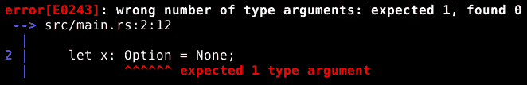
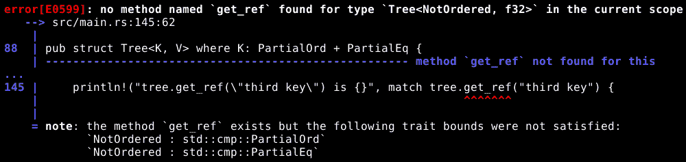
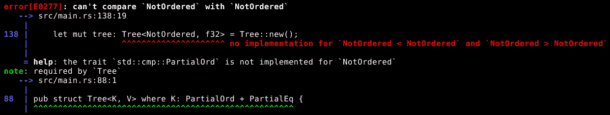
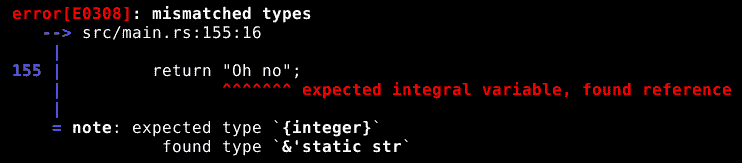
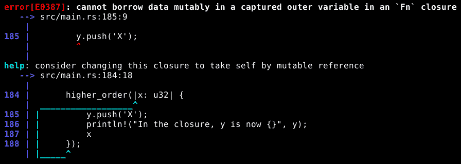

# 第七章：泛型类型

有时候，数据类型的细节并不重要。无论数据类型是什么，只要它是 *某种*，我们的代码都会正常工作。

我们已经多次看到这类情况的例子，比如 `Result`、`Option`、`Rc` 等等。所有这些，以及更多，都可以与广泛的不同的数据类型一起工作，因为它们有一个或多个 *泛型类型参数*。

在本章中，我们将做以下事情：

+   学习泛型类型参数是什么

+   学习如何将泛型类型参数应用于数据类型

+   学习如何将泛型类型参数应用于函数

+   学习泛型类型和特例对象如何不同

+   创建一个完整且有用的二叉树数据结构

# 具有泛型类型参数的类型

当一个数据类型具有泛型类型参数时，它严格来说根本不是一个数据类型。它是一系列数据类型。让我们暂时看看 `Option`。`Option` 定义如下：

```rs
pub enum Option<T> {
    None,
    Some(T),
}
```

这意味着它有一个名为 `T` 的泛型类型参数。如果我们尝试在不指定泛型类型参数类型的情况下使用 `Option`，Rust 将报告错误：

```rs
let x: Option = None;
```

它产生了这个错误：



这实际上在告诉我们，`Option` 不是一个可用的数据类型。然而，`Option<u32>` 是，`Option<String>` 也是，`Option<Result<f64, String>>>` 等等。此外，`Option<u32>` 和 `Option<String>` 不是同一类型，Rust 也不会假装它们是。它们是两种具有相同形状的不同数据类型。

当我们编写 `Option<String>` 时，我们是在告诉 Rust 使用 `String` 替换定义中的 `T` 来创建一个数据类型。

# 限制可用于类型参数的类型

有时候，我们需要我们的类型具有泛型类型参数，但我们不希望它们是 *完全* 泛型的。例如，我们可能需要替换参数的类型能够在不同线程之间移动，或者支持转换为 `String`，或者任何其他事情。幸运的是，Rust 提供了一种方法让我们能够做到这一点。

我们通过要求泛型类型参数具有一个或多个特质来限制泛型类型参数的范围。这被称为特例约束。让我们以一个基本的二叉树数据结构为例。

二叉树由节点组成。每个节点都有一个键，一个相关的值，以及两个子树：一个用于键小于当前节点键的节点，另一个用于键大于当前节点键的节点。在树中查找具有特定键的节点只是将其与根节点键进行比较，然后如果它不是相同的，就选择较小的或较大的树，并在那里做同样的事情，依此类推。

这里有一对表示二叉树的结构，具有用于键和值类型的泛型类型参数，以及对键类型的特例约束，以确保它实际上支持我们为二叉树键所需的比较：

```rs
struct TreeNode<K, V> where K: PartialOrd + PartialEq {
    key: K,
    value: V,
    lesser: Option<Box<TreeNode<K, V>>>,
    greater: Option<Box<TreeNode<K, V>>>,
}
```

这里是第二个结构，它为我们提供了存储空树的方法：

```rs
pub struct Tree<K, V> where K: PartialOrd + PartialEq {
    root: Option<Box<TreeNode<K, V>>>,
}
```

我们需要第二个结构，以便可以表示不包含数据的树。在这两个结构中，我们在结构名称之后放置了通配类型参数的名称，并在其之间放置了 `<` 和 `>`，然后包含了一个 `where` 子句，说明 `K: PartialOrd + PartialEq`。这意味着任何替换 `K` 的数据类型都必须实现 `PartialOrd` 特性和 `PartialEq` 特性。如果我们尝试使用不实现这两个特性的数据类型，编译器将拒绝它。

我们将在第八章 重要标准特性中检查 `PartialOrd` 和 `PartialEq` 的具体含义，*重要标准特性*。大致来说，它们意味着 *大于* 和 *小于* 的概念适用于键。

我们还指定了 `TreeNode` 中的 `lesser` 和 `greater` 以及 `Tree` 中的 `root` 是具有 `Option<Box<TreeNode<K, V>>>` 数据类型的变量。这意味着它们是可选的（它们可以包含一个有意义的值，或者 `None`），如果它们包含一个有意义的值，则该值存储在堆上，并且存储在堆上的值是一个 `TreeNode`，其键的数据类型为 `K`，值的数据类型为 `V`。

# 实现具有泛型类型参数的类型的功能

如果我们想要有属于具有泛型类型参数的类型的功能的函数，我们需要有一个实现块，就像类型没有这些参数一样，但我们还需要参数化实现块。

这里是 `TreeNode` 类型的实现块的开始：

```rs
impl<K, V> TreeNode<K, V> where K: PartialOrd + PartialEq {
```

现在，`TreeNode<K, V>` 是我们正在实现功能的类型。`impl<K, V>` 部分告诉编译器 `K` 和 `V` 是泛型类型参数，而 `K: PartialOrd + PartialEq` 告诉它这些参数的特性行界。它并不只是使用为数据类型指定的相同泛型类型参数和特性行界，因为实现块可以与数据类型不同；例如，有一个为 `Box<Any>` 提供了 `downcast` 函数的实现块，这在其他情况下不是 `Box` 的一部分。如果实现块的特性行界与实际使用的类型参数匹配，则块中的函数是可用的。如果不匹配，则函数不可用。

在实现块内部，我们可以使用 `K` 和 `V` 作为数据类型的名称：

```rs
    fn set(&mut self, key: K, value: V) {
        if key == self.key {
            self.value = value;
        }
        else if key < self.key {
            match self.lesser {
                None => {
                    self.lesser = Some(
                        Box::new(TreeNode {key, value, lesser: None, 
                        greater: None })
                    );
                },
                Some(ref mut lesser) => {
                    lesser.set(key, value);
                }
            }
        }
        else {
            match self.greater {
                None => {
                    self.greater = Some(
                        Box::new(TreeNode {key, value, lesser: None, 
                        greater: None })
                    );
                }
                Some(ref mut greater) => {
                    greater.set(key, value);
                }
            }
        }
    }
```

在这里，我们有将一个键与二叉树中的值关联起来的代码。它从一个相当标准的函数定义开始，除了我们使用 `K` 和 `V` 来指定 `key` 和 `value` 参数的数据类型。我们以可变借用 `self` 的方式，因为设置包含的值是一种变异。

在函数内部，我们首先比较当前节点的键与我们正在寻找的键，如果它们相同，我们就将值赋给当前节点。

接下来，我们检查我们正在寻找的键是否小于或大于当前节点的键，并使用这一点来选择要下行的树的哪个分支。无论哪种方式，我们都使用`match`表达式来确定该侧是否确实有一个分支，如果没有，我们就创建一个包含指定键和值的分支。如果那一侧确实有一个分支，我们就调用该节点的`set`函数，它再次执行相同的事情，只是这次使用不同的`self`。

# 将泛型类型用作函数返回值

在具有泛型类型参数的实现块中，我们也可以将这些参数名称用作函数返回值的一部分。

这里是一个使用泛型类型参数名称在其`return`数据类型中的示例函数：

```rs
    fn get_ref(&self, key: K) -> Result<&V, String> {
        if key == self.key {
            return Ok(&self.value);
        }
        else if key < self.key {
            match self.lesser {
                None => {
                    return Err("No such key".to_string());
                }
                Some(ref lesser) => {
                    return lesser.get_ref(key);
                }
            }
        }
        else {
            match self.greater {
                None => {
                    return Err("No such key".to_string());
                }
                Some(ref greater) => {
                    return greater.get_ref(key);
                }
            }
        }
    }
```

此函数在二叉树中查找键，并返回关联值的不可变借用，如果键不在树中，则返回错误信息。

它的结构与之前看到的`set`函数非常相似，但由于我们没有任何更改或请求可变借用，`self`也可以是一个普通的不可变借用。

# 涉及泛型类型参数的编译器错误

我们树结构的要求是用于键的数据类型必须具有`PartialOrd`和`PartialEq`特质。`&str`类型恰好具有这些特质，因此我们可以使用`&str`作为键：

```rs
let mut tree: Tree<&'static str, f32> = Tree::new();

tree.set("first key", 12.65);
tree.set("second key", 99.999);
tree.set("third key", -128.5);
tree.set("fourth key", 67.21);

println!("tree.get_ref(\"third key\") is {}", match tree.get_ref("third key") {
    Err(_) => {println!("Invalid!"); &0.0},
    Ok(x) => x,
});
```

这里，我们创建了一个`Tree<&'static str, f32>`，或者是一个将静态字符串映射到 32 位浮点数的树。如果我们编译并运行包含此片段的完整程序，一切都会完美运行。

另一方面，此数据类型不具有`PartialOrd`特质：

```rs
pub enum NotOrdered {
    A,
    B,
    C,
}
```

如果我们将`NotOrdered`替换为`&'static str`作为树的键类型，我们突然得到七个不同的编译器错误，这可能会填满整个屏幕。其中大多数看起来像这样：



这告诉我们该函数是在一个需要`PartialOrd`和`PartialEq`的实现块中定义的。由于我们的`NotOrdered`数据类型没有这些特质，我们试图调用的函数不存在，编译器正在告诉我们这一点。

在错误列表的顶部，可能已经滚动到屏幕之外，是不同的错误信息：



此错误信息比其他错误信息更有帮助，但它源于同一原因。我们的`Tree`数据类型需要一个键类型，其值可以与其他相同类型的值进行比较，而`NotOrdered`根本不提供这一点。

# 实现块之外的函数上的泛型类型

即使它们不是实现块的一部分，也可以为函数使用泛型类型参数。这看起来像这样：

```rs
fn print_generic<T>(value: T) where T: Display {
    println!("{}", value);
}
```

此函数有一个泛型类型参数`T`，可以是任何具有`Display`特质的任何数据类型。这意味着，如果此函数被定义，我们可以做这样的事情：

```rs
print_generic(12.7);
print_generic("Hello");
print_generic(75);
```

每一行都调用一个不同的`print_generic`函数，针对参数的数据类型进行了特殊化。编译器为每个我们使用的`print_generic`版本生成代码，每个版本接受不同数据类型的参数。

当然，`print_generic`并没有做`println!`宏没有做的事情，但它用来展示独立函数的泛型类型参数的用法。

# 编写特性界限的替代方法

到目前为止，我们一直将特性界限写作`where`子句，但有两种不同的方式来编写它们。`where`子句的好处是它位于一边，允许我们编写甚至复杂的特性界限而不会干扰到阅读函数或数据类型声明。

第一种替代方法是将特性界限放在泛型类型参数名称旁边，如下所示：

```rs
impl<K: PartialOrd + PartialEq, V> TreeNode<K, V> {
```

对于一个独立函数，这种技术看起来是这样的：

```rs
fn print_generic<T: Display>(value: T) {
```

这对于只有简单特性界限的数据类型或函数来说可能很好，但我们可以看到，即使只有两个必需的特性，`TreeNode`实现块也变得有点难以阅读。特性界限有点打断了流程，当我们想要找到数据类型名称时，它会让我们去寻找。

还有另一种指定特性界限的方法，但这只适用于函数：

```rs
fn requires_trait(value: impl Display)  {
```

我们在这里说的是`value`参数可以是任何具有`Display`特性的数据类型。与任何其他具有泛型类型参数的函数一样，编译器将为用于`value`的每个实际数据类型生成函数的不同版本。然而，使用这种语法，我们没有为泛型类型参数命名，因此我们无法在函数的其他地方引用它。

在函数体内部，这通常不是什么大问题，因为我们通常可以跳过在函数体内指定数据类型，而只依赖编译器来推断它。

我们也可以使用类似的语法来指定函数的返回类型，这很方便，因为如果我们没有为一个或多个参数类型命名，编写返回类型可能会很困难：

```rs
fn requires_trait(value: impl Display) -> impl Display {
```

这并不意味着只要实现了`Display`（正确的方式是返回一个特性对象，例如`Box<dyn Display>`），函数就可以返回任何数据类型，但我们所关心的是返回类型*确实*实现了`Display`，并且我们希望编译器推断出返回类型的细节。

为了使这一点更清晰，这里有一个尝试返回两种不同数据类型的函数，这两种数据类型都实现了`Display`特性：

```rs
fn faulty_return(sel: bool) -> impl Display {
    if sel {
        return 52;
    } else {
        return "Oh no";
    }
}
```

这里是 Rust 在尝试编译它时给出的错误信息：



当它找到 `return 52` 时，Rust 会检查 `52` 是否实现了 `Display` 特质（它实现了）并决定函数的实际返回类型是某种整数形式。然后，它找到第二个 `return` 并决定有问题，因为尽管 `"Oh no"` 也实现了 `Display` 特质，但它肯定不是整数。返回 `impl Display` 或类似的类型并不意味着返回任何实现了 `Display` 的类型；这意味着确定我们返回的具体类型，只要它实现了 `Display`。

# 泛型类型与特质对象

我们可以使用特质对象以非常类似的方式使用泛型类型参数。从一个角度来看，这两个函数做的是同一件事：

```rs
fn print_generic<T>(value: T) where T: Display {
    println!("{}", value);
}
```

这可能看起来与之前的代码做的是同一件事：

```rs
fn print_trait(value: &dyn Display) {
    println!("{}", value);
}
```

第一个有一个带有特质边界的泛型类型参数，第二个接受一个特质对象，这意味着它们都可以与许多不同的数据类型一起工作，只要相关类型具有 `Display` 特质。

然而，在底层，它们非常不同。泛型函数用于生成一个针对传递给它的每个数据类型在编译器运行时专门化的函数版本。这意味着当我们调用函数时，程序正在运行，计算机不需要花费任何时间考虑各种数据类型之间的差异。它只是调用编译器告诉它使用的函数，即针对实际使用的数据类型专门化的版本。这更快，但所有各种泛型函数版本会使程序稍微大一些。

将基于泛型类型的函数模式转换为针对特定类型的多达多个实际函数的过程称为 *单态化*。

另一方面，接受特质对象作为其参数的函数只有一个版本，但计算机在运行时必须处理具有 `Display` 特质的各个数据类型之间的差异。这较慢，但需要的内存略少。

作为一条经验法则，当你能使用泛型类型参数时，选择使用它们。当它们不能在编译时完成时，我们在运行时做事情。

# 高阶函数和代表函数的特质边界

高阶函数是一种接受另一个函数或闭包作为参数的函数。在 Rust 中，有三个相对不寻常的特质允许我们指定一个函数或闭包作为参数的特质边界：`Fn`、`FnOnce` 和 `FnMut`。

这些特质之间的区别由它们允许的变量访问类型定义：

+   `FnOnce` 是这些特质中最广泛应用的，因为它对可以实现它的类型的要求最少。`FnOnce` 只保证可以安全地调用它一次。消耗 `self` 的函数是一个自然的 `FnOnce` 的例子，因为消耗了 `self`，它就不再有 `self` 可以在未来被调用。可以安全多次调用的函数和闭包仍然实现 `FnOnce`，因为精确地调用它们一次不是错误。这意味着一个被限制为 `FnOnce` 的变量可以接受任何类型的函数或闭包。

+   `FnMut` 是应用最广泛的特质。`FnMut` 保证可以多次调用它是安全的，但它不保证不会通过可变借用在代码的其他地方改变变量值。使用 `&mut self` 的函数是一个自然的 `FnMut` 的例子，因为它可能会改变其 `self` 中包含的一个或多个变量。不能或实际上没有改变任何外部变量的函数和闭包仍然实现 `FnMut`，因为在允许变动的位置使用它们不是错误。

+   `Fn` 是应用最少的，因为它保证可以多次调用，并且不会改变任何外部变量。任何是 `Fn` 的东西都可以安全地用于期望 `FnMut` 或 `FnOnce` 的地方，但反过来则不成立。

这意味着当我们是接收者时，如果可能的话，我们应该优先接受 `FnOnce`，其次是 `FnMut`，最后是 `Fn`，当我们真正需要所有这些保证时，这样就可以给发送数据值给我们的人提供最大的灵活性，让他们可以选择发送什么。

这里是一个非常简单的更高阶函数，它使用特质界限来指定可以分配给 `f` 参数的函数类型：

```rs
fn higher_order(f: impl FnOnce(u32) -> u32) {
    f(5);
}
```

因此，这看起来有点奇怪。`FnOnce(u32) -> u32` 是我们要求 `f` 实现的数据类型的特质的完整名称。允许我们为 `Fn`、`FnMut` 和 `FnOnce` 指定参数和返回类型的特殊语法是这些特质的独特之处；我们无法在其他地方做类似的事情。

为了明确起见，该函数定义也可以写成如下形式：

```rs
fn higher_order2<F>(f: F) where F: FnOnce(u32) -> u32 {
    f(5);
}
```

我们也可以这样写同样的内容：

```rs
fn higher_order3<F: FnOnce(u32) -> u32>(f: F) {
    f(5);
}
```

所有的前面代码都意味着相同的意思：函数的 `f` 参数需要实现 `FnOnce` 特质，并接受一个 `u32` 参数，并返回一个 `u32`。

下面是一段调用我们的 `higher_order` 函数并传递一个闭包作为 `f` 的值的代码：

```rs
let mut y = "y".to_string();
higher_order(|x: u32| {
    y.push('X');
    println!("In the closure, y is now {}", y);
    x
});
println!("After higher_order, y is {}", y);
```

这个闭包有一个名为 `x` 的参数，定义在 `|` 和 `|` 符号之间，但它也访问了第一行定义的 `y` 变量。此外，它改变了该变量的值，这意味着它需要可变访问。因此，这个闭包实现了 `FnOnce` 和 `FnMut`，但没有实现 `Fn`。

如果我们将 `higher_order` 改为需要 `Fn` 特性并尝试编译此代码，我们将得到编译器错误，如下面的截图所示：



这个错误并不特别具有启发性。它的意思是，我们告诉 `higher_order` 需要一个 `Fn`，然后我们传递给它一个闭包，因此它必须是 `Fn`，但我们试图在闭包内部执行一个修改操作，在那里我们没有可变的借用，因为 Rust 确定闭包必须具有 `Fn` 特性，所以它报告了一个关于尝试在不可变变量上执行修改操作的错误。

为了修复这个问题，我们只需要将 `higher_order` 函数的 `f` 参数的特征约束改回 `FnOnce`（或 `FnMut`），这样闭包就可以在 `y` 上执行 `push` 操作。

一旦我们将 `f` 恢复到具有适当的特征约束，这段代码实际上做了什么？：

1.  创建一个包含 `String` 的可变变量 `y`

1.  构建一个捕获 `y` 变量的可变借用的闭包，并接受一个 `x` 参数

1.  将这个闭包传递给 `higher_order` 作为 `f` 参数的值

1.  `higher_order` 然后调用 `f`（即我们的闭包），并将 `5` 作为其 `x` 参数的值传递

1.  在闭包内部，发生以下情况：

    1.  字符 `'X'` 被追加到存储在 `y` 中的字符串

    1.  打印 `y` 的新值

    1.  返回 `x` 的值，并成为 `f(5)` 表达式的结果

1.  `higher_order` 返回

1.  打印 `y` 变量的当前值

注意，闭包内部的代码只有在闭包被调用时才会运行，但它可以访问在创建它的作用域中定义的变量。

两个 `y` 的打印输出都打印了字符串 `yX`，因为它们都引用了同一个实际变量，无论是直接引用还是通过可变借用。

# 完整实现了具有泛型类型参数的二叉树

我们终于在我们对 Rust 的探索中取得了足够的进步，可以产生一些真正有用的东西。我们的二叉树仍然可以通过多种方式改进，但它确实做到了它被设计要做的事情：它允许我们轻松地存储和检索任意数量的键/值对。

我们没有努力确保二叉树保持平衡，这意味着每个节点的左右分支的高度大致相同，因为那不会增加我们对泛型类型讨论的内容。如果我们这样做，这个数据结构也将保证是高效的。平衡二叉树在任意键/值数据结构方面几乎是最优的。

因此，这里我们有一个完整、有用的数据结构。首先，我们有实际的结构，它存储树节点数据：

```rs
struct TreeNode<K, V> where K: PartialOrd + PartialEq {
    key: K,
    value: V,
    lesser: Option<Box<TreeNode<K, V>>>,
    greater: Option<Box<TreeNode<K, V>>>,
}
```

接下来，我们有一个实现块来定义 `TreeNode` 类型的功能，从 `set` 函数开始，它将一个键与一个值关联：

```rs
impl<K, V> TreeNode<K, V> where K: PartialOrd + PartialEq {
    fn set(&mut self, key: K, value: V) {
        if key == self.key {
            self.value = value;
        }
        else if key < self.key {
            match self.lesser {
                None => {
                    self.lesser = Some(Box::new(TreeNode {key, value, 
                     lesser: None, greater: None }));
                },
                Some(ref mut lesser) => {
                    lesser.set(key, value);
                }
            }
        }
        else {
            match self.greater {
                None => {
                    self.greater = Some(Box::new(TreeNode {key, value, 
                    lesser: None, greater: None }));
                }
                Some(ref mut greater) => {
                    greater.set(key, value);
                }
            }
        }
    }

```

`get_ref`和`get_mut`函数的结构与`set`函数非常相似，因为这三个函数都使用相同的机制在树中搜索具有正确键的节点：

```rs
    fn get_ref(&self, key: K) -> Result<&V, String> {
        if key == self.key {
            return Ok(&self.value);
        }
        else if key < self.key {
            match self.lesser {
                None => {
                    return Err("No such key".to_string());
                }
                Some(ref lesser) => {
                    return lesser.get_ref(key);
                }
            }
        }
        else {
            match self.greater {
                None => {
                    return Err("No such key".to_string());
                }
                Some(ref greater) => {
                    return greater.get_ref(key);
                }
            }
        }
    }

    fn get_mut(&mut self, key: K) -> Result<&mut V, String> {
        if key == self.key {
            return Ok(&mut self.value);
        }
        else if key < self.key {
            match self.lesser {
                None => {
                    return Err("No such key".to_string());
                }
                Some(ref mut lesser) => {
                    return lesser.get_mut(key);
                }
            }
        }
        else {
            match self.greater {
                None => {
                    return Err("No such key".to_string());
                }
                Some(ref mut greater) => {
                    return greater.get_mut(key);
                }
            }
        }
    }
}
```

接下来是定义我们的`Tree`数据类型，它为我们提供了数据结构的公共接口，并允许我们有一个空树：

```rs
pub struct Tree<K, V> where K: PartialOrd + PartialEq {
    root: Option<Box<TreeNode<K, V>>>,
}
```

现在是`Tree`的实现块，其中包含提供我们与`TreeNodes`交互方式的公共函数：

```rs
impl<K, V> Tree<K, V> where K: PartialOrd + PartialEq {
    pub fn new() -> Tree<K, V> {
        Tree { root: None }
    }

    pub fn set(&mut self, key: K, value: V) {
        match self.root {
            None => {
                self.root = Some(Box::new(TreeNode { key, value, 
                lesser: None, greater: None }));
            }
            Some(ref mut root) => {
                root.set(key, value);
            }
        }
    }

    pub fn get_ref(&self, key: K) -> Result<&V, String> {
        match self.root {
            None => {
                return Err("No such key".to_string());
            }
            Some(ref root) => {
                return root.get_ref(key);
            }
        }
    }

    pub fn get_mut(&mut self, key: K) -> Result<&mut V, String> {
        match self.root {
            None => {
                return Err("No such key".to_string());
            }
            Some(ref mut root) => {
                return root.get_mut(key);
            }
        }
    }
}

```

最后，我们有一个主函数来实际使用我们的树，这样我们就可以看到它的实际应用：

```rs
fn main() {
    let mut tree: Tree<&'static str, f32> = Tree::new();

    tree.set("first key", 12.65);
    tree.set("second key", 99.999);
    tree.set("third key", -128.5);
    tree.set("fourth key", 67.21);

    println!("tree.get_ref(\"third key\") is {}", match 
     tree.get_ref("third key") {
        Err(_) => {println!("Invalid!"); &0.0},
        Ok(x) => x,
    });
}

```

# 摘要

在本章中，我们做了以下工作：

+   研究了数据类型和函数的泛型类型参数

+   学习了如何限制泛型类型参数，以确保所选的具体类型实现了适当的特性

+   看到了与泛型类型相关的各种编译器错误以及它们的意义

+   学习了如何使用特性界限和`Fn`、`FnMut`以及`FnOnce`特性来创建高阶函数

+   了解使用泛型类型和使用特性对象之间的差异和相似之处

+   从本章和前几章的知识中汲取知识，构建了一个二叉树数据结构

在下一章中，我们将通过查看更多特性来结束我们的 Rust 之旅，了解它们的意义以及如何实现它们。
