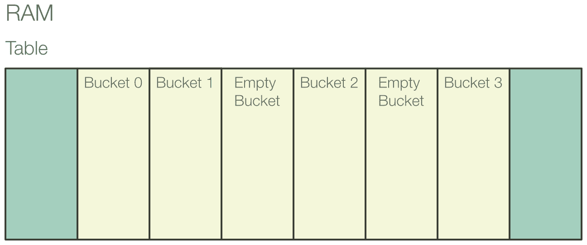

# 与集合一起工作

在本章中，我们将介绍以下食谱：

+   使用向量

+   使用字符串

+   将集合作为迭代器访问

+   使用`VecDeque`

+   使用`HashMap`

+   使用`HashSet`

+   创建自己的迭代器

+   使用 slab

# 简介

**Rust**提供了一组非常广泛的集合供使用。我们将查看大多数集合，了解它们的使用方法，讨论它们的实现方式，以及何时使用和选择它们。本章的大部分内容都集中在迭代器上。Rust 的许多灵活性都来自于它们，因为所有集合（以及更多！）都可以用作迭代器。学习如何使用它们是至关重要的。

在本章中，我们将使用*大 O 表示法*来展示某些算法的有效性。如果您还不知道，这是一种描述算法在处理更多元素时所需时间增长的方式。让我们简要地看看它。

表示无论在集合中存储多少数据，算法所需的时间都将相同。它并没有告诉我们它有多快，只是它不会随着大小的增加而变慢。这是函数的现实理想。一个实际的例子是访问一个无限数字列表中的第一个数字：无论有多少数字，您总是能够立即挑选出第一个。

表示算法将按相同程度减慢每个元素。这并不好，但还可以接受。一个例子是在`for`循环中打印所有数据。

非常糟糕。它告诉我们算法将随着每个元素的加入而变得越来越慢。一个例子是在另一个`for`循环中访问相同数据的数据。

# 使用向量

最基本的集合是向量，或简称为`Vec`。它本质上是一个具有非常低开销的变长数组。因此，它是在您将使用的大部分时间中的集合。

# 如何做到这一点...

1.  在命令行中，使用`cd ..`向上跳一个文件夹，这样您就不再在`chapter-one`中。在接下来的章节中，我们将假设您总是从这一步开始。

1.  使用`cargo new chapter-two`创建一个 Rust 项目，在本章中对其进行工作。

1.  导航到新创建的`chapter-two`文件夹。在本章的其余部分，我们将假设您的命令行当前位于此目录。

1.  在`src`文件夹内，创建一个名为`bin`的新文件夹。

1.  删除生成的`lib.rs`文件，因为我们不是创建一个库。

1.  在`src/bin`文件夹中创建一个名为`vector.rs`的文件。

1.  将以下代码块添加到文件中，并使用`cargo run --bin vector`运行它们：

```rs
1  fn main() {
2    // Create a vector with some elements
3    let fruits = vec!["apple", "tomato", "pear"];
4    // A vector cannot be directly printed
5    // But we can debug-print it
6    println!("fruits: {:?}", fruits);
7
8    // Create an empty vector and fill it
9    let mut fruits = Vec::new();
10    fruits.push("apple");
11   fruits.push("tomato");
12    fruits.push("pear");
13    println!("fruits: {:?}", fruits);
14
15    // Remove the last element
16    let last = fruits.pop();
17    if let Some(last) = last {
18        println!("Removed {} from {:?}", last, fruits);
19    }
20
21    // Insert an element into the middle of the vector
22    fruits.insert(1, "grape");
23    println!("fruits after insertion: {:?}", fruits);
24
25    // Swap two elements
26    fruits.swap(0, 1);
27    println!("fruits after swap: {:?}", fruits);
```

1.  这就是您如何访问向量中的单个元素：

```rs
29    // Access the first and last elements
30    let first = fruits.first();
31    if let Some(first) = first {
32      println!("First fruit: {}", first);
33    }
34    let last = fruits.last();
35    if let Some(last) = last {
36      println!("Last fruit: {}", last);
37    }
38 
39    // Access arbitrary elements
40    let second = fruits.get(1);
41    if let Some(second) = second {
42      println!("Second fruit: {}", second);
43    }
44    // Access arbitrary elements without bonds checking
45    let second = fruits[1];
46    println!("Second fruit: {}", second);
```

1.  下面的几个方法适用于整个向量：

```rs
50    // Initialize the vector with a value
51    // Here, we fill our vector with five zeroes
52    let bunch_of_zeroes = vec![0; 5];
53    println!("bunch_of_zeroes: {:?}", bunch_of_zeroes);
54 
55    // Remove some item and shift all that come after
56    // into place
57    let mut nums = vec![1, 2, 3, 4];
58    let second_num = nums.remove(1);
59    println!("Removed {} from {:?}", second_num, nums); 
60 
61    // Filter the vector in place
62    let mut names = vec!["Aaron", "Felicia", "Alex", "Daniel"];
63    // Only keep names starting with 'A'
64    names.retain(|name| name.starts_with('A'));
65    println!("Names starting with A: {:?}", names);
66 
67    // Check if the vector contains an element
68    println!("Does 'names' contain \"Alex\"? {}", 
        names.contains(&"Alex"));
69 
70 
71 
72    // Remove consecutive(!) duplicates
73    let mut nums = vec![1, 2, 2, 3, 4, 4, 4, 5];
74    nums.dedup();
75    println!("Deduped, pre-sorted nums: {:?}", nums);
76 
77    // Be careful if your data is not sorted!
78    let mut nums = vec![2, 1, 4, 2, 3, 5, 1, 2];
79    nums.dedup();
80    // Doens't print what you might expect
81    println!("Deduped, unsorted nums: {:?}", nums);
82 
83    // Sort a vector
84    nums.sort();
85    println!("Manually sorted nums: {:?}", nums);
86    nums.dedup();
87    println!("Deduped, sorted nums: {:?}", nums);
88 
89    // Reverse a vector
90    nums.reverse();
91    println!("nums after being reversed: {:?}", nums);
92 
93    // Create a consuming iterator over a range
94    let mut alphabet = vec!['a', 'b', 'c'];
95    print!("The first two letters of the alphabet are: ");
96    for letter in alphabet.drain(..2) {
97      print!("{} ", letter);
98    }
99    println!();
100   // The drained elements are no longer in the vector
101   println!("alphabet after being drained: {:?}", alphabet);
102 
103 
104   // Check if a vector is empty
105   let mut fridge = vec!["Beer", "Leftovers", "Mayonaise"];
106   println!("Is the fridge empty {}", fridge.is_empty());
107   // Remove all elements
108   fridge.clear();
109   println!("Is the fridge now empty? {}", fridge.is_empty());
```

1.  我们可以将一个向量分成两个，然后再将它们合并：

```rs
111   // Split a vector into two pieces
112   let mut colors = vec!["red", "green", "blue", "yellow"];
113   println!("colors before splitting: {:?}", colors);
114   let half = colors.len() / 2;
115   let mut second_half = colors.split_off(half);
116   println!("colors after splitting: {:?}", colors);
117   println!("second_half: {:?}", second_half);
118 
119   // Put two vectors together
120   colors.append(&mut second_half);
121   println!("colors after appending: {:?}", colors);
122   // This empties the second vector
123   println!("second_half after appending: {:?}", second_half);
```

1.  您可能还记得 JavaScript 中的`splice`方法：

```rs
127   let mut stuff = vec!["1", "2", "3", "4", "5", "6"];
128   println!("Original stuff: {:?}", stuff);
129   let stuff_to_insert = vec!["a", "b", "c"];
130   let removed_stuff: Vec<_> = stuff.splice(1..4, 
        stuff_to_insert).collect();
131   println!("Spliced stuff: {:?}", stuff);
132   println!("Removed stuff: {:?}", removed_stuff);
```

1.  如果您正在处理非常大的数据集，您可以优化您向量的性能：

```rs
136   // Initialize the vector with a certain capacity
137   let mut large_vec: Vec<i32> = Vec::with_capacity(1_000_000);
138   println!("large_vec after creation:");
139   println!("len:\t\t{}", large_vec.len());
140   println!("capacity:\t{}", large_vec.capacity());
141 
142   // Shrink the vector as close as possible to its length
143   large_vec.shrink_to_fit();
144   println!("large_vec after shrinking:");
145   println!("len:\t\t{}", large_vec.len());
146   println!("capacity:\t{}", large_vec.capacity());
147 
148   // Remove some item, replacing it with the last
149   let mut nums = vec![1, 2, 3, 4];
150   let second_num = nums.swap_remove(1);
151   // This changes the order, but works in O(1)
152   println!("Removed {} from {:?}", second_num, nums);
153 }
```

# 它是如何工作的...

这个菜谱将比其他菜谱长一些，因为：

+   向量是最重要的集合

+   许多其核心原则，如预分配，也适用于其他集合

+   它包括用于切片的方法，这些方法也可由许多其他集合使用

让我们从一开始。

向量可以通过我们之前提到的构造函数模式 [9] 创建，并通过对每个我们想要存储的元素调用`push`来填充 [10]。因为这是一个非常常见的模式，Rust 为您提供了一个方便的宏，称为`vec!`[3]。虽然其最终效果相同，但该宏通过一些性能优化来实现。

由于`vec!`提供的便利性，其他 Rustacians 已经为其他集合实现了类似的宏，您可以在以下链接中找到：[`crates.io/crates/maplit.`](https://crates.io/crates/maplit)

如果您想要通过重复一个元素来初始化向量，您可以使用第 [52] 行中描述的特殊调用语法来这样做。

`push`的反面是`pop`：它移除向量的最后一个元素，如果向量在之前不为空，则返回它。由于`Vec`的内存布局，我们将在下一节中讨论，此操作以  复杂度完成。如果您不知道这意味着什么，让我重新表述一下：它非常快。这就是为什么向量可以很好地用作**先进后出（FILO）**栈。

如果您需要修改向量的内容，`insert`[22]、`remove` [58] 和 `swap` [26] 应该是显而易见的。有时，尽管如此，您可能想要访问向量中的特定元素。您可以使用`get`来借用索引 [40] 处的元素，并使用`get_mut`来修改它。两者都返回一个只包含`Some`元素的`Option`，如果索引是有效的。然而，大多数时候，这种精细的错误检查对于向量访问是不必要的，因为越界索引通常无法恢复，并且将仅通过解包`Option`来处理。因此，Rust 允许您在`Vec`上调用`Index`运算符，`[]`。这将自动推断其可变性并为您执行解包。

有许多方法可以帮助我们一次性处理整个向量。`retain`是一个非常实用的方法，也被大多数其他集合 [64] 实现。它接受一个所谓的**谓词**，这是一个返回`true`或`false`的函数。它将谓词应用于每个元素，并且只保留返回`true`的元素。

`dedup`移除所有*连续*的重复项 [74]。这意味着对于向量 `[1, 2, 2, 3, 2, 3]`，`dedup`的结果将是 `[1, 2, 3, 2, 3]`，因为只有重复的 2 是连续的。使用它时始终记住这一点，因为它可能会引起难以发现的错误。如果你想移除*所有*重复项，你需要通过首先对向量进行排序来使它们连续。如果你的元素是可比较的，这就像调用`.sort()` [84]一样简单。

使用`drain`创建一个消费迭代器，在访问所有元素的同时移除它们，使你的向量变为空 [96]。这在你需要*处理*你的数据并在之后再次使用空向量来收集更多工作时有用。

如果你从未在其他语言中见过`splice`，你一开始可能会对它做什么感到有些困惑。让我们来看看它，好吗？

`splice`做三件事：

+   它需要一个范围。这个范围将被从向量中*移除*。

+   它需要一个迭代器。这个迭代器将被插入到上一步移除后留下的空间中。

+   它*返回*移除的元素作为迭代器。

如何处理返回的迭代器将是*访问集合作为迭代器*部分中食谱的主题。

# 还有更多...

向量应该是你首选的集合。在内部，它被实现为存储在堆上的连续内存块：


重要的关键字是*连续的*，这意味着内存非常缓存友好。换句话说，向量相当快！向量甚至分配了一些额外的内存，以防你想扩展它。但是，当在向量的开头插入大量数据时要小心：整个堆栈将不得不移动。

最后，你可以看到一点*额外容量*。这是因为`Vec`和许多其他集合在每次需要移动块并且它变得太大时都会预先分配一些额外的内存。这是为了尽可能减少重新分配。你可以通过调用`capacity` [140]来检查向量的确切总空间量。你可以通过使用`with_capacity` [137]来影响预分配。当你大致知道你打算存储多少元素时使用它。当处理大量数据时，这可能会在容量上产生很大差异。

在缩短向量时，额外的容量并不会消失。如果你有一个长度为 10,000，容量为 100,000 的向量，并在其上调用`clear`，你仍然会有 100,000 预先分配的容量。当在内存受限的系统上工作时，如微控制器，这可能会成为一个问题。解决方案是定期在这些向量上调用`shrink_to_fit` [143]。这将使容量尽可能接近长度，但仍允许留下一小部分预先分配的空间。

另一种优化非常大的向量的方法是调用 `swap_remove` [150]。通常，当你从一个向量中移除一个元素时，它后面的所有元素都会向左移动以保持连续的内存。当在一个大向量中移除第一个元素时，这是一项大量工作。如果你不关心向量中元素的精确顺序，你可以调用 `swap_remove` 而不是 `remove`。它通过交换要移除的元素和最后一个元素，并调整长度来实现。这很好，因为你不需要通过移动来填充需要填充的“空洞”，并且因为交换内存是当今处理器中非常快速的操作。

# 使用字符串

Rust 为其字符串提供了异常大的功能。了解它可以在处理原始用户输入时节省你很多麻烦。

# 如何做到这一点...

1.  在 `src/bin` 文件夹中创建一个名为 `string.rs` 的文件。

1.  添加以下代码，并使用 `cargo run --bin string` 运行它：

```rs
1   fn main() {
2     // As a String is a kind of vector,
3     // you can construct them the same way
4     let mut s = String::new();
5     s.push('H');
6     s.push('i');
7     println!("s: {}", s);
8
9     // The String however can also be constructed
10    // from a string slice (&str)
11    // The next two ways of doing to are equivalent
12    let s = "Hello".to_string();
13    println!("s: {}", s);
14    let s = String::from("Hello");
15    println!("s: {}", s);
16
17    // A String in Rust will always be valid UTF-8
18    let s = " Þjóðhildur  ".to_string();
19    println!("s: {}", s);
20
21    // Append strings to each other
22    let mut s = "Hello ".to_string();
23    s.push_str("World");
24
25    // Iterate over the character
26    // A "character" is defined here as a
27    // Unicode Scalar Value
28    for ch in "Tubular".chars() {
29        print!("{}.", ch);
30    }
31    println!();
32    // Be careful though, a "character" might not
33    // always be what you expect
34    for ch in "y̆".chars() {
35        // This does NOT print y̆
36        print!("{} ", ch);
37    }
38    println!();
```

使用以下代码以各种方式拆分字符串：

```rs
42    // Split a string slice into two halves
43    let (first, second) = "HelloThere".split_at(5);
44    println!("first: {}, second: {}", first, second);
45
46    // Split on individual lines
47    let haiku = "\
48                 she watches\n\
49                 satisfied after love\n\
50                 he lies\n\
51                 looking up at nothing\n\
52                 ";
53    for line in haiku.lines() {
54        println!("\t{}.", line);
55    }
56
57    // Split on substrings
58    for s in "Never;Give;Up".split(';') {
59        println!("{}", s);
60    }
61    // When the splitted string is at the beginning or end,
62    // it will result in the empty string
63    let s: Vec<_> = "::Hi::There::".split("::").collect();
64    println!("{:?}", s);
65
66    // If you can eliminate the empty strings at the end
67    // by using split_termitor
68    let s: Vec<_> = "Mr. T.".split_terminator('.').collect();
69    println!("{:?}", s);
70
71    // char has a few method's that you can use to split on
72    for s in "I'm2fast4you".split(char::is_numeric) {
73        println!("{}", s);
74    }
75
76    // Split only a certain amount of times
77    for s in "It's not your fault, it's mine".splitn(3,
        char::is_whitespace) {
78        println!("{}", s);
79    }
80
81    // Get only the substrings that match a pattern
82    // This is the opposite of splitting
83    for c in "The Dark Knight rises".matches(char::is_uppercase) {
84        println!("{}", c);
85    }
86
87    // Check if a string starts with something
88    let saying = "The early bird gets the worm";
89    let starts_with_the = saying.starts_with("The");
90    println!(
        "Does \"{}\" start with \"The\"?: {}",
         saying,
         starts_with_the
      );
91    let starts_with_bird = saying.starts_with("bird");
92    println!(
        "Does \"{}\" start with \"bird\"?: {}",
         saying,
         starts_with_bird
      );
93
94    // Check if a string ends with something
95    let ends_with_worm = saying.ends_with("worm");
96    println!("Does \"{}\" end with \"worm\"?: {}", saying,
        ends_with_worm);
```

```rs
97
98    // Check if the string contains something somewhere
99    let contains_bird = saying.contains("bird");
100   println!("Does \"{}\" contain \"bird\"?: {}", saying,
        contains_bird);
```

移除空白：

```rs
105   // Splitting on whitespace might not result in what you expect
106   let a_lot_of_whitespace = "    I   love spaaace     ";
107   let s: Vec<_> = a_lot_of_whitespace.split(' ').collect();
108   println!("{:?}", s);
109   // Use split_whitespace instead
110   let s: Vec<_> = 
        a_lot_of_whitespace.split_whitespace().collect();
111   println!("{:?}", s);
112
113   // Remove leading and trailing whitespace
114   let username = "   P3ngu1n\n".trim();
115   println!("{}", username);
116   // Remove only leading whitespace
117   let username = "   P3ngu1n\n".trim_left();
118   println!("{}", username);
119   // Remove only trailing whitespace
120   let username = "   P3ngu1n\n".trim_right();
121   println!("{}", username);
122
123
124   // Parse a string into another data type
125   // This requires type annotation
126   let num = "12".parse::<i32>();
127   if let Ok(num) = num {
128     println!("{} * {} = {}", num, num, num * num);
129   }
```

修改字符串：

```rs
133   // Replace all occurences of a pattern
134   let s = "My dad is the best dad";
135   let new_s = s.replace("dad", "mom");
136   println!("new_s: {}", new_s);
137
138   // Replace all characters with their lowercase
139   let lowercase = s.to_lowercase();
140   println!("lowercase: {}", lowercase);
141
142   // Replace all characters with their uppercase
143   let uppercase = s.to_uppercase();
144   println!("uppercase: {}", uppercase);
145
146   // These also work with other languages
147   let greek = "ὈΔΥΣΣΕΎΣ";
148   println!("lowercase greek: {}", greek.to_lowercase());
149
150   // Repeat a string
151   let hello = "Hello! ";
152   println!("Three times hello: {}", hello.repeat(3));
153 }
```

# 它是如何工作的...

实质上，作为一种向量，字符串可以通过组合 `new` 和 `push` 来以相同的方式创建；然而，因为这样做非常不方便，所以可以从字符串切片（`&str`）创建一个 `string`，它可以是借用字符串或字面量。这两种在本文档中展示的方法都是等效的：

```rs
    let s = "Hello".to_string();
    println!("s: {}", s);
    let s = String::from("Hello");
    println!("s: {}", s);
```

出于纯粹的个人偏好，我们将使用第一个变体。

在 Rust `1.9` 之前，`to_owned()` 是创建字符串最快的方式。现在，`to_string()` 的性能同样出色，应该优先使用，因为它提供了对所做操作的更多清晰度。我们提到这一点是因为许多旧的教程和指南自那时起就没有更新，仍然使用 `to_owned()`。

Rust 中的所有字符串在 UTF-8 编码中都是有效的 Unicode。这可能会带来一些惊喜，因为我们所知的“字符”本质上是一种拉丁发明。例如，看看那些有字母修饰符的语言——`ä` 是一个独立的字符，还是 `a` 的变体？对于允许极端组合的语言呢？那样的键盘会是什么样子？因此，Unicode 允许你从不同的 Unicode 标量值中组合你的“字符”。使用 `.chars()`，你可以创建一个迭代器，遍历这些标量 [28]。如果你处理非拉丁字符，当你访问组合字符时可能会感到惊讶——`y̆` 不是单个标量，而是两个标量，`y` 和 `̆` [36]。你可以通过使用支持遍历图形的 `Unicode-segmentation` crate 来解决这个问题：[`crates.io/crates/unicode-segmentation.`](https://crates.io/crates/unicode-segmentation)

当在开始处、结束处或连续多次出现模式时分割字符串，每个实例都会分割成空字符串 `""`[107]。当在空格（`' '`）上分割时，这尤其令人讨厌。在这种情况下，你应该使用 `split_whitespace`[110]。否则，`split_terminator` 将从字符串末尾删除空字符串[68]。

顺便说一句，当我们在这个菜谱中提到*模式*时，我们指的是以下三种情况之一：

- 一个字符

- 一个字符串

- 一个接受一个 `char` 的谓词

# 还有更多...

`String` 的实现不应该令人惊讶——它只是一种向量：


# 将集合作为迭代器访问

欢迎来到 Rust 标准库中最灵活的部分之一。正如其名所示，迭代器是一种对集合中项目应用操作的方式。如果你来自 C#，你可能会因为 Linq 而对迭代器已经很熟悉了。Rust 的迭代器在某种程度上是相似的，但它们采用了一种更函数式的方法来处理事物。

由于它们是标准库中极其基础的部分，我们将把这个菜谱完全奉献给展示你可以独立使用它们的各种不同方式。对于实际用例，你可以简单地继续阅读这本书，因为其他大部分菜谱以某种方式或另一种方式使用迭代器。

# 如何做到这一点...

1.  在 `src/bin` 文件夹中，创建一个名为 `iterator.rs` 的文件。

1.  添加以下代码，并使用 `cargo run --bin iterator` 运行它：

```rs
1   fn main() {
2     let names = vec!["Joe", "Miranda", "Alice"];
3     // Iterators can be accessed in many ways.
4     // Nearly all collections implement .iter() for this purpose
5     let mut iter = names.iter();
6     // A string itself is not iterable, but its characters are
7     let mut alphabet = "ABCDEFGHIJKLMNOPQRSTUVWXYZ".chars();
8     // Ranges are also (limited) iterators
9     let nums = 0..10;
10    // You can even create infinite iterators!
11    let all_nums = 0..;
12
13    // As the name says, you can iterate over iterators
14    // This will consume the iterator
15    for num in nums {
16        print!("{} ", num);
17    }
18    // nums is no longer usable
19    println!();
20
21    // Get the index of the current item
22    for (index, letter) in "abc".chars().enumerate() {
23      println!("#{}. letter in the alphabet: {}", index + 1,
          letter);
24    }
```

1.  访问单个项：

```rs
26    // going through an iterator, step by step
27    if let Some(name) = iter.next() {
28        println!("First name: {}", name);
29    }
30    if let Some(name) = iter.next() {
31        println!("Second name: {}", name);
32    }
33    if let Some(name) = iter.next() {
34        println!("Third name: {}", name);
35    }
36    if iter.next().is_none() {
37        println!("No names left");
38    }
39
40    // Arbitrary access to an item in the iterator
41    let letter = alphabet.nth(3);
42    if let Some(letter) = letter {
43      println!("the fourth letter in the alphabet is: {}",
          letter);
44    }
45    // This works by consuming all items up to a point
46    let current_first = alphabet.nth(0);
47    if let Some(current_first) = current_first {
48      // This will NOT print 'A'
49      println!(
50        "The first item in the iterator is currently: {}",
51           current_first
52      );
53    }
54    let current_first = alphabet.nth(0);
55    if let Some(current_first) = current_first {
56      println!(
57        "The first item in the iterator is currently: {}",
58           current_first
59      );
60    }
61
62    // Accessing the last item; This will
63    // consume the entire iterator
64    let last_letter = alphabet.last();
65    if let Some(last_letter) = last_letter {
66      println!("The last letter of the alphabet is: {}",
          last_letter);
67    }
```

1.  将迭代器收集到集合中：

```rs
69    // Collect iterators into collections
70    // This requires an anotation of which collection we want
71    // The following two are equivalent:
72    let nums: Vec<_> = (1..10).collect();
73    println!("nums: {:?}", nums);
74    let nums = (1..10).collect::<Vec<_>>();
75    println!("nums: {:?}", nums)
```

1.  更改正在迭代的项：

```rs
79    // Taking only the first n items
80    // This is often used to make an infinite iterator finite
81    let nums: Vec<_> = all_nums.take(5).collect();
82    println!("The first five numbers are: {:?}", nums);
83
84    // Skip the first few items
85    let nums: Vec<_> = (0..11).skip(2).collect();
86    println!("The last 8 letters in a range from zero to 10:
        {:?}", nums);
87
88    // take and skip accept predicates in the form of
89    // take_while and skip_while
90    let nums: Vec<_> = (0..).take_while(|x| x * x <
      50).collect();
91    println!(
92      "All positive numbers that are less than 50 when squared: 
93        {:?}", nums
94    );
95
96    // This is useful to filter an already sorted vector
97    let names = ["Alfred", "Andy", "Jose", "Luke"];
98    let names: Vec<_> = names.iter().skip_while(|x|
        x.starts_with('A')).collect();
99    println!("Names that don't start with 'A': {:?}", names);
100
101   // Filtering iterators
102   let countries = [
103     "U.S.A.",
        "Germany",
        "France",
        "Italy",
        "India",
        "Pakistan",
        "Burma",
104   ];
105   let countries_with_i: Vec<_> = countries
106     .iter()
107     .filter(|country| country.contains('i'))
108     .collect();
109   println!(
110     "Countries containing the letter 'i': {:?}",
111     countries_with_i
112   );
```

1.  检查迭代器是否包含元素：

```rs
116   // Find the first element that satisfies a condition
117   if let Some(country) = countries.iter().find(|country| 
118     country.starts_with('I')) {
119       println!("First country starting with the letter 'I':
            {}", country);
        }
120
121   // Don't get the searched item but rather its index
122   if let Some(pos) = countries
123     .iter()
124     .position(|country| country.starts_with('I'))
125     {
126       println!("It's index is: {}", pos);
127     }
128
129   // Check if at least one item satisfies a condition
130   let are_any = countries.iter().any(|country| country.len() ==
        5);
131   println!(
132     "Is there at least one country that has exactly five 
         letters? {}",
133      are_any
134   );
135
136   // Check if ALL items satisfy a condition
137   let are_all = countries.iter().all(|country| country.len() ==
        5);
138   println!("Do all countries have exactly five letters? {}",
        are_all);
```

1.  用于数值项的有用操作：

```rs
141   let sum: i32 = (1..11).sum();
142   let product: i32 = (1..11).product();
143   println!(
144     "When operating on the first ten positive numbers\n\
145      their sum is {} and\n\
146      their product is {}.",
147      sum, product
148   );
149 
150   let max = (1..11).max();
151   let min = (1..11).min();
152   if let Some(max) = max {
153     println!("They have a highest number, and it is {}", max);
154   }
155   if let Some(min) = min {
156     println!("They have a smallest number, and it is {}", min);
157   }
```

1.  组合迭代器：

```rs
161   // Combine an iterator with itself, making it infinite
162   // When it reaches its end, it starts again
163   let some_numbers: Vec<_> = (1..4).cycle().take(10).collect();
164   // Reader exercise: Try to guess what this will print
165   println!("some_numbers: {:?}", some_numbers);
166 
167   // Combine two iterators by putting them after another
168   let some_numbers: Vec<_> = (1..4).chain(10..14).collect();
169   println!("some_numbers: {:?}", some_numbers);
170 
171   // Zip two iterators together by grouping their first items
172   // together, their second items together, etc.
173   let swiss_post_codes = [8957, 5000, 5034];
174   let swiss_towns = ["Spreitenbach", "Aarau", "Suhr"];
175   let zipped: Vec<_> =
        swiss_post_codes.iter().zip(swiss_towns.iter()).collect();
176   println!("zipped: {:?}", zipped);
177 
178   // Because zip is lazy, you can use two infine ranges
179   let zipped: Vec<_> = (b'A'..)
180     .zip(1..)
181     .take(10)
182     .map(|(ch, num)| (ch as char, num))
183     .collect();
184   println!("zipped: {:?}", zipped);
```

1.  将函数应用于所有项：

```rs
188   // Change the items' types
189   let numbers_as_strings: Vec<_> = (1..11).map(|x|
        x.to_string()).collect();
190   println!("numbers_as_strings: {:?}", numbers_as_strings);
191 
192   // Access all items
193   println!("First ten squares:");
194   (1..11).for_each(|x| print!("{} ", x));
195   println!();
196 
197   // filter and map items at the same time!
198   let squares: Vec<_> = (1..50)
199     .filter_map(|x| if x % 3 == 0 { Some(x * x) } else { None })
200     .collect();
201   println!(
202     "Squares of all numbers under 50 that are divisible by 3: 
203      {:?}", squares
204   );
```

1.  迭代器的真正优势来自于它们的组合：

```rs
208   // Retrieve the entire alphabet in lower and uppercase:
209   let alphabet: Vec<_> = (b'A' .. b'z' + 1) // Start as u8
210     .map(|c| c as char) // Convert all to chars
211     .filter(|c| c.is_alphabetic()) // Filter only alphabetic chars
212     .collect(); // Collect as Vec<char>
213   println!("alphabet: {:?}", alphabet);
214 }
```

# 它是如何工作的...

*这个方法非常重要*。无论你做什么，或者使用哪个库，它都将在某个地方使用迭代器。所有展示的操作都可以用于任何集合和实现了 `iterator` 特性的所有类型。

在第一部分，我们探讨了创建迭代器的不同方法。我提到范围是*有限的*，因为为了可迭代性，范围类型必须实现 `Step`。`char` 不实现，所以你不能将 `'A'..'D'` 作为迭代器使用。因此，在 [209] 行中，我们以字节的形式迭代字符：

```rs
    let alphabet: Vec<_> = (b'A' .. b'z' + 1) // Start as u8
        .map(|c| c as char)            // Convert all to chars
        .filter(|c| c.is_alphabetic()) // Filter only alphabetic chars
        .collect(); // Collect as Vec<char>
```

我们必须将范围的上限设置为 `b'z' + 1`，因为范围是非包含的。你可能已经注意到，这个事实有时会使使用范围变得令人困惑。这就是为什么在夜间编译器上，你可以使用包含范围（第十章，*使用实验性夜间功能*，*迭代包含范围*）。

尽管如此，让我们回到我们的配方。在迭代过程中，你可以选择使用`enumerate`来获取一个迭代计数器 [22]。这就是为什么 Rust 可以避开不支持传统的 C 风格`for`循环语法。你很可能在其他语言中看到过以下 C 代码的某种变体：

```rs
for (int i = 0; i < some_length; i++) { 
    ... 
}
```

Rust 禁止这样做，因为基于范围的`for`循环几乎总是更简洁，如果你来自 Python 背景，你将会知道这一点，因为它开创了这种限制。事实上，大多数编程语言都已经将它们的范式转向促进基于范围的循环。在极少数情况下，如果你真的实际上想了解你的迭代计数，你可以使用`enumerate`来模拟这种行为。

当使用`nth`[41]访问单个项时，你必须注意两件事：

+   它通过遍历所有项目直到找到你想要的项目来访问一个项。在最坏的情况下，这是一种 访问。如果你可以的话，使用你收藏的本地访问方法（大多数情况下，这将是通过`.get()`）。

+   它消耗迭代器直到指定的索引。这意味着使用相同参数两次调用`nth`将导致两个不同的返回值 [54]。不要对此感到惊讶。

在使用迭代器的各种访问器时，要注意的另一件事是，它们都返回一个`Option`，如果迭代器没有更多项目，它将是`None`。

当将迭代器收集到集合中时，以下两种形式的注解是完全等价的：

```rs
let nums: Vec<_> = (1..10).collect();
let nums = (1..10).collect::<Vec<_>>();
```

只使用你最喜欢的一种。在这本书中，我们坚持使用第一种形式，因为这是个人偏好的原因。顺便说一下，第二种形式被称为*turbofish*。这是因为`::<>`看起来像某种鱼类的家族。可爱，不是吗？两种形式也能自动推断出它们的确切类型，所以你不需要写`Vec<i32>`。内部类型可以用下划线（`_`）省略，如下所示。

`cycle` [163] 接受一个迭代器，并无限重复它。`[1, 2, 3]` 将变成 `[1, 2, 3, 1, 2, 3, 1, ...]`。

`zip` [175] 接受两个迭代器，通过将相同索引的项放入元组中，然后链接它们来创建一个。如果迭代器的大小不同，它将忽略较长迭代器的额外项。例如，`[1, 2, 3]` 与 `['a', 'b', 'c', 'd']` 进行`zip`将变成 `[(1, 'a'), (2, 'b'), (3, 'c')]`，因为 `'d'` 将被丢弃，因为它没有可以与之`zip`的伙伴。如果你将两个无限范围`zip`在一起，你不会有问题，因为`zip`是惰性的，这意味着它只有在真正需要时才会开始`zip`你的迭代器；例如，当使用`take`提取前几个元组 [81]。

如果你需要修改所有项，可以使用 `map`。它也可以用来更改迭代器的底层类型，如第 [182] 行所示。`for_each`与之非常相似，但有一个很大的区别：它不返回任何内容。它基本上就是在迭代器上手动使用 `for` 循环。它的预期用例是在你有很多链式方法调用迭代器的情况下，将 `for_each` 链接起来会更优雅，作为一种 *消费者*。

迭代器经常被链在一起，以编织复杂的转换。如果你发现自己在一个迭代器上调用很多方法，不要担心，因为这正是你应该做的。另一方面，当你发现自己在一个 `for` 循环中做了很多复杂的事情时，你可能需要用迭代器重写那段代码。

当使用 `filter_map`[199] 时，你可以通过返回一个包裹在 `Some` 中的项来保留一个项。如果你想过滤掉它，就返回 `None`。在此之前，你可以以任何你想要的方式更改项，这就是交易中的 `map` 部分。

# 还有更多...

`iter()` 创建了一个 *借用* 项的迭代器。如果你想创建一个 *消费* 项的迭代器——例如，通过移动它们来获取所有权——你可以使用 `into_iter()`。

# 参见

+   在第十章 “遍历包含范围”，*使用实验性夜间功能* 中的配方

# 使用 VecDeque

当你需要定期在向量的开始处插入或移除元素时，你的性能可能会受到很大的影响，因为这将迫使向量重新分配其后的所有数据。在实现队列时，这尤其令人烦恼。因此，Rust 为你提供了 `VecDeque`。

# 如何做到这一点...

1.  在 `src/bin` 文件夹中创建一个名为 `vecdeque.rs` 的文件。

1.  添加以下代码，并使用 `cargo run --bin vecdeque` 运行它：

```rs
1   use std::collections::VecDeque;
2 
3   fn main() {
4     // A VecDeque is best thought of as a
5     // First-In-First-Out (FIFO) queue
6 
7     // Usually, you will use it to push_back data
8     // and then remove it again with pop_front
9     let mut orders = VecDeque::new();
10    println!("A guest ordered oysters!");
11    orders.push_back("oysters");
12 
13    println!("A guest ordered fish and chips!");
14    orders.push_back("fish and chips");
15 
16    let prepared = orders.pop_front();
17    if let Some(prepared) = prepared {
18      println!("{} are ready", prepared);
19    }
20 
21    println!("A guest ordered mozarella sticks!");
22    orders.push_back("mozarella sticks");
23 
24    let prepared = orders.pop_front();
25    if let Some(prepared) = prepared {
26      println!("{} are ready", prepared);
27    }
28 
29    println!("A guest ordered onion rings!");
30    orders.push_back("onion rings");
31 
32    let prepared = orders.pop_front();
33    if let Some(prepared) = prepared {
34      println!("{} are ready", prepared);
35    }
36 
37    let prepared = orders.pop_front();
38    if let Some(prepared) = prepared {
39      println!("{} are ready", prepared);
40    }
41 
42    // You can freely switch your pushing
43    // from front to back and vice versa
44    let mut sentence = VecDeque::new();
45    sentence.push_back("a");
46    sentence.push_front("had");
47    sentence.push_back("little");
48    sentence.push_front("Mary");
49    sentence.push_back("Lamb");
50    println!("sentence: {:?}", sentence);
51 
52    // The same applies to popping data
53    sentence.pop_front();
54    sentence.push_front("Jimmy");
55    sentence.pop_back();
56    sentence.push_back("Cat");
57    println!("sentence: {:?}", sentence);
58 
59 
60    // The rest of the VecDeque's methods are
61    // pretty much the same as the vector's
62    // However, the VecDeque has additional options
63    // when swap removing!
64    let mut some_queue = VecDeque::with_capacity(5);
65    some_queue.push_back("A");
66    some_queue.push_back("B");
67    some_queue.push_back("C");
68    some_queue.push_back("D");
69    some_queue.push_back("E");
70    println!("some_queue: {:?}", some_queue);
71 
72    // This is the same as Vec's swap_remove
73    some_queue.swap_remove_back(2);
74    println!("some_quere after swap_remove_back: {:?}",
        some_queue);
75 
76    // This is the nearly the same, but swaps the removed
77    // element with the first one instead of the last one
78    some_queue.swap_remove_front(2);
79    println!("some_quere after swap_remove_front: {:?}",
        some_queue);
80    }
```

# 它是如何工作的...

`VecDeque` 的大多数接口与 `Vec` 相同。你甚至可以用 `with_capacity` 和其 `swap_remove` 等效方法以相同的方式优化它们。差异来自于 `VecDeque` 更倾向于从两端进行访问。因此，`Vec` 中影响最后一个元素的多个方法在 `VecDeque` 中有两个等效方法：一个用于前端，一个用于后端。这些是：

+   `push` 变成了 `push_front` [46] 和 `push_back` [11]

+   `pop` 变成了 `pop_front` [16] 和 `pop_back` [55]

+   `swap_remove` 变成了 `remove_front` [78] 和 `remove_back` [73]

`VecDeque` 有能力以高效的方式从两端自由地追加或移除元素，这使得它成为 **先进先出**（**FIFO**）队列 [24] 的理想候选者。实际上，它几乎总是这样使用的。

当你发现自己处于一个想要按到达顺序响应任何请求并在之后再次移除它们的情境中时，`VecDeque` 是完成这项工作的理想工具。

# 还有更多...

内部，`VecDeque` 被实现为一个 *环形缓冲区*，也称为 *循环缓冲区*。之所以这样称呼，是因为它的行为就像一个圆圈：末端触及起始端。

它通过分配一个连续的内存块来工作，就像 `Vec` 一样；然而，`Vec` 总是在块的末尾留下额外的容量，而 `VecDeque` 对在块内部留下空位没有任何异议。因此，当你移除第一个元素时，`VecDeque` 并不会将所有元素向左移动，而是简单地留下第一个空位。如果你然后通过 `push_front` 在开始处推入一个元素，它将占用之前释放的位置，而不会触及它后面的元素。

故事中的循环陷阱在于，如果你在使用 `push_back` 时在块的前端有一些容量，但在后端没有，`VecDeque` 将会简单地使用那个空间来分配额外的元素，导致以下情况：


这很好，因为在使用它的时候，你根本不必担心这一点，因为它的迭代方法总是显示给你 *正确的* 顺序！

就像向量一样，当 `VecDeque` 的容量耗尽时，它会自动调整大小并将所有元素移动到一个新的块中。

# 使用 HashMap

如果你想象一下 `Vec` 是一个将索引（0、1、2 等等）分配给数据的集合，那么 `HashMap` 就是一个将任何数据分配给任何数据的集合。它允许你将任意可哈希的数据映射到其他任意数据。哈希和映射，这就是名字的由来！

# 如何做到这一点...

1.  在 `src/bin` 文件夹中，创建一个名为 `hashmap.rs` 的文件。

1.  添加以下代码，并使用 `cargo run --bin hashmap` 运行它：

```rs
1   use std::collections::HashMap; 
2 
3   fn main() {
4     // The HashMap can map any hashable type to any other
5     // The first type is called the "key"
6     // and the second one the "value"
7     let mut tv_ratings = HashMap::new();
8     // Here, we are mapping &str to i32
9     tv_ratings.insert("The IT Crowd", 8);
10    tv_ratings.insert("13 Reasons Why", 7);
11    tv_ratings.insert("House of Cards", 9);
12    tv_ratings.insert("Stranger Things", 8);
13    tv_ratings.insert("Breaking Bad", 10);
14 
15    // Does a key exist?
16    let contains_tv_show = tv_ratings.contains_key("House of
        Cards");
17    println!("Did we rate House of Cards? {}", contains_tv_show);
18    let contains_tv_show = tv_ratings.contains_key("House");
19    println!("Did we rate House? {}", contains_tv_show);
20 
21    // Access a value
22    if let Some(rating) = tv_ratings.get("Breaking Bad") {
23      println!("I rate Breaking Bad {} out of 10", rating);
24    }
25 
26    // If we insert a value twice, we overwrite it
27    let old_rating = tv_ratings.insert("13 Reasons Why", 9);
28    if let Some(old_rating) = old_rating {
29      println!("13 Reasons Why's old rating was {} out of 10",
          old_rating);
30    }
31    if let Some(rating) = tv_ratings.get("13 Reasons Why") {
32      println!("But I changed my mind, it's now {} out of 10",
          rating);
33    }
34 
35    // Remove a key and its value
36    let removed_value = tv_ratings.remove("The IT Crowd");
37    if let Some(removed_value) = removed_value {
38       println!("The removed series had a rating of {}",
           removed_value);
39    }
40 
41    // Iterating accesses all keys and values
42    println!("All ratings:");
43    for (key, value) in &tv_ratings {
44      println!("{}\t: {}", key, value);
45    }
46 
47    // We can iterate mutably
48    println!("All ratings with 100 as a maximum:");
49    for (key, value) in &mut tv_ratings {
50      *value *= 10;
51      println!("{}\t: {}", key, value);
52    }
53 
54    // Iterating without referencing the HashMap moves its
        contents
55    for _ in tv_ratings {}
56    // tv_ratings is not usable anymore
```

如果你不需要同时访问键和值，你可以单独迭代任何一个：

```rs
58    // Like with the other collections, you can preallocate a size
59    // to gain some performance
60    let mut age = HashMap::with_capacity(10);
61    age.insert("Dory", 8);
62    age.insert("Nemo", 5);
63    age.insert("Merlin", 10);
64    age.insert("Bruce", 9);
65 
66    // Iterate over all keys
67    println!("All names:");
68    for name in age.keys() {
69      println!("{}", name);
70    }
71 
72    // Iterate over all values
73    println!("All ages:");
74    for age in age.values() {
75      println!("{}", age);
76    }
77 
78    // Iterate over all values and mutate them
79    println!("All ages in 10 years");
80    for age in age.values_mut() {
81      *age += 10;
82      println!("{}", age);
83    }
84
```

你可以使用 entry API 为不在 `HashMap` 中的键分配默认值：

```rs
87    {
88      let age_of_coral = age.entry("coral").or_insert(11);
89      println!("age_of_coral: {}", age_of_coral);
90    }
91    let age_of_coral = age.entry("coral").or_insert(15);
92    println!("age_of_coral: {}", age_of_coral);
93 }
```

# 它是如何工作的...

如前所述，`HashMap` 是一个将一种类型的数据映射到另一种类型的集合。你是通过调用 `insert` 并传递你的键及其值 [9] 来做到这一点的。如果键已经有一个值，它将被覆盖。这就是为什么 `insert` 返回一个 `Option`：如果之前有一个值，它返回旧值 [27]，否则返回 `None`。如果你想确保你没有覆盖任何东西，确保在插入你的值之前检查 `contains_key` 的结果 [16]。

当使用无效键调用 `get` 和 `remove` 时，它们都不会崩溃。相反，它们返回一个 `Result`。在 `remove` 的情况下，这个 `Result` 包含被移除的值。

与大多数集合一样，你可以选择迭代你的数据，通过借用键值对[43]、在修改值的同时借用键[49]，或者移动它们全部[55]。由于其性质，`HashMap` 还允许你另外三个选项：借用所有值[74]、修改所有值[80]或借用所有键[68]。你可能已经注意到，有一个组合是缺失的：你不能修改键。永远不能。这是你使用 `HashMap` 时签订的合同的一部分。在下面解释 `HashMap` 的实现时，你会看到，因为键的哈希实际上是索引，修改键相当于删除条目并重新创建它。这一点在设计选择中得到了很好的体现，即不允许你修改键。

最后但同样重要的是，`Entry` API 允许你访问可能存在或不存在的一个值的抽象。大多数时候，它与 `or_insert` 配合使用，以便在找不到键时插入一个默认值 [88]。如果你想根据闭包插入一个默认值，可以使用 `or_insert_with`。entry 对象的另一个用途是将其与其变体匹配：`Occupied` 或 `Vacant`。这相当于直接在键上调用 `get`。请注意，在我们的例子中，我们必须这样限定 entry 的访问范围：

```rs
    {
        let age_of_coral = age.entry("coral").or_insert(11);
        println!("age_of_coral: {}", age_of_coral);
    }
    let age_of_coral = age.entry("coral").or_insert(15);
    println!("age_of_coral: {}", age_of_coral);
```

这是因为 `or_insert` 返回对值的可变引用。如果我们省略了范围，`entry` 的第二次调用就会在存在可变引用的同时借用我们的 `age` 对象，这在 Rust 的借用概念中是一个错误，以确保对资源的无数据竞争访问。

如果你需要针对性能微调你的 `HashMap`，你可以调用你的常用朋友——`with_capacity` [60]、`shrink_to_fit` 和 `reserve` 也适用于它，并且以与其他集合相同的方式工作。

# 还有更多...

在内部，你可以想象 `HashMap` 是作为两个向量实现的：一个表和一个缓冲区。当然，我们在这里简化了；实际上实现中并没有向量。但这个类比足够准确。

如果你想查看实际的实现，请随意查看，因为 Rust 是完全开源的：[`github.com/rust-lang/rust/blob/master/src/libstd/collections/hash/table.rs.`](https://github.com/rust-lang/rust/blob/master/src/libstd/collections/hash/table.rs)

在后台，缓冲区以顺序方式存储我们的值。在前端，我们有一个表，存储着不做什么更多事情的桶，它们仅仅指向它们所代表的元素。当你插入一个键值对时，发生的情况是：

1.  值被放入缓冲区。

1.  键会通过一个哈希函数并成为索引。

1.  表在指定索引处创建一个指向实际值的桶：


Rust 的哈希算法实际上并不生成唯一的索引，出于性能原因。相反，Rust 使用一种巧妙的方式来处理哈希冲突，称为 **罗宾汉桶偷窃** ([`codecapsule.com/2013/11/11/robin-hood-hashing/`](http://codecapsule.com/2013/11/11/robin-hood-hashing/))。

标准库的默认哈希算法被特别选择来保护你免受 HashDoS 攻击（[`cryptanalysis.eu/blog/2011/12/28/effective-dos-attacks-against-web-application-plattforms-hashdos/`](https://cryptanalysis.eu/blog/2011/12/28/effective-dos-attacks-against-web-application-plattforms-hashdos/)）。如果你想榨取每一分性能，你可以做到，在你的 `HashMap` 中不考虑这个特定的风险，或者你可以通过使用 `with_hasher` 构造函数指定一个自定义的哈希器。

许多人已经在 [crates.io](https://crates.io/) 上实现了各种哈希器，所以在自己动手实现解决方案之前，请务必检查它们。

# 使用 HashSet

描述 `HashSet` 的最好方法就是描述它的实现方式：`HashMap<K, ()>`。它只是一个没有值的 `HashMap`！

选择 `HashSet` 的两个最佳理由是：

+   你根本不想处理重复的值，因为它甚至不包括它们。

+   你计划进行大量的（我指的是大量）项目查找——这是问题，*我的集合中是否包含这个特定的项目？* 在向量中，这是通过  完成的，而 `HashSet` 可以通过  完成它。

# 如何做到...

1.  在 `src/bin` 文件夹中创建一个名为 `hashset.rs` 的文件。

1.  添加以下代码，并使用 `cargo run --bin hashset` 运行它：

```rs
1   use std::collections::HashSet;
2 
3   fn main() {
4     // Most of the interface of HashSet
5     // is the same as HashMap, just without
6     // the methods that handle values
7     let mut books = HashSet::new();
8     books.insert("Harry Potter and the Philosopher's Stone");
9     books.insert("The Name of the Wind");
10    books.insert("A Game of Thrones");
11 
12    // A HashSet will ignore duplicate entries
13    // but will return if an entry is new or not
14    let is_new = books.insert("The Lies of Locke Lamora");
15    if is_new {
16      println!("We've just added a new book!");
17    }
18 
19    let is_new = books.insert("A Game of Thrones");
20    if !is_new {
21      println!("Sorry, we already had that book in store");
22    }
23 
24    // Check if it contains a key
25    if !books.contains("The Doors of Stone") {
26      println!("We sadly don't have that book yet");
27    }
28 
29    // Remove an entry
30    let was_removed = books.remove("The Darkness that comes
        before");
31    if !was_removed {
32      println!("Couldn't remove book; We didn't have it to begin 
          with");
33    }
34    let was_removed = books.remove("Harry Potter and the 
        Philosopher's Stone");
35    if was_removed {
36      println!("Oops, we lost a book");
37    }
```

1.  比较不同的 `HashSet`：

```rs
41    let one_to_five: HashSet<_> = (1..6).collect();
42    let five_to_ten: HashSet<_> = (5..11).collect();
43    let one_to_ten: HashSet<_> = (1..11).collect();
44    let three_to_eight: HashSet<_> = (3..9).collect();
45 
46    // Check if two HashSets have no elements in common
47    let is_disjoint = one_to_five.is_disjoint(&five_to_ten);
48    println!(
49      "is {:?} disjoint from {:?}?: {}",
50       one_to_five,
51       five_to_ten,
52       is_disjoint
53    );
54    let is_disjoint = one_to_five.is_disjoint(&three_to_eight);
55    println!(
56      "is {:?} disjoint from {:?}?: {}",
57       one_to_five,
58       three_to_eight,
59       is_disjoint
60    );
61 
62    // Check if a HashSet is fully contained in another
63    let is_subset = one_to_five.is_subset(&five_to_ten);
64    println!(
65      "is {:?} a subset of {:?}?: {}",
66       one_to_five,
67       five_to_ten,
68       is_subset
69    );
70    let is_subset = one_to_five.is_subset(&one_to_ten);
71    println!(
72      "is {:?} a subset of {:?}?: {}",
73       one_to_five,
74       one_to_ten,
75       is_subset
76    );
77 
78    // Check if a HashSet fully contains another
79    let is_superset = three_to_eight.is_superset(&five_to_ten);
80    println!(
81      "is {:?} a superset of {:?}?: {}",
82      three_to_eight,
83      five_to_ten,
84      is_superset
85    );
86    let is_superset = one_to_ten.is_superset(&five_to_ten);
87    println!(
88    "is {:?} a superset of {:?}?: {}",
89      one_to_ten,
90      five_to_ten,
91      is_superset
92    );
```

1.  以各种方式连接两个 `HashSet`：

```rs
96    // Get the values that are in the first HashSet
97    // but not in the second
98    let difference = one_to_five.difference(&three_to_eight);
99    println!(
100     "The difference between {:?} and {:?} is {:?}",
101      one_to_five,
102      three_to_eight,
103      difference
104   );
105 
106   // Get the values that are in either HashSets, but not in both
107   let symmetric_difference = 
        one_to_five.symmetric_difference(&three_to_eight);
108   println!(
109     "The symmetric difference between {:?} and {:?} is {:?}",
110      one_to_five,
111      three_to_eight,
112      symmetric_difference
113   );
114 
115   // Get the values that are in both HashSets
116   let intersection = one_to_five.intersection(&three_to_eight);
117   println!(
118     "The intersection difference between {:?} and {:?} is {:?}",
119      one_to_five,
120      three_to_eight,
121      intersection
122   );
123 
124   // Get all values in both HashSets
125   let union = one_to_five.union(&three_to_eight);
126   println!(
127     "The union difference between {:?} and {:?} is {:?}",
128      one_to_five,
129      three_to_eight,
130      union
131   );
132 }
```

# 它是如何工作的...

由于 `HashSet` 是一种 `HashMap`，所以它的接口大部分都很相似。主要区别在于，在 `HashMap` 中会返回键的值的方法，在 `HashSet` 中只是简单地返回一个 `bool` 来告诉是否已经存在该键 [14]。

此外，`HashSet` 还提供了一些用于分析两个集合 [46 到 92] 和合并它们 [96 到 131] 的方法。如果你曾经听说过集合论或文氏图，或者做过一些 SQL，你将能够识别所有这些。否则，我建议你运行示例，并结合相关的注释研究输出结果。

一些插图可能有助于你。对于分析方法，深绿色部分是参考对象：


对于选择方法，深绿色部分是返回的内容：


# 还有更多...

`HashSet` 的实现没有太多惊喜，因为它与 `HashMap` 完全相同，只是没有任何值！



# 创建自己的迭代器

当你创建一个无限适用的算法或类似集合的结构时，拥有迭代器提供的数十种方法是非常有用的。为此，你必须知道如何告诉 Rust 为你实现它们。

# 如何做...

1.  在`src/bin`文件夹中，创建一个名为`own_iterator.rs`的文件。

1.  添加以下代码，并使用`cargo run --bin own_iterator`运行它：

```rs
1   fn main() {
2     let fib: Vec<_> = fibonacci().take(10).collect();
3     println!("First 10 numbers of the fibonacci sequence: {:?}", 
        fib);
4 
5     let mut squared_vec = SquaredVec::new();
6     squared_vec.push(1);
7     squared_vec.push(2);
8     squared_vec.push(3);
9     squared_vec.push(4);
10    for (index, num) in squared_vec.iter().enumerate() {
11      println!("{}² is {}", index + 1, num);
12    }
13  }
14 
15 
16  fn fibonacci() -> Fibonacci {
17    Fibonacci { curr: 0, next: 1 }
18  }
19  struct Fibonacci {
20  curr: u32,
21  next: u32,
22  }
23  // A custom iterator has to implement
24  // only one method: What comes next
25  impl Iterator for Fibonacci {
26    type Item = u32;
27    fn next(&mut self) -> Option<u32> {
28      let old = self.curr;
29      self.curr = self.next;
30      self.next += old;
31      Some(old)
32    }
33  }
34 
35 
36  use std::ops::Mul;
37  struct SquaredVec<T>
38  where
39  T: Mul + Copy,
40  {
41    vec: Vec<T::Output>,
42  }
43  impl<T> SquaredVec<T>
44  where
45  T: Mul + Copy,
46  {
47    fn new() -> Self {
48    SquaredVec { vec: Vec::new() }
49  }
50  fn push(&mut self, item: T) {
51    self.vec.push(item * item);
52  }
53 }
54 
55  // When creating an iterator over a collection-like struct
56  // It's best to just allow it to be convertible into
57  // a slice of your underlying type.
58  // This way you automatically implemented a bunch of methods
59  // and are flexible enough to change your implementation later
      on
60  use std::ops::Deref;
61  impl<T> Deref for SquaredVec<T>
62  where
63  T: Mul + Copy,
64  {
65    type Target = [T::Output];
66    fn deref(&self) -> &Self::Target {
67    &self.vec
68  }
69 }
```

# 它是如何工作的...

在我们的小例子中，我们将探讨迭代器的两种不同用途：

+   `fibonacci()`，它返回**斐波那契数列**的无穷范围

+   `SquaredVec`，它实现了一个（非常）小的`Vec`子集，有一个特点：它将所有项目平方

斐波那契数列被定义为一系列数字，从 0 和 1 开始，下一个数字是前两个数字的和。它开始如下：0, 1, 1, 2, 3, 5, 8, 13, 21，等等。

根据定义，前两个数是 0 和 1。下一个数是它们的和——*0 + 1 = 1*。然后是*1 + 1 = 2*。然后*2 + 1 = 3*。*3 + 2 = 5*。无限重复。

通过实现`Iterator`特质，可以将一个算法转换为一个迭代器。这很简单，因为它只期望你提供正在迭代的类型和一个单一的方法`next`，该方法获取下一个项目。如果迭代器没有剩余的项目，它应该返回`None`，否则返回`Some`。我们的斐波那契迭代器总是返回`Some`项目，这使得它成为一个无穷迭代器[31]。

相反，我们的`SquaredVec`更像是一个集合而不是一个算法。在第[37]行到[53]行，我们包装了`Vec`接口的最小值——我们可以创建一个`SquaredVec`，并且可以填充它。我们的类型约束`Mul + Copy`意味着用户想要存储的项目必须能够被复制并且能够被乘。我们需要这样做以便平方它，但对于迭代器来说并不相关。`T::Output`只是一个乘法会返回的类型，通常情况下它将是`T`本身。

我们可以再次实现`Iterator`特质，但有一个更简单的方法可以为你提供更多方法。我们可以允许我们的结构体隐式转换为切片`[T]`，这将不仅为你实现`Iterator`，还会实现一大堆其他方法。因为`Vec`已经实现了它，所以你可以直接返回它[67]。如果你的底层集合没有提供切片转换，你仍然可以像以前一样手动实现`Iterator`特质。

# 还有更多...

如果你需要在迭代器中执行很多复杂的逻辑，并且想要将它们与集合稍微分离，你可以通过为你的集合提供`IntoIterator`特质来实现这一点。这将允许你返回一个专门为迭代制作的 struct，它本身提供了`Iterator`特质。

# 使用一块板

一些算法要求你持有可能存在或不存在的数据的访问令牌。在 Rust 中，可以通过使用`Vec<Option<T>>`并把你数据索引当作令牌来解决。但我们可以做得更好！`slab`正是这个概念的优化抽象。

虽然它不是一种通用集合，但如果使用得当，`slab`可以为你提供很多帮助。

# 如何做到这一点...

1.  打开之前为你生成的`Cargo.toml`文件。

1.  在`[dependencies]`下添加以下行：

```rs
slab = "0.4.0"
```

1.  如果你想，你可以访问 slab 的 crates.io 页面([`crates.io/crates/slab`](https://crates.io/crates/slab))来检查最新版本，并使用那个版本。

1.  在`bin`文件夹中创建一个名为`slab.rs`的文件。

1.  添加以下代码，并使用`cargo run --bin slab`运行它：

```rs
1   extern crate slab;
2   use slab::{Slab, VacantEntry};
3 
4   fn main() {
5     // A slab is meant to be used as a limited buffer
6     // As such, you should initialize it with a pre-
7     // defined capacity
8     const CAPACITY: usize = 1024;
9     let mut slab = Slab::with_capacity(CAPACITY);
10 
11    // You cannot simply access a slab's entry by
12    // index or by searching it. Instead, every
13    // insert gives you a key that you can use to
14    // access its entry
15    let hello_key = slab.insert("hello");
16    let world_key = slab.insert("world");
17 
18    println!("hello_key -> '{}'", slab[hello_key],);
19    println!("world_key -> '{}'", slab[world_key],);
20 
21 
22    // You can pass an "empty spot" around
23    // in order to be filled
24    let data_key = {
25    let entry = slab.vacant_entry();
26      fill_some_data(entry)
27    };
28    println!("data_key -> '{}'", slab[data_key],);
29 
30    // When iterating, you get a key-value pair
31    for (key, val) in &slab {
32      println!("{} -> {}", key, val);
33    }
34 
35    // If you want to keep your slab at a constant
36    // capacity, you have to manually check its
37    // length before inserting data
38    if slab.len() != slab.capacity() {
39      slab.insert("the slab is not at capacity yet");
40    }
41  }
42 
43 
44  fn fill_some_data(entry: VacantEntry<&str>) -> usize {
45    let data = "Some data";
46    // insert() consumes the entry
47    // so we need to get the key before
48    let key = entry.key();
49    entry.insert(data);
50    key
51  }
```

# 它是如何工作的...

块非常类似于向量，有一个本质的区别：你无法选择你的索引。相反，在插入数据[15]时，你会收到数据的索引作为一种*密钥*，你可以用它再次访问它。这是你的责任，将这个密钥存储在某个地方；否则，检索你的数据的唯一方法就是遍历你的块。另一方面，你也不需要提供任何密钥。与`HashMap`不同，你根本不需要任何可哈希的对象。

这种情况在连接池中很有用：如果你有多个客户端想要访问单个资源，你可以在块中存储这些资源，并为客户提供其密钥作为令牌。

这个例子非常适合块的第二种用途。假设你只在特定时间内接受一定数量的连接。在建立连接时，你并不关心确切的索引或存储方式。相反，你只关心它以可检索的方式存储，并且不超过你的限制。这非常适合块，这也是为什么大多数时候你不会使用`Slab::new()`创建块，而是使用`with_capacity`，将其设置为常数上限[9]。

然而，块本身并不通过这种方式设置限制，因为它在处理容量方面与向量表现得完全一样：一旦长度超过容量，块就会将所有对象重新分配到更大的内存块中，并提高容量。这就是为什么在处理上限时，你应该使用某种变体的行[38]插入你的数据：

```rs
    if slab.len() != slab.capacity() {
        slab.insert("the slab is not at capacity yet");
    }
```

其他有效的方法包括将插入操作包裹在一个返回`Result`或`Option`的函数中。

# 还有更多...

一个块由一个`Vec<Entry>`支持。你可能还记得我们之前关于`HashMap`的配方中的`Entry`。它与`Option`相同，区别在于其变体不称为`Some(...)`和`None`，而是`Occupied(...)`和`Vacant`。这意味着简而言之，一个块被实现为一个带有空位的向量：


此外，为了保证快速占用空位，该板保留了一个所有空条目的链表。
