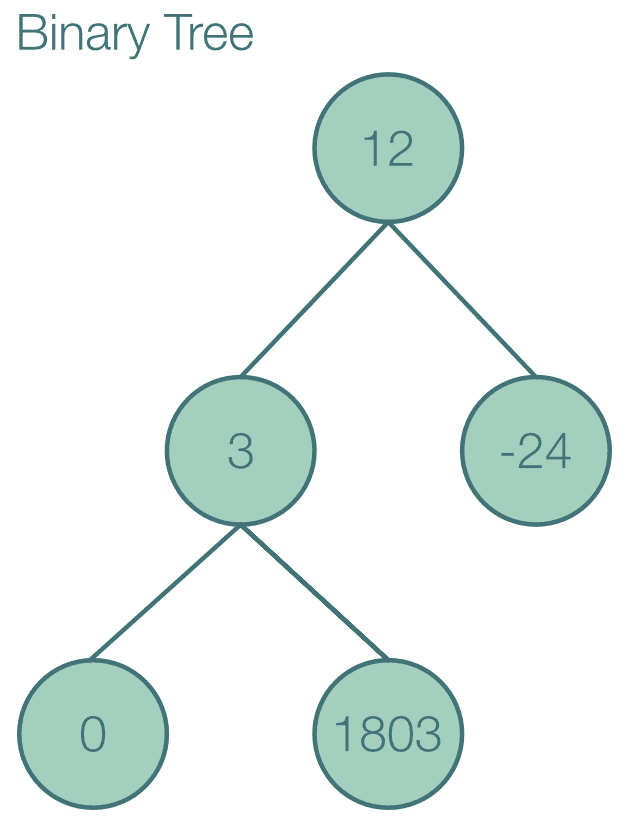

# 高级数据结构

在本章中，我们将介绍以下食谱：

+   创建延迟静态对象

+   位字段操作

+   提供自定义 derives

+   类型之间的转换

+   数据装箱

+   与智能指针共享所有权

+   处理内部可变性

# 简介

到目前为止，我们主要关注了所有都有其自身用途的技术。当然，我们正在继续这一趋势，但本章中展示的食谱在与其他代码结合使用时真正闪耀。您可以想象它们是*胶水*，将一个漂亮的 Rust 程序粘合在一起，因为它们主要面向新的使不同组件能够协同工作的方式。

# 创建延迟静态对象

大对象，尤其是常量对象，应该重用而不是重建。`lazy_static!`宏通过扩展 Rust 的正常`static`功能，帮助您实现这一点，正常情况下，您的对象需要在编译时构造，现在有了在运行时创建延迟对象的 capability。

# 如何做...

1.  使用`cargo new chapter_five`创建一个 Rust 项目，在本章中进行工作。

1.  导航到新创建的`chapter_five`文件夹。在本章的剩余部分，我们将假设您的命令行当前位于此目录中。

1.  在`src`文件夹中，创建一个名为`bin`的新文件夹。

1.  删除生成的`lib.rs`文件，因为我们没有创建库。

1.  打开之前为您生成的`Cargo.toml`文件。

1.  在`[dependencies]`下添加以下行：

```rs
lazy_static = "1.0"
regex = "0.2"
```

如果您愿意，您可以访问`lazy_static`([`crates.io/crates/lazy_static`](https://crates.io/crates/lazy_static))和正则表达式([`crates.io/crates/regex`](https://crates.io/crates/regex))的 crates.io 网页，检查最新版本并使用该版本。

1.  在`src/bin`文件夹中，创建一个名为`lazy_static.rs`的文件。

1.  添加以下代码，并使用`cargo run --bin lazy_static`运行它：

```rs
1    #[macro_use] 
2    extern crate lazy_static;
3    extern crate regex;
4 
5    use regex::Regex;
6    use std::collections::HashMap;
7    use std::sync::RwLock;
8 
9    // Global immutable static
10   lazy_static! {
11     static ref CURRENCIES: HashMap<&'static str, &'static str> = 
       {
12       let mut m = HashMap::new();
13       m.insert("EUR", "Euro");
14       m.insert("USD", "U.S. Dollar");
15       m.insert("CHF", "Swiss Francs");
16       m
17     };
18   }
19 
20   // Global mutable static
21   lazy_static! {
22     static ref CLIENTS: RwLock<Vec<String>> = 
       RwLock::new(Vec::new());
23   }
24 
25   // Local static
26   fn extract_day(date: &str) -> Option<&str> {
27     // lazy static objects are perfect for
28     // compiling regexes only once
29     lazy_static! {
30       static ref RE: Regex =
31       Regex::new(r"(\d{2}).(\d{2}).(\d{4})")
32         .expect("Failed to create regex");
33     }
34     RE.captures(date)
35       .and_then(|cap| cap.get(1).map(|day| day.as_str()))
36   }
37 
38   fn main() {
39     // The first access to CURRENCIES initializes it
40     let usd = CURRENCIES.get("USD");
41     if let Some(usd) = usd {
42       println!("USD stands for {}", usd);
43     }
44 
45     // All accesses will now refer to the same,
46     // already constructed object
47     if let Some(chf) = CURRENCIES.get("CHF") {
48       println!("CHF stands for {}", chf);
49     }
50 
51     // Mutable the global static
52     CLIENTS
53       .write()
54       .expect("Failed to unlock clients for writing")
55       .push("192.168.0.1".to_string());
56 
57     // Get an immutable reference to the global static
58     let clients = CLIENTS
59       .read()
60       .expect("Failed to unlock clients for reading");
61     let first_client = clients.get(0).expect("CLIENTS is
       empty");
62     println!("The first client is: {}", first_client);
63 
64     let date = "12.01.2018";
65     // The static object is nicely hidden inside
66     // the definition of extract_day()
67     if let Some(day) = extract_day(date) {
68       println!("The date \"{}\" contains the day \"{}\"", date, 
         day);
69     }
70   }
```

# 它是如何工作的...

通过调用`lazy_static!`宏[10, 21 和 29]，我们在当前作用域中定义了一个延迟初始化的对象。这里的*延迟*意味着*仅在第一次使用时创建*。

与`let`绑定不同，其作用域也可以是全局作用域[10]。一个现实生活中的例子是创建一个具有已知内容且被许多函数使用的集合，因为另一种选择是创建一次并无限传递。

如果您的`lazy_static`包含一个在编译时已知内容的`Vec`，您可以使用一个`const`数组，因为其构造是常量的。从代码的角度来看，这意味着您不需要使用以下内容：

```rs
lazy_static!{
    static ref FOO: Vec<&'static str> = vec!["a", "b", "c"];
}
```

相反，您可以使用以下方法：

```rs
const FOO: [&str; 3] = ["a", "b", "c"];
```

记得在第一章，*学习基础知识*；*使用正则表达式查询*时，我们讨论了编译正则表达式是昂贵的，应该避免吗？`lazy_static!` 是理想的选择。事实上，在函数中创建局部 `static` 正则表达式的模式非常普遍，以至于我们将其包含在这个例子 [29] 中：

```rs
fn extract_day(date: &str) -> Option<&str> {
    lazy_static! {
        static ref RE: Regex =
            Regex::new(r"(\d{2}).(\d{2}).(\d{4})")
            .expect("Failed to create regex");
    }
    RE.captures(date)
        .and_then(|cap| cap.get(1).map(|day| day.as_str()))
}
```

最后，您还可以使用 `lazy_static` 对象创建全局可变状态 [21]。如前几章所述，过多的状态是软件开发中许多问题的根源，应该谨慎处理。很少有情况可以证明拥有这样的对象是合理的，因为几乎总是更好的选择是将对象传递出去。然而，也有一些例外。有时一个程序围绕对内存中一个特定数据集的操作展开，所有涉及的参与者都希望访问它。在这些情况下，将对象传递到代码中的每个函数可能会非常繁琐。一个可能但仍然非常罕见的例子是当仅处理活动连接列表 [21] 时：

```rs
lazy_static! {
    static ref CLIENTS: RwLock<Vec<String>> = RwLock::new(Vec::new());
}
```

注意，由于借用检查器对具有 `'static` 生命周期的对象是禁用的（参见以下 *还有更多...* 部分），我们需要将我们的 `static` 包裹在一个并行锁中，例如 `RwLock` 或 `Mutex`，以保证线程安全。您可以在第七章，*并行与 Rayon*；*使用 RwLock 并行访问资源*中了解更多。

# 还有更多...

来自其他语言的人可能会想知道 `lazy_static` 提供了什么，这是普通 `static` 对象无法做到的。它们之间的区别如下。

在 Rust 中，`static` 变量是一个在整个程序运行期间存在的变量，这就是为什么它们有自己的、特殊的生命周期 `'static'`。问题是变量必须以恒定的方式构建，即在编译时已知的方式。在我们的例子中，我们不能用正常的 `static` 替换 `CURRENCIES` [11]，因为 `HashMap::new()` 返回一个在运行时内存中某处的新构造的 `HashMap`。由于这要求它存在于内存中，因此不可能在编译时构建 `HashMap`，所以它的构造器不是 `constant`。

`static` 变量的另一个问题是，由于它们具有全局生命周期，借用检查器不能确保它们的访问是线程安全的。因此，对 `static mut` 变量的任何访问都将始终是 `unsafe`。

`static` 变量的约定是使用全大写字母书写，就像 `const` 变量一样。这是因为它们非常紧密地相关联。事实上，`const` 仅仅是一个内联的 `static`，它永远不会是 `mut`。

`lazy_static` 通过将你的对象包装在一个新创建的 `struct` 中来绕过这些限制，该 `struct` 可以隐式解引用到你的对象。这意味着你实际上从未直接访问过你的对象。`lazy_static` 通过要求你在 `static` 声明期间写 `ref` 来强调这一点，因为这让你在心理上将变量视为引用而不是实际的对象：

```rs
lazy_static! {
    static ref foo: Foo = Foo::new();
}
```

在解引用时，包装器 `struct` 使用你在动态创建的对象中的 `static mut` 指针。它所做的只是以安全的方式包装 `unsafe` 调用。

如果你来自现代 C++背景，你可以将正常的 Rust `static` 视为 C++的 `static constexpr`，将 `lazy_static` Rust 视为 C++的 `static` 局部。

# 参见

+   *使用正则表达式进行查询* 在第一章，*学习基础知识*中的配方

+   *使用 RwLocks 并行访问资源* 在第七章，*并行性和 Rayon*中的配方

# 位字段的工作方式

用 C 编写的程序没有使用 Builder 模式（第一章，*学习基础知识*；*使用 builder 模式*）来为用户提供可组合选项的可能性。相反，它们必须依赖于位字段。由于 C 在历史上已经成为系统语言的通用语言，如果你计划在 Rust 接口中包装现有程序或反之亦然，你将不得不与大量的 C 代码交互。因此，你迟早会接触到位字段。由于 Rust 的 `enum` 比 C 的 `enum` 复杂得多，你必须依赖 `bitflags` crate 来提供你舒适地处理位字段所需的所有功能。

# 开始

本章假设你已经知道什么是位字段。在这里解释它没有意义，因为它还会涉及到二进制算术的解释，并且在你日常的 Rust 使用中并不那么相关。要了解位字段的好方法，请查看这篇论坛帖子以及教程：[`forum.codecall.net/topic/56591-bit-fields-flags-tutorial-with-example/`](http://forum.codecall.net/topic/56591-bit-fields-flags-tutorial-with-example/) 和 [`www.tutorialspoint.com/cprogramming/c_bit_fields.htm`](https://www.tutorialspoint.com/cprogramming/c_bit_fields.htm)。

# 如何做到这一点...

1.  打开之前为你生成的 `Cargo.toml` 文件。

1.  在 `[dependencies]` 下，添加以下行：

```rs
bitflags = "1.0"
```

1.  如果你想，你可以去 bitflags 的 crates.io 页面([`crates.io/crates/bitflags`](https://crates.io/crates/bitflags))查看最新版本，并使用那个版本。

1.  在 `bin` 文件夹中，创建一个名为 `bit_fields.rs` 的文件。

1.  添加以下代码，并用 `cargo run --bin bit_fields` 运行它：

```rs
1    #[macro_use]
2    extern crate bitflags;
3 
4    bitflags! {
5      struct Spices: u32 {
6        const SALT    = 0b0000_0001;
7        const PEPPER  = 0b0000_0010;
8        const CHILI   = 0b0000_0100;
9        const SAFFRON = 0b0000_1000;
10       const ALL     = Self::SALT.bits
11                     | Self::PEPPER.bits
12                     | Self::CHILI.bits
13                     | Self::SAFFRON.bits;
14     }
15   }
16 
17   impl Spices {
18     // Implementing a "clear" method can be useful
19     pub fn clear(&mut self) -> &mut Self {
20       self.bits = 0;
21       self
22     }
23   }
24 
25   fn main() {
26     let classic = Spices::SALT | Spices::PEPPER;
27     let spicy = Spices::PEPPER | Spices::CHILI;
28     // Bit fields can nicely be printed
29     println!("Classic: {:?}", classic);
30     println!("Bits: {:08b}", classic.bits());
31     println!("Spicy: {:?}", spicy);
32     println!("Bits: {:08b}", spicy.bits());
33 
34     println!();
35 
36     // Use set operations
37     println!("Union: {:?}", classic | spicy);
38     println!("Intersection: {:?}", classic & spicy);
39     println!("Difference: {:?}", classic - spicy);
40     println!("Complement: {:?}", !classic);
41 
42     // Interact with flags in a bit field
43     let mut custom = classic | spicy;
44     println!("Custom spice mix: {:?}", custom);
45     custom.insert(Spices::SAFFRON);
46     // Note that ALL is now also contained in the bit field
47     println!("Custom spice after adding saffron: {:?}", custom);
48     custom.toggle(Spices::CHILI);
49     println!("Custom spice after toggling chili: {:?}", custom);
50     custom.remove(Spices::SALT);
51     println!("Custom spice after removing salt: {:?}", custom);
52 
53     // This could be user input
54     let wants_salt = true;
55     custom.set(Spices::SALT, wants_salt);
56     if custom.contains(Spices::SALT) {
57       println!("I hope I didn't put too much salt in it");
58     }
59 
60     // Read flags from raw bits
61     let bits = 0b0000_1101;
62     if let Some(from_bits) = Spices::from_bits(bits) {
63       println!("The bits {:08b} represent the flags {:?}", bits,
         from_bits);
64     }
65 
66     custom.clear();
67     println!("Custom spice mix after clearing: {:?}", custom);
68   }
```

# 它是如何工作的...

`bitflags!`宏允许您定义所有标志及其底层类型（在我们的情况下，这是`u32`)[4 到 15]。它们以`ALL_CAPS`的形式编写，因为它们是常量。我们也可以用这种方式定义标志集合，就像我们用`ALL`[10]做的那样。我们本可以添加更多的组合，例如：

```rs
const SPICY = Self::PEPPER.bits | Self::CHILI.bits;
```

该宏为您创建一个具有指定成员的结构，并为其实现了一组特质，以便启用熟悉的`|`、`&`、`-`和`!`表示法 [37 到 40]以及美化打印。您仍然可以直接通过同名成员访问在后台使用的原始`bits`。

注意，在打印时，标志组合将被单独列出。例如，查看第[47]行的输出。在将字段中所有可能的标志设置为活动状态后，它将按以下方式进行美化打印：

```rs
Custom spice after adding saffron: SALT | PEPPER | CHILI | SAFFRON | ALL
```

在位字段上定义的一个有用的方法是`clear()`[19]。这隐藏了底层的`bits`，并且易于阅读。

使用上述二进制运算符，您可以在您的位字段上执行*集合操作* [37 到 40]。这些操作与您可以在`HashSet`上执行的操作相同，并在第二章中用一张漂亮的图表进行了说明，*处理集合；* *使用 HashSet*。

在位字段中处理单个标志也非常简单。`insert()`将标志设置为活动状态 [45]，`remove()`将其设置为非活动状态 [50]，而`toggle`则将其从活动状态切换到非活动状态，反之亦然 [48]。如果您还不知道您将要`insert`或`remove`一个标志，就像不可预测的用户输入那样，您可以使用`set()`显式地将标志的激活状态设置为`true`或`false` [55]。

您可以通过调用`contains()` [56]来检查某个标志是否处于活动状态。这也适用于另一个位字段或标志组合。这意味着以下也是有效的：

```rs
if custom.contains(Spices::SALT | Spices::PEPPER) {
    println!("The custom spice contains both salt and pepper");
}
```

此外，您还可以使用`intersects()`来检查两个位字段中的任何标志是否匹配。

最后但同样重要的是，您可以通过在它上面调用`from_bits()`来将原始字节反序列化到您生成的位字段结构中 [62]。这将检查每个位是否实际上对应于一个标志，如果不是，则返回`None`。如果您绝对 100%确信数据必须是有效的，您可以使用`from_bits_truncate()`跳过错误检查并简单地忽略无效位。

# 另请参阅

+   第二章中的*使用 HashSet*配方，*处理集合*

# 提供自定义的`derive`

您可能已经看过`#[derive(Debug)]`并假设它是某种奇怪的编译器魔法。并非如此。它是一个所谓的*过程宏*，即一个在编译时不仅扩展，而且*运行*的宏。这样，您可以在实际的编译过程中注入代码。最有用的应用是创建自定义的`derive`，通过它可以基于现有代码的分析生成新代码。

# 入门

这个配方将使用一个 *抽象语法树*，或 AST。它是语言元素之间相互关系的树形表示。在这个配方中，我们（即一个名为 `syn` 的酷 crate）将整个程序解析成一个单一的深层 `struct`。

# 如何做到这一点...

1.  使用 `cargo new chapter-five-derive` 创建一个用于自定义 derive 的新子 crate。

1.  打开新创建的 `chapter-five-derive/Cargo.toml` 文件。

1.  将以下内容直接添加到文件的 `[dependencies]` 部分上方，以标记该 crate 为过程宏 crate：

```rs
[lib]
proc-macro = true
```

1.  在 `[dependencies]` 下添加以下行：

```rs
syn = "0.11.11"
quote = "0.3.15"

```

如果你想，你可以访问 `syn` ([`crates.io/crates/syn`](https://crates.io/crates/syn)) 和 `quote` ([`crates.io/crates/quote`](https://crates.io/crates/quote)) 的 crates.io 网页，检查最新版本并使用那个版本。

1.  在 `chapter-five-derive/src/lib.rs` 文件中，删除生成的代码，并添加以下内容：

```rs
1    extern crate proc_macro; 
2    #[macro_use]
3    extern crate quote;
4    extern crate syn;
5 
6    use proc_macro::TokenStream;
7 
8    // HelloWorld is the name for the derive
9    // hello_world_name is the name of our optional attribute
10   #[proc_macro_derive(HelloWorld, attributes(hello_world_name))]
11   pub fn hello_world(input: TokenStream) -> TokenStream {
12     // Construct a string representation of the type definition
13     let s = input.to_string();
14     // Parse the string representation into an abstract syntax 
          tree
15     let ast = syn::parse_derive_input(&s).expect("Failed to 
       parse the source into an AST");
16 
17     // Build the implementation
18     let gen = impl_hello_world(&ast);
19 
20     // Return the generated implementation
21     gen.parse()
22       .expect("Failed to parse the AST generated from deriving 
          from HelloWorld")
23   }
24 
25   fn impl_hello_world(ast: &syn::DeriveInput) -> quote::Tokens {
26     let identifier = &ast.ident;
27     // Use the name provided by the attribute
28     // If there is no attribute, use the identifier
29     let hello_world_name = 
       get_name_attribute(ast).unwrap_or_else(||    
       identifier.as_ref());
30     quote! {
31       // Insert an implementation for our trait
32       impl HelloWorld for #identifier {
33         fn hello_world() {
34           println!(
35             "The struct or enum {} says: \"Hello world from    
                {}!\"",
36              stringify!(#identifier),
37              #hello_world_name
38           );
39         } //end of fn hello_world()
40       } //end of impl HelloWorld
41     } //end of quote
42   } //end of fn impl_hello_world
43 
44   fn get_name_attribute(ast: &syn::DeriveInput) -> Option<&str> {
45     const ATTR_NAME: &str = "hello_world_name";
46 
47     // Go through all attributes and find one with our name
48     if let Some(attr) = ast.attrs.iter().find(|a| a.name() == 
       ATTR_NAME) {
49       // Check if it's in the form of a name-value pair
50       if let syn::MetaItem::NameValue(_, ref value) = attr.value 
         {
51         // Check if the value is a string
52         if let syn::Lit::Str(ref value_as_str, _) = *value {
53           Some(value_as_str)
54         } else {
55             panic!(
56               "Expected a string as the value of {}, found {:?} 
                  instead",
57                ATTR_NAME, value
58             );
59           }
60         } else {
61             panic!(
62               "Expected an attribute in the form #[{} = \"Some 
                  value\"]",
63                ATTR_NAME
64             );
65           }
66         } else {
67             None
68         }
69   }
```

1.  在本章的原始 `Cargo.toml` 文件中，在 `[dependencies]` 下添加以下内容：

```rs
custom-derive = { path = "custom-derive" }
```

7. 在 `bin` 文件夹中，创建一个名为 `custom_derive.rs` 的文件。

8. 添加以下代码，并使用 `cargo run --bin custom_derive` 运行：

```rs
1    #[macro_use]
2    extern crate chapter_five_derive;
3 
4    // trait definitions have to be in "consumer" crate
5    trait HelloWorld {
6      // This method will send a friendly greeting
7      fn hello_world();
8    }
9 
10   // thanks to the code in the custom_derive crate
11   // we can derive from HelloWorld in order to provide
12   // an automatic implementation for the HelloWorld trait
13   #[derive(HelloWorld)]
14   struct Switzerland;
15 
16   #[derive(HelloWorld)]
17   struct Britain;
18 
19   #[derive(HelloWorld)]
20   // We can use an optional attribute to change the message
21   #[hello_world_name = "the Land Down Under"]
22   struct Australia;
23 
24   fn main() {
25     Switzerland::hello_world();
26     Britain::hello_world();
27     Australia::hello_world();
28   }
```

# 它是如何工作的...

这个配方的说明比其他配方复杂一些，因为我们需要管理两个独立的 crate。如果你的代码无法编译，请将你的版本与书中使用的版本进行比较，网址为 [`github.com/SirRade/rust-standard-library-cookbook/tree/master/chapter_five.`](https://github.com/SirRade/rust-standard-library-cookbook/tree/master/chapter_five)。我们需要将代码分成两个 crate，因为提供自定义 `derive` 需要创建一个过程宏，正如代码中所有的 `proc_macro` 实例所示。过程宏是运行在编译器旁边并与它直接交互的 Rust 代码。由于这种代码的特殊性质和独特的限制，它需要在一个单独的 crate 中，该 crate 带有以下注释：

```rs
[lib]
proc-macro = true
```

这个 crate 通常以主 crate 的名称命名，并在后面添加 `_derive` 后缀。在我们的例子中，主 crate 名为 `chapter_five`，所以提供过程宏的 crate 称为 `chapter_five_derive`。

在我们的例子中，我们将创建一个派生版本的经典的 Hello World：一个从 `HelloWorld` 派生的 `struct` 或 `enum` 将实现 `HelloWorld` trait，提供一个包含其自身名称的友好问候的 `hello_world()` 函数。此外，你可以指定一个 `HelloWorldName` 属性来改变消息。

`custom.rs` 中的代码应该是自解释的。我们首先导入我们需要包含 `#[macro_use]` 属性以实际导入过程宏的派生 `crate`。然后我们定义我们的 `HelloWorld` 特征 [5]，并在多个结构体 [13、16 和 19] 上派生它，就像我们使用内置的派生如 `Debug` 或 `Clone` 一样。`Australia` 通过 `HelloWorldName` 属性获得自定义消息。最后，在 `main` 函数中，我们调用生成的 `hello_world()` 函数。

现在我们来看看 `chapter-five-derive/src/lib.rs`。过程宏 `crate` 通常首先导入 `proc_macro`、`quote` 和 `syn` `crate`。细心的读者会注意到我们没有在我们的 `crate` 的 `Cargo.toml` 中的 `[dependencies]` 部分添加 `proc_macro`。我们不需要这样做，因为这个特殊支持 `crate` 是由标准 Rust 分发提供的。

`quote` `crate` 提供了 `quote!` 宏，它允许我们将 Rust 代码转换为编译器可以使用的令牌。这个宏真正有用的特性是它支持通过在变量前写一个 `#` 来进行代码插值。这意味着当我们写下以下内容时，`struct_name` 变量内的值被解释为 Rust 代码：

```rs
impl HelloWorld for #struct_name { ... }
```

如果 `struct_name` 有 `Switzerland` 的值，以下代码将被生成：

```rs
impl HelloWorld for Switzerland { ... }
```

`syn` crate 是一个基于 `nom` 解析器组合框架（[`github.com/Geal/nom`](https://github.com/Geal/nom)）构建的 Rust 解析器，如果你在考虑编写一个解析器，也应该查看一下。实际上，第四章 中使用的某些 `crate` 也用 `nom` 编写。回到正题，`syn` 解析由你的自定义属性或 `derives` 注释的代码，并允许你使用生成的抽象语法树进行工作。

自定义派生的惯例是创建一个以派生名称命名的函数（在我们的例子中是 `pub fn hello_world`），该函数解析注释的代码，然后调用一个生成新代码的函数。第二个函数通常具有第一个函数的名称，前面加上 `impl`。在我们的代码中，这是 `fn impl_hello_world`。

在一个 `proc_macro` `crate` 中，只有标记为 `proc_macro_derive` 的函数才允许发布。顺便说一句，这个后果是我们无法将我们的 `HelloWorld` 特征移动到这个 `crate` 中；它不允许是 `pub`。

`proc_macro_derive` 注解要求你指定用于派生的名称（对我们来说是 `HelloWorld`）以及它允许的属性。如果我们不想接受 `HelloWorldName` 属性，我们可以简单地省略整个属性部分，并像这样注释我们的函数：

```rs
#[proc_macro_derive(HelloWorld)]
```

因为`hello_world`直接钩入编译器，它既接受也返回一个`TokenStream`，这是 Rust 代码的编译器内部表示。我们首先将`TokenStream`转换回`String`，以便再次由`syn`解析。这不是一个昂贵的操作，因为我们从编译器接收到的`TokenStream`不是整个程序，而只是我们自定义推导注解的部分。例如，第一个由`HelloWorld`注解的`struct`的`TokenStream`后面的`String`仅仅是以下内容：

```rs
struct Switzerland;
```

我们随后使用`syn::parse_derive_input(&s)`解析该字符串，这基本上告诉`syn`我们想要解析的代码是一个派生某些内容的`struct`或`enum`。

我们随后使用以下方式生成代码：

```rs
let gen = impl_hello_world(&ast);
```

然后，我们用以下方式将其转换回`TokenStream`：

```rs
gen.parse()
```

然后，`TokenStream`被编译器注入回代码中。正如你所见，过程宏不能更改现有代码，而只能分析它并生成额外的代码。

这里是`hello_world`中描述的过程：

1.  将`TokenStream`转换为`String`

1.  使用`syn`解析`String`

1.  生成另一个方法的实现

1.  将实现解析回`TokenStream`

对于自定义推导来说，这是一个非常典型的例子。你可以在几乎所有基本过程宏中重用所展示的代码。

现在让我们继续到`impl_hello_world`。借助传递的`ast`，我们可以分析注解的结构。`ident`成员，代表*标识符*，告诉我们`struct`或`enum`的名称。例如，在从`HelloWorld`派生的第一个`struct`中，这就是`"Switzerland"`字符串。

然后，我们借助`get_name_attribute`这个小助手函数来决定在问候语中使用哪个名称，我们稍后会看到它。如果设置了`HelloWorldName`属性，它将返回该属性的值。如果没有设置，我们默认使用通过`as_ref`[29]转换的`identifier`。如何做到这一点将在下一个菜谱中解释。

最后，我们通过编写实现并用`quote!`包围它来创建一些`quote::Tokens`。再次注意，我们如何通过在变量前写`#`来将变量内插到代码中。此外，在打印时，我们用`stringify!`包围`#identifier`，将标识符转换为字符串。对于`#hello_world_identifier`，我们不需要这样做，因为它已经包含了一个字符串。为了理解为什么需要这样做，让我们看看如果我们没有包含`stringify!`，将为`Switzerland`结构生成的代码：

```rs
impl HelloWorld for Switzerland {
    fn hello_world() {
        println!(
            "The struct or enum {} says: \"Hello world from {}!\"",
            Switzerland,
            "Switzerland"
        );
    }
}
```

尝试自己操作一下，你会看到一个错误信息，内容大致是“`Switzerland`无法使用默认格式化器格式化”。这是因为我们并没有打印`"Switzerland"`这个字符串，而是在尝试打印`Switzerland`结构体的概念本身，这显然是没有意义的。要解决这个问题，我们只需要确保插值变量被引号包围（`"`），这正是`stringify!`所做的事情。

让我们来看看拼图的最后一部分：`get_name_attribute`。这个函数一开始可能会有些令人畏惧。让我们一步一步地来看：

```rs
if let Some(attr) = ast.attrs.iter().find(|a| a.name() == ATTR_NAME) { ... }
```

在这里，我们将遍历所有可用的属性并搜索一个名为`"HelloWorldName"`的属性。如果我们找不到，函数调用已经结束，通过返回`None`来结束。否则，我们继续执行下一行：

```rs
if let syn::MetaItem::NameValue(_, ref value) = attr.value { ... }
```

`syn::MetaItem`是`syn`如何调用属性的简单方式。这一行是必要的，因为 Rust 中编写属性的方式有很多。例如，`syn::MetaItem::Word`可以写成`#[foo]`。`syn::MetaItem::List`的一个例子是`#[foo(Bar, Baz, Quux)]`。`#[derive(...)]`本身也是一个`syn::MetaItem::List`。然而，我们只对`syn::MetaItem::NameValue`感兴趣，它是一种形式为`#[foo = Bar]`的属性。如果`HelloWorldName`属性不是这种形式，我们会`panic!`并显示一条解释问题的消息。过程宏中的`panic`会导致编译器错误。你可以通过将`custom.rs`中的`#[HelloWorldName = "the Land Down Under"]`替换为`#[HelloWorldName]`来验证这一点。

与常规程序不同，由于过程宏在编译时使用`panic!`，它们经常`panic!`是可以接受的。在这样做的时候，记住来自其他 crate 的错误非常难以调试，尤其是在任何类型的宏中，因此尽可能明确地编写错误信息非常重要。

我们最后需要检查的是`HelloWorldName`的值。由于我们打算打印它，我们只想接受字符串：

```rs
if let syn::Lit::Str(ref value_as_str, _) = *value { ... }
```

在成功的情况下，我们返回字符串。否则，我们再次`panic!`并显示一个详细说明问题的错误信息。

# 更多内容...

如果你运行这个配方时遇到了麻烦，可以使用 David Tolney 的`cargo-expand`（[`github.com/dtolnay/cargo-expand`](https://github.com/dtolnay/cargo-expand)）来展示编译器是如何展开你的`proc_macros`的。这是一个非常有用的调试宏的工具，所以请务必查看。

两种 crate 限制背后的原因是历史性的，只是暂时的。最初，只有一种定义宏的方法，即`macro_rules!`。那些有特殊需求并愿意付出努力的人（现在仍然如此）能够通过直接挂钩 Rust 编译器本身来扩展他们的程序。以这种方式编写的 crate 被称为*编译器插件*。当然，这是极其不稳定的，因为每个 Rust 的小版本发布都可能破坏你的插件，但人们仍然继续这样做，因为它给了他们一个很大的优势，即自定义派生。核心团队为了应对对语言扩展性的增加需求，决定在未来某个时候推出`macros2.0`，对整个宏系统进行彻底的改革，并添加了许多额外的功能，例如命名空间宏。

由于他们看到大多数插件都只用于自定义派生，他们也决定通过`macros1.1`（也称为*过程宏*）来连接`macros2.0`发布前的这段时间。稳定了创建自定义派生所需的小部分编译器。唯一的问题是，crate 现在有正常运行的部分和在编译时运行的部分。混合它们在实现上很困难，而且有点混乱，因此创建了将所有过程宏代码移动到`-derive` crate 的两种 crate 系统。这是本食谱中使用的系统，因为在编写本食谱时，`macros2.0`尚未稳定。我鼓励你查看当前的进展：[`github.com/rust-lang/rust/issues/39412`](https://github.com/rust-lang/rust/issues/39412)。

如果在你阅读这本书的时候，`macros2.0`已经发布，你应该更新你对如何编写现代自定义派生的知识。

# 将类型转换为彼此

拥有专用类型是很好的，但真正的灵活性只能在这些类型可以轻松相互转换时出现。幸运的是，Rust 通过`From`和`Into`特性以及一些相关特性，非常直接地提供了这种功能。

# 如何做...

1.  在`bin`文件夹中，创建一个名为`conversion.rs`的文件。

1.  添加以下代码，并使用`cargo run --bin conversion`运行它：

```rs
1    use std::ops::MulAssign; 
2    use std::fmt::Display;
3 
4    // This structure doubles all elements it stores
5    #[derive(Debug)]
6    struct DoubleVec<T>(Vec<T>);
7 
8 
9    // Allowing conversion from a Vec<T>,
10   // where T is multipliable with an integer
11   impl<T> From<Vec<T>> for DoubleVec<T>
12   where
13   T: MulAssign<i32>,
14   {
15     fn from(mut vec: Vec<T>) -> Self {
16       for elem in &mut vec {
17         *elem *= 2;
18       }
19       DoubleVec(vec)
20     }
21   }
22 
23   // Allowing conversion from a slice of Ts
24   // where T is again multipliable with an integer
25   impl<'a, T> From<&'a [T]> for DoubleVec<T>
26   where
27   T: MulAssign<i32> + Clone,
28   {
29     fn from(slice: &[T]) -> Self {
30       // Vec<T: MulAssign<i32>> automatically
31       // implements Into<DoubleVec<T>>
32       slice.to_vec().into()
33     }
34   }
35 
36   // Allowing conversion from a &DoubleVec<T> to a &Vec<T>
37   impl<T> AsRef<Vec<T>> for DoubleVec<T> {
38     fn as_ref(&self) -> &Vec<T> {
39       &self.0
40     }
41   }
42 
43 
44   fn main() {
45     // The following three are equivalent
46     let hello_world = "Hello World".to_string();
47     let hello_world: String = "Hello World!".into();
48     let hello_world = String::from("Hello World!");
49 
50     // Vec<u8> implements From<&str>
51     // so hello_world_bytes has the value b"Hello World!"
52     let hello_world_bytes: Vec<u8> = "Hello World!".into();
53     let hello_world_bytes = Vec::<u8>::from("Hello World!");
54 
55     // We can convert a Vec<T: MulAssign<i32>> into a DoubleVec
56     let vec = vec![1, 2, 3];
57     let double_vec = DoubleVec::from(vec);
58     println!("Creating a DoubleVec from a Vec: {:?}", 
       double_vec);
59 
60     // Vec<T: MulAssign<i32>> automatically implements 
          Into<DoubleVec<T>>
61     let vec = vec![1, 2, 3];
62     let double_vec: DoubleVec<_> = vec.into();
63     println!("Converting a Vec into a DoubleVec: {:?}", 
       double_vec);
64 
65     // A reference to DoubleVec can be converted to a reference 
          to Vec
66     // Which in turn dereferences to a slice
67     print_elements(double_vec.as_ref());
68 
69     // The standard library provides From<T> for Option<T>
70     // You can design your API in an ergonomic way thanks to this
71     easy_public_func(Some(1337), Some(123), None);
72     ergonomic_public_func(1337, 123, None);
73   }
74 
75 
76   fn print_elements<T>(slice: &[T])
77   where
78   T: Display,
79   {
80     for elem in slice {
81       print!("{} ", elem);
82     }
83     println!();
84   }
85 
86 
87   // Easily written but cumbersome to use
88   fn easy_public_func(foo: Option<i32>, bar: Option<i32>, baz: 
     Option<i32>) {
89     println!(
90       "easy_public_func = foo: {:?}, bar: {:?}, baz: {:?}",
91        foo,
92        bar,
93        baz
94     );
95   }
96 
97 
98   // This is quite some extra typing, so it's only worth to do 
        for
99   // public functions with many optional parameters
100  fn ergonomic_public_func<Foo, Bar, Baz>(foo: Foo, bar: Bar, 
     baz: Baz)
101  where
102  Foo: Into<Option<i32>>,
103  Bar: Into<Option<i32>>,
104  Baz: Into<Option<i32>>,
105  {
106    let foo: Option<i32> = foo.into();
107    let bar: Option<i32> = bar.into();
108    let baz: Option<i32> = baz.into();
109 
110    println!(
111     "ergonomic_public_func = foo: {:?}, bar: {:?}, baz: {:?}",
112      foo,
113      bar,
114      baz
115    );
116  }
```

# 它是如何工作的...

转换类型之间最重要的特性是`From`。实现它意味着定义如何从另一个类型中获取类型。

我们以`DoubleVec`[6]为例来介绍这个概念。它的概念很简单，当你从`Vec`构造它时，它会将其所有元素翻倍。为此，我们实现了`From<Vec<T>>` [11]，并使用一个`where`子句指定`T: MulAssign<i32>`[13]，这意味着该特性将为所有可以赋值给整数乘法结果的类型实现。或者，用代码来说，所有允许以下操作的类型：

```rs
t *= 2;
```

实际实现应该是自解释的，我们只是将向量中的每个元素乘以二，并将其包裹在我们的`DoubleVec`[19]中。之后，我们也为相同类型的切片实现了`From`[25]。

考虑到良好的实践，将所有与向量（`Vec<T>`）一起工作的特性定义扩展到也适用于切片（`&[T]`）是很有用的。这样，你就能获得通用性和性能，因为你可以直接操作数组的引用（如`&[1, 2, 3]`）和其他向量的范围（如`vec[1..3]`），而不需要先进行转换。这个最佳实践也适用于函数，你应该始终尽可能接受你类型的切片（如`print_elements()`所示），出于同样的原因。

然而，在这个实现中，我们看到了一些有趣的东西：

```rs
fn from(slice: &[T]) -> Self {
    slice.to_vec().into()
}
```

`slice.to_vec()`简单地将切片转换成向量。但`.into()`是什么意思呢？嗯，它来自`Into`特性，它是`From`特性的对立面，它将一个类型*转换*成另一个类型。但`Vec`是如何知道如何转换成`DoubleVec`的呢？

让我们看看标准库中`Into`的实现，可以在[`github.com/rust-lang/rust/blob/master/src/libcore/convert.rs`](https://github.com/rust-lang/rust/blob/master/src/libcore/convert.rs)找到，其中我们发现以下行：

```rs
// From implies Into
impl<T, U> Into<U> for T where U: From<T>
{
    fn into(self) -> U {
        U::from(self)
    }
}
```

哈哈！根据这个，每个实现`From`接口的`T`类型都会自动让`U`实现`Into`接口的`T`。确实如此，因为我们实现了`From<Vec<T> for DoubleVec<T>>`，所以我们自动也实现了`Into<DoubleVec<T>> for Vec<T>`。让我们再次看看之前的代码：

```rs
fn from(slice: &[T]) -> Self {
    slice.to_vec().into()
}
```

这个切片被转换成了一个`Vec`，它实现了`Into`接口，用于`DoubleVec`以及其他许多类型。因为我们的函数签名表明我们返回`Self`，Rust 知道应该使用哪个`Into`实现，因为只有其中一个返回`DoubleVec`。

另一个对类型转换有用的特性是`AsRef`。它的唯一函数`as_ref`几乎与`into`相同，但它不是将自身移动到另一个类型，而是取自身的引用并返回另一个类型的引用。从某种意义上说，它*转换*引用。你可以预期在大多数情况下这个操作都很便宜，因为它通常只是返回一个内部对象的引用。实际上，你已经在上一个菜谱中使用了这个方法：

```rs
let hello_world_name = get_name_attribute(ast).unwrap_or_else(|| identifier.as_ref());
```

`identifier`内部持有其名称的`String`。编译器知道`hello_world_name`必须是`&str`，因为`get_name_attribute(ast)`的返回类型是`Option<&str>`，我们正在尝试使用默认值解包它。基于这些信息，`as_ref()`试图返回一个`&str`，它可以做到，因为`identifier`唯一返回`&str`的`AsRef`实现是返回上述包含其名称的`String`的引用。

我们只为 `Vec` 实现 `AsRef`，而不是切片，因为有一个指向向量的引用 (`&Vec<T>`) 可以自动解引用强制转换为切片 (`&[T]`)，这意味着我们自动实现了它。你可以在 [`doc.rust-lang.org/book/second-edition/ch15-02-deref.html#implicit-deref-coercions-with-functions-and-methods`](https://doc.rust-lang.org/book/second-edition/ch15-02-deref.html#implicit-deref-coercions-with-functions-and-methods) 中了解更多关于解引用强制转换的概念。

`AsRef` 还有一个兄弟叫做 `AsMut`，它与前者相同，但操作的是可变引用。我们故意没有在这个示例中实现它，因为我们不希望用户去干扰 `DoubleVec` 的内部状态。一般来说，你也应该非常谨慎地使用这个特性，因为过度访问任何事物的内部可能会迅速变得非常混乱。

`main` 函数包含了一些类型转换的例子。一个流行的例子是第 46 到 48 行的从 `&str` 转换到 `String`。有趣的是，`&str` 也可以转换为其底层字节的向量 [52 和 53]。让我们看看我们的 `DoubleVec` 如何以同样的方式转换。

下一行展示了 `double_vec.as_ref()` 返回的 `&Vec<i32>` 如何无缝地表现得像 `[i32]`，因为 `print_elements()` 只接受切片 [67]：

```rs
print_elements(double_vec.as_ref());
```

配方的最后一部分是关于 API 设计。标准库中 `From` 的小实现如下：

```rs
impl<T> From<T> for Option<T> {
    fn from(val: T) -> Option<T> {
        Some(val)
    }
}
```

这意味着每个类型都可以转换为 `Option`。你可以使用这个技巧，如 `ergonomic_public_func` [100] 的实现所示，使具有多个 `Option` 类型参数的函数更容易使用和查看，正如你可以通过比较以下两个函数调用 [71 和 72] 所见：

```rs
easy_public_func(Some(1337), Some(123), None);
ergonomic_public_func(1337, 123, None);
```

然而，由于需要一些额外的类型来达到这个目的，如果你只在你 API 中的函数上这样做，也就是对 crate 的用户可用，那就没问题。如果你想了解更多关于 Rust 中干净 API 设计的技巧，请查看 Rust 核心开发者 Pascal Hertleif 的优秀博客文章：[`deterministic.space/elegant-apis-in-rust.html`](https://deterministic.space/elegant-apis-in-rust.html)

# 包装数据

我们将要查看的第一个智能指针是 `Box`。这个非常特殊的数据类型是 C++ 中 `unique_ptr` 的类似物，它指向存储在堆上的数据，当它超出作用域时自动删除该数据。由于从栈到堆的转变，`Box` 可以通过故意丢失类型信息来提供一些灵活性。

# 如何做到...

1.  在 `bin` 文件夹中，创建一个名为 `boxing.rs` 的文件。

1.  添加以下代码，并用 `cargo run --bin boxing` 运行它：

```rs
1    use std::fs::File;
2    use std::io::BufReader;
3    use std::result::Result;
4    use std::error::Error;
5    use std::io::Read;
6    use std::fmt::Debug;
7 
8    #[derive(Debug)]
9    struct Node<T> {
10     data: T,
11     child_nodes: Option<(BoxedNode<T>, BoxedNode<T>)>,
12   }
13   type BoxedNode<T> = Box<Node<T>>;
14 
15   impl<T> Node<T> {
16     fn new(data: T) -> Self {
17       Node {
18         data,
19         child_nodes: None,
20       }
21     }
22 
23     fn is_leaf(&self) -> bool {
24       self.child_nodes.is_none()
25     }
26 
27     fn add_child_nodes(&mut self, a: Node<T>, b: Node<T>) {
28       assert!(
29         self.is_leaf(),
30         "Tried to add child_nodes to a node that is not a leaf"
31       );
32       self.child_nodes = Some((Box::new(a), Box::new(b)));
33     }
34   }
35 
36   // Boxes enable you to use traditional OOP polymorph
37   trait Animal: Debug {
38     fn sound(&self) -> &'static str;
39   }
40 
41   #[derive(Debug)]
42   struct Dog;
43   impl Animal for Dog {
44     fn sound(&self) -> &'static str {
45       "Woof!"
46     }
47   }
48 
49   #[derive(Debug)]
50   struct Cat;
51   impl Animal for Cat {
52     fn sound(&self) -> &'static str {
53       "Meow!"
54     }
55   }
56 
57   fn main() {
58     let mut root = Node::new(12);
59     root.add_child_nodes(Node::new(3), Node::new(-24));
60     root.child_nodes
61       .as_mut()
62       .unwrap()
63       0
64       .add_child_nodes(Node::new(0), Node::new(1803));
65     println!("Our binary tree looks like this: {:?}", root);
66 
67     // Polymorphism
68     let mut zoo: Vec<Box<Animal>> = Vec::new();
69     zoo.push(Box::new(Dog {}));
70     zoo.push(Box::new(Cat {}));
71     for animal in zoo {
72       println!("{:?} says {}", animal, animal.sound());
73     }
74 
75     for word in caps_words_iter("do you feel lucky, punk‽") {
76       println!("{}", word);
77     }
78 
79     // Assuming a file called number.txt exists
80     let num = read_file_as_number("number.txt").expect("Failed 
       read the file as a number");
81     println!("number.txt contains the number {}", num);
82 
83     // Dynamically composing functions
84     let multiplier = create_multiplier(23);
85     let result = multiplier(3);
86     println!("23 * 3 = {}", result);
87   }
88 
89   // Via trait objects we can return any iterator
90   fn caps_words_iter<'a>(text: &'a str) -> Box<Iterator<Item = 
     String> + 'a> {
91     // Return an iterator over every word converted into 
       ALL_CAPS
92     Box::new(text.trim().split(' ').map(|word| 
       word.to_uppercase()))
93   }
94 
95   // Same goes for errors
96   fn read_file_as_number(filename: &str) -> Result<i32, 
     Box<Error>> {
97     let file = File::open(filename)?;
98     let mut buf_reader = BufReader::new(file);
99     let mut content = String::new();
100    buf_reader.read_to_string(&mut content)?;
101    let number: i32 = content.parse()?;
102    Ok(number)
103  }
104 
105  fn create_multiplier(a: i32) -> Box<Fn(i32) -> i32> {
106    Box::new(move |b| a * b)
107  }
```

# 它是如何工作的...

我们将要探索的第一件事是递归类型，即包含自身的类型。这不能直接完成，因为编译器需要提前知道一个类型需要多少空间。考虑以下 `struct`：

```rs
struct Foo {
    bar: i32
}
```

编译器会自问：“创建一个 Foo 需要多少空间？”并发现它只需要足够的空间来存放一个`i32`。而一个`i32`需要多少空间？正好是 32 位。现在，考虑以下情况：

```rs
struct Foo {
    bar: i32,
    baz: Foo,
}
```

Foo 需要多少空间？足够存放一个`i32`和一个 Foo。一个`i32`需要多少空间？32 位。Foo 需要多少空间？足够存放一个`i32`和一个 Foo。而这个 Foo 需要多少空间？足够存放一个 Foo，以此类推，直到宇宙的热寂。显然，我们不想在编译上花费那么长时间。让我们看看我们问题的解决方案：

```rs
struct Foo {
    bar: i32,
    baz: Box<Foo>,
}
```

再说一次，Foo 有多大？足够存放一个`i32`和一个 Foo。`i32`有多大？32 位。`Box<Foo>`有多大？和其他类型的盒子一样大，即 64 位。每个`Box`都将始终具有相同的大小，因为它们都是同一件事，即指向堆中某个类型的指针。这样，我们就解决了问题，因为编译器现在在编译时知道类型的确切大小，并且很高兴。而且因为它很高兴，所以我们也很高兴。

在我们的代码示例中，我们展示了递归类型的一个可能的使用案例，一个简单的二叉树实现[9]。如果你不知道，二叉树由一个称为*节点*的数据簇组成，它可以连接到零个或两个其他*子节点*。连接到零个节点的节点是一个*叶节点*。在我们的例子中，我们构建了一个看起来像这样的树：



我们将其实现为一个包含任何数据以及可选的一对`BoxedNode`的`struct Node`，其中`BoxedNode`只是`Box<Node>`的别名。

一个针对速度优化的真实二叉树实现将比我们的示例稍微复杂一些。虽然递归的概念非常适合二叉树，但将每个节点单独存储在堆中的某个地方是非常低效的。真正的实现将只对用户表现出递归，但内部将节点存储在`Vec<Node>`中。这样，节点通过在连续的内存块中分配来获得速度上的提升，这将优化缓存。Rust 的`BTreeMap`和`BTreeSet`也遵循这个概念。

二叉树是一种非常适合数据遍历的数据结构。你可以在以下 StackOverflow 答案中了解一些它的最大用途，由 Danny Pflughoeft 提供：[`stackoverflow.com/questions/2130416/what-are-the-applications-of-binary-trees#2200588`](https://stackoverflow.com/questions/2130416/what-are-the-applications-of-binary-trees#2200588)。

`Box` 允许我们做的下一件事是经典的泛型，就像你在其他语言中会认识的那样。为此，我们准备了一个名为 `Animal` [37] 的特征，它有一个用于产生 `sound()` 方法的特征。它的实现者 `Dog` [42] 将产生 `"Woof!"`[45]，而 `Cat` [50] 的实现者将产生 `"Meow!"` [53]。我们的目标是存储一个 `Dog` 和一个 `Cat` 在一个 `Vec` 的 `Animal` 中。我们可以通过创建一个所谓的 *特征对象* 来做到这一点。它是由一个特征的 `Box` 创建的，就像在下面的例子中一样：

```rs
let mut zoo: Vec<Box<Animal>> = Vec::new();
```

这样，我们故意从 `Box` 中的实际类型中删除类型信息。编译器不再知道 `Box` 中是什么类型，只知道它实现了 `Animal`，这正是它需要知道的所有信息。正如你通过运行代码所看到的，Rust 运行时仍然会执行正确的函数，并为 `Dog` 和 `Cat` 产生不同的声音。

使用相同的机制，我们可以返回一个 `Iterator`[90] 的特征对象：

```rs
fn caps_words_iter<'a>(text: &'a str) -> Box<Iterator<Item = String> + 'a> { ... }
```

这样，我们可以在 `caps_words_iter()` 内混合和匹配迭代器，而不必关心确切的返回类型，只要它实现了 `Iterator`，它们都做到了。记住，我们不能直接返回 `Iterator`，没有任何 `Box` 包围它，因为我们不能返回一个特征。然而，特征对象是完全可行的。

接下来，我们来看 `read_file_as_number()`[96]。这个方法读取一个文件，并返回解析为 `i32` 的内容。这个文件不会为你生成，所以你必须从我们的 GitHub 仓库下载它，或者手动创建一个名为 `number.txt` 的文件，其中包含一个数字，比如 `777`。从签名中，你可以看出这次我们正在装箱 `Error`。这让我们可以混合返回的错误类型。确实，这个方法返回两种不同的错误：`std::io::Error` 和 `std::num::ParseIntError`。

我们将要探讨的最后一件事是如何使用 `create_multiplier()`[105] 返回闭包。由于所有闭包都实现了 `Fn`、`FnOnce` 和/或 `FnMut`，我们可以为它们返回一个特征对象。这样，我们就可以在运行时创建、组合和更改函数，就像在函数式语言中一样。

# 还有更多...

你可能已经注意到，返回 `Box<Iterator>` 或 `Box<Error>` 在效率上会有一些损失，因为它需要在没有任何理由的情况下将对象移动到堆上。目前有两种方法可以解决这个问题。

对于 `Box<Error>`，你应该创建一个自己的 `Error` 类型，结合你函数可以返回的所有可能的错误。这详细说明在 第六章，*处理错误*；*提供用户定义的错误类型*。

对于 `Box<Iterator>`，你可以分析编译器的输出，以找出你返回的确切真实类型。这对于小型迭代器有效，但任何复杂的迭代器都需要很长时间才能破解。由于这种情况并不理想，Rust 团队已经批准引入**抽象类型**，这将在第十章使用实验性夜间功能中介绍；**返回抽象类型**，因为它尚未进入稳定 Rust。

# 参见

+   在第六章处理错误中的**提供用户定义的错误类型**配方。

+   在第十章使用实验性夜间功能中的**返回抽象类型**配方。

# 与智能指针共享所有权

一些所有权关系并不像**类型 A 拥有 B**那样简单。有时，一组类型会拥有另一个类型。为了处理这种情况，我们需要另一个类似 `Box` 的智能指针，但只有在没有人需要它时才会删除底层资源，它是 `Rc`，代表引用计数。

# 如何做到...

1.  在 `bin` 文件夹中，创建一个名为 `shared.rs` 的文件。

1.  添加以下代码，并使用 `cargo run --bin shared` 运行它：

```rs
1    use std::rc::Rc;
2 
3    // The ball will survive until all kids are done playing with 
        it
4    struct Kid {
5      ball: Rc<Ball>,
6    }
7    struct Ball;
8 
9    fn main() {
10     {
11       // rc is created and count is at 1
12       let foo = Rc::new("foo");
13       // foo goes out of scope; count decreases
14       // count is zero; the object gets destroyed
15     }
16 
17     {
18       // rc is created and count is at 1
19       let bar = Rc::new("bar");
20       // rc is cloned; count increases to 2
21       let second_bar = Rc::clone(&bar);
22       // bar goes out of scode; count decreases to 1
23       // bar goes out of scode; count decreases to 0
24     }
25 
26     {
27       // rc is created and count is at 1
28       let baz = Rc::new("baz");
29       {
30         // rc is cloned; count increases to 2
31         let second_baz = Rc::clone(&baz);
32         // second_baz goes out of scode; count decreases to 1
33       }
34       // baz goes out of scode; count decreases to 0
35     }
36     let kid_one = spawn_kid_with_new_ball();
37     let kid_two = Kid {
38       ball: Rc::clone(&kid_one.ball),
39     };
40     let kid_three = Kid {
41       ball: Rc::clone(&kid_one.ball),
42     };
43     // ball lives until here
44   }
45 
46   fn spawn_kid_with_new_ball() -> Kid {
47     let ball = Rc::new(Ball);
48     Kid {
49       ball: Rc::clone(&ball),
50     }
51     // Although the ball goes out of scope here, the object 
          behind it
52
53     // will survive as part of the kid
54   }
```

# 它是如何工作的...

`Rc` 的核心是其内部计数器，它记录当前有多少个对象拥有它。每次 `Rc` 被克隆时，计数器增加一，每次其克隆中的一个超出作用域时，计数器减少一。当这个计数器达到零时，`Rc` 后的对象将被销毁。`main` 方法包含一些注释示例，说明计数器在其生命周期中达到的值，以帮助你理解该机制的工作原理。

展示的简单规则的效果是，位于 `Rc` 后的资源只有在不再被使用时才会被删除，由于持续计数导致的运行时性能损失非常小，因此成本极低。这种**延迟删除**的效果非常适合在对象之间共享的资源。只需将它们包装在 `Rc` 中，它们就会确保一切都能存活足够长的时间。这相当于 C++ 中的 `shared_ptr`。

# 还有更多...

在一个边缘情况下，引用计数可能导致**内存泄漏**，即意外地阻止资源被删除。这种情况发生在存在两个对象，它们都包含指向对方的 `Rc` 时。由于这种循环依赖，它们都不会停止使用对方，因此这两个对象将在你的代码停止使用它们很久之后继续存在并指向对方。这里的解决方案是选择层次结构中的较薄弱环节，并用 `Weak` 替换其 `Rc`，`Weak` 包含一个**非拥有引用**。然而，由于这种情况相当罕见，我们不会详细讨论它。相反，只需记住内存泄漏的可能性，并在出现时再次阅读此内容。

`Rc`本质上是单线程的。如果你需要在多线程环境中（例如我们将在第七章[ca93ce61-1a86-4588-9da0-766bed49876f.xhtml]中探讨的，*并行性和 Rayon*；*在多线程闭包中共享资源*）使用其功能，你可以使用`Arc`代替。它代表原子引用计数，并且与`Rc`的行为相同。

# 参见

+   第七章[ca93ce61-1a86-4588-9da0-766bed49876f.xhtml]中的*在多线程闭包中共享资源*食谱

# 与内部可变性一起工作

尽管 Rust 的借用检查器是其最大的卖点之一，与它巧妙地错误处理的概念和令人印象深刻的工具一起，但它还不能读心。有时你可能必须亲自处理并手动借用对象。这是通过*内部可变性*的概念来完成的，它表明某些类型可以在非可变的情况下包装对象，并仍然可以对其进行可变操作。

# 如何实现...

1.  在`bin`文件夹中，创建一个名为`interior_mutability.rs`的文件。

1.  添加以下代码，并使用`cargo test --bin interior_mutability`运行它：

```rs
1    trait EmailSender { 
2      fn send_mail(&self, msg: &Email) -> Option<String>;
3    }
4 
5    #[derive(Debug, Clone)]
6    struct Email {
7      from: String,
8      to: String,
9      msg: String,
10   }
11 
12   #[derive(Debug)]
13   struct Customer {
14     address: String,
15     wants_news: bool,
16   }
17 
18   // Send news to every customer that wants to receive them
19   fn publish_news(msg: &str, sender: &EmailSender, customers: &
     [Customer]) -> Option<i32> {
20     let mut count = 0;
21     let mut mail = Email {
22     from: "Rust Newsletter".to_string(),
23     to: "".to_string(),
24     msg: msg.to_string(),
25   };
26   for customer in customers {
27     if !customer.wants_news {
28       continue;
29     }
30     mail.to = customer.address.to_string();
31     if sender.send_mail(&mail).is_none() {
32       return None;
33     }
34     count += 1;
35   }
36   Some(count)
37 }
38 
39   fn main() {
40   // No code running as we are concentrating on the tests instead
41   }
42 
43 
44   #[cfg(test)]
45   mod tests {
46     use super::*;
47     use std::cell::RefCell;
48 
49     struct MockEmailSender {
50       // sent_mails can be modified even if MockEmailSender is 
            immutable
51       sent_mails: RefCell<Vec<Email>>,
52     }
53     impl MockEmailSender {
54       fn new() -> Self {
55         MockEmailSender {
56           sent_mails: RefCell::new(Vec::new()),
57         }
58       }
59     }
60 
61     impl EmailSender for MockEmailSender {
62     fn send_mail(&self, msg: &Email) -> Option<String> {
63       // Borrow sent_mails mutably
64       self.sent_mails.borrow_mut().push(msg.clone());
65       Some("200 OK".to_string())
66     }
67   }
68 
69   #[test]
70   fn sends_zero_to_zero_customers() {
71     let sent = publish_news("hello world!", 
       &MockEmailSender::new(), &[]);
72     assert_eq!(Some(0), sent);
73   }
74 
75   #[test]
76   fn sends_one_to_one_willing() {
77     let customer = Customer {
78       address: "herbert@herbert.com".to_string(),
79       wants_news: true,
80     };
81     let sent = publish_news("hello world!", 
       &MockEmailSender::new(), &[customer]);
82     assert_eq!(Some(1), sent);
83   }
84 
85 #[test]
86   fn sends_none_to_unwilling() {
87     let customer_one = Customer {
88       address: "herbert@herbert.com".to_string(),
89       wants_news: false,
90     };
91     let customer_two = Customer {
92       address: "michael@jackson.com".to_string(),
93       wants_news: false,
94     };
95     let sent = publish_news(
96       "hello world!",
97        &MockEmailSender::new(),
98        &[customer_one, customer_two],
99     );
100     assert_eq!(Some(0), sent);
101   }
102 
103   #[test]
104   fn sends_correct_mail() {
105     let customer = Customer {
106       address: "herbert@herbert.com".to_string(),
107       wants_news: true,
108     };
109     let sender = MockEmailSender::new();
110     publish_news("hello world!", &sender, &
        [customer]).expect("Failed to send mail");
111 
112     // Borrow sent_mails immutable
113     let mails = sender.sent_mails.borrow();
114     assert_eq!(1, mails.len());
115     assert_eq!("Rust Newsletter", mails[0].from);
116     assert_eq!("herbert@herbert.com", mails[0].to);
117     assert_eq!("hello world!", mails[0].msg);
118   }
119 }
```

# 它是如何工作的...

本食谱的主角是`RefCell`，它是一个任何类型的包装器，将借用检查器的规则执行从编译时移动到运行时。基本操作很简单，通过调用`.borrow()`来不可变地借用底层值，通过调用`.borrow_mut()`来可变地借用。如果你不遵循只有多个读者或同时只有一个写者的黄金法则，程序将进入`panic!`状态。这种应用的一个例子是即使你的结构体本身是不可变的，也可以使你的结构体的成员可变。展示这种用法最有用的案例是模拟，这是为了测试目的而伪造基础设施的艺术。

我们的示例想法如下，我们希望向所有感兴趣的客户发送新闻通讯。为此，我们有一个`EmailSender`特性[1]，它只指定了一个发送`Email`并返回响应的方法[2]。尝试通过特性来定义功能是一种良好的实践，以便对其进行模拟。

我们的`publish_news`函数[19]接受一个消息、一个`EmailSender`和一个`Customer`切片（请不要字面地想象），并将消息发送给所有希望接收新闻的客户。如果它遇到错误，它返回`None`[32]，否则，它返回它发送的新闻通讯数量[36]。

你可能不想每次测试代码时都向客户发送电子邮件，这就是为什么我们在测试配置中创建`MockEmailSender`[49]，它实际上不会发送任何东西，而是将所有邮件存储在一个`Vec` [64]中。为了做到这一点，它需要修改其成员，尽管它是不可变的。这正是`RefCell`的作用！多亏了它，我们可以有效地测试`publish_news()`，因为我们可以访问它将发送的所有消息，并将它们与我们期望的内容进行比较。

# 还有更多...

有许多类型使用内部可变性。其中之一是`Cell`，它不是分发引用，而是简单地复制它存储的值。当存储原始类型，如`i32`或`bool`时，这很好，因为它们都实现了复制。

其他类型包括`RwLock`和`Mutex`，它们对于并行性非常重要，正如我们将在第七章的配方中看到，即第七章，*并行性和 Rayon*；*使用 RwLock 并行访问资源*。

# 参见

+   第七章，*并行性和 Rayon*中的*使用 RwLock 并行访问资源*配方
