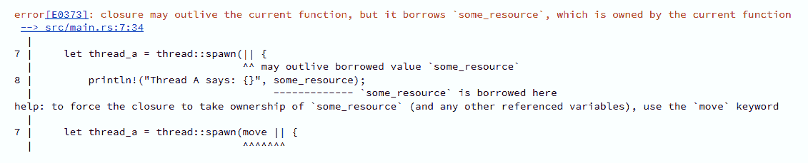
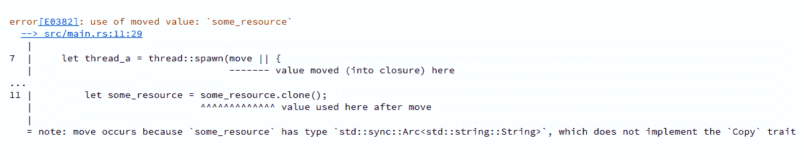

# 第七章：并行性与 Rayon

在本章中，我们将介绍以下食谱：

+   并行化迭代器

+   同时运行两个操作

+   在线程间发送数据

+   在多线程闭包中共享资源

+   使用 RwLocks 并行访问资源

+   原子访问原语

+   在连接处理器中将所有内容组合在一起

# 简介

曾经有一段时间，随着处理器的不断升级，你的代码每年都会自动变快。但如今，正如 Herb Sutter 著名地指出，*免费午餐已经结束* ([`www.gotw.ca/publications/concurrency-ddj.htm`](http://www.gotw.ca/publications/concurrency-ddj.htm))。处理器核心数量增加而不是性能提升的时代已经很久远了。并不是所有编程语言都适合这种向无处不在的并发性的根本转变。

Rust 的设计正是针对这个问题。它的借用检查器确保大多数并发算法都能正常工作。它甚至更进一步：如果你的代码不可并行化，即使你还没有使用超过一个线程，你的代码甚至无法编译。正因为这些独特的保证，Rust 的一个主要卖点被称作*无畏并发*。

我们即将找出原因。

# 并行化迭代器

要有一个魔法按钮，让你能够轻松地将任何算法并行化，而不需要你做任何事情，岂不是很好？嗯，只要你的算法使用迭代器，`rayon`就是那个东西！

# 如何做到这一点...

1.  使用`cargo new chapter-seven`创建一个 Rust 项目，以便在本章中工作。

1.  导航到新创建的`chapter-seven`文件夹。在本章的其余部分，我们将假设你的命令行当前位于此目录。

1.  打开为你生成的`Cargo.toml`文件。

1.  在`[dependencies]`下添加以下行：

```rs
rayon = "1.0.0"
```

如果你想，你可以访问`rayon`的 crates.io 页面([`crates.io/crates/rayon`](https://crates.io/crates/rayon))，检查最新版本并使用它。

1.  在`src`文件夹内，创建一个名为`bin`的新文件夹。

1.  删除生成的`lib.rs`文件，因为我们不是在创建一个库。

1.  在`src/bin`文件夹中，创建一个名为`par_iter.rs`的文件。

1.  添加以下代码，并使用`cargo run --bin par_iter`运行它：

```rs
1  extern crate rayon;
2  use rayon::prelude::*;
3 
4  fn main() {
5    let legend = "Did you ever hear the tragedy of Darth Plagueis 
     The Wise?";
6    let words: Vec<_> = legend.split_whitespace().collect();
7 
8   // The following will execute in parallel,
9   // so the exact order of execution is not foreseeable
10  words.par_iter().for_each(|val| println!("{}", val));
11 
12   // par_iter can do everything that a normal iterator does, but
13   // in parallel. This way you can easily parallelize any 
       algorithm
14   let words_with_a: Vec<_> = words
15       .par_iter()
16       .filter(|val| val.find('a').is_some())
17       .collect();
18 
19    println!(
20       "The following words contain the letter 'a': {:?}",
21        words_with_a
22    );
23  }
```

# 它是如何工作的...

`rayon`为每个实现了其标准库等效`Iterator`的类型的`ParallelIterator`特例实现了特例，我们在第二章，*使用集合；**将集合作为迭代器访问*中了解到。实际上，你可以再次使用该食谱中的所有知识。`ParallelIterator`特例提供的方法几乎与`Iterator`提供的方法相同，所以几乎在所有你注意到迭代器操作耗时过长并成为瓶颈的情况下，你只需简单地将`.iter()`替换为`.par_iter()`[10]。同样，对于移动迭代器，你可以使用`.into_par_iter()`而不是`.into_iter()`。

`rayon` 会为你处理所有繁琐的工作，因为它会自动将工作均匀分配到所有可用的核心上。但请记住，尽管有这种魔法，你仍然在处理并行性，因此你无法保证迭代器中项的处理顺序，正如第 [10] 行所示，每次执行程序时都会以不同的顺序打印：

```rs
words.par_iter().for_each(|val| println!("{}", val));
```

# 参见

+   *访问集合作为迭代器*菜谱在第二章，*与集合一起工作*

# 同时运行两个操作

上一个菜谱中的并行迭代器在内部基于一个更基本的功能构建，即 `rayon::join`，它接受两个闭包并*可能*并行运行它们。这样，性能提升与启动线程开销之间的平衡也已经为你完成。

如果你有一个不使用迭代器但仍然由一些明显分离的部分组成且可以从并行运行中受益的算法，考虑使用 `rayon::join`。

# 如何做到这一点...

1.  打开之前为你生成的 `Cargo.toml` 文件。

1.  如果你在上一个菜谱中没有这样做，请在 `[dependencies]` 下添加以下行：

```rs
rayon = "1.0.0"
```

1.  如果你想，你可以访问 `rayon` 的 crates.io 页面([`crates.io/crates/rayon`](https://crates.io/crates/rayon))，检查最新版本并使用它。

1.  在 `bin` 文件夹中创建一个名为 `join.rs` 的文件。

1.  添加以下代码，并使用 `cargo run --bin join` 运行：

```rs
1 extern crate rayon;
2 
3  #[derive(Debug)]
4  struct Rectangle {
5    height: u32,
6    width: u32,
7  }
8 
9  impl Rectangle {
10    fn area(&self) -> u32 {
11       self.height * self.width
12    }
13    fn perimeter(&self) -> u32 {
14       2 * (self.height + self.width)
15    }
16  }
17 
18  fn main() {
19    let rect = Rectangle {
20       height: 30,
21       width: 20,
22    };
23    // rayon::join makes closures run potentially in parallel and
24    // returns their returned values in a tuple
25    let (area, perimeter) = rayon::join(|| rect.area(), || 
      rect.perimeter());
26    println!("{:?}", rect);
27    println!("area: {}", area);
28    println!("perimeter: {}", perimeter);
29 
30    let fib = fibonacci(6);
31    println!("The sixth number in the fibonacci sequence is {}", 
      fib);
32  }
33 
34  fn fibonacci(n: u32) -> u32 {
35    if n == 0 || n == 1 {
36     n
37    } else {
38      // rayon::join can really shine in recursive functions
39      let (a, b) = rayon::join(|| fibonacci(n - 1), || fibonacci(n 
          - 2));
40       a + b
41    }
42  }
```

# 它是如何工作的...

`rayon::join` 非常简单。它接受两个闭包，*可能*并行运行它们，并以元组的形式返回它们的返回值 [25]。等等，我们刚刚说了*可能*？难道不是总是并行运行事物更好吗？

不，至少不是总是这样。当然，如果你真的在乎事物始终一起运行而不阻塞，比如说一个 GUI 及其底层的 I/O，你绝对不希望当打开文件时鼠标光标冻结，你总是需要所有进程在自己的线程中运行。但大多数并发应用程序没有这个要求。并发之所以如此重要的一个重要部分是它能够并行运行通常按顺序（即，一行接一行）运行的代码。注意这里的措辞—*通常按顺序运行的代码*。这类算法本身不需要并发，但它们可能会从中受益。现在来说说*潜在*的部分—启动一个线程可能并不值得。

为了理解原因，让我们看看硬件方面。我们不会深入这个领域，因为：

a) 你在读这本书的事实让我认为你更倾向于软件人员，b) CPU 的确切机制现在变化非常快，我们不希望这里提供的信息在一年后过时。

你的 CPU 将其工作分配给其 *核心*。核心是 CPU 的基本计算单元。如果你正在阅读此内容的设备不是用纸做的，并且不到二十年，它很可能包含多个核心。这类核心被称为 *物理*，可以同时处理不同的事情。物理核心本身也有执行多项任务的方法。一些可以将自己分成多个 *逻辑* 核心，进一步分割工作。例如，英特尔 CPU 可以使用 *超线程*，这意味着如果一个程序只使用物理核心的整数加法单元，一个虚拟核心可能会开始为另一个程序处理浮点数加法单元，直到第一个完成。

如果你不在乎可用的核心数量，并且无限制地启动新线程，操作系统将开始创建实际上不会并发运行的线程，因为它已经没有核心了。在这种情况下，它将执行 *上下文切换*，这意味着它存储线程的当前状态，暂停它，短暂地处理另一个线程，然后再次恢复线程。正如你可以想象的那样，这会消耗相当多的资源。

这就是为什么如果并行运行两件事不是至关重要，你应该首先检查是否真的有任何 *空闲*（即可用）的核心。因为 `rayon::join` 会为你做这个检查；除此之外，它只有在这样做真正值得时才会并行运行两个闭包。如果你需要自己执行这项工作，请查看 `num_cpus` crate ([`crates.io/crates/num_cpus`](https://crates.io/crates/num_cpus))。

顺便说一下，上道菜谱中的并行迭代器更进一步：如果元素的数量和工作量如此之小，以至于为它们启动一个新线程的成本比顺序运行它们还要高，它们将自动放弃并发为你。

# 还有更多...

`rayon` 的底层机制是 *工作窃取*。这意味着当我们调用以下函数时，当前线程将立即开始处理 `a` 并将 `b` 放入队列：

```rs
rayon::join(a, b);
```

同时，每当一个核心空闲时，`rayon` 将允许它处理队列中的下一个任务。然后新线程会从其他线程中“窃取”任务。在我们的例子中，那将是 `b`。如果 `a` 比意外地先于 `b` 完成，主线程将检查队列并尝试窃取工作。如果递归函数中多次调用 `rayon::join`，队列可以包含超过两个项目。

`rayon` 的作者 Niko Matsakis 在他的介绍博客文章中写下了以下伪 Rust 代码，以说明这一原则：[`smallcultfollowing.com/babysteps/blog/2015/12/18/rayon-data-parallelism-in-rust/`](http://smallcultfollowing.com/babysteps/blog/2015/12/18/rayon-data-parallelism-in-rust/)：

```rs
fn join<A,B>(oper_a: A, oper_b: B)
    where A: FnOnce() + Send,
          B: FnOnce() + Send,
{
    // Advertise `oper_b` to other threads as something
    // they might steal:
    let job = push_onto_local_queue(oper_b);

    // Execute `oper_a` ourselves:
    oper_a();

    // Check whether anybody stole `oper_b`:
    if pop_from_local_queue(oper_b) {
        // Not stolen, do it ourselves.
        oper_b();
    } else {
        // Stolen, wait for them to finish. In the
        // meantime, try to steal from others:
        while not_yet_complete(job) {
            steal_from_others();
        }
        result_b = job.result();
    }
}
```

顺便说一下，这个例子中提供的递归斐波那契实现[34]很容易查看，并说明了使用`rayon::join`的目的，但也是非常不高效的。要了解为什么，以及如何改进它，请查看第十章 Chapter 10，*使用实验性夜间功能*；*基准测试你的代码**.*

# 参见

+   第十章 Chapter 10，*使用实验性夜间功能*中的*基准测试你的代码*配方

# 在多线程闭包中共享资源

是时候在更低的层面上查看并行性，而不需要任何帮助我们的 crate。我们现在将检查如何跨线程共享资源，以便它们都可以使用同一个对象。这个配方也将作为手动创建线程的复习，以防你很久以前就学过它。

# 如何做到...

1.  在`bin`文件夹中创建一个名为`sharing_in_closures.rs`的文件。

1.  添加以下代码，并用`cargo run --bin sharing_in_closures`运行它：

```rs
1  use std::thread;
2  use std::sync::Arc;
3  
4  fn main() {
5    // An Arc ("Atomically Reference Counted") is used the exact
6    // same way as an Rc, but also works in a parallel context
7    let some_resource = Arc::new("Hello World".to_string());
8 
9    // We use it to give a new thread ownership of a clone of the 
        Arc
10   let thread_a = {
11     // It is very common to give the clone the same name as the 
          original
12     let some_resource = some_resource.clone();
13     // The clone is then moved into the closure:
14     thread::spawn(move || {
15       println!("Thread A says: {}", some_resource);
16      })
17   };
18   let thread_b = {
19       let some_resource = some_resource.clone();
20       thread::spawn(move || {
21         println!("Thread B says: {}", some_resource);
22        })
23   };
24 
25  // .join() blocks the main thread until the other thread is done
26  thread_a.join().expect("Thread A panicked");
27  thread_b.join().expect("Thread B panicked");
28  }
```

# 它是如何工作的...

Rust 中并行性的基本构建块是`Arc`，代表**原子引用计数**。功能上，它的工作方式与我们在 Chapter 5，*高级数据结构*；*与智能指针共享所有权*中看到的`Rc`相同。唯一的区别是引用计数是使用*原子原语*完成的，这些是具有良好定义的并行交互的原生数据类型的版本，如`usize`。这有两个后果：

+   `Arc`比`Rc`慢一点，因为引用计数涉及更多的工作

+   `Arc`可以在线程间安全地使用

`Arc`的构造函数看起来与`Rc`[7]相同：

```rs
let some_resource = Arc::new("Hello World".to_string());
```

这创建了一个覆盖`String`的`Arc`。`String`是一个`struct`，它不是天生就保存下来以便跨线程操作的。在 Rust 术语中，我们说`String`不是`Sync`（关于这一点，稍后在配方*原子访问原语*中会详细介绍）。

现在，让我们看看线程是如何初始化的。`thread::spawn()`接受一个闭包并在新线程中执行它。因为这是并行执行的，所以主线程不会等待线程完成；它在创建后立即继续工作。

以下创建了一个线程，该线程打印出`some_resource`的内容，并为我们提供了一个名为`thread_a`的线程句柄[10]：

```rs
    let thread_a = {
        let some_resource = some_resource.clone();
        thread::spawn(move || {
            println!("Thread A says: {}", some_resource);
        })
    };
```

之后（或同时），我们在第二个线程`thread_b`中做完全相同的事情。

为了理解为什么我们需要`Arc`而不能直接将资源传递给闭包，让我们更仔细地看看闭包是如何工作的。

Rust 中的闭包只能操作三种类型的变量：

+   传递给它们的参数

+   `static`变量（具有`'static`生命周期的变量；参见 Chapter 5，*高级数据结构*；*创建懒加载静态对象*）

+   它拥有的变量，无论是通过创建还是通过将它们移动到闭包中

考虑到这一点，让我们看看一个没有经验的 Rust 程序员可能会采取的最简单的方法：

```rs
let thread_a = thread::spawn(|| {
    println!("Thread A says: {}", some_resource);
});
```

如果我们尝试运行这个程序，编译器会告诉我们以下信息：



看起来它不喜欢我们使用 `some_resource` 的方式。再次看看闭包中变量使用的规则：

+   `some_resource` 没有被作为参数传递

+   它不是 `static`

+   它既没有被创建在闭包中，也没有被移动到闭包中

但“闭包可能比当前函数存活时间更长”是什么意思呢？嗯，因为闭包可以被存储在普通变量中，所以它们可以从函数中返回。想象一下，如果我们编写了一个函数，创建了一个名为 `some_resource` 的变量，在闭包中使用它，然后返回它。由于函数拥有 `some_resource`，在返回闭包时会丢弃它，使得对它的任何引用都变得无效。我们不希望有任何无效的变量，所以编译器阻止我们可能启用它们。相反，它建议使用 `move` 关键字将 `some_resource` 的所有权移动到闭包中。让我们试试：

```rs
    let thread_a = thread::spawn(move || {
        println!("Thread A says: {}", some_resource);
    });
```

编译器给出了以下响应：



因为我们将 `some_resource` 移动到了 `thread_a` 中的闭包内部，`thread_b` 就不能再使用它了！解决方案是创建 `some_resource` 引用的一个副本，并且只将副本移动到闭包中：

```rs
    let some_resource_clone = some_resource.clone();
    let thread_a = thread::spawn(move || {
        println!("Thread A says: {}", some_resource_clone);
    });
```

现在运行得很好，但看起来有点奇怪，因为我们现在带着关于我们正在处理的资源实际上是一个 `clone` 的知识负担。这可以通过将副本放入一个新的作用域中并使用与原始变量相同的名称来解决，这样我们就得到了我们代码的最终版本：

```rs
let thread_a = {
    let some_resource = some_resource.clone();
    thread::spawn(move || {
        println!("Thread A says: {}", some_resource);
    })
};
```

看起来清晰多了，不是吗？这种将 `Rc` 和 `Arc` 变量传递给闭包的方式是 Rust 中众所周知的一种惯用法，从现在起我们将在这个章节的所有其他菜谱中使用它。

在这个菜谱的最后，我们将通过在它们上调用 `.join()` 来合并两个线程 [26 和 27]。合并一个线程意味着阻塞当前线程，直到合并的线程完成其工作。之所以这样称呼，是因为我们将程序的两个线程合并为一个单一的线程。在思考这个概念时，想象实际的缝纫线会有所帮助。

我们在程序结束之前合并它们，否则我们无法保证它们在我们程序退出之前真正运行到底。一般来说，当你需要线程的结果并且不能再等待它们时，或者它们即将被丢弃时，你应该 `join` 你的线程。

# 参见

+   第五章中的*使用智能指针共享所有权*和*创建懒加载静态对象*菜谱

# 在线程间发送数据

到目前为止，我们已查看独立工作的线程。现在，让我们看看需要共享数据的交织线程。在设置服务器时，这种情况很常见，因为接收客户端消息的线程通常与实际处理和响应客户端输入的线程不同。Rust 通过提供 *通道* 的概念作为解决方案。通道被分为 *发送者* 和 *接收者*，它们可以在线程之间共享数据。

# 如何做到这一点...

1.  打开之前为您生成的 `Cargo.toml` 文件。

1.  在 `[dependencies]` 下添加以下行：

```rs
rand = "0.4.2"
```

1.  如果你想，你可以访问 rand 的 crates.io 页面 ([`crates.io/crates/rand`](https://crates.io/crates/rand)) 检查最新版本并使用它。

1.  在 `bin` 文件夹中，创建一个名为 `channels.rs` 的文件。

1.  添加以下代码，并用 `cargo run --bin channels` 运行它：

```rs
1  extern crate rand;
2 
3  use rand::Rng;
4  use std::thread;
5  // mpsc stands for "Multi-producer, single-consumer"
6  use std::sync::mpsc::channel;
7 
8  fn main() {
9     // channel() creates a connected pair of a sender and a 
        receiver.
10    // They are usually called tx and rx, which stand for
11    // "transmission" and "reception"
12    let (tx, rx) = channel();
13    for i in 0..10 {
14        // Because an mpsc channel is "Multi-producer",
15        // the sender can be cloned infinitely
16        let tx = tx.clone();
17        thread::spawn(move || {
18           println!("sending: {}", i);
19           // send() pushes arbitrary data to the connected 
              receiver
20           tx.send(i).expect("Disconnected from receiver");
21        });
22    }
23    for _ in 0..10 {
24       // recv() blocks the current thread
25       // until a message was received
26       let msg = rx.recv().expect("Disconnected from sender");
27       println!("received: {}", msg);
28    }
29 
30    let (tx, rx) = channel();
31    const DISCONNECT: &str = "Goodbye!";
32    // The following thread will send random messages
33    // until a goodbye message was sent
34    thread::spawn(move || {
35        let mut rng = rand::thread_rng();
36        loop {
37          let msg = match rng.gen_range(0, 5) {
38              0 => "Hi",
39              1 => DISCONNECT,
40              2 => "Howdy there, cowboy",
41              3 => "How are you?",
42              4 => "I'm good, thanks",
43              _ => unreachable!(),
44          };
45          println!("sending: {}", msg);
46          tx.send(msg).expect("Disconnected from receiver");
47          if msg == DISCONNECT {
48            break;
49          }
50       }
51   });
52 
53   // An iterator over messages in a receiver is infinite.
54   // It will block the current thread until a message is    
     available
55   for msg in rx {
56        println!("received: {}", msg);
57    }
58  }
```

# 它是如何工作的...

如代码注释中所述，调用 `std::sync::mpsc::channel()` 会生成一个包含 `Sender` 和 `Receiver` 的元组，它们通常被称为 `tx` 用于 *传输* 和 `rx` 用于 *接收* [12]。

这种命名约定并非来自 Rust，但自至少 1960 年 RS-232（**推荐标准 232**）被引入以来，一直是电信行业的标准，详细说明了计算机和调制解调器应该如何相互通信。

同一通道的这两部分可以在它们所在的当前线程之外独立地相互通信。模块的名称 `mspc` 告诉我们这个通道是一个 `多生产者，单消费者` 通道，这意味着我们可以按需多次 `克隆` 我们的消息发送者。在处理闭包时，我们可以利用这一事实 [16 到 21]：

```rs
for i in 0..10 {
    let tx = tx.clone();
    thread::spawn(move || {
        println!("sending: {}", i);
        tx.send(i).expect("Disconnected from receiver");
    });
}
```

我们不需要将我们的发送者包裹在 `Arc` 中，因为它原生支持任意克隆！在闭包内部，你可以看到发送者的主要功能。`send()` 方法将数据发送到接收者所在的线程。如果接收者不再可用，例如它被过早地丢弃，它将返回一个错误。在这个线程中，我们将简单地并发地向接收者发送数字 `0` 到 `9`。需要注意的是，由于通道的两部分是静态类型的，它们只能发送一种特定的数据类型。如果你首先发送一个 `i32`，你的通道将只能与 `i32` 一起工作。如果你发送一个 `String`，它将是一个 `String` 通道。

接下来是接收者 [23 到 28]：

```rs
for _ in 0..10 {
    let msg = rx.recv().expect("Disconnected from sender");
    println!("received: {}", msg);
}
```

`recv()` 方法代表 *接收*，它会阻塞当前线程，直到收到消息。与它的对应方法类似，如果发送者不可用，它会返回一个错误。因为我们知道我们只发送了 10 条消息，所以我们只调用它 10 次。我们没有必要显式地 `join` 我们为发送者创建的线程，因为 `recv()` 阻塞了主线程，直到没有更多消息为止，这意味着发送者已经发送了所有需要发送的消息，也就是说，所有线程已经完成了它们的工作。这样，我们实际上已经将它们连接在一起了。

但在现实生活中，你无法保证客户端会向你发送信息的次数。为了更现实的演示，我们现在将创建一个线程，该线程会向接收者发送随机消息 [37]，直到它最终发送足够多的消息并退出，发送 `"Goodbye!"` [48]。注意我们如何创建了一个新的通道对，因为旧的通道被设置为 `i32` 类型，因为默认情况下整数字面量（如 `1` 或 `2`）被视为 `i32`。

虽然发送代码看起来几乎与之前相同，但接收端看起来略有不同 [55 到 57]：

```rs
    for msg in rx {
        println!("received: {}", msg);
    }
```

如您所见，接收者可以被迭代。它表现得像一个无限迭代器，遍历所有将来的消息，等待新消息时阻塞，类似于在循环中调用 `recv()`。区别在于，当发送者不可用时，迭代会自动停止。因为我们当发送者发送 `"Goodbye!"` [48] 时终止发送线程，所以当接收它时，这个接收者的迭代也会停止，因为此时发送者已经被丢弃。因为这意味着我们有发送线程完成的确切保证，所以我们不需要将其连接。

# 还有更多...

通道不是 `Sync`，因此只能跨通道移动，但不能在它们之间共享。如果您需要通道是 `Sync`，可以使用 `std::sync::mpsc::sync_channel`，当未回答的消息缓冲区满时，它会阻塞。一个可能需要这种情况的例子是，当网络框架提供管理您的类型，但只与 `Sync` 结构一起工作时。您可以在 *原子访问原语* 的配方中了解更多关于 `Sync` 的信息。

如其名称所示，`mpsc` 通道允许多个发送者，但只有一个接收者。大多数时候，这已经足够好了，但如果您发现自己需要完全相反的情况，即一个发送者和多个接收者，请查看 Sean McArthur 的 `spmc` crate，网址为 [`crates.io/crates/spmc`](https://crates.io/crates/spmc)，它为您提供了 `单生产者，多消费者` 通道。

# 参见

+   在 第二章 的 *访问集合作为迭代器* 配方中，*与集合一起工作*。

# 使用 RwLocks 并行访问资源

当我们使用 `Arc` 共享资源时，我们只以不可变的方式这样做。当我们想要我们的线程修改资源时，我们需要使用某种锁定机制来确保并行主义的黄金法则：多个读者或一个写者。`RwLock` 在线程之间强制执行这一规则，并在它们违反规则时阻塞它们。

# 如何操作...

1.  在 `bin` 文件夹中创建一个名为 `rw_lock.rs` 的文件。

1.  添加以下代码并使用 `cargo run --bin rwlock` 运行它：

```rs
1 use std::sync::{Arc, RwLock};
2 use std::thread;
3 
4 fn main() {
5 // An RwLock works like the RefCell, but blocks the current
6 // thread if the resource is unavailable
7 let resource = Arc::new(RwLock::new("Hello 
      World!".to_string()));
8 
9 // The reader_a thread will print the current content of
10 // our resource fourty times
11 let reader_a = {
12 let resource = resource.clone();
13 thread::spawn(move || {
14 for _ in 0..40 {
15 // Lock resource for reading access
16 let resource = resource
17 .read()
18 .expect("Failed to lock resource for reading");
19 println!("Reader A says: {}", resource);
20 }
21 })
22 };
23 
24 // The reader_b thread will print the current content of
25 // our resource fourty times as well. Because RwLock allows
26 // multiple readers, it will execute at the same time as 
        reader_a
27 let reader_b = {
28 let resource = resource.clone();
29 thread::spawn(move || {
30 for _ in 0..40 {
31 // Lock resource for reading access
32 let resource = resource
33 .read()
34 .expect("Failed to lock resource for reading");
35 println!("Reader B says: {}", resource);
36 }
37 })
38 };
39 
40 // The writer thread will modify the resource ten times.
41 // Because RwLock enforces Rust's access rules
42 // (multiple readers xor one writer), this thread will wait 
          until
43 // thread_a and thread_b are not using the resource and then 
         block
44 // them both until its done.
45 let writer = {
46 let resource = resource.clone();
47 thread::spawn(move || {
48 for _ in 0..10 {
49 // Lock resource for writing access
50 let mut resource = resource
51 .write()
52 .expect("Failed to lock resource for writing");
53 
54 resource.push('!');
55 }
56 })
57 };
58 
59 reader_a.join().expect("Reader A panicked");
60 reader_b.join().expect("Reader B panicked");
61 writer.join().expect("Writer panicked");
62 }
```

# 它是如何工作的...

`RwLock` 是我们在 第五章，“高级数据结构”；“处理内部可变性”中使用的 `RefCell` 的并行等价物。两者之间的大不同是，虽然 `RefCell` 在违反 Rust 的所有权概念时会引发恐慌，但 `RwLock` 只是简单地阻塞当前线程，直到违反行为结束。

`RefCell` 的 `borrow()` 方法的对应物是 `read()` [17]，它锁定资源以进行不可变访问。`borrow_mut()` 的对应物是 `write()` [51]，它锁定资源以进行可变访问。这说得通，不是吗？

这些方法返回一个 `Result`，它告诉我们线程是否已被 *毒化*。对于每个锁，毒化的含义都不同。在 `RwLock` 中，这意味着锁定资源进行 `write` 访问的线程发生了恐慌。这样，你可以对其他线程中的恐慌做出反应并以某种方式处理它们。一个这样的例子是在崩溃发生之前向服务器发送一些日志以便诊断问题。然而，在大多数情况下，如果你简单地 `panic`，通常就足够了，因为 `panic` 通常代表无法修复的严重故障。

在我们的示例中，我们通过设置两个请求 `read` 访问权限的线程来展示这个概念：`reader_a` [11] 和 `reader_b` [27]。由于 `RwLock` 允许多个读者，它们将并发地打印出我们资源的值 [19 和 35]。与此同时，`writer` [45] 尝试锁定资源以进行 `write` 访问。它必须等待直到 `reader_a` 和 `reader_b` 都不再使用该资源。按照同样的规则，当 `writer` 轮到它们并修改资源 [54] 时，`reader_a` 和 `reader_b` 必须等待它完成。

因为所有这些操作几乎同时发生，所以每次运行这个示例都会给出略微不同的结果。我鼓励你多次运行程序并比较输出。

# 还有更多...

尽管`RwLock`具有良好的可用性，但它仍然不是所有并发问题的万能药。在并发编程中有一个概念叫做*死锁*。当两个进程等待解锁其他进程持有的资源时，就会发生死锁。这将导致它们永远等待，因为没有人为第一步做好准备。有点像热恋中的青少年。一个例子是`writer_a`请求访问`writer_b`持有的文件。与此同时，`writer_b`需要从`writer_a`那里获取一些用户信息，然后他才能放弃文件锁。避免这种问题的最好方法是把它放在心里，当你即将创建相互依赖的进程时，要记住它。

另一种在其他语言中相当流行的锁是`Mutex`，Rust 也在`std::sync::Mutex`下提供了它。当它锁定资源时，它将每个进程都视为一个写者，所以即使它们没有修改数据，也没有两个线程能够同时使用`Mutex`。我们将在下一个菜谱中创建一个非常简单的实现。

# 参见

+   在第五章的*高级数据结构*中的*与内部可变性一起工作*菜谱

# 原子访问原始数据

当你阅读关于所有这些并行结构时，你可能想知道它们是如何实现的。在这个菜谱中，我们将揭开盖子，了解最基本的并行数据类型，这些类型被称为*原子*。我们将通过实现我们自己的`Mutex`来完成这项工作。

# 如何做到这一点...

1.  在`bin`文件夹中创建一个名为`atomic.rs`的文件。

1.  添加以下代码，并用`cargo run --bin atomic`运行它：

```rs
1 use std::sync::Arc;
2 use std::sync::atomic::{AtomicBool, AtomicUsize, Ordering, ATOMIC_BOOL_INIT, ATOMIC_USIZE_INIT};
3 use std::thread;
4 use std::ops::{Deref, DerefMut};
5 use std::cell::UnsafeCell;
6 
7 fn main() {
8 // Atomics are primitive types suited for
9 // well defined concurrent behaviour
10 let some_number = AtomicUsize::new(0);
11 // They are usually initialized by copying them from
12 // their global constants, so the following line does the same:
13 let some_number = ATOMIC_USIZE_INIT;
14 
15 // load() gets the current value of the atomic
16 // Ordering tells the compiler how exactly to handle the 
         interactions
17 // with other threads. SeqCst ("Sequentially Consistent") can 
         always be used
18 // as it results in the same thing as if no parallelism was 
         involved
19 let curr_val = some_number.load(Ordering::SeqCst);
20 println!("The current value of some_number is {}", curr_val);
21 
22 // store() sets the variable
23 some_number.store(123, Ordering::SeqCst);
24 let curr_val = some_number.load(Ordering::SeqCst);
25 println!("The current value of some_number is {}", curr_val);
26 
27 // swap() sets the variable and returns the old value
28 let old_val = some_number.swap(12_345, Ordering::SeqCst);
29 let curr_val = some_number.load(Ordering::SeqCst);
30 println!("The old value of some_number was {}", old_val);
31 println!("The current value of some_number is {}", curr_val);
32 
33 // compare_and_swap only swaps the variable if it
34 // is currently equal to the first argument.
35 // It will always return the old variable
36 let comparison = 12_345;
37 let new_val = 6_789;
38 let old_val = some_number.compare_and_swap(comparison, new_val, 
      Ordering::SeqCst);
39 if old_val == comparison {
40 println!("The value has been updated");
41 }
42 
43 // The previous atomic code is equivalent to
44 // the following sequential code
45 let mut some_normal_number = 12_345;
46 let old_val = some_normal_number;
47 if old_val == comparison {
48 some_normal_number = new_val;
49 println!("The value has been updated sequentially");
50 }
51 
52 // fetch_add() and fetch_sub() add/subtract a number from the 
         value,
53 // returning the old value
54 let old_val_one = some_number.fetch_add(12, Ordering::SeqCst);
55 let old_val_two = some_number.fetch_sub(24, Ordering::SeqCst);
56 let curr_val = some_number.load(Ordering::SeqCst);
57 println!(
58 "some_number was first {}, then {} and is now {}",
59 old_val_one, old_val_two, curr_val
60 );
61 
62 // fetch_or() performs an "or" ("||") operation on the variable 
         and
63 // an argument and sets the variable to the result. It then 
         returns the old value.
64 // For the other logical operations, fetch_and(), fetch_nand() 
         and fetch_xor also exist
65 let some_bool = ATOMIC_BOOL_INIT;
66 let old_val = some_bool.fetch_or(true, Ordering::SeqCst);
67 let curr_val = some_bool.load(Ordering::SeqCst);
68 println!("({} || true) is {}", old_val, curr_val);
69 
70 // The following is a demonstration of our own Mutex 
         implementation,
71 // based on an AtomicBool that checks if it's locked or not
72 let naive_mutex = Arc::new(NaiveMutex::new(1));
73 
74 // The updater thread will set the value in the mutex to 2
75 let updater = {
76 let naive_mutex = naive_mutex.clone();
77 thread::spawn(move || {
78 let mut val = naive_mutex.lock();
79 *val = 2;
80 })
81 };
82 
83 // The updater thread will print the value in the mutex
84 let printer = {
85 let naive_mutex = naive_mutex.clone();
86 thread::spawn(move || {
87 let val = naive_mutex.lock();
88 println!("The value in the naive mutex is: {}", *val);
89 })
90 };
91 
92 // The exact order of execution is unpredictable,
93 // but our mutex guarantees that the two threads will
94 // never access the data at the same time
95 updater.join().expect("The updater thread panicked");
96 printer.join().expect("The printer thread panicked");
97 }
```

1.  现在是我们自己制作的互斥锁的实现：

```rs
99 // NaiveMutex is an easy, albeit very suboptimal,
100 // implementation of a Mutex, similar to std::sync::Mutex
101 // A mutex is a lock that only allows one thread to access a    
    ressource at all times
102 pub struct NaiveMutex<T> {
103 locked: AtomicBool,
104 // UnsafeCell is the underlying struct of every
105 // internally mutable container such as ours
106 data: UnsafeCell<T>,
107 }
108 
109 // This is a RAII guard, identical to the one from the last                                                                                                                                                                                                                                                                                                                                                                                                                                                                                                                                                                                                                                                                                                                                                                                                                                                                                                                                                                                                                                                                                
    chapter
110 pub struct NaiveMutexGuard<'a, T: 'a> {
111 naive_mutex: &'a NaiveMutex<T>,
112 }
113 
114 impl<T> NaiveMutex<T> {
115 pub fn new(data: T) -> Self {
116 NaiveMutex {
117 locked: ATOMIC_BOOL_INIT,
118 data: UnsafeCell::new(data),
119 }
120 }
121 
122 pub fn lock(&self) -> NaiveMutexGuard<T> {
123 // The following algorithm is called a "spinlock", because it 
             keeps
124 // the current thread blocked by doing nothing (it keeps it 
             "spinning")
125 while self.locked.compare_and_swap(false, true, 
          Ordering::SeqCst) {}
126 NaiveMutexGuard { naive_mutex: self }
127 }
128 }
129 
130 // Every type that is safe to send between threads is automatically
131 // safe to share between threads if wrapped in our mutex, as it
132 // guarantees that no threads will access it ressource at the  
same time
133 unsafe impl<T: Send> Sync for NaiveMutex<T> {}
134 
135 // Automatically unlock the mutex on drop
136 impl<'a, T> Drop for NaiveMutexGuard<'a, T> {
137 fn drop(&mut self) {
138 self.naive_mutex.locked.store(false, Ordering::SeqCst);
139 }
140 }
141 
142 // Automatically dereference to the underlying data
143 impl<'a, T> Deref for NaiveMutexGuard<'a, T> {
144 type Target = T;
145 fn deref(&self) -> &T {
146 unsafe { &*self.naive_mutex.data.get() }
147 }
148 }
149 
150 impl<'a, T> DerefMut for NaiveMutexGuard<'a, T> {
151 fn deref_mut(&mut self) -> &mut T {
152 unsafe { &mut *self.naive_mutex.data.get() }
153 }
154 }
```

# 它是如何工作的...

到写作的时候，标准库中的`std::sync::atomic`模块下有四种`atomic`类型：`AtomicBool`、`AtomicIsize`、`AtomicUsize`和`AtomicPtr`。它们每一个都代表一个原始类型，即`bool`、`isize`、`usize`和`*mut`。我们不会查看最后一个，因为作为一个指针，你只有在与其他语言编写的程序进行接口时才可能需要处理它。

如果你之前没有遇到过`isize`和`usize`，它们是你机器内存任何部分所需的最小字节数的表示。在 32 位目标上这是 4 字节，而在 64 位系统上则需要 8 字节。`isize`使用这些字节来表示一个*有符号*数字，就像一个可以负的整数。而`usize`则表示一个*无符号*数字，它只能为正，但在那个方向上有更多的容量来处理巨大的数字。它们通常用于处理集合容量。例如，`Vec`在调用其`.len()`方法时返回一个`usize`。此外，在夜间工具链中，所有其他具体整数类型（如`u8`或`i32`）都有原子变体。

我们原语的`atomic`版本与它们的亲戚工作方式相同，但有一个重要的区别：它们在并行环境中使用时具有明确的行为。所有这些方法都接受一个`atomic::Ordering`类型的参数，代表要使用哪种低级并发策略。在这个例子中，我们只将使用`Ordering::SeqCst`，它代表`s*equentially consistent*（顺序一致）。这反过来意味着行为相当直观。如果某些数据使用这种排序存储或修改，另一个线程在写入后可以看到其内容，就像两个线程一个接一个地运行一样。或者换句话说，行为与一系列事件的*顺序*行为是一致的。这种策略总是与所有并行算法一起工作。所有其他排序只是放松涉及数据的相关约束，以获得某种性能上的好处。

拥有这些知识，你应该能够理解`main`函数中大多数操作，直到`NaiveMutex`[72]的使用。注意一些`atomic`方法只是以不同的方式做与我们的正常原语相同的事情，增加了指定排序的附加功能，并且大多数方法返回旧值。例如，`some_number.fetch_add(12, Ordering::SeqCst)`除了返回`some_number`的旧值外，本质上只是`some_number += 12`。

原子的实际用例出现在示例代码的第二部分，其中我们实现了自己的`Mutex`。互斥锁（mutex）在所有现代编程语言中都非常突出，是一种不允许任何两个线程同时访问资源的锁。在阅读了最后一个食谱之后，你知道你可以将`Mutex`想象成一种`RwLock`，它总是以`write`模式锁定一切。

让我们在代码中跳过几行，来到[102]：

```rs
pub struct NaiveMutex<T> {
    locked: AtomicBool,
    data: UnsafeCell<T>,
}
```

如你所见，我们将基于一个简单的原子标志`locked`来构建我们的`NaiveMutex`，它将跟踪互斥锁是否可用。另一个成员`data`持有我们想要锁定的底层资源。它的类型`UnsafeCell`是每个实现某种内部可变性的结构的底层类型（参见第五章，*高级数据结构*；*处理内部可变性*）。

下一个结构体如果你阅读了第六章，*处理错误*；*理解 RAII*，你会觉得它很熟悉；因为它是一个带有对其父级[110]引用的 RAII 保护器：

```rs
pub struct NaiveMutexGuard<'a, T: 'a> {
    naive_mutex: &'a NaiveMutex<T>,
}
```

让我们看看我们如何锁定一个线程：

```rs
pub fn lock(&self) -> NaiveMutexGuard<T> {
  while self.locked.compare_and_swap(false, true, Ordering::SeqCst) {}
    NaiveMutexGuard { naive_mutex: self }
}
```

初看可能有点奇怪，不是吗？`compare_and_swap`是较为复杂的`atomic`操作之一。它的工作原理如下：

1.  它比较原子的值与第一个参数

1.  如果它们相同，它将第二个参数存储在原子中

1.  最后，它返回函数调用之前的原子值

让我们将这个应用到我们的调用中：

+   `compare_and_swap`检查`self.locked`是否包含`false`

+   如果是这样，它将`self.locked`设置为`true`

+   在任何情况下，它都会返回旧值

如果返回的值是`true`，这意味着我们的互斥锁当前是锁定状态。那么我们的线程应该做什么呢？绝对什么也不做：`{ }`。因为我们是在`while`循环中调用这个的，所以我们会继续什么也不做（这被称为*自旋*），直到情况发生变化。这个算法被称为**自旋锁**。

当我们的互斥锁最终可用时，我们将它的`locked`标志设置为`true`，并返回一个 RAII 守护者，其中包含对`NaiveMutex`的引用。

这不是真正的`std::sync::Mutex`的实现方式。因为独占锁定资源是一个非常基本的并发任务，操作系统原生支持它。Rust 标准库中实现的`Mutex`仍然是通过 RAII 模式构建的，但使用的是操作系统的互斥锁句柄而不是我们的自定义逻辑。有趣的事实——Windows 实现使用 SRWLocks([`msdn.microsoft.com/en-us/library/windows/desktop/aa904937(v=vs.85).aspx`](https://msdn.microsoft.com/en-us/library/windows/desktop/aa904937(v=vs.85).aspx))，这是 Windows 的本地版本的`RwLock`，因为它们证明比本地的`Mutex`更快。所以，至少在 Windows 上，这两种类型实际上非常相似。

`NaiveMutexGuard`的实现提供了在丢弃时的`lock`的对应物[138]：

```rs
fn drop(&mut self) {
    self.naive_mutex.locked.store(false, Ordering::SeqCst);
}
```

我们简单地将值`false`存储在`self.locked`中，每当我们的守护者超出作用域时（参见第六章，*处理错误*；*实现 Drop 特性**）。接下来的两个特性`NaiveMutexGuard`实现是`Deref`和`DerefMut`，这使得我们可以在`NaiveMutexGuard<T>`上直接调用类型`T`的方法。它们几乎有相同的实现[146]：

```rs
unsafe { &*self.naive_mutex.data.get() }
```

记得我们说过你会在罕见的情况下处理指针吗？嗯，这就是其中之一。

`UnsafeCell`不保证任何借用安全性，因此得名和`unsafe`块。它依赖于你确保所有对其的调用实际上都是安全的。正因为如此，它给你一个原始的可变指针，你可以以任何你想要的方式操作它。我们在这里使用`*`对其进行解引用，所以`*mut T`变成了只有`T`。然后我们使用`&`返回对该对象的正常引用[146]。在`deref_mut`的实现中唯一不同的是，我们返回一个可变引用`&mut` [152]。我们所有的`unsafe`调用都保证遵循 Rust 的所有权原则，因为我们无论如何只允许一个作用域借用我们的资源。

我们`Mutex`实现所需的最后一件事是以下这一行，我们之前跳过了：

```rs
unsafe impl<T: Send> Sync for NaiveMutex<T> {}
```

`Sync`特性有一个相当小的实现，对吧？这是因为它是一个*标记*。它属于一组特性，它们实际上并不做任何事情，但只存在于告诉编译器有关实现它们的类型的信息。`std::marker`模块中的另一个特性是`Send`，我们在这里也使用它。

如果类型`T`实现了`Send`，它告诉世界可以通过将其作为值传递而不是引用来安全地在线程之间移动（发送）。几乎所有的 Rust 类型都实现了`Send`。

如果`T`是`Sync`，它告诉编译器可以通过传递`&T`引用来安全地在线程之间共享（它以**同步**的方式行为）。这比`Send`更难实现，但我们的`NaiveMutex`保证了其中的类型可以被共享，因为我们只允许一次访问其内部类型。这就是为什么我们为我们的互斥锁中的每个`Send`实现`Sync`特性的原因。如果可以传递它，那么在`NaiveMutex`内部共享它也是自动安全的。

回到`main`函数，你现在可以找到一些我们`Mutex`[75 和 84]的使用示例，类似于前一个配方中的示例。

# 更多...

因为`SeqCst`对于大多数应用来说已经足够好了，并且所有其他排序所涉及到的复杂性，所以我们不会查看任何其他的。不过，不要失望——Rust 使用与 C++几乎相同的`atomic`布局和功能，所以有很多资源可以告诉你这个问题实际上有多复杂。知名书籍《C++: Concurrency In Action》的作者 Anthony Williams（[`www.cplusplusconcurrencyinaction.com/`](http://www.cplusplusconcurrencyinaction.com/)）用整整 45 页（！）来简单地描述所有原子排序及其使用方法。另外 44 页用于展示所有这些排序的示例。普通程序能从这个级别的投入中受益吗？让我们看看这位先生的亲身说法，背景知识是`std::memory_order_seq_cst`是 C++对`SeqCst`的调用：

基本前提是：除非（a）你真的**真的**清楚你在做什么，并且可以**证明**在所有情况下放宽使用是安全的，以及（b）你的性能分析器显示你打算使用放宽排序的数据结构和操作是瓶颈，否则不要使用除`std::memory_order_seq_cst`（默认）之外的其他任何东西。

来源：[`stackoverflow.com/a/9564877/5903309`](https://stackoverflow.com/a/9564877/5903309)

简而言之，你应该等到有很好的理由使用它们时再学习不同类型的排序。顺便说一句，这也是 Java 的方法，它使所有标记为`volatile`的变量以顺序一致的方式行为。

# 参见

+   *处理内部可变性*配方在第五章，*高级数据结构*

+   *实现 Drop 特性*和*理解 RAII*配方在第六章，*处理错误*

# 在连接处理器中将所有内容组合在一起

现在我们已经单独审视了许多不同的实践。然而，这些构建块的真实力量来自于它们的组合。这个食谱将向您展示如何将其中的一些组合起来，作为服务器连接处理部分的现实起点。

# 如何做到...

1.  在`bin`文件夹中创建一个名为`connection_handler.rs`的文件。

1.  添加以下代码并使用`cargo run --bin connection_handler`运行它：

```rs
1 use std::sync::{Arc, RwLock};
2 use std::net::Ipv6Addr;
3 use std::collections::HashMap;
4 use std::{thread, time};
5 use std::sync::atomic::{AtomicUsize, Ordering, ATOMIC_USIZE_INIT};
6 
7 // Client holds whatever state your client might have
8 struct Client {
9 ip: Ipv6Addr,
10 }
11 
12 // ConnectionHandler manages a list of connections
13 // in a parallelly safe way
14 struct ConnectionHandler {
15 // The clients are identified by a unique key
16 clients: RwLock<HashMap<usize, Client>>,
17 next_id: AtomicUsize,
18 }
19 
20 impl Client {
21 fn new(ip: Ipv6Addr) -> Self {
22 Client { ip }
23 }
24 }
25 
26 impl ConnectionHandler {
27 fn new() -> Self {
28 ConnectionHandler {
29 clients: RwLock::new(HashMap::new()),
30 next_id: ATOMIC_USIZE_INIT,
31 }
32 }
33 
34 fn client_count(&self) -> usize {
35 self.clients
36 .read()
37 .expect("Failed to lock clients for reading")
38 .len()
39 }
40 
41 fn add_connection(&self, ip: Ipv6Addr) -> usize {
42 let last = self.next_id.fetch_add(1, Ordering::SeqCst);
43 self.clients
44 .write()
45 .expect("Failed to lock clients for writing")
46 .insert(last, Client::new(ip));
47 last
48 }
49 
50 fn remove_connection(&self, id: usize) -> Option<()> {
51 self.clients
52 .write()
53 .expect("Failed to lock clients for writing")
54 .remove(&id)
55 .and(Some(()))
56 }
57 }
```

通过模拟连接和断开客户端来使用我们的连接处理器：

```rs
59 fn main() {
60 let connections = Arc::new(ConnectionHandler::new());
61 
62 // the connector thread will add a new connection every now and 
        then
63 let connector = {
64 let connections = connections.clone();
65 let dummy_ip = Ipv6Addr::new(0, 0, 0, 0, 0, 0xffff, 0xc00a, 
          0x2ff);
66 let ten_millis = time::Duration::from_millis(10);
67 thread::spawn(move || {
68 for _ in 0..20 {
69 connections.add_connection(dummy_ip);
70 thread::sleep(ten_millis);
71 }
72 })
73 };
74 
75 // the disconnector thread will remove the third connection at 
         some point
76 let disconnector = {
77 let connections = connections.clone();
78 let fifty_millis = time::Duration::from_millis(50);
79 thread::spawn(move || {
80 thread::sleep(fifty_millis);
81 connections.remove_connection(2);
82 })
83 };
84 
85 // The main thread will print the active connections in a short 
         interval
86 let five_millis = time::Duration::from_millis(5);
87 for _ in 0..40 {
88 let count = connections.client_count();
89 println!("Active connections: {}", count);
90 thread::sleep(five_millis);
91 }
92 
93 connector.join().expect("The connector thread panicked");
94 disconnector
95 .join()
96 .expect("The disconnector thread panicked");
97 }
```

# 它是如何工作的...

这个食谱不引入任何新的模块或概念。它在这里是为了提供一个大致的想法，说明如何在某种现实环境中结合你在本食谱中学到的所有东西。具体来说，我们的上下文由管理以某种方式连接到我们的客户端的代码组成。

`Client` [8] 包含与连接相关的所有信息。作为一个基本示例，它目前包含客户端的 IP 地址。其他可能性包括客户端的用户名、位置、设备、ping 等。

`ConnectionHandler` [14] 本身持有一个列表，更具体地说是一个`HashMap`，其中包含活动连接，按唯一 ID 索引。类似地，它还存储下一个连接的 ID。

我们使用唯一的 ID 而不是`Vec<Client>`，因为客户端可能能够多次连接到我们在同一设备上提供的任何服务。最容易的例子是在浏览器中打开多个标签页，所有标签页都访问同一个网站。一般来说，始终在唯一键后面保存你的数据是一个好的做法，以避免将来遇到麻烦。

结构体的实现应该是直接的。需要修改`clients`成员的方法使用`.write()`锁定，其他所有方法使用`.read()`。

在`add_connection`中用于获取新 ID 的代码会将`next_id`加一，并返回其最后一个值，这是对`atomic`[42]的常规操作：

```rs
let last = self.next_id.fetch_add(1, Ordering::SeqCst);
```

在将连接添加到`clients`之后，我们将新获得的 ID 返回给调用者，以便他们可以按自己的方式存储 ID，并在需要使用`remove_connection` [50] 将客户端踢出时重新使用它。`remove_connection`会返回一个`Option`，告诉调用者被移除的 ID 最初是否在客户端列表中。我们不直接返回被移除的`Client`，因为这会向`ConnectionHandler`的用户透露不必要的实现细节。

`main`中的代码模拟了对假设服务的并行访问。一些客户端连接到我们的`ConnectionHandler`，然后又离开了。`thread::sleep` [70, 80 和 90]会阻塞当前线程一段时间，在这里用于模拟各种事件以不规则间隔发生的效果，这些效果由每个任务的不同等待时间表示。

就像`RwLock`示例一样，每次运行此程序时，输出都会非常不同，所以请多次尝试。

# 还有更多...

如果你需要在不同线程中响应用户的消息，你可以使用`channel`，这是我们之前在章节中提到的。这个用例的一个例子就是编程一个在线视频游戏。你将希望聚合所有来自玩家的输入，通过模拟你的世界来响应它，然后向玩家广播局部变化，这些任务将在单个线程中并发执行。
