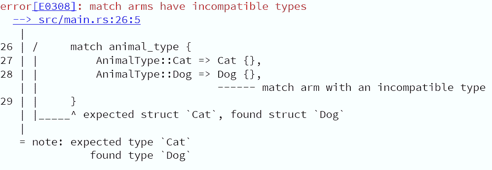
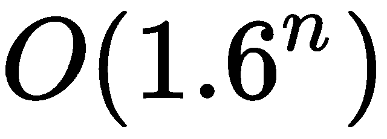
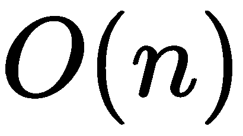
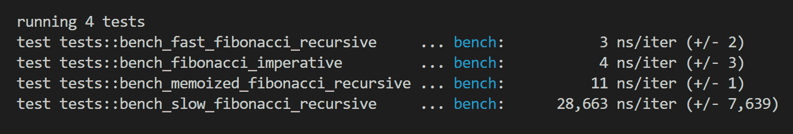

# 使用实验性 Nightly 功能

在本章中，我们将介绍以下食谱：

+   遍历一个包含范围的迭代

+   返回抽象类型

+   函数组合

+   高效地过滤字符串

+   以常规间隔遍历迭代器

+   对你的代码进行基准测试

+   使用生成器

# 简介

这最后一章将带我们了解 Rust 中最重要的实验性功能，这些功能在最新的`nightly`工具链上提供。截至编写时，这是`rustc 1.25.0-nightly`。如果你使用`rustup`（[`rustup.rs/`](https://rustup.rs/)），你可以像这样将其设置为默认工具链：

```rs
rustup default nightly
```

这些食谱将确保你在 Rust 的知识上保持领先，一旦它们稳定下来，或者现在在你的不稳定应用中，你就可以有效地使用它们。

本章中的所有食谱都有不同的稳定性保证。许多在进入`stable`工具链之前将经历巨大的变化，而其他的一些几乎已经完成。这意味着提供的某些示例代码可能无法在你的最新`nightly`版本上运行。当这种情况发生时，你可以在两个地方找到帮助：

+   如果该特性仍然是实验性的，它将在*《不稳定手册》*（[`doc.rust-lang.org/unstable-book/`](https://doc.rust-lang.org/unstable-book/)）中有一个条目，以及一个链接到相关的 GitHub 问题和其周围的讨论

+   如果该特性已经稳定，你很可能会在*《Rust 编程语言，第二版》*（[`doc.rust-lang.org/stable/book/second-edition/appendix-06-newest-features.html`](https://doc.rust-lang.org/stable/book/second-edition/appendix-06-newest-features.html)）的附录中找到它）

# 遍历一个包含范围的迭代

我们以一个小特性开始本章，这个特性可以使你的代码更易于阅读。包含范围的语法（`..=`）将创建一个包含该值的范围。这有助于你通过将它们重写为`n ..= m`来消除像`n .. m+1`这样的丑陋实例。

# 如何做到这一点...

1.  使用`cargo new chapter-ten`创建一个 Rust 项目，在本章中工作。

1.  导航到新创建的`chapter-ten`文件夹。在本章的其余部分，我们将假设你的命令行当前位于这个目录中。

1.  删除生成的`lib.rs`文件，因为我们不是在创建一个库。

1.  在`src`文件夹中，创建一个新的名为`bin`的文件夹。

1.  在`src/bin`文件夹中，创建一个名为`inclusive_range.rs`的文件。

1.  添加以下代码，并使用`cargo run --bin inclusive_range`运行它：

```rs
1   #![feature(inclusive_range_syntax)]
2   
3   fn main() {
4     // Retrieve the entire alphabet in lower and uppercase:
5     let alphabet: Vec<_> = (b'A' .. b'z' + 1) // Start as u8
6       .map(|c| c as char)      // Convert all to chars
7       .filter(|c| c.is_alphabetic()) // Filter only alphabetic     
        chars
8       .collect(); // Collect as Vec
9     println!("alphabet: {:?}", alphabet);
10  
11    // Do the same, but using the inclusive range syntax:
12    let alphabet: Vec<_> = (b'A' ..= b'z') // Start as u8
13      .map(|c| c as char)      // Convert all to chars
14      .filter(|c| c.is_alphabetic()) // Filter only alphabetic  
         chars
15      .collect(); // Collect as Vec
16    println!("alphabet: {:?}", alphabet);
17  }
```

# 它是如何工作的...

在这个例子中，代码是第二章中提到的片段的预期重写；*与集合一起工作*；*将集合作为迭代器访问*。

传统的范围语法（`n .. m`）是排他的，意味着 `0 .. 5` 只包括数字 0、1、2、3 和 4。这对于需要计算某物长度的用例来说很好，但在这个案例中，我们想要遍历字母表，包括 Z [5]。包含范围的语法（`n ..= m`）通过包含最后一个元素来帮助我们，所以 `0 ..= 5` 将产生 0、1、2、3、4 和 5。

# 参见

+   第二章 *与集合一起工作* 中的 *将集合作为迭代器访问* 配方

# 返回抽象类型

记得我们使用 `Box` 创建特质对象以隐藏返回的确切实现，并只提供关于实现特质的保证吗？这需要我们接受一些开销，因为 `Box` 在堆上分配其资源；然而，在当前的 `nightly` 中，情况不同。你可以使用本配方中引入的 `impl trait` 语法，将对象直接作为它们的特质返回到栈上，而无需使用 `Box`。目前，这仅适用于返回类型，但该语法计划扩展到大多数可以写入具体类型的地方。

# 如何做到这一点...

1.  打开之前为你生成的 `Cargo.toml` 文件。

1.  在 `bin` 文件夹中，创建一个名为 `return_abstract.rs` 的文件。

1.  添加以下代码，并使用 `cargo run --bin return_abstract` 运行它：

```rs
1   #![feature(conservative_impl_trait)]
2   
3   trait Animal {
4     fn do_sound(&self);
5   }
6   
7   struct Dog;
8   impl Animal for Dog {
9     fn do_sound(&self) {
10      println!("Woof");
11    }
12  }
13  
14  fn main() {
15    // The caller doesn't know which exact object he gets
16    // He knows only that it implements the Animal trait
17    let animal = create_animal();
18    animal.do_sound();
19  
20    for word in caps_words_iter("do you feel lucky, punk‽") {
21      println!("{}", word);
22    }
23  
24    let multiplier = create_multiplier(23);
25    let result = multiplier(3);
26    println!("23 * 3 = {}", result);
27  }
28  
29  // The impl trait syntax allows us to use abstract return types
30  // This means that we don't specify which exact struct we return
31  // but which trait(s) it implements
32  fn create_animal() -> impl Animal {
33    Dog {}
34  }
35  
36  // Any iterator can be returned as an abstract return type
37  fn caps_words_iter<'a>(text: &'a str) -> impl Iterator + 'a {
38    // Return an iterator over every word converted into ALL_CAPS
39    text.trim().split(' ').map(|word| word.to_uppercase())
40  }
41  
42  // Same goes for closures
43  fn create_multiplier(a: i32) -> impl Fn(i32) -> i32 {
44    move |b| a * b
45  }
```

# 它是如何工作的...

如果你已经阅读了第五章，*高级数据结构*；*数据装箱*，这个配方不需要太多解释。通过返回一个 `impl trait`，我们告诉函数的调用者不必关心返回的具体结构体，它对其的唯一保证是它实现了某些特质。从这个意义上说，抽象返回类型就像在所述配方中讨论的特质对象一样工作，而且还有一个额外的优点，那就是它们要快得多，因为它们没有任何开销。这对于返回迭代器 [37] 和闭包 [43] 很有用，这些是从关于装箱的配方中改编的，但也可以用来隐藏实现细节。考虑我们的函数 `create_animal`[32]。调用者只关心它返回一个实现了 `Animal` 的结构体，但不关心确切的动物。如果由于需求变化，`Dog` [7] 证明不是正确的东西，你可以创建一个 `Cat`，并返回它，而无需触及代码的其他部分，因为所有这些都依赖于 `Animal`。这是一种 *依赖倒置* ([`en.wikipedia.org/wiki/Dependency_inversion_principle`](https://en.wikipedia.org/wiki/Dependency_inversion_principle)) 的形式。

`conservative` 在 `conservative_impl_trait` [1] 中告诉我们，这只是一个更大功能的组成部分。目前，你只能将其用于函数的返回类型。将来，你将能够在特质、约束和绑定中使用它。

# 还有更多...

在本章的所有食谱中，这个可能是最稳定的，因为它正在被考虑立即稳定化。讨论可以在[`github.com/rust-lang/rust/issues/34511.`](https://github.com/rust-lang/rust/issues/34511)找到。

虽然你可以为某些形式的依赖反转使用抽象返回类型，但你不能为根据参数返回不同对象的传统 Java 风格工厂使用它们。这是因为抽象返回类型仅隐藏函数外部返回的特定结构，但仍然在内部依赖于特定的返回值。正因为如此，以下代码将无法编译：

```rs
trait Animal {
    fn do_sound(&self);
}

struct Dog;
impl Animal for Dog {
    fn do_sound(&self) {
        println!("Woof");
    }
}
struct Cat;
impl Animal for Cat {
    fn do_sound(&self) {
        println!("Meow");
    }
}

enum AnimalType {
    Dog,
    Cat,
}

fn create_animal(animal_type: AnimalType) -> impl Animal {
    match animal_type {
        AnimalType::Cat => Cat {},
        AnimalType::Dog => Dog {},
    }
}
```

虽然外界不知道`create_animal`将返回哪种动物，但函数本身在内部需要特定的返回类型。因为我们的匹配中第一个可能的返回值是`Cat`的一个实例，`create_animal`假设我们将不会返回其他类型。我们在下一行通过返回一个`Dog`来打破这种预期，因此编译器会失败：



如果我们想让这个工厂编译，我们需要再次求助于`Box`：

```rs
fn create_animal(animal_type: AnimalType) -> Box<Animal> {
    match animal_type {
        AnimalType::Cat => Box::new(Cat {}),
        AnimalType::Dog => Box::new(Dog {}),
    }
}
```

顺便说一下，这正是 Java 在底层所做的事情。

对于大多数用途，你不需要像这里展示的这样的工厂。使用泛型和特质界限被认为更符合惯例。

# 参见

+   第五章，*高级数据结构*中的*装箱数据*食谱

# 函数组合

因为我们现在已经学会了如何无开销地返回任意闭包，我们可以将此与接受任何数量参数的宏（第一章，*学习基础知识*；*接受可变数量的参数*）结合起来，创建一种易于链式操作的方法，就像你在函数式语言如*Haskell*中习惯的那样。

# 如何做到它...

1.  打开之前为你生成的`Cargo.toml`文件。

1.  在`bin`文件夹中，创建一个名为`compose_functions.rs`的文件。

1.  添加以下代码，并使用`cargo run --bin compose_functions`运行它：

```rs
1   #![feature(conservative_impl_trait)]
2   
3   // The compose! macro takes a variadic amount of closures and  
    returns
4   // a closure that applies them all one after another
5   macro_rules! compose {
6     ( $last:expr ) => { $last };
7     ( $head:expr, $ ($tail:expr), +) => {
8       compose_two($head, compose!($ ($tail), +))
9     };
10  }
11  
12  // compose_two is a helper function used to
13  // compose only two closures into one
14  fn compose_two<FunOne, FunTwo, Input, Intermediate, Output>(
15    fun_one: FunOne,
16    fun_two: FunTwo,
17  ) -> impl Fn(Input) -> Output
18  where
19    FunOne: Fn(Input) -> Intermediate,
20    FunTwo: Fn(Intermediate) -> Output,
21  {
22    move |x| fun_two(fun_one(x))
23  }
24  
25  fn main() {
26    let add = |x| x + 2.0;
27    let multiply = |x| x * 3.0;
28    let divide = |x| x / 4.0;
29    // itermediate(x) returns ((x + 2) * 3) / 4
30    let intermediate = compose!(add, multiply, divide);
31  
32    let subtract = |x| x - 5.0;
33    // finally(x) returns (((x + 2) * 3) / 4) - 5
34    let finally = compose!(intermediate, subtract);
35  
36    println!("(((10 + 2) * 3) / 4) - 5 is: {}", finally(10.0));
37  }
```

# 它是如何工作的...

通过在主函数中使用`compose!`（[30 和 34]），你应该清楚地看到它做了什么：它接受你想要的任意数量的闭包，并将它们组合成一个新闭包，依次运行它们。这对于运行时用户驱动的功能组合非常有用。

宏的实现方式与第一章，*学习基础知识*；*接受可变数量参数*的标准宏类似；其边缘情况是一个单独的闭包[6]。当遇到更多时，它将通过递归遍历它们，并通过调用辅助函数`compose_two` [14]将它们成对组合。通常，类型参数以单个字符书写，但在这个配方中，我们为了可读性原因使用完整的单词，因为涉及到的类型有很多。使用的类型约束应该很好地说明了如何使用这些类型 [18 到 20]：

```rs
where
    FunOne: Fn(Input) -> Intermediate,
    FunTwo: Fn(Intermediate) -> Output,
```

`FunOne`是一个闭包，它接受一个`Input`，将其转换为`Intermediate`，并将其传递给`FunTwo`，后者返回一个`Output`。正如你所看到的实现，我们唯一做的事情就是在值上调用`fun_one`，然后在其返回值上调用`fun_two` [22]：

```rs
move |x| fun_two(fun_one(x))
```

# 参见

+   *接受可变数量参数*的配方在第一章，*学习基础知识*

# 高效地过滤字符串

虽然你可以在稳定频道上从`String`中过滤字符，但这需要创建一个新的包含过滤字符的`String`。在`nightly`上，你可以直接在同一个`String`上执行此操作，如果你需要多次或对非常大的字符串执行此类操作，这将大大提高你的性能。

# 如何操作...

1.  打开之前为你生成的`Cargo.toml`文件。

1.  在`bin`文件夹中，创建一个名为`retain_string.rs`的文件。

1.  添加以下代码，并使用`cargo run --bin retain_string`运行它：

```rs
1   #![feature(string_retain)]
2   
3   fn main() {
4     let mut some_text = "H_el_l__o_ ___Wo_r__l_d_".to_string();
5     println!("Original text: {}", some_text);
6     // retain() removes all chars that don't fulfill a
7     // predicate in place, making it very efficient
8     some_text.retain(|c| c != '_');
9     println!("Text without underscores: {}", some_text);
10    some_text.retain(char::is_lowercase);
11    println!("Text with only lowercase letters: {}", some_text);
12  
13    // Before retain, you had to filter the string as an iterator 
      over chars
14    // This will however create a new String, generating overhead
15    let filtered: String = "H_el_l__o_ ___Wo_r__l_d_"
16      .chars()
17      .filter(|c| *c != '_')
18      .collect();
19    println!("Text filtered by an iterator: {}", filtered);
20  }
```

# 它是如何工作的...

在第二章，*与集合一起工作*；*使用向量*中，我们学习了`Vec::retain`，它可以在原地过滤向量。在`nightly`工具链上，这个功能已经出现在`String`中，并且以相同的方式工作，就像`String`是一个`Vec<char>`——如果你这么想的话，它确实如此。

过滤`String`的功能始终存在，但它需要遍历字符串作为一个`Iterator`，并创建一个新的包含过滤字符的`String`；或者更糟糕的是，将`String`转换为一个新的`Vec<char>`，使用`retain`操作它，然后将字符转换回另一个新创建的`String`。

# 参见

+   *使用向量*的配方在第二章，*与集合一起工作*

# 以常规间隔遍历迭代器

你是否曾想通过仅查看每第 n 个项来遍历数据？在稳定的 Rust 中，解决这个问题的最佳方案是使用第三方 crate `itertools` ([`crates.io/crates/itertools`](https://crates.io/crates/itertools))，它为你带来一大堆迭代器好东西，或者允许你自己编写这个功能；然而，你有一个内置的`step_by`方法，它正好能做这件事。

# 如何操作...

1.  打开之前为您生成的`Cargo.toml`文件。

1.  在`bin`文件夹中，创建一个名为`iterator_step_by.rs`的文件。

1.  添加以下代码，并使用`cargo run --bin iterator_step_by`运行它：

```rs
1   #![feature(iterator_step_by)]
2   
3   fn main() {
4     // step_by() will start on the first element of an iterator,
5     // but then skips a certain number of elements on every  
      iteration
6     let even_numbers: Vec<_> = (0..100).step_by(2).collect();
7     println!("The first one hundred even numbers: {:?}",  
      even_numbers);
8   
9     // step_by() will always start at the beginning.
10    // If you need to skip the first few elements as well, use  
      skip()
11    let some_data = ["Andrei", "Romania", "Giuseppe", "Italy",  
      "Susan", "Britain"];
12    let countries: Vec<_> =  
      some_data.iter().skip(1).step_by(2).collect();
13    println!("Countries in the data: {:?}", countries);
14  
15    let grouped_stream = "Aaron 182cm 70kg Alice 160cm 90kg Bob 
      197cm 83kg";
16    let weights: Vec<_> = grouped_stream
17      .split_whitespace()
18      .skip(2)
19      .step_by(3)
20      .collect();
21    println!("The weights of the people are: {:?}", weights);
22  }
```

# 它是如何工作的...

当你被 handed 一个遵循特定模式的非结构化数据流时，这个配方特别出色。例如，有时一些不使用 JSON 的旧 API，或者你可能想要与之交互的其他程序，会给你一些按位置分组的数据流，就像我们存储在`grouped_stream`[15]中的数据，它遵循以下模式：

```rs
person0 height0 weight0 person1 height1 weight1 person2 height2 weight2
```

`step_by`让我们能够非常容易地解析这个结构。它通过给你当前元素，然后在每次迭代中跳过一定数量的元素来实现。在我们的例子中，我们通过使用`split_whitespace`[17]创建一个遍历每个非空白子字符串的迭代器来解析`grouped_stream`，然后，因为我们只对权重感兴趣，所以我们跳过前两个元素（`"Aaron"`和`"182cm"`），这使得我们的迭代器位于`"70kg"`。然后我们告诉迭代器从现在开始只查看每隔第三个元素，使用`step_by(3)`[19]，结果是我们遍历`"70kg"`、`"90kg"`和`"83kg"`。最后，我们将元素`collect`到一个向量[20]中。

# 参见

+   *使用字符串*和*将集合作为迭代器访问*配方在第二章，*与集合一起工作*

# 基准测试您的代码

Rust 项目为编译器本身开发了一个测试 crate。因为它包括一些相当有用的功能，最重要的是一个基准测试器，所以它可以在夜间构建中作为内置的`test` crate 访问。因为它随着每个夜间构建一起分发，所以您不需要将其添加到`Cargo.toml`中即可使用它。

由于`test` crate 与编译器的紧密耦合，它被标记为不稳定。

# 如何做...

1.  打开之前为您生成的`Cargo.toml`文件。

1.  在`bin`文件夹中，创建一个名为`benchmarking.rs`的文件。

1.  添加以下代码，并使用`cargo bench`运行它：

```rs
1   #![feature(test)]
2   // The test crate was primarily designed for
3   // the Rust compiler itself, so it has no stability guaranteed
4   extern crate test;
5   
6   pub fn slow_fibonacci_recursive(n: u32) -> u32 {
7     match n {
8       0 => 0,
9       1 => 1,
10      _ => slow_fibonacci_recursive(n - 1) +  
        slow_fibonacci_recursive(n - 2),
11    }
12  }
13  
14  pub fn fibonacci_imperative(n: u32) -> u32 {
15    match n {
16      0 => 0,
17      1 => 1,
18      _ => {
19        let mut penultimate;
20        let mut last = 1;
21        let mut fib = 0;
22        for _ in 0..n {
23          penultimate = last;
24          last = fib;
25          fib = penultimate + last;
26        }
27        fib
28      }
29    }
30  }
31  
32  pub fn memoized_fibonacci_recursive(n: u32) -> u32 {
33    fn inner(n: u32, penultimate: u32, last: u32) -> u32 {
34      match n {
35        0 => penultimate,
36        1 => last,
37        _ => inner(n - 1, last, penultimate + last),
38      }
39    }
40    inner(n, 0, 1)
41  }
42  
43  pub fn fast_fibonacci_recursive(n: u32) -> u32 {
44    fn inner(n: u32, penultimate: u32, last: u32) -> u32 {
45      match n {
46        0 => last,
47        _ => inner(n - 1, last, penultimate + last),
48      }
49    }
50    match n {
51      0 => 0,
52      _ => inner(n - 1, 0, 1),
53    }
54  }
```

1.  运行基准测试：

```rs
56  #[cfg(test)]
57  mod tests {
58    use super::*;
59    use test::Bencher;
60  
61    // Functions annotated with the bench attribute will
62    // undergo a performance evaluation when running "cargo bench"
63    #[bench]
64    fn bench_slow_fibonacci_recursive(b: &mut Bencher) {
65      b.iter(|| {
66        // test::block_box is "black box" for the compiler and   
          LLVM
67        // Telling them to not optimize a variable away
68        let n = test::black_box(20);
69        slow_fibonacci_recursive(n)
70      });
71    }
72  
73    #[bench]
74    fn bench_fibonacci_imperative(b: &mut Bencher) {
75      b.iter(|| {
76        let n = test::black_box(20);
77        fibonacci_imperative(n)
78      });
79    }
80  
81    #[bench]
82    fn bench_memoized_fibonacci_recursive(b: &mut Bencher) {
83      b.iter(|| {
84        let n = test::black_box(20);
85        memoized_fibonacci_recursive(n)
86      });
87    }
88  
89    #[bench]
90    fn bench_fast_fibonacci_recursive(b: &mut Bencher) {
91      b.iter(|| {
92        let n = test::black_box(20);
93        fast_fibonacci_recursive(n)
94      });
95    }
96  }
```

# 它是如何工作的...

`test` crate 的精髓是`Bencher`结构体[59]。当运行`cargo bench`时，它的一个实例会自动传递给每个带有`#[bench]`属性的函数[63]。它的`iter`方法接受一个闭包[65]，并多次运行它以确定其一次迭代所需的时间。在这个过程中，它还会丢弃与其他时间测量相差甚远的测量值，以消除一次性极端值。

`test` crate 的另一个有用部分是其`black_box`结构体[68]，它封装任何值并告诉编译器和 LLVM 不要优化它，无论什么情况。如果我们不在我们的基准测试中使用它，它们可能会被优化掉，导致一个相当乐观且无用的测量结果，即 0 ns/iter，或者每次闭包执行的零纳秒。

我们可以使用我们手中的工具来测试一些理论。记住在第七章中讨论的递归**斐波那契**实现，*并行和射线*；*同时运行两个操作*？嗯，这里重复一下，作为`slow_fibonacci_recursive`[6]。

这种实现之所以慢，是因为对`slow_fibonacci_recursive(n - 1)`和`slow_fibonacci_recursive(n - 2)`的两次调用都需要单独重新计算*所有*值。更糟糕的是，每次调用还会再次拆分成对`slow_fibonacci_recursive(n - 1)`和`slow_fibonacci_recursive(n - 2)`的调用，一次又一次地重新计算！在*大 O*的术语中，这是效率为（证明见[`stackoverflow.com/a/360773/5903309`](https://stackoverflow.com/a/360773/5903309)）。相比之下，命令式算法`fibonacci_imperative` [14]只是一个简单的循环，所以它处于。根据这个理论，它应该比慢速的递归实现快得多。运行`cargo bench`可以让我们轻松验证这些断言：



差异多么大！在我的电脑上，慢速的递归实现比命令式实现慢了 7,000 多倍！当然，我们可以做得更好。

**StackOverflow**用户**Boiethios**友好地为我们提供了`memoized_fibonacci_recursive`[`stackoverflow.com/a/49052806/5903309`](https://stackoverflow.com/a/49052806/5903309)。正如其名所示，这种实现使用了一种称为*记忆化*的概念。这意味着算法有某种方式传递已经计算过的值。一种简单的方法是传递一个包含所有计算值的`HashMap`，但这又会带来自己的开销，因为它在堆上操作。相反，我们选择了*累加器*的方法。这意味着我们只需直接将相关值作为参数传递，在我们的例子中，这些值是`penultimate`，它代表`n-2`的斐波那契数，以及`last`，它代表`n-1`的斐波那契数。如果你想了解更多关于这些函数式概念的信息，请查看[`www.idryman.org/blog/2012/04/14/recursion-best-practices/`](http://www.idryman.org/blog/2012/04/14/recursion-best-practices/)。

检查基准测试，我们可以看到我们通过`memoized_fibonacci_recursive`大大提高了算法的效率。但它仍然比`fibonacci_imperative`慢一点。提高算法的许多可能方法之一是将每次递归调用中都会检查的`n == 1`匹配提取出来，如`fast_fibonacci_recursive` [43]所示，它在每次迭代中只需要 3 纳秒！

# 还有更多...

我们的实现还采用了另一种优化：*尾调用优化*，或简称 *TCO*。用简化的术语来说，TCO 发生在编译器能够将递归算法重写为命令式算法时。更普遍地说，TCO 是当编译器能够将递归调用编译成不需要为每个调用添加新的栈帧的形式，因此不会导致栈溢出（不是网站，而是错误）。关于这个话题的深入讨论，请参阅[`stackoverflow.com/questions/310974/what-is-tail-call-optimization`](https://stackoverflow.com/questions/310974/what-is-tail-call-optimization)。

尽管 Rust 本身不支持尾调用优化（TCO）（参见[`github.com/rust-lang/rfcs/issues/271`](https://github.com/rust-lang/rfcs/issues/271)中的 RFC），但底层的 LLVM 支持。它要求函数的最后一个调用必须是它自己的调用。`inner` 函数的最后一行是对 `inner` 的调用，因此它符合 TCO 的条件。

然而，在更大的 Rust 算法中，这有点难以保证，因为实现 `Drop` 特质的对象将在函数末尾注入一个对 `drop()` 的调用，从而消除了 TCO 的可能性。

# 参考以下内容

+   在第七章的 *并行性和 Rayon* 中，*同时运行两个操作* 的配方

# 使用生成器

在 Rust 中，目前仍有一些概念尚未完全可用，其中最大的概念之一就是 *简单异步*。其中一个原因是编译器对某些事物的支持不足，目前正在解决这个问题。异步之路的一个重要部分是 *生成器*，它们的实现方式类似于在 C#或 Python 中的使用。

# 如何实现...

1.  打开之前为您生成的 `Cargo.toml` 文件。

1.  在 `bin` 文件夹中，创建一个名为 `generator.rs` 的文件。

1.  添加以下代码，并使用 `cargo run --bin generator` 运行它：

```rs
1   #![feature(generators, generator_trait,  
    conservative_impl_trait)]
2   
3   fn main() {
4     // A closure that uses the keyword "yield" is called a 
      generator
5     // Yielding a value "remembers" where you left off
6     // when calling .resume() on the generator
7     let mut generator = || {
8       yield 1;
9       yield 2;
10    };
11    if let GeneratorState::Yielded(value) = generator.resume() {
12      println!("The generator yielded: {}", value);
13    }
14    if let GeneratorState::Yielded(value) = generator.resume() {
15      println!("The generator yielded: {}", value);
16    }
17    // When there is nothing left to yield,
18    // a generator will automatically return an empty tuple
19    if let GeneratorState::Complete(value) = generator.resume() {
20      println!("The generator completed with: {:?}", value);
21    }
22  
23    // At the moment, you can return a different type
24    // than you yield, although this feature is considered for  
      removal
25    let mut generator = || {
26      yield 100;
27      yield 200;
28      yield 300;
29      "I'm a string"
30    };
31    loop {
32      match generator.resume() {
33        GeneratorState::Yielded(value) => println!("The generator   
          yielded: {}", value),
34        GeneratorState::Complete(value) => {
35          println!("The generator completed with: {}", value);
36          break;
37        }
38      }
39    }
40  
41    // Generators are great for implementing iterators.
42    // Eventually, all Rust iterators are going to be rewritten 
      with generators
43    let fib: Vec<_> = fibonacci().take(10).collect();
44    println!("First 10 numbers of the fibonacci sequence: {:?}", 
      fib);
45  }
46  
47  // As of the time of writing, a generator does not have a
48  // direct conversion to an iterator yet, so we need a wrapper:
49  use std::ops::{Generator, GeneratorState};
50  struct GeneratorIterator(T);
51  impl Iterator for GeneratorIterator
52  where
53    T: Generator,
54  {
55    type Item = T::Yield;
56    fn next(&mut self) -> Option {
57      match self.0.resume() {
58        GeneratorState::Yielded(value) => Some(value),
59        GeneratorState::Complete(_) => None,
60      }
61    }
62  }
63  
64  fn fibonacci() -> impl Iterator {
65    // Using our wrapper
66    GeneratorIterator(move || {
67      let mut curr = 0;
68      let mut next = 1;
69      loop {
70        yield curr;
71        let old = curr;
72        curr = next;
73        next += old;
74      }
75    })
76  }
```

# 它是如何工作的...

`Generator` 当前定义为任何使用新 `yield` 关键字的闭包。当它通过 `.resume()` [11] 执行时，它将运行到遇到 `yield` 为止。如果再次运行，生成器将从上次停止的地方继续执行，直到遇到另一个 `yield` 或遇到 `return`。如果没有更多的 `yield`，生成器将简单地返回一个空元组，就像遇到了 `return ();`。

因为生成器执行时存在两种情况（`yield` 与 `return`），所以每次使用它时都必须检查 `.resume()` 的结果，它可能是 `GeneratorState::Yielded` 或 `GeneratorState::Complete`。

在撰写本文时，你可以 `return` 一个不同于 `yield` 的类型。关于这一点的情况有些不清楚，因为这种异常的原因是上述在 `yield` 用尽时 `return ();` 的约定。也许 Rust 中生成器的最终版本将不会依赖这种行为，而只允许返回与 `yield` 相同的类型。你可以在[`github.com/rust-lang/rust/issues/43122`](https://github.com/rust-lang/rust/issues/43122)找到关于这个话题和更多内容的讨论。

除了异步之外，生成器另一个重要的用例是迭代器。如此之多，以至于 Rust 标准库的迭代器计划最终将被生成器重写。目前，如何实现这一过渡的具体方式尚未确定，因此没有`Iterator for Generator`的泛型实现。为了解决这个问题，你可以创建一个小的包装类型，就像我们用`GeneratorIterator`[50]做的那样，它为它的包装`Generator`实现了`Iterator`。

我们通过重写第二章中的斐波那契迭代器来说明如何使用它，该章节名为*处理集合*；*创建自定义迭代器*，在`fibonacci`函数中使用生成器[64]。实现看起来相当简洁，不是吗？作为提醒，以下是使用`Iterator`特质直接编写的原始实现，它不仅需要一个函数，还需要一个`struct`和一个特质实现：

```rs
fn fibonacci() -> Fibonacci {
    Fibonacci { curr: 0, next: 1 }
}
struct Fibonacci {
    curr: u32,
    next: u32,
}
impl Iterator for Fibonacci {
    type Item = u32;
    fn next(&mut self) -> Option<u32> {
        let old = self.curr;
        self.curr = self.next;
        self.next += old;
        Some(old)
    }
}
```

# 参见

+   在第二章中，*处理集合*的*创建自定义迭代器*配方[977b8621-cb73-43de-9a2b-4bc9f5583542.xhtml]
