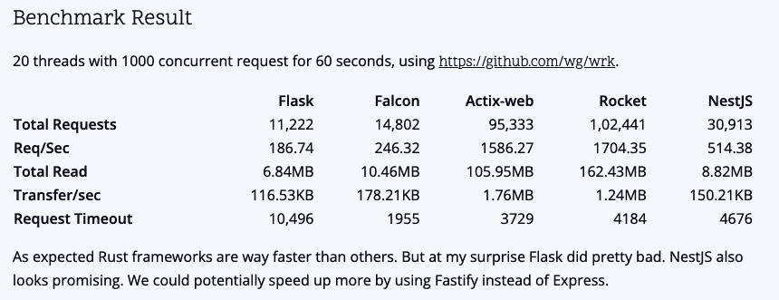
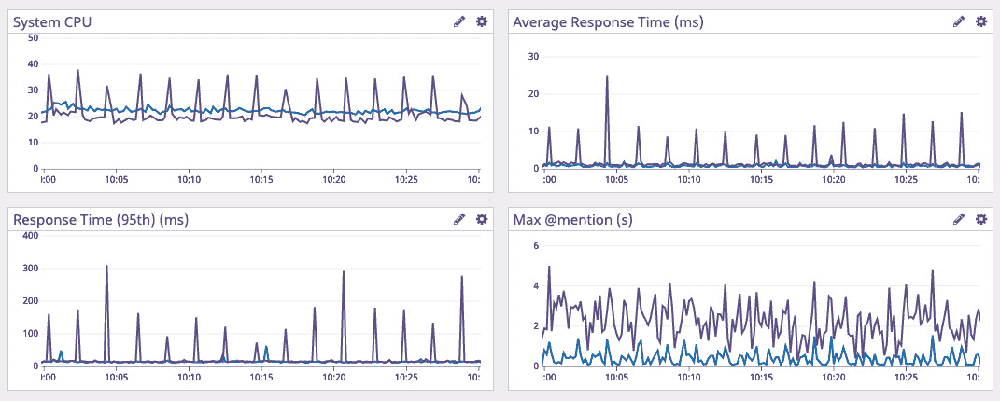
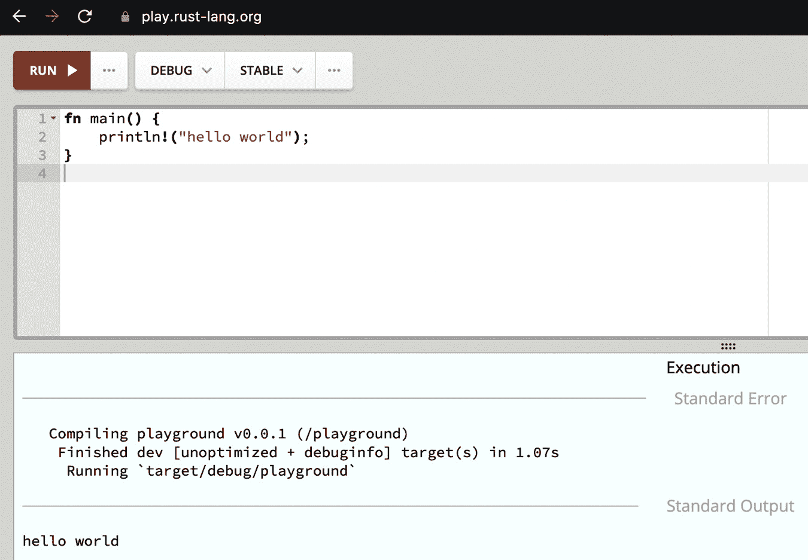
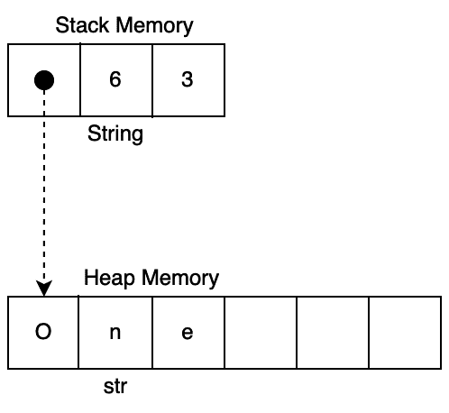
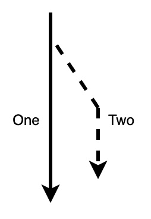
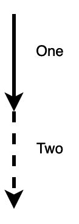
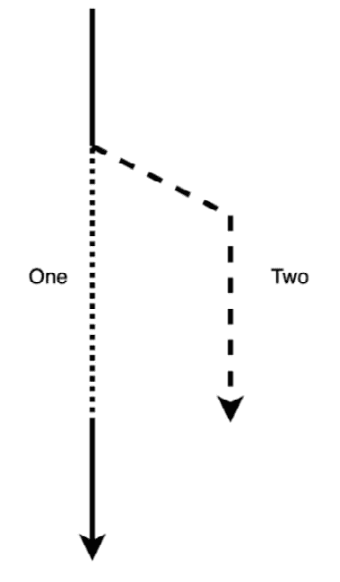
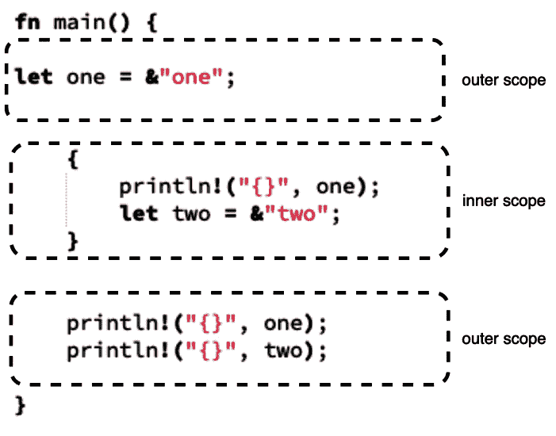
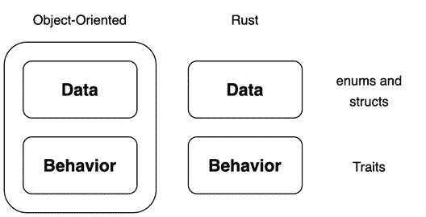

# 第一章：Rust 快速入门

**Rust** 正在变得越来越受欢迎，但它的学习曲线很陡峭。通过了解 Rust 的基本规则，以及学习如何操作各种数据类型和变量，我们将能够以与动态类型语言相似的方式，使用相同数量的代码编写简单的程序。

本章的目标是介绍 Rust 与通用动态语言之间的主要区别，并快速让你了解如何利用 Rust。

本章将涵盖以下主题：

+   为什么 Rust 是革命性的？

+   检查 Rust 中的数据类型和变量

+   控制变量所有权

+   构建 struct

+   使用宏进行元编程

一旦我们掌握了本章的主要概念，你将能够编写能在 Rust 中运行的简单程序。你还将能够调试你的程序并理解 Rust 编译器抛出的错误信息。因此，你将拥有在 Rust 中高效工作的基础。你还将能够将 Rust 代码组织到多个文件中。

# 技术要求

对于本章，我们只需要访问互联网，因为我们将在在线 Rust 操场中实现代码。提供的代码示例可以在在线 Rust 操场中运行。[`play.rust-lang.org/`](https://play.rust-lang.org/)

对于详细说明，请参阅以下文件：[`github.com/PacktPublishing/Rust-Web-Programming-2nd-Edition/tree/main/chapter01`](https://github.com/PacktPublishing/Rust-Web-Programming-2nd-Edition/tree/main/chapter01)

# 为什么 Rust 是革命性的？

在编程中，通常需要在速度和资源、开发速度和安全之间做出权衡。像 C/C++ 这样的低级语言可以给开发者提供对计算机的精细控制，代码执行速度快，资源消耗最小。然而，这并非没有代价。手动内存管理可能会引入错误和安全漏洞。一个简单的例子是缓冲区溢出攻击。这发生在程序员没有分配足够内存的情况下。例如，如果缓冲区只有 15 字节大，而发送了 20 字节，那么额外的 5 字节可能会超出边界。攻击者可以通过传递比缓冲区能处理的更多字节来利用这一点。这可能会覆盖包含可执行代码的区域，并用自己的代码覆盖它们。还有其他方法可以攻击没有正确管理内存的程序。除了增加了漏洞之外，解决低级语言中的问题需要更多的代码和时间。因此，C++ 网络框架并没有占据网络开发的大份额。相反，通常选择使用像 Python、Ruby 和 JavaScript 这样的高级语言更有意义。使用这些语言通常会导致开发者安全且快速地解决问题。

然而，必须指出的是，这种内存安全是有代价的。这些高级语言通常跟踪所有定义的变量及其对内存地址的引用。当没有更多的变量指向内存地址时，该内存地址中的数据就会被删除。这个过程称为垃圾回收，它消耗额外的资源和时间，因为程序必须停止以清理变量。

使用 Rust，内存安全无需昂贵的垃圾回收过程。Rust 通过在编译时使用借用检查器检查的一组所有权规则来确保内存安全。这些规则是下一节中提到的怪癖。正因为如此，Rust 能够通过真正高效的代码实现快速、安全的解决问题，从而打破了速度/安全性的权衡。

内存安全

内存安全是程序具有始终指向有效内存的内存指针的特性。

随着数据处理、交通和复杂任务被提升到网络堆栈中，Rust 凭借其不断增长的 Web 框架和库的数量，现在已成为 Web 开发的可行选择。这为 Rust 在 Web 领域带来了真正惊人的成果。在 2020 年，Shimul Chowdhury 对具有相同规格但不同语言和框架的服务器进行了一系列测试。结果可以在以下图表中看到：



图 1.1 – Shimul Chowdhury 对不同框架和语言的结果（可在 https://www.shimul.dev/posts/06-04-2020-benchmarking-flask-falcon-actix-web-rocket-nestjs/找到）

在前面的图表中，我们可以看到语言和框架之间存在一些差异。然而，我们必须注意，Rust 框架包括 Actix Web 和 Rocket。在处理总请求和数据传输方面，这些 Rust 服务器完全处于不同的水平。其他语言，如 Golang，已经进入市场，但 Rust 中缺乏垃圾回收功能却成功地超越了 Golang。这可以在 Jesse Howarth 的博客文章《Why Discord is switching from Go to Rust》中得到证明，其中发布了以下图表：



图 1.2 – Discord 的发现 => Golang 波动较大，Rust 则平滑（可在 https://discord.com/blog/why-discord-is-switching-from-go-to-rust 找到）

Golang 为了保持内存安全而实施的垃圾回收导致 2 分钟的峰值。这并不是说我们应该用 Rust 来做所有事情。最佳实践是使用适合工作的正确工具。所有这些语言都有不同的优点。我们在前面的图表中所做的是仅仅展示 Rust 的优点。

无需垃圾回收的需求是因为 Rust 使用强制规则通过借用检查器来确保内存安全。既然我们已经了解了为什么想要用 Rust 编码，我们就可以继续到下一节检查数据类型。

# 检查 Rust 中的数据类型和变量

如果你之前在其他语言中编码过，你将使用变量并处理不同的数据类型。然而，Rust 确实有一些可能会让开发者感到沮丧的特点。这尤其适用于那些来自动态语言的开发者，因为这些特点主要围绕内存管理和变量的引用。这些特点一开始可能会让人感到害怕，但当你理解它们时，你会学会欣赏它们。有些人可能会听说这些特点，并想知道为什么他们应该费心学习这门语言。这是可以理解的，但正是这些特点让 Rust 成为了一个范式转变的语言。与借用检查和与诸如生命周期和引用等概念作斗争，使我们能够获得像 Python 这样的动态语言的高级内存安全性。然而，我们也可以获得像 C 和 C++ 提供的低级内存安全资源。这意味着在 Rust 中编码时，我们不必担心悬垂指针、缓冲区溢出、空指针、段错误、数据竞争和其他问题。像空指针和数据竞争这样的问题可能很难调试。考虑到这一点，强制执行的规则是一个很好的权衡，因为我们必须了解 Rust 的特点，以获得非内存安全语言的速度和控制，但我们不会遇到这些非内存安全语言带来的头痛。

在我们进行任何网络开发之前，我们需要运行我们的第一个程序。我们可以在 Rust 操场中这样做，网址是 [`play.rust-lang.org/`](https://play.rust-lang.org/)。

如果你以前从未访问过 Rust 操场，当你到达那里时，你会看到以下布局：

```rs
fn main() {
    println!("hello world");
}
```

当使用在线 Rust 操场时，前面的代码将看起来像以下截图：



图 1.3 – 在线 Rust 操场视图

在我们的 `hello world` 代码中，我们有一个 `main` 函数，这是我们的入口点。当运行我们的程序时，这个函数会被触发。所有程序都有入口点。如果你之前没有听说过这个概念，那可能是因为你来自动态语言，入口点是你指向解释器的脚本文件。对于 Python 来说，一个更接近的类比是当文件直接由解释器运行时运行的 `main` 块，如下所示：

```rs
if __name__ == "__main__":
    print("Hello, World!")
```

如果你用 Python 编写代码，你可能会在 Flask 应用程序中看到这种用法。目前，我们并没有做任何新的东西。这是一个标准的*Hello World*示例，只是语法上有一点变化；然而，即使在这个例子中，我们打印的字符串也不像看起来那么简单。例如，让我们编写自己的函数，该函数接受一个字符串并使用以下代码打印它：

```rs
fn print(message: str) {
    println!("{}", message);
}
fn main() {
    let message = "hello world";
    print(message);
}
```

这段代码应该可以正常工作。我们将其传递给我们的函数并打印它。然而，如果我们打印它，我们会得到以下输出：

```rs
10 |     print(message);
   |           ^^^^^^^ doesn't have a size known at compile-time
   |
   = help: the trait `Sized` is not implemented for `str`
   = note: all function arguments must have a statically known size 
```

这不是很直接，但它带我们来到了我们必须理解的第一块领域，那就是字符串。别担心，字符串是编写功能性 Rust 代码时你需要弄清楚的最古怪变量。

## 在 Rust 中使用字符串

在我们探索上一节中的错误之前，让我们先纠正它，这样我们才知道我们要努力的方向。我们可以用以下代码让`print`函数在没有错误的情况下工作：

```rs
fn print(message: String) {
    println!("{}", message);
}
fn main() {
    let message = String::from("hello world");
    print(message);
}
```

我们所做的是从`"hello world"`创建了一个`String`，并将其传递给`print`函数。这次编译器没有抛出错误，因为我们始终知道`String`的大小，因此我们可以保留足够的内存空间。这听起来可能有些反直觉，因为字符串通常有不同的长度。如果我们只能使用相同长度的字母来编写代码中的每个字符串，那么这将不是一个非常灵活的编程语言。这是因为字符串本质上是由字节向量实现的指针，在 Rust 中用`Vec<u8>`表示。它持有对堆内存中字符串内容（`str`，也称为字符串切片）的引用，如下面的图所示：



图 1.4 – 字符串与 str“one”的关系

我们可以在**图 1.4**中看到，字符串是一个包含三个数字的向量。第一个数字是它所引用的`str`的实际内存地址。第二个数字是分配的内存大小，第三个是字符串内容长度。因此，我们可以在代码中访问字符串字面量，而无需在代码中传递各种大小的变量。我们知道`String`有一个固定的大小，因此可以在`print`函数中分配这个大小。还必须注意的是，`String`位于栈内存中，而我们的字符串字面量位于堆内存中。考虑到我们知道`String`有一个固定的大小，而我们的字符串字面量是可变的，我们可以推断出栈内存用于可预测的内存大小，并且在程序运行时提前分配。我们的堆内存是动态的，因此当需要时才分配内存。现在我们知道了字符串的基本知识，我们可以使用它们创建的不同方式，如下面的代码所示：

```rs
    let string_one = "hello world".to_owned();
    let string_two = "hello world".to_string();
    let string_three = string_two.clone();
```

我们必须注意，然而，创建`string_three`是昂贵的，因为我们必须在堆中复制底层数据，而堆操作是昂贵的。这并不是 Rust 特有的怪癖。在我们的例子中，我们只是在体验底层发生了什么。例如，如果我们修改 Python 中的字符串，我们将会得到不同的结果：

```rs
# slower method 
data = ["one", "two", "three", "four"]
string = ""
for i in data:
    string += i   
# faster method
"".join(data)
```

通过循环添加字符串会更慢，因为 Python 必须分配新的内存并将整个字符串复制到新的内存地址。`join`方法更快，因为 Python 可以分配列表中所有数据的内存，然后复制数组中的字符串，这意味着字符串只需复制一次。这表明，尽管像 Python 这样的高级语言可能不会强迫你考虑字符串的内存分配，但如果你不承认这一点，你仍然会付出代价。

我们也可以通过借用，将字符串字面量传递给`print`函数，如下面的代码所示：

```rs
fn print(message: &str) {
    println!("{}", message);
}
fn main() {
    print(&"hello world");
}
```

借用用`&`表示。我们将在本章的后面讨论借用。现在，我们可以推断出借用只是一个固定大小的变量大小字符串切片的引用。如果借用是固定大小，我们就不能将其传递给`print`函数，因为我们不知道大小。在这个时候，我们可以舒适地在 Rust 中使用字符串。在我们开始编写 Rust 程序之前，我们必须理解的概念是整数和浮点数。

## 使用整数和浮点数

在大多数高级 Web 编程语言中，我们只是将浮点数或整数赋给变量名，然后继续程序。然而，根据我们在字符串部分之前所接触到的内容，我们现在理解，在使用 Rust 中的字符串时，我们必须担心内存大小。整数和浮点数也是如此。我们知道整数和浮点数有大小范围。因此，我们必须告诉 Rust 我们在代码中传递了什么。Rust 支持有符号整数，用`i`表示，和无符号整数，用`u`表示。这些整数由 8、16、32、64 和 128 位组成。探索数字在二进制表示背后的数学并不适用于这本书；然而，我们需要了解使用几个位可以表示的数字范围，因为这将帮助我们理解 Rust 中不同类型的浮点数和整数表示什么。因为二进制要么是 0 要么是 1，我们可以通过将 2 的位数次幂来计算可以表示的整数范围。例如，如果我们有一个由 8 位表示的整数，2 的 8 次幂等于 256。我们必须记住 0 也是被表示的。考虑到这一点，8 位的整数范围是 0 到 255。我们可以用以下代码测试这个计算：

```rs
let number: u8 = 256;
```

这比我们计算的范围高一个。因此，我们不应该对看到以下溢出错误感到惊讶：

```rs
the literal `256` does not fit into the type 
`u8` whose range is `0..=255`
```

因此，我们可以推断，如果我们把无符号整数降低到 `255`，它将可以通过。但是，假设我们用以下代码将无符号整数转换为有符号整数：

```rs
let number: i8 = 255;
```

我们将看到我们得到以下有用的错误信息：

```rs
the literal `255` does not fit into the type 
`i8` whose range is `-128..=127`
```

有助于的这条错误信息，我们可以看到有符号整数考虑了负数，因此有符号整数可以取的绝对值大约是二分之一。因此，我们可以通过以下代码将数字作为 16 位有符号整数来增加范围：

```rs
let number: i16 = 255;
```

这将有效。然而，让我们用以下代码将我们的 16 位整数与 8 位整数相加：

```rs
let number = 255i16;
let number_two = 5i8;
let result = number + number_two;
```

之前的代码可能看起来有些不同。在前面的代码中，我们只是用后缀定义了数据类型。所以，`number` 的值是 `255`，类型是 `i16`，而 `number_two` 的值是 `5`，类型是 `i8`。如果我们运行前面的代码，我们会得到以下错误：

```rs
11 |     let result = number + number_two;
   |                         ^ no implementation for `i16 + i8`
   |
   = help: the trait `Add<i8>` is not implemented for `i16`
```

我们将在本章后面讨论特质。现在，我们必须理解的是，我们不能将两个不同类型的整数相加。如果它们都是同一类型，那么我们可以。我们可以通过类型转换使用 `as` 来更改整数类型，如下面的代码行所示：

```rs
 let result = number + number_two as i16;
```

这意味着 `number_two` 现在是一个 16 位整数，而 `result` 将是 260。然而，我们必须小心类型转换，因为如果我们以错误的方式执行，我们可能会遇到一个静默的错误，这在 Rust 中是不常见的。如果我们将 `number` 转换为 `i8` 类型而不是将 `number_two` 转换为 `i16` 类型，那么 `result` 将等于 4，这没有意义，因为 255 + 5 等于 260。这是因为 `i8` 类型小于 `i16` 类型。因此，如果我们把 `i16` 整数转换为 `i8` 整数，我们实际上是在截断一些数据，只取数字的低位，而忽略高位。因此，如果我们把 `number` 转换为 `i8` 整数，它最终会变成 -1。为了更安全，我们可以使用 `i8::from` 函数，如下面的代码所示：

```rs
let result = i8::from(number) + number_two;
```

运行此代码将给出以下错误：

```rs
let result = i8::from(number) + number_two;
|                  ^^^^^^^^ the trait `From<i16>` is not 
                            implemented for `i8`
```

再次，我们将在本章后面讨论特质，但我们可以看到在前面的代码中，由于 `From<i16>` 特质没有为 `i8` 整数实现，我们不能将 `i8` 整数转换为 `i16` 整数。理解了这一点，我们可以自由地安全且高效地处理整数。关于 Rust 中整数大小的最后一个要点是，它们不是连续的。支持的大小如下表所示：

| **位** | **计算** | **大小** |
| --- | --- | --- |
| 8 | 2⁸ | 256 |
| 16 | 2¹⁶ | 65536 |
| 32 | 2³² | 4294967296 |
| 64 | 2⁶⁴ | 1.8446744e+19 |
| 128 | 2¹²⁸ | 3.4028237e+38 |

表 1.1 – 整数类型的大小

当涉及到浮点数时，Rust 支持浮点数 `f32` 和 `f64`。这两种浮点类型都支持负数和正数。声明浮点变量需要与整数相同的语法，如下面的代码所示：

```rs
let float: f32 = 2.6;
```

通过这种方式，我们可以在 Rust 代码中舒适地处理整数和浮点数。然而，作为开发者，我们知道仅仅声明浮点数和整数并不是非常有用。我们希望能够包含并遍历它们。在下一节中，我们将使用向量和数组来实现这一点。

## 在向量和数组中存储数据

在 Rust 中，我们可以将我们的浮点数、整数和字符串存储在数组和向量中。首先，我们将专注于数组。数组存储在栈内存中。了解这一点，并记住我们学到的关于字符串的知识，我们可以推断出数组的大小是固定的。这是因为，正如我们记得的，如果变量存储在栈上，那么内存将在程序开始时分配并加载到栈中。我们可以定义一个整数数组，遍历它，打印每个整数，然后通过索引访问一个整数，以下代码可以做到这一点：

```rs
fn main() {
    let int_array: [i32; 3] = [1, 2, 3];
    for i in int_array {
        println!("{}", i);
    }
    println!("{}", int_array[1]);
}
```

使用前面的代码，我们通过将它们括在方括号中来定义类型和大小。例如，如果我们打算创建一个长度为 4 的浮点数数组，我们会使用`int_array: [f32; 4] = [1.1, 2.2, 3.3, 4.4]`。运行前面的代码将给出以下打印输出：

```rs
1
2
3
2
```

在前面的打印输出中，我们看到循环是有效的，并且我们可以通过方括号访问第二个整数。尽管数组的内存大小是固定的，我们仍然可以改变它。这就是可变性的作用所在。当我们定义一个变量为可变时，这意味着我们可以对其进行修改。换句话说，如果变量是可变的，我们可以在定义之后改变其值。如果你尝试更新本章中编写的代码中的任何变量，你会发现你无法这样做。这是因为 Rust 中的所有变量默认都是不可变的。我们可以在变量名前加上`mut`标签来使任何变量在 Rust 中变为可变。回到固定数组，我们无法改变数组的大小，这意味着由于它存储在栈内存中，我们无法向其中追加/推送新的整数。然而，如果我们定义一个可变数组，我们可以使用相同内存大小的其他整数来更新其部分。以下代码是一个例子：

```rs
fn main() {
    let mut mutable_array: [i32; 3] = [1, 2, 0];
    mutable_array[2] = 3;
    println!("{:?}", mutable_array);
    println!("{}", mutable_array.len());
}
```

在前面的代码中，我们可以看到数组中的最后一个整数被更新为`3`。然后我们打印出整个数组，然后打印出长度。你可能也注意到，前面代码的第一个打印语句现在使用了`{:?}`。这调用了`Debug`特质。如果我们为要打印的东西实现了`Debug`，那么打印的东西的完整表示将在控制台显示。你还可以看到我们打印出了数组长度的结果。运行此代码将给出以下打印输出：

```rs
[1, 2, 3]
3
```

通过前面的打印输出，我们可以确认数组现在已更新。我们还可以使用数组访问切片。为了演示这一点，我们可以创建一个包含 100 个零的数组。然后我们可以从这个数组中取一个切片，并使用以下代码打印它：

```rs
fn main() {
    let slice_array: [i32; 100] = [0; 100];
    println!("length: {}", slice_array.len());
    println!("slice: {:?}", &slice_array[5 .. 8]);
}
```

运行前面的代码将产生以下输出：

```rs
length: 100
slice: [0, 0, 0]
```

现在，我们能够使用数组进行生产。数组对于缓存很有用。例如，如果我们知道需要存储的量，那么我们可以有效地使用数组。然而，我们只成功地在数组中存储了一种类型的数据。如果我们试图在同一个数组中存储字符串和整数，我们会遇到问题。我们如何定义类型？这个问题适用于所有集合，如向量、**HashMaps**。有多种方法可以做到这一点，但最直接的方法是使用枚举。枚举就是枚举。在像 Python 这样的动态语言中，你可能不需要使用它们，因为你可以将任何类型传递到任何你想去的地方。然而，它们仍然可用。枚举是枚举类型的简称，基本上定义了一个具有可能变体的类型。在我们的情况下，我们希望我们的数组能够在同一个集合中存储字符串和整数。我们可以通过以下代码初始化我们的枚举来实现这一点：

```rs
enum SomeValue {
    StringValue(String),
    IntValue(i32)
}
```

在前面的代码中，我们可以看到我们定义了一个名为`SomeValue`的枚举。然后我们表示`StringValue`存储字符串值，而`IntValue`存储整数值。然后我们可以定义一个长度为`4`的数组，包含 2 个字符串和 2 个整数，以下代码所示：

```rs
    let multi_array: [SomeValue; 4] = [
        SomeValue::StringValue(String::from("one")),
        SomeValue::IntValue(2),
        SomeValue::StringValue(String::from("three")),
        SomeValue::IntValue(4)
    ];
```

在前面的代码中，我们可以看到我们将字符串和整数包裹在我们的枚举中。现在，在循环中获取它们将是一项额外的任务。例如，我们可以对整数执行的操作，而对字符串则不能，反之亦然。考虑到这一点，在循环数组时，我们需要使用`match`语句，如下面的代码所示：

```rs
    for i in multi_array {
        match i {
            SomeValue::StringValue(data) => {
                println!("The string is: {}", data);
            },
            SomeValue::IntValue(data) => {
                println!("The int is: {}", data);
            }
        }
    }
```

在前面的代码中，我们可以看到如果`i`是`SomeValue::StringValue`，我们就将包裹在`SomeValue::StringValue`中的数据分配给名为`data`的变量。然后我们将`data`传递到内部作用域以进行打印。我们以相同的方式处理整数。尽管我们只是在打印以演示概念，但我们可以在这些内部作用域中对`data`变量执行类型允许的任何操作。运行前面的代码将产生以下输出：

```rs
The string is: one
The int is: 2
The string is: three
The int is: 4
```

使用枚举包裹数据和`match`语句处理数据的方法可以应用于 HashMaps 和向量。此外，我们用数组涵盖的内容也可以应用于向量。唯一的区别是我们不需要定义长度，并且如果需要，我们可以增加向量的大小。为了演示这一点，我们可以创建一个字符串向量，然后添加一个字符串到末尾，以下代码所示：

```rs
    let mut string_vector: Vec<&str> = vec!["one", "two", 
        "three"];
    println!("{:?}", string_vector);
    string_vector.push("four");
    println!("{:?}", string_vector);
```

在前面的代码中，我们可以看到我们使用`vec!`宏来创建字符串向量。你可能已经注意到，像`vec!`和`println!`这样的宏可以改变输入的数量。我们将在本章后面介绍宏。运行前面的代码将产生以下输出：

```rs
["one", "two", "three"]
["one", "two", "three", "four"]
```

我们还可以使用 `Vec` 结构的 `new` 函数创建一个空向量，代码如下：`let _empty_vector: Vec<&str> = Vec::new();`。你可能想知道何时使用向量，何时使用数组。向量更加灵活。你可能为了性能提升而倾向于使用数组。从表面上看，这似乎是合理的，因为它存储在栈上。访问栈将会更快，因为内存大小可以在编译时计算出来，这使得分配和释放比堆简单。然而，因为它在栈上，所以它不能超出其分配的作用域。移动向量只需要移动指针。然而，移动数组需要复制整个数组。因此，复制固定大小的数组比移动向量更昂贵。如果你只有少量数据，你只需要在小的作用域中使用这些数据，并且你知道数据的大小，那么使用数组是有意义的。然而，如果你将要移动数据，即使你知道数据的大小，使用向量也是一个更好的选择。现在我们可以使用基本的集合进行生产，我们可以继续到更高级的集合，即 HashMap。

## 使用 HashMap 映射数据

在某些其他语言中，HashMaps 被称为字典。它们有一个键和一个值。我们可以使用键来插入和获取值。现在我们已经学习了如何处理集合，我们可以在本节中稍微大胆一些。我们可以创建一个游戏角色的简单档案。在这个角色档案中，我们将有一个名字、年龄以及他们拥有的物品列表。这意味着我们需要一个枚举来容纳一个字符串、一个整数以及一个也容纳字符串的向量。我们希望打印出完整的 HashMap 来查看我们的代码是否正确。为此，我们将为我们的枚举实现 `Debug` 特性，如下面的代码所示：

```rs
#[derive(Debug)]
enum CharacterValue {
    Name(String),
    Age(i32),
    Items(Vec<String>)
}
```

在前面的代码中，我们可以看到我们对枚举使用了 `derive` 属性。在这种情况下，属性是应用于 `CharacterValue` 枚举的元数据。`derive` 属性告诉编译器提供一个特性的基本实现。因此，在前面的代码中，我们告诉编译器将 `Debug` 特性的基本实现应用于 `CharacterValue` 枚举。有了这个，我们就可以创建一个新的 HashMap，其键指向我们定义的值，如下面的代码所示：

```rs
use std::collections::HashMap;
fn main() {
    let mut profile: HashMap<&str, CharacterValue> = 
                     HashMap::new();
}
```

我们说它是可变的，因为我们将要使用以下代码插入值：

```rs
profile.insert("name", CharacterValue::Name("Maxwell".to_string()));
profile.insert("age", CharacterValue::Age(32));
profile.insert("items", CharacterValue::Items(vec![
    "laptop".to_string(),
    "book".to_string(),
    "coat".to_string()
]));
println!("{:?}", profile);
```

我们可以看到我们已经插入了所有需要的数据。运行此代码将给出以下输出：

```rs
{"items": Items(["laptop", "book", "coat"]), "age": Age(32), 
"name": Name("Maxwell")}
```

在前面的输出中，我们可以看到我们的数据是正确的。插入它是另一回事；然而，我们现在必须再次获取它。我们可以使用一个`get`函数来完成这个操作。`get`函数返回一个`Option`类型。`Option`类型返回`Some`或`None`。所以，如果我们从我们的 HashMap 中获取`name`，我们需要进行两次匹配，如下面的代码所示：

```rs
    match profile.get("name") {
        Some(value_data) => {
            match value_data {
                CharacterValue::Name(name) => {
                    println!("the name is: {}", name);
                },
                _ => panic!("name should be a string") 
            }
        },
        None => {
            println!("name is not present");
        }
    }
```

在前面的代码中，我们可以检查键中是否有名称。如果没有，我们就打印出它不存在。如果`name`键存在，我们就继续进行第二个检查，如果它是`CharacterValue::Name`，就打印出名称。然而，如果`name`键没有包含`CharacterValue::Name`，那么就会有问题。所以，我们在`match`中添加了一个额外的检查，即`_`。这是一个捕获，意味着“任何其他东西”。我们只对`CharacterValue::Name`以外的任何东西不感兴趣。因此，`_`捕获映射到`panic!`宏，这本质上会抛出一个错误。我们可以使这个更短。如果我们知道`name`键将存在于 HashMap 中，我们可以使用以下代码来使用`unwrap`函数：

```rs
    match profile.get("name").unwrap() {
        CharacterValue::Name(name) => {
            println!("the name is: {}", name);
        }, 
        _ => panic!("name should be a string") 
    }
```

`unwrap`函数直接暴露了结果。然而，如果结果是`None`，那么它将直接导致程序终止的错误，如下面的打印输出所示：

```rs
thread 'main' panicked at 'called `Option::unwrap()` on a `None` value'
```

这可能看起来有些冒险，但在实践中，你最终会大量使用`unwrap`函数，因为你需要直接访问结果，而且无论如何你都无法继续程序。一个典型的例子是连接到数据库。在许多 Web 编程中，如果数据库连接不成功，那么你无法继续进行 API 调用。因此，允许错误就像大多数其他 Web 语言一样是有意义的。既然我们已经了解了终止程序的错误，那么我们不妨在下一节学习如何处理错误。

## 处理结果和错误

在上一节中，我们了解到直接解包`Option`并返回`None`会导致线程恐慌。还有另一种情况，如果无法成功解包，它也会引发错误，那就是`Result`。`Result`类型可以返回`Ok`或`Err`。为了演示这一点，我们可以创建一个基本的函数，该函数返回一个基于我们传递给它的简单布尔值的`Result`类型，如下面的代码所示：

```rs
fn error_check(check: bool) -> Result<i8, &'static str> {
    if check {
        Err("this is an error")
        } 
    else {
        Ok(1)
    }
}
```

在前面的代码中，我们可以看到我们返回`Result<i8, &'static str>`。这意味着如果`Result`是`Ok`，我们返回一个整数；如果`Result`是`Err`，我们也返回一个整数。`&'static str`变量基本上是我们的错误字符串。我们可以通过`&`知道它是一个引用。`'static`部分意味着这个引用在整个程序的运行期间都是有效的。如果现在这还不清楚，不要担心，我们将在本章后面的部分介绍生命周期。现在我们已经创建了一个错误检查函数，我们可以使用以下代码来测试这些结果看起来像什么：

```rs
fn main() {
    println!("{:?}", error_check(false));
    println!("{:?}", error_check(false).is_err());
    println!("{:?}", error_check(true));
    println!("{:?}", error_check(true).is_err());
}
```

运行前面的代码会得到以下输出：

```rs
Ok(1)
false
Err("this is an error")
true
```

在前面的输出中，我们可以看到它确实返回了我们想要的结果。我们还可以注意到，我们可以在`Result`变量上运行`is_err()`函数，如果返回`Ok`则结果为`false`，如果返回`Err`则结果为`true`。我们还可以直接解包，但使用以下`expect`函数添加额外的跟踪到堆栈跟踪中：

```rs
let result: i8 = error_check(true).expect("this has been caught");
```

前面的函数将产生以下输出：

```rs
thread 'main' panicked at 'this has been caught: "this is an error"'
```

通过前面的示例，我们可以看到我们首先收到`expect`函数的消息，然后是`Result`返回的错误消息。有了这个理解，我们可以抛出、处理并添加额外的跟踪到错误中。然而，随着我们继续前进，我们更多地暴露于生命周期和借用引用。现在是时候通过理解变量所有权来解决这个问题。

# 控制变量所有权

正如我们从本章的开头所记得的，Rust 没有垃圾回收器。然而，它具有内存安全。它是通过在变量所有权周围有严格的规则来实现的。这些规则在 Rust 编译时得到执行。如果你来自动态语言，那么这可能会最初导致挫败感。这被称为*与借用检查器斗争*。遗憾的是，这无端地给 Rust 带来了虚假的*陡峭的学习曲线*声誉，因为当你不知道发生了什么而与借用检查器斗争时，编写甚至最基本的程序似乎是一项不可能的任务。然而，如果我们花时间在学习规则之前尝试编写任何过于复杂的代码，那么对规则的了解和编译器的帮助将使在 Rust 中编写代码变得有趣且有益。再次提醒，Rust 已经连续 7 年是最受欢迎的语言。这并不是因为它不可能完成任何事情。在这些调查中为 Rust 投票的人理解所有权规则。Rust 的编译、检查和执行这些规则可以防止以下错误：

+   **使用后释放**：当内存被释放后再次访问时发生，这可能导致崩溃。它还可能允许黑客通过此内存地址执行代码。

+   **悬垂指针**：当引用指向不再包含引用的数据的内存地址时发生。本质上，这个指针现在指向了空或随机数据。

+   **双重释放**：当分配的内存被释放然后再次释放时发生。这可能导致程序崩溃，并增加敏感数据泄露的风险。这也使黑客能够执行任意代码。

+   **段错误**：当程序尝试访问它不允许访问的内存时发生。

+   **缓冲区溢出**：这种错误的例子是读取数组末尾之外的数据。这可能导致程序崩溃。

为了防止这些错误并实现内存安全，Rust 强制执行以下规则：

+   值由分配给它们的变量拥有

+   一旦变量超出其定义的作用域，它就会被从内存中释放

+   如果我们遵守复制、移动、不可变借用和可变借用的规则，值可以被引用和修改

了解规则是一回事，但要在 Rust 代码中实际应用这些规则，我们需要更详细地了解复制、移动和借用。

## 复制变量

复制发生在值被复制时。一旦复制完成，新变量拥有该值，而现有变量也拥有自己的值。



图 1.5 – 变量复制路径

在*图 1**.5*中，我们可以看到`copy`特质的路径，然后它将自动被复制，如下面的代码所示：

```rs
let one: i8 = 10;
let two: i8 = one + 5;
println!("{}", one);
println!("{}", two);
```

运行前面的代码将给出以下打印输出：

```rs
10
15
```

在前面的例子中，我们欣赏到变量`one`和`two`可以被打印出来这一事实，表明`one`已经被复制以供`two`使用。为了测试这一点，我们可以使用以下代码测试我们的示例：

```rs
let one = "one".to_string();
let two = one;
println!("{}", one);
println!("{}", two);
```

运行此代码将导致以下错误：

```rs
move occurs because `one` has type `String`, which does not implement the `Copy` trait
```

由于字符串没有实现`Copy`特性，所以代码无法运行，因为`one`被移动到了`two`。然而，如果我们删除`println!("{}", one);`，代码将可以运行。这让我们来到了下一个我们必须理解的概念：移动。

## 移动变量

移动指的是值从一个变量移动到另一个变量。然而，与复制不同，原始变量不再拥有该值。



图 1.6 – 变量移动路径

从我们可以在*图 1**.6*中看到的情况来看，一旦`one`被移动到`two`，就无法再访问`one`。为了真正了解这里发生的事情以及字符串是如何受影响的，我们可以设置一些旨在失败的代码，如下所示：

```rs
let one: String = String::from("one");
let two: String = one + " two";
println!("{}", two);
println!("{}", one);
```

运行前面的代码将给出以下错误：

```rs
let one: String = String::from("one");
    --- move occurs because `one` has type 
    `String`, which does not implement the 
    `Copy` trait
let two: String = one + " two";
                  ------------ `one` moved due to usage in operator
println!("{}", two);
println!("{}", one);
               ^^^ value borrowed here after move
```

如我们所见，编译器在这里很有帮助。它显示了字符串被移动到何处以及该字符串的值是从哪里借用的。因此，我们只需删除`println!("{}", one);`这一行代码，就可以让代码立即运行。然而，我们希望能够在前面代码块的底部使用那个`print`函数。我们不应该因为 Rust 实现的规则而限制代码的功能。我们可以通过使用`to_owned`函数和以下代码来解决这个问题：

```rs
let two: String = one.to_owned() + " two";
```

`to_owned`函数可用，因为字符串实现了`ToOwned`特质。我们将在本章后面介绍特质，所以如果你现在还不知道这是什么意思，请不要停止阅读。我们本来可以在字符串上使用`clone`。我们必须注意，`to_owned`是`clone`的通用实现。然而，我们使用哪种方法并不重要。人们可能会想知道为什么字符串没有`Copy`特质。这是因为字符串是指向字符串字面量的指针。如果我们复制字符串，我们将有多个不受约束的指向同一字符串字面量数据的指针，这将是非常危险的。正因为如此，我们可以使用字符串来探索移动概念。如果我们用一个函数将字符串移出作用域，我们可以看到这如何影响我们的移动。这可以通过以下代码来完成：

```rs
fn print(value: String) {
    println!("{}", value);
}
fn main() {
    let one = "one".to_string();
    print(one);
    println!("{}", one);
}
```

如果我们运行前面的代码，我们将得到一个错误，指出`print`函数移动了`one`值。因此，`println!("{}", one);`行在`one`移动到`print`函数中之后借用了`one`。这条消息的关键部分是单词*借用*。为了理解正在发生的事情，我们需要探索不可变借用的概念。

## 不可变借用变量

当一个变量可以被另一个变量引用而不需要克隆或复制它时，就会发生不可变借用。这本质上解决了我们的问题。如果借用的变量超出作用域，则它不会被从内存中释放，并且仍然可以使用对值的原始引用。



图 1.7 – 不可变借用路径

我们可以在**图 1.7**中看到`two`从`one`借用了值。必须注意，当从`one`借用时，`one`被锁定，直到借用完成之前不能被访问。要执行借用操作，我们只需在前面加上前缀`&`。这可以通过以下代码来证明：

```rs
fn print(value: &String) {
    println!("{}", value);
}
fn main() {
    let one = "one".to_string();
    print(&one);
    println!("{}", one);
}
```

在前面的代码中，我们可以看到我们的不可变借用使我们能够将字符串传递给`print`函数，并在之后打印它。这可以通过以下打印结果来确认：

```rs
one
one
```

从我们的代码中我们看到，我们执行的不可变借用可以在**图 1.8**中演示。


图 1.8 – 与`print`函数相关的不可变借用

在前面的图中，我们可以看到当`print`函数正在运行时，`one`是不可用的。我们可以用以下代码来证明这一点：

```rs
fn print(value: &String, value_two: String) {
    println!("{}", value);
    println!("{}", value_two);
}
fn main() {
    let one = "one".to_string();
    print(&one, one);
    println!("{}", one);
}
```

如果我们运行前面的代码，我们将得到以下错误：

```rs
print(&one, one);
----- ----  ^^^ move out of `one` occurs here
|     |
|     borrow of `one` occurs here
borrow later used by call
```

我们可以看到，即使在`print`函数中使用`&one`之后，我们也不能使用`one`。这是因为`&one`的生存期贯穿整个`print`函数的生存期。因此，我们可以得出结论，**图 1.8**是正确的。然而，我们可以进行另一个实验。我们可以将`value_one`改为借用，看看会发生什么，以下代码如下：

```rs
fn print(value: &String, value_two: &String) {
    println!("{}", value);
    println!("{}", value_two);
}
fn main() {
    let one = "one".to_string();
    print(&one, &one);
    println!("{}", one);
}
```

在前面的代码中，我们可以看到我们对`one`进行了两次不可变借用，并且代码运行了。这突出了一个重要的事实：我们可以进行尽可能多的不可变借用。但是，如果借用是可变的会发生什么呢？为了理解这一点，我们必须探索可变借用。

## 变量的可变借用

可变借用本质上与不可变借用相同，只是借用是可变的。因此，我们可以更改借用值。为了演示这一点，我们可以创建一个`print`语句，在打印之前改变借用值。然后我们在`main`函数中打印它，以确认值已经被更改，以下代码：

```rs
fn print(value: &mut i8) {
     value += 1;
    println!("In function the value is: {}", value);
}
fn main() {
    let mut one: i8 = 5;
    print(&mut one);
    println!("In main the value is: {}", one);
}
```

运行前面的代码将给出以下输出：

```rs
In function the value is: 6
In main the value is: 6
```

前面的输出证明了即使在`print`函数中可变引用的生命周期结束后，`one`仍然是`6`。我们可以看到在`print`函数中，我们使用`*`运算符更新`one`的值。这被称为解引用运算符。这个解引用运算符暴露了底层值以便进行操作。这一切看起来都很直接，但它是否与我们的不可变引用完全一样呢？如果我们记得，我们可能会有多个不可变引用。我们可以用以下代码来测试这一点：

```rs
fn print(value: &mut i8, value_two: &mut i8) {
     value += 1;
    println!("In function the value is: {}", value);
     value_two += 1;
}
fn main() {
    let mut one: i8 = 5;
    print(&mut one, &mut one);
    println!("In main the value is: {}", one);
}
```

在前面的代码中，我们可以看到我们创建了两个可变引用并将它们传递出去，就像在上一节中一样，但这次使用的是不可变引用。然而，运行它给出了以下错误：

```rs
error[E0499]: cannot borrow `one` as mutable more than once at a time
```

通过这个例子，我们可以确认我们一次不能有多个可变引用。这防止了数据竞争，并赋予了 Rust“无畏并发”的标签。在这里我们已经涵盖了，现在当编译器与借用检查器结合使用时，我们可以变得富有生产力。然而，我们已经触及了作用域和生命周期的概念。它们的使用是直观的，但就像借用规则一样，我们需要更详细地深入研究作用域和生命周期。

## 作用域

要理解作用域，让我们回顾一下我们如何声明变量。你会注意到，当我们声明一个新变量时，我们使用`let`。当我们这样做时，那个变量是唯一拥有资源的变量。因此，如果值被移动或重新分配，那么原始变量就不再拥有该值。当一个变量被移动时，它实际上被移动到了另一个作用域。在外部作用域中声明的变量可以在内部作用域中引用，但一旦内部作用域过期，就不能在内部作用域中访问内部作用域中声明的变量。我们可以在以下图中将一些代码拆分为作用域：



图 1.9 – 将基本的 Rust 代码拆分为作用域

*图 1.9* 显示我们可以通过仅使用花括号来创建一个内部作用域。将我们刚刚学到的关于作用域的知识应用到 *图 1.9* 上，你能计算出它是否会崩溃吗？如果它会崩溃，会如何崩溃？

如果你猜到这会导致编译器错误，那么你是正确的。运行代码会导致以下错误：

```rs
println!("{}", two);
               ^^^ not found in this scope
```

因为`one`是在内层作用域中定义的，所以我们无法在外层作用域中引用它。我们可以通过以下代码声明变量在外层作用域，但在内层作用域中赋值来解决这个问题：

```rs
fn main() {
    let one = &"one";
    let two: &str;
    {
        println!("{}", one);
        two = &"two";
    }
    println!("{}", one);
    println!("{}", two);
}
```

在前面的代码中，我们可以看到在赋值时我们没有使用`let`，因为我们已经在外层作用域中声明了变量。运行前面的代码会得到以下输出：

```rs
one
one
two
```

我们还必须记住，如果我们将一个变量移动到函数中，那么当函数的作用域结束时，该变量就会被销毁。在函数执行之后，我们无法访问该变量，即使我们在函数执行之前声明了该变量。这是因为一旦变量被移动到函数中，它就不再处于原始作用域中。它已经被移动了。而且因为它被移动到那个作用域，它就绑定到了它被移动进入的作用域的生命周期。这把我们带到了下一个部分：生命周期。

## 遍历生命周期

理解生命周期将结束我们对借用规则和作用域的探索。我们可以通过以下代码来探索生命周期的效果：

```rs
fn main() {
    let one: &i8;
    {
        let two: i8 = 2;
        one = &two;
    } // -----------------------> two lifetime stops here
    println!("r: {}", one);
}
```

在前面的代码中，我们在内层作用域开始之前声明了`one`。然而，我们将其赋值为`two`的引用。`two`只具有内层作用域的生命周期，因此在尝试打印它之前生命周期就已经结束。这一点可以通过以下错误来证明：

```rs
one = &two;    }    println!("r: {}", one);}
      ^^^^     -                      --- borrow later used here
      |        |
      |        `two` dropped here while still borrowed
      borrowed value does not live long enough
```

当`two`的生命周期结束时，`two`会被丢弃。因此，我们可以断定`one`和`two`的生命周期并不相等。

虽然在编译时能够标记出来是件好事，但 Rust 并不会止步于此。这个概念也适用于函数。假设我们构建一个函数，它引用两个整数，比较它们，并返回最大的整数引用。这个函数是一段独立的代码。在这个函数中，我们可以表示两个整数的生命周期。这是通过使用`'`前缀来完成的，这是一个生命周期表示法。表示法的名称可以是任何你想到的，但惯例是使用`a`、`b`、`c`等。我们可以通过创建一个简单的函数来探索这一点，该函数接受两个整数并返回最大的一个，如下所示：

```rs
fn get_highest<'a>(first_number: &'a i8, second_number: &'a
    i8) -> &'a i8 {
    if first_number > second_number {
        first_number
        } else {
        second_number
    }
}
fn main() {
    let one: i8 = 1;
    let outcome: &i8;
    {
        let two: i8 = 2;
        let outcome: &i8 = get_highest(&one, &two);
    }
    println!("{}", outcome);
}
```

如我们所见，第一个和第二个生命周期具有相同的符号`a`。它们都必须在函数的整个持续时间内存在。我们还必须注意，该函数返回一个具有`a`生命周期的`i8`整数。如果我们试图在没有任何借用的情况下在函数参数上使用生命周期符号，我们将会遇到一些非常令人困惑的错误。简而言之，没有借用就无法使用生命周期符号。这是因为如果我们不使用借用，传递给函数的值会被移动到函数中。因此，它的生命周期是函数的生命周期。这似乎很简单；然而，当我们运行它时，我们会得到以下错误：

```rs
println!("{}", outcome);}
               ^^^^^^^ use of possibly-uninitialized `outcome`
```

错误发生是因为传递给函数的所有参数的生命周期以及返回的整数的生命周期都是相同的。因此，编译器不知道可以返回什么。结果，`two`可能会被返回。如果`two`被返回，那么函数的结果将不足以存活到被打印出来。然而，如果`one`被返回，那么它将可以存活。因此，在内部作用域执行完毕后，可能没有值可以打印。然而，在动态语言中，我们能够运行存在引用尚未初始化的变量的风险的代码。然而，在 Rust 中，我们可以看到，如果存在这种错误的可能性，它将无法编译。短期内，这可能会让人觉得 Rust 的编码速度较慢，但随着项目的进展，这种严格性将通过防止静默错误来节省大量时间。关于我们的错误，我们无法以我们目前拥有的确切函数和主布局来解决我们的问题。我们或者必须将打印结果移动到内部作用域，或者克隆整数并将它们传递给函数。

我们可以创建另一个函数来探索具有不同生命周期参数的函数。这次我们将创建一个`filter`函数。如果第一个数字小于第二个数字，我们将返回`0`。否则，我们将返回第一个数字。这可以通过以下代码实现：

```rs
fn filter<'a, 'b>(first_number: &'a i8, second_number: &'b
    i8) -> &'a i8 {
    if first_number < second_number {
        &0
    } else {
        first_number
    }
}
fn main() {
    let one: i8 = 1;
    let outcome: &i8;
    {
        let two: i8 = 2;
        outcome = filter(&one, &two);
    }
    println!("{}", outcome);
}
```

前面的代码之所以有效，是因为我们知道生命周期是不同的。第一个参数具有与返回的整数相同的生命周期。如果我们实现`filter(&two, &one)`，我们会得到一个错误，指出结果的生命周期不足以被打印。我们现在已经涵盖了现在编写 Rust 代码所需了解的所有内容，而不会受到借用检查器的干扰。我们现在需要继续创建更大的构建块，以便我们可以专注于用代码解决我们想要解决的问题。我们将从这个程序的通用构建块开始：**结构体**。

# 构建结构体

在现代高级动态语言中，对象一直是构建大型应用程序和解决复杂问题的基石，这是有充分理由的。对象使我们能够封装数据、功能和行为。在 Rust 中，我们没有对象。然而，我们确实有可以存储数据的字段的结构体。然后我们可以管理这些结构体的功能并将它们通过特质组合在一起。这是一个强大的方法，它给我们带来了对象的好处，而没有高耦合，如下面的图所示：



图 1.10 – Rust 结构体和对象之间的区别

我们将从创建一个具有以下代码的 `Human` 结构体开始，做一些基本的工作：

```rs
#[derive(Debug)]
struct Human<'a> {
    name: &'a str,
    age: i8,
    current_thought: &'a str
}
```

在前面的代码中，我们可以看到我们的字符串字面量字段与结构体本身的生存期相同。我们还已经将 `Debug` 特质应用于 `Human` 结构体，因此我们可以打印它并查看一切。然后我们可以创建 `Human` 结构体并使用以下代码打印结构体：

```rs
fn main() {
    let developer = Human{
        name: "Maxwell Flitton",
        age: 32,
        current_thought: "nothing"
    };
    println!("{:?}", developer);
    println!("{}", developer.name);
}
```

运行前面的代码会给出以下输出：

```rs
Human { name: "Maxwell Flitton", age: 32, current_thought:    "nothing" }
Maxwell Flitton
```

我们可以看到我们的字段正如我们所期望的那样。然而，我们可以将我们的字符串切片字段更改为字符串以消除生命周期参数。我们可能还想要添加另一个字段，在这个字段中我们可以通过一个 `friend` 字段引用另一个 `Human` 结构体。然而，我们可能也没有朋友。我们可以通过创建一个枚举来解决这个问题，这个枚举可以是朋友或不是朋友，并将其分配给 `friend` 字段，如下面的代码所示：

```rs
#[derive(Debug)]
enum Friend {
    HUMAN(Human),
    NIL
}
#[derive(Debug)]
struct Human {
    name: String,
    age: i8,
    current_thought: String,
    friend: Friend
}
```

我们可以定义一个初始时没有朋友的 `Human` 结构体，只是为了看看它是否工作，以下代码：

```rs
    let developer = Human{
        name: "Maxwell Flitton".to_string(),
        age: 32,
        current_thought: "nothing".to_string(),
        friend: Friend::NIL
    };
```

然而，当我们运行编译器时，它并不工作。我想这可能是由于编译器不相信我没有朋友。但遗憾的是，问题在于编译器不知道为这个声明分配多少内存。这可以通过以下错误代码来展示：

```rs
enum Friend {    HUMAN(Human),    NIL}#[derive(Debug)]
^^^^^^^^^^^            ----- recursive without indirection
|
recursive type has infinite size
```

由于枚举的存在，理论上，存储这个变量的内存可能无限。一个 `Human` 结构体可以作为 `friend` 字段引用另一个 `Human` 结构体，而这个 `Human` 结构体又可以引用另一个 `Human` 结构体，从而通过 `friend` 字段链接在一起，形成一个可能无限数量的 `Human` 结构体链。我们可以通过指针解决这个问题。我们不是在 `friend` 字段中存储 `Human` 结构体的所有数据，而是存储一个内存地址，我们知道它有一个最大值，因为它是一个标准整数。这个内存地址指向内存中存储另一个 `Human` 结构体的位置。因此，程序在跨越 `Human` 结构体时，无论该 `Human` 结构体是否有 `friend` 字段，都能准确地知道需要分配多少内存。这可以通过使用 `Box` 结构体来实现，它本质上是我们枚举的智能指针，以下代码：

```rs
#[derive(Debug)]
enum Friend {
    HUMAN(Box<Human>),
    NIL
}
```

因此，现在我们的枚举表示朋友是否存在，如果存在，它有一个内存地址，如果我们需要提取有关此朋友的信息。我们可以通过以下代码实现：

```rs
fn main() {
    let another_developer = Human{
        name: "Caroline Morton".to_string(),
        age:30,
        current_thought: "I need to code!!".to_string(),
        friend: Friend::NIL
    };
    let developer = Human{
        name: "Maxwell Flitton".to_string(),
        age: 32,
        current_thought: "nothing".to_string(),
        friend: Friend::HUMAN(Box::new(another_developer))
    };
    match &developer.friend {
        Friend::HUMAN(data) => {
            println!("{}", data.name);
        },
        Friend::NIL => {}
    }
}
```

在前面的代码中，我们可以看到我们创建了一个`Human`结构体，然后创建了一个带有对第一个`Human`结构体的引用作为`friend`字段的另一个`Human`结构体。然后我们通过`friend`字段访问第二个`Human`结构体的`friend`。记住，我们必须处理两种可能性，因为它可能是一个 nil 值。

虽然能够建立朋友关系令人兴奋，但如果退一步思考，我们可以看到为每个创建的人类编写了大量的代码。如果我们必须在程序中创建大量的人类，这并不 helpful。我们可以通过为我们的结构体实现一些功能来减少这一点。我们将基本上为结构体创建一个构造函数，并添加额外的函数，这样我们就可以添加可选值。我们还将使`thought`字段成为可选的。因此，一个基本的结构体，其构造函数只填充最基本字段，可以通过以下代码实现：

```rs
#[derive(Debug)]
struct Human {
    name: String,
    age: i8,
    current_thought: Option<String>,
    friend: Friend
}
impl Human {    
    fn new(name: &str, age: i8) -> Human {
        return Human{
            name: name.to_string(),
            age: age,
            current_thought: None,
            friend: Friend::NIL
        }
    }
}
```

因此，现在创建一个新的人类只需要以下一行代码：

```rs
let developer = Human::new("Maxwell Flitton", 32);
```

这将具有以下字段值：

+   名称：`"Maxwell Flitton"`

+   年龄：`32`

+   当前想法：`None`

+   朋友：`NIL`

我们可以在实现块中添加更多函数，以添加朋友和当前的想法，如下面的代码所示：

```rs
    fn with_thought(mut self, thought: &str) -> Human {
        self.current_thought = Some(thought.to_string());
        return self
    }
    fn with_friend(mut self, friend: Box<Human>) -> Human {
        self.friend = Friend::HUMAN(friend);
        return self
    }
```

在前面的代码中，我们可以看到我们传递了一个调用这些函数的结构体的可变版本。由于这些函数返回调用它们的结构体，因此它们可以被链式调用。如果我们想创建一个有想法的开发者，我们可以用以下代码实现：

```rs
let developer = Human::new("Maxwell Flitton", 32)
    .with_thought("I love Rust!");
```

我们必须注意，不需要`self`作为参数的函数可以用`::`调用，而需要`self`作为参数的函数可以用简单的点（`.`）调用。如果我们想创建一个有朋友的开发者，可以使用以下代码实现：

```rs
let developer_friend = Human::new("Caroline Morton", 30);
let developer = Human::new("Maxwell Flitton", 32)
    .with_thought("I love Rust!")
    .with_friend(Box::new(developer_friend));
Println!("{:?}", developer);
```

运行代码将导致`developer`具有以下参数：

```rs
Name: "Maxwell Flitton"
Age: 32
Current Thought: Some("I love Rust!")
Friend: HUMAN(Human { name: "Caroline Morton", age: 30, 
    current_thought: None, friend: NIL })
```

我们可以看到，结合枚举和已经使用这些结构体实现的函数可以成为强大的构建块。如果我们定义了良好的结构体，我们只需少量代码就可以定义字段和功能。然而，为多个结构体编写相同的功能可能会很耗时，并导致大量重复的代码。如果你之前使用过对象，你可能已经使用了继承。Rust 做得更好。它有特性（traits），我们将在下一节中探讨。

## 使用特性验证

我们可以看到枚举可以赋予结构体处理多种类型的能力。这也可以翻译为任何类型的函数或数据结构。然而，这可能会导致很多重复。以`User`结构体为例。用户有一组核心值，例如用户名和密码。然而，他们也可以根据角色有额外的功能。在使用用户时，我们必须在执行某些过程之前检查角色。我们可以通过以下步骤创建一个简单的玩具程序来封装结构体，定义用户及其角色：

1.  我们可以使用以下代码定义我们的用户：

    ```rs
    struct AdminUser {
    ```

    ```rs
        username: String,
    ```

    ```rs
        password: String
    ```

    ```rs
    }
    ```

    ```rs
    struct User {
    ```

    ```rs
        username: String,
    ```

    ```rs
        password: String
    ```

    ```rs
    }
    ```

在前面的代码中，我们可以看到`User`和`AdminUser`结构体具有相同的字段。对于这个练习，我们只需要两个不同的结构体来展示特性能对它们产生的影响。现在我们的结构体已经定义好了，我们可以继续到下一步，也就是创建特型。

1.  我们将在我们的结构体中实现这些特型。我们将拥有的总特型包括创建、编辑和删除。我们将使用它们来分配用户的权限。我们可以使用以下代码创建这三个特型：

    ```rs
    trait CanEdit {
    ```

    ```rs
        fn edit(&self) {
    ```

    ```rs
            println!("admin is editing");
    ```

    ```rs
        }
    ```

    ```rs
    }
    ```

    ```rs
    trait CanCreate {
    ```

    ```rs
        fn create(&self) {
    ```

    ```rs
            println!("admin is creating");
    ```

    ```rs
        }
    ```

    ```rs
    }
    ```

    ```rs
    trait CanDelete {
    ```

    ```rs
        fn delete(&self) {
    ```

    ```rs
            println!("admin is deleting");
    ```

    ```rs
        }
    ```

    ```rs
    }
    ```

我们可以看到，特型的函数只接受`self`作为参数。我们不能在函数中引用`self`的字段，因为我们不知道将要实现哪些结构体。然而，如果我们需要，在将特型实现到结构体时可以重写函数。如果我们需要返回`self`，我们需要将其封装在`Box`结构体中，因为编译器不知道返回的结构体的大小。我们还必须注意，如果我们重写结构体的函数，函数的签名（输入参数和返回值）必须与原始函数相同。现在我们已经定义了特型，我们可以继续到下一步，即实现特型来定义用户的角色。

1.  通过我们的角色，我们可以让管理员拥有所有权限，而用户只有编辑权限。这可以通过以下代码实现：

    ```rs
    impl CanDelete for AdminUser {}
    ```

    ```rs
    impl CanCreate for AdminUser {}
    ```

    ```rs
    impl CanEdit for AdminUser {}
    ```

    ```rs
    impl CanEdit for User {
    ```

    ```rs
        fn edit(&self) {
    ```

    ```rs
            println!("A standard user {} is editing", 
    ```

    ```rs
        self.username);
    ```

    ```rs
        }
    ```

    ```rs
    }
    ```

从我们之前的步骤中，我们可以记住所有函数已经为管理员工作，通过打印出管理员正在执行的操作。因此，我们不需要为管理员特型的实现做任何事情。我们还可以看到，我们可以为单个结构体实现多个特型。这增加了很大的灵活性。在我们的`CanEdit`特型实现中，我们已经重写了`edit`函数，以便可以打印出正确的语句。现在我们已经实现了特型，我们的`user`结构体在代码中有了进入需要这些特型的作用域的权限。现在我们可以构建在下一步中使用这些特型的函数。

1.  我们可以通过在实现了它们的结构体上直接在`main`函数中运行它们来利用特质的函数。然而，如果我们这样做，我们在这个练习中看不到它们的真正力量。我们可能还希望在将来的程序中，当我们跨越多个文件时，使用这种标准功能。以下代码展示了我们如何创建利用特质的函数：

    ```rs
    fn create<T: CanCreate>(user: &T) -> () {
    ```

    ```rs
        user.create();
    ```

    ```rs
    }
    ```

    ```rs
    fn edit<T: CanEdit>(user: &T) -> () {
    ```

    ```rs
        user.edit();
    ```

    ```rs
    }
    ```

    ```rs
    fn delete<T: CanDelete>(user: &T) -> () {
    ```

    ```rs
        user.delete();
    ```

    ```rs
    }
    ```

前面的符号相当类似于生命周期注解。我们在输入定义之前使用尖括号来定义我们想要在`T`中接受的特质。然后我们声明我们将接受一个实现了该特质的借用结构体作为`&T`。这意味着任何实现了该特定特质的结构体都可以通过该函数。因为我们知道特质能做什么，所以我们就可以使用特质函数。然而，因为我们不知道将要传递什么结构体，所以我们不能利用特定的字段。但请记住，当我们为结构体实现特质时，我们可以覆盖特质函数来利用结构体字段。这可能会显得有些僵化，但这个过程强制执行了良好、隔离、解耦的编码，这是安全的。例如，假设我们从一个特质中删除一个函数或从一个结构体中删除一个特质。编译器将拒绝编译，直到这个变化的全部影响都完成。因此，我们可以看到，特别是对于大型系统，Rust 是安全的，并且可以通过减少静默错误的风险来节省时间。现在我们已经定义了函数，我们可以在下一步的`main`函数中使用它们。

1.  我们可以通过以下代码测试所有特质是否工作：

    ```rs
    fn main() {
    ```

    ```rs
        let admin = AdminUser{
    ```

    ```rs
            username: "admin".to_string(), 
    ```

    ```rs
            password: "password".to_string()
    ```

    ```rs
        };
    ```

    ```rs
        let user = User{
    ```

    ```rs
            username: "user".to_string(), 
    ```

    ```rs
            password: "password".to_string()
    ```

    ```rs
        };
    ```

    ```rs
        create(&admin);
    ```

    ```rs
        edit(&admin);
    ```

    ```rs
        edit(&user);
    ```

    ```rs
        delete(&admin);
    ```

    ```rs
    }
    ```

我们可以看到，接受特质的函数就像任何其他函数一样被使用。

运行整个程序将给出以下输出：

```rs
admin is creating
admin is editing
A standard user user is editing
admin is deleting
```

在我们的输出中，我们可以看到`User`结构体的`edit`函数被覆盖是有效的。

我们现在已经学到了足够关于特质的知识，可以用于有效的 Web 开发。特质变得更加强大，我们将使用它们来处理我们 Web 编程的一些关键部分。例如，几个 Web 框架有在请求被视图/API 端点处理之前执行的特质。实现具有这些特质的结构体会自动加载`view`函数和特质函数的结果。这可以是数据库连接、从头中提取令牌，或我们希望与之工作的任何其他东西。还有一个最后的概念我们需要在进入下一章之前解决，那就是宏。

# 使用宏进行元编程

**元编程**可以一般地描述为程序根据某些指令操纵自身的一种方式。考虑到 Rust 的强类型，我们可以通过泛型来实现元编程的最简单方式之一。一个展示泛型的经典例子是通过坐标，如下所示：

```rs
struct Coordinate <T> {
    x: T,
    y: T
}
fn main() {
    let one = Coordinate{x: 50, y: 50};
    let two = Coordinate{x: 500, y: 500};
    let three = Coordinate{x: 5.6, y: 5.6};
}
```

在前面的代码片段中，我们可以看到`Coordinate`结构体成功地处理了三种不同类型的数字。我们可以通过以下代码给`Coordinate`结构体添加更多的变化，以便在一个结构体中拥有两种不同的数字类型：

```rs
struct Coordinate <T, X> {
    x: T,
    y: X
}
fn main() {
    let one = Coordinate{x: 50, y: 500};
    let two = Coordinate{x: 5.6, y: 500};
    let three = Coordinate{x: 5.6, y: 50};
}
```

在前面的代码中，使用泛型所发生的情况是编译器正在寻找结构体被使用的所有实例，在编译运行时创建具有相应类型的结构体。现在我们已经涵盖了泛型，我们可以继续到元编程的主要机制：宏。

宏使我们能够抽象代码。我们已经在我们的打印函数中使用过宏了。函数末尾的`!`符号表示这是一个正在被调用的宏。定义我们自己的宏是定义一个函数和使用函数中的`match`语句内的生命周期符号的结合。为了演示这一点，我们将定义一个宏，以下代码将字符串大写：

```rs
macro_rules! capitalize {
    ($a: expr) => {
        let mut v: Vec<char> = $a.chars().collect();
        v[0] = v[0].to_uppercase().nth(0).unwrap();
        $a = v.into_iter().collect();
    }
}
fn main() {
    let mut x = String::from("test");
    capitalize!(x);
    println!("{}", x);
}
```

我们不使用`fn`这个词，而是使用`macro_rules!`定义。然后我们说`$a`是传递给宏的表达式。我们获取这个表达式，将其转换为字符向量，然后将第一个字符转换为大写，最后再将其转换回字符串。我们必须注意，在`capitalize`宏中我们不返回任何内容，当我们调用宏时，我们也不给它赋值一个变量。然而，当我们最后打印`x`变量时，我们可以看到它已经被大写了。这并不像普通函数那样表现。我们还必须注意，我们没有定义一个类型，而是只是说它是一个表达式；宏仍然通过特性行为进行检查。将整数传递给宏会创建以下错误：

```rs
|     capitalize!(32);
|     ---------------- in this macro invocation
|
= help: the trait `std::iter::FromIterator<char>` is not implemented for `{integer}`
```

生命周期、块、字面量、路径、元编程等也可以传递而不是表达式。虽然对基本宏的内部机制有一个简要的了解对于调试和进一步阅读很重要，但更深入地开发复杂宏并不会帮助我们开发 Web 应用。我们必须记住，宏是最后的手段，应该谨慎使用。宏中抛出的错误可能很难调试。在 Web 开发中，许多宏已经定义在第三方包中。正因为如此，我们不需要自己编写宏来启动 Web 应用。相反，我们将主要使用现成的`derive`宏。

# 摘要

使用 Rust，我们发现从动态编程语言背景转换过来时存在一些陷阱。然而，只要稍微了解一些引用和基本内存管理知识，我们就可以避免常见的陷阱，并快速编写安全、高效的代码，以处理错误。通过利用结构体和特质，我们可以构建类似于标准动态编程语言中类的对象。在此基础上，特质还使我们能够构建类似混合功能的特性。这不仅使我们能够在需要时插入功能，而且可以通过类型检查对结构体进行验证，以确保容器或函数正在处理具有属于特质的特定属性的结构体，这些属性可以在代码中利用。

在我们完全功能化的结构体上，我们通过宏进一步增加了更多功能，并通过构建自己的 `capitalize` 函数来深入了解基本宏的内部机制，这为我们提供了进一步阅读和调试的指导。我们还看到了一个简短的演示，展示了宏与结构体结合在 Web 开发中进行 JSON 序列化时的强大功能。通过本章所学，我们现在可以编写基本的 Rust 程序。因为我们理解了借用检查器强制执行的概念，我们可以调试我们编写的应用程序。像其他语言一样，我们目前可以做的实际应用是有限的。然而，我们确实有了构建跨多个文件运行在我们自己的本地计算机上的实际应用的基础。

我们现在可以继续到下一章，并调查在我们自己的计算机上设置 Rust 环境，以结构化文件和代码，使我们能够构建可以解决实际问题的程序。

# 问题

1.  `str` 和 `String` 之间的区别是什么？

1.  为什么字符串切片不能传递给函数（字符串切片指的是 `str`，而不是 `&str`）？

1.  我们如何访问 HashMap 中键所属的数据？

1.  当一个函数导致错误时，我们能否处理其他过程，或者错误会立即崩溃程序？

1.  为什么 Rust 只允许在某个时间点进行一次可变借用？

1.  我们在函数中何时需要定义两个不同的生命周期？

1.  结构体如何通过其字段之一链接到相同的结构体？

1.  我们如何向结构体添加额外的功能，而这些功能也可以由其他结构体实现？

1.  我们如何让容器或函数接受不同的数据结构？

1.  添加一个特质，如 `Copy`，到结构体的最快方式是什么？

# 答案

1.  `String` 是一个固定大小的引用，存储在栈上，指向堆上的字符串类型数据。`str` 是存储在内存某处的不可变字节序列。由于 `str` 的大小未知，它只能通过 `&str` 指针来处理。

1.  由于我们在编译时不知道字符串切片的大小，我们无法为其分配正确的内存量。另一方面，字符串有一个固定大小的引用存储在栈上，该引用指向堆上的字符串切片。因为我们知道这个字符串引用的固定大小，我们可以分配正确的内存量并将其传递给函数。

1.  我们使用 HashMap 的`get`函数。然而，我们必须记住，`get`函数仅仅返回一个`Option`结构体。如果我们确信那里有东西，或者我们希望找不到东西时程序崩溃，我们可以直接解包它。然而，如果我们不希望这样，我们可以使用一个`match`语句，并按我们的意愿处理`Some`和`None`输出。

1.  不，在暴露错误之前，结果必须被解包。一个简单的`match`语句可以处理解包结果并按我们的意愿管理错误。

1.  Rust 只允许一个可变借用，以防止内存不安全。在 Goregaokar 的博客中，使用枚举的例子来说明这一点。如果一个枚举支持两种不同的数据类型（`String`和`i64`），如果对枚举的字符串变体的可变引用被创建，然后又创建另一个引用，可变引用可以更改数据，然后第二个引用仍然引用枚举的字符串变体。然后，第二个引用将尝试解引用枚举的字符串变体，这可能导致段错误。关于这个例子和其他例子的详细说明，请参阅*进一步阅读*部分。

1.  当函数的结果依赖于某个生命周期，并且该结果需要在调用它的作用域之外使用时，我们需要定义两个不同的生命周期。

1.  如果一个结构体在其字段中引用自身，其大小可能是无限的，因为它可以持续不断地引用自身。为了防止这种情况，我们可以在字段中对该结构体的引用用`Box`结构体包装。

1.  通过使用特质，我们可以将额外的功能和解耦性嵌入到结构体中。实现一个特质将使结构体能够使用属于该特质的函数。特质的实现还允许结构体通过该特质的类型检查。

1.  我们允许容器或函数通过在类型检查中声明枚举或特质，或者通过使用泛型（参见*进一步阅读*部分：*精通 Rust*或*Rust 函数式编程实践（第一章）*）来接受不同的数据结构。

1.  向结构体添加特质的最快方式是通过使用具有复制和克隆特质的 derive 宏来注释结构体。

# 进一步阅读

+   *Hands-On Functional Programming in Rust*（2018）由 Andrew Johnson 著，Packt Publishing 出版社

+   *Mastering Rust*（2019）由 Rahul Sharma 和 Vesa Kaihlavirta 著，Packt Publishing 出版社

+   *Rust 编程语言*（2018）: [`doc.rust-lang.org/stable/book/`](https://doc.rust-lang.org/stable/book/)

+   *单线程共享可变性问题*（2015）由 Manish Goregaokar 撰写：[`manishearth.github.io/blog/2015/05/17/the-problem-with-shared-mutability/`](https://manishearth.github.io/blog/2015/05/17/the-problem-with-shared-mutability/)
