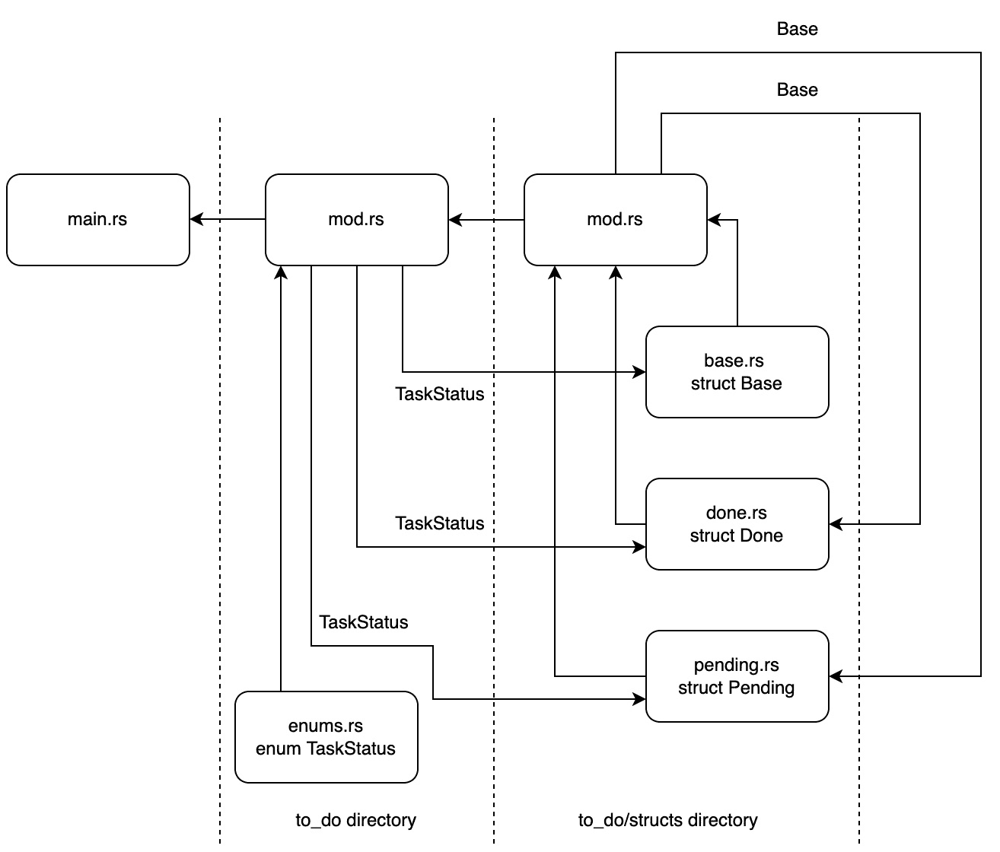

# 第二章：在 Rust 中设计你的 Web 应用

我们之前已经探讨了 Rust 的语法，使我们能够处理内存管理的怪癖并构建数据结构。然而，正如任何经验丰富的工程师会告诉你的，在多个文件和目录间结构化代码是构建软件的一个重要方面。

在本章中，我们将构建一个基本的命令行待办事项程序。我们使用 Rust 的**Cargo**来管理构建我们的命令行程序所需的依赖项。我们的程序将以可扩展的方式构建和管理我们的模块，这些模块将被导入到程序的其它区域并使用。我们将通过构建一个跨越多个文件、创建、编辑和删除待办事项应用的待办事项应用来学习这些概念。此应用将本地保存我们的多个待办事项应用文件，并且我们可以通过命令行界面与我们的应用进行交互。

在本章中，我们将涵盖以下主题：

+   使用 Cargo 管理软件项目

+   结构化代码

+   与环境交互

到本章结束时，你将能够构建可以在 Rust 中打包和使用的应用。你还将能够在你的代码中使用第三方包。结果，如果你理解你试图解决的问题并且能够将其分解为逻辑块，你将能够构建任何不需要服务器或图形用户界面的命令行应用。

# 技术要求

随着我们开始使用 Rust 构建 Web 应用，我们将不得不开始依赖第三方包来为我们做一些繁重的工作。Rust 通过一个名为 Cargo 的包管理器来管理依赖项。要使用 Cargo，我们必须从以下 URL 安装 Rust 到我们的计算机上：[`www.rust-lang.org/tools/install`](https://www.rust-lang.org/tools/install)。

此安装提供了编程语言 Rust 和依赖项管理器 Cargo。你可以在 GitHub 上找到所有代码文件：

[`github.com/PacktPublishing/Rust-Web-Programming-2nd-Edition/tree/main/chapter02`](https://github.com/PacktPublishing/Rust-Web-Programming-2nd-Edition/tree/main/chapter02)

# 使用 Cargo 管理软件项目

在我们开始使用 Cargo 来结构化我们的程序之前，我们应该构建一个基本的单文件应用。为此，我们最初必须在本地目录中创建一个名为`hello_world.rs`的文件。`.rs`扩展名表示该文件是一个 Rust 文件。说实话，扩展名并不重要。如果在该文件中编写了有效的 Rust 代码，编译器将无任何问题地编译并运行它。然而，使用不同的扩展名可能会让其他开发者和代码编辑器感到困惑，并在从其他 Rust 文件导入代码时引起问题。因此，在命名你的 Rust 文件时最好使用`.rs`。在我们的`hello_world.rs`文件中，我们可以有以下的代码：

```rs
fn main() {
    println!("hello world");
}
```

这与我们在上一章中的第一个代码块没有区别。现在我们已经在我们的`hello_world.rs`文件中定义了入口点，我们可以使用以下命令来编译文件：

```rs
rustc hello_world.rs
```

一旦编译完成，同一目录下将会有一个二进制文件，可以运行。如果我们是在 Windows 上编译，我们可以使用以下命令来运行这个二进制文件：

```rs
.\hello_world.exe
```

如果我们在 Linux 或 macOS 上编译它，我们可以使用以下命令来运行它：

```rs
./hello_world
```

由于我们只构建了一个简单的`hello world`示例，所以`hello world`将直接打印出来。虽然当在一个文件中构建简单应用程序时这很有用，但不建议用于管理跨多个文件的程序。即使在依赖第三方模块时，也不推荐这样做。这就是 Cargo 发挥作用的地方。Cargo 通过一些简单的命令，开箱即用地管理一切，包括运行、测试、文档、构建/编译以及第三方模块依赖项。我们将在本章中介绍这些命令。从我们运行`hello world`示例时看到的情况来看，我们必须在运行代码之前编译它，所以现在让我们继续到下一节，在那里我们将使用 Cargo 构建一个基本的应用程序。

## 使用 Cargo 进行构建

使用 Cargo 进行构建很简单。我们只需导航到我们想要构建项目的目录，并运行以下命令：

```rs
cargo new web_app
```

上述命令构建了一个基本的 Cargo Rust 项目。如果我们探索这个应用程序，我们会看到以下结构：

```rs
└── web_app
    ├── Cargo.toml
    └── src
         └── main.rs
```

我们可以看到只有一个 Rust 文件，这就是位于`src`目录中的`main.rs`文件。如果你打开`main.rs`文件，你会看到这与我们在上一节中制作的文件相同。这是一个入口点，默认代码将`hello world`打印到控制台。我们项目的依赖项和元数据定义在`Cargo.toml`文件中。如果我们想要运行我们的程序，我们不需要导航到`main.rs`文件并运行`rustc`。相反，我们可以使用 Cargo 并使用以下命令来运行它：

```rs
 cargo run
```

当你这样做时，你会看到项目按照以下打印输出进行编译和运行：

```rs
  Compiling web_app v0.1.0 (/Users/maxwellflitton/Documents/
   github/books/Rust-Web_Programming-two/chapter02/web_app)
    Finished dev [unoptimized + debuginfo] target(s) in 0.15s
     Running `target/debug/web_app`
hello world
```

您的打印输出将略有不同，因为基本目录将不同。在底部，您将看到`hello world`，这是我们预期的。我们还可以看到打印输出表明编译未优化，并且它在`target/debug/web_app`中运行。我们可以直接导航到`target/debug/web_app`二进制文件并像上一节那样运行它，因为这是二进制文件存储的位置。`target`目录是编译、运行和记录我们程序文件的存放位置。如果我们把代码附加到 GitHub 仓库，我们必须确保通过在`.gitignore`文件中将其放置来让 GitHub 忽略`target`目录。目前，我们正在运行未优化的版本。这意味着它运行较慢但编译更快。这在开发时是有意义的，因为我们将多次编译。然而，如果我们想运行优化版本，我们可以使用以下命令：

```rs
cargo run --release
```

前面的命令给出了以下打印输出：

```rs
    Finished release [optimized] target(s) in 2.63s
     Running `target/release/web_app`
hello world
```

在前面的输出中，我们可以看到我们的优化二进制文件位于`target/release/web_app`路径。现在我们已经完成了基本构建，我们可以开始使用 Cargo 来利用第三方 crate。

## 使用 Cargo 打包 crate

第三方库被称为 crate。添加它们并使用 Cargo 管理它们是直接的。在本节中，我们将通过利用位于[`rust-random.github.io/rand/rand/index.html`](https://rust-random.github.io/rand/rand/index.html)的`rand` crate 来探索这个过程。必须注意的是，这个 crate 的文档清晰且结构良好，包含对结构体、特性和模块的链接。这并不是对 rand crate 本身的反映。这是 Rust 的标准文档，我们将在下一节中介绍。为了在我们的项目中使用这个 crate，我们打开`Cargo.toml`文件，并在`[dependencies]`部分下添加`rand` crate，如下所示：

```rs
[dependencies]
rand = "0.7.3"
```

现在我们已经定义了我们的依赖项，我们可以使用`rand` crate 来构建一个随机数生成器：

```rs
use rand::prelude::*;
fn generate_float(generator: &mut ThreadRng) -> f64 {
    let placeholder: f64 = generator.gen();
    return placeholder * 10.0
}
fn main() {
    let mut rng: ThreadRng = rand::thread_rng();
    let random_number = generate_float(&mut rng);
    println!("{}", random_number);
}
```

在前面的代码中，我们定义了一个名为`generate_float`的函数，它使用 crate 生成并返回一个介于`0`和`10`之间的浮点数。一旦我们完成这个操作，我们就打印这个数字。`rand` crate 的实现由 rand 文档处理。我们的`use`语句导入了`rand` crate。当使用`rand` crate 生成浮点数时，文档告诉我们从`rand::prelude`模块导入（`*`），这简化了常见项的导入，如 crate 文档所示，请参阅[`rust-random.github.io/rand/rand/prelude/index.html`](https://rust-random.github.io/rand/rand/prelude/index.html)。

`ThreadRng`结构体是一个随机数生成器，它生成一个介于`0`和`1`之间的`f64`值，这在 rand crate 文档中有详细说明，请参阅[`rust-random.github.io/rand/rand/rngs/struct.ThreadRng.html`](https://rust-random.github.io/rand/rand/rngs/struct.ThreadRng.html)。

现在，我们看到了文档的强大功能。通过在 rand 文档的介绍页上点击几下，我们可以深入了解演示中使用的结构和函数的声明。现在我们的代码已经构建完成，我们可以使用 `cargo run` 命令运行我们的程序。当 Cargo 编译时，它会从 `rand` crate 中提取代码并将其编译成二进制文件。我们还可以注意到现在有一个 `cargo.lock` 文件。正如我们所知，`cargo.toml` 是用来描述我们自己的依赖项的，而 `cargo.lock` 是由 Cargo 生成的，我们不应该自己编辑它，因为它包含有关我们依赖项的精确信息。这种无缝的功能结合易于使用的文档展示了 Rust 如何通过开发生态系统以及语言的质量通过边际收益来改善开发过程。然而，所有这些来自文档的收益并不完全依赖于第三方库；我们还可以自动生成自己的文档。

## 使用 Cargo 进行文档化

选择像 Rust 这样的新语言进行开发，速度和安全性并非唯一的益处。多年来，软件工程社区一直在学习和成长。像良好的文档这样的简单事情可以成就或毁掉一个项目。为了证明这一点，我们可以在 Rust 文件中使用以下代码定义 Markdown 语言：

```rs
/// This function generates a float number using a number
/// generator passed into the function.
///
/// # Arguments
/// * generator (&mut ThreadRng): the random number
/// generator to generate the random number
///
/// # Returns
/// (f64): random number between 0 -> 10
fn generate_float(generator: &mut ThreadRng) -> f64 {
    let placeholder: f64 = generator.gen();
    return placeholder * 10.0
}
```

在前面的代码中，我们使用 `///` 标记表示 Markdown。这做了两件事：它告诉查看代码的其他开发者函数的作用，并在我们的自动生成中渲染 Markdown。在我们运行文档命令之前，我们可以定义和记录一个基本的用户结构和一个基本的用户特质，以展示这些是如何被记录的：

```rs
/// This trait defines the struct to be a user.
trait IsUser {
    /// This function proclaims that the struct is a user.
    ///
    /// # Arguments
    /// None
    ///
    /// # Returns
    /// (bool) true if user, false if not
    fn is_user() -> bool {
        return true
    }
}
/// This struct defines a user
///
/// # Attributes
/// * name (String): the name of the user
/// * age (i8): the age of the user
struct User {
    name: String,
    age: i8
}
```

现在我们已经记录了一系列不同的结构，我们可以使用以下命令运行自动文档化过程：

```rs
cargo doc --open
```

我们可以看到，文档的渲染方式与 rand crate 相同：


图 2.1 – 网络应用的文档视图

在前面的屏幕截图中，我们可以看到 **web_app** 是一个 crate。我们还可以看到 rand crate 的文档涉及其中（如果我们查看屏幕截图的左下角，我们可以看到位于我们的 **web_app** crate 文档之上的 **rand** crate 文档）。如果我们点击 **User** 结构，我们可以看到结构的声明、我们为属性编写的 Markdown 以及特质的影响，如下面的图所示：


图 2.2 – 结构的文档

必须注意，在本书的未来章节中，我们将不在代码片段中包含 Markdown 以保持可读性。然而，书中 GitHub 仓库提供了 Markdown 格式的代码。现在我们有一个文档齐全、运行良好的 Cargo 项目，我们需要能够向其中传递参数，以便根据上下文运行不同的配置。

## 与 Cargo 交互

现在我们程序正在运行并使用第三方模块，我们可以开始通过命令行输入与我们的 Rust 程序交互。为了使我们的程序能够根据上下文具有一些灵活性，我们需要能够向我们的程序传递参数并跟踪程序运行的参数。我们可以使用`std`（标准库）标识符来完成这项任务：

```rs
use std::env;
fn main() {
    let args: Vec<String> = env::args().collect();
    println!("{:?}", args);
}
```

在前面的代码中，我们可以看到我们将传递给程序的参数收集到一个向量中，然后在调试模式下打印出这些参数。让我们运行以下命令：

```rs
cargo run one two three
```

运行前面的命令会得到以下输出：

```rs
["target/debug/interacting_with_cargo", "one", "two", "three"]
```

在这里，我们可以看到我们的`args`向量包含了我们传递的参数。这并不奇怪，因为许多其他语言也接受通过命令行传递给程序的参数。我们还必须注意，二进制文件的路径也包括在内。在这里，我还必须强调，我正在使用一个名为`interacting_with_cargo`的不同项目，因此路径是`target/debug/interacting_with_cargo`。我们还可以从命令行参数中看到我们正在调试模式下运行。让我们尝试使用以下命令运行我们程序的发布版本：

```rs
cargo run --release one two three
```

我们会收到以下输出：

```rs
["target/release/interacting_with_cargo", "one", "two", "three"]
```

从前面的输出中，我们可以看到`--release`不在我们的向量中。然而，这确实给我们提供了一些额外的功能来玩耍。例如，我们可能希望根据编译类型运行不同的进程。这可以通过以下代码轻松实现：

```rs
let args: Vec<String> = env::args().collect();
let path: &str = &args[0];
if path.contains("/debug/") {
    println!("Debug is running");
}
else if path.contains("/release/") {
    println!("release is running");
}
else {
    panic!("The setting is neither debug or release");
}
```

然而，前面的简单解决方案是临时的。我们提取的`path`只有在运行 Cargo 命令时才是一致的。虽然 Cargo 命令在构建、编译和文档化方面很出色，但在生产环境中携带所有这些文件是没有意义的。实际上，提取静态二进制文件，将其完全封装在 Docker 容器中，并直接运行二进制文件是有优势的，这样可以减少 Docker 镜像的大小，从 1.5 GB 减少到 200 MB。因此，虽然这看起来像是一个快速胜利，但它可能导致在部署我们的应用程序时破坏代码。因此，在最后放入`panic`宏是至关重要的，以防止这种情况进入生产环境而你却不知道。

到目前为止，我们已经传递了一些基本的命令；然而，这并不有用或可扩展。还会有很多样板代码为我们编写，以实现为用户提供帮助指南。为了扩展我们的命令行界面，我们可以依赖 `clap` crate 来处理传递给程序的参数，以下是一个依赖项：

```rs
[dependencies]
clap = "3.0.14"
```

为了完善我们对命令行界面的理解，我们可以开发一个玩具应用程序，它只接受一些命令并将它们打印出来。为了做到这一点，我们必须在 `main.rs` 文件中导入 `clap` crate 所需的内容，以下代码所示：

```rs
use clap::{Arg, App};
```

现在，我们可以继续定义我们的应用程序：

1.  我们的应用程序在 `main` 函数中包含有关应用程序的元数据，以下代码所示：

    ```rs
    fn main() {
    ```

    ```rs
        let app = App::new("booking")
    ```

    ```rs
            .version("1.0")
    ```

    ```rs
            .about("Books in a user")
    ```

    ```rs
            .author("Maxwell Flitton");
    ```

    ```rs
    . . .
    ```

如果我们查看 `clap` 的文档，我们可以直接将参数绑定到 `App` 结构体；然而，这可能会变得很丑陋并且紧密耦合。相反，我们将在下一步中单独定义它们。

1.  在我们的玩具应用程序中，我们正在接受一个名字、姓氏和年龄，可以定义如下：

    ```rs
        let first_name = Arg::new("first name")
    ```

    ```rs
            .long("f")
    ```

    ```rs
            .takes_value(true)
    ```

    ```rs
            .help("first name of user")
    ```

    ```rs
            .required(true);
    ```

    ```rs
        let last_name = Arg::new("last name")
    ```

    ```rs
            .long("l")
    ```

    ```rs
            .takes_value(true)
    ```

    ```rs
            .help("first name of user")
    ```

    ```rs
            .required(true);
    ```

    ```rs
        let age = Arg::new("age")
    ```

    ```rs
            .long("a")
    ```

    ```rs
            .takes_value(true)
    ```

    ```rs
            .help("age of the user")
    ```

    ```rs
            .required(true);
    ```

我们可以看到我们可以继续堆叠参数。目前，它们还没有绑定到任何东西。现在，我们可以在下一步中将它们绑定到我们的应用程序并传递参数。

1.  绑定、获取和解析输入可以通过以下代码实现：

    ```rs
        let app = app.arg(first_name).arg(last_name).arg(age);
    ```

    ```rs
        let matches = app.get_matches();
    ```

    ```rs
        let name = matches.value_of("first name")
    ```

    ```rs
            .expect("First name is required");
    ```

    ```rs
        let surname = matches.value_of("last name")
    ```

    ```rs
            .expect("Surname is required");
    ```

    ```rs
        let age: i8 = matches.value_of("age")
    ```

    ```rs
            .expect("Age is required").parse().unwrap();
    ```

    ```rs
        println!("{:?}", name);
    ```

    ```rs
        println!("{:?}", surname);
    ```

    ```rs
        println!("{:?}", age);
    ```

    ```rs
    }
    ```

现在我们有一个如何传递命令行参数的工作示例，我们可以通过运行以下命令与我们的应用程序交互，以查看它如何显示：

```rs
cargo run -- --help  
```

在 `--help` 前面的中间 `--` 告诉 Cargo 将 `--` 后面的所有参数传递给 `clap` 而不是 `cargo`。前面的命令将给出以下输出：

```rs
booking 1.0
Maxwell Flitton
Books in a user
USAGE:
    interacting_with_cargo --f <first name> --l <last name> 
                           --a <age>
OPTIONS:
        --a <age>           age of the user
        --f <first name>    first name of user
    -h, --help              Print help information
        --l <last name>     first name of user
    -V, --version           Print version information
```

在前面的输出中，我们可以看到如何直接与我们的编译后的二进制文件交互。我们还有一个很棒的帮助菜单。要与 Cargo 交互，我们需要运行以下命令：

```rs
cargo run -- --f first --l second --a 32
```

前面的命令将给出以下输出：

```rs
"first"
"second"
32
```

我们可以看到解析是正常工作的，因为我们有两个字符串和一个整数。crates 如 `clap` 有用的原因是它们本质上具有自文档性。开发者可以查看代码并了解正在接受哪些参数以及它们周围的元数据。用户可以通过仅传递 `help` 参数来获取输入的帮助。这种方法减少了文档过时的风险，因为它嵌入在执行它的代码中。如果你接受命令行参数，建议你使用像 `clap` 这样的 crate 来实现这个目的。现在我们已经探讨了如何结构化我们的命令行界面以便它可以扩展，我们可以在下一节中调查如何将代码结构化到多个文件中以扩展它。

# 代码结构

现在，我们可以开始构建我们的 Web 应用程序之旅了。在本章的其余部分，我们不会接触任何 Web 框架或构建 HTTP 监听器。这将在下一章发生。然而，我们将构建一个与 JSON 文件交互的待办事项模块。它将被构建成这样的结构，可以以最小的努力插入到我们构建的任何 Web 应用程序中。这个待办事项模块将使我们能够创建、更新和删除待办事项。然后我们将通过命令行与它交互。这里的流程是探索如何构建结构良好、可扩展和灵活的代码。为了理解这一点，我们将把这个模块的构建分解为以下部分：

1.  构建待办和已完成的待办事项结构体。

1.  构建一个工厂，使结构体能够在模块中以最小的清洁输入构建。

1.  构建特性，使结构体能够删除、创建、编辑和获取待办事项。

1.  构建一个读写文件的模块来存储待办事项（我们将在后面的章节中将这个替换为合适的数据库）。

1.  构建一个`config`模块，该模块可以根据`config`文件中的变量来改变应用程序的行为。

在我们开始处理这些步骤之前，我们需要让应用程序运行起来。我们可以通过导航到我们想要存放此应用程序的目录，并启动一个新的名为`todo_app`的 Cargo 项目来实现这一点。一旦完成，我们将把处理待办事项管理的逻辑放入我们的`to_do`模块中。这可以通过创建一个`to_do`目录并在该目录的底部放置一个`mod.rs`文件来实现，如下面的布局所示：

```rs
├── main.rs
└── to_do
    ├── mod.rs
```

使用这个结构，我们可以从结构体开始构建我们的`to_do`模块。现在不必担心`to_do`文件，因为这在第一步中已经涵盖了，即构建我们已完成和待完成的待办事项的结构体。

## 构建待办事项结构体

目前，我们只有两个用于待办事项的结构体：一个是等待完成的，另一个是已经完成的。然而，我们可能想要引入其他类别。例如，我们可以添加一个待办事项类别，或者为那些已经开始但出于某种原因受阻的任务添加一个*暂停*任务。为了避免错误和重复的代码，我们可以构建一个`Base`结构体，并让其他结构体使用它。`Base`结构体包含公共字段和函数。对`Base`结构体的任何修改都将传播到所有其他待办事项结构体。我们还需要定义待办事项的类型。我们可以为待办和已完成硬编码字符串；然而，这不可扩展，并且容易出错。为了避免这种情况，我们将使用枚举来分类和定义待办事项类型的表示。为了实现这一点，我们需要为我们的模块创建以下文件结构：

```rs
├── main.rs
└── to_do
    ├── enums.rs
    ├── mod.rs
    └── structs
        ├── base.rs
        ├── done.rs
        ├── mod.rs
        └── pending.rs
```

在前面的代码中，我们可以注意到我们有两个 `mod.rs` 文件。这些文件基本上是我们声明文件的地方，以及我们在其中定义的内容，以便它们可以被同一目录中的其他文件访问。我们还可以在 `mod.rs` 文件中公开声明它们，以允许文件在目录外部被访问。在我们编写任何代码之前，我们可以在 *图 2**.3* 中看到我们的模块中的数据流：



图 2.3 – 我们待办模块中的数据流

我们可以看到我们的 `Base` 结构体被我们的其他待办结构体所使用。如果我们没有声明它，其他待办结构体将无法访问 `Base` 结构体。然而，`to_do/structs` 目录外部的任何文件都没有引用 `Base` 结构体，因此它不需要是公开声明。

现在我们已经理解了模块的数据流，我们需要回顾 *图 2**.3* 并确定我们首先需要做什么。我们可以看到我们的枚举没有依赖关系。事实上，我们的枚举提供了所有结构体。因此，我们将从 `/to_do/enums.rs` 文件中的枚举开始。我们的枚举定义了任务的状况，如下所示：

```rs
pub enum TaskStatus {
    DONE,
    PENDING
}
```

当定义任务的状况时，这将在代码中工作。然而，如果我们想要写入文件或数据库，我们将不得不构建一个方法来使我们的枚举能够以字符串格式表示。为此，我们可以为 `TaskStatus` 枚举实现一个 `stringify` 函数，如下所示：

```rs
impl TaskStatus {
    pub fn stringify(&self) -> String {
        match &self {
            &Self::DONE => {"DONE".to_string()},
            &Self::PENDING => {"PENDING".to_string()}
        }
    }
}
```

调用此函数将使我们能够在控制台打印待办任务的状况并将其写入我们的 JSON 文件。

注意

虽然 `stringify` 函数可以工作，但还有另一种将枚举值转换为字符串的方法。为了实现字符串转换，我们可以为 `TaskStatus` 实现一个 `Display` 特性。首先，我们必须使用以下代码导入格式模块：

```rs
use std::fmt;
```

然后，我们可以使用以下代码为 `TaskStatus` 结构体实现 `Display` 特性：

```rs
impl fmt::Display for TaskStatus {
    fn fmt(&self, f: &mut fmt::Formatter) -> fmt::Result {
        match &self {
            &Self::DONE => {write!(f, "DONE")},
            &Self::PENDING => {write!(f, "PENDING")}
        }
    }
}
```

这个特性和实现具有与我们的 `stringify` 函数相同的逻辑。然而，我们的特性和需要时才会被使用。因此，我们有以下代码：

```rs
println!("{}", TaskStatus::DONE);
println!("{}", TaskStatus::PENDING);
let outcome = TaskStatus::DONE.to_string();
println!("{}", outcome);
```

这将导致以下输出：

```rs
DONE
PENDING
DONE
```

在这里，我们可以看到当我们把 `TaskStatus` 传递给 `println!` 时，`Display` 特性会自动被利用。

现在，我们可以在 `/to_do/mod.rs` 文件中使用以下代码使我们的枚举公开可用：

```rs
pub mod enums;
```

现在，我们可以参考 *图 2**.3* 来查看我们接下来可以构建什么，那就是 `Base` 结构体。我们可以在 `/to_do/structs/base.rs` 文件中使用以下代码定义 `Base` 结构体：

```rs
use super::super::enums::TaskStatus;
pub struct Base {
    pub title: String,
    pub status: TaskStatus
}
```

从文件顶部的导入中，我们可以使用`super::super`访问`TaskStatus`枚举。我们知道`TaskStatus`枚举位于更高的目录中。由此，我们可以推断出`super`为我们提供了访问当前目录`mod.rs`文件中声明的内容的权限。因此，在`/to_do/structs/`目录中的文件中使用`super::super`可以让我们访问到`/to_do/mod.rs`文件中定义的内容。

现在，我们可以在`/to_do/structs/mod.rs`文件中声明我们的`Base`结构体，以下代码如下：

```rs
mod base;
```

我们不需要将其声明为公共的，因为我们的`Base`结构体不会在`/to_do/structs/`目录外被访问。现在，回顾一下*图 2**.3*，我们可以构建我们的`Pending`和`Done`结构体。这就是我们在`/to_do/structs/pending.rs`文件中使用组合来利用我们的`Base`结构体的时刻，以下代码如下：

```rs
use super::base::Base;
use super::super::enums::TaskStatus;
pub struct Pending {
    pub super_struct: Base
}
impl Pending {
    pub fn new(input_title: &str) -> Self {
        let base = Base{
            title: input_title.to_string(),
            status: TaskStatus::PENDING
        };
        return Pending{super_struct: base}
    }
}
```

通过前面的代码，我们可以看到我们的`super_struct`字段包含了我们的`Base`结构体。我们利用我们的枚举并定义状态为挂起。这意味着我们只需将标题传递给构造函数，我们就有了一个具有标题和挂起状态的结构体。考虑到这一点，在我们的`/to_do/structs/done.rs`文件中编写我们的`Done`结构体应该是直截了当的，以下代码如下：

```rs
use super::base::Base;
use super::super::enums::TaskStatus;
pub struct Done {
    pub super_struct: Base
}
impl Done {
    pub fn new(input_title: &str) -> Self {
        let base = Base {
            title: input_title.to_string(),
            status: TaskStatus::DONE
        };
        return Done{super_struct: base}
    }
}
```

我们可以看到，除了`TaskStatus`枚举有一个`DONE`状态之外，与`Pending`结构体定义没有太大区别。现在，我们可以通过以下代码在`/to_do/structs/mod.rs`文件中使我们的结构体在目录外可用：

```rs
mod base;
pub mod done;
pub mod pending;
```

我们可以通过在`/to_do/mod.rs`文件中声明以下代码，使我们的结构体在`main.rs`文件中可访问：

```rs
pub mod structs;
pub mod enums;
```

我们现在已经创建了一个基本的模块并将其暴露给`main.rs`文件。目前，我们可以编写一些基本的代码，使用我们的模块创建一个挂起的任务和另一个完成的任务。这可以通过以下代码完成：

```rs
mod to_do;
use to_do::structs::done::Done;
use to_do::structs::pending::Pending;
fn main() {
    let done = Done::new("shopping");
    println!("{}", done.super_struct.title);
    println!("{}", done.super_struct.status.stringify());
    let pending = Pending::new("laundry");
    println!("{}", pending.super_struct.title);
    println!("{}", pending.super_struct.status.stringify()
    );
}
```

在前面的代码中，我们可以看到我们已声明了我们的`to_do`模块。然后我们导入了我们的结构体并创建了一个`pending`和`done`结构体。运行我们的代码将给出以下输出：

```rs
shopping
DONE
laundry
PENDING
```

这阻止了`main.rs`文件因过多的代码而变得臃肿。如果我们堆叠更多可以创建的项目类型，例如挂起或待办事项，`main.rs`中的代码将会膨胀。这就是工厂模式发挥作用的地方，我们将在下一步进行探讨。

## 使用工厂管理结构体

工厂模式是指我们在模块的入口点抽象结构体的构建。我们可以通过以下方式了解我们的模块是如何工作的：


图 2.4 – to-do 工厂流程

工厂的作用是通过提供一个接口来抽象模块。虽然我们享受构建我们的模块，但如果其他开发者想要使用它，一个简单的工厂接口和良好的文档将为他们节省很多时间。他们只需要传递几个参数，然后从工厂中获取构建的结构体，这些结构体被封装在枚举中。如果我们更改模块的内部结构或它变得更加复杂，这不会产生影响。如果其他模块使用接口，如果我们保持接口的一致性，那么更改不会破坏其他代码。我们可以在 `/to_do/mod.rs` 文件中通过定义以下代码来构建我们的工厂：

```rs
pub mod structs;
pub mod enums;
use enums::TaskStatus;
use structs::done::Done;
use structs::pending::Pending;
pub enum ItemTypes {
    Pending(Pending),
    Done(Done)
}
pub fn to_do_factory(title: &str, 
                     status: TaskStatus) -> ItemTypes {
    match status {
        TaskStatus::DONE => {
            ItemTypes::Done(Done::new(title))
        },
        TaskStatus::PENDING => {
            ItemTypes::Pending(Pending::new(title))
        }
    }
}
```

在前面的代码中，我们可以看到我们定义了一个名为 `ItemTypes` 的枚举，它封装了构造的任务结构体。我们的 `factory` 函数本质上接受我们输入的标题和状态。然后工厂匹配输入的状态。一旦我们确定了传入的状态类型，我们就构建一个与状态匹配的任务，并用 `ItemTypes` 枚举将其封装。这可能会变得越来越大和复杂，而我们的主文件将不会察觉到这一点。然后我们可以在 `main.rs` 文件中使用以下代码实现这个工厂：

```rs
mod to_do;
use to_do::to_do_factory;
use to_do::enums::TaskStatus;
use to_do::ItemTypes;
fn main() {
    let to_do_item = to_do_factory("washing", 
                                   TaskStatus::DONE);
    match to_do_item {
        ItemTypes::Done(item) => {
            println!("{}", item.super_struct.status
                     .stringify());
            println!("{}", item.super_struct.title);
        },
        ItemTypes::Pending(item) => {
            println!("{}", item.super_struct.status
                     .stringify());
            println!("{}", item.super_struct.title);
        }
    }
}
```

在前面的代码中，我们可以看到我们将我们想要为待办事项创建的参数传递给工厂，然后匹配结果以打印出项的属性。现在 `main.rs` 文件中引入了更多的代码。然而，引入更多的代码是因为我们正在解包返回的枚举以打印出属性以供演示。我们通常将这个封装的枚举传递到其他模块中处理。创建结构体只需要一行代码，如下所示：

```rs
let to_do_item = to_do_factory("washing", TaskStatus::DONE);
```

这意味着我们可以创建一个待办事项并将其轻松传递，因为它被封装在枚举中。其他函数和模块只需接受枚举。我们可以看到这提供了灵活性。然而，根据我们当前的代码，我们可以去掉 `Base`、`Done` 和 `Pending` 结构体，只保留一个接受状态和标题的结构体。这将意味着更少的代码。然而，这将也会降低灵活性。我们将在下一步中看到这一点，我们将向我们的结构体添加特性以锁定功能并确保安全性。

## 使用特性定义功能

目前，我们的结构体除了持有任务的状态和标题外，实际上并没有做什么。然而，我们的结构体可以有不同功能。因此，我们额外麻烦地定义了单独的结构体。例如，我们在这里构建一个待办事项应用程序。最终如何构建你的应用程序取决于你，但确保你不能创建一个已完成任务是有道理的；否则，你为什么要将它添加到你的待办事项列表中？这个例子可能看起来很微不足道。这本书使用待办事项列表来简化我们正在解决的问题。因此，我们可以专注于开发 Rust 网络应用程序的技术方面，而不必花费时间理解我们正在解决的问题。然而，我们必须承认，在更复杂的应用程序中，例如处理银行交易的系统，我们需要对逻辑的实现方式非常严格，并锁定任何不希望发生的过程的可能性。我们可以在我们的待办事项应用程序中通过为每个过程构建单独的特性并将它们分配给我们要的任务结构体来实现这一点。为此，我们需要在`to_do`模块中创建一个`traits`目录并为每个特性创建一个文件，其结构如下：

```rs
├── mod.rs
└── traits
    ├── create.rs
    ├── delete.rs
    ├── edit.rs
    ├── get.rs
    └── mod.rs
```

然后，我们可以在`to_do/traits/mod.rs`文件中公开定义所有特性，代码如下：

```rs
pub mod create;
pub mod delete;
pub mod edit;
pub mod get;
```

我们还必须在我们的`to_do/mod.rs`文件中公开定义我们的特性，代码如下：

```rs
pub mod traits;
```

现在我们已经将所有特性文件连接到我们的模块中，我们可以开始构建我们的特性。我们可以从在`to_do/traits/get.rs`文件中定义我们的`Get`特性开始，代码如下：

```rs
pub trait Get {
    fn get(&self, title: &str) {
        println!("{} is being fetched", title);
    }
}
```

这只是一个展示我们如何应用特性的示例；因此，我们现在只打印出正在发生的事情。我们必须记住，我们不能从传入的`&self`参数中引用字段，因为我们可以将我们的特性应用到多个结构体上；然而，我们可以覆盖实现此特性的特性的`get`函数。当涉及到`Edit`特性时，我们可以在`to_do/traits/edit.rs`文件中有两个函数来改变状态，代码如下：

```rs
pub trait Edit {
    fn set_to_done(&self, title: &str) {
        println!("{} is being set to done", title);
    }
    fn set_to_pending(&self, title: &str) {
        println!("{} is being set to pending", title);
    }
}
```

这里我们可以看到一个模式。因此，为了完整性，我们的`Create`特性在`to_do/traits/create.rs`文件中的形式如下：

```rs
pub trait Create {
    fn create(&self, title: &str) {
        println!("{} is being created", title);
    }
}
```

我们的`Delete`特性在`to_do/traits/delete.rs`文件中定义，代码如下：

```rs
pub trait Delete {
    fn delete(&self, title: &str) {
        println!("{} is being deleted", title);
    }
}
```

我们现在已经定义了我们需要的所有特性。因此，我们可以利用它们在待办事项项结构体中定义和锁定行为。对于我们的`Done`结构体，我们可以将特性导入到`to_do/structs/done.rs`文件中，代码如下：

```rs
use super::super::traits::get::Get;
use super::super::traits::delete::Delete;
use super::super::traits::edit::Edit;
```

然后，我们可以在定义了`Done`结构体的同一文件中实现我们的`Done`结构体，代码如下：

```rs
impl Get for Done {}
impl Delete for Done {}
impl Edit for Done {}
```

现在，我们的 `Done` 结构体可以获取、编辑和删除待办事项。在这里，我们可以真正看到特性（traits）的力量，正如在*第一章*《Rust 快速入门》中所强调的。我们可以轻松地堆叠或移除特性。例如，允许创建完成的待办事项可以通过简单的 `impl Create for Done;` 实现。现在我们已经为我们的 `Done` 结构体定义了所需的特性，我们可以继续到我们的 `Pending` 结构体，在 `to_do/structs/pending.rs` 文件中导入所需的代码：

```rs
use super::super::traits::get::Get;
use super::super::traits::edit::Edit;
use super::super::traits::create::Create;
```

然后，我们可以在定义我们的 `Pending` 结构体之后，使用以下代码实现这些特性：

```rs
impl Get for Pending {}
impl Edit for Pending {}
impl Create for Pending {}
```

在前面的代码中，我们可以看到我们的 `Pending` 结构体可以获取、编辑和创建，但不能删除。实现这些特性也将我们的 `Pending` 和 `Done` 结构体紧密地联系在一起，而无需编译它们。例如，如果我们接受实现了 `Edit` 特性的结构体，它将接受 `Pending` 和 `Done` 结构体。然而，如果我们创建一个接受实现了 `Delete` 特性的结构体的函数，它将接受 `Done` 结构体但拒绝 `Pending` 结构体。这为我们提供了一个充满活力的类型检查与灵活性的交响乐，这确实是 Rust 设计的证明。现在，我们的结构体已经拥有了所有我们想要的特性，我们可以完全重写我们的 `main.rs` 文件，利用它们。首先，我们使用以下代码导入所需的代码：

```rs
mod to_do;
use to_do::to_do_factory;
use to_do::enums::TaskStatus;
use to_do::ItemTypes;
use crate::to_do::traits::get::Get;
use crate::to_do::traits::delete::Delete;
use crate::to_do::traits::edit::Edit;
```

这次需要注意的是导入。尽管我们已经在我们想要的结构体上实现了特性，但我们必须将这些特性导入到使用它们的文件中。这可能会有些令人困惑。例如，在结构体初始化后调用 `Get` 特性的 `get` 函数将采取以下形式：`item.get(&item.super_struct.title);`。`get` 函数与初始化的结构体绑定。直观上，不需要导入特性是有道理的。然而，如果你没有导入特性，编译器或 IDE 会给出无用的错误，指出名为 `get` 的函数在结构体中未找到。这很重要，因为我们将在未来使用数据库包和 Web 框架中的特性，我们需要导入这些特性以便包结构体可以使用。有了我们的导入，我们就可以在 `main` 函数中使用以下代码利用我们的特性和工厂：

```rs
fn main() {
    let to_do_items = to_do_factory("washing", 
                                    TaskStatus::DONE);
    match to_do_items {
        ItemTypes::Done(item) => {
            item.get(&item.super_struct.title);
            item.delete(&item.super_struct.title);
        },
        ItemTypes::Pending(item) => {
            item.get(&item.super_struct.title);
            item.set_to_done(&item.super_struct.title);
        }
    }
}
```

运行前面的代码会得到以下输出：

```rs
washing is being fetched
washing is being deleted
```

我们在这里所做的是构建了自己的模块，它包含一个入口点。然后我们将其导入到 `main` 函数中并运行它。现在，基本结构已经构建并工作，但我们需要通过传递变量和写入文件来使模块与环境交互，使其变得有用。

# 与环境的交互

要与环境交互，我们必须管理两件事。首先，我们需要加载、保存和编辑待办事项的状态。其次，我们还必须接受用户输入以编辑和显示数据。我们的程序可以通过为每个过程运行以下步骤来实现这一点：

1.  从用户那里收集参数。

1.  定义一个命令（`get`、`edit`、`delete` 和 `create`）并从传递到应用程序的命令中定义待办事项的标题。

1.  加载一个存储程序之前运行中待办事项的 JSON 文件。

1.  根据传递给程序的命令运行 `get`、`edit`、`delete` 或 `create` 函数，并在最后将状态的结果保存到 JSON 文件中。

我们可以通过最初使用 `serde` 包加载我们的状态来使这个四步过程成为可能。

## 读取和写入 JSON 文件

我们现在处于将数据以 JSON 文件的形式持久化的阶段。我们将在 *第六章* *使用 PostgreSQL 进行数据持久化* 中将其升级为数据库。但就目前而言，我们将介绍我们的第一个依赖项，即我们的 Web 应用程序中的 `serde_json`。这个 `serde_json` 包处理 Rust 数据到 JSON 数据以及相反的转换。我们将在下一章中使用 `serde_json` 处理 HTTP 请求。我们可以在 `Cargo.toml` 文件中使用以下代码安装我们的包：

```rs
[dependencies]
serde_json="1.0.59"
```

由于我们将在未来升级我们的存储选项，因此将读取和写入我们的 JSON 文件的操作与应用程序的其余部分分开是有意义的。我们不希望在将数据库升级拉出来时进行大量的调试和重构。我们将保持简单，因为在读取和写入 JSON 文件时没有模式或迁移需要管理。考虑到这一点，我们只需要 `read` 和 `write` 函数。由于我们的模块小而简单，我们可以将模块放在 `main.rs` 文件旁边的文件中。首先，我们需要使用以下代码在我们的 `src/state.rs` 文件中导入所需的项：

```rs
use std::fs::File;
use std::fs;
use std::io::Read;
use serde_json::Map;
use serde_json::value::Value;
use serde_json::json;
```

如我们所见，我们需要标准库和一系列结构体来读取数据，如 *图 2.5* 中所示：


图 2.5 – 读取 JSON 文件的步骤

我们可以使用以下代码执行 *图 2.5* 中的步骤：

```rs
pub fn read_file(file_name: &str) -> Map<String, Value> {
    let mut file = File::open(file_name.to_string()).unwrap();
    let mut data = String::new();
    file.read_to_string(&mut data).unwrap();
    let json: Value = serde_json::from_str(&data).unwrap();
    let state: Map<String, Value> = json.as_object()
                                    .unwrap().clone();
    return state
}
```

在前面的代码中，我们可以看到我们直接解包了文件的开头。这是因为如果我们无法读取文件，就没有继续程序的必要，因此我们直接解包了文件读取。我们还必须注意，字符串必须是可变的，因为我们将要在这个字符串中填充 JSON 数据。此外，我们使用 `serde_json` 包来处理 JSON 数据并将其配置为映射。现在，我们可以通过这个 `Map` 变量在整个程序中访问我们的待办事项。现在，我们需要写入我们的数据，这可以通过以下代码在同一文件中完成：

```rs
pub fn write_to_file(file_name: &str, 
                     state: &mut Map<String, Value>) {
    let new_data = json!(state);
    fs::write(
          file_name.to_string(),
          new_data.to_string()
    ).expect("Unable to write file");
}
```

在前面的代码中，我们接受`Map`变量和文件的路径。然后我们使用`serde_json`crate 中的`json!`宏将`Map`变量转换为 JSON。然后我们将 JSON 数据转换为字符串，并将其写入我们的 JSON 文件。正因为如此，我们现在有了读取和写入待办事项到 JSON 文件的功能。我们现在可以升级我们的`main.rs`文件，构建一个简单的命令行待办事项应用程序，该程序读取和写入待办事项到 JSON 文件。我们可以通过以下代码与它交互：

```rs
mod state;
use std::env;
use state::{write_to_file, read_file};
use serde_json::value::Value;
use serde_json::{Map, json};
fn main() {
    let args: Vec<String> = env::args().collect();
    let status: &String = &args[1];
    let title: &String = &args[2];
    let mut state: Map<String, Value> =
    read_file("./state.json");
    println!("Before operation: {:?}", state);
    state.insert(title.to_string(), json!(status));
    println!("After operation: {:?}", state);
    write_to_file("./state.json", &mut state);
}
```

在前面的代码中，我们做了以下操作：

1.  从传递给程序的参数中收集状态和标题

1.  从 JSON 文件中读取待办事项

1.  打印出从 JSON 文件中的待办事项

1.  插入了新的待办事项

1.  打印出从内存中的新待办事项集合

1.  将我们的新待办事项列表写入我们的 JSON 文件

我们的根路径将是`Cargo.toml`文件的位置，所以我们定义一个名为`state.json`的空 JSON 文件，位于`Cargo.toml`文件旁边。为了与之交互，我们可以传递以下命令：

```rs
cargo run pending washing
```

前面的命令将产生以下输出：

```rs
Before operation: {}
After operation: {"washing": String("pending")}
```

在前面的输出中，我们可以看到已经插入了`washing`。检查我们的 JSON 文件也会显示`washing`已经被写入文件。你可能已经注意到，我们已经删除了关于我们的`to_do`模块的所有提及，包括我们构建的所有结构和特性。我们没有忘记它们。相反，我们只是在尝试将`to_do`模块与`state`模块融合之前，测试我们的 JSON 文件交互是否正常。我们将在下一节通过修改`to_do`结构体中实现的特性来融合`to_do`和`state`模块。

## 回顾特性

现在我们已经定义了管理我们的待办事项在 JSON 文件中的状态的模块，我们有了关于我们的特性函数如何处理数据和与我们的 JSON 文件交互的想法。首先，我们可以更新我们最简单的特性，即`src/to_do/traits/get.rs`文件中的`Get`特性。在这里，我们只是从 JSON 映射中获取待办事项并打印出来。我们可以通过简单地将 JSON 映射传递到我们的`get`函数中，使用待办事项标题从映射中获取待办事项状态，并将它打印到控制台来实现这一点，以下代码如下：

```rs
use serde_json::Map;
use serde_json::value::Value;
pub trait Get {
    fn get(&self, title: &String, state: &Map<String, Value>) {
        let item: Option<&Value> = state.get(title);
        match item {
            Some(result) => {
                println!("\n\nItem: {}", title);
                println!("Status: {}\n\n", result);
            },
            None => println!("item: {} was not found", 
                              title)
        }
    }
}
```

在前面的代码中，我们可以看到我们对 JSON `Map`执行了一个`get`函数，匹配结果并打印出我们提取的内容。这意味着任何实现了`Get`特性的待办事项现在都可以从我们的状态中提取待办事项并打印出来。

我们现在可以进入下一个更复杂的步骤，即`src/to_do/traits/create.rs`文件中的`Create`特性。这比我们的`Get`特性稍微复杂一些，因为我们通过插入新的待办事项来编辑状态，然后将更新后的状态写入我们的 JSON。我们可以通过以下代码执行这些步骤：

```rs
use serde_json::Map;
use serde_json::value::Value;
use serde_json::json;
use crate::state::write_to_file;
pub trait Create {
    fn create(&self, title: &String, status: &String,
              state: &mut Map<String, Value>) {
            state.insert(title.to_string(), json!(status));
            write_to_file("./state.json", state);
            println!("\n\n{} is being created\n\n", title);
    }
}
```

在前面的代码中，我们可以看到我们使用了来自`state`模块的`write_to_file`函数来将我们的状态保存到 JSON 文件中。我们可以将`create`函数作为模板，了解在删除待办事项时我们需要做什么。删除本质上是我们`create`函数操作的逆操作。如果你想在继续之前尝试编写`delete`函数，可以在`src/to_do/traits/delete.rs`文件中完成。你的函数可能看起来不同；然而，它应该与以下代码运行在相同的方向上：

```rs
use serde_json::Map;
use serde_json::value::Value;
use crate::state::write_to_file;
pub trait Delete {
    fn delete(&self, title: &String,
        state: &mut Map<String, Value>) {
        state.remove(title);
        write_to_file("./state.json", state);
        println!("\n\n{} is being deleted\n\n", title);
    }
}
```

在前面的代码中，我们只是在我们的 JSON `Map`上使用`remove`函数，将更新的状态写入我们的 JSON 文件。我们接近本节的结尾。我们现在需要做的就是构建我们的`Edit`特性和`src/to_do/traits/edit.rs`文件中的`edit`函数。我们有两个函数。一个将待办事项的状态设置为`DONE`。另一个函数将待办事项的状态设置为`PENDING`。这些将通过更新状态然后将更新的状态写入 JSON 文件来实现。在你继续阅读之前，你可以尝试自己编写这个函数。希望你的代码看起来像以下代码：

```rs
use serde_json::Map;
use serde_json::value::Value;
use serde_json::json;
use crate::state::write_to_file;
use super::super::enums::TaskStatus;
pub trait Edit {
    fn set_to_done(&self, title: &String,
        state: &mut Map<String, Value>) {
        state.insert(title.to_string(),
        json!(TaskStatus::DONE.stringify()));
        write_to_file("./state.json", state);
        println!("\n\n{} is being set to done\n\n", title);
    }
    fn set_to_pending(&self, title: &String,
        state: &mut Map<String, Value>) {
        state.insert(title.to_string(),
        json!(TaskStatus::PENDING.stringify()));
        write_to_file("./state.json", state);
        println!("\n\n{} is being set to pending\n\n", title);
    }
}
```

现在我们的特性可以不通过 JSON 文件进行交互，执行我们最初希望它们执行的过程。没有什么阻止我们直接在`main.rs`文件中利用这些特性，就像我们最初定义这些特性时那样。然而，这并不具有可扩展性。这是因为我们实际上将构建一个具有多个视图和 API 端点的 Web 应用程序。因此，我们将与这些特性和存储过程在多个不同的文件中进行交互。因此，我们必须想出一个方法，以标准化的方式与这些特性进行交互，而无需重复代码，这将在下一节中完成。

## 处理特性和结构

为了使我们的代码能够与一个简单的接口进行交互，使我们能够以最小的痛苦进行更新，减少重复代码并因此减少错误，我们需要一个处理层，如*图 2.6*所示。6*：


图 2.6 – 通过处理模块的特性和结构流程

在**图 2.6**中，我们可以看到我们的结构体以一种松散的方式绑定到特质上，并且数据流向和从 JSON 流向特质。我们还可以看到我们有一个`processes`模块的入口点，它将命令引导到正确的特质，然后特质将根据需要访问 JSON 文件。鉴于我们已经定义了我们的特质，我们只需要构建我们的`processes`模块，将其连接到特质，然后连接到我们的`main.rs`文件。我们将整个`processes`模块构建在一个`src/processes.rs`文件中。我们将其保持为单个文件，因为我们将在介绍数据库时将其删除。如果我们知道我们将来会删除它，就没有必要承担过多的技术债务。现在，我们可以通过以下代码最初导入我们需要的所有结构体和特质来开始构建我们的`processes`模块：

```rs
use serde_json::Map;
use serde_json::value::Value;
use super::to_do::ItemTypes;
use super::to_do::structs::done::Done;
use super::to_do::structs::pending::Pending;
use super::to_do::traits::get::Get;
use super::to_do::traits::create::Create;
use super::to_do::traits::delete::Delete;
use super::to_do::traits::edit::Edit;
```

我们现在可以开始构建非公开函数。我们可以从处理我们的`Pending`结构体开始。我们知道我们可以获取、创建或编辑待办事项，如下面的代码所示：

```rs
fn process_pending(item: Pending, command: String, 
                   state: &Map<String, Value>) {
    let mut state = state.clone();
    match command.as_str() {
    "get" => item.get(&item.super_struct.title, &state),
    "create" => item.create(&item.super_struct.title, 
    &item.super_struct.status.stringify(), &mut state),
    "edit" => item.set_to_done(&item.super_struct.title, 
                               &mut state),
    _ => println!("command: {} not supported", command)
    }
}
```

在前面的代码中，我们可以看到我们已经处理了待办事项的`Pending`结构体、命令和当前状态。然后我们匹配命令并执行与该命令关联的特质。如果传入的命令既不是`get`、`create`或`edit`，我们不支持它，会抛出一个错误告诉用户不支持哪个命令。这是可扩展的。例如，如果我们允许`Pending`结构体从 JSON 文件中删除待办事项，我们只需为`Pending`结构体实现`Delete`特质，然后将`delete`命令添加到我们的`process_pending`函数中。这总共只需要两行代码，并且这个更改将影响整个应用程序。如果我们删除一个命令，也会发生这种情况。现在，我们有了对`Pending`结构体的灵活实现。考虑到这一点，你可以在继续阅读之前选择编写我们的`process_done`函数。如果你选择了这样做，希望它看起来像以下代码：

```rs
fn process_done(item: Done, command: String, 
                state: &Map<String, Value>) {
    let mut state = state.clone();
    match command.as_str() {
        "get" => item.get(&item.super_struct.title, 
                          &state),
        "delete" => item.delete(&item.super_struct.title, 
                                &mut state),
        "edit" => 
             item.set_to_pending(&item.super_struct.title, 
                                 &mut state),
        _ => println!("command: {} not supported", command)
    }
}
```

我们现在可以处理我们的结构体。在设计我们的模块时，结构体的可扩展性就在这里。就像命令一样，我们希望像处理特质一样堆叠我们的结构体。这就是我们的入口点发挥作用的地方，如**图 2.7**所示：


图 2.7 – 流程的可扩展性

从**图 2.7**中我们可以看到，我们可以通过增加入口点的路由来扩展对结构体的访问。为了更好地理解这一点，我们应该定义我们的入口点，这次是一个公开函数，如下面的代码所示：

```rs
pub fn process_input(item: ItemTypes, command: String, 
                     state: &Map<String, Value>) {
    match item {
        ItemTypes::Pending(item) => process_pending(item, 
                                    command, state),
        ItemTypes::Done(item) => process_done(item, 
                                    command, state)
    }
}
```

在前面的代码中，我们可以看到我们通过`ItemTypes`枚举路由到正确的结构体。我们通过将新的结构体添加到`ItemTypes`枚举中，编写一个在`processes`模块中处理该结构体的新函数，并将所需的特性应用到结构体上，我们的模块可以处理更多的结构体。现在我们的`processes`模块已经完全完成，我们可以重写我们的`main.rs`文件来利用它。首先，我们使用以下代码导入所需的模块：

```rs
mod state;
mod to_do;
mod processes;
use std::env;
use serde_json::value::Value;
use serde_json::Map;
use state::read_file;
use to_do::to_do_factory;
use to_do::enums::TaskStatus;
use processes::process_input;
```

通过这些导入，我们可以看到我们将从 JSON 文件中读取数据，使用`to_do_factory`从环境收集的输入创建结构体，并将其传递到我们的`processes`模块以更新 JSON 文件。这是一个很好的时机停止阅读并尝试自己编写这个过程。记住，你必须从 JSON 文件中获取数据并检查待办事项的标题是否已经存储在 JSON 文件中。如果我们无法在 JSON 文件的数据中找到标题，那么我们知道它将处于待办状态，因为我们不能创建已完成任务。如果你选择这样做，你的代码可能看起来像以下这样：

```rs
fn main() {
    let args: Vec<String> = env::args().collect();
    let command: &String = &args[1];
    let title: &String = &args[2];
    let state: Map<String, Value> = read_file("./state.json");
    let status: String;
    match &state.get(*&title) {
        Some(result) => {
            status = result.to_string().replace('\"', "");
        }
        None=> {
            status = "pending".to_owned();
        }
    }
    let item = to_do_factory(title, 
                             TaskStatus::from_string(
                             status.to_uppercase()));
    process_input(item, command.to_string(), &state);
}
```

在我们运行任何东西之前，你可能已经意识到我们使用`from_string`函数创建了一个`TaskStatus`实例。我们还没有构建`from_string`函数。在这个时候，你应该能够在`impl TaskStatus`块中自己构建它。如果你尝试构建`from_string`函数，它应该看起来像以下代码在`src/to_do/enums.rs`文件中：

```rs
impl TaskStatus {
    . . .
    pub fn from_string(input_string: String) -> Self {
        match input_string.as_str() {
            "DONE" => TaskStatus::DONE,
            "PENDING" => TaskStatus::PENDING,
            _ => panic!("input {} not supported", 
                        input_string)
        }
    }
}
```

如果你已经成功利用我们创建的接口使程序运行，那么做得好。现在我们可以轻松地在`main`函数中编排一系列过程。我们可以使用以下命令与我们的程序交互：

```rs
cargo run create washing
```

上述命令在我们的 JSON 文件中创建了一个名为`washing`的待办事项，状态为待办。我们支持所有其他特性，我们也可以在命令行中执行它们。我们现在已经构建了一个基本的命令行应用程序，该程序将待办事项存储在 JSON 文件中。然而，它不仅仅是一个基本的命令行应用程序。我们已经对模块进行了结构化，使它们具有可扩展性和灵活性。

# 摘要

在本章中，我们本质上构建了一个程序，该程序接受一些命令行输入，与文件交互，并根据命令和文件中的数据编辑它。数据很简单：标题和状态。我们本可以在`main`函数中使用多个`match`语句和`if`、`else if`和`else`块来完成所有这些。然而，这并不具有可扩展性。相反，我们构建了继承其他结构体的结构体，然后实现了特性。然后我们将这些结构体的构建包装到一个工厂中，使得其他文件可以单行代码使用所有这些功能。

然后，我们构建了一个处理接口，以便可以处理命令输入、状态和结构体，使我们能够通过几行代码堆叠额外的功能并改变处理流程。我们的主函数必须只关注收集命令行参数和协调何时调用模块接口。我们现在已经探索并利用了 Rust 如何管理模块，为我们提供了构建解决现实世界问题的程序的构建块，这些程序可以添加功能而不会受到技术债务和膨胀的 `main` 函数的伤害。现在我们能够做到这一点，我们准备开始构建可扩展的 Web 应用程序，这些应用程序可以增长。在下一章中，我们将学习 **Actix Web 框架** 以启动一个基本的 Web 服务器。

# 问题

1.  当将 `--release` 参数添加到构建和运行时，Cargo 中的 `--release` 参数做什么？

1.  我们如何使一个文件在模块内部和外部都可用？

1.  具有单作用域特性的优势是什么？

1.  我们需要采取哪些步骤才能添加一个只允许 `Get` 和 `Edit` 功能的 `OnHold` 待办事项？

1.  工厂函数有哪些好处？

1.  我们如何有效地根据某些过程映射一系列过程？

# 答案

1.  在构建过程中，`--release` 参数以优化方式编译程序，而不是调试编译。在运行过程中，`--release` 参数指向优化后的二进制文件，而不是调试二进制文件。优化后的二进制文件编译时间较长，但运行速度更快。

1.  要使文件在模块中的其他文件中可用，我们必须在模块根目录下的 `mod.rs` 文件中将该文件定义为模块。我们在定义前添加 `mod` 以使其在模块外部可用。

1.  单作用域特性在定义结构体时提供了最大灵活性。一个很好的例子就是添加一个 `OnHold` 待办事项。有了这个项目，我们可能只允许它具有编辑特性，我们可以通过实现单作用域的 `Edit` 特性来实现。如果我们有一个包含所有功能的特性，这将是不可能的。

1.  在继承自基本结构体并实现 `Get` 和 `Edit` 特性的结构体自己的文件中定义一个结构体。在工厂文件中为枚举添加一个 `hold` 类型。在指向处理 `OnHold` 项的新函数的处理流程中的入口点 `match` 语句中添加另一行。

1.  工厂函数标准化了结构体的构建。它还减少了在模块外部仅用一行代码构建一系列结构体的可能性。这阻止了其他文件膨胀，并且不需要开发者四处寻找以利用它。

1.  我们使用导致其他 `match` 语句的 `match` 语句。这使我们能够编写树状效果，并且没有任何阻止我们在链的后面连接分支。这已在 *图 2**.7* 中演示。

# 第二部分：处理数据和管理工作台

现在我们能够在 Rust 中构建应用程序，我们需要能够处理 HTTP 请求。在本部分的结尾，你将了解如何处理 HTTP 请求并将它们路由。你还将能够从请求体和头部中提取数据。你还将构建应用程序的结构，以便路由可以扩展，并在视图加载之前实现中间件来处理和路由 HTTP 请求。最后，你将了解如何通过直接从服务器提供 HTML、CSS 和 JavaScript 来在浏览器中显示内容。我们还将探索一个基本的 React 应用程序，并将其包裹在 Electron 中，以创建一个桌面应用程序来与我们的 Rust 服务器通信。到这一点，你将学会运行一个基本应用程序所需的一切，即使没有适当的数据库或身份验证。

本部分包括以下章节：

+   *第三章*, *处理 HTTP 请求*

+   *第四章*, *处理 HTTP 请求*

+   *第五章*, *在浏览器中显示内容*
