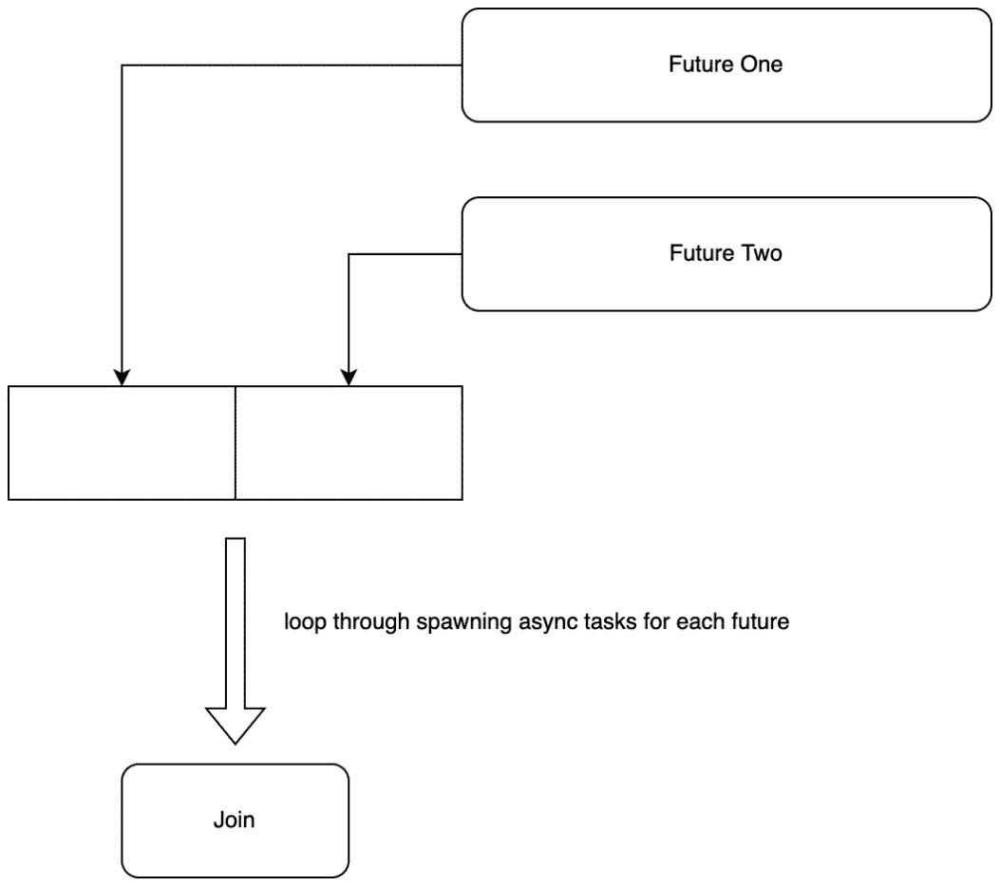
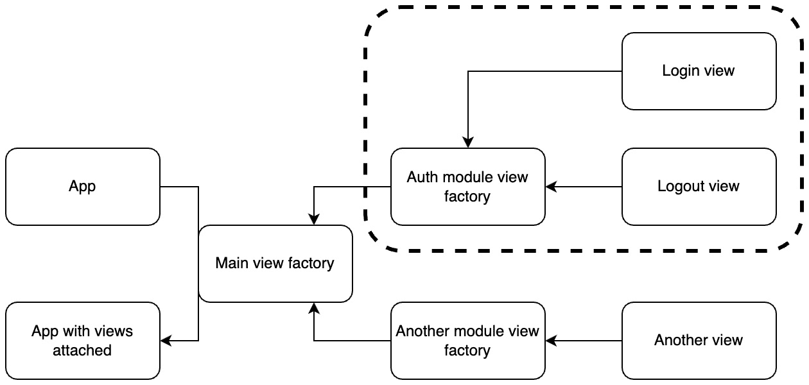

# 第三章：处理 HTTP 请求

到目前为止，我们已经以灵活、可扩展和可重用的方式构建了待办事项模块。然而，在网页编程方面，这只能带我们走这么远。我们希望待办事项模块能够快速地触达多人，而无需用户在自己的电脑上安装 Rust。我们可以通过一个网络框架来实现这一点。Rust 有很多可以提供的。最初，我们将使用 **Actix Web** 框架构建我们的主要服务器。

为了实现这一点，我们将以模块化的方式构建服务器的视图；我们可以轻松地将待办事项模块插入到我们的网络应用程序中。必须注意的是，Actix Web 框架使用 `async` 函数来定义视图。正因为如此，我们还将介绍异步编程，以便更好地理解 Actix Web 框架的工作原理。

在本章中，我们将涵盖以下主题：

+   介绍 Actix Web 框架

+   启动基本的 Actix Web 服务器

+   理解闭包

+   理解异步编程

+   通过网络编程理解 `async` 和 `await`

+   使用 Actix Web 框架管理视图

# 技术要求

随着我们转向使用 Rust 构建网络应用，我们将不得不开始依赖第三方包来为我们做一些繁重的工作。Rust 通过一个名为 **Cargo** 的包管理器来管理依赖项。要使用 Cargo，我们不得不从以下网址安装 Rust 到我们的电脑上：[`www.rust-lang.org/tools/install`](https://www.rust-lang.org/tools/install)。

此安装提供了 Rust 编程语言和 Cargo。你可以在 GitHub 上找到所有代码文件，网址为 [`github.com/PacktPublishing/Rust-Web-Programming-2nd-Edition/tree/main/chapter03`](https://github.com/PacktPublishing/Rust-Web-Programming-2nd-Edition/tree/main/chapter03)。

# 介绍 Actix Web 框架

在撰写本文时，Actix Web 是 GitHub 页面上活动最频繁的 Rust 网络框架，如我们所见。你可能会想跳入另一个看起来更直观的框架，比如 Rocket，或者一个更快更轻量级的框架，比如 Hyper。我们将在本书的后续章节中覆盖这些框架；然而，我们必须记住，我们首先试图在 Rust 和网络编程中弄清楚我们的思路。考虑到我们是 Rust 和网络编程的新手，Actix Web 是一个很好的起点。它不是太底层，以至于我们只会陷入仅仅尝试让服务器处理一系列视图、数据库连接和认证。它也很受欢迎、稳定，并且有大量的文档。这将有助于在尝试超越本书并开发自己的网络应用程序时获得愉快的编程体验。建议你在转向其他网络框架之前先熟悉 Actix Web。这并不是说 Actix Web 是最好的，而其他所有框架都很糟糕；这只是为了方便一个平稳的学习和开发体验。考虑到这一点，我们现在可以继续到第一部分，在那里我们设置了一个基本的网络服务器。

# 启动一个基本的 Actix Web 服务器

使用 Cargo 构建很简单。我们只需要导航到我们想要构建项目的目录，并运行以下命令：

```rs
cargo new web_app
```

前面的命令构建了一个基本的 Cargo Rust 项目。当我们探索这个应用程序时，我们得到以下结构：

```rs
└── web_app
    ├── Cargo.toml
    └── src
         └── main.rs
```

现在，我们可以在 `Cargo.toml` 文件中使用以下代码定义我们的 Actix Web 依赖项：

```rs
[dependencies]
actix-web = "4.0.1"
```

由于前面的代码，我们现在可以继续构建网络应用程序。现在，我们将所有内容都放在我们的 `src/main.rs` 文件中，以下代码：

```rs
use actix_web::{web, App, HttpServer, Responder, 
                HttpRequest};
async fn greet(req: HttpRequest) -> impl Responder {
    let name = 
        req.match_info().get("name").unwrap_or("World");
    format!("Hello {}!", name)
}
#[actix_web::main]
async fn main() -> std::io::Result<()> {
    HttpServer::new(|| {
        App::new()
        .route("/", web::get().to(greet))
        .route("/{name}", web::get().to(greet))
        .route("/say/hello", web::get().to(|| 
                    async { "Hello Again!" }))
    })
    .bind("127.0.0.1:8080")?
    .run()
    .await
}
```

在前面的代码中，我们可以看到我们导入了来自 `actix_web` crate 所需的结构体和特性。我们可以看到我们使用了多种不同的方式来定义一个视图。我们通过构建一个函数来定义一个视图。这个函数接收一个 `HttpRequest` 结构体。然后从请求中获取 `name`，然后返回一个可以实现来自 `actix_web` crate 的 `Responder` 特性的变量。`Responder` 特性将我们的类型转换为 HTTP 响应。我们将我们为应用程序服务器创建的 `greet` 函数分配为路由视图，使用 `.route("/", web::get().to(greet))` 命令。我们还可以看到，我们可以使用 `.route("/{name}", web::get().to(greet))` 命令将 URL 中的名称传递给我们的 `greet` 函数。最后，我们将闭包传递给最终的路线。根据我们的配置，让我们运行以下命令：

```rs
cargo run
```

我们将得到以下打印输出：

```rs
Finished dev [unoptimized + debuginfo] target(s) in 0.21s
 Running `target/debug/web_app`
```

在前面的输出中，我们可以看到，目前还没有日志记录。这是预期的，我们将在稍后配置日志。现在我们的服务器正在运行，对于以下每个 URL 输入，我们应该在浏览器中期望得到相应的输出：

+   `http://127.0.0.1:8080/`

+   `Hello World!`

+   `http://127.0.0.1:8080/maxwell`

+   `Hello maxwell!`

+   `http://127.0.0.1:8080/say/hello`

+   `Hello Again!`

在`src/main.rs`文件中的前面代码中，我们可以看到一些我们之前没有遇到的新语法。我们用`#[actix_web::main]`宏装饰了`main`函数。这标志着我们的`async` `main`函数是 Actix Web 系统的入口点。有了这个，我们可以看到我们的函数是`async`的，我们正在使用闭包来构建我们的服务器。在接下来的几个部分中，我们将探讨这两个概念。在下一个部分中，我们将调查闭包，以真正理解正在发生的事情。

# 理解闭包

闭包本质上来说是函数，但它们也是匿名的，这意味着它们没有名字。这意味着闭包可以被传递到函数和结构体中。然而，在我们深入探讨传递闭包之前，让我们通过在空白 Rust 程序（如果你更喜欢，可以使用 Rust playground）中定义一个基本的闭包来探索闭包，以下代码：

```rs
fn main() {
    let test_closure = |string_input| {
        println!("{}", string_input);
    };
    test_closure("test");
}
```

运行前面的代码将给出以下输出：

```rs
test
```

在前面的输出中，我们可以看到我们的闭包表现得像函数一样。然而，我们使用管道而不是花括号来定义输入，而不是使用花括号。

你可能已经注意到在前面的闭包中，我们没有为`string_input`参数定义数据类型；然而，代码仍然可以运行。这与需要定义参数数据类型的函数不同。这是因为函数是暴露给用户的显式接口的一部分。如果代码可以访问函数，函数可以在代码的任何地方被调用。另一方面，闭包具有短暂的生存期，并且只与其所在的作用域相关。正因为如此，编译器可以从作用域中闭包的使用推断出传递给闭包的类型。因为我们调用闭包时传递了`&str`，编译器知道`string_input`的类型是`&str`。虽然这很方便，但我们需要知道闭包不是泛型的。这意味着闭包有一个具体类型。例如，在定义我们的闭包之后，让我们尝试运行以下代码：

```rs
    test_closure("test");
    test_closure(23);
```

我们将得到以下错误：

```rs
7 |     test_closure(23);
  |                  ^^ expected `&str`, found integer
```

错误发生是因为我们对闭包的第一个调用告诉编译器我们期望`&str`，所以第二个调用打破了编译过程。

作用域不仅影响闭包。闭包遵循与变量相同的范围规则。例如，假设我们打算尝试运行以下代码：

```rs
fn main() {
    {
        let test_closure = |string_input| {
            println!("{}", string_input);
            };
    }
    test_closure("test");
}
```

它将拒绝编译，因为当我们尝试调用闭包时，它不在调用的作用域内。考虑到这一点，你可能会正确地假设其他作用域规则也适用于闭包。例如，如果我们尝试运行以下代码，你认为会发生什么？

```rs
fn main() {
    let another_str = "case";
    let test_closure = |string_input| {
        println!("{} {}", string_input, another_str);
    };
    test_closure("test");
}
```

如果你认为我们会得到以下输出，你是正确的：

```rs
test case
```

与函数不同，闭包可以访问它们自己的作用域中的变量。所以，为了以我们能够理解的方式简单描述闭包，它们有点像我们在作用域中调用以执行计算的动态变量。

我们可以通过使用`move`来获取闭包中使用的外部变量的所有权，就像以下代码所示：

```rs
let test_closure = move |string_input| {
    println!("{} {}", string_input, another_str);
};
```

由于在此处定义的闭包中使用了`move`，因此`another_str`变量在`test_closure`声明后不能使用，因为`test_closure`获取了`another_str`的所有权。

我们还可以将闭包传递给函数；然而，必须注意的是，我们也可以将函数传递给其他函数。我们可以通过以下代码实现将函数传递给其他函数：

```rs
fn add_doubles(closure: fn(i32) -> i32, 
               one: i32, two: i32) -> i32 {
    return closure(one) + closure(two)
}
fn main() {
    let closure = |int_input| {
        return int_input * 2
    };
    let outcome = add_doubles(closure, 2, 3);
    println!("{}", outcome);
}
```

在前面的代码中，我们可以看到我们定义了一个闭包，该闭包接受一个整数并将其加倍，然后我们将其传递给`add_doubles`函数，使用`fn(i32)-> i32`的表示法，这被称为函数指针。当涉及到闭包时，我们可以实现以下特质之一：

+   `Fn`：不可变借用变量

+   `FnMut`：可变借用变量

+   `FnOnce`：获取变量的所有权，因此只能调用一次

我们可以将实现了前面特质的闭包传递给我们的`add_doubles`函数，如下所示：

```rs
fn add_doubles(closure: Box<dyn Fn(i32) -> i32>, 
               one: i32, two: i32) -> i32 {
    return closure(one) + closure(two)
}
fn main() {
    let one = 2;
    let closure = move |int_input| {
        return int_input * one
    };
    let outcome = add_doubles(Box::new(closure), 2, 3);
    println!("{}", outcome);
}
```

在这里，我们可以看到`closure`函数参数具有`Box<dyn Fn(i32) -> i32>`签名。这意味着`add_doubles`函数正在接受实现了`Fn`特质且接受`i32`作为输入并返回`i32`的闭包。`Box`结构体是一个智能指针，我们将闭包放在堆上，因为我们不知道闭包的大小在编译时。您还可以看到我们在定义闭包时使用了`move`。这是因为我们正在使用`one`变量，它位于闭包外部。`one`变量可能存活时间不够长；因此，闭包通过我们在定义闭包时使用`move`来获取其所有权。

考虑到我们已经讨论过的闭包，我们可以再次查看我们的服务器应用程序中的`main`函数，如下所示：

```rs
#[actix_web::main]
async fn main() -> std::io::Result<()> {
    HttpServer::new(|| {
        App::new()
        .route("/", web::get().to(greet))
        .route("/{name}", web::get().to(greet))
        .route("/say/hello", web::get().to(
        || async { "Hello Again!" }))
    })
    .bind("127.0.0.1:8080")?
    .run()
    .await
}
```

在前面的代码中，我们可以看到我们在使用`HttpServer::new`函数构建`HttpServer`之后运行它。考虑到我们现在所知道的内容，我们可以看到我们传递了一个返回`App`结构的闭包。基于我们对闭包的了解，我们可以对我们所做的事情更有信心。如果我们返回`App`结构，我们基本上可以在闭包内做我们想做的事情。有了这个想法，我们可以通过以下代码获取更多关于此过程的信息：

```rs
#[actix_web::main]
async fn main() -> std::io::Result<()> {
    HttpServer::new(|| {
        println!("http server factory is firing");
        App::new()
        .route("/", web::get().to(greet))
        .route("/{name}", web::get().to(greet))
        .route("/say/hello", web::get().to(
               || async { "Hello Again!" }))
    })
    .bind("127.0.0.1:8080")?
    .workers(3)
    .run()
    .await
}
```

在前面的代码中，我们可以看到我们添加了一个`print`语句来告诉我们闭包正在触发。我们还添加了另一个名为`workers`的函数。这意味着我们可以定义用于创建我们的服务器的工作者数量。我们还打印出服务器工厂在我们的闭包中正在触发。运行前面的代码会给我们以下输出：

```rs
    Finished dev [unoptimized + debuginfo] target(s) in 
    2.45s
     Running `target/debug/web_app`
http server factory is firing
http server factory is firing
http server factory is firing
```

前面的结果告诉我们闭包被触发了三次。改变工作者的数量显示，这与闭包被触发的次数有直接关系。如果省略`workers`函数，那么闭包的触发将与系统核心的数量成比例。我们将在下一节中探讨这些工作者如何适应服务器进程。

现在我们已经了解了构建`App`结构体周围的细微差别，是时候看看程序结构的主要变化了，那就是异步编程。

# 理解异步编程

到目前为止，我们一直以顺序方式编写代码。这对于标准脚本来说已经足够好了。然而，在 Web 开发中，异步编程很重要，因为服务器有多个请求，API 调用引入了空闲时间。在其他一些语言中，如 Python，我们可以构建 Web 服务器而不需要接触任何异步概念。虽然在这些 Web 框架中使用了异步概念，但实现是在幕后定义的。这对于 Rust 框架 Rocket 也是正确的。然而，正如我们所看到的，它直接在 Actix Web 中实现。

当涉及到利用异步代码时，有两个主要概念我们必须理解：

+   **进程**：进程是一个正在执行的程序。它有自己的内存栈、变量的寄存器和代码。

+   `main`程序。然而，线程不共享栈。

这在以下经典图中得到了体现：

![图 3.1 – 线程和进程之间的关系 [来源：Cburnett (2007) (https://commons.wikimedia.org/wiki/File:Multithreaded_process.svg)，CC BY-SA 3.0 (https://creativecommons.org/licenses/by-sa/3.0/deed.en)]](img/Figure_3.1_B18722.jpg)

图 3.1 – 线程和进程之间的关系 [来源：Cburnett (2007) (https://commons.wikimedia.org/wiki/File:Multithreaded_process.svg)，CC BY-SA 3.0 (https://creativecommons.org/licenses/by-sa/3.0/deed.en)]

现在我们已经从高层次上理解了线程是什么以及它们与我们的代码有什么关系，我们可以通过一个玩具示例来了解如何在代码中利用线程，并亲眼看到这些线程的效果。一个经典的例子是构建一个简单的函数，它只是休眠，阻止时间流逝。这可以模拟一个耗时的函数，如网络请求。我们可以用以下代码按顺序运行它：

```rs
use std::{thread, time};
fn do_something(number: i8) -> i8 {
    println!("number {} is running", number);
    let two_seconds = time::Duration::new(2, 0);
    thread::sleep(two_seconds);
    return 2
}
fn main() {
    let now = time::Instant::now();
    let one: i8 = do_something(1);
    let two: i8 = do_something(2);
    let three: i8 = do_something(3);
    println!("time elapsed {:?}", now.elapsed());
    println!("result {}", one + two + three);
}
```

运行前面的代码会给我们以下输出：

```rs
number 1 is running
number 2 is running
number 3 is running
time elapsed 6.0109845s
result 6
```

在前面的输出中，我们可以看到我们的耗时函数按照我们预期的顺序运行。整个程序运行也正好超过 6 秒，这是有道理的，因为我们正在运行三个耗时的函数，每个函数休眠 2 秒。我们的耗时函数还返回值`2`。当我们把所有三个耗时函数的结果相加时，我们将得到一个值为`6`的结果，这正是我们所得到的。我们通过同时启动三个线程并将它们完成后再继续，将整个程序的速度加快到大约 2 秒。在继续之前等待线程完成的过程称为*连接*。因此，在我们开始启动线程之前，我们必须使用以下代码导入`join`处理程序：

```rs
use std::thread::JoinHandle;
```

我们现在可以在`main`函数中使用以下代码启动线程：

```rs
let now = time::Instant::now();
let thread_one: JoinHandle<i8> = thread::spawn(
    || do_something(1));
let thread_two: JoinHandle<i8> = thread::spawn(
    || do_something(2));
let thread_three: JoinHandle<i8> = thread::spawn(
    || do_something(3));
let result_one = thread_one.join();
let result_two = thread_two.join();
let result_three = thread_three.join();
println!("time elapsed {:?}", now.elapsed());
println!("result {}", result_one.unwrap() +
          result_two.unwrap() + result_three.unwrap());
```

运行前面的代码给出了以下输出：

```rs
number 1 is running
number 3 is running
number 2 is running
time elapsed 2.002991041s
result 6
```

如我们所见，整个过程运行时间正好超过 2 秒。这是因为所有三个线程都是并发运行的。注意，线程三在线程二之前启动。如果你得到`1`、`2`和`3`的序列，请不要担心。线程的完成顺序是不确定的。调度是确定的；然而，在底层有成千上万个事件需要 CPU 进行处理。因此，每个线程得到的精确时间片永远不会相同。这些微小的变化会累积起来。正因为如此，我们无法保证线程将以确定的顺序完成。

回顾我们启动线程的方式，我们可以看到我们向线程传递了一个闭包。如果我们尝试只通过线程传递`do_something`函数，我们会得到一个错误，抱怨编译器期望一个`FnOnce<()>`闭包，而找到的是`i8`。这是因为标准闭包实现了`FnOnce<()>`公共特质，而我们的`do_something`函数只是简单地返回`i8`。当`FnOnce<()>`被实现时，闭包只能被调用一次。这意味着当我们创建一个线程时，我们可以确保闭包只能被调用一次，然后当它返回时，线程结束。由于我们的`do_something`函数是闭包的最后一行，所以返回`i8`。然而，必须注意的是，尽管实现了`FnOnce<()>`特质，并不意味着我们不能多次调用它。这个特质只有在上下文需要时才会被调用。这意味着如果我们要在线程上下文之外调用闭包，我们可以多次调用它。

还要注意，我们直接解包了我们的结果。根据我们所知，我们可以推断出 `JoinHandle` 结构体上的 `join` 函数返回 `Result`，我们也知道它可以返回 `Err` 或 `Ok`。我们知道直接解包结果是安全的，因为我们只是在睡眠然后返回一个整数。我们还打印出了结果，这些结果确实是整数。然而，我们的错误并不是你所期望的。我们得到的完整 `Result` 类型是 `Result<i8, Box<dyn Any + Send>>`。我们已经知道 `Box` 是什么；然而，`dyn Any + Send` 看起来很新。`dyn` 是一个关键字，我们用它来指示正在使用的特质的类型。`Any` 和 `Send` 是必须实现的两个特质。`Any` 特质用于动态类型，意味着数据类型可以是任何类型。`Send` 特质意味着它可以从一个线程安全地移动到另一个线程。`Send` 特质还意味着它可以从一个线程安全地复制到另一个线程。所以，我们要发送的内容已经实现了 `Copy` 特质，因为我们发送的内容可以在线程之间传递。现在我们理解了这一点，我们只需通过匹配 `Result` 的结果来处理线程的结果，然后将错误向下转换为字符串以获取错误信息，以下代码展示了如何操作：

```rs
match thread_result {
    Ok(result) => {
        println!("the result for {} is {}", 
                  result, name);
    }
    Err(result) => {
    if let Some(string) = result.downcast_ref::<String>() {
        println!("the error for {} is: {}", name, string);
    } else {
        println!("there error for {} does not have a 
                  message", name);
        }
    }
}
```

上述代码使我们能够优雅地管理线程的结果。现在，没有任何阻止你记录线程失败或根据先前线程的结果启动新线程的事情。因此，我们可以看到 `Result` 结构体是多么强大。我们还可以对线程做更多的事情，例如给它们命名或通过通道在它们之间传递数据。然而，本书的重点是网络编程，而不是高级并发设计模式和概念。不过，本章末尾提供了关于该主题的进一步阅读材料。

现在我们已经了解了如何在 Rust 中启动线程，它们返回什么，以及如何处理它们。有了这些信息，我们可以继续下一节，了解 `async` 和 `await` 语法，因为这是我们将在我们的 Actix Web 服务器中使用的内容。

# 理解 `async` 和 `await`

`async` 和 `await` 语法管理了上一节中涵盖的相同概念；然而，也有一些细微差别。我们不是简单地生成线程，而是创建**未来**对象，并在需要时对其进行操作。

在计算机科学中，期货是一个未处理的计算。这意味着结果尚未可用，但当我们调用或等待时，期货将被计算的结果填充。另一种描述方式是，期货是一种表达尚未准备好的值的方式。因此，期货并不完全等同于线程。实际上，线程可以使用期货来最大化其潜力。例如，假设我们有几个网络连接。我们可以为每个网络连接分配一个单独的线程。这比顺序处理所有连接要好，因为慢速网络连接会阻止其他更快连接的处理，直到它本身被处理，从而导致整体处理时间变慢。然而，为每个网络连接启动线程并不是免费的。相反，我们可以为每个网络连接创建一个期货。这些网络连接可以在期货准备好时由线程池中的线程进行处理。因此，我们可以看到为什么期货在 Web 编程中被使用，因为存在大量的并发连接。

期货也可以被称为*承诺*、*延迟*或*延期*。为了探索期货，我们将创建一个新的 Cargo 项目并利用在`Cargo.toml`文件中创建的期货：

```rs
[dependencies]
futures = "0.3.21"
```

在安装了前面的 crate 之后，我们可以在`main.rs`中使用以下代码导入所需的模块：

```rs
use futures::executor::block_on;
use std::{thread, time};
```

我们可以通过仅使用`async`语法来定义期货。`block_on`函数将阻塞程序，直到我们定义的期货被执行。现在我们可以使用以下代码定义`do_something`函数：

```rs
async fn do_something(number: i8) -> i8 {
    println!("number {} is running", number);
    let two_seconds = time::Duration::new(2, 0);
    thread::sleep(two_seconds);
    return 2
}
```

`do_something`函数基本上做的是代码所说的，即打印出它是哪个数字，休眠 2 秒，然后返回一个整数。然而，如果我们直接调用它，我们将不会得到`i8`。相反，直接调用`do_something`函数将给我们`Future<Output = i8>`。我们可以在主函数中运行我们的期货并对其进行计时，以下代码：

```rs
fn main() {
    let now = time::Instant::now();
    let future_one = do_something(1);
    let outcome = block_on(future_one);
    println!("time elapsed {:?}", now.elapsed());
    println!("Here is the outcome: {}", outcome);
}
```

运行前面的代码将给出以下输出：

```rs
number 1 is running
time elapsed 2.00018789s
Here is the outcome: 2
```

这是预期的结果。然而，让我们看看如果我们调用`block_on`函数之前输入一个额外的`sleep`函数会发生什么：

```rs
fn main() {
    let now = time::Instant::now();
    let future_one = do_something(1);
    let two_seconds = time::Duration::new(2, 0);
    thread::sleep(two_seconds);
    let outcome = block_on(future_one);
    println!("time elapsed {:?}", now.elapsed());
    println!("Here is the outcome: {}", outcome);
}
```

我们将得到以下输出：

```rs
number 1 is running
time elapsed 4.000269667s
Here is the outcome: 2
```

因此，我们可以看到我们的期货只有在应用了`block_on`函数并使用它来执行后才会执行。

这可能有点费时，因为我们可能只想在同一个函数中稍后执行一个期货。我们可以使用`async`/`await`语法来实现这一点。例如，我们可以在`main`函数中使用`await`语法调用`do_something`函数并阻塞代码，直到它完成，以下代码：

```rs
let future_two = async {
    return do_something(2).await
};
let future_two = block_on(future_two);
println!("Here is the outcome: {:?}", future_two);
```

`async`块所做的就是返回一个期货。在这个块内部，我们调用`do_something`函数，通过使用`await`表达式阻塞`async`块，直到`do_something`函数解决。然后我们对`future_two`期货应用`block_on`函数。

看到我们前面的代码块，这可能会显得有些过度，因为它可以用调用`do_something`函数并将其传递给`block_on`函数的两行代码来完成。在这种情况下，它是过度的，但它可以给我们更多的灵活性来调用未来。例如，我们可以调用`do_something`函数两次，并将它们作为返回值相加，如下所示：

```rs
let future_three = async {
    let outcome_one = do_something(2).await;
    let outcome_two = do_something(3).await;
    return outcome_one + outcome_two
};
let future_outcome = block_on(future_three);
println!("Here is the outcome: {:?}", future_outcome);
```

将前面的代码添加到我们的`main`函数中，将给出以下输出：

```rs
number 2 is running
number 3 is running
Here is the outcome: 4
```

尽管前面的输出是我们预期的结果，但我们知道这些未来将按顺序运行，而这块代码的总时间将略高于 4 秒。也许我们可以通过使用`join`来加快这个速度。我们已经看到`join`可以通过同时运行线程来加速线程。它确实有道理认为它也可以加速我们的未来。首先，我们必须使用以下代码导入`join`宏：

```rs
use futures::join
```

现在，我们可以利用`join`来处理我们的未来，并使用以下代码来计时实现：

```rs
let future_four = async {
    let outcome_one = do_something(2);
    let outcome_two = do_something(3);
    let results = join!(outcome_one, outcome_two);
    return results.0 + results.1
};
let now = time::Instant::now();
let result = block_on(future_four);
println!("time elapsed {:?}", now.elapsed());
println!("here is the result: {:?}", result);
```

在前面的代码中，我们可以看到`join`宏返回一个包含结果的元组，并且我们解包这个元组以得到相同的结果。然而，如果我们实际运行这段代码，我们可以看到尽管我们得到了想要的结果，但我们的未来执行并没有加速，仍然停滞在 4 秒以上。这是因为未来并没有使用`async`任务来运行。我们必须使用`async`任务来加速我们未来的执行。我们可以通过以下步骤实现这一点：

1.  创建所需的未来。

1.  将它们放入一个向量中。

1.  遍历向量，为向量中的每个未来启动任务。

1.  连接`async`任务并求和向量。

这可以通过以下图示来直观地表示：



图 3.2 – 同时运行多个未来的步骤

为了同时连接所有我们的未来，我们必须使用另一个 crate 通过使用`async_std` crate 创建我们自己的异步`join`函数。我们在`Cargo.toml`文件中使用以下代码定义这个 crate：

```rs
async-std = "1.11.0"
```

现在我们有了`async_std` crate，我们可以通过在`main.rs`文件顶部导入所需的内容来执行*图 3.2*中概述的方法，如下所示：

```rs
use std::vec::Vec;
use async_std;
use futures::future::join_all;
```

在`main`函数中，我们现在可以使用以下代码定义我们的未来：

```rs
let async_outcome = async {
    // 1.
    let mut futures_vec = Vec::new();
    let future_four = do_something(4);
    let future_five = do_something(5);
    // 2.
    futures_vec.push(future_four);
    futures_vec.push(future_five);
    // 3\. 
    let handles = futures_vec.into_iter().map(
    async_std::task::spawn).collect::<Vec<_>>();
    // 4.
    let results = join_all(handles).await;
    return results.into_iter().sum::<i8>();
};
```

在这里，我们可以看到我们定义了我们的未来（*1*），然后我们将它们添加到我们的向量（*2*）。然后我们使用`into_iter`函数在我们的向量中遍历我们的未来。然后我们使用`async_std::task::spawn`在每个未来上启动一个线程。这类似于`std::task::spawn`。那么，为什么要费这么多的额外麻烦呢？我们只需遍历向量并为每个任务启动一个线程。这里的区别在于`async_std::task::spawn`函数在同一线程中生成一个`async`任务。因此，我们在同一线程中并发运行这两个未来！然后我们连接所有句柄，`await`等待这些任务完成，然后返回所有这些线程的总和。现在我们已经定义了我们的`async_outcome`未来，我们可以用以下代码运行并计时：

```rs
let now = time::Instant::now();
let result = block_on(async_outcome);
println!("time elapsed for join vec {:?}", now.elapsed());
println!("Here is the result: {:?}", result);
```

运行我们的附加代码将给出以下附加打印输出：

```rs
number 4 is running
number 5 is running
time elapsed for join vec 2.007713458s
Here is the result: 4
```

它正在工作！我们已经成功地在同一线程中同时运行了两个`async`任务，导致这两个未来在 2 秒多一点的时间内执行完成！

正如我们所看到的，在 Rust 中启动线程和`async`任务很简单。然而，我们必须注意，将变量传递到线程和`async`任务中并不是。Rust 的借用机制确保了内存安全。当我们向线程传递数据时，我们必须采取额外的步骤。关于线程间共享数据的一般概念的进一步讨论不利于我们的 Web 项目。然而，我们可以简要地指出哪些类型允许我们共享数据：

+   `std::sync::Arc`：此类型使线程能够引用外部数据：

    ```rs
    use std::sync::Arc;
    ```

    ```rs
    use std::thread;
    ```

    ```rs
    let names = Arc::new(vec!["dave", "chloe", "simon"]);
    ```

    ```rs
    let reference_data = Arc::clone(&names);
    ```

    ```rs
    let new_thread = thread::spawn(move || {
    ```

    ```rs
        println!("{}", reference_data[1]);
    ```

    ```rs
    });
    ```

+   `std::sync::Mutex`：此类型使线程能够修改外部数据：

    ```rs
    use std::sync::Mutex;
    ```

    ```rs
    use std::thread;
    ```

    ```rs
    let count = Mutex::new(0);
    ```

    ```rs
    let new_thread = thread::spawn(move || {
    ```

    ```rs
         count.lock().unwrap() += 1;
    ```

    ```rs
    });
    ```

在这个线程内部，我们取消引用锁的结果，解包它，并修改它。必须注意的是，共享状态只能在持有锁的情况下访问。

我们已经了解了足够的异步编程知识，可以回到我们的网络编程。并发是一个可以涵盖整本书的主题，其中之一在*进一步阅读*部分有引用。现在，我们必须回到探索 Rust 在 Web 开发中的应用，看看我们对 Rust 异步编程的了解如何影响我们对 Actix Web 服务器的理解。

# 探索 Web 编程中的异步和 await

了解我们所了解的异步编程，我们现在可以以不同的方式看待我们的 Web 应用程序中的`main`函数，如下所示：

```rs
#[actix_web::main]
async fn main() -> std::io::Result<()> {
    HttpServer::new( || {
        App::new()
        .route("/", web::get().to(greet))
        .route("/{name}", web::get().to(greet))
        .route("/say/hello", web::get().to(|| 
               async { "Hello Again!" }))
    })
    .bind("127.0.0.1:8080")?
    .workers(3)
    .run()
    .await
}
```

我们知道我们的`greet`函数是一个`async`函数，因此是一个未来。我们还可以看到我们传递给`/say/hello`视图的闭包也使用了`async`语法。我们还可以看到`HttpServer::new`函数在`async fn main()`中使用了`await`语法。因此，我们可以推断出我们的`HttpServer::new`函数是一个执行器。然而，如果我们移除`#[actix_web::main]`宏，我们会得到以下错误：

```rs
`main` function is not allowed to be `async`
```

这是因为我们的 `main` 函数，也就是我们的入口点，会返回一个 future 而不是运行我们的程序。`#[actix_web::main]` 是一个运行时实现，它使得所有内容都可以在当前线程上运行。`#[actix_web::main]` 宏标记了 `async` 函数（在这种情况下是 `main` 函数）由 Actix 系统执行。

注意

在这里冒险深入探讨一下，Actix crate 基于 actor 模型运行并发计算。在这里，actor 是一个计算。Actors 可以互相发送和接收消息。Actors 可以改变自己的状态，但它们只能通过消息影响其他 actor，这消除了基于锁的同步（我们之前提到的互斥锁是锁基础的）。对这个模型的进一步探索不会帮助我们开发基本的 Web 应用。然而，Actix crate 在[`actix.rs/book/actix`](https://actix.rs/book/actix)上对使用 Actix 进行并发系统编码有很好的文档。

我们在这里已经涵盖了大量的内容。如果你觉得自己没有完全记住所有内容，请不要感到有压力。我们简要地介绍了一系列关于异步编程的话题。我们不需要完全理解它就可以开始基于 Actix Web 框架构建应用程序。

你可能也会觉得我们涵盖的内容过多。例如，我们可以在需要时启动服务器并使用 `async` 语法来简单地生成视图，而不必真正了解发生了什么。在构建我们的玩具应用时，不了解发生了什么但知道在哪里放置 `async` 并不会减慢我们的速度。然而，这种快速浏览对于调试和设计应用来说是非常宝贵的。为了建立这一点，我们可以看看现实世界中的一个例子。我们可以看看这个聪明的 *Stack Overflow* 解决方案，它在一个文件中运行多个服务器：[`stackoverflow.com/questions/59642576/run-multiple-actix-app-on-different-ports`](https://stackoverflow.com/questions/59642576/run-multiple-actix-app-on-different-ports)。

*Stack Overflow* 中的代码基本上是在一个运行时运行了两个服务器。首先，它们使用以下代码定义了视图：

```rs
use actix_web::{web, App, HttpServer, Responder};
use futures::future;
async fn utils_one() -> impl Responder {
    "Utils one reached\n"
}
async fn health() -> impl Responder {
    "All good\n"
}
```

视图定义完毕后，在 `main` 函数中定义了两个服务器：

```rs
#[actix_rt::main]
async fn main() -> std::io::Result<()> {
    let s1 = HttpServer::new(move || {
            App::new().service(web::scope("/utils").route(
            "/one", web::get().to(utils_one)))
        })
        .bind("0.0.0.0:3006")?
        .run();
    let s2 = HttpServer::new(move || {
            App::new().service(web::resource(
            "/health").route(web::get().to(health)))
        })
        .bind("0.0.0.0:8080")?
        .run();
    future::try_join(s1, s2).await?;
    Ok(())
}
```

我没有给这段代码添加任何注释，但它不应该让你感到害怕。我们可以自信地推断出 `s1` 和 `s2` 是 `run` 函数返回的 futures。然后我们将这两个 futures 合并，并 `await` 它们完成。我们的代码和 *Stack Overflow* 中的代码有一点细微的差别。我们的解决方案使用了 `await?` 并随后返回以下代码片段的 `Ok`：

```rs
    future::try_join(s1, s2).await?;
    Ok(())
}
```

这是因为 `?` 操作符本质上是一个 `try` 匹配。`join(s1, s2).await?` 大概等价于以下代码：

```rs
match join(s1, s2).await {
    Ok(v) => v,
    Err(e) => return Err(e.into()),
}
```

而 `join(s1, s2).await.unwrap()` 大概等价于以下代码：

```rs
match join(s1, s2).await {
    Ok(v) => v,
    Err(e) => panic!("unwrap resulted in {}", e),
}
```

由于`?`操作符，提供解决方案的人必须在末尾插入`Ok`，因为`main`函数返回`Result`，而这被实现`?`操作符时移除了。

因此，在野外的解决方案中，*Stack Overflow*展示了涵盖异步编程的重要性。我们可以查看野外的代码，弄清楚发生了什么，以及*Stack Overflow*上的发帖者是如何实现他们的目标的。这也意味着我们可以自己发挥创意。没有什么阻止我们创建三个服务器并在`main`函数中运行它们。这正是 Rust 真正闪耀的地方。花时间学习 Rust 让我们能够安全地深入到底层，并对我们所做的事情有更精细的控制。你会发现这在用 Rust 做的任何编程领域都是真实的。

在尝试构建我们的应用程序之前，还有一个概念我们应该调查，那就是将`main`函数作为一个未来。如果我们看看**Tokio**库，我们可以看到它是一个通过提供编写网络应用程序所需的构建块来为 Rust 编程语言提供异步运行时的库。Tokio 的工作原理很复杂；然而，如果我们查看关于加快 Tokio 运行时的 Tokio 文档，我们可以添加如下所示的图表：

](img/Figure_3.3_B18722.jpg)

图 3.3 – 加快 Tokio 运行时 [来源：Tokio 文档（2019）](https://tokio.rs/blog/2019-10-scheduler)]

在前面的图中，我们可以看到有一些任务被排队，处理器正在处理它们。我们之前已经处理了我们的任务，所以这应该看起来很熟悉。考虑到这一点，我们可能不会对可以使用 Tokio 而不是 Actix Web 宏来运行我们的服务器感到太惊讶。为此，我们在`Cargo.toml`文件中定义我们的 Tokio 依赖项，如下所示：

```rs
tokio = { version = "1.17.0", features = ["full"] }
```

使用前面的代码，我们现在可以在`main.rs`文件中的宏切换到以下代码：

```rs
#[tokio::main]
async fn main() -> std::io::Result<()> {
    HttpServer::new( || {
        App::new()
        .route("/", web::get().to(greet))
        .route("/{name}", web::get().to(greet))
    })
    .bind("127.0.0.1:8080")?
    .bind("127.0.0.1:8081")?
    .workers(3)
    .run()
    .await
}
```

运行前面的代码将给我们与运行服务器相同的输出。当使用 Tokio 而不是我们的 Actix 运行时宏时，可能会有一些不一致。虽然这是一个有趣的结果，展示了我们可以如何自信地配置我们的服务器，但当我们谈到在 Actix 中开发待办事项应用程序时，我们将在这本书的其余部分使用 Actix 运行时宏。我们将在*第十四章* *探索 Tokio 框架*中重新审视 Tokio。

我们现在已经涵盖了足够的服务器配置和服务器如何处理请求的内容，可以变得高效。现在我们可以继续定义我们的视图以及它们在下一节中的处理方式。

# 使用 Actix Web 框架管理视图

到目前为止，我们已经在`main.rs`文件中定义了所有我们的视图。这对于小型项目来说是可以的；然而，随着我们的项目增长，这不会很好地扩展。找到正确的视图可能很困难，更新它们可能会导致错误。这也使得从你的 Web 应用程序中移除或插入模块变得更加困难。此外，如果我们把所有的视图定义在一个页面上，如果一个大团队正在开发应用程序，这可能会导致很多合并冲突，因为他们都会想要更改相同的文件，如果他们正在更改视图的定义。正因为如此，最好将一组视图的逻辑包含在一个模块中。我们可以通过构建一个处理认证的模块来探索这一点。我们不会在本章中构建围绕认证的逻辑，但它是一个很好的简单示例，用于探索如何管理视图模块的结构。在我们编写任何代码之前，我们的 Web 应用程序应该有以下文件布局：

```rs
├── main.rs
└── views
    ├── auth
    │   ├── login.rs
    │   ├── logout.rs
    │   └── mod.rs
    ├── mod.rs
```

每个文件中的代码可以描述如下：

+   `main.rs`: 服务器定义的入口点

+   `views/auth/login.rs`: 定义登录视图的代码

+   `views/auth/logout.rs`: 定义登出视图的代码

+   `views/auth/mod.rs`: 定义`auth`视图的工厂

+   `views/mod.rs`: 定义整个应用程序所有视图的工厂

首先，让我们从`main.rs`文件中的基本 Web 服务器开始，不添加任何额外的功能，以下代码：

```rs
use actix_web::{App, HttpServer};
mod views;
#[actix_web::main]
async fn main() -> std::io::Result<()> {
    HttpServer::new(|| {
        let app = App::new();
        return app
    })
        .bind("127.0.0.1:8000")?
        .run()
        .await
}
```

上述代码简单明了，不应该有任何惊喜。我们稍后会修改代码，然后我们可以继续定义视图。对于本章，我们只想返回一个字符串，说明视图是什么。我们将知道我们的应用程序结构是可行的。我们可以在`views/auth/login.rs`文件中使用以下代码定义我们的基本登录视图：

```rs
pub async fn login() -> String {
    format!("Login view")
}
```

现在，在`views/auth/logout.rs`文件中的登出视图是这样的，这并不会让人感到惊讶：

```rs
pub async fn logout() -> String {
    format!("Logout view")
}
```

现在我们已经定义了视图，我们只需要在`mod.rs`文件中定义工厂，以便我们的服务器能够提供它们。我们的工厂提供了我们应用程序的数据流，其形式如下：



图 3.4 – 我们应用程序的数据流

我们可以在*图 3**.4*中看到，链式工厂给我们带来了很多灵活性。如果我们想从我们的应用程序中移除所有的`auth`视图，我们只需在我们的主视图工厂中删除一行代码就能做到这一点。我们还可以重用我们的模块。例如，如果我们想在多个服务器上使用`auth`模块，我们只需为`auth`视图模块创建一个 git 子模块，并在其他服务器上使用它。我们可以在`views/auth/mod.rs`文件中使用以下代码构建我们的`auth`模块工厂视图：

```rs
mod login;
mod logout;
use actix_web::web::{ServiceConfig, get, scope};
pub fn auth_views_factory(app: &mut ServiceConfig) {
    app.service(scope("v1/auth").route("login", 
                get().to(login::login)).route("logout", 
                get().to(logout::logout))
    );
}
```

在前面的代码中，我们可以看到我们传递了一个`ServiceConfig`结构体的可变引用。这使得我们能够在服务器上的不同字段中定义诸如视图之类的事物。该结构体的文档说明，它是为了允许更大的应用程序将配置拆分到不同的文件中。然后我们将服务应用于`ServiceConfig`结构体。该服务使我们能够定义一个视图块，所有这些视图都将填充在作用域中定义的前缀。我们还声明，目前我们使用`get`方法，以便在浏览器中易于访问。现在，我们可以使用以下代码将`auth`视图工厂插入到`views/mod.rs`文件中的`main`视图工厂：

```rs
mod auth;
use auth::auth_views_factory;
use actix_web::web::ServiceConfig;
pub fn views_factory(app: &mut ServiceConfig) {
    auth_views_factory(app);
}
```

在前面的代码中，我们只需一行代码就能将整个视图模块切割。我们还可以按需链式调用模块。例如，如果我们想在`auth`视图模块中添加子模块，我们可以这样做，只需将那些`auth`子模块的工厂传递给`auth`工厂即可。我们还可以在工厂中定义多个服务。我们的`main.rs`文件在添加了一个`configure`函数后基本保持不变，如下所示：

```rs
use actix_web::{App, HttpServer};
mod views;
#[actix_web::main]
async fn main() -> std::io::Result<()> {
    HttpServer::new(|| {
        let app = 
            App::new().configure(views::views_factory);
        return app
    })
        .bind("127.0.0.1:8000")?
        .run()
        .await
}
```

当我们在`App`结构体上调用`configure`函数时，我们将视图工厂传递给`configure`函数，它会自动将`config`结构体传递给我们的工厂函数。由于`configure`函数返回`Self`，即`App`结构体，我们可以在闭包的末尾返回结果。现在我们可以运行我们的服务器，得到以下结果：


图 3.5 – 登录视图

我们可以看到，我们的应用程序带有预期的前缀可以正常工作！通过这一点，我们已经涵盖了处理 HTTP 请求的所有基础知识。

# 摘要

在本章中，我们介绍了线程、未来和`async`函数的基础知识。因此，我们能够自信地查看野外的多服务器解决方案并理解其工作原理。基于上一章学到的概念，我们构建了定义视图的模块。此外，我们通过链式调用工厂，使视图能够即时构建并添加到服务器中。通过这种链式工厂机制，我们可以在构建服务器时将整个视图模块插入或移除配置。

我们还构建了一个实用结构体，它定义了一个路径，标准化了一组视图的 URL 定义。在未来的章节中，我们将使用这种方法构建认证、JSON 序列化和前端模块。基于我们已经覆盖的内容，我们将在下一章中构建能够以多种不同方式从用户那里提取和返回数据的视图。有了这种模块化理解，我们有了强大的基础，使我们能够用 Rust 构建真实的网络项目，其中逻辑是隔离的，可以配置，代码可以以可管理的方式添加。

在下一章中，我们将处理请求和响应。我们将学习如何传递参数、主体、头和表单到视图中，并通过返回 JSON 来处理它们。我们将使用上一章中构建的待办事项模块，通过服务器视图来启用我们对待办事项的交互。

# 问题

1.  `HttpServer::new`函数传递了什么参数，该参数返回什么？

1.  闭包与函数的区别是什么？

1.  进程和线程之间的区别是什么？

1.  `async`函数和普通函数之间的区别是什么？

1.  `await`和`join`之间的区别是什么？

1.  链接工厂的优势是什么？

# 答案

1.  闭包被传递到`HttpServer::new`函数中。`HttpServer::new`函数必须返回`App`结构体，这样在`HttpServer::new`函数执行后，`bind`和`run`函数才能对其执行操作。

1.  闭包可以与其作用域之外的变量交互。

1.  进程是一个具有自己的内存栈、寄存器和变量的正在执行的程序，而线程是一个轻量级的进程，它可以独立管理但与其他线程和主程序共享数据。

1.  普通函数在调用时立即执行，而`async`函数是一个承诺，必须使用阻塞函数来执行。

1.  `await`会阻塞程序以等待未来执行；然而，`join`函数可以并发运行多个线程或未来。`await`也可以在`join`函数上执行。

1.  链接工厂使我们能够在构建和编排各个模块方面具有灵活性。模块内部的工厂专注于模块的构建方式，而模块外部的工厂专注于不同模块的编排方式。

# 进一步阅读

+   *《Rust 并发实战》（2018）*，作者：*布赖恩·特劳特温*，*Packt 出版社*
