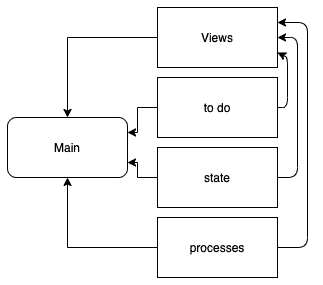

# 第四章：处理 HTTP 请求

到目前为止，我们已经利用 Actix Web 框架来提供基本视图。然而，当涉及到从请求中提取数据并将数据返回给用户时，这只能让我们走这么远。在本章中，我们将融合来自 *第二章**，在 Rust 中设计您的 Web 应用程序* 和 *第三章**，*处理 HTTP 请求* 的代码，以构建处理待办事项的服务器视图。然后我们将探索 **JSON 序列化** 以提取数据并将其返回，使我们的视图更加用户友好。我们还将使用中间件在数据到达视图之前从头部提取数据。我们将通过构建待办应用程序的创建、编辑和删除待办事项端点来探索围绕数据序列化和从请求中提取数据的概念。

本章将涵盖以下主题：

+   了解融合代码的初始设置

+   将参数传递到视图中

+   使用宏进行 JSON 序列化

+   从视图中提取数据

一旦您完成本章，您将能够构建一个基本的 Rust 服务器，该服务器可以在 URL 中发送和接收数据，在 JSON 主体中，以及在 HTTP 请求的头部。这本质上是一个完全功能的 API Rust 服务器，没有用于数据存储的数据库，没有用户认证的能力，也没有在浏览器中显示内容的能力。然而，这些概念将在接下来的三个章节中介绍。您已经拥有一个完全工作的 Rust 服务器，它正在运行。让我们开始吧！

# 技术要求

对于本章，我们需要下载并安装 **Postman**。我们将需要 Postman 来向我们的服务器发送 API 请求。您可以从 [`www.postman.com/downloads/`](https://www.postman.com/downloads/) 下载它。

我们还将基于上一章中创建的服务器代码进行构建，该代码可在 [`github.com/PacktPublishing/Rust-Web-Programming-2nd-Edition/tree/main/chapter03/managing_views_using_the_actix_web_framework/web_app`](https://github.com/PacktPublishing/Rust-Web-Programming-2nd-Edition/tree/main/chapter03/managing_views_using_the_actix_web_framework/web_app) 找到。

您可以在此处找到本章将使用的完整源代码：[`github.com/PacktPublishing/Rust-Web-Programming-2nd-Edition/tree/main/chapter04`](https://github.com/PacktPublishing/Rust-Web-Programming-2nd-Edition/tree/main/chapter04)。

管理视图代码将是本章的基础，我们将向此代码库添加功能。我们将将其与我们在*第二章*，*使用 Rust 设计您的 Web 应用程序*中编写的 to-do 模块融合，该模块可以在[`github.com/PacktPublishing/Rust-Web-Programming-2nd-Edition/tree/main/chapter02/processing_traits_and_structs`](https://github.com/PacktPublishing/Rust-Web-Programming-2nd-Edition/tree/main/chapter02/processing_traits_and_structs)找到。

# 了解融合代码的初始设置

在本节中，我们将介绍我们在*第二章*，*使用 Rust 设计您的 Web 应用程序*和*第三章*，*处理 HTTP 请求*中构建的两个融合代码片段的初始设置。这种融合将给我们以下结构：



图 4.1 – 我们的应用及其模块的结构

在这里，我们将注册主文件中的所有模块，然后将所有这些模块拉入要使用的视图。我们实际上是在将*第二章*，*使用 Rust 设计您的 Web 应用程序*中的命令行界面与网页视图相结合。结合这些模块，代码库中给出了以下文件：

```rs
├── main.rs
├── processes.rs
├── state.rs
```

然后，我们将`to_do`模块绑定到与我们的`main.rs`文件相同的目录中。如果你在阅读*第二章*，*使用 Rust 设计您的 Web 应用程序*时构建了`to_do`模块，那么你的`to_do`模块应该具有以下结构：

```rs
├── to_do
│   ├── enums.rs
│   ├── mod.rs
│   ├── structs
│   │   ├── base.rs
│   │   ├── done.rs
│   │   ├── mod.rs
│   │   └── pending.rs
│   └── traits
│       ├── create.rs
│       ├── delete.rs
│       ├── edit.rs
│       ├── get.rs
│       └── mod.rs
```

因此，现在，我们从上一章的`views`模块中添加的 bolt 应该包含以下内容：

```rs
└── views
    ├── auth
    │   ├── login.rs
    │   ├── logout.rs
    │   └── mod.rs
    ├── mod.rs
    ├── path.rs
```

所有代码的完整结构可以在以下 GitHub 仓库中找到：

[`github.com/PacktPublishing/Rust-for-Web-Developers/tree/master/chapter04/getting_to_know_the_initial_setup`](https://github.com/PacktPublishing/Rust-for-Web-Developers/tree/master/chapter04/getting_to_know_the_initial_setup)

)

现在我们已经将上一章的模块添加到我们的项目中，我们可以在程序中将它们绑定在一起。为此，我们必须创建一个新的`src/main.rs`文件。首先，我们必须导入我们构建的模块，并使用以下代码定义一个基本的服务器：

```rs
use actix_web::{App, HttpServer};
mod views;
mod to_do;
mod state;
mod processes;
#[actix_web::main]
async fn main() -> std::io::Result<()> {
    HttpServer::new(|| {
        let app = App::new().configure(views::views_factory);
        return app
    })
        .bind("127.0.0.1:8000")?
        .run()
        .await
}
```

在前面的代码中，我们定义了模块，然后是我们的服务器。因为服务器正在使用`views_factory`，所以我们不需要在本章的其余部分修改此文件。相反，我们将链式调用在`views_factory`函数中调用的工厂函数。

在这一点上，我们可以坐下来欣赏我们在前几章中所做所有艰苦工作的回报。原则的隔离和定义良好的模块使我们能够以最小的努力将我们的逻辑从命令行程序插入到我们的服务器接口中。现在，我们只需要将其连接到我们的 `views` 模块，并将参数传递到这些视图中。然而，在我们进入下一节之前，我们必须做一些小的整理工作，以确保我们的服务器可以运行。首先，我们的 `Cargo.toml` 文件中的依赖项有以下要求：

```rs
[dependencies]
actix-web = "4.0.1"
serde_json = "1.0.59"
```

然后，我们可以执行 `cargo run` 命令，这表明我们的登录和注销视图在我们的浏览器中工作。完成这些后，我们可以开始着手将参数传递到视图中。

# 将参数传递到视图中

在本节中，我们将介绍将两个模块融合以创建待办事项并通过视图存储的初始设置。为此，我们必须将待办事项的标题传递到创建待办事项的 `create` 视图中。我们可以使用以下路由将数据传递到视图中：

+   **URL**：数据和参数可以存储在请求的 URL 中。这通常用于简单情况，因为它易于实现。

+   **body**：数据可以存储在请求体中的不同字段下。这用于更复杂的数据结构和更大的有效载荷。

+   **header**：数据可以存储在请求头中的不同字段下。这用于存储正在发送的请求的元数据。我们还在头部存储了请求的认证数据。

我们将在整个项目中涵盖所有这些方法，但到目前为止，我们将使用 URL 方法传递我们的数据，因为这是最简单的介绍方法。首先，我们将使用以下布局创建我们的待办视图结构：

```rs
└── views
    ├── auth
    │   ├── login.rs
    │   ├── logout.rs
    │   └── mod.rs
    ├── mod.rs
    └── to_do
        ├── create.rs
        └── mod.rs
```

我们可以看到，我们将 `to-do` 视图放在与 `to_do` 模块相邻的 `views` 模块中。我们将继续以这种方式堆叠我们的视图，以便我们可以将它们插入和从我们的服务器中取出，如果需要，还可以将它们插入到其他项目中。现在，创建待办事项将采取以下形式：


图 4.2 – 创建待办事项的过程

要执行 *图 4**.2 中展示的过程，我们需要执行以下步骤：

1.  加载待办事项列表的当前状态。

1.  从 URL 获取新待办事项的标题。

1.  通过 `to_do_factory` 传递标题和状态 `pending`。

1.  将上一步的结果、字符串 `create` 和状态传递到进程模块接口。

1.  向用户返回一个字符串以表示过程已完成。

我们可以在 `views/to_do/create.rs` 文件中执行之前定义的这些步骤。首先，我们必须使用以下代码导入我们需要的：

```rs
use serde_json::value::Value;
use serde_json::Map;
use actix_web::HttpRequest;
use crate::to_do::{to_do_factory, enums::TaskStatus};
use crate::state::read_file;
use crate::processes::process_input;
```

我们将使用`serde_json::value::Value`和`serde_json::Map`来定义我们从`state.json`文件中读取的数据类型，并使用`HttpRequest`结构体从 URL 中提取标题。然后我们将从我们的其他模块中导入我们需要的内容，以便我们能够创建一个项目、读取状态文件和处理输入。我们的视图可以通过以下代码定义：

```rs
pub async fn create(req: HttpRequest) -> String {
    let state: Map<String, Value> = read_file(
        "./state.json"); // step 1
    let title: String = req.match_info().get("title"
    ).unwrap().to_string(); // step 2
    let item = to_do_factory(&title.as_str(), 
                             TaskStatus::PENDING); // step 3
    process_input(item, "create".to_string(), &state);
    // step 4
    return format!("{} created", title) // step 5
}
```

我们需要记住这是一个`async`函数，因为它是我们服务器正在处理的视图。我们还可以看到我们的`title`是通过使用`match_info`函数从`HttpRequest`中提取的。我们必须直接解包它，因为如果 URL 中没有标题，我们不想继续进行创建项目和将提取的标题转换为`String`的过程。然后我们需要将这个引用传递给我们的`to_do_factory`以创建一个`ItemTypes`枚举。然后我们将我们的枚举与一个命令和当前应用程序状态的引用传递给我们的`process_input`函数，正如我们记得的那样，它将经过一系列步骤来确定如何根据传入的命令和项目类型处理状态。这里有很多事情在进行，但必须注意的是，与如何处理项目相关的所有逻辑都不在这个视图中。这被称为代码正交性的关注点分离。代码正交性指的是以下数学概念：


图 4.3 – 正交性的数学概念

我们可以在*图 4**.3 中看到，如果一个向量与另一个向量正交，那么它就没有在另一个向量上的投影。在物理学中，如果这些向量是力，那么这些向量之间没有任何影响。现在，这在编程中不能完全正确：如果我们删除`processes`模块中的代码，它将影响`create`视图，因为我们必须引用它。然而，`processes`的逻辑不应该定义在`create`视图中。这部分的理由是我们必须在其他地方使用`processes`，但这不是全部原因。当我们查看`create`视图时，我们可以看到与创建挂起项目相关的逻辑与整个应用程序的其他部分。这使得开发者能够确切地知道正在发生什么。他们不会迷失在与此节中早些时候指定的创建待办事项的五步法无关的细节中。如果开发者想要探索保存项目周围的逻辑，他们可以调查定义此逻辑的文件。

我们现在必须使`to_do`模块中的视图对外可用。我们可以通过在`views/to_do/mod.rs`文件中创建一个待办视图工厂函数来实现，以下代码如下：

```rs
mod create;
use actix_web::web::{ServiceConfig, get, scope};
pub fn to_do_views_factory(app: &mut ServiceConfig) {
    app.service(
        scope("v1/item")
        .route("create/{title}", get().to(create::create))
    );
}
```

在前面的代码中，我们可以看到我们没有使`create`视图公开，但我们确实在工厂中使用它来定义视图。我们还使用`/{title}`标签定义传递到 URL 中的标题。现在我们的项目视图已经功能正常，我们需要在`views/mod.rs`文件中将`to_do_views_factory`连接到我们的应用程序，以下代码：

```rs
mod auth;
mod to_do; // define the module
use auth::auth_views_factory;
use to_do::to_do_views_factory; // import the factory 
use actix_web::web::ServiceConfig;
pub fn views_factory(app: &mut ServiceConfig) {
    auth_views_factory(app);
    to_do_views_factory(app); // pass the ServiceConfig 
}
```

在前面的代码中，我们可以看到我们已经定义了模块，导入了工厂，然后传递了应用程序配置。完成这些后，我们的应用程序就准备好运行并创建待办事项了。当我们的应用程序运行时，我们可以使用以下 URL 创建项目：


图 4.4 – 创建待办事项的视图

如果我们查看控制台，我们将看到以下输出：

```rs
learn to code rust is being created
```

如果我们查看根目录中的`state.json`文件，我们将得到以下数据：

```rs
{"learn to code rust":"PENDING"}
```

我们可以看到，我们创建待办事项的过程是成功的！我们的应用程序从 URL 中获取标题，创建一个待办事项，并将其保存在我们的 JSON 文件中。虽然这是一个里程碑，但必须指出，JSON 文件并不是数据存储的最佳解决方案。然而，现在我们可以，因为我们将在*第六章*“使用 PostgreSQL 的数据持久性”中配置一个合适的数据库。我们还可以看到 URL 中的`%20`，它表示一个空格。我们可以看到，这个空格在控制台输出和将数据保存到 JSON 文件中时都会出现，并且这个空格也在浏览器中显示的视图中。我们所做的是通过 URL 获取待办事项标题，将其打印到终端，在浏览器中显示，并将其保存到 JSON 文件中。我们实际上已经完成了构建一个 Web 应用程序的基础，因为我们可以向用户显示数据并将其存储在文件中。

`GET`方法对我们来说适用，但它并不是创建待办事项的最合适方法。`GET`方法可以被缓存、书签、保存在浏览器历史记录中，并且在其长度方面有限制。将它们书签、保存在浏览器历史记录中或缓存它们不仅会带来安全问题；它还增加了用户意外再次发出相同请求的风险。因此，使用`GET`请求更改数据不是一个好主意。为了防止这种情况，我们可以使用`POST`请求，它不会缓存，不会出现在浏览器历史记录中，也不能被书签。

由于我们列举的原因，我们现在将`create`视图转换为`POST`请求。记住我们对代码正交性的评论。定义我们的视图路由如何处理的是在我们的`views/to_do/mod.rs`文件中的工厂。以下代码：

```rs
mod create;
use actix_web::web::{ServiceConfig, post, scope};
pub fn to_do_views_factory(app: &mut ServiceConfig) {
    app.service(
        scope("v1/item")
        .route("create", post().to(create::create))
    );
}
```

在前面的代码中，我们可以看到我们只是在导入和`route`定义中将`get`更改为`post`。如果我们尝试使用之前的方法创建一个新的待办事项，我们会得到以下结果：


图 4.5 – 被阻止的方法

在**图 4**.5 中，我们可以看到页面无法找到。这可能会让人困惑，因为错误是一个 404 错误，表示页面找不到。URL 仍然定义，但不再允许对这个 URL 使用`GET`方法。考虑到这一点，我们可以使用以下 Postman 配置进行`POST`调用：


图 4.6 – 使用 Postman 的 POST 方法创建项目

在**图 4**.6 中，我们可以看到我们的 URL 仍然有效，只是使用了不同的方法——`POST`方法。我们可以检查我们的状态文件，找到以下数据：

```rs
{"learn to code rust":"PENDING","washing":"PENDING"}
```

我们可以看到，更改`create`视图允许的方法并没有影响我们创建或存储待办事项的方式。回顾**图 4**.6，我们还可以看到我们得到了状态码`200`，这是`OK`。这已经告诉我们创建已经发生。因此，我们不需要返回任何内容，因为状态是`OK`。

回顾当我们尝试向我们的`create`视图发送`GET`请求时得到的结果，我们得到了一个包含以下代码的`views/to_do/mod.rs`文件：

```rs
app.service(
    scope("v1/item")
    .route("create/{title}", post().to(create::create))
    .route("create/{title}", get().to(create::create))
);
```

如果我们将 URL 放入浏览器，我们可以看到这会创建一个挂起的待办事项。如果需要，我们还可以在我们的`get`路由中使用不同的函数与相同的 URL。这给了我们在如何使用和重用 URL 方面的灵活性。然而，考虑到我们之前提到的`GET`和`POST`方法之间的差异，只为我们的`create`函数提供一个`POST`方法是有意义的。

现在我们已经完成了创建待办事项所需的所有工作。然而，在其他视图中，我们必须返回结构化数据来展示当前待办事项的状态。

到目前为止，我们已经使用 URL 将数据传递到我们的应用程序中，这是我们可以传递数据的最基本方式。然而，我们无法使用 URL 传递结构化数据。例如，如果我们想发送一个哈希表或列表，URL 根本无法容纳这样的结构。这就是我们需要在请求体中使用 JSON 将数据传递给应用程序的地方，我们将在下一节中介绍。

# 使用宏进行 JSON 序列化

当涉及到序列化数据并将其返回给客户端时，我们可以使用`Actix-web` crate 中的 JSON 快速实现这一点。我们可以通过在`views/to_do/get.rs`文件中创建一个返回所有待办事项的`GET`视图来演示这一点：

```rs
use actix_web::{web, Responder};
use serde_json::value::Value;
use serde_json::Map;
use crate::state::read_file;
pub async fn get() -> impl Responder {
    let state: Map<String, Value> = read_file("./state.json");
    return web::Json(state);
}
```

这里，我们可以看到我们只是从 JSON 文件中读取 JSON，然后使用`web::Json`函数返回这些值。直接从 JSON 文件返回`Map<String, Value>`可能更有意义，因为它是`String`和`Value`。然而，`Map<String, Value>`的类型没有实现`Responder`特质。我们可以通过以下代码更新函数，直接返回状态：

```rs
pub async fn get() -> Map<String, Value>  {
    let state: Map<String, Value> = read_file("./state.json");
    return state;
}
```

然而，这不会工作，因为 `views/to_do/mod.rs` 文件中的 `get().to()` 函数需要接受一个实现了 `Responder` 特性的结构体。我们现在可以在 `views/to_do/mod.rs` 文件中插入我们的 `get` 视图，以下代码：

```rs
mod create;
mod get; // import the get file 
use actix_web::web::{ServiceConfig, post, get, scope};
// import get
pub fn to_do_views_factory(app: &mut ServiceConfig) {
    app.service(
        scope("v1/item")
        .route("create/{title}", post().to(create::create))
        .route("get", get().to(get::get)) // define view and URL
    );
}
```

运行 URL `http://127.0.0.1:8000/item/get` 会给我们响应体中的以下 JSON 数据：

```rs
{
    "learn to code rust": "PENDING",
    "washing": "PENDING"
}
```

我们现在有一些结构化的数据可以呈现给前端。虽然这本质上完成了工作，但并不太有帮助。例如，我们希望有两个不同的列表，一个是 *pending*，另一个是 *done*。我们还可以添加时间戳，告诉用户待办项是在何时创建或编辑的。仅仅返回待办项的标题和状态将无法使我们能够按需扩展复杂性。

## 构建我们的自定义序列化结构体

为了对将要返回给用户的类型数据有更多的控制，我们将不得不构建我们自己的序列化结构体。我们的序列化结构体将展示两个列表，一个用于已完成的项目，另一个用于待办项目。列表将被填充具有标题和状态的对象。如果我们回想一下 *第二章*，*在 Rust 中设计您的 Web 应用程序*，我们的 `pending` 和 `Done` 项目结构体是通过组合从 `Base` 结构体继承的。因此，我们必须从 `Base` 结构体中访问标题和状态。然而，我们的 `Base` 结构体对公众不可访问。我们必须使其可访问，以便我们可以序列化每个待办项的属性：


图 4.7 – 我们的待办结构体与接口之间的关系

查看 *图 4.7*，我们可以看到 `TaskStatus` 枚举是依赖关系的根。在我们能够序列化待办项之前，我们需要能够序列化这个 `enum`。我们可以使用 `serde` 包来完成这个任务。为了做到这一点，我们必须更新 `Cargo.toml` 文件中的依赖项：

```rs
[dependencies]
actix-web = "4.0.1"
serde_json = "1.0.59"
serde = { version = "1.0.136", features = ["derive"] }
```

我们可以看到我们添加了 `features = ["derive"]`。这将使我们能够用 `serde` 特性装饰我们的结构体。我们现在可以查看我们如何在 `src/to_do/enums.rs` 文件中定义我们的 `enum`，以下代码：

```rs
pub enum TaskStatus {
    DONE,
    PENDING
}
impl TaskStatus {
    pub fn stringify(&self) -> String {
        match &self {
            &Self::DONE => {return "DONE".to_string()},
            &Self::PENDING => 
                {return "PENDING".to_string()}
        }
    }
    pub fn from_string(input_string: String) -> Self {
        match input_string.as_str() {
            "DONE" => TaskStatus::DONE,
            "PENDING" => TaskStatus::PENDING,
            _ => panic!("input {} not supported", 
                        input_string)
        }
    }
}
```

在前面的代码中，我们可以看到我们有两个名为 `DONE` 和 `PENDING` 的字段；然而，它们本质上是其自身的类型。我们如何将其序列化为 JSON 值？在 `stringify` 函数中有一个线索。然而，这并不是全部。记住，我们服务器视图的返回值需要实现特性行为。我们可以通过在 `src/to_do/enums.rs` 文件中首先导入我们需要的特性行为来实现 `serde` 特性，以下代码：

```rs
use serde::ser::{Serialize, Serializer, SerializeStruct};
```

我们现在拥有了实现 `Serialize` 特性的所有必要条件，因此我们可以在下一节中自定义我们编写的结构体如何被序列化。

## 实现 Serialize 特性

`Serialize`是我们将要实现的特质，`Serializer`是一个数据格式化器，可以序列化`serde`支持的任何数据格式。然后我们可以使用以下代码为我们的`TaskStatus` `enum`实现`Serialize`特质：

```rs
impl Serialize for TaskStatus {
    fn serialize<S>(&self, serializer: S) -> Result<S::Ok, 
                    S::Error>
    where
        S: Serializer,
    {
        Ok(serializer.serialize_str(&self.stringify()
                                   .as_str())?)
    }
}
```

这是一个在`serde`文档中定义的标准方法。在前面的代码中，我们可以看到一个名为`serialize`的函数已经被定义。当序列化我们的`TaskStatus` `enum`时，会调用`serialize`函数。我们还注意到`serializer`的类型表示法为`S`。然后我们使用一个`where`语句将`S`定义为`Serializer`。这看起来可能有些反直觉，因此我们可以从我们的应用程序中退一步来探索它。以下代码块不是完成我们的应用程序所必需的。

让我们定义一些基本的结构体如下：

```rs
#[derive(Debug)]
struct TwoDposition {
    x: i32,
    y: i32
}
#[derive(Debug)]
struct ThreeDposition {
    x: i32,
    y: i32,
    z: i32
}
```

在前面的代码中，我们可以看到我们为`TwoDposition`和`ThreeDposition`结构体实现了`Debug`特质。然后我们可以定义函数，使用以下代码为每个`struct`打印调试语句：

```rs
fn print_two(s: &TwoDposition) {
    println!("{:?}", s);
}
fn print_three(s: &ThreeDposition) {
    println!("{:?}", s);
}
```

然而，我们可以看到这并不具有良好的可扩展性。我们将会为每个实现它的东西编写一个函数。相反，我们可以使用一个`where`语句，这样我们就可以将两个结构体都传递给它，因为它们实现了`Debug`特质。首先，我们必须使用以下代码导入特质：

```rs
use core::fmt::Debug;
```

然后，我们可以使用以下代码定义我们的灵活函数：

```rs
fn print_debug<S>(s: &S)
where
    S: Debug {
    println!("{:?}", s);    
}
```

这里发生的事情是，我们的函数在传递给函数的变量的类型上是泛型的。然后我们获取类型`S`的值的引用。这意味着如果`S`实现了`Debug`特质，它可以是任何类型。如果我们尝试传递一个没有实现`Debug`特质的`struct`，编译器将拒绝编译。那么，编译时发生了什么？运行以下代码：

```rs
fn main() {
    let two = TwoDposition{x: 1, y: 2};
    let three = ThreeDposition{x: 1, y: 2, z: 3};    
    print_debug(&two);
    print_debug(&three);
}
```

我们将得到以下打印输出：

```rs
TwoDposition { x: 1, y: 2 }
ThreeDposition { x: 1, y: 2, z: 3 }
```

前面的输出是有意义的，因为这是调用 debug 特质时的打印结果。然而，它们是编译器编译时创建的两个不同的函数。我们的编译器编译了以下两个函数：

```rs
print_debug::<TwoDposition>(&two);
print_debug::<ThreeDposition>(&three);
```

这并没有打破我们对 Rust 工作方式的了解；然而，它确实使我们的代码更具可扩展性。使用`where`语句还有更多优点；例如，我们可以使用以下代码指定迭代器中需要的特质：

```rs
fn debug_iter<I>(iter: I)
where
    I: Iterator
    I::Item: Debug
{
    for item in iter {
        println!("{:?}", iter);
    }
}
```

在前面的代码中，我们可以看到我们接受了一个迭代器，并且迭代器中的项需要实现`Debug`特质。然而，如果我们继续探索特质的实现，我们可能会失去本书的主要目标：使用 Rust 进行 Web 编程。

通过了解使用`where`语句实现特质的用法，我们可以回顾一下在`TaskStatus` `enum`中实现`Serialize`特质的代码：

```rs
impl Serialize for TaskStatus {
    fn serialize<S>(&self, serializer: S) -> Result<S::Ok, 
                                                  S::Error>
    where
        S: Serializer,
    {
        Ok(serializer.serialize_str(&self.stringify()
                                    .as_str())?)
    }
}
```

我们可以看到，我们只是调用了`stringify`函数，并将其包裹在`Ok`结果中。我们只想将状态作为一个`String`放入更大的数据体中。如果它是一个有字段的`struct`，那么我们可以将`serialize`函数编写如下：

```rs
fn serialize<S>(&self, serializer: S) -> Result<S::Ok, S::Error>
where
    S: Serializer,
{
    let mut s = serializer.serialize_struct("TaskStatus", 
                                             1)?;
    s.serialize_field("status", &self.stringify())?;
    s.end()
}
```

在前面的代码中，我们的序列化器是一个名为`"TaskStatus"`的`struct`，它有一个字段。然后我们将`stringify`函数的结果分配给了`status`字段。这样做本质上给我们以下结构：

```rs
#[derive(Serialize)]
struct TaskStatus {
    status: String
}
```

然而，我们不会在我们的当前练习中使用`serialize_struct`方法，因为我们需要将状态插入到一个更大的返回体中。

## 将序列化`struct`集成到我们的应用程序代码中

现在我们已经使我们的`TaskStatus` `enum`能够被序列化，我们可以回顾*图 4**.7*，看到我们的`Base` `struct`是下一个要序列化的。我们还可以看到`Base` `struct`是 JSON 序列化的关键，但它目前不是公共的，所以我们需要将其设置为公共。这可以通过将`to_do/structs/mod.rs`文件中的基础模块声明从`mod base;`更改为`pub mod base;`来实现。现在`Base` `struct`可以直接在模块外部使用，我们可以在`src`目录中构建自己的`json_serialization`模块，其结构如下：

```rs
├── main.rs
├── json_serialization
│   ├── mod.rs
│   └── to_do_items.rs
```

我们将在`src/json_serialization/to_do_items.rs`文件中定义当调用`get`视图时将返回给查看者的内容，以下代码：

```rs
use serde::Serialize;
use crate::to_do::ItemTypes;
use crate::to_do::structs::base::Base;
#[derive(Serialize)]
pub struct ToDoItems {
    pub pending_items: Vec<Base>,
    pub done_items: Vec<Base>,
    pub pending_item_count: i8,
    pub done_item_count: i8
}
```

在前面的代码中，我们所做的一切只是定义了一个标准的公共`struct`参数。然后我们使用`derive`宏实现了`Serialize`特性。这使得`struct`的属性可以以属性名为键序列化为 JSON。例如，如果`ToDoItems``struct`有一个`done_item_count`字段为 1，那么 JSON 体将表示为`"done_item_count": 1`。我们可以看到，这比我们之前为`TaskStatus` `enum`所做的手动序列化要简单。这是因为我们字段的格式很简单。如果我们不需要在序列化过程中进行任何额外的逻辑，用`Serialize`特性装饰`ToDoItems`是最简单的方法，这将导致错误更少。

现在序列化已经被定义，我们必须考虑数据的处理。如果我们必须在调用`struct`之前对数据进行排序和计数，这将无法扩展。这将会在处理序列化数据的视图中添加不必要的代码，而不是属于该视图逻辑的代码。这也会导致代码重复。我们只有一种方式来排序、计数和序列化数据。如果需要其他视图来返回项目列表，那么我们可能需要再次复制代码。

考虑到这一点，为`struct`构建一个构造函数是有意义的，在这个构造函数中，我们接收一个待办事项的向量，将它们排序到正确的属性中，然后进行计数。我们可以用以下代码定义构造函数：

```rs
impl ToDoItems {
    pub fn new(input_items: Vec<ItemTypes>) -> ToDoItems {
        . . . // code to be filled in
    }
}
```

在前面的代码中，我们可以看到我们的构造函数接受一个待办事项向量，这是我们已从 JSON 文件中加载的。在我们的构造函数内部，我们必须执行以下步骤：

1.  将项目分类到两个向量中，一个用于待办事项，另一个用于已完成事项。

我们将简单地遍历项目向量，根据项目类型将它们追加到不同的向量中，以下代码展示了如何操作：

```rs
let mut pending_array_buffer = Vec::new();
let mut done_array_buffer = Vec::new();
for item in input_items {
    match item {
        ItemTypes::Pending(packed) => pending_array_buffer.
            push(packed.super_struct),
        ItemTypes::Done(packed) => done_array_buffer.push(
            packed.super_struct)
    }
}
```

1.  计算待办和已完成事项的总数。

对于下一步，我们可以在每个向量上调用`len`函数。`len`函数返回`usize`，它是一个指针大小的无符号整数类型。正因为如此，我们可以用以下代码将其转换为`i8`：

```rs
let done_count: i8 = done_array_buffer.len() as i8;
let pending_count: i8 = pending_array_buffer.len() as i8;
```

1.  现在我们已经拥有了构建和返回结构体所需的所有数据，这可以通过以下代码定义：

    ```rs
    return ToDoItems{
    ```

    ```rs
        pending_items: pending_array_buffer, 
    ```

    ```rs
        done_item_count: done_count,
    ```

    ```rs
        pending_item_count: pending_count, 
    ```

    ```rs
        done_items: done_array_buffer
    ```

    ```rs
    }
    ```

现在我们的构造函数已经完成。

我们现在可以使用这个函数构建我们的结构体。我们唯一需要做的就是将其插入到我们的应用程序中，以便我们可以将其传递到应用程序中。在`json_serialization/mod.rs`文件中，我们可以用以下代码将其公开：

```rs
pub mod to_do_items;
```

我们现在可以在`src/main.rs`文件中声明我们的模块，以下代码展示了如何操作：

```rs
mod json_serialization;
```

我们还必须确保我们的`base`模块在`src/to_do/structs/mod.rs`文件中是公开的。当我们返回数据时，我们将序列化|结构体，这可以在`src/to_do/structs/base.rs`文件中通过以下代码实现：

```rs
pub mod to_do_items;
use super::super::enums::TaskStatus;
use serde::Serialize;
#[derive(Serialize)]
pub struct Base {
    pub title: String,
    pub status: TaskStatus
}
```

为了利用我们的结构体，我们必须在我们的`views/to_do/get.rs`文件中的`GET`视图中定义它，并使用以下代码返回它：

```rs
use actix_web::{web, Responder};
use serde_json::value::Value;
use serde_json::Map;
use crate::state::read_file;
use crate::to_do::{ItemTypes, to_do_factory, enums::TaskStatus};
use crate::json_serialization::to_do_items::ToDoItems;
pub async fn get() -> impl Responder {
    let state: Map<String, Value> = read_file(
                                    "./state.json");
    let mut array_buffer = Vec::new();
    for (key, value) in state {
        let status = TaskStatus::from_string(
                          &value.as_str().unwrap())
                                      .to_string();
        let item: ItemTypes = to_do_factory(
                                &key, status);
        array_buffer.push(item);
    }
    let return_package: ToDoItems = ToDoItems::new(
                                     array_buffer);
    return web::Json(return_package);
}
```

上述代码是另一个所有事情都突然变得清晰的例子。我们使用`read_file`接口从 JSON 文件中获取状态。然后我们可以遍历映射，将项目类型转换为字符串，并将其输入到我们的`to_do_factory`接口中。一旦我们从工厂中构建了项目，我们就将其追加到一个向量中，并将该向量输入到我们的 JSON 序列化结构体中。在点击`get`视图后，我们收到以下 JSON 正文：

```rs
{
    "pending_items": [
        {
            "title": "learn to code rust",
            "status": "PENDING"
        },
        {
            "title": "washing",
            "status": "PENDING"
        }
    ],
    "done_items": [],
    "pending_item_count": 2,
    "done_item_count": 0
}
```

现在我们有一个结构良好的响应，我们可以在此基础上进行扩展和编辑。应用程序的开发永远不会停止，所以如果你打算继续维护这个应用程序，你将向这个返回的 JSON 体中添加功能。我们很快将转向其他视图。然而，在我们这样做之前，我们必须承认，每次我们进行 API 调用时，我们都会返回包含计数的完整项目列表。因此，我们必须在每个函数中包装这个响应；否则，我们将为每个视图重写我们在`get`视图中编写的相同代码。在下一节中，我们将介绍如何包装我们的待办事项，以便它们可以在多个视图中返回。

## 将我们的自定义序列化结构体打包以返回给用户

现在，我们的 `GET` 视图返回 `Responder` 特质的实现。这意味着如果我们的 `ToDoItems` 结构体也实现了这个特质，它可以直接在视图中返回。我们可以在 `json_serialization/to_do_items.rs` 文件中这样做。首先，我们必须导入以下结构体和特质：

```rs
use serde::Serialize;
use std::vec::Vec;
use serde_json::value::Value;
use serde_json::Map;
use actix_web::{
    body::BoxBody, http::header::ContentType, 
    HttpRequest, HttpResponse, Responder,
};
use crate::to_do::ItemTypes;
use crate::to_do::structs::base::Base;
use crate::state::read_file;
use crate::to_do::{to_do_factory, enums::TaskStatus};
```

从 `actix_web` 包中，我们可以看到我们导入了大量结构体和特质，这将使我们能够构建 HTTP 响应。现在，我们可以用以下代码在 `ToDoItems` 结构体的 `get_state` 函数中实现 `get` 视图代码：

```rs
impl ToDoItems {
    pub fn new(input_items: Vec<ItemTypes>) -> ToDoItems {
        . . .
    }
    pub fn get_state() -> ToDoItems {
        let state: Map<String, Value> = read_file("./state.            json");
        let mut array_buffer = Vec::new();
        for (key, value) in state {
            let status = TaskStatus::from_string(&value
                         .as_str().unwrap().to_string());
            let item = to_do_factory(&key, status);
            array_buffer.push(item);
        }
        return ToDoItems::new(array_buffer)
    }
}
```

上述代码使我们能够仅用一行代码从我们的 JSON 文件中获取所有待办事项。我们必须通过以下代码实现 `Responder` 特质来使我们的 `ToDoItems` 结构体能够在视图中返回：

```rs
impl Responder for ToDoItems {
    type Body = BoxBody;
    fn respond_to(self, _req: &HttpRequest) 
                            -> HttpResponse<Self::Body> {
        let body = serde_json::to_string(&self).unwrap();
        HttpResponse::Ok()
            .content_type(ContentType::json())
            .body(body)
    }
}
```

在前面的代码中，我们本质上使用 `serde_json` 包序列化了 `ToDoItems` 结构体，然后返回了一个包含 `ToDoItems` 结构体的 HTTP 响应。当我们的 `ToDoItems` 结构体在视图中返回时，将调用 `respond_to` 函数。现在，事情变得非常有趣。我们可以用以下代码重写我们的 `views/to_do/get.rs` 文件：

```rs
use actix_web::Responder;
use crate::json_serialization::to_do_items::ToDoItems;
pub async fn get() -> impl Responder {
    return ToDoItems::get_state();
}
```

就这些了！如果我们现在运行我们的应用程序，我们将得到与之前相同的响应。有了这个，我们可以看到特质如何为我们的视图抽象代码。现在我们已经创建了 `get` 视图，我们必须着手构建其他创建、编辑和删除的视图。为此，我们将继续到下一个部分，即从我们的视图中提取数据。

# 从视图中提取数据

在本节中，我们将探索从我们的 HTTP 请求的头部和体中提取数据。然后，我们将使用这些方法来编辑、删除待办事项，并在请求完全加载之前通过中间件拦截请求。我们将一步一步来。现在，让我们从 HTTP 请求的体中提取数据来编辑待办事项。当涉及到接受 JSON 格式的数据时，我们应该像本书中一直做的那样，将此代码与视图分离。如果我们仔细想想，我们只需要发送我们正在编辑的项目。然而，我们也可以使用相同的模式来删除。我们可以在 `json_serialization/to_do_item.rs` 文件中用以下代码定义我们的模式：

```rs
use serde::Deserialize;
#[derive(Deserialize)]
pub struct ToDoItem {
    pub title: String,
    pub status: String
}
```

在前面的代码中，我们仅仅声明了每个字段所需的数据类型，因为我们不能通过 JSON 传递枚举；只能传递字符串。通过使用 `Deserialize` 特质宏装饰 `ToDoItem` 结构体，我们启用了从 JSON 的反序列化。我们必须记住使 `ToDoItem` 结构体对整个应用程序可用，所以我们的 `json_serialization/mod.rs` 文件应该看起来像以下这样：

```rs
pub mod to_do_items;
pub mod to_do_item;
```

现在我们已经完成了项目提取，我们可以继续到我们的 `edit` 视图。在我们的 `views/to_do/edit.rs` 文件中，我们可以用以下代码导入所需的内容：

```rs
use actix_web::{web, HttpResponse};
use serde_json::value::Value;
use serde_json::Map;
use crate::state::read_file;
use crate::to_do::{to_do_factory, enums::TaskStatus};
use crate::json_serialization::{to_do_item::ToDoItem, 
                                to_do_items::ToDoItems};
use crate::processes::process_input;
```

在前面的代码中，我们可以看到，我们需要导入用于视图的标准序列化和 web 结构。我们还导入了`ToDoItem`和`ToDoItems`结构，用于摄取数据和返回应用程序的整个状态。然后我们可以导入我们的`process_input`函数，该函数使用命令处理输入。在这个阶段，查看导入项，你能想到执行编辑所需的步骤吗？在继续之前先思考一下。路径就像我们处理`get`视图时做的那样；然而，我们必须用新的更新项目更新状态。我们还必须记住，如果传递了`edit`命令，我们的`process_input`函数将编辑待办事项。

深思熟虑后，请记住，解决问题有许多方法。如果你的步骤解决了问题，那么即使它与设定的步骤不同，也不要感到难过。你可能还会提出一个更好的解决方案。我们的`编辑`视图包括以下步骤：

1.  获取整个应用程序中待办事项的状态。

1.  检查项目是否存在，如果不存在则返回一个`未找到`响应。

1.  将数据通过`to_do_factory`工厂传递，以从状态构建现有数据到一个我们可以操作的项目。

1.  确认即将设置的状态与现有状态不同。

1.  将现有项目传递给带有`edit`命令的`process_input`函数，以便将其保存到 JSON 状态文件中。

1.  获取应用程序的状态并返回它。

在这些步骤的指导下，我们可以具体化从请求体中提取 JSON 并用于编辑的知识。

## 从请求体中提取 JSON

现在我们已经完成了导入和概述的定义，我们可以使用以下代码定义视图的概述：

```rs
pub async fn edit(to_do_item: web::Json<ToDoItem>) 
                                 -> HttpResponse {
    . . .
}
```

在前面的代码中，我们可以看到，我们的`ToDoItem`结构被`web::Json`结构包裹。这意味着参数`to_do_item`将从请求体中提取，序列化，并构建为`ToDoItem`结构。因此，在我们的视图中，我们的`to_do_item`是一个`ToDoItem`结构。因此，在我们的视图中，我们可以使用以下代码加载我们的状态：

```rs
let state: Map<String, Value> = read_file("./state.json");
```

然后，我们可以使用以下代码从我们的状态中提取项目数据：

```rs
let status: TaskStatus;
match &state.get(&to_do_item.title) {
    Some(result) => {
        status = TaskStatus::new(result.as_str().unwrap());
    }
    None=> {
        return HttpResponse::NotFound().json(
            format!("{} not in state", &to_do_item.title))
    }
}
```

在前面的代码中，我们可以看到，我们可以从数据中构建状态，或者在未找到时返回一个`未找到`的 HTTP 响应。然后我们需要使用以下代码使用现有数据构建项目结构：

```rs
let existing_item = to_do_factory(to_do_item.title.as_str(), 
              status.clone());
```

在前面的代码中，我们可以看到为什么我们的工厂派上用场。现在，我们需要比较项目和现有状态的新旧状态。如果期望的状态与以下代码相同，那么改变状态就没有意义：

```rs
if &status.stringify() == &TaskStatus::from_string(
                          &to_do_item.status.as_str()
                          .to_string()).stringify() {
    return HttpResponse::Ok().json(ToDoItems::get_state())
}
```

因此，我们需要检查当前状态，如果它与期望的状态相同，我们只需返回一个`Ok` HTTP 响应状态。我们这样做是因为前端客户端可能已经不同步。在下一章中，我们将编写前端代码，我们将看到项目将被缓存并渲染。如果我们假设另一个标签页中打开了我们的应用程序，或者我们在手机等其他设备上更新了我们的待办事项应用程序，那么发起这个请求的客户端可能已经不同步。我们不希望根据一个不同步的前端执行命令。然后我们需要通过编辑输入并返回以下代码的状态来处理输入：

```rs
process_input(existing_item, "edit".to_owned(), &state);
return HttpResponse::Ok().json(ToDoItems::get_state())
```

前面的代码应该能正常工作，但现在却不行。这是因为我们需要克隆我们的`TaskStatus`枚举，而我们的`TaskStatus`没有实现`Clone`特质。这可以通过在`src/to_do/enums.rs`文件中使用以下代码进行更新：

```rs
#[derive(Clone)]
pub enum TaskStatus {
    DONE,
    PENDING
}
```

我们必须确保`edit`视图在`to-do`视图工厂中可用且已定义。因此，在`src/views/to_do/mod.rs`文件中，我们的工厂应该看起来像以下这样：

```rs
mod create;
mod get;
mod edit;
use actix_web::web::{ServiceConfig, post, get, scope};
pub fn to_do_views_factory(app: &mut ServiceConfig) {
    app.service(
        scope("v1/item")
        .route("create/{title}", post().to(create::create))
        .route("get", get().to(get::get))
        .route("edit", post().to(edit::edit))
    );
}
```

我们可以看到我们的视图工厂运行得很好。我们还可以退后一步，欣赏到所有我们的待办事项视图都定义在一个隔离的页面上，这意味着我们可以简单地查看前面的代码，并知道我们还需要一个`delete`视图。我们现在可以运行我们的应用程序，并在 Postman 中使用以下配置发起请求：


图 4.8 – 使用 Postman 编辑请求

在*图 4.8*中，我们可以看到我们将洗衣任务切换到了`"DONE"`状态。我们将这些数据以原始格式放入了正文，格式为 JSON。如果我们向`edit`端点发起这个调用，我们将得到以下响应：

```rs
{
    "pending_items": [
        {
            "title": "learn to code rust",
            "status": "PENDING"
        }
    ],
    "done_items": [
        {
            "title": "washing",
            "status": "DONE"
        }
    ],
    "pending_item_count": 1,
    "done_item_count": 1
}
```

在前面的代码中，我们可以看到完成项列表现在已经被填充，计数已经被更改。如果我们继续发起相同的调用，我们将得到相同的响应，因为我们正在将`washing`项编辑为已完成的`done`状态，而它已经处于完成状态。我们将不得不将`washing`的状态切换回`pending`，或者更改我们调用中的标题以获取不同的更新状态。如果我们不在我们调用的正文中包含`title`和`status`，那么我们将立即得到一个错误的请求响应，因为`ToDoItem`结构体期望这两个字段。

现在我们已经将接收和返回 URL 参数和正文中的 JSON 数据的过程锁定，我们几乎完成了。然而，我们还有一个重要的方法需要介绍，它是用于数据提取的 – 头部。头部用于存储元信息，例如安全凭证。

## 从请求中提取头部数据

如果我们需要授权一系列请求；将它们全部放入我们的 JSON 结构体中是不可扩展的。我们还必须承认请求体可能很大，特别是如果请求者是恶意的话。因此，在将请求传递到视图之前访问安全凭证是有意义的。这可以通过拦截请求，通常称为中间件来实现。一旦我们拦截了请求，我们就可以访问安全凭证，检查它们，然后处理视图。

在本书的前一版中，我们手动开发了我们的中间件用于认证。然而，这在代码管理方面不可扩展，并且不允许灵活性。然而，了解如何手动配置自己的中间件以更好地理解服务器构造函数的工作方式，并赋予我们处理请求的灵活性是很重要的。为了拦截我们的请求，我们需要添加 `actix-service` 包。通过这个安装，我们的 `Cargo.toml` 文件依赖项应该看起来像以下定义：

```rs
[dependencies]
actix-web = "4.0.1"
serde_json = "1.0.59"
serde = { version = "1.0.136", features = ["derive"] }
actix-service = "2.0.2"
```

现在，我们可以更新我们的 `src/main.rs` 文件。首先，我们的导入应该如下所示：

```rs
use actix_web::{App, HttpServer};
use actix_service::Service;
mod views;
mod to_do;
mod state;
mod processes;
mod json_serialization;
```

现在所有导入都已完成，我们可以定义我们的服务器构造函数，如下所示：

```rs
#[actix_web::main]
async fn main() -> std::io::Result<()> {
    HttpServer::new(|| {
        let app = App::new()
            .wrap_fn(|req, srv|{
                println!("{:?}", req);
                let future = srv.call(req);
                async {
                    let result = future.await?;
                    Ok(result)
                }
        }).configure(views::views_factory);
        return app
    })
    .bind("127.0.0.1:8000")?
    .run()
    .await
}
```

在前面的代码中，我们可以看到 `wrap_fn` 允许我们与请求（`req`）进行交互。当需要传递请求时，可以调用服务路由（`srv`）。我们必须注意，调用路由服务是一个未来，我们随后在 `async` 代码块中等待其完成，并返回结果。这是中间件。我们可以操纵我们的请求，检查它，并在调用路由服务处理 HTTP 请求之前重新路由或返回它。对我们来说，我们只是打印出请求的调试信息，如下所示：

```rs
ServiceRequest HTTP/1.1 GET:/v1/item/get
  headers:
    "accept-language": "en-GB,en-US;q=0.9,en;q=0.8"
    "accept": "text/html,application/xhtml+xml,application/xml;
    q=0.9,image/avif,image/webp,image/        apng,*/*;q=0.8,application
    signed-exchange;v=b3;q=0.9"
    "sec-ch-ua-platform": "\"macOS\""
    "sec-fetch-site": "none"
    . . . 
    "host": "127.0.0.1:8000"
    "connection": "keep-alive"
    "sec-fetch-user": "?1"
```

我们可以看到我们有大量的数据可以处理。但这就是我们自制的中间件所能达到的。现在，我们将研究如何使用特质从头部提取数据。

## 使用特质简化头部提取

在我们这样做之前，我们必须安装 futures 包，将以下内容添加到 `Cargo.toml` 文件的依赖项部分：

```rs
futures = "0.3.21"
```

我们现在将创建一个名为 `src/jwt.rs` 的文件来存放我们的 `src/jwt.rs` 文件，并包含以下代码：

```rs
use actix_web::dev::Payload;
use actix_web::{Error, FromRequest, HttpRequest};
use futures::future::{Ready, ok};
```

`Payload` 结构体包含了请求的原始数据流。然后我们有 `FromRequest` 特质，这是我们将要实现以在数据到达视图之前提取数据的特质。然后我们使用 futures 的 `Ready` 和 `ok` 来包装数据提取的结果，创建一个立即准备好并带有成功值的未来，这个值就是我们的头部提取值。现在我们已经导入了所需的内容，我们可以使用以下代码定义我们的 JWT 结构体：

```rs
pub struct JwToken {
    pub message: String
}
```

目前，我们只有一个消息，但在未来，我们将添加用户 ID 等字段。有了这个结构体，我们可以使用以下代码实现 `FromRequest` 特质：

```rs
impl FromRequest for JwToken {
    type Error = Error;
    type Future = Ready<Result<JwToken, Error>>;
    fn from_request(req: &HttpRequest, _: &mut Payload) 
                                          -> Self::Future {
    . . .
    }
}
```

我们可以推断出，在视图加载之前，`from_request` 函数被调用。我们正在提取标题，这就是为什么我们对有效载荷不感兴趣。因此，我们用 `_` 标记该参数。我们需要定义 `Future` 类型，它是一个包含结果的就绪未来，这个结果可以是我们的 `JwToken` 结构体或一个错误。在 `from_request` 函数内部，我们可以使用以下代码从标题中提取数据：

```rs
match req.headers().get("token") {
    Some(data) => {
        let token = JwToken{
            message: data.to_str().unwrap().to_string()
        };
        ok(token)
    },
    None => {
        let token = JwToken{
            message: String::from("nothing found")
        };
        ok(token)
    }
}
```

在前面的代码中，我们可以看到，对于本章，我们只查找 `token` 键，如果它存在，我们就返回带有消息的 `JwToken` 结构体。如果没有，我们将返回不带任何内容的 `JwToken` 结构体。由于本章侧重于数据，所以我们在这里停止，但在 *第七章* *管理用户会话* 中，我们将重新审视这个函数，并探讨诸如抛出错误和返回带有未经授权代码的请求等概念。现在，我们必须通过在 `src/main.rs` 文件中定义以下行代码来使我们的 `JwToken` 结构体可访问：

```rs
mod jwt;
```

现在我们已经费尽周折地实现了特质，使用它将会紧凑且简单。让我们回顾一下 `views/to_do/edit.rs` 文件中的 `edit` 视图，导入我们的 `JwToken` 结构体，将 `JwToken` 结构体添加到 `edit` 视图的参数中，并打印出以下代码中的消息：

```rs
use crate::jwt::JwToken;
pub async fn edit(to_do_item: web::Json<ToDoItem>, 
                  token: JwToken) -> HttpResponse {
    println!("here is the message in the token: {}", 
              token.message);
    . . .
```

显然，我们不想编辑视图的其余部分，但正如我们可以从前面的代码中推断出的，`token` 参数是构造的 `JwToken` 结构体，它已经从 HTTP 请求中提取出来，并且可以像 `ToDoItem` 结构体一样使用。如果我们现在在运行服务器后进行相同的编辑 HTTP 调用，我们会看到 HTTP 请求被打印出来，但我们也会得到以下响应：

```rs
here is the message in the token: nothing found
```

看起来它正在正常工作，因为我们还没有在标题中添加任何内容。我们可以使用以下图中定义的 Postman 设置将令牌添加到我们的标题中：


图 4.9 – Postman 中的带有标题的编辑请求

如果我们再次发送请求，我们会得到以下输出：

```rs
here is the message in the token: "hello from header"
```

就这样！我们可以通过标题传递数据。更重要的是，在视图中添加和移除它们就像在参数中定义它们并移除它们一样简单。

# 摘要

在本章中，我们将之前章节中学到的所有知识都付诸实践。我们将待办事项工厂的逻辑融合进来，该工厂从 JSON 文件中加载和保存待办事项，并使用 `Actix-web` 的基本视图来查看待办事项的处理逻辑。通过这种方式，我们能够看到隔离的模块是如何协同工作的。在接下来的几章中，我们将继续从这个方法中获益，当我们移除加载和保存数据库的 JSON 文件时。

我们还成功地利用了 `serde` 包来序列化复杂的数据结构。这允许我们的用户在编辑时获得完整的州更新返回。我们还基于我们对未来、`async` 块和闭包的知识来拦截请求，在它们到达视图之前。现在，我们可以看到 Rust 的力量使我们能够对我们的服务器进行高度自定义，而无需深入框架。

因此，Rust 在 Web 开发中有着光明的未来。尽管它还处于起步阶段，但我们可以用很少或没有代码来启动和运行。通过几行代码和一个闭包，我们正在构建自己的中间件。我们的 JSON 序列化 `struct` 只需要一行代码就能实现，`Actix` 提供的特性能使我们只需在视图函数中定义参数，从而使得视图能够自动从体中提取数据并将其序列化到 `struct` 中。这种可扩展、强大且标准化的数据传递方式比许多高级语言更简洁。我们现在可以完全交互和检查 HTTP 请求的每个部分。

现在我们正在处理和向用户返回结构良好的数据，我们可以开始以交互式方式显示它，让用户在编辑、创建和删除待办事项时可以点击。

在下一章中，我们将从 `Actix-web` 服务器中提供 HTML、CSS 和 JavaScript。这将使我们能够通过图形用户界面查看和交互待办事项，JavaScript 将对我们在本章中定义的端点进行 API 调用。

# 问题

1.  `GET` 请求和 `POST` 请求之间的区别是什么？

1.  为什么我们在检查凭证时会有中间件？

1.  你如何使自定义的 `struct` 能够在视图中直接返回？

1.  你如何为服务器实现中间件？

1.  你如何使自定义 `struct` 将数据序列化到视图中？

# 答案

1.  `GET` 请求可以被缓存，并且对可以发送的数据类型和数量有限制。`POST` 请求有一个体，这允许传输更多的数据。此外，它不能被缓存。

1.  我们使用中间件在发送请求到目标视图之前打开头部并检查凭证。这给了我们一个机会，在加载视图之前返回一个 `auth` 错误，从而防止加载可能有害的体。

1.  要使 `struct` 能够直接返回，我们必须实现 `Responder` 特性。在实现过程中，我们必须定义 `responded_to` 函数，该函数接受 HTTP 请求 `struct`。当 `struct` 返回时，`responded_to` 将被触发。

1.  为了实现中间件，我们在 `App` 结构体上实现 `wrap_fn` 函数。在 `wrap_fn` 函数中，我们传递一个闭包，该闭包接受服务请求和路由结构体。

1.  我们使用`#[derive(Deserialize)]`宏来装饰结构体。一旦完成这个操作，我们定义要包裹在 JSON 结构体中的参数类型：`parameter: web::Json<ToDoItem>`。
