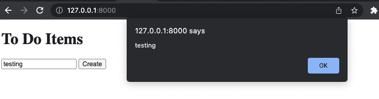
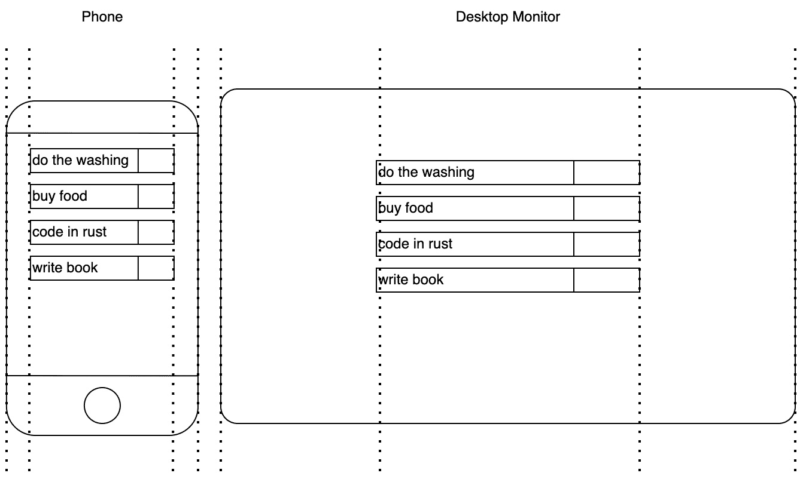
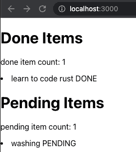

# 第五章：在浏览器中显示内容

我们现在已经到了可以构建能够管理不同方法和数据的 HTTP 请求的 Web 应用程序的阶段。这对于我们构建微服务服务器特别有用。然而，我们还想让非程序员能够与我们的应用程序交互以使用它。为了使非程序员能够使用我们的应用程序，我们必须创建一个图形用户界面。但是，必须注意的是，本章并不包含很多 Rust。这是因为其他语言存在用于渲染图形用户界面。我们将主要使用 HTML、JavaScript 和 CSS。这些工具成熟且广泛用于前端 Web 开发。虽然我个人非常喜欢 Rust（否则我不会写关于它的书），但我们必须根据需要使用合适的工具。在撰写本书时，我们可以使用 Yew 框架在 Rust 中构建前端应用程序。然而，能够将更成熟的工具融合到我们的 Rust 技术栈中是一种更有价值的技能。

本章将涵盖以下主题：

+   使用 Rust 提供 HTML、CSS 和 JavaScript

+   构建一个连接到 Rust 服务器的 React 应用程序

+   将我们的 React 应用程序转换为可在计算机上安装的桌面应用程序

在上一版（*Rust Web Programming: A hands-on guide to developing fast and secure web apps with the Rust programming language*）中，我们只是直接从 Rust 中提供前端资源。然而，由于反馈和修订，这种方法扩展性不佳，导致大量重复。直接由 Rust 提供的原始 HTML、CSS 和 JavaScript 也容易出错，因为这种方法使用的是非结构化方式，这就是为什么在第二版中，我们将涵盖 React，并提供使用 Rust 直接提供前端资源的简要介绍。到本章结束时，你将能够编写基本的图形用户界面，无需任何依赖项，并理解低依赖前端解决方案与 React 等完整前端框架之间的权衡。你不仅会了解何时使用它们，而且还能根据项目需要实施这两种方法。因此，你将能够根据需要选择合适的工具，并使用 Rust 作为后端和 JavaScript 作为前端构建端到端的产品。

# 技术要求

我们将在上一章中创建的服务器代码的基础上进行构建，该代码可以在[`github.com/PacktPublishing/Rust-Web-Programming-2nd-Edition/tree/main/chapter04/extracting_data_from_views/web_app`](https://github.com/PacktPublishing/Rust-Web-Programming-2nd-Edition/tree/main/chapter04/extracting_data_from_views/web_app)找到。

本章的代码可以在[`github.com/PacktPublishing/Rust-Web-Programming-2nd-Edition/tree/main/chapter05`](https://github.com/PacktPublishing/Rust-Web-Programming-2nd-Edition/tree/main/chapter05)找到。

我们还将使用 Node.js 来运行我们的 React 应用程序。可以通过执行 [`docs.npmjs.com/downloading-and-installing-node-js-and-npm`](https://docs.npmjs.com/downloading-and-installing-node-js-and-npm) 中概述的步骤来安装 Node 和 npm。

# 使用 Rust 服务 HTML、CSS 和 JavaScript

在上一章中，我们将所有数据以 JSON 格式返回。在本节中，我们将返回 HTML 数据供用户查看。在这份 HTML 数据中，我们将包含按钮和表单，使用户能够与我们在上一章中定义的 API 端点进行交互，以创建、编辑和删除待办事项。为此，我们需要构建自己的 `app` 视图模块，其结构如下：

```rs
views
├── app
│   ├── items.rs
│   └── mod.rs
```

## 服务基本 HTML

在我们的 `items.rs` 文件中，我们将定义显示待办事项的主要视图。然而，在我们这样做之前，我们应该探索在 `items.rs` 文件中返回 HTML 的最简单方法：

```rs
use actix_web::HttpResponse;
pub async fn items() -> HttpResponse {
    HttpResponse::Ok()
        .content_type("text/html; charset=utf-8")
        .body("<h1>Items</h1>")
}
```

在这里，我们只是返回一个具有 HTML 内容类型和 `<h1>Items</h1>` 体的 `HttpResponse` 结构。要将 `HttpResponse` 传递到应用中，我们必须在 `app/views/mod.rs` 文件中定义我们的工厂，如下所示：

```rs
use actix_web::web;
mod items;
pub fn app_views_factory(app: &mut web::ServiceConfig) {
    app.route("/", web::get().to(items::items));
}
```

在这里，我们可以看到，我们不是构建一个服务，而是仅仅为我们的应用程序定义了一个 `route`。这是因为这是着陆页。如果我们打算定义一个 `service` 而不是 `route`，则无法在没有前缀的情况下定义服务的视图。

一旦我们定义了 `app_views_factory`，我们就可以在我们的 `views/mod.rs` 文件中调用它。然而，首先，我们必须在 `views/mod.rs` 文件的顶部定义应用模块：

```rs
mod app;
```

一旦我们定义了 `app` 模块，我们就可以在同一个文件中的 `views_factory` 函数中调用应用工厂：

```rs
app::app_views_factory(app);
```

现在，我们的 HTML 服务视图已成为我们应用的一部分，我们可以运行它并在浏览器中调用主页 URL，得到以下输出：


图 5.1 – 首次渲染的 HTML 视图

我们可以看到我们的 HTML 已经渲染！通过我们在 *图 5.1* 中看到的内容，我们可以推断出我们可以在响应体中返回一个字符串，如下所示：

```rs
HttpResponse::Ok()
    .content_type("text/html; charset=utf-8")
    .body("<h1>Items</h1>")
```

如果字符串是 HTML 格式，这将渲染 HTML。从这个发现中，你认为我们如何从由我们的 Rust 服务器提供的 HTML 文件中渲染 HTML？在继续之前，考虑这个问题 – 这将锻炼你的问题解决能力。

## 从文件中读取基本 HTML

如果我们有一个 HTML 文件，我们可以通过将那个 HTML 文件准备好作为字符串并将其插入到 `HttpResponse` 的体中来实现渲染。是的，就这么简单。为了实现这一点，我们将构建一个内容加载器。

要构建一个基本的内容加载器，首先在 `views/app/content_loader.rs` 文件中构建一个读取 HTML 文件的函数：

```rs
use std::fs;
pub fn read_file(file_path: &str) -> String {
    let data: String = fs::read_to_string(
        file_path).expect("Unable to read file");
    return data
}
```

我们在这里需要做的只是返回一个字符串，因为这是我们需要的响应体。然后，我们必须在 `views/app/mod.rs` 文件中定义加载器，并在文件的顶部使用 `mod content_loader;` 行。

现在我们已经有了加载函数，我们需要一个 HTML 目录。这可以在名为 `templates` 的 `src` 目录旁边定义。在 `templates` 目录内部，我们可以添加一个名为 `templates/main.html` 的 HTML 文件，其内容如下：

```rs
<!DOCTYPE html>
<html lang="en">
    <head>
        <meta charSet="UTF-8"/>
        <meta name="viewport"
              content="width=device-width, initial-
                                           scale=1.0"/>
        <meta httpEquiv="X-UA-Compatible"
              content="ie=edge"/>
        <meta name="description"
              content="This is a simple to do app"/>
        <title>To Do App</title>
    </head>
    <body>
        <h1>To Do Items</h1>
    </body>
</html>
```

在这里，我们可以看到我们的 `body` 标签具有与我们之前展示相同的内容 – 即 `<h1>待办事项</h1>`。然后，我们有一个 `head` 标签，它定义了一系列元标签。我们可以看到我们定义了 `viewport`。这告诉浏览器如何处理页面内容的尺寸和缩放。缩放很重要，因为我们的应用程序可能被各种不同的设备和屏幕尺寸访问。使用这个视口，我们可以将页面的宽度设置为与设备屏幕相同的宽度。然后，我们可以将我们访问的页面的初始缩放设置为 `1.0`。接下来是 `httpEquiv` 标签，我们将其设置为 `X-UA-Compatible`，这意味着我们支持旧版浏览器。最后一个标签只是对页面的描述，可以被搜索引擎使用。我们的 `title` 标签确保在浏览器标签上显示 `to do app`。有了这个，我们在 `body` 中就有了标准的标题。

## 从文件中服务基本的 HTML

现在我们已经定义了我们的 HTML 文件，我们必须加载并服务它。回到我们的 `src/views/app/items.rs` 文件，我们必须加载 HTML 文件并使用以下代码来服务它：

```rs
use actix_web::HttpResponse;
use super::content_loader::read_file;
pub async fn items() -> HttpResponse {
    let html_data = read_file(
        "./templates/main.html");
    HttpResponse::Ok()
        .content_type("text/html; charset=utf-8")
        .body(html_data)
}
```

如果我们运行我们的应用程序，我们将得到以下输出：


图 5.2 – 加载 HTML 页面的视图

在 *图 5*.*2* 中，我们可以看到我们得到了与之前相同的结果。这并不令人惊讶；然而，我们必须注意到 *图 5*.*2* 中的标签现在显示为 **To Do App**，这意味着我们 HTML 文件中的元数据正在被加载到视图中。没有任何东西阻止我们充分利用 HTML 文件。现在我们的 HTML 文件正在被服务，我们可以继续我们的下一个目标，即在页面上添加功能。

## 将 JavaScript 添加到 HTML 文件中

如果用户无法对我们的待办事项状态进行任何操作，这对前端用户来说将没有用处。在我们修改之前，我们需要通过查看以下图表来了解 HTML 文件的布局：


图 5.3 – HTML 文件的一般布局

在这里，在 *图 5**.3* 中，我们可以看到我们可以在头部定义元标签。然而，我们也可以在头部定义样式标签。在头部下面的样式标签中，我们可以将 CSS 插入到样式标签中。在主体下面，还有一个脚本部分，我们可以在这里注入 JavaScript。这个 JavaScript 在浏览器中运行并与主体中的元素交互。有了这个，我们可以看到，提供带有 CSS 和 JavaScript 的 HTML 文件可以提供一个完全功能的单页应用程序前端。有了这个，我们可以反思本章的介绍。虽然我喜欢 Rust 并强烈建议你用 Rust 编写一切，但这对于软件工程中的任何语言来说都不是一个好主意。我们现在可以轻松地使用 JavaScript 提供功能性的前端视图，这使得它成为你前端需求的最佳选择。

## 使用 JavaScript 与我们的服务器进行通信

现在我们知道了在哪里将 JavaScript 插入我们的 HTML 文件中，我们可以测试我们的定位。在本节的剩余部分，我们将在 HTML 主体中创建一个按钮，将其与一个 JavaScript 函数连接起来，然后当按下该按钮时，让浏览器打印出一个带有输入信息的警告。这对我们的后端应用程序没有任何影响，但它将证明我们对 HTML 文件的了解是正确的。我们可以在我们的 `templates/main.html` 文件中添加以下代码：

```rs
<body>
    <h1>To Do Items</h1>
    <input type="text" id="name" placeholder="create to do 
         item">
    <button id="create-button" value="Send">Create</button>
</body>
<script>
    let createButton = document.getElementById("create-
        button");
    createButton.addEventListener("click", postAlert);
    function postAlert() {
        let titleInput = document.getElementById("name");
        alert(titleInput.value);
        titleInput.value = null;
    }
</script>
```

在我们的主体部分，我们可以看到我们定义了一个 `input` 和一个 `button`。我们给 `input` 和 `button` 属性分配了唯一的 ID 名称。然后，我们使用 `button` 的 ID 添加一个事件监听器。之后，我们将我们的 `postAlert` 函数绑定到该事件监听器，以便在点击 `button` 时触发。当我们调用 `postAlert` 函数时，我们通过其 ID 获取 `input` 并在警告中打印出 `input` 的值。然后，我们将 `input` 的值设置为 `null`，以便用户可以填写另一个要处理的值。在 `input` 中输入 `testing` 并点击按钮后，将产生以下输出：



图 5.4 – 当连接到 JavaScript 中的警告时点击按钮的效果

我们的 JavaScript 不必只限于在主体中让元素交互。我们还可以使用 JavaScript 对后端 Rust 应用程序执行 API 调用。然而，在我们匆忙编写整个应用程序到`main.html`文件之前，我们必须停下来思考。如果我们那样做，`main.html`文件会膨胀成一个巨大的文件。这将很难调试。此外，这可能导致代码重复。如果我们想在其他视图中使用相同的 JavaScript 呢？我们就必须将其复制粘贴到另一个 HTML 文件中。这不会很好地扩展，如果我们需要更新一个函数，我们可能会忘记更新一些重复的函数。这就是 JavaScript 框架（如 React）派上用场的地方。我们将在本章后面探索 React，但现在，我们将通过找到一种方法来分离我们的 JavaScript 和 HTML 文件，来完成我们的低依赖性前端。

必须警告的是，我们实际上是在实时手动重写 HTML，使用 JavaScript。人们可能会将这描述为一种“黑客式”解决方案。然而，在探索 React 之前，了解我们的方法非常重要，这样我们才能真正欣赏不同方法的好处。在我们进入下一部分之前，我们确实需要对`src/views/to_do/create.rs`文件中的`create`视图进行重构。这是一个回顾我们在前几章所开发内容的好机会。你必须基本上将`create`视图转换为返回当前待办事项的状态，而不是一个字符串。一旦你尝试了这一点，解决方案应该如下所示：

```rs
use actix_web::HttpResponse;
use serde_json::Value;
use serde_json::Map;
use actix_web::HttpRequest;
use crate::to_do::{to_do_factory, enums::TaskStatus};
use crate::json_serialization::to_do_items::ToDoItems;
use crate::state::read_file;
use crate::processes::process_input;
pub async fn create(req: HttpRequest) -> HttpResponse {
    let state: Map<String, Value> = 
        read_file("./state.json");
    let title: String = req.match_info().get("title"
    ).unwrap().to_string();
    let item = to_do_factory(&title.as_str(), 
        TaskStatus::PENDING);
    process_input(item, "create".to_string(), &state);
    return HttpResponse::Ok().json(ToDoItems::get_state())
}
```

现在，所有我们的待办事项都已更新并正常工作。我们现在可以进入下一部分，我们将让前端调用我们的后端。

# 将 JavaScript 注入 HTML

一旦我们完成这一部分，我们将拥有一个不太美观但功能齐全的主视图，我们可以使用 JavaScript 调用我们的 Rust 服务器来添加、编辑和删除待办事项。然而，如您所回忆的那样，我们没有添加`delete` API 端点。为了将 JavaScript 注入我们的 HTML，我们必须执行以下步骤：

1.  创建一个`delete`项目 API 端点。

1.  添加一个`JavaScript 加载`函数，并用加载的 JavaScript 数据替换 HTML 数据中的 JavaScript 标签。

1.  在 HTML 文件中添加一个 JavaScript 标签，并为 HTML 组件添加 ID，这样我们就可以在 JavaScript 中引用这些组件。

1.  为我们的待办事项在 JavaScript 中构建一个`渲染`函数，并通过 ID 将其绑定到 HTML 上。

1.  在 JavaScript 中构建一个`API 调用`函数，以便与后端通信。

1.  为我们的按钮构建`get`、`delete`、`edit`和`create`函数。

让我们详细看看这一点。

## 添加删除端点

添加`delete` API 端点现在应该很简单。如果你想的话，建议你自己尝试实现这个视图，因为你现在应该对这个过程感到很舒服：

1.  如果你感到困难，我们可以通过将以下第三方依赖项导入到 `views/to_do/delete.rs` 文件中来实现这一点：

    ```rs
    use actix_web::{web, HttpResponse};
    ```

    ```rs
    use serde_json::value::Value;
    ```

    ```rs
    use serde_json::Map;
    ```

这些都不是新的，你应该熟悉它们，并知道我们需要在哪里使用它们。

1.  然后，我们必须使用以下代码导入我们的结构和函数：

    ```rs
    use crate::to_do::{to_do_factory, enums::TaskStatus};
    ```

    ```rs
    use crate::json_serialization::{to_do_item::ToDoItem, 
    ```

    ```rs
        to_do_items::ToDoItems};
    ```

    ```rs
    use crate::processes::process_input;
    ```

    ```rs
    use crate::jwt::JwToken;
    ```

    ```rs
    use crate::state::read_file;
    ```

在这里，我们可以看到我们正在使用我们的 `to_do` 模块来构建我们的待办事项。通过我们的 `json_serialization` 模块，我们可以看到我们正在接受 `ToDoItem` 并返回 `ToDoItems`。然后，我们使用 `process_input` 函数执行项目的删除。我们也不希望任何可以访问我们页面的用户删除我们的项目。因此，我们需要我们的 `JwToken` 结构体。最后，我们使用 `read_file` 函数读取我们项目的状态。

1.  现在我们已经拥有了所有需要的东西，我们可以使用以下代码定义我们的 `delete` 视图：

    ```rs
    pub async fn delete(to_do_item: web::Json<ToDoItem>, 
    ```

    ```rs
        token: JwToken) -> HttpResponse {
    ```

    ```rs
        . . .
    ```

    ```rs
    }
    ```

在这里，我们可以看到我们接受了 `ToDoItem` 作为 JSON，并且我们为视图附加了 `JwToken`，这样用户必须经过授权才能访问它。到目前为止，我们只有 `JwToken` 附加了一个消息；我们将在 *第七章*，*管理用户会话* 中管理 `JwToken` 的认证逻辑。

1.  在我们的 `delete` 视图中，我们可以通过以下代码读取我们的 JSON 文件来获取我们的待办事项的状态：

    ```rs
    let state: Map<String, Value> = read_file("./state.json");
    ```

1.  然后，我们可以检查具有此标题的项目是否在状态中。如果不是，则返回一个未找到的 HTTP 响应。如果是，我们则传递状态，因为我们需要标题和状态来构建项目。我们可以通过以下代码进行此检查和状态提取：

    ```rs
    let status: TaskStatus;
    ```

    ```rs
    match &state.get(&to_do_item.title) {
    ```

    ```rs
        Some(result) => {
    ```

    ```rs
            status = TaskStatus::from_string
    ```

    ```rs
                     (result.as_str().unwrap().to_string()                 );
    ```

    ```rs
        }
    ```

    ```rs
        None=> {
    ```

    ```rs
            return HttpResponse::NotFound().json(
    ```

    ```rs
                format!("{} not in state", 
    ```

    ```rs
                         &to_do_item.title))
    ```

    ```rs
        }
    ```

    ```rs
    }
    ```

1.  现在我们已经获得了待办事项的状态和标题，我们可以构建我们的项目并通过我们的 `process_input` 函数传递一个 `delete` 命令。这将从 JSON 文件中删除我们的项目：

    ```rs
    let existing_item = to_do_factory(to_do_item.title.as_    str(),
    ```

    ```rs
        status.clone());
    ```

    ```rs
    process_input(existing_item, "delete".    to_owned(), 
    ```

    ```rs
        &state);
    ```

1.  记住，我们为我们的 `ToDoItems` 结构体实现了 `Responder` 特性，并且我们的 `ToDoItems::get_state()` 函数返回一个用 JSON 文件中的条目填充的 `ToDoItems` 结构体。因此，我们可以从我们的 `delete` 视图中得到以下返回语句：

    ```rs
    return HttpResponse::Ok().json(ToDoItems::get_state())
    ```

1.  现在，我们的 `delete` 视图已经定义好了，我们可以将其添加到我们的 `src/views/to_do/mod.rs` 文件中，从而得到如下所示的观点工厂：

    ```rs
    mod create;
    ```

    ```rs
    mod get;
    ```

    ```rs
    mod edit;
    ```

    ```rs
    mod delete;
    ```

    ```rs
    use actix_web::web::{ServiceConfig, post, get, scope};
    ```

    ```rs
    pub fn to_do_views_factory(app: &mut ServiceConfig) {
    ```

    ```rs
        app.service(
    ```

    ```rs
            scope("v1/item")
    ```

    ```rs
            .route("create/{title}", 
    ```

    ```rs
                    post().to(create::create))
    ```

    ```rs
            .route("get", get().to(get::get))
    ```

    ```rs
            .route("edit", post().to(edit::edit))
    ```

    ```rs
            .route("delete", post().to(delete::delete))
    ```

    ```rs
        );
    ```

    ```rs
    }
    ```

1.  通过快速检查 `to_do_views_factory`，我们可以看到我们拥有管理我们的待办事项所需的所有视图。如果我们将这个模块从我们的应用程序中移除并插入到另一个中，我们会立即看到我们正在删除和添加的内容。

我们的 `delete` 视图已经完全集成到我们的应用程序中，我们可以继续进行第二步，即构建我们的 JavaScript 加载功能。

## 添加 JavaScript 加载函数

现在我们所有的端点都已经准备好了，我们必须重新审视我们的主应用视图。在上一个部分中，我们确定了 `<script>` 部分的 JavaScript 即使它只是一个大字符串的一部分也能正常工作。为了使我们能够将我们的 JavaScript 放入一个单独的文件中，我们的视图将加载一个包含 `<script>` 部分中有 `{{JAVASCRIPT}}` 标签的 HTML 文件作为字符串。然后，我们将加载 JavaScript 文件作为字符串，并用 JavaScript 文件中的字符串替换 `{{JAVASCRIPT}}` 标签。最后，我们在 `views/app/items.rs` 文件中的 body 中返回完整的字符串：

```rs
pub async fn items() -> HttpResponse {
    let mut html_data = read_file(
        "./templates/main.html");
    let javascript_data = read_file(
        "./javascript/main.js");
    html_data = html_data.replace("{{JAVASCRIPT}}", 
        &javascript_data);
    HttpResponse::Ok()
        .content_type("text/html; charset=utf-8")
        .body(html_data)
}
```

## 在 HTML 中添加 JavaScript 标签

从我们上一步的 `items` 函数中，我们可以看到我们需要在根目录下构建一个新的目录，名为 `JavaScript`。我们还必须在其中创建一个名为 `main.js` 的文件。随着我们对应用视图的此更改，我们还需要更改 `templates/main.html` 文件，并添加以下代码：

```rs
<body>
    <h1>Done Items</h1>
    <div id="doneItems"></div>
    <h1>To Do Items</h1>
    <div id="pendingItems"></div>
    <input type="text" id="name" placeholder="create to do
     item">
    <button id="create-button" value="Send">Create</button>
</body>
<script>
    {{JAVASCRIPT}}
</script>
```

请记住，我们的端点返回待办事项和已完成事项。因此，我们为这两个列表分别定义了各自的标题。ID 为 `"doneItems"` 的 `div` 是我们将从 API 调用中插入已完成待办事项的地方。

然后，我们将从 API 调用中插入我们的待办事项到 ID 为 `"pendingItems"` 的 `div` 中。之后，我们必须定义一个带有文本和按钮的输入。这将用于用户创建新的项目。

## 构建渲染 JavaScript 函数

现在我们已经定义了 HTML，我们将在 `javascript/main.js` 文件中定义逻辑：

1.  我们将要构建的第一个函数将渲染我们主页上的所有待办事项。必须注意的是，这是 `javascript/main.js` 文件中代码最复杂的一部分。我们实际上正在编写 JavaScript 代码来编写 HTML 代码。稍后，在 *创建 React 应用* 部分，我们将使用 React 框架来替换这一需求。现在，我们将构建一个渲染函数来创建一个项目列表。每个项目在 HTML 中的形式如下：

    ```rs
    <div>
    ```

    ```rs
        <div>
    ```

    ```rs
            <p>learn to code rust</p>
    ```

    ```rs
            <button id="edit-learn-to-code-rust">
    ```

    ```rs
                edit
    ```

    ```rs
            </button>
    ```

    ```rs
        </div>
    ```

    ```rs
    </div>
    ```

我们可以看到待办事项的标题嵌套在一个段落 HTML 标签中。然后，我们有一个按钮。请记住，HTML 标签的 `id` 属性必须是唯一的。因此，我们根据按钮将要执行的操作和待办事项的标题来构建这个 ID。这将使我们能够通过事件监听器将这些 `id` 属性绑定到执行 API 调用的函数上。

1.  要构建我们的渲染函数，我们必须传递要渲染的项目、将要执行的处理类型（即 `edit` 或 `delete`）、在 HTML 中将要渲染这些项目的部分元素 ID，以及我们将绑定到每个待办事项按钮上的函数。此函数的轮廓在以下代码中定义：

    ```rs
    function renderItems(items, processType, 
    ```

    ```rs
        elementId, processFunction) {
    ```

    ```rs
     . . .
    ```

    ```rs
    }
    ```

1.  在我们的 `renderItems` 函数内部，我们可以从构造 HTML 并使用以下代码遍历我们的待办事项开始：

    ```rs
    let itemsMeta = [];
    ```

    ```rs
    let placeholder = "<div>"
    ```

    ```rs
    for (let i = 0; i < items.length; i++) {
    ```

    ```rs
        . . .
    ```

    ```rs
    }
    ```

    ```rs
    placeholder += "</div>"
    ```

    ```rs
    document.getElementById(elementId).innerHTML = 
    ```

    ```rs
        placeholder;
    ```

在这里，我们定义了一个数组，它将收集我们为每个待办事项生成的待办事项 HTML 的元数据。这是在`itemsMeta`变量下，将在`renderItems`函数中稍后使用，以使用事件监听器将`processFunction`绑定到每个待办事项按钮。然后，我们在`placeholder`变量下定义了包含所有待办事项的 HTML。在这里，我们从一个`div`标签开始。然后，我们遍历项目，将每个项目的数据转换为 HTML，然后用关闭的`div`标签结束 HTML。之后，我们将构建的 HTML 字符串`placeholder`插入到`innerHTML`中。`innerHTML`在页面上的位置就是我们想要看到我们构建的待办事项的地方。

1.  在循环内部，我们必须使用以下代码构建单个待办事项 HTML：

    ```rs
    let title = items[i]["title"];
    ```

    ```rs
    let placeholderId = processType +
    ```

    ```rs
    "-" + title.replaceAll(" ", "-");
    ```

    ```rs
    placeholder += "<div>" + title +
    ```

    ```rs
    "<button " + 'id="' + placeholderId + '">'
    ```

    ```rs
    + processType +
    ```

    ```rs
    '</button>' + "</div>";
    ```

    ```rs
    itemsMeta.push({"id": placeholderId, "title": title});
    ```

在这里，我们从正在遍历的项目中提取项目的标题。然后，我们定义我们将要用于绑定事件监听器的项目 ID。注意，我们用`-`替换了所有空格。现在我们已经定义了标题和 ID，我们在`placeholder`HTML 字符串中添加了一个带有标题的`div`。我们还添加了一个带有`placeholderId`的`button`，然后用`div`结束。我们可以看到我们的 HTML 字符串添加以`;`结束。然后，我们将`placeholderId`和`title`添加到`itemsMeta`数组中，以备后用。

1.  接下来，我们遍历`itemsMeta`，使用以下代码创建事件监听器：

    ```rs
        . . .
    ```

    ```rs
        placeholder += "</div>"
    ```

    ```rs
        document.getElementById(elementId).innerHTML 
    ```

    ```rs
        = placeholder;
    ```

    ```rs
        for (let i = 0; i < itemsMeta.length; i++) {
    ```

    ```rs
            document.getElementById(
    ```

    ```rs
                itemsMeta[i]["id"]).addEventListener(
    ```

    ```rs
                "click", processFunction);
    ```

    ```rs
        }
    ```

    ```rs
    }
    ```

现在，如果点击了我们创建在待办事项旁边的按钮，`processFunction`将被触发。我们的函数现在可以渲染项目，但我们需要通过 API 调用函数从我们的后端获取它们。我们现在将看看这一点。

## 构建 API 调用 JavaScript 函数

现在我们有了我们的渲染函数，我们可以看看我们的 API 调用函数：

1.  首先，我们必须在`javascript/main.js`文件中定义我们的 API 调用函数。这个函数接受一个 URL，这是 API 调用的端点。它还接受一个方法，这是一个字符串，可以是`POST`、`GET`或`PUT`。然后，我们必须定义我们的请求对象：

    ```rs
    function apiCall(url, method) {
    ```

    ```rs
        let xhr = new XMLHttpRequest();
    ```

    ```rs
        xhr.withCredentials = true;
    ```

1.  然后，我们必须在`apiCall`函数内部定义事件监听器，该监听器在调用完成后渲染返回的 JSON 格式的待办事项：

    ```rs
    xhr.addEventListener('readystatechange', function() {
    ```

    ```rs
        if (this.readyState === this.DONE) {
    ```

    ```rs
            renderItems(JSON.parse(
    ```

    ```rs
            this.responseText)["pending_items"], 
    ```

    ```rs
            "edit", "pendingItems", editItem);
    ```

    ```rs
            renderItems(JSON.parse(this.responseText)
    ```

    ```rs
                ["done_items"],
    ```

    ```rs
            "delete", "doneItems", deleteItem);
    ```

    ```rs
        }
    ```

    ```rs
    });
    ```

在这里，我们可以看到我们正在传递在`templates/main.html`文件中定义的 ID。我们还传递了 API 调用的响应。我们还可以看到我们传递了`editItem`函数，这意味着当点击一个悬而未决的项目旁边的按钮时，我们将触发一个`edit`函数，将项目转换为已完成项目。考虑到这一点，如果一个已完成项目的按钮被点击，将触发`deleteItem`函数。目前，我们将继续构建`apiCall`函数。

1.  在此之后，我们必须构建`editItem`和`deleteItem`函数。我们还知道每次调用`apiCall`函数时，项目都会被渲染。

现在我们已经定义了事件监听器，我们必须准备 API 调用对象的方法和 URL，定义头信息，然后返回请求对象，以便我们可以在需要时发送它：

```rs
    xhr.open(method, url);
    xhr.setRequestHeader('content-type', 
        'application/json');
    xhr.setRequestHeader('user-token', 'token');
    return xhr
}
```

现在，我们可以使用我们的`apiCall`函数对应用程序的后端进行调用，并在 API 调用后重新渲染带有新项目状态的客户端。有了这个，我们可以继续到最后一步，在那里我们将定义执行创建、获取、删除和编辑待办事项功能的函数。

## 为按钮构建 JavaScript 函数

注意，标题只是硬编码在后端中的已接受令牌。我们将在*第七章*中介绍如何正确定义认证头，*管理用户会话*。现在，我们的 API 调用函数已经定义，我们可以继续到`editItem`函数：

```rs
function editItem() {
    let title = this.id.replaceAll("-", " ")
        .replace("edit ", "");
    let call = apiCall("/v1/item/edit", "POST");
    let json = {
        "title": title,
        "status": "DONE"
    };
    call.send(JSON.stringify(json));
}
```

在这里，我们可以看到事件监听器所属的 HTML 部分可以通过`this`来访问。我们知道，如果我们移除`edit`这个词，并将`-`替换为空格，它将把待办事项的 ID 转换为待办事项的标题。然后，我们利用`apiCall`函数来定义我们的端点和方法。请注意，在`replace`函数中的`"edit "`字符串中有一个空格。我们之所以有这个空格，是因为我们必须移除编辑字符串后面的空格。如果我们不移除那个空格，它将被发送到后端，由于我们的应用程序后端在 JSON 文件中项目的标题旁边不会有空格，这将会导致错误。一旦我们的端点和 API 调用方法被定义，我们将标题传递到一个状态为完成的字典中。这是因为我们知道我们正在将待办事项从待办状态切换到完成状态。一旦完成这个操作，我们就发送带有 JSON 主体的 API 调用。

现在，我们可以使用相同的方法为`deleteItem`函数：

```rs
function deleteItem() {
    let title = this.id.replaceAll("-", " ")
        .replace("delete ", "");
    let call = apiCall("/v1/item/delete", "POST");
    let json = {
        "title": title,
        "status": "DONE"
    };
    call.send(JSON.stringify(json));
}
```

再次强调，在`replace`函数中的`"delete "`字符串中有一个空格。有了这个，我们的渲染过程就完全处理完毕了。我们已经定义了编辑和删除函数以及渲染函数。现在，我们必须在页面初始加载时加载项目，而无需点击任何按钮。这可以通过一个简单的 API 调用来完成：

```rs
function getItems() {
    let call = apiCall("/v1/item/get", 'GET');
    call.send()
}
getItems();
```

在这里，我们可以看到我们只是使用`GET`方法进行 API 调用并发送它。同时，请注意，我们的`getItems`函数是在函数外部被调用的。这将在视图加载时触发一次。

编码已经持续了一段时间；然而，我们几乎完成了。我们只需要定义创建文本输入和按钮的功能。我们可以通过一个简单的事件监听器和`create`端点的 API 调用来管理这个：

```rs
document.getElementById("create-button")
        .addEventListener("click", createItem);
function createItem() {
    let title = document.getElementById("name");
    let call = apiCall("/v1/item/create/" + 
        title.value, "POST");
    call.send();
    document.getElementById("name").value = null;
}
```

我们还添加了将文本输入值设置为`null`的细节。我们将`input`设置为`null`，这样用户就可以输入另一个要创建的项目，而无需删除刚刚创建的旧项目标题。点击应用程序的主视图会给我们以下输出：


图 5.5 – 渲染后的待办事项主页面

现在，为了检查我们的前端是否按预期工作，我们可以执行以下步骤：

1.  按下 **washing** 已完成项目旁边的 **删除** 按钮。

1.  输入 `eat cereal for breakfast` 并点击 **创建**。

1.  输入 `eat ramen for breakfast` 并点击 **创建**。

1.  点击 `eat ramen for` `breakfast` 项目。

这些步骤应该产生以下结果：


图 5.6 – 完成上述步骤后的主页面

这样，我们就拥有了一个完全功能性的网络应用程序。所有按钮都正常工作，列表会立即更新。然而，它看起来并不美观。没有间距，一切都是黑白相间的。为了修正这个问题，我们需要将 CSS 集成到 HTML 文件中，我们将在下一节中这样做。

# 将 CSS 注入到 HTML 中

注入 CSS 与注入 JavaScript 的方法相同。我们将在 HTML 文件中有一个 CSS 标签，它将被文件中的 CSS 替换。为了实现这一点，我们必须执行以下步骤：

1.  将 CSS 标签添加到我们的 HTML 文件中。

1.  为整个应用程序创建一个基础 CSS 文件。

1.  为我们的主视图创建一个 CSS 文件。

1.  更新我们的 Rust 包以提供 CSS 和 JavaScript。

让我们更仔细地看看这个过程。

## 将 CSS 标签添加到 HTML 中

首先，让我们对我们的 `templates/main.html` 文件做一些更改：

```rs
 <style>
    {{BASE_CSS}}
    {{CSS}}
</style>
<body>
    <div class="mainContainer">
        <h1>Done Items</h1>
        <div id="doneItems"></div>
        <h1>To Do Items</h1>
        <div id="pendingItems"></div>
        <div class="inputContainer">
            <input type="text" id="name"
                   placeholder="create to do item">
            <div class="actionButton" 
                 id="create-button" 
                 value="Send">Create</div>
        </div>
    </div>
</body>
<script>
    {{JAVASCRIPT}}
</script>
```

在这里，我们可以看到我们有两个 CSS 标签。`{{BASE_CSS}}` 标签用于基础 CSS，它将在多个不同的视图中保持一致，例如背景颜色和列比例，这取决于屏幕大小。`{{BASE_CSS}}` 标签用于管理此视图的 CSS 类。尊敬地，`css/base.css` 和 `css/main.css` 文件是为我们的视图制作的。此外，请注意，我们将所有项目都放在了一个名为 `mainContainer` 的 `div` 中。这将使我们能够将所有项目居中显示在屏幕上。我们还添加了一些额外的类，以便 CSS 可以引用它们，并将创建项目的按钮从 `button` HTML 标签更改为 `div` HTML 标签。一旦完成这些，我们的 `javascript/main.js` 文件中的 `renderItems` 函数的循环将会有以下更改：

```rs
function renderItems(items, processType, 
    elementId, processFunction) {
    . . . 
    for (i = 0; i < items.length; i++) {
        . . .
        placeholder += '<div class="itemContainer">' +
            '<p>' + title + '</p>' +
            '<div class="actionButton" ' + 
                  'id="' + placeholderId + '">'
            + processType + '</div>' + "</div>";
        itemsMeta.push({"id": placeholderId, "title":        title});
    }
    . . .
}
```

考虑到这一点，我们现在可以在 `css/base.css` 文件中定义我们的基础 CSS。

## 创建基础 CSS

现在，我们必须定义页面及其组件的样式。一个不错的开始是在 `css/base.css` 文件中定义页面的主体。我们可以使用以下代码对主体进行基本配置：

```rs
body {
    background-color: #92a8d1;
    font-family: Arial, Helvetica, sans-serif;
    height: 100vh;
} 
```

背景颜色是对一种颜色的引用。仅从外观上看，这种引用可能似乎没有意义，但在线上有很多颜色选择器，您可以在其中查看并选择颜色，并且会提供参考代码。一些代码编辑器支持此功能，但为了快速参考，只需在 Google 上搜索`HTML 颜色选择器`，您就会在可用的免费在线交互式工具数量上感到眼花缭乱。根据前面的配置，整个页面的背景将有一个代码为`#92a8d1`，这是一种海军蓝的颜色。如果我们只有这个颜色，页面的大部分区域将会有白色背景。海军蓝背景只会出现在有内容的地方。我们将高度设置为`100vh`。`vh`是相对于视口高度的 1%。据此，我们可以推断出`100vh`意味着在`body`中定义的样式占据了视口的 100%。然后，我们定义所有文本的字体，除非被覆盖为`Arial`、`Helvetica`或`sans-serif`。我们可以看到我们在`font-family`中定义了多个字体。这并不意味着它们都被实现，或者不同级别的标题或 HTML 标签有不同的字体。相反，这是一个后备机制。首先，浏览器会尝试渲染`Arial`；如果浏览器不支持，它将尝试渲染`Helvetica`，如果这也失败了，它将尝试渲染`sans-serif`。

这样，我们已经为我们的`body`定义了通用样式，但关于不同屏幕尺寸呢？例如，如果我们打算在手机上访问我们的应用程序，它应该有不同的尺寸。我们可以在以下图中看到这一点：



图 5.7 – 手机和桌面显示器之间的边距差异

*图 5**.7*显示了边距与待办事项列表填充空间的比率。在手机上，屏幕空间不多，所以大部分屏幕需要被待办事项占据；否则，我们就无法阅读它。然而，如果我们使用宽屏桌面显示器，我们就不再需要大部分屏幕来显示待办事项。如果比率相同，待办事项在*X*轴上会被拉伸得很难阅读，而且坦白地说，看起来也不会很好。这就是媒体查询发挥作用的地方。我们可以根据窗口的宽度和高度等属性设置不同的样式条件。我们将从手机规格开始。因此，如果屏幕宽度不超过 500 像素，在我们的`css/base.css`文件中，我们必须为我们的`body`定义以下 CSS 配置：

```rs
@media(max-width: 500px) {
    body {
        padding: 1px;
        display: grid;
        grid-template-columns: 1fr;
    }
}
```

在这里，我们可以看到页面边缘和每个元素的填充仅为一个像素。我们还有一个网格显示。这是我们可以定义列和行的位置。然而，我们没有充分利用它。我们只有一个列。这意味着我们的待办事项将占据大部分屏幕，如 *图 5**.7* 所示。尽管在这个上下文中我们没有使用网格，但我保留了它，以便你可以看到这与更大屏幕的其他配置之间的关系。如果我们的屏幕稍微大一点，我们可以将页面分成三个不同的垂直列；然而，中间列的宽度与两侧列的宽度之比为 5:1。这是因为我们的屏幕仍然不大，我们希望项目仍然占据大部分屏幕。我们可以通过添加另一个具有不同参数的媒体查询来调整这一点：

```rs
@media(min-width: 501px) and (max-width: 550px) {
    body {
        padding: 1px;
        display: grid;
        grid-template-columns: 1fr 5fr 1fr;
    } 
    .mainContainer {
        grid-column-start: 2;
    }
}
```

我们还可以看到，对于我们的 `mainContainer` CSS 类，其中包含我们的待办事项，我们将覆盖 `grid-column-start` 属性。如果我们不这样做，那么 `mainContainer` 将在 `1fr` 宽度的左侧边距中挤压。相反，我们是从中间开始和结束，在 `5fr`。我们可以使用 `grid-column-finish` 属性使 `mainContainer` 横跨多个列。

如果我们的屏幕变大，我们希望调整比例，因为我们不希望项目宽度失控。为了实现这一点，我们必须定义中间列与两侧列的 3:1 比率，然后在屏幕宽度高于 `1001px` 时，定义 1:1 比率：

```rs
@media(min-width: 551px) and (max-width: 1000px) {
    body {
        padding: 1px;
        display: grid;
        grid-template-columns: 1fr 3fr 1fr;
    } 
    .mainContainer {
        grid-column-start: 2;
    }
} 
@media(min-width: 1001px) {
    body {
        padding: 1px;
        display: grid;
        grid-template-columns: 1fr 1fr 1fr;
    } 
    .mainContainer {
        grid-column-start: 2;
    }
}
```

现在我们已经为所有视图定义了我们的通用 CSS，我们可以继续在 `css/main.css` 文件中定义我们的视图特定 CSS。

## 创建主页的 CSS

现在，我们必须分解我们的应用程序组件。我们有一个待办事项列表。列表中的每个项目都将是一个具有不同背景颜色的 `div`：

```rs
.itemContainer {
    background: #034f84;
    margin: 0.3rem;
}
```

我们可以看到这个类有一个 0.3 的边距。我们使用 `rem` 是因为我们希望边距相对于根元素的字体大小进行缩放。我们还希望当我们的光标悬停在项目上时，项目颜色略有变化：

```rs
.itemContainer:hover {
    background: #034f99;
}
```

在项目容器内部，我们使用段落标签表示项目标题。我们希望定义项目容器中所有段落的样式，但不是其他地方的样式。我们可以使用以下代码在容器中定义段落的样式：

```rs
.itemContainer p {
    color: white;
    display: inline-block;
    margin: 0.5rem;
    margin-right: 0.4rem;
    margin-left: 0.4rem;
}
```

`inline-block` 允许标题与 `div` 并排显示，而 `div` 将作为项目的按钮。边距定义仅阻止标题紧挨着项目容器的边缘。我们还确保段落颜色为白色。

在项目标题样式化后，剩下的唯一项目样式就是操作按钮，它可以是 `edit` 或 `delete`。这个操作按钮将向右浮动，并具有不同的背景颜色，以便我们知道点击的位置。为此，我们必须使用类定义我们的按钮样式，如下面的代码所示：

```rs
.actionButton {
    display: inline-block;
    float: right;
    background: #f7786b;
    border: none;
    padding: 0.5rem;
    padding-left: 2rem;
    padding-right: 2rem;
    color: white;
}
```

在这里，我们定义了显示方式，将其浮动到右边，并定义了背景颜色和填充。有了这个，我们可以通过运行以下代码来确保在悬停时颜色发生变化：

```rs
.actionButton:hover {
    background: #f7686b;
    color: black;
}
```

现在我们已经涵盖了所有概念，我们必须为输入容器定义样式。这可以通过运行以下代码来完成：

```rs
.inputContainer {
    background: #034f84;
    margin: 0.3rem;
    margin-top: 2rem;
}
.inputContainer input {
    display: inline-block;
    margin: 0.4rem;
}
```

我们做到了！我们已经定义了所有的 CSS、JavaScript 和 HTML。在我们运行应用程序之前，我们需要在主视图中加载数据。

## 从 Rust 中提供 CSS 和 JavaScript

我们在 `views/app/items.rs` 文件中提供我们的 CSS。我们通过读取 HTML、JavaScript、基础 CSS 和主要 CSS 文件来实现这一点。然后，我们将 HTML 数据中的标签替换为其他文件中的数据：

```rs
pub async fn items() -> HttpResponse {
    let mut html_data = read_file(
        "./templates/main.html");
    let javascript_data: String = read_file(
        "./javascript/main.js");
    let css_data: String = read_file(
        "./css/main.css");
    let base_css_data: String = read_file(
        "./css/base.css");
    html_data = html_data.replace("{{JAVASCRIPT}}", 
    &javascript_data);
    html_data = html_data.replace("{{CSS}}", 
    &css_data);
    html_data = html_data.replace("{{BASE_CSS}}", 
    &base_css_data);
    HttpResponse::Ok()
        .content_type("text/html; charset=utf-8")
        .body(html_data)
}
```

现在，当我们启动我们的服务器时，我们将拥有一个完全运行的、具有直观前端的应用程序，其外观将如以下截图所示：


图 5.8 – CSS 后的主页

尽管我们的应用程序正在运行，并且我们已经配置了基础 CSS 和 HTML，但我们可能想要有可重用的独立 HTML 结构，这些结构有自己的 CSS。这些结构可以根据需要注入到视图中。这样做给我们提供了编写组件一次，然后将其导入到其他 HTML 文件中的能力。这反过来又使得维护更容易，并确保组件在多个视图中的一致性。例如，如果我们创建了一个视图顶部的信息栏，我们希望它在其他视图中也有相同的样式。因此，将信息栏作为组件一次性创建并插入到其他视图中是有意义的，正如下一节所涵盖的。

# 组件继承

有时，我们可能想要构建一个可以注入到视图中的组件。为此，我们必须加载 CSS 和 HTML，然后将它们插入到 HTML 的正确部分。

要做到这一点，我们可以创建一个 `add_component` 函数，该函数接受组件名称，从组件名称创建标签，并根据组件名称加载 HTML 和 CSS。我们将在 `views/app/content_loader.rs` 文件中定义这个函数：

```rs
pub fn add_component(component_tag: String, 
    html_data: String) -> String {
    let css_tag: String = component_tag.to_uppercase() + 
        "_CSS";
    let html_tag: String = component_tag.to_uppercase() + 
        "_HTML";
    let css_path = String::from("./templates/components/") 
        + &component_tag.to_lowercase() + ".css";
    let css_loaded = read_file(&css_path);
    let html_path = String::from("./templates/components/") 
        + &component_tag.to_lowercase() + ".html";
    let html_loaded = read_file(&html_path);
    let html_data = html_data.replace(html_tag.as_str(), 
        &html_loaded);
    let html_data = html_data.replace(css_tag.as_str(), 
        &css_loaded);
    return html_data
} 
```

在这里，我们使用在同一个文件中定义的 `read_file` 函数。然后，我们将组件 HTML 和 CSS 注入到视图数据中。注意，我们将组件嵌套在 `templates/components/` 目录中。对于这个实例，我们正在插入一个 `header` 组件，所以当我们将 `header` 传递给 `add_component` 函数时，我们的 `add_component` 函数将尝试加载 `header.html` 和 `header.css` 文件。在我们的 `templates/components/header.html` 文件中，我们必须定义以下 HTML：

```rs
<div class="header">
    <p>complete tasks: </p><p id="completeNum"></p>
    <p>pending tasks: </p><p id="pendingNum"></p>
</div>
```

在这里，我们只是显示已完成和待办事项的数量。在我们的 `templates/components/header.css` 文件中，我们必须定义以下 CSS：

```rs
.header {
    background: #034f84;
    margin-bottom: 0.3rem;
}
.header p {
    color: white;
    display: inline-block;
    margin: 0.5rem;
    margin-right: 0.4rem;
    margin-left: 0.4rem;
}
```

为了使我们的 `add_component` 函数能够将 CSS 和 HTML 插入到正确的位置，我们必须将 `HEADER` 标签插入到 `templates/main.html` 文件的 `<style>` 部分中：

```rs
. . . 
    <style>
        {{BASE_CSS}}
        {{CSS}}
        HEADER_CSS
    </style>
    <body>
        <div class="mainContainer">
            HEADER_HTML
            <h1>Done Items</h1>
. . .
```

现在我们已经定义了所有的 HTML 和 CSS，我们需要在我们的 `views/app/items.rs` 文件中导入 `add_component` 函数：

```rs
use super::content_loader::add_component;
```

在同一文件中，我们必须在 `items` 视图函数中添加标题，如下所示：

```rs
html_data = add_component(String::from("header"), 
    html_data);
```

现在，我们必须修改 `injecting_header/javascript/main.js` 文件中的 `apiCall` 函数，以确保标题更新为待办事项项的数量：

```rs
document.getElementById("completeNum").innerHTML = 
    JSON.parse(this.responseText)["done_item_count"];
document.getElementById("pendingNum").innerHTML = 
    JSON.parse(this.responseText)["pending_item_count"]; 
```

现在我们已经插入了我们的组件，我们得到以下渲染视图：


图 5.9 – 带有标题的主页

如我们所见，我们的标题正确地显示了数据。如果我们将标题标签添加到视图 HTML 文件中，并在我们的视图中调用 `add_component`，我们就会得到那个标题。

目前，我们有一个完全工作的单页应用程序。然而，这并非没有困难。我们可以看到，如果我们开始在前端添加更多功能，我们的前端将会开始失去控制。这就是像 React 这样的框架发挥作用的地方。使用 React，我们可以将我们的代码结构化为适当的组件，这样我们就可以在需要时使用它们。在下一节中，我们将创建一个基本的 React 应用程序。

# 创建一个 React 应用程序

React 是一个独立的应用程序。正因为如此，我们通常会将我们的 React 应用程序放在自己的 GitHub 仓库中。如果您想将 Rust 应用程序和 React 应用程序放在同一个 GitHub 仓库中，那也是可以的，但请确保它们在根目录下的不同目录中。一旦我们离开了 Rust 网络应用程序，我们就可以运行以下命令：

```rs
npx create-react-app front_end
```

这将在 `front_end` 目录中创建一个 React 应用程序。如果我们查看内部，我们会看到很多文件。请记住，这本书是关于 Rust 的网络编程。探索 React 的所有内容超出了本书的范围。然而，在 *进一步阅读* 部分建议了一本专门介绍 React 开发的书籍。现在，我们将专注于 `front_end/package.json` 文件。我们的 `package.json` 文件就像我们的 `Cargo.toml` 文件一样，我们在其中定义了依赖项、脚本以及围绕我们正在构建的应用程序的其他元数据。在我们的 `package.json` 文件中，我们有以下脚本：

```rs
. . .
"scripts": {
    "start": "react-scripts start",
    "build": "react-scripts build",
    "test": "react-scripts test",
    "eject": "react-scripts eject"
},
. . .
```

如果我们想编辑它，我们可以这样做，但就目前而言，如果我们运行 `npm start` 命令在 `package.json` 文件所在的目录中，我们将运行 `react-scripts start` 命令。我们将很快运行我们的 React 应用程序，但在这样做之前，我们必须使用以下代码编辑我们的 `front_end/src/App.js` 文件：

```rs
import React, { Component } from 'react';
class App extends Component {
  state = {
    "message": "To Do"
  }
  render() {
    return (
        <div className="App">
          <p>{this.state.message} application</p>
        </div>
    )
  }
}
export default App;
```

在我们分解这段代码之前，我们必须澄清一些事情。如果你上网，可能会看到一些文章声称 JavaScript 不是一种基于类的面向对象语言。这本书不会深入探讨 JavaScript。相反，本章旨在让你获得足够的知识，以便能够启动并运行前端。希望这一章足以帮助你进一步阅读，并启动你为 Rust 网络应用添加前端之旅。为了本章的目的，我们将只关注可以支持继承的类和对象。

在前面的代码中，我们从`react`包中导入了`component`对象。然后，我们定义了一个继承自`component`类的`App`类。`App`类是应用的主要部分，我们可以将`front_end/src/App.js`文件视为前端应用的入口点。我们可以在`App`类中定义其他路由（如果需要的话）。我们还可以看到`App`类中有一个`state`。这是应用的整体内存。我们必须将其称为`state`；每次状态更新时，`render`函数都会执行，更新组件渲染到前端的内容。这抽象了我们之前章节中在状态更新我们的自定义`render`函数时所做的大部分工作。我们可以看到，我们的状态可以在返回时被引用。这被称为 JSX，它允许我们直接在 JavaScript 中写入 HTML 元素，而无需任何额外的方法。现在基本应用已经定义，我们可以将其导出以使其可用。

让我们导航到放置`package.json`文件的目录，并运行以下命令：

```rs
npm start
```

React 服务器将启动，我们将在浏览器中获得以下视图：


图 5.10 – 我们 React 应用的第一个主要视图

在这里，我们可以看到我们的状态中的消息已经传递到我们的`render`函数中，然后显示在我们的浏览器中。现在我们的 React 应用正在运行，我们可以开始使用 API 调用将数据加载到我们的 React 应用中。

# 在 React 中执行 API 调用

现在基本应用正在运行，我们可以开始对后端执行 API 调用。为此，我们将主要关注`front_end/src/App.js`文件。我们可以构建我们的应用，使其能够用来自 Rust 应用的项目填充前端。首先，我们必须将以下内容添加到`package.json`文件的依赖项中：

```rs
"axios": "⁰.26.1"
```

然后，我们可以运行以下命令：

```rs
npm install
```

这将安装我们的额外依赖项。现在，我们可以转向我们的`front_end/src/App.js`文件，并使用以下代码导入我们需要的内容：

```rs
import React, { Component } from 'react';
import axios from 'axios';
```

我们将使用`Component`为我们的`App`类实现继承，并使用`axios`执行对后端的 API 调用。现在，我们可以使用以下代码定义我们的`App`类并更新我们的状态：

```rs
class App extends Component {
  state = {
      "pending_items": [],
      "done_items": [],
      "pending_items_count": 0,
      "done_items_count": 0
  }
}
export default App;
```

这里，我们有与我们的自制前端相同的结构。这也是我们从 Rust 服务器中的获取项目视图中返回的数据。现在我们知道我们将要处理什么数据，我们可以执行以下步骤：

1.  在我们的`App`类内部创建一个函数，用于从 Rust 服务器获取函数。

1.  确保这个函数在`App`类挂载时执行。

1.  在我们的`App`类内部创建一个函数，用于将 Rust 服务器返回的项目处理成 HTML。

1.  在我们完成所有这些步骤后，创建一个函数，将所有上述组件渲染到前端。

1.  启用我们的 Rust 服务器以接收来自其他源的调用。

在我们开始这些步骤之前，我们应该注意，我们的`App`类的轮廓将采取以下形式：

```rs
class App extends Component {

  state = {
      . . .
  }
  // makes the API call
  getItems() {
      . . .
  }
  // ensures the API call is updated when mounted
  componentDidMount() {
      . . .
  }
  // convert items from API to HTML 
  processItemValues(items) {
      . . .
  }
  // returns the HTML to be rendered
  render() {
    return (
        . . .
    )
  }
}
```

通过这种方式，我们可以开始编写执行 API 调用的函数：

1.  在我们的`App`类内部，我们的`getItems`函数具有以下布局：

    ```rs
    axios.get("http://127.0.0.1:8000/v1/item/get",
    ```

    ```rs
      {headers: {"token": "some_token"}})
    ```

    ```rs
      .then(response => {
    ```

    ```rs
          let pending_items = response.data["pending_items"]
    ```

    ```rs
          let done_items = response.data["done_items"]
    ```

    ```rs
          this.setState({
    ```

    ```rs
                . . .
    ```

    ```rs
            })
    ```

    ```rs
      });
    ```

这里，我们定义了 URL。然后，我们将我们的令牌添加到我们的头部。目前，我们将只硬编码一个简单的字符串，因为我们还没有在 Rust 服务器上设置用户会话；我们将在*第七章*，*管理用户会话*中更新这个；然后我们关闭它。因为`axios.get`是一个承诺，我们必须使用`.then`。`.then`括号内的代码在数据返回时执行。在这些括号内，我们提取所需的数据，然后执行`this.setState`函数。`this.setState`函数更新`App`类的状态。然而，执行`this.setState`也会执行`App`类的`render`函数，这将更新浏览器。在这个`this.setState`函数中，我们传递以下代码：

```rs
"pending_items": this.processItemValues(pending_items),
"done_items": this.processItemValues(done_items),
"pending_items_count": response.data["pending_item_count"],
"done_items_count": response.data["done_item_count"]
```

通过这种方式，我们已经完成了`getItems`，并且可以从后端获取项目。现在我们已经定义了它，我们必须确保它被执行，我们将在下一步中这样做。

1.  确保在`App`类加载时执行`getItems`函数并更新状态，可以通过以下代码实现：

    ```rs
    componentDidMount() {
    ```

    ```rs
      this.getItems();
    ```

    ```rs
    }
    ```

这很简单。`getItems`将在我们的`App`组件挂载后立即执行。我们本质上是在`componentDidMount`函数中调用`this.setState`。这触发了在浏览器更新屏幕之前的额外渲染。即使`render`被调用两次，用户也不会看到中间状态。这是我们继承自 React `Component`类的许多函数之一。现在，既然我们在页面加载时立即加载数据，我们可以继续下一步：处理加载数据。

1.  对于我们`App`类内部的`processItemValues`函数，我们必须接收一个表示项目的 JSON 对象数组，并将它们转换为 HTML，这可以通过以下代码实现：

    ```rs
    processItemValues(items) {
    ```

    ```rs
      let itemList = [];
    ```

    ```rs
      items.forEach((item, index)=>{
    ```

    ```rs
          itemList.push(
    ```

    ```rs
              <li key={index}>{item.title} {item.status}</li>
    ```

    ```rs
          )
    ```

    ```rs
      })
    ```

    ```rs
      return itemList
    ```

    ```rs
    }
    ```

这里，我们只是遍历项目，将它们转换为`li` HTML 元素，并将它们添加到一个空数组中，然后一旦填满就返回。记住，我们在`getItems`函数中在数据进入状态之前使用`processItemValue`函数来处理数据。现在我们已经有了所有 HTML 组件在我们的状态中，我们需要使用我们的`render`函数将它们放置在页面上。

1.  对于我们的`App`类，`render`函数只返回 HTML 组件。我们在这里不使用任何额外的逻辑。我们可以返回以下内容：

    ```rs
    <div className="App">
    ```

    ```rs
    <h1>Done Items</h1>
    ```

    ```rs
    <p>done item count: {this.state.done_items_count}</p>
    ```

    ```rs
    {this.state.done_items}
    ```

    ```rs
    <h1>Pending Items</h1>
    ```

    ```rs
    <p>pending item count: 
    ```

    ```rs
        {this.state.pending_items_count}</p>
    ```

    ```rs
    {this.state.pending_items}
    ```

    ```rs
    </div>
    ```

在这里，我们可以看到我们的状态被直接引用。这与我们在本章早期使用的手动字符串操作相比是一个美好的变化。使用 React 要干净得多，减少了出错的风险。在我们的前端，对后端的调用渲染过程应该可以工作。然而，我们的 Rust 服务器会阻止来自 React 应用的请求，因为它来自不同的应用。为了解决这个问题，我们需要进行下一步。

1.  目前，我们的 Rust 服务器会阻止我们对服务器的请求。这归因于`Cargo.toml`文件中的以下代码：

    ```rs
    actix-cors = "0.6.1"
    ```

在我们的`src/main.rs`文件中，我们必须使用以下代码导入 CORS：

```rs
use actix_cors::Cors;
```

现在，我们必须在服务器定义之前定义 CORS 策略，并在视图配置之后立即用以下代码包装 CORS 策略：

```rs
#[actix_web::main]
async fn main() -> std::io::Result<()> {
    HttpServer::new(|| {
        let cors = Cors::default().allow_any_origin()
                                  .allow_any_method()
                                  .allow_any_header();
        let app = App::new()
            .wrap_fn(|req, srv|{
                println!("{}-{}", req.method(), 
                          req.uri());
                let future = srv.call(req);
                async {
                    let result = future.await?;
                    Ok(result)
                }
        }).configure(views::views_factory).wrap(cors);
        return app
    })
    .bind("127.0.0.1:8000")?
    .run()
    .await
}
```

使用这个，我们的服务器已经准备好接受来自我们的 React 应用的请求。

注意

当我们定义我们的 CORS 策略时，我们明确表示我们希望允许所有方法、头和来源。然而，我们可以用以下 CORS 定义来更加简洁：

`let cors =` `Cors::permissive();`

现在，我们可以测试我们的应用以查看它是否工作。我们可以通过使用 Cargo 运行我们的 Rust 服务器并在不同的终端中运行我们的 React 应用来实现这一点。一旦启动并运行，我们的 React 应用在加载时应该看起来像这样：



图 5.11 – 当我们的 React 应用首次与 Rust 服务器通信时的视图

这样，我们可以看到现在对我们的 Rust 应用的调用正在按预期工作。然而，我们正在做的事情只是列出待办事项的名称和状态。React 的亮点在于构建自定义组件。这意味着我们可以为每个待办事项构建具有自己状态和函数的单独类。我们将在下一节中看到这一点。

# 在 React 中创建自定义组件

当我们查看 `App` 类时，我们可以看到有一个具有状态和可以用来管理如何以及何时将 HTML 渲染到浏览器的函数的类是非常有用的。当涉及到单个待办事项时，我们可以使用状态和函数。这是因为我们有一个从待办事项获取属性并调用 Rust 服务器以编辑或删除它的按钮。在本节中，我们将构建两个组件：在 `src/components/ToDoItem.js` 文件中的 `ToDoItem` 组件和在 `src/components/CreateToDoItem.js` 文件中的 `CreateToDoItem` 组件。一旦我们构建了这些组件，我们就可以将它们插入到 `App` 组件中，因为 `App` 组件将获取项目数据并遍历这些项目，创建多个 `ToDoItem` 组件。为了实现这一点，我们需要处理几个步骤，因此本节将分为以下子节：

+   创建我们的 `ToDoItem` 组件

+   创建我们的 `CreateToDoItem` 组件

+   在我们的 `App` 组件中构建和管理自定义组件

让我们开始吧。

## 创建我们的 ToDoItem 组件

我们将从 `src/components/ToDoItem.js` 文件中的更简单的 `ToDoItem` 组件开始。首先，我们必须导入以下内容：

```rs
import React, { Component } from 'react';
import axios from "axios";
```

这并不是什么新东西。现在我们已经导入了所需的模块，我们可以专注于如何使用以下代码定义 `ToDoItem`：

```rs
class ToDoItem extends Component {
    state = {
        "title": this.props.title,
        "status": this.props.status,
        "button": this.processStatus(this.props.status)
    }
    processStatus(status) {
        . . .
    }
    inverseStatus(status) {
        . . .
    }
    sendRequest = () => {
        . . .
    }
    render() {
        return(
            . . .
        )
    }
}
export default ToDoItem;
```

在这里，我们使用 `this.props` 填充状态，这是在组件构建时传递给组件的参数。然后，我们有以下 `ToDoItem` 组件的函数：

+   `processStatus`: 这个函数将待办事项的状态（如 `PENDING`）转换为按钮上的消息（如 `edit`）。

+   `inverseStatus`: 当我们有一个状态为 `PENDING` 的待办事项并且编辑它时，我们希望将其转换为 `DONE` 状态，以便可以发送到 Rust 服务器的 `edit` 端点，这是相反的操作。因此，这个函数创建了一个传入状态的逆状态。

+   `sendRequest`: 这个函数将请求发送到 Rust 服务器，用于编辑或删除待办事项。我们还可以看到我们的 `sendRequest` 函数是一个箭头函数。箭头语法本质上将函数绑定到组件，这样我们就可以在我们的 `render` 返回语句中引用它，允许当绑定到按钮被点击时执行 `sendRequest` 函数。

既然我们知道我们的函数应该做什么，我们可以使用以下代码定义我们的状态函数：

```rs
processStatus(status) {
    if (status === "PENDING") {
        return "edit"
    } else {
        return "delete"
    }
}
inverseStatus(status) {
    if (status === "PENDING") {
        return "DONE"
    } else {
        return "PENDING"
    }
}
```

这很简单，不需要太多解释。现在我们的状态处理函数已经完成，我们可以使用以下代码定义我们的 `sendRequest` 函数：

```rs
sendRequest = () => {
    axios.post("http://127.0.0.1:8000/v1/item/" + 
                this.state.button,
        {
            "title": this.state.title,
            "status": this.inverseStatus(this.state.status)
        },
    {headers: {"token": "some_token"}})
        .then(response => {
            this.props.passBackResponse(response);
        });
}
```

在这里，我们使用`this.state.button`来定义 URL 的一部分作为端点根据我们按下的按钮而变化。我们还可以看到我们执行了`this.props.passBackResponse`函数。这是一个我们传递给`ToDoItem`组件的函数。这是因为我们在编辑或删除请求后从 Rust 服务器获取了待办事项的完整状态。我们需要使我们的`App`组件能够处理已传递回的数据。在这里，我们提前看到了我们将在*在 App 组件中构建和管理自定义组件*小节中要做的事情。我们的`App`组件将在`passBackResponse`参数下有一个未执行的功能，它将传递给我们的`ToDoItem`组件。这个在`passBackResponse`参数下的函数将处理新的待办事项的状态，并在`App`组件中渲染它。

通过这样，我们已经配置了所有我们的函数。剩下要做的就是定义`render`函数的返回值，其形式如下：

```rs
<div>
    <p>{this.state.title}</p>
    <button onClick={this.sendRequest}>
                    {this.state.button}</button>
</div>
```

在这里，我们可以看到待办事项的标题被渲染在段落标签中，并且我们的按钮在点击时执行`sendRequest`函数。我们现在已经完成了这个组件，它准备在我们的应用中显示。然而，在我们这样做之前，我们需要在下一节构建创建待办事项的组件。

## 在 React 中创建自定义组件

我们的反应应用在列出、编辑和删除待办事项方面运行良好。然而，我们无法创建任何待办事项。这包括一个输入和一个`create`按钮，以便我们可以输入一个待办事项，然后通过点击按钮来创建它。在我们的`src/components/CreateToDoItem.js`文件中，我们需要导入以下内容：

```rs
import React, { Component } from 'react';
import axios from "axios";
```

这些是我们构建组件的标准导入。一旦导入被定义，我们的`CreateToDoItem`组件将具有以下形式：

```rs
class CreateToDoItem extends Component {
    state = {
        title: ""
    }
    createItem = () => {
        . . .
    }
    handleTitleChange = (e) => {
        . . .
    }
    render() {
        return (
            . . .
        )
    }
}
export default CreateToDoItem;
```

在前面的代码中，我们可以看到我们的`CreateToDoItem`组件具有以下功能：

+   `createItem`：这个函数向 Rust 服务器发送请求，以创建标题在状态中的待办事项

+   `handleTitleChange`：这个函数在输入更新时更新状态

在我们探索这两个函数之前，我们将调整我们编写这些函数的顺序，并使用以下代码定义`render`函数的返回值：

```rs
<div className="inputContainer">
    <input type="text" id="name"
           placeholder="create to do item"
           value={this.state.title}
           onChange={this.handleTitleChange}/>
    <div className="actionButton"
         id="create-button"
         onClick={this.createItem}>Create</div>
</div>
```

在这里，我们可以看到输入的值为`this.state.title`。同时，当输入改变时，我们执行`this.handleTitleChange`函数。现在我们已经覆盖了`render`函数，没有新的内容要介绍。这是一个很好的机会，让你再次查看我们的`CreateToDoItem`组件的轮廓，并尝试自己定义`createItem`和`handleTitleChange`函数。它们与`ToDoItem`组件中的函数形式相似。

您尝试定义的 `createItem` 和 `handleTitleChange` 函数应该类似于以下内容：

```rs
createItem = () => {
    axios.post("http://127.0.0.1:8000/v1/item/create/" +
        this.state.title,
        {},
        {headers: {"token": "some_token"}})
        .then(response => {
            this.setState({"title": ""});
            this.props.passBackResponse(response);
        });
}
handleTitleChange = (e) => {
    this.setState({"title": e.target.value});
}    
```

有了这些，我们已经定义了两个自定义组件。我们现在可以继续到下一个小节，在那里我们将管理我们的自定义组件。

## 在 App 组件中构建和管理自定义组件

虽然创建自定义组件很有趣，但如果我们不在应用程序中使用它们，它们就没有什么用处。在本小节中，我们将向 `src/App.js` 文件添加一些额外的代码，以使我们的自定义组件可以被使用。首先，我们必须使用以下代码导入我们的组件：

```rs
import ToDoItem from "./components/ToDoItem";
import CreateToDoItem from "./components/CreateToDoItem";
```

现在我们有了我们的组件，我们可以继续到我们的第一个修改。我们的 `App` 组件的 `processItemValues` 函数可以用以下代码定义：

```rs
processItemValues(items) {
  let itemList = [];
  items.forEach((item, _)=>{
      itemList.push(
          <ToDoItem key={item.title + item.status}
                    title={item.title}
                    status={item.status.status}
                    passBackResponse={
                    this.handleReturnedState}/>
      )
  })
  return itemList
}
```

在这里，我们可以看到我们遍历从 Rust 服务器获取的数据，但不是将数据传递给一个通用的 HTML 标签，而是将待办事项数据的参数传递到我们自己的自定义组件中，这个组件被当作一个 HTML 标签来处理。当我们处理自己的响应并返回状态时，我们可以看到它是一个箭头函数，该函数处理数据并使用以下代码设置状态：

```rs
handleReturnedState = (response) => {
  let pending_items = response.data["pending_items"]
  let done_items = response.data["done_items"]
  this.setState({
      "pending_items": 
       this.processItemValues(pending_items),
      "done_items": this.processItemValues(done_items),
      "pending_items_count": 
       response.data["pending_item_count"],
      "done_items_count": response.data["done_item_count"]
  })
}
```

这与我们的 `getItems` 函数非常相似。如果您想减少重复代码的数量，这里可以进行一些重构。然而，为了使这可行，我们必须使用以下代码定义 `render` 函数的返回语句：

```rs
<div className="App">
    <h1>Pending Items</h1>
    <p>done item count: 
    {this.state.pending_items_count}</p>
    {this.state.pending_items}
    <h1>Done Items</h1>
    <p>done item count: {this.state.done_items_count}</p>
    {this.state.done_items}
    <CreateToDoItem 
     passBackResponse={this.handleReturnedState} />
</div>
```

在这里，我们可以看到除了添加 `createItem` 组件之外，没有太多变化。运行我们的 Rust 服务器和 React 应用程序将给出以下视图：


图 5.12 – 带有自定义组件的 React 应用程序视图

*图 5.12* 显示我们的自定义组件正在渲染。我们可以点击按钮，结果我们会看到所有的 API 调用都正常工作，我们的自定义组件也按预期工作。现在，唯一阻碍我们的是让我们的前端看起来更美观，我们可以通过将 CSS 提升到 React 应用程序来实现这一点。

# 将 CSS 提升到 React

我们现在正处于使我们的 React 应用程序可用的最后阶段。我们可以将 CSS 分成多个不同的文件。然而，我们即将结束本章，再次检查所有的 CSS 将会无谓地在这个章节中填充大量的重复代码。虽然我们的 HTML 和 JavaScript 是不同的，但 CSS 是相同的。为了使其运行，我们可以从以下文件复制所有 CSS：

+   `templates/components/header.css`

+   `css/base.css`

+   `css/main.css`

将此处列出的 CSS 文件复制到 `front_end/src/App.css` 文件中。CSS 有一个改动，所有 `.body` 引用都应该替换为 `.App`，如下代码片段所示：

```rs
.App {
  background-color: #92a8d1;
  font-family: Arial, Helvetica, sans-serif;
  height: 100vh;
}
@media(min-width: 501px) and (max-width: 550px) {
  .App {
    padding: 1px;
    display: grid;
    grid-template-columns: 1fr 5fr 1fr;
  }
  .mainContainer {
    grid-column-start: 2;
  }
}
. . .
```

现在，我们可以导入我们的 CSS 并在应用程序和组件中使用它。我们还将不得不修改 `render` 函数中的返回 HTML。我们可以处理所有三个文件。对于 `src/App.js` 文件，我们必须使用以下代码导入 CSS：

```rs
import "./App.css";
```

然后，我们必须添加一个标题，并使用以下代码定义我们的 `div` 标签的正确类，以从我们的 `render` 函数的返回语句中获取代码：

```rs
<div className="App">
    <div className="mainContainer">
        <div className="header">
            <p>complete tasks: 
            {this.state.done_items_count}</p>
            <p>pending tasks: 
            {this.state.pending_items_count}</p>
        </div>
        <h1>Pending Items</h1>
        {this.state.pending_items}
        <h1>Done Items</h1>
        {this.state.done_items}
        <CreateToDoItem passBackResponse=
       {this.handleReturnedState}/>
    </div>
</div>
```

在我们的 `src/components/ToDoItem.js` 文件中，我们必须使用以下代码导入 CSS：

```rs
import "../App.css";
```

然后，我们必须将我们的 `button` 改为 `div`，并使用以下代码定义我们的 `render` 函数的返回语句：

```rs
<div className="itemContainer">
    <p>{this.state.title}</p>
    <div className="actionButton" onClick=
    {this.sendRequest}>
    {this.state.button}</div>
</div>
```

在我们的 `src/components/CreateToDoItem.js` 文件中，我们必须使用以下代码导入 CSS：

```rs
import "../App.css";
```

然后，我们必须将我们的 `button` 改为 `div`，并使用以下代码定义我们的 `render` 函数的返回语句：

```rs
<div className="inputContainer">
    <input type="text" id="name"
           placeholder="create to do item"
           value={this.state.title}
           onChange={this.handleTitleChange}/>
    <div className="actionButton"
         id="create-button"
         onClick={this.createItem}>Create</div>
</div>
```

通过这种方式，我们已经将我们的 CSS 从 Rust 网络服务器提升到我们的 React 应用程序中。如果我们运行 Rust 服务器和 React 应用程序，我们将得到以下图所示的输出：


图 5.13 – 添加 CSS 后的我们的 React 应用程序视图

然后，我们就完成了！我们的 React 应用程序正在运行。让我们的 React 应用程序启动并运行需要更多时间，但我们能看到我们在 React 中有更多的灵活性。我们还可以看到，由于我们不需要手动操作字符串，我们的 React 应用程序更不容易出错。对于我们来说，构建在 React 中的另一个优势是现有的基础设施。在下一节和最后一节中，我们将把我们的 React 应用程序转换为通过将我们的 React 应用程序包裹在 **Electron** 中来运行的编译后的桌面应用程序。

# 将我们的 React 应用程序转换为桌面应用程序

将我们的 React 应用程序转换为桌面应用程序并不复杂。我们将使用 Electron 框架来完成这项工作。Electron 是一个强大的框架，可以将我们的 JavaScript、HTML 和 CSS 应用程序转换为跨平台编译的桌面应用程序，适用于 macOS、Linux 和 Windows。Electron 框架还可以通过 API（如加密存储、通知、电源监控、消息端口、进程、shell、系统首选项等）为我们提供访问计算机组件的能力。Slack、Visual Studio Code、Twitch、Microsoft Teams 等桌面应用程序都是内置在 Electron 中的。为了将我们的 React 应用程序转换为桌面应用程序，我们必须首先更新 `package.json` 文件。首先，我们必须使用以下代码更新 `package.json` 文件顶部的元数据：

```rs
{
  "name": "front_end",
  "version": "0.1.0",
  "private": true,
  "homepage": "./",
  "main": "public/electron.js",
  "description": "GUI Desktop Application for a simple To 
                  Do App",
  "author": "Maxwell Flitton",
  "build": {
    "appId": "Packt"
  },
  "dependencies": {
    . . .
```

这大部分是通用元数据。然而，`main` 字段是必不可少的。这是我们编写定义 Electron 应用程序如何运行的文件的所在地。将 `homepage` 字段设置为 `"./"` 也确保了资源路径相对于 `index.html` 文件是相对的。现在我们的元数据已经定义，我们可以添加以下依赖项：

```rs
"webpack": "4.28.3",
"cross-env": "⁷.0.3",
"electron-is-dev": "².0.0"
```

这些依赖项有助于构建 Electron 应用程序。一旦它们被添加，我们就可以使用以下代码重新定义我们的脚本：

```rs
    . . .
"scripts": {
    "react-start": "react-scripts start",
    "react-build": "react-scripts build",
    "react-test": "react-scripts test",
    "react-eject": "react-scripts eject",
    "electron-build": "electron-builder",
    "build": "npm run react-build && npm run electron-
              build",
    "start": "concurrently \"cross-env BROWSER=none npm run 
              react-start\" \"wait-on http://localhost:3000 
              && electron .\""
},
```

在这里，我们已将所有 React 脚本前缀为 `react`。这是为了将 React 进程与我们的 Electron 进程分开。如果我们现在只想以开发模式运行我们的 React 应用程序，我们必须运行以下命令：

```rs
npm run react-start
```

我们还定义了 Electron 的构建命令和开发启动命令。这些目前还不能工作，因为我们还没有定义我们的 Electron 文件。在 `package.json` 文件的底部，我们必须定义我们的开发者依赖项，以构建我们的 Electron 应用程序：

```rs
    . . .
    "development": [
      "last 1 chrome version",
      "last 1 firefox version",
      "last 1 safari version"
    ]
  },
  "devDependencies": {
    "concurrently": "⁷.1.0",
    "electron": "¹⁸.0.1",
    "electron-builder": "²².14.13",
    "wait-on": "⁶.0.1"
  }
}
```

这样，我们在 `package.json` 文件中定义了我们所需的所有内容。我们需要使用以下命令安装新的依赖项：

```rs
npm install
```

现在，我们可以开始构建我们的 `front_end/public/electron.js` 文件，这样我们就可以构建我们的 Electron 文件。这基本上是样板代码，你可能会在其他教程中看到这个文件，因为这是在 Electron 中运行应用程序所需的最小代码。首先，我们必须使用以下代码导入我们需要的：

```rs
const { app, BrowserWindow } = require("electron");
const path = require("path");
const isDev = require("electron-is-dev");
```

然后，我们必须定义以下代码创建我们的桌面窗口的函数：

```rs
function createWindow() {
    const mainWindow = new BrowserWindow({
        width: 800,
        height: 600,
        webPreferences: {
            nodeIntegration: true,
            enableRemoteModule: true,
            contextIsolation: false,
        },
    });
    mainWindow.loadURL(
        isDev
           ? "http://localhost:3000"
           : `file://${path.join(__dirname, 
                                 "../build/index.html")}`
    );
    if (isDev) {
        mainWindow.webContents.openDevTools();
    }
}
```

在这里，我们实际上定义了窗口的宽度和高度。此外，请注意，`nodeIntegration` 和 `enableRemoteModule` 允许渲染器远程进程（浏览器窗口）在主进程中运行代码。然后，我们开始加载主窗口中的 URL。如果运行在开发者模式，我们只需加载 `http://localhost:3000`，因为我们已经在本地主机上运行了 React 应用程序。如果我们构建我们的应用程序，那么我们编写的资源和文件将被编译，可以通过 `../build/index.html` 文件加载。我们还声明，如果我们处于开发者模式，我们将打开开发者工具。当窗口准备好时，我们必须执行以下代码的 `createWindow` 函数：

```rs
app.whenReady().then(() => {
    createWindow();
    app.on("activate", function () {
        if (BrowserWindow.getAllWindows().length === 0){
           createWindow(); 
        }
    });
});
```

如果操作系统是 macOS，我们必须保持程序运行，即使我们关闭了窗口：

```rs
app.on("window-all-closed", function () {
    if (process.platform !== "darwin") app.quit();
});
```

现在，我们必须运行以下命令：

```rs
npm start
```

这将运行 Electron 应用程序，给我们以下输出：


图 5.14 – 在 Electron 中运行的我们的 React 应用程序

在 *图 5**.13* 中，我们可以看到我们的应用程序正在我们的桌面上运行的一个窗口中。我们还可以看到，我们的应用程序可以通过我屏幕顶部的菜单栏访问。应用程序的标志显示在我的任务栏上：


图 5.15 – Electron 在我的任务栏上

以下命令将在 `dist` 文件夹中编译我们的应用，如果点击，将应用安装到您的计算机上：

```rs
npm build
```

以下是在我的 Mac 上的应用程序区域中，当我使用 Electron 测试我构建的开源包 Camel（用于 *OasisLMF*）的 GUI 时的一个例子：


图 5.16 – 我们的应用程序区域中的 Electron 应用

最终，我会想出一个标志。然而，这标志着关于在浏览器中显示内容的这一章的结束。

# 摘要

在本章中，我们最终使我们的应用能够被普通用户使用，而不是依赖于第三方应用，如 Postman。我们定义了自己的应用视图模块，其中包含读取文件和插入功能。这导致我们构建了一个加载 HTML 文件、从 JavaScript 和 CSS 文件中插入数据到视图数据中，然后提供这些数据的流程。

这为我们提供了一个动态视图，当我们编辑、删除或创建待办事项时，它会自动更新。我们还探索了一些关于 CSS 和 JavaScript 的基础知识，以便从前端发出 API 调用并动态编辑我们视图的某些部分的 HTML。我们还根据窗口大小管理整个视图的样式。请注意，我们没有依赖外部 crate。这是因为我们想要理解我们如何处理我们的 HTML 数据。

然后，我们使用 React 重新构建了前端。虽然这花费了更长的时间，并且有更多的组件需要移动，但由于我们不需要手动操作字符串来编写 HTML 组件，代码的可扩展性和安全性更高。我们也可以看到为什么我们选择了 React，因为它很好地与 Electron 结合，为我们提供了向用户交付应用的另一途径。

虽然我们的应用现在表面上可以工作，但在数据存储方面并不具备可扩展性。我们没有数据过滤过程。我们没有对存储的数据进行检查，并且我们没有多个表格。

在下一章中，我们将构建与运行在 Docker 中的本地 **PostgreSQL** 数据库交互的数据模型。

# 问题

1.  返回 HTML 数据到用户浏览器的最简单方法是什么？

1.  返回 HTML、CSS 和 JavaScript 数据到用户浏览器的最简单（不可扩展）方法是什么？

1.  我们如何确保某些元素在应用的所有视图中背景色和样式标准的一致性？

1.  我们如何在 API 调用后更新 HTML？

1.  我们如何使按钮连接到我们的后端 API？

# 答案

1.  我们可以通过仅定义一个 HTML 字符串并将其放入 `HttpResponse` 结构体的主体中，同时将内容类型定义为 HTML，来提供 HTML 数据。然后，将 `HttpResponse` 结构体返回给用户的浏览器。

1.  最简单的方法是将包含 CSS 硬编码在`<style>`部分和 JavaScript 硬编码在`<script>`部分的完整 HTML 字符串硬编码，然后将该字符串放入`HttpResponse`结构的主体中，并返回给用户的浏览器。

1.  我们创建一个 CSS 文件，定义我们希望在应用程序中保持一致的组件。然后，我们在所有 HTML 文件的`<style>`部分中放置一个标签。然后，对于每个文件，我们加载基本 CSS 文件，并用 CSS 数据替换标签。

1.  在 API 调用之后，我们必须等待状态就绪。然后，我们使用`getElementById`获取我们想要更新的 HTML 部分，序列化响应数据，然后将元素的内部 HTML 设置为响应数据。

1.  我们给按钮分配一个唯一的 ID。然后，我们添加一个由唯一 ID 定义的事件监听器。在这个事件监听器中，我们将其绑定到一个函数，该函数使用`this`获取 ID。在这个函数中，我们向后端发起 API 调用，然后使用响应来更新我们视图中显示数据的其他部分的 HTML。

# 进一步阅读

要了解更多关于本章所涵盖的主题，请查看以下资源：

+   *React 和 React Native：使用 React.js 的现代 Web 和移动开发的完整实战指南*，作者：Adam Boduch 和 Roy Derks，Packt 出版社

+   *掌握 React 测试驱动开发：使用 React、Redux 和 GraphQL 构建坚如磐石、经过良好测试的 Web 应用*，作者：Daniel Irvine，Packt 出版社

+   *使用 HTML5 和 CSS 进行响应式 Web 设计：使用最新的 HTML5 和 CSS 技术开发未来证明的响应式网站*，作者：Ben Frain，Packt 出版社

+   电子文档：[`www.electronjs.org/`](https://www.electronjs.org/)

# 第三部分：数据持久化

现在我们应用程序处理 HTTP 请求并在浏览器中显示内容，我们需要正确地存储和处理数据。在本部分，你将学习如何在开发中使用 Docker 本地管理数据库，以及如何使用 SQL 脚本来执行数据库迁移。你还将学习如何将数据库模式映射到 Rust 应用程序，从 Rust 查询和更新数据库。在本部分之后，你将能够管理数据库连接池、数据模型和迁移；使用中间件登录和验证请求；并在前端缓存数据，探索 RESTful 概念。

本部分包括以下章节：

+   *第六章*，*使用 PostgreSQL 进行数据持久化*

+   *第七章*，*管理用户会话*

+   *第八章*，*构建 RESTful 服务*
