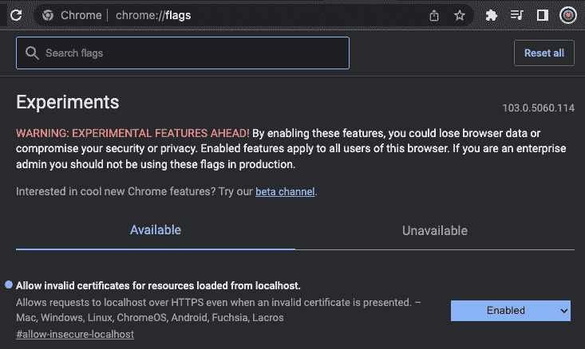
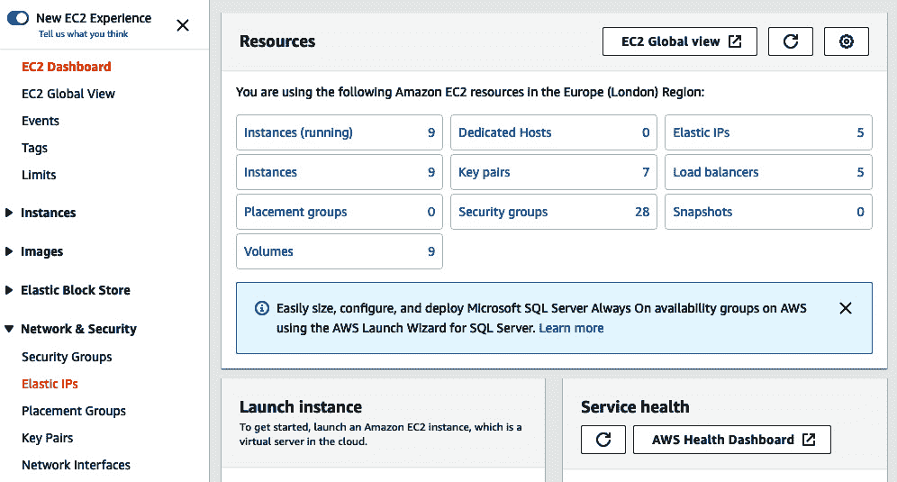

# 11

# 在 AWS 上使用 NGINX 配置 HTTPS

当涉及到部署我们的应用程序时，许多教程和书籍都只涉及简单的部署，并忽略了使用 HTTPS 加密服务器与客户端之间流量这一概念。然而，HTTPS 是至关重要的，通常也是开发者必须克服的最大障碍，以便将他们的网站或 API 推向世界。尽管这本书的标题是《Rust Web Programming》，但为真正理解 HTTPS 的工作原理而专门奉献一章是至关重要的，这样你就可以在本地和**Amazon Web Services**（**AWS**）云上实施 HTTPS。本章将涵盖以下主题：

+   什么是 HTTPS？

+   使用`docker-compose`在本地实施 HTTPS

+   将 URL 附加到我们在 AWS 上部署的应用程序

+   在 AWS 上强制实施 HTTPS

到本章结束时，你将能够使用 Terraform 代码构建基础设施，以加密流量并锁定对**Elastic Compute Cloud**（**EC2**）实例的不希望接收的流量，这样它们就只能接受来自负载均衡器的流量，这将在本章后面进行解释。最好的是，这一切大部分都是自动化的，鉴于我们使用 Docker 来部署应用程序，你将能够将这项技能转移到你未来想要部署的任何 Web 项目上。虽然这并不是最佳实现，因为还有整本书是关于云计算的，但你将能够实施一个稳固、安全的部署，即使 EC2 实例出现故障，负载均衡器也能路由到其他实例，继续为用户提供服务。如果流量需求增加，它也能进行扩展。

# 技术要求

在本章中，我们将基于在*第十章*中构建的代码，即*在 AWS 上部署我们的应用程序*。这可以在以下 URL 找到：[`github.com/PacktPublishing/Rust-Web-Programming-2nd-Edition/tree/main/chapter10/deploying_our_application_on_aws`](https://github.com/PacktPublishing/Rust-Web-Programming-2nd-Edition/tree/main/chapter10/deploying_our_application_on_aws)。

本章的代码可以在[`github.com/PacktPublishing/Rust-Web-Programming-2nd-Edition/tree/main/chapter11`](https://github.com/PacktPublishing/Rust-Web-Programming-2nd-Edition/tree/main/chapter11)找到。

# 什么是 HTTPS？

到目前为止，我们的前端和后端应用程序都是通过 HTTP 运行的。然而，这并不安全，存在一些缺点。为了确保我们浏览器和 NGINX 服务器之间的流量安全，我们必须确保我们的应用程序正在使用 HTTP/2 协议。HTTP/2 协议与标准 HTTP/1 协议有以下不同之处：

+   二进制协议

+   压缩头

+   持久连接

+   多路复用流

我们可以讨论前面列出的要点之间的差异。

## 二进制协议

HTTP 使用基于文本的协议，而 HTTP/2 使用二进制协议。二进制协议使用字节来传输数据，而不是使用人类可读的字符，这些字符使用**美国信息交换标准代码**（**ASCII**）进行编码。使用字节可以减少可能的错误数量和传输数据所需的大小。它还将使我们能够加密我们的数据流，这是 HTTPS 的基础。

## 压缩头部

HTTP/2 在发送请求时压缩头部信息。压缩头部信息与二进制协议有类似的好处，这导致传输相同请求所需的数据量更小。HTTP/2 协议使用 HPACK 格式。

## 持久连接

当使用 HTTP 时，我们的浏览器每次需要资源时都必须发出一个请求。例如，我们可以让我们的 NGINX 服务器提供 HTML 文件。这将导致一个获取 HTML 文件的请求。在 HTML 文件中，可能有一个对 CSS 文件的引用，这将导致对 NGINX 服务器的另一个请求。在 HTML 文件中引用 JavaScript 文件也很常见。这将导致另一个请求。因此，为了加载一个标准的网页，我们的浏览器可能需要最多三个请求。当我们运行一个有多个用户的服务器时，这并不好。使用 HTTP/2，我们可以有持久连接。这意味着我们可以在一个连接中发出对 HTML、CSS 和 JavaScript 文件的三个请求。

## 多路复用流

使用 HTTP/1 发出请求意味着我们必须按顺序发送我们的请求。这意味着我们发出一个请求，等待这个请求被解决，然后发送另一个请求。使用 HTTP/2，我们使用多路复用流，这意味着我们可以同时发送多个请求，并在响应返回时解决它们。将多路复用流与持久连接相结合，可以缩短加载时间。任何在 1990 年代使用过互联网的读者都会记得，加载一个简单的页面需要等待很长时间。当然——那时的互联网连接速度没有现在快，但这也是由于通过多个不同连接的多个 HTTP 顺序请求来加载多个图片、HTML 和 CSS 的结果。

现在我们已经探讨了 HTTP 与 HTTP/2 之间的区别，我们可以探讨建立在 HTTP/2 之上的 HTTPS。然而，在继续前进之前，必须指出，安全是一个独立的领域。了解 HTTPS 周围的高级概念足以让我们理解我们所实施的重要性以及我们为何采取某些步骤。然而，这并不意味着我们成为了安全专家。

在我们探索 HTTPS 的步骤之前，我们需要了解什么是中间人攻击，因为这种攻击启发了 HTTPS 的步骤。中间人攻击正是其名称所暗示的那样：一个恶意窃听者可以拦截用户和服务器之间的通信数据包。这也意味着窃听者还可以在数据通过网络传输时获取加密信息。简单地搜索“中间人攻击”将会出现大量教程和可以下载以实施此类攻击的软件。本书范围之外还有更多关于安全性的注意事项，但为了总结，如果你正在托管一个你希望用户连接并登录的网站，没有理由不使用 HTTPS。

当涉及到 HTTPS 时，需要采取一系列步骤。首先，在向服务器发送任何请求之前，服务器和域的所有者必须从受信任的中心机构获取一个证书。可信赖的中心机构并不多。这些机构所做的是获取域名所有者的某些身份证明以及申请证书的人拥有该域的某些证据。这听起来可能像是一个头疼的问题，但许多 URL 提供商，如 AWS，通过使用诸如支付详情等信息简化了流程，在您点击购买域名时将这些信息发送到后端的后台受信任中心机构。我们可能需要填写一些额外的表格，但如果您有一个有效的 AWS 账户，这不会太费事。这些中心机构是有限的，因为任何拥有计算机的人都可以创建数字证书。例如，如果我们正在拦截服务器和用户之间的流量，我们可以使用密钥生成自己的数字证书并将其转发给用户。正因为如此，主流浏览器只认可由少数认可机构签发的证书。如果浏览器收到一个未认可的证书，这些浏览器将会给出警告，如下面的 Chrome 示例所示：


图 11.1 – 由于未识别的证书，Chrome 阻止访问

不建议点击**高级**以继续。

一旦域名和服务器所有者从中央机构获得证书，用户就可以发起请求。在交换任何有意义的数据到应用程序之前，服务器会将带有公钥的证书发送给用户。然后用户创建一个会话密钥，并加密这个会话密钥和证书的公钥，然后将它发送回服务器。服务器随后可以使用未通过网络发送的私钥解密这个密钥。因此，即使窃听者设法拦截消息并获取会话密钥，它也是加密的，所以他们无法使用它。服务器和客户端都可以检查相互加密消息的有效性。我们可以使用会话密钥向服务器和用户发送加密消息，如以下图所示：


图 11.2 – 建立 HTTPS 连接所需的步骤

不要担心——有各种软件包和工具可以帮助我们管理 HTTPS 过程；我们不需要实现自己的协议。您将了解为什么我们必须执行某些步骤，以及如何在出现问题时进行故障排除。在下一节中，我们将使用 NGINX 在本地实现基本的 HTTPS 协议。

# 使用 docker-compose 在本地实现 HTTPS

当涉及到实现 HTTPS 时，大部分工作将通过 NGINX 来完成。尽管我们与 NGINX 有过一些合作，但 NGINX 配置是一个强大的工具。您可以实现条件逻辑，从请求中提取变量和数据并对其操作，重定向流量，等等。在本章中，我们将足够地实现 HTTPS，但如果您有时间，建议您阅读有关 NGINX 配置基础的知识；阅读材料在*进一步阅读*部分提供。对于我们的`deployment/nginx_config.yml`文件，我们需要以下布局：

```rs
worker_processes  auto;
error_log  /var/log/nginx/error.log warn;
events {
    worker_connections  512;
}
http {
    server {
        . . .
    }
    server {
        . . .
    }
}
```

在这里，我们可以看到在我们的`http`作用域中存在两个`server`作用域。这是因为我们需要强制执行 HTTPS。我们必须记住我们的外部端口是`80`。然而，如果我们想进行 HTTPS 连接，我们反而需要连接到端口`443`，这是 HTTPS 的标准端口。在浏览器中输入`https://`将针对端口`443`，而在浏览器中输入`http://`将针对端口`80`。如果我们允许端口`80`开放，大量的用户将以不安全的方式访问我们的网站，因为有些人会在浏览器中输入`http://`。黑客也会传播 HTTP 链接，因为他们希望尽可能多的人不使用安全网络。然而，如果我们阻止端口`80`，将`http://`输入到浏览器中的人将无法访问网站。普通用户不太可能理解端口之间的差异，查看他们输入的内容，并更正它。相反，他们只会认为网站已关闭。因此，我们必须监听端口`443`和`80`。然而，当请求端口`80`时，我们将请求重定向到端口`443`。我们的第一个服务器作用域可以使用以下代码进行重定向：

```rs
server {
    listen 80;
    return 301 https://$host$request_uri;
}
```

在这里，我们可以看到我们监听端口`80`，然后返回相同的请求，但使用 HTTPS 协议，这意味着它将击中我们的`443`端口。我们还可以看到我们引用了`$host`和`$request_uri`变量。这些变量是 NGINX 中的标准变量，它们会自动填充。我们可以使用以下代码行定义自己的变量：

```rs
set $name 'Maxwell';
```

然而，我们希望我们的 NGINX 实例在我们的服务器和本地主机上运行，因此使用标准变量是这里最好的选择。现在我们已经定义了重定向规则，我们可以继续到下一个服务器作用域；我们使用以下代码监听端口`443`：

```rs
server {
    listen 443 ssl http2;
    ssl_certificate /etc/nginx/ssl/self.crt;
    ssl_certificate_key /etc/nginx/ssl/self.key;
    location /v1 {
        proxy_pass http://rust_app:8000/v1;
    }
    location / {
        proxy_pass http://front_end:4000/;
    }
}
```

观察前面的代码，必须注意我们正在同一个 NGINX 实例中处理和引导前端和后端应用的流量。在端口定义的同时，我们还声明我们正在使用`ssl`和`http2` NGINX 模块。这并不奇怪，因为 HTTPS 本质上是在 HTTP/2 之上的 SSL。然后我们定义服务器证书在 NGINX 容器中的位置。我们将在`docker-compose`卷中稍后添加这些。我们还可以看到我们将 HTTPS 请求通过 HTTP 传递到适当的应用程序。如果我们尝试将这些代理更改为 HTTPS 协议，那么我们会得到一个不良网关错误。这是因为 NGINX 和我们的服务之间的握手将失败。这不是必需的，因为我们必须记住，前端和后端应用暴露的端口对于本地主机之外的人来说是不可用的。是的——在我们的本地机器上我们可以访问它们，这是因为它们运行在我们的本地机器上。如果我们部署我们的应用程序服务器，它将看起来像这样：


图 11.3 – 如果在服务器上部署，流量流向

我们的 NGINX 配置并非最佳。有一些设置可以在密码、缓存和管理超时方面进行调整。然而，这已经足够让 HTTPS 协议工作。如果你需要优化 NGINX 配置的缓存和加密方法，建议你寻找更多关于 DevOps 和 NGINX 的教育资源。

现在我们已经定义了我们的 NGINX 配置，我们必须定义我们的证书。

注意

要定义我们自己的证书，我们必须通过以下链接中的步骤安装 `openssl` 包：

**Linux**:

[如何在 Ubuntu 上安装 OpenSSL](https://fedingo.com/how-to-install-openssl-in-ubuntu/)

**Windows**:

[在 Windows 上安装 OpenSSL](https://linuxhint.com/install-openssl-windows/)

**Mac**:

[在 macOS Catalina 上安装 OpenSSL 库](https://yasar-yy.medium.com/installing-openssl-library-on-macos-catalina-6777a2e238a6)

这可以通过以下命令完成：

```rs
openssl req -x509 -days 10 -nodes -newkey rsa:2048
-keyout ./self.key -out ./self.crt
```

这创建了一个 `x509` 密钥，这是国际电信联盟的标准。我们声明证书将在 10 天后过期，密钥和证书的名称为 `self`。它们可以命名为任何东西；然而，对我们来说，将证书命名为 `self` 是有意义的，因为它是一个自签发的证书。之前代码片段中显示的命令将推送几个提示。对于这些提示，你可以说什么并不重要，因为我们只是会用它们进行本地主机请求，这意味着它们永远不会超出我们的本地计算机之外。现在，如果你可以在 `docker-compose.yml` 文件中引用密钥和证书，我们就可以将密钥和证书存储在 `deployment` 目录中的任何位置。在我们的 `docker-compose.yml` 文件中，我们的 NGINX 服务现在具有以下形式：

```rs
nginx:
container_name: 'nginx-rust'
image: "nginx:latest"
ports:
  - "80:80"
  - 443:443
links:
  - rust_app
  - front_end
volumes:
  - ./nginx_config.conf:/etc/nginx/nginx.conf
  - ./nginx_configs/ssl/self.crt:/etc/nginx/ssl/self.crt
  - ./nginx_configs/ssl/self.key:/etc/nginx/ssl/self.key
```

在这里，我们可以看到我选择将密钥和证书存储在一个名为 `nginx_configs/ssl/` 的目录中。这是因为我在 `nginx_configs` 目录下添加了几个简单的 NGINX 配置到 GitHub 仓库中，如果你想要一些关于处理变量、条件逻辑和直接从 NGINX 服务器上服务 HTML 文件的快速参考。虽然你从哪里获取密钥和证书可能不同，但将密钥和证书放在 NGINX 容器内的 `etc/nginx/ssl/` 目录中是很重要的。

现在，我们可以测试我们的应用程序以查看本地 HTTPS 是否工作。如果你启动你的 `docker-compose` 实例，然后在浏览器中访问 `https://localhost` URL，你应该会收到一个警告，表明它不安全，你将无法立即连接到前端。这令人放心，因为我们不是中央权威机构，所以我们的浏览器将不会识别我们的证书。有众多浏览器，我们在这本书中描述如何绕过每个浏览器的限制会浪费很多空间。考虑到浏览器可以免费下载，我们可以通过访问 `flags` URL 来绕过 Chrome 对我们应用程序的阻止，如下所示：



图 11.4 – 在 Chrome 中允许我们的应用程序证书通过

在这里，我们可以看到我已经允许来自 localhost 的无效证书。现在，在我们的浏览器中启用了无效证书后，我们可以访问我们的应用程序，如下所示：


图 11.5 – 通过 HTTPS 访问我们的应用程序

在这里，我们使用的是 HTTPS 协议；然而，正如我们在前面的截图中所见，Chrome 正在抱怨说它不安全。我们可以通过点击 **不安全** 提示来检查原因，如下所示：


图 11.6 – 解释连接不安全的原因

在这里，我们可以看到我们的证书是无效的。我们预期证书将无效，因为我们自己签发了它，这使得它没有得到官方认可。然而，我们的 HTTPS 连接正在工作！这很有趣，可以看到 HTTPS 的工作原理；然而，在我们的 localhost 上运行的自签名证书并没有什么用。如果我们想利用 HTTPS，我们必须将其应用到 AWS 上的应用程序中。在 AWS 上实现 HTTPS 之前，我们需要执行几个步骤。在下一节中，我们将为我们的应用程序分配一个 URL。

# 将 URL 附接到 AWS 上部署的应用程序

在上一章中，我们成功将待办事项应用程序部署到 AWS 服务器上，并通过将服务器的 IP 地址输入我们的浏览器来直接访问此应用程序。当我们注册我们的 URL 时，你会遇到多个缩写词。为了在 AWS 路由导航时感到舒适，熟悉以下图表中的 URL 缩写词是有意义的：


图 11.7 – URL 的结构

当我们将 URL 与我们的应用程序关联时，我们将配置一个 **域名系统**（**DNS**）。DNS 是一个将用户友好的 URL 转换为 IP 地址的系统。为了 DNS 系统能够工作，我们需要以下组件：

+   **域名注册商**：一个像 AWS、Google Cloud、Azure、GoDaddy 等组织，如果收到域名的付款和负责人的个人信息，就会注册一个域名。如果 URL 被用于非法活动，该组织也会处理滥用报告。

+   **DNS 记录**：一个已注册的 URL 可以有多个 DNS 记录。DNS 记录本质上定义了 URL 的路由规则。例如，一个简单的 DNS 记录会将 URL 转发到服务器的 IP 地址。

+   **区域文件**：DNS 记录的容器（在我们的情况下，区域文件将由 AWS 管理）。

DNS 记录和注册商对我们的 URL 工作至关重要。尽管我们可以直接连接到 IP 地址，但如果我们想连接到 URL，这里有几个中间人，如下所述：


图 11.8 – 连接 URL 到 IP 地址所需的步骤

如前图所示，如果我们想连接到服务器，我们将 URL 发送到本地 DNS 服务器。然后，该服务器从上到下按顺序进行三次调用。在三次请求结束时，本地 DNS 服务器将拥有与 URL 相关的 IP 地址。我们可以看到注册商负责部分映射。这就是我们配置 DNS 记录的地方。如果我们删除我们的 DNS 记录，那么 URL 将不再在互联网上可用。我们不必每次输入 URL 时都执行图*11.8*中列出的调用。我们的浏览器和本地 DNS 服务器会缓存 URL 到 IP 地址的映射，以减少对其他三个服务器的调用次数。然而，这里有一个问题；当我们构建我们的生产服务器时，你可能已经意识到每次我们拆解和启动生产服务器时，IP 地址都会改变。这里并没有发生什么问题；当我们创建 EC2 实例时，我们必须选择一个可用的服务器。像 AWS 这样的云提供商不能为了我们而保留服务器，除非我们愿意为此付费。在下一节中，我们将保持 IP 地址与弹性 IP 地址的一致性。

## 将弹性 IP 附加到我们的服务器

弹性 IP 地址本质上是我们保留的固定 IP 地址。我们可以在任何时候将这弹性 IP 地址附加到任何一个 EC2 实例上，只要我们觉得合适。这在路由方面非常有帮助。我们可以设置将 URL 路由到弹性 IP 的配置，然后切换弹性 IP 的分配到我们需要的服务器。这意味着我们可以将新应用程序部署到另一台服务器上，测试它，然后无需触及 URL 的路由即可将我们的弹性 IP 切换到新的部署服务器。

我们不会每次启动生产服务器时都创建一个弹性 IP。因此，在 AWS 控制台中点击创建和附加弹性 IP 地址是可以的。然而，在我们这样做之前，我们需要使用之前定义的没有 HTTPS 定义的 NGINX 配置文件部署我们的生产服务器，如下所示：

```rs
worker_processes  auto;
error_log  /var/log/nginx/error.log warn;
events {
    worker_connections  512;
}
http {
    server {
        listen 80;
        location /v1 {
            proxy_pass http://rust_app:8000/v1;
        }
        location / {
            proxy_pass http://front_end:4000/;
        }
    }
}
```

现在您应该已经明白了，因为 NGINX 配置只是通过外部端口`80`监听 HTTP 请求，然后将它们传递给我们的应用程序。我们还必须删除我们对自己签名的证书的引用，因为我们不需要它们，也不会将这些证书上传到我们的服务器。考虑到我们没有引用我们的证书，我们`deployment`目录中的`docker-compose`实例应该有以下的 NGINX 定义：

```rs
nginx:
  container_name: 'nginx-rust'
  image: "nginx:latest"
  ports:
    - "80:80"
  links:
    - rust_app
    - front_end
  volumes:
    - ./nginx_config.conf:/etc/nginx/nginx.conf
```

我们现在可以开始在生产服务器上部署我们的构建了。记住——我们可以使用之前章节中设置的`deployment/run_build.py` Python 脚本来完成这项工作。一旦服务器构建完成，我们知道有一个带有`"待办生产服务器"`标签的 EC2 实例正在运行。我们现在可以为我们的 EC2 实例分配一个弹性 IP 地址。

要分配弹性 IP，我们首先需要通过在 AWS 仪表板顶部的搜索栏中搜索 EC2 并点击服务来导航到 EC2 服务，这将导致以下视图：



图 11.9 – EC2 仪表板视图

我们可以看到，**弹性 IP**可以在**资源**面板的右侧和屏幕的左侧访问。一旦我们进入弹性 IP 地址仪表板，我们将有一个您拥有的弹性 IP 地址列表。在屏幕右上角，将有一个标有**分配弹性 IP 地址**的橙色按钮。如果您点击此按钮，您将获得以下创建表单：


图 11.10 – 分配（创建）弹性 IP 地址

我们在这里所做的是从您正在工作的区域的一个 IP 地址池中获取一个弹性 IP 地址。每个账户的弹性 IP 地址限制为五个。如果您认为这不足以满足您的需求，您将需要更具有创造性来设计您的网络基础设施。您还可以调查为主账户创建子账户。就像干净的代码一样，只针对一个项目进行清洁账户操作是有好处的。这将帮助您跟踪成本，并且关闭一个项目的所有基础设施将非常干净，因为您可以确信该项目的所有内容都已通过删除账户而被清除。

接下来，关于我们将弹性 IP 分配给 EC2 服务器，我们可以在弹性 IP 仪表板中突出显示所需的弹性 IP 地址，然后点击仪表板右上角的**操作**按钮，如下所示：


图 11.11 – 对我们的弹性 IP 执行操作

在 **操作** 下，我们必须点击 **关联弹性 IP 地址** 选项，这将显示以下内容：


图 11.12 – 关联弹性 IP 地址

我们在 Terraform 中定义的 `"to-do 生产服务器"` 标签。然而，如果我们没有标签，我们仍然可以从下拉菜单中选择一个实例。然后我们可以点击 **关联** 按钮。完成此操作后，我们可以在浏览器中访问我们的弹性 IP 地址，我们应该能够访问我们的待办事项应用程序，如图所示：


图 11.13 – 使用静态 IP 访问我们的待办事项应用程序

这里就是我们想要的——我们的应用程序可以通过弹性 IP 访问！！如果我们想的话，现在可以启动一个新的服务器，测试它，如果我们满意，可以将弹性 IP 重定向到新服务器，从而提供无缝更新，而用户不会察觉。然而，让用户输入原始 IP 地址并不理想。在下一节中，我们将注册一个域名并将其连接到我们的弹性 IP 地址。

## 注册域名

当涉及到注册域名时，所有这些都可以通过 AWS 的 Route 53 服务来处理。首先，我们导航到 Route 53，这是处理路由和 URL 注册的服务。在 **Route 53** 控制台网页的左侧，我们可以点击 **已注册域名** 部分，如下面的截图所示：


图 11.14 – 在 Route 53 控制台中导航到已注册域名

然后，我们将看到我们已拥有的已注册域名列表以及注册域名的选项，如下面的截图所示：


图 11.15 – 已注册域名视图

如果您点击 **注册域名** 按钮，您将进入一系列简单的表单以注册您的域名。截图这些步骤将是过度的。表单会要求您输入想要注册的域名。然后它们会告诉您该域名和其他类似域名是否可用。在撰写本书时，域名平均每年花费约 12 美元。一旦您选择了域名并点击结账，您将进入一系列个人信息表单。这些表单包括联系地址以及域名是用于个人使用还是公司。截图这些表单会导致页面过多，教育优势很小，因为这些表单是个人且容易填写。建议您选择通过 DNS 进行验证，因为这将是自动化的。

一旦你的域名注册完成，你可以进入 Route 53 主控制台中的**主机区域**部分。在这里，我们将看到你拥有的每个 URL 的主机区域列表。主机区域本质上是一组 DNS 记录。如果我们点击一个 URL 的主机区域，将会有两个 DNS 记录：NS 和 SOA（NS—名称服务器；SOA—权威开始）。这些记录不应被删除，如果它们被删除，知道这些记录的人可能会通过实施这些记录来劫持你的 URL。DNS 记录本质上是如何为域名路由流量的记录。每个 DNS 记录都有以下属性：

+   **域名/子域名名称**：记录所属的 URL 名称

+   **记录类型**：记录类型（A、AAAA、CNAME 或 NS）

+   **值**：目标 IP 地址

+   **路由策略**：Route 53 对查询的响应方式

+   **TLL (Time to Live)**: 记录在客户端 DNS 解析器中缓存的时长，这样我们就不必频繁查询 Route 53 服务器，以减少 DNS 服务器流量与更新传播到客户端的时间之间的权衡

正如定义的属性一样，除了记录类型。我们可以在 Route 53 中构建高级记录类型。然而，以下记录类型是我们将域名路由到 IP 地址所必需的：

+   **A**：最简单的记录类型。类型 A 仅仅是将流量从 URL 路由到 IPv4 IP 地址。

+   **AAAA**：将流量从 URL 路由到 IPv6 地址。

+   **CNAME**：将主机名映射到另一个主机名（目标必须是 A 或 AAAA 记录类型）。

+   **NS**: 主机区域的名称服务器（控制流量路由方式）。

对于我们来说，我们将通过点击**创建记录**按钮创建一个 DNS `A`记录，如以下截图所示：


图 11.16 – 创建 DNS 记录

点击后，我们得到以下布局：


图 11.17 – 创建 DNS 记录表单

我们可以看到记录类型 `A` 是默认的。我们还可以看到我们可以添加一个子域名。这给了我们一些灵活性。例如，如果我们想的话，`api.freshcutswags.com` URL 可以指向与`freshcutswags.com`不同的 IP 地址。现在，我们将保持子域名为空。然后，我们将把在前一节中设置的弹性 IP 地址放入`www`中。一旦完成，我们应该有两个`A`记录。然后我们可以使用[www.digwebinterface.com](https://www.digwebinterface.com)网站检查我们的 URL 映射流量。在这里，我们可以输入 URL，网站会告诉我们 URL 被映射到了哪里。我们可以看到，我们的 URL 都映射到了正确的弹性 IP：


图 11.18 – 检查我们的 URL 映射

确认映射结果后，如前一个屏幕截图所示，我们可以访问我们的 URL 并期待看到以下内容：


图 11.19 – 通过注册的 URL 访问我们的应用程序

我们可以看到，我们的 URL 现在正在工作。然而，连接并不安全。在下一节中，我们将强制执行 HTTPS 协议以保护我们的应用程序，并对其进行锁定，因为现在，尽管我们可以通过 URL 访问我们的应用程序，但没有任何阻止我们直接访问服务器 IP 地址的措施。

# 在 AWS 应用程序上强制执行 HTTPS

目前，我们的应用程序在某种程度上是可行的，但在安全性方面却是个噩梦。在本节结束时，我们不会拥有最安全的应用程序，因为建议进一步阅读网络和 DevOps 教科书以实现金标准的安全性。然而，我们将已配置安全组，锁定我们的 EC2 实例，使其不能被外部人员直接访问，并通过负载均衡器强制执行加密流量，然后流量将被导向我们的 EC2 实例。我们努力的成果将是以下系统：


图 11.20 – 实现 HTTPS 的所需系统布局

要实现 *图 11.20* 中所示的系统，我们需要执行以下步骤：

1.  为我们的 URL 和变体获取证书审批。

1.  创建多个 EC2 实例以分发流量并确保服务在故障时仍能正常运行。

1.  创建一个负载均衡器来处理传入流量。

1.  创建安全组。

1.  更新我们的 Python 构建脚本以支持多个 EC2 实例。

1.  使用 Route 53 向导将我们的 URL 附接到负载均衡器。

在上一节关于将 URL 附接到我们 AWS 应用程序的部分，我们进行了大量的点击操作。正如前一章所述，如果可能的话，应尽量避免点击操作，因为它不可重复，而且我们人类会忘记我们做了什么。遗憾的是，在 URL 审批过程中，点击操作是最好的选择。在本节中，只有第一步和第六步需要点击操作。其余的将通过 Terraform 和 Python 完成。我们将对 Terraform 配置进行一些重大更改，因此建议在修改 Terraform 配置之前运行 `terraform destroy` 命令。然而，在我们进行任何编码之前，我们必须获取我们 URL 的证书。

## 获取我们 URL 的证书

由于我们通过 Route 53 带入了我们的 URL，这是由 AWS 处理的，并且我们的服务器在 AWS 上运行，因此证书的颁发和实施是一个简单的过程。我们需要通过在服务搜索栏中输入`证书管理器`并点击它来导航到证书管理器。一旦到达那里，我们将看到一个只有一个小按钮的页面，该按钮标有**请求证书**。点击此按钮，我们将被带到以下页面：


图 11.21 – 证书管理器：旅程开始

我们希望我们的证书是公开的；因此，我们对默认选择感到满意，然后点击**下一步**。随后，我们将看到一个以下形式的表单：


图 11.22 – 定义证书请求

在这里，我们输入我们希望与证书关联的 URL。我们可以添加另一个，但我们将为我们的 URL 创建一个单独的证书，因为我们想探索如何在 Terraform 中附加多个证书。我们还可以看到 DNS 验证已经突出显示，这是推荐的，因为我们有服务器在 AWS 上，这意味着我们不需要采取任何更多行动来颁发证书。然后我们可以点击标有**请求**的按钮，我们将被重定向到一个包含证书列表的页面。我发现每次我这样做时，新的证书请求几乎都不在。我的猜测是存在延迟。不要担心——只需刷新页面，您将看到挂起的证书请求列在列表中。点击此条目，您将被引导到该证书请求的详细视图。在屏幕中间的右侧，您需要点击此处所示的**在 Route 53 中创建记录**按钮：


图 11.23 – 为 DNS 确认创建记录

点击按钮后，请按照提示操作，CNAME 记录将被创建。如果您不这样做，则票证的挂起状态将无限期持续，因为云服务提供商需要路由来颁发证书，考虑到我们选择了 DNS 验证。几分钟后，证书应该会被颁发。一旦完成，为前缀通配符执行相同的步骤。一旦完成，您的证书列表应该看起来像以下这样：


图 11.24 – 已颁发证书

在前面的屏幕截图中，我们可以看到我有两个证书：一个用于用户直接输入 URL 而没有前缀的情况，以及覆盖所有前缀的通配符。我们准备使用这些证书，但在这样做之前，我们必须执行一些其他步骤。在我们定义关于流量的规则之前，我们必须构建流量将流向的基础设施。在下一节中，我们将构建两个 EC2 实例。

## 创建多个 EC2 实例

我们将使用负载均衡器。因此，我们需要至少两个 EC2 实例。这意味着如果一个 EC2 实例宕机，我们仍然可以使用另一个 EC2 实例。我们还可以扩展我们的应用程序。例如，如果世界上所有人突然意识到他们需要一个待办事项应用来整理他们的生活，我们无法阻止我们增加 EC2 实例的数量以分配流量。我们可以通过进入我们的`deployment/main.tf`文件并使用以下定义来增加我们的 EC2 实例到两个：

```rs
resource "aws_instance" "production_server" {
    ami = "ami-0fdbd8587b1cf431e"
    instance_type = "t2.medium"
    count = 2
    key_name = "remotebuild"
    user_data = file("server_build.sh")
    tags = {
      Name = "to-do prod ${count.index}"
    }
    # root disk
    root_block_device {
      volume_size = "20"
      volume_type = "gp2"
      delete_on_termination = true
    }
}
```

在这里，我们可以看到我们添加了一个`count`参数并将其定义为`2`。我们还更改了标签。我们还可以看到我们使用`index`访问正在创建的 EC2 实例的数量。索引从零开始，每次创建资源时增加一。现在我们有两个实例，我们必须使用以下代码更新`deployment/main.tf`文件底部的输出：

```rs
output "ec2_global_ips" {
  value = ["${aws_instance.production_server.*.public_ip}"]
}
output "db_endpoint" {
  value = "${aws_db_instance.main_db.*.endpoint}"
}
output "public_dns" {
  value =
      ["${aws_instance.production_server.*.public_dns}"]
}
output "instance_id" {
    value = ["${aws_instance.production_server.*.id}"]
}
```

在这里，我们可以看到，除了数据库端点外，所有其他输出都已更改为列表。这是因为它们都引用了我们的多个 EC2 实例。现在我们已经定义了我们的 EC2 实例，我们可以使用负载均衡器将流量路由到我们的实例。

## 为我们的流量创建负载均衡器

我们可以从一系列不同的负载均衡器中进行选择。我们已经讨论了 NGINX，它是一个流行的负载均衡器。对于本章，我们将使用应用程序负载均衡器来路由流量到我们的 EC2 实例并实现 HTTPS 协议。负载均衡器可以提供多种功能，并且它们可以保护`deployment/load_balancer.tf`文件。首先，我们使用以下代码收集所需的数据：

```rs
data "aws_subnet_ids" "subnet" {
    vpc_id = aws_default_vpc.default.id
}
data "aws_acm_certificate" "issued_certificate" {
    domain   = "*.freshcutswags.com"
    statuses = ["ISSUED"]
}
data "aws_acm_certificate" "raw_cert" {
    domain   = "freshcutswags.com"
    statuses = ["ISSUED"]
}
```

我们可以看到，我们使用的是`data`声明而不是`resource`，这是我们在 Terraform 脚本中查询 AWS 以获取特定类型数据的地方。我们获取了**虚拟私有云**（**VPC**）ID。在 Terraform 中，我们可以定义和构建一个 VPC，但在这本书的整个过程中，我们一直在使用默认的 VPC。我们可以获取用于我们的负载均衡器的默认 VPC ID。然后，我们使用前面的代码获取我们在上一节中定义的证书的数据。

现在，我们必须为我们的负载均衡器定义一个目标。这是通过以下代码形式的 target group 来完成的，我们可以将一组实例聚集在一起，以便负载均衡器可以针对这些实例：

```rs
resource "aws_lb_target_group" "target-group" {
    health_check {
        interval = 10
        path = "/"
        protocol = "HTTP"
        timeout = 5
        healthy_threshold = 5
        unhealthy_threshold = 2
    }
    name = "ToDoAppLbTg"
    port = 80
    protocol = "HTTP"
    target_type = "instance"
    vpc_id   = aws_default_vpc.default.id
}
```

在这里，我们可以看到我们定义了健康检查的参数。健康检查的参数是自解释的。健康检查将向一个针对目标组健康状态的服务发出警报。我们不希望将流量路由到已关闭的目标组。然后我们定义了流量的协议和端口，目标组中的资源类型，以及 VPC 的 ID。现在我们的目标组已经定义好了，我们可以用以下代码将其与我们的 EC2 实例关联起来：

```rs
resource "aws_lb_target_group_attachment" "ec2_attach" {
    count = length(aws_instance.production_server)
    target_group_arn = aws_lb_target_group.target-group.arn
    target_id =
        aws_instance.production_server[count.index].id
}
```

我们可以看到我们获取了目标 ID 的 EC2 服务器的 ID。有了这个，我们的 EC2 实例就可以被负载均衡器所针对。现在我们有了目标，我们可以用以下代码创建我们的负载均衡器：

```rs
resource "aws_lb" "application-lb" {
    name = "ToDoApplicationLb"
    internal = false
    ip_address_type = "ipv4"
    load_balancer_type = "application"
    security_groups = ["${aws_security_group.
        alb-security-group.id}"]
        subnets = data.aws_subnet_ids.subnet.ids
    tags = {
        name = "todo load balancer"
    }
}
```

我们可以看到负载均衡器定义中的参数非常直接。然而，你可能已经注意到了安全组定义。尽管我们没有定义任何安全组，但我们正在引用一个安全组。如果你不知道什么是安全组，不要担心——我们将在下一节中涵盖并构建我们需要的所有安全组。但在我们这样做之前，我们不妨先为负载均衡器定义监听和路由规则。首先，我们可以为端口`80`定义 HTTP 监听器。如果你还记得本章的第一节，当我们在本地主机上使 HTTPS 工作的时候，你认为我们需要对 HTTP 流量做些什么？你不需要知道具体的 Terraform 代码，但我们希望促进的一般行为是什么？有了这个想法，我们可以用以下代码实现这种行为：

```rs
resource "aws_lb_listener" "http-listener" {
    load_balancer_arn = aws_lb.application-lb.arn
    port = 80
    protocol = "HTTP"
    default_action {
        type = "redirect"
        redirect {
            port        = "443"
            protocol    = "HTTPS"
            status_code = "HTTP_301"
        }
    }
}
```

没错！我们从端口`80`接收 HTTPS 流量，然后将其重定向到端口`443`，使用 HTTPS 协议。我们可以看到我们使用我们创建的负载均衡器的 ARN 附加了这个监听器。我们现在可以用以下代码定义我们的 HTTPS 监听器：

```rs
resource "aws_lb_listener" "https-listener" {
    load_balancer_arn = aws_lb.application-lb.arn
    port = 443
    protocol = "HTTPS"
    certificate_arn = data.aws_acm_certificate.
                      issued_certificate.arn
    default_action {
        target_group_arn = aws_lb_target_group.target-
            group.arn
        type = "forward"
    }
}
```

在这里，我们可以看到我们接受 HTTPS 流量，然后将 HTTP 流量转发到我们定义的目标组，使用目标组的 ARN。我们还可以看到我们已将一个证书附加到监听器上。然而，这并不涵盖我们所有的 URL 组合。记住——我们还有一个想要附加的证书。我们可以用以下代码附加我们的第二个证书：

```rs
resource "aws_lb_listener_certificate" "extra_certificate" {
  listener_arn = "${aws_lb_listener.https-listener.arn}"
  certificate_arn =
      "${data.aws_acm_certificate.raw_cert.arn}"
}
```

这个连接应该很容易理解。在这里，我们仅仅引用了 HTTPS 监听器的 ARN 和我们要附加的证书的 ARN。我们现在已经为负载均衡器的资源定义了所有需要的东西。然而，关于流量呢？我们已经定义了负载均衡器、EC2 实例和负载均衡器的 HTTPS 路由。但是，有什么阻止某人直接连接到 EC2 实例，完全绕过负载均衡器和 HTTPS 呢？这就是安全组发挥作用的地方。在下一节中，我们将通过创建安全组来锁定流量，这样用户就不能绕过我们的负载均衡器。

## 创建安全组以锁定和确保流量

安全组本质上等同于防火墙。我们可以定义实现了安全组的资源之间的流量。流量的规则可以非常细致。一个安全组可以定义多个规则，以定义流量的来源（甚至如果需要，可以指定特定的 IP 地址）和协议。当我们谈到我们的安全组时，我们将需要两个。一个将接受来自世界各地的所有 IP 地址的 HTTP 和 HTTPS 流量。这将用于我们的负载均衡器，因为我们希望应用程序对每个人可用。另一个安全组将由我们的 EC2 实例实现；这个安全组除了第一个安全组之外，将阻止所有 HTTP 流量。我们还将启用 SSH 入站流量，因为我们需要 SSH 到服务器以部署应用程序，从而得到以下流量布局：


图 11.25 – 我们部署系统的安全组

这是你必须小心对待在线教程的地方。YouTube 视频和 Medium 文章中不乏一些通过点击和指向就能让负载均衡器启动运行的内容。然而，它们没有暴露 EC2 实例，也没有去探索安全组。即使在这个部分，我们也将数据库暴露在外。我这样做是因为这是一个在*问题*部分值得提出的好问题。然而，我在这里强调它，是因为你需要被警告它已经被暴露。锁定数据库的方法将在本章的*答案*部分中介绍。当我们谈到我们的安全组时，我们将在`deployment/security_groups.tf`文件中定义它们。我们可以从以下代码开始定义负载均衡器的安全组：

```rs
resource "aws_security_group" "alb-security-group" {
    name = "to-do-LB"
    description = "the security group for the
                   application load balancer"
    ingress {
        . . .
    }
    ingress {
        . . .
    }
    egress {
        . . .
    }
    tags = {
        name: "to-do-alb-sg"
    }
}
```

在这里，我们在`ingress`标签下有两个入站规则，在`egress`标签下有一个出站规则。我们的第一个入站规则是允许来自任何地方的 HTTP 数据，以下代码：

```rs
ingress {
    description = "http access"
    from_port = 80
    to_port = 80
    protocol = "tcp"
    cidr_blocks = ["0.0.0.0/0"]
}
```

所有零的`cidr`块意味着*来自任何地方*。

我们的第二个入站规则是从任何地方来的 HTTPS 流量。你认为这将如何定义？它可以定义为以下代码：

```rs
ingress {
    description = "https access"
    from_port = 443
    to_port = 443
    protocol = "tcp"
    cidr_blocks = ["0.0.0.0/0"]
}
```

现在我们来定义我们的出站规则。我们必须允许所有流量和协议从负载均衡器流出，因为它们来自我们的资源。这可以通过以下代码实现：

```rs
egress {
    from_port = 0
    to_port = 0
    protocol = "-1"
    cidr_blocks = ["0.0.0.0/0"]
}
```

必须注意，`from_port`和`to_port`为零，这意味着我们允许从所有端口流出流量。我们还设置了`protocol`为`-1`，这意味着我们允许所有协议作为流出流量。我们现在已经定义了负载均衡器的安全组。现在我们可以继续定义我们的 EC2 实例的安全组，以下代码：

```rs
resource "aws_security_group" "webserver-security-group" {
    name = "to-do-App"
    description = "the security group for the web server"
    ingress {
        . . .
    }
    ingress {
        . . .
    }
    egress {
        from_port = 0
        to_port = 0
        protocol = "-1"
        cidr_blocks = ["0.0.0.0/0"]
    }
    tags = {
        name: "to-do-webserver-sg"
    }
}
```

出站规则将与负载均衡器相同，因为我们希望将数据返回到任何可以请求它的位置。当我们谈到我们的 HTTP 入站规则时，我们只想接受来自以下代码的负载均衡器的流量：

```rs
ingress {
    description = "http access"
    from_port = 80
    to_port = 80
    protocol = "tcp"
    security_groups = ["${aws_security_group.
                          alb-security-group.id}"]
}
```

在这里，我们可以看到，我们不是定义 `cidr` 块，而是依赖于负载均衡器的安全组。现在所有用户流量都已定义，我们只需定义以下代码的 SSH 流量以进行部署：

```rs
ingress {
    description = "SSH access"
    from_port = 22
    to_port = 22
    protocol = "tcp"
    cidr_blocks = ["0.0.0.0/0"]
}
```

在这里，我们通过端口 `22` 访问 SSH。这将使我们能够 SSH 进入我们的服务器并部署我们的应用程序。几乎所有的事情都完成了。我们只需将我们的 EC2 实例附加到我们的 EC2 安全组，这可以通过以下代码完成：

```rs
resource "aws_network_interface_sg_attachment"
    "sg_attachment_webserver" {
         count = length(aws_instance.production_server)
             security_group_id = aws_security_group.
                 webserver-security-group.id
  network_interface_id = aws_instance.
                         production_server[count.index].
                         primary_network_interface_id
}
```

我们的地毯脚本现在已完成，并且能够启动多个 EC2 实例、数据库和负载均衡器，同时锁定流量。如果您想以受限流量启动一个基本的带有 HTTPS 和数据库访问的 Web 应用程序，这是一个很好的模板。

现在我们有两个不同的 EC2 实例，我们将在下一节中更改我们的部署脚本，以便两个实例都安装了应用程序。

## 更新我们的 Python 部署脚本以支持多个 EC2 实例

我们可以通过同时运行多个进程等方式优化部署过程。这将随着我们拥有的 EC2 实例数量的增加而加快我们的部署。然而，我们必须记住，这是一本关于 Rust 和网络编程的书，其中包含了一些部署章节，以便您可以使用您所创建的内容。我们本可以写一本关于优化和改进我们的部署管道的整本书。当我们谈到在 `deployment/run_build.py` 文件中支持多个 EC2 实例时，在文件的末尾，我们只需通过以下代码遍历全局 IP 地址列表：

```rs
for server_ip in data["ec2_global_ips"]["value"][0]:
    print("waiting for server to be built")
    time.sleep(5)
    print("attempting to enter server")
    build_process = Popen(f"cd {DIRECTORY_PATH} && sh
        ./run_build.sh
                            {server_ip} {args.u} {args.p}",
                            shell=True)
    build_process.wait()
```

就这样。现在支持了多个服务器。在这里，我们可以看到在 Python 文件中管理部署数据背后的逻辑与在单个服务器上部署应用程序的单独 Bash 脚本之间分离的有效性。保持事物隔离可以降低技术债务，使重构变得容易。现在，我们的代码基础设施已经完成！我们可以运行这个 Python 脚本并将我们的构建部署到 AWS。几乎所有的事情都完成了；我们接下来必须做的只是将我们的 URL 连接到负载均衡器。

## 将我们的 URL 附加到负载均衡器

这是本垒打。我们终于接近了尾声。感谢你一直陪伴我完成这一章，因为它并不像 Rust 编程那样令人兴奋。然而，如果你想要使用你的 Rust 服务器，它是非常重要的。为了将我们的 URL 连接到负载均衡器，我们必须导航到你的 URL 的托管区域。一旦到达那里，点击 **创建记录** 按钮。在 **创建记录** 显示中，如果你没有使用向导，请点击 **创建记录** 显示右上角的 **切换到向导** 链接以获取以下向导视图：


图 11.26 – 创建记录向导视图

在这里，我们可以看到一系列用于路由流量的花哨方式。然而，我们只是选择 **简单路由**，因为我们只需要将流量传递给负载均衡器，它负责在 EC2 实例之间分配流量。选择 **简单路由** 会给我们以下表单来填写：


图 11.27 – 定义简单记录向导视图

在这里，我们可以看到我已经选择了 `ToDoApplicationLb` 负载均衡器进行选择。当你点击 **定义简单记录** 按钮，你将被导航到一个要创建的记录列表。我们再次执行创建向导过程，以考虑所有带有通配符的前缀，然后确认我们创建的记录。有了这个，我们的 HTTPS 现在可以与我们的应用程序一起工作，如下所示：


图 11.28 – HTTPS 与互联网上的我们的应用程序一起工作

有了这个，我们的章节就完成了。如果你尝试直接通过 IP 地址访问我们的任何一个 EC2 实例，你将被阻止。因此，我们无法直接访问我们的 EC2 实例，但可以通过 HTTPS 通过我们的 URL 访问它们。如果你向用户提供任何你 URL 的变体，即使是到 URL 的 HTTP 链接，你的用户也会高兴地使用你的应用程序，并使用 HTTPS 协议。

# 摘要

目前为止，我们已经完成了部署在 AWS 上具有锁定流量和强制 HTTPS 的健壮且安全的应用程序所需的所有工作。我们覆盖了大量的内容才达到这里，你在本章中获得的技术技能可以应用于你想要在 AWS 上部署的几乎所有其他项目，只要你能够将其打包到 Docker 中。你现在理解了 HTTPS 的优势以及实现 HTTPS 协议所需的步骤，不仅能够实现 HTTPS 协议，还能将你的 URL 映射到服务器或负载均衡器的 IP 地址。更重要的是，我们使用 Terraform 提供的强大数据查询资源，自动化了使用证书管理器创建的证书附加到我们的负载均衡器。最后，当我们能够使用 HTTPS 和仅 HTTPS 访问我们的应用程序时，这一切都汇聚在一起。这不仅使我们获得了一些将在许多未来的项目中变得有用的实用技能，而且还探索了 HTTPS 和 DNS 的工作原理，这使我们更深入地理解和欣赏了当我们输入 URL 到浏览器时互联网通常是如何工作的。

在下一章中，我们将探讨 Rocket 框架。由于我们在 Actix web 应用程序中构建 Rust 模块的方式，我们能够直接从 Actix web 应用程序中提取模块，并将它们插入到 Rocket 应用程序中。考虑到我们在本章中所做的工作，我们还将能够通过仅更改部署`docker-compose`文件中的一行代码，将我们的 Rocket 应用程序包装在 Docker 中，并将其插入到这里的构建管道中。在下一章中，您将亲身体验到，当一切结构良好且隔离时，更改功能和框架不会成为头痛的问题，实际上，这会相当愉快。

# 进一步阅读

+   应用程序负载均衡器文档：[`docs.aws.amazon.com/AmazonECS/latest/developerguide/load-balancer-types.html`](https://docs.aws.amazon.com/AmazonECS/latest/developerguide/load-balancer-types.html)

+   安全组文档：[`docs.aws.amazon.com/vpc/latest/userguide/VPC_SecurityGroups.html`](https://docs.aws.amazon.com/vpc/latest/userguide/VPC_SecurityGroups.html)

# 问题

1.  一旦我们记住我们的系统数据库仍然暴露给全世界，我们该如何将其锁定？

1.  为什么在某些情况下我们应该使用弹性 IP？

1.  我们如何自动化将现有的弹性 IP 关联到 EC2 实例上？

1.  我们如何利用安全组来锁定 URL 和 EC2 实例之间的流量？

1.  假设我们应用的流量大幅增加，我们的两个实例无法处理压力。我们该如何使我们的系统能够处理这种增加？

1.  DNS 记录的基本前提是什么？

1.  什么是 URL 托管区域？

# 答案

1.  我们将创建一个只接受从 EC2 实例安全组到和从的数据库安全组。如果我们需要进行迁移，我们可以 SSH 到 EC2 实例并使用它作为代理连接到数据库。您也可以使用 DataGrip 等数据库查看软件这样做。有时您可能有一个仅用于用户将其用作代理以访问数据库的 EC2 实例。这被称为堡垒服务器。

1.  当我们销毁和创建 EC2 实例时，EC2 实例的 IP 地址将改变。我们可以使用弹性 IP 来确保 IP 地址保持一致，这对于自动化管道可能很有帮助，因为我们可以继续指向该 IP 地址。然而，如果我们使用负载均衡器，我们不需要使用弹性 IP 地址，因为我们将我们的 URL 指向负载均衡器。

1.  我们可以使用 Terraform 及其强大的数据资源来自动将弹性 IP 关联到 EC2 实例。这意味着我们可以通过数据查询获取现有弹性 IP 的数据，然后将此 IP 关联到我们正在创建的 EC2 实例。

1.  确保负载均衡器附加的目标组中的 EC2 实例的安全组只能接受来自负载均衡器的 HTTP 流量。

1.  考虑到我们系统中的所有内容都是自动化的，并且相互连接，我们只需将我们的 EC2 实例定义中的计数从 2 增加到 3 即可。这将把处理流量的 EC2 实例数量从 2 增加到 3。

1.  DNS 记录本质上是一个路由规则，它将告诉我们如何将流量从 URL 路由到服务器 IP、URL 命名空间或 AWS 服务。

1.  一个 URL 托管区域是一组 URL 的 DNS 记录。

# 第五部分：使我们的项目更灵活

现在我们已经在 AWS 上部署了一个完全工作的应用程序，具有 HTTPS 和数据库。然而，要到达那里有很多移动部件。在本部分中，我们将我们将书籍中构建的应用程序转移到 Rocket 应用程序中，以了解良好的代码结构如何在我们选择 Web 框架时提供灵活性。然后，我们将介绍如何通过构建/部署管道和自动迁移 Docker 容器（这些容器一次性应用数据库迁移然后死亡）来保持我们的 Web 应用程序存储库干净和灵活的实践。我们还介绍了多阶段构建以及如何构建大约 50MB 的 distroless 服务器 Docker 镜像。

本部分包括以下章节：

+   *第十二章*，*在 Rocket 中重新创建我们的应用程序*

+   *第十三章*，*干净 Web 应用程序存储库的最佳实践*
