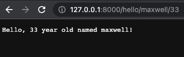
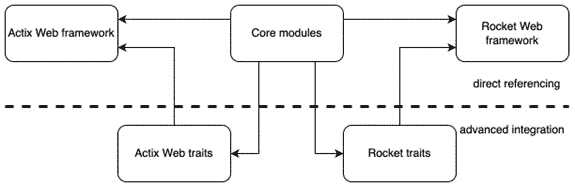
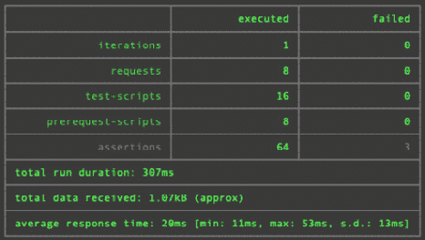

# 第十二章：在 Rocket 中重新创建我们的应用程序

到目前为止，我们已经使用**Actix Web 框架**构建了一个完全功能齐全的待办事项应用程序。在本章中，我们将探讨核心概念，这样如果我们决定在**Rocket**中完全重新创建待办事项应用程序，就不会有任何阻碍。这个框架可能对一些开发者有吸引力，因为它不需要太多的样板代码。

在本章中，我们将充分利用我们隔离的模块化代码，通过复制和插入现有的模块、视图、数据库连接配置和测试管道，在一章中完全重新创建我们的应用程序。即使你对在 Rocket 中构建 Web 应用程序不感兴趣，我仍然建议你完成这一章，因为你会体验到为什么执行良好的解耦测试和编写良好的代码是如此重要，因为良好的测试和结构将使你能够轻松切换 Web 框架。

在本章中，我们将涵盖以下主题：

+   什么是 Rocket？

+   设置我们的服务器

+   插入我们的现有模块

+   返回 JSON 状态

+   返回多个状态

+   使用 Rocket 注册我们的视图

+   插入我们的现有测试

到本章结束时，你将拥有一个功能齐全的待办事项应用程序，在 Rocket 中只需编写最少的代码。你不仅将了解配置和运行 Rocket 服务器的基础知识，而且还将能够将来自使用 Actix Web 的其他代码库的模块、视图和测试迁移到你的 Rocket 服务器，反之亦然。这不仅是一项宝贵的技能，而且也证实了高质量、隔离代码的需求。你将亲身体验为什么以及如何以我们的方式来结构化你的代码。

# 技术要求

在本章中，我们将基于在*第十一章*中构建的代码，*在 AWS 上使用 NGINX 配置 HTTPS*。您可以在以下 URL 找到它：[`github.com/PacktPublishing/Rust-Web-Programming-2nd-Edition/tree/main/chapter11/running_https_on_aws`](https://github.com/PacktPublishing/Rust-Web-Programming-2nd-Edition/tree/main/chapter11/running_https_on_aws)。

本章的代码可以在[`github.com/PacktPublishing/Rust-Web-Programming-2nd-Edition/tree/main/chapter12`](https://github.com/PacktPublishing/Rust-Web-Programming-2nd-Edition/tree/main/chapter12)找到。

# 什么是 Rocket？

Rocket 是一个 Rust Web 框架，类似于 Actix Web。它比 Actix Web 更新，在撰写本文时用户基础较小。在本书的前一版中，Rocket 运行在 nightly Rust 上，这意味着发布并不稳定。然而，现在，Rocket 运行在稳定的 Rust 上。

该框架确实有一些优势，这取决于你的编码风格。Rocket 更容易编写，因为它自己实现了样板代码，因此开发者不必自己编写样板代码。Rocket 还支持开箱即用的 JSON 解析、表单和类型检查，所有这些都可以用几行代码实现。例如，日志记录功能在启动 Rocket 服务器时就已经实现。如果你只想轻松地启动一个应用程序，那么 Rocket 是一个很好的框架。然而，它不如 Actix Web 稳定，这意味着当你变得更加高级时，你可能会羡慕 Actix Web 的一些特性和实现。然而，在我的所有网络开发年中，我从未遇到过由于框架选择而严重受阻的问题。这主要取决于个人偏好。为了真正感受到差异，尝试一下 Rocket 是有意义的。在下一节中，我们将创建一个基本服务器。

# 设置我们的服务器

当涉及到在 Rocket 中设置基本服务器时，我们将从 `main.rs` 文件中定义的所有内容开始。首先，启动一个新的 Cargo 项目，然后在 `Cargo.toml` 文件中使用以下代码定义 Rocket 依赖项：

```rs
[dependencies]
rocket = "0.5.0-rc.2"
```

在依赖项方面，我们现在需要的就是这些。现在，我们可以转到 `src/main.rs` 文件来定义应用程序。最初，我们需要使用以下代码导入 Rocket crate 和与 Rocket crate 相关的宏：

```rs
#[macro_use] extern crate rocket;
```

现在，我们可以使用以下代码定义一个基本的 *hello world* 视图：

```rs
#[get("/")]
fn index() -> &'static str {
    "Hello, world!"
}
```

通过前面的代码，我们可以推断出函数之前的宏定义了方法和 URL 端点。该函数是在调用视图时执行的逻辑，函数返回的内容就是返回给用户的内容。为了感受 URL 宏的强大功能，我们可以创建另外两个视图——一个显示 `hello`，另一个显示 `goodbye`：

```rs
#[get("/hello/<name>/<age>")]
fn hello(name: String, age: u8) -> String {
    format!("Hello, {} year old named {}!", age, name)
}
#[get("/bye/<name>/<age>")]
fn bye(name: String, age: u8) -> String {
    format!("Goodbye, {} year old named {}!", age, name)
}
```

在这里，我们可以看到我们可以将参数从 URL 传递到函数中。同样，这段代码清晰易懂。我们除了将这些视图附加到服务器并使用以下代码启动它之外，没有其他事情要做：

```rs
#[launch]
fn rocket() -> _ {
    rocket::build().mount("/", routes![index, hello, bye])
}
```

在这里，我们可以看到我们必须用 Rocket 的宏装饰 `main` 函数，并且我们正在附加没有前缀的我们定义的视图。然后我们可以运行 `cargo run` 命令来启动服务器。一旦我们执行了 `run` 命令，我们就会得到以下输出：

```rs
 Configured for debug.
   >> address: 127.0.0.1
   >> port: 8000
   >> workers: 8
   >> ident: Rocket
   >> limits: bytes = 8KiB, data-form = 2MiB, file = 1MiB, form =
   32KiB, json = 1MiB, msgpack = 1MiB, string = 8KiB
   >> temp dir: /var/folders/l7/q2pdx7lj0l72s0lsf3kc34fh0000gn/T/
   >> http/2: true
   >> keep-alive: 5s
   >> tls: disabled
   >> shutdown: ctrlc = true, force = true, signals = [SIGTERM],
   grace = 2s, mercy = 3s
   >> log level: normal
   >> cli colors: true
 Routes:
   >> (index) GET /
   >> (bye) GET /bye/<name>/<age>
   >> (hello) GET /hello/<name>/<age>
 Fairings:
   >> Shield (liftoff, response, singleton)
 Shield:
   >> X-Content-Type-Options: nosniff
   >> X-Frame-Options: SAMEORIGIN
   >> Permissions-Policy: interest-cohort=()
 Rocket has launched from http://127.0.0.1:8000
```

在这里，我们可以看到日志是全面的。它定义了端口、地址和服务器配置。然后定义了附加的路线以及公平性。有了前面的日志，我们可以看到服务器是健康的，我们有预期的路线。在这里，我们可以看到日志是现成的。我们不需要定义任何东西，与 Actix Web 不同。我们还得到一条说明已挂载的视图和服务器正在监听的 URL 的注释。

现在，我们可以在浏览器中调用我们的*hello*视图，它给出了以下输出：



图 12.1 – 调用我们的 hello 视图的结果

调用此视图也给我们以下日志：

```rs
GET /hello/maxwell/33 text/html:
   >> Matched: (hello) GET /hello/<name>/<age>
   >> Outcome: Success
   >> Response succeeded.
```

从查看日志来看，我们不能再对它提出更多要求了。我们现在已经有一个基本的服务器正在运行；然而，这并没有包含我们在之前的 Actix Web 应用程序中拥有的所有功能。重新编码我们所有的功能将导致章节过长。在下一节中，我们将利用我们的模块化代码，并将所有功能嵌入到我们的 Rocket 应用程序中。

# 插入现有模块

在整本书中，我们一直在各自的文件或目录中构建独立的模块，这些模块只关注一个过程。例如，数据库文件只专注于创建和管理数据库连接。待办事项模块只专注于构建待办事项，而 JSON 序列化模块完全专注于将数据结构序列化为 JSON。考虑到这些，我们将看到这些模块如何轻松地复制到我们的应用程序中并使用。一旦我们这样做，你就会亲身体会到为什么独立的模块很重要。

首先，我们必须在`Cargo.toml`文件中用以下代码定义我们的依赖项：

```rs
[dependencies]
rocket = {version = "0.5.0-rc.2", features = ["json"]}
bcrypt = "0.13.0"
serde_json = "1.0.59"
serde_yaml = "0.8.23"
chrono = {version = "0.4.19", features = ["serde"]}
serde = { version = "1.0.136", features = ["derive"] }
uuid = {version = "1.0.0", features = ["serde", "v4"]}
diesel = { version = "1.4.8", features = ["postgres",
                              "chrono", "r2d2"] }
lazy_static = "1.4.0"
```

这些是我们之前模块中使用的 crates。现在，我们可以使用以下 Bash 命令将`web_app`目录中的旧模块复制到我们的 Rocket 应用程序中：

```rs
cp -r ./web_app/src/json_serialization ./rocket_app/src/json_serialization
cp -r ./web_app/src/to_do ./rocket_app/src/to_do
cp -r ./web_app/src/models ./rocket_app/src/models
cp web_app/src/config.rs rocket_app/src/config.rs
cp web_app/config.yml rocket_app/config.yml
cp web_app/src/schema.rs rocket_app/src/schema.rs
cp ./web_app/src/database.rs ./rocket_app/src/database.rs
cp -r ./web_app/migrations ./rocket_app/migrations
cp ./web_app/docker-compose.yml ./rocket_app/docker-compose.yml
cp ./web_app/.env ./rocket_app/.env
```

事情几乎都正常；然而，我们确实有一些对 Actix web 框架的引用。这些可以通过删除特质的实现来删除。正如我们可以在以下图中看到的那样，独立的模块可以直接引用，而高级集成可以通过特质来实现：



图 12.2 – 我们的模块如何与不同的框架交互

一旦我们在`src/database.rs`和`src/json_serialization/to_do_items.rs`文件中删除了 Actix Web 特质的实现，我们就可以在`main.rs`文件中定义和导入我们的模块。`main.rs`文件的开头应该看起来像以下这样：

```rs
#[macro_use] extern crate rocket;
#[macro_use] extern crate diesel;
use diesel::prelude::*;
use rocket::serde::json::Json;
mod schema;
mod database;
mod json_serialization;
mod models;
mod to_do;
mod config;
use crate::models::item::item::Item;
use crate::json_serialization::to_do_items::ToDoItems;
use crate::models::item::new_item::NewItem;
use database::DBCONNECTION;
```

导入模块后，我们可以用以下代码重新创建`create`视图：

```rs
#[post("/create/<title>")]
fn item_create(title: String) -> Json<ToDoItems> {
    let db = DBCONNECTION.db_connection.get().unwrap();
    let items = schema::to_do::table
        .filter(schema::to_do::columns::title.eq(&title.as_str()))
        .order(schema::to_do::columns::id.asc())
        .load::<Item>(&db)
        .unwrap();
    if items.len() == 0 {
        let new_post = NewItem::new(title, 1);
        let _ = diesel::insert_into(schema::to_do::table)
                        .values(&new_post)
                        .execute(&db);
    }
    return Json(ToDoItems::get_state(1));
}
```

从前面的代码中我们可以看出，它类似于我们的 Actix Web 实现，因为我们正在使用现有的模块。唯一的区别是我们将`ToDoItems`结构体传递给 Rocket crate 的`Json`函数。我们还没有实现身份验证，所以现在我们只是将用户 ID 值`1`传递到所有需要用户 ID 的操作中。

现在我们完成了`create`视图，我们可以使用以下代码将其附加到我们的服务器上：

```rs
#[launch]
fn rocket() -> _ {
    rocket::build().mount("/", routes![index, hello, bye])
                   .mount("/v1/item", routes![item_create])
}
```

我们可以看到，我们不必构建自己的配置函数。我们只需将视图按顺序排列在带有前缀的数组中，装饰视图函数的宏定义了其余的 URL。现在我们可以使用以下命令运行我们的 Rocket 服务器：

```rs
cargo run config.yml
```

我们必须记住启动我们的`docker-compose`，以便数据库可访问，并使用`diesel`客户端在数据库上运行迁移。然后我们可以使用以下 URL 通过`post`请求创建我们的第一个待办事项：

```rs
http://127.0.0.1:8000/v1/item/create/coding
```

在发出`post`请求后，我们将得到以下响应体：

```rs
{
    "pending_items": [
        {
            "title": "coding",
            "status": "PENDING"
        }
    ],
    "done_items": [],
    "pending_item_count": 1,
    "done_item_count": 0
}
```

就这样！我们的应用程序正在运行，我们不必重写整个代码库。我知道我在这本书中一直在重复这一点，但结构良好、独立的代码的重要性不容忽视。我们在这里所做的是在重构系统时很有用的。例如，我曾在微服务系统中工作，我们必须从一个服务器中移除功能，因为它的范围变得太大，然后创建另一个。正如你所看到的，独立的模块使这样的任务变得像梦一样，可以在最短的时间内以最小的努力完成。

现在我们已经以基本的方式集成了现有的模块，我们可以通过为我们的模块实现 Rocket 特性来继续进行高级集成。

# 实现 Rocket 特性

我们在模块中定义的大部分逻辑，我们复制到代码中，可以直接在我们的代码中引用。然而，我们确实需要利用数据库连接和具有 Actix Web 特性实现的 JWT 结构体。如果我们复制视图，我们必须为数据库连接和 JWT 身份验证实现 Rocket 特性，因为我们把它们传递到 Actix Web 应用程序的视图函数中。

在我们实现 Rocket 特性之前，我们必须使用以下命令复制 JWT 文件：

```rs
cp web_app/src/jwt.rs rocket_app/src/jwt.rs
```

然后，我们必须在`Cargo.toml`文件中使用以下代码声明以下依赖项：

```rs
jsonwebtoken = "8.1.0"
```

我们现在可以继续到`src/jwt.rs`文件，为我们的 Rocket 特性实现。首先，我们必须在文件顶部使用以下代码导入以下特性和结构体：

```rs
use rocket::http::Status;
use rocket::request::{self, Outcome, Request, FromRequest};
```

`FromRequest` 特性实现的核心理念将保持一致，因为我们关注的是令牌的解码和认证。然而，由于我们是从 Rocket 框架中实现一个特性，而不是从 Actix Web crate 中实现，所以会有一些细微的差异。主要区别是我们必须使用以下代码构建自己的 `enum`，以定义可能的结果：

```rs
#[derive(Debug)]
pub enum JwTokenError {
    Missing,
    Invalid,
    Expired
}
```

我们在这里选择了不同的可能性，因为令牌可能不在头部，所以可能会缺失。或者，令牌可能不是我们的，所以可能是无效的。记住，我们有一个时间戳来强制过期时间。如果令牌已过期，它将具有过期状态。

下一步仅仅是实现 `FromRequest` 特性。由于代码是隔离的，并且只关注令牌的编码和解码，我们不需要修改 `JwToken` 结构体。我们可以用以下代码定义特性的实现大纲：

```rs
#[rocket::async_trait]
impl<'r> FromRequest<'r> for JwToken {
    type Error = JwTokenError;
    async fn from_request(req: &'r Request<'_>)
                          -> Outcome<Self, Self::Error> {
        . . .
    }
}
```

在这里，我们可以看到，我们使用 `async` 特性宏装饰了特性的实现。这是因为请求是以异步方式发生的。我们还必须定义生命周期注解。这是因为我们必须声明请求的生命周期将与特性实现的寿命相同。我们可以通过 `from_request` 函数中的 `request` 参数看到这一点。现在，我们可以将旧 Actix Web 实现的逻辑提升到 `from_request` 函数中，只需对返回的类型进行一些更改。提升的代码最终应该看起来像以下这样：

```rs
match req.headers().get_one("token") {
    Some(data) => {
        let raw_token = data.to_string();
        let token_result = JwToken::from_token(raw_token);
        match token_result {
            Ok(token) => {
                return Outcome::Success(token)
            },
            Err(message) => {
                if message == "ExpiredSignature".to_owned() {
                    return Outcome::Failure((Status::BadRequest,
                                           JwTokenError::Expired))
                }
                return Outcome::Failure((Status::BadRequest,
                    JwTokenError::Invalid))
            }
        }
    },
    None => {
        return Outcome::Failure((Status::BadRequest,
                                 JwTokenError::Missing))
    }
}
```

我们可以看到，我们已经将返回值包装在 Rocket 的 `Outcome` 中，这并不令人意外。当从头部解码或访问令牌失败时，我们也包括了我们的 `enum`。

我们的 `JwToken` 结构体现在可以插入到我们的 Rocket 应用程序中，但我们必须记住移除旧的 Actix 实现以及所有对 Actix Web 框架的引用。我们还在 `main.rs` 文件中声明了 `jwt` 模块，代码如下：

```rs
mod jwt;
```

我们下一步是实现对数据库连接的 `FromRequest` 特性。在这个阶段，自己尝试实现数据库连接的 `FromRequest` 特性是个不错的主意。为了实现这一点，你不需要了解任何新的内容。

如果你尝试自己实现数据库连接的 `FromRequest` 特性，步骤应该如下。

首先，我们必须在 `src/database.rs` 文件中导入所需的 Rocket 结构体和特性，代码如下：

```rs
use rocket::http::Status;
use rocket::request::{self, Outcome, Request, FromRequest};
```

然后，我们必须定义结果。我们要么得到连接，要么得不到，所以我们的 `enum` 只有一个可能的错误，其形式如下：

```rs
#[derive(Debug)]
pub enum DBError {
    Unavailable
}
```

然后，我们使用以下代码实现对数据库连接的 `FromRequest` 特性：

```rs
#[rocket::async_trait]
impl<'r> FromRequest<'r> for DB {
    type Error = DBError;
    async fn from_request(_: &'r Request<'_>)
                          -> Outcome<Self, Self::Error> {
      match DBCONNECTION.db_connection.get() {
         Ok(connection) => {
            return Outcome::Success(DB{connection})
         },
         Err(_) => {
            return Outcome::Failure((Status::BadRequest,
                                     DBError::Unavailable))
         }
      }
    }
}
```

前面的代码不应该令人惊讶太多；我们只是将获取数据库连接的现有逻辑与在`JwToken`实现中定义的`FromRequest`特性实现融合在一起。

注意

你可能已经注意到我们用`[rocket::async_trait]`注解了我们的`FromRequest`实现。我们使用这个注解是因为，在撰写本文时，Rust 中`async`特性的稳定化不包括特性中的`async`函数的支持。如果我们尝试在没有注解的情况下在特性中实现`async`函数，我们将得到以下错误：

```rs
trait fns cannot be declared `async`
```

`[rocket::async_trait]`注解使我们能够在特性实现中定义`async`函数。我们不能简单地解构`async`函数并拥有以下函数签名的原因有很多：

```rs
async fn from_request(_: &'r Request<'_>)
                      -> Pin<Box<dyn Future<Output
                      = Outcome<Self, Self::Error>>
                      + Send + '_>> {
```

然而，这不会奏效，因为我们不能在特性函数中返回`impl`特性，因为这不被支持。关于为什么特性中的`async`函数难以实现的深入阅读，请访问以下博客文章：[`smallcultfollowing.com/babysteps/blog/2019/10/26/async-fn-in-traits-are-hard/`](https://smallcultfollowing.com/babysteps/blog/2019/10/26/async-fn-in-traits-are-hard/)。

我们现在可以在`main.rs`文件中的`create`视图中实现我们的数据库连接。再次强调，这是一个很好的机会，让你尝试自己使用`FromRequest`特性来实现数据库连接。

如果你尝试在`create`视图中使用 Rocket 的`FromRequest`特性，你的代码应该看起来如下：

```rs
#[post("/create/<title>")]
fn item_create(title: String, db: DB) -> Json<ToDoItems> {
    let items = schema::to_do::table
        .filter(schema::to_do::columns::title.eq(&title.as_            str()))
        .order(schema::to_do::columns::id.asc())
        .load::<Item>(&db.connection)
        .unwrap();
    if items.len() == 0 {
        let new_post = NewItem::new(title, 1);
        let _ = diesel::insert_into(schema::to_do::table)
            .values(&new_post)
            .execute(&db.connection);
    }
    return Json(ToDoItems::get_state(1));
}
```

如果我们再次运行我们的应用程序，然后点击`create`端点，我们会看到我们的实现是有效的！这是一个启示，即我们的视图经过一些修改后可以复制粘贴到我们的 Rocket 应用程序中，从我们的 Actix Web 应用程序中。在下一节中，我们将把我们现有的视图集成到我们的 Rocket Web 应用程序中。

# 插入我们现有的视图

当涉及到我们的视图时，它们也是隔离的，我们可以通过一些小的修改将我们的视图复制到 Rocket 应用程序中，以回收我们在 Actix Web 应用程序中构建的视图。我们可以使用以下命令复制视图：

```rs
cp -r web_app/src/views rocket_app/src/views
```

通过这次复制，现在不用说我们也必须遍历并清除视图中的任何 Actix Web 框架的提及，因为我们没有使用它。一旦我们清除了视图中的任何 Actix Web 提及，我们就可以重构我们的现有代码，使其与 Rocket 框架兼容。我们将从我们的`login`视图开始，因为这个视图接收 JSON 体并返回 JSON，在接下来的小节中讨论。

## 接受和返回 JSON

在我们更改视图之前，我们需要确保我们已经使用以下代码在`src/views/auth/login.rs`文件中导入了所有需要的模块：

```rs
use crate::diesel;
use diesel::prelude::*;
use rocket::serde::json::Json;
use crate::database::DB;
use crate::models::user::user::User;
use crate::json_serialization::{login::Login,
                login_response::LoginResponse};
use crate::schema::users;
use crate::jwt::JwToken;
```

我们可以看到，除了来自 Rocket 包的`Json`结构体之外，没有太多变化。实现这些 Rocket 特性真的帮助我们切断了代码与 Actix 框架的联系，并连接到了 Rocket 框架，而无需更改实现这些特性的结构体的导入或使用方式。考虑到这一点，以下是我们登录视图的轮廓应该不会令人惊讶：

```rs
#[post("/login", data = "<credentials>", format = "json")]
pub async fn login<'a>(credentials: Json<Login>, db: DB) ->
                                        Json<LoginResponse> {
    . . .
}
```

我们可以看到，我们以与之前在 Actix 登录视图中相同的方式引用了我们传入的 JSON 体和数据库连接。主要的不同之处在于宏突出了数据是什么以及传入数据采取的格式。在`login`视图中，我们有以下逻辑：

```rs
let username: String = credentials.username.clone();
let password: String = credentials.password.clone();
let users = users::table
    .filter(users::columns::username.eq(username.as_str()))
    .load::<User>(&db.connection).unwrap();
match users[0].clone().verify(password) {
    true => {
        let user_id = users[0].clone().id;
        let token = JwToken::new(user_id);
        let raw_token = token.encode();
        let body = LoginResponse{token: raw_token.clone()};
        return Json(body)
    },
    false => panic!("unauthorised")
}
```

我们可以看到，代码中唯一的区别是，我们不是返回多个不同的代码，而是简单地抛出一个错误。这种方法并不理想。在之前的构建中，Rocket 框架曾经使用一个简单的响应构建器，就像在 Actix 中一样。然而，在撰写本文时，Rocket 在其最近的版本中实施了很多破坏性更改。标准响应构建器现在根本不起作用，需要复杂的特性实现才能返回带有代码、正文和头值的响应。撰写本文时，文档和示例也有限。更多关于构建更高级响应的阅读材料可在*进一步阅读*部分找到。

现在我们已经定义了`login`视图，我们可以继续到我们的`logout`视图，该视图返回原始 HTML。

## 返回原始 HTML

如果你还记得，我们的注销机制返回的是原始 HTML，它在浏览器中运行 JavaScript 来移除我们的令牌。当涉及到 Rocket 时，返回原始 HTML 非常简单。在我们的`src/views/auth/logout.rs`文件中，整个代码如下所示：

```rs
use rocket::response::content::RawHtml;
#[get("/logout")]
pub async fn logout() -> RawHtml<&'static str> {
        return RawHtml("<html>\
                <script>\
                    localStorage.removeItem('user-token'); \
                    window.location.replace(
                        document.location.origin);\
                </script>\
              </html>")
}
```

我们可以看到，它返回的是一个字符串，就像在之前的 Actix Web 视图中一样，但这个字符串被`RawHtml`结构体包裹。现在我们可以开始更新我们的待办事项操作视图，以便我们的用户可以操作待办事项，如下一节所述。

# 返回带有 JSON 的状态

到目前为止，我们已经返回了 JSON 和原始 HTML。然而，请记住，我们的待办事项应用程序返回带有不同状态的 JSON。为了探索这个概念，我们可以回顾一下`src/views/to_do/create.rs`文件中的`create`视图，在那里我们必须返回一个带有 JSON 体的创建状态。首先，所有我们的导入都与之前相同，除了来自 Rocket 框架的状态和 JSON 结构体，如下所示：

```rs
use rocket::serde::json::Json;
use rocket::response::status::Created;
```

使用这些导入，我们可以用以下代码定义`create`视图函数的轮廓：

```rs
#[post("/create/<title>")]
pub async fn create<'a>(token: JwToken, title: String, db: DB)
                                 -> Created<Json<ToDoItems>> {
    . . .
}
```

我们可以看到，我们的返回值是`Created`结构体，其中包含`Json`结构体，而`Json`结构体又包含`ToDoItems`结构体。我们还可以看到，我们的 JWT 身份验证也是以相同的方式在视图中实现的，因为，再次强调，我们正在实现 Rocket 特性。我们的数据库逻辑与之前的视图相同，如下面的代码所示：

```rs
let items = to_do::table
    .filter(to_do::columns::title.eq(&title.as_str()))
    .order(to_do::columns::id.asc())
    .load::<Item>(&db.connection)
    .unwrap();
if items.len() == 0 {
    let new_post = NewItem::new(title, token.user_id);
    let _ = diesel::insert_into(to_do::table).values(&new_post)
        .execute(&db.connection);
}
```

如果任务已经在数据库中不存在，我们将插入我们的新待办事项。一旦我们这样做，我们就获取我们系统的状态，并使用以下代码返回它：

```rs
let body = Json(ToDoItems::get_state(token.user_id));
return Created::new("").body(body)
```

空字符串是位置。这可以留空，不会产生任何后果。然后我们使用状态的`body`函数附加我们的主体。这就是我们想要运行`create`视图所需的所有内容。

当涉及到我们的待办任务的其它视图时，它们都将是我们为`create`视图所做内容的某种变体。所有待办事项视图都需要采取以下步骤：

1.  使用 JWT 进行认证。

1.  连接到数据库。

1.  从 JSON 主体中获取数据以及/或从 JWT 获取用户数据。

1.  对数据库中的数据进行一些操作（除了`GET`视图）。

1.  返回用户的数据库状态。

在看到我们对`create`视图所做的一切之后，你应该能够处理所有其他视图，使它们与 Rocket 框架兼容。我们已经涵盖了进行这些更改所需的所有内容。在书中详细说明这些更改会导致不必要的重复步骤被执行，过度膨胀它。这些更改可在书的 GitHub 仓库中找到。

一旦完成了待办事项视图，我们就可以继续到最后一个需要的视图，即创建用户，我们必须根据结果返回不同的状态。

# 返回多个状态

当涉及到创建用户时，我们只返回创建状态码或冲突状态码，不再返回其他内容。我们不需要返回数据，因为刚刚创建用户的个人已经知道用户详情。在 Rocket 中，我们可以不返回任何 body 而返回多个不同的状态码。我们可以在`src/views/to_do/create.rs`文件中探索这个概念，但首先，我们必须确保以下内容被导入：

```rs
use crate::diesel;
use diesel::prelude::*;
use rocket::serde::json::Json;
use rocket::http::Status;
use crate::database::DB;
use crate::json_serialization::new_user::NewUserSchema;
use crate::models::user::new_user::NewUser;
use crate::schema::users;
```

现在我们已经拥有了所有需要的东西，我们可以使用以下代码定义视图的轮廓：

```rs
#[post("/create", data = "<new_user>", format = "json")]
pub async fn create_user(new_user: Json<NewUserSchema>, db: DB)
    -> Status {
    . . .
}
```

在这里，我们可以看到除了返回一个单一的`Status`结构体之外，没有新的内容。我们的数据库逻辑如下所示：

```rs
let name: String = new_user.name.clone();
let email: String = new_user.email.clone();
let password: String = new_user.password.clone();
let new_user = NewUser::new(name, email, password);
let insert_result = diesel::insert_into(users::table)
            .values(&new_user).execute(&db.connection);
```

我们使用以下代码从两种可能的状态中返回一个状态：

```rs
match insert_result {
    Ok(_) => Status::Created,
    Err(_) => Status::Conflict
}
```

我们的视图已经完整。现在我们可以继续到下一节，将我们的视图注册到 Rocket 应用程序中。

# 将我们的视图注册到 Rocket

在我们继续到`src/main.rs`文件之前，我们必须确保我们的视图函数对`src/main.rs`可用。这意味着要遍历每个视图模块中的所有`mod.rs`文件，并将定义这些视图的函数声明为公共的。然后我们可以继续到`src/main.rs`文件，并确保以下内容被导入：

```rs
#[macro_use] extern crate rocket;
#[macro_use] extern crate diesel;
use rocket::http::Header;
use rocket::{Request, Response};
use rocket::fairing::{Fairing, Info, Kind};
```

`macro_use`声明不应该令人惊讶；然而，我们导入 Rocket 结构体来定义我们的 CORS 策略。有了这些 crate 导入，我们现在必须确保以下模块已被声明：

```rs
mod schema;
mod database;
mod json_serialization;
mod models;
mod to_do;
mod config;
mod jwt;
mod views;
```

这些模块对你来说都应该很熟悉。然后我们必须使用以下代码导入我们的视图：

```rs
use views::auth::{login::login, logout::logout};
use views::to_do::{create::create, delete::delete,
                   edit::edit, get::get};
use views::users::create::create_user;
```

我们现在已经导入了所有需要的内容。在声明服务器上的视图之前，我们需要定义我们的 CORS 策略。这是通过声明一个没有字段的 struct 来实现的。然后我们为这个 struct 实现`Fairing`特质，允许流量。Fairings 本质上定义了中间件。关于 Fairings 的更多信息可以在*进一步阅读*部分找到。我们的 CORS 策略可以用以下代码定义：

```rs
pub struct CORS;
#[rocket::async_trait]
impl Fairing for CORS {
    fn info(&self) -> Info {
        Info {
            name: "Add CORS headers to responses",
            kind: Kind::Response
        }
    }
    async fn on_response<'r>(&self, _request: &'r Request<'_>,
                                response: &mut Response<'r>) {
        response.set_header(Header::new(
                         "Access-Control-Allow-Origin", "*"));
        response.set_header(Header::new(
                        "Access-Control-Allow-Methods",
                        "POST, GET, PATCH, OPTIONS"));
        response.set_header(Header::new(
                        "Access-Control-Allow-Headers", "*"));
        response.set_header(Header::new(
                        "Access-Control-Allow-Credentials",
                        "true"));
    }
}
```

到这本书的这一部分，我们现在已经熟悉了 CORS 的概念以及如何实现 Rocket 特质。前面的代码不需要详细说明。

我们现在有了将视图挂载到服务器所需的所有内容，以下代码所示：

```rs
#[launch]
fn rocket() -> _ {
    rocket::build().mount("/", routes![index, hello, bye])
                   .mount("/v1/item/", routes![create, delete,
                                               edit, get])
                   .mount("/v1/auth/", routes![login, logout])
                   .mount("/v1/user/", routes![create_user])
                   .attach(CORS)
                   .manage(CORS)
}
```

再次强调，这里不需要任何解释。你可能已经注意到，我们已经开始简单地展示代码，几乎不进行解释。这是好事，因为我们已经熟悉了我们正在使用的构建块。不用担心——我们已经完成了主要 Rocket 应用程序的构建，因为它将运行并完成我们所需要的一切。我们可以手动测试这个。然而，这将花费时间且容易出错。

记住，我们是用 Postman 在 Newman 中构建我们的测试的！在下一节中，我们将使用现有的测试流程，通过几个命令来测试所有我们的端点。

# 插入我们现有的测试

因为我们已经在测试流程中使用了 Newman，所以我们不必担心与我们的 Web 框架选择的高耦合。首先，我们需要使用以下命令将`scripts`目录中的测试复制过来：

```rs
cp -r web_app/scripts rocket_app/scripts
```

然而，在运行之前，我们必须为我们的`login`视图添加一个`GET`方法，如下所示：

```rs
#[get("/login", data = "<credentials>", format = "json")]
pub async fn login_get<'a>(credentials: Json<Login>, db: DB)
                                    -> Json<LoginResponse> {
    // same logic as in the login view
}
```

然后，我们需要将这个视图导入到`src/main.rs`文件中，并在我们的服务器`auth`挂载中声明它。我们现在可以运行我们的完整测试，如下所示：

```rs
sh scripts/run_test_pipeline.sh
```

这将运行我们的完整流程，并给出以下结果：



图 12.3 – 我们完整测试流程的结果

我们可以看到，在 64 次检查中，只有 3 次失败了。如果我们继续向下滚动，我们可以看到错误仅发生因为我们为`create`视图返回了不同的响应代码，如下所示：

```rs
  #  failure                   detail
 1.  AssertionError            response is ok
                               expected response to have status
                               code 200 but got 201
                               at assertion:0 in test-script
                               inside "1_create"
 2.  AssertionError            response is ok
                               expected response to have status
                               code 200 but got 201
                               at assertion:0 in test-script
                               inside "2_create"
 3.  AssertionError            response is ok
                               expected response to have status
                               code 200 but got 201
                               at assertion:0 in test-script
                               inside "3_create"
```

在登录、认证、迁移以及每一步之间数据库中的数据状态方面，其他所有事情的表现都正如我们所预期的那样。

# 摘要

在本章中，我们介绍了复制我们的待办事项应用程序所需的主要概念。我们构建并运行了一个 Rocket 服务器。然后我们定义了路由并为我们的服务器建立了数据库连接。之后，我们探讨了中间件并构建了认证和数据处理，使用守卫来处理我们的视图。通过这些，我们创建了一个利用了本书中所有内容的视图。

我们在这里获得的是对我们在这本书中构建的模块代码的更深刻的欣赏。尽管我们回顾的一些概念自本书开始以来尚未触及，但这些模块是隔离的，只做一件事，并且做了它们标签所提议的事情。正因为如此，它们可以轻松地复制并用于完全不同的框架。我们的测试流程也派上了用场，立即确认我们的 Rocket 应用程序的行为与我们的 Actix Web 应用程序相同。考虑到这一点，我们的 Rocket 应用程序可以无缝集成到我们的构建和部署流程中，而不是我们的 Actix Web 应用程序。

在下一章中，我们将介绍构建 Web 应用程序的最佳实践，从而产生一个干净的 Web 应用程序存储库。在这里，你不仅将学习如何从测试和配置的角度来结构 Web 应用程序存储库，还将学习如何将 Web 应用程序打包到 Docker 中作为无依赖的发行版，从而产生大约 50 MB 的微型 Docker 镜像。

# 进一步阅读

+   火箭文档：[`rocket.rs/`](https://rocket.rs/)

+   火箭组件文档：[`rocket.rs/v0.4/guide/fairings/`](https://rocket.rs/v0.4/guide/fairings/)

+   *《使用 Rocket 进行 Rust 网络开发：使用 Rocket 框架开始 Rust 网络开发之旅的实用指南》*，*Karuna Murti*（2022 年），*Packt 出版*

# 问题

1.  我们亲身体验到了隔离过程的重要性，例如我们的测试流程。观察我们的测试流程，是否有可以移除的依赖关系，以进一步解耦流程，使其甚至不依赖于我们测试 Rust 服务器？

1.  我们如何使用 Actix 和 Rocket 等框架将模块中的所有功能附加和分离？

1.  我们如何在 AWS 上部署我们的 Rocket 服务器？

# 答案

1.  目前，我们的测试流程依赖于 Diesel 进行迁移。我们可以简单地构建自己的 SQL 脚本，存放在定义我们数据库版本版本的目录中。这将完全解耦我们的测试流程与我们要测试的服务器。如果服务器具有相同的端点和访问 PostgreSQL 数据库的权限，它可以使用我们的流程进行测试，无论服务器是用什么语言编写的。

1.  如果模块简单且接口良好，我们只需将其复制并导入我们想要使用它的地方。如果模块依赖于框架的高级功能，我们必须删除框架的特质实现，并为新的一个实现特质。

1.  我们需要注意，我们的测试流程是在没有任何修改的情况下运行了 Rocket 服务器。这是因为我们使用了相同的配置，并使用 Cargo 来构建和运行应用程序。我们只需将构建指向 Rocket 应用程序，并将我们的 Dockerfile 复制到 Rocket 应用程序中。然后，我们的构建过程将在 Docker 中构建 Rocket 应用程序并将其部署到 Docker Hub。我们的部署过程将然后从 Docker Hub 拉取镜像并部署它。我们知道我们的端点是相同的，并且以相同的方式表现，所以集成应该不会痛苦。
