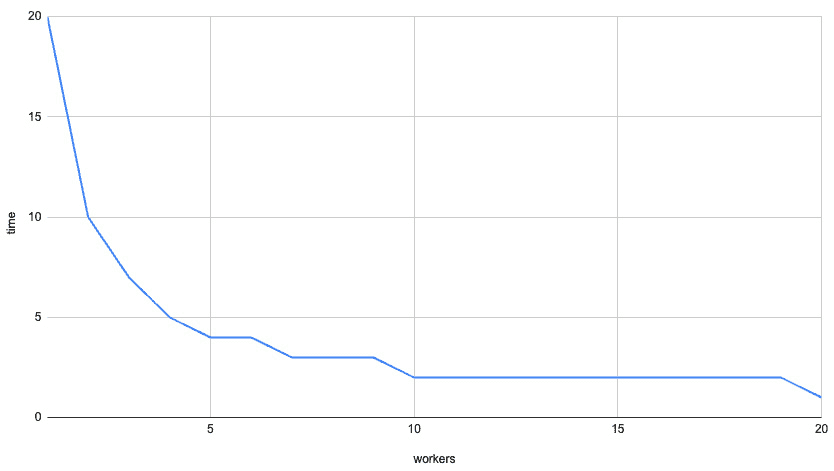

# 第十四章：探索 Tokio 框架

到目前为止，在这本书中，我们一直在使用框架构建 Web 应用，并将它们打包在 Docker 中以部署到服务器上。构建标准服务器是有用的，这将使我们能够解决一系列问题。然而，在你的 Web 开发生涯中，某个时刻，标准的 REST API 服务器可能不再是最佳解决方案。寻找另一个工具来实现更定制的解决方案是有用的。

在本章中，我们将探索**Tokio**框架以实现异步编程。然后，我们将使用 Tokio 运行时通过使用 channels 向异步代码块发送消息来构建安全的自定义异步系统。这些消息甚至可以发送到不同的线程。然后，我们将通过实现 actor 模型来促进对复杂问题的异步解决方案。

在本章中，我们将涵盖以下主题：

+   探索异步编程的 Tokio 框架

+   使用 workers 进行工作

+   探索异步编程的 actor 模型

+   使用 channels 进行工作

+   在 Tokio 中使用 actors

到本章结束时，你将能够创建使用 actor 模型解决复杂问题的异步程序。你的异步程序不需要任何外部基础设施，例如数据库，并且我们的异步程序实现将是安全和隔离的，因为你将能够通过 channels 在你的系统和线程之间传递数据。你将能够理解和实现高度并发异步程序和网络应用的构建块。

# 技术要求

在本章中，不需要任何之前的代码。

本章的代码可以在[`github.com/PacktPublishing/Rust-Web-Programming-2nd-Edition/tree/main/chapter14`](https://github.com/PacktPublishing/Rust-Web-Programming-2nd-Edition/tree/main/chapter14)找到。

# 探索异步编程的 Tokio 框架

在我们探索 Tokio 是什么以及它是如何工作之前，我们应该尝试在正常的 Rust 中执行一些异步代码。在本章中，我们将构建一个基本的模拟使用 Tokio。因此，我们将要编写的 Tokio 代码位于`simulation`目录中，作为一个独立的 Cargo 项目。鉴于我们在 Rust 服务器代码中运行`async`函数来处理视图，我们可以尝试在`main.rs`文件中的`main`函数中执行一个基本的`async`函数，以下代码如下：

```rs
async fn hello() {
    println!("Hello, world!");
}
fn main() {
    hello();
}
```

这看起来很简单；然而，如果我们尝试运行我们的`main`函数，我们会得到以下输出：

```rs
warning: unused implementer of `Future` that must be used
 --> src/main.rs:9:5
  |
9 |     hello();
  |     ^^^^^^^^
  |
  = note: `#[warn(unused_must_use)]` on by default
  = note: futures do nothing unless you `.await` or poll them
```

这里，我们被提醒我们的`async`函数是一个`Hello, world!`消息，因为我们没有等待`hello`函数执行。然而，如果我们对`hello`函数实现`await`，我们会得到以下错误：

```rs
8 | fn main() {
  |    ---- this is not `async`
9 |     hello().await;
  |            ^^^^^^ only allowed inside `async`
                      functions and blocks
```

`main`函数不是`async`的。如果我们尝试将我们的`main`函数转换为`async`函数，我们会得到一个非常清晰的错误消息，指出`main`函数不允许是`async`的。

我们可以自己实现实现`Future`特质的 struct，然后创建我们自己的 poll 方法。然而，从头开始创建自己的 future 对于本书的上下文来说过于繁琐，因为本书不是专门关于异步 Rust 的。幸运的是，Tokio 框架通过将我们的`main`运行时函数转换为异步运行时函数来提供帮助。要运行我们的`hello`函数，我们首先需要将 Tokio 添加到我们的`Cargo.toml`文件中，以下代码：

```rs
[dependencies]
tokio = { version = "1", features = ["full"] }
```

然后，我们在`main.rs`文件中导入以下 Tokio 宏和`Error`结构体，以启用异步运行时：

```rs
use tokio::main;
use std::error::Error;
```

然后，我们可以应用我们的 Tokio 宏来使`main`函数异步执行，并使用以下代码执行`hello`函数：

```rs
#[main]
async fn main() -> Result<(), Box<dyn Error>> {
    let outcome = hello().await;
    Ok(outcome)
}
```

在这里，我们可以看到我们要么返回一个包含空元组的`Result`，这在其他语言中与`None`或`Void`相同，要么返回一个错误。如果我们返回一个错误，我们返回一个实现`Error`特质的 struct，它由于`Box`表示法而位于堆内存中。现在我们运行我们的程序，我们将得到`hello world`消息。从这个结果中，我们可以推断出我们的程序在`hello`函数执行完毕之前是被阻塞的。然而，前面的代码要求我们返回某些内容，并且在定义中有一点点样板代码。如果我们删除所有导入，我们可以得到以下更简单的`main`函数：

```rs
#[tokio::main]
async fn main() {
    hello().await;
    println!("program has run");
}
```

在这里，我们可以看到我们不需要烦恼于`return`定义，我们可以在`main`函数的最后一个语句中做任何我们想做的事情。我们仍然在`await`上阻塞线程，正如以下打印输出所示：

```rs
Hello, world!
program has run
```

现在我们已经在 Tokio 中运行了基本的异步函数，我们可以进行一个实验。我们可以运行多个异步函数，并使用以下代码等待它们：

```rs
async fn hello(input_int: i32) -> i32 {
    println!("Hello, world! {}", input_int);
    return input_int
}
#[tokio::main]
async fn main() {
    let one = hello(1);
    let two = hello(2);
    let three = hello(3);
    let one = one.await;
    let three = three.await;
    let two = two.await;
    println!("{} {} {}", one, two, three);
}
```

运行此代码将产生以下输出：

```rs
Hello, world! 1
Hello, world! 3
Hello, world! 2
1 2 3
```

在这里，我们可以看到操作是按照`main`函数执行的顺序进行的。这意味着当我们使用`await`等待一个 future 完成时，运行时会阻塞，直到 future 完成。即使`two` future 在`three` future 之前定义，`three` future 也会在`two` future 之前执行，因为`three` future 在`two` future 之前被 await。

那么问题是什么？这有什么大不了的？如果我们的异步函数阻塞了运行时，那么我们为什么不去定义普通的函数呢？我们可以进行最后一个实验来了解 Tokio：标准的睡眠测试。首先，我们需要导入以下内容：

```rs
use std::time::Instant;
use std::{thread, time};
```

然后，我们重新定义我们的`hello`函数，使其在打印到终端之前暂停 5 秒钟，以下代码：

```rs
async fn hello(input_int: i32) -> i32 {
    let five_seconds = time::Duration::from_secs(5);
    tokio::time::sleep(five_seconds).await;
    println!("Hello, world! {}", input_int);
    input_int
}
```

我们在 hello 函数中等待未来执行时，会生成 Tokio 任务。我们使用`tokio::spawn`生成一个 Tokio 任务。Tokio 任务是一个轻量级、非阻塞的执行单元。虽然 Tokio 任务类似于操作系统线程，但它们不是由操作系统调度器管理，而是由 Tokio 运行时管理。生成的 Tokio 任务在线程池上运行。生成的任务可能对应于一个线程，也可能不对应。这取决于 Tokio 运行时。我们使用以下代码生成任务：

```rs
#[tokio::main]
async fn main() {
    let now = Instant::now();
    let one = tokio::spawn({
        hello(1)
    });
    let two = tokio::spawn({
        hello(2)
    });
    let three = tokio::spawn({
        hello(3)
    });
    one.await;
    two.await;
    three.await;
    let elapsed = now.elapsed();
    println!("Elapsed: {:.2?}", elapsed);
}
```

如果我们的未来阻塞了整个运行时间，那么经过的时间将是 15 秒。然而，运行我们的程序将给出以下输出：

```rs
Hello, world! 2
Hello, world! 3
Hello, world! 1
Elapsed: 5.00s
```

在这里，我们可以看到未来执行存在某种异步顺序。然而，总时间是 5 秒，因为它们是并发运行的。再次强调，从表面上看，这似乎并不太令人印象深刻。然而，这正是令人兴奋的地方。构建 Tokio 的超级聪明的人们通过轮询来跟踪线程。这就是 Tokio 运行时不断检查未来是否通过轮询一小部分内存来执行的地方。由于轮询，检查线程并不需要很多资源。因为检查线程不需要很多资源，Tokio 实际上可以保持数百万个任务开启。如果线程中有一个`await`实例并且它阻塞了该线程的运行时，Tokio 将简单地切换到另一个线程并开始执行新线程。在后台运行的未来会偶尔轮询任务执行器以查询是否有结果。因此，Tokio 非常强大，这就是为什么我们在探索 Actix 时使用 Tokio 作为我们的 Actix Web 服务器的运行时，如*第三章*中所述，*处理 HTTP 请求*。了解 Tokio 将使我们能够以较低级别构建自己的网络应用程序。

虽然使用 Tokio 生成多个线程很令人兴奋，但我们必须探索与多个工作者协同工作的权衡。

# 与工作者协同工作

当定义工作者时，我们可以使用以下代码增强 Tokio 运行时宏：

```rs
#[tokio::main(flavor = "multi_thread", worker_threads = 4)]
async fn main() {
    ...
}
```

在这里，我们可以看到我们声明运行时是多线程的，并且我们有四个工作者线程。工作者本质上是在循环中运行的进程。每个工作者通过一个通道消耗任务，将它们放入队列中。然后工作者通过任务工作，按照接收的顺序执行它们。如果一个工作者完成了所有任务，它将搜索其他工作者的队列，如果可用，就会窃取任务，就像这里看到的那样：


图 14.1 – 工作者事件循环（工作窃取运行时。由卡尔·勒奇创作 – 许可证 MIT：https://tokio.rs/blog/2019-10-scheduler#the-next-generation-tokio-scheduler）

现在我们知道我们可以改变工作线程的数量，我们可以测试工作线程的数量如何影响我们的运行时间。首先，我们必须将我们的`hello`函数改为每次只休眠 1 秒钟。然后，我们遍历一系列数字，为该范围的每次迭代生成一个任务，将生成任务的句柄推送到一个向量中。然后，我们使用以下代码等待向量中的所有 future：

```rs
#[tokio::main(flavor = "multi_thread", worker_threads = 4)]
async fn main() {
    let now = Instant::now();
    let mut buffer = Vec::new();
    for i in 0..20 {
        let handle = tokio::spawn(async move {
            hello(i).await
        });
        buffer.push(handle);
    }
    for i in buffer {
        i.await;
    }
    let elapsed = now.elapsed();
    println!("Elapsed: {:.2?}", elapsed);
}
```

我们可以运行程序，使用不同数量的工作线程来查看线程数量如何影响所需时间。为了节省您的时间，这已经完成，提供了*图 14.2*所示的图表：



图 14.2 – 时间与工作线程数量的关系

我们可以看到，前四个工作线程对程序的整体时间有重大影响。然而，当我们增加工作线程数量超过四个时，回报急剧减少。这可能因人而异。我得到这张图表是因为运行我们程序的计算机有四个核心。建议我们有一个工作线程对应一个核心。

我们现在已经成功地使用 Tokio 工作线程加快了我们的程序。我们也更深入地理解了工作线程的权衡以及它们如何处理任务。然而，理解这一点有什么优势呢？我们完全可以使用像 Actix Web 或 Rocket 这样的高级框架来并发处理 API 端点。是的，高级框架很有用，确实解决了问题，但这些只是问题的一个解决方案。在下一节中，我们将介绍演员模型，因为这是一个异步解决方案，可以根据您的需求在程序或 Web 服务器中运行。

# 探索异步编程的演员模型

如果您之前以面向对象的方式编写过解决复杂问题的复杂代码，您将熟悉对象、属性和类继承。如果您不熟悉，请不要担心——我们不会在本章中实现它们。然而，建议您阅读面向对象编程的概念，以全面理解演员模型。

对于对象，我们有一系列进程和围绕这些进程的封装状态，这些状态可以是对象的属性。对象对于将逻辑和状态封装在概念或进程周围非常有用。有些人仅仅把对象看作是减少重复代码的工具；然而，对象可以用作模块之间的接口，或者可以用作编排进程。对象是许多复杂系统的基石。然而，当涉及到异步编程时，对象可能会变得复杂——例如，当我们有两个对象引用另一个对象的数据时，或者在一般情况下，当我们有对象之间的共享资源时，同时修改它们，如以下图表所示：


图 14.3 – 对象和异步

在这个图中，我们可以想象一个系统，其中*对象 C*正在跟踪投资。我们在*对象 C*中编码了一个规则，即我们不花费超过 50 英镑。然而，*对象 A*和*对象 B*都在执行不同的股票投资过程。由于各种原因，从网络延迟到可能的不同价格计算策略，决定投资股票的过程可能会有所不同。尽管*对象 A*和*对象 B*都通过从*对象 C*获取已投资总额获得批准，但由于*对象 B*的过程先完成，所以*对象 B*首先下单。因此，当*对象 A*完成其过程并下单时，它可能会使我们的总投资超过 50 英镑。这是一个数据竞争问题。我们可能会因为两个竞争的投资执行过于接近而超出投资预算。当我们考虑到我们可能需要跟踪数百个头寸时，数据竞争最终会破坏我们策略的规则。

为了解决数据竞争问题，我们可以实现一个数据库，或者尝试监控所有运行的线程以实现互斥锁、读写锁等形式。然而，数据库解决方案需要更多的内存、基础设施和代码来处理数据。当程序关闭时，数据也会被持久化，这增加了管理的复杂性。锁定系统和跟踪共享资源也可能引入潜在的错误和过度复杂性，这对于我们定义的简单问题来说是不必要的。这就是演员发挥作用的地方。演员本质上是有自己状态的计算单元。然而，必须注意的是，演员不是免费的；它们需要更多的 RAM 使用。此外，演员可能会死亡，这也会导致它们的状态消失，因此数据库备份可以在演员死亡时帮助持久化状态。演员只通过通道使用消息进行通信。这些消息被排队，然后按照消息发送的顺序进行处理。这给我们带来了以下系统动态：


图 14.4 – 演员和异步

在这里，我们可以看到，如果我们没有超过我们的投资预算，*演员 C*会接受消息并下单。我们可以让数百个演员向*演员 C*发送买卖消息，同时仍然有信心不会超过预算。随着我们添加更多的演员，我们的系统并不会变得越来越复杂。没有任何东西阻止我们让*演员 C*向其他演员发送消息，以根据我们投资预算的当前状态停止或增加买卖头寸的数量。

要构建更复杂的系统，你必须熟悉以下术语：

+   **演员**：一个可以包含状态并通过处理接收到的消息来修改该状态的作业单元。你永远不会直接引用演员状态或演员。

+   **actor 引用**：对 actor 的引用。这允许你发送消息给 actor，而无需知道其实现类型或网络上的位置。我所需要知道的是，如果我们向 actor 发送消息，我们会得到*X*。我们不需要知道 actor 是否在某个地方是本地的。

+   **actor 系统**：存在于单个进程内的 actor 集合，通过内存消息传递进行通信。

+   **集群**：网络化 actor 系统的集合，其 actor 通过 TCP 消息传递进行通信。

令人兴奋的是，我们可以实现异步操作，而无需依赖于数据库或跟踪线程。我们可以在 Tokio 运行时中运行所有操作，只需一个静态二进制文件！这非常强大。然而，没有任何阻止我们在微服务集群规模上以纳米服务的形式使用 actor 模型。在撰写本书时，纳米服务被轻描淡写地提及，并被一些公司如 Netflix 所使用。然而，通过我们在 Rust 和 distroless 容器中探索的内容，我们可以将 Rust 服务器部署到集群中，每个服务器只需 50 MB。根据本书到目前为止所涵盖的内容，没有任何阻止您推动边界并构建纳米服务，以及使用纳米服务实现 actor 模型。

actor 模型正在许多物联网设备和实时事件系统中使用。以下是一些使用 actor 模型的应用程序列表：

+   事件驱动应用程序（聊天、工作流、CRM）

+   金融（定价、欺诈检测、算法交易）

+   游戏（多人游戏）

+   分析和监控

+   营销自动化

+   系统集成

+   物联网（医疗保健、交通、安全）

好吧——我们可能永远无法真正理解好莱坞演员，但至少我们对计算 actor 很熟悉。在高级概念之后，我们可以继续构建 actor 系统的构建块：actor。在我们与 actor 一起工作之前，我们需要让 actor 相互通信。这可以通过 Tokio 中的通道来实现。

# 与通道一起工作

我们可以通过重写`main.rs`文件来实验通道。首先，我们需要导入通道并实现`main`特质为`main`函数，以下代码：

```rs
use tokio::sync::mpsc;
#[tokio::main]
async fn main() {
    ...
}
```

在这里，我们可以看到我们导入了`mpsc`模块。`mpsc`。我们现在可以创建我们的通道并启动一个线程，该线程将多个消息发送到我们在`main`函数中创建的通道的接收器。以下代码：

```rs
let (tx, mut rx) = mpsc::channel(1);
tokio::spawn(async move {
    for i in 0..10 {
        if let Err(e) = tx.send(i).await {
            println!("send error: {:?}", e);
            break;
        }
        println!("sent: {}", i);
    }
});
```

在这里，我们可以看到通道的创建返回一个元组，我们解包以传输（`tx`）和接收（`rx`）。然后我们遍历从 0 到 10 的整数范围，将它们发送到我们创建的通道。如果有错误，我们将其打印出来并返回一个空元组，中断循环。在下一个循环中，我们打印出我们发送到通道的内容。然后我们可以使用以下代码接收消息：

```rs
while let Some(i) = rx.recv().await {
    println!("got: {}", i);
}
```

必须注意，通道的分割 halves 实现了 `Iterator` 特性，使我们能够通过 `while` 循环从这些通道中读取消息。如果我们现在运行我们的代码，我们会得到以下输出：

```rs
sent: 0
got: 0
sent: 1
got: 1
sent: 2
got: 2
...
```

打印输出继续到 `9`，但我们已经了解了正在发生的事情。我们不是发送所有消息然后处理它们。两个代码块是并行执行的，发送和接收消息。如果我们让其中一个代码块在迭代之间休眠，我们仍然会得到相同的打印输出。

虽然获取异步消息发送和接收的基础是一个正确的方向上的好步骤，但它并不实用。目前，我们只是在发送一个数字。如果我们想要能够实现相互通信的演员，我们需要能够在通道上发送更全面的消息。为了找出如何做到这一点，我们可以检查 `channel` 的源代码，它揭示了以下内容：

```rs
pub fn channel<T>(buffer: usize) -> (Sender<T>, Receiver<T>) {
    assert!(buffer > 0, "mpsc bounded channel requires
            buffer > 0");
    let semaphore = (semaphore::Semaphore::new(buffer),
                     buffer);
    let (tx, rx) = chan::channel(semaphore);
    let tx = Sender::new(tx);
    let rx = Receiver::new(rx);
    (tx, rx)
}
```

我们可以看到，`channel` 函数正在实现泛型。发送者和接收者可以发送任何东西，只要它是一致的，正如在 `(Sender<T>, Receiver<T>)` 返回类型中所表示的。既然我们知道 `channel` 函数可以加载任何类型，我们就可以在 `channel` 函数外部创建一个消息结构体，以下代码所示：

```rs
#[derive(Debug, Clone)]
pub enum Order {
    BUY,
    SELL
}
#[derive(Debug, Clone)]
pub struct Message {
    pub order: Order,
    pub ticker: String,
    pub amount: f32
}
```

在这里，我们有一个具有订单的结构体，该订单可以是 `BUY` 或 `SELL`。我们的 `Message` 结构体还有一个股票的标记，用来表示正在处理的股票名称和处理股票的数量。在我们的 `main` 函数中，我们随后将我们的 `Message` 结构体传递给 `channel` 函数，并定义我们将要购买的股票，以下代码所示：

```rs
let (tx, mut rx) = mpsc::channel::<Message>(1);
let orders = [
    Message { order: Order::BUY,
              amount: 5.5, ticker: "BYND".to_owned()},
    Message { order: Order::BUY,
              amount: 5.5, ticker: "NET".to_owned()},
    Message { order: Order::BUY,
              amount: 5.5, ticker: "PLTR".to_owned()},
];
```

现在我们已经定义了订单，我们通过以下代码遍历订单，发送和接收它们：

```rs
tokio::spawn(async move {
    for order in orders {
        if let Err(e) = tx.send(order.clone()).await {
            println!("send error: {:?}", e);
            return;
        }
        println!("sent: {:?}", order);
    }
});
while let Some(i) = rx.recv().await {
    println!("got: {:?}", i);
}
```

现在运行我们的程序会给我们以下输出：

```rs
sent: Message { order: "BUY", ticker: "BYND", amount: 5.5 }
sent: Message { order: "BUY", ticker: "NET", amount: 5.5 }
got: Message { order: "BUY", ticker: "BYND", amount: 5.5 }
got: Message { order: "BUY", ticker: "NET", amount: 5.5 }
sent: Message { order: "BUY", ticker: "PLTR", amount: 5.5 }
got: Message { order: "BUY", ticker: "PLTR", amount: 5.5 }
```

我们可以看到，我们正在通过通道发送和接收消息。然而，在我们继续之前，必须注意，如果我们将传递给 `channel` 函数的缓冲区大小从 1 增加到 300，我们会得到以下打印输出：

```rs
sent: Message { order: "BUY", ticker: "BYND", amount: 5.5 }
sent: Message { order: "BUY", ticker: "NET", amount: 5.5 }
sent: Message { order: "BUY", ticker: "PLTR", amount: 5.5 }
got: Message { order: "BUY", ticker: "BYND", amount: 5.5 }
got: Message { order: "BUY", ticker: "NET", amount: 5.5 }
got: Message { order: "BUY", ticker: "PLTR", amount: 5.5 }
```

这是因为缓冲区太大，可以在不需要等待通道被读取（排空）直到有更多可用的新缓冲区的情况下发送多个消息。

# 在 Tokio 中与演员一起工作

这将是最后一次我们重写我们的 `main.rs` 文件。然而，一旦我们完成这一部分，我们将构建一个基本的演员模型系统。在我们的系统中，我们将创建一个演员来跟踪订单，这样我们就不超过我们的预算阈值。然后我们需要构建一个发送订单的演员，从而产生以下过程：


图 14.5 – 我们为演员的股票订单交互

我们可以看到，这次我们需要在订单消息中发送发出订单的演员的地址。这是一个设计选择，因为在我们系统中，*订单*演员在订单制作后迅速启动并死亡。我们无法在我们的*订单簿*演员中跟踪所有*订单*演员的地址。相反，*订单簿*演员可以从消息中获取地址以将响应发送给*订单*演员。首先，我们必须导入以下内容：

```rs
use tokio::sync::{mpsc, oneshot, mpsc::Sender};
```

在这里，我们导入`mpsc`通道以向*订单簿*发送消息。然后我们导入`oneshot`通道以促进结果被发送回*订单*。`oneshot`通道是一个在发送消息之前保持打开状态的通道。这是因为`oneshot`通道的容量/缓冲区大小为 1，因此它绑定在只发送一条消息之前关闭通道。

现在我们已经导入了所有需要的内容，我们可以继续定义以下代码的消息：

```rs
#[derive(Debug)]
pub struct Message {
    pub order: Order,
    pub ticker: String,
    pub amount: f32,
    pub respond_to: oneshot::Sender<u32>
}
```

在这里，我们可以看到我们已经附加了`Sender`结构体，这使得接收者可以通过通道向发送者发送值。通过这条消息，我们可以使用以下代码构建我们的*订单簿*演员：

```rs
pub struct OrderBookActor {
    pub receiver: mpsc::Receiver<Message>,
    pub total_invested: f32,
    pub investment_cap: f32
}
```

*订单簿*演员的状态将在整个程序的生命周期中持续存在。`receiver`字段将用于接收来自所有*订单*演员的传入消息，并且将根据我们创建演员时定义的总投资和投资上限来做出处理订单的决定。我们现在必须实现创建*订单簿*演员、处理传入消息和按照以下大纲运行演员的函数：

```rs
impl OrderBookActor {
    fn new(receiver: mpsc::Receiver<Message>,
           investment_cap: f32) -> Self {
        . . .
    }
    fn handle_message(&mut self, message: Message) {
        . . .
    }
    async fn run(mut self) {
        . . .
    }
}
```

我们可以从构造函数（`new`函数）开始，它具有以下形式：

```rs
fn new(receiver: mpsc::Receiver<Message>, investment_cap:
       f32) -> Self {
    return OrderBookActor {
        receiver,
        total_invested: 0.0,
        investment_cap
    }
}
```

构造函数的实现并不令人惊讶。我们只是传递一个接收者和投资上限，并自动将总投资设置为`0`。现在*订单*演员可以被构建，我们可以使用以下代码处理*订单*演员接收到的消息：

```rs
fn handle_message(&mut self, message: Message) {
    if message.amount + self.total_invested >=
        self.investment_cap {
        println!("rejecting purchase, total invested: {}",
                  self.total_invested);
        let _ = message.respond_to.send(0);
    } else {
        self.total_invested += message.amount;
        println!("processing purchase, total invested: {}",
                  self.total_invested);
        let _ = message.respond_to.send(1);
    }
}
```

在这里，我们保持了实现的基本性。如果新的订单使我们的投资资本超过我们的阈值，我们打印出我们已拒绝订单并返回`0`。如果我们的新订单没有违反阈值，我们然后打印出我们正在处理订单并发送一个`1`。在我们的例子中，*订单*演员不会对*订单簿*演员的响应采取行动；然而，如果您要构建一个系统，其中可以放置另一个订单（例如，卖出订单），建议您根据结果创建另一个基于*订单*的演员。

我们*订单簿*演员剩下的唯一函数是`run`函数，它使用以下代码定义：

```rs
async fn run(mut self) {
    println!("actor is running");
    while let Some(msg) = self.receiver.recv().await {
        self.handle_message(msg);
    }
}
```

在这里，我们只是等待消息，直到我们通道中的所有发送者都被杀死。如果向我们的演员发送消息，我们使用我们的`handle_message`函数处理它。

我们的*订单簿*演员现在可以通过三个单独的函数来构建、运行和接收通过通道返回的响应消息。我们需要构建一个*订单*演员结构体，以便我们可以向我们的*订单簿*演员发送消息。首先，我们使用以下代码定义我们的订单字段：

```rs
struct BuyOrder {
    pub ticker: String,
    pub amount: f32,
    pub order: Order,
    pub sender: Sender<Message>
}
```

在这里，我们需要定义我们正在购买的股票的股票代码、购买的数量和订单类型。然后我们有`Sender`结构体，以便我们可以向*订单簿*发送消息。对于*订单*演员，我们只需要两个函数：构造函数和`send`函数。这是因为我们的*订单*演员是发送初始消息的那个，所以*订单*演员不需要一个单独的函数来等待消息。我们为我们的*订单*演员的两个函数有以下大纲：

```rs
impl BuyOrder {
    fn new(amount: f32, ticker: String,
           sender: Sender<Message>) -> Self {
        . . .
    }
    async fn send(self) {
        . . .
    }
}
```

在这个时间点，你应该能够自己编写*订单*演员的构造函数。如果你停下来尝试编写这个函数，你的代码应该看起来像这样：

```rs
fn new(amount: f32, ticker: String,
       sender: Sender<Message>) -> Self {
    return BuyOrder { ticker, amount,
                      order: Order::BUY, sender }
}
```

在这里，我们只是将参数传递给结构的创建，其中`order`字段自动设置为`BUY`。

构造函数构建完成后，唯一需要定义的函数是`send`函数，其形式如下：

```rs
async fn send(self) {
    let (send, recv) = oneshot::channel();
    let message = Message { order: self.order,
                            amount: self.amount,
                            ticker: self.ticker,
                            respond_to: send};
    let _ = self.sender.send(message).await;
    match recv.await {
        Err(e) => println!("{}", e),
        Ok(outcome) => println!("here is the outcome: {}",
                                 outcome)
    }
}
```

在这里，我们设置了一个一次性通道，一旦从*订单簿*演员那里收到响应就会关闭。然后我们将我们的消息与*订单*演员结构体的字段打包，并在消息的`respond_to`字段中包含*订单*演员的地址。然后*订单*演员发送消息并等待响应，我们只是简单地打印出来，因为这只是一个示例。

我们的系统组件现在已经构建完成。现在我们可以在`main`函数中使用以下代码来编排我们的演员协同工作：

```rs
#[tokio::main]
async fn main() {
    let (tx, rx) = mpsc::channel::<Message>(1);
    let tx_one = tx.clone();
    tokio::spawn(async move {
        . . .
    });
    tokio::spawn(async move {
        . . .
    });
    let actor = OrderBookActor::new(rx, 20.0);
    actor.run().await;
}
```

在这里，我们定义了通道并将发送者克隆到通道中一次，这样我们就有两个相同的通道的发送者。这是因为我们有两个 Tokio 线程发送订单消息。然后我们创建我们的*订单簿*演员并运行它。如果我们克隆了另一个发送者但没有使用它，我们的程序将永远挂起，直到我们关闭它，因为*订单簿*演员会等待所有发送者被杀死后才会停止。

在我们的线程中，我们将简单地使用以下代码使用循环发送大量股票：

```rs
tokio::spawn(async move {
    for _ in 0..5 {
        let buy_actor = BuyOrder::new(5.5,
                                      "BYND".to_owned(),
                                      tx_one.clone());
        buy_actor.send().await;
    }
    drop(tx_one);
});
tokio::spawn(async move {
    for _ in 0..5 {
        let buy_actor = BuyOrder::new(5.5,
                                      "PLTR".to_owned(),
                                      tx.clone());
        buy_actor.send().await;
    }
    drop(tx);
});
```

需要注意的是，在我们发送完所有消息后，我们会丢弃`tx_one`和`tx`传输器，以提前发出任务完成的信号，而不是等待运行时结束来关闭通道。我们有两个线程在运行，因为我们想正确检查我们的*订单簿*是否可以安全地处理并发消息。如果我们运行我们的程序，我们会得到以下输出：

```rs
processing purchase, total invested: 5.5
here is the outcome: 1
processing purchase, total invested: 11
processing purchase, total invested: 16.5
here is the outcome: 1
here is the outcome: 1
rejecting purchase, total invested: 16.5
here is the outcome: 0
rejecting purchase, total invested: 16.5
here is the outcome: 0
. . .
```

在这里，我们可以看到消息正在以异步方式发送和处理到我们的*订单簿*演员。然而，无论你运行程序多少次，你都不会超过你的投资阈值。

我们终于得到了这个。Tokio 允许我们在 `main` 函数中运行异步代码，而演员模型允许我们构建无需依赖锁、线程处理、线程间状态传递或外部基础设施（如数据库）即可轻松理解的同步代码。这并不意味着我们应该将演员模型应用到所有事物上。然而，如果你想要编写安全、简单、可测试的异步代码，且无需外部基础设施并快速访问本地内存，那么结合 Tokio 的演员模型是非常强大的。

# 摘要

在本章中，我们成功地回顾了异步编程。最初，我们通过研究 Tokio 框架能够做什么以及实现基本的异步代码来探索 Tokio 框架，然后这些代码由 Tokio 框架实现。然后我们增加了工作线程的数量，以证明当我们仅仅增加工作线程的数量时，我们会得到递减的回报。然后我们使用通道来促进通过这些通道发送消息。这使得我们能够在代码的不同区域之间发送数据，即使代码在不同的线程中运行。

然而，尽管使用 Tokio 框架进行异步编程很有趣且令人愉快，但仅通过 Tokio 和通道的异步编程组合本身并不能直接导致实际应用。为了获得一些与 Tokio 和异步编程相关的实用技能，我们探索了演员框架。在这里，我们定义具有自己状态的 struct，然后通过通道在现在称为演员的 struct 之间进行通信。然后我们使用演员构建了一个基本系统，该系统在异步方式下放置订单，即使投资金额不超过定义的阈值。在 Tokio 中实现演员模型使我们能够构建无需任何外部基础设施（如数据库）的安全异步系统。在下一章中，我们将构建自定义异步系统的能力提升到新的水平，通过为我们的 Tokio 异步应用程序构建 TCP 监听器，这意味着我们可以监听来自其他应用程序和通过网络连接到我们的应用程序的客户端发送的命令。

# 进一步阅读

+   Tokio 文档：[`tokio.rs/tokio/tutorial`](https://tokio.rs/tokio/tutorial)

)

# 问题

1.  演员模型是如何防止数据竞争问题的？

1.  我们如何设计一种双向通信，使得一个演员可以向另一个演员发送消息并得到回应？

1.  如果我们有两个演员各自向第三个演员发送一条消息，但我们为促进演员间通信的 MPSC 通道克隆了三个发送者的实例，那么我们的程序会发生什么？

1.  使用通道和消息在代码块之间通信数据有什么优势？

# 答案

1.  演员模型是演员之间发送消息的地方。每个演员都有一个队列来处理发送给该演员的传入消息。正因为如此，传入的消息按照接收的顺序进行处理。

1.  接收初始消息的演员拥有 MPSC 通道的接收者。发送初始消息的演员是 MPSC 通道的发送者，并创建了一个单次使用的通道。发送初始消息的演员随后在初始消息中发送单次通道的发送者。发送初始消息的演员然后等待接收初始消息的演员处理数据，然后使用初始发送者中的发送者发送回响应。

1.  我们的项目将按照预期运行；然而，由于我们只有两个发送消息的演员，因此只有两个用于 MSPC 通道的发送者会被终止。这意味着将有一个发送者剩余。由于有一个发送者未被使用完，通道不会被关闭，所以接收演员将继续无限期地保持程序运行。

1.  通道和消息为我们提供了很多灵活性。我们可以在线程之间发送消息。我们也不必在代码的多个不同区域传递数据。如果一个代码块与一个通道有连接，该代码块可以接收/发送数据。我们还必须注意，我们可以实现不同的模式。例如，我们可以将消息发射到通道中并由多个订阅者接收。我们还可以强制交通方向或规则，如单次使用。这意味着我们对数据的流动有大量的控制。
