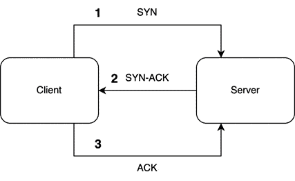

# 第十五章：使用 Tokio 接受 TCP 流量

在上一章中，我们成功地在不同的线程中运行演员以相互发送消息。虽然编写异步编程的构建块令人兴奋，但我们留下了那个不太实用的应用。在本章中，我们将创建一个使用 Tokio 的服务器，该服务器监听端口上的 **TCP** 流量。如果发送了消息，我们的 TCP 服务器将处理传入的数据，通过一系列演员和线程执行操作，然后将更新后的数据返回给客户端。

本章将涵盖以下主题：

+   探索 TCP

+   接受 TCP

+   处理字节

+   将 TCP 传递给演员

+   使用演员跟踪订单

+   连接演员之间的通信

+   使用 TCP 进行响应

+   通过客户端发送不同的命令

到本章结束时，您将了解如何使用 TCP，以及如何使用字节打包和解包通过 TCP 发送的数据。有了这些知识，您将能够创建一个使用 Tokio 来监听传入消息的服务器，处理这些消息，然后通过一系列线程和演员根据传入的消息执行计算单元。

# 技术要求

在本章中，我们将基于第*14 章*的代码，*探索 Tokio 框架*进行构建。您可以在以下网址找到它：[`github.com/PacktPublishing/Rust-Web-Programming-2nd-Edition/tree/main/chapter14/working_with_actors`](https://github.com/PacktPublishing/Rust-Web-Programming-2nd-Edition/tree/main/chapter14/working_with_actors)。

本章的代码可以在[`github.com/PacktPublishing/Rust-Web-Programming-2nd-Edition/tree/main/chapter15`](https://github.com/PacktPublishing/Rust-Web-Programming-2nd-Edition/tree/main/chapter15)找到。

# 探索 TCP

**TCP** 代表 **传输控制协议**。TCP 是互联网上使用最广泛的传输协议之一。TCP 实质上是一种协议，它通过套接字在程序或计算机之间传输字节。TCP 用于万维网、电子邮件、远程管理和文件传输。**传输层安全性/安全套接字层**（**TLS/SSL**）协议建立在 TCP 之上。这意味着 HTTP 和 HTTPS 是建立在 TCP 之上的。

TCP 是一种面向连接的协议。这意味着在传输任何数据之前，客户端和服务器之间会建立连接。这是通过三次握手实现的：

1.  **SYN**：最初，客户端向服务器发送一个 SYN。SYN 是一个带有随机数的消息，以确保相同的客户端正在与服务器通信。

1.  **SYN-ACK**：然后服务器向客户端响应初始序列号和一个额外的随机数，称为 ACK。

1.  **ACK**：最后，客户端向服务器返回 ACK 以确认连接已被确认。

*步骤 1*和*步骤 2*建立并确认客户端和服务器之间的序列号。*步骤 2*和*步骤 3*建立并确认从服务器到客户端的序列号：



图 15.1 – TCP 握手

在本章中，我们将把上一章构建的 actor 模型转换为能够接受来自程序外部的 TCP 流量作为命令。首先，我们需要让我们的程序接受 TCP 连接。

# 接受 TCP

在我们编写任何 TCP 代码之前，我们必须承认我们的代码存在因所有代码都在一个文件中而变得臃肿的风险。为了防止`src/main.rs`文件变得臃肿，我们必须将`src/main.rs`文件中除主函数之外的所有代码复制到一个名为`src/actors.rs`的文件中。现在，我们可以完全清除`src/main.rs`文件，并用以下大纲填充它：

```rs
use tokio::net::TcpListener;
use std::{thread, time};
#[tokio::main]
async fn main() {
    let addr = "127.0.0.1:8080".to_string();
    let mut socket = TcpListener::bind(&addr).await.unwrap();
    println!("Listening on: {}", addr);
    while let Ok((mut stream, peer)) =
        socket.accept().await {
        println!("Incoming connection from: {}",
                  peer.to_string());
        tokio::spawn(async move {
            . . .
        });
    }
}
```

在这里，我们导入了一个 TCP 监听器来监听传入的流量。我们还导入了`Tokio`crate 中的结构体，使我们能够执行睡眠函数并定义我们的`main`运行时函数。在我们的`main`函数中，我们定义了我们的地址并将其绑定到 TCP 监听器。我们直接解包，因为如果我们无法绑定地址，就没有继续程序的必要。你可以通过增加端口号 1 直到找到一个开放的端口号来处理地址绑定的结果，但在这个例子中，我们应该保持服务器实现的简单性。然后，我们有一个`while`循环，在整个程序的生命周期内持续接受新的连接，如果程序没有被中断或套接字没有问题，这个循环可以是无限的。一旦我们得到一个连接，我们就创建一个新的线程并处理传入的消息。

目前，对于我们的传入消息，我们只需睡眠 5 秒钟，如下面的代码所示：

```rs
tokio::spawn(async move {
    println!("thread starting {} starting",
               peer.to_string());
    let five_seconds = time::Duration::from_secs(5);
    let begin = time::Instant::now();
    tokio::time::sleep(five_seconds);
    let end = begin.elapsed();
    println!("thread {} finishing {}", peer.to_string(),
              end.as_secs_f32());
});
```

在这里，我们打印线程开始时的时间，并在结束时打印持续时间。持续时间应该超过延迟。我们还让线程睡眠。打印语句和睡眠功能将使我们能够追踪当我们从不同的程序发送多个消息时发生了什么。

现在我们已经定义了接受 TCP 流量的程序，我们可以在不同的目录中创建一个新的 Rust cargo 项目作为客户端，该客户端将向服务器发送消息。在这个新项目中，`Cargo.toml`文件将包含与 TCP 服务器相同的依赖项。在`main.rs`文件中，我们有以下简单的程序：

```rs
use tokio::net::TcpStream;
use tokio::io::AsyncWriteExt;
use std::error::Error;
#[tokio::main]
async fn main() -> Result<(), Box<dyn Error>> {
    let mut stream =
        TcpStream::connect("127.0.0.1:8080").await?;
    println!("stream starting");
    stream.write_all(b"hello world").await?;
    println!("stream finished");
    Ok(())
}
```

这个程序仅仅与 TCP 服务器建立连接，然后将`hello world`以字节形式写入 TCP 流。一旦字节写入完成，我们就结束了。现在，我们可以测试我们的服务器。首先，我们需要运行我们的服务器，这将给出以下输出：

```rs
Listening on: 127.0.0.1:8080
```

终端现在应该处于挂起状态，这意味着我们可以尽可能快地连续在另一个终端运行我们的客户端三次，以便在第一个线程停止休眠之前获得三个请求。这将使我们能够看到休眠线程对我们应用程序的影响。我们的客户端输出应该如下所示：

```rs
    Finished dev [unoptimized + debuginfo] target(s) in
    0.87s
     Running `target/debug/simulation_client`
stream starting
stream finished
    Finished dev [unoptimized + debuginfo] target(s) in
    0.02s
     Running `target/debug/simulation_client`
stream starting
stream finished
    Finished dev [unoptimized + debuginfo] target(s) in
    0.01s
     Running `target/debug/simulation_client`
stream starting
stream finished
```

如果我们等待 7 秒钟，我们可以检查我们的服务器终端，它应该有以下的输出：

```rs
Incoming connection from: 127.0.0.1:57716
thread starting 127.0.0.1:57716 starting
Incoming connection from: 127.0.0.1:57717
thread starting 127.0.0.1:57717 starting
Incoming connection from: 127.0.0.1:57718
thread starting 127.0.0.1:57718 starting
thread 127.0.0.1:57716 finishing
thread 127.0.0.1:57717 finishing
thread 127.0.0.1:57718 finishing
```

在这里，我们可以看到每个进程在本地主机上都有一个端口。正如预期的那样，通过创建线程来处理传入的消息，消息是以异步方式处理的。如果需要，我们可以处理更多的连接。

现在我们已经成功通过 TCP 接收到了字节，我们将在下一节中处理这些字节。

# 处理字节

为什么我们通过 TCP 通道发送字节而不是字符串本身呢？我们发送字节是因为它们有标准化的编码和解码方式。例如，在本章中，我们创建了一个用 Rust 编写的客户端。然而，客户端可能是用 JavaScript 或 Python 编写的。原始数据结构，如字符串字符，可以编码成字节，然后在 TCP 服务器接收到时解码。由于 UTF-8 标准，我们可以在任何地方使用这些字符串。我们的数据可以通过一个文本编辑器保存，并通过另一个文本编辑器加载，因为它们都使用相同的编码。

如果我们继续探索字节的概念，我们将得出结论，计算机能够存储的唯一数据是字节。MP3、WAV、JPEG、PNG 等都是编码的例子。如果你保存任何文件，你将把数据编码成字节。如果我们加载任何文件，我们将从字节中解码数据。现在，让我们解码通过 TCP 发送的字节字符串。

在 TCP 服务器项目的 `main.rs` 文件中，我们首先需要导入以下内容：

```rs
use tokio::io::{BufReader, AsyncBufReadExt, AsyncWriteExt};
```

`BufReader` 结构体本质上为任何读取器添加了一个缓冲区，这提高了从同一文件或套接字进行的小而频繁读取的速度。虽然这在我们期望通过同一 TCP 套接字发送多个小消息时非常有帮助，但如果我们要一次性从文件或套接字中读取大量数据，它将不会给我们带来任何速度提升。其他两个导入特性必须导入，才能使 `BufReader` 结构体能够读取或写入。

现在，我们必须擦除代码中线程创建部分的全部代码，以便重新开始，因为我们将会进行一系列不同的进程。首先，在我们的线程创建代码内部，我们必须打印出我们正在启动线程，通过将我们的流拆分为读取器和写入器，然后从读取器创建我们的缓冲区读取器，并使用一个空的向量来存储处理后的传入数据：

```rs
println!("thread starting {} starting", peer.to_string());
let (reader, mut writer) = stream.split();
let mut buf_reader = BufReader::new(reader);
let mut buf = vec![];
```

现在我们已经准备好读取一切，我们可以逐行连续读取，告诉读者一旦遇到流中的 EOF 条件（`'b\n'`），就停止读取：

```rs
loop {
    match buf_reader.read_until(b'\n', &mut buf).await {
        Ok(n) => {
            . . .
        },
        Err(e) => println!("Error receiving message: {}", e)
    }
}
```

我们可以看到，如果发生错误，我们会将其打印出来。然而，当我们处理字节时，我们关心的其余代码都在我们的`Ok`代码块中。

在我们的`Ok`代码块内部，我们最初需要检查流是否已关闭，方法是检查是否接收到了零字节：

```rs
if n == 0 {
    println!("EOF received");
    break;
}
```

`EOF`代表*文件结束*。EOF 是声明我们已到达文件末尾或数据流已结束的标准方式。一旦我们越过前面的代码块，我们就知道我们有一些字节需要处理。我们必须使用 UTF-8 编码将我们的输入字节转换为字符串：

```rs
let buf_string = String::from_utf8_lossy(&buf);
```

前面代码中的丢失引用是指非标准字符被替换为占位符，因此非标准字符在翻译中会丢失。由于我们发送的是标准字符，所以这对我们来说不会是问题。在我们的字符串数据中，我们将使用`;`分隔符将消息中的值分开。我们将使用以下代码将字符串拆分为字符串向量，并将所有新行替换掉：

```rs
let data: Vec<String> = buf_string.split(";")
                                  .map(|x| x.to_string()
                                  .replace("\n", ""))
                                  .collect();
```

现在，我们可以打印出处理过的消息，然后清除缓冲区，这样我们正在处理的行就不会在下一个处理步骤中被捕获：

```rs
println!(
    "Received message: {:?}",
    data
);
buf.clear();
```

我们现在到达了循环的末尾。在循环外部，我们必须使用以下代码打印出线程已完成：

```rs
println!("thread {} finishing", peer.to_string());
```

这样，我们现在已经完成了服务器，因为我们能够处理字节。现在，我们可以转到客户端项目的`main.rs`文件，并写入以下字节字符串：

```rs
println!("stream starting");
stream.write_all(b"one;two\nthree;four").await?;
println!("stream finished");
```

你认为我们会从这个字节字符串中得到什么结果？如果我们查看字节字符串，我们会看到有一个新行，因此我们通过 TCP 连接发送了一个数据包中的两个消息。由于`;`分隔符，每个消息有两个值。当我们启动服务器并运行客户端时，我们将得到以下输出：

```rs
Incoming connection from: 127.0.0.1:59172
thread starting 127.0.0.1:59172 starting
Received message: ["one", "two"]
Received message: ["three", "four"]
EOF received
thread 127.0.0.1:59172 finishing
```

我们可以看到，在我们关闭线程之前，我们的服务器在同一线程中处理了两个消息。因此，我们可以看到，我们在 TCP 套接字方面有很多灵活性。我们现在已经准备好将 TCP 流量路由到我们的 actor。

# 将 TCP 传递给 actor

当涉及到将 TCP 数据路由到 actor 时，我们需要将我们的 actor 和 channel 导入服务器项目中的`main.rs`文件，以下代码如下：

```rs
. . .
use tokio::sync::mpsc;
mod actors;
use actors::{OrderBookActor, BuyOrder, Message};
. . .
```

现在，我们必须构建我们的*订单簿*actor 并运行它。然而，如您所回忆的，我们只是在 Tokio 运行时的末尾运行了*订单簿*actor。然而，如果我们在这里应用这种策略，我们将阻塞循环的执行，这样我们就可以监听传入的流量。如果我们将*订单簿*actor 在循环之后运行，由于循环在`while`循环中无限期运行，因此会阻塞任何后续代码的执行。在我们的情况下，还有一个更复杂的因素。这个复杂因素是 actor 运行函数进入了一个`while`循环，这进一步解释了为什么需要将整个代码放在一个单独的 spawned Tokio 任务中。因此，我们必须在循环之前 spawn 一个线程：

```rs
#[tokio::main]
async fn main() {
    let addr = "127.0.0.1:8080".to_string();
    let mut socket =
        TcpListener::bind(&addr).await.unwrap();
    println!("Listening on: {}", addr);
    let (tx, rx) = mpsc::channel::<Message>(1);
    tokio::spawn(async move {
        let order_book_actor = OrderBookActor::new(rx,
                                                   20.0);
        order_book_actor.run().await;
    });
    println!("order book running now");
    while let Ok((mut stream, peer)) =
        socket.accept().await {
        println!("Incoming connection from: {}",
                  peer.to_string());
        let tx_one = tx.clone();
        . . .
```

注意，我们直接将`tx`接收器移动到 Tokio 任务中而不进行克隆，因为`OrderBookActor`是唯一完全独占拥有接收器的演员。在这里，我们可以看到 TCP 监听器也是一样的。然后，我们创建`mpsc`通道，我们使用它来在第一个我们创建的线程中创建和运行我们的*订单簿*演员。然后，我们进入`while`循环来监听 TCP 流量。注意，*订单簿*演员的 mpsc 通道发送者的克隆立即进行。这是因为我们将在下一次迭代的读取循环中再次克隆它。

在循环中的`Ok`块内，我们处理我们的字节字符串，创建新的*购买订单*演员，然后将消息发送到*订单* *簿*演员：

```rs
. . .
let data: Vec<String> = buf_string.split(";")
    .map(|x| x.to_string().replace("\n", "")).collect();
let amount = data[0].parse::<f32>().unwrap();
let order_actor = BuyOrder::new(amount, data[1].clone(),
                                tx_one.clone());
println!("{}: {}", order_actor.ticker, order_actor.amount);
order_actor.send().await;
buf.clear();
```

这就应该是全部了。我们可以看到，在标准 Tokio 运行时中定义的演员，无需监听流量就可以插入到我们的 TCP 网络应用程序中。只剩下最后一件事要做，那就是更新客户端`main.rs`文件中发送的消息内容：

```rs
. . .
println!("stream starting");
stream.write_all(b"8.0;BYND;\n9.0;PLTR").await?;
println!("stream finished");
. . .
```

在这里，我们发送了两个购买订单（`BYND`和`PLTR`）。如果我们运行我们的服务器然后运行我们的客户端，我们将得到以下服务器打印输出：

```rs
Listening on: 127.0.0.1:8080
order book running now
actor is running
Incoming connection from: 127.0.0.1:59769
thread starting 127.0.0.1:59769 starting
BYND: 8
processing purchase, total invested: 8
here is the outcome: 1
PLTR: 9
processing purchase, total invested: 17
here is the outcome: 1
EOF received
thread 127.0.0.1:59769 finishing
```

通过这个打印输出，我们可以看到我们在处理传入流量之前运行了*订单簿*演员并监听了 TCP 流量。然后，我们接受我们的数据包，处理数据，并将数据发送到演员系统。总的来说，我们的应用程序流程如下所示：


图 15.2 – 我们的 TCP 应用程序流程

这样，我们现在有一个网络应用程序，它可以接受 TCP 流量并将处理后的数据从传入的字节传递到我们的演员系统中。当我们通过 TCP 接受新消息时，我们会即时创建*购买订单*演员，而我们的*订单簿*演员在整个程序的生命周期内持续运行。如果我们想添加另一个订单簿或不同类型的演员，我们只需在另一个线程中构建和运行演员即可。这没有限制，因此我们的系统可以扩展。

目前，我们的客户端不知道发生了什么。因此，我们的服务器必须向客户端回复发生了什么。然而，在我们能够这样做之前，我们必须跟踪我们的股票订单，以便在需要时返回订单的状态。

# 使用演员跟踪订单

当谈到跟踪我们的订单时，我们可以在订单簿中简单地添加一个 HashMap，并添加几个可以发送给*订单簿*actor 的其他消息。这是一种方法。我们正在进入一个没有明确正确方法的领域，社区内的人们在最佳解决方案上争论。在本章中，我们将通过创建两个新的 actor 来习惯在 Tokio 中创建 actor 和管理多个 actor。一个 actor 将仅跟踪我们的股票购买，而另一个 actor 将向订单跟踪器发送消息以获取我们订单的状态。

首先，我们需要在`src/order_tracker.rs`中创建一个单独的文件。在这个文件中，我们最初需要导入处理股票集合和 actor 之间连接的通道所需的内容：

```rs
use tokio::sync::{mpsc, oneshot};
use std::collections::HashMap;
```

然后，我们需要为发送给我们的 tracker actor 的消息创建消息结构体：

```rs
#[derive(Debug, Clone)]
pub enum Order {
    BUY(String, f32),
    GET
}
pub struct TrackerMessage {
    pub command: Order,
    pub respond_to: oneshot::Sender<String>
}
```

在这里，我们需要传递一个命令。这个命令是必需的，因为 tracker actor 可以执行多个操作，例如`BUY`和`GET`。如果命令只是`GET`，那么我们不需要其他任何东西，这就是为什么其余字段都是可选的。

定义了此消息后，我们可以构建最基础的 actor，它仅仅向 tracker actor 发送一个`get`消息并返回我们订单的状态：

```rs
pub struct GetTrackerActor {
    pub sender: mpsc::Sender<TrackerMessage>
}
```

在这里，我们可以看到`GetTrackerActor`没有保留任何状态。我们完全可以把这个整个 actor 做成另一个 actor 中的函数。然而，正如之前所述，我们希望在本章中熟悉在异步系统中管理多个 actor。为了使我们的`GetTrackerActor`能够获取数据，我们必须创建一个`send`函数，该函数将发送`GET`命令到 tracker actor，并将 tracker actor 的状态作为字符串返回：

```rs
impl GetTrackerActor {
    pub async fn send(self) -> String {
        println!("GET function firing");
        let (send, recv) = oneshot::channel();
        let message = TrackerMessage {
            command: Order::GET,
            respond_to: send
        };
        let _ = self.sender.send(message).await;
        match recv.await {
            Err(e) => panic!("{}", e),
            Ok(outcome) =>  return outcome
        }
    }
}
```

现在您应该熟悉这个方法了。我们创建了一个单次通道，以便 tracker actor 可以向`GetTrackerActor` actor 发送消息。然后，我们发送了`GET`消息并等待响应。您可能也注意到了，我们在打印出`send`函数正在触发。我们将在代码中穿插打印语句，以便我们可以跟踪`async`代码在打印输出中的运行情况和顺序。

我们现在处于需要创建我们的*订单跟踪器*actor 的阶段。我们需要一个 HashMap 和一个接收消息的通道，我们可以用以下代码创建：

```rs
pub struct TrackerActor {
    pub receiver: mpsc::Receiver<TrackerMessage>,
    pub db: HashMap<String, f32>
}
```

这个 actor 更复杂，因为我们需要 actor 运行以接收消息、处理消息并发送订单状态，其结构如下：

```rs
impl TrackerActor {
    pub fn new(receiver: mpsc::Receiver<TrackerMessage>) ->
        Self {
        . . .
    }
    fn send_state(&self, respond_to: oneshot::
                  Sender<String>) {
        . . .
    }
    fn handle_message(&mut self, message: TrackerMessage) {
        . . .
    }
    pub async fn run(mut self) {
        . . .
    }
}
```

如果您想测试对 actor 的处理，现在是尝试实现前面函数的好时机。

如果您尝试了这些函数，它们应该类似于以下代码所示，我们将在这里介绍。首先，我们的构造函数如下所示：

```rs
pub fn new(receiver: mpsc::Receiver<TrackerMessage>) ->
    Self {
    TrackerActor {
        receiver,
        db: HashMap::new(),
    }
}
```

这个构造函数对任何人来说都不应该感到惊讶。我们需要一个 HashMap，其中字符串作为键来表示股票代码，浮点数表示我们拥有的该股票代码的股票数量。我们还接受一个通道接收器来接收消息。

我们接下来需要定义的过程是如何将我们的数据打包成一个字符串，以便我们可以通过 TCP 发送它。我们可以用以下代码来完成这个任务：

```rs
fn send_state(&self, respond_to: oneshot::Sender<String>) {
    let mut buffer = Vec::new();
    for key in self.db.keys() {
        let amount = self.db.get(key).unwrap();
        buffer.push(format!("{}:{ };", &key, amount));
    }
    buffer.push("\n".to_string());
    println!("sending state: {}", buffer.join(""));
    respond_to.send(buffer.join(""));
}
```

在这里，我们创建一个向量来存储我们的数据。然后，我们遍历我们的 HashMap，它记录着我们的股票持有情况。我们可以看到，我们用冒号`:`将股票代码和数量分开，然后用分号`;`将单独的股票代码和计数分开。此时，我们的响应应该是类似`"BYND:8;PLTR:9;\n"`的字符串，这意味着我们持有 8 股 BYND 和 9 股 PLTR。一旦我们将整个状态存储在一个字符串向量中，我们就将向量连接成一个字符串，然后通过通道发送该字符串。

我们现在拥有了处理传入消息所需的一切，这可以通过以下代码来完成：

```rs
fn handle_message(&mut self, message: TrackerMessage) {
    match message.command {
        Order::GET => {
            println!("getting state");
            self.send_state(message.respond_to);
        },
        Order::BUY(ticker, amount) => {
            match self.db.get(&ticker) {
                Some(ticker_amount) => {
                    self.db.insert(ticker, ticker_amount +
                                   amount);
                },
                None => {
                    self.db.insert(ticker, amount);
                }
            }
            println!("db: {:?}", self.db);
        }
    }
}
```

在这里，我们匹配通过传入消息传递的命令。如果传递了一个`GET`命令，我们只需返回带有响应地址的状态，该地址从传入的消息中提取出来。如果传递了一个`BUY`命令，我们从消息中提取购买订单的参数并尝试从 HashMap 中获取股票代码。如果股票代码不存在，我们创建一个新的条目。如果股票代码存在，我们只需增加我们已购买的股票代码的数量。

我们现在已经处理了我们的消息和状态。只剩下一件事要做，那就是运行演员；这可以通过以下代码实现：

```rs
pub async fn run(mut self) {
    println!("tracker actor is running");
    while let Some(msg) = self.receiver.recv().await {
        self.handle_message(msg);
    }
}
```

使用这个方法，我们的跟踪器演员已经完全工作，现在是时候退后一步，看看我们的系统以及我们设想它如何工作，如下面的图所示：


图 15.3 – 演员之间的交互

在这里，我们可以看到，当执行购买订单时，*订单簿*演员和*跟踪器演员*之间必须存在交互。因此，我们需要重构我们的*订单簿*演员，以实现多个演员之间的链式通信。

# 连接演员之间的通信

如*图 15.2*所示，我们的*订单簿*演员正在运行并接受订单。一旦处理完`BUY`订单，*订单簿*演员就会向*跟踪器*演员发送消息，更新状态。这意味着我们的演员需要管理两个通道。为了处理两个通道，在`src/actors.rs`文件中，我们需要用以下代码导入跟踪器消息：

```rs
use tokio::sync::{mpsc, oneshot, mpsc::Sender};
use crate::order_tracker::TrackerMessage;
```

现在，我们必须持有两个通道，这导致我们的`OrderBookActor`结构体具有以下字段：

```rs
pub struct OrderBookActor {
    pub receiver: mpsc::Receiver<Message>,
    pub sender: mpsc::Sender<TrackerMessage>,
    pub total_invested: f32,
    pub investment_cap: f32
}
```

这里，字段基本上是相同的，但我们保留了一个发送消息到跟踪器的 sender。我们可以看到不同的消息是多么有帮助。我们知道消息确切的目的地。有了这个额外字段，我们需要稍微修改`OrderBookActor`的构造函数，使用以下代码：

```rs
pub fn new(receiver: mpsc::Receiver<Message>,
           sender: mpsc::Sender<TrackerMessage>,
           investment_cap: f32) -> Self {
    OrderBookActor {
        receiver, sender,
        total_invested: 0.0,
        investment_cap
    }
}
```

我们必须添加的唯一其他行为是。记住我们在`handle_message`函数中处理我们的传入消息。在这里，我们必须使用以下代码向跟踪器 actor 发送一个`TrackerMessage`：

```rs
async fn handle_message(&mut self, message: Message) {
    if message.amount + self.total_invested >=
        self.investment_cap {
        println!("rejecting purchase, total invested: {}",
                  self.total_invested);
        let _ = message.respond_to.send(0);
    }
    else {
        self.total_invested += message.amount;
        println!("processing purchase, total invested: {}",
                  self.total_invested);
        let _ = message.respond_to.send(1);
        let (send, _) = oneshot::channel();
        let tracker_message = TrackerMessage{
            command: "BUY".to_string(),
            ticker: Some(message.ticker),
            amount: Some(message.amount),
            respond_to: send
        };
        let _ = self.sender.send(tracker_message).await;
    }
}
```

如我们所见，决定是否处理买入订单的逻辑是相同的，但如果买入订单被处理，我们只是构建一个`TrackerMessage`并发送到`*tracker*`actor。

现在我们已经构建和重构了 actors，我们的 actor 系统将像*图 15**.2*所示那样表现。我们现在可以实施我们的新 actor 系统，以便我们可以用 TCP 响应 TCP 流量。

# 使用 TCP 响应

当涉及到响应 TCP 时，我们必须在`src/main.rs`文件中实现我们的 actor 系统。首先，我们需要使用以下代码导入我们的新 actors：

```rs
. . .
use order_tracker::{TrackerActor, GetTrackerActor,
                    TrackerMessage};
```

现在，我们必须在`main`函数中使用以下代码构建我们的额外通道：

```rs
let addr = "127.0.0.1:8080".to_string();
let socket = TcpListener::bind(&addr).await.unwrap();
println!("Listening on: {}", addr);
let (tx, rx) = mpsc::channel::<Message>(1);
let (tracker_tx, tracker_rx) =
    mpsc::channel::<TrackerMessage>(1);
let tracker_tx_one = tracker_tx.clone();
```

这里，我们有一个`tracker`通道。使用`tracker`和`main`通道，我们可以使用以下代码启动两个不同的线程，分别运行`*tracker*`actor 和`*订单簿*`actor：

```rs
tokio::spawn( async {
    TrackerActor::new(tracker_rx).run();
});
tokio::spawn(async move {
    let order_book_actor = OrderBookActor::new(
        rx, tracker_tx_one.clone(), 20.0);
    order_book_actor.run().await;
});
```

这样，我们现在有两个 actor 正在运行，等待传入的消息。现在，我们必须管理我们的传入 TCP 流量，并根据传入的命令启动不同的 actor。作为一个设计选择，我们将通过 TCP 传入的第一个字符串作为我们的应用程序的命令：

```rs
let buf_string = String::from_utf8_lossy(&buf);
let data: Vec<String> = buf_string.split(";")
    .map(|x| x.to_string().replace("\n", "")).collect();
println!("here is the data {:?}", data);
let command = data[0].clone();
```

然后，我们必须使用以下代码匹配我们的命令：

```rs
match command.as_str() {
    "BUY" => {
        . . .
    },
    "GET" => {
        . . .
    },
    _ => {
        panic!("{} command not supported", command);
    }
}
buf.clear();
```

对于我们的买入订单，我们仍然简单地启动`*买入订单*`actor 并将其发送到`*订单簿*`actor：

```rs
println!("buy order command processed");
let amount = data[1].parse::<f32>().unwrap();
let order_actor = BuyOrder::new(amount, data[2].clone(),
                                tx_one.clone());
println!("{}: {}", order_actor.ticker, order_actor.amount);
order_actor.send().await;
```

这里的主要变化是我们如何管理传入的数据，这是因为我们引入了`command`参数。对于`get`命令，我们创建`GetTrackerActor`，向跟踪器 actor 发送消息。然后，我们使用以下代码写入从`*tracker*`actor 获取的状态：

```rs
println!("get order command processed");
let get_actor =
    GetTrackerActor{sender: tracker_tx_two.clone()};
let state = get_actor.send().await;
println!("sending back: {:?}", state);
writer.write_all(state.as_bytes()).await.unwrap();
```

这样，我们的服务器现在可以接受不同的命令并跟踪我们所有的买入订单。

尽管我们的服务器现在完全功能化，但我们的客户端将不会工作。这是因为我们没有更新我们的客户端以包含命令。在下一节中，我们将更新我们的客户端，使其能够发送多个不同的命令。

# 通过客户端发送不同的命令

我们的客户端很简单，并且将保持简单。首先，我们必须确保我们的读取和写入特性被导入，因为这次我们将读取一个响应。我们的`src/main.rs`文件中的导入应该看起来像这样：

```rs
use tokio::net::TcpStream;
use tokio::io::{BufReader, AsyncBufReadExt, AsyncWriteExt};
use std::error::Error;
```

然后，我们必须向我们的连接写入一系列消息，然后读取，直到我们得到一个新行：

```rs
#[tokio::main]
async fn main() -> Result<(), Box<dyn Error>> {
    let mut stream =
        TcpStream::connect("127.0.0.1:8080").await?;
    let (reader, mut writer) = stream.split();
    println!("stream starting");
    writer.write_all(b"BUY;8.0;BYND;\nBUY;9.0;PLTR\n
                     BUY;9.0;PLTR\nGET\n").await?;
    println!("sent data");
    let mut buf_reader = BufReader::new(reader);
    let mut buf = vec![];
    println!("reading data");
    let _ = buf_reader.read_until(b'\n',
                                  &mut buf).await.unwrap();
    let state_string = String::from_utf8_lossy(&buf);
    println!("{}", state_string);
    Ok(())
}
```

通过这些，我们已经完成了。我们现在必须做的就是运行服务器，然后运行客户端。客户端有以下输出：

```rs
stream starting
sent data
reading data
PLTR:9;BYND:8;
```

在这里，我们在发送我们的订单后获得了我们的股票订单的状态。尽管这个状态是一个单独的字符串，但我们有分隔符，这样我们就可以将我们的数据分割成有用的东西。一旦我们的客户端运行完毕，我们的服务器将会有以下输出：

```rs
Incoming connection from: 127.0.0.1:61494
thread starting 127.0.0.1:61494 starting
here is the data ["BUY", "8.0", "BYND", ""]
buy order command processed
BYND: 8
processing purchase, total invested: 8
db: {"BYND": 8.0}
here is the outcome: 1
here is the data ["BUY", "9.0", "PLTR"]
buy order command processed
PLTR: 9
processing purchase, total invested: 17
db: {"PLTR": 9.0, "BYND": 8.0}
here is the outcome: 1
here is the data ["BUY", "9.0", "PLTR"]
buy order command processed
PLTR: 9
rejecting purchase, total invested: 17
here is the outcome: 0
here is the data ["GET"]
get order command processed
GET function firing
getting state
sending state: PLTR:9;BYND:8;
sending back: "PLTR:9;BYND:8;\n"
EOF received
thread 127.0.0.1:61494 finishing
```

这是一个很长的输出，但我们可以看到我们的订单消息是如何被转换成向量的。我们还可以看到我们的跟踪器状态是如何随时间变化的，最后，我们可以看到我们的`get`命令是如何与`*get 状态*`演员和`*跟踪器*`演员一起处理的。

# 摘要

在这一章中，我们通过接受传入的 TCP 流量，将我们的 Tokio 异步程序提升到了下一个层次。然后，我们处理了我们的 TCP 流量，这些流量被封装在字节中，实际上创建了一个处理股票买入订单的协议。我们必须注意，我们在这方面有很大的灵活性。我们设法将多个买入订单和一个`get`命令塞进一个消息中。如果我们保持服务器和客户端之间协议的一致性，我们可以在消息结构上变得更有创意，因为包装和服务器中的解包消息的方式几乎没有限制。

然后，我们在系统中添加了更多的线程和演员来处理传递给我们的服务器的多个命令。我们通过更新我们的客户端并返回我们的订单状态来完成这一章。结果是，一个高度异步安全的网络应用程序，通过 TCP 接受消息。这个网络应用程序不仅可以在我们的本地计算机上运行。我们可以将这个 TCP Tokio 网络应用程序包装在 Docker 中，并在服务器上部署它。你现在有了构建底层网络应用程序的工具，以帮助你的 Web 应用程序。考虑到我们的 distroless Rust 服务器大小约为 50 MB，这些网络应用程序将是你试图解决的问题的低成本辅助工具。

虽然拥有协议很有用，并给我们更多的自由度，但我们在下一章中会将 TCP 流量处理的协议处理提升到下一个层次，通过帧定界，使我们能够对通过 TCP 发送的消息的处理和包装有更多的控制。

# 进一步阅读

Tokio TCP 文档：[`docs.rs/tokio/latest/tokio/net/struct.TcpStream.html`](https://docs.rs/tokio/latest/tokio/net/struct.TcpStream.html)。

# 问题

1.  我们如何创建一个接受消息并将消息发送给其他演员的演员？

1.  为什么我们需要在我们的线程中启动长时间运行的演员？

1.  我们如何让多个演员处理相同类型的任务？

# 答案

1.  我们创建了一个具有至少两个字段的演员。这两个字段持有我们发送消息的演员的通道发送者和我们接收消息的通道接收者。然后，我们需要一个`run`函数来使我们的演员能够运行并等待传入的消息。

1.  如果我们不创建一个线程来运行我们的长时间运行 actor，我们的主运行时将被这个运行中的 actor 阻塞。如果服务器监听后只有一个 actor 在运行，这是可以的；然而，如果有多个 actor 或一个接受 TCP 流量的循环，那么我们将遇到问题，因为系统将基本上陷入僵局，我们的 actor 系统将无法工作。

1.  我们可以构建一个本质上像路由器的 actor。它可以跟踪传入的消息，并将消息交替发送到多个执行相同类型工作的不同 actor。然而，如果多个 actor 依赖于内部状态，则不要这样做。
