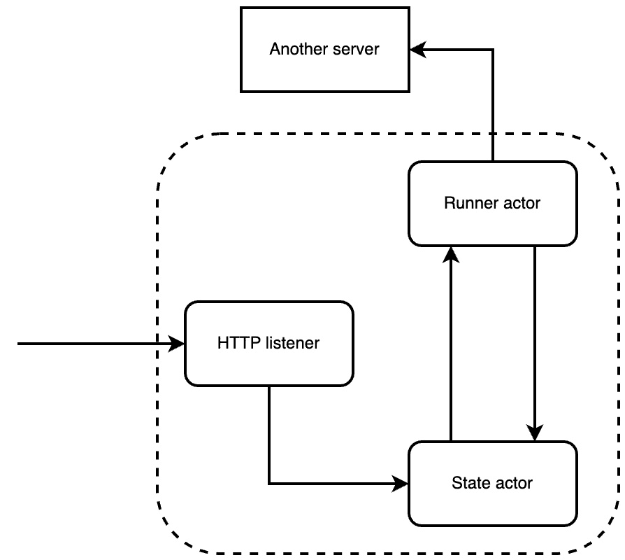
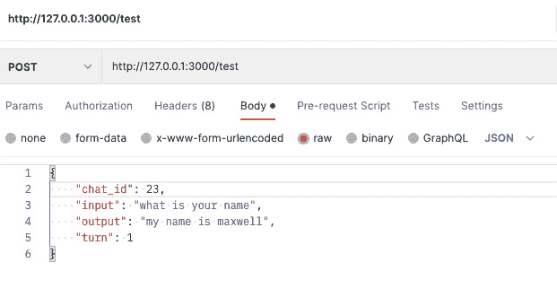

# 17

# 使用 Hyper 框架实现演员和异步

演员模型向我们展示了我们可以构建既安全又易于维护的异步代码。在本章中，我们通过构建一个具有后台任务的缓存机制，该任务在我们使用**Hyper**框架接受传入的 HTTP 请求的同时持续运行，将演员模型推进了一步。必须注意的是，Hyper 框架是处理 HTTP 请求的低级方法。这使得我们能够构建具有细粒度控制 HTTP 服务器如何处理 HTTP 请求的 Web 应用程序。例如，如果我们没有编写如何处理**统一资源标识符**（**URIs**）和方法，Hyper 内置的 HTTP 服务器将处理所有请求，无论传入的方法或 URI 是什么。Hyper 对于构建自定义网络应用程序，如缓存机制非常有用。

在本章中，我们将涵盖以下主题：

+   分解演员异步项目和需求

+   定义通道消息

+   构建运行器演员

+   构建状态演员

+   使用 Hyper 处理 HTTP 请求

+   使用 Hyper 构建 HTTP 服务器

+   运行我们的 Hyper HTTP 服务器

到本章结束时，你将能够构建一个低级 HTTP 服务器，它在接受 HTTP 请求的同时在后台运行清理过程。然而，必须注意的是，在前面的章节中，我们已经使用像 Rocket 和 Actix 这样的框架构建了完整功能的应用程序。在 Actix 中构建一个完整功能的应用程序需要多个章节。在一个章节中不可能涵盖在像 Hyper 这样的低级框架中构建完整功能 Web 应用程序所需的所有内容。我们只是在 Hyper 的帮助下设置和接收 HTTP 请求。然而，通过本章所涵盖的内容，你应该能够使用在线 Hyper 文档中的示例构建一个完整功能的 Web 应用程序，因为我们涵盖了使 Hyper HTTP 服务器运行的核心概念。如果你需要一个支持大量视图和身份验证的完整功能 Web 应用程序，那么选择像 Actix 或 Rocket 这样的高级框架是有意义的。

# 技术要求

在本章中，我们将纯粹关注如何使用 Hyper 框架构建服务器。因此，我们不会依赖任何之前的代码，因为我们正在构建自己的新服务器。

本章的代码可以在[`github.com/PacktPublishing/Rust-Web-Programming-2nd-Edition/tree/main/chapter17`](https://github.com/PacktPublishing/Rust-Web-Programming-2nd-Edition/tree/main/chapter17)找到。

# 分解我们的项目

我们正在构建一个模拟平台，用户可以通过聊天机器人登录并与模拟人物互动，以查看他们对模拟人物说了什么。我们希望在模拟会话结束时看到用户对模拟人物说了什么。问题是，在短时间内会有很多消息发送给一个模拟人物。如果我们每次发送消息时都击中数据库，那么我们将使数据库承受很大的压力。让我们假设一个用户每 20 秒问一个问题；这意味着我们每分钟将击中数据库 6 次，因为每次交互都有一个问题和答案。如果我们有 800 个用户同时运行会话，那么我们每分钟可以有高达 4,800 次击中。这可能会对数据库造成压力。为了减轻数据库的压力，我们可以在 Hyper 中构建一个服务器来缓存聊天信息，并定期向数据库发送多个问题和答案。在继续前进之前，这是一个让你回顾我们已经涵盖的所有章节并思考构建此缓存机制的高级解决方案的机会。

建立缓存服务器有多种方法，但为了提高我们对异步编程的理解，我们将使用演员模型来解决问题。我们的方法将有一个演员接受聊天日志并将其缓存在一个 ID 下。然后我们还有一个演员定期从缓存演员获取消息数据并将其发送到另一个服务器。我们服务器中的数据流采用以下形式：



图 17.1 – 我们应用程序的层

使用这种方法，我们服务器需要以下文件布局：

```rs
├── Cargo.toml
└── src
    ├── actors
    │   ├── messages.rs
    │   ├── mod.rs
    │   ├── runner.rs
    │   └── state.rs
    └── main.rs
```

我们将在`actors`目录下的单独文件中定义我们的演员。处理 HTTP 请求的所有代码都将定义在`main.rs`文件中。我们现在有了所有需要的文件。当我们谈到依赖项时，我们知道我们正在接受 HTTP 请求、发送 HTTP 请求、序列化数据和以异步方式运行我们的程序。鉴于我们在应用程序中所做的工作，我们不应该对`Cargo.toml`文件中以下依赖项感到惊讶：

```rs
[dependencies]
tokio = { version = "1", features = ["full"] }
hyper = { version = "0.14.20", features = ["full"] }
reqwest = { version = "0.11.12", features = ["json"] }
serde_json = "1.0.86"
serde = { version = "1.0.136", features = ["derive"] }
```

在这个阶段，除了用于发送 HTTP 请求的`reqwest`依赖项外，依赖项不应该令人惊讶。现在我们已经定义了项目的轮廓，我们可以继续构建系统的第一部分，即定义系统的消息。

# 定义通道消息

我们的运行演员需要定期向我们的状态演员发送消息，然后将一批聊天信息发送到服务器。考虑到运行演员的功能，我们可以看到它不需要状态，但需要发送消息。在构建运行演员之前，我们必须构建将被发送到演员和服务器上的消息。在`src/actors/messages.rs`文件中，我们首先使用以下代码导入所需的模块：

```rs
use serde::Serialize;
use std::env;
```

我们将使用`Serialize`特质来使我们能够处理来自 HTTP 请求的正文数据。现在我们已经导入了所需的模块，我们可以定义发送给演员的消息类型。如果我们考虑我们需要什么，我们将向状态演员发送消息以获取缓存数据或插入数据。状态演员可以返回数据，如果没有缓存的聊天记录，则返回空数据。考虑到我们有三种不同类型的消息，我们有以下枚举来定义发送的消息类型，以下代码：

```rs
#[derive(Debug, Serialize)]
pub enum MessageType {
    INPUT,
    OUTPUT,
    EMPTY
}
```

然后，我们有用于发送和接收给演员的消息的结构体，其形式如下：

```rs
#[derive(Debug, Serialize)]
pub struct StateActorMessage {
    pub message_type: MessageType,
    pub chat_id: Option<i32>,
    pub single_data: Option<String>,
    pub block_data: Option<Vec<String>>
}
```

我们可以看到，我们必须定义正在发送的消息类型。其他一切都是可选的。例如，如果状态演员发现没有缓存的聊天记录，那么状态演员就不能填充除消息类型之外的其他字段，表示消息为空。

记住我们必须将缓存的聊天消息块发送到服务器。我们可以使用以下代码实现将数据发送到服务器的`StateActorMessage`结构体的功能。我们必须注意，我们还没有创建`PostBody`结构体，但我们将立即进行此操作：

```rs
impl StateActorMessage {
    pub async fn send_to_server(&self) {
        let lib_url = env::var("SERVER_URL").unwrap();
        let joined =
            self.block_data.clone().unwrap().join("$");
        let body = PostBody {
            chat_id: self.chat_id.unwrap(),
            block_data: joined
        };
        let client = reqwest::Client::new();
        let res = client.post(lib_url)
                                  .json(&body)
                                  .send()
                                  .await.unwrap();
        println!("{:?}", res);
    }
}
```

我们可以看到，我们只是从环境中获取服务器 URL，创建一个由`$`作为分隔符的大字符串，分隔问题和答案对，然后将其发送到另一个服务器。我们可以创建一个处理消息并将数据发送到服务器的演员。然而，将数据发送到服务器的操作与消息结构体耦合提供了更大的灵活性，因为任何处理消息的演员都可以将消息中的数据发送到服务器。

当涉及到`PostBody`结构体时，它应该采取以下形式：

```rs
#[derive(Debug, Serialize)]
struct PostBody {
    pub chat_id: i32,
    pub block_data: String
}
```

我们整个应用程序的消息现在已定义。我们现在可以继续构建我们的运行演员。

# 构建我们的运行演员

我们的运行演员持续循环，向状态演员发送消息，请求批量数据，如果存在批量数据，则将其发送到服务器。这意味着我们的演员将在整个程序生命周期中发送和接收消息。考虑到运行演员的行为，我们不需要在`src/actors/runner.rs`文件中需要以下导入：

```rs
use super::messages::{MessageType, StateActorMessage};
use tokio::sync::mpsc::{Sender, Receiver};
use std::time;
```

我们已经导入了所需的模块和用于暂停几秒钟的消息。我们还使用了类型别名来定义运行演员将支持的通道类型。我们现在可以定义运行演员，以下代码：

```rs
pub struct RunnerActor {
    pub interval: i32,
    pub receiver: Receiver<StateActorMessage>,
    pub sender: Sender<StateActorMessage>,
}
```

在这里，我们仅仅定义了我们的演员在再次请求数据之前将等待的秒数。然后，我们有一个发送者和接收者用于发送和接收消息。定义了字段后，我们接下来需要使用以下代码定义我们的`RunnerActor`结构体的构造函数和运行函数：

```rs
impl RunnerActor {
    pub fn new(receiver: Receiver<StateActorMessage>,
               sender: Sender<StateActorMessage>,
               interval: i32) -> RunnerActor {
        return RunnerActor { interval, receiver, sender }
    }
    pub async fn run(mut self) {
        . . .
    }
}
```

我们可以看到，我们的构造函数（`new`）实际上并不是必需的。在我们的`new`函数中，我们只是直接将参数传递到`RunnerActor`结构体的字段中。然而，考虑到所付出的努力，它还是很有用的。例如，如果我们以后需要添加一些检查或者向状态演员发送消息，说明`RunnerActor`结构体已经被构建，我们只需要更改`new`函数中的行为，这种行为将会在整个程序中使用`new`函数的地方传播。

对于我们的`run`函数，我们运行一个无限循环。在这个循环内部，我们向状态演员发送消息。每次循环迭代都通过以下代码中的睡眠函数来中断：

```rs
pub async fn run(mut self) {
    println!("runner actor is running");
    let seconds = time::Duration::from_secs(self.interval
                                            as u64);
    loop {
        tokio::time::sleep(seconds).await;
        let message = StateActorMessage {
            message_type: MessageType::OUTPUT,
            chat_id: None,
            single_data: None,
            block_data: None
        };
        match self.sender.send(message).await {
            . . .
        };
    }
}
```

一旦我们发送了消息，我们必须等待响应，如果响应不为空，则需要将批处理数据发送到服务器，这可以通过以下代码完成：

```rs
match self.sender.send(message).await {
    Ok(_) => {
        let message = self.receiver.recv().await.unwrap();
        match message.message_type {
            MessageType::OUTPUT => {
                message.send_to_server().await;
            },
            _ => {
                println!("state is empty");
            }
        }
    },
    Err(_) => {
        println!("runner is failed to send message");
    }
};
```

在这里，我们可以看到，到目前为止，逻辑并不太复杂。有了这个，我们将能够快速通过我们的状态演员，然后最终在 Hyper 中创建一个 HTTP 服务器。

# 构建我们的状态演员

当涉及到我们的状态演员时，我们必须发送和接收消息。我们的状态演员还将有一个状态，其中演员将存储要引用的聊天记录。考虑到状态演员的机制，我们不会对在`src/actors/state.rs`文件中以下导入感到惊讶：

```rs
use std::collections::{HashMap, VecDeque};
use std::mem;
use tokio::sync::mpsc::{Sender, Receiver};
use super::messages::{MessageType, StateActorMessage};
```

导入中唯一的区别是`mem`模块。`mem`模块将使我们能够分配内存。当我们从演员的状态获取消息时，我们将介绍如何使用`mem`模块。我们还可以看到，我们导入了`HashMap`和`VecDeque`来处理演员的状态。

现在我们已经导入了所需的模块，我们可以使用以下代码定义我们的演员结构体：

```rs
#[derive(Debug)]
pub struct StateActor {
    pub chat_queue: VecDeque<i32>,
    pub chat_logs: HashMap<i32, Vec<String>>,
    pub receiver: Receiver<StateActorMessage>,
    pub sender: Sender<StateActorMessage>,
}
```

`chat_queue`是我们使用标准集合库中的`VecDeque`结构体实现执行先进先出队列的地方。我们假设最老的聊天记录通常比后来的聊天记录包含更多的聊天内容，因此，我们应该缓存较老的聊天记录。我们之所以没有仅仅使用向量而不是队列，是因为从队列中弹出第一个元素不需要重新分配所有其他元素。如果我们从向量中移除第一个元素，我们就必须重新分配向量中的所有其他元素。当涉及到存储聊天记录时，我们使用聊天 ID 作为键，以及聊天 ID 下的问题和答案。

现在我们已经定义了我们的状态演员，我们可以定义演员所需的函数，以下代码展示了这些函数：

```rs
impl StateActor {
    pub fn new(receiver: Receiver,
               sender: Sender) -> StateActor {
        . . .
    }
    pub fn get_message_data(&mut self,
                            chat_id: i32) -> Vec<String> {
        . . .
    }
    pub fn insert_message(&mut self,
                          chat_id: i32, message_data:
                              String) {
        . . .
    }
    async fn handle_message(&mut self,
                            message: StateActorMessage) {
        . . .
    }
    pub async fn run(mut self) {
        . . .
    }
}
```

在这里，我们可以看到我们有一个构造函数、提取聊天数据、插入聊天记录、根据接收到的消息类型处理消息，以及一个`run`函数来等待发送到状态演员的传入消息。

我们现在已经准备好通过函数实现的`StateActor`结构体的逻辑。在本书的这个阶段，你应该能够自己实现这些函数，这将是一个很好的实践。

对于我们的构造函数，我们有以下代码：

```rs
pub fn new(receiver: Receiver, sender: Sender) -> StateActor {
    let chat_queue: VecDeque<i32> = VecDeque::new();
    let chat_logs: HashMap<i32, Vec<String>> =
        HashMap::new();
    return StateActor {chat_queue, chat_logs, receiver,
                       sender}
}
```

构造函数仅仅创建一个空的队列和 HashMap，并接受发送和接收消息的通道。对于我们的`get_message`函数，我们有以下代码：

```rs
pub fn get_message_data(&mut self, chat_id: i32) ->
    Vec<String> {
        self.chat_logs.remove(&chat_id).unwrap()
}
```

我们可以看到，我们根据聊天 ID 从聊天记录中获取聊天数据。然后，我们将 HashMap 聊天记录的所有权从`reference`变量中转移，删除聊天 ID 键，然后返回数据。这使得我们可以从我们的状态中删除并返回消息数据。

对于我们的`insert_message`函数，我们使用以下代码：

```rs
pub fn insert_message(&mut self, chat_id: i32,
    message_data: String) {
    match self.chat_logs.get_mut(&chat_id) {
        Some(patient_log) => {
            patient_log.push(message_data);
        },
        None => {
            self.chat_queue.push_back(chat_id);
            self.chat_logs.insert(chat_id,
                                  vec![message_data]);
        }
    }
}
```

在这里，我们可以看到我们仅仅将新的消息数据插入与聊天 ID 关联的向量中。如果聊天 ID 不存在，我们将聊天 ID 附加到队列中，并在聊天 ID 下创建一个新的向量。

我们现在可以继续到处理消息的函数，以下是其代码：

```rs
async fn handle_message(&mut self,
    message: StateActorMessage) {
    println!("state actor is receiving a message");
    match message.message_type {
        MessageType::INPUT => {
            self.insert_message(message.chat_id.unwrap(),
                                message.single_data
                                .unwrap());
        },
        MessageType::OUTPUT => {
            . . .
        },
        MessageType::EMPTY => {
            panic!(
              "empty messages should not be sent to the
                   state actor"
            );
        }
    }
    println!("{:?}", self.chat_logs);
    println!("{:?}", self.chat_queue);
}
```

在这里，如果消息是输入，我们仅仅将消息插入到我们的状态中。如果消息为空，我们将使线程恐慌，因为不应该有任何空消息发送到状态演员。如果我们有一个输出消息，这意味着我们必须获取队列底部最老的聊天，其形式如下：

```rs
MessageType::OUTPUT => {
    match self.chat_queue.pop_front() {
        Some(chat_id) => {
            let data = self.get_message_data(chat_id);
            let message = StateActorMessage {
                message_type: MessageType::OUTPUT,
                chat_id: Some(chat_id),
                single_data: None,
                block_data: Some(data)
            };
            let _ =
                self.sender.send(message).await.unwrap();
        },
        None => {
            let message = StateActorMessage {
                message_type: MessageType::EMPTY,
                chat_id: None,
                single_data: None,
                block_data: None
            };
            let _ =
                self.sender.send(message).await.unwrap();
        }
    }
},
```

在这里，我们可以看到如果没有队列中的内容，那么我们就没有聊天；因此我们返回一个空消息。如果队列中有聊天 ID，我们获取消息数据并通过消息发送给运行者。

最后，`run`函数的形式如下：

```rs
pub async fn run(mut self) {
    println!("state actor is running");
    while let Some(msg) = self.receiver.recv().await {
        self.handle_message(msg).await;
    }
}
```

这个`run`函数仅仅等待接收到的消息并处理这些接收到的消息。我们现在已经定义了所有的演员，现在可以继续构建我们的 HTTP 服务器。

# 使用 Hyper 处理 HTTP 请求

当涉及到构建我们的 HTTP 服务器时，我们将把所有的服务器逻辑实现到`src/main.rs`文件中。首先，我们使用以下代码导入所需的模块：

```rs
use tokio::sync::{mpsc, mpsc::Sender};
use hyper::{Body, Request, Response, Server};
use hyper::body;
use hyper::service::{make_service_fn, service_fn};
use serde_json;
use serde::Deserialize;
use std::net::SocketAddr;
```

在本书的这个阶段，这些导入应该不会让你感到困惑。尽管我们从`hyper`模块中导入了，但导入是自解释的。我们将从请求中提取数据，创建一个服务来处理我们的请求，并创建一个 HTTP 服务器来监听传入的请求。

我们还需要使用我们创建的演员。我们可以使用以下代码导入我们的演员：

```rs
mod actors;
use actors::state::StateActor;
use actors::runner::RunnerActor;
use actors::messages::StateActorMessage;
use actors::messages::MessageType;
```

导入所有这些演员后，我们可以着手接受请求。传入的 HTTP 请求将新的聊天记录插入到我们的状态演员中。为了实现插入聊天记录，我们需要一个聊天 ID、输入（一个问题）和输出（一个答案）。也最好有一个时间戳，但为了简化示例，我们将使用回合数来表示聊天记录创建的时间。为了从请求中提取我们刚刚列出的所有数据，我们需要以下结构体：

```rs
#[derive(Deserialize, Debug)]
struct IncomingBody {
      pub chat_id: i32,
      pub timestamp: i32,
      pub input: String,
      pub output: String
}
```

我们在处理传入请求正文时所采取的方法与使用 Rocket 和 Actix 构建服务器时相同。这是因为我们依赖于 `serde`。处理传入请求正文实现相同的事实是对在 Rust 中实现特质的灵活性的证明。

由于我们正在接受传入的请求，我们必须处理它们。我们可以在一个函数中定义如何处理请求的逻辑，以下是一个概要：

```rs
async fn handle(req: Request<Body>, channel_sender:
    Sender<StateActorMessage>) -> Result<Response<Body>,
        &'static str> {
    . . .
}
```

在这个 `handle` 函数中，我们接受一个带有正文和通道的请求，我们可以通过该通道向我们的演员发送消息。如果我们没有应用演员模型方法，我们只需接受请求即可。我们必须记住，我们通过一个函数来处理我们的请求，因此没有什么可以阻止我们传递数据库连接或其他任何东西。我们的 `handle` 函数本质上充当着中间件的角色。

对于这个例子，我们只支持一个视图。然而，为了了解我们可以用 Hyper 做什么，我们不妨使用以下代码打印出一些关于传入请求的基本信息：

```rs
println!("incoming message from the outside");
let method = req.method().clone();
println!("{}", method);
let uri = req.uri();
println!("{}", uri);
```

如果我们要支持多个视图，我们可以在传入请求的 URI 上实现一个 `match` 语句，将请求传递给另一个函数，该函数包含特定主题（如身份验证或聊天记录）的多个视图。然后另一个 `match` 语句可以将请求传递到正确的视图函数，该函数处理请求并返回 HTTP 响应，`handle` 函数将返回该响应。

同样，因为我们只支持一个视图，所以我们将直接在 `handle` 函数中处理请求。我们通过以下代码从请求中提取正文数据来完成这项工作：

```rs
let bytes = body::to_bytes(req.into_body()).await.unwrap();
let string_body = String::from_utf8(bytes.to_vec())
    expect("response was not valid utf-8");
let value: IncomingBody = serde_json::from_str(
    &string_body.as_str()).unwrap();
```

现在，我们有了发送聊天记录到我们的状态演员并返回一切正常的 HTTP 响应所需的所有数据，以下是一个代码示例：

```rs
let message = StateActorMessage {
    message_type: MessageType::INPUT,
    chat_id: Some(value.chat_id),
    single_data: Some(format!("{}>>{}>>{}>>",
                               value.input,
                               value.output,
                               value.timestamp)),
    block_data: None
};
channel_sender.send(message).await.unwrap();
Ok(Response::new(format!("{:?}", value).into()))
```

这样我们的 `handle` 函数就完成了。考虑到我们在本节中所做的工作，我们可以欣赏到 Hyper 在实现 HTTP 时的底层性。虽然我们已经打印出了 URI 和方法，但我们并没有对它们做任何事情。无论传入服务器的是什么方法或 URI，只要正文有正确的数据，我们的服务器就会工作。因此，让我们在下一节中让我们的服务器工作起来。

# 使用 Hyper 构建 HTTP 服务器

当涉及到使用 Hyper 运行 HTTP 服务器时，我们将使用 Tokio。我们有两个演员正在运行，以及两个通道来促进演员和请求之间的通信。首先，在 `main` 函数中，我们使用以下代码定义服务器的地址：

```rs
#[tokio::main]
async fn main() {
    let addr = SocketAddr::from(([0, 0, 0, 0], 3000));
    . . .
}
```

地址定义后，我们使用以下代码定义两个消息通道：

```rs
let (state_tx, state_rx) =
    mpsc::channel::<StateActorMessage>(1);
let (runner_tx, runner_rx) =
    mpsc::channel::<StateActorMessage>(1);
let channel_sender = state_tx.clone();
```

我们克隆了状态演员的发送者，因为我们将通过 `handle` 函数将发送者与传入的请求一起传递。现在我们有了我们的通道，我们可以使用以下代码启动两个线程来运行我们的演员：

```rs
tokio::spawn(async move {
    let state_actor = StateActor::new(state_rx, runner_tx);
    state_actor.run().await;
});
tokio::spawn(async move {
    let lib_runner_actor = RunnerActor::new(runner_rx,
                                            state_tx, 30);
    lib_runner_actor.run().await;
});
```

在这里，我们必须小心地将另一个 actor 的发送者传递给我们要创建的 actor，因为 actors 互相发送消息；它们不是给自己发送消息。

我们缓存机制的 everything 现在都在运行。我们现在需要做的是接受传入的 HTTP 请求，我们可以通过以下代码实现：

```rs
let server = Server::bind(&addr).serve(make_service_fn( |_conn| {
    let channel = channel_sender.clone();
    async {
        Ok::<_, hyper::Error>(service_fn(move |req| {
            let channel = channel.clone();
            async {handle(req, channel).await}
        }))
    }
}));
```

必须注意，我们正在返回一个使用异步语法的 future，这是 `service_fn` 函数所必需的。在这里，我们可以看到我们将我们的地址绑定到服务器，然后调用 `serve` 函数。在这个 `serve` 函数内部，我们传递 `make_service_fn` 函数，它将我们传递给 `make_service_fn` 函数的可执行程序包装在一个 `MakeServiceFn` 结构体中。我们传递给 `make_service_fn` 函数的可执行程序是一个闭包，它传递 `_conn`，这是一个 `AddrStream` 结构体。使用 `AddrStream` 结构体，我们可以获取连接到服务器的对等方的地址。我们还可以消耗 `AddrStream` 结构体，并使用 `AddrStream` 结构体的 `into_inner` 方法提取底层的 TCP 流。在本章中，我们不会与 `AddrStream` 结构体玩耍，因为我们通过仅处理标准 HTTP 请求来保持简单。

在闭包内部，我们再次克隆发送者。我们需要在这里这样做，因为我们需要为每个进入的请求克隆通道，因为每个请求都需要向状态 actor 发送消息。然后我们使用 `async` 块创建一个 future，返回一个 `Ok` 枚举，它围绕 `service_fn` 函数，其中我们插入另一个闭包来处理传入的请求。这就是我们再次克隆通道并返回一个 future 的地方，我们的 `handle` 函数接受要处理的传入请求和通道以及要返回的 HTTP 响应。我们可以看到，与 Rocket 等其他框架相比，运行 HTTP 服务器需要更多的步骤。然而，我们也获得了更多的细粒度控制。

现在我们完成了服务器块，我们可以在 `main` 函数中实现最后一段逻辑，通过以下代码打印出服务器的问题错误：

```rs
if let Err(e) = server.await {
    eprintln!("server error: {}", e);
}
```

这样，我们的简单 HTTP 服务器应该可以工作了。

# 运行我们的 Hyper HTTP 服务器

当我们运行我们的服务器时，我们首先需要使用以下命令导出我们将要发送批量聊天日志的 URL：

```rs
export SERVER_URL="https://httpbin.org/post"
```

这意味着我们只需要将我们的 HTTP 请求发送到 HTTPBin，并得到一个标准的响应。然后我们可以使用以下命令运行我们的服务器：

```rs
cargo run
```

我们的服务器现在正在以下打印输出中运行：

```rs
state actor is running
runner actor is running
```

我们的时间间隔是每 30 秒，runner actor 向状态 actor 发送一条消息。如果我们只是让我们的服务器运行，我们会得到以下打印输出：

```rs
state is empty
state actor is receiving a message
{}
[]
state is empty
state actor is receiving a message
{}
[]
state is empty
state actor is receiving a message
{}
[]
```

在这里，我们可以看到聊天状态和队列都是空的，并且我们的两个 actor 都在各自的线程中运行！然后我们可以获取我们的 Postman 应用程序，发送以下 HTTP 请求：



图 17.2 – 服务器 HTTP 请求

发送之前的请求将给出以下输出：

```rs
incoming message from the outside
POST
/test
state actor is receiving a message
{23: ["what is your name>>my name is maxwell>>1>>"]}
[23]
```

在这里我们可以看到状态和队列已经被填充。如果我们再在最初的 30 秒内按下 Postman 的**发送**按钮两次，我们会得到以下输出：

```rs
incoming message from the outside
POST
/test
state actor is receiving a message
{23: ["what is your name>>my name is maxwell>>1>>",
      "what is your name>>my name is maxwell>>1>>"]}
[23]
incoming message from the outside
POST
/test
state actor is receiving a message
{23: ["what is your name>>my name is maxwell>>1>>",
      "what is your name>>my name is maxwell>>1>>",
      "what is your name>>my name is maxwell>>1>>"]}
[23]
```

我们可以看到，随着我们发送相同的聊天 ID，队列并没有增加。然后我们增加聊天日志的 ID，发送另一个请求，结果如下输出：

```rs
incoming message from the outside
POST
/test
state actor is receiving a message
{24: ["what is your name>>my name is maxwell>>1>>"],
23: ["what is your name>>my name is maxwell>>1>>",
     "what is your name>>my name is maxwell>>1>>",
     "what is your name>>my name is maxwell>>1>>"]}
[23, 24]
```

我们可以看到新的 ID 已经被插入到队列和状态中。我们设法在 30 秒内完成了所有这些请求，然后我们可以简单地等待，直到我们得到以下输出：

```rs
state actor is receiving a message
{23: ["what is your name>>my name is maxwell>>1>>"}
[23]
Response { url: Url { scheme: "https",
cannot_be_a_base: false,
username: "", password: None,
host: Some(Domain("httpbin.org")),
port: None, path: "/post",
. . .
"*", "access-control-allow-credentials": "true"} }
```

在这里发生的情况是，跑步者向获取最老聊天 ID 的状态发送了一条消息，然后将其发送到我们在环境变量中定义的服务器。我们可以看到状态已经更新，响应是 OK。为了防止页面打印输出膨胀，省略了一些 HTTP 响应。

我们可以得出结论，我们使用 Hyper HTTP 上的 actor 构建的缓存系统正如我们所期望的那样工作！有了这个，我们就结束了本章，对 Hyper 进行了足够的探索，以使用异步 actor 和通道启动服务器。

# 摘要

在本章中，我们构建了一个缓存聊天记录的网络应用程序。我们的网络应用程序还有一个后台任务持续运行，定期通过将缓存数据发送到服务器来清理缓存。我们将后台任务运行器分解为一个具有队列的 actor 系统，然后实现了它。这为您提供了一个全新的工具集来解决这些问题。后台运行的 actor 不仅适用于在服务器上运行以进行缓存。如果您在 Tokio 运行时上构建程序，您也可以为常规程序运行后台运行 actor。

在下一章中，我们将使用 Redis 持久存储来管理多个工作进程和网络应用程序，以在多个网络应用程序之间传输消息。

# 进一步阅读

超级文档：[`hyper.rs/guides`](https://hyper.rs/guides)
