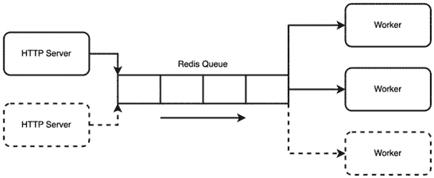
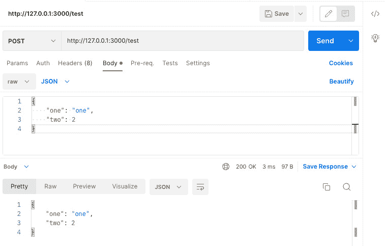
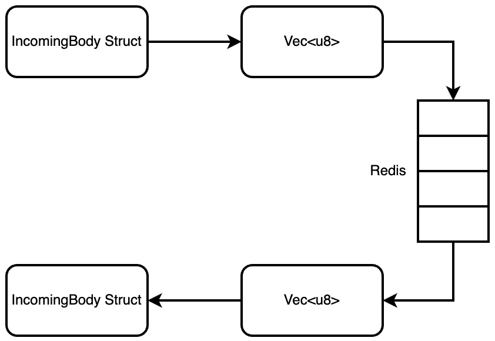
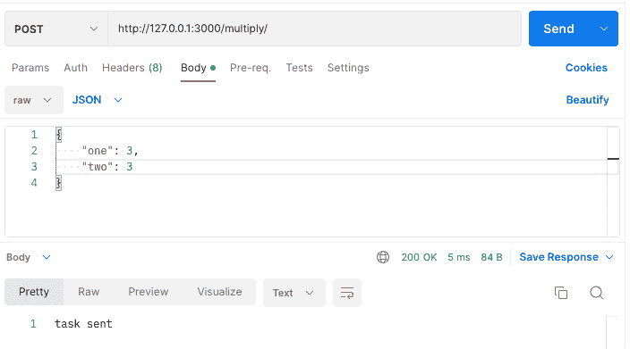
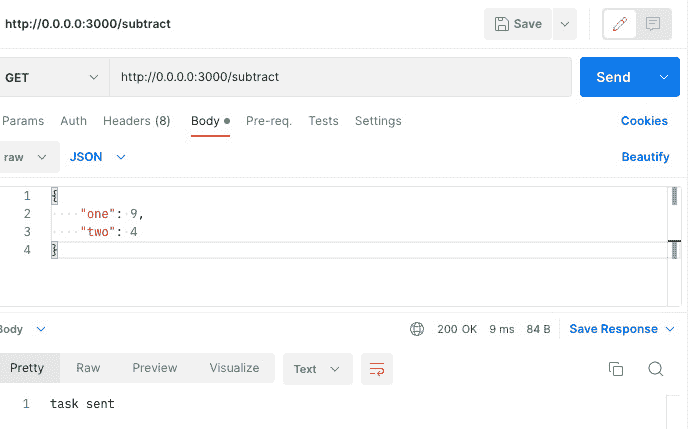
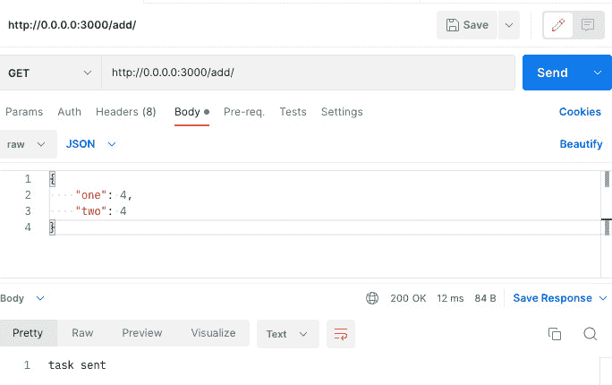

# 18

# 使用 Redis 排队任务

接收请求，执行操作，然后向用户返回响应可以解决网络编程中的许多问题。然而，有时这种简单的方法根本无法满足需求。例如，当我还在 MonolithAi 工作时，我们有一个功能，用户可以输入数据和参数，然后点击按钮在数据上训练机器学习模型。然而，在向用户发送响应之前尝试训练机器学习模型会花费太长时间。连接可能会超时。为了解决这个问题，我们有一个 **Redis** 队列和一组工作进程消费任务。训练任务将被放入队列，当工作进程有空时，其中一个工作进程将开始训练模型。HTTP 服务器将接受用户的请求，将训练任务发布到队列中，并告知用户任务已发布。当模型训练完成后，用户将收到更新。另一个例子可能是一个食品订购应用程序，其中食品订单需要经过一系列步骤，如确认订单、处理订单然后交付订单。

考虑 MonolithAi 的例子，不难看出为什么学习如何在网络编程中实现排队不仅有用，而且为开发者提供了另一种解决方案，增加了他们可以解决的问题数量。

在本章中，我们将涵盖以下主题：

+   布局排队项目，描述所需的组件和方法

+   构建 HTTP 服务器

+   构建 polling 工作进程

+   使用 Redis 运行我们的应用程序

+   定义工作进程的任务

+   定义 Redis 队列的消息

+   在 HTTP 服务器中集成路由

+   在 Docker 中运行所有服务器和工作进程

在本章结束时，你将能够构建一个 Rust 程序，该程序可以根据传入的环境变量是作为工作进程还是服务器来运行。你还将能够将一系列任务以不同结构体的形式序列化，并将它们插入 Redis 队列中，使这些结构体能够排队并在不同的服务器之间传输。这不仅将赋予你实现队列的技能，还能利用 Redis 实现许多其他解决方案，例如多个服务器通过 Redis pub/sub 通道进行广播接收消息。

# 技术要求

在本章中，我们将专注于如何使用 Tokio 和 Hyper 在 Redis 队列上构建工作进程。因此，我们不会依赖任何之前的代码，因为我们正在构建自己的新服务器。

本章的代码可以在 [`github.com/PacktPublishing/Rust-Web-Programming-2nd-Edition/tree/main/chapter18`](https://github.com/PacktPublishing/Rust-Web-Programming-2nd-Edition/tree/main/chapter18) 找到。

# 拆分我们的项目

在我们的系统中，有一系列需要执行的任务。然而，这些任务需要很长时间才能完成。如果我们只有一个普通的服务器来处理任务，服务器最终会变得拥堵，多个用户将收到延迟的服务体验。如果任务太长，那么用户的连接可能会超时。

为了避免在需要长时间任务时降低用户体验，我们利用排队系统。这就是 HTTP 服务器从用户那里接收请求的地方。与请求相关联的长时间任务随后被发送到先入先出队列，由一组工作者进行处理。因为任务在队列中，HTTP 服务器除了向用户响应任务已被发送并且他们的请求已被处理之外，别无他法。由于流量的起伏，当流量低时，我们不需要所有的工作者和 HTTP 服务器。然而，当流量增加时，我们需要创建和连接额外的 HTTP 服务器和工作者，如下面的图所示：



图 18.1 – 我们处理长时间任务的方法

考虑到前面的图，我们需要以下基础设施：

+   **Redis 数据库**：用于在队列中存储任务

+   **HTTP 服务器**：将任务发送到队列以进行处理

+   **工作者**：从队列中拉取/弹出/轮询/处理任务

我们可以为工作者和 HTTP 服务器构建单独的应用程序。然而，这样做会增加复杂性而没有获得任何收益。使用两个独立的应用程序，我们必须维护两个独立的 Docker 镜像。我们还会大量复制代码，因为 HTTP 服务器发送到 Redis 队列的任务必须与工作者拾取并处理的任务相同。对于特定任务，HTTP 服务器传递给工作者的字段可能存在不匹配。我们可以通过具有一系列字段的任务结构体和用于使用这些字段执行任务的运行函数来防止这种不匹配。这些任务结构体的序列化特性可以让我们在队列中传递字段并接收它们。

当涉及到构建 HTTP 服务器和工作者时，我们可以构建服务器，以便在程序启动后检查环境变量。如果环境变量表明应用程序是一个工作者，那么应用程序可以启动一个轮询队列的演员。如果环境变量表明应用程序是一个 HTTP 服务器，那么应用程序可以运行一个 HTTP 服务器并监听请求。

对于我们的任务队列项目，我们有以下概述：

```rs
├── Cargo.toml
├── docker-compose.yml
└── src
    ├── main.rs
    └── tasks
        ├── add.rs
        ├── mod.rs
        ├── multiply.rs
        └── subtract.rs
```

我们将在 `src/main.rs` 文件中定义服务器入口点。然后，我们在 `src/tasks/` 目录中定义我们的任务结构体。就我们 `Cargo.toml` 文件中的依赖项而言，我们有以下内容：

```rs
[dependencies]
bincode = "1.0"
bytes = "1.2.1"
redis = "0.22.1"
serde_json = "1.0.86"
tokio = { version = "1", features = ["full"] }
hyper = { version = "0.14.20", features = ["full"] }
serde = { version = "1.0.136", features = ["derive"] }
```

除了`bytes`和`bincode`包之外，这些依赖项对你来说都不应该陌生。我们将使用`bytes`将我们的结构体转换为 HTTP 响应，并使用`bincode`将结构体序列化为二进制，以便存储在 Redis 中。

通过本节中刚刚阐述的方法，我们将能够构建一个简单的任务处理队列，其中我们可以确保服务器和工作者之间的任务定义始终保持同步。定义了我们的方法后，我们可以继续进行任务旅程的第一部分，即 HTTP 服务器。

# 构建 HTTP 服务器

对于我们的 HTTP 服务器，我们需要执行以下步骤：

1.  定义一个反序列化 HTTP 请求主体的结构体。

1.  定义一个处理传入请求的函数。

1.  根据环境变量定义程序的运行路径。

1.  运行一个监听传入请求的服务器。

我们不会为每个步骤分别划分部分，因为我们已经在上一章中涵盖了所有这些步骤/过程。在我们执行所有步骤之前，我们必须将以下内容导入到`src/main.rs`文件中：

```rs
use hyper::{Body, Request, Response, Server};
use hyper::body;
use hyper::service::{make_service_fn, service_fn};
use std::net::SocketAddr;
use std::env;
use serde::{Serialize, Deserialize};
use serde_json;
use bytes::{BufMut, BytesMut};
```

你应该熟悉所有这些导入，除了`bytes`导入，我们将在定义 HTTP 处理函数时介绍它。首先，我们将定义一个简单的结构体，用于使用以下代码序列化传入的 HTTP 请求主体：

```rs
#[derive(Debug, Clone, Serialize, Deserialize)]
pub struct IncomingBody {
    pub one: String,
    pub two: i32
}
```

这与我们的 Actix Web 应用程序的方法相同。我们将能够使用`Serialize`和`Deserialize`特性对任务结构体进行注解。

现在我们已经定义了`IncomingBody`结构体，我们可以使用以下代码定义我们的`handle`函数：

```rs
async fn handle(req: Request<Body>) -> 
    Result<Response<Body>, &'static str> {
    let bytes = body::to_bytes(req.into_body()).await
                                               .unwrap();
    let response_body: IncomingBody = 
        serde_json::from_slice(&bytes).unwrap();
    let mut buf = BytesMut::new().writer();
    serde_json::to_writer(&mut buf, 
                          &response_body).unwrap();
    Ok(Response::new(Body::from(buf.into_inner().freeze())))
}
```

必须注意，我们在返回主体时调用了`freeze`函数。这个`freeze`函数将可变的字节转换为不可变的，防止任何缓冲区修改。在这里，我们可以看到我们正在接受一个通用的请求主体。然后我们可以使用`serde`将主体和`BytesMut`结构体（本质上只是一个连续的内存切片）序列化，然后将主体返回给用户，本质上创建了一个回声服务器。

现在我们可以定义`main`函数，这是程序的入口点，以下是其代码：

```rs
#[tokio::main]
async fn main() {
    let app_type = env::var("APP_TYPE").unwrap();
    match app_type.as_str() {
        "server" => {
            . . .
        },
        "worker" => {
            println!("worker not defined yet");
        }
        _ => {
            panic!("{} app type not supported", app_type);
        }
    }
}
```

在这里，我们可以看到环境变量`"APP_TYPE"`被提取。根据应用程序类型的不同，将执行不同的代码块。目前，我们只需打印出一条消息，说明如果应用程序类型是`"worker"`，则工作者未定义。我们还声明，如果应用程序类型既不是`"server"`也不是`"worker"`类型，程序将发生恐慌。

在我们的服务器块中，我们使用以下代码定义了`addr`和`server`：

```rs
let addr = SocketAddr::from(([0, 0, 0, 0], 3000));
let server = Server::bind(&addr).serve(make_service_fn( |_conn| {
    async {
        Ok::<_, hyper::Error>(service_fn( move |req| {
            async {handle(req).await}
        }))
    }
}));
if let Err(e) = server.await {
    eprintln!("server error: {}", e);
}
```

这与上一章中的服务器代码非常相似。

然后我们使用以下命令运行服务器：

```rs
APP_TYPE=server cargo run
```

然后，我们可以发送以下请求：



图 18.2 – 向我们的 HTTP 服务器发送请求

在这里，我们可以看到我们的服务器正在工作，并回显发送到服务器的相同正文。我们现在可以继续构建我们的工作者应用程序。

# 构建轮询工作者

我们的工作者本质上是在 Redis 中循环和轮询队列。如果队列中有消息，工作者将会执行从队列中提取的任务。为了构建轮询工作者部分，工作者将会创建一个结构体，将结构体插入 Redis 队列，然后从队列中提取该插入的结构体以打印出来。这不是我们期望的行为，但这确实意味着我们可以快速测试我们的队列插入功能。到本章结束时，我们的 HTTP 服务器将插入任务，而我们的工作者将消费任务。

我们不希望工作者在没有休息的情况下不断轮询 Redis 队列。为了将轮询降低到合理的速率，我们需要让工作者在每次循环中休眠。因此，我们必须在 `src/main.rs` 文件中导入以下内容，以便我们能够使工作者休眠：

```rs
use std::{thread, time};
```

我们现在可以进入工作者运行的部分，在下面的 `main` 函数中定义我们的工作者代码：

```rs
match app_type.as_str() {
    "server" => {
        . . .
    },
    "worker" => {
      // worker code is going to be inserted here
        . . .
    }
    _ => {
        panic!("{} app type not supported", app_type);
    }
}
```

我们的工作者代码采用以下一般轮廓：

```rs
let client = 
    redis::Client::open("redis://127.0.0.1/").unwrap();
loop {
    . . .
}
```

在这里，我们可以看到我们定义了 Redis 客户端，然后在一个无限循环中运行工作者。在这个循环中，我们将与 Redis 建立连接，轮询 Redis 中的队列，然后断开连接。由于任务可能需要很长时间，所以在任务执行期间保持 Redis 连接是没有意义的。

不幸的是，在撰写本书时，Rust Redis crate 没有简单的队列实现。然而，这不应该阻碍我们。如果我们知道获取 Redis 实现我们队列所需的原始命令，我们可以实现自己的队列。Redis 的性能类似于 SQL 数据库。如果你知道命令，你可以像在 SQL 中一样实现自己的逻辑。

在我们的无限循环中，我们将创建一个实现了 `Serialize` 和 `Deserialize` 特性的泛型结构体，然后使用以下代码将结构体序列化为二进制：

```rs
let body = IncomingBody{one: "one".to_owned(), two: 2};
let bytes = bincode::serialize(&body).unwrap();
```

我们的结构体现在是一个字节数组。然后我们将与 Redis 建立连接，使用 `"LPUSH"` 命令将 `"some_queue"` 推送到队列中，该命令将值插入队列的头部，以下代码所示：

```rs
let outcome: Option<Vec<u8>>;
{
    let mut con = client.get_connection().unwrap();
    let _ : () = redis::cmd("LPUSH").arg("some_queue")
                                    .arg(bytes.clone())
                                    .query(&mut con)
                                    .unwrap();
    // pop our task from the queue
    outcome = redis::cmd("LPOP").arg("some_queue")
                                .query(&mut con)
                                .unwrap();
}
```

我们有 `Option<Vec<u8>>` 因为队列中可能没有任何内容。如果队列中没有内容，那么结果将是 none。目前，我们永远不会得到 none，因为我们是在从队列中提取任务之前直接将任务插入队列中的。然而，在低流量期间，我们的工作者将会轮询可能空置一段时间的队列。

现在我们有了结果，我们可以使用以下 `match` 语句来处理它：

```rs
match outcome {
    Some(data) => {
        . . .
    },
    None => {
        . . .
    }
}
```

如果我们有数据，我们只需反序列化二进制数据，并使用以下代码打印出结构体：

```rs
let deserialized_struct: IncomingBody = 
    bincode::deserialize(&data).unwrap();
println!("{:?}", deserialized_struct);
```

如果队列中没有内容，`outcome`将是`None`，我们可以在再次运行循环之前简单地休眠五秒钟，代码如下：

```rs
let five_seconds = time::Duration::from_secs(5);
tokio::time::sleep(five_seconds).await;
```

这样，我们的工作进程就准备好进行测试了。在构建这样的异步程序时，你总是可以做更多的事情。然而，为了避免使本章内容膨胀，我们将坚持使用我们的基本应用程序。如果你想进一步了解 Redis，你可以研究构建一个 pub/sub 系统，其中一个工作进程持续轮询队列，而其他工作进程通过监听通道上的消息的 actor 被关闭。当一个主要工作进程接收到一个新任务时，主要工作进程可以向通道发布一个消息，唤醒其他工作进程。如果你真的想挑战自己，你可以研究 Kubernetes 控制器，让主要工作进程启动和销毁工作进程 pod，这取决于流量。然而，这些项目将超出本书的范围。

为了在本章范围内使我们的应用程序工作，我们必须继续让我们的应用程序与 Redis 一起运行。

# 让我们的应用程序与 Redis 一起运行

在本地使用 Redis 运行我们的应用程序将需要我们使用带有 Docker 的 Redis，导出`APP_TYPE`环境变量为`"worker"`，然后使用 Cargo 运行我们的应用程序。对于我们的 Redis，我们的`docker-compose.yml`文件如下所示：

```rs
version: "3.7"
services:
    redis:
      container_name: 'queue-redis'
      image: 'redis'
      ports:
        - '6379:6379'
```

然后，我们可以使用以下命令导出我们的`APP_TYPE`环境变量：

```rs
export APP_TYPE=worker
```

然后，我们可以使用以下命令运行我们的应用程序：

```rs
cargo run
```

当我们运行应用程序时，我们将得到以下输出：

```rs
IncomingBody { one: "one", two: 2 }
IncomingBody { one: "one", two: 2 }
IncomingBody { one: "one", two: 2 }
IncomingBody { one: "one", two: 2 }
. . .
```

`IncomingBody`结构的输出将是无限的，因为我们正在运行一个无限循环。然而，这表明以下机制正在运行并正常工作：



图 18.3 – 我们从 Redis 队列中插入和提取数据的过程

虽然我们的工作进程正在与 Redis 队列交互，但它仅仅是在打印出放入 Redis 队列的结构体。在下一节中，我们将构建功能到我们插入 Redis 队列的结构体中，以便我们的工作进程可以执行任务。

# 定义工作进程的任务

当涉及到运行我们的任务时，我们需要字段以便我们可以将它们作为输入传递给正在运行的任务。我们的任务还需要一个`run`函数，这样我们就可以选择何时运行任务，因为运行任务需要很长时间。我们可以在`src/tasks/add.rs`文件中定义一个基本的加法任务，代码如下：

```rs
use std::{thread, time};
use serde::{Serialize, Deserialize};
#[derive(Debug, Clone, Serialize, Deserialize)]
pub struct AddTask {
    pub one: i32,
    pub two: i32
}
impl AddTask {
    pub fn run(self) -> i32 {
        let duration = time::Duration::from_secs(20);
        thread::sleep(duration);
        return self.one + self.two
    }
}
```

这段代码不应该让你感到惊讶。我们将实现`Serialize`和`Deserialize`特质，以便我们可以将任务插入到 Redis 队列中。然后，我们可以使用`sleep`函数模拟一个长时间的任务。最后，我们只是将两个数字相加。对于我们在`src/tasks/multiply.rs`文件中的任务，`run`函数的形式如下：

```rs
impl MultiplyTask {
    pub fn run(self) -> i32 {
        let duration = time::Duration::from_secs(20);
        thread::sleep(duration);
        return self.one * self.two
    }
}
```

发现`src/tasks/subtract.rs`文件中的`run`函数具有以下结构体应该不会令人惊讶：

```rs
impl SubtractTask {
    pub fn run(self) -> i32 {
        let duration = time::Duration::from_secs(20);
        thread::sleep(duration);
        return self.one - self.two
    }
}
```

现在，我们想要实现我们的一个任务，看看我们是否可以从 Redis 队列中拉出一个任务结构体并运行它。我们在`src/tasks/mod.rs`文件中使用以下代码使任务在模块中可访问：

```rs
pub mod add;
pub mod multiply;
pub mod subtract;
```

在我们的`src/main.rs`文件中，我们最初使用以下代码导入任务：

```rs
mod tasks;
use tasks::{
    add::AddTask, 
    subtract::SubtractTask, 
    multiply::MultiplyTask
};
```

我们现在可以在我们的工作代码块中实现我们的一个任务。在这个工作代码块的开头，我们将使用以下代码将`IncomingBody`结构体与`AddTask`结构体交换：

```rs
let body = AddTask{one: 1, two: 2};
```

除了对`outcome` `match`语句中的`Some`部分的处理外，其他什么都不需要改变，该语句现在具有以下形式：

```rs
let deserialized_struct: AddTask = 
    bincode::deserialize(&data).unwrap();
println!("{:?}", deserialized_struct.run());
```

在这里，我们可以看到我们已将二进制数据反序列化为`AddTask`结构体，运行了`run`函数，然后打印出了结果。在实际应用中，我们会将结果插入到数据库中或使用 HTTP 将结果发送到另一个服务器。然而，在本章中，我们只是想看看队列任务是如何执行的。我们在书中多次介绍了数据库插入和 HTTP 请求。

如果我们现在运行我们的工作应用程序，我们将得到 15 秒的延迟，然后出现以下打印输出：

```rs
3
```

如果我们再等待 15 秒钟，我们会得到相同的打印输出。这表明我们的任务正在从 Redis 队列中拉取，反序列化，并以我们期望的方式运行，即一个加二等于三。然而，这里有一个问题。我们只能发送和接收`AddTask`结构体。这没有用，因为我们还有两个其他任务，我们希望支持所有这些任务。因此，我们必须继续定义可以支持一系列任务的消息。

# 定义 Redis 队列的消息

为了支持多个任务，我们必须采取两步方法来打包我们的任务以插入到 Redis 队列中。这意味着我们将任务结构体序列化为`Vec<u8>`，然后将这个字节数组添加到另一个结构体中，该结构体有一个字段表示消息中的任务类型。我们可以通过首先在`src/tasks/mod.rs`文件中使用以下代码导入`Serialize`和`Deserialize`特性来定义此过程：

```rs
use serde::{Serialize, Deserialize};
```

我们可以使用以下代码定义`enum`任务类型和消息结构体：

```rs
#[derive(Debug, Clone, Serialize, Deserialize)]
use add::AddTask;
use multiply::MultiplyTask;
use subtract::SubtractTask;
#[derive(Debug, Clone, Serialize, Deserialize)]
pub enum TaskType {
    ADD(AddTask),
    MULTIPLY(MultiplyTask),
    SUBTRACT(SubtractTask)
}
#[derive(Debug, Clone, Serialize, Deserialize)]
pub struct TaskMessage {
    pub task: TaskType
}
```

现在我们已经准备好将一系列任务打包，以便插入到 Redis 队列中。在我们的`src/main.rs`文件中，我们可以使用以下代码导入`TaskType`和`TaskMessage`结构体：

```rs
mod tasks;
use tasks::{
    add::AddTask, 
    TaskType, 
    TaskMessage
};
```

现在，我们已经准备好在工人代码块中重写我们的无限循环。我们最初创建`AddTask`，序列化`AddTask`，然后使用以下代码将序列化的任务打包到`TaskMessage`中：

```rs
let body = AddTask{one: 1, two: 2};
let message = TaskMessage{task: TaskType::ADD(body)};
let serialized_message = bincode::serialize(&message).unwrap();
```

然后，我们将建立 Redis 连接，并使用以下代码将序列化的消息推送到 Redis 队列：

```rs
let mut con = client.get_connection().unwrap();
let _ : () = redis::cmd("LPUSH").arg("some_queue")
                                .arg(serialized_message
                                .clone())
                                .query(&mut con).unwrap();
```

然后，我们将使用以下代码从 Redis 队列中弹出任务并断开连接：

```rs
let outcome: Option<Vec<u8>> = 
    redis::cmd("RPOP").arg("some_queue").query(&mut con)
    .unwrap();
std::mem::drop(con);
```

我们现在正在将`TaskMessage`结构体在 Redis 队列中进进出出。如果有`TaskMessage`，我们必须处理它。在`outcome`语句的`Some`块的`match`块中，我们必须反序列化我们从 Redis 队列中获得的字节，然后使用以下代码匹配任务类型：

```rs
let deserialized_message: TaskMessage = 
    bincode::deserialize(&data).unwrap();
match deserialized_message.task {
    TaskType::ADD(task) => {
        println!("{:?}", task.run());
    },
    TaskType::MULTIPLY(task) => {
        println!("{:?}", task.run());
    },
    TaskType::SUBTRACT(task) => {
        println!("{:?}", task.run());
    }
}
```

这现在使我们能够处理我们从 Redis 队列中提取并运行的单个任务。

我们的工作者现在支持我们所有的三个任务！然而，我们目前只是创建消息，然后直接在工作者中消费这些消息。我们需要启用 HTTP 服务器以接受一系列不同的请求，以便将一系列不同的任务发送到 Redis 队列供工作者消费。

# 在 HTTP 服务器中集成路由

我们现在处于使我们的 HTTP 服务器接受创建一系列任务的传入请求的阶段，这些任务取决于 URI 的内容。为了使我们的 HTTP 支持多个任务，我们本质上必须重写`src/main.rs`文件中的`handle`函数。在我们重写`main`函数之前，我们必须使用以下代码导入我们需要的内容：

```rs
use hyper::body;
use hyper::http::StatusCode;
```

我们导入这些内容是因为如果我们传递了错误的 URI，我们将返回`NOT_FOUND`状态码。我们还将从传入请求的正文提取数据。在我们重构`handle`函数之前，我们需要将我们的`IncomingBody`结构体更改为接受两个整数，其形式如下：

```rs
#[derive(Debug, Clone, Serialize, Deserialize)]
pub struct IncomingBody {
    pub one: i32,
    pub two: i32
}
```

在我们的`handle`函数内部，我们可以定义我们的 Redis 客户端，通过删除尾随斜杠来清理我们的 URI，并使用以下代码从传入的请求中提取数据：

```rs
let client = 
    redis::Client::open("redis://127.0.0.1/").unwrap();
let task_type = req.uri().to_string().replace("/", "")"");
let body_bytes = 
    body::to_bytes(req.into_body()).await.unwrap();
let body: IncomingBody = 
    _json::from_slice(&body_bytes).unwrap();
```

我们可以看到，我们可以从 URI 中提取任务类型。目前，我们将支持`add`、`subtract`和`multiply`。我们现在已经从传入的请求中获得了所有需要的信息；我们可以根据以下代码使用 URI 构建适当的任务：

```rs
let message_type: TaskType;
match task_type.as_str() {
    "add" => {
        let body = AddTask{one: body.one, 
                           two: body.two};
        message_type = TaskType::ADD(body);
    },
    "multiply" => {
        let body = MultiplyTask{one: body.one, 
                                two: body.two};
        message_type = TaskType::MULTIPLY(body);
    },
    "subtract" => {
        let body = SubtractTask{one: body.one, 
                                two: body.two};
        message_type = TaskType::SUBTRACT(body);
    },
    _ => {
        . . .
    }
}
```

我们可以看到，无论任务是什么，我们都需要将任务结构体打包到我们的`TaskType`枚举中，它可以序列化为二进制向量，以便将消息发送到 Redis 队列。对于`match`语句的最后部分，它捕获所有与“add”、“multiply”或“subtract”不匹配的任务请求，我们只需返回以下代码的`NOT_FOUND` HTTP 响应：

```rs
let response = 
    Response::builder().status(StatusCode::NOT_FOUND)
    .body(Body::from("task not found"));
return Ok(response.unwrap())
```

现在我们已经拥有了创建可以插入 Redis 队列的通用任务消息所需的一切。有了这些信息，我们可以在刚刚覆盖的`match`语句之后创建我们的`TaskMessage`结构体并序列化`TaskMessage`，以下代码如下：

```rs
let message = TaskMessage{task_type: message_type, 
    task: bytes};
let serialized_message = 
    bincode::serialize(&message).unwrap();
```

然后，我们将建立 Redis 连接，将序列化的消息推送到 Redis 队列，然后断开 Redis 连接，以下代码如下：

```rs
let mut con = client.get_connection().unwrap();
let _ : () = redis::cmd("LPUSH").arg("some_queue")
                                .arg(serialized_message
                                .clone())
                                .query(&mut con).unwrap();
```

最后，我们返回一个表示任务已发送的`Ok` HTTP 响应，以下代码如下：

```rs
Ok(Response::new(Body::from("task sent")))
```

我们的`handle`函数现在已经完成。我们现在需要做的就是从工作代码块中移除插入`AddTask`结构到 Redis 队列的代码。我们之所以要从工作代码块中移除插入代码，是因为我们不再需要工作进程插入任务。移除插入代码的形式如下：

```rs
let client = 
    redis::Client::open("redis://127.0.0.1/").unwrap();
loop {
    let outcome: Option<Vec<u8>> = {
        let mut con = client.get_connection()
                            .unwrap();
        redis::cmd("RPOP").arg("some_queue")
                          .query(&mut con)
                          .unwrap()
    };
    match outcome {
        . . .
    }
}
```

我们现在准备好将这些工作进程和 HTTP 服务器打包到 Docker 中，这样我们就可以运行我们想要那么多工作进程的应用程序。

# 在 Docker 中运行所有内容

我们现在处于可以运行整个应用程序在 Docker 中的阶段。这使得我们可以有多个工作进程从同一个 Redis 队列中拉取。首先，我们需要定义构建我们的工作进程/服务器镜像的`Dockerfile`。我们将使用以下代码进行 distroless 构建：

```rs
FROM rust:1.62.1 as build
ENV PKG_CONFIG_ALLOW_CROSS=1
WORKDIR /app
COPY . .
cargo build --release 
FROM gcr.io/distroless/cc-debian10
COPY --from=build /app/target/release/task_queue 
/usr/local/bin/task_queue
EXPOSE 3000
ENTRYPOINT ["task_queue"]
```

到目前为止，这本书中的这个 distroless 构建不应该令人惊讶。我们只是在编译应用程序，然后将静态二进制文件复制到 distroless 镜像中。在我们以任何方式运行构建之前，我们必须确保不要将`target`目录中的过多文件复制到我们的 Docker 构建中，以下是在`.dockerignore`文件中的代码：

```rs
./target
.github
```

我们的项目构建现在已经就绪。我们可以定义以下轮廓的`docker-compose.yml`：

```rs
version: "3.7"
services:
    server_1:
        . . .
    worker_1:
        . . .
    worker_2:
        . . .
    worker_3:
        . . .
    redis:
      container_name: 'queue-redis'
      image: 'redis'
      ports:
        - '6379:6379'
```

在这里，我们可以看到我们有三个工作进程和一个服务器。我们的服务器形式如下：

```rs
server_1:
    container_name: server_1
    image: server_1
    build: 
      context: .
    environment:
      - 'APP_TYPE=server'
      - 'REDIS_URL=redis://redis:6379'
    depends_on:
        redis:
          condition: service_started
    restart: on-failure
    ports:
    - "3000:3000"
    expose:
      - 3000
```

在这里，我们可以看到我们可以暴露端口，指出构建上下文在当前目录，并且我们的容器应该在 Redis 启动后启动。

标准工作进程的形式如下：

```rs
worker_1:
    container_name: worker_1
    image: worker_1
    build: 
      context: .
    environment:
      - 'APP_TYPE=worker'
      - 'REDIS_URL=redis://redis:'
    depends_on:
        redis:
          condition: service_started
    restart: on-failure
```

我们可以想象其他工作进程具有与前面工作进程相同的结构，这是真的。如果我们想添加另一个工作进程，我们可以有与`worker_1`完全相同的规范，只是我们只增加了附加到镜像和容器名称的数字，从而使得新的工作进程被称为`worker_2`。你可能已经注意到我们添加了`REDIS_URL`到环境变量中。这是因为工作进程和服务器必须在其容器外访问 Redis 数据库。将 localhost 传递给 Redis 客户端将导致无法连接到 Redis。因此，我们必须消除所有对 Redis 客户端的引用，并用以下代码替换这些引用：

```rs
let client = 
    redis::Client::open(env::var("REDIS_URL").unwrap())
    .unwrap();
```

如果我们现在启动`docker_compose`并向服务器发送一系列不同的 HTTP 请求，我们会得到以下输出：

```rs
. . .
queue-redis  | 1:M 30 Oct 2022 18:42:52.334 * 
RDB memory usage when created 0.85 Mb
queue-redis  | 1:M 30 Oct 2022 18:42:52.334 * 
Done loading RDB, keys loaded: 0, keys expired: 0.
queue-redis  | 1:M 30 Oct 2022 18:42:52.334 * 
DB loaded from disk: 0.002 seconds
queue-redis  | 1:M 30 Oct 2022 18:42:52.334 * 
Ready to accept connections
worker_1     | empty queue
worker_3     | empty queue
worker_1     | empty queue
worker_3     | empty queue
worker_2     | multiply: 9
worker_3     | multiply: 25
worker_1     | multiply: 8
worker_3     | empty queue
worker_3     | empty queue
worker_2     | multiply: 4
worker_2     | empty queue
. . .
```

这是一个很大的输出，但我们可以看到 Redis 启动了，并且有多个工作进程正在轮询 Redis 队列。我们还可以看到多个工作进程正在同时处理多个任务。如何向服务器发送请求的示例在这里展示：



图 18.4 – 向我们的服务器发送乘法请求的示例



图 18.5 – 向我们的服务器发送减法请求的示例



图 18.6 – 向我们的服务器发送添加请求的示例

这里就是它！我们有一个接受请求的服务器。根据 URI，我们的服务器构建一个任务，将其打包成一个消息，然后将其发送到 Redis 队列。然后我们有多个工作进程轮询 Redis 队列以处理长时间任务。

# 摘要

在本章中，我们构建了一个既可以作为工作进程也可以作为服务器的应用程序。然后我们构建了可以序列化并插入 Redis 队列的结构体。这使得我们的工作进程可以消费这些任务，并在自己的时间处理它们。现在，您有了构建无需阻塞 HTTP 服务器即可处理长时间任务的能力。序列化 Rust 结构体并将它们插入 Redis 的机制不仅限于处理大型任务。我们可以序列化 Rust 结构体并通过 Redis 的 pub/sub 通道将它们发送到其他 Rust 服务器，这在更大规模上本质上创建了一个演员模型的方法。借助我们的无元数据镜像，这些 Rust 服务器的大小仅约为 50 MB，这使得这个概念具有可扩展性。我们还探讨了将原始命令应用于 Redis，这为您提供了自由和信心，可以完全拥抱 Redis 提供的一切。所有可以用于 Redis 的命令的高级列表在 *进一步阅读* 部分给出。您将会对您能做什么感到震惊，我希望您在查看可用命令时，像我一样对使用 Redis 可以实现的所有解决方案感到兴奋。

我们已经到达了本书的结尾。我很感激您能走到这一步，当读者们联系我时，我总是很高兴。Rust 真正是一种革命性的编程语言。有了 Rust，我们能够构建和部署快速小巧的服务器。我们探索了异步编程和演员模型。我们构建了部署管道。您的旅程还没有结束；总有更多东西可以学习。然而，我希望我已经以这种方式向您介绍了基本概念，这样您可以继续前进，阅读更多文档，实践，并有一天推动网络编程的边界。

# 进一步阅读

+   Redis 推送至队列的文档：[`redis.io/commands/lpush/`](https://redis.io/commands/lpush/)

+   原始 Redis 命令的简洁列表：[`www.tutorialspoint.com/redis/redis_lists.htm`](https://www.tutorialspoint.com/redis/redis_lists.htm)

+   Redis Rust crate 文档：[`docs.rs/redis/latest/redis/`](https://docs.rs/redis/latest/redis/)
