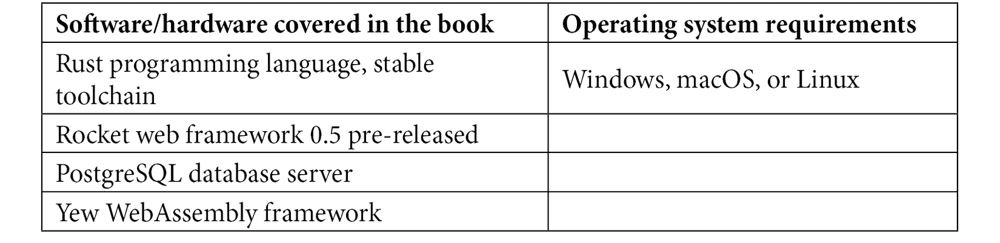

# 前言

Rocket 是 Rust 编程语言中第一个 Web 框架之一。Rocket 提供了构建 Web 应用程序的完整工具，例如请求路由工具、传入请求的强类型以及用于操作传入请求和传出响应的中间件。Rocket 还提供了模板支持和连接到各种数据库的功能。

Rocket 是用 Rust 编程语言编写的 Web 框架。作为较新的编程语言之一，Rust 被设计为性能和安全性高。它易于创建安全、多线程和异步的应用程序。Rust 在工具、文档和社区包方面也有坚实的基础。所有这些优势共同促成了 Rust 在受欢迎程度上的快速增长。

本书探讨了使用 Rocket Web 框架和 Rust 编程语言构建完整 Web 应用程序的过程。您将了解各种构建 Web 应用程序的技术，该应用程序可以处理传入的请求，将数据存储在关系型数据库管理系统（RDBMS）中，并向任何 HTTP 客户端生成适当的响应。

# 本书面向的对象

我们编写这本书是为了帮助那些想学习如何使用 Rocket Web 框架构建 Web 应用程序的软件工程师。虽然不是必需的，但基本了解 Rust 编程语言将有助于您轻松理解所涵盖的主题。

# 本书涵盖的内容

*第一章*，*介绍 Rust 语言*，介绍了 Rust 语言以及构建 Rust 应用程序的工具。

*第二章*，*构建我们的第一个 Rocket Web 应用程序*，指导您创建和配置 Rocket 应用程序。

*第三章*，*火箭请求与响应*，介绍了 Rocket 的路由、请求和响应。

*第四章*，*构建、点燃和发射火箭*，解释了 Rocket 的两个重要组件：状态和整流罩。状态提供可重用的对象，而整流罩充当 Rocket 应用程序的中间件部分。本章还解释了如何将数据库连接到 Rocket 应用程序。

*第五章*，*设计用户生成应用程序*，探讨了设计应用程序的过程，并展示了如何使用 Rust 模块创建更易于管理的 Web 应用程序。

*第六章*，*实现用户 CRUD*，指导您如何在 Rocket Web 应用程序及其背后的数据库中**创建、读取、更新和删除**（**CRUD**）对象。

*第七章*，*在 Rust 和 Rocket 中处理错误*，解释了如何在 Rust 中处理错误，以及我们如何在 Rocket 应用程序中应用错误处理。

*第八章*, *服务静态资源和模板*，展示了如何使用 Rocket 网络应用来服务文件（如 CSS 文件和 JS 文件）。您还将学习如何使用模板为 Rocket 网络应用创建响应。

*第九章*, *显示用户帖子*，指导你了解 Rust 泛型和如何使用泛型来显示不同类型的用户帖子。

*第十章*, *上传和处理帖子*，解释了 Rust 应用程序中的异步编程和多线程，以及如何将这些技术应用于处理 Rocket 网络应用中的用户上传。

*第十一章*, *安全和添加 API 及 JSON*，指导你如何在 Rocket 网络应用中创建身份验证和授权。本章还解释了如何创建 JSON API 端点以及如何使用 JWT 来保护 API 端点。

*第十二章*, *测试您的应用*，介绍了测试 Rust 应用程序以及为 Rocket 网络应用创建端到端测试。

*第十三章*, *启动火箭应用*，解释了如何配置生产服务器以使用 Rocket 网络应用来处理请求。本章还解释了如何使用 Docker 容器化 Rust 应用程序。

*第十四章*, *构建全栈应用*，解释了如何使用 Rust 编程语言构建一个前端 WebAssembly 应用来补充 Rocket 网络应用。

*第十五章*, *改进火箭应用*，解释了如何改进和扩展 Rocket 网络应用。本章还介绍了 Rocket 网络框架的可能的替代方案。

# 为了充分利用这本书

您需要在计算机上安装 Rust 编译器，通过安装 Rustup 和稳定工具链来实现。您可以使用 Linux、macOS 或 Windows。对于 macOS 用户，建议使用 Homebrew。对于 Windows 用户，建议使用 Windows Subsystem for Linux (WSL 或 WSL 2)来安装 Rustup。

本书中的所有代码都在 Arch Linux 和 macOS 上进行了测试，但它们也应该在其他 Linux 发行版或 Windows 操作系统上运行。



由于 Rust 是一种编译型语言，您可能需要在计算机上安装各种开发头文件，例如`libssl-dev`或`libpq-dev`。在编译本书中的代码示例时，请注意错误信息，并在需要的情况下安装适用于您操作系统和开发环境的所需库。

在本书的进一步内容中，在*第十章*，我们将使用`FFmpeg`命令行处理视频。

**如果您正在使用本书的数字版，我们建议您亲自输入代码或从本书的 GitHub 仓库（下一节中提供链接）获取代码。这样做将帮助您避免与代码的复制和粘贴相关的任何潜在错误。**

# 下载示例代码文件

您可以从 GitHub 下载本书的示例代码文件[`github.com/PacktPublishing/Rust-Web-Development-with-Rocket`](https://github.com/PacktPublishing/Rust-Web-Development-with-Rocket)。如果代码有更新，它将在 GitHub 仓库中更新。

我们还有其他来自我们丰富的图书和视频目录的代码包可供选择，这些代码包可在[`github.com/PacktPublishing/`](https://github.com/PacktPublishing/)找到。查看它们吧！

# 下载彩色图像

我们还提供了一份包含本书中使用的截图和图表彩色图像的 PDF 文件。您可以从这里下载：[`packt.link/PUFPv`](https://packt.link/PUFPv)。

# 使用的约定

本书使用了多种文本约定。

`文本中的代码`：表示文本中的代码单词、数据库表名、文件夹名、文件名、文件扩展名、路径名、虚拟 URL、用户输入和 Twitter 昵称。以下是一个示例：“内置数据类型，如`Option`或`Result`，以安全的方式处理类似 null 的行为。”

代码块应如下设置：

```rs
fn main() { 
```

```rs
    println!("Hello World!");
```

```rs
}
```

当我们希望您注意代码块中的特定部分时，相关的行或项目将以粗体显示：

```rs
impl super::Encryptable for Rot13 {
```

```rs
    fn encrypt(&self) -> String {
```

```rs
    }
```

```rs
}
```

任何命令行输入或输出都应如下所示：

```rs
rustup default stable
rustup component add clippy
```

**粗体**：表示新术语、重要单词或屏幕上看到的单词。例如，菜单或对话框中的单词以**粗体**显示。以下是一个示例：“从**管理**面板中选择**系统信息**。”

小贴士或重要提示

看起来是这样的。

# 联系我们

我们欢迎读者的反馈。

**一般反馈**：如果您对本书的任何方面有疑问，请通过电子邮件发送至 customercare@packtpub.com，并在邮件主题中提及书名。

**勘误表**：尽管我们已经尽最大努力确保内容的准确性，但错误仍然可能发生。如果您在这本书中发现了错误，如果您能向我们报告，我们将不胜感激。请访问[www.packtpub.com/support/errata](http://www.packtpub.com/support/errata)并填写表格。

**盗版**：如果您在互联网上以任何形式遇到我们作品的非法副本，如果您能提供位置地址或网站名称，我们将不胜感激。请通过 copyright@packt.com 与我们联系，并提供材料的链接。

**如果您有兴趣成为作者**：如果您在某个主题上具有专业知识，并且您有兴趣撰写或为本书做出贡献，请访问[authors.packtpub.com](http://authors.packtpub.com)。

# 分享您的想法

一旦您阅读了《Rust Web Development with Rocket》，我们非常期待听到您的想法！请[点击此处直接访问此书的亚马逊评论页面](https://packt.link/r/180056130X)并分享您的反馈。

您的评论对我们和科技社区都非常重要，并将帮助我们确保我们提供高质量的内容。
