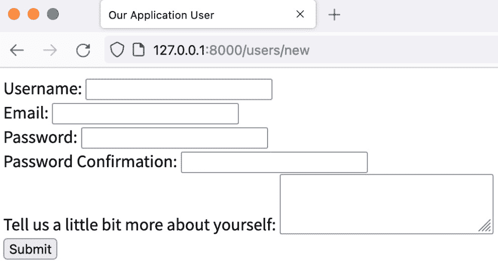
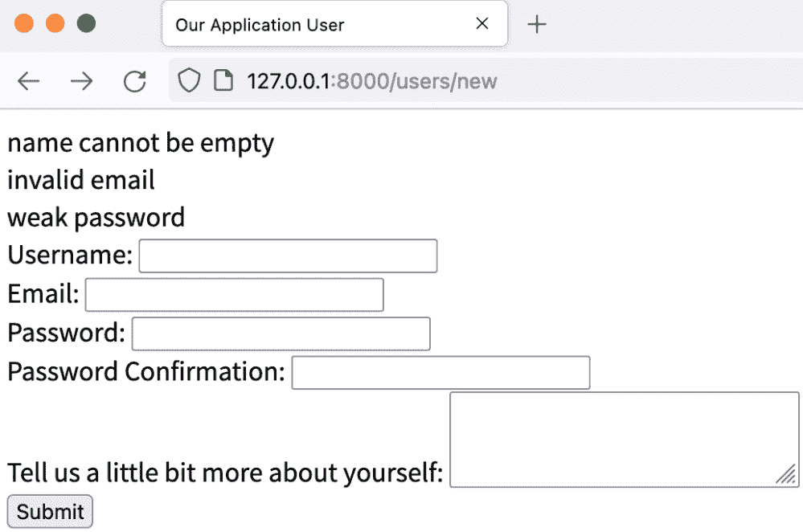
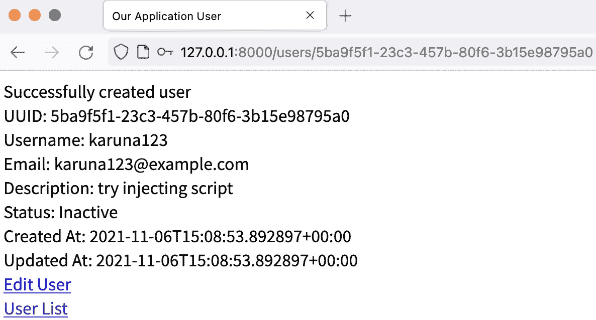

# *第六章*：实现用户 CRUD

在上一章中，我们为应用程序创建了一个大致的轮廓。在本章中，我们将实现管理用户的端点。通过在本章中实现端点，你将了解实体的 HTTP 基本操作，即创建、读取、更新和删除实体。

此外，你还将学习如何构建 HTML 和 HTML 表单，将表单有效负载发送到服务器，验证和清理表单有效负载，散列密码有效负载，并通过将消息重定向到另一个端点来处理失败。

在实现端点的同时，你还将学习如何从数据库中查询单行和多行，以及如何从数据库中插入、更新和删除一行。

在本章中，我们将涵盖以下主要主题：

+   实现 GET 用户

+   实现 GET 用户

+   实现 POST 用户

+   实现 PUT 和 PATCH 用户

+   实现 DELETE 用户

# 技术要求

对于本章，我们与上一章有相同的技术要求。我们需要一个 Rust 编译器、一个文本编辑器、一个 HTTP 客户端和一个 PostgreSQL 数据库服务器。

你可以在这个章节中找到源代码：[`github.com/PacktPublishing/Rust-Web-Development-with-Rocket/tree/main/Chapter06`](https://github.com/PacktPublishing/Rust-Web-Development-with-Rocket/tree/main/Chapter06)。

# 实现 GET 用户

让我们看看实现这一步骤：

1.  我们将从实现`src/routes/user.rs`中的`get_user()`函数的基本知识开始：

    ```rs
    #[get("/users/<_uuid>", format = "text/html")]
    pub async fn get_user(mut _db: Connection<DBConnection>, _uuid: &str) -> HtmlResponse {
        todo!("will implement later")
    }
    ```

在我们实现`get_user()`之前，我们想要准备我们将要使用的其他例程。例如，我们想要返回 HTML，因此我们需要在同一个`src/routes/user.rs`文件中创建一个`const`的`&'static str`，作为我们的 HTML 模板。

1.  我们将创建两个独立的`const`实例，这样我们就可以在 HTML 前缀和后缀之间插入不同的内容：

    ```rs
    const USER_HTML_PREFIX: &str = r#"<!DOCTYPE html>
    <html lang="en">
    <head>
    <meta charset="utf-8" />
    <title>Our Application User</title>
    </head>
    <body>"#;
    const USER_HTML_SUFFIX: &str = r#"</body>
    </html>"#;
    ```

之后，我们将为`User`结构体创建两个方法。第一个是查找数据库服务器中的条目，第二个是为`User`实例创建 HTML 字符串。

1.  在`src/models/user.rs`文件中，向`use`指令中添加以下行：

    ```rs
    use rocket_db_pools::sqlx::{FromRow, PgConnection};
    use std::error::Error;
    ```

1.  然后，为`User`创建一个`impl`块：

    ```rs
    impl User{}
    ```

1.  在块内部，添加`find()`方法：

    ```rs
    pub async fn find(connection: &mut PgConnection, uuid: &str) -> Result<Self, Box<dyn Error>> {
        let parsed_uuid = Uuid::parse_str(uuid)?;
        let query_str = "SELECT * FROM users WHERE uuid = 
        $1";
        Ok(sqlx::query_as::<_, Self>(query_str)
            .bind(parsed_uuid)
            .fetch_one(connection)
            .await?)
    }
    ```

我们之前创建了一个类似的方法。我们首先做的事情是将 UUID（通用唯一标识符）`&str`解析为`Uuid`实例，并使用问号运算符（`?`）快速返回`Box<dyn Error>`。之后，我们定义 SQL 查询字符串`query_str`，最后，我们返回`User`实例。

这里有一点不同，我们传递的是`PgConnection`本身的可变引用，而不是`Connection<DBConnection>`的可变引用。

记得之前，我们使用的是`Connection<DBConnection>`，如下所示：

```rs
pub async fn find(db: &mut Connection<DBConnection>, uuid: &str) -> ... {
    ...
        .fetch_one(&mut *db)
        .await?)
}
```

我们首先使用星号 (`*`) 操作符解引用 `db`。连接实现了 `std::ops::Deref`，其实现公开了新类型 `DBConnection`，这是一个 `sqlx::PgPool` 的包装器，是 `sqlx::Pool<sqlx::Postgres>` 的别名。

`sqlx::Executor` 特性为 `sqlx::PgConnection` 实现，这是一个实现了 `sqlx::Connection` 特性的结构体，代表对数据库的单个连接。`sqlx::Executor` 特性也为 `&sqlx::Pool` 实现，这是一个异步的 SQLx 数据库连接池。

由于各种 `sqlx` 方法（如 `fetch_all`、`fetch_one`、`fetch_many`、`fetch`、`execute` 和 `execute_many`）接受泛型类型 `E`，该类型由 `sqlx::Executor` 特性绑定，因此我们可以使用连接池本身的引用或从池中获取的连接来使用这些方法。

由于 `find()` 方法中的 `OurDateTime` 类型是 `sqlx` 所未知的，因此存在问题。

1.  在 `src/models/our_date_time.rs` 中添加以下指令：

    ```rs
    #[derive(Debug, sqlx::Type)]
    #[sqlx(transparent)]
    pub struct OurDateTime(DateTime<Utc>);
    ```

`transparent` 指令自动生成引用内部类型实现的实现，在我们的例子中是 `DateTime<Utc>`。

1.  除了 `find()` 方法之外，让我们再实现另一个方法，将 `User` 转换为 HTML `String`：

    ```rs
    pub fn to_html_string(&self) -> String {
        format!(
            r#"<div><span class="label">UUID: 
            </span>{uuid}</div>
    <div><span class="label">Username: </span>{username}</div>
    <div><span class="label">Email: </span>{email}</div>
    <div><span class="label">Description: </span>{description}</div>
    <div><span class="label">Status: </span>{status}</div>
    <div><span class="label">Created At: </span>{created_at}</div>
    <div><span class="label">Updated At: </span>{updated_at}</div>"#,
            uuid = self.uuid,
            username = self.username,
            email = self.email,
            description = self.description.as_ref().
            unwrap_or(&String::from("")),
            status = self.status.to_string(),
            created_at = self.created_at.0.to_rfc3339(),
            updated_at = self.updated_at.0.to_rfc3339(),
        )
    }
    ```

1.  由于 `OurDateTime` 成员是私有的，但我们像 `self.created_at.``.to_rfc3339()` 这样访问它，因此在编译时将会产生错误。为了解决这个问题，将 `src/models/our_date_time.rs` 中的 `OurDateTime` 成员转换为公共：

    ```rs
    pub struct OurDateTime(pub DateTime<Utc>);
    ```

我们还需要为 `UserStatus` 实现 `to_string()` 方法。我们可以选择实现 `to_string()`，或者我们可以实现 `std::fmt::Display`，这会自动提供 `to_string()`。作为奖励，使用 `Display` 特性，我们还可以在 `format!("{}", something)` 宏中使用它。

1.  按照以下方式修改 `src/models/user_status.rs`：

    ```rs
    use std::fmt;
    ...
    impl fmt::Display for UserStatus {
        fn fmt(&self, f: &mut fmt::Formatter<'_>) -> 
        fmt::Result {
            match *self {
                UserStatus::Inactive => write!(f, 
               "Inactive"),
                UserStatus::Active => write!(f, "Active"),
            }
        }
    }
    ```

1.  是时候在 `src/routes/user.rs` 中实现 `get_user()` 函数了：

    ```rs
    use rocket::http::Status;
    use rocket::response::content::RawHtml;
    use rocket_db_pools::{sqlx::Acquire, Connection};
    #[get("/users/<uuid>", format = "text/html")]
    pub async fn get_user(mut db: Connection<DBConnection>, uuid: &str) -> HtmlResponse {
        let connection = db
            .acquire()
            .await
            .map_err(|_| Status::InternalServerError)?;
    }
    ```

首先，我们添加所需的 `use` 指令，然后从 `_db` 和 `_uuid` 中移除下划线以标记它们为已使用的变量。然后，我们从数据库连接池中获取单个连接，如果出现问题则返回 `InternalServerError`。

1.  在我们设置连接变量之后，我们可以执行之前定义的 `find()` 方法：

    ```rs
    ...
        let user = User::find(connection, uuid)
            .await
            .map_err(|_| Status::NotFound)?;
    ```

我们只为这种情况公开了一个简单的错误 `NotFound`，但更复杂的应用程序应该适当地处理错误，例如记录错误并返回适当的错误状态和错误消息。

1.  最后，我们可以构建 HTML 字符串并返回它：

    ```rs
    ...
        let mut html_string = String::from(USER_HTML_PREFIX);
        html_string.push_str(&user.to_html_string());
        html_string.push_str(format!(r#"<a href="
        /users/edit/{}">Edit User</a>"#, 
        user.uuid).as_ref());
        html_string.push_str(r#"<a href="/users">User 
        List</a>"#);
        html_string.push_str(USER_HTML_SUFFIX);
        Ok(RawHtml(html_string))
    ```

注意我们添加了两个链接，用于编辑此用户和转到 `/users`。

在下一节中，我们将实现 `get_users()` 函数，以便应用程序可以处理 `/users` 端点。

# 实现 GET 用户

现在，让我们来实现 `get_users()`。以下是对上一章中该函数外观的快速回顾：

```rs
#[get("/users?<_pagination>", format = "text/html")]
```

```rs
pub async fn get_users(
```

```rs
    mut _db: Connection<DBConnection>,
```

```rs
    _pagination: Option<Pagination>,
```

```rs
) -> HtmlResponse {
```

```rs
    todo!("will implement later")
```

```rs
}
```

如前所述，我们应该准备我们将要使用的例程：

1.  在 `src/models/user.rs` 中创建一个名为 `find_all` 的方法，如下所示：

    ```rs
    use super::pagination::{Pagination};
    use crate::fairings::db::DBConnection;
    use rocket_db_pools::Connection;
    use rocket_db_pools::sqlx::{Acquire, FromRow, PgConnection};
    ...
    impl User {
    ...
        pub async fn find_all(
            db: &mut Connection<DBConnection>,
            pagination: Option<Pagination>,
    ) -> Result<(Vec<Self>, Option<Pagination>), 
        Box<dyn Error>> {
            if pagination.is_some() {
    return Self::find_all_with_pagination(db, 
                &(pagination.unwrap())).await;
            } else {
                return Self::find_all_without_
                pagination(db).await;
            }
        }
    }
    ```

`find_all` 函数的参数是 `Connection`，它包含连接池和可选的 `Pagination`。

如果函数执行成功，我们希望返回一个包含 `User` 和 `Pagination` 的向量。我们可以将其作为括号 `()` 中的 *元组* 包装，但是有可能数据库中没有更多的行，所以我们用 `Option` 包装返回的 `Pagination`。然后将其拆分为两个方法以使其更容易阅读：`find_all_without_pagination` 和 `find_all_with_pagination`。

1.  让我们稍微修改一下 `src/models/pagination.rs`，并添加 `DEFAULT_LIMIT` 以限制我们一次想要获取的用户数量：

    ```rs
    pub const DEFAULT_LIMIT: usize = 10;
    ```

1.  我们可以在 `src/models/user.rs` 中创建并实现基例函数 `find_all_without_pagination`：

    ```rs
    use super::pagination::{Pagination, DEFAULT_LIMIT};
    ...
    async fn find_all_without_pagination(db: &mut Connection<DBConnection>) -> Result<(Vec<Self>, Option<Pagination>), Box<dyn Error>> {
        let query_str = "SELECT * FROM users ORDER BY 
        created_at DESC LIMIT $1";
        let connection = db.acquire().await?;
        let users = sqlx::query_as::<_, Self>(query_str)
            .bind(DEFAULT_LIMIT as i32)
            .fetch_all(connection)
            .await?;
    }
    ```

类似于 `find()` 方法，我们定义 `query_str` 并执行查询，然后将 `Vec<User>` 结果绑定到 `users` 变量。但是，为什么这次我们传递的是 `&mut Connection<DBConnection>` 数据库连接池而不是 `&mut PgConnection`？我们先继续函数：

```rs
{
    ...
    let mut new_pagination: Option<Pagination> = None;
    if users.len() == DEFAULT_LIMIT {
        let query_str = "SELECT EXISTS(SELECT 1 FROM 
        users WHERE created_at < $1 ORDER BY 
        created_at DESC LIMIT 1)";
        let connection = db.acquire().await?;
        let exists = sqlx::query_as::<_,
        BoolWrapper>(query_str)
            .bind(&users.last().unwrap().created_at)
            .fetch_one(connection)
            .await?;
        if exists.0 {
            new_pagination = Some(Pagination {
                next: users.last().unwrap().
                created_at.to_owned(),
                limit: DEFAULT_LIMIT,
            });
        }
    }
    Ok((users, new_pagination))
}
```

我们然后准备返回的分页，首先将其设置为 `None`。如果获取的用户等于 `DEFAULT_LIMIT`，则可能存在下一行，所以我们向数据库执行第二次查询。由于我们不能重用单个连接，我们必须再次从数据库池中获取新的连接。这就是为什么我们向 `find_all` 和 `find_all_without_pagination` 传递 `&mut Connection<DBConnection>` 而不是 `&mut PgConnection` 的原因。如果存在下一行，我们可以返回包装在 `Some()` 中的分页。但是，什么是 `BoolWrapper`？我们需要设置一个类型来放置 `"SELECT EXISTS..."` 查询的结果。

1.  在 `src/models/mod.rs` 中添加 `pub mod bool_wrapper;` 并创建一个新文件，`src/models/bool_wrapper.rs`，内容如下：

    ```rs
    use rocket_db_pools::sqlx::FromRow;
    #[derive(FromRow)]
    pub struct BoolWrapper(pub bool);
    ```

不要忘记在 `src/models/user.rs` 中添加 `use super::bool_wrapper::BoolWrapper;`。

1.  现在，是时候实现 `find_all_with_pagination` 了：

    ```rs
    async fn find_all_with_pagination(db: &mut Connection<DBConnection>, pagination: &Pagination) -> Result<(Vec<Self>, Option<Pagination>), Box<dyn Error>> {
        let query_str =
            "SELECT * FROM users WHERE created_at < $1 
             ORDER BY created_at DESC LIMIT 
    2";
        let connection = db.acquire().await?;
        let users = sqlx::query_as::<_, Self>(query_str)
            .bind(&pagination.next)
            .bind(DEFAULT_LIMIT as i32)
            .fetch_all(connection)
            .await?;
        let mut new_pagination: Option<Pagination> = None;
        if users.len() == DEFAULT_LIMIT {
            let query_str = "SELECT EXISTS(SELECT 1 FROM 
            users WHERE created_at < $1 ORDER BY 
            created_at DESC LIMIT 1)";
            let connection = db.acquire().await?;
            let exists = sqlx::query_as::<_, 
            BoolWrapper>(query_str)
                .bind(&users.last().unwrap().created_at)
                .fetch_one(connection)
                .await?;
            if exists.0 {
                new_pagination = Some(Pagination {
                    next: users.last().unwrap().
                    created_at.to_owned(),
                    limit: DEFAULT_LIMIT,
                });
            }
        }
        Ok((users, new_pagination))
    }
    ```

私有方法与 `find_all_without_pagination` 的工作方式相同，但我们添加了一个 `WHERE` 条件以从某个点开始查询。

1.  现在，是时候实现 `get_users()` 函数了：

    ```rs
    #[get("/users?<pagination>", format = "text/html")]
    pub async fn get_users(mut db: Connection<DBConnection>,
        pagination: Option<Pagination>) -> HtmlResponse {
        let (users, new_pagination) = User::find_all(&mut 
        db, pagination)
            .await
            .map_err(|_| Status::NotFound)?;
    }
    ```

1.  在我们获取 `users` 和 `new_pagination` 之后，我们可以构建返回值的 HTML：

    ```rs
    ...
    let mut html_string = String::from(USER_HTML_PREFIX);
    for user in users.iter() {
        html_string.push_str(&user.to_html_string());
        html_string
            .push_str(format!(r#"<a href="/users/{}">See 
             User</a><br/>"#, user.uuid).as_ref());
        html_string.push_str(
            format!(r#"<a href="/users/edit/{}">Edit 
            User</a><br/>"#, user.uuid).as_ref(),
        );
    }
    ```

1.  如果我们有 `new_pagination`，则添加指向下一页的链接：

    ```rs
    if let Some(pg) = new_pagination {
        html_string.push_str(
            format!(
                r#"<a href="/users?pagination.next={}&
                pagination.limit={}">Next</a><br/>"#,
                &(pg.next.0).timestamp_nanos(),
                &pg.limit,
            )
            .as_ref(),
        );
    }
    ```

注意我们使用 `timestamp_nanos()` 将时间转换为 `i64` 以使其在 HTML 中更容易传输。

1.  为了最终化函数，添加以下行：

    ```rs
    html_string.push_str(r#"<a href="/users/new">New user</a>"#);
    html_string.push_str(USER_HTML_SUFFIX);
    Ok(RawHtml(html_string))
    ```

1.  现在，我们必须为 `OurDateTime` 实现 `FromFormField`，因为我们正在分页中使用 `OurDateTime`。在 `src/models/our_date_time.rs` 中添加所需的 `use` 指令：

    ```rs
    use chrono::{offset::Utc, DateTime, TimeZone};
    use rocket::data::ToByteUnit;
    ```

1.  因为我们在 `User` 实现内部克隆 `OurDateTime` (`users.last().unwrap().created_at` 克隆 `OurDateTime`：

    ```rs
    #[derive(Debug, sqlx::Type, Clone)]
    ```

1.  对于 `from_value` 实现，我们只是从请求参数中解析 `i64` 并将其转换为 `OurDateTime` 对象：

    ```rs
     impl<'r> FromFormField<'r> for OurDateTime {
        fn from_value(field: ValueField<'r>) -> form::
        Result<'r, Self> {
            let timestamp = field.value.parse::<i64>()?;
            Ok(OurDateTime(
            Utc.timestamp_nanos(timestamp)))
        }
        ...
    }
    ```

1.  但是，对于`from_data`，我们不得不更加参与其中，因为我们必须将请求转换为`bytes`，然后再将其转换回`&str`，最后转换为`i64`。首先，我们获取表单的 Rocket 限制：

    ```rs
    async fn from_data(field: DataField<'r, '_>) -> form::Result<'r, Self> {
        let limit = field
            .request
            .limits()
            .get("form")
            .unwrap_or_else(|| 8.kibibytes());
        ...
    }
    ```

1.  然后，从请求中获取`bytes`：

    ```rs
    let bytes = field.data.open(limit).into_bytes().await?;
    if !bytes.is_complete() {
        return Err((None, Some(limit)).into());
    }
    let bytes = bytes.into_inner();
    ```

1.  最后，我们将`bytes`转换为`&str`，将其解析为`i64`，并转换为`OurDateTime`：

    ```rs
    let time_string = std::str::from_utf8(&bytes)?;
    let timestamp = time_string.parse::<i64>()?;
    Ok(OurDateTime(Utc.timestamp_nanos(timestamp)))
    ```

现在，`get_user`和`get_users`已经准备好了，但我们还没有任何数据。在下一节中，我们将实现`new_user`和`create_user`函数，这样我们就可以通过 HTML 表单插入用户数据。

# 实现 POST 用户

要创建用户，我们将使用`new_user`和`create_user`函数。`new_user()`函数相对容易实现；我们只需要提供一个带有用户填写表单的 HTML 页面。

让我们看看步骤：

1.  在`src/routes/user.rs`中实现`new_user()`函数：

    ```rs
    #[get("/users/new", format = "text/html")]
    pub async fn new_user() -> HtmlResponse {
        let mut html_string = String::from(USER_HTML_
        PREFIX);
        html_string.push_str(
            r#"<form accept-charset="UTF-8" action="/
            users" autocomplete="off" method="POST">
        <div>
            <label for="username">Username:</label>
            <input name="username" type="text"/>
        </div>
        <div>
            <label for="email">Email:</label>
            <input name="email" type="email"/>
        </div>
        <div>
            <label for="password">Password:</label>
            <input name="password" type="password"/>
        </div>
        <div>
            <label for="password_confirmation">Password 
            Confirmation:</label>
            <input name="password_confirmation" 
            type="password"/>
        </div>
        <div>
            <label for="description">Tell us a little bit 
            more about yourself:</label>
            <textarea name="description"></textarea>
        </div>
        <button type="submit" value="Submit">Submit</
         button>
    </form>"#,
        );
        html_string.push_str(USER_HTML_SUFFIX);
        Ok(RawHtml(html_string))
    }
    ```

在 HTML 中，我们将`form`标签的`action`属性设置为`"/users"`，将`method`属性设置为`"POST"`。这对应于我们应用程序中的`create_user`路由。在 HTML 页面上，我们有`username`、`email`、`password`、`password_confirmation`和`description`字段。然后我们插入提交按钮，并将`html_string`服务给客户端应用程序。

1.  现在尝试运行应用程序，并在网页浏览器中打开`http://127.0.0.1:8000/users/new`。最后，我们有了可以在浏览器中渲染的内容：



图 6.1 - 新用户页面

1.  如前所述，在实现`create_user()`函数之前，我们首先想要创建其他例程。由于 HTML 表单与`User`结构体没有一对一的映射，我们创建另一个结构体。将此结构体放在`src/models/user.rs`中：

    ```rs
    #[derive(Debug, FromForm)]
    pub struct NewUser<'r> {
        #[field(validate = len(5..20).or_else(msg!("name 
        cannot be empty")))]
        pub username: &'r str,
        pub email: &'r str,
        pub password: &'r str,
        #[field(validate = eq(self.password).or_
        else(msg!("password confirmation mismatch")))]
        pub password_confirmation: &'r str,
        #[field(default = "")]
        pub description: Option<&'r str>,
    }
    ```

我们为`NewUser`设置`derive` `FromForm`特质，因此我们可以在结构体字段之上使用`field`指令。此指令可以用来匹配请求负载字段名称与结构体字段名称，设置默认值，并验证字段内容。

如果 HTML 表单字段与结构体字段名称不同，我们可以使用字段指令进行重命名，如下所示：

```rs
#[field(name = uncased("html-field-name"))]
```

它也可以这样做：

```rs
#[field(name = "some-other-name")]
```

如果你使用 uncased 宏，那么包含任何大小写（例如`HTML-FIELD-NAME`）的负载 HTML 字段名称将与结构体字段名称匹配。

对于设置默认值，语法如下：

```rs
#[field(default = "default value")]
```

对于验证，语法如下：

```rs
#[field(validate = validation_function())]
```

在`rocket::form::validate`模块中，有几个内置的验证函数：

+   `contains`：当字段作为字符串包含此子字符串，或者字段作为`Vec`包含此项目，或者`Option`有`Some(value)`，或者`rocket::form::Result`有`Ok(value)`时，此函数成功——例如，`contains("foo")`。

+   `eq`：当字段值等于函数参数时，此函数成功。在 Rust 中，如果类型实现了`std::cmp::PartialEq`，则类型可以进行比较。你可以在`NewUser`结构体中看到示例，`eq(self.password)`。

+   `ext`: 如果字段类型是 `rocket::fs::TempFile` 并且内容类型与函数参数匹配（例如，`ext(rocket::http::ContentType::JavaScript)`），则此函数成功。

+   `len`: 此函数在字段值的长度在参数范围内时成功。您可以在我们的 `NewUser` 结构体中看到示例，`len(5..20)`。在 Rust 中，我们定义范围为 `from..to`，但我们可以省略 `to` 部分。

+   `ne`: 如果字段值不等于提供的参数（`!=`），则此函数成功。实现 `std::cmp::PartialEq` 特性的类型也可以使用不等式运算符。

+   `omits`: 此函数是 `contains` 的反函数。

+   `one_of`: 如果值包含提供的参数中的任何一个项目，则此函数成功。参数必须是一个迭代器。

+   `range`: 此函数类似于 `len`，但它匹配字段值而不是字段长度的值。

+   `with`: 我们可以传递一个具有布尔返回类型的函数或闭包，并且当传递的函数或闭包返回 `true` 时，函数成功。

除了这些函数外，还有三个更多函数我们可以使用。这些函数几乎以相同的方式工作，但消息不同：

+   `dbg_contains`: 此函数也在错误消息中返回字段值。

+   `dbg_eq`: 此函数也在错误消息中返回项目值。

+   `dbg_omits`: 此函数也在错误消息中返回项目值。

在 `NewUser` 结构体中，我们可以看到我们还可以通过将验证函数与 `.or_else("other message"`) 结合来设置自定义错误消息，如下例所示：

```rs
#[field(validate = len(5..20).or_else(msg!("name cannot be empty")))]
```

除了提供的函数外，我们还可以创建一个自定义验证函数。该函数应返回 `form::Result<'_, ()>`。我们希望实现自定义验证来检查密码强度和电子邮件的正确性。

第一项验证是密码验证。我们将使用一个名为 `zxcvbn` 的 crate。这个 crate 是 Dropbox 创建的同名 `npm` 模块的 Rust 版本。`zxcvbn` 库的灵感基于一个 `"CorrectHorseBatteryStaple"`，与一些规则（如“必须包含至少八个字符，其中一个是大写字母，一个是小写字母，一个是数字”）相比，更容易记住且更难破解。

1.  将 `zxcvbn = "2"` 添加到 `Cargo.toml` 依赖项中，然后在 `src/models/user.rs` 中创建以下函数：

    ```rs
    use rocket::form::{self, Error as FormError, FromForm};
    use zxcvbn::zxcvbn;
    ...
    fn validate_password(password: &str) -> form::Result<'_, ()> {
        let entropy = zxcvbn(password, &[]);
        if entropy.is_err() || entropy.unwrap().score()
        < 3 {
            return Err(FormError::validation("weak 
            password").into());
        }
        Ok(())
    }
    ```

您可以将评分强度设置为最高四分，但这意味着我们无法将弱密码发送到服务器。目前，我们只是将密码评分阈设置为二。

1.  之后，我们可以实现电子邮件正确性的验证。首先，将 `regex = "1.5.4"` 添加到 `Cargo.toml` 并在 `src/models/user.rs` 中添加此函数：

    ```rs
    use regex::Regex;
    ...
    fn validate_email(email: &str) -> form::Result<'_, ()> {
        const EMAIL_REGEX: &str = r#"(?:[a-z0-9!#$%&
        '*+/=?^_`{|}~-]+(?:\.[a-z0-9!#$%&'*+/=?^_`{|}~-]
        +)*|"(?:[\x01-\x08\x0b\x0c\x0e-\x1f\x21\
        x23-\x5b\x5d-\x7f]|\\[\x01-\x09\x0b\x0c\
        x0e-\x7f])*")@(?:(?:a-z0-9?\.)+a-z0-9?|\[(?:(?:25[0-5]|2[0-4][0-9]|[01]?[0-9][
        0-9]?)\.){3}(?:25[0-5]|2[0-4][0-9]|[01]?[0-9][
        0-9]?|[a-z0-9-]*[a-z0-9]:(?:[\x01-\x08
        \x0b\x0c\x0e-\x1f\x21-\x5a\x53-\x7f]|\\[\x01
        -\x09\x0b\x0c\x0e-\x7f])+)\])"#;
        let email_regex = Regex::new(EMAIL_REGEX).
        unwrap();
        if !email_regex.is_match(email) {
            return Err(FormError::validation("invalid 
            email").into());
        }
        Ok(())
    }
    ```

1.  如果 `NewUser` 结构体的电子邮件：

    ```rs
    pub struct NewUser<'r> {
        ...
        #[field(validate = validate_email().
        or_else(msg!("invalid email")))]
        pub email: &'r str,
        #[field(validate = validate_password()
        .or_else(msg!("weak password")))]
        pub password: &'r str,
        ...
    }
    ```

1.  接下来，我们可以为`User`结构体实现`create()`方法。出于安全考虑，我们将使用安全的密码散列函数来散列密码。在 2021 年，人们认为`md5`是一个非常不安全的散列函数，而`sha1`和`sha3`也被认为是不安全的散列函数，所以我们不会使用这些函数。人们通常考虑使用`bcrypt`、`scrypt`或`argon2`。现在，`argon2`有一个版本，`argon2id`，它对旁路攻击和 GPU 破解攻击具有抵抗力，所以我们将使用`argon2`作为密码散列实现。

`create()`方法还存在另一种可能的攻击：将`"<script>console.log("hack")</script>"`作为描述。我们可以通过使用名为`ammonia`的 HTML 清理库来解决这个问题。

要为`create()`方法添加`argon2`和`ammonia`，请在`Cargo.toml`中添加以下行：

```rs
ammonia = "3.1.2"
argon2 = "0.3"
rand_core = {version = "0.6", features = ["std"]}
```

1.  我们可以在`src/models/mod.rs`中创建一个用于清理 HTML 的函数：

    ```rs
    use ammonia::Builder;
    use std::collections::hash_set::HashSet;
    pub fn clean_html(src: &str) -> String {
        Builder::default()
            .tags(HashSet::new())
            .clean(src)
            .to_string()
    }
    ```

来自`ammonia::Builder::default`的默认清理器允许许多 HTML 标签，人们仍然可以破坏网站。为了解决这个问题，我们传递一个空的`HashSet`来禁止任何 HTML 标签。

1.  在密码散列和 HTML 清理就绪后，是时候为`User`结构体实现`create()`方法了。在`src/models/user.rs`中添加所需的`use`指令：

    ```rs
    use super::clean_html;
    use argon2::{password_hash::{rand_core::OsRng, PasswordHasher, SaltString},Argon2};
    ```

1.  将以下行放入`impl User`块中：

    ```rs
    pub async fn create<'r>(
        connection: &mut PgConnection,
        new_user: &'r NewUser<'r>,
    ) -> Result<Self, Box<dyn Error>> {
        let uuid = Uuid::new_v4();
        let username = &(clean_html(new_user.username));
        let description = &(new_user.description.map(
        |desc| clean_html(desc)));
    }
    ```

我们为新的`User`实例生成一个新的 UUID。之后，我们清理用户名值和描述值。我们不清理电子邮件和密码，因为我们已经使用正则表达式验证了电子邮件的内容，并且我们不会在 HTML 中显示任何密码。

1.  接下来，添加以下行以散列密码：

    ```rs
    let salt = SaltString::generate(&mut OsRng);
    let argon2 = Argon2::default();
    let password_hash = argon2.hash_password(new_user.password.as_bytes(), &salt);
    if password_hash.is_err() {
        return Err("cannot create password hash".into());
    }
    ```

1.  接下来，我们向我们的数据库服务器发送`INSERT`语句并返回插入的行。添加以下行：

    ```rs
    let query_str = r#"INSERT INTO users
    (uuid, username, email, password_hash, description, status)
    VALUES
    ($1, $2, $3, $4, $5, $6)
    RETURNING *"#;
    Ok(sqlx::query_as::<_, Self>(query_str)
        .bind(uuid)
        .bind(username)
        .bind(new_user.email)
        .bind(password_hash.unwrap().to_string())
        .bind(description)
        .bind(UserStatus::Inactive)
        .fetch_one(connection)
        .await?)
    ```

1.  当`User::create()`方法就绪时，我们可以实现`create_user()`函数。当应用程序成功创建用户时，最好通过重定向到`get_user`来显示结果。为此，我们可以使用`rocket::response::Redirect`类型而不是`RawHtml`。

此外，如果存在错误，最好重定向到`new_user()`并显示错误，以便用户可以修复输入错误。我们可以通过获取`NewUser`验证的错误或任何其他错误，并将带有嵌入式错误信息的重定向到`new_user()`函数来实现这一点。

我们可以使用`rocket::form::Contextual`来获取请求表单值的错误，它是包含错误信息的表单类型的代理。我们还将使用`rocket::response::Flash`向网络浏览器发送一次性 cookie，并使用`rocket::request::FlashMessage`在路由上检索消息。将这些行添加到`src/routes/user.rs`中：

```rs
use crate::models::{pagination::Pagination, user::{NewUser, User}};
use rocket::form::{Contextual, Form};
use rocket::request::FlashMessage;
use rocket::response::{content::RawHtml, Flash, Redirect};
```

1.  将`create_user()`函数的签名更改为以下内容：

    ```rs
    #[post("/users", format = "application/x-www-form-urlencoded", data = "<user_context>")]
    pub async fn create_user<'r>(
        mut db: Connection<DBConnection>,
        user_context: Form<Contextual<'r, NewUser<'r>>>,
    ) -> Result<Flash<Redirect>, Flash<Redirect>> {}
    ```

由于我们正在发送`POST`数据，浏览器将发送`Content-Type`为`"application/x-www-form-urlencoded"`，因此我们必须相应地更改格式。

此外，查看请求参数；我们不是插入`Form<NewUser<'r>>`，而是在参数中间插入`Contextual`类型。我们还更改了返回值，将其更改为`Result<Flash<Redirect>, Flash<Redirect>>`。

1.  现在，让我们实现函数体。将以下行添加到函数体中：

    ```rs
    if user_context.value.is_none() {
        let error_message = format!(
            "<div>{}</div>",
            user_context
                .context
                .errors()
                .map(|e| e.to_string())
                .collect::<Vec<_>>()
                .join("<br/>")
        );
        return Err(Flash::error(Redirect::to("/
        users/new"), error_message));
    }
    ```

如果`user_context`有`value`，这意味着 Rocket 成功转换了请求有效负载并将其放入`value`属性中。我们分支并返回带有`Flash`消息和`Redirect`指令的`Error`到`"/users/new"`。

1.  下一个实现是如果 Rocket 成功解析`NewUser`。在`true`分支中添加以下行：

    ```rs
    let new_user = user_context.value.as_ref().unwrap();
    let connection = db.acquire().await.map_err(|_| {
        Flash::error(
            Redirect::to("/users/new"),
            "<div>Something went wrong when creating 
             user</div>",
        )
    })?;
    let user = User::create(connection, new_user).await.map_err(|_| {
        Flash::error(
            Redirect::to("/users/new"),
            "<div>Something went wrong when creating 
            user</div>",
        )
    })?;
    Ok(Flash::success(
        Redirect::to(format!("/users/{}", user.uuid)),
        "<div>Successfully created user</div>",
    ))
    ```

就像`get_user()`函数一样，我们创建一个例程来获取数据库连接，对数据库服务器执行`INSERT`操作，并生成成功的`Redirect`响应。但是，当发生错误时，我们不是返回 HTML，而是生成带有适当路径和消息的`Redirect`指令。

1.  我们现在需要更改`new_user()`和`get_user()`函数，以便能够处理传入的`FlashMessage`请求守卫。首先，对于`new_user()`函数，将签名更改为以下形式：

    ```rs
    get_user(
        mut db: Connection<DBConnection>,
        uuid: &str,
        flash: Option<FlashMessage<'_>>,
    )
    ```

1.  因为闪存消息可能并不总是存在，所以我们将其包裹在`Option`中。在`let mut html_string = String::from(USER_HTML_PREFIX);`之后，在函数体中添加以下行：

    ```rs
    if flash.is_some() {
        html_string.push_str(flash.unwrap().message());
    }
    ```

1.  我们几乎以相同的方式修改了`new_user()`函数。将函数签名更改为以下形式：

    ```rs
    new_user(flash: Option<FlashMessage<'_>>)
    ```

然后，在`USER_HTML_PREFIX`之后添加以下行：

```rs
if flash.is_some() {
    html_string.push_str(flash.unwrap().message());
}
```

1.  现在，是时候尝试创建用户数据了。如果一切正确，你应该看到以下屏幕。错误消息如下：



![img/Figure_6.2_B16825.jpg]

图 6.2 - 失败时的错误消息

成功消息如下所示：




图 6.3 - 成功消息

在接下来的章节中，我们将继续更新用户和删除用户。

# 实现 PUT 和 PATCH 用户

要更新用户，我们需要一个像`new_user()`这样的页面，但我们希望表单预先填充现有数据。我们还想为用户添加一个字段来确认旧密码。让我们看看步骤：

1.  将`edit_user()`函数签名更改为以下形式：

    ```rs
    #[get("/users/edit/<uuid>", format = "text/html")]
    pub async fn edit_user(mut db: Connection<DBConnection>,    uuid: &str, flash: Option<FlashMessage<'_>>) -> HtmlResponse {}
    ```

1.  要获取现有用户，在函数体块内部添加以下行：

    ```rs
    let connection = db
        .acquire()
        .await
        .map_err(|_| Status::InternalServerError)?;
    let user = User::find(connection, uuid)
        .await
        .map_err(|_| Status::NotFound)?;
    ```

1.  之后，我们可以添加 HTML，例如`new_user()`，但这次，我们还包含了用户现有的数据。在`edit_user()`函数体内部添加以下行：

    ```rs
    let mut html_string = String::from(USER_HTML_PREFIX);
    if flash.is_some() {
        html_string.push_str(flash.unwrap().message());
    }
    html_string.push_str(
        format!(
            r#"<form accept-charset="UTF-8" action="/
            users/{}" autocomplete="off" method="POST">
    <input type="hidden" name="_METHOD" value="PUT"/>
    <div>
        <label for="username">Username:</label>
        <input name="username" type="text" value="{}"/>
    </div>
    <div>
        <label for="email">Email:</label>
        <input name="email" type="email" value="{}"/>
    </div>
    <div>
        <label for="old_password">Old password:</label>
        <input name="old_password" type="password"/>
    </div>
    <div>
        <label for="password">New password:</label>
        <input name="password" type="password"/>
    </div>
    <div>
        <label for="password_confirmation">Password 
        Confirmation:</label>
        <input name="password_confirmation" type=
        "password"/>
    </div>
    <div>
        <label for="description">Tell us a little bit more 
        about yourself:</label>
        <textarea name="description">{}</textarea>
    </div>
    <button type="submit" value="Submit">Submit</button>
    </form>"#,
            &user.uuid,
            &user.username,
            &user.email,
            &user.description.unwrap_or_else(|| 
            "".to_string()),
        )
        .as_ref(),
    );
    html_string.push_str(USER_HTML_SUFFIX);
    Ok(RawHtml(html_string))
    ```

在此之后，我们之前在之前的页面中实现的指向`"/users/edit/{}"`的所有先前链接都应该正常工作。

如果你查看代码，我们会看到表单的`method`属性具有`"POST"`值。原因是 HTML 标准表示表单方法只能是`GET`或`POST`。大多数网络浏览器会将无效的方法，如`PUT`和`PATCH`，更改为`POST`。

一些 Web 框架通过发送一个包含隐藏值在请求有效负载中的`POST`请求来绕过这个限制。我们将使用第二种方式通过添加一个新字段`name="_METHOD"`并赋予其`"PUT"`值来实现更新用户的实现。

就像`create_user()`一样，我们希望在出现错误时执行`update_function()`以重定向到`edit_user()`，同样在成功更新用户后，我们也想执行`update_function()`以重定向到用户页面。

由于我们正在添加新的有效负载，`_METHOD`和`old_password`，我们需要一个与`NewUser`不同的新类型：

1.  在`src/models/user.rs`中创建一个名为`EditedUser`的新结构体：

    ```rs
    #[derive(Debug, FromForm)]
    pub struct EditedUser<'r> {
        #[field(name = "_METHOD")]
        pub method: &'r str,
        #[field(validate = len(5..20).or_else(msg!("name 
        cannot be empty")))]
        pub username: &'r str,
        #[field(validate = validate_email()
        .or_else(msg!("invalid email")))]
        pub email: &'r str,
        pub old_password: &'r str,
        pub password: &'r str,
        pub password_confirmation: &'r str,
        #[field(default = "")]
        pub description: Option<&'r str>,
    }
    ```

1.  如果`old_password`中没有值，我们希望跳过更新密码，但如果`old_password`中有值，我们想确保密码强度足够且`password_confirmation`的内容与密码相同。在`src/models/user.rs`中创建一个函数：

    ```rs
    fn skip_validate_password<'v>(password: &'v str, old_password: &'v str, password_confirmation: &'v str) -> form::Result<'v, ()> {
        if old_password.is_empty() {
            return Ok(());
        }
        validate_password(password)?;
        if password.ne(password_confirmation) {
            return Err(FormError::validation("password 
            confirmation mismatch").into());
        }
        Ok(())
    }
    ```

1.  然后，使用密码字段上方的指令中的验证函数：

    ```rs
    #[field(validate = skip_validate_password(self.old_password, self.password_confirmation))]
    pub password: &'r str,
    ```

我们需要一个方法让`User`根据`EditedUser`的内容更新数据库行。此方法还将验证`old_password`的哈希值以确保`EditedUser`有效。

1.  在`src/models/user.rs`中添加`use`指令：

    ```rs
    use argon2::{password_hash::{rand_core::OsRng, PasswordHash, PasswordHasher, PasswordVerifier, SaltString}, Argon2};
    use chrono::offset::Utc;
    ```

1.  在`src/models/user.rs`中的`impl User`块内部创建一个新方法：

    ```rs
    pub async fn update<'r>(db: &mut Connection<DBConnection>, uuid: &'r str, user: &'r EditedUser<'r>) -> Result<Self, Box<dyn Error>> {}
    ```

1.  在方法内部，从数据库中获取旧用户数据：

    ```rs
    let connection = db.acquire().await?;
    let old_user = Self::find(connection, uuid).await?;
    ```

1.  准备更新数据：

    ```rs
    let now = OurDateTime(Utc::now());
    let username = &(clean_html(user.username));
    let description = &(user.description.map(|desc| clean_html(desc)));
    ```

1.  由于我们可以根据是否有`old_password`来更改密码或跳过更改密码，准备查询项：

    ```rs
    let mut set_strings = vec![
        "username = $1",
        "email = $2",
        "description = $3",
        "updated_at = $4",
    ];
    let mut where_string = "$5";
    let mut password_string = String::new();
    let is_with_password = !user.old_password.is_empty();
    ```

1.  如果我们正在更新`密码`，我们需要验证`old_password`与现有密码是否匹配。我们还想对新的密码进行哈希处理，并将密码添加到`set_strings`中。追加以下行：

    ```rs
    if is_with_password {
        let old_password_hash = PasswordHash::
        new(&old_user.password_hash)
            .map_err(|_| "cannot read password hash")?;
        let argon2 = Argon2::default();
        argon2
            .verify_password(user.password.as_bytes(), 
            &old_password_hash)
            .map_err(|_| "cannot confirm old password")?;
        let salt = SaltString::generate(&mut OsRng);
        let new_hash = argon2
            .hash_password(user.password.as_bytes(), 
            &salt)
            .map_err(|_| "cannot create password hash")?;
        password_string.push_str(
        new_hash.to_string().as_ref());
        set_strings.push("password_hash = $5");
        where_string = "$6";
    }
    ```

1.  然后，构建更新用户的`UPDATE`语句，执行该语句，并返回`User`实例：

    ```rs
    let query_str = format!(
        r#"UPDATE users SET {} WHERE uuid = {} RETURNING 
        *"#,
        set_strings.join(", "),
        where_string,
    );
    let connection = db.acquire().await?;
    let mut binded = sqlx::query_as::<_, Self>(&query_str)
        .bind(username)
        .bind(user.email)
        .bind(description)
        .bind(&now);
    if is_with_password {
        binded = binded.bind(&password_string);
    }
    let parsed_uuid = Uuid::parse_str(uuid)?;
    Ok(binded.bind(parsed_uuid).fetch_one(connection).await?)
    ```

1.  现在，是时候使用`EditedUser`并实现`update_user()`了。在`use`指令中追加`EditedUser`：

    ```rs
    use crate::models::{pagination::Pagination, user::{EditedUser, NewUser, User}};
    ```

1.  在`src/routes/user.rs`中创建`update_user()`函数：

    ```rs
    #[post("/users/<uuid>", format = "application/x-www-form-urlencoded", data = "<user_context>")]
    pub async fn update_user<'r>(db: Connection<DBConnection>, uuid: &str, user_context: Form<Contextual<'r, EditedUser<'r>>>) -> Result<Flash<Redirect>, Flash<Redirect>> {}
    ```

1.  在该函数中，我们需要检查表单是否正确。追加以下行：

    ```rs
    if user_context.value.is_none() {
        let error_message = format!(
            "<div>{}</div>",
            user_context
                .context
                .errors()
                .map(|e| e.to_string())
                .collect::<Vec<_>>()
                .join("<br/>")
        );
        return Err(Flash::error(
            Redirect::to(format!("/users/edit/{}", uuid)),
            error_message,
        ));
    }
    ```

1.  我们可以告诉应用程序根据`"_METHOD"`来处理。追加以下行：

    ```rs
    let user_value = user_context.value.as_ref().unwrap();
    match user_value.method {
        "PUT" => put_user(db, uuid, user_context).await,
        "PATCH" => patch_user(db, uuid, user_
        context).await,
        _ => Err(Flash::error(
            Redirect::to(format!("/users/edit/{}", uuid)),
            "<div>Something went wrong when updating 
            user</div>",
        )),
    }
    ```

我们不会浪费之前定义的函数。我们正在使用`put_user()`和`patch_user()`函数。

1.  现在，是时候实现`put_user()`函数了。更改`put_user()`函数的签名：

    ```rs
    #[put("/users/<uuid>", format = "application/x-www-form-urlencoded", data = "<user_context>")]
    pub async fn put_user<'r>(mut db: Connection<DBConnection>, uuid: &str, user_context: Form<Contextual<'r, EditedUser<'r>>>) -> Result<Flash<Redirect>, Flash<Redirect>> {}
    ```

然后，按照以下方式实现该函数：

```rs
let user_value = user_context.value.as_ref().unwrap();
let user = User::update(&mut db, uuid, user_value).await.map_err(|_| {
    Flash::error(
        Redirect::to(format!("/users/edit/{}", uuid)),
        "<div>Something went wrong when updating 
        user</div>",
    )
})?;
Ok(Flash::success(
    Redirect::to(format!("/users/{}", user.uuid)),
    "<div>Successfully updated user</div>",
))
```

1.  对于`patch_user()`函数，我们可以直接重用`put_user()`函数。编写`patch_user()`的代码：

    ```rs
    #[patch("/users/<uuid>", format = "application/x-www-form-urlencoded", data = "<user_context>")]
    pub async fn patch_user<'r>(db: Connection<DBConnection>, uuid: &str, user_context: Form<Contextual<'r, EditedUser<'r>>>) -> Result<Flash<Redirect>, Flash<Redirect>> {
        put_user(db, uuid, user_context).await
    }
    ```

1.  最后，在`src/main.rs`中追加新的路由：

    ```rs
    user::edit_user,
    user::update_user,
    user::put_user,
    ```

剩下的唯一端点是用于删除用户。让我们在下一节继续讨论。

# 实现 DELETE 用户

删除用户的第一件事是创建一个针对`User`结构体的方法。让我们看看步骤：

1.  在`src/models/user.rs`的`impl User`块中编写删除用户的函数：

    ```rs
    pub async fn destroy(connection: &mut PgConnection, uuid: &str) -> Result<(), Box<dyn Error>> {
        let parsed_uuid = Uuid::parse_str(uuid)?;
        let query_str = "DELETE FROM users WHERE uuid = 
        $1";
        sqlx::query(query_str)
            .bind(parsed_uuid)
            .execute(connection)
            .await?;
        Ok(())
    }
    ```

然后，我们可以在`src/routes/user.rs`中实现`delete_user()`函数：

```rs
#[delete("/users/<uuid>", format = "application/x-www-form-urlencoded")]
pub async fn delete_user(
    mut db: Connection<DBConnection>,
    uuid: &str,
) -> Result<Flash<Redirect>, Flash<Redirect>> {
    let connection = db.acquire().await.map_err(|_| {
        Flash::error(
            Redirect::to("/users"),
            "<div>Something went wrong when deleting 
            user</div>",
        )
    })?;
    User::destroy(connection, uuid).await.map_err(|_| {
        Flash::error(
            Redirect::to("/users"),
            "<div>Something went wrong when deleting 
            user</div>",
        )
    })?;
    Ok(Flash::success(
        Redirect::to("/users"),
        "<div>Successfully deleted user</div>",
    ))
}
```

1.  问题在于 HTML 中的链接和表单都不允许使用`DELETE`方法。我们不能使用链接，因为任何看到它的机器人都会在上面爬行，可能会意外执行资源删除。就像更新用户一样，我们可以使用表单并向新的端点发送`POST`请求。在`src/routes/user.rs`中添加一个新函数：

    ```rs
    #[post("/users/delete/<uuid>", format = "application/x-www-form-urlencoded")]
    pub async fn delete_user_entry_point(
        db: Connection<DBConnection>,
        uuid: &str,
    ) -> Result<Flash<Redirect>, Flash<Redirect>> {
        delete_user(db, uuid).await
    }
    ```

1.  不要忘记在`src/main.rs`中添加路由：

    ```rs
    user::delete_user,
    user::delete_user_entry_point,
    ```

1.  现在，我们可以在哪里创建一个用于删除用户的表单？让我们在`get_user()`页面上做这件事。按照以下方式添加表单的 HTML：

    ```rs
    html_string
        .push_str(format!(r#"<a href="/users/edit/{}">Edit 
        User</a><br/>"#, user.uuid).as_ref());
    html_string.push_str(
        format!(
            r#"<form accept-charset="UTF-8" action="/
            users/delete/{}" autocomplete="off" 
            method="POST"><button type="submit" 
            value="Submit">Delete</button></form>"#,
            user.uuid
        )
        .as_ref(),
    );
    ```

我们现在已经完成了所有用于管理用户的端点。尝试添加用户，看看分页是如何工作的，或者尝试改进 HTML。你还可以尝试激活用户以进行挑战！

# 摘要

在本章中，我们通过实现创建、读取、更新和删除用户路由，学习了用户实体的基本操作。

我们还了解了 Rocket 框架的各个模块，例如 RawHtml、Redirect、Contextual、Flash、Form 和 FlashMessage。

在实现端点的同时，我们还了解了数据库操作，如查询、插入、更新和删除数据库服务器上的对象。

在下一章中，我们将学习更多关于错误处理和创建我们自己的错误类型的内容。
